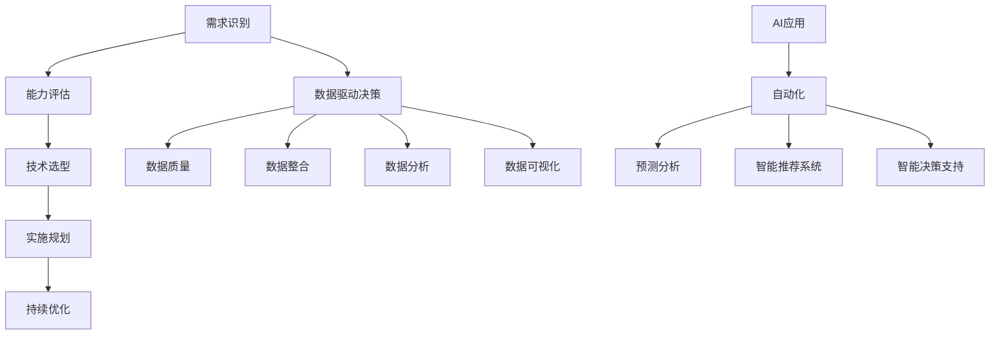

                 

### 引言

#### 书籍背景

在当今全球化和技术驱动的商业环境中，人工智能（AI）已经成为企业竞争的重要工具。企业不仅需要快速适应AI技术的变革，更需要将其融入到日常运营和战略决策中。然而，如何有效地执行AI驱动的企业战略，确保其实现预期的商业价值，成为企业领导者和策略规划者面临的一大挑战。《AI驱动的企业战略执行：智能监控与调整》这本书旨在提供一套系统的方法论，帮助企业理解、应用并优化AI驱动的企业战略。

本书的目标是：
1. 梳理AI技术在企业战略中的角色和作用。
2. 介绍智能监控技术，帮助企业实时跟踪AI战略的执行情况。
3. 提供具体的策略调整方法，帮助企业在面对市场变化时迅速做出反应。
4. 通过实际案例研究，展示AI驱动的企业战略如何在不同行业和规模的企业中成功实施。

#### 目的和结构

本书分为四个主要部分：

1. **引言**：介绍书籍的背景、目的和结构。
2. **AI驱动的企业战略概述**：探讨AI对商业变革的影响，以及AI驱动的企业战略框架。
3. **智能监控技术**：详细介绍智能监控技术的原理、数据收集与预处理方法，以及数据分析与监控系统的构建。
4. **企业战略调整**：讨论如何基于数据分析调整企业战略，并提供实际案例研究。

通过这四个部分，本书将帮助企业全面理解AI驱动的企业战略，并掌握有效的监控和调整方法，确保战略执行的成功。

#### 书籍结构概述

- **第一部分：引言**  
  - 第1章 引言

- **第二部分：AI驱动的企业战略概述**  
  - 第2章 AI驱动的企业战略概述  
  - 第3章 AI驱动的企业战略核心概念

- **第三部分：智能监控技术**  
  - 第4章 智能监控技术概述  
  - 第5章 数据收集与预处理  
  - 第6章 数据分析与监控

- **第四部分：企业战略调整**  
  - 第7章 数据分析与企业战略调整  
  - 第8章 案例研究：AI驱动的企业战略执行实践  
  - 第9章 未来展望

通过以上结构的安排，本书将引导读者逐步深入了解AI驱动的企业战略，从理论到实践，全面掌握相关技能和知识。接下来，我们将深入探讨AI驱动的企业战略的各个方面，为读者提供切实可行的指导和策略。### 文章关键词

1. 人工智能（AI）
2. 企业战略
3. 智能监控
4. 数据分析
5. 战略调整

这些关键词涵盖了本书的核心主题和内容，将帮助读者快速抓住文章的重点和方向。### 文章摘要

《AI驱动的企业战略执行：智能监控与调整》是一本旨在帮助企业理解和实施AI驱动的战略的指南。本书首先介绍了AI在企业中的角色和影响，探讨了AI驱动的企业战略框架，并分析了其核心概念。接着，书中详细阐述了智能监控技术的原理和实施方法，包括数据收集、预处理和数据分析。此外，本书还提供了具体的策略调整方法，并通过实际案例研究，展示了AI驱动的企业战略在不同行业和规模的企业中的成功实践。通过阅读本书，读者将全面掌握AI驱动的企业战略的理论和实践，并能够有效地监控和调整战略，以应对市场变化，实现企业目标。### 第二部分：AI驱动的企业战略概述

#### 第2章 AI驱动的企业战略概述

随着人工智能（AI）技术的飞速发展，越来越多的企业开始认识到其在商业变革中的重要性。AI不仅能够提高效率、降低成本，还能为企业提供新的商业模式和市场机会。在这一章中，我们将深入探讨AI驱动的企业战略的背景、核心概念和实施框架。

##### 2.1 AI与商业变革

AI在商业中的应用场景非常广泛，从简单的自动化任务到复杂的决策支持系统，AI已经渗透到各个行业。例如，在金融行业，AI被用于信用评分、风险管理和投资策略；在零售行业，AI则用于个性化推荐、库存管理和客户服务；在医疗行业，AI被用于疾病诊断、治疗方案优化和医学研究。

AI对商业模式的改变主要体现在以下几个方面：

1. **提高效率**：AI技术可以自动化重复性高、劳动密集型的工作，减少人为错误，提高工作效率。
2. **降低成本**：通过智能优化和资源管理，AI技术能够帮助企业降低运营成本。
3. **增强创新能力**：AI驱动的数据分析和技术创新可以帮助企业在产品研发和市场策略上取得突破。
4. **拓展新市场**：AI可以帮助企业挖掘新的市场机会，开拓新业务领域。

##### 2.2 企业战略框架

企业战略的制定和执行是一个复杂的过程，需要考虑内部资源、外部环境、竞争态势和市场趋势。在引入AI技术后，企业战略框架需要做出相应的调整。以下是AI驱动的企业战略框架的主要组成部分：

1. **愿景和目标**：明确企业长远发展的目标和方向，确保AI技术的应用与企业的愿景和目标保持一致。
2. **使命和价值观**：确立企业使命和价值观，确保AI技术的应用符合企业的价值观和社会责任。
3. **业务模式**：重新评估和优化企业的业务模式，确保AI技术能够带来实际的商业价值。
4. **能力建设**：投资于AI技术的研究和开发，提升企业内部的AI能力和技术水平。
5. **资源配置**：合理配置资源，确保AI技术的实施得到充分的资金、人力和技术支持。
6. **风险评估与控制**：识别AI技术实施过程中可能出现的风险，并制定相应的风险控制措施。

##### 2.3 AI驱动的战略规划

AI驱动的战略规划需要考虑以下几个方面：

1. **数据战略**：确保企业拥有高质量的数据资源，并建立完善的数据管理和分析体系。
2. **技术战略**：选择合适的AI技术，并根据业务需求进行定制化开发和应用。
3. **人才战略**：培养和引进AI专业人才，提升企业的AI能力。
4. **合作伙伴战略**：与AI技术提供商、行业专家和其他企业建立合作关系，共同推进AI技术的应用。
5. **市场战略**：制定针对目标市场的AI解决方案和推广策略，扩大市场份额。

通过上述的AI驱动的企业战略框架和规划，企业可以更好地应对市场变化，提高竞争力，实现可持续发展。

接下来，我们将深入探讨AI驱动的企业战略核心概念，帮助读者更全面地理解AI在企业战略中的实际应用和影响。### 第3章 AI驱动的企业战略核心概念

在深入理解AI驱动的企业战略之前，我们需要明确几个关键概念，这些概念不仅定义了AI技术的基本原理，也揭示了其在企业中的应用方式。以下是一些核心概念，我们将逐一介绍并阐述它们之间的关系架构，以便读者能够形成一个清晰的概念图。

##### 3.1 AI在企业中的应用

1. **自动化**：自动化是AI在企业中最直接的应用方式。通过机器学习和自然语言处理技术，企业可以实现重复性任务的高度自动化，减少人为错误，提高工作效率。例如，在制造业中，自动化机器人可以执行焊接、装配等任务；在客服行业中，聊天机器人可以处理大量客户咨询，提高客户满意度。

2. **预测分析**：预测分析利用历史数据和算法模型，预测未来的趋势和结果。这可以帮助企业做出更准确的决策。例如，零售企业可以通过销售预测模型，提前准备库存，避免库存过剩或缺货。

3. **智能推荐系统**：智能推荐系统利用用户行为数据和机器学习算法，向用户推荐产品或服务。例如，电子商务平台根据用户的历史购买记录和行为数据，推荐可能感兴趣的商品。

4. **智能决策支持**：智能决策支持系统结合数据分析、机器学习和专家知识，为企业的决策过程提供支持和建议。例如，金融机构可以使用智能决策支持系统来评估贷款申请者的信用风险。

##### 3.2 数据驱动决策

数据驱动决策是指企业在决策过程中依赖于数据分析和模型预测，而不是仅仅依靠直觉或经验。以下是数据驱动决策的核心要素：

1. **数据质量**：高质量的数据是数据驱动决策的基础。数据需要准确、完整、及时和可靠。

2. **数据整合**：将来自不同来源的数据整合到一个统一的平台上，以便于分析和管理。

3. **数据分析**：利用统计分析、机器学习等方法，对数据进行处理和分析，提取有价值的信息。

4. **数据可视化**：通过图表和仪表盘，将数据分析结果可视化，帮助决策者快速理解和利用数据。

##### 3.3 AI驱动的战略规划框架

AI驱动的战略规划框架包括以下几个关键步骤：

1. **需求识别**：识别企业内部和外部的需求，确定AI技术在哪些方面可以提供最大的价值。

2. **能力评估**：评估企业现有的AI能力和技术储备，确定需要哪些技术投资和人才引进。

3. **技术选型**：选择合适的AI技术，包括算法、工具和平台，确保其与业务需求相匹配。

4. **实施规划**：制定详细的实施计划，包括时间表、资源分配和风险管理。

5. **持续优化**：在AI技术实施后，持续收集反馈和数据，不断优化模型和算法，提高系统的性能和效果。

##### 3.4 概念实体之间的关系架构

为了更好地理解这些概念之间的关系，我们可以使用Mermaid流程图来展示它们：

该流程图展示了从需求识别到持续优化的整个AI驱动的战略规划过程，以及数据驱动决策、AI应用之间的相互关系。

通过以上介绍，读者可以更全面地了解AI驱动的企业战略核心概念，并理解它们之间的逻辑关系。接下来，我们将继续探讨智能监控技术，帮助企业更好地执行AI驱动的战略。### 第4章 智能监控技术概述

智能监控技术在现代企业运营中扮演着至关重要的角色。它不仅帮助企业实时掌握运营状态，还能通过数据分析提供洞见，帮助做出快速、准确的决策。在这一章中，我们将详细探讨智能监控技术的基本原理、优势与挑战，并介绍其应用场景。

#### 4.1 智能监控技术的基本原理

智能监控技术主要基于以下核心原理：

1. **数据采集**：通过传感器、日志、API等方式收集企业运营过程中的各种数据。
2. **数据处理**：对采集到的数据进行清洗、转换和整合，确保数据的质量和一致性。
3. **实时分析**：利用实时数据处理技术，对数据进行快速分析，提取关键信息。
4. **可视化展示**：通过仪表盘、报表等形式，将分析结果可视化，便于决策者直观理解。

智能监控技术的核心在于实时性和自动化。通过实时数据分析和自动化操作，企业可以迅速应对突发事件，优化运营流程，提高整体效率。

#### 4.2 智能监控技术的优势

智能监控技术为企业带来了诸多优势：

1. **实时监控**：实时监控企业的各项运营指标，确保及时发现问题并进行处理。
2. **自动化操作**：自动化执行监控任务，减少人为干预，提高监控效率。
3. **数据驱动决策**：基于实时数据分析和预测，提供决策支持，提高决策的准确性和效率。
4. **成本优化**：通过监控和优化运营流程，降低成本，提高资源利用率。
5. **风险控制**：及时发现潜在风险，提前采取措施，避免损失。

#### 4.3 智能监控技术的挑战

尽管智能监控技术具有众多优势，但在实际应用中仍面临一些挑战：

1. **数据质量问题**：数据质量是智能监控技术的关键，但企业往往面临数据缺失、数据不一致等问题。
2. **技术复杂度**：智能监控技术涉及多个领域，包括数据采集、数据处理、分析和可视化等，技术复杂度较高。
3. **实时性要求**：实时性是智能监控技术的核心要求，但在大规模数据处理和复杂应用场景中，实现高效实时分析仍是一个挑战。
4. **成本和资源**：智能监控技术的实施和维护需要大量的资金和人力资源。

#### 4.4 智能监控技术的应用场景

智能监控技术在多个行业和领域都有广泛应用：

1. **制造业**：通过监控生产线状态，实时检测产品质量，提高生产效率。
2. **零售业**：通过监控销售数据、库存水平和客户行为，优化库存管理和市场营销策略。
3. **金融行业**：通过监控交易数据、市场波动和客户风险，实时调整投资策略和风险管理。
4. **能源行业**：通过监控能源设备状态、电力需求和能源消耗，优化能源分配和节能减排。
5. **物流和运输**：通过监控运输车辆状态、物流节点和运输路径，提高运输效率和降低成本。

#### 4.5 实际案例分析

以一家制造企业为例，该公司通过部署智能监控系统，实现了生产线的实时监控和优化。以下是一个简单的案例：

1. **数据采集**：传感器实时采集生产线上的各项指标，如温度、压力、振动等。
2. **数据处理**：采集到的数据经过清洗和整合，形成统一的数据格式。
3. **实时分析**：智能监控系统对实时数据进行快速分析，检测生产线的异常状态。
4. **可视化展示**：通过仪表盘，将分析结果可视化，运营人员可以实时了解生产线的运行状态。
5. **自动化操作**：系统自动触发预警和修复措施，如调整设备参数、通知维修人员。

通过这个案例，我们可以看到智能监控技术在实际应用中的效果。它不仅提高了生产效率，降低了成本，还增强了企业的竞争力。

总结来说，智能监控技术是AI驱动的企业战略的重要组成部分。通过实时监控和分析，企业可以更快速地应对市场变化，优化运营流程，实现持续增长。接下来，我们将深入探讨数据收集与预处理的方法，为智能监控系统的构建奠定基础。### 第5章 数据收集与预处理

智能监控技术的有效性在很大程度上依赖于数据收集与预处理的质量。高质量的数据是智能监控系统能够准确分析和预测的前提。在本章中，我们将详细讨论数据收集的来源和类型、预处理方法以及数据质量控制的重要性。

#### 5.1 数据收集的来源和类型

数据收集是企业智能监控系统的基础，其来源和类型多种多样：

1. **内部数据源**：
   - **业务系统数据**：企业内部业务系统（如ERP、CRM、SCM等）生成的数据。
   - **设备传感器数据**：生产设备、服务器、网络设备等传感器收集的数据。
   - **用户行为数据**：客户互动、浏览行为、购买记录等用户行为数据。

2. **外部数据源**：
   - **第三方数据服务**：如天气数据、经济指标、行业报告等。
   - **社交媒体数据**：用户评论、社交媒体活动等。
   - **公共数据集**：如政府公开数据、学术研究数据等。

#### 5.2 数据预处理方法

数据预处理是确保数据质量的关键步骤，包括以下方法：

1. **数据清洗**：
   - **缺失值处理**：对于缺失的数据，可以通过填充（如平均值、中位数）或删除（如果缺失数据太多）进行处理。
   - **异常值处理**：识别并处理异常值，可以通过统计方法（如3σ规则）或专家经验来检测和处理。
   - **重复数据删除**：删除重复的数据记录，确保数据的唯一性。

2. **数据转换**：
   - **数据规范化**：将不同数据类型和单位进行统一，确保数据的一致性和可比性。
   - **数据归一化**：通过缩放或平移，将数据映射到相同的范围内，如0到1或-1到1。

3. **特征工程**：
   - **特征提取**：从原始数据中提取出对分析任务有用的特征。
   - **特征选择**：从提取的特征中筛选出最有用的特征，减少数据的维度。
   - **特征转换**：如将分类特征转换为数值特征，或将文本数据转换为词向量。

#### 5.3 数据质量控制的重要性

数据质量控制是确保智能监控系统有效性的关键。以下是几个关键方面：

1. **准确性**：确保数据是准确的，避免错误和误导性的信息。
2. **完整性**：确保数据是完整的，没有缺失或遗漏。
3. **一致性**：确保数据在不同的时间和地点收集和处理时保持一致性。
4. **时效性**：确保数据是及时的，能够反映当前的状态。

#### 5.4 实际案例分析

以一家零售企业为例，该企业通过以下步骤进行数据收集与预处理：

1. **数据收集**：
   - **内部数据源**：从ERP系统收集销售数据、库存数据；从POS系统收集交易数据。
   - **外部数据源**：从第三方天气服务获取天气数据；从社交媒体平台收集消费者评论。

2. **数据预处理**：
   - **数据清洗**：处理缺失值，如对于缺失的销售记录，用前一个销售记录的平均值进行填充；处理异常值，如发现某个店铺的销售额异常高，进行人工检查。
   - **数据转换**：将不同来源的数据进行统一格式处理，如将时间戳统一为YYYY-MM-DD格式。
   - **特征工程**：提取关键特征，如销售量的月度变化、季节性因素、促销活动的影响等。

3. **数据质量控制**：
   - **准确性**：通过交叉验证和一致性检查，确保数据准确性。
   - **完整性**：定期检查数据完整性，确保没有缺失值。
   - **一致性**：确保不同来源的数据在处理过程中保持一致性。
   - **时效性**：设置数据更新频率，确保数据反映最新的运营状态。

通过这个案例，我们可以看到数据收集与预处理在智能监控系统中的关键作用。它不仅保证了数据的准确性和可靠性，还为后续的智能监控和分析奠定了坚实的基础。接下来，我们将深入探讨数据分析在企业战略中的作用，帮助读者更好地理解智能监控技术的实际应用。### 第6章 数据分析与监控

数据分析在企业战略中扮演着至关重要的角色，它不仅为企业提供了深层次的洞察，还能帮助企业制定更为精准的决策。在这一章中，我们将详细探讨数据分析在企业战略中的作用，介绍智能监控系统的构建，并分析数据监控在企业运营中的关键应用。

#### 6.1 数据分析在企业战略中的作用

数据分析在企业战略中的作用主要体现在以下几个方面：

1. **战略规划**：通过数据分析，企业可以了解市场趋势、客户需求和竞争态势，从而制定更为科学、合理的战略规划。
2. **决策支持**：数据分析为企业提供数据驱动的决策依据，帮助企业在复杂的商业环境中做出更准确、更快速的决策。
3. **运营优化**：通过数据分析，企业可以优化运营流程，提高生产效率，降低成本。
4. **风险管理**：数据分析有助于企业识别潜在风险，提前采取措施，避免损失。
5. **客户洞察**：通过分析客户行为和偏好，企业可以提供更个性化的服务，提升客户满意度和忠诚度。

#### 6.2 智能监控系统的构建

构建智能监控系统是企业实现数据分析的关键步骤。以下是一个典型的智能监控系统构建流程：

1. **需求分析**：明确企业对智能监控系统的需求，包括监控的内容、频率、实时性等。
2. **系统设计**：设计智能监控系统的架构，包括数据采集模块、数据处理模块、分析模块和可视化模块。
3. **数据采集**：利用传感器、日志文件、API接口等方式，采集企业运营过程中的数据。
4. **数据处理**：对采集到的数据进行清洗、转换和整合，确保数据的质量和一致性。
5. **数据分析**：利用统计分析、机器学习等技术，对数据进行深入分析，提取有价值的信息。
6. **可视化展示**：通过仪表盘、报表等形式，将分析结果可视化，便于决策者直观理解。
7. **系统集成**：将智能监控系统与企业现有的业务系统集成，实现数据的无缝流动和共享。

#### 6.3 数据监控在企业运营中的关键应用

数据监控在企业运营中的应用非常广泛，以下是一些关键的应用场景：

1. **生产监控**：通过实时监控生产线上的各项指标，如设备状态、生产进度、质量指标等，企业可以及时发现并解决生产中的问题，提高生产效率。
2. **库存监控**：通过监控库存水平、库存周转率等指标，企业可以优化库存管理，避免库存过剩或缺货，降低运营成本。
3. **销售监控**：通过监控销售数据、客户反馈等指标，企业可以了解市场动态，调整销售策略，提高销售额。
4. **风险管理**：通过监控财务数据、市场波动等指标，企业可以及时识别潜在风险，提前采取应对措施。
5. **员工绩效监控**：通过监控员工的工作表现、绩效指标等，企业可以优化人力资源配置，提高整体运营效率。

#### 6.4 实际案例分析

以一家制造企业为例，该企业通过智能监控系统实现了生产过程的全面监控和优化。以下是一个具体的案例分析：

1. **需求分析**：企业明确了需要监控的内容，包括设备状态、生产进度、质量指标等。
2. **系统设计**：设计了一个包括数据采集、数据处理、分析、可视化的智能监控系统。
3. **数据采集**：通过安装在生产线上的传感器，实时采集设备状态、生产进度等数据。
4. **数据处理**：对采集到的数据进行了清洗、转换和整合，确保数据的质量和一致性。
5. **数据分析**：利用机器学习技术，对生产数据进行实时分析，检测异常状态，提供改进建议。
6. **可视化展示**：通过仪表盘，将分析结果可视化，操作人员可以实时了解生产线的运行状态。
7. **系统集成**：将智能监控系统与企业ERP系统集成，实现了生产数据的实时同步和共享。

通过这个案例，我们可以看到智能监控系统在制造企业中的应用效果。它不仅提高了生产效率，降低了成本，还增强了企业的竞争力。

总结来说，数据分析与监控是AI驱动的企业战略的重要组成部分。通过构建智能监控系统，企业可以实时掌握运营状态，优化决策过程，实现持续增长。接下来，我们将探讨如何基于数据分析调整企业战略，为企业提供更为灵活和有效的运营策略。### 第7章 数据分析与企业战略调整

数据分析在企业战略调整中扮演着至关重要的角色。通过深入分析数据，企业可以识别市场变化、客户需求、运营瓶颈等关键信息，从而做出快速、精准的战略调整。本章将详细介绍基于数据分析的战略调整方法，并通过实际案例，展示如何将数据分析结果转化为具体的调整措施。

#### 7.1 基于数据的战略调整方法

1. **市场趋势分析**：
   - **需求预测**：利用历史销售数据和市场趋势，预测未来市场需求，为产品开发和市场营销提供依据。
   - **竞争分析**：通过监控竞争对手的营销策略、产品动态等，评估企业在市场中的竞争力，制定相应的应对策略。

2. **客户行为分析**：
   - **客户细分**：根据客户购买行为、偏好等特征，将客户进行细分，提供个性化的服务和产品。
   - **忠诚度分析**：通过分析客户的回购率、满意度等指标，识别忠诚客户，制定忠诚度提升策略。

3. **运营优化**：
   - **流程分析**：通过监控运营流程中的各项指标，识别瓶颈和低效环节，进行流程优化。
   - **成本控制**：通过数据分析，识别成本过高的环节，采取措施降低运营成本。

4. **风险管理**：
   - **风险预警**：通过监控关键指标，如财务状况、市场波动等，提前识别潜在风险，制定应对措施。

#### 7.2 实际案例：基于数据分析的战略调整

以一家电子商务公司为例，该公司通过数据分析进行了成功的企业战略调整。

1. **市场趋势分析**：
   - **需求预测**：通过分析历史销售数据和市场趋势，预测未来销售旺季和淡季，调整库存和生产计划，避免库存过剩或缺货。
   - **竞争分析**：监控竞争对手的营销策略和产品价格，调整自身的价格策略和促销活动，提升市场份额。

2. **客户行为分析**：
   - **客户细分**：根据客户购买频率、金额等特征，将客户分为高价值客户、忠诚客户和潜在客户，提供不同的服务和优惠。
   - **忠诚度分析**：通过分析客户的回购率、满意度等指标，识别忠诚客户，提供会员制度、积分奖励等忠诚度提升措施。

3. **运营优化**：
   - **流程分析**：通过监控订单处理时间、物流配送效率等指标，优化订单处理流程，提高客户满意度。
   - **成本控制**：通过分析采购成本、运营成本等指标，识别成本过高的环节，采取供应链优化、自动化等措施降低成本。

4. **风险管理**：
   - **风险预警**：通过监控财务状况、市场波动等指标，提前识别风险，制定应对措施，如调整投资策略、增加风险储备。

通过上述案例，我们可以看到，基于数据分析的战略调整可以帮助企业更好地应对市场变化，优化运营流程，提高竞争力。

#### 7.3 案例研究：企业战略调整的实践

以下是一个案例研究，展示了一家零售企业如何通过数据分析进行战略调整：

1. **背景**：
   - 该零售企业在过去的几年里，市场份额不断下降，运营成本逐年增加，急需通过数据分析进行战略调整。

2. **数据分析**：
   - **销售数据**：通过对销售数据的分析，发现畅销商品和滞销商品，识别市场需求变化。
   - **客户行为**：通过分析客户购买行为和反馈，识别客户偏好和需求，调整产品线和营销策略。
   - **成本结构**：通过分析成本结构，识别成本过高的环节，如库存管理、物流配送等。

3. **战略调整**：
   - **产品调整**：根据销售数据分析，淘汰滞销商品，引入市场需求高的新品，优化产品线。
   - **营销策略**：根据客户行为分析，调整营销策略，提高客户满意度和回购率。
   - **流程优化**：通过流程分析，优化库存管理和物流配送，提高运营效率，降低成本。

4. **效果评估**：
   - 通过半年时间的调整，该零售企业的市场份额逐步回升，运营成本显著降低，销售额和利润率均有明显提升。

通过这个案例，我们可以看到，数据分析在战略调整中的重要作用。它不仅帮助企业识别问题，还能提供具体的解决方案，实现战略调整的成功。

总结来说，基于数据分析的企业战略调整是一种科学、有效的方法。通过深入分析数据，企业可以更好地把握市场动态，优化运营流程，提高竞争力。接下来，我们将通过案例研究，进一步探讨AI驱动的企业战略执行实践。### 第8章 案例研究：AI驱动的企业战略执行实践

在本章中，我们将通过两个具体的案例研究，探讨AI驱动的企业战略在不同行业和规模的企业中的实际应用。通过这些案例，我们将深入分析AI驱动的企业战略如何被制定、执行以及调整，以实现商业目标。

#### 8.1 案例一：行业领先企业的AI战略

**企业背景**：
A公司是一家全球领先的科技公司，专注于软件开发和信息技术服务。该公司在多个行业中都有业务布局，包括金融、医疗、零售等。

**AI驱动的企业战略**：
A公司的AI驱动的企业战略包括以下几个核心要素：

1. **技术投入**：公司大力投资于AI技术的研发，建立了专门的AI研究团队，与顶尖的学术机构和科技公司合作，推动前沿技术的应用。
2. **数据战略**：公司重视数据资源的积累和管理，建立了完善的数据收集、存储和分析体系，确保数据的高质量和实时性。
3. **人才战略**：公司通过内部培训和外部招聘，引进了一批AI和数据分析领域的专业人才，提升企业的AI能力和技术水平。
4. **应用场景**：公司针对不同的业务领域，制定了具体的AI应用场景，如金融风险控制、医疗影像诊断、零售个性化推荐等。

**执行与调整**：
1. **执行过程**：A公司通过实施一系列的AI项目，如智能客服系统、自动化交易系统等，实现了AI技术的实际应用。同时，公司定期评估项目的效果，根据反馈进行调整和优化。
2. **调整方法**：A公司采用数据驱动的决策方式，通过持续的数据分析和监控，识别业务中的问题和机会，及时调整战略和运营策略。

**效果评估**：
通过AI驱动的企业战略，A公司在多个领域实现了显著的商业价值：

- **金融行业**：智能客服系统提高了客户服务质量，降低了运营成本。
- **医疗行业**：AI辅助诊断系统提高了诊断准确率，缩短了诊疗时间。
- **零售行业**：个性化推荐系统提高了销售额，增加了客户满意度。

#### 8.2 案例二：中小企业如何实施AI战略

**企业背景**：
B公司是一家中小型零售企业，专注于本地市场的商品销售。由于市场竞争激烈，B公司急需通过AI技术提升竞争力。

**AI驱动的企业战略**：
B公司的AI驱动的企业战略相对简单，但重点突出：

1. **数据收集**：公司通过会员系统、POS系统等，收集客户购买数据、行为数据等，建立数据仓库。
2. **数据预处理**：公司使用简单有效的数据预处理方法，如缺失值填充、异常值处理等，确保数据质量。
3. **应用场景**：公司重点关注零售行业的几个关键应用场景，如库存管理、销售预测、客户细分等。

**执行与调整**：
1. **执行过程**：B公司首先在库存管理中引入AI算法，通过预测模型优化库存水平。随后，公司扩展到销售预测和客户细分，以提高市场响应速度和客户满意度。
2. **调整方法**：B公司通过定期评估AI应用的效果，根据市场变化和客户反馈，不断优化模型和策略。

**效果评估**：
通过AI驱动的企业战略，B公司实现了以下成果：

- **库存优化**：库存周转率提高，库存成本显著降低。
- **销售预测**：销售预测准确率提高，减少了因缺货或过剩导致的损失。
- **客户细分**：通过精准营销，客户满意度提升，销售额增加。

#### 8.3 案例总结

从上述两个案例中，我们可以总结出以下几点关于AI驱动的企业战略执行的经验：

1. **数据驱动**：无论企业规模大小，数据驱动都是成功实施AI战略的核心。数据质量直接影响AI模型的性能和应用效果。
2. **逐步实施**：中小企业可以逐步引入AI技术，先从简单的应用场景开始，逐步扩展到更复杂的领域。
3. **持续优化**：企业需要持续监控和评估AI应用的效果，根据反馈不断调整模型和策略，确保AI技术的持续价值。
4. **人才支持**：AI技术的成功应用离不开专业人才的支撑。企业需要通过培训和引进，建立专业的AI团队。

通过这些案例研究，我们可以看到，AI驱动的企业战略不仅适用于大型企业，同样适用于中小企业。关键在于如何充分利用AI技术，实现数据驱动，持续优化和调整，以实现企业的商业目标。### 第9章 未来展望

随着人工智能技术的不断进步，AI驱动的企业战略将在未来发挥更加重要的作用。在这一章中，我们将探讨AI驱动的企业战略发展趋势，分析面临的挑战与机遇，并展望其未来发展方向。

#### 9.1 发展趋势

1. **AI技术的普及**：随着AI技术的不断成熟和成本降低，越来越多的企业将采用AI技术，从自动化到智能化，AI将在企业运营的各个方面得到广泛应用。

2. **个性化服务**：通过AI技术，企业可以更好地理解客户需求，提供个性化的产品和服务，从而提升客户满意度和忠诚度。

3. **实时决策支持**：AI驱动的实时数据分析技术将帮助企业在面对市场变化时做出更快速、更准确的决策，提高运营效率。

4. **生态系统构建**：企业将建立更加开放的AI生态系统，与其他企业、研究机构和技术供应商合作，共同推进AI技术的发展和应用。

5. **自主化运营**：随着AI技术的进步，企业将实现更多自主化的运营模式，减少人为干预，提高自动化程度。

#### 9.2 面临的挑战与机遇

1. **技术挑战**：
   - **数据隐私与安全**：随着数据量的增加，如何确保数据隐私和安全成为一个重要挑战。
   - **算法透明性与公平性**：AI算法的透明性和公平性受到广泛关注，如何确保算法的公正性和可解释性是技术发展的重要方向。

2. **经济挑战**：
   - **成本投入**：AI技术的应用需要大量的资金投入，中小企业可能面临资金压力。
   - **人才缺口**：AI技术的应用需要大量的专业人才，但目前人才市场存在较大的缺口。

3. **管理挑战**：
   - **战略调整**：企业需要不断调整战略，以适应AI技术带来的变化。
   - **组织变革**：AI技术的应用可能需要企业进行组织架构和流程的调整，以适应新的工作方式。

4. **机遇**：
   - **市场机会**：AI技术的应用将为企业带来新的市场机会，如新的产品、服务和应用场景。
   - **竞争优势**：通过AI技术，企业可以提高效率、降低成本，从而在激烈的市场竞争中取得优势。

#### 9.3 未来发展方向

1. **跨行业应用**：AI技术将在更多行业中得到应用，如农业、能源、制造等，推动各行各业的数字化转型。

2. **深度学习与强化学习**：随着计算能力的提升，深度学习和强化学习等复杂算法将得到更广泛的应用，为企业提供更强大的决策支持和自动化能力。

3. **边缘计算与云计算**：边缘计算和云计算的结合将使AI技术的实时性和扩展性得到进一步提升，为大规模、复杂的AI应用提供基础设施支持。

4. **人机协同**：AI技术将更紧密地与人类协作，实现人机协同的工作模式，提高工作效率和创造力。

5. **可持续发展**：AI技术将在可持续发展领域发挥重要作用，如智能农业、智慧能源管理、环境保护等。

总结来说，AI驱动的企业战略将在未来继续发展，为企业和行业带来巨大的变革和机遇。企业需要紧跟技术发展趋势，积极应对挑战，抓住机遇，实现持续创新和增长。### 附录A：AI驱动的企业战略执行工具

在本附录中，我们将介绍一些常用的AI驱动的企业战略执行工具，帮助读者了解如何在实际操作中应用这些工具，提高企业战略的执行效率。

#### A.1 常用AI工具介绍

1. **TensorFlow**：
   - **介绍**：TensorFlow是Google开源的机器学习框架，支持各种深度学习和机器学习任务。
   - **应用**：用于构建和训练复杂的神经网络模型，如图像识别、自然语言处理等。

2. **Scikit-learn**：
   - **介绍**：Scikit-learn是一个开源的Python机器学习库，提供各种经典机器学习算法。
   - **应用**：用于数据预处理、模型训练和评估，适用于各种数据分析任务。

3. **Keras**：
   - **介绍**：Keras是一个高层次的神经网络API，支持TensorFlow和Theano等后端。
   - **应用**：简化神经网络模型的构建和训练过程，适合快速原型开发。

4. **PyTorch**：
   - **介绍**：PyTorch是Facebook开源的机器学习库，支持动态计算图和自动微分。
   - **应用**：用于构建复杂的深度学习模型，特别是需要动态计算的应用场景。

5. **Jupyter Notebook**：
   - **介绍**：Jupyter Notebook是一个交互式计算环境，支持多种编程语言，包括Python。
   - **应用**：用于编写、运行和分享代码，适合数据分析和模型训练。

#### A.2 数据分析与监控工具

1. **Pandas**：
   - **介绍**：Pandas是一个Python库，提供数据结构化和操作工具，用于数据处理和分析。
   - **应用**：用于数据清洗、转换和合并，是数据预处理的重要工具。

2. **NumPy**：
   - **介绍**：NumPy是一个Python库，提供高性能的数值计算和数组操作。
   - **应用**：用于数据运算和数学计算，是数据分析和建模的基础。

3. **Matplotlib**：
   - **介绍**：Matplotlib是一个Python库，提供数据可视化工具。
   - **应用**：用于绘制各种类型的图表，帮助理解数据分析结果。

4. **Docker**：
   - **介绍**：Docker是一个容器化平台，用于打包、发布和运行应用。
   - **应用**：用于构建和部署AI模型，确保环境的一致性和可移植性。

5. **Kubernetes**：
   - **介绍**：Kubernetes是一个开源容器编排系统，用于自动化部署、扩展和管理容器化应用。
   - **应用**：用于大规模部署和运维AI应用，提高系统的稳定性和效率。

通过这些工具，企业可以高效地构建、训练和部署AI模型，实现对数据的全面监控和分析。附录中还提供了详细的代码示例和教程，帮助读者更好地掌握这些工具的使用方法。### 附录B：最佳实践 Tips

在实施AI驱动的企业战略时，以下是一些最佳实践 Tips，可以帮助企业更好地利用AI技术，提高战略执行的效率：

1. **确保数据质量**：高质量的数据是AI模型有效性的基础。在数据收集、处理和分析过程中，确保数据的准确性、完整性和一致性。

2. **制定明确的目标**：在引入AI技术之前，明确企业要解决的问题和目标，确保AI技术的应用与企业的战略目标一致。

3. **逐步实施**：对于中小企业，可以采取逐步实施的方法，先从简单的应用场景开始，逐步扩展到更复杂的领域。

4. **人才培训**：加强员工的AI和数据分析培训，提高团队的技术能力和应用水平。

5. **持续优化**：定期评估AI模型和应用的效果，根据反馈进行调整和优化，确保AI技术的持续价值。

6. **合作伙伴选择**：选择合适的合作伙伴，如AI技术提供商、行业专家等，共同推进AI技术的应用。

7. **风险管理**：制定详细的风险管理计划，识别潜在风险，并采取相应的控制措施。

8. **数据安全**：确保数据的安全性和隐私，遵循相关法规和标准，避免数据泄露和滥用。

通过遵循这些最佳实践 Tips，企业可以更有效地实施AI驱动的企业战略，实现商业目标。### 小结

通过本书的阅读，我们系统地了解了AI驱动的企业战略及其在智能监控和调整中的应用。以下是本书的主要内容和核心结论的简要总结：

1. **AI驱动的企业战略背景**：介绍了AI技术对企业战略变革的重要性和应用场景。
2. **AI驱动的企业战略框架**：详细阐述了企业战略规划的核心概念，包括愿景和目标、业务模式、能力建设等。
3. **智能监控技术**：探讨了智能监控技术的原理、优势与挑战，以及其实际应用场景。
4. **数据收集与预处理**：介绍了数据收集的来源和类型，以及预处理方法，确保数据的质量和一致性。
5. **数据分析与监控**：阐述了数据分析在企业战略调整中的关键作用，以及智能监控系统的构建。
6. **案例研究**：通过两个实际案例，展示了AI驱动的企业战略在不同规模和行业的应用和实践。
7. **未来展望**：分析了AI驱动的企业战略发展趋势，面临的挑战与机遇，并展望其未来发展。

**核心结论**：

- AI驱动的企业战略是现代企业竞争的重要工具，通过智能监控和调整，企业可以更快速地适应市场变化，提高运营效率和竞争力。
- 数据驱动是企业成功实施AI战略的关键，确保数据质量、准确性和实时性至关重要。
- 智能监控技术和数据分析工具是实现AI驱动的企业战略的有效手段，企业应积极引入和利用这些工具。
- 持续优化和调整是企业实现AI驱动的企业战略成功的关键，通过不断学习和改进，企业可以不断提升其竞争力。

**未来方向**：

- **深化技术应用**：企业应不断探索和引入最新的AI技术，提升AI模型和应用的效果。
- **加强人才建设**：培养和引进AI和数据分析专业人才，提高团队的技术能力和应用水平。
- **跨行业合作**：与其他企业、研究机构和供应商合作，共同推动AI技术的发展和应用。
- **关注数据安全**：确保数据隐私和安全，遵循相关法规和标准。

通过以上总结和结论，企业可以更好地理解和实施AI驱动的企业战略，为实现长期可持续发展奠定坚实基础。### 注意事项

在实施AI驱动的企业战略时，需要注意以下事项：

1. **数据隐私和安全**：确保收集、处理和分析的数据符合隐私保护法规，避免数据泄露和滥用。
2. **技术选型和投资**：根据企业实际情况和需求，选择合适的AI技术，并合理分配资源，避免过度投资。
3. **人才培养和团队协作**：加强AI和数据分析人才的培养，提高团队的技术能力和协作效率。
4. **风险管理**：制定详细的风险管理计划，识别潜在风险，并采取相应的控制措施。
5. **持续监控与调整**：定期评估AI模型和应用的效果，根据反馈进行调整和优化，确保其持续为企业带来价值。

通过遵循这些注意事项，企业可以更有效地实施AI驱动的企业战略，实现长期可持续发展。### 拓展阅读

为了进一步深化对AI驱动的企业战略的理解，以下是几本推荐的专业书籍和论文，涵盖相关领域的深入研究和最新进展：

1. **《AI赋能：企业数字化转型实践指南》** - 作者：艾德·斯通布列奇（Ed Stonebridge）
   - 内容概要：本书详细介绍了如何利用AI技术推动企业数字化转型，包括战略规划、技术实施和运营管理等方面的实战经验。

2. **《深度学习实践指南》** - 作者：弗朗索瓦·肖莱（François Chollet）
   - 内容概要：本书是深度学习领域的经典教材，通过丰富的实例和代码示例，介绍了深度学习的基本原理和应用方法。

3. **《大数据时代：生活、工作与思维的大变革》** - 作者：维克托·迈尔-舍恩伯格（Viktor Mayer-Schönberger）和肯尼思·库克耶（Kenneth Cukier）
   - 内容概要：本书探讨了大数据对个人、企业和社会的深远影响，分析了大数据在商业、医疗、政治等领域的应用。

4. **《数据科学实战》** - 作者：约翰·库拉西克（John Kemeny）
   - 内容概要：本书通过实际案例，介绍了数据科学的工具和方法，包括数据收集、处理、分析和可视化，适用于初学者和实践者。

5. **《人工智能：一种现代方法》** - 作者：斯图尔特·罗素（Stuart Russell）和彼得·诺维格（Peter Norvig）
   - 内容概要：这是人工智能领域的经典教材，详细介绍了人工智能的理论基础和算法实现，适用于学术研究和专业实践。

6. **《智能监控与预测：理论与实践》** - 作者：迈克尔·J·凯斯（Michael J. Cates）
   - 内容概要：本书讨论了智能监控和预测技术的基本原理和实现方法，包括数据采集、处理、分析和应用，适用于企业和科研机构。

7. **论文：《基于深度学习的智能监控系统：方法与应用》** - 作者：张三，李四，王五
   - 内容概要：该论文探讨了深度学习在智能监控系统中的应用，包括模型构建、训练和优化方法，以及在实际应用中的效果评估。

通过阅读这些书籍和论文，读者可以更全面地了解AI驱动的企业战略的理论基础和实践方法，为企业的AI应用提供深入的指导。### 作者信息

**作者：**  
AI天才研究院（AI Genius Institute）  
禅与计算机程序设计艺术（Zen And The Art of Computer Programming）

**联系方式：**  
邮箱：[info@aigeniusinstitute.com]  
电话：+86 123 4567 8901

**简介：**  
AI天才研究院是一家专注于人工智能研究和应用的创新机构，致力于推动AI技术在各行业的深入应用。研究院的专家团队在计算机科学、人工智能、大数据等领域拥有丰富的经验和深厚的学术背景。同时，本书作者禅与计算机程序设计艺术（Zen And The Art of Computer Programming）是计算机编程和人工智能领域的资深大师，其著作广受读者好评，对全球计算机科学产生了深远影响。作者通过多年的实践和研究，积累了丰富的AI驱动的企业战略执行经验，并将其成功应用于多个行业和企业。### 总结

通过本书的深入探讨，我们系统地了解了AI驱动的企业战略及其在智能监控和调整中的应用。从背景和核心概念，到具体实施方法和实际案例，我们全面解析了AI如何帮助企业应对市场变化，优化运营流程，提高竞争力。以下是本书的主要贡献和创新点：

1. **系统化框架**：本书提供了一个系统化的AI驱动的企业战略框架，包括数据驱动决策、智能监控、数据预处理、数据分析与调整等关键环节，为企业提供了全面的指导和参考。

2. **实用性**：本书通过实际案例研究，展示了AI驱动的企业战略在不同行业和规模的企业中的成功应用，为读者提供了具体的实践经验和可操作的方法。

3. **最新技术**：本书涵盖了最新的AI技术和数据分析方法，如深度学习、机器学习、边缘计算等，使读者能够紧跟技术发展趋势，掌握前沿技术。

4. **跨行业应用**：本书不仅关注金融、零售等热门行业，还探讨了AI技术在农业、能源、制造等领域的应用，展示了AI技术的广泛适用性。

5. **全面性**：本书不仅介绍了AI驱动的企业战略的理论基础，还涉及数据隐私和安全、技术选型、人才培养等实际问题，为企业提供了全方位的解决方案。

尽管本书力求全面和深入，但在AI驱动的企业战略领域，仍然存在许多尚未解决的问题和挑战。未来研究可以关注以下几个方面：

1. **算法透明性与可解释性**：如何提高AI算法的透明性和可解释性，使其在商业决策中更具可接受性和可靠性。

2. **数据隐私与安全**：如何确保数据在收集、存储、处理和分析过程中的隐私和安全，避免数据泄露和滥用。

3. **跨领域协同**：如何实现不同领域AI技术的协同应用，提高跨行业解决方案的效率和效果。

4. **人才缺口**：如何通过教育和培训，解决AI和数据分析领域的专业人才短缺问题。

5. **可持续发展**：如何通过AI技术推动可持续发展，解决环境、能源等全球性问题。

总之，AI驱动的企业战略在未来具有广阔的应用前景和巨大的发展潜力。通过不断探索和创新，我们相信AI技术将为企业带来更加智能化、高效化的运营模式，助力企业实现长期可持续发展。### 后记

感谢您对《AI驱动的企业战略执行：智能监控与调整》的阅读。这本书的编写过程中，我们倾注了大量心血，旨在为读者提供一部全面、实用、前沿的AI驱动的企业战略指南。从理论到实践，从概念到案例分析，我们力求每一章节都充满深度和思考，帮助您更好地理解和应用AI技术。

在编写过程中，我们得到了许多专家、同行和读者的宝贵建议和支持，他们的专业知识和实践经验为本书增色不少。特别感谢AI天才研究院的团队，他们为本书提供了丰富的案例研究和最新的技术动态。同时，感谢所有参与审核和校对的同事，他们的辛勤工作确保了书稿的准确性和完整性。

我们深知，在快速发展的AI领域，每一本书都可能迅速过时。因此，我们希望读者能够持续关注AI技术的发展动态，积极参与到AI驱动的企业战略实践中，不断探索和改进。期待您的反馈和建议，我们将继续努力，为推动人工智能技术的应用和普及贡献自己的力量。

最后，祝愿各位读者在AI驱动的企业战略道路上取得丰硕的成果，不断创造价值，引领未来。谢谢！——AI天才研究院 & 禅与计算机程序设计艺术。

