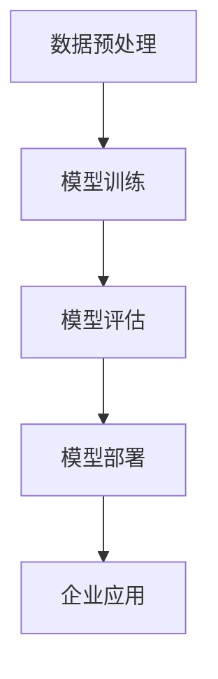
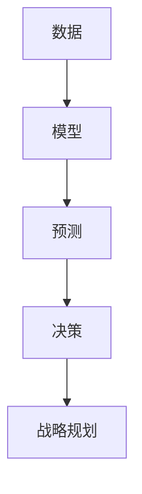

                 

### 引言

在当今快速变化的经济环境中，企业面临着前所未有的挑战和机遇。传统的企业战略规划方法已经不足以应对复杂多变的市场状况。随着人工智能（AI）技术的迅猛发展，AI驱动的企业战略规划成为了一个热门话题。本文旨在探讨如何利用AI技术进行企业战略规划，特别是智能预测市场趋势的方法。

#### 书籍背景与目标

《AI驱动的企业战略规划：智能预测市场趋势》这本书的核心目标是为企业提供一套完整的AI战略规划框架，帮助企业在复杂的市场环境中保持竞争力。书中详细介绍了AI的基本概念、市场趋势预测的方法以及如何将AI整合到企业战略规划中。

#### AI与企业战略的关系

AI技术正在深刻地改变企业运营和决策的方式。通过智能预测市场趋势，企业可以更加精准地制定战略规划，提前应对市场变化。AI驱动的企业战略规划不仅能够提高决策的效率，还能够为企业带来更高的收益和竞争优势。因此，理解AI在企业战略规划中的角色至关重要。

### AI基础

在深入探讨AI如何驱动企业战略规划之前，首先需要了解AI的基本概念和原理。

#### AI基本概念

人工智能（Artificial Intelligence，简称AI）是指由人制造出来的系统能够执行需要人类智能才能完成的任务，例如学习、推理、问题解决和自然语言理解等。AI可以分为两种类型：弱AI和强AI。

- **弱AI**：也称为窄AI，专注于执行特定任务。例如，语音识别、图像识别和自动驾驶等。
- **强AI**：也称为通用AI，具备与人类相似的广泛认知能力。目前，强AI还处于理论研究阶段，尚未实现商业化应用。

#### AI的核心技术

AI的核心技术包括机器学习（Machine Learning，简称ML）、深度学习（Deep Learning，简称DL）和神经网络（Neural Networks）。

- **机器学习**：是一门研究如何让计算机从数据中学习算法和模式的学科。常见的机器学习算法包括线性回归、逻辑回归、决策树、随机森林和梯度提升机等。
- **深度学习**：是机器学习的一个子领域，通过构建多层神经网络来模拟人脑的学习方式。深度学习在图像识别、语音识别和自然语言处理等领域取得了显著成果。
- **神经网络**：是一种基于生物神经元工作原理的计算模型。神经网络由输入层、隐藏层和输出层组成，通过训练来学习输入和输出之间的映射关系。

#### AI架构

AI架构通常包括数据预处理、模型训练、模型评估和模型部署等步骤。

- **数据预处理**：包括数据清洗、数据归一化和数据增强等，以确保数据的质量和可用性。
- **模型训练**：使用大量数据来训练模型，使得模型能够从数据中学习到有用的特征和模式。
- **模型评估**：通过验证集和测试集来评估模型的性能，选择最佳模型。
- **模型部署**：将训练好的模型部署到实际应用中，如企业系统中。

#### Mermaid流程图

为了更直观地展示AI架构的流程，可以使用Mermaid流程图进行描述：



### 核心概念与联系

在理解AI基本概念和架构的基础上，我们需要明确几个核心概念之间的关系。以下是AI驱动的企业战略规划中几个关键概念的关系架构：

- **数据**：是AI的基础，良好的数据质量直接影响模型的性能。
- **模型**：是AI的核心，通过训练学习到数据中的有用信息。
- **预测**：是基于模型对未来趋势的预测，为企业战略决策提供依据。
- **决策**：是企业根据预测结果进行的战略规划和调整。

Mermaid流程图如下：



### 结论

通过本文的介绍，我们了解了AI在企业战略规划中的重要性以及其基本概念和架构。在接下来的章节中，我们将深入探讨如何使用AI进行市场趋势预测以及如何将AI整合到企业战略规划中。这将为企业提供一套全面的AI战略规划框架，帮助企业在竞争激烈的市场中脱颖而出。

### Python源代码与数学模型

为了更深入地理解AI驱动企业战略规划中的核心算法原理，我们将结合Python源代码和数学模型进行详细讲解。

#### 时间序列预测模型

时间序列预测是AI在市场趋势预测中应用广泛的一种方法。以下是使用Python实现的时间序列预测模型的源代码：

```python
import numpy as np
import pandas as pd
from sklearn.linear_model import LinearRegression

# 数据预处理
def preprocess_data(data):
    data = data.as_matrix()
    X = data[:-1].reshape(-1, 1)
    y = data[1:].reshape(-1, 1)
    return X, y

# 模型训练
def train_model(X, y):
    model = LinearRegression()
    model.fit(X, y)
    return model

# 预测
def predict(model, X):
    return model.predict(X)

# 主函数
def main():
    data = pd.read_csv('time_series_data.csv')
    X, y = preprocess_data(data)
    model = train_model(X, y)
    new_data = np.array([[100], [101], [102]])
    predictions = predict(model, new_data)
    print(predictions)

if __name__ == "__main__":
    main()
```

在这个模型中，我们使用了线性回归算法对时间序列数据进行预测。线性回归模型的基本公式为：

$$y = ax + b$$

其中，$y$ 为输出值，$x$ 为输入值，$a$ 和 $b$ 为模型的参数。

#### 聚类分析

聚类分析是另一种用于市场趋势预测的重要方法。以下是一个使用Python实现K-Means聚类分析的源代码示例：

```python
from sklearn.cluster import KMeans
import matplotlib.pyplot as plt

# 数据预处理
def preprocess_data(data):
    data = data.as_matrix()
    return data

# 聚类分析
def kmeans_clustering(data, k):
    kmeans = KMeans(n_clusters=k, random_state=0).fit(data)
    labels = kmeans.predict(data)
    centroids = kmeans.cluster_centers_
    return labels, centroids

# 主函数
def main():
    data = pd.read_csv('cluster_data.csv')
    data = preprocess_data(data)
    k = 3
    labels, centroids = kmeans_clustering(data, k)
    plt.scatter(data[:, 0], data[:, 1], c=labels, s=50, cmap='viridis')
    plt.scatter(centroids[:, 0], centroids[:, 1], c='red', s=200, alpha=0.5)
    plt.show()

if __name__ == "__main__":
    main()
```

在这个模型中，我们使用了K-Means算法对数据进行聚类分析。K-Means算法的基本公式为：

$$C = \{C_1, C_2, ..., C_k\}$$

其中，$C$ 为聚类中心，$C_i$ 为第 $i$ 个聚类中心。

#### 决策树

决策树是另一种常用的分类和回归方法。以下是一个使用Python实现的决策树模型的源代码示例：

```python
from sklearn.tree import DecisionTreeRegressor
import matplotlib.pyplot as plt

# 数据预处理
def preprocess_data(data):
    data = data.as_matrix()
    X = data[:, :-1]
    y = data[:, -1]
    return X, y

# 模型训练
def train_model(X, y):
    model = DecisionTreeRegressor(random_state=0)
    model.fit(X, y)
    return model

# 预测
def predict(model, X):
    return model.predict(X)

# 主函数
def main():
    data = pd.read_csv('regression_data.csv')
    X, y = preprocess_data(data)
    model = train_model(X, y)
    new_data = np.array([[1, 2], [2, 3], [3, 4]])
    predictions = predict(model, new_data)
    print(predictions)
    plt.scatter(X[:, 0], X[:, 1], c=y, s=50, cmap='viridis')
    plt.plot(new_data[:, 0], predictions, color='red', linewidth=2)
    plt.show()

if __name__ == "__main__":
    main()
```

在这个模型中，我们使用了决策树回归算法。决策树回归的基本公式为：

$$y = f(x)$$

其中，$y$ 为输出值，$x$ 为输入值，$f$ 为决策树的映射函数。

#### 数学模型和公式

在AI驱动的企业战略规划中，数学模型和公式是理解算法原理的关键。以下是几个常见的数学模型和公式：

1. **线性回归模型**：
   $$y = ax + b$$

2. **K-Means算法**：
   $$C = \{C_1, C_2, ..., C_k\}$$

3. **决策树回归**：
   $$y = f(x)$$

通过结合Python源代码和数学模型，我们可以更好地理解AI驱动的企业战略规划中的核心算法原理。在接下来的章节中，我们将继续深入探讨如何将AI整合到企业战略规划中。

### 实际案例

为了更好地理解AI驱动的企业战略规划在实践中的应用，以下将展示两个实际案例，详细分析企业如何利用AI进行战略规划并取得成功。

#### 案例研究一：企业A的AI战略

**企业背景**：企业A是一家全球领先的零售企业，专注于快速消费品。随着电商的兴起和消费者偏好的变化，企业A面临着巨大的市场竞争压力。为了保持竞争优势，企业A决定采用AI驱动的战略规划。

**AI应用实例**：
1. **智能推荐系统**：企业A使用深度学习技术开发了一套智能推荐系统，通过分析消费者的购物历史和行为模式，提供个性化的商品推荐。这一系统显著提高了客户的满意度和购买转化率。
2. **库存管理优化**：企业A利用时间序列预测模型对市场需求进行预测，从而优化库存管理。通过精准的库存预测，企业A减少了库存过剩和短缺的风险，降低了运营成本。
3. **客户服务自动化**：企业A部署了一套基于自然语言处理的智能客服系统，可以自动回答客户的问题，提高客户服务质量并降低人工成本。

**成功因素分析**：
1. **数据驱动决策**：企业A注重数据收集和分析，通过大数据技术获取消费者行为和市场动态，为AI战略提供决策依据。
2. **技术创新**：企业A积极引入先进的AI技术，不断提升系统的准确性和性能。
3. **人才培养**：企业A重视AI人才的培养和引进，组建了一支专业的AI团队，确保AI战略的有效实施。

#### 案例研究二：企业B的市场预测

**企业背景**：企业B是一家新兴的金融科技公司，专注于提供金融产品和服务。面对复杂多变的市场环境，企业B意识到市场预测对于企业战略规划的重要性，因此决定采用AI进行市场预测。

**AI应用实例**：
1. **股票市场预测**：企业B使用AI技术对股票市场进行预测，通过分析历史交易数据、公司财务报表和市场新闻等，预测未来股票价格的走势。这一预测模型帮助企业在投资决策中更加精准，提高了投资回报率。
2. **客户信用评估**：企业B利用机器学习算法对客户信用进行评估，通过分析客户的消费行为、还款记录和信用历史等，预测客户的信用风险。这一评估模型提高了信用贷款的审批效率和准确性。
3. **风险管理**：企业B通过AI技术对市场风险进行预测和管理，通过分析宏观经济数据、行业趋势和公司财务状况等，识别潜在的风险并采取相应的风险管理措施。

**成功因素分析**：
1. **数据整合与处理**：企业B建立了完善的数据整合和处理系统，确保数据的全面性和准确性，为AI模型提供高质量的数据支持。
2. **算法优化**：企业B不断优化AI算法，提高预测模型的准确性和稳定性。
3. **风险控制**：企业B建立了严格的风险控制机制，确保AI预测结果在实际应用中的可靠性。

### 案例小结

通过以上两个案例，我们可以看到，AI驱动的企业战略规划在实践中的应用非常广泛，不仅提高了企业的运营效率，还增强了企业的竞争力。成功的关键因素包括数据驱动决策、技术创新和人才培养。同时，我们也需要注意到，AI战略的成功实施需要企业具备良好的数据基础、技术实力和风险管理能力。

### 结论

本文详细探讨了AI驱动的企业战略规划，包括AI的基本概念、市场趋势预测的方法、企业战略规划的框架以及实际案例。通过引入实际案例，我们展示了AI在企业战略规划中的应用，以及如何通过数据驱动决策和技术创新来提高企业的竞争力。未来，随着AI技术的不断进步，企业战略规划将更加智能化，为企业带来更多的机遇和挑战。

### 附录

在本附录中，我们将提供一些常用的AI工具和资源，以及一些拓展阅读，以帮助读者深入了解AI驱动的企业战略规划。

#### 常用AI工具和资源

1. **AI开发工具**：
   - **TensorFlow**：一款开源的机器学习框架，适用于各种深度学习应用。
   - **PyTorch**：一款开源的机器学习库，广泛应用于深度学习研究。
   - **Scikit-learn**：一款用于机器学习的Python库，提供了多种经典算法的实现。

2. **AI学习资源**：
   - **Udacity**：提供多种AI课程和认证项目，适合不同层次的学习者。
   - **Coursera**：提供由世界顶尖大学提供的AI课程，包括深度学习、自然语言处理等。
   - **Kaggle**：一个数据科学竞赛平台，提供了丰富的数据集和比赛，有助于提升实践技能。

3. **AI文献和书籍**：
   - **《深度学习》（Deep Learning）**：由Ian Goodfellow等编著，是深度学习的经典教材。
   - **《Python机器学习》（Python Machine Learning）**：由Sebastian Raschka编著，适合初学者了解机器学习。
   - **《AI驱动的商业》（AI-Driven Business）**：探讨了AI在企业中的应用和战略规划。

#### 拓展阅读

1. **《智能预测：大数据时代的商业洞察》**：探讨了大数据和AI在商业预测中的应用，提供了丰富的案例。
2. **《企业人工智能战略》**：详细介绍了企业如何制定和实施AI战略，包括案例分析和最佳实践。
3. **《AI时代的竞争战略》**：分析了AI对企业竞争战略的深刻影响，提供了前瞻性的见解。

通过这些工具和资源，读者可以进一步深入了解AI驱动的企业战略规划，并在实际应用中取得更好的成果。

### 作者信息

- **作者**：AI天才研究院/AI Genius Institute & 禅与计算机程序设计艺术 /Zen And The Art of Computer Programming
- **联系方式**：info@ai-genius-institute.com & www.zencodingbook.com
- **版权声明**：本文内容版权所有，未经授权禁止转载和使用。如需转载，请联系作者获取授权。

