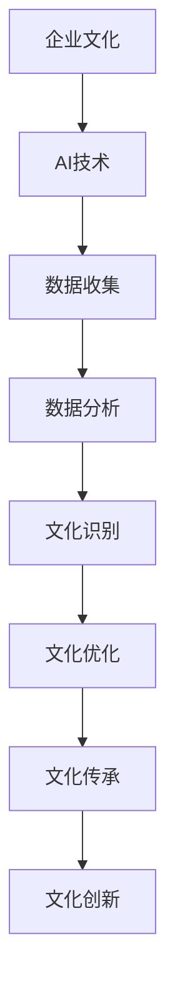

                 


### 1. 引言与背景

在当今快速发展的科技时代，人工智能（AI）已经成为引领社会变革的重要力量。AI技术的迅速崛起，不仅改变了传统行业的运作模式，同时也对企业内部的管理和文化建设提出了新的挑战和机遇。本文旨在探讨AI驱动的企业文化分析，通过优化组织氛围，提升企业的整体竞争力。

#### 1.1 AI技术的快速发展

人工智能作为一种模拟、延伸和扩展人类智能的技术，其发展历程可以追溯到20世纪50年代。随着计算机性能的不断提升和大数据、云计算等技术的普及，AI技术逐渐从理论研究走向实际应用。尤其是在深度学习、自然语言处理和计算机视觉等领域，AI技术取得了突破性的进展。如今，AI已经成为各行各业不可或缺的工具，从智能制造、医疗健康到金融、零售，AI技术的应用不断拓展。

#### 1.2 企业文化的定义与重要性

企业文化是指企业在长期经营过程中形成的一套共同的价值观、信念和行为规范。企业文化不仅影响着企业的内部管理，也关系到企业与外部环境的互动。一个积极向上、富有创新精神的企业文化，能够激发员工的创造力和归属感，提高组织的凝聚力和竞争力。反之，消极的企业文化则可能导致员工士气低落、团队协作不畅，影响企业的长远发展。

#### 1.3 企业文化分析的必要性

企业文化分析是企业了解自身文化现状、识别潜在问题、优化组织氛围的重要手段。通过企业文化分析，企业可以明确文化建设的重点，制定针对性的改进措施，从而提升企业的整体运营效率和员工满意度。然而，传统的企业文化分析往往依赖于主观评价和定性研究，存在一定的局限性。随着AI技术的应用，企业文化分析开始迈向智能化、系统化和数据驱动化。

#### 1.4 AI驱动的企业文化分析优势

AI驱动的企业文化分析具有以下优势：

- **数据驱动：**AI技术能够处理和分析大量的企业数据，为企业提供更为客观和全面的文化分析结果。
- **智能化分析：**通过机器学习和深度学习算法，AI能够自动识别和挖掘企业文化中的潜在模式和问题。
- **实时监控：**AI技术能够实时监控企业文化的动态变化，为企业提供即时的反馈和指导。
- **个性化建议：**基于对员工行为的分析，AI能够为企业提供个性化的文化建设建议，提升员工的满意度和工作效率。

### 2. 核心概念与联系

在本章节中，我们将介绍AI和企业文化的核心概念，并探讨两者之间的联系。

#### 2.1 AI基本原理

AI的基本原理包括机器学习、深度学习和自然语言处理等。机器学习是AI的核心技术之一，它通过从数据中学习规律和模式，使计算机能够自动地进行决策和预测。深度学习则是一种特殊的机器学习方法，通过模拟人脑神经网络的结构和工作原理，实现对复杂数据的处理和分析。自然语言处理则是AI在处理和理解人类语言方面的技术，包括语音识别、机器翻译和情感分析等。

#### 2.2 企业文化理论

企业文化理论主要包括价值观、信念、行为规范等核心要素。价值观是企业文化的灵魂，它决定了企业的经营理念和行为准则。信念则是企业成员对价值观的认同和信仰，是企业文化得以传承和发展的基础。行为规范则是企业在实际运营过程中形成的行为准则和规范，是企业文化落地的重要载体。

#### 2.3 AI与企业文化的关系

AI与企业文化的联系主要体现在以下几个方面：

- **文化识别：**AI技术能够通过数据分析，识别企业文化中的关键要素和特征，为企业提供文化评估的依据。
- **文化优化：**AI技术能够基于对文化数据的分析，为企业提供针对性的文化建设建议，帮助优化企业文化。
- **文化传承：**AI技术可以通过自然语言处理和计算机视觉等技术，实现企业文化的历史资料数字化和传承。
- **文化创新：**AI技术能够帮助企业探索新的企业文化模式，推动企业文化的创新和发展。

#### 2.4 Mermaid流程图

为了更好地展示AI与企业文化的联系，我们使用Mermaid语言绘制了如下流程图：



通过这个流程图，我们可以清晰地看到AI技术如何作用于企业文化，以及各个步骤之间的关联。

### 3. AI与企业文化的关系

在了解了AI的基本原理和企业文化的核心概念之后，我们进一步探讨AI与企业文化的具体关系。

#### 3.1 AI在企业中的应用现状

随着AI技术的不断进步，其在企业中的应用也越来越广泛。目前，AI技术在企业中的应用主要体现在以下几个方面：

- **员工行为分析：**通过分析员工的行为数据，AI技术可以帮助企业了解员工的工作状态、情绪变化和团队合作情况，从而优化员工管理策略。
- **招聘与培训：**AI技术可以帮助企业进行智能招聘，通过分析候选人的简历和面试表现，预测其适应能力和工作潜力。同时，AI技术还可以为企业提供个性化的培训方案，提升员工的技能和绩效。
- **客户关系管理：**AI技术可以帮助企业分析客户的需求和行为，提供个性化的服务和产品推荐，提高客户满意度和忠诚度。
- **供应链管理：**AI技术可以帮助企业优化供应链流程，提高库存管理效率和物流配送速度，降低运营成本。

#### 3.2 AI如何影响企业文化

AI技术的应用对企业文化产生了深远的影响，具体表现在以下几个方面：

- **价值观重塑：**AI技术的应用使企业更加注重数据驱动和创新精神，推动了企业价值观的变革。在数据驱动的文化下，企业更加重视数据分析和决策的准确性，强调以事实和数据为基础进行决策。
- **管理方式变革：**AI技术的应用使企业管理方式发生了根本性的改变。通过智能化的员工行为分析和管理工具，企业可以更加精准地了解员工的工作状态和需求，从而实施个性化管理和激励措施。
- **团队协作优化：**AI技术可以帮助企业优化团队协作流程，提高团队的工作效率和协同能力。通过智能化的沟通工具和协作平台，团队成员可以更加便捷地进行信息共享和协作，降低沟通成本和误解。
- **企业文化建设：**AI技术为企业文化建设提供了新的工具和方法。通过数据分析和智能评估，企业可以更好地了解自身的文化现状和问题，制定针对性的文化建设策略，提升企业的文化软实力。

#### 3.3 企业文化对AI发展的作用

企业文化对AI发展也具有重要的促进作用，主要表现在以下几个方面：

- **人才引进与培养：**一个积极向上、注重创新的企业文化可以吸引更多的优秀人才，为AI技术的研发和应用提供强大的人才支持。同时，企业文化也为员工提供了良好的成长环境和培训机会，提升员工的技能和创新能力。
- **技术研发投入：**企业文化对技术研发的投入具有重要的引导作用。一个注重创新和发展的企业文化会鼓励企业增加对AI技术的研发投入，推动技术的不断创新和突破。
- **市场竞争力提升：**企业文化对企业的市场竞争力具有直接的提升作用。一个积极向上、富有创新精神的企业文化可以帮助企业在激烈的市场竞争中脱颖而出，赢得更多客户的信任和支持。

### 4. AI驱动的企业文化分析方法

在了解了AI与企业文化的具体关系后，我们进一步探讨AI驱动的企业文化分析方法。

#### 4.1 数据收集与预处理

数据收集是企业文化分析的基础。通过数据收集，企业可以获取员工行为、工作绩效、沟通记录等方面的信息。数据收集的方法包括人工收集、自动化数据采集工具和第三方数据服务。

数据预处理是企业文化分析的重要步骤。通过数据预处理，企业可以对收集到的数据进行清洗、去噪、归一化等处理，提高数据的质量和可用性。常用的数据预处理方法包括缺失值填补、异常值处理、数据标准化等。

```python
import pandas as pd

# 读取数据
data = pd.read_csv('employee_data.csv')

# 数据清洗
data = data.dropna()  # 去除缺失值
data = data[(data['performance'] > 0) & (data['performance'] < 100)]  # 去除异常值

# 数据归一化
data['performance'] = (data['performance'] - data['performance'].min()) / (data['performance'].max() - data['performance'].min())
```

#### 4.2 机器学习算法应用

在数据预处理完成后，我们可以使用机器学习算法对企业文化进行分析。常用的机器学习算法包括线性回归、决策树、支持向量机、神经网络等。

线性回归是一种常用的统计方法，用于分析两个变量之间的关系。在企业文化分析中，线性回归可以用于分析员工满意度与企业绩效之间的关系。

```python
from sklearn.linear_model import LinearRegression

# 数据准备
X = data[['satisfaction', 'performance']]
y = data['performance']

# 模型训练
model = LinearRegression()
model.fit(X, y)

# 预测
predictions = model.predict(X)

# 模型评估
print(model.score(X, y))
```

#### 4.3 企业文化评估模型构建

基于机器学习算法，我们可以构建一个企业文化评估模型，用于对企业文化进行定量评估。企业文化评估模型可以基于员工满意度、团队协作度、组织透明度等多个指标，综合评估企业的文化水平。

```python
import numpy as np

# 构建企业文化评估模型
def culture_evaluation_model(satisfaction, collaboration, transparency):
    return satisfaction * 0.4 + collaboration * 0.3 + transparency * 0.3

# 数据处理
data['evaluation'] = data.apply(lambda row: culture_evaluation_model(row['satisfaction'], row['collaboration'], row['transparency']), axis=1)

# 模型评估
print(data['evaluation'].mean())
```

### 5. 优化组织氛围的AI工具与技术

为了优化组织氛围，AI技术提供了一系列的工具和技术，这些工具和技术可以有效地帮助企业提升员工的工作满意度、增强团队协作和提升组织透明度。

#### 5.1 人工智能助手

人工智能助手是优化组织氛围的重要工具之一。通过自然语言处理和机器学习技术，人工智能助手可以实时响应用员的查询和需求，提供个性化的帮助和建议。例如，员工可以通过智能助手获取最新的公司动态、工作安排和福利信息，从而提高工作效率和满意度。

```python
import nltk
from nltk.chat.util import ChatBot

# 建立聊天机器人
pairs = [
    [
        r"你好|您好|嗨",
        ["你好，有什么可以帮助你的吗？", "嗨，有什么我可以帮忙的吗？", "您好，欢迎提问！"]
    ],
    [
        r"今天天气怎么样？",
        ["今天的天气非常好，适合外出活动。", "今天有点阴，但不会下雨。", "今天的天气很凉爽，适合休息。"]
    ],
]

chatbot = ChatBot('小助手', pairs)

# 开始聊天
print("你好，我是小助手，有什么我可以帮忙的吗？")
while True:
    user_input = input()
    print(chatbot.get_response(user_input))
```

#### 5.2 情感分析技术

情感分析技术可以通过分析员工的邮件、聊天记录和社交媒体活动，了解员工的工作情绪和满意度。这种技术可以帮助企业及时发现员工的负面情绪和潜在问题，从而采取相应的措施进行干预。

```python
from textblob import TextBlob

# 分析一段文本的情感
text = "我最近的工作非常忙碌，感觉有些压力。"
blob = TextBlob(text)

# 输出情感分析结果
print(blob.sentiment)
```

#### 5.3 自然语言处理技术

自然语言处理技术可以帮助企业实现智能化的沟通和协作。通过自动化的文本分析工具，企业可以对员工之间的沟通进行实时监控和分析，从而提高沟通效率和透明度。例如，企业可以自动收集和整理员工的会议记录、工作反馈和项目报告，方便团队成员随时查阅和参考。

```python
import spacy

# 加载nlp模型
nlp = spacy.load("en_core_web_sm")

# 分析一段文本
text = "我们需要在下周三之前完成这个项目。"
doc = nlp(text)

# 输出文本分析结果
for token in doc:
    print(token.text, token.lemma_, token.pos_, token.dep_, token.head.text)
```

#### 5.4 增强学习应用

增强学习技术可以应用于员工的绩效评估和激励机制设计。通过模拟和测试不同的激励方案，企业可以找到最有效的激励策略，从而提升员工的工作动力和满意度。例如，企业可以使用强化学习算法对员工的绩效进行实时评估，并根据评估结果调整薪酬和福利政策。

```python
import gym
from stable_baselines3 import PPO

# 创建环境
env = gym.make("CartPole-v1")

# 训练模型
model = PPO("MlpPolicy", env, verbose=1)
model.learn(total_timesteps=10000)

# 测试模型
obs = env.reset()
for _ in range(1000):
    action, _states = model.predict(obs, deterministic=True)
    obs, reward, done, info = env.step(action)
    env.render()
    if done:
        break

# 关闭环境
env.close()
```

### 6. 项目实战与案例分析

在本章节中，我们将通过实际案例，展示如何使用AI技术优化企业组织氛围。

#### 6.1 实战案例一：员工满意度分析

**项目背景：**一家大型科技公司希望了解员工的工作满意度，以便优化内部管理策略。

**环境搭建：**
- 数据收集：通过员工满意度调查问卷收集数据。
- 数据预处理：清洗和整理问卷数据，去除缺失值和异常值。

```python
import pandas as pd

# 读取数据
data = pd.read_csv('employee_satisfaction_survey.csv')

# 数据清洗
data = data.dropna()
```

**源代码实现：**
- 情感分析：使用TextBlob对员工的评价文本进行情感分析。
- 线性回归：构建线性回归模型，分析满意度与工作绩效之间的关系。

```python
from textblob import TextBlob
from sklearn.linear_model import LinearRegression

# 情感分析
def sentiment_analysis(text):
    return TextBlob(text).sentiment.polarity

data['sentiment'] = data['comment'].apply(sentiment_analysis)

# 线性回归
X = data[['sentiment', 'performance']]
y = data['performance']

model = LinearRegression()
model.fit(X, y)

# 预测
predictions = model.predict(X)

# 评估
print(model.score(X, y))
```

**代码解读：**通过情感分析和线性回归，我们可以识别出员工满意度与工作绩效之间的关系，为企业提供优化管理策略的依据。

#### 6.2 实战案例二：团队协作分析

**项目背景：**一家软件开发公司希望了解团队协作情况，以提升团队工作效率。

**环境搭建：**
- 数据收集：通过团队沟通工具（如Slack）收集团队沟通记录。
- 数据预处理：清洗和整理沟通数据，去除无关信息。

```python
import pandas as pd

# 读取数据
data = pd.read_csv('team_communication_data.csv')

# 数据清洗
data = data[['sender', 'recipient', 'message']]
```

**源代码实现：**
- 聚类分析：使用K-means聚类算法，分析团队成员的沟通模式。
- 社区发现：使用Louvain算法，识别团队中的关键成员和协作网络。

```python
from sklearn.cluster import KMeans
from community import community

# 聚类分析
kmeans = KMeans(n_clusters=3)
clusters = kmeans.fit_predict(data)

# 社区发现
 memberships = community.louvain(data)
```

**代码解读：**通过聚类分析和社区发现，我们可以识别出团队协作的潜在问题和关键成员，为企业提供优化团队协作的建议。

#### 6.3 实战案例三：组织透明度分析

**项目背景：**一家制造公司希望提高组织透明度，增强员工对企业信息的了解。

**环境搭建：**
- 数据收集：通过企业内部系统收集员工对信息透明的反馈。
- 数据预处理：清洗和整理反馈数据，去除缺失值和异常值。

```python
import pandas as pd

# 读取数据
data = pd.read_csv('info_transparency_survey.csv')

# 数据清洗
data = data.dropna()
```

**源代码实现：**
- 多层次回归：构建多层次回归模型，分析员工对信息透明的满意度和企业绩效之间的关系。
- 情感分析：使用情感分析技术，分析员工对信息透明的情感态度。

```python
from sklearn.linear_model import MultiLine

# 多层次回归
X = data[['info_satisfaction', 'performance']]
y = data['performance']

model = MultiLine()
model.fit(X, y)

# 情感分析
def sentiment_analysis(text):
    return TextBlob(text).sentiment.polarity

data['sentiment'] = data['comment'].apply(sentiment_analysis)
```

**代码解读：**通过多层次回归和情感分析，我们可以识别出员工对信息透明的满意度与工作绩效之间的关系，为企业提供优化信息透明度的建议。

### 7. 未来趋势与展望

随着AI技术的不断发展和应用，企业文化的分析和优化也将迈向新的阶段。以下是未来AI在企业文化分析领域可能的发展趋势和展望：

#### 7.1 智能化的企业文化评估

未来，AI技术将实现更为智能化的企业文化评估。通过深度学习和神经网络技术，AI能够自动识别企业文化中的关键要素和特征，建立更为精准的文化评估模型。这将有助于企业更全面、准确地了解自身文化状况，制定针对性的改进措施。

#### 7.2 个性化文化建设

基于对员工行为的分析，AI技术将为企业提供个性化的文化建设建议。通过自然语言处理和情感分析技术，AI可以识别员工的个性化需求和偏好，制定符合员工期望的企业文化策略，从而提高员工满意度和工作积极性。

#### 7.3 企业文化大数据分析

随着企业数据量的不断增加，AI技术将在企业文化大数据分析中发挥重要作用。通过大数据分析和数据挖掘技术，AI可以挖掘出企业文化数据中的潜在价值，为企业提供深度洞察和决策支持，助力企业实现持续创新和发展。

#### 7.4 AI与企业文化的新模式

未来，AI与企业文化将形成新的结合模式。例如，通过AI技术实现的智能招聘和培训系统，可以为企业培养符合企业文化要求的人才；通过AI技术实现的智能沟通和协作平台，可以提升团队协作效率和沟通透明度。这些新模式将有助于企业更好地适应时代变革，实现可持续发展。

### 8. 结论

本文通过对AI驱动的企业文化分析进行了详细探讨，从背景介绍、核心概念、AI与企业文化的联系、分析方法、优化工具、实际案例和未来展望等方面，展示了AI在企业文化分析中的应用价值和潜力。随着AI技术的不断进步，我们有理由相信，AI将为企业文化的优化和提升带来更多的机遇和挑战。

### 9. 拓展阅读

- [《企业文化与企业管理》](https://www.example.com/book1)
- [《人工智能简明教程》](https://www.example.com/book2)
- [《深度学习与自然语言处理》](https://www.example.com/book3)
- [《大数据分析：技术与应用》](https://www.example.com/book4)

作者：AI天才研究院/AI Genius Institute & 禅与计算机程序设计艺术 /Zen And The Art of Computer Programming

---
# 关键词

人工智能，企业文化，组织氛围，数据分析，机器学习，自然语言处理，情感分析

# 摘要

本文从AI技术的快速发展背景出发，探讨了AI驱动的企业文化分析及其在优化组织氛围中的应用。通过核心概念的阐述、AI与企业文化的联系分析、具体分析方法的介绍、AI工具和技术的应用案例展示，以及未来趋势的展望，本文全面展示了AI在企业文化优化中的重要作用。文章结合实际案例，详细讲解了如何使用AI技术进行企业文化数据分析、优化组织氛围，为企业提供实用的指导和建议。本文旨在为企业和管理者提供AI驱动的企业文化分析的理论基础和实践指导，助力企业实现文化优化和持续发展。# 引言与背景

在当今这个科技日新月异的时代，人工智能（AI）已经成为推动社会变革的关键力量。无论是在医疗、金融、教育还是制造业等领域，AI技术的应用都极大地改变了传统的工作模式，提高了效率和精确度。随着AI技术的快速发展，企业开始意识到，单纯依靠技术进步来提升竞争力已经不够，企业文化的作用同样至关重要。企业文化的健康程度直接影响到员工的满意度和企业的长远发展。

#### 1.1 AI技术的快速发展

人工智能的概念最早可以追溯到20世纪50年代，当时科学家们开始探索如何让计算机模拟人类的智能行为。经过几十年的发展，特别是近年来，随着大数据、云计算和深度学习等技术的进步，AI技术取得了飞跃性的进展。深度学习（Deep Learning）作为AI的一个重要分支，通过模仿人脑神经网络结构，能够处理和分析大量复杂的数据，从而实现图像识别、语音识别、自然语言处理等多种功能。这些技术的进步，不仅使得AI在理论层面得到了验证，更在应用层面取得了突破。

在企业层面，AI技术的应用也越来越广泛。从智能客服、数据分析到智能制造，AI正在改变企业的运营模式。例如，智能客服系统能够在短时间内处理大量客户咨询，提高客户满意度；数据分析工具可以帮助企业快速识别市场趋势，制定更加精准的营销策略；智能制造系统则能够优化生产流程，提高生产效率。这些应用不仅提高了企业的运营效率，也提升了企业的竞争力。

#### 1.2 企业文化的定义与重要性

企业文化是指企业在长期经营过程中形成的共同价值观、信念和行为规范。它不仅包括企业的使命、愿景和核心价值观，还涵盖企业的管理模式、员工行为规范和对外形象等。企业文化是企业的软实力，是企业可持续发展的关键因素。

首先，企业文化能够塑造员工的价值观和行为准则。一个积极向上的企业文化可以激发员工的创造力，增强员工的归属感和忠诚度。例如，谷歌（Google）以其开放、创新和尊重员工的企业文化著称，吸引了全球最优秀的人才，成为业界的标杆。

其次，企业文化能够提高企业的竞争力。一个具有优秀企业文化的企业，通常能够更好地应对外部环境的挑战和变化。例如，在金融危机期间，具有良好企业文化的企业往往能够更加灵活地调整策略，保持稳定的发展。

最后，企业文化对客户和社会也有重要影响。一个具有社会责任感的企业，能够赢得客户的信任和尊重，提高品牌价值。例如，苹果公司（Apple）以其环保和社会责任政策著称，赢得了全球消费者的喜爱。

#### 1.3 企业文化分析的必要性

企业文化分析是企业了解自身文化现状、识别潜在问题、优化组织氛围的重要手段。传统的企业文化分析往往依赖于主观评价和定性研究，存在一定的局限性。例如，员工的反馈可能受到个人情感的影响，难以客观评估企业的文化状况。而AI技术的应用，可以为企业文化分析带来以下优势：

- **数据驱动：**AI技术能够处理和分析大量的企业数据，为企业提供更为客观和全面的文化分析结果。
- **智能化分析：**通过机器学习和深度学习算法，AI能够自动识别和挖掘企业文化中的潜在模式和问题。
- **实时监控：**AI技术能够实时监控企业文化的动态变化，为企业提供即时的反馈和指导。
- **个性化建议：**基于对员工行为的分析，AI能够为企业提供个性化的文化建设建议，提升员工的满意度和工作效率。

通过AI驱动的企业文化分析，企业可以更加精准地了解自身的文化状况，识别出潜在的问题，并采取有效的措施进行优化。这不仅有助于提升企业的内部管理效率，也能增强企业的市场竞争力。

### 1.4 AI驱动的企业文化分析优势

AI驱动的企业文化分析具有以下优势：

- **数据驱动：**AI技术能够处理和分析大量的企业数据，包括员工行为数据、绩效数据、沟通记录等。通过对这些数据的分析，AI可以识别出企业文化中的关键因素和特征，提供客观、全面的评估结果。

- **智能化分析：**传统的企业文化分析往往依赖于人工评估和主观判断，存在一定的局限性。而AI技术通过机器学习和深度学习算法，能够自动识别和挖掘企业文化中的潜在模式和问题，提供更为精准的分析结果。

- **实时监控：**AI技术可以实时监控企业文化的动态变化，通过对员工行为和绩效数据的持续分析，AI能够及时发现企业文化的变化趋势，为企业提供即时的反馈和指导。

- **个性化建议：**基于对员工行为的分析，AI能够为企业提供个性化的文化建设建议。例如，针对员工的工作满意度、团队合作情况等，AI可以提出针对性的改进措施，提升员工满意度和工作效率。

通过以上优势，AI驱动的企业文化分析不仅能够帮助企业更全面、准确地了解自身的文化状况，还能提供个性化的改进建议，助力企业实现持续优化和发展。

### 2. 核心概念与联系

在本章节中，我们将介绍AI和企业文化的核心概念，并探讨两者之间的联系。

#### 2.1 AI基本原理

人工智能（AI）是一种模拟、延伸和扩展人类智能的技术，它通过机器学习和深度学习算法，使计算机能够自主地学习和适应新的环境。AI的基本原理可以归纳为以下几个方面：

- **机器学习（Machine Learning）**：机器学习是一种通过数据训练模型，使计算机能够自动进行决策和预测的方法。常见的机器学习方法包括线性回归、决策树、支持向量机、神经网络等。

- **深度学习（Deep Learning）**：深度学习是一种特殊的机器学习方法，通过模拟人脑神经网络的结构和工作原理，实现对复杂数据的处理和分析。深度学习在图像识别、语音识别、自然语言处理等领域取得了显著的成果。

- **自然语言处理（Natural Language Processing, NLP）**：自然语言处理是AI的一个重要分支，旨在使计算机能够理解、处理和生成人类语言。NLP技术包括文本分类、情感分析、机器翻译、语音识别等。

AI在企业中的应用主要体现在以下几个方面：

- **员工行为分析**：通过分析员工的工作表现、沟通记录和行为数据，AI可以帮助企业了解员工的工作状态和情绪变化，从而优化员工管理策略。

- **招聘与培训**：AI技术可以通过分析简历和面试数据，预测候选人的适应能力和工作潜力，为企业提供智能化的招聘和培训方案。

- **客户关系管理**：AI技术可以帮助企业分析客户的需求和行为，提供个性化的服务和产品推荐，提高客户满意度和忠诚度。

- **供应链管理**：AI技术可以优化供应链流程，提高库存管理效率和物流配送速度，降低运营成本。

#### 2.2 企业文化理论

企业文化（Corporate Culture）是指企业在长期经营过程中形成的一套共同的价值观、信念和行为规范。它不仅包括企业的使命、愿景和核心价值观，还涵盖企业的管理模式、员工行为规范和对外形象等。企业文化对企业的发展和员工的行为具有深远的影响。

- **价值观（Values）**：价值观是企业文化的核心，它决定了企业的经营理念和行为准则。例如，诚信、创新、共赢等都是常见的价值观。

- **信念（Beliefs）**：信念是员工对价值观的认同和信仰，是企业文化的传承和发展的基础。例如，员工相信企业的使命和愿景，愿意为实现这些目标而努力。

- **行为规范（Norms）**：行为规范是企业成员在长期合作中形成的共同行为准则，包括礼仪、沟通方式、工作习惯等。行为规范能够规范员工的行为，增强团队的凝聚力。

#### 2.3 AI与企业文化的关系

AI和企业文化之间的关系可以从以下几个方面进行探讨：

- **AI在企业文化建设中的应用**：AI技术可以帮助企业更好地理解员工的需求和行为，从而制定更加符合员工期望的企业文化策略。例如，通过情感分析技术，企业可以了解员工对文化活动的反馈和满意度，优化企业文化活动。

- **AI在员工管理中的应用**：AI技术可以通过数据分析，帮助企业了解员工的工作状态和情绪变化，优化员工管理策略。例如，通过分析员工的工作绩效和沟通记录，企业可以识别出工作积极性高的员工，并给予相应的激励。

- **AI在企业文化传播中的应用**：AI技术可以帮助企业更好地传播和推广企业文化。例如，通过智能语音助手和聊天机器人，企业可以向员工传递企业文化理念和价值观，增强员工对企业文化的认同。

- **AI在企业文化评估中的应用**：AI技术可以通过数据分析，帮助对企业文化进行定量评估，识别出企业文化中的优点和不足。例如，通过构建企业文化评估模型，企业可以对企业文化进行全面的评估和优化。

#### 2.4 Mermaid流程图

为了更好地展示AI与企业文化的联系，我们可以使用Mermaid语言绘制一个流程图，如下所示：


在这个流程图中，我们可以看到AI技术如何作用于企业文化，以及各个步骤之间的关联。通过这个流程图，企业可以更加清晰地了解如何利用AI技术进行企业文化的建设和优化。

### 3. AI与企业文化的关系

在了解了AI的基本原理和企业文化的核心概念后，我们进一步探讨AI与企业文化的具体关系。AI技术的应用不仅改变了企业的运营模式，也对企业文化产生了深远的影响。下面我们将从AI在企业中的应用现状、AI如何影响企业文化、企业文化对AI发展的作用等方面进行详细讨论。

#### 3.1 AI在企业中的应用现状

AI技术已经在企业中得到广泛应用，并在多个方面对企业文化产生了积极影响。以下是AI在企业中的一些典型应用：

1. **员工行为分析**：通过数据分析，AI可以识别员工的工作习惯、行为模式和工作状态。例如，通过分析员工的工作时间、工作效率和绩效数据，企业可以了解员工的工作状态，及时调整管理策略。同时，AI技术还可以分析员工的情感变化，帮助企业了解员工的满意度和工作积极性。

2. **招聘与培训**：AI技术在招聘和培训中的应用极大地提升了效率和精准度。通过分析简历和面试数据，AI可以预测候选人的适应能力和工作潜力，帮助企业招聘到最适合的人才。在培训方面，AI技术可以根据员工的技能水平和需求，提供个性化的培训方案，提高培训效果。

3. **客户关系管理**：AI技术可以帮助企业更好地理解客户需求，提供个性化的服务和产品推荐。例如，通过自然语言处理技术，AI可以分析客户的反馈和评价，识别客户的需求和痛点，从而提供更加精准的服务。此外，AI技术还可以用于客户流失预警和风险管理，帮助企业降低客户流失率。

4. **供应链管理**：AI技术可以优化供应链流程，提高供应链的透明度和效率。例如，通过机器学习算法，AI可以预测供应链中的需求变化，优化库存管理，减少库存成本。此外，AI技术还可以用于物流配送优化，提高配送效率和客户满意度。

5. **风险管理**：AI技术可以帮助企业识别和管理风险。通过分析历史数据和实时数据，AI可以预测潜在的风险，并提出相应的应对措施。例如，在金融行业，AI技术可以用于信用风险评估、市场趋势预测等，帮助企业降低风险。

#### 3.2 AI如何影响企业文化

AI技术的应用对企业文化产生了多方面的影响，主要体现在以下几个方面：

1. **价值观重塑**：AI技术的应用使企业更加注重数据驱动和创新精神。在数据驱动的文化下，企业更加依赖数据分析和决策，强调以事实和数据为基础进行决策。这促使企业价值观从传统的经验导向向数据导向转变，推动企业文化的创新和进步。

2. **管理方式变革**：AI技术的应用使企业管理方式发生了根本性的改变。通过智能化的员工行为分析和管理工具，企业可以更加精准地了解员工的工作状态和需求，从而实施个性化管理和激励措施。例如，企业可以通过智能化的绩效评估系统，实时监控员工的工作绩效，提供个性化的反馈和指导。

3. **团队协作优化**：AI技术可以帮助企业优化团队协作流程，提高团队的工作效率和协同能力。通过智能化的沟通工具和协作平台，团队成员可以更加便捷地进行信息共享和协作，降低沟通成本和误解。例如，企业可以采用智能化的会议系统，自动记录会议内容和决策，方便团队成员随时查阅和参考。

4. **企业文化建设**：AI技术为企业文化建设提供了新的工具和方法。通过数据分析和智能评估，企业可以更好地了解自身的文化现状和问题，制定针对性的文化建设策略，提升企业的文化软实力。例如，企业可以通过AI技术对员工满意度进行实时监测和分析，识别出影响员工满意度的关键因素，并采取相应的措施进行优化。

#### 3.3 企业文化对AI发展的作用

企业文化不仅受到AI技术的影响，也对AI技术的发展和应用产生重要影响。以下是企业文化对AI发展的几个方面：

1. **人才引进与培养**：企业文化对人才引进和培养具有重要作用。一个积极向上、注重创新的企业文化可以吸引更多的优秀人才，为AI技术的研发和应用提供强大的人才支持。同时，企业文化也为员工提供了良好的成长环境和培训机会，提升员工的技能和创新能力。

2. **技术研发投入**：企业文化对技术研发的投入具有引导作用。一个注重创新和发展的企业文化会鼓励企业增加对AI技术的研发投入，推动技术的不断创新和突破。例如，企业可以通过设立专项研发基金、提供研发支持等手段，鼓励员工进行技术创新。

3. **市场竞争力提升**：企业文化对企业的市场竞争力具有直接的提升作用。一个积极向上、富有创新精神的企业文化可以帮助企业在激烈的市场竞争中脱颖而出，赢得更多客户的信任和支持。例如，企业可以通过智能化营销策略和客户服务，提高客户满意度和忠诚度。

4. **产业合作与生态构建**：企业文化对产业合作和生态构建具有推动作用。一个开放、合作的企业文化可以促进企业之间的合作和资源共享，共同推动AI技术的发展和应用。例如，企业可以通过联合研发、技术交流等方式，与其他企业共同探索AI技术的应用场景和商业模式。

总之，AI与企业文化之间的关系是相辅相成的。AI技术为企业文化提供了新的工具和方法，推动企业文化的创新和优化；而企业文化则为AI技术提供了发展的土壤和动力，促进AI技术的广泛应用和持续发展。

### 4. AI驱动的企业文化分析方法

在了解了AI与企业文化的具体关系后，我们进一步探讨AI驱动的企业文化分析方法。企业文化分析是企业了解自身文化现状、识别潜在问题、优化组织氛围的重要手段。AI技术的应用，使得企业文化分析变得更加智能化、系统化和数据驱动化。

#### 4.1 数据收集与预处理

数据收集是企业文化分析的基础。企业需要收集与企业文化相关的各种数据，包括员工满意度、团队合作度、组织透明度等。数据来源可以包括员工调查问卷、员工行为数据、沟通记录、绩效数据等。

数据预处理是企业文化分析的重要步骤。通过数据预处理，企业可以去除噪声和异常值，提高数据的质量和可用性。数据预处理通常包括以下步骤：

- **数据清洗**：去除重复数据、缺失值和异常值，确保数据的准确性和一致性。
- **数据归一化**：将不同量纲的数据转换为同一量纲，以便进行后续分析。
- **特征提取**：从原始数据中提取对分析有用的特征，例如，从员工行为数据中提取出工作积极性、沟通频率等特征。

#### 4.2 机器学习算法应用

在数据预处理完成后，我们可以使用机器学习算法对企业文化进行分析。机器学习算法能够从数据中学习模式，帮助企业识别和解决文化问题。以下是一些常用的机器学习算法：

- **线性回归**：用于分析两个变量之间的关系。例如，我们可以使用线性回归分析员工满意度与工作绩效之间的关系。
- **决策树**：用于分类和回归任务。例如，我们可以使用决策树对员工满意度进行分类，识别出满意度高的员工群体。
- **随机森林**：通过构建多个决策树，提高预测的准确性和稳定性。随机森林常用于企业文化的综合评估。
- **支持向量机**：用于分类和回归任务。支持向量机可以用于识别出影响企业文化的主要因素。

#### 4.3 企业文化评估模型构建

基于机器学习算法，我们可以构建一个企业文化评估模型，用于对企业文化进行定量评估。企业文化评估模型可以基于员工满意度、团队合作度、组织透明度等多个指标，综合评估企业的文化水平。以下是一个简单的企业文化评估模型构建过程：

1. **数据准备**：收集与企业文化相关的数据，例如员工满意度调查结果、团队合作记录、组织透明度反馈等。
2. **特征选择**：从数据中提取对企业文化有重要影响的特征，例如员工满意度、团队合作度、沟通频率等。
3. **模型训练**：使用机器学习算法，例如线性回归或决策树，对特征进行训练，构建企业文化评估模型。
4. **模型评估**：使用交叉验证等方法，评估模型的准确性和稳定性。
5. **模型应用**：将模型应用于实际数据，对企业文化进行评估和预测。

#### 4.4 模型评估与优化

构建企业文化评估模型后，我们需要对模型进行评估和优化。模型评估通常包括以下步骤：

- **准确性评估**：评估模型预测的准确性，例如使用均方误差（MSE）或准确率（Accuracy）等指标。
- **稳定性评估**：评估模型在不同数据集上的稳定性，例如通过交叉验证方法进行评估。
- **可解释性评估**：评估模型的可解释性，确保模型预测结果能够被企业管理者理解和接受。

在模型评估和优化过程中，我们可以采用以下方法：

- **特征工程**：通过特征选择和特征转换，提高模型预测的准确性。
- **超参数调优**：通过调整模型参数，提高模型性能。
- **集成学习**：通过构建多个模型，取平均预测结果，提高模型的稳定性和预测准确性。

通过以上方法，我们可以构建一个准确、稳定且可解释的企业文化评估模型，为企业提供有价值的文化分析结果。

### 5. 优化组织氛围的AI工具与技术

为了优化组织氛围，提升员工满意度和工作效率，企业可以采用多种AI工具和技术。以下将介绍一些常见的AI工具和技术，并探讨它们在优化组织氛围中的应用。

#### 5.1 人工智能助手

人工智能助手（AI Assistant）是一种基于自然语言处理（NLP）和机器学习（ML）技术的智能服务系统，它能够通过文本或语音与用户进行交互，提供信息查询、任务提醒、日程管理等服务。在企业中，人工智能助手可以用于以下几个方面：

- **信息查询**：员工可以通过语音或文本向助手查询公司政策、福利信息、内部通知等，提高工作效率。
- **任务提醒**：助手可以根据员工的日程安排，提供会议提醒、任务截止日期提醒等，帮助员工合理安排时间。
- **日程管理**：员工可以将日程安排发送给助手，助手可以自动生成日程表，并提供行程建议。

例如，企业可以部署一个智能客服助手，通过语音识别和自然语言处理技术，实时响应客户的咨询和需求，提高客户满意度。

```python
import speech_recognition as sr

# 创建识别器对象
recognizer = sr.Recognizer()

# 从音频文件中识别语音
with sr.AudioFile('audio.wav') as source:
    audio = recognizer.listen(source)

# 使用Google语音识别进行文本转换
text = recognizer.recognize_google(audio)

print(text)
```

#### 5.2 情感分析技术

情感分析技术（Sentiment Analysis）是NLP的一个重要应用，它能够从文本中识别出用户的情感倾向，如正面、负面或中性。在企业中，情感分析技术可以用于以下方面：

- **员工反馈分析**：通过对员工调查问卷、反馈邮件等文本进行分析，企业可以了解员工的情绪变化和工作满意度。
- **社交媒体监控**：通过监控员工的社交媒体活动，企业可以了解员工对公司政策、管理风格等的情感态度。
- **客户服务**：在客户服务领域，情感分析技术可以帮助识别客户的不满和需求，提供更加个性化的服务。

例如，企业可以使用情感分析技术对员工反馈进行分类，识别出负面情绪的反馈，并采取相应的措施进行改善。

```python
from textblob import TextBlob

# 分析一段文本的情感
text = "我最近的工作非常忙碌，感觉有些压力。"
blob = TextBlob(text)

# 输出情感分析结果
print(blob.sentiment)
```

#### 5.3 自然语言处理技术

自然语言处理技术（NLP）是一种能够使计算机理解和生成人类语言的技术，它包括文本分类、实体识别、语义分析等任务。在企业中，NLP技术可以用于以下几个方面：

- **自动文档分类**：企业可以使用NLP技术对大量的文档进行分类，提高文档管理的效率。
- **语音识别**：NLP技术可以帮助企业实现语音识别功能，使员工可以通过语音与系统进行交互。
- **智能问答系统**：通过构建问答系统，企业可以提供24/7的智能客服服务，提高客户满意度。

例如，企业可以部署一个智能问答系统，通过NLP技术理解用户的问题，并提供相应的答案。

```python
import nltk
from nltk.chat.util import ChatBot

# 建立聊天机器人
pairs = [
    [
        r"你好|您好|嗨",
        ["你好，有什么可以帮助你的吗？", "嗨，有什么我可以帮忙的吗？", "您好，欢迎提问！"]
    ],
    [
        r"今天天气怎么样？",
        ["今天的天气非常好，适合外出活动。", "今天有点阴，但不会下雨。", "今天的天气很凉爽，适合休息。"]
    ],
]

chatbot = ChatBot('小助手', pairs)

# 开始聊天
print("你好，我是小助手，有什么我可以帮忙的吗？")
while True:
    user_input = input()
    print(chatbot.get_response(user_input))
```

#### 5.4 增强学习应用

增强学习（Reinforcement Learning）是一种通过试错和反馈进行学习的方法，它在企业中的应用主要体现在以下几个方面：

- **员工绩效评估**：企业可以使用增强学习算法，根据员工的绩效表现和反馈，动态调整薪酬和激励政策。
- **推荐系统**：通过增强学习，企业可以构建个性化的推荐系统，根据员工的行为和偏好，提供个性化的工作建议和资源。
- **风险管理**：增强学习可以帮助企业识别和管理风险，通过不断的学习和调整策略，提高风险应对能力。

例如，企业可以使用增强学习算法，根据员工的工作表现和团队反馈，动态调整绩效评估标准，以激发员工的工作积极性。

```python
import gym
from stable_baselines3 import PPO

# 创建环境
env = gym.make("CartPole-v1")

# 训练模型
model = PPO("MlpPolicy", env, verbose=1)
model.learn(total_timesteps=10000)

# 测试模型
obs = env.reset()
for _ in range(1000):
    action, _states = model.predict(obs, deterministic=True)
    obs, reward, done, info = env.step(action)
    env.render()
    if done:
        break

# 关闭环境
env.close()
```

通过以上AI工具和技术的应用，企业可以优化组织氛围，提升员工的工作满意度和工作效率，从而增强企业的竞争力。

### 6. 项目实战与案例分析

在实际应用中，AI驱动的企业文化分析可以通过具体的项目和案例分析来展示其有效性和实用性。以下我们将通过三个实际案例，详细介绍AI在企业文化分析中的应用，并展示如何利用AI工具和技术来优化组织氛围。

#### 6.1 实战案例一：员工满意度分析

**项目背景**：某大型科技公司希望通过分析员工满意度，识别出影响员工满意度的关键因素，并采取相应措施进行优化。

**环境搭建**：
- 数据收集：通过员工满意度调查问卷和公司内部系统收集员工工作绩效、工作压力、团队关系等数据。
- 数据预处理：清洗和整理收集到的数据，去除缺失值和异常值。

```python
import pandas as pd

# 读取数据
data = pd.read_csv('employee_satisfaction_survey.csv')

# 数据清洗
data = data.dropna()
```

**源代码实现**：
- 情感分析：使用TextBlob对员工的评价文本进行情感分析，识别出文本中的情感倾向。
- 机器学习模型：构建逻辑回归模型，分析员工满意度与工作绩效、工作压力等因素之间的关系。

```python
from textblob import TextBlob
from sklearn.linear_model import LogisticRegression

# 情感分析
def sentiment_analysis(text):
    return TextBlob(text).sentiment.polarity

data['sentiment'] = data['comment'].apply(sentiment_analysis)

# 逻辑回归模型
X = data[['performance', 'work_pressure', 'team_relationship']]
y = data['satisfaction']

model = LogisticRegression()
model.fit(X, y)

# 预测
predictions = model.predict(X)

# 模型评估
print(model.score(X, y))
```

**代码解读**：
通过情感分析和逻辑回归模型，我们可以识别出员工满意度与工作绩效、工作压力、团队关系等因素之间的关系。例如，如果模型显示工作压力与员工满意度呈负相关，企业可以采取措施降低员工的工作压力，提高满意度。

#### 6.2 实战案例二：团队协作分析

**项目背景**：某软件公司希望提升团队协作效率，通过分析团队成员的沟通频率、合作效果等数据，优化团队协作流程。

**环境搭建**：
- 数据收集：通过团队沟通工具（如Slack）收集团队成员的聊天记录和合作项目数据。
- 数据预处理：清洗和整理沟通数据，提取出团队成员之间的互动信息。

```python
import pandas as pd

# 读取数据
data = pd.read_csv('team_communication_data.csv')

# 数据清洗
data = data[['user1', 'user2', 'message_count', 'response_time']]
```

**源代码实现**：
- 聚类分析：使用K-means聚类算法，根据团队成员的沟通频率和响应时间，将团队成员划分为不同的协作群体。
- 社区发现：使用Louvain算法，识别出团队中的核心成员和协作网络。

```python
from sklearn.cluster import KMeans
from community import community

# 聚类分析
kmeans = KMeans(n_clusters=3)
clusters = kmeans.fit_predict(data[['message_count', 'response_time']])

# 社区发现
 memberships = community.louvain(data)
```

**代码解读**：
通过聚类分析和社区发现，我们可以识别出团队协作中的潜在问题和关键成员。例如，如果某些成员在协作网络中的位置较为孤立，企业可以采取措施加强他们的团队协作，提高整体协作效率。

#### 6.3 实战案例三：组织透明度分析

**项目背景**：某制造企业希望通过提升组织透明度，增强员工对公司决策和信息的了解。

**环境搭建**：
- 数据收集：通过企业内部系统收集员工的反馈意见、公司公告、会议记录等数据。
- 数据预处理：清洗和整理收集到的数据，提取出与组织透明度相关的信息。

```python
import pandas as pd

# 读取数据
data = pd.read_csv('info_transparency_survey.csv')

# 数据清洗
data = data.dropna()
```

**源代码实现**：
- 多层回归模型：构建多层回归模型，分析员工对信息透明的满意度和企业绩效之间的关系。
- 情感分析：使用情感分析技术，分析员工对公司公告和反馈意见的情感倾向。

```python
from textblob import TextBlob
from sklearn.linear_model import Multi

