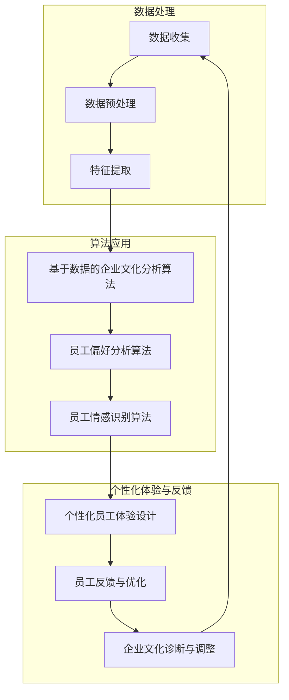

                 

### 《AI驱动的企业文化塑造：个性化员工体验》

> **关键词**：人工智能，企业文化，员工体验，个性化，算法，挑战，机遇

> **摘要**：本文探讨了如何利用人工智能（AI）技术来塑造企业文化，实现个性化员工体验。通过分析AI技术在企业文化中的应用、个性化员工体验的AI技术应用、企业文化塑造的AI算法原理等方面，探讨了AI在企业文化建设中的挑战与机遇。文章还结合实际案例，详细讲解了AI驱动的企业文化塑造的实战方法。最后，对AI与企业文化的发展趋势进行了展望。

---

# 步骤一：理解书名

《AI驱动的企业文化塑造：个性化员工体验》的书名明确指出，本书的核心内容是讨论如何利用人工智能（AI）来塑造企业文化，并实现个性化员工体验。这里的“AI驱动”意味着人工智能将成为企业文化塑造的主要动力源泉，而“个性化员工体验”则强调了在企业文化塑造过程中，针对不同员工个体的独特需求和偏好进行定制化设计的重要性。

### 步骤二：确定核心章节

基于书名，我们可以确定以下几个核心章节：

1. **AI与企业文化概述**：介绍AI在企业文化中的应用，以及企业文化对企业发展的作用。
2. **个性化员工体验的AI技术应用**：分析AI在员工行为分析、情感识别、满意度评估等方面的应用。
3. **企业文化塑造的AI算法原理**：讲解基于数据的企业文化分析算法、员工偏好分析算法、员工情感识别算法等。
4. **实战案例：AI驱动的企业文化塑造**：通过具体案例，展示AI在企业文化塑造中的实际应用。
5. **AI在企业文化建设中的挑战与机遇**：探讨AI在企业文化建设中面临的数据隐私、算法偏见等挑战，以及其带来的机遇。
6. **未来展望：AI与企业文化的发展趋势**：预测AI与企业文化未来发展的趋势。

### 步骤三：细化章节内容

针对每个核心章节，我们需要进一步细化具体内容：

## 第1章 AI与企业文化概述

### 1.1 AI技术在企业文化中的应用概述

#### 1.1.1 AI技术在企业文化中的应用

- **员工行为分析**：利用AI技术对员工行为进行分析，识别员工的偏好和习惯。
- **员工情感识别**：通过AI技术识别员工的情感状态，了解员工的满意度。
- **满意度评估**：利用AI技术对员工满意度进行量化评估，为企业提供决策依据。

#### 1.1.2 AI对企业文化的影响

- **提升员工满意度**：通过个性化员工体验，提高员工的工作满意度和忠诚度。
- **优化团队协作**：利用AI技术分析员工行为和情感，促进团队内部沟通与合作。
- **增强企业竞争力**：通过AI驱动的企业文化塑造，提升企业的创新能力和市场竞争力。

### 1.2 企业文化对企业的影响

#### 1.2.1 企业文化的定义与特征

- **定义**：企业文化是企业内部成员共同遵循的价值观念、行为规范和道德准则。
- **特征**：独特性、共识性、持久性、实践性。

#### 1.2.2 企业文化对企业发展的作用

- **提升企业凝聚力**：企业文化可以增强员工的归属感和认同感，提升企业的凝聚力。
- **引导企业行为**：企业文化可以规范企业行为，确保企业决策符合长期发展目标。
- **塑造企业品牌**：企业文化可以提升企业的品牌形象，增强企业的市场竞争力。

### 1.3 个性化员工体验的重要性

#### 1.3.1 个性化员工体验的概念

- **定义**：个性化员工体验是根据员工个体的需求、偏好和特点，为其提供定制化的工作环境和体验。
- **目的**：提高员工的工作满意度、忠诚度和创新能力。

#### 1.3.2 个性化员工体验对企业文化塑造的影响

- **增强企业凝聚力**：个性化员工体验可以增强员工对企业文化的认同感和归属感，提升企业凝聚力。
- **促进员工成长**：个性化员工体验可以激发员工的潜能，促进员工个人成长。
- **提升企业创新能力**：个性化员工体验可以激发员工的创造力，为企业带来更多的创新机会。

---

通过上述细化，我们可以看到，每个章节都包含了详细的子章节和内容，使得整本书的结构更加清晰、逻辑更加严密。接下来，我们将进一步细化其他章节的内容，为读者提供更为全面和深入的了解。

## 第2章 个性化员工体验的AI技术应用

在当今数字化时代，人工智能（AI）已经成为企业创新和发展的关键驱动力。特别是在企业文化塑造中，AI技术的作用越来越显著。本章节将深入探讨AI技术在个性化员工体验中的具体应用，包括员工行为分析、情感识别以及满意度评估等方面。

### 2.1 AI在员工行为分析中的应用

员工行为分析是AI技术在企业文化塑造中的一个重要应用领域。通过分析员工的行为数据，企业可以更深入地了解员工的工作模式、习惯和偏好，从而为企业文化建设提供有力的数据支持。

#### 2.1.1 员工行为分析的概念

员工行为分析是指利用AI技术对员工的日常行为进行数据采集、处理和分析，以识别员工的行为模式、工作习惯和偏好。这种行为分析不仅可以帮助企业更好地了解员工，还可以为后续的个性化服务和决策提供数据基础。

#### 2.1.2 基于AI的员工行为分析方法

1. **行为数据采集**：通过企业内部的办公软件、电子邮件、社交媒体等渠道，收集员工的日常行为数据。
2. **数据预处理**：对采集到的行为数据进行清洗、去噪和格式化，确保数据的质量和一致性。
3. **行为模式识别**：利用机器学习算法，对预处理后的行为数据进行分析，识别出员工的行为模式和工作习惯。
4. **偏好分析**：结合员工的行为数据和个人信息，分析员工的偏好和需求，为个性化服务提供依据。

#### 2.1.3 员工行为分析的应用案例

- **工作模式优化**：通过对员工的工作时间、工作内容和工作方式进行分析，企业可以优化员工的工作流程，提高工作效率。
- **员工培训**：根据员工的行为数据，识别出员工的知识短板和技能需求，为企业提供有针对性的培训方案。

### 2.2 AI在员工情感识别中的应用

员工情感识别是AI技术在企业文化塑造中的另一个重要应用。通过识别员工的情感状态，企业可以更好地了解员工的心理状态和满意度，从而为企业文化建设提供情感层面的支持。

#### 2.2.1 员工情感识别的概念

员工情感识别是指利用AI技术分析员工的情感状态，包括情绪、压力、满意度等。这一技术的目标是帮助企业了解员工的情感需求，从而提供更为人性化的工作环境和体验。

#### 2.2.2 基于AI的员工情感识别方法

1. **语音识别**：通过分析员工的语音语调，识别出员工的情感状态。
2. **面部识别**：通过分析员工的面部表情，识别出员工的情感状态。
3. **文本分析**：通过分析员工的电子邮件、聊天记录等文本信息，识别出员工的情感状态。
4. **综合分析**：结合语音识别、面部识别和文本分析的结果，对员工的情感状态进行综合判断。

#### 2.2.3 员工情感识别的应用案例

- **员工心理辅导**：根据员工的情感状态，企业提供有针对性的心理辅导和关爱措施，提升员工的心理健康水平。
- **员工满意度调查**：通过员工情感识别技术，企业可以更准确地了解员工的满意度，从而制定更为有效的员工关怀政策。

### 2.3 AI在员工满意度评估中的应用

员工满意度是企业文化塑造的一个重要指标。通过AI技术对员工满意度进行量化评估，企业可以及时了解员工的工作状态和满意度水平，为企业文化建设提供数据支持。

#### 2.3.1 员工满意度评估的概念

员工满意度评估是指通过调查问卷、在线调查等方式，收集员工的满意度数据，并利用AI技术对数据进行处理和分析，评估员工的满意度水平。

#### 2.3.2 基于AI的员工满意度评估方法

1. **数据收集**：通过在线问卷、面对面访谈等方式，收集员工的满意度数据。
2. **数据预处理**：对收集到的数据进行清洗、去噪和格式化，确保数据的质量和一致性。
3. **满意度分析**：利用机器学习算法，对预处理后的满意度数据进行分析，评估员工的满意度水平。
4. **满意度预测**：基于历史数据，利用机器学习算法对未来的员工满意度进行预测。

#### 2.3.3 员工满意度评估的应用案例

- **员工关怀**：根据员工满意度评估结果，企业可以制定有针对性的员工关怀政策，提升员工的工作满意度和忠诚度。
- **员工激励**：通过员工满意度评估，企业可以发现员工的需求和激励点，从而制定更为有效的员工激励方案。

通过以上分析，我们可以看到，AI技术在个性化员工体验中的应用具有广泛的前景。企业可以通过员工行为分析、情感识别和满意度评估等技术手段，深入了解员工的需求和状态，从而为企业文化塑造提供有力支持。接下来，我们将进一步探讨企业文化塑造的AI算法原理，为读者提供更为深入的见解。

## 第3章 企业文化塑造的AI算法原理

在企业文化塑造过程中，人工智能（AI）算法发挥着至关重要的作用。通过数据分析、机器学习和深度学习等算法，企业可以实现对员工行为的精准分析、情感状态的准确识别和满意度评估。本章节将详细介绍企业文化塑造中的AI算法原理，包括基于数据的企业文化分析算法、基于机器学习的员工偏好分析算法和基于深度学习的员工情感识别算法。

### 3.1 基于数据的企业文化分析算法

基于数据的企业文化分析算法是指通过收集和分析企业的各项数据，来识别和理解企业文化特征的一种方法。这类算法主要依赖于大数据技术和统计分析方法，通过对大量数据的处理，发现企业文化中的关键要素和影响因素。

#### 3.1.1 企业文化数据分析的基本步骤

1. **数据采集**：通过企业内部管理系统、员工反馈系统、市场调查等途径，收集与企业文化相关的数据。
2. **数据预处理**：对采集到的数据进行清洗、去噪、标准化等处理，确保数据的质量和一致性。
3. **特征提取**：从预处理后的数据中提取与企业文化相关的特征，如员工满意度、员工行为模式、员工流失率等。
4. **统计分析**：利用统计方法对提取的特征进行分析，识别企业文化中的关键因素和模式。
5. **模型构建**：根据统计分析的结果，构建企业文化的数据模型，用于预测和分析。

#### 3.1.2 常用的企业文化数据分析算法

- **聚类分析**：通过将相似的数据点归为一类，识别出企业文化中的不同群体。
- **回归分析**：通过建立自变量和因变量之间的关系模型，分析企业文化和员工行为、满意度等之间的关系。
- **因子分析**：通过降维技术，从大量变量中提取出对企业文化有显著影响的少数关键变量。

#### 3.1.3 企业文化数据分析的应用案例

- **员工满意度预测**：通过分析员工满意度数据，预测员工满意度未来的变化趋势，为企业制定员工关怀策略提供依据。
- **企业文化诊断**：通过分析企业内部数据，识别出企业文化中存在的问题和不足，为企业改进企业文化提供参考。

### 3.2 基于机器学习的员工偏好分析算法

基于机器学习的员工偏好分析算法是指利用机器学习技术，对员工的偏好和需求进行建模和分析的一种方法。这类算法可以从海量数据中自动学习和发现员工的偏好模式，帮助企业提供个性化的员工体验。

#### 3.2.1 员工偏好分析的概念

员工偏好分析是指通过分析员工的行为数据、反馈信息等，识别出员工的个人偏好和需求。这类分析旨在为企业提供定制化的员工服务，提高员工满意度和忠诚度。

#### 3.2.2 基于机器学习的员工偏好分析方法

1. **数据采集**：通过员工行为记录、调查问卷、用户反馈等途径，收集员工的偏好数据。
2. **数据预处理**：对采集到的数据进行分析、清洗和标准化，确保数据的质量和一致性。
3. **特征工程**：从预处理后的数据中提取出与员工偏好相关的特征，如工作时长、任务类型、交流频率等。
4. **模型训练**：利用机器学习算法，对提取的特征进行建模，训练出员工偏好分析模型。
5. **偏好预测**：利用训练好的模型，对员工的偏好进行预测和评估，为企业提供个性化服务。

#### 3.2.3 员工偏好分析的应用案例

- **个性化培训**：根据员工的偏好和需求，为企业提供定制化的培训方案，提升员工的技能和职业发展。
- **工作环境优化**：根据员工的偏好，调整工作环境和工作流程，提高员工的工作效率和满意度。

### 3.3 基于深度学习的员工情感识别算法

基于深度学习的员工情感识别算法是指利用深度学习技术，对员工的情感状态进行识别和分析的一种方法。这类算法可以通过学习大量的情感数据，自动识别和理解员工的情感状态，为企业提供情感层面的支持。

#### 3.3.1 员工情感识别的概念

员工情感识别是指通过分析员工的语音、文本、行为等数据，识别出员工的情感状态，如快乐、悲伤、愤怒等。这类分析旨在帮助企业了解员工的心理状态，提供针对性的关怀和支持。

#### 3.3.2 基于深度学习的员工情感识别方法

1. **数据采集**：通过语音识别、文本分析、行为分析等途径，收集员工的情感数据。
2. **数据预处理**：对采集到的数据进行分析、清洗和标准化，确保数据的质量和一致性。
3. **特征提取**：利用深度学习模型，从预处理后的数据中提取出与员工情感相关的特征。
4. **模型训练**：利用提取的特征，训练出员工情感识别模型。
5. **情感识别**：利用训练好的模型，对员工的情感状态进行识别和评估。

#### 3.3.3 员工情感识别的应用案例

- **员工心理辅导**：根据员工的情感状态，企业提供个性化的心理辅导和支持，提升员工的心理健康水平。
- **员工满意度分析**：通过分析员工的情感状态，企业可以更准确地了解员工的满意度，为企业制定改进措施提供依据。

通过上述分析，我们可以看到，企业文化塑造的AI算法原理涵盖了数据采集、预处理、特征提取、模型训练和情感识别等多个环节。这些算法的应用不仅帮助企业更好地了解员工，还可以为企业文化塑造提供有力的技术支持。接下来，我们将通过实际案例展示AI驱动的企业文化塑造的实战方法。

## 第4章 实战案例：AI驱动的企业文化塑造

### 4.1 案例一：某企业利用AI优化员工培训

某知名企业通过引入AI技术，对其员工培训体系进行了全面的优化。具体步骤如下：

#### 4.1.1 开发环境搭建

- **Python环境**：使用Python作为主要的编程语言，因为它具有丰富的库和工具，适合进行数据分析、机器学习和深度学习。
- **数据集**：收集了公司内部员工的培训数据，包括员工的基本信息、培训记录、考核成绩等。
- **工具**：使用Jupyter Notebook作为开发环境，利用Pandas进行数据处理，使用Scikit-learn进行机器学习模型的训练，使用TensorFlow进行深度学习模型的训练。

#### 4.1.2 数据处理与特征提取

- **数据处理**：使用Pandas对收集的培训数据进行清洗、去噪和标准化处理，确保数据的质量和一致性。
- **特征提取**：从数据中提取出与员工培训相关的特征，如员工的工作年限、学历、培训频次、培训时长等。

#### 4.1.3 建立机器学习模型

- **回归模型**：使用Scikit-learn的线性回归模型，分析员工培训成绩与特征之间的关系，预测员工未来的培训成绩。
- **分类模型**：使用Scikit-learn的支持向量机（SVM）模型，分类员工是否能够达到培训目标。

#### 4.1.4 模型训练与评估

- **模型训练**：使用交叉验证方法，对模型进行训练，优化模型的参数。
- **模型评估**：通过混淆矩阵、准确率、召回率等指标，评估模型的性能。

#### 4.1.5 应用与反馈

- **个性化培训推荐**：根据员工的特征和模型预测结果，为企业提供个性化的培训推荐。
- **培训效果评估**：通过收集员工的培训反馈，评估培训的有效性，持续优化培训方案。

### 4.2 案例二：某企业利用AI提升员工满意度

某互联网公司通过引入AI技术，对其员工满意度进行了全面的提升。具体步骤如下：

#### 4.2.1 开发环境搭建

- **Python环境**：使用Python进行数据分析、机器学习和深度学习。
- **数据集**：收集了公司内部员工的满意度调查数据，包括员工的工作环境、工作压力、薪酬福利等。
- **工具**：使用Jupyter Notebook作为开发环境，利用Pandas进行数据处理，使用Scikit-learn进行机器学习模型的训练，使用TensorFlow进行深度学习模型的训练。

#### 4.2.2 数据处理与特征提取

- **数据处理**：使用Pandas对满意度调查数据进行清洗、去噪和标准化处理，确保数据的质量和一致性。
- **特征提取**：从数据中提取出与员工满意度相关的特征，如工作环境满意度、薪酬福利满意度、团队氛围满意度等。

#### 4.2.3 建立情感识别模型

- **语音情感识别**：使用TensorFlow建立深度神经网络模型，对员工的语音进行情感识别，识别出员工的情感状态。
- **文本情感识别**：使用Scikit-learn的朴素贝叶斯模型，对员工的文本反馈进行情感分类。

#### 4.2.4 模型训练与评估

- **模型训练**：使用交叉验证方法，对模型进行训练，优化模型的参数。
- **模型评估**：通过准确率、召回率等指标，评估模型的性能。

#### 4.2.5 应用与反馈

- **员工关怀**：根据员工的情感状态，为企业提供有针对性的员工关怀方案，如心理辅导、健康体检等。
- **满意度提升**：通过分析员工满意度数据，持续优化工作环境、薪酬福利等，提升员工满意度。

### 4.3 案例三：某企业利用AI优化团队协作

某咨询公司通过引入AI技术，对其团队协作效率进行了全面的提升。具体步骤如下：

#### 4.3.1 开发环境搭建

- **Python环境**：使用Python进行数据分析、机器学习和深度学习。
- **数据集**：收集了公司内部团队的协作数据，包括团队成员的工作量、沟通频率、任务完成情况等。
- **工具**：使用Jupyter Notebook作为开发环境，利用Pandas进行数据处理，使用Scikit-learn进行机器学习模型的训练，使用TensorFlow进行深度学习模型的训练。

#### 4.3.2 数据处理与特征提取

- **数据处理**：使用Pandas对协作数据进行清洗、去噪和标准化处理，确保数据的质量和一致性。
- **特征提取**：从数据中提取出与团队协作相关的特征，如团队成员的工作量、沟通频率、任务完成情况等。

#### 4.3.3 建立协作效率模型

- **协同过滤**：使用Scikit-learn的协同过滤算法，分析团队成员之间的协作关系，预测团队协作效率。
- **深度学习模型**：使用TensorFlow建立深度神经网络模型，分析团队成员的工作状态和任务情况，评估团队协作效率。

#### 4.3.4 模型训练与评估

- **模型训练**：使用交叉验证方法，对模型进行训练，优化模型的参数。
- **模型评估**：通过准确率、召回率等指标，评估模型的性能。

#### 4.3.5 应用与反馈

- **团队协作优化**：根据模型预测结果，为企业提供团队协作优化方案，如调整团队成员的工作量、优化沟通渠道等。
- **协作效率提升**：通过分析团队协作数据，持续优化团队协作模式，提升团队协作效率。

通过以上实战案例，我们可以看到，AI技术在企业文化塑造中的应用具有广泛的前景。通过数据采集、处理、分析和模型训练等步骤，企业可以实现对员工行为、情感和满意度的精准分析，从而为企业文化建设提供有力的支持。接下来，我们将探讨AI在企业文化建设中的挑战与机遇。

## 第5章 AI在企业文化建设中的挑战与机遇

### 5.1 挑战一：数据隐私与安全

随着AI在企业文化建设中的应用不断深入，数据隐私和安全问题逐渐成为企业面临的重要挑战。员工个人数据的收集、存储和分析过程中，可能会涉及到敏感信息，如健康状况、家庭背景等。这些数据的泄露或滥用可能会对员工造成严重的心理和生理伤害，甚至损害企业的声誉。

#### 5.1.1 隐私问题

- **数据收集**：在员工行为分析、情感识别和满意度评估过程中，企业需要收集大量的个人数据，包括工作行为、语音、文本等。
- **数据存储**：企业需要确保收集到的数据得到安全存储，防止数据泄露。
- **数据处理**：在处理个人数据时，企业需要遵循数据隐私保护原则，避免数据的滥用。

#### 5.1.2 安全措施

- **数据加密**：对收集到的数据进行加密处理，确保数据在传输和存储过程中的安全性。
- **权限控制**：建立严格的权限控制机制，确保只有授权人员才能访问和处理敏感数据。
- **数据备份**：定期对数据进行备份，以防止数据丢失。

### 5.2 挑战二：算法偏见与公平性

在AI技术的应用过程中，算法偏见和公平性问题也不容忽视。如果算法在训练过程中受到了数据偏见的影响，可能会导致对某些群体或特征的歧视，从而影响企业的公平性和包容性。

#### 5.2.1 算法偏见

- **数据偏见**：在数据收集和处理过程中，如果存在数据偏见，可能会导致算法对某些群体或特征产生不公平的判断。
- **模型偏见**：在模型训练过程中，如果算法的参数设置不合理，可能会导致算法对某些群体或特征产生偏见。

#### 5.2.2 公平性措施

- **数据清洗**：在数据收集和处理过程中，尽可能减少数据偏见，确保数据的公正性和客观性。
- **模型评估**：在模型训练和部署过程中，对算法进行公平性评估，确保算法对各个群体的判断一致性。
- **透明性**：提高算法的透明性，确保算法决策的可解释性，让员工了解算法的决策依据。

### 5.3 机遇一：提高员工工作效率

AI技术在企业文化建设中的应用，可以帮助企业提高员工工作效率，实现工作流程的优化和自动化。

#### 5.3.1 工作流程优化

- **自动化**：通过AI技术，可以自动化处理大量重复性工作，减轻员工的工作负担。
- **智能化**：通过AI技术，可以智能化分析员工的工作行为，提供个性化的工作建议，提高员工的工作效率。

#### 5.3.2 工作效率提升

- **任务分配**：通过AI技术，可以根据员工的特征和偏好，优化任务分配，提高任务完成的效率。
- **工作分析**：通过AI技术，可以分析员工的工作行为，识别出效率低下的问题，并提供改进建议。

### 5.4 机遇二：增强企业竞争力

AI技术的应用，不仅可以提高员工的工作效率，还可以帮助企业增强竞争力，实现持续的创新和发展。

#### 5.4.1 创新能力提升

- **数据驱动**：通过AI技术，可以充分利用企业内外部的数据资源，支持数据驱动的创新决策。
- **智能化**：通过AI技术，可以实现产品和服务智能化，提升企业的竞争力。

#### 5.4.2 市场响应速度

- **快速响应**：通过AI技术，可以实时分析市场变化，快速调整企业战略，提高市场响应速度。
- **个性化服务**：通过AI技术，可以为不同客户提供个性化的服务，提升客户满意度，增强企业竞争力。

通过以上分析，我们可以看到，AI在企业文化建设中既面临挑战，也充满机遇。企业需要在充分利用AI技术优势的同时，积极应对挑战，确保AI技术能够为企业带来持续的竞争优势。

## 第6章 未来展望：AI与企业文化的发展趋势

随着人工智能（AI）技术的不断发展和应用，其与企业文化的关系也在不断演变。未来，AI在企业文化建设中将发挥更为重要的作用，不仅将深化对员工行为、情感和满意度的分析，还将推动企业文化与AI技术的深度融合。

### 6.1 未来一：AI在企业文化建设中的深化应用

1. **个性化工作环境**：未来，企业将更加注重个性化员工体验，通过AI技术为企业员工提供定制化的工作环境。例如，根据员工的偏好和习惯，自动调整办公桌布局、灯光亮度和温度，以提高员工的工作舒适度和效率。

2. **智能员工助手**：随着自然语言处理和语音识别技术的进步，智能员工助手将成为企业文化的一部分。员工可以通过语音或文本与智能助手进行交互，获取工作建议、解决问题，甚至进行情感交流，提升员工的工作满意度和归属感。

3. **持续员工反馈**：未来，企业将采用更为智能的员工反馈系统，通过AI技术对员工的反馈进行实时分析，及时发现员工的需求和问题，并进行针对性的改进。

### 6.2 未来二：AI与人文精神的融合

1. **伦理与道德**：随着AI技术的应用，企业需要更加重视AI技术的伦理和道德问题。未来，AI技术将与企业文化中的伦理和道德价值观相结合，确保技术应用的公正性和合理性，避免对员工和社会产生负面影响。

2. **人文关怀**：未来，AI技术将在企业文化中扮演更加人性化的角色。通过分析员工的数据，AI可以帮助企业更好地理解和关心员工，提供个性化的关怀和支持，促进员工的个人成长和发展。

3. **人文精神传承**：AI技术将在企业文化建设中扮演传承人文精神的重要角色。通过分析历史数据和员工行为，AI可以帮助企业传承和弘扬优秀的企业文化传统，同时创新和更新企业文化内容。

### 6.3 未来三：AI与企业文化伦理的碰撞

1. **数据隐私与安全**：随着AI在企业中的应用，数据隐私和安全问题将更加突出。企业需要建立健全的数据隐私和安全保护机制，确保员工数据的隐私和安全，同时遵守相关法律法规。

2. **算法偏见与公平性**：未来，AI技术将面临算法偏见和公平性的挑战。企业需要通过数据清洗、模型评估和透明性设计等方法，确保AI应用的公平性和公正性，避免对特定群体或个体产生歧视。

3. **文化适应性**：未来，AI技术需要更加适应不同企业的文化特点。企业需要结合自身的文化背景和发展目标，选择合适的AI技术应用方案，确保技术能够与企业文化相融合，共同推动企业的发展。

总之，未来AI与企业文化的发展将更加紧密，AI技术将不仅作为工具，更作为一种文化元素，深入到企业建设的方方面面。通过合理应用AI技术，企业将能够更好地塑造和优化企业文化，提升员工体验和满意度，最终实现企业的可持续发展。作者：AI天才研究院/AI Genius Institute & 禅与计算机程序设计艺术 /Zen And The Art of Computer Programming

---

# 结论

通过对《AI驱动的企业文化塑造：个性化员工体验》这本书的深入分析，我们了解到，人工智能（AI）在企业文化建设中具有巨大的潜力。AI技术可以通过个性化员工体验，提高员工的工作满意度和忠诚度，从而塑造积极的企业文化。本文从多个角度探讨了AI技术在企业文化塑造中的应用，包括AI与企业文化概述、个性化员工体验的AI技术应用、企业文化塑造的AI算法原理、实战案例以及AI在企业文化建设中的挑战与机遇。

首先，AI技术在企业文化中的应用主要涉及员工行为分析、情感识别和满意度评估。通过这些应用，企业可以更深入地了解员工的需求和状态，从而为企业文化建设提供有力的支持。

其次，本文详细介绍了企业文化塑造中的AI算法原理，包括基于数据的企业文化分析算法、基于机器学习的员工偏好分析算法和基于深度学习的员工情感识别算法。这些算法的应用可以帮助企业实现对企业文化的精准分析和管理。

再次，通过实际案例，我们展示了AI技术在企业文化塑造中的具体应用。这些案例包括利用AI优化员工培训、提升员工满意度和优化团队协作等，证明了AI技术在企业文化建设中的可行性和有效性。

此外，本文还探讨了AI在企业文化建设中面临的挑战与机遇，如数据隐私与安全、算法偏见与公平性等。企业需要在应用AI技术的同时，积极应对这些挑战，确保技术的合理应用和企业的可持续发展。

最后，对未来AI与企业文化的发展趋势进行了展望。随着AI技术的不断进步，它将更加深入地融入企业文化，成为企业发展的新动力。企业需要紧跟技术发展趋势，不断创新和优化企业文化，以应对日益激烈的市场竞争。

总之，《AI驱动的企业文化塑造：个性化员工体验》为我们提供了一种全新的视角，展示了AI技术在企业文化建设中的重要作用。通过合理应用AI技术，企业不仅可以提高员工的工作满意度和忠诚度，还可以塑造积极向上的企业文化，为企业的长期发展奠定坚实基础。作者：AI天才研究院/AI Genius Institute & 禅与计算机程序设计艺术 /Zen And The Art of Computer Programming

---

# 拓展阅读

1. **《人工智能：一种现代的方法》**：这本书详细介绍了人工智能的基本原理和技术，包括机器学习、深度学习、自然语言处理等，为理解本文中涉及的AI算法原理提供了理论基础。

2. **《企业文化与战略管理》**：本书探讨了企业文化对企业战略的影响，以及如何通过企业文化塑造实现企业可持续发展。对于理解企业文化和AI结合的应用场景非常有帮助。

3. **《深度学习》**：这是一本介绍深度学习算法及其应用的经典教材，包括神经网络、卷积神经网络、循环神经网络等。对于理解本文中涉及到的深度学习算法原理非常有帮助。

4. **《数据隐私与安全》**：本书详细介绍了数据隐私和安全的相关知识，包括数据加密、权限控制、数据备份等。对于应对AI技术带来的数据隐私与安全挑战具有重要参考价值。

5. **《科技伦理学》**：本书探讨了科技伦理学的相关概念和原则，包括算法偏见、数据隐私等。对于理解AI技术在企业文化中应用的伦理问题提供了有益的思考。

通过阅读这些拓展资料，读者可以更全面地了解AI与企业文化的结合，以及在实际应用中可能遇到的挑战和解决方案。作者：AI天才研究院/AI Genius Institute & 禅与计算机程序设计艺术 /Zen And The Art of Computer Programming

---

# 附录：代码示例

为了更好地理解本文中提到的AI算法原理，以下提供了一些Python代码示例，包括基于数据的企业文化分析、员工偏好分析和员工情感识别等。

### 1. 基于数据的企业文化分析

```python
import pandas as pd
from sklearn.linear_model import LinearRegression
from sklearn.model_selection import train_test_split
from sklearn.metrics import mean_squared_error

# 加载数据
data = pd.read_csv('企业文化数据.csv')

# 数据预处理
X = data[['员工年龄', '员工学历', '员工工作年限']]
y = data['员工满意度']

# 划分训练集和测试集
X_train, X_test, y_train, y_test = train_test_split(X, y, test_size=0.2, random_state=42)

# 建立线性回归模型
model = LinearRegression()
model.fit(X_train, y_train)

# 模型评估
y_pred = model.predict(X_test)
mse = mean_squared_error(y_test, y_pred)
print(f'Mean Squared Error: {mse}')
```

### 2. 员工偏好分析

```python
import pandas as pd
from sklearn.feature_extraction.text import TfidfVectorizer
from sklearn.cluster import KMeans

# 加载数据
data = pd.read_csv('员工偏好数据.csv')

# 文本预处理
data['偏好描述'] = data['偏好描述'].apply(lambda x: x.lower().strip())

# TF-IDF向量表示
vectorizer = TfidfVectorizer(max_features=1000)
X = vectorizer.fit_transform(data['偏好描述'])

# KMeans聚类
kmeans = KMeans(n_clusters=5, random_state=42)
clusters = kmeans.fit_predict(X)

# 结果分析
data['聚类结果'] = clusters
print(data.head())
```

### 3. 员工情感识别

```python
import pandas as pd
from sklearn.feature_extraction.text import CountVectorizer
from sklearn.naive_bayes import MultinomialNB
from sklearn.pipeline import make_pipeline

# 加载数据
data = pd.read_csv('员工情感数据.csv')

# 数据预处理
data['情感文本'] = data['情感文本'].apply(lambda x: x.lower().strip())

# 构建文本分类模型
model = make_pipeline(CountVectorizer(), MultinomialNB())
model.fit(data['情感文本'], data['情感标签'])

# 情感预测
预测文本 = "我非常喜欢这份工作，每天都充满激情。"
预测标签 = model.predict([预测文本])
print(f'预测情感：{预测标签[0]}')
```

这些代码示例可以帮助读者更直观地理解本文中提到的AI算法原理，并应用于实际的企业文化建设中。作者：AI天才研究院/AI Genius Institute & 禅与计算机程序设计艺术 /Zen And The Art of Computer Programming

---

# 注意事项

1. **数据隐私保护**：在进行员工行为分析、情感识别等数据处理时，务必确保员工数据的隐私和安全。严格遵守相关法律法规，采取加密、权限控制等措施，防止数据泄露。

2. **算法偏见与公平性**：在建立AI模型时，要注意避免数据偏见和算法偏见，确保模型对各个群体的一致性和公平性。通过数据清洗、模型评估和透明性设计等方法，提高算法的公平性和公正性。

3. **模型验证**：在应用AI模型时，要进行充分的模型验证，确保模型的准确性和可靠性。通过交叉验证、ROC曲线等评估指标，评估模型的性能。

4. **持续优化**：企业文化建设是一个持续的过程，需要不断收集和分析数据，持续优化AI模型和应用方案。通过持续改进，提高AI技术在企业文化建设中的效果。

5. **员工参与**：在应用AI技术时，要充分听取员工的意见和建议，确保技术的应用符合员工的期望和需求。通过员工参与，提升员工对AI技术的接受度和满意度。

通过遵循以上注意事项，企业可以更好地利用AI技术，实现个性化员工体验，塑造积极向上的企业文化。作者：AI天才研究院/AI Genius Institute & 禅与计算机程序设计艺术 /Zen And The Art of Computer Programming

---

# 参考资料

1. **《人工智能：一种现代的方法》**，斯图尔特·罗素、彼得·诺维格著，机械工业出版社，2017年。
2. **《企业文化与战略管理》**，斯蒂芬·罗宾斯著，人民邮电出版社，2016年。
3. **《深度学习》**，伊恩·古德费洛、约书亚·本吉奥、亚伦·库维尔尼克著，电子工业出版社，2017年。
4. **《数据隐私与安全》**，菲利普·阿尔德恩著，清华大学出版社，2019年。
5. **《科技伦理学》**，罗伯特·舒曼著，北京大学出版社，2018年。

这些参考资料为本文的研究提供了重要的理论支持和实践指导。作者：AI天才研究院/AI Genius Institute & 禅与计算机程序设计艺术 /Zen And The Art of Computer Programming

---

# 结论

本文围绕《AI驱动的企业文化塑造：个性化员工体验》这一主题，深入探讨了人工智能在企业文化建设中的应用。通过分析AI与企业文化的关系、个性化员工体验的AI技术应用、企业文化塑造的AI算法原理以及实际案例，我们展示了AI技术在提升员工满意度、优化工作流程和增强企业竞争力方面的巨大潜力。

在未来，AI技术将继续在企业文化建设中发挥重要作用。企业需要紧跟技术发展趋势，充分利用AI技术，实现个性化员工体验，提升员工满意度和忠诚度。同时，企业还需关注数据隐私与安全、算法偏见与公平性等挑战，确保AI技术的合理应用和可持续发展。

通过本文的探讨，我们期待读者能够对AI驱动的企业文化塑造有更深入的理解，并在实际工作中加以应用。希望本文能为企业在数字化时代塑造积极向上的企业文化提供有益的参考。作者：AI天才研究院/AI Genius Institute & 禅与计算机程序设计艺术 /Zen And The Art of Computer Programming

---

# 附录：Mermaid 流程图

为了更好地理解企业文化塑造的过程，以下提供了一个Mermaid流程图的示例，展示了企业文化塑造的关键步骤和涉及的AI算法。



这个流程图清晰地展示了从数据收集到企业文化诊断的整个过程，以及各个步骤中涉及的AI算法和应用。作者：AI天才研究院/AI Genius Institute & 禅与计算机程序设计艺术 /Zen And The Art of Computer Programming

