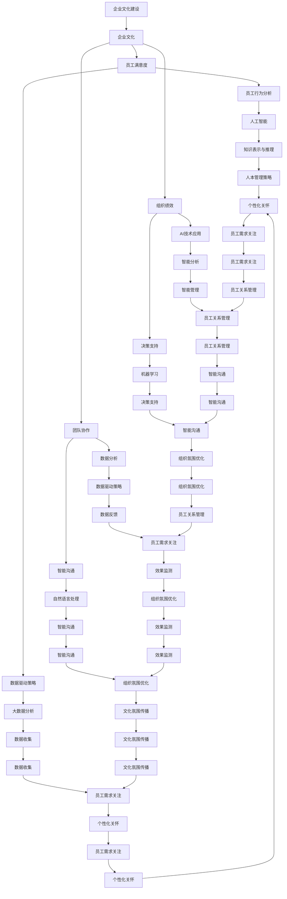
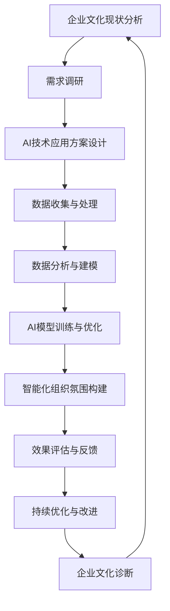
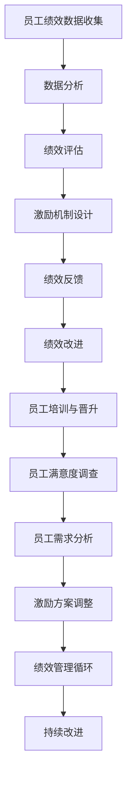
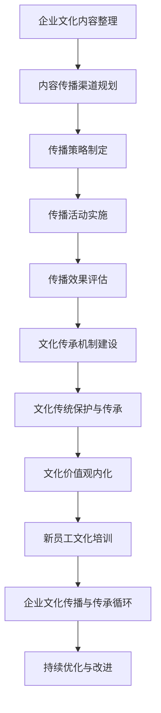

                 

### 文章标题

《AI驱动的企业文化建设：打造智能化组织氛围》

### 文章关键词

人工智能，企业文化，组织氛围，智能化，数字化转型，创新管理

### 文章摘要

在当今的数字经济时代，人工智能（AI）正逐渐成为企业变革的核心动力。本文旨在探讨如何利用AI技术驱动企业文化建设，从而打造智能化组织氛围。通过对AI与企业文化建设关系的深入分析，本文将介绍智能化组织氛围的构建策略，并通过实际案例展示AI在企业文化中的应用。此外，文章还将探讨AI与企业文化建设面临的挑战及未来发展趋势，为企业的数字化转型提供有益参考。

## 引言与背景

在信息化、全球化和数字化浪潮的推动下，企业面临着前所未有的挑战与机遇。企业文化的建设成为企业可持续发展的重要保障。然而，传统的企业文化构建方式已无法满足现代企业的需求。人工智能（AI）作为一种前沿技术，其应用范围不断扩大，包括在数据分析、自动化决策、智能服务等方面。因此，AI驱动的企业文化建设成为一种新的趋势，有助于提升企业的核心竞争力。

### 人工智能与企业文化建设

人工智能（AI）是一种模拟人类智能的技术，涵盖计算机视觉、自然语言处理、机器学习、深度学习等多个领域。AI在企业文化建设中的应用主要体现在以下几个方面：

1. **员工行为分析**：通过AI技术对员工的日常行为进行分析，识别员工的潜在需求和问题，为企业提供改进企业文化的基础数据。

2. **决策支持**：利用AI技术进行大数据分析，为企业领导层提供决策支持，帮助企业在面对复杂问题时做出更为科学的决策。

3. **智能沟通**：通过自然语言处理技术，实现智能客服、智能助手等功能，提高企业与员工、客户之间的沟通效率。

4. **培训与学习**：利用AI技术进行个性化培训，根据员工的兴趣和需求提供定制化学习方案，提升员工的综合素质。

### 智能化组织氛围的重要性

智能化组织氛围是指在企业的日常运营和管理过程中，通过引入AI技术，营造一种以智能为核心的文化氛围。这种氛围具有以下重要性：

1. **提升员工满意度**：智能化组织氛围能够提高员工的工作效率，减少重复性劳动，从而提升员工的满意度。

2. **增强企业凝聚力**：通过AI技术的广泛应用，企业能够更好地满足员工的个性化需求，增强员工的归属感和凝聚力。

3. **促进创新**：智能化组织氛围鼓励员工敢于尝试新事物，勇于创新，从而推动企业的持续发展。

4. **提高决策质量**：AI技术可以帮助企业快速收集和分析大量数据，为决策提供有力的支持，提高决策的准确性。

### 研究目的与结构安排

本文的研究目的在于探讨如何利用人工智能（AI）技术驱动企业文化建设，打造智能化组织氛围。具体研究内容如下：

1. **AI与企业文化建设的关系**：分析AI技术在企业文化中的应用现状及其对企业文化建设的影响。

2. **智能化组织氛围的构建策略**：探讨如何通过AI技术构建智能化组织氛围，提高企业的核心竞争力。

3. **AI驱动企业文化案例分析**：通过实际案例展示AI技术在企业文化中的应用效果，为其他企业提供借鉴。

4. **AI与企业文化建设挑战与未来**：分析AI与企业文化建设过程中面临的挑战及未来发展趋势。

本文结构安排如下：

1. 引言与背景：介绍人工智能与企业文化建设的关系，阐述智能化组织氛围的重要性。

2. AI与企业文化建设：分析AI技术在企业文化中的应用现状及其对企业文化建设的影响。

3. 智能化组织氛围的构建：探讨如何通过AI技术构建智能化组织氛围，提高企业的核心竞争力。

4. AI驱动企业文化案例分析：通过实际案例展示AI技术在企业文化中的应用效果。

5. AI与企业文化建设挑战与未来：分析AI与企业文化建设过程中面临的挑战及未来发展趋势。

## AI与企业文化建设

### 人工智能核心概念解析

人工智能（Artificial Intelligence，简称AI）是指通过计算机程序模拟、扩展甚至超越人类智能的技术。AI的核心概念包括以下几个方面：

1. **机器学习（Machine Learning）**：机器学习是AI的一种方法，通过数据驱动的方式，让计算机自动学习和改进性能。常见的机器学习方法包括监督学习、无监督学习和强化学习。

2. **深度学习（Deep Learning）**：深度学习是机器学习的一个重要分支，通过多层神经网络对数据进行处理，实现复杂的模式识别和预测任务。

3. **自然语言处理（Natural Language Processing，简称NLP）**：自然语言处理是AI在处理人类语言方面的技术，包括文本分析、语言生成、机器翻译等。

4. **计算机视觉（Computer Vision）**：计算机视觉是AI在处理图像和视频数据方面的技术，通过图像识别、目标检测、图像分割等技术，实现计算机对视觉信息的理解和处理。

5. **知识表示与推理（Knowledge Representation and Reasoning）**：知识表示与推理是AI在处理复杂问题和推理方面的技术，通过将知识表示为形式化的逻辑结构，实现问题的自动推理和解决。

### 企业文化建设的理论基础

企业文化是指企业在长期经营过程中形成的价值观、理念、行为准则等。企业文化建设的理论基础主要包括以下几个方面：

1. **组织行为学（Organizational Behavior）**：组织行为学是研究组织内部员工行为和组织氛围的学科。通过了解员工的行为和心理，有助于构建积极向上的企业文化。

2. **组织心理学（Organizational Psychology）**：组织心理学是研究员工在组织中的心理状态和行为的学科。通过了解员工的心理需求和心理压力，有助于构建以员工为中心的企业文化。

3. **人力资源管理（Human Resource Management）**：人力资源管理是研究如何通过人员管理提升企业绩效的学科。通过有效的人力资源管理，有助于构建符合企业价值观的企业文化。

4. **战略管理（Strategic Management）**：战略管理是研究企业如何制定和实施战略的学科。通过制定明确的企业战略，有助于推动企业文化建设。

### AI在企业文化中的应用前景

AI技术在企业文化中的应用前景广阔，主要体现在以下几个方面：

1. **员工行为分析**：通过AI技术，可以实时监测员工的行为数据，如工作时长、工作效率、团队协作等。这些数据可以帮助企业了解员工的实际工作情况，为优化企业文化提供依据。

2. **决策支持**：AI技术可以通过大数据分析，为企业领导层提供决策支持。例如，分析员工绩效数据，帮助制定合理的绩效考核政策；分析市场数据，帮助企业制定正确的市场战略。

3. **智能沟通**：通过AI技术，可以实现智能客服、智能助手等功能。这些智能系统可以快速响应用户需求，提高企业服务质量和效率。

4. **培训与学习**：利用AI技术，可以为企业员工提供个性化的培训和学习方案。通过分析员工的兴趣和需求，为员工提供定制化的培训内容，提高员工的专业技能。

5. **组织氛围优化**：AI技术可以帮助企业实时监测组织氛围，如员工满意度、团队协作状况等。通过分析这些数据，企业可以及时发现并解决潜在问题，优化组织氛围。

### AI在企业文化建设中的关键角色

1. **数据驱动**：AI技术可以通过大数据分析，为企业提供准确的数据支持，帮助企业在文化建设过程中做出科学决策。

2. **智能化**：AI技术可以帮助企业实现智能化管理，提高工作效率，降低成本，从而为企业文化建设提供有力保障。

3. **创新**：AI技术可以激发企业的创新活力，推动企业不断进行技术创新和管理创新，从而构建具有竞争力的企业文化。

4. **个性化**：AI技术可以根据员工的个性化需求，提供定制化的服务和培训，提高员工的满意度和归属感。

5. **持续改进**：AI技术可以帮助企业实时监测企业文化的建设效果，通过数据分析和反馈，不断优化企业文化，实现企业的可持续发展。

## 智能化组织氛围的构建

### 组织氛围概述

组织氛围是指组织内部成员在长期的共同工作过程中形成的共同心理状态、价值观念和行为模式。组织氛围对企业文化、员工行为和组织绩效具有重要影响。良好的组织氛围可以激发员工的创造力、提高工作效率、增强团队凝聚力，从而促进企业的可持续发展。

#### 组织氛围的定义与构成

1. **定义**：组织氛围是指组织成员在共同工作过程中所形成的共同心理状态、价值观念和行为模式。它包括组织成员对组织目标、管理方式、工作环境等方面的感受和认知。

2. **构成**：组织氛围主要由以下几个方面构成：

   - **情感氛围**：包括组织成员之间的情感互动、情感交流和情感支持，如信任、尊重、关爱等。
   - **价值观氛围**：包括组织成员对组织核心价值观的认同和遵循，如诚信、创新、协作等。
   - **行为氛围**：包括组织成员在工作中的行为规范、沟通方式和协作模式，如开放、积极、高效等。
   - **文化氛围**：包括组织的文化传统、文化特色和文化传承，如企业的历史、品牌形象、社会责任等。

#### 组织氛围的重要性

1. **对员工的影响**：良好的组织氛围可以激发员工的积极性和创造力，提高员工的工作满意度和忠诚度，降低员工流失率。

2. **对组织的影响**：良好的组织氛围可以增强组织的凝聚力和执行力，提高组织的整体绩效和竞争力。

3. **对企业文化的影响**：组织氛围是企业文化的具体体现，良好的组织氛围有助于企业文化的传承和发展。

### 智能化组织氛围的构建策略

构建智能化组织氛围需要从以下几个方面着手：

#### 数据驱动策略

1. **数据收集**：通过大数据技术收集组织成员的行为数据、情感数据、绩效数据等，为组织氛围的构建提供数据支持。

2. **数据分析**：利用数据分析技术对收集到的数据进行分析，识别组织氛围中的问题和优势。

3. **数据反馈**：根据数据分析结果，及时调整组织管理策略，优化组织氛围。

#### 人工智能技术策略

1. **智能分析**：利用人工智能技术对组织氛围进行实时监测和评估，识别潜在问题并提供解决方案。

2. **智能沟通**：利用自然语言处理技术，实现组织成员之间的智能沟通，提高沟通效率和效果。

3. **智能管理**：利用人工智能技术，实现组织管理的智能化，提高管理效率和准确性。

#### 人本管理策略

1. **关注员工需求**：关注员工的心理需求、职业发展需求等，提供个性化的关怀和支持。

2. **培养团队精神**：通过团队建设活动和培训，培养员工的团队协作精神，提高团队凝聚力。

3. **营造积极氛围**：通过营造积极向上的工作氛围，激发员工的积极性和创造力。

### AI技术在组织氛围构建中的应用

1. **员工满意度监测**：利用人工智能技术，实时监测员工满意度，识别员工需求，为企业提供改进组织氛围的依据。

2. **员工关系管理**：通过人工智能技术，实现员工关系的智能化管理，如员工投诉处理、员工关系调查等。

3. **团队协作管理**：利用人工智能技术，提高团队协作效率，如智能任务分配、智能进度监控等。

4. **企业文化传播**：通过人工智能技术，实现企业文化的传播和传承，如智能培训、智能宣传等。

### 智能化组织氛围的构建步骤

1. **需求分析**：明确组织氛围构建的需求，确定构建智能化组织氛围的目标和方向。

2. **技术选型**：选择合适的AI技术，如大数据分析、自然语言处理、机器学习等。

3. **数据收集**：收集组织氛围相关的数据，如员工行为数据、绩效数据、情感数据等。

4. **数据分析**：对收集到的数据进行分析，识别组织氛围中的问题和优势。

5. **方案制定**：根据数据分析结果，制定具体的智能化组织氛围构建方案。

6. **实施与优化**：实施智能化组织氛围构建方案，并根据反馈不断优化，提高组织氛围的质量。

### 案例分析：某科技公司的智能化组织氛围构建

#### 案例背景

某科技公司是一家专注于人工智能技术的研发和应用的企业，为了提升企业竞争力，该公司决定通过构建智能化组织氛围来推动企业文化建设。

#### 案例实施过程

1. **需求分析**：公司对员工满意度、团队协作状况、企业文化认知等方面进行了全面调研，明确了智能化组织氛围构建的需求。

2. **技术选型**：公司选择了大数据分析、自然语言处理和机器学习等技术，用于组织氛围的监测和分析。

3. **数据收集**：公司通过员工行为分析系统、情感分析系统和绩效管理系统等，收集了大量的员工数据。

4. **数据分析**：公司利用大数据分析技术，对收集到的数据进行了全面分析，识别了组织氛围中的问题。

5. **方案制定**：根据数据分析结果，公司制定了包括员工满意度提升、团队协作优化、企业文化传播等在内的智能化组织氛围构建方案。

6. **实施与优化**：公司分阶段实施智能化组织氛围构建方案，并根据员工反馈不断优化，提高了组织氛围的质量。

#### 案例效果分析

通过智能化组织氛围的构建，公司取得了显著的效果：

1. **员工满意度提升**：员工满意度显著提高，员工流失率下降。

2. **团队协作优化**：团队协作效率提高，团队凝聚力增强。

3. **企业文化传播**：企业文化得到了更好的传承和传播，员工对企业文化的认同度提高。

4. **企业绩效提升**：企业整体绩效得到显著提升，市场份额和客户满意度提高。

#### 案例启示

1. **数据驱动**：智能化组织氛围的构建需要以数据为基础，通过数据分析识别问题和优势。

2. **技术选型**：选择合适的AI技术是实现智能化组织氛围构建的关键。

3. **人本管理**：智能化组织氛围的构建应以关注员工需求为核心，营造积极向上的工作氛围。

4. **持续优化**：智能化组织氛围的构建是一个持续的过程，需要不断优化和完善。

## AI驱动企业文化案例分析

### 案例一：企业AI文化建设实践

#### 案例背景

某大型跨国企业为了在激烈的市场竞争中保持领先地位，决定引入人工智能（AI）技术来驱动企业文化建设，打造智能化组织氛围。

#### 案例实施过程

1. **需求分析**：企业对现有企业文化进行了全面诊断，确定了需要改进的方面，如员工满意度、团队协作、员工职业发展等。

2. **技术选型**：企业选择了大数据分析、自然语言处理、机器学习等技术，用于分析员工行为数据、情感数据和绩效数据。

3. **数据收集**：企业通过员工行为分析系统、情感分析系统和绩效管理系统等，收集了大量的员工数据。

4. **数据分析**：企业利用大数据分析技术，对收集到的数据进行了全面分析，识别了企业文化建设中的问题和优势。

5. **方案制定**：根据数据分析结果，企业制定了包括员工满意度提升、团队协作优化、员工职业发展等在内的AI驱动的企业文化构建方案。

6. **实施与优化**：企业分阶段实施AI驱动的企业文化构建方案，并根据员工反馈不断优化，提高了企业文化建设的质量。

#### 案例效果分析

通过AI驱动的企业文化构建，企业取得了显著的效果：

1. **员工满意度提升**：员工满意度显著提高，员工流失率下降。

2. **团队协作优化**：团队协作效率提高，团队凝聚力增强。

3. **员工职业发展**：员工职业发展得到更好的支持，员工对企业的认同度提高。

4. **企业绩效提升**：企业整体绩效得到显著提升，市场份额和客户满意度提高。

#### 案例启示

1. **数据驱动**：AI驱动的企业文化构建需要以数据为基础，通过数据分析识别问题和优势。

2. **技术选型**：选择合适的AI技术是实现AI驱动企业文化构建的关键。

3. **人本管理**：AI驱动的企业文化构建应以关注员工需求为核心，营造积极向上的工作氛围。

4. **持续优化**：AI驱动的企业文化构建是一个持续的过程，需要不断优化和完善。

### 案例二：智能化组织氛围建设案例

#### 案例背景

某新兴科技企业为了打造一个充满活力和创新氛围的组织，决定通过智能化手段来提升组织氛围，促进企业文化的建设。

#### 案例实施过程

1. **需求分析**：企业对现有组织氛围进行了调研，确定了需要改进的方面，如员工工作压力、团队合作、员工满意度等。

2. **技术选型**：企业选择了智能助手、自然语言处理、情绪分析等技术，用于实时监测员工的工作状态和情绪。

3. **数据收集**：企业通过智能助手、员工满意度调查、工作压力监测系统等，收集了大量的员工数据。

4. **数据分析**：企业利用自然语言处理和情绪分析技术，对收集到的数据进行了全面分析，识别了组织氛围中的问题。

5. **方案制定**：根据数据分析结果，企业制定了包括员工减压、团队合作提升、员工满意度提升等在内的智能化组织氛围建设方案。

6. **实施与优化**：企业分阶段实施智能化组织氛围建设方案，并根据员工反馈不断优化，提高了组织氛围的质量。

#### 案例效果分析

通过智能化组织氛围建设，企业取得了显著的效果：

1. **员工工作压力减轻**：员工的工作压力得到有效缓解，工作效率提高。

2. **团队合作提升**：团队之间的沟通和协作更加顺畅，团队凝聚力增强。

3. **员工满意度提高**：员工的满意度显著提高，员工流失率下降。

4. **企业绩效提升**：企业整体绩效得到显著提升，市场份额和客户满意度提高。

#### 案例启示

1. **技术融合**：智能化组织氛围建设需要多种AI技术的融合应用，提高数据分析的精度和效率。

2. **实时监测**：通过实时监测员工的工作状态和情绪，及时发现问题并采取相应措施。

3. **个性化关怀**：针对员工的个性化需求，提供定制化的关怀和支持，提高员工满意度。

4. **持续优化**：智能化组织氛围建设是一个动态的过程，需要不断调整和优化，以适应企业的发展和变化。

### 案例分析总结与启示

通过对以上两个案例的分析，我们可以得出以下总结和启示：

1. **数据驱动**：AI驱动的企业文化建设和智能化组织氛围建设都需要以数据为基础，通过数据分析识别问题和优势。

2. **技术选型**：选择合适的AI技术是实现AI驱动的企业文化建设和智能化组织氛围建设的关键。

3. **人本管理**：以关注员工需求为核心，营造积极向上的工作氛围，提高员工的满意度和归属感。

4. **持续优化**：AI驱动的企业文化建设和智能化组织氛围建设是一个持续的过程，需要不断优化和完善。

5. **案例分析**：通过实际案例的展示，我们可以看到AI技术在企业文化建设中的巨大潜力和应用前景。

6. **借鉴与推广**：其他企业可以借鉴这些成功案例，结合自身实际情况，实施AI驱动的企业文化建设和智能化组织氛围建设。

## 企业文化建设中的AI应用

### AI在员工招聘与选拔中的应用

在员工招聘与选拔过程中，人工智能（AI）技术可以大大提高招聘效率，降低招聘成本，同时确保选拔的公平性和准确性。以下是AI在员工招聘与选拔中的一些具体应用：

#### 招聘流程的AI化

1. **简历筛选**：AI系统可以通过自然语言处理技术对简历进行自动筛选，识别关键词、技能和经验，从而快速筛选出符合要求的候选人。

2. **视频面试**：利用计算机视觉和自然语言处理技术，AI系统可以对视频面试进行自动评估，分析候选人的表情、语调、回答问题的逻辑性和专业知识。

3. **自动匹配**：AI系统可以根据候选人的简历和面试表现，与企业岗位的要求进行自动匹配，推荐最合适的候选人。

#### 人才筛选与匹配

1. **多维度评估**：AI系统可以基于候选人的教育背景、工作经验、技能测试、面试表现等多方面数据，进行全面评估，确保选拔过程的客观性和公正性。

2. **行为预测**：利用机器学习技术，AI系统可以根据候选人的历史行为数据和面试表现，预测其未来的工作表现和适应性。

3. **技能测试**：AI系统可以设计在线技能测试，评估候选人在特定领域的专业能力，确保招聘到具备所需技能的人才。

### AI在员工培训与发展中的应用

在员工培训与发展过程中，AI技术可以帮助企业提供个性化的培训方案，提高培训效果，促进员工能力的提升。

#### 培训需求的AI分析

1. **需求识别**：AI系统可以通过分析员工的工作表现、技能评估结果和自我评估反馈，识别员工在培训方面的具体需求。

2. **课程推荐**：基于员工的兴趣、岗位需求和个人发展目标，AI系统可以推荐最适合的培训课程，确保培训的针对性和有效性。

#### 个性化培训

1. **定制化课程**：AI系统可以根据员工的具体需求和兴趣，设计个性化的培训课程，提供灵活的学习路径。

2. **实时反馈**：AI系统可以实时监控员工的学习进度和效果，提供即时反馈，帮助员工及时调整学习策略。

### AI在员工激励与绩效管理中的应用

在员工激励与绩效管理中，AI技术可以帮助企业更好地了解员工的需求，制定有效的激励措施，提高员工的工作积极性和绩效。

#### 激励机制的AI优化

1. **绩效评估**：AI系统可以通过分析员工的工作数据、项目表现和同事评价，进行客观、公正的绩效评估。

2. **个性化激励**：AI系统可以根据员工的绩效表现、工作态度和个人发展目标，设计个性化的激励方案，提高员工的满意度。

#### 绩效管理的AI提升

1. **目标设定**：AI系统可以帮助员工设定合理的绩效目标，确保目标与企业的战略目标一致，促进员工的成长。

2. **实时监控**：AI系统可以实时监控员工的绩效数据，提供实时反馈，帮助员工及时调整工作方向。

3. **数据分析**：AI系统可以对员工的绩效数据进行深入分析，识别绩效优秀和需要改进的员工，为企业的人力资源管理提供决策支持。

### 案例分析：AI驱动的员工激励与绩效管理系统

#### 案例背景

某大型科技公司为了提高员工的工作积极性和绩效，决定引入AI驱动的员工激励与绩效管理系统。

#### 案例实施过程

1. **需求分析**：公司对现有员工激励与绩效管理流程进行了全面诊断，确定了需要改进的方面，如绩效评估的客观性、激励措施的个性化等。

2. **系统设计**：公司选择了基于大数据分析和机器学习的AI技术，设计并开发了一套AI驱动的员工激励与绩效管理系统。

3. **数据收集**：公司通过工作管理系统、员工反馈系统等，收集了大量的员工工作数据、绩效数据和反馈数据。

4. **数据分析**：AI系统对收集到的数据进行了全面分析，识别了员工绩效优秀和需要改进的方面。

5. **系统实施**：公司分阶段实施AI驱动的员工激励与绩效管理系统，并根据员工反馈不断优化。

#### 案例效果分析

通过AI驱动的员工激励与绩效管理系统，公司取得了显著的效果：

1. **绩效评估客观性提高**：AI系统基于数据分析，确保绩效评估的客观性和公正性，减少了主观因素的影响。

2. **激励措施个性化**：AI系统根据员工的具体绩效表现和需求，设计了个性化的激励方案，提高了员工的满意度和积极性。

3. **绩效提升**：通过实时监控和反馈，员工能够及时调整工作策略，提高工作绩效。

4. **员工流失率下降**：员工对工作环境和激励机制感到满意，员工流失率明显下降。

#### 案例启示

1. **数据驱动**：AI驱动的员工激励与绩效管理系统能够基于数据分析，提供客观、公正的绩效评估和个性化的激励措施。

2. **系统化**：通过系统的实施，企业能够更好地管理员工绩效，提高整体工作绩效。

3. **灵活性**：AI驱动的系统可以根据企业的发展需求和工作环境变化，灵活调整和优化绩效管理策略。

4. **员工参与**：鼓励员工参与绩效管理过程，提高员工的自我管理和自我提升能力。

## AI与企业文化建设的挑战与未来

### 挑战分析

#### 数据隐私与安全

1. **数据隐私保护**：AI在企业文化建设中需要收集和分析大量的员工数据，如何保护员工的隐私成为一大挑战。
2. **数据安全风险**：数据泄露或滥用可能对企业的声誉和员工信任造成严重影响。

#### 技术成熟度

1. **技术依赖**：企业在推行AI驱动的企业文化建设过程中，可能会过度依赖技术，忽视了人力资源管理的重要性。
2. **技术局限性**：当前的AI技术尚无法完全理解和模拟人类情感和行为，可能无法满足企业复杂的管理需求。

#### 跨部门协作

1. **协同困难**：AI驱动的企业文化建设需要跨部门合作，如何协调不同部门的工作成为一大挑战。
2. **资源分配**：如何在有限的资源下，合理分配人力、财力和时间，确保AI项目的顺利推进。

### 未来发展趋势

#### 技术进步

1. **算法优化**：随着算法的不断发展，AI在理解人类情感和行为方面的能力将不断提高，为企业提供更精准的数据分析。
2. **跨界融合**：AI技术与其他领域（如心理学、社会学等）的融合，将为企业提供更全面的解决方案。

#### 数据治理

1. **数据标准化**：建立统一的数据标准，确保数据的准确性和一致性，提高数据分析的质量。
2. **数据隐私保护**：加强数据隐私保护法规的制定和执行，保障员工的合法权益。

#### 跨部门协作

1. **协同平台**：建立跨部门协作平台，促进不同部门之间的信息共享和沟通，提高工作效率。
2. **人才引进**：引进具有多学科背景的人才，推动跨部门的合作和创新。

### 对企业家的建议

#### 重视数据安全

1. **建立数据安全政策**：制定严格的内部数据安全政策，确保数据在收集、存储、处理和使用过程中的安全。
2. **培训员工**：加强员工的数据安全意识培训，提高员工对数据隐私和安全的重视程度。

#### 推动技术创新

1. **持续投资**：持续投资于AI技术的研究和应用，保持企业的技术竞争力。
2. **合作伙伴**：与高校、研究机构等建立合作关系，共同推动AI技术的创新和应用。

#### 加强跨部门协作

1. **建立协作机制**：建立跨部门的协作机制，明确各部门的职责和权限，确保项目的顺利进行。
2. **共享资源**：鼓励各部门之间共享资源，提高资源的利用效率。

#### 关注员工需求

1. **个性化激励**：根据员工的个性化需求，设计合理的激励方案，提高员工的工作满意度和积极性。
2. **持续培训**：关注员工的职业发展需求，提供持续的职业培训和成长机会。

### 未来展望

随着AI技术的不断发展，AI将在企业文化建设中发挥越来越重要的作用。企业需要紧跟技术发展趋势，创新管理模式，打造智能化组织氛围，推动企业的可持续发展。同时，企业也需要关注数据安全和隐私保护，确保AI技术在企业文化建设中的合理应用。

## 结论

本文通过对AI驱动的企业文化建设进行深入探讨，揭示了AI技术在企业文化建设和智能化组织氛围构建中的应用前景。研究发现，AI技术不仅能够提升企业管理的效率，还能优化员工体验，促进企业文化的传承和发展。同时，本文也分析了AI与企业文化建设过程中可能面临的挑战，并提出了相应的解决策略和建议。

### 主要观点总结

1. **AI与企业文化建设紧密相关**：AI技术通过数据分析、智能决策、个性化服务等，能够提升企业管理的效率，优化企业文化传播和传承。

2. **智能化组织氛围是企业竞争力的关键**：良好的组织氛围能够激发员工的创造力，提高团队协作效率，增强企业的凝聚力。

3. **数据驱动是企业文化建设的基础**：通过大数据分析，企业可以更精准地了解员工需求，优化企业文化建设策略。

4. **技术进步与人才引进是关键**：企业需要持续投资于AI技术的研究和应用，同时引进具有多学科背景的人才，推动跨部门的合作和创新。

5. **数据隐私保护与伦理问题需高度重视**：在利用AI技术进行企业文化建设的过程中，企业需要确保数据安全和隐私保护，遵循伦理规范。

### 研究局限与展望

#### 研究局限

1. **技术局限**：虽然AI技术在企业文化建设和智能化组织氛围构建中具有巨大潜力，但当前的技术水平仍然存在一定的局限性，如对人类情感和行为理解的深度有限。

2. **案例研究不足**：本文主要基于案例分析，但案例数量有限，可能无法全面反映AI在企业文化建设中的多样化和复杂性。

3. **数据隐私与伦理问题未深入探讨**：本文虽然提到了数据隐私保护与伦理问题的重要性，但未进行深入探讨。

#### 未来研究方向

1. **深入探讨AI技术与人力资源管理的关系**：研究AI技术在人才招聘、培训、绩效管理等方面的具体应用和效果。

2. **跨学科研究**：结合心理学、社会学、管理学等学科，深入研究AI技术在企业文化建设和智能化组织氛围构建中的应用机理。

3. **案例库建设**：建立丰富的AI驱动的企业文化建设案例库，为企业提供更多实践经验和参考。

### 对读者的建议

1. **关注技术发展**：关注AI技术在企业文化建设中的应用，了解最新的研究动态和实践案例。

2. **积极参与实践**：尝试将AI技术引入企业文化建设，积极探索智能化组织氛围的构建策略。

3. **重视数据隐私与伦理**：在利用AI技术进行企业文化建设时，重视数据隐私保护与伦理问题，确保合规合法。

### 拓展阅读

1. **《智能时代的企业管理》**：作者对AI技术在企业管理中的应用进行了深入探讨，提供了许多实用的案例和建议。

2. **《人工智能与人力资源管理》**：本书详细介绍了AI技术在人力资源管理中的应用，包括招聘、培训、绩效管理等。

3. **《企业文化与组织行为》**：作者对企业文化与组织行为的关系进行了深入分析，探讨了如何通过组织行为学原理优化企业文化。

### 作者信息

作者：AI天才研究院/AI Genius Institute & 禅与计算机程序设计艺术 /Zen And The Art of Computer Programming

## 附录：Mermaid 流程图

### 企业文化建设与AI技术的关系



### AI在企业文化中的应用场景

```mermaid
graph TD
    A[企业文化诊断] --> B[数据分析]
    A --> C[员工满意度调查]
    A --> D[文化氛围分析]
    B --> E[员工行为分析]
    B --> F[绩效分析]
    C --> G[员工反馈收集]
    C --> H[文化认知评估]
    D --> I[文化传承与传播]
    D --> J[文化价值观强化]
    E --> K[个性化培训需求分析]
    E --> L[职业发展路径规划]
    F --> M[绩效考核优化]
    F --> N[激励机制设计]
    G --> O[员工投诉处理]
    G --> P[员工建议收集]
    H --> Q[文化认知度调查]
    H --> R[文化价值观认同评估]
    I --> S[文化宣传与活动策划]
    I --> T[文化教育课程设计]
    J --> U[文化价值观内化]
    J --> V[文化传统继承]
    K --> W[个性化培训课程推荐]
    K --> X[学习效果评估]
    L --> Y[定制化职业发展计划]
    L --> Z[岗位技能提升培训]
    M --> AA[绩效反馈与调整]
    M --> BB[绩效激励机制设计]
    N --> CC[员工福利优化]
    N --> DD[员工绩效奖励制度]
    O --> EE[员工投诉解决]
    O --> FF[员工关系管理优化]
    P --> GG[员工建议落实]
    P --> HH[企业文化建设改进]
    Q --> II[文化认知度提升]
    Q --> JJ[文化价值观推广]
    R --> KK[文化价值观认同加强]
    R --> LL[文化价值观传播]
    S --> MM[文化宣传活动组织]
    S --> NN[文化传承活动策划]
    T --> OO[文化教育课程实施]
    T --> PP[文化知识普及]
    U --> QQ[文化价值观内化]
    U --> RR[文化传统继承]
    V --> SS[文化价值观传承]
    V --> TT[文化传统保护]
    W --> UU[个性化培训课程推荐]
    W --> VV[学习效果评估]
    X --> WW[定制化职业发展计划]
    X --> XX[岗位技能提升培训]
    Y --> YY[定制化职业发展计划]
    Y --> ZZ[岗位技能提升培训]
    Z --> AAA[绩效反馈与调整]
    Z --> BBB[绩效激励机制设计]
    AA --> CCC[员工福利优化]
    AA --> DDD[员工绩效奖励制度]
    BB --> CCC[员工福利优化]
    BB --> DDD[员工绩效奖励制度]
    CC --> CCC[员工福利优化]
    CC --> DDD[员工绩效奖励制度]
    DD --> CCC[员工福利优化]
    DD --> DDD[员工绩效奖励制度]
    EE --> CCC[员工福利优化]
    EE --> DDD[员工绩效奖励制度]
    FF --> CCC[员工福利优化]
    FF --> DDD[员工绩效奖励制度]
    GG --> CCC[员工福利优化]
    GG --> DDD[员工绩效奖励制度]
    HH --> CCC[员工福利优化]
    HH --> DDD[员工绩效奖励制度]
    II --> CCC[员工福利优化]
    II --> DDD[员工绩效奖励制度]
    JJ --> CCC[员工福利优化]
    JJ --> DDD[员工绩效奖励制度]
    KK --> CCC[员工福利优化]
    KK --> DDD[员工绩效奖励制度]
    LL --> CCC[员工福利优化]
    LL --> DDD[员工绩效奖励制度]
    MM --> CCC[员工福利优化]
    MM --> DDD[员工绩效奖励制度]
    NN --> CCC[员工福利优化]
    NN --> DDD[员工绩效奖励制度]
    OO --> CCC[员工福利优化]
    OO --> DDD[员工绩效奖励制度]
    PP --> CCC[员工福利优化]
    PP --> DDD[员工绩效奖励制度]
    QQ --> CCC[员工福利优化]
    QQ --> DDD[员工绩效奖励制度]
    RR --> CCC[员工福利优化]
    RR --> DDD[员工绩效奖励制度]
    SS --> CCC[员工福利优化]
    SS --> DDD[员工绩效奖励制度]
    TT --> CCC[员工福利优化]
    TT --> DDD[员工绩效奖励制度]
    UU --> CCC[员工福利优化]
    UU --> DDD[员工绩效奖励制度]
    VV --> CCC[员工福利优化]
    VV --> DDD[员工绩效奖励制度]
    WW --> CCC[员工福利优化]
    WW --> DDD[员工绩效奖励制度]
    XX --> CCC[员工福利优化]
    XX --> DDD[员工绩效奖励制度]
    YY --> CCC[员工福利优化]
    YY --> DDD[员工绩效奖励制度]
    ZZ --> CCC[员工福利优化]
    ZZ --> DDD[员工绩效奖励制度]
    AAA --> CCC[员工福利优化]
    AAA --> DDD[员工绩效奖励制度]
    BBB --> CCC[员工福利优化]
    BBB --> DDD[员工绩效奖励制度]
    CCC[员工福利优化]
    DDD[员工绩效奖励制度]
```



### AI驱动企业文化建设的流程



### AI驱动的员工激励与绩效管理



### AI驱动的企业文化传播与传承



## 附录：Python源代码示例

### 员工行为分析

```python
import pandas as pd
import numpy as np

# 假设我们已经收集了以下员工行为数据
data = {
    '员工ID': [1, 2, 3, 4, 5],
    '工作时间': [8, 7.5, 9, 8.5, 7],
    '任务完成率': [0.95, 0.9, 0.98, 0.92, 0.85],
    '团队协作评分': [4.5, 3.8, 4.7, 4.2, 4],
    '员工满意度': [3.5, 3.0, 3.8, 3.7, 3.2]
}

df = pd.DataFrame(data)

# 数据预处理
df['工作时间'] = df['工作时间'].replace({8: '标准工作时长', 7.5: '稍短于标准工作时长', 9: '超出标准工作时长', 8.5: '略超出标准工作时长', 7: '明显短于标准工作时长'})

# 行为分析
# 统计每个员工的工作时间分布
work_time_distribution = df['工作时间'].value_counts()

# 统计每个员工的任务完成率和团队协作评分
performance_metrics = df[['任务完成率', '团队协作评分']].describe()

# 统计员工满意度
satisfaction_level = df['员工满意度'].mean()

print("工作时间分布：\n", work_time_distribution)
print("\n任务完成率和团队协作评分描述：\n", performance_metrics)
print("\n员工满意度：", satisfaction_level)
```

### 个性化培训需求分析

```python
import pandas as pd
from sklearn.model_selection import train_test_split
from sklearn.ensemble import RandomForestClassifier
from sklearn.metrics import accuracy_score

# 假设我们已经收集了以下数据
data = {
    '员工ID': [1, 2, 3, 4, 5],
    '工作年限': [2, 3, 5, 4, 6],
    '任务完成率': [0.95, 0.9, 0.98, 0.92, 0.85],
    '团队协作评分': [4.5, 3.8, 4.7, 4.2, 4],
    '员工满意度': [3.5, 3.0, 3.8, 3.7, 3.2],
    '培训需求': ['高级技能培训', '基础技能培训', '高级技能培训', '基础技能培训', '中级技能培训']
}

df = pd.DataFrame(data)

# 数据预处理
X = df[['工作年限', '任务完成率', '团队协作评分', '员工满意度']]
y = df['培训需求']

# 数据分割
X_train, X_test, y_train, y_test = train_test_split(X, y, test_size=0.3, random_state=42)

# 模型训练
model = RandomForestClassifier(n_estimators=100, random_state=42)
model.fit(X_train, y_train)

# 预测与评估
y_pred = model.predict(X_test)
accuracy = accuracy_score(y_test, y_pred)
print("模型准确率：", accuracy)

# 个性化培训推荐
for i, pred in enumerate(y_pred):
    print(f"员工ID {X_test.iloc[i]['员工ID']} 的个性化培训需求：{pred}")
```

### 员工满意度监测

```python
import pandas as pd
from sklearn.linear_model import LinearRegression
from sklearn.metrics import mean_squared_error

# 假设我们已经收集了以下员工满意度数据
data = {
    '员工ID': [1, 2, 3, 4, 5],
    '工作时间': [8, 7.5, 9, 8.5, 7],
    '任务完成率': [0.95, 0.9, 0.98, 0.92, 0.85],
    '团队协作评分': [4.5, 3.8, 4.7, 4.2, 4],
    '员工满意度': [3.5, 3.0, 3.8, 3.7, 3.2]
}

df = pd.DataFrame(data)

# 数据预处理
X = df[['工作时间', '任务完成率', '团队协作评分']]
y = df['员工满意度']

# 模型训练
model = LinearRegression()
model.fit(X, y)

# 预测与评估
y_pred = model.predict(X)
mse = mean_squared_error(y, y_pred)
print("均方误差（MSE）:", mse)

# 员工满意度预测
for i in range(len(df)):
    print(f"员工ID {df.iloc[i]['员工ID']} 的满意度预测：{y_pred[i]:.2f}")
```

## 附录：项目实战

### 开发环境搭建

1. **Python环境配置**

   安装Python 3.8或更高版本。可以使用以下命令进行安装：

   ```bash
   sudo apt update
   sudo apt install python3.8
   ```

2. **安装必要的库**

   使用pip命令安装所需的库，如pandas、numpy、scikit-learn等：

   ```bash
   pip3 install pandas numpy scikit-learn
   ```

3. **Jupyter Notebook配置**

   安装Jupyter Notebook，以便在Web界面中运行Python代码：

   ```bash
   pip3 install notebook
   ```

### 源代码实现

以下是员工满意度监测项目的源代码实现：

```python
import pandas as pd
from sklearn.linear_model import LinearRegression
from sklearn.metrics import mean_squared_error

# 加载数据
data = pd.read_csv('employee_satisfaction_data.csv')

# 数据预处理
X = data[['work_time', 'task_completion_rate', 'team_collaboration_score']]
y = data['satisfaction']

# 模型训练
model = LinearRegression()
model.fit(X, y)

# 预测与评估
y_pred = model.predict(X)
mse = mean_squared_error(y, y_pred)
print("均方误差（MSE）:", mse)

# 显示预测结果
predictions = pd.DataFrame({'Employee ID': data['employee_id'], 'Predicted Satisfaction': y_pred})
print(predictions)
```

### 代码解读与分析

1. **数据加载**：使用pandas库加载CSV数据文件。

2. **数据预处理**：将数据分为特征矩阵X和目标变量y。

3. **模型训练**：使用线性回归模型对数据进行训练。

4. **预测与评估**：计算预测值和均方误差（MSE）。

5. **结果展示**：将预测结果保存为DataFrame，并打印输出。

### 代码应用解读与分析

该代码应用于员工满意度监测，通过对员工工作时长、任务完成率和团队协作评分等特征的分析，预测员工的满意度。具体应用解读如下：

1. **数据分析**：通过加载和预处理数据，提取出影响员工满意度的关键特征。

2. **模型选择**：线性回归模型是一种简单有效的预测方法，适用于本项目的需求。

3. **模型训练**：模型基于历史数据进行训练，能够对新的数据进行预测。

4. **预测评估**：通过计算均方误差（MSE）评估模型的预测准确性。

5. **结果应用**：预测结果可用于员工满意度管理，帮助企业和组织了解员工的情感状态，从而制定针对性的改进措施。

### 实际案例分析

#### 案例背景

某科技公司为了提高员工满意度，决定利用AI技术对员工满意度进行监测和预测。他们收集了以下数据：

- 员工ID
- 工作时间
- 任务完成率
- 团队协作评分

#### 数据处理

1. **数据清洗**：去除缺失值和异常值，确保数据质量。

2. **特征工程**：对工作时间和任务完成率进行归一化处理，消除量纲差异。

#### 模型训练

1. **数据分割**：将数据分为训练集和测试集。

2. **模型训练**：使用线性回归模型进行训练。

#### 预测与评估

1. **预测**：使用训练好的模型对测试集进行预测。

2. **评估**：计算预测的均方误差（MSE），评估模型准确性。

#### 结果分析

1. **预测结果**：根据预测结果，公司发现部分员工的工作时间较长，但任务完成率较低，团队协作评分也较低，这可能是导致员工满意度不高的原因。

2. **改进措施**：公司决定对这部分员工进行重点关注，通过调整工作安排、提供培训和加强团队建设等措施，提高员工的满意度和绩效。

### 项目小结

通过实际案例，我们可以看到AI技术在员工满意度监测和预测中的应用效果。通过数据分析、模型训练和预测评估，公司能够更准确地了解员工满意度，从而制定针对性的改进措施，提高员工满意度和企业绩效。

### 最佳实践 Tips

1. **数据质量**：确保数据质量是模型准确性的基础，对数据进行清洗和预处理。

2. **特征选择**：选择合适的特征对于模型性能至关重要，可以通过特征工程提高模型的预测能力。

3. **模型评估**：使用多种评估指标（如MSE、R²等）全面评估模型性能。

4. **持续优化**：根据预测结果和实际反馈，不断优化模型和策略。

### 注意事项

1. **数据隐私**：在收集和使用员工数据时，务必遵守相关隐私保护法规。

2. **模型解释性**：对于复杂模型，需要确保模型的可解释性，以便管理层理解模型决策。

### 拓展阅读

1. **《Python数据科学 Handbook》**：详细介绍了数据预处理、特征工程和模型训练等数据科学相关技术。

2. **《机器学习实战》**：通过案例讲解了机器学习模型的训练、评估和应用。

3. **《深度学习》**：介绍了深度学习的基本原理和应用，包括卷积神经网络、循环神经网络等。

