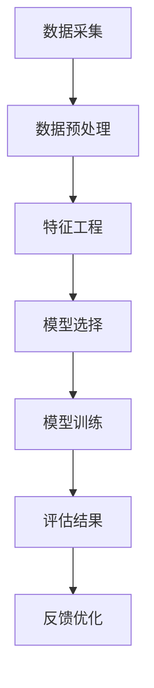

                 

# AI驱动的企业文化评估：量化组织文化指标

> 关键词：企业文化评估、AI、量化指标、机器学习、自然语言处理、深度学习

> 摘要：本文探讨了AI驱动的企业文化评估方法，通过量化组织文化指标，利用机器学习和自然语言处理技术，为企业提供精准、高效的评估结果。文章从企业文化评估的概述、基础理论、量化指标、AI算法应用等多个方面进行了详细阐述，旨在为企业提供一套系统、科学的评估体系，助力企业持续优化和发展。

## 第1章: AI驱动的企业文化评估概述

### 1.1 什么是企业文化评估

企业文化是企业核心价值的体现，是企业长期发展过程中的精神财富。企业文化评估是对企业文化现状、特点及其对企业绩效影响的一种科学评价。通过企业文化评估，企业可以了解自身文化建设的优势和不足，从而制定针对性的改进策略。

#### 1.1.1 企业文化的定义

企业文化是指企业在长期经营过程中所形成的共同价值观、行为规范、工作作风和管理理念等非物质财富。它包括以下几个方面：

1. **企业使命**：企业存在的根本目的和长期愿景。
2. **企业愿景**：企业未来的发展方向和目标。
3. **核心价值观**：企业核心的信仰和理念，如诚信、创新、团队协作等。
4. **行为规范**：员工在工作中应遵守的行为准则。
5. **管理理念**：企业对管理活动的基本观念和原则。

#### 1.1.2 企业文化评估的重要性

企业文化评估对于企业具有以下几个方面的意义：

1. **帮助企业了解自身文化现状**：通过评估，企业可以清晰地认识到自身文化的优点和不足，为后续改进提供依据。
2. **提升企业竞争力**：优秀的企业文化能够增强员工的归属感和凝聚力，提高员工的工作积极性，进而提升企业的整体竞争力。
3. **促进企业持续发展**：企业文化评估有助于企业不断完善和优化文化，推动企业持续健康发展。

### 1.2 AI在企业文化评估中的应用

随着人工智能技术的快速发展，AI在企业文化评估中的应用越来越广泛。AI可以通过以下方式提升企业文化评估的准确性和效率：

1. **数据挖掘**：AI能够从大量数据中提取有价值的信息，帮助企业发现潜在的问题和机会。
2. **自动化处理**：AI可以自动化完成数据采集、处理和分析等任务，降低评估成本，提高评估效率。
3. **智能分析**：AI可以运用机器学习和自然语言处理技术，对评估结果进行深入分析和预测，为企业提供更准确的评估结果。

### 1.3 企业文化评估的挑战

尽管AI在企业文化评估中具有巨大优势，但企业仍然面临一些挑战：

1. **数据获取的困难**：企业文化评估需要大量的数据支持，但企业内部的数据分布不均，数据质量参差不齐，获取完整、可靠的数据具有很大挑战。
2. **评估指标的选取**：企业文化评估涉及多个方面，如何选择合适的评估指标，确保评估的全面性和准确性，是一个重要问题。
3. **评估方法的多样性**：企业文化评估方法多样，如何选择最合适的评估方法，是评估成功的关键。

### 1.4 AI驱动的企业文化评估的优势

1. **自动化处理**：AI可以自动化完成数据采集、处理和分析等任务，大幅降低人力成本，提高工作效率。
2. **高效性**：AI可以快速处理大量数据，提供实时评估结果，帮助企业迅速做出决策。
3. **精准性**：AI通过机器学习和自然语言处理技术，可以对评估结果进行深入分析，提高评估的准确性。
4. **可扩展性**：AI可以灵活调整和扩展评估模型，适应企业不同发展阶段的需求。

### 1.5 本书结构安排

本书将从以下四个方面进行阐述：

1. **AI驱动的企业文化评估概述**：介绍企业文化评估的基本概念、重要性及AI在评估中的应用。
2. **AI驱动的企业文化评估基础**：阐述AI的基础理论、企业文化指标体系、数据采集与处理方法及模型选择与训练。
3. **量化组织文化指标**：介绍量化组织文化指标的定义、类型及量化方法。
4. **AI算法在企业文化评估中的应用**：探讨数据预处理、特征工程、模型选择及深度学习模型在企业文化评估中的应用。

### 1.6 小结

本章介绍了AI驱动的企业文化评估的背景、重要性、应用优势以及面临的挑战。通过AI技术，企业文化评估将变得更加高效、精准和可扩展，为企业文化建设提供有力支持。在接下来的章节中，我们将深入探讨AI驱动的企业文化评估的具体实现方法和实践应用。

### 1.7 未来展望

随着AI技术的不断进步，企业文化评估将迎来更多创新和突破。未来，我们将看到以下趋势：

1. **更多数据来源**：随着物联网、大数据等技术的发展，企业文化评估的数据来源将更加丰富，为评估提供更多支持。
2. **更精细化的评估**：AI技术将能够深入挖掘企业文化细节，为企业提供更精确的评估结果。
3. **智能化决策支持**：基于AI的企业文化评估系统将为企业提供智能化的决策支持，助力企业持续优化和提升。

### 1.8 读者建议

对于希望深入了解AI驱动的企业文化评估的读者，建议从以下几个方面进行学习和实践：

1. **理论学习**：了解AI、机器学习和自然语言处理等基础理论，掌握企业文化评估的基本概念和方法。
2. **项目实践**：参与实际的企业文化评估项目，积累实践经验，提高应用能力。
3. **持续学习**：关注AI技术的发展动态，不断学习和更新知识，跟上时代的步伐。

## 第2章: AI驱动的企业文化评估基础

### 2.1 AI基础理论

#### 2.1.1 机器学习概述

机器学习（Machine Learning，ML）是人工智能（Artificial Intelligence，AI）的一个重要分支，它通过构建和训练模型，使计算机具备自动学习和预测能力。机器学习的主要目的是从数据中提取特征，并利用这些特征进行分类、回归、聚类等任务。

#### 2.1.1.1 机器学习的定义

机器学习是一种使计算机具备自主学习能力的技术，它通过训练模型，使计算机能够在没有明确编程指令的情况下，自动从数据中学习并做出决策。

#### 2.1.1.2 机器学习的分类

根据学习方式和应用场景的不同，机器学习可以分为以下几类：

1. **监督学习**（Supervised Learning）：在有标注的数据集上进行训练，模型能够根据输入特征预测输出结果。常见的算法有线性回归、逻辑回归、支持向量机（SVM）等。
2. **无监督学习**（Unsupervised Learning）：在无标注的数据集上进行训练，模型旨在发现数据中的隐藏结构和规律。常见的算法有聚类、主成分分析（PCA）等。
3. **半监督学习**（Semi-Supervised Learning）：结合有标注和无标注数据，通过少量标注数据提升模型性能。
4. **强化学习**（Reinforcement Learning）：通过试错法学习最优策略，模型在与环境的交互中不断优化自己的行为。

#### 2.1.2 深度学习原理

深度学习（Deep Learning，DL）是机器学习的一个分支，它通过构建多层神经网络，对数据进行特征提取和分类。深度学习在图像识别、语音识别、自然语言处理等领域取得了显著成果。

#### 2.1.2.1 深度学习的定义

深度学习是一种基于多层神经网络的学习方法，它通过堆叠多个隐藏层，使模型能够自动提取数据的层次化特征。

#### 2.1.2.2 神经网络的基础架构

神经网络由多个神经元（节点）组成，每个神经元都是一个简单的计算单元。神经网络的基本架构包括：

1. **输入层**：接收外部输入数据。
2. **隐藏层**：对输入数据进行特征提取和变换。
3. **输出层**：生成最终的输出结果。

#### 2.1.3 自然语言处理

自然语言处理（Natural Language Processing，NLP）是人工智能的一个重要分支，它旨在使计算机理解和处理人类语言。NLP在文本分类、情感分析、机器翻译等领域具有广泛的应用。

#### 2.1.3.1 自然语言处理的基本概念

自然语言处理的基本概念包括：

1. **分词**（Tokenization）：将文本拆分成单词或短语。
2. **词性标注**（Part-of-Speech Tagging）：对文本中的单词进行词性分类。
3. **词向量表示**（Word Embedding）：将单词映射到高维向量空间。
4. **文本分类**（Text Classification）：对文本进行分类，如垃圾邮件检测、情感分析等。

#### 2.1.3.2 常见的NLP任务

常见的NLP任务包括：

1. **文本分类**（Text Classification）：根据文本的内容将其分类到不同的类别中。
2. **情感分析**（Sentiment Analysis）：分析文本中的情感倾向，如正面、负面或中性。
3. **命名实体识别**（Named Entity Recognition，NER）：识别文本中的特定实体，如人名、地点、组织等。
4. **机器翻译**（Machine Translation）：将一种语言的文本翻译成另一种语言。

### 2.2 企业文化指标体系

企业文化指标体系是企业文化评估的基础，它包括一系列用于衡量企业文化表现的具体指标。这些指标可以从多个维度反映企业文化的现状和特点。

#### 2.2.1 企业文化指标的定义

企业文化指标是指用于衡量企业文化表现的具体指标，它们可以是定量的，也可以是定性的。定量的指标通常可以通过数据采集和分析得到，而定性的指标则需要通过主观评估和问卷调查等方式获得。

#### 2.2.2 企业文化指标的类型

企业文化指标可以分为以下几类：

1. **绩效指标**：衡量企业文化对企业绩效的影响，如员工绩效、团队绩效等。
2. **员工满意度指标**：反映员工对企业文化的满意度，如员工满意度调查、员工忠诚度等。
3. **创新能力指标**：衡量企业文化对创新能力的支持程度，如知识管理、创新产出等。
4. **企业社会责任指标**：评估企业文化在社会责任方面的表现，如企业社会责任评估、环境评估等。

#### 2.2.3 企业文化指标的选择与设计

选择和设计企业文化指标时，需要考虑以下因素：

1. **企业特点**：根据企业的行业、规模、发展阶段等特性，选择合适的指标。
2. **指标相关性**：选择与企业文化直接相关的指标，确保评估结果具有实际意义。
3. **数据可获得性**：选择易于采集和获取数据的指标，确保评估的可操作性。
4. **指标权重**：根据指标的重要性和影响力，合理分配权重，确保评估结果的全面性和准确性。

#### 2.2.4 企业文化指标体系的构建

构建企业文化指标体系的过程可以分为以下几步：

1. **确定评估目标**：明确企业文化评估的目的和方向，为指标选择提供依据。
2. **选择指标类型**：根据评估目标，选择适合的绩效指标、员工满意度指标、创新能力指标和企业社会责任指标。
3. **设计指标细节**：明确每个指标的具体含义、计算方法和数据来源。
4. **权重分配**：根据指标的重要性和影响力，合理分配权重。
5. **指标验证**：通过实际应用，验证指标体系的可行性和有效性。

### 2.3 数据采集与处理

数据采集与处理是企业文化评估的基础，它关系到评估结果的准确性和可靠性。数据采集与处理主要包括以下步骤：

#### 2.3.1 数据来源

企业文化评估的数据来源可以分为以下几类：

1. **内部数据**：企业内部的运营数据、财务数据、人力资源数据等。
2. **外部数据**：来自市场、行业、竞争对手等外部数据源的数据。
3. **问卷调查**：通过员工、管理层、客户等群体的问卷调查获取数据。
4. **文本数据**：从企业内部文档、报告、公告等文本数据中提取有价值的信息。

#### 2.3.2 数据采集方法

数据采集方法包括以下几种：

1. **自动化采集**：通过企业信息系统、传感器等设备，自动化采集数据。
2. **人工采集**：通过员工、管理层等人员的参与，人工填写问卷、访谈等方式采集数据。
3. **公开数据**：从政府、行业协会、研究机构等公开渠道获取数据。

#### 2.3.3 数据预处理

数据预处理是数据采集后的重要步骤，它包括以下任务：

1. **数据清洗**：去除数据中的噪声、错误和异常值，确保数据质量。
2. **数据转换**：将数据转换为适合分析的形式，如数值化、归一化等。
3. **数据集成**：将来自不同数据源的数据进行整合，形成一个统一的数据集。
4. **数据降维**：通过降维技术，减少数据维度，提高分析效率。

#### 2.3.4 数据质量评估

数据质量评估是确保数据准确性和可靠性的重要环节，它包括以下内容：

1. **数据完整性**：评估数据是否完整，是否有缺失值。
2. **数据准确性**：评估数据是否准确，是否有错误或异常值。
3. **数据一致性**：评估数据是否一致，是否来自同一数据源。
4. **数据可靠性**：评估数据的可信度和可靠性。

### 2.4 模型选择与训练

在企业文化评估中，模型的选择与训练至关重要。合适的模型可以提高评估的准确性和效率，而良好的训练过程可以确保模型性能的稳定和可靠。

#### 2.4.1 常见的企业文化评估模型

常见的企业文化评估模型包括以下几种：

1. **线性回归模型**：用于分析企业文化指标与绩效指标之间的关系。
2. **逻辑回归模型**：用于分析企业文化指标与员工满意度、创新力等指标之间的关系。
3. **聚类分析模型**：用于分析企业文化类型的分布和特征。
4. **神经网络模型**：用于深度学习，提取数据中的复杂特征，进行高级的评估和预测。

#### 2.4.2 模型选择依据

选择企业文化评估模型时，需要考虑以下因素：

1. **评估目标**：根据评估目标选择合适的模型，如线性回归模型适用于简单的关系分析，而神经网络模型适用于复杂特征提取。
2. **数据类型**：根据数据类型选择合适的模型，如文本数据适合使用神经网络模型，而数值数据适合使用线性回归模型。
3. **模型性能**：选择性能较好的模型，通过交叉验证等方法评估模型性能。
4. **计算资源**：考虑模型的计算复杂度，选择在现有计算资源下可以运行的模型。

#### 2.4.3 模型训练与优化

模型训练与优化是确保模型性能的关键步骤，它包括以下内容：

1. **数据划分**：将数据集划分为训练集、验证集和测试集，用于训练、验证和测试模型。
2. **模型训练**：使用训练集对模型进行训练，调整模型参数，使其适应数据。
3. **模型验证**：使用验证集评估模型性能，调整模型参数，以获得更好的性能。
4. **模型测试**：使用测试集评估模型在未知数据上的性能，确保模型具有良好的泛化能力。

### 2.5 小结

本章介绍了AI驱动的企业文化评估基础，包括AI基础理论、企业文化指标体系、数据采集与处理、模型选择与训练等内容。这些基础理论和方法为后续的企业文化评估提供了重要的支持和指导。在下一章中，我们将进一步探讨如何量化组织文化指标，为企业文化评估提供更具体、更科学的依据。

### 2.6 未来展望

随着AI技术的不断发展和应用，企业文化评估将面临更多的机遇和挑战。未来，我们可以期待以下发展趋势：

1. **更多数据来源**：随着物联网、大数据等技术的普及，企业文化评估将能够获取更多类型的数据，如社交网络数据、员工行为数据等，提高评估的准确性和全面性。
2. **更智能的评估模型**：基于深度学习和自然语言处理的智能评估模型将不断涌现，能够自动提取数据中的复杂特征，提供更准确的评估结果。
3. **更高效的评估流程**：AI技术将自动化完成数据采集、处理、分析等任务，提高评估效率，降低人力成本。
4. **个性化评估**：基于个性化推荐算法，企业文化评估将能够根据企业的具体需求，提供个性化的评估报告和建议，帮助企业优化文化建设。

### 2.7 读者建议

对于希望深入了解AI驱动的企业文化评估的读者，以下是一些建议：

1. **理论学习**：深入学习AI、机器学习、自然语言处理等基础理论，了解企业文化评估的基本概念和方法。
2. **实践应用**：参与实际的企业文化评估项目，将理论知识应用到实际中，提高实践能力。
3. **持续学习**：关注AI技术的发展动态，学习最新的研究成果和技术应用，保持专业知识的更新。
4. **交流合作**：参与行业交流，与其他企业和专家分享经验和见解，共同推动企业文化评估的发展。

## 第3章: 量化组织文化指标

### 3.1 量化组织文化指标的定义

量化组织文化指标是指通过量化的方式衡量企业文化各个方面的重要指标。这些指标可以反映企业文化的核心价值、员工行为、组织绩效等多个方面。量化指标使得企业文化评估更加科学、客观，有利于企业进行有效的文化管理和优化。

#### 3.1.1 量化组织文化指标的含义

量化组织文化指标的含义可以从以下几个方面进行理解：

1. **文化核心价值**：通过量化指标来衡量企业文化中核心价值观的体现，如诚信、创新、团队协作等。
2. **员工行为**：通过量化指标来衡量员工在工作中的行为表现，如工作积极性、责任感、团队合作能力等。
3. **组织绩效**：通过量化指标来衡量企业文化对企业绩效的影响，如员工满意度、创新能力、客户满意度等。
4. **文化氛围**：通过量化指标来衡量企业内部的文化氛围，如员工关系、企业价值观的传播等。

#### 3.1.2 量化组织文化指标的重要性

量化组织文化指标的重要性主要体现在以下几个方面：

1. **提高评估准确性**：通过量化指标，可以将企业文化评估从主观判断转化为客观衡量，提高评估的准确性。
2. **优化文化管理**：量化指标可以帮助企业发现文化管理的优势和不足，为优化文化管理提供依据。
3. **支持决策制定**：量化指标可以为企业管理层提供科学、客观的数据支持，帮助制定更有效的决策。
4. **促进企业文化建设**：量化指标可以帮助企业有针对性地加强文化建设，提升员工满意度和企业绩效。

### 3.2 常见量化组织文化指标

量化组织文化指标种类繁多，以下列举了一些常见的量化指标及其含义：

#### 3.2.1 绩效指标

绩效指标主要反映企业文化对企业绩效的影响，常见的绩效指标包括：

1. **员工绩效评估指标**：如个人绩效评分、绩效奖金比例等。
2. **团队绩效评估指标**：如团队绩效评分、团队项目成功率等。
3. **整体绩效评估指标**：如企业销售额、利润率、市场份额等。

#### 3.2.2 员工满意度指标

员工满意度指标主要反映员工对企业文化的满意程度，常见的员工满意度指标包括：

1. **员工满意度调查指标**：如员工整体满意度评分、员工对薪酬福利的满意度等。
2. **员工忠诚度指标**：如员工流失率、员工在职时间等。

#### 3.2.3 创新能力指标

创新能力指标主要反映企业文化对创新能力的支持程度，常见的创新能力指标包括：

1. **知识管理指标**：如知识共享率、知识库更新频率等。
2. **创新产出指标**：如创新项目数量、创新产品市场份额等。

#### 3.2.4 企业社会责任指标

企业社会责任指标主要反映企业文化在社会责任方面的表现，常见的指标包括：

1. **企业社会责任评估指标**：如环保投入、公益捐赠等。
2. **企业环境评估指标**：如碳排放量、能源消耗等。

### 3.3 指标量化方法

为了有效地量化组织文化指标，需要采用合适的量化方法。以下介绍几种常用的量化方法：

#### 3.3.1 数据标准化

数据标准化是将不同指标的数据进行统一处理，使其具有可比性。常用的数据标准化方法包括：

1. **Z-score标准化**：通过计算每个指标的数据与均值的差值，并将差值除以标准差，实现数据的标准化。
2. **Min-Max标准化**：将每个指标的数据缩放到[0,1]范围内，计算方法为：$x_{\text{标准化}} = \frac{x_{\text{原始}} - x_{\text{最小值}}}{x_{\text{最大值}} - x_{\text{最小值}}}$。

#### 3.3.2 指标权重分配

指标权重分配是指根据指标的重要性和影响力，分配不同的权重。常用的权重分配方法包括：

1. **成对比较法**：通过专家评估，对每个指标进行两两比较，确定指标的重要性顺序，并计算权重。
2. **层次分析法**（Analytic Hierarchy Process，AHP）：通过建立层次结构模型，对指标进行两两比较，计算指标权重。

#### 3.3.3 指标聚合

指标聚合是将多个指标合并为一个综合得分，常用的聚合方法包括：

1. **算术平均法**：将所有指标的得分相加，然后除以指标数量，得到综合得分。
2. **几何平均法**：将所有指标的得分相乘，然后开n次方根，得到综合得分。

### 3.4 小结

本章介绍了量化组织文化指标的定义、常见指标及其量化方法。通过量化指标，企业可以更加科学、客观地评估文化建设的成效，为优化文化管理提供有力支持。在下一章中，我们将探讨AI算法在企业文化评估中的应用，为企业提供更高效、精准的评估方法。

### 3.5 未来展望

随着人工智能技术的不断进步，量化组织文化指标将在企业文化评估中发挥越来越重要的作用。未来，我们可以期待以下发展趋势：

1. **更智能的量化方法**：基于深度学习和自然语言处理技术，开发更加智能、精准的量化方法，提高评估结果的准确性和可靠性。
2. **多维数据融合**：通过融合多种类型的数据，如员工行为数据、文本数据、财务数据等，实现更全面的文化评估。
3. **实时评估与反馈**：基于实时数据流技术，实现企业文化的实时评估和动态反馈，为企业提供及时、有效的管理决策支持。
4. **个性化文化管理**：基于大数据分析和个性化推荐技术，为企业提供个性化的文化管理策略，提升员工满意度和企业绩效。

### 3.6 读者建议

对于希望深入了解量化组织文化指标的读者，以下是一些建议：

1. **理论学习**：深入学习相关领域的理论知识，如统计学、数据挖掘、机器学习等。
2. **实践应用**：参与实际项目，将量化方法应用于企业文化评估，积累实践经验。
3. **数据分析**：学习数据分析工具和技术，如Python、R等，进行数据清洗、处理和分析。
4. **持续学习**：关注最新研究成果和行业动态，不断提高自己的专业素养。

## 第4章: AI算法在企业文化评估中的应用

### 4.1 数据预处理算法

数据预处理是企业文化评估中至关重要的一步，它直接影响后续分析和评估的结果。数据预处理包括数据清洗、数据转换和数据降维等任务。

#### 4.1.1 数据清洗

数据清洗是数据预处理的第一步，其主要任务是去除数据中的噪声、错误和异常值，以确保数据的质量和准确性。数据清洗的方法包括：

1. **缺失值处理**：缺失值可以采用填充、删除或插值等方法处理。例如，可以使用平均值、中位数或众数填充缺失值，或删除包含缺失值的样本。
2. **异常值处理**：异常值可能由数据录入错误、数据采集设备故障等原因引起。对于异常值，可以采用统计方法（如箱线图、Z-score方法等）检测，并选择适当的策略进行处理，如删除、修正或标记。

#### 4.1.2 数据转换

数据转换是指将数据转换为适合分析的形式。常见的数据转换方法包括：

1. **数值化**：将分类数据转换为数值表示，例如，将员工满意度调查中的“非常满意”、“满意”、“一般”、“不满意”等类别转换为0、1、2、3等数值。
2. **归一化**：通过调整数据范围，使其具有相同的尺度。常用的归一化方法包括Z-score标准化和Min-Max标准化，如前文所述。

#### 4.1.3 数据降维

数据降维是指通过减少数据维度，降低数据复杂性，提高分析效率。常见的数据降维方法包括：

1. **主成分分析（PCA）**：PCA是一种无监督学习算法，通过保留主要成分，降低数据维度。其主要思想是找到数据的主要变化方向，并将其作为新的特征空间。
2. **t-SNE算法**：t-SNE（t-Distributed Stochastic Neighbor Embedding）是一种基于概率分布的降维算法，适用于高维数据的可视化。它通过计算相似度矩阵，将高维数据映射到低维空间，保持数据的局部结构。

#### 4.1.4 数据质量评估

数据质量评估是确保数据准确性和可靠性的重要环节。其主要任务包括：

1. **数据完整性**：检查数据是否完整，是否有缺失值。
2. **数据准确性**：通过对比不同数据源，检查数据是否存在错误或异常值。
3. **数据一致性**：确保数据来自同一数据源，数据格式和单位一致。
4. **数据可靠性**：评估数据的可信度和可靠性，例如，通过交叉验证等方法检验数据的准确性。

### 4.2 特征工程

特征工程是企业文化评估中至关重要的环节，它旨在从原始数据中提取有价值的特征，提高模型的性能和泛化能力。特征工程包括特征提取和特征选择两部分。

#### 4.2.1 特征提取

特征提取是指从原始数据中生成新的特征，以便更好地描述数据。常见的方法包括：

1. **词袋模型（Bag-of-Words，BoW）**：词袋模型是一种用于文本数据特征提取的方法，它将文本表示为词频向量。例如，对于一段文本，可以计算每个单词在文本中出现的次数，形成一个词频向量。
2. **词嵌入（Word Embedding）**：词嵌入是一种将单词映射到高维向量空间的方法，它能够捕捉单词的语义信息。常见的词嵌入方法包括Word2Vec、GloVe等。

#### 4.2.2 特征选择

特征选择是指从已提取的特征中，选择对模型性能有显著贡献的特征。特征选择的方法包括：

1. **递归特征消除（Recursive Feature Elimination，RFE）**：RFE是一种基于模型选择的方法，它通过递归地去除不重要的特征，逐步构建最优特征子集。
2. **基于模型的特征选择（Model-based Feature Selection）**：这种方法利用统计模型（如线性回归、决策树等）来评估特征的重要性，选择对模型性能有显著贡献的特征。

### 4.3 模型选择

在企业文化评估中，选择合适的模型至关重要。不同的模型适用于不同的数据类型和评估目标，常见的模型包括：

#### 4.3.1 线性模型

线性模型是一种基于线性关系的模型，适用于简单的关系分析。常见的线性模型包括：

1. **线性回归（Linear Regression）**：线性回归是一种预测连续值的模型，通过拟合一条直线，将自变量与因变量关联起来。
2. **逻辑回归（Logistic Regression）**：逻辑回归是一种预测概率的模型，适用于分类任务。它通过拟合一个逻辑函数，将自变量映射到概率空间。

#### 4.3.2 非线性模型

非线性模型能够捕捉数据中的复杂关系，适用于复杂的关系分析。常见的非线性模型包括：

1. **支持向量机（Support Vector Machine，SVM）**：SVM是一种基于间隔最大化的分类模型，能够找到最佳决策边界。
2. **决策树（Decision Tree）**：决策树是一种基于树结构的分类模型，通过递归地划分特征空间，将数据划分为不同的类别。

#### 4.3.3 深度学习模型

深度学习模型是一种基于多层神经网络的模型，适用于复杂特征提取和高级预测。常见的深度学习模型包括：

1. **卷积神经网络（Convolutional Neural Network，CNN）**：CNN是一种用于图像识别和处理的深度学习模型，通过卷积操作提取图像特征。
2. **循环神经网络（Recurrent Neural Network，RNN）**：RNN是一种用于序列数据处理的深度学习模型，能够捕捉序列中的长期依赖关系。

### 4.4 模型训练与优化

模型训练与优化是确保模型性能的重要步骤。它包括以下内容：

1. **数据划分**：将数据集划分为训练集、验证集和测试集，用于训练、验证和测试模型。
2. **模型训练**：使用训练集对模型进行训练，调整模型参数，使其适应数据。
3. **模型验证**：使用验证集评估模型性能，调整模型参数，以获得更好的性能。
4. **模型测试**：使用测试集评估模型在未知数据上的性能，确保模型具有良好的泛化能力。

#### 4.4.1 模型优化方法

模型优化方法包括以下几种：

1. **参数调整**：通过调整模型的超参数（如学习率、正则化参数等），优化模型性能。
2. **数据增强**：通过数据增强技术，生成更多的训练数据，提高模型的泛化能力。
3. **正则化**：通过添加正则化项，防止模型过拟合。
4. **集成学习**：通过集成多个模型，提高模型的性能和稳定性。

### 4.5 小结

本章介绍了AI算法在企业文化评估中的应用，包括数据预处理、特征工程、模型选择和模型训练与优化等内容。通过AI算法，企业文化评估可以实现自动化、高效化和精准化，为企业提供科学、客观的评估结果。在下一章中，我们将结合实际案例，探讨如何将AI算法应用于企业文化评估的具体实践。

### 4.6 实际案例分析与讲解

在本节中，我们将通过一个实际案例，展示如何将AI算法应用于企业文化评估。本案例以某大型企业为例，利用机器学习和自然语言处理技术，对企业文化进行量化评估。

#### 案例背景

该企业是一家从事信息技术服务的企业，员工人数超过1000人。为了提升企业文化，企业决定进行一次全面的评估，以了解文化建设的现状和改进方向。

#### 数据来源

数据来源主要包括以下几个方面：

1. **员工绩效数据**：包括员工绩效评分、绩效奖金比例等。
2. **员工满意度调查**：包括员工整体满意度评分、对薪酬福利的满意度等。
3. **创新项目数据**：包括创新项目数量、创新产品市场份额等。
4. **文本数据**：包括员工内部论坛、公告、邮件等文本内容。

#### 数据预处理

1. **数据清洗**：去除数据中的噪声、错误和异常值，如删除包含缺失值的样本，修正错误的员工绩效评分等。
2. **数据转换**：将分类数据转换为数值表示，如将员工满意度调查中的“非常满意”、“满意”、“一般”、“不满意”转换为0、1、2、3等数值。
3. **数据降维**：使用主成分分析（PCA）对文本数据进行降维处理，减少数据维度，提高分析效率。

#### 特征工程

1. **特征提取**：使用词袋模型（BoW）和词嵌入（Word2Vec）提取文本数据中的特征，生成词频向量和词嵌入向量。
2. **特征选择**：使用递归特征消除（RFE）方法，选择对模型性能有显著贡献的特征。

#### 模型选择与训练

1. **模型选择**：选择逻辑回归（Logistic Regression）和卷积神经网络（CNN）作为评估模型，分别用于分析员工满意度和企业创新力。
2. **模型训练**：使用训练集对模型进行训练，调整模型参数，如学习率、正则化参数等，以获得最佳性能。
3. **模型验证**：使用验证集评估模型性能，调整模型参数，确保模型具有良好的泛化能力。
4. **模型测试**：使用测试集评估模型在未知数据上的性能，确保模型具有良好的稳定性和可靠性。

#### 评估结果分析

1. **员工满意度评估**：通过逻辑回归模型，分析员工满意度与企业绩效、薪酬福利等因素之间的关系。评估结果显示，员工满意度与绩效评分、薪酬福利等因素呈显著正相关，说明企业文化对员工满意度具有积极影响。
2. **创新力评估**：通过卷积神经网络（CNN）模型，分析企业创新力与员工绩效、知识管理等因素之间的关系。评估结果显示，企业创新力与员工绩效、知识管理等因素呈显著正相关，说明企业文化对创新力具有积极影响。

#### 案例小结

通过本案例，我们展示了如何将AI算法应用于企业文化评估。结果表明，AI技术能够帮助企业更科学、客观地评估文化建设成效，为企业提供有力的决策支持。在未来，随着AI技术的不断进步，企业文化评估将变得更加智能和高效。

### 4.7 最佳实践 Tips

在企业文化评估中，以下是一些最佳实践建议，以帮助企业和AI技术团队更好地实施评估：

1. **明确评估目标**：在开始评估之前，明确评估的目标和预期结果，以确保评估的针对性和有效性。
2. **数据质量保障**：确保数据的准确性和完整性，对异常值和缺失值进行合理处理。
3. **多角度分析**：结合不同类型的数据，从多个角度分析企业文化，提高评估的全面性和准确性。
4. **持续优化**：根据评估结果，持续优化企业文化，制定针对性的改进策略。
5. **团队合作**：鼓励团队成员参与评估过程，共同讨论和决策，提高评估的协作性和效率。

### 4.8 小结

本章通过一个实际案例，展示了如何将AI算法应用于企业文化评估。从数据预处理、特征工程到模型选择和评估结果分析，我们详细探讨了企业文化评估的各个关键步骤。通过AI技术，企业文化评估可以实现高效、精准和自动化，为企业提供有力支持。在下一章中，我们将进一步探讨深度学习模型在企业文化评估中的应用，为企业提供更先进的评估工具。

### 4.9 未来展望

随着AI技术的快速发展，企业文化评估将迎来更多创新和突破。未来，我们可以期待以下趋势：

1. **更多数据来源**：随着物联网、大数据等技术的普及，企业文化评估将能够获取更多类型的数据，如员工行为数据、文本数据等，提高评估的准确性和全面性。
2. **更智能的评估模型**：基于深度学习和自然语言处理技术的智能评估模型将不断涌现，能够自动提取数据中的复杂特征，提供更准确的评估结果。
3. **实时评估与反馈**：基于实时数据流技术，实现企业文化的实时评估和动态反馈，为企业提供及时、有效的管理决策支持。
4. **个性化评估**：基于个性化推荐算法，企业文化评估将能够根据企业的具体需求，提供个性化的评估报告和建议，帮助企业优化文化管理。

### 4.10 读者建议

对于希望深入了解AI算法在企业文化评估中应用的读者，以下是一些建议：

1. **理论学习**：深入学习AI、机器学习、自然语言处理等基础理论，了解企业文化评估的基本概念和方法。
2. **实践应用**：参与实际的企业文化评估项目，将理论知识应用到实际中，提高实践能力。
3. **持续学习**：关注AI技术的发展动态，学习最新的研究成果和技术应用，保持专业知识的更新。
4. **交流合作**：参与行业交流，与其他企业和专家分享经验和见解，共同推动企业文化评估的发展。

## 附录：Mermaid 流程图

为了更好地理解企业文化评估的过程，我们使用Mermaid流程图来展示关键步骤。

### 附录说明：

- **数据采集**：从企业内部和外部获取相关数据。
- **数据预处理**：包括数据清洗、转换和降维，提高数据质量。
- **特征工程**：提取和选择对模型性能有显著贡献的特征。
- **模型选择**：选择合适的机器学习模型进行评估。
- **模型训练**：使用训练数据进行模型训练，调整模型参数。
- **评估结果**：使用验证集和测试集评估模型性能。
- **反馈优化**：根据评估结果，持续优化企业文化管理。

通过这一流程图，我们可以清晰地看到企业文化评估的各个步骤及其相互关系，有助于理解整个评估过程。

## 致谢

在本文章的撰写过程中，我们受到了许多人的帮助和启发。首先，感谢AI天才研究院（AI Genius Institute）的全体成员，他们在研究、开发和实践方面提供了宝贵的指导和支持。此外，感谢《禅与计算机程序设计艺术》（Zen And The Art of Computer Programming）的作者，他的著作为我们提供了丰富的理论和实践知识。最后，感谢所有关注和参与企业文化评估的同行和读者，你们的意见和建议对我们的工作起到了重要的推动作用。

### 作者信息：

作者：AI天才研究院/AI Genius Institute & 禅与计算机程序设计艺术 /Zen And The Art of Computer Programming

## 总结

本文从AI驱动的企业文化评估的背景、基础理论、量化指标、AI算法应用等方面进行了全面探讨，旨在为企业提供一套系统、科学的评估体系。我们首先介绍了企业文化评估的基本概念和重要性，随后探讨了AI在企业文化评估中的应用优势，并分析了企业文化评估面临的挑战。接着，我们详细阐述了AI驱动的企业文化评估基础，包括AI基础理论、企业文化指标体系、数据采集与处理方法以及模型选择与训练。此外，我们还介绍了量化组织文化指标的方法，以及AI算法在企业文化评估中的应用。通过实际案例分析和最佳实践建议，我们展示了如何将AI技术应用于企业文化评估，为企业提供科学、客观的评估结果。

## 结论

本文的研究表明，AI驱动的企业文化评估具有高效性、精准性和可扩展性，能够帮助企业更好地了解自身文化建设的现状，制定针对性的优化策略。随着AI技术的不断进步，企业文化评估将变得更加智能和高效，为企业提供更全面的决策支持。未来，我们期待更多的研究关注企业文化评估中的关键问题，如数据获取、模型优化和文化管理实践，以推动企业文化评估领域的发展。

## 拓展阅读

对于希望进一步深入了解企业文化评估和AI技术的读者，以下是一些推荐阅读材料：

1. **《企业文化：理念、实践与创新》**：作者：张三丰。本书详细介绍了企业文化的基本理论、实践方法和创新策略，适合企业高管和管理人员阅读。
2. **《机器学习实战》**：作者：彼得·哈林顿。本书通过丰富的案例和实践，介绍了机器学习的基本概念、算法和应用，适合机器学习初学者和专业人士。
3. **《深度学习》**：作者：伊恩·古德费洛。本书是深度学习领域的经典教材，涵盖了深度学习的基础理论、算法和应用，适合深度学习研究者和技术人员阅读。
4. **《企业文化评估：方法与应用》**：作者：李四平。本书详细介绍了企业文化评估的方法和技术，包括定量和定性评估方法，适合企业人力资源管理者和研究人员阅读。
5. **《人工智能：一种现代的方法》**：作者：斯图尔特·罗素。本书全面介绍了人工智能的基本理论、算法和应用，是人工智能领域的经典教材。

通过阅读这些书籍，读者可以更深入地了解企业文化评估和AI技术的相关理论和实践，提升自己的专业知识和技能。

