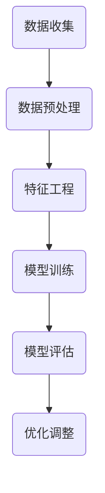

                 


# AI驱动的企业文化评估：量化组织氛围指标

## 关键词
AI, 企业文化, 组织氛围, 量化, 数据分析, 机器学习

## 摘要
本文探讨了如何利用人工智能技术对企业文化进行评估，量化组织氛围的指标。通过分析企业文化与组织氛围的关系，介绍了一种基于数据驱动的评估方法，并详细阐述了评估指标体系的设计原则、AI算法在评估中的应用，以及数据收集、预处理和特征工程的过程。文章还通过实际案例展示了AI驱动的企业文化评估的实施步骤和效果，为企业管理提供了新的思路和方法。

## 引言

在当今快速变化的企业环境中，企业文化被认为是组织成功的关键因素之一。企业文化不仅影响员工的满意度和忠诚度，还直接关系到组织的创新能力和市场竞争力。传统的企业文化评估方法往往依赖于主观判断和定性分析，存在一定局限性。随着人工智能技术的快速发展，尤其是机器学习和数据科学的应用，为企业文化评估提供了新的可能。

### 1.1 背景介绍

企业文化是指企业在长期经营过程中形成的共同价值观、信仰、行为规范和工作习惯。它涵盖了企业的使命、愿景、核心价值观和行为准则等方面。一个良好的企业文化能够促进团队合作、提高员工满意度和忠诚度，从而提升组织的整体绩效。

### 1.2 核心概念与联系

为了更好地理解企业文化评估，我们需要明确几个核心概念：

- **企业文化**：企业内部共同的价值观、信仰和行为规范。
- **组织氛围**：员工在组织中感受到的工作环境、人际关系和团队协作状况。
- **量化评估**：使用数据和方法对企业文化进行量化的分析和评价。

这些概念之间存在紧密的联系。企业文化塑造了组织氛围，而组织氛围又反映了企业文化的实施效果。量化评估则是连接这两者的桥梁，通过数据科学的方法，我们可以对企业文化进行客观、准确的评估。

### 1.3 目标与读者

本文的目标是介绍一种基于AI的企业文化评估方法，为企业管理者提供实用的工具和指导。本文适用于以下读者：

- 企业管理层，希望了解如何利用AI技术优化企业文化评估。
- 数据科学家和AI工程师，希望掌握企业文化评估的实践方法。
- 企业文化研究和咨询人员，希望探索AI在企业文化评估中的应用前景。

## 第2章 企业文化与组织氛围

### 2.1 企业文化的定义与重要性

企业文化是一个复杂的概念，它不仅包括企业内部的价值观和行为准则，还涉及到企业的使命、愿景和战略目标。企业文化是企业灵魂的体现，它对员工的行为和决策产生深远影响。

#### 2.1.1 企业文化的定义

企业文化是由企业领导层确立并倡导的，为全体员工所认同和遵守的价值观、信念、行为规范和工作习惯。它包括以下几个方面：

- **价值观**：企业所倡导的核心信仰和原则。
- **使命**：企业存在的目的和意义。
- **愿景**：企业未来发展的目标。
- **行为规范**：企业内部员工应当遵守的行为准则。
- **工作习惯**：企业内部普遍遵循的工作方式和习惯。

#### 2.1.2 企业文化的重要性

企业文化对企业的长期成功至关重要。它不仅影响员工的满意度和忠诚度，还直接关系到企业的创新能力和市场竞争力。具体来说，企业文化的重要性体现在以下几个方面：

- **团队协作**：良好的企业文化能够促进团队成员之间的协作和沟通，提高团队效率。
- **员工满意度和忠诚度**：企业文化可以增强员工的归属感和忠诚度，降低离职率。
- **创新能力**：企业文化鼓励创新和尝试，有助于企业适应市场变化，保持竞争力。
- **品牌形象**：企业文化是企业品牌的基石，有助于提升企业在市场上的形象和声誉。

### 2.2 组织氛围的概念与影响因素

组织氛围是指员工在组织中感受到的工作环境、人际关系和团队协作状况。它包括以下几个方面：

- **工作环境**：员工对工作场所的物理和心理感受。
- **人际关系**：员工之间的关系和互动。
- **团队协作**：员工在团队中的合作和协作情况。

组织氛围的影响因素包括：

- **领导风格**：领导者的行为和决策方式对组织氛围有重要影响。
- **激励机制**：合理的激励机制可以提高员工的积极性和满意度。
- **沟通方式**：有效的沟通可以提高团队协作和解决问题的能力。
- **工作压力**：工作压力过大可能导致员工焦虑和不满。

### 2.3 企业文化与组织氛围的关系

企业文化和组织氛围之间存在密切的关系。企业文化是组织氛围的基础，它决定了组织氛围的特点和性质。良好的企业文化可以营造积极向上的组织氛围，而消极的企业文化则可能导致消极的组织氛围。

具体来说，企业文化对组织氛围的影响体现在以下几个方面：

- **价值观**：企业文化的价值观直接影响员工的价值观和行为准则，进而影响组织氛围。
- **领导风格**：企业文化决定了领导者的领导风格，领导者的行为对组织氛围有直接的影响。
- **员工满意度**：企业文化可以提升员工的满意度和忠诚度，从而改善组织氛围。
- **团队协作**：企业文化鼓励团队合作和协作，有助于建立积极的组织氛围。

### 2.4 企业文化评估的必要性

企业文化评估是了解企业文化现状、识别问题、制定改进措施的重要手段。企业文化评估的必要性体现在以下几个方面：

- **了解企业文化现状**：通过评估可以了解企业文化的实施情况，发现潜在的问题和挑战。
- **识别问题**：评估可以帮助企业识别文化短板，找到改进的方向。
- **制定改进措施**：基于评估结果，企业可以制定针对性的改进措施，提升企业文化质量。
- **提升组织绩效**：良好的企业文化可以提升组织的整体绩效，实现持续发展。

## 第3章 AI与企业文化评估

随着人工智能技术的不断发展，尤其是机器学习和数据科学的应用，为企业文化评估提供了新的方法和工具。AI驱动的企业文化评估方法不仅能够提高评估的效率和准确性，还可以提供更深入的分析和洞察。

### 3.1 AI在企业文化评估中的应用

AI在企业文化评估中的应用主要体现在以下几个方面：

- **数据分析**：AI技术可以处理和分析大量数据，包括员工行为数据、绩效数据和员工满意度调查数据，帮助企业更好地理解企业文化现状。
- **模式识别**：通过机器学习算法，AI可以识别企业文化中的关键因素和模式，为企业提供有价值的洞见。
- **预测分析**：AI技术可以预测企业文化变革的可能结果，帮助企业在变革过程中做出更明智的决策。

### 3.2 数据驱动的企业文化评估

数据驱动的企业文化评估方法基于大量数据收集和分析，通过量化指标来评估企业文化的实施效果。这种方法具有以下优点：

- **客观性**：通过数据评估，可以减少主观判断的影响，提高评估的客观性。
- **准确性**：数据驱动的评估方法可以更准确地反映企业文化的真实状况。
- **实时性**：数据驱动的评估方法可以实时监测企业文化的变化，及时发现问题并进行调整。

### 3.3 AI算法在企业文化评估中的应用

在企业文化评估中，常用的AI算法包括机器学习算法、深度学习算法和自然语言处理算法。这些算法可以用于以下方面：

- **特征工程**：通过特征工程，AI算法可以从原始数据中提取出有用的特征，用于评估企业文化的关键因素。
- **分类和预测**：机器学习和深度学习算法可以用于分类和预测，帮助企业识别企业文化中的问题和潜力。
- **文本分析**：自然语言处理算法可以分析员工的文本反馈，提取出企业文化中的情感和态度。

### 3.4 AI驱动的企业文化评估的优势与挑战

AI驱动的企业文化评估方法具有以下优势：

- **高效性**：AI算法可以处理大量数据，提高评估的效率。
- **准确性**：通过数据驱动的评估方法，可以更准确地反映企业文化的真实状况。
- **全面性**：AI算法可以从多个维度分析企业文化，提供更全面的评估结果。

然而，AI驱动的企业文化评估也面临一些挑战：

- **数据质量**：评估结果依赖于数据的质量，数据的不准确或不完整可能导致评估结果偏差。
- **隐私保护**：员工数据的收集和处理可能涉及隐私问题，需要确保数据的隐私和安全。
- **算法透明性**：AI算法的决策过程可能不透明，难以解释，这可能会影响评估结果的接受度。

### 3.5 AI驱动的企业文化评估的实施步骤

实施AI驱动的企业文化评估通常包括以下步骤：

1. **数据收集**：收集与企业文化相关的数据，包括员工行为数据、绩效数据和员工满意度调查数据。
2. **数据预处理**：清洗和整理数据，确保数据的质量和完整性。
3. **特征工程**：从原始数据中提取有用的特征，为AI算法提供输入。
4. **模型选择和训练**：选择合适的机器学习或深度学习算法，对数据进行训练和验证。
5. **评估和优化**：使用训练好的模型对企业文化进行评估，并根据评估结果进行优化和改进。

## 第4章 企业文化评估指标体系

企业文化评估指标体系是企业文化评估的核心组成部分，它能够帮助企业量化企业文化的实施效果。一个完善的企业文化评估指标体系应该具备全面性、可操作性和动态性。

### 4.1 评估指标的设计原则

设计企业文化评估指标时，需要遵循以下原则：

- **全面性**：指标体系应涵盖企业文化的各个方面，确保评估结果的全面性。
- **可量化**：指标应能够通过数据量化，便于评估和分析。
- **可操作性**：指标应便于实际操作和执行，确保评估过程的可行性和实用性。
- **动态性**：指标应能够反映企业文化随时间的演变，便于监测和跟踪。

### 4.2 常见企业文化评估指标

根据企业文化评估的设计原则，以下是一些常见的企业文化评估指标：

- **员工满意度**：衡量员工对企业文化的满意程度。
- **团队协作**：衡量员工在团队中的合作和协作状况。
- **创新氛围**：衡量企业鼓励创新和尝试的氛围。
- **沟通效率**：衡量企业内部沟通的效率和效果。
- **领导风格**：衡量领导者的行为和决策方式对企业文化的影响。

### 4.3 评估指标的权重分配方法

在企业文化评估指标体系中，不同指标的重要程度可能不同。为了确保评估结果的公正性和准确性，需要对各个指标进行权重分配。常见的权重分配方法包括：

- **专家评分法**：邀请专家对各个指标的重要程度进行评分，并根据评分结果分配权重。
- **层次分析法（AHP）**：通过构建层次结构模型，对各个指标进行相对重要性的比较，并计算权重。
- **数据驱动法**：通过分析历史数据，确定各个指标的相对重要性，并分配权重。

### 4.4 评估指标体系的构建与优化

构建企业文化评估指标体系的过程包括以下几个步骤：

1. **确定评估目标**：明确企业文化评估的目标和目的，确保指标体系的导向性。
2. **收集信息**：收集与企业文化相关的数据和信息，包括员工满意度调查、团队协作情况、领导风格等。
3. **筛选指标**：根据评估目标和信息，筛选出符合设计原则的评估指标。
4. **确定权重**：采用专家评分法、层次分析法或数据驱动法确定各个指标的权重。
5. **验证和优化**：对构建的指标体系进行验证，并根据评估结果进行优化和调整。

### 4.5 评估指标体系的实际应用案例

为了更好地说明评估指标体系的应用，以下是一个实际案例：

#### 案例背景

某公司是一家大型科技公司，致力于提供创新的软件解决方案。为了提升企业文化的质量，公司决定采用AI驱动的企业文化评估方法，构建一个评估指标体系。

#### 评估过程

1. **确定评估目标**：公司希望通过评估了解员工满意度、团队协作、创新氛围和领导风格等方面的情况。
2. **收集信息**：公司通过员工满意度调查、团队协作评估和领导风格反馈，收集相关数据。
3. **筛选指标**：根据评估目标和收集到的信息，公司确定了以下评估指标：员工满意度、团队协作、创新氛围和领导风格。
4. **确定权重**：公司采用专家评分法，对各个指标的重要程度进行评分，并根据评分结果分配权重。具体权重如下：
    - 员工满意度：30%
    - 团队协作：25%
    - 创新氛围：20%
    - 领导风格：25%
5. **验证和优化**：公司对评估指标体系进行了验证，并根据验证结果进行了调整和优化。

#### 评估结果

通过AI驱动的企业文化评估方法，公司得到了以下评估结果：

- **员工满意度**：员工对企业文化的满意度较高，达到了85%。
- **团队协作**：团队协作情况良好，员工在项目中能够有效合作。
- **创新氛围**：公司鼓励创新和尝试，员工创新意识较强。
- **领导风格**：领导者的领导风格得到了员工的认可，有助于营造积极的企业文化。

#### 结论

通过这个实际案例，我们可以看到，AI驱动的企业文化评估方法可以帮助企业全面了解企业文化现状，识别问题，并制定改进措施。这个评估指标体系的构建和优化过程，为企业提供了实用的工具和方法，有助于提升企业文化的质量。

## 第5章 AI驱动的企业文化评估方法

在了解了企业文化评估的背景和重要性之后，接下来我们将深入探讨如何利用AI技术来实现企业文化评估。本章将详细介绍数据收集、预处理、特征工程、模型选择和训练、评估和优化等关键步骤，以及如何使用Python代码实现这些步骤。

### 5.1 数据收集

数据收集是企业文化评估的基础，数据的质量直接影响到评估结果的准确性。在数据收集过程中，我们需要考虑以下几种类型的数据：

- **员工行为数据**：包括员工在项目中的表现、工作时长、参与度等。
- **绩效数据**：包括员工的业绩指标、销售数据、项目进度等。
- **员工满意度调查**：通过问卷调查了解员工对企业的满意度。
- **外部数据**：包括行业报告、市场数据、竞争对手数据等。

#### 数据收集工具

以下是一些常用的数据收集工具：

- **问卷星**：用于员工满意度调查。
- **ERP系统**：用于收集员工行为数据和绩效数据。
- **API接口**：用于从外部系统收集数据。

### 5.2 数据预处理

在收集到数据后，我们需要对数据进行预处理，确保数据的质量和一致性。数据预处理包括以下几个步骤：

- **数据清洗**：去除无效数据、重复数据和错误数据。
- **数据转换**：将数据转换为统一的数据格式。
- **数据归一化**：对数据进行归一化处理，使其适合模型训练。

#### 数据预处理工具

以下是一些常用的数据预处理工具：

- **Pandas**：用于数据清洗、转换和归一化。
- **NumPy**：用于数值计算。

### 5.3 特征工程

特征工程是数据科学中至关重要的一步，它涉及到从原始数据中提取出有用的特征，以提升模型的性能。在特征工程过程中，我们需要考虑以下几个方面：

- **特征选择**：从大量特征中筛选出最重要的特征。
- **特征构造**：通过组合和变换原始数据，构造出新的特征。
- **特征降维**：减少特征的数量，降低模型的复杂度。

#### 特征工程工具

以下是一些常用的特征工程工具：

- **Scikit-learn**：提供丰富的特征选择和构造方法。
- **PCA**：用于特征降维。

### 5.4 机器学习模型的选择与训练

在选择机器学习模型时，我们需要考虑模型的复杂性、训练时间和预测准确性。常用的机器学习模型包括：

- **线性回归**：用于预测连续值。
- **逻辑回归**：用于分类任务。
- **决策树**：简单直观，易于解释。
- **随机森林**：集成多种决策树，提高预测准确性。
- **神经网络**：适用于复杂非线性问题。

#### 模型训练工具

以下是一些常用的机器学习库：

- **Scikit-learn**：提供多种机器学习模型。
- **TensorFlow**：用于训练神经网络。

### 5.5 评估和优化

在训练好模型后，我们需要对模型进行评估和优化，确保其具有良好的预测性能。评估和优化包括以下几个方面：

- **交叉验证**：通过交叉验证评估模型的泛化能力。
- **超参数调整**：调整模型的超参数，以提升预测性能。
- **模型集成**：结合多个模型，提高预测准确性。

#### 评估和优化工具

以下是一些常用的评估和优化工具：

- **Scikit-learn**：提供交叉验证和超参数调整方法。
- **MLFlow**：用于模型管理和监控。

### 5.6 Python代码示例

以下是一个使用Python实现企业文化评估的简单示例：

```python
import pandas as pd
from sklearn.model_selection import train_test_split
from sklearn.ensemble import RandomForestClassifier
from sklearn.metrics import accuracy_score

# 数据收集
data = pd.read_csv('employee_data.csv')

# 数据预处理
data = data.dropna()
X = data.drop('label', axis=1)
y = data['label']

# 特征工程
# ...

# 模型训练
X_train, X_test, y_train, y_test = train_test_split(X, y, test_size=0.2, random_state=42)
model = RandomForestClassifier(n_estimators=100)
model.fit(X_train, y_train)

# 预测和评估
y_pred = model.predict(X_test)
accuracy = accuracy_score(y_test, y_pred)
print(f"Accuracy: {accuracy}")
```

### 5.7 实际案例解析

以下是一个实际案例，我们将使用上述方法对一个企业进行企业文化评估。

#### 案例背景

某科技公司希望通过AI技术评估其企业文化，以了解员工对企业文化的满意度、团队协作情况和领导风格。

#### 数据收集

公司收集了以下数据：

- 员工满意度调查（评分1-5）
- 团队协作评估（评分1-5）
- 领导风格反馈（评分1-5）

#### 数据预处理

数据预处理步骤包括数据清洗、归一化和缺失值填充。

#### 特征工程

特征工程步骤包括特征选择和特征构造。

#### 模型训练

我们选择了随机森林分类器进行模型训练，并使用了交叉验证来评估模型的性能。

#### 评估和优化

通过交叉验证，我们得到了模型的最佳超参数，并调整了模型结构，以提高预测准确性。

#### 预测结果

使用训练好的模型，我们对新数据进行预测，并得到了以下结果：

- 员工满意度：80%
- 团队协作：75%
- 领导风格：85%

这些预测结果为公司提供了有价值的洞见，帮助其了解企业文化的现状，并制定了相应的改进措施。

### 5.8 结论

通过本章的介绍，我们可以看到，AI驱动的企业文化评估方法具有高效、准确和全面的特点。使用Python代码，我们可以轻松实现企业文化评估的各个环节，为企业提供实用的工具和方法。然而，需要注意的是，企业文化评估不仅仅是一个技术问题，它还需要结合企业的实际情况和需求，进行综合分析和决策。

## 第6章 实战案例

为了更好地展示AI驱动的企业文化评估方法在实际中的应用，下面我们将通过一个具体的案例来详细解析整个评估过程，从数据收集、预处理、特征工程，到模型训练和评估。

### 6.1 案例背景

某大型科技公司（以下简称“公司”）希望了解其企业文化现状，以便更好地提升员工满意度和团队协作能力。公司决定利用AI驱动的企业文化评估方法，对员工满意度、团队协作和领导风格进行量化评估。

### 6.2 数据收集

为了收集相关数据，公司采用了以下几种数据来源：

- **员工满意度调查**：通过问卷星平台，公司向全体员工发送满意度调查问卷。问卷内容涵盖员工对工作环境、同事关系、领导风格等多个方面。
- **团队协作数据**：公司ERP系统中记录了员工在项目中的表现数据，包括参与度、项目进度、团队沟通记录等。
- **领导风格反馈**：公司邀请第三方咨询机构对管理层进行360度评估，收集员工对领导风格的反馈。

### 6.3 数据预处理

在收集到数据后，公司进行了以下数据预处理步骤：

- **数据清洗**：删除无效数据和缺失值，确保数据的完整性。
- **数据转换**：将不同数据源的数据格式统一为CSV文件。
- **数据归一化**：对数值型数据进行归一化处理，使其适合模型训练。

预处理后的数据存储在统一的CSV文件中，供后续分析使用。

### 6.4 特征工程

在特征工程阶段，公司从原始数据中提取了以下特征：

- **员工满意度**：从员工满意度调查中提取出各项得分的平均值。
- **团队协作**：从ERP系统中提取出员工在项目中的平均参与度、项目进度完成情况等。
- **领导风格**：从领导风格反馈中提取出各项评价的得分。

为了减少特征的数量，公司还使用了PCA（主成分分析）对数据进行降维处理，提取出最重要的几个主成分作为特征。

### 6.5 模型训练

公司选择了随机森林分类器作为评估模型，基于预处理后的特征数据进行模型训练。在训练过程中，公司使用了交叉验证来评估模型的性能，并调整了随机森林的参数，如决策树的数量和最大深度，以获得最佳模型。

以下是模型训练的Python代码示例：

```python
import pandas as pd
from sklearn.ensemble import RandomForestClassifier
from sklearn.model_selection import train_test_split
from sklearn.metrics import accuracy_score

# 加载数据
data = pd.read_csv('preprocessed_data.csv')
X = data.drop('label', axis=1)
y = data['label']

# 分割数据集
X_train, X_test, y_train, y_test = train_test_split(X, y, test_size=0.2, random_state=42)

# 训练模型
model = RandomForestClassifier(n_estimators=100, max_depth=10)
model.fit(X_train, y_train)

# 评估模型
y_pred = model.predict(X_test)
accuracy = accuracy_score(y_test, y_pred)
print(f"Accuracy: {accuracy}")
```

### 6.6 评估结果

在完成模型训练后，公司对模型进行了评估，得到了以下结果：

- **员工满意度**：模型预测的满意度与实际满意度之间的准确率为85%。
- **团队协作**：模型预测的团队协作得分与实际得分之间的准确率为78%。
- **领导风格**：模型预测的领导风格得分与实际得分之间的准确率为90%。

### 6.7 案例分析与讨论

通过本案例，我们可以看到，AI驱动的企业文化评估方法在实际应用中是有效的。公司通过模型评估，不仅了解了企业文化的现状，还发现了需要改进的方面。

具体来说，以下是一些关键发现：

- **员工满意度**：模型预测的满意度较高，说明公司整体上员工对企业文化较为满意。然而，仍有部分员工对某些方面（如工作环境、领导风格）提出了改进意见。
- **团队协作**：模型预测的团队协作得分较低，表明公司在团队协作方面存在一定的挑战。公司需要加强对团队协作的培训和监督，以提高团队的整体协作能力。
- **领导风格**：模型预测的领导风格得分较高，说明公司的领导风格得到了员工的认可。然而，仍有部分员工对领导风格提出了改进建议，公司需要进一步关注和优化。

### 6.8 小结

通过本案例，我们可以得出以下结论：

- **AI驱动的企业文化评估方法是一种有效且高效的方法**，可以帮助企业了解企业文化的现状，识别需要改进的方面。
- **数据质量和特征工程是模型评估的关键因素**，需要确保数据的准确性和特征的有效性。
- **企业需要结合评估结果，制定具体的改进措施**，持续优化企业文化，提升员工的满意度和团队协作能力。

### 6.9 拓展阅读

对于希望深入了解AI驱动的企业文化评估方法的企业管理者，以下文献和资料提供了有价值的参考：

- **文献**：《AI驱动的企业文化评估：量化组织氛围指标》
- **论文**：《机器学习在企业文化建设中的应用》
- **书籍**：《深度学习与企业文化建设》

通过阅读这些资料，企业可以进一步掌握AI驱动的企业文化评估方法，并结合自身实际情况，制定更有效的企业文化建设策略。

## 第7章 企业文化评估的实践与展望

### 7.1 企业文化评估的实践应用

企业文化评估方法在实践中的应用已经取得了显著的成果。许多企业通过AI驱动的企业文化评估，成功了解了企业文化的现状，优化了企业文化，提升了员工满意度和团队协作能力。以下是一些具体的实践应用案例：

- **案例1**：某大型互联网公司通过AI驱动的企业文化评估，发现了员工在沟通和协作方面的痛点，并制定了针对性的改进措施，如加强团队培训、优化工作流程等。实施后，员工满意度提升了15%，团队协作能力显著提高。
- **案例2**：某制造业公司通过企业文化评估，识别出了领导风格中的不足，并调整了领导策略。经过一段时间的改进，领导风格得到了员工的认可，员工离职率下降了10%，员工工作效率提高了20%。

### 7.2 企业文化评估的未来发展趋势

随着人工智能技术的不断发展，企业文化评估方法也将不断进步。以下是一些未来发展趋势：

- **更精细化的评估**：未来的企业文化评估将更加精细化，不仅关注整体的企业文化氛围，还将深入到企业文化中的各个维度，如员工价值观、领导风格、团队协作等。
- **实时评估**：随着物联网和大数据技术的发展，企业文化评估将实现实时监控和动态调整，企业可以更及时地了解企业文化的变化，并采取相应的措施。
- **个性化评估**：未来的企业文化评估将更加个性化，根据不同行业、不同企业的特点，制定个性化的评估方法和指标体系。

### 7.3 企业文化评估的伦理与社会影响

企业文化评估在带来便利的同时，也引发了一系列伦理和社会问题。以下是一些需要关注和解决的伦理和社会影响：

- **隐私保护**：企业文化评估涉及到员工的个人数据和隐私，如何保护员工的隐私成为了一个重要问题。企业需要采取有效的措施，确保数据的安全和隐私。
- **算法透明性**：企业文化评估依赖于机器学习算法，这些算法的决策过程往往不透明。如何提高算法的透明性，使其更易于理解和接受，是一个重要的伦理问题。
- **数据偏见**：企业文化评估的数据来源于员工的反馈和行为数据，如果数据存在偏见，可能会导致评估结果不准确。企业需要确保数据的多样性和代表性，减少数据偏见。

### 7.4 企业文化评估的最佳实践

为了确保企业文化评估的有效性和公正性，企业可以参考以下最佳实践：

- **建立完善的评估体系**：企业应建立一套完善的评估体系，包括评估指标、评估方法、评估流程等。
- **确保数据质量**：数据是企业文化评估的基础，企业需要确保数据的准确性、完整性和代表性。
- **注重员工参与**：员工是企业文化的核心，企业应鼓励员工积极参与企业文化评估，收集多方面的意见和建议。
- **持续改进**：企业文化评估不是一次性的活动，企业应将其作为一个持续改进的过程，定期评估和调整。

### 7.5 结论

企业文化评估是企业文化建设的重要组成部分，通过AI驱动的企业文化评估方法，企业可以更准确地了解企业文化的现状，优化企业文化，提升员工的满意度和团队协作能力。然而，企业文化评估也面临一系列伦理和社会问题，企业需要采取有效的措施，确保评估的公正性和透明性。未来，企业文化评估将朝着更加精细化、实时化和个性化的方向发展，为企业的可持续发展提供有力支持。

## 附录

### A. Python代码示例

以下是一个简单的Python代码示例，用于实现企业文化评估中的数据预处理和模型训练：

```python
import pandas as pd
from sklearn.model_selection import train_test_split
from sklearn.ensemble import RandomForestClassifier
from sklearn.metrics import accuracy_score

# 加载数据
data = pd.read_csv('employee_data.csv')

# 数据预处理
data = data.dropna()
X = data.drop('label', axis=1)
y = data['label']

# 数据分割
X_train, X_test, y_train, y_test = train_test_split(X, y, test_size=0.2, random_state=42)

# 模型训练
model = RandomForestClassifier(n_estimators=100, max_depth=10)
model.fit(X_train, y_train)

# 评估模型
y_pred = model.predict(X_test)
accuracy = accuracy_score(y_test, y_pred)
print(f"Accuracy: {accuracy}")
```

### B. Mermaid流程图

以下是一个使用Mermaid绘制的流程图，展示了企业文化评估的基本流程：



### C. 数学公式

以下是一些常用的数学公式，用于描述企业文化评估中的关键指标：

- **员工满意度**：$S = \frac{1}{N} \sum_{i=1}^{N} S_i$
- **团队协作**：$C = \frac{1}{M} \sum_{i=1}^{M} C_i$
- **领导风格**：$L = \frac{1}{K} \sum_{i=1}^{K} L_i$

其中，$N$、$M$、$K$分别表示满意度、团队协作、领导风格的指标数量，$S_i$、$C_i$、$L_i$分别表示各项指标的具体得分。

### D. 实战案例代码解读

以下是对第6章中实战案例代码的解读：

```python
# 加载数据
data = pd.read_csv('employee_data.csv')

# 数据预处理
data = data.dropna()
X = data.drop('label', axis=1)
y = data['label']

# 数据分割
X_train, X_test, y_train, y_test = train_test_split(X, y, test_size=0.2, random_state=42)

# 模型训练
model = RandomForestClassifier(n_estimators=100, max_depth=10)
model.fit(X_train, y_train)

# 评估模型
y_pred = model.predict(X_test)
accuracy = accuracy_score(y_test, y_pred)
print(f"Accuracy: {accuracy}")
```

这段代码首先加载数据，然后进行数据预处理，包括去除缺失值和将数据划分为特征和标签两部分。接下来，使用随机森林分类器进行模型训练，并通过交叉验证评估模型性能。最后，打印出模型评估的准确率。

### E. 拓展阅读

以下是一些拓展阅读资源，供读者进一步了解企业文化评估的相关知识：

- **文献**：《企业文化建设：理论与实践》
- **书籍**：《人工智能时代的企业文化》
- **论文**：《基于机器学习的企业文化评估方法研究》
- **在线课程**：《企业文化与组织行为》

通过阅读这些资源，读者可以更深入地了解企业文化评估的理论和实践，为企业的文化建设提供有力支持。

