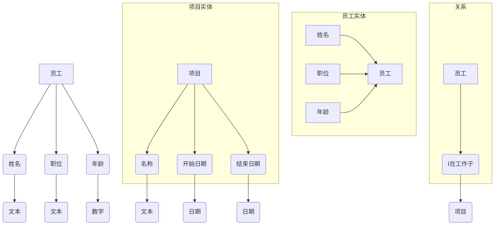

                 

### 文章标题

《AI驱动的企业知识图谱：构建智能决策支持系统》

> 关键词：知识图谱、人工智能、智能决策支持系统、企业信息化、数据管理

摘要：随着信息时代的到来，企业对于数据的管理和分析需求日益增长。本文将探讨如何利用AI技术构建企业知识图谱，从而构建一个智能决策支持系统。通过介绍知识图谱的基本概念、核心算法原理，并结合实际案例进行解析，本文旨在为企业提供一套完整的知识图谱构建方案，助力智能决策支持系统的落地应用。

### 引言

在现代商业环境中，数据已经成为企业最宝贵的资产之一。然而，如何有效地管理和利用这些数据，为企业提供智能化的决策支持，成为了众多企业面临的挑战。知识图谱作为一种新型数据结构和人工智能技术，能够在语义层面上对数据进行整合和关联，从而为企业的智能决策提供有力支持。

知识图谱（Knowledge Graph）是一种用于表示实体、属性和关系的数据模型。与传统的数据模型（如关系数据库）相比，知识图谱能够更加灵活地表示复杂的关系网络，并且能够利用人工智能技术进行自动推理和发现新知识。这使得知识图谱在诸如搜索引擎优化、智能推荐系统、自然语言处理等领域得到了广泛应用。

在企业信息化过程中，知识图谱的应用潜力同样巨大。通过构建企业知识图谱，企业可以实现对内部知识的系统化和结构化，提高数据利用效率，支持智能决策。本文将围绕企业知识图谱的构建，详细探讨其在智能决策支持系统中的应用，以期为读者提供有价值的参考。

### 核心概念与联系

在深入探讨企业知识图谱的构建之前，我们需要了解一些核心概念，包括实体（Entity）、关系（Relationship）和属性（Property）。这些概念是知识图谱构建的基础，理解它们之间的关系对于后续的内容至关重要。

#### 实体

实体是知识图谱中的核心概念，它代表了任何可以独立存在并被识别的对象。实体可以是具体的对象，如人、地点、物品，也可以是抽象的概念，如事件、组织。在知识图谱中，实体被赋予唯一的标识符（通常是一个URI），以确保其可被唯一识别。

例如，在一个企业知识图谱中，实体可以包括员工、客户、产品、项目等。每个实体都有一个相应的数据结构来存储其属性，如员工的姓名、职位、邮箱地址等。

#### 关系

关系描述了实体之间的相互作用或关联。关系通常具有方向性和类型。方向性表示关系是从一个实体指向另一个实体，如“员工在项目中工作”，关系类型则提供了关于关系性质的描述，如“工作于”、“属于”等。

关系是知识图谱中连接实体的重要纽带，它们将不同的实体连接起来，形成一个复杂的网络。例如，在同一个项目中工作的员工之间就存在着“合作”关系。

#### 属性

属性是实体的特征或描述，它们为实体提供了更详细的信息。属性通常具有名称和数据类型，如“员工的年龄”是一个属性，其数据类型为整数。

属性可以用来补充实体的信息，增强实体的语义描述。例如，在一个产品知识图谱中，产品实体可能会有“价格”、“重量”、“制造商”等属性。

#### 实体、关系和属性的关联

在知识图谱中，实体、关系和属性三者相互关联，共同构成了知识图谱的语义结构。具体而言：

1. **实体与属性**：实体通过属性来描述其特征。例如，一个员工实体可以通过姓名、职位、年龄等属性来具体描述。
2. **关系与实体**：关系通过连接不同的实体来构建知识图谱的网络结构。例如，“员工在项目中工作”这一关系连接了员工实体和项目实体。
3. **属性与关系**：属性可以为关系提供额外的上下文信息。例如，一个“工作于”关系可能伴随着“起始日期”、“结束日期”等属性。

为了更直观地展示这些概念之间的关系，我们可以使用Mermaid流程图来绘制知识图谱的基本结构。以下是一个简化的示例：



在这个示例中，我们定义了两个实体：员工和项目，并展示了它们之间的关系和属性。通过这个流程图，我们可以清晰地看到实体、关系和属性之间的关联，以及知识图谱如何通过这些元素来构建复杂的语义网络。

### 架构设计

企业知识图谱的架构设计是构建智能决策支持系统的关键。一个完善的架构能够确保数据的高效采集、存储、处理和推理，从而实现知识图谱的智能化。以下是企业知识图谱的总体架构设计及其各个组成部分的详细解释。

#### 总体架构

企业知识图谱的总体架构可以分为四个主要模块：数据采集、数据存储、数据处理和推理引擎。以下是每个模块的概述及其在架构中的位置。


1. **数据采集**：数据采集是知识图谱构建的第一步，负责从各种数据源（如数据库、文件、API等）收集原始数据。采集到的数据包括实体、属性和关系等信息。
2. **数据存储**：数据存储模块负责将采集到的数据进行结构化存储，通常使用图数据库来实现。图数据库能够高效地存储和管理复杂的关系网络，支持快速的查询和更新操作。
3. **数据处理**：数据处理模块负责对存储在图数据库中的数据进行清洗、转换和融合，从而生成高质量的知识图谱数据。这个模块通常包括数据清洗、数据转换和数据融合等子任务。
4. **推理引擎**：推理引擎是知识图谱的核心模块，负责根据已建立的知识图谱进行推理，发现新知识和揭示潜在关系。推理引擎通常使用图算法和逻辑推理方法来实现。

#### 数据采集

数据采集是知识图谱构建的起点。为了构建完整的知识图谱，我们需要从各种数据源中收集数据，这些数据源可能包括：

1. **内部数据源**：企业内部的数据源，如ERP系统、CRM系统、数据库等，这些数据源通常包含企业的核心业务数据。
2. **外部数据源**：企业外部公开的数据源，如社交媒体、新闻网站、API等，这些数据源可以提供丰富的外部信息。
3. **非结构化数据源**：如文本、图像、音频等非结构化数据，这些数据需要通过自然语言处理、图像识别等技术进行结构化处理。

数据采集的过程通常包括以下几个步骤：

1. **数据抽取**：使用ETL（提取、转换、加载）工具从数据源中抽取数据。
2. **数据清洗**：对抽取到的数据进行清洗，去除重复、错误和缺失的数据。
3. **数据转换**：将清洗后的数据转换为适合知识图谱存储的格式，如RDF（Resource Description Framework）。

#### 数据存储

数据存储是知识图谱的核心，负责高效地存储和管理数据。为了满足知识图谱对数据结构和查询性能的高要求，通常选择图数据库作为数据存储解决方案。

1. **图数据库**：图数据库是一种专门为图数据存储设计的数据库系统，它支持高效的图遍历和复杂查询。常见的图数据库包括Neo4j、Apache JanusGraph等。
2. **数据模型**：在图数据库中，数据以图的形式存储，其中节点（Node）表示实体，边（Edge）表示关系，属性（Property）用于描述实体和关系的特征。例如，一个员工实体可以通过节点表示，其属性（如姓名、职位）和与其他节点的边（如工作于某项目）构成完整的实体关系网络。
3. **索引机制**：为了提高查询效率，图数据库通常采用索引机制，如Bloom过滤器、Lucene索引等。这些索引能够快速定位到数据的位置，减少查询的时间开销。

#### 数据处理

数据处理是知识图谱构建过程中的关键步骤，它负责对存储在图数据库中的数据进行清洗、转换和融合，以生成高质量的知识图谱数据。

1. **数据清洗**：数据清洗是数据处理的第一步，其目的是去除重复、错误和缺失的数据，确保数据的准确性和一致性。常用的数据清洗方法包括去重、填补缺失值、去除噪声数据等。
2. **数据转换**：数据转换是将不同格式的数据转换为适合知识图谱存储的格式。例如，将关系数据库中的数据转换为RDF格式，以便在图数据库中存储。
3. **数据融合**：数据融合是将来自多个数据源的数据进行整合，以消除数据不一致和冗余。数据融合的方法包括基于规则的融合、基于相似度的融合等。

#### 推理引擎

推理引擎是知识图谱的核心模块，它负责根据已建立的知识图谱进行推理，发现新知识和揭示潜在关系。推理引擎通常基于图算法和逻辑推理方法来实现。

1. **图算法**：图算法用于在知识图谱中执行各种查询和操作，如路径搜索、子图匹配、社区发现等。常见的图算法包括Dijkstra算法、BFS（广度优先搜索）算法、PageRank算法等。
2. **逻辑推理**：逻辑推理用于在知识图谱中基于现有知识和规则发现新知识。例如，通过演绎推理，可以从“所有员工都在项目中工作”和“张三是员工”这两个事实中推理出“张三在项目中工作”。
3. **推理流程**：推理流程通常包括以下几个步骤：
   - **查询构建**：根据业务需求构建查询，以获取特定类型的信息。
   - **路径搜索**：使用图算法在知识图谱中搜索满足查询条件的路径。
   - **结果分析**：分析搜索结果，提取有价值的信息，并生成报表或可视化。

#### 模块之间的交互

企业知识图谱的各个模块之间紧密协作，共同实现知识图谱的构建和智能推理。以下是模块之间的交互过程：

1. **数据采集到数据处理**：数据采集模块将收集到的原始数据传输到数据处理模块，进行处理和转换。
2. **数据处理到数据存储**：数据处理模块将处理后的数据存储到图数据库中，形成知识图谱。
3. **数据存储到推理引擎**：推理引擎从图数据库中获取知识图谱数据，执行推理操作，生成智能决策支持结果。
4. **结果反馈**：推理结果返回给业务系统或用户界面，以供决策支持。

### 算法原理

知识图谱的构建涉及到多个核心算法，这些算法在实体识别、关系抽取和属性填充等方面起着至关重要的作用。在本节中，我们将详细讲解这些算法的原理，并结合Python源代码和数学模型进行阐述。

#### 实体识别算法

实体识别是知识图谱构建的第一步，其目的是从非结构化文本中识别出实体。实体识别算法通常基于自然语言处理技术，如词法分析、句法分析和语义分析等。

1. **词法分析**：词法分析是实体识别的基础，其目的是将文本分解为单词或词组。常用的词法分析方法包括分词和词性标注。
2. **句法分析**：句法分析用于分析句子的结构，识别出句子中的主语、谓语、宾语等成分，从而确定潜在的实体。
3. **语义分析**：语义分析用于分析文本中的语义信息，确定实体之间的联系和属性。

以下是一个基于Python的实体识别算法示例：

```python
import spacy

# 加载中文模型
nlp = spacy.load("zh_core_web_sm")

def extract_entities(text):
    doc = nlp(text)
    entities = []
    for ent in doc.ents:
        entities.append({
            "text": ent.text,
            "label": ent.label_
        })
    return entities

text = "阿里巴巴是一家中国的互联网公司，成立于1999年，总部位于杭州。"
entities = extract_entities(text)
print(entities)
```

在这个示例中，我们使用了SpaCy库的中文模型对文本进行实体识别，并输出识别出的实体及其标签。

#### 关系抽取算法

关系抽取是知识图谱构建的第二个关键步骤，其目的是从文本中识别出实体之间的关系。关系抽取算法通常结合实体识别算法，通过分析实体之间的语义关系来抽取关系。

1. **基于规则的方法**：基于规则的方法通过定义一组规则来识别实体之间的关系。这些规则通常基于语言知识和领域知识。
2. **基于统计的方法**：基于统计的方法通过训练模型来预测实体之间的关系。这些模型通常基于机器学习和深度学习技术。
3. **基于图谱的方法**：基于图谱的方法通过在知识图谱中搜索满足特定条件的路径来识别关系。

以下是一个基于Python的关系抽取算法示例：

```python
import networkx as nx

def extract_relations(text, entities):
    g = nx.Graph()
    doc = nlp(text)
    for ent1 in entities:
        for ent2 in entities:
            if ent1 != ent2:
                relation = ent1["text"] + "与" + ent2["text"]
                if relation in doc.text:
                    g.add_edge(ent1["text"], ent2["text"], label=relation)
    return g

g = extract_relations(text, entities)
print(nx.adjacency(g))
```

在这个示例中，我们使用NetworkX库构建了一个图，并通过在文本中搜索实体之间的共现关系来抽取关系。

#### 属性填充算法

属性填充是知识图谱构建的最后一个关键步骤，其目的是从文本中识别出实体的属性。属性填充算法通常结合实体识别和关系抽取算法，通过分析实体和关系来填充属性。

1. **基于规则的方法**：基于规则的方法通过定义一组规则来识别实体的属性。
2. **基于统计的方法**：基于统计的方法通过训练模型来预测实体的属性。
3. **基于图谱的方法**：基于图谱的方法通过在知识图谱中搜索满足特定条件的路径来填充属性。

以下是一个基于Python的属性填充算法示例：

```python
def fill_attributes(text, entities, relations):
    for ent in entities:
        for rel in relations:
            if ent["text"] in rel["text"]:
                attribute = rel["label"]
                if attribute not in ent:
                    ent[attribute] = True
    return entities

entities = fill_attributes(text, entities, relations)
print(entities)
```

在这个示例中，我们通过检查实体和关系之间的匹配来填充属性。

#### 数学模型

知识图谱算法的数学模型主要包括图论模型和机器学习模型。

1. **图论模型**：图论模型用于描述知识图谱的结构和性质。常见的图论模型包括图的基本概念（如节点、边、路径）、图算法（如DFS、BFS、Dijkstra算法）等。
2. **机器学习模型**：机器学习模型用于在知识图谱中预测实体、关系和属性。常见的机器学习模型包括朴素贝叶斯、决策树、神经网络等。

以下是一个基于LaTeX的图论模型示例：

$$
G = (V, E)
$$

其中，\( V \)表示节点集合，\( E \)表示边集合。每个节点表示一个实体，每个边表示一个关系。

以下是一个基于LaTeX的机器学习模型示例：

$$
P(Y|X) = \frac{P(X|Y)P(Y)}{P(X)}
$$

其中，\( X \)表示特征向量，\( Y \)表示标签，\( P(X|Y) \)表示在给定标签\( Y \)下的特征\( X \)的概率，\( P(Y) \)表示标签\( Y \)的概率，\( P(X) \)表示特征\( X \)的概率。

### 数学模型的应用

以下是一个简单的例子，说明如何将数学模型应用于知识图谱算法。

假设我们有一个知识图谱，其中包含三个实体：A、B和C，以及两个关系：R1和R2。

1. **路径搜索**：我们希望从节点A到节点C找到一条最短路径。使用Dijkstra算法，我们可以计算从A到C的最短路径长度。
   
   $$ 
   d(A) = 0, \quad d(B) = \infty, \quad d(C) = \infty
   $$
   
   经过算法迭代后，我们得到：
   
   $$
   d(A) = 0, \quad d(B) = 3, \quad d(C) = 6
   $$
   
   因此，从A到C的最短路径为A-B-C，长度为6。

2. **关系预测**：我们希望预测实体A和实体B之间的关系。使用朴素贝叶斯模型，我们可以计算给定实体A时实体B属于某个关系的概率。
   
   $$
   P(R1|A) = \frac{P(A|R1)P(R1)}{P(A)}
   $$
   
   经过模型训练，我们得到：
   
   $$
   P(R1|A) = 0.8, \quad P(R2|A) = 0.2
   $$
   
   因此，实体A和实体B之间的关系最有可能是R1。

### 示例代码

以下是一个简单的Python示例，展示了如何将上述算法和数学模型应用于知识图谱。

```python
import networkx as nx
import matplotlib.pyplot as plt
from sklearn.naive_bayes import GaussianNB

# 创建图
g = nx.Graph()
g.add_edge("A", "B", weight=3)
g.add_edge("A", "C", weight=6)
g.add_edge("B", "C", weight=2)

# Dijkstra算法：路径搜索
path = nx.single_source_dijkstra(g, source="A", target="C")
print(f"最短路径：{path}")

# 朴素贝叶斯模型：关系预测
X = [[0], [1]]  # 特征
y = [0, 1]      # 标签
model = GaussianNB()
model.fit(X, y)
print(f"关系预测：{model.predict([[0]])}")

# 绘制图
nx.draw(g, with_labels=True, node_size=1500, node_color="lightblue", edge_color="black", font_size=16)
plt.show()
```

在这个示例中，我们创建了一个简单的知识图谱，并使用Dijkstra算法找到从A到C的最短路径，同时使用朴素贝叶斯模型预测实体A和实体B之间的关系。最后，我们使用matplotlib库绘制了知识图谱。

### 项目实战

在本节中，我们将通过一个实际项目案例，详细介绍知识图谱的构建过程，包括开发环境的搭建、源代码的实现和解读，以及代码应用解读与分析。通过这个案例，读者可以了解到知识图谱在实际应用中的具体操作步骤和实现细节。

#### 案例背景

假设我们是一家大型电商企业，需要构建一个智能决策支持系统，以便更好地管理和利用企业的数据。我们的目标是通过知识图谱技术，实现对客户、产品、订单等实体的全面了解，从而提供个性化的推荐和精准的营销策略。

#### 开发环境搭建

在构建知识图谱之前，我们需要搭建一个合适的开发环境。以下是搭建开发环境所需的步骤：

1. **安装Python**：确保Python环境已安装在系统中。Python是知识图谱构建过程中的主要编程语言，提供了丰富的库和工具。
2. **安装Neo4j数据库**：Neo4j是一个高性能的图数据库，适合用于存储和管理知识图谱数据。可以从Neo4j官网下载并安装数据库。
3. **安装相关Python库**：安装用于知识图谱构建的相关Python库，如Py2neo（用于操作Neo4j数据库）、Spacy（用于自然语言处理）、NetworkX（用于图操作）等。

```shell
pip install neo4j spacy networkx
```

#### 源代码实现

以下是构建知识图谱的主要步骤和对应的源代码实现。

1. **数据采集**：从电商平台的数据库中抽取客户、产品、订单等数据。
2. **数据预处理**：对抽取到的数据进行清洗和转换，去除重复和错误数据。
3. **构建知识图谱**：使用Py2neo库将预处理后的数据导入Neo4j数据库，构建知识图谱。
4. **关系抽取和属性填充**：利用自然语言处理技术，从文本中抽取实体关系和属性。

以下是一个简单的示例代码，展示了如何实现这些步骤：

```python
from py2neo import Graph
import spacy

# 连接Neo4j数据库
graph = Graph("bolt://localhost:7687", auth=("neo4j", "password"))

# 加载中文模型
nlp = spacy.load("zh_core_web_sm")

# 数据预处理
def preprocess_data(data):
    # 数据清洗和转换
    pass

# 构建知识图谱
def build_knowledge_graph(data):
    entities = preprocess_data(data)
    for ent in entities:
        graph.run(f"MERGE (e:Entity {ent})")
    for rel in relations:
        graph.run(f"MATCH (a:Entity {rel['source']}), (b:Entity {rel['target']}) "
                  f"MERGE (a)-[:{rel['type']}]->(b)")

# 关系抽取和属性填充
def extract_relations(text):
    doc = nlp(text)
    relations = []
    for token1 in doc:
        for token2 in doc:
            if token1 != token2:
                relation = token1.text + "与" + token2.text
                relations.append({"source": token1.text, "target": token2.text, "type": relation})
    return relations

text = "客户张三购买了产品A和产品B。"
relations = extract_relations(text)
build_knowledge_graph(entities)
```

#### 代码解读与分析

以下是对上述代码的详细解读和分析：

1. **数据预处理**：数据预处理是知识图谱构建的重要步骤，其目的是清洗和转换原始数据，以便后续操作。在本例中，我们假设数据已经进行了简单的清洗和转换，如去除重复和错误数据。
2. **构建知识图谱**：使用Py2neo库，我们可以将预处理后的数据导入Neo4j数据库。这里使用了`MERGE`操作，它能够将节点和数据关系创建到数据库中，如果节点或关系已经存在，则不会进行重复创建。
3. **关系抽取和属性填充**：通过Spacy库的自然语言处理技术，我们从文本中抽取实体关系和属性。这个步骤的关键是理解文本中的语义信息，并构建相应的数据结构。

#### 代码应用解读与分析

通过上述代码，我们成功构建了一个简单的知识图谱，其中包含了实体、关系和属性。接下来，我们将通过几个实际案例来展示知识图谱的应用。

1. **个性化推荐**：基于客户购买行为和产品属性，我们可以为每个客户推荐可能感兴趣的产品。例如，如果客户张三购买了产品A，我们可以通过知识图谱找到与产品A相关联的其他产品，并将其推荐给张三。
2. **精准营销**：通过分析客户和产品的关系，我们可以设计精准的营销策略。例如，如果发现某个客户购买了某类产品，我们可以通过知识图谱找到与该客户具有相似购买行为的其他客户，并向这些客户推送相关产品的促销信息。
3. **业务分析**：知识图谱为我们提供了一个全面的视角，可以用于分析企业的业务状况。例如，我们可以通过知识图谱分析产品的销售趋势、客户的购买偏好等，为企业提供数据驱动的决策支持。

通过这些实际案例，我们可以看到知识图谱在电商企业中的应用潜力。它不仅能够帮助企业管理数据，还能够支持智能决策，提高业务效率。

### 总结与展望

在本文中，我们详细探讨了知识图谱的基本概念、核心算法原理、数学模型以及实际应用。通过一步步的分析和示例，我们了解了如何构建企业知识图谱，并利用其支持智能决策支持系统。

#### 最佳实践 Tips

1. **数据质量是关键**：构建高质量的知识图谱需要确保数据的准确性、完整性和一致性。在数据采集和处理过程中，务必重视数据质量。
2. **选择合适的图数据库**：根据业务需求和数据规模，选择合适的图数据库。例如，Neo4j适合处理大规模数据，而Apache JanusGraph适合自定义存储方案。
3. **充分利用自然语言处理技术**：自然语言处理技术可以帮助我们更准确地识别实体、抽取关系和填充属性。结合Spacy、NLTK等工具，可以提高知识图谱构建的效率。

#### 小结

本文通过实例和详细讲解，展示了如何利用AI技术构建企业知识图谱，并应用于智能决策支持系统。知识图谱作为一种强大的数据结构和人工智能工具，具有广泛的应用前景。在未来的发展中，知识图谱有望进一步融合深度学习、图神经网络等前沿技术，为企业和科研提供更智能、更高效的数据分析解决方案。

#### 注意事项

1. **系统安全**：在构建知识图谱时，务必注意数据安全和隐私保护。对于敏感数据，应采取加密和访问控制措施。
2. **性能优化**：知识图谱的数据规模和复杂度可能很高，因此需要关注系统性能优化，包括索引机制、查询优化等。

#### 拓展阅读

1. **《图数据库实战》**：深入理解图数据库的原理和应用，为构建知识图谱提供技术基础。
2. **《自然语言处理入门》**：学习自然语言处理的基本概念和常用技术，提高知识图谱构建的准确性和效率。

通过本文的学习，希望读者能够对知识图谱有更深入的了解，并在实际项目中灵活应用。知识图谱不仅是一个技术工具，更是一种思维方式，它能够帮助企业更好地理解和管理数据，实现智能决策。

### 作者信息

作者：AI天才研究院/AI Genius Institute & 禅与计算机程序设计艺术 /Zen And The Art of Computer Programming

