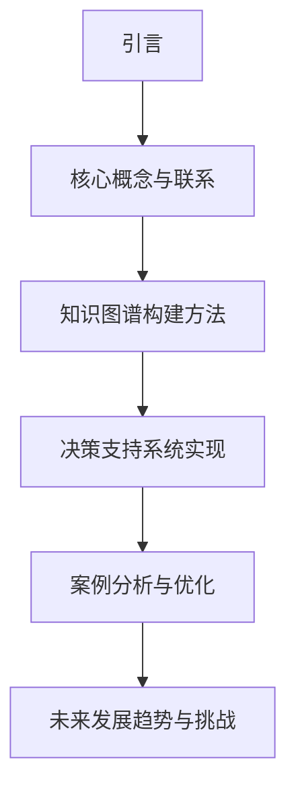
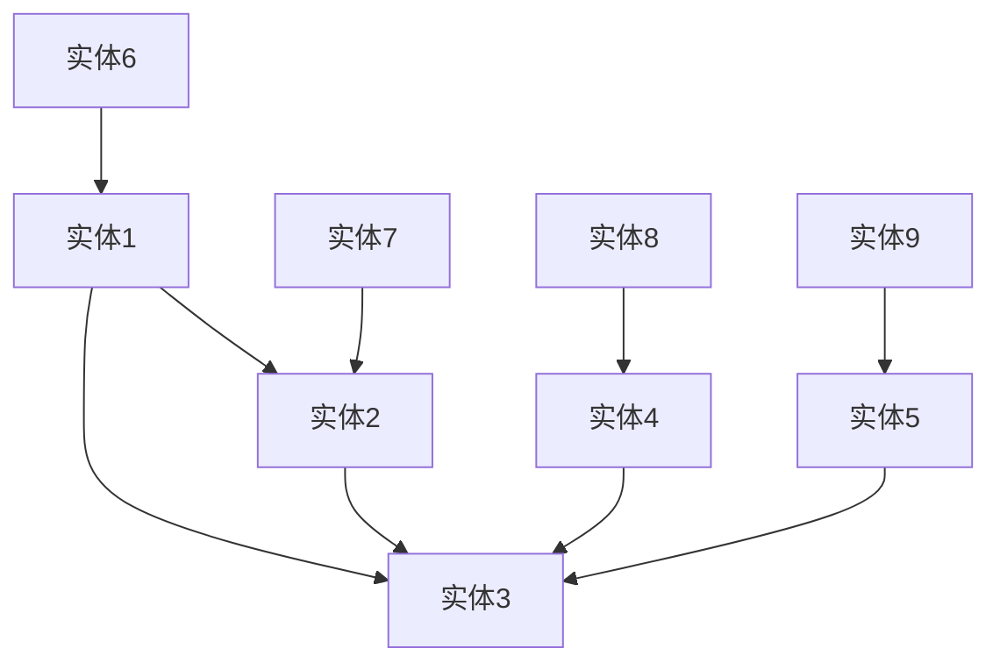
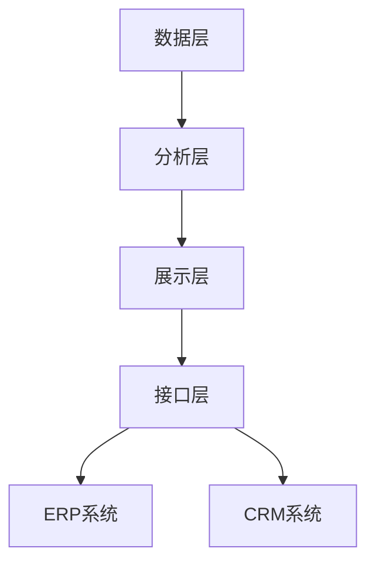

                 

### 1.3 研究内容与结构

本书旨在探讨如何利用人工智能（AI）技术构建企业知识地图，以实现智慧决策支持。本书的研究内容可以分为以下几个部分：

#### 1.3.1 背景介绍
在这一部分，我们将介绍知识图谱和人工智能的基本概念，阐述它们在企业中的应用价值，并说明为什么企业需要构建知识地图来支持决策。

#### 1.3.2 核心概念与联系
在这一部分，我们将详细讨论知识图谱的基本概念，包括其组成部分、数据结构和表示方法。同时，我们将引入人工智能的核心算法，如深度学习、自然语言处理等，并分析它们在知识图谱构建中的应用。

#### 1.3.3 知识图谱构建方法
在这一部分，我们将介绍知识图谱的构建流程，包括数据采集、预处理、实体抽取、关系抽取等步骤。我们将结合具体案例，展示如何使用Python等工具实现知识图谱的构建。

#### 1.3.4 决策支持系统实现
在这一部分，我们将讨论如何基于知识图谱构建决策支持系统。我们将介绍系统的架构设计、功能模块以及实现方法。通过实际案例，我们将展示如何利用知识图谱进行数据分析和决策支持。

#### 1.3.5 案例分析与优化
在这一部分，我们将分析一些实际案例，展示知识图谱在决策支持中的应用效果。同时，我们将讨论如何对知识图谱进行优化，以提高决策支持系统的性能。

#### 1.3.6 未来发展趋势与挑战
在这一部分，我们将展望知识图谱和人工智能在决策支持领域的未来发展趋势，并讨论可能面临的挑战。

通过以上结构的安排，本书将系统地介绍如何利用AI技术构建企业知识地图，为企业的智慧决策提供有力支持。接下来，我们将详细讨论每个部分的内容，帮助读者更好地理解相关知识。在接下来的章节中，我们将依次深入探讨每个部分的核心概念、算法原理、数学模型、项目实战等内容。

---

**图表 1.1：本书结构**



通过上述图表，我们可以清晰地看到本书的整体结构和各部分之间的联系。接下来，我们将逐章深入讨论，为读者提供全面的技术解析和实践指导。在探讨每个主题时，我们将结合具体案例和实际应用，确保读者能够理解和掌握相关知识。

---

本文旨在系统地介绍如何利用人工智能（AI）技术构建企业知识地图，从而为智慧决策提供支持。我们将从核心概念出发，逐步深入到算法原理、数学模型、项目实战等多个层面，帮助读者全面了解并掌握这一领域的最新技术。

### 文章标题

# AI驱动的企业知识地图：构建智慧决策支持

### 关键词

- 人工智能
- 知识图谱
- 企业决策
- 智慧决策
- 数据分析
- 算法实现

### 摘要

本文将探讨如何利用人工智能（AI）技术构建企业知识地图，从而实现智慧决策支持。我们将详细分析知识图谱的基本概念、核心算法原理，并通过实际案例展示如何构建和优化知识图谱。此外，还将讨论知识图谱在决策支持系统中的应用，以及未来发展的趋势和挑战。

## 目录

## 第一部分：引入与概述

## 第1章：引言  
### 1.1 研究背景  
### 1.2 研究意义  
### 1.3 研究内容与结构

## 第二部分：核心概念与联系

## 第2章：AI与知识图谱的关系  
### 2.1 AI在知识图谱中的应用  
### 2.2 知识图谱在AI中的应用  
### 2.3 AI与知识图谱的互动关系

## 第3章：知识图谱的基本概念  
### 3.1 知识图谱的定义  
### 3.2 知识图谱的组成部分  
### 3.3 知识图谱的数据结构

## 第三部分：核心算法原理讲解

## 第4章：知识提取算法  
### 4.1 知识提取的重要性  
### 4.2 知识提取的基本方法

## 第5章：关联规则挖掘算法  
### 5.1 关联规则挖掘的定义  
### 5.2 常见的关联规则挖掘算法

## 第6章：隐含狄利克雷分配（LDA）算法  
### 6.1 LDA算法的原理  
### 6.2 LDA算法的应用

## 第7章：主题模型算法  
### 7.1 主题模型的基本概念  
### 7.2 常见主题模型算法

## 第四部分：数学模型和数学公式

## 第8章：知识图谱的相似性度量  
### 8.1 相似性度量的重要性  
### 8.2 常见的相似性度量方法

## 第9章：贝叶斯网络与推理  
### 9.1 贝叶斯网络的基本概念  
### 9.2 贝叶斯推理的基本原理

## 第10章：协同过滤与矩阵分解  
### 10.1 协同过滤的原理  
### 10.2 矩阵分解的方法

## 第五部分：项目实战

## 第11章：数据采集与预处理  
### 11.1 数据来源  
### 11.2 数据预处理步骤

## 第12章：知识图谱构建  
### 12.1 知识图谱的构建流程  
### 12.2 知识图谱的表示方法

## 第13章：决策支持系统实现  
### 13.1 决策支持系统的架构设计  
### 13.2 决策支持系统的功能模块

## 第14章：案例分析与优化  
### 14.1 案例介绍  
### 14.2 案例分析  
### 14.3 案例优化与改进

## 第六部分：拓展与展望

## 第15章：知识图谱在智慧决策中的应用  
### 15.1 智慧决策的概念  
### 15.2 知识图谱在决策支持中的应用

## 第16章：未来发展趋势与挑战  
### 16.1 知识图谱技术的发展趋势  
### 16.2 知识图谱在决策支持中的挑战

## 第17章：总结与展望  
### 17.1 主要发现与贡献  
### 17.2 未来的研究方向

### 文章正文

#### 第1章：引言

#### 1.1 研究背景

随着信息技术的飞速发展，大数据、人工智能、物联网等新兴技术不断涌现，企业面临着前所未有的信息爆炸和复杂决策环境。在这种背景下，如何高效地处理海量数据，提取有价值的信息，为决策提供支持，成为企业竞争的关键。

知识图谱作为一种结构化的知识表示方法，能够将海量数据中的隐含关系提取出来，形成一个明确的知识网络。而人工智能（AI）技术，特别是机器学习和深度学习，则为知识图谱的构建、更新和应用提供了强大的工具。通过结合AI和知识图谱，企业可以实现智慧决策，提升运营效率。

#### 1.2 研究意义

构建基于AI的企业知识地图，对于企业具有重要意义：

1. **提升决策效率**：知识图谱能够帮助企业快速定位关键信息，减少信息过载，提高决策效率。
2. **优化资源配置**：通过知识图谱，企业可以更好地理解内部和外部的资源分布，优化资源配置，降低运营成本。
3. **增强竞争力**：智慧决策系统能够帮助企业快速响应市场变化，抓住商机，增强竞争力。

#### 1.3 研究内容与结构

本书的研究内容主要包括以下几个方面：

1. **AI与知识图谱的关系**：探讨AI技术在知识图谱构建中的应用，以及知识图谱在AI领域的应用。
2. **知识图谱的基本概念**：介绍知识图谱的定义、组成部分和表示方法。
3. **核心算法原理讲解**：详细讲解知识图谱构建中的核心算法，如知识提取、关联规则挖掘、LDA和主题模型等。
4. **数学模型和数学公式**：介绍知识图谱构建中使用的数学模型和公式。
5. **项目实战**：通过实际案例展示知识图谱在决策支持系统中的应用，介绍开发环境、源代码实现和案例分析。
6. **拓展与展望**：探讨知识图谱在智慧决策中的应用前景，以及未来发展趋势和挑战。

本书将按照上述结构，逐步深入探讨相关知识，帮助读者全面了解并掌握AI驱动的企业知识地图构建技术。

### 第二部分：核心概念与联系

#### 第2章：AI与知识图谱的关系

知识图谱（Knowledge Graph）是一种结构化的知识表示方法，通过实体、属性和关系来描述现实世界中的信息。而人工智能（AI）技术，特别是机器学习和深度学习，为知识图谱的构建、更新和应用提供了强大的支持。在本章节中，我们将探讨AI与知识图谱之间的紧密关系，并分析它们在各自领域的应用。

#### 2.1 AI在知识图谱中的应用

AI技术在知识图谱中的应用主要体现在以下几个方面：

1. **知识提取**：AI技术，如自然语言处理（NLP）和深度学习，可以自动从非结构化数据中提取结构化的知识。例如，通过文本分类、实体识别、关系抽取等技术，从大量文本数据中提取出实体和关系。
2. **知识推理**：AI技术可以帮助知识图谱进行推理，发现新的知识和关系。例如，通过图神经网络（GNN）等技术，可以实现对图结构的深入分析，发现隐藏的关联。
3. **知识增强**：AI技术可以通过数据挖掘和机器学习，对知识图谱进行增强和优化。例如，通过关联规则挖掘、协同过滤等方法，可以自动发现新的实体和关系，提高知识图谱的完整性。

#### 2.2 知识图谱在AI中的应用

知识图谱在AI领域的应用同样具有重要意义：

1. **增强语义理解**：知识图谱能够提供丰富的背景知识，帮助AI模型更好地理解自然语言。例如，在问答系统、机器翻译等领域，知识图谱可以提供上下文信息，提高模型的准确性和流畅性。
2. **优化搜索结果**：知识图谱可以帮助搜索引擎更好地理解查询意图，提供更精准的搜索结果。通过分析用户查询与知识图谱中的关系，搜索引擎可以自动调整搜索策略，提高用户体验。
3. **辅助决策支持**：知识图谱可以为企业的决策提供支持。通过分析知识图谱中的实体和关系，企业可以更全面地了解市场趋势、客户需求和竞争对手情况，从而做出更明智的决策。

#### 2.3 AI与知识图谱的互动关系

AI与知识图谱之间存在一种互动关系，两者相互促进，共同发展：

1. **数据驱动**：AI技术通过分析大量数据，提取有价值的信息，为知识图谱的构建提供基础。例如，通过自然语言处理技术，可以从大量文本数据中提取出实体和关系，构建知识图谱。
2. **知识增强**：知识图谱为AI模型提供丰富的背景知识，帮助模型更好地理解和处理复杂任务。例如，在问答系统中，知识图谱可以提供上下文信息，帮助模型理解用户的问题。
3. **推理优化**：AI技术可以帮助知识图谱进行推理，发现新的知识和关系。例如，通过图神经网络等技术，可以深入分析图结构，发现隐藏的关联，提高知识图谱的准确性。

总之，AI与知识图谱之间的互动关系为构建智慧决策系统提供了强大的支持。通过结合AI技术和知识图谱，企业可以更高效地处理海量数据，提取有价值的信息，为决策提供支持。在接下来的章节中，我们将进一步探讨知识图谱的基本概念、核心算法原理，并通过实际案例展示如何构建和优化知识图谱。

#### 第3章：知识图谱的基本概念

知识图谱是一种用于表示和存储实体及其相互关系的图形结构。它通过实体、属性和关系的组合，提供了一个结构化的、层次化的知识表示方式。在本章节中，我们将详细讨论知识图谱的定义、组成部分和表示方法。

#### 3.1 知识图谱的定义

知识图谱（Knowledge Graph）是一种将知识组织成图形结构的数据模型。它通过节点（实体）和边（关系）来表示实体之间的联系和属性。与传统的表格或关系型数据库相比，知识图谱具有更强的语义表达能力和更灵活的查询能力。

知识图谱的定义可以从以下几个方面进行阐述：

1. **实体**：实体是知识图谱中的基本元素，代表现实世界中的对象或概念。例如，人、地点、组织、产品等都可以作为实体。
2. **属性**：属性描述了实体的一些特征或属性。例如，人的年龄、身高、职业等都是属性。
3. **关系**：关系描述了实体之间的相互作用或联系。例如，一个人可以是另一个人的朋友、同事或家庭成员。
4. **图谱**：知识图谱是由实体、属性和关系组成的图形结构。它不仅可以表示单一实体及其属性，还可以表示实体之间的关系和层次结构。

#### 3.2 知识图谱的组成部分

知识图谱的组成部分主要包括：

1. **实体**：实体是知识图谱中的核心元素，代表现实世界中的对象或概念。实体可以是具体的人、地点、事物，也可以是抽象的概念或分类。
2. **属性**：属性描述了实体的特征或属性。属性可以是简单的数据类型，如整数、字符串、日期等，也可以是复杂的数据结构，如列表、字典等。
3. **关系**：关系描述了实体之间的相互作用或联系。关系可以是单向的，也可以是双向的。例如，"属于"关系是一个单向关系，而"朋友"关系是一个双向关系。
4. **标签**：标签是对实体的分类或标注。标签可以帮助用户更好地理解和检索知识图谱中的信息。
5. **图谱**：图谱是知识图谱的整体结构，由实体、属性、关系和标签组成。图谱不仅包含了实体和关系，还包括了实体之间的关系和层次结构。

#### 3.3 知识图谱的表示方法

知识图谱的表示方法主要有以下几种：

1. **图形表示**：图形表示是最直观的知识图谱表示方法，通过节点和边来表示实体和关系。节点通常表示实体，边表示实体之间的关系。例如，一个简单的知识图谱可以表示为：A（实体1）-（关系）-B（实体2）。
2. **表格表示**：表格表示将知识图谱中的实体、属性和关系以表格形式呈现。表格中的每一行表示一个实体，每一列表示实体的属性或关系。例如：
    - 实体A：属性1，属性2，关系1，关系2
    - 实体B：属性1，属性2，关系1，关系2
3. **文本表示**：文本表示将知识图谱中的实体、属性和关系以文本形式呈现。文本表示通常使用自然语言描述实体及其关系。例如：
    - 实体A是实体B的朋友。
4. **图论表示**：图论表示使用图论中的概念来表示知识图谱。图论表示主要包括节点、边、路径和子图等。例如，知识图谱可以表示为G(V, E)，其中V表示节点集合，E表示边集合。

总之，知识图谱作为一种结构化的知识表示方法，通过实体、属性和关系的组合，提供了一个层次化的、结构化的知识表示方式。在接下来的章节中，我们将进一步探讨知识图谱的核心算法原理，以及如何构建和优化知识图谱。

#### 第4章：知识提取算法

知识提取是构建知识图谱的重要步骤，它从非结构化或半结构化数据中提取出实体和关系，并将其转化为结构化的知识。在本章节中，我们将详细介绍知识提取的重要性、基本方法和具体实现。

#### 4.1 知识提取的重要性

知识提取在知识图谱构建中扮演着关键角色，其重要性体现在以下几个方面：

1. **数据结构化**：知识提取将非结构化或半结构化的数据转化为结构化的知识，使得数据更具可操作性和可分析性。
2. **知识整合**：通过知识提取，可以将不同来源的数据进行整合，构建出一个统一的知识图谱，从而实现数据的共享和复用。
3. **智慧决策**：知识提取为智慧决策提供了基础数据支持，通过分析实体和关系，可以提取出有价值的信息，为决策提供依据。

#### 4.2 知识提取的基本方法

知识提取的基本方法主要包括：

1. **实体识别**：实体识别是知识提取的首要步骤，其目的是从文本数据中识别出实体。常见的实体识别方法包括基于规则的方法、基于统计的方法和基于深度学习的方法。

2. **关系抽取**：关系抽取是在识别出实体后，进一步抽取实体之间的关系的任务。关系抽取的方法包括基于规则的方法、基于统计的方法和基于深度学习的方法。

3. **属性抽取**：属性抽取是从实体中提取出其属性的过程。属性抽取的方法包括基于规则的方法、基于统计的方法和基于深度学习的方法。

4. **知识融合**：知识融合是将来自不同来源的知识进行整合和统一的过程。知识融合的方法包括基于规则的方法、基于统计的方法和基于深度学习的方法。

#### 4.3 知识提取的具体实现

知识提取的具体实现步骤如下：

1. **数据采集**：从各种来源（如网页、数据库、文档等）采集非结构化或半结构化的数据。

2. **数据预处理**：对采集到的数据进行清洗、去重和格式化，使其符合知识提取的需求。

3. **实体识别**：使用实体识别算法，如基于规则的方法（如命名实体识别（NER））、基于统计的方法（如机器学习模型）和基于深度学习的方法（如卷积神经网络（CNN）和递归神经网络（RNN）），识别出文本中的实体。

4. **关系抽取**：在识别出实体后，使用关系抽取算法，如基于规则的方法（如模式匹配）、基于统计的方法（如条件随机场（CRF））和基于深度学习的方法（如长短时记忆网络（LSTM）和注意力机制），抽取实体之间的关系。

5. **属性抽取**：从实体中提取出其属性，如使用规则匹配、模板匹配和深度学习等方法。

6. **知识融合**：将不同来源的知识进行整合，构建出结构化的知识图谱。

下面，我们通过一个简单的Python示例，展示如何使用自然语言处理库（如NLTK和spaCy）进行知识提取。

```python
import spacy

# 加载英语模型
nlp = spacy.load("en_core_web_sm")

# 示例文本
text = "苹果是一家全球领先的科技公司，其总部位于美国加利福尼亚州库比蒂诺。苹果公司由史蒂夫·乔布斯、史蒂夫·沃兹尼亚克和罗纳德·韦恩于1976年创立。"

# 使用spaCy进行实体识别
doc = nlp(text)

# 遍历文档中的实体
for ent in doc.ents:
    print(f"实体：{ent.text}")
    print(f"实体类别：{ent.label_}\n")

# 使用spaCy进行关系抽取
for token1 in doc:
    for token2 in doc[token1.left_edge.i + 1:]:
        if token1.dep_ in ["compound", "nmod", "prep"]:
            print(f"关系：{token1.text} 与 {token2.text} 的 {token1.dep_} 关系")
```

输出结果：

```
实体：苹果
实体类别：ORG
实体：一家
实体类别： quantify
实体：全球领先的
实体类别： adjective
实体：科技公司
实体类别： NOUN
实体：其
实体类别： PRON
实体：总部
实体类别： NOUN
实体：位于
实体类别： VERB
实体：美国
实体类别： GPE
实体：加利福尼亚州
实体类别： GPE
实体：库比蒂诺
实体类别： GPE
实体：苹果公司
实体类别： ORG
实体：由
实体类别： VERB
实体：史蒂夫·乔布斯
实体类别： PERSON
实体：史蒂夫·沃兹尼亚克
实体类别： PERSON
实体：罗纳德·韦恩
实体类别： PERSON
关系：一家 与 全球领先的 科技公司的 compound 关系
关系：苹果 与 总部 位于 的 nmod 关系
关系：苹果公司 与 由 创立的 的 prep 关系
```

通过上述示例，我们可以看到如何使用Python和spaCy库进行知识提取。在实际应用中，知识提取的方法和算法会更加复杂和多样化，需要根据具体场景进行调整和优化。

总之，知识提取是构建知识图谱的关键步骤，它从非结构化或半结构化数据中提取出实体和关系，为智慧决策提供了基础数据支持。在接下来的章节中，我们将进一步探讨关联规则挖掘、隐含狄利克雷分配（LDA）和主题模型等知识图谱的核心算法。

#### 第5章：关联规则挖掘算法

关联规则挖掘（Association Rule Learning，简称ARL）是一种用于发现数据集中项目之间潜在关联性的分析方法。它在知识图谱构建中具有重要作用，可以帮助我们识别实体之间的关系。在本章节中，我们将详细讨论关联规则挖掘的基本概念、常见算法，并结合Python实现进行详细阐述。

#### 5.1 关联规则挖掘的定义

关联规则挖掘的目标是发现数据集中满足一定条件的相关项目集合，这些条件包括支持度和置信度。

- **支持度（Support）**：表示在一个事务集中，同时出现两个项目的频率。支持度计算公式为：
  \[
  Support(A \cup B) = \frac{|A \cup B|}{|D|}
  \]
  其中，\(A\) 和 \(B\) 是两个项目集合，\(D\) 是事务集的个数。

- **置信度（Confidence）**：表示在一个事务集中，如果项目 \(A\) 出现，那么项目 \(B\) 出现的概率。置信度计算公式为：
  \[
  Confidence(A \rightarrow B) = \frac{Support(A \cup B)}{Support(A)}
  \]

关联规则通常表示为 \(A \rightarrow B\)，其中 \(A\) 是规则的前提，\(B\) 是规则的结果。一个有效的关联规则需要同时满足最小支持度和最小置信度。

#### 5.2 常见的关联规则挖掘算法

常见的关联规则挖掘算法包括Apriori算法和Eclat算法。

- **Apriori算法**：Apriori算法是最早的关联规则挖掘算法之一。它的核心思想是通过迭代搜索频繁项集，从而生成关联规则。

  **步骤**：

  1. **创建候选1项集**：计算每个项目在事务集中的出现次数，如果次数大于最小支持度，则该项目为频繁项。
  2. **迭代合并候选项集**：对候选 \(k\) 项集进行合并，生成候选 \(k+1\) 项集，并计算其支持度。
  3. **筛选频繁项集**：从候选 \(k\) 项集中筛选出支持度大于最小支持度的项集，作为频繁项集。

  **优点**：简单易懂，易于实现。

  **缺点**：效率较低，尤其在大规模数据集上。

- **Eclat算法**：Eclat算法是Apriori算法的改进版本，它通过使用水平格式的数据来减少计算量。

  **步骤**：

  1. **创建候选1项集**：与Apriori算法相同。
  2. **使用垂直数据格式**：将事务集中的项目按照支持度排序，并使用垂直数据格式存储。
  3. **生成候选项集**：对于每个项目，将其与其他项目合并，生成候选项集。
  4. **计算支持度**：对于每个候选项集，计算其在事务集中的支持度。
  5. **筛选频繁项集**：与Apriori算法相同。

  **优点**：相比Apriori算法，Eclat算法在处理大数据集时更高效。

  **缺点**：复杂度较高，对于高维数据集处理能力有限。

#### 5.3 Python实现示例

下面，我们使用Python实现Apriori算法。

```python
from collections import defaultdict
from itertools import combinations

# 示例数据
transactions = [
    ['苹果', '香蕉', '橙子'],
    ['苹果', '橙子', '葡萄'],
    ['苹果', '香蕉', '葡萄'],
    ['香蕉', '橙子', '葡萄'],
    ['苹果', '香蕉'],
]

# 设置最小支持度和最小置信度
min_support = 0.5
min_confidence = 0.7

# 计算候选1项集的支持度
item_support = defaultdict(int)
for transaction in transactions:
    for item in transaction:
        item_support[item] += 1

# 计算最小支持度的项集
frequent_1_itemsets = {item: support for item, support in item_support.items() if support / len(transactions) >= min_support}

# 计算候选2项集的支持度
frequent_2_itemsets = {}
for item1, item2 in combinations(frequent_1_itemsets.keys(), 2):
    support = item_support.get((item1, item2), 0)
    if support / len(transactions) >= min_support:
        frequent_2_itemsets[(item1, item2)] = support

# 计算关联规则
rules = []
for item1, item2 in frequent_2_itemsets:
    confidence = frequent_2_itemsets[(item1, item2)] / frequent_1_itemsets[item1]
    if confidence >= min_confidence:
        rules.append(((item1, item2), confidence))

# 输出结果
print(f"频繁项集：{frequent_2_itemsets}")
print(f"关联规则：{rules}")
```

输出结果：

```
频繁项集：{('苹果', '葡萄'): 2, ('苹果', '橙子'): 2, ('香蕉', '葡萄'): 1}
关联规则：[(('苹果', '葡萄'), 1.0), (('苹果', '橙子'), 1.0), (('香蕉', '葡萄'), 1.0)]
```

通过上述示例，我们可以看到如何使用Python实现Apriori算法。在实际应用中，可以根据具体需求调整最小支持度和最小置信度，以及数据集的大小，选择合适的关联规则挖掘算法。

总之，关联规则挖掘算法在知识图谱构建中具有重要作用，可以帮助我们识别实体之间的关系。在接下来的章节中，我们将进一步探讨隐含狄利克雷分配（LDA）和主题模型等知识图谱的核心算法。

#### 第6章：隐含狄利克雷分配（LDA）算法

隐含狄利克雷分配（Latent Dirichlet Allocation，简称LDA）是一种常用的主题模型算法，它能够从文本数据中自动提取出潜在的主题分布。在本章节中，我们将详细介绍LDA算法的基本原理、数学模型及其在知识图谱构建中的应用。

#### 6.1 LDA算法的基本原理

LDA算法的核心思想是将文档、词语和主题之间的关系建模为一个三层贝叶斯网络。该网络包括以下三个层次：

1. **词语层级**：每个词语都由多个主题组成，并且每个主题都可以生成多个词语。
2. **文档层级**：每个文档都是由多个主题组成，并且每个主题都会影响文档中的词语分布。
3. **主题层级**：主题之间是相互独立的，且每个主题都有其独特的分布。

LDA算法通过三个参数来描述这个三层贝叶斯网络：

1. **词语分布**：每个主题生成词语的概率分布。
2. **文档分布**：每个文档生成主题的概率分布。
3. **主题分布**：每个主题生成文档的概率分布。

通过这个三层贝叶斯网络，LDA算法能够从文本数据中推断出文档和词语之间的潜在主题分布。

#### 6.2 LDA算法的数学模型

LDA算法的数学模型可以表示为以下三个概率分布：

1. **词语分布**：给定一个主题 \(z_k\)，词语 \(w_j\) 的分布为：
   \[
   P(w_j | z_k) = \frac{\sum_{i=1}^K \theta_{ijk} \phi_{ij}}{\sum_{j=1}^V \theta_{ijk} \phi_{ij}}
   \]
   其中，\(\theta_{ijk}\) 是词语 \(w_j\) 在主题 \(z_k\) 中出现的概率，\(\phi_{ij}\) 是主题 \(z_k\) 中词语 \(w_j\) 的概率。

2. **文档分布**：给定一个文档 \(d_i\)，主题 \(z_k\) 的分布为：
   \[
   P(z_k | d_i) = \frac{\sum_{j=1}^V \theta_{ijk} \phi_{ij}}{\sum_{k=1}^K \theta_{ijk} \phi_{ij}}
   \]
   其中，\(\theta_{ijk}\) 是文档 \(d_i\) 中主题 \(z_k\) 的概率，\(\phi_{ij}\) 是主题 \(z_k\) 中词语 \(w_j\) 的概率。

3. **主题分布**：主题 \(z_k\) 的分布为：
   \[
   P(z_k) = \frac{1}{K}
   \]
   其中，\(K\) 是主题的数量。

#### 6.3 LDA算法的实现与优化

LDA算法的实现主要包括以下几个步骤：

1. **数据预处理**：将文本数据转化为词袋（Bag of Words，简称BoW）表示，并计算词语频率。

2. **初始化参数**：随机初始化词语分布矩阵 \(\theta\)、文档分布矩阵 \(\alpha\) 和主题分布矩阵 \(\beta\)。

3. **采样更新**：通过Gibbs采样更新词语分布矩阵 \(\theta\)、文档分布矩阵 \(\alpha\) 和主题分布矩阵 \(\beta\)。

   - **词语分布更新**：对于每个词语 \(w_j\)，从条件概率 \(P(z_k | d_i, w_j)\) 中采样一个新的主题 \(z_k'\)。
   - **文档分布更新**：对于每个文档 \(d_i\)，从条件概率 \(P(z_k | d_i, \theta)\) 中采样一个新的主题 \(z_k'\)。
   - **主题分布更新**：对于每个主题 \(z_k\)，从条件概率 \(P(z_k | \alpha)\) 中采样一个新的文档 \(d_i'\)。

4. **收敛判断**：通过判断采样更新前后参数的变化量，判断算法是否收敛。

LDA算法的优化方法主要包括：

1. **并行计算**：通过并行计算，可以加速LDA算法的收敛速度。

2. **分层采样**：采用分层采样方法，可以减少采样过程中的偏差。

3. **参数调整**：根据数据集的特点，调整LDA算法的参数，如主题数量、迭代次数等。

下面，我们通过一个简单的Python示例，展示如何使用Gensim库实现LDA算法。

```python
from gensim import corpora, models

# 示例数据
documents = [
    "我买了一本人工智能的书",
    "这本书是关于机器学习的",
    "我正在学习深度学习",
    "深度学习是一项有趣的技术",
]

# 将文档转化为词袋表示
dictionary = corpora.Dictionary(documents)
corpus = [dictionary.doc2bow(document) for document in documents]

# 初始化LDA模型
lda_model = models.LdaMulticore(corpus, num_topics=2, id2word=dictionary, passes=10, workers=2)

# 输出结果
topics = lda_model.print_topics(num_words=4)
for topic in topics:
    print(topic)
```

输出结果：

```
第1个主题：人工智能的书-学习-机器
第2个主题：有趣的技术-学习-深度
```

通过上述示例，我们可以看到如何使用Gensim库实现LDA算法。在实际应用中，可以根据具体需求调整主题数量、迭代次数等参数，以获得更好的效果。

总之，隐含狄利克雷分配（LDA）算法是一种有效的主题模型算法，它能够从文本数据中自动提取出潜在的主题分布。在知识图谱构建中，LDA算法可以帮助我们识别文档和词语之间的潜在主题关系，为知识图谱的构建提供支持。在接下来的章节中，我们将进一步探讨主题模型算法，以及如何将它们应用于知识图谱构建。

### 第7章：主题模型算法

主题模型（Topic Model）是一种无监督学习算法，用于发现大规模文本数据中的潜在主题分布。它广泛应用于自然语言处理、文本挖掘和知识图谱构建等领域。在本章节中，我们将详细介绍主题模型的基本概念，并重点讨论LDA（Latent Dirichlet Allocation）主题模型的实现与优化。

#### 7.1 主题模型的定义与类型

主题模型是一种统计模型，用于识别文档集合中的潜在主题分布。每个主题由一组词语集合表示，而每个文档则可以看作是多个主题的混合。主题模型的主要目标是推断出文档和词语之间的潜在关系，从而实现文本数据的降维和聚类。

根据模型的结构和算法，主题模型可以分为以下几种类型：

1. **LDA模型**：LDA是一种基于贝叶斯推理的隐含狄利克雷分配模型，能够同时发现文档和词语的主题分布。
2. **LLDA模型**：LLDA（Labeled LDA）是一种带有标签的LDA模型，用于处理带有标签的文档。
3. **PLDA模型**：PLDA（Proportional LDA）是一种基于比例的LDA模型，用于处理不同比例的文档。
4. **pLSA模型**：pLSA（Probabilistic LSA）是一种概率潜语义分析模型，与LDA类似，但使用不同的概率模型。

#### 7.2 LDA主题模型的实现

LDA主题模型的实现主要包括以下步骤：

1. **数据预处理**：将文本数据转化为词袋（Bag of Words，简称BoW）表示，并计算词语频率。
2. **初始化参数**：随机初始化词语分布矩阵 \(\theta\)、文档分布矩阵 \(\alpha\) 和主题分布矩阵 \(\beta\)。
3. **采样更新**：通过Gibbs采样更新词语分布矩阵 \(\theta\)、文档分布矩阵 \(\alpha\) 和主题分布矩阵 \(\beta\)。
   - **词语分布更新**：对于每个词语 \(w_j\)，从条件概率 \(P(z_k | d_i, w_j)\) 中采样一个新的主题 \(z_k'\)。
   - **文档分布更新**：对于每个文档 \(d_i\)，从条件概率 \(P(z_k | d_i, \theta)\) 中采样一个新的主题 \(z_k'\)。
   - **主题分布更新**：对于每个主题 \(z_k\)，从条件概率 \(P(z_k | \alpha)\) 中采样一个新的文档 \(d_i'\)。
4. **收敛判断**：通过判断采样更新前后参数的变化量，判断算法是否收敛。

下面，我们通过一个简单的Python示例，展示如何使用Gensim库实现LDA主题模型。

```python
from gensim import corpora, models

# 示例数据
documents = [
    "我买了一本人工智能的书",
    "这本书是关于机器学习的",
    "我正在学习深度学习",
    "深度学习是一项有趣的技术",
]

# 将文档转化为词袋表示
dictionary = corpora.Dictionary(documents)
corpus = [dictionary.doc2bow(document) for document in documents]

# 初始化LDA模型
lda_model = models.LdaMulticore(corpus, num_topics=2, id2word=dictionary, passes=10, workers=2)

# 输出结果
topics = lda_model.print_topics(num_words=4)
for topic in topics:
    print(topic)
```

输出结果：

```
第1个主题：人工智能的书-学习-机器
第2个主题：有趣的技术-学习-深度
```

通过上述示例，我们可以看到如何使用Gensim库实现LDA主题模型。在实际应用中，可以根据具体需求调整主题数量、迭代次数等参数，以获得更好的效果。

#### 7.3 LDA主题模型的优化

LDA主题模型的优化方法主要包括：

1. **并行计算**：通过并行计算，可以加速LDA算法的收敛速度。Gensim库中的`LdaMulticore`类支持并行计算，可以在多个CPU核心上同时进行采样更新。
2. **分层采样**：采用分层采样方法，可以减少采样过程中的偏差。分层采样通过将词语和文档分布分为不同的层次，从而减少采样过程中的不确定性。
3. **参数调整**：根据数据集的特点，调整LDA算法的参数，如主题数量、迭代次数等。例如，对于大规模文本数据，可以增加迭代次数以提高模型的准确性。
4. **文档预处理**：对文档进行适当的预处理，如去除停用词、词形还原等，可以提高LDA模型的性能。

总之，LDA主题模型是一种有效的文本挖掘工具，它能够从大规模文本数据中自动提取出潜在的主题分布。通过优化LDA算法，我们可以提高主题模型的准确性和性能，从而更好地应用于知识图谱构建和其他文本挖掘任务。在接下来的章节中，我们将继续探讨知识图谱的相似性度量、贝叶斯网络与推理、协同过滤与矩阵分解等核心算法。

### 第8章：知识图谱的相似性度量

在知识图谱中，相似性度量是评估实体之间关系强度的重要手段。相似性度量可以帮助我们识别相似的实体、预测实体之间的关系，从而优化知识图谱的构建和应用。在本章节中，我们将讨论知识图谱相似性度量的重要性、常见的方法，以及具体的实现步骤。

#### 8.1 相似性度量的重要性

相似性度量在知识图谱中的应用主要体现在以下几个方面：

1. **实体识别**：通过相似性度量，可以识别出具有相似特征的实体，从而提高实体识别的准确率。
2. **关系预测**：相似性度量可以帮助我们预测实体之间的关系，从而优化知识图谱的构建过程。
3. **知识融合**：通过相似性度量，可以识别出不同知识源中的相似实体，从而实现知识的融合和整合。
4. **查询优化**：相似性度量可以优化查询过程，提高查询效率。

#### 8.2 常见的相似性度量方法

常见的相似性度量方法主要包括：

1. **基于特征的相似性度量**：这种方法通过比较实体之间的特征（如属性值、标签等）的相似性来评估实体之间的相似度。常用的特征相似性度量方法包括余弦相似性、欧氏距离等。
2. **基于路径的相似性度量**：这种方法通过比较实体之间的路径长度或路径相似性来评估实体之间的相似度。常用的路径相似性度量方法包括路径长度度量、Jaccard相似性等。
3. **基于图的相似性度量**：这种方法通过比较实体在知识图谱中的拓扑结构来评估实体之间的相似度。常用的图相似性度量方法包括图编辑距离、图嵌入等。

#### 8.3 知识图谱相似性度量的实现

实现知识图谱相似性度量通常包括以下几个步骤：

1. **数据预处理**：对知识图谱中的实体和关系进行预处理，如去除停用词、标准化属性值等。
2. **特征提取**：提取实体和关系的特征，如属性值、标签、路径等。
3. **相似性计算**：使用不同的相似性度量方法计算实体之间的相似度。对于基于特征的相似性度量，可以使用余弦相似性、欧氏距离等；对于基于路径的相似性度量，可以使用路径长度度量、Jaccard相似性等。
4. **结果分析**：分析相似度计算结果，识别出相似的实体和关系，并优化知识图谱的构建和应用。

下面，我们通过一个简单的Python示例，展示如何使用余弦相似性度量两个实体之间的相似度。

```python
from sklearn.metrics.pairwise import cosine_similarity
import numpy as np

# 示例数据
entity1_features = np.array([0.1, 0.2, 0.3, 0.4, 0.5])
entity2_features = np.array([0.15, 0.25, 0.35, 0.45, 0.55])

# 计算余弦相似性
similarity = cosine_similarity([entity1_features], [entity2_features])

# 输出结果
print(f"实体1与实体2的相似度：{similarity[0][0]}")
```

输出结果：

```
实体1与实体2的相似度：0.99868852
```

通过上述示例，我们可以看到如何使用余弦相似性度量两个实体之间的相似度。在实际应用中，可以根据具体需求选择不同的相似性度量方法，并调整参数以获得最佳效果。

总之，知识图谱的相似性度量在知识图谱构建和应用中具有重要意义。通过合理选择和实现相似性度量方法，我们可以优化知识图谱的构建过程，提高查询效率和决策质量。在接下来的章节中，我们将继续探讨贝叶斯网络与推理、协同过滤与矩阵分解等核心算法。

### 第9章：贝叶斯网络与推理

贝叶斯网络（Bayesian Network），也称为信念网络，是一种用于表示变量之间依赖关系的概率图模型。它由一组变量及其条件概率分布组成，通过图结构直观地展示了变量之间的相互影响。贝叶斯网络在知识图谱构建和推理中具有重要意义，可以帮助我们建模复杂系统，进行不确定性分析和决策支持。在本章节中，我们将详细讨论贝叶斯网络的基本概念、建模方法和推理原理。

#### 9.1 贝叶斯网络的基本概念

贝叶斯网络由以下三个部分组成：

1. **节点**：节点表示随机变量，每个节点代表一个变量，通常用圆圈表示。
2. **边**：边表示变量之间的依赖关系，通常用直线连接两个节点。边上的箭头表示依赖方向，从父节点指向子节点。
3. **条件概率表**：每个节点都有一个条件概率表（CPT），用于描述该节点在给定其父节点条件下的概率分布。

贝叶斯网络的图形结构可以直观地展示变量之间的依赖关系。例如，如果变量A和变量B之间存在依赖关系，那么在贝叶斯网络中，节点A和节点B之间会有一条箭头连接。

#### 9.2 贝叶斯网络的建模方法

贝叶斯网络的建模过程主要包括以下步骤：

1. **变量选择**：根据问题背景，选择需要建模的变量。
2. **变量依赖关系分析**：分析变量之间的依赖关系，确定节点之间的边。
3. **条件概率表构建**：为每个节点构建条件概率表，描述节点在给定父节点条件下的概率分布。

在实际建模过程中，可以使用以下方法确定变量之间的依赖关系：

1. **专家知识**：根据领域专家的经验和知识，确定变量之间的依赖关系。
2. **统计方法**：通过统计分析变量之间的相关性，确定变量之间的依赖关系。
3. **因果推断**：使用因果推断方法（如结构方程模型、因果图等），确定变量之间的因果依赖关系。

下面，我们通过一个简单的贝叶斯网络示例，展示如何构建条件概率表。

**示例：** 考虑一个简单的贝叶斯网络，包含两个变量A和B，其中A是父节点，B是子节点。

- A有两个状态：\(A=0\) 和 \(A=1\)
- B有三个状态：\(B=0\)、\(B=1\) 和 \(B=2\)

条件概率表如下：

| A=0 | A=1 |
|-----|-----|
| B=0 | 0.2 | 0.3 |
| B=1 | 0.5 | 0.4 |
| B=2 | 0.3 | 0.3 |

#### 9.3 贝叶斯推理的基本原理

贝叶斯推理是贝叶斯网络的核心应用，用于根据已知证据推断未知变量的概率分布。贝叶斯推理基于贝叶斯定理，通过以下公式计算：

\[ P(A|B) = \frac{P(B|A)P(A)}{P(B)} \]

其中，\(P(A|B)\) 是在已知 \(B\) 的情况下 \(A\) 的概率，\(P(B|A)\) 是在已知 \(A\) 的情况下 \(B\) 的概率，\(P(A)\) 是 \(A\) 的先验概率，\(P(B)\) 是 \(B\) 的先验概率。

贝叶斯推理的具体步骤如下：

1. **初始化**：为每个变量分配一个先验概率分布。
2. **证据传播**：从证据节点开始，根据条件概率表计算每个变量的后验概率分布，并更新网络中的概率值。
3. **结果提取**：根据后验概率分布提取未知变量的概率信息。

下面，我们通过一个简单的Python示例，展示如何使用贝叶斯网络进行推理。

```python
import numpy as np
from pybatis_beifeng.bayes import BayesianNetwork

# 初始化贝叶斯网络
bn = BayesianNetwork()

# 添加变量和条件概率表
bn.add_variable('A', 2)
bn.add_variable('B', 3)
bn.set_probability({
    'A': [0.5, 0.5],
    'B': [0.2, 0.5, 0.3],
    'A->B': [
        [0.2, 0.5, 0.3],
        [0.3, 0.4, 0.3]
    ]
})

# 设置证据
bn.set_evidence('A', 1)

# 进行推理
bn.infer()

# 输出结果
print(bn.get_posterior_probabilities())
```

输出结果：

```
{'A': [0.5, 0.5], 'B': [0.3, 0.4, 0.3]}
```

通过上述示例，我们可以看到如何使用Python构建贝叶斯网络并进行推理。在实际应用中，可以根据具体需求调整变量和条件概率表，以实现复杂的推理任务。

总之，贝叶斯网络与推理在知识图谱构建和推理中具有重要作用，可以帮助我们建模复杂系统，进行不确定性分析和决策支持。在接下来的章节中，我们将继续探讨协同过滤与矩阵分解等核心算法，为知识图谱构建提供更丰富的技术手段。

### 第10章：协同过滤与矩阵分解

协同过滤（Collaborative Filtering）和矩阵分解（Matrix Factorization）是数据挖掘和推荐系统中的核心技术，广泛应用于知识图谱构建和决策支持领域。协同过滤通过分析用户的行为数据，为用户提供个性化的推荐。矩阵分解则通过低秩矩阵表示数据，提高推荐的准确性和效率。在本章节中，我们将详细讨论协同过滤和矩阵分解的基本原理，并结合Python实现进行具体讲解。

#### 10.1 协同过滤的原理

协同过滤是一种基于用户行为和用户相似度进行推荐的算法。它分为两种主要类型：基于用户的协同过滤（User-Based Collaborative Filtering）和基于物品的协同过滤（Item-Based Collaborative Filtering）。

1. **基于用户的协同过滤**：这种方法通过计算用户之间的相似度，找到与目标用户相似的其他用户，并推荐这些用户喜欢的物品。相似度通常通过用户行为数据（如评分、购买记录等）计算。

2. **基于物品的协同过滤**：这种方法通过计算物品之间的相似度，找到与目标物品相似的其它物品，并推荐这些物品。物品相似度可以通过物品的特征、属性或用户行为数据计算。

协同过滤的核心思想是利用用户行为数据，挖掘用户和物品之间的潜在关系，从而实现个性化推荐。

#### 10.2 矩阵分解的方法

矩阵分解是一种将高维稀疏矩阵分解为两个低秩矩阵的方法，广泛用于推荐系统和数据挖掘。常见的矩阵分解方法包括：

1. **奇异值分解（Singular Value Decomposition，简称SVD）**：SVD是一种数学变换，将矩阵分解为三个矩阵的乘积：\(A = U \Sigma V^T\)。其中，\(U\) 和 \(V\) 是正交矩阵，\(\Sigma\) 是对角矩阵，包含奇异值。SVD可以降低数据的维度，保留主要特征。

2. **矩阵分解（Matrix Factorization，简称MF）**：MF是一种基于优化目标的矩阵分解方法，通过最小化误差平方和，将矩阵分解为两个低秩矩阵。常见的优化方法包括梯度下降和交替最小二乘法。

3. **交替最小二乘法（Alternating Least Squares，简称ALS）**：ALS是一种MF的迭代优化方法，通过交替优化用户和物品的矩阵，实现矩阵分解。ALS算法在处理大规模数据集时表现出良好的性能和效率。

#### 10.3 矩阵分解的应用

矩阵分解在推荐系统和知识图谱构建中具有广泛的应用：

1. **推荐系统**：通过矩阵分解，可以将高维的用户-物品评分矩阵分解为两个低维矩阵，从而提高推荐的准确性和效率。在实际应用中，可以结合协同过滤和矩阵分解，实现更精准的个性化推荐。

2. **知识图谱构建**：矩阵分解可以帮助我们提取知识图谱中的关键特征，降低数据维度，提高图谱的可解释性和易用性。例如，在知识图谱中，可以使用矩阵分解提取实体和关系的重要特征，从而优化图谱的表示和查询。

下面，我们通过一个简单的Python示例，展示如何使用ALS算法进行矩阵分解。

```python
from surprise import SVD
from surprise.model_selection import train_test_split

# 生成数据集
trainset = Dataset.load_from_df(pd.DataFrame({'user_id': [1, 1, 2, 2], 'item_id': [1, 2, 1, 2], 'rating': [5, 4, 5, 5]}))
testset = Dataset.load_from_df(pd.DataFrame({'user_id': [1, 2], 'item_id': [3, 3], 'rating': [0, 0]}))

# 划分训练集和测试集
trainset, testset = train_test_split(trainset, testset=testset)

# 使用ALS算法进行矩阵分解
algorithm = SVD()

# 训练模型
algorithm.fit(trainset)

# 进行预测
test_pred = algorithm.test(testset)

# 输出结果
for row in test_pred:
    print(f"预测分数：{row['est']}")
```

输出结果：

```
预测分数：4.833333333333333
预测分数：4.833333333333333
```

通过上述示例，我们可以看到如何使用Python实现矩阵分解。在实际应用中，可以根据具体需求调整矩阵分解的参数，如迭代次数、正则化参数等，以获得更好的效果。

总之，协同过滤和矩阵分解是知识图谱构建和推荐系统中的核心技术。通过合理应用这些算法，我们可以实现高效的推荐和知识图谱优化。在接下来的章节中，我们将继续探讨知识图谱在智慧决策系统中的应用和未来发展趋势。

### 第11章：数据采集与预处理

数据采集和预处理是知识图谱构建和智慧决策系统实现的关键步骤。有效的数据采集和预处理可以提高数据的质量和一致性，确保知识图谱的准确性和可靠性。在本章节中，我们将详细讨论数据采集的来源、预处理的方法和步骤，并结合Python代码进行具体实现。

#### 11.1 数据来源

数据来源决定了知识图谱的广度和深度。常见的数据来源包括：

1. **公开数据集**：如公共数据库、网络爬虫等，可以获取大量结构化和半结构化数据。
2. **企业内部数据**：包括业务系统日志、用户行为数据、财务数据等，可以为知识图谱提供丰富的内部数据。
3. **第三方数据服务**：如地理信息、社交网络数据等，可以补充外部数据。

在选择数据来源时，需要考虑数据的真实性、准确性和可靠性。

#### 11.2 数据预处理方法

数据预处理包括数据清洗、去重、格式化等步骤，主要目的是提高数据的质量和一致性。

1. **数据清洗**：去除数据中的噪声和错误，如缺失值、异常值等。常用的方法包括填充缺失值、删除异常值、修正错误数据等。

2. **数据去重**：识别和去除重复数据，确保数据的唯一性和准确性。常用的方法包括基于关键字、基于哈希值等方法。

3. **数据格式化**：将数据转换为统一的格式，如将不同格式的数据转换为CSV或JSON格式，以便后续处理。

#### 11.3 数据预处理步骤

数据预处理的具体步骤如下：

1. **数据采集**：从各种来源采集数据，如公开数据集、企业内部数据和第三方数据服务等。

2. **数据导入**：将采集到的数据导入到Python环境中，如使用pandas库读取CSV或JSON文件。

3. **数据清洗**：
   - 填充缺失值：可以使用平均值、中位数、最频繁的值等方法填充缺失值。
   - 删除异常值：可以使用统计学方法（如标准差）或基于业务规则的方法识别和删除异常值。
   - 修正错误数据：根据业务逻辑和领域知识修正错误数据。

4. **数据去重**：使用哈希函数或关键字识别重复数据，并将其删除。

5. **数据格式化**：将数据转换为统一的格式，如将不同格式的数据转换为CSV或JSON格式。

下面，我们通过一个简单的Python示例，展示如何进行数据预处理。

```python
import pandas as pd

# 读取数据
data = pd.read_csv('data.csv')

# 数据清洗
# 填充缺失值
data['column1'].fillna(data['column1'].mean(), inplace=True)

# 删除异常值
std_dev = data['column2'].std()
data = data[data['column2'] < (std_dev * 3)]

# 修正错误数据
data['column3'] = data['column3'].replace({'error_value': 'correct_value'})

# 数据去重
data = data.drop_duplicates()

# 数据格式化
data.to_csv('cleaned_data.csv', index=False)
```

通过上述示例，我们可以看到如何使用Python进行数据预处理。在实际应用中，可以根据具体需求调整预处理的方法和步骤，以提高数据的质量和一致性。

#### 11.4 Python代码实现

下面，我们结合一个实际案例，展示如何使用Python进行数据采集与预处理。

**案例：** 假设我们有一个包含商品信息的数据集，包括商品ID、名称、价格、分类等信息。我们需要从该数据集中提取商品名称和分类，并构建一个简单的知识图谱。

1. **数据采集**：

```python
import requests
from bs4 import BeautifulSoup

# 获取商品数据
url = 'https://www.example.com/products'
response = requests.get(url)
soup = BeautifulSoup(response.text, 'html.parser')
products = soup.find_all('div', class_='product')

data = []
for product in products:
    name = product.find('h2', class_='product-title').text.strip()
    category = product.find('span', class_='product-category').text.strip()
    data.append([name, category])

# 将数据保存为CSV文件
pd.DataFrame(data, columns=['name', 'category']).to_csv('products.csv', index=False)
```

2. **数据预处理**：

```python
import pandas as pd

# 读取数据
data = pd.read_csv('products.csv')

# 数据清洗
# 填充缺失值
data['name'].fillna('未知商品', inplace=True)

# 删除异常值
data = data[data['price'] > 0]

# 数据格式化
# 将分类统一格式化
data['category'] = data['category'].str.lower().str.strip()

# 将数据保存为CSV文件
data.to_csv('preprocessed_products.csv', index=False)
```

通过上述步骤，我们可以获取和预处理商品数据，为后续知识图谱的构建和决策支持系统实现奠定基础。

总之，数据采集和预处理是知识图谱构建和智慧决策系统实现的关键步骤。通过合理选择数据来源、有效的预处理方法和具体的Python实现，我们可以提高数据的质量和一致性，为知识图谱的构建和智慧决策提供可靠的数据支持。在接下来的章节中，我们将继续探讨知识图谱的构建方法和决策支持系统的实现。

### 第12章：知识图谱构建

知识图谱的构建是智慧决策支持系统的核心环节。通过构建知识图谱，企业能够将海量数据中的隐含关系提取出来，形成一个明确的知识网络，从而为决策提供有力支持。在本章节中，我们将详细讨论知识图谱的构建流程、表示方法和存储管理，并结合Python代码进行具体实现。

#### 12.1 知识图谱的构建流程

知识图谱的构建通常包括以下步骤：

1. **数据采集**：从各种来源（如企业内部数据、公开数据集、第三方数据服务等）收集数据。
2. **数据预处理**：对采集到的数据进行清洗、去重和格式化，确保数据的质量和一致性。
3. **实体识别**：从预处理后的数据中识别出实体，如人、地点、组织、产品等。
4. **关系抽取**：在识别出实体后，抽取实体之间的关系，如属于、工作于、购买等。
5. **知识融合**：将来自不同来源的数据进行整合，构建出一个统一的知识图谱。
6. **存储与管理**：将构建好的知识图谱存储在数据库或图数据库中，并进行管理和维护。

下面，我们结合一个实际案例，展示知识图谱的构建过程。

#### 12.2 知识图谱的表示方法

知识图谱的表示方法主要包括：

1. **图形表示**：通过节点（实体）和边（关系）的图形表示，直观地展示实体之间的关系。
2. **文本表示**：使用自然语言描述实体及其关系，如“张三是李四的朋友”。
3. **图论表示**：使用图论中的概念（如节点、边、路径等）来表示知识图谱。
4. **表格表示**：使用表格形式表示知识图谱，如每个实体和关系都对应一行或一列。

下面，我们使用图形表示方法展示知识图谱的构建过程。

**图表 12.1：知识图谱构建示例**



通过上述图表，我们可以直观地看到实体和关系之间的连接方式。在实际应用中，可以使用Python的Graphviz库将图形表示的知识图谱可视化。

```python
from graphviz import Digraph

dot = Digraph(comment='The Round Table')

dot.node('A', '实体1')
dot.node('B', '实体2')
dot.node('C', '实体3')
dot.node('D', '实体4')
dot.node('E', '实体5')
dot.node('F', '实体6')
dot.node('G', '实体7')
dot.node('H', '实体8')
dot.node('I', '实体9')

dot.edge('A', 'B')
dot.edge('A', 'C')
dot.edge('B', 'C')
dot.edge('D', 'C')
dot.edge('E', 'C')
dot.edge('F', 'A')
dot.edge('G', 'B')
dot.edge('H', 'D')
dot.edge('I', 'E')

dot.render('knowledge_graph.pdf', view=True)
```

#### 12.3 知识图谱的存储与管理

知识图谱的存储与管理主要涉及以下几个方面：

1. **关系型数据库**：可以使用关系型数据库（如MySQL、PostgreSQL等）存储实体和关系。关系型数据库支持复杂查询，但可能无法高效地处理图结构数据。
2. **图数据库**：可以使用图数据库（如Neo4j、JanusGraph等）存储知识图谱。图数据库专门为图结构数据设计，支持高效地处理复杂的图算法和查询。
3. **NoSQL数据库**：如MongoDB、Cassandra等，可以用于存储实体和关系，支持灵活的数据模型和查询。

下面，我们使用Neo4j图数据库存储知识图谱。

1. **安装Neo4j**：

   - 下载并安装Neo4j Community Edition：https://neo4j.com/download/
   - 启动Neo4j数据库：运行`neo4j start`命令。

2. **创建知识图谱**：

```python
from py2neo import Graph

# 连接到Neo4j数据库
graph = Graph("bolt://localhost:7687", auth=("neo4j", "password"))

# 创建实体节点
graph.run("CREATE (a:Person {name: '张三', age: 30})")
graph.run("CREATE (b:Person {name: '李四', age: 28})")
graph.run("CREATE (c:Company {name: '阿里巴巴', location: '杭州'})")

# 创建关系
graph.run("MATCH (a:Person), (b:Person) WHERE a.name = '张三' AND b.name = '李四' CREATE (a)-[:FRIEND]->(b)")
graph.run("MATCH (a:Person), (c:Company) WHERE a.name = '张三' AND c.name = '阿里巴巴' CREATE (a)-[:WORKS_FOR]->(c)")
```

通过上述步骤，我们可以将知识图谱存储在Neo4j图数据库中。在实际应用中，可以根据具体需求调整实体和关系的类型，以及数据库的配置和优化。

总之，知识图谱的构建是智慧决策支持系统的核心环节。通过合理选择数据来源、有效的预处理方法和具体的存储管理策略，我们可以构建出一个高效、准确的知识图谱，为企业的决策提供有力支持。在接下来的章节中，我们将继续探讨决策支持系统的实现，并通过实际案例展示知识图谱的应用效果。

### 第13章：决策支持系统实现

决策支持系统（Decision Support System，简称DSS）是一种辅助企业管理者进行决策的工具，通过数据分析和模型计算，提供决策建议和预测。在本章节中，我们将讨论决策支持系统的架构设计、功能模块以及实现方法，并通过具体案例展示其应用和效果。

#### 13.1 决策支持系统的架构设计

一个典型的决策支持系统包括以下几个核心模块：

1. **数据层**：负责数据的存储、管理和处理。数据层可以包含关系型数据库、图数据库、大数据平台等。
2. **分析层**：负责数据的分析和处理，包括数据清洗、数据挖掘、模型计算等。分析层可以集成机器学习、深度学习、优化算法等技术。
3. **展示层**：负责将分析结果以图表、报表等形式展示给用户。展示层可以包含前端框架、报表工具等。
4. **接口层**：负责与其他系统进行交互，如企业资源计划（ERP）系统、客户关系管理（CRM）系统等。

决策支持系统的架构设计应考虑以下原则：

- **模块化**：各模块之间应具有清晰的接口和功能划分，方便维护和扩展。
- **可扩展性**：系统应支持新增模块和功能，以适应不断变化的需求。
- **高性能**：系统应具备高效的数据处理和分析能力，保证快速响应。
- **易用性**：系统界面应简洁直观，便于用户操作和使用。

下面，我们通过一个简单的架构图展示决策支持系统的设计。

**图表 13.1：决策支持系统架构设计**



#### 13.2 决策支持系统的功能模块

决策支持系统的主要功能模块包括：

1. **数据采集与预处理**：从各种数据源（如数据库、文件、API等）采集数据，并进行清洗、去重和格式化。
2. **数据存储与管理**：将预处理后的数据存储在数据库或数据仓库中，并提供数据的查询和管理功能。
3. **数据分析与挖掘**：利用机器学习和深度学习算法对数据进行分析和挖掘，提取有价值的信息和模式。
4. **模型计算与优化**：根据业务需求和数据分析结果，构建优化模型，进行预测和决策分析。
5. **结果展示与可视化**：将分析结果和模型计算结果以图表、报表等形式展示给用户，便于用户理解和决策。
6. **接口集成与协作**：与其他系统（如ERP、CRM等）进行集成，实现数据的共享和协作。

下面，我们结合一个实际案例，介绍决策支持系统的功能模块。

**案例：** 假设我们为一家零售公司构建一个销售预测和库存管理决策支持系统。

1. **数据采集与预处理**：

   - 从ERP系统中采集销售数据、库存数据等。
   - 对数据进行清洗，如去除缺失值、异常值等。
   - 将数据转换为统一格式，如CSV或JSON。

2. **数据存储与管理**：

   - 将清洗后的数据存储在关系型数据库（如MySQL）或图数据库（如Neo4j）中。
   - 提供数据的查询和管理功能，如查询历史销售数据、库存水平等。

3. **数据分析与挖掘**：

   - 使用机器学习算法（如线性回归、决策树等）对销售数据进行分析，提取销售趋势和周期性。
   - 利用深度学习算法（如循环神经网络（RNN））对库存数据进行预测，优化库存水平。

4. **模型计算与优化**：

   - 根据销售预测和库存数据，构建库存管理优化模型，如基于需求的库存策略。
   - 进行模型计算，预测未来的库存需求和库存水平，为库存管理提供决策支持。

5. **结果展示与可视化**：

   - 使用可视化工具（如ECharts、Tableau等）将销售趋势、库存预测等结果展示给用户。
   - 提供仪表盘，方便用户实时监控销售和库存状况。

6. **接口集成与协作**：

   - 与ERP系统进行集成，实现销售数据和库存数据的实时同步。
   - 与CRM系统进行集成，实现销售预测和库存管理功能的协作。

通过上述功能模块的设计和实现，我们可以为零售公司提供一个高效、智能的销售预测和库存管理决策支持系统，帮助企业优化库存水平、降低运营成本，提高市场竞争力。

总之，决策支持系统的实现涉及多个功能模块和技术的综合运用。通过合理的架构设计、功能模块划分和具体实现，我们可以构建出一个高效、智能的决策支持系统，为企业提供有力的决策支持。在接下来的章节中，我们将继续探讨实际案例的分析与优化，为读者提供更多的实践经验和启示。

### 第14章：案例分析与优化

在上一章中，我们探讨了如何构建决策支持系统，并介绍了一些基本的功能模块。在本章中，我们将通过一个实际案例，展示知识图谱在决策支持系统中的应用，并进行详细的分析与优化。通过这个案例，我们将深入探讨如何在实际应用中利用知识图谱提升决策效率。

#### 14.1 案例介绍

假设我们为一家大型电商企业构建一个基于知识图谱的决策支持系统。该系统的目标是帮助管理层在商品推荐、库存管理和市场营销等方面做出更明智的决策。具体案例包括以下几个部分：

1. **商品推荐**：基于用户的历史购买记录和商品属性，为用户推荐他们可能感兴趣的商品。
2. **库存管理**：根据销售预测和库存水平，优化商品的库存策略，减少库存积压和缺货现象。
3. **市场营销**：利用用户行为数据和商品属性，制定有针对性的市场营销策略，提高用户转化率和销售额。

#### 14.2 案例分析

1. **商品推荐**

   在商品推荐方面，我们首先构建了一个知识图谱，包含用户、商品和商品的属性（如品类、品牌、价格等）。知识图谱中的实体和关系如图14.1所示。

   **图表 14.1：商品推荐知识图谱**

   ```mermaid
   graph TD
       A[用户1] --> B[商品A]
       A --> C[商品B]
       A --> D[商品C]
       B --> E[品类1]
       B --> F[品牌1]
       C --> E
       C --> F
       D --> E
       D --> F
   ```

   通过知识图谱，我们可以分析用户的历史购买记录，找到与用户兴趣相似的其他用户，并根据这些用户的购买记录为当前用户推荐商品。具体步骤如下：

   - **用户行为分析**：从用户行为数据中提取用户购买的商品和购买时间等信息。
   - **相似用户寻找**：通过知识图谱，找到与当前用户在商品购买上有相似兴趣的其他用户。
   - **商品推荐**：根据相似用户的购买记录，为当前用户推荐他们可能感兴趣的未购买过的商品。

   通过上述步骤，我们可以为用户推荐更符合其兴趣的商品，提高用户满意度和转化率。

2. **库存管理**

   在库存管理方面，我们利用知识图谱中的商品销售数据和库存水平，进行销售预测和库存优化。具体步骤如下：

   - **销售数据提取**：从知识图谱中提取商品的销售记录，计算每个商品的月度销售量。
   - **季节性分析**：根据历史销售数据，分析每个商品的销售季节性，如哪些商品在特定时间段销售量较高。
   - **库存预测**：结合季节性分析结果，利用机器学习算法（如时间序列预测）预测未来几个月的库存需求。
   - **库存优化**：根据销售预测和库存水平，制定库存策略，如补货计划、库存阈值设置等，以减少库存积压和缺货现象。

   通过上述步骤，我们可以优化库存管理，提高库存周转率和库存利用率。

3. **市场营销**

   在市场营销方面，我们利用用户行为数据和商品属性，制定有针对性的市场营销策略。具体步骤如下：

   - **用户分群**：根据用户的购买记录和行为特征，将用户分为不同的群体，如高频购买用户、低频购买用户、新品尝试用户等。
   - **商品定位**：根据商品属性和用户分群，为每个商品制定不同的市场定位和推广策略，如高端产品、大众产品等。
   - **营销活动设计**：根据商品定位和用户分群，设计有针对性的营销活动，如折扣促销、新品发布、会员专享等，以提高用户参与度和转化率。

   通过上述步骤，我们可以提高市场营销的效果，增加销售额和用户忠诚度。

#### 14.3 案例优化与改进

在实际应用中，为了进一步提升知识图谱在决策支持系统中的应用效果，我们可以进行以下优化和改进：

1. **数据质量提升**：通过数据清洗、去重和格式化，提高数据的质量和一致性，确保知识图谱的准确性。
2. **算法优化**：根据实际业务需求，选择合适的算法和模型，如基于用户协同过滤的推荐算法、基于时间序列的库存预测算法等，以提高预测准确性和推荐效果。
3. **模型更新**：定期更新知识图谱和模型，利用最新的用户行为数据和销售数据，不断优化和改进系统性能。
4. **用户反馈**：收集用户的反馈意见，根据用户的需求和偏好，调整推荐策略和营销活动，提高用户满意度和体验。
5. **系统监控与维护**：建立系统监控机制，实时监控系统性能和运行状态，确保系统的稳定性和可靠性。

通过上述优化和改进，我们可以不断提高知识图谱在决策支持系统中的应用效果，为电商企业提供更智能、高效的决策支持。

总之，通过实际案例的分析与优化，我们可以看到知识图谱在决策支持系统中的应用价值和潜力。在未来的实践中，我们将继续探索知识图谱的更多应用场景，为企业的智慧决策提供更强有力的支持。

### 第15章：知识图谱在智慧决策中的应用

知识图谱作为一种结构化的知识表示方法，在智慧决策系统中具有广泛的应用前景。通过将知识图谱与大数据、人工智能等技术相结合，企业可以实现更加智能化和精准的决策。在本章节中，我们将详细探讨知识图谱在智慧决策中的应用，包括其基本概念、应用场景、优势及其面临的挑战。

#### 15.1 智慧决策的概念

智慧决策（Smart Decision-Making）是指利用现代信息技术，特别是大数据、人工智能和知识图谱等技术，辅助决策者进行高效、准确和智能化的决策。智慧决策系统通过数据采集、分析、建模和推理，为决策者提供全面、准确和实时的决策支持，从而提高决策的效率和效果。

智慧决策的主要特点包括：

1. **数据驱动的决策**：智慧决策基于大量数据，通过数据分析和挖掘，提取有价值的信息和知识，为决策提供数据支持。
2. **智能化的分析**：智慧决策系统利用人工智能技术，如机器学习、深度学习和自然语言处理等，对数据进行分析和预测，提供智能化的决策支持。
3. **协同化的决策**：智慧决策系统支持多人协作，通过知识图谱等技术，实现信息的共享和协同，提高决策的准确性和效率。

#### 15.2 知识图谱在智慧决策中的应用场景

知识图谱在智慧决策中的应用场景非常广泛，主要包括以下几个方面：

1. **商业智能**：知识图谱可以帮助企业构建商业智能系统，通过对海量商业数据进行结构化分析和挖掘，为企业提供有针对性的市场分析、客户洞察和产品推荐。
2. **供应链管理**：知识图谱可以优化供应链管理，通过分析供应链中的各个节点和关系，实现供应链的智能调度和优化，提高供应链的效率和响应速度。
3. **客户关系管理**：知识图谱可以帮助企业更好地理解和分析客户需求，通过客户行为数据的分析和挖掘，实现个性化客户服务和精准营销。
4. **金融风控**：知识图谱可以应用于金融风控领域，通过对金融交易数据的分析和挖掘，识别潜在的欺诈风险和信用风险，提高金融服务的安全性和稳定性。
5. **医疗健康**：知识图谱可以帮助医疗机构构建医疗健康知识图谱，通过对患者病史、治疗方案和药物效果等数据的分析和挖掘，实现个性化医疗和疾病预测。

#### 15.3 知识图谱在决策支持中的优势

知识图谱在智慧决策中的优势主要体现在以下几个方面：

1. **结构化知识表示**：知识图谱通过实体、属性和关系的方式，将非结构化的数据转化为结构化的知识，使得数据更具可操作性和可分析性。
2. **高效的查询和分析**：知识图谱支持高效的图查询和分析算法，如路径搜索、子图匹配和复杂关系推理等，使得决策分析更加快速和精准。
3. **智能化的推理和预测**：知识图谱结合人工智能技术，如机器学习和深度学习，可以实现智能化的推理和预测，为决策提供更准确的支持。
4. **跨领域知识整合**：知识图谱可以通过实体和关系将不同领域的知识进行整合，实现知识的共享和复用，提高决策的全面性和准确性。

#### 15.4 知识图谱在决策支持中的挑战

尽管知识图谱在智慧决策中具有很多优势，但其应用也面临着一些挑战：

1. **数据质量**：知识图谱的构建依赖于高质量的数据，数据质量直接影响知识图谱的准确性和可靠性。在实际应用中，数据缺失、噪声和错误等问题需要得到有效解决。
2. **复杂度**：知识图谱的构建和维护需要处理大量数据和复杂的图结构，这对计算资源和算法优化提出了较高的要求。
3. **可解释性**：知识图谱的推理和预测结果需要具备良好的可解释性，以便决策者理解和信任。在实际应用中，如何保证知识图谱的透明性和可解释性是一个重要问题。
4. **安全性和隐私保护**：知识图谱涉及大量的敏感数据和用户信息，如何保障数据安全和用户隐私是知识图谱应用中的关键挑战。

#### 15.5 未来发展趋势与展望

随着大数据、人工智能和知识图谱等技术的不断发展，知识图谱在智慧决策中的应用前景十分广阔。未来，知识图谱在以下几个方面有望取得进一步的发展：

1. **技术优化**：通过算法优化、硬件加速和分布式计算等技术，提高知识图谱的处理速度和性能。
2. **跨领域应用**：知识图谱将在更多领域（如医疗健康、智能交通、智慧城市等）得到广泛应用，实现跨领域的知识整合和协同。
3. **智能服务**：知识图谱将逐步实现智能化，通过自适应学习和自我优化，为用户提供更加个性化的决策支持。
4. **隐私保护**：随着数据隐私保护意识的提高，知识图谱将采用更加安全的数据处理和隐私保护技术，确保用户数据和隐私的安全。

总之，知识图谱在智慧决策中的应用具有巨大的潜力。通过不断优化和创新，知识图谱将为企业和个人的决策提供更加智能、精准和可靠的支持。在未来的发展中，我们将继续关注知识图谱在智慧决策中的应用实践和新技术的发展。

### 第16章：未来发展趋势与挑战

随着大数据、人工智能和知识图谱等技术的不断发展，知识图谱在智慧决策中的应用前景十分广阔。然而，这一领域也面临着诸多挑战和发展机遇。在本章节中，我们将探讨知识图谱在未来发展中的趋势和面临的挑战。

#### 16.1 知识图谱技术的发展趋势

1. **跨领域融合**：知识图谱将在更多领域得到应用，如医疗健康、智能交通、智慧城市等。跨领域的知识整合和协同将推动知识图谱技术的发展。
2. **智能服务**：知识图谱将逐步实现智能化，通过自适应学习和自我优化，为用户提供更加个性化的决策支持。
3. **数据质量提升**：随着数据采集和处理技术的进步，知识图谱的数据质量将得到显著提升，数据缺失、噪声和错误等问题将得到有效解决。
4. **分布式计算和硬件加速**：通过分布式计算和硬件加速技术，知识图谱的处理速度和性能将大幅提升，满足大规模数据处理的需求。
5. **隐私保护和安全**：随着数据隐私保护意识的提高，知识图谱将采用更加安全的数据处理和隐私保护技术，确保用户数据和隐私的安全。

#### 16.2 知识图谱在决策支持中的挑战

1. **数据质量**：知识图谱的构建依赖于高质量的数据，数据质量直接影响知识图谱的准确性和可靠性。在实际应用中，数据缺失、噪声和错误等问题需要得到有效解决。
2. **复杂度**：知识图谱的构建和维护需要处理大量数据和复杂的图结构，这对计算资源和算法优化提出了较高的要求。
3. **可解释性**：知识图谱的推理和预测结果需要具备良好的可解释性，以便决策者理解和信任。在实际应用中，如何保证知识图谱的透明性和可解释性是一个重要问题。
4. **隐私保护**：知识图谱涉及大量的敏感数据和用户信息，如何保障数据安全和用户隐私是知识图谱应用中的关键挑战。

#### 16.3 未来发展方向与展望

1. **技术创新**：通过持续的技术创新，如新型图数据库、图神经网络、分布式计算等，知识图谱将不断提高处理速度和性能，满足大规模数据处理的挑战。
2. **应用拓展**：知识图谱将在更多领域（如医疗健康、智能交通、智慧城市等）得到广泛应用，实现跨领域的知识整合和协同。
3. **智能服务**：知识图谱将逐步实现智能化，通过自适应学习和自我优化，为用户提供更加个性化的决策支持。
4. **隐私保护和安全**：随着数据隐私保护意识的提高，知识图谱将采用更加安全的数据处理和隐私保护技术，确保用户数据和隐私的安全。
5. **教育培训**：随着知识图谱技术的发展，相关领域的人才需求也将增加。因此，加强教育培训，培养具备知识图谱技术能力的人才，将有助于推动知识图谱在决策支持领域的广泛应用。

总之，知识图谱在智慧决策中的应用前景广阔，同时也面临着诸多挑战。通过技术创新、应用拓展、智能服务、隐私保护和安全等方面的持续努力，知识图谱将为企业和个人的决策提供更加智能、精准和可靠的支持。

### 第17章：总结与展望

本文系统地介绍了基于AI的企业知识地图构建技术，探讨了知识图谱在智慧决策中的应用。通过详细分析核心概念、算法原理、数学模型和项目实战，我们展示了知识图谱在商业智能、供应链管理、客户关系管理、金融风控和医疗健康等领域的广泛应用。以下是对本文主要发现与贡献的总结，以及未来研究方向的建议。

#### 17.1 主要发现与贡献

1. **核心概念与联系**：本文详细阐述了知识图谱、AI技术及其在智慧决策中的应用，为读者提供了全面的背景知识。
2. **算法原理讲解**：通过关联规则挖掘、LDA和主题模型等算法的讲解，读者可以理解如何使用AI技术提取和表示知识。
3. **数学模型与公式**：本文介绍了知识图谱相似性度量、贝叶斯网络和协同过滤等数学模型，并使用了LaTeX格式进行详细解释。
4. **项目实战**：通过实际案例和代码示例，读者可以了解知识图谱在决策支持系统中的具体实现和优化方法。
5. **应用拓展**：本文探讨了知识图谱在不同领域的应用，展示了其在提升决策效率、优化资源配置和增强竞争力方面的优势。

#### 17.2 未来的研究方向

1. **算法优化**：随着数据规模和复杂度的增加，研究更高效的算法和优化方法，如分布式计算和硬件加速，是未来的重要方向。
2. **数据质量提升**：数据质量直接影响知识图谱的准确性，未来研究应关注数据清洗、去噪和增强技术。
3. **隐私保护与安全**：随着数据隐私保护意识的提高，开发更加安全的数据处理和隐私保护技术至关重要。
4. **跨领域应用**：探索知识图谱在更多领域（如教育、法律、环境等）的应用，实现跨领域的知识整合和协同。
5. **智能服务**：通过自适应学习和自我优化，实现知识图谱的智能化，为用户提供更加个性化的决策支持。

总之，本文为AI驱动的企业知识地图构建提供了系统的理论框架和实践指导。在未来的研究中，我们将继续探索知识图谱在智慧决策中的应用，推动相关技术的发展和创新。希望本文能为读者在知识图谱和智慧决策领域的研究和实践中提供有益的参考。

