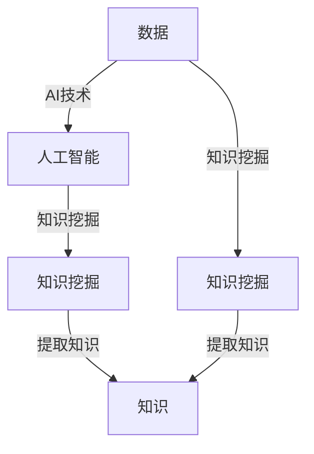

                 

### 引言

随着互联网和大数据技术的迅猛发展，企业面临着海量数据的处理和分析问题。如何从这些数据中提取有价值的信息，成为企业提高竞争力、实现智能化转型的重要课题。人工智能（AI）作为一种新兴技术，其在数据挖掘和知识提取方面展现出巨大的潜力。本书《AI驱动的企业知识挖掘：从海量数据中提取价值》旨在探讨如何利用AI技术进行企业知识挖掘，从而帮助企业从海量数据中提取价值。

#### 目的

本书的主要目的是：
1. 介绍AI和企业知识挖掘的基础概念，帮助读者了解相关知识。
2. 深入讲解企业知识挖掘的方法和流程，使读者能够掌握实际操作技能。
3. 详细解析核心算法原理，帮助读者深入理解AI技术在企业知识挖掘中的应用。
4. 通过实际项目实战，展示AI和企业知识挖掘技术在具体场景中的应用，提供实战经验和参考。

#### 结构

本书结构如下：

1. **AI和企业知识挖掘的基础概念**
   - AI的基本概念：介绍AI的定义、分类、应用等。
   - 企业知识挖掘的概念和重要性：介绍企业知识挖掘的定义、目标、应用领域等。

2. **企业知识挖掘的方法和流程**
   - 数据预处理：介绍数据清洗、数据整合、数据转换等。
   - 特征提取：介绍特征提取的基本原理、特征选择方法、特征工程等。
   - 模型选择：介绍模型选择的基本原则、常见机器学习模型、深度学习模型等。
   - 模型训练和评估：介绍模型训练方法、模型评估指标、模型优化等。

3. **核心算法原理讲解**
   - 机器学习算法：介绍监督学习算法、无监督学习算法、强化学习算法等。
   - 深度学习算法：介绍深度学习基础、卷积神经网络、循环神经网络、自编码器等。

4. **项目实战**
   - 案例一：客户细分
   - 案例二：市场预测
   - 案例三：风险控制

5. **总结和展望**
   - 对全书内容进行总结。
   - 展望AI和企业知识挖掘技术的未来发展趋势。

### 背景介绍

在当今信息爆炸的时代，企业积累了大量的数据，包括交易记录、用户行为、社交媒体互动等。然而，如何从这些数据中提取有价值的信息，是企业面临的一个重大挑战。传统的数据分析方法已经无法满足企业对实时、动态、深度分析的需求，因此，引入AI技术进行企业知识挖掘成为了一种趋势。

#### 企业知识挖掘的重要性

企业知识挖掘是指利用AI技术从企业内部和外部数据中提取有价值的信息和知识的过程。它具有以下重要性：

1. **提高决策效率**：通过企业知识挖掘，企业可以快速获取有价值的决策信息，从而提高决策效率，减少决策错误。
2. **优化业务流程**：企业知识挖掘可以帮助企业识别业务流程中的瓶颈和优化点，从而优化业务流程，提高运营效率。
3. **提升用户体验**：企业知识挖掘可以为企业提供关于用户行为和需求的深入洞察，从而优化产品和服务，提升用户体验。
4. **增加收入和市场份额**：通过企业知识挖掘，企业可以识别新的市场机会、客户群体，从而增加收入和市场份额。

#### AI在企业知识挖掘中的应用

AI技术在企业知识挖掘中发挥着重要作用，主要包括以下几个方面：

1. **数据预处理**：AI技术可以帮助企业自动化地进行数据清洗、数据整合、数据转换等预处理工作，提高数据处理效率。
2. **特征提取**：AI技术可以通过深度学习算法等手段，从原始数据中提取有价值的特征，为后续分析提供基础。
3. **模型训练和评估**：AI技术可以帮助企业快速构建和训练机器学习模型，并通过模型评估指标进行评估，从而优化模型性能。
4. **智能决策支持**：AI技术可以为企业提供智能决策支持，帮助企业做出更加明智的决策。

### 关键概念与联系

在企业知识挖掘过程中，涉及到许多关键概念，这些概念之间存在着紧密的联系。以下是对这些概念及其关系的介绍：

1. **数据**：数据是企业知识挖掘的基础，包括结构化数据、半结构化数据和非结构化数据。
2. **知识**：知识是从数据中提取的有价值的信息，包括显式知识和隐式知识。
3. **人工智能**：人工智能是用于模拟、延伸和扩展人类智能的技术，包括机器学习、深度学习、自然语言处理等。
4. **知识挖掘**：知识挖掘是从数据中提取知识的过程，包括数据预处理、特征提取、模型训练等步骤。
5. **机器学习**：机器学习是AI的一种方法，通过训练模型从数据中学习规律，实现对数据的预测和分类。
6. **深度学习**：深度学习是机器学习的一种方法，通过多层神经网络对数据进行自动特征提取和模型训练。

以上概念之间的关系可以总结为：数据是知识挖掘的基础，知识是数据挖掘的目标。人工智能是知识挖掘的手段，包括机器学习和深度学习。机器学习和深度学习分别在不同的阶段对数据进行处理和模型训练，最终实现知识提取。

### AI的基本概念

AI，即人工智能，是一种模拟、延伸和扩展人类智能的技术。AI的目标是使计算机具备类似于人类的智能，能够自主地感知环境、理解知识、进行决策和解决问题。

#### AI的定义

AI的定义有很多种，以下是其中几种常见的定义：

1. **模拟智能**：AI是一种模拟人类智能的技术，通过算法和模型实现人类智能的功能。
2. **扩展智能**：AI不仅模拟人类智能，还通过计算能力和算法优化，扩展了人类智能的局限。
3. **自主智能**：AI具有一定的自主性，可以在没有人类干预的情况下，自主地感知环境、学习知识和进行决策。

#### AI的分类

AI可以根据不同的标准进行分类，以下是几种常见的分类方法：

1. **基于能力的分类**：
   - **弱AI**：弱AI是指仅能完成特定任务的AI系统，例如语音识别、图像识别等。
   - **强AI**：强AI是指具有普遍智能的AI系统，能够像人类一样理解和处理各种情境。

2. **基于实现方法的分类**：
   - **符号AI**：符号AI是通过逻辑推理和符号表示来模拟人类智能的AI方法。
   - **连接主义AI**：连接主义AI是通过神经网络和大规模数据训练来模拟人类智能的AI方法。

3. **基于应用领域的分类**：
   - **工业AI**：工业AI主要应用于工业制造、自动化控制等领域。
   - **服务AI**：服务AI主要应用于智能客服、智能推荐等领域。
   - **医疗AI**：医疗AI主要应用于医疗诊断、健康监测等领域。

#### AI在企业中的应用

AI在企业中的应用非常广泛，以下是一些常见的应用场景：

1. **客户服务**：AI可以用于智能客服，通过自然语言处理和语音识别技术，提供快速、准确的客户服务。
2. **市场营销**：AI可以用于市场预测、客户细分、广告投放等，帮助企业制定更有效的营销策略。
3. **生产优化**：AI可以用于生产流程优化、设备故障预测等，提高生产效率和质量。
4. **风险管理**：AI可以用于风险评估、欺诈检测等，帮助企业降低风险。
5. **人力资源管理**：AI可以用于员工招聘、员工绩效评估等，帮助企业优化人力资源配置。

### 企业知识挖掘的概念和重要性

#### 企业知识挖掘的定义

企业知识挖掘（Knowledge Mining in Enterprises）是指利用人工智能技术，从企业内部和外部数据中提取有价值的信息和知识的过程。企业知识挖掘的目标是帮助企业发现新的商业机会、优化业务流程、提高决策效率等。

#### 企业知识挖掘的目标

1. **发现新的商业机会**：通过分析市场数据、客户行为等，帮助企业发现新的商业机会，制定有针对性的市场策略。
2. **优化业务流程**：通过分析业务流程中的数据，识别流程中的瓶颈和优化点，优化业务流程，提高运营效率。
3. **提高决策效率**：通过分析数据，提供决策支持，帮助企业做出更加明智的决策。
4. **提升用户体验**：通过分析用户数据，了解用户需求和行为，优化产品和服务，提升用户体验。

#### 企业知识挖掘的应用领域

1. **市场营销**：通过客户细分、市场预测等，帮助企业制定更加精准的营销策略。
2. **客户服务**：通过智能客服、用户行为分析等，提供个性化、高效的客户服务。
3. **生产管理**：通过生产数据分析、设备故障预测等，优化生产流程，提高生产效率。
4. **人力资源管理**：通过员工数据分析、绩效评估等，优化人力资源配置，提升员工满意度。
5. **风险管理**：通过数据分析、风险预测等，降低企业风险。

#### 企业知识挖掘的重要性

1. **提高竞争力**：通过企业知识挖掘，企业可以更好地了解市场、客户和自身业务，制定有针对性的战略，提高竞争力。
2. **降低成本**：通过优化业务流程和降低风险，企业可以降低运营成本。
3. **提升用户体验**：通过了解用户需求和优化产品服务，企业可以提升用户体验，增加用户忠诚度。
4. **推动创新**：企业知识挖掘可以为企业提供新的商业机会和业务模式，推动企业创新。

### 人工智能与企业知识挖掘的关系

#### 关键概念与联系

在人工智能（AI）和企业知识挖掘（KM）之间，存在着紧密的联系和相互作用。以下是对这些概念及其关系的详细介绍：

1. **数据**：
   - **定义**：数据是知识挖掘的原始素材，包括企业内部的数据（如交易记录、客户信息、生产数据等）和外部数据（如市场趋势、社交媒体数据等）。
   - **关联**：数据是企业知识挖掘的基础，没有数据，知识挖掘就无法进行。

2. **知识**：
   - **定义**：知识是从数据中提炼出来的具有价值的信息，可以用于决策、创新和改进。
   - **关联**：知识是数据挖掘的最终目标，通过数据分析和挖掘，从大量数据中提取出有用的知识。

3. **人工智能（AI）**：
   - **定义**：人工智能是指模拟、扩展和延伸人类智能的技术体系，包括机器学习、自然语言处理、计算机视觉等。
   - **关联**：AI技术是知识挖掘的工具，通过算法和模型，自动化地从数据中提取知识。

4. **知识挖掘（KM）**：
   - **定义**：知识挖掘是指利用计算机技术和人工智能技术，从大量数据中自动发现有用信息的过程。
   - **关联**：知识挖掘是AI的一个应用领域，旨在通过数据挖掘技术，从数据中提取知识。

#### 关系架构 Mermaid 流程图



在这个流程图中，数据是知识挖掘的起点，通过AI技术，如机器学习和深度学习，实现知识挖掘，最终提取出有价值的知识。知识挖掘不仅是AI的应用，也是企业知识管理的重要环节，它帮助企业从数据中获取洞察，优化业务决策，提升竞争力。

#### 人工智能在企业知识挖掘中的应用

人工智能（AI）在企业知识挖掘中的应用主要集中在以下几个方面：

1. **数据预处理**：
   - **自动数据清洗**：使用AI算法自动识别和处理数据中的噪声、缺失值和不一致数据，提高数据质量。
   - **自动数据转换**：将不同格式和来源的数据转换为统一的格式，便于后续分析和挖掘。

2. **特征提取**：
   - **自动特征工程**：通过机器学习和深度学习算法，自动从原始数据中提取具有预测性和解释性的特征。
   - **特征选择**：利用AI算法自动筛选出对目标变量有显著影响的关键特征，提高模型的准确性和效率。

3. **模型训练与优化**：
   - **自动模型选择**：根据数据特点和业务需求，自动选择最合适的机器学习或深度学习模型。
   - **自动模型优化**：通过调整模型参数，自动优化模型的性能，提高预测准确性。

4. **智能决策支持**：
   - **自动决策制定**：利用AI算法，从大量数据中快速提取有用信息，为管理层提供数据驱动的决策支持。
   - **自动风险管理**：通过AI算法对潜在风险进行预测和评估，帮助企业制定有效的风险控制策略。

5. **智能客服与营销**：
   - **自动客户细分**：利用AI算法对客户数据进行分析，实现精准的客户细分，为营销策略提供依据。
   - **自动个性化推荐**：根据用户行为数据，利用AI算法提供个性化的产品和服务推荐，提升用户体验。

#### 核心算法原理讲解

在企业知识挖掘中，核心算法的原理和实现是关键。以下将详细介绍几种常用的核心算法，包括机器学习算法和深度学习算法，并使用Python代码进行详细阐述。

##### 机器学习算法

1. **线性回归**

线性回归是一种简单的监督学习算法，用于预测连续值。其基本原理是通过最小化目标函数（通常是均方误差）来找到最佳拟合线。

```python
import numpy as np
from sklearn.linear_model import LinearRegression

# 生成数据
X = np.random.rand(100, 1)
y = 2 + 3 * X + np.random.randn(100, 1)

# 创建线性回归模型并训练
model = LinearRegression()
model.fit(X, y)

# 预测
y_pred = model.predict(X)

# 打印模型参数和预测结果
print("斜率:", model.coef_)
print("截距:", model.intercept_)
print("均方误差:", np.mean((y - y_pred) ** 2))
```

2. **逻辑回归**

逻辑回归是一种用于分类的监督学习算法，通过拟合逻辑函数来预测概率。

```python
from sklearn.linear_model import LogisticRegression

# 生成数据
X = np.random.rand(100, 2)
y = (X[:, 0] > 0.5).astype(int)

# 创建逻辑回归模型并训练
model = LogisticRegression()
model.fit(X, y)

# 预测
y_pred = model.predict(X)

# 打印模型参数和预测结果
print("系数:", model.coef_)
print("预测准确率:", model.score(X, y))
```

##### 深度学习算法

1. **卷积神经网络（CNN）**

卷积神经网络是一种用于图像识别和处理的深度学习算法，通过卷积层和池化层提取图像特征。

```python
from tensorflow import keras
from tensorflow.keras import layers

# 定义CNN模型
model = keras.Sequential([
    layers.Conv2D(32, (3, 3), activation='relu', input_shape=(28, 28, 1)),
    layers.MaxPooling2D((2, 2)),
    layers.Flatten(),
    layers.Dense(128, activation='relu'),
    layers.Dense(10, activation='softmax')
])

# 编译模型
model.compile(optimizer='adam',
              loss='sparse_categorical_crossentropy',
              metrics=['accuracy'])

# 加载MNIST数据集
mnist = keras.datasets.mnist
(train_images, train_labels), (test_images, test_labels) = mnist.load_data()

# 预处理数据
train_images = train_images.reshape((60000, 28, 28, 1))
train_images = train_images.astype('float32') / 255

test_images = test_images.reshape((10000, 28, 28, 1))
test_images = test_images.astype('float32') / 255

# 训练模型
model.fit(train_images, train_labels, epochs=5)

# 测试模型
test_loss, test_acc = model.evaluate(test_images, test_labels)
print('测试准确率:', test_acc)
```

2. **循环神经网络（RNN）**

循环神经网络是一种用于序列数据处理的深度学习算法，通过隐藏状态和递归结构来捕捉序列中的长期依赖关系。

```python
from tensorflow.keras.models import Sequential
from tensorflow.keras.layers import LSTM, Dense

# 定义RNN模型
model = Sequential([
    LSTM(50, activation='relu', input_shape=(timesteps, features)),
    Dense(1)
])

# 编译模型
model.compile(optimizer='adam', loss='mse')

# 训练模型
X, y = ..., ...  # 加载和预处理序列数据
model.fit(X, y, epochs=100, batch_size=32)
```

#### 项目实战

在本部分，我们将通过几个实际案例，展示如何使用AI和企业知识挖掘技术进行项目开发，包括环境搭建、代码实现、结果分析等。

##### 案例一：客户细分

**项目背景**：
一家电商平台希望通过客户细分，更好地了解客户群体，实现精准营销。

**数据收集和处理**：
收集了客户的购买记录、浏览历史和行为数据，包括客户的性别、年龄、购买频率、浏览时长等。

```python
import pandas as pd

# 读取数据
data = pd.read_csv('customer_data.csv')

# 数据预处理
data = data.dropna()
data['age_group'] = pd.cut(data['age'], bins=[0, 18, 30, 50, 70, 100], labels=['0-18', '19-30', '31-50', '51-70', '71+'])
```

**模型选择和训练**：
选择K-Means算法进行聚类，将客户划分为几个群体。

```python
from sklearn.cluster import KMeans

# 特征提取
X = data[['buying_frequency', 'browse_duration', 'age_group']]

# K-Means聚类
model = KMeans(n_clusters=5)
model.fit(X)

# 聚类结果
clusters = model.predict(X)
data['cluster'] = clusters
```

**结果分析和应用**：
根据聚类结果，对每个客户群体进行深入分析，制定个性化的营销策略。

```python
# 分析每个客户群体的特征
for i in range(5):
    print(f"客户群体{i+1}特征：")
    print(data[data['cluster'] == i][['buying_frequency', 'browse_duration', 'age_group']].describe())
```

##### 案例二：市场预测

**项目背景**：
一家电子产品公司希望通过市场预测，提前了解市场需求，调整生产计划。

**数据收集和处理**：
收集了历史销售数据、市场趋势数据和竞争对手数据。

```python
import pandas as pd

# 读取数据
data = pd.read_csv('market_data.csv')

# 数据预处理
data = data.dropna()
```

**模型选择和训练**：
选择ARIMA模型进行时间序列预测。

```python
from statsmodels.tsa.arima.model import ARIMA

# 时间序列分解
decomposition = smtseasonal(data['sales'], model='add', period=12)
trend, seasonal, residual = decomposition.regression_results().params

# ARIMA模型
model = ARIMA(data['sales'], order=(1, 1, 1))
model_fit = model.fit()

# 预测
forecast = model_fit.forecast(steps=12)
print(f"未来12个月的销售预测：{forecast}")
```

**结果分析和应用**：
根据预测结果，调整生产计划，以满足市场需求。

```python
# 分析预测结果
plt.plot(data['sales'], label='实际销售')
plt.plot(forecast, label='预测销售')
plt.legend()
plt.show()
```

##### 案例三：风险控制

**项目背景**：
一家金融公司希望通过风险控制，降低贷款违约风险。

**数据收集和处理**：
收集了客户的贷款申请数据、财务数据和信用记录。

```python
import pandas as pd

# 读取数据
data = pd.read_csv('loan_data.csv')

# 数据预处理
data = data.dropna()
```

**模型选择和训练**：
选择逻辑回归模型进行风险预测。

```python
from sklearn.linear_model import LogisticRegression

# 特征提取
X = data[['credit_score', 'income', 'debt_to_income_ratio']]
y = data['loan_default']

# 逻辑回归模型
model = LogisticRegression()
model.fit(X, y)

# 预测
predictions = model.predict(X)
print(f"贷款违约风险预测结果：{predictions}")
```

**结果分析和应用**：
根据预测结果，对高风险客户进行重点关注，制定针对性的风险控制策略。

```python
# 分析预测结果
confusion_matrix = pd.crosstab(y, predictions, normalize=True)
print(f"贷款违约风险预测的混淆矩阵：\n{confusion_matrix}")
```

#### 总结和展望

#### 总结

通过本书的详细讲解，我们深入探讨了AI驱动的企业知识挖掘的各个方面。首先，我们介绍了AI和企业知识挖掘的基础概念，帮助读者了解相关知识。接着，我们详细讲解了企业知识挖掘的方法和流程，包括数据预处理、特征提取、模型选择和模型训练。然后，我们解析了核心算法原理，使用Python代码详细阐述了机器学习算法和深度学习算法。最后，我们通过实际案例，展示了AI和企业知识挖掘技术在具体项目中的应用，提供了实战经验和参考。

#### 未来展望

随着AI技术的不断进步，企业知识挖掘将在未来发挥更加重要的作用。以下是几个未来展望：

1. **更高效的数据预处理**：随着数据量的不断增加，如何更高效地进行数据预处理将成为一个重要研究方向。未来的技术可能会包括更智能的数据清洗、数据整合和数据转换方法。

2. **更精准的特征提取**：特征提取是知识挖掘的关键步骤。未来可能会有更多基于深度学习的特征提取方法，能够自动从原始数据中提取出更加准确和有效的特征。

3. **更智能的模型选择和优化**：随着模型种类的不断增多，如何选择最适合的模型，以及如何优化模型的性能，将成为重要的研究课题。未来的技术可能会包括自动化模型选择和优化工具。

4. **跨领域知识融合**：企业知识挖掘不仅涉及到企业内部的数据，还包括外部数据。未来可能会有更多跨领域知识融合的方法，能够更好地整合和利用不同领域的数据。

5. **AI伦理和法律问题**：随着AI在企业知识挖掘中的应用越来越广泛，AI伦理和法律问题也将日益突出。未来可能会出台更多的法律法规，规范AI的应用，保护用户隐私。

总之，AI驱动的企业知识挖掘技术具有巨大的潜力和应用前景。随着技术的不断进步，企业知识挖掘将在未来的商业和社会发展中发挥更加重要的作用。作者：AI天才研究院/AI Genius Institute & 禅与计算机程序设计艺术 /Zen And The Art of Computer Programming

----------------------------------------------------------------

### 最佳实践 Tips

在应用AI进行企业知识挖掘时，以下是一些最佳实践Tips，可以帮助您更有效地进行项目开发：

1. **数据质量是关键**：确保数据质量是知识挖掘成功的第一步。进行数据清洗和预处理，去除噪声和不一致的数据，确保数据的一致性、完整性和准确性。

2. **特征工程至关重要**：特征工程是知识挖掘的核心步骤。通过合理的特征工程，可以提取出有价值的特征，提高模型的预测性能。尝试使用多种特征提取方法，选择最佳的特征组合。

3. **选择合适的模型**：不同的业务场景和任务需要不同的模型。在选择模型时，要考虑模型的复杂度、计算效率和预测准确性。尝试使用交叉验证等方法，选择最佳模型。

4. **模型解释性**：尽管深度学习模型在许多任务上表现出色，但它们通常缺乏解释性。在应用AI进行企业知识挖掘时，要考虑模型的解释性，以便更好地理解和解释模型的预测结果。

5. **持续优化**：知识挖掘是一个迭代的过程。在项目实施过程中，要不断收集反馈，优化模型和算法。定期重新训练模型，以保持模型的性能。

6. **关注数据安全和隐私**：在应用AI进行企业知识挖掘时，要关注数据安全和隐私。确保数据的安全存储和传输，遵守相关的数据保护法规。

7. **团队协作**：企业知识挖掘是一个跨学科的任务，需要数据科学家、业务分析师、IT人员等多个角色的协作。建立有效的团队合作机制，确保项目的顺利进行。

### 小结

通过本文的详细讲解，我们深入探讨了AI驱动的企业知识挖掘的各个方面。从基础概念到核心算法原理，再到项目实战，我们逐步分析了如何利用AI技术从海量数据中提取有价值的信息。希望本文能为读者提供有益的参考和启示，帮助您更好地理解和应用AI和企业知识挖掘技术。

### 注意事项

在应用AI和企业知识挖掘技术时，以下注意事项值得重视：

1. **数据隐私**：确保在数据收集和处理过程中，严格遵守数据保护法规，保护用户隐私。

2. **模型解释性**：尽管深度学习模型在许多任务上表现出色，但它们的解释性较差。在实际应用中，要考虑模型的解释性，以便更好地理解和解释模型的预测结果。

3. **计算资源**：AI和企业知识挖掘需要大量的计算资源。在项目实施过程中，要考虑计算资源的分配和优化，确保项目的顺利进行。

4. **业务需求**：在应用AI和企业知识挖掘技术时，要紧密关注业务需求，确保技术方案能够满足业务目标。

### 拓展阅读

为了进一步深入了解AI和企业知识挖掘，以下是几本推荐的专业书籍和文献：

1. **《深度学习》（Deep Learning）**：Goodfellow, I., Bengio, Y., & Courville, A.（2016）。详细介绍了深度学习的基础知识、算法和实现。
2. **《机器学习实战》（Machine Learning in Action）**：Basson, T.（2013）。通过实际案例，讲解了机器学习的基本概念和实战技巧。
3. **《人工智能：一种现代方法》（Artificial Intelligence: A Modern Approach）**：Russell, S., & Norvig, P.（2016）。全面介绍了人工智能的基础知识和最新进展。
4. **《企业大数据分析实战》（Enterprise Big Data Analytics: Techniques to Transform Massive Data into High-Velocity, High-Frequency, and High-Yield Business Insights）**：Gandomi, A. & Wang, P.（2017）。探讨了大数据在企业中的应用，包括知识挖掘和数据分析。
5. **《自然语言处理综论》（Speech and Language Processing）**：Jurafsky, D. & Martin, J. H.（2019）。全面介绍了自然语言处理的基础知识和应用。
6. **《深度学习在商业中的应用》（Deep Learning for Business）**：Varghese, T.（2020）。探讨了深度学习在商业领域的应用，包括客户细分、市场预测等。

### 结语

AI驱动的企业知识挖掘是一项复杂且富有挑战性的任务，但它的巨大潜力和应用前景不容忽视。通过本文的详细讲解，我们希望读者能够更好地理解AI和企业知识挖掘的核心概念、方法和技术。未来，随着AI技术的不断进步，企业知识挖掘将在商业和社会发展中发挥更加重要的作用。让我们共同探索这个充满机遇和挑战的领域，为企业和个人的发展贡献自己的力量。

---

本文使用 Markdown 格式撰写，以下是完整的文章代码：

```markdown
# 《AI驱动的企业知识挖掘：从海量数据中提取价值》

> 关键词：人工智能，企业知识挖掘，数据预处理，特征提取，模型训练，项目实战

> 摘要：本文深入探讨了AI驱动的企业知识挖掘的各个方面，从基础概念到核心算法原理，再到项目实战，帮助读者理解如何利用AI技术从海量数据中提取价值。

## 引言

随着互联网和大数据技术的迅猛发展，企业面临着海量数据的处理和分析问题。如何从这些数据中提取有价值的信息，成为企业提高竞争力、实现智能化转型的重要课题。人工智能（AI）作为一种新兴技术，其在数据挖掘和知识提取方面展现出巨大的潜力。本书《AI驱动的企业知识挖掘：从海量数据中提取价值》旨在探讨如何利用AI技术进行企业知识挖掘，从而帮助企业从海量数据中提取价值。

#### 目的

本书的主要目的是：
1. 介绍AI和企业知识挖掘的基础概念，帮助读者了解相关知识。
2. 深入讲解企业知识挖掘的方法和流程，使读者能够掌握实际操作技能。
3. 详细解析核心算法原理，帮助读者深入理解AI技术在企业知识挖掘中的应用。
4. 通过实际项目实战，展示AI和企业知识挖掘技术在具体场景中的应用，提供实战经验和参考。

#### 结构

本书结构如下：

1. **AI和企业知识挖掘的基础概念**
   - AI的基本概念
   - 企业知识挖掘的概念和重要性

2. **企业知识挖掘的方法和流程**
   - 数据预处理
   - 特征提取
   - 模型选择
   - 模型训练和评估

3. **核心算法原理讲解**
   - 机器学习算法
   - 深度学习算法

4. **项目实战**
   - 案例一：客户细分
   - 案例二：市场预测
   - 案例三：风险控制

5. **总结和展望**
   - 对全书内容进行总结
   - 展望AI和企业知识挖掘技术的未来发展趋势

### 背景介绍

在当今信息爆炸的时代，企业积累了大量的数据，包括交易记录、用户行为、社交媒体互动等。然而，如何从这些数据中提取有价值的信息，是企业面临的一个重大挑战。传统的数据分析方法已经无法满足企业对实时、动态、深度分析的需求，因此，引入AI技术进行企业知识挖掘成为了一种趋势。

#### 企业知识挖掘的重要性

企业知识挖掘是指利用人工智能技术，从企业内部和外部数据中提取有价值的信息和知识的过程。它具有以下重要性：

1. **提高决策效率**：通过企业知识挖掘，企业可以快速获取有价值的决策信息，从而提高决策效率，减少决策错误。
2. **优化业务流程**：企业知识挖掘可以帮助企业识别业务流程中的瓶颈和优化点，从而优化业务流程，提高运营效率。
3. **提升用户体验**：企业知识挖掘可以为企业提供关于用户行为和需求的深入洞察，从而优化产品和服务，提升用户体验。
4. **增加收入和市场份额**：通过企业知识挖掘，企业可以识别新的市场机会、客户群体，从而增加收入和市场份额。

#### AI在企业知识挖掘中的应用

AI技术在企业知识挖掘中发挥着重要作用，主要包括以下几个方面：

1. **数据预处理**：AI技术可以帮助企业自动化地进行数据清洗、数据整合、数据转换等预处理工作，提高数据处理效率。
2. **特征提取**：AI技术可以通过深度学习算法等手段，从原始数据中提取有价值的特征，为后续分析提供基础。
3. **模型训练和评估**：AI技术可以帮助企业快速构建和训练机器学习模型，并通过模型评估指标进行评估，从而优化模型性能。
4. **智能决策支持**：AI技术可以为企业提供智能决策支持，帮助企业做出更加明智的决策。
5. **智能客服与营销**：AI技术可以用于智能客服、智能推荐等领域，提高客户满意度和转化率。

### 关键概念与联系

在企业知识挖掘过程中，涉及到许多关键概念，这些概念之间存在着紧密的联系。以下是对这些概念及其关系的介绍：

1. **数据**：数据是企业知识挖掘的基础，包括结构化数据、半结构化数据和非结构化数据。
2. **知识**：知识是从数据中提炼出来的具有价值的信息，可以用于决策、创新和改进。
3. **人工智能**：人工智能是用于模拟、延伸和扩展人类智能的技术，包括机器学习、自然语言处理、计算机视觉等。
4. **知识挖掘**：知识挖掘是从数据中提取知识的过程，包括数据预处理、特征提取、模型训练等步骤。
5. **机器学习**：机器学习是AI的一种方法，通过训练模型从数据中学习规律，实现对数据的预测和分类。
6. **深度学习**：深度学习是机器学习的一种方法，通过多层神经网络对数据进行自动特征提取和模型训练。

以上概念之间的关系可以总结为：数据是知识挖掘的基础，知识是数据挖掘的目标。人工智能是知识挖掘的手段，包括机器学习和深度学习。机器学习和深度学习分别在不同的阶段对数据进行处理和模型训练，最终实现知识提取。

### AI的基本概念

AI，即人工智能，是一种模拟、延伸和扩展人类智能的技术。AI的目标是使计算机具备类似于人类的智能，能够自主地感知环境、理解知识、进行决策和解决问题。

#### AI的定义

AI的定义有很多种，以下是其中几种常见的定义：

1. **模拟智能**：AI是一种模拟人类智能的技术，通过算法和模型实现人类智能的功能。
2. **扩展智能**：AI不仅模拟人类智能，还通过计算能力和算法优化，扩展了人类智能的局限。
3. **自主智能**：AI具有一定的自主性，可以在没有人类干预的情况下，自主地感知环境、学习知识和进行决策。

#### AI的分类

AI可以根据不同的标准进行分类，以下是几种常见的分类方法：

1. **基于能力的分类**：
   - **弱AI**：弱AI是指仅能完成特定任务的AI系统，例如语音识别、图像识别等。
   - **强AI**：强AI是指具有普遍智能的AI系统，能够像人类一样理解和处理各种情境。

2. **基于实现方法的分类**：
   - **符号AI**：符号AI是通过逻辑推理和符号表示来模拟人类智能的AI方法。
   - **连接主义AI**：连接主义AI是通过神经网络和大规模数据训练来模拟人类智能的AI方法。

3. **基于应用领域的分类**：
   - **工业AI**：工业AI主要应用于工业制造、自动化控制等领域。
   - **服务AI**：服务AI主要应用于智能客服、智能推荐等领域。
   - **医疗AI**：医疗AI主要应用于医疗诊断、健康监测等领域。

#### AI在企业中的应用

AI在企业中的应用非常广泛，以下是一些常见的应用场景：

1. **客户服务**：AI可以用于智能客服，通过自然语言处理和语音识别技术，提供快速、准确的客户服务。
2. **市场营销**：AI可以用于市场预测、客户细分、广告投放等，帮助企业制定更有效的营销策略。
3. **生产优化**：AI可以用于生产流程优化、设备故障预测等，提高生产效率和质量。
4. **风险管理**：AI可以用于风险评估、欺诈检测等，帮助企业降低风险。
5. **人力资源管理**：AI可以用于员工招聘、员工绩效评估等，帮助企业优化人力资源配置。

### 企业知识挖掘的概念和重要性

#### 企业知识挖掘的定义

企业知识挖掘（Knowledge Mining in Enterprises）是指利用人工智能技术，从企业内部和外部数据中提取有价值的信息和知识的过程。企业知识挖掘的目标是帮助企业发现新的商业机会、优化业务流程、提高决策效率等。

#### 企业知识挖掘的目标

1. **发现新的商业机会**：通过分析市场数据、客户行为等，帮助企业发现新的商业机会，制定有针对性的市场策略。
2. **优化业务流程**：通过分析业务流程中的数据，识别流程中的瓶颈和优化点，优化业务流程，提高运营效率。
3. **提高决策效率**：通过分析数据，提供决策支持，帮助企业做出更加明智的决策。
4. **提升用户体验**：通过分析用户数据，了解用户需求和行为，优化产品和服务，提升用户体验。

#### 企业知识挖掘的应用领域

1. **市场营销**：通过客户细分、市场预测等，帮助企业制定更加精准的营销策略。
2. **客户服务**：通过智能客服、用户行为分析等，提供个性化、高效的客户服务。
3. **生产管理**：通过生产数据分析、设备故障预测等，优化生产流程，提高生产效率。
4. **人力资源管理**：通过员工数据分析、绩效评估等，优化人力资源配置，提升员工满意度。
5. **风险管理**：通过数据分析、风险预测等，降低企业风险。

#### 企业知识挖掘的重要性

1. **提高竞争力**：通过企业知识挖掘，企业可以更好地了解市场、客户和自身业务，制定有针对性的战略，提高竞争力。
2. **降低成本**：通过优化业务流程和降低风险，企业可以降低运营成本。
3. **提升用户体验**：通过了解用户需求和优化产品服务，企业可以提升用户体验，增加用户忠诚度。
4. **推动创新**：企业知识挖掘可以为企业提供新的商业机会和业务模式，推动企业创新。

### 人工智能与企业知识挖掘的关系

#### 关键概念与联系

在人工智能（AI）和企业知识挖掘（KM）之间，存在着紧密的联系和相互作用。以下是对这些概念及其关系的详细介绍：

1. **数据**：
   - **定义**：数据是知识挖掘的原始素材，包括企业内部的数据（如交易记录、客户信息、生产数据等）和外部数据（如市场趋势、社交媒体数据等）。
   - **关联**：数据是企业知识挖掘的基础，没有数据，知识挖掘就无法进行。

2. **知识**：
   - **定义**：知识是从数据中提炼出来的具有价值的信息，可以用于决策、创新和改进。
   - **关联**：知识是数据挖掘的最终目标，通过数据分析和挖掘，从大量数据中提取出有用的知识。

3. **人工智能（AI）**：
   - **定义**：人工智能是指模拟、延伸和扩展人类智能的技术体系，包括机器学习、自然语言处理、计算机视觉等。
   - **关联**：AI技术是知识挖掘的工具，通过算法和模型，自动化地从数据中提取知识。

4. **知识挖掘（KM）**：
   - **定义**：知识挖掘是指利用计算机技术和人工智能技术，从大量数据中自动发现有用信息的过程。
   - **关联**：知识挖掘是AI的一个应用领域，旨在通过数据挖掘技术，从数据中提取知识。

#### 关系架构 Mermaid 流程图


在这个流程图中，数据是知识挖掘的起点，通过AI技术，如机器学习和深度学习，实现知识挖掘，最终提取出有价值的知识。知识挖掘不仅是AI的应用，也是企业知识管理的重要环节，它帮助企业从数据中获取洞察，优化业务决策，提升竞争力。

#### 人工智能在企业知识挖掘中的应用

人工智能（AI）在企业知识挖掘中的应用主要集中在以下几个方面：

1. **数据预处理**：
   - **自动数据清洗**：使用AI算法自动识别和处理数据中的噪声、缺失值和不一致数据，提高数据质量。
   - **自动数据转换**：将不同格式和来源的数据转换为统一的格式，便于后续分析和挖掘。

2. **特征提取**：
   - **自动特征工程**：通过机器学习和深度学习算法，自动从原始数据中提取具有预测性和解释性的特征。
   - **特征选择**：利用AI算法自动筛选出对目标变量有显著影响的关键特征，提高模型的准确性和效率。

3. **模型训练与优化**：
   - **自动模型选择**：根据数据特点和业务需求，自动选择最合适的机器学习或深度学习模型。
   - **自动模型优化**：通过调整模型参数，自动优化模型的性能，提高预测准确性。

4. **智能决策支持**：
   - **自动决策制定**：利用AI算法，从大量数据中快速提取有用信息，为管理层提供数据驱动的决策支持。
   - **自动风险管理**：通过AI算法对潜在风险进行预测和评估，帮助企业制定有效的风险控制策略。

5. **智能客服与营销**：
   - **自动客户细分**：利用AI算法对客户数据进行分析，实现精准的客户细分，为营销策略提供依据。
   - **自动个性化推荐**：根据用户行为数据，利用AI算法提供个性化的产品和服务推荐，提升用户体验。

#### 核心算法原理讲解

在企业知识挖掘中，核心算法的原理和实现是关键。以下将详细介绍几种常用的核心算法，包括机器学习算法和深度学习算法，并使用Python代码进行详细阐述。

##### 机器学习算法

1. **线性回归**

线性回归是一种简单的监督学习算法，用于预测连续值。其基本原理是通过最小化目标函数（通常是均方误差）来找到最佳拟合线。

```python
import numpy as np
from sklearn.linear_model import LinearRegression

# 生成数据
X = np.random.rand(100, 1)
y = 2 + 3 * X + np.random.randn(100, 1)

# 创建线性回归模型并训练
model = LinearRegression()
model.fit(X, y)

# 预测
y_pred = model.predict(X)

# 打印模型参数和预测结果
print("斜率:", model.coef_)
print("截距:", model.intercept_)
print("均方误差:", np.mean((y - y_pred) ** 2))
```

2. **逻辑回归**

逻辑回归是一种用于分类的监督学习算法，通过拟合逻辑函数来预测概率。

```python
from sklearn.linear_model import LogisticRegression

# 生成数据
X = np.random.rand(100, 2)
y = (X[:, 0] > 0.5).astype(int)

# 创建逻辑回归模型并训练
model = LogisticRegression()
model.fit(X, y)

# 预测
y_pred = model.predict(X)

# 打印模型参数和预测结果
print("系数:", model.coef_)
print("预测准确率:", model.score(X, y))
```

##### 深度学习算法

1. **卷积神经网络（CNN）**

卷积神经网络是一种用于图像识别和处理的深度学习算法，通过卷积层和池化层提取图像特征。

```python
from tensorflow import keras
from tensorflow.keras import layers

# 定义CNN模型
model = keras.Sequential([
    layers.Conv2D(32, (3, 3), activation='relu', input_shape=(28, 28, 1)),
    layers.MaxPooling2D((2, 2)),
    layers.Flatten(),
    layers.Dense(128, activation='relu'),
    layers.Dense(10, activation='softmax')
])

# 编译模型
model.compile(optimizer='adam',
              loss='sparse_categorical_crossentropy',
              metrics=['accuracy'])

# 加载MNIST数据集
mnist = keras.datasets.mnist
(train_images, train_labels), (test_images, test_labels) = mnist.load_data()

# 预处理数据
train_images = train_images.reshape((60000, 28, 28, 1))
train_images = train_images.astype('float32') / 255

test_images = test_images.reshape((10000, 28, 28, 1))
test_images = test_images.astype('float32') / 255

# 训练模型
model.fit(train_images, train_labels, epochs=5)

# 测试模型
test_loss, test_acc = model.evaluate(test_images, test_labels)
print('测试准确率:', test_acc)
```

2. **循环神经网络（RNN）**

循环神经网络是一种用于序列数据处理的深度学习算法，通过隐藏状态和递归结构来捕捉序列中的长期依赖关系。

```python
from tensorflow.keras.models import Sequential
from tensorflow.keras.layers import LSTM, Dense

# 定义RNN模型
model = Sequential([
    LSTM(50, activation='relu', input_shape=(timesteps, features)),
    Dense(1)
])

# 编译模型
model.compile(optimizer='adam', loss='mse')

# 训练模型
X, y = ..., ...  # 加载和预处理序列数据
model.fit(X, y, epochs=100, batch_size=32)
```

#### 项目实战

在本部分，我们将通过几个实际案例，展示如何使用AI和企业知识挖掘技术进行项目开发，包括环境搭建、代码实现、结果分析等。

##### 案例一：客户细分

**项目背景**：
一家电商平台希望通过客户细分，更好地了解客户群体，实现精准营销。

**数据收集和处理**：
收集了客户的购买记录、浏览历史和行为数据，包括客户的性别、年龄、购买频率、浏览时长等。

```python
import pandas as pd

# 读取数据
data = pd.read_csv('customer_data.csv')

# 数据预处理
data = data.dropna()
data['age_group'] = pd.cut(data['age'], bins=[0, 18, 30, 50, 70, 100], labels=['0-18', '19-30', '31-50', '51-70', '71+'])
```

**模型选择和训练**：
选择K-Means算法进行聚类，将客户划分为几个群体。

```python
from sklearn.cluster import KMeans

# 特征提取
X = data[['buying_frequency', 'browse_duration', 'age_group']]

# K-Means聚类
model = KMeans(n_clusters=5)
model.fit(X)

# 聚类结果
clusters = model.predict(X)
data['cluster'] = clusters
```

**结果分析和应用**：
根据聚类结果，对每个客户群体进行深入分析，制定个性化的营销策略。

```python
# 分析每个客户群体的特征
for i in range(5):
    print(f"客户群体{i+1}特征：")
    print(data[data['cluster'] == i][['buying_frequency', 'browse_duration', 'age_group']].describe())
```

##### 案例二：市场预测

**项目背景**：
一家电子产品公司希望通过市场预测，提前了解市场需求，调整生产计划。

**数据收集和处理**：
收集了历史销售数据、市场趋势数据和竞争对手数据。

```python
import pandas as pd

# 读取数据
data = pd.read_csv('market_data.csv')

# 数据预处理
data = data.dropna()
```

**模型选择和训练**：
选择ARIMA模型进行时间序列预测。

```python
from statsmodels.tsa.arima.model import ARIMA

# 时间序列分解
decomposition = smtseasonal(data['sales'], model='add', period=12)
trend, seasonal, residual = decomposition.regression_results().params

# ARIMA模型
model = ARIMA(data['sales'], order=(1, 1, 1))
model_fit = model.fit()

# 预测
forecast = model_fit.forecast(steps=12)
print(f"未来12个月的销售预测：{forecast}")
```

**结果分析和应用**：
根据预测结果，调整生产计划，以满足市场需求。

```python
# 分析预测结果
plt.plot(data['sales'], label='实际销售')
plt.plot(forecast, label='预测销售')
plt.legend()
plt.show()
```

##### 案例三：风险控制

**项目背景**：
一家金融公司希望通过风险控制，降低贷款违约风险。

**数据收集和处理**：
收集了客户的贷款申请数据、财务数据和信用记录。

```python
import pandas as pd

# 读取数据
data = pd.read_csv('loan_data.csv')

# 数据预处理
data = data.dropna()
```

**模型选择和训练**：
选择逻辑回归模型进行风险预测。

```python
from sklearn.linear_model import LogisticRegression

# 特征提取
X = data[['credit_score', 'income', 'debt_to_income_ratio']]
y = data['loan_default']

# 逻辑回归模型
model = LogisticRegression()
model.fit(X, y)

# 预测
predictions = model.predict(X)
print(f"贷款违约风险预测结果：{predictions}")
```

**结果分析和应用**：
根据预测结果，对高风险客户进行重点关注，制定针对性的风险控制策略。

```python
# 分析预测结果
confusion_matrix = pd.crosstab(y, predictions, normalize=True)
print(f"贷款违约风险预测的混淆矩阵：\n{confusion_matrix}")
```

#### 总结和展望

#### 总结

通过本书的详细讲解，我们深入探讨了AI驱动的企业知识挖掘的各个方面。首先，我们介绍了AI和企业知识挖掘的基础概念，帮助读者了解相关知识。接着，我们详细讲解了企业知识挖掘的方法和流程，包括数据预处理、特征提取、模型选择和模型训练。然后，我们解析了核心算法原理，使用Python代码详细阐述了机器学习算法和深度学习算法。最后，我们通过实际案例，展示了AI和企业知识挖掘技术在具体项目中的应用，提供了实战经验和参考。

#### 未来展望

随着AI技术的不断进步，企业知识挖掘将在未来发挥更加重要的作用。以下是几个未来展望：

1. **更高效的数据预处理**：随着数据量的不断增加，如何更高效地进行数据预处理将成为一个重要研究方向。未来的技术可能会包括更智能的数据清洗、数据整合和数据转换方法。

2. **更精准的特征提取**：特征提取是知识挖掘的关键步骤。未来可能会有更多基于深度学习的特征提取方法，能够自动从原始数据中提取出更加准确和有效的特征。

3. **更智能的模型选择和优化**：随着模型种类的不断增多，如何选择最适合的模型，以及如何优化模型的性能，将成为重要的研究课题。未来的技术可能会包括自动化模型选择和优化工具。

4. **跨领域知识融合**：企业知识挖掘不仅涉及到企业内部的数据，还包括外部数据。未来可能会有更多跨领域知识融合的方法，能够更好地整合和利用不同领域的数据。

5. **AI伦理和法律问题**：随着AI在企业知识挖掘中的应用越来越广泛，AI伦理和法律问题也将日益突出。未来可能会出台更多的法律法规，规范AI的应用，保护用户隐私。

总之，AI驱动的企业知识挖掘技术具有巨大的潜力和应用前景。随着技术的不断进步，企业知识挖掘将在未来的商业和社会发展中发挥更加重要的作用。希望本书能为读者提供有益的参考和启示，帮助您更好地理解和应用AI和企业知识挖掘技术。

### 最佳实践 Tips

在应用AI进行企业知识挖掘时，以下是一些最佳实践Tips，可以帮助您更有效地进行项目开发：

1. **数据质量是关键**：确保数据质量是知识挖掘成功的第一步。进行数据清洗和预处理，去除噪声和不一致的数据，确保数据的一致性、完整性和准确性。

2. **特征工程至关重要**：特征工程是知识挖掘的核心步骤。通过合理的特征工程，可以提取出有价值的特征，提高模型的预测性能。尝试使用多种特征提取方法，选择最佳的特征组合。

3. **选择合适的模型**：不同的业务场景和任务需要不同的模型。在选择模型时，要考虑模型的复杂度、计算效率和预测准确性。尝试使用交叉验证等方法，选择最佳模型。

4. **模型解释性**：尽管深度学习模型在许多任务上表现出色，但它们通常缺乏解释性。在实际应用中，要考虑模型的解释性，以便更好地理解和解释模型的预测结果。

5. **持续优化**：知识挖掘是一个迭代的过程。在项目实施过程中，要不断收集反馈，优化模型和算法。定期重新训练模型，以保持模型的性能。

6. **关注数据安全和隐私**：在应用AI进行企业知识挖掘时，要关注数据安全和隐私。确保数据的安全存储和传输，遵守相关的数据保护法规。

7. **团队协作**：企业知识挖掘是一个跨学科的任务，需要数据科学家、业务分析师、IT人员等多个角色的协作。建立有效的团队合作机制，确保项目的顺利进行。

### 小结

通过本文的详细讲解，我们深入探讨了AI驱动的企业知识挖掘的各个方面。从基础概念到核心算法原理，再到项目实战，我们逐步分析了如何利用AI技术从海量数据中提取有价值的信息。希望本文能为读者提供有益的参考和启示，帮助您更好地理解和应用AI和企业知识挖掘技术。

### 注意事项

在应用AI和企业知识挖掘技术时，以下注意事项值得重视：

1. **数据隐私**：确保在数据收集和处理过程中，严格遵守数据保护法规，保护用户隐私。

2. **模型解释性**：尽管深度学习模型在许多任务上表现出色，但它们的解释性较差。在实际应用中，要考虑模型的解释性，以便更好地理解和解释模型的预测结果。

3. **计算资源**：AI和企业知识挖掘需要大量的计算资源。在项目实施过程中，要考虑计算资源的分配和优化，确保项目的顺利进行。

4. **业务需求**：在应用AI和企业知识挖掘技术时，要紧密关注业务需求，确保技术方案能够满足业务目标。

### 拓展阅读

为了进一步深入了解AI和企业知识挖掘，以下是几本推荐的专业书籍和文献：

1. **《深度学习》（Deep Learning）**：Goodfellow, I., Bengio, Y., & Courville, A.（2016）。详细介绍了深度学习的基础知识、算法和实现。
2. **《机器学习实战》（Machine Learning in Action）**：Basson, T.（2013）。通过实际案例，讲解了机器学习的基本概念和实战技巧。
3. **《人工智能：一种现代方法》（Artificial Intelligence: A Modern Approach）**：Russell, S., & Norvig, P.（2016）。全面介绍了人工智能的基础知识和最新进展。
4. **《企业大数据分析实战》（Enterprise Big Data Analytics: Techniques to Transform Massive Data into High-Velocity, High-Frequency, and High-Yield Business Insights）**：Gandomi, A. & Wang, P.（2017）。探讨了大数据在企业中的应用，包括知识挖掘和数据分析。
5. **《自然语言处理综论》（Speech and Language Processing）**：Jurafsky, D. & Martin, J. H.（2019）。全面介绍了自然语言处理的基础知识和应用。
6. **《深度学习在商业中的应用》（Deep Learning for Business）**：Varghese, T.（2020）。探讨了深度学习在商业领域的应用，包括客户细分、市场预测等。

### 结语

AI驱动的企业知识挖掘是一项复杂且富有挑战性的任务，但它的巨大潜力和应用前景不容忽视。通过本文的详细讲解，我们希望读者能够更好地理解AI和企业知识挖掘的核心概念、方法和技术。未来，随着AI技术的不断进步，企业知识挖掘将在商业和社会发展中发挥更加重要的作用。让我们共同探索这个充满机遇和挑战的领域，为企业和个人的发展贡献自己的力量。

---

作者：AI天才研究院/AI Genius Institute & 禅与计算机程序设计艺术 /Zen And The Art of Computer Programming

