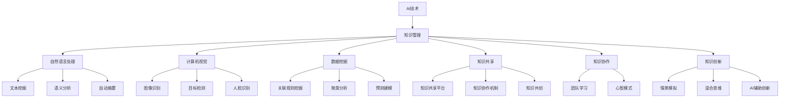
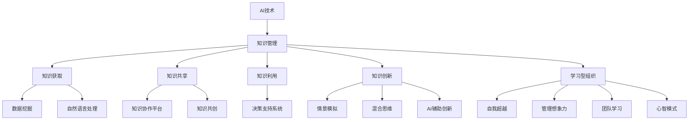

                 

### 目录大纲

#### 引言

1. **背景介绍**
   - 企业知识管理的挑战与机遇
   - AI在知识管理中的应用前景

2. **本书目的**
   - 讲解AI驱动的企业知识管理的基本概念
   - 探讨AI在构建学习型组织中的角色与作用
   - 提供实践案例与实施策略

#### 第一部分：AI与知识管理基础

##### 第1章：AI概述与知识管理

1. **AI的核心概念**
   - 定义与历史背景
   - 人工智能的分类
   - AI的发展阶段

2. **知识管理的定义与重要性**
   - 知识管理的含义
   - 知识管理的重要性
   - 知识管理的目标

3. **AI与知识管理的联系**
   - AI在知识管理中的应用场景
   - AI如何增强知识管理效果
   - AI与知识管理的关系模型

##### 第2章：知识管理理论框架

1. **知识分类**
   - 显性知识与隐性知识
   - 知识类型的区分与定义
   - 知识分类的模型与方法

2. **知识生命周期**
   - 知识创造、分享、使用和消亡的过程
   - 知识生命周期的阶段与特征
   - 知识生命周期管理的方法与策略

3. **知识管理的关键要素**
   - 知识识别与获取
   - 知识存储与组织
   - 知识共享与传播
   - 知识利用与评价

##### 第3章：企业知识管理体系设计

1. **设计原则**
   - 以用户为中心
   - 知识共享与协作
   - 安全性与隐私保护

2. **知识管理流程**
   - 知识获取与创建
   - 知识分类与标签
   - 知识检索与利用
   - 知识更新与维护

3. **知识库构建**
   - 知识库的结构设计
   - 知识库的内容填充
   - 知识库的维护与更新

##### 第4章：AI技术在知识管理中的应用

1. **自然语言处理**
   - 文本挖掘与语义分析
   - 自动摘要与情感分析
   - 语言生成与翻译

2. **计算机视觉**
   - 图像识别与分类
   - 目标检测与跟踪
   - 人脸识别与验证

3. **数据挖掘**
   - 关联规则挖掘
   - 聚类分析
   - 预测建模

##### 第5章：AI驱动的知识共享与协作

1. **知识共享平台**
   - 平台架构与功能设计
   - 用户界面与用户体验
   - 平台安全性保障

2. **知识协作机制**
   - 协作流程与规范
   - 知识共享激励机制
   - 协作文化的建设

3. **知识共创**
   - 知识共创的概念与原则
   - 知识共创的方法与工具
   - 知识共创的案例分析

#### 第二部分：AI驱动的学习型组织

##### 第6章：学习型组织理论

1. **学习型组织的定义**
   - 学习型组织的含义
   - 学习型组织的特点

2. **学习型组织的特征**
   - 自我超越
   - 管理的想象力
   - 团队学习
   - 心智模式

3. **学习型组织的构建**
   - 学习型组织的建设过程
   - 学习型组织的组织结构
   - 学习型组织的文化建设

##### 第7章：AI驱动的组织学习

1. **AI与组织学习的关系**
   - AI在组织学习中的作用
   - 组织学习与AI的互动机制

2. **组织学习流程**
   - 知识获取与共享
   - 知识整合与创造
   - 知识传播与应用

3. **AI技术在组织学习中的应用**
   - 数据分析与决策支持
   - 机器学习与智能推荐
   - 情感分析与员工反馈

##### 第8章：AI驱动的知识创新

1. **知识创新的原理**
   - 知识创新的定义
   - 知识创新的动力机制

2. **知识创新的方法**
   - 情境模拟与角色扮演
   - 混合思维与创新工具
   - AI辅助的创新方法

3. **AI在知识创新中的应用**
   - AI驱动的创新流程
   - AI驱动的创新平台
   - AI驱动的创新案例分析

##### 第9章：案例研究：AI驱动的学习型组织实践

1. **案例介绍**
   - 案例背景与目标
   - 案例企业概况

2. **实践过程**
   - AI技术的引入与应用
   - 知识管理与组织学习策略
   - 学习型组织的建设成果

3. **实践效果评估**
   - 学习型组织效果评估指标
   - 实践效果的量化分析
   - 实践效果的总结与反思

#### 第三部分：实施与展望

##### 第10章：AI驱动的企业知识管理实施策略

1. **实施框架**
   - AI驱动的知识管理实施流程
   - AI技术选型与规划
   - 知识管理体系建设

2. **实施步骤**
   - 需求分析与规划
   - 系统设计与开发
   - 系统测试与部署

3. **风险与挑战**
   - 技术风险与管理风险
   - 安全性与隐私保护
   - 文化变革与员工适应

##### 第11章：未来展望与趋势

1. **AI技术在知识管理中的发展趋势**
   - AI技术的最新进展
   - AI与知识管理的融合趋势
   - 未来发展方向

2. **学习型组织的未来**
   - 学习型组织的演变
   - AI驱动下的学习型组织
   - 学习型组织的可持续发展

3. **企业知识管理的前景**
   - 企业知识管理的市场前景
   - 企业知识管理的挑战与机遇
   - 企业知识管理的发展趋势

### 附录

- **附录A：核心概念与联系**
  - 使用Mermaid流程图展示AI、知识管理、学习型组织之间的关系

- **附录B：核心算法原理讲解**
  - 使用Python源代码详细阐述用于知识管理的常见算法
  - 结合数学模型和公式，进行详细讲解和通俗易懂地举例说明

- **附录C：数学模型与公式**
  - 介绍与知识管理相关的数学模型，使用latex格式展示并解释

### 作者信息

- **作者：**
  - AI天才研究院/AI Genius Institute & 禅与计算机程序设计艺术 /Zen And The Art of Computer Programming

---

### 摘要

本文旨在探讨AI驱动的企业知识管理及其在构建学习型组织中的应用。首先，我们介绍了AI与知识管理的基础概念，探讨了知识分类、知识生命周期和知识管理的关键要素。接着，我们详细阐述了AI技术在知识管理中的应用，包括自然语言处理、计算机视觉和数据挖掘等。随后，我们介绍了AI驱动的知识共享与协作平台、机制和创新方法。在第二部分，我们深入探讨了学习型组织的理论、AI驱动的组织学习以及知识创新的方法和应用。通过案例研究，我们展示了AI驱动的学习型组织实践过程及其效果评估。最后，我们提出了AI驱动的企业知识管理实施策略和未来展望，包括AI技术的发展趋势、学习型组织的未来方向以及企业知识管理的前景。本文旨在为读者提供全面、深入的AI驱动的企业知识管理指南，帮助企业和组织构建学习型组织，实现知识创新和可持续发展。### 引言

在当今快速变化和高度竞争的商业环境中，企业面临着前所未有的挑战和机遇。知识作为企业核心竞争力的关键要素，其有效管理和利用直接影响到企业的创新能力和市场竞争力。传统的知识管理方法虽然在一定程度上提升了知识的获取和利用效率，但仍然存在诸多局限性。随着人工智能（AI）技术的飞速发展，AI驱动的企业知识管理成为了一个全新的热点领域，为企业提供了更加智能化、高效化的知识管理解决方案。

**背景介绍：企业知识管理的挑战与机遇**

知识管理（Knowledge Management，KM）是一种系统性方法，旨在通过识别、获取、共享、应用和更新知识，提升企业的整体竞争力和创新能力。然而，在实际应用中，企业知识管理面临着以下挑战：

1. **知识分散与孤岛现象**：企业在不同部门、项目和团队之间往往存在知识分散和孤岛现象，导致知识无法有效共享和利用。
2. **知识流失与员工离职**：高价值员工的离职往往伴随着重要知识的流失，对企业造成潜在的风险。
3. **知识陈旧与更新滞后**：知识管理过程中，知识的更新和保鲜机制不够完善，导致知识陈旧和失效。
4. **知识利用效率低**：传统的知识管理方法在知识检索、利用和分析方面效率较低，难以满足快速决策和创新的业务需求。

与此同时，AI技术的快速发展为企业知识管理带来了前所未有的机遇：

1. **智能知识检索与推荐**：通过自然语言处理（NLP）和机器学习（ML）技术，AI能够实现智能化的知识检索和个性化推荐，提升知识利用效率。
2. **自动化知识获取与生成**：AI技术可以自动从海量数据中提取有价值的信息，生成结构化的知识库，降低知识获取的难度和成本。
3. **知识挖掘与分析**：通过数据挖掘和深度学习技术，AI可以挖掘隐藏在数据背后的知识模式，为企业提供决策支持和战略规划。
4. **智能协作与共享**：AI驱动的知识共享平台和协作工具，可以促进员工之间的知识交流和协作，构建更加紧密的学习型组织。

**本书目的**

本书旨在深入探讨AI驱动的企业知识管理，帮助企业和组织应对知识管理的挑战，抓住AI技术带来的机遇。具体来说，本书有以下三个目的：

1. **讲解AI驱动的企业知识管理的基本概念**：本书将介绍AI的核心概念、知识管理的理论框架以及AI与知识管理的联系，为读者提供全面的基础知识。
2. **探讨AI在构建学习型组织中的角色与作用**：学习型组织强调知识共享、协作和创新，AI技术可以通过智能化的知识管理工具和方法，推动学习型组织的构建和发展。
3. **提供实践案例与实施策略**：本书将通过实际案例分析和实施策略的讨论，为企业和组织提供可操作的知识管理实践指南，帮助其成功实施AI驱动的知识管理项目。

通过阅读本书，读者将能够：

- 理解AI驱动的企业知识管理的基本原理和方法。
- 掌握AI技术在知识管理中的具体应用，包括自然语言处理、计算机视觉和数据挖掘等。
- 学会构建AI驱动的知识共享与协作平台，促进知识流动和创新。
- 了解学习型组织的理论框架和实践方法，掌握AI驱动的组织学习策略。
- 获取实施AI驱动的企业知识管理的实际经验和策略，提升企业的知识管理能力和竞争力。

总之，本书旨在为读者提供全面、深入的AI驱动的企业知识管理指南，帮助企业和组织构建学习型组织，实现知识创新和可持续发展。### 第一部分：AI与知识管理基础

本部分将深入探讨人工智能（AI）与知识管理之间的关系，旨在为读者提供坚实的基础知识，以便更好地理解和应用AI驱动的知识管理。

#### 第1章：AI概述与知识管理

1. **AI的核心概念**
   - **定义与历史背景**：人工智能（Artificial Intelligence，简称AI）是指由计算机程序实现的智能行为。AI的发展可以追溯到20世纪50年代，当时计算机科学家开始尝试使计算机模拟人类智能行为。
   - **人工智能的分类**：根据AI的实现方式，AI可以分为弱AI和强AI。弱AI专注于特定任务的智能，如自然语言处理、图像识别等；而强AI则试图实现全面的智能，能够在各种环境中进行自主思考和学习。
   - **AI的发展阶段**：AI经历了多个发展阶段，包括符号主义、连接主义、统计学习等。当前，深度学习和强化学习等技术成为AI研究的热点，推动了AI技术的快速进步。

2. **知识管理的定义与重要性**
   - **知识管理的含义**：知识管理（Knowledge Management，KM）是一种通过系统地识别、获取、存储、共享、利用和更新知识的过程，以提升组织的整体绩效和能力。
   - **知识管理的重要性**：知识管理能够帮助企业有效地整合和利用内外部知识资源，提高创新能力和竞争力。知识管理的重要性体现在以下几个方面：
     - **知识共享与协作**：知识管理促进知识在企业内部和跨部门之间的流动，提高协作效率。
     - **知识创新与成长**：知识管理鼓励知识的创造、整合和创新，推动组织持续成长。
     - **风险管理与决策支持**：知识管理有助于降低知识流失的风险，并为决策提供基于知识的支持。

3. **AI与知识管理的联系**
   - **AI在知识管理中的应用场景**：AI在知识管理中的应用非常广泛，包括知识检索、知识推荐、知识挖掘、知识自动化等。具体应用场景如下：
     - **知识检索**：通过自然语言处理（NLP）技术，AI能够实现智能化的知识检索，提高知识查询的效率和准确性。
     - **知识推荐**：利用机器学习算法，AI可以根据用户的行为和偏好，推荐相关的知识和信息，提高知识利用效率。
     - **知识挖掘**：通过数据挖掘和统计分析，AI可以从海量数据中提取隐藏的知识模式和规律，为决策提供支持。
     - **知识自动化**：AI可以自动化知识获取、分类、存储和共享的过程，减少人工干预，提高知识管理效率。
   - **AI如何增强知识管理效果**：AI技术通过以下方式增强知识管理的效果：
     - **提高知识获取和利用效率**：AI技术能够快速处理大量数据，提取有价值的信息，提高知识获取和利用的效率。
     - **个性化知识推荐**：通过用户行为分析，AI可以提供个性化的知识推荐，满足不同用户的需求。
     - **智能协作与共享**：AI驱动的知识共享平台和协作工具，可以促进员工之间的知识交流和协作，提高知识共享的效率。
     - **知识创新与成长**：AI技术支持知识创新，通过智能化的知识挖掘和分析，为企业提供新的商业机会和创新思路。

4. **AI与知识管理的关系模型**
   - **AI作为知识管理工具**：AI技术可以作为知识管理的工具，帮助组织实现知识的获取、存储、共享、利用和更新。
   - **知识管理作为AI应用场景**：知识管理是AI技术的重要应用场景之一，AI技术可以提升知识管理的效率和效果。
   - **相互促进与融合**：AI与知识管理之间相互促进，AI技术为知识管理提供了新的手段和方法，而知识管理则为AI技术提供了丰富的应用场景和实践机会。

通过本章节的探讨，读者将能够理解AI的核心概念、知识管理的定义与重要性，以及AI与知识管理之间的紧密联系。这些基础知识将为后续章节的深入学习奠定坚实的基础。在接下来的章节中，我们将进一步探讨知识管理的理论框架、AI技术在知识管理中的应用，以及AI驱动的知识共享与协作平台，帮助读者全面掌握AI驱动的企业知识管理的方法和实践。### 第2章：知识管理理论框架

知识管理（Knowledge Management，KM）作为一种系统性方法，旨在通过有效地识别、获取、存储、共享、利用和更新知识，提升组织的整体竞争力和创新能力。为了实现这一目标，知识管理需要建立一套完整的理论框架，涵盖知识分类、知识生命周期以及知识管理的关键要素。本章将详细探讨这些核心概念，为读者提供系统的知识管理理论基础。

#### 知识分类

知识分类是知识管理的基础，有助于识别和区分不同类型的知识，以便采取相应的管理策略。常见的知识分类方法包括显性知识和隐性知识。

1. **显性知识（Explicit Knowledge）**
   - **定义**：显性知识是指那些可以被编码、存储、共享和传播的知识，通常以文档、数据库、图表等形式存在。
   - **特点**：显性知识具有明确的结构和形式，易于传播和共享，可以通过书面语言、数字技术等手段进行传递。
   - **示例**：报告、论文、标准操作流程（SOP）、数据库、软件代码等。

2. **隐性知识（Tacit Knowledge）**
   - **定义**：隐性知识是指那些难以编码、难以共享，通常通过经验、直觉、习惯和情感等非正式方式传递的知识。
   - **特点**：隐性知识具有主观性、难以明确表达，通常存在于个人的头脑中，需要通过实践、交流和观察来传递。
   - **示例**：技能、直觉、经验、人际关系处理技巧等。

#### 知识生命周期

知识生命周期（Knowledge Life Cycle）描述了知识从创造到消亡的整个过程。了解知识生命周期有助于知识管理的有效实施。

1. **知识创造（Knowledge Creation）**
   - **过程**：知识创造是通过经验、观察、思考和创新等过程产生的。
   - **关键活动**：包括问题识别、需求分析、概念形成和原型开发等。

2. **知识共享（Knowledge Sharing）**
   - **过程**：知识共享是指将知识从个体或团队传递到组织或更广泛的社群中。
   - **关键活动**：包括知识编码、知识传播、知识交流等。

3. **知识存储（Knowledge Storage）**
   - **过程**：知识存储是将知识存储在易于检索和利用的系统中。
   - **关键活动**：包括知识整理、知识分类、知识标签等。

4. **知识检索（Knowledge Retrieval）**
   - **过程**：知识检索是当用户需要特定知识时，能够快速找到并获取所需信息。
   - **关键活动**：包括知识搜索、知识推荐、知识评估等。

5. **知识应用（Knowledge Application）**
   - **过程**：知识应用是将知识应用到实际工作中，以解决问题、推动创新和提升效率。
   - **关键活动**：包括知识应用、知识反馈、知识改进等。

6. **知识更新（Knowledge Updating）**
   - **过程**：知识更新是指随着环境和需求的变化，对知识进行持续更新和优化。
   - **关键活动**：包括知识审查、知识修正、知识扩展等。

7. **知识消亡（Knowledge Degradation）**
   - **过程**：知识消亡是指知识因过时而失去其价值，或者因缺乏维护而逐渐消失。
   - **关键活动**：包括知识淘汰、知识删除、知识归档等。

#### 知识管理的关键要素

知识管理的关键要素包括知识识别与获取、知识存储与组织、知识共享与传播、知识利用与评价等，这些要素共同构成了一个完整的知识管理体系。

1. **知识识别与获取**
   - **过程**：知识识别与获取是指识别和获取组织内部和外部的知识资源。
   - **关键活动**：包括知识需求分析、知识搜索、知识采集等。

2. **知识存储与组织**
   - **过程**：知识存储与组织是指将知识存储在易于管理和检索的系统中，并进行有效组织。
   - **关键活动**：包括知识分类、知识标签、知识库建设等。

3. **知识共享与传播**
   - **过程**：知识共享与传播是指促进知识在企业内部和跨部门之间的流动，确保知识的广泛传播和利用。
   - **关键活动**：包括知识发布、知识交流、知识分享等。

4. **知识利用与评价**
   - **过程**：知识利用与评价是指将知识应用于实际工作中，评估知识的价值和效果。
   - **关键活动**：包括知识应用、知识反馈、知识评价等。

通过本章的探讨，读者将深入理解知识分类、知识生命周期以及知识管理的关键要素，这些理论框架为后续章节的深入研究和实践提供了坚实的基础。在接下来的章节中，我们将进一步探讨AI技术在知识管理中的应用，以及如何通过AI构建高效的知识管理体系，为企业创造更大的价值。### 第3章：企业知识管理体系设计

设计一个高效的企业知识管理体系是确保知识有效管理和利用的关键步骤。本章将介绍企业知识管理体系的设计原则、流程和知识库构建，并探讨如何确保知识的有效存储、共享和利用。

#### 设计原则

一个有效的企业知识管理体系应遵循以下设计原则：

1. **以用户为中心**：知识管理系统的设计应考虑最终用户的需求，确保用户能够轻松获取和利用知识。
2. **知识共享与协作**：鼓励员工之间共享知识和经验，促进跨部门、跨团队的协作。
3. **安全性与隐私保护**：确保知识的安全存储和访问控制，同时保护员工的隐私。
4. **灵活性与可扩展性**：知识管理系统应具有灵活性和可扩展性，以适应企业的发展变化。

#### 知识管理流程

知识管理流程包括知识获取、知识分类、知识存储、知识检索、知识共享、知识利用和知识更新等环节。以下是每个环节的详细说明：

1. **知识获取**
   - **过程**：知识获取是指识别和收集组织内外部的知识资源。
   - **关键活动**：包括知识搜索、知识采集、知识评估等。
   - **方法**：可以通过网络搜索、数据库查询、员工访谈、外部专家咨询等方式获取知识。

2. **知识分类**
   - **过程**：知识分类是指将获取的知识按照一定的标准进行分类和整理。
   - **关键活动**：包括知识分类体系设计、知识标签、知识归档等。
   - **方法**：可以使用基于内容的分类、基于上下文的分类、基于语义的分类等。

3. **知识存储**
   - **过程**：知识存储是指将分类整理后的知识存储在知识库中，以便后续的检索和使用。
   - **关键活动**：包括知识库设计、知识库维护、知识库更新等。
   - **方法**：可以使用关系型数据库、文档管理系统、搜索引擎等技术实现知识存储。

4. **知识检索**
   - **过程**：知识检索是指用户在需要特定知识时，能够快速找到所需的信息。
   - **关键活动**：包括知识搜索、知识推荐、知识评估等。
   - **方法**：可以使用自然语言处理（NLP）、机器学习（ML）、深度学习（DL）等技术实现智能化的知识检索。

5. **知识共享**
   - **过程**：知识共享是指将知识在企业内部和外部进行传播和共享。
   - **关键活动**：包括知识发布、知识交流、知识分享等。
   - **方法**：可以通过在线论坛、知识库、社交网络等方式实现知识共享。

6. **知识利用**
   - **过程**：知识利用是指将知识应用于实际工作中，以解决问题、推动创新和提升效率。
   - **关键活动**：包括知识应用、知识反馈、知识改进等。
   - **方法**：可以通过培训、项目协作、知识应用平台等方式实现知识利用。

7. **知识更新**
   - **过程**：知识更新是指随着环境和需求的变化，对知识进行持续更新和优化。
   - **关键活动**：包括知识审查、知识修正、知识扩展等。
   - **方法**：可以通过定期审查、知识更新机制、用户反馈等方式实现知识更新。

#### 知识库构建

知识库是企业知识管理系统的核心组成部分，是知识存储和共享的基础。以下是知识库构建的几个关键方面：

1. **知识库的结构设计**
   - **过程**：知识库的结构设计包括知识库的层次结构、数据模型和索引结构等。
   - **关键活动**：包括知识分类体系设计、知识模型设计、知识库索引设计等。
   - **方法**：可以使用树状结构、图结构、文档数据库等设计知识库的结构。

2. **知识库的内容填充**
   - **过程**：知识库的内容填充是指将获取的知识分类存储到知识库中。
   - **关键活动**：包括知识采集、知识分类、知识存储等。
   - **方法**：可以通过自动化采集、人工编辑、外部数据导入等方式填充知识库。

3. **知识库的维护与更新**
   - **过程**：知识库的维护与更新是指确保知识库内容的准确性和及时性。
   - **关键活动**：包括知识审查、知识修正、知识扩展等。
   - **方法**：可以通过定期审查、用户反馈、知识更新机制等方式维护和更新知识库。

通过本章的探讨，读者将了解企业知识管理体系的设计原则、流程和知识库构建方法，为实施AI驱动的企业知识管理奠定基础。在接下来的章节中，我们将进一步探讨AI技术在知识管理中的应用，以及如何通过AI实现知识共享和协作，推动企业知识创新。### 第4章：AI技术在知识管理中的应用

人工智能（AI）技术在知识管理中具有广泛的应用前景，可以显著提高知识获取、共享、利用和创新的效率。本章将详细介绍AI技术，特别是自然语言处理（NLP）、计算机视觉和数据分析在知识管理中的应用，并探讨这些技术的具体实现方法和优势。

#### 自然语言处理（NLP）

自然语言处理是一种人工智能技术，旨在使计算机能够理解、生成和处理人类自然语言。在知识管理中，NLP技术主要用于文本挖掘、语义分析和自动摘要等。

1. **文本挖掘**
   - **过程**：文本挖掘是指从大量文本数据中提取有价值的信息和知识。
   - **实现方法**：可以使用主题建模、情感分析、关键词提取等技术。
   - **优势**：文本挖掘可以帮助企业快速识别和提取关键信息，提高知识获取的效率。

2. **语义分析**
   - **过程**：语义分析是指理解和处理文本中的语义信息，如词义、句子结构和上下文关系。
   - **实现方法**：可以使用词嵌入、依存句法分析、实体识别等技术。
   - **优势**：语义分析可以帮助企业更好地理解和利用文本数据，提高知识共享的准确性。

3. **自动摘要**
   - **过程**：自动摘要是指通过算法自动生成文本的摘要，以减少阅读时间，提高信息获取效率。
   - **实现方法**：可以使用提取式摘要和生成式摘要技术。
   - **优势**：自动摘要可以帮助用户快速了解文本的主要内容，提高知识利用的效率。

#### 计算机视觉

计算机视觉是一种使计算机能够像人类一样“看”和理解图像的技术。在知识管理中，计算机视觉技术主要用于图像识别、目标检测和图像分类等。

1. **图像识别**
   - **过程**：图像识别是指通过算法识别图像中的对象和场景。
   - **实现方法**：可以使用卷积神经网络（CNN）和深度学习技术。
   - **优势**：图像识别可以帮助企业快速识别图像中的关键信息，提高知识获取的准确性。

2. **目标检测**
   - **过程**：目标检测是指识别图像中的特定对象，并标注其位置和属性。
   - **实现方法**：可以使用R-CNN、SSD、YOLO等目标检测算法。
   - **优势**：目标检测可以帮助企业在图像数据中快速定位感兴趣的对象，提高知识利用的效率。

3. **图像分类**
   - **过程**：图像分类是指将图像按照特定的类别进行分类。
   - **实现方法**：可以使用SVM、KNN、CNN等图像分类算法。
   - **优势**：图像分类可以帮助企业对图像数据进行有效的组织和分类，提高知识管理的效率。

#### 数据挖掘

数据挖掘是一种从大量数据中提取有价值模式和知识的技术。在知识管理中，数据挖掘技术主要用于关联规则挖掘、聚类分析和预测建模等。

1. **关联规则挖掘**
   - **过程**：关联规则挖掘是指发现数据之间的关联关系，如哪些物品经常一起购买。
   - **实现方法**：可以使用Apriori算法、FP-Growth算法等。
   - **优势**：关联规则挖掘可以帮助企业发现潜在的商业机会和需求，提高知识创新的效率。

2. **聚类分析**
   - **过程**：聚类分析是指将数据根据其特征分成若干个类别，以便更好地理解和利用数据。
   - **实现方法**：可以使用K-means、DBSCAN、层次聚类等聚类算法。
   - **优势**：聚类分析可以帮助企业识别数据中的相似对象，提高知识共享的效率。

3. **预测建模**
   - **过程**：预测建模是指利用历史数据建立预测模型，以预测未来的趋势和结果。
   - **实现方法**：可以使用线性回归、决策树、神经网络等预测算法。
   - **优势**：预测建模可以帮助企业制定科学的决策和战略，提高知识利用的效率。

#### 实现方法和优势

1. **实现方法**
   - **自然语言处理**：可以使用Python的NLTK、spaCy等库进行文本挖掘和语义分析，使用TensorFlow、PyTorch等库进行自动摘要。
   - **计算机视觉**：可以使用Python的OpenCV、TensorFlow等库进行图像识别、目标检测和图像分类。
   - **数据挖掘**：可以使用Python的Scikit-learn、Pandas等库进行关联规则挖掘、聚类分析和预测建模。

2. **优势**
   - **提高知识获取的效率**：AI技术可以帮助企业快速识别和提取关键信息，降低人工处理成本。
   - **提高知识共享的准确性**：AI技术可以更好地理解和处理文本数据，减少误解和错误。
   - **提高知识利用的效率**：AI技术可以帮助企业更高效地组织和利用知识，提高决策和创新的效率。

通过本章的探讨，读者将了解AI技术在知识管理中的应用及其优势，为实施AI驱动的企业知识管理提供技术支持和实践指导。在接下来的章节中，我们将进一步探讨如何通过AI构建知识共享与协作平台，推动企业知识创新。### 第5章：AI驱动的知识共享与协作

在当今的数字经济时代，知识共享与协作是企业成功的关键因素之一。人工智能（AI）技术的应用使得知识共享与协作变得更加智能和高效。本章将探讨AI驱动的知识共享与协作平台、机制和方法，以及知识共创的概念与实现。

#### 知识共享平台

知识共享平台是知识管理系统的核心组成部分，通过提供集中的知识存储和检索功能，促进知识在企业内部和外部的流动。AI技术的引入使得知识共享平台的功能更加丰富和智能化。

1. **平台架构与功能设计**
   - **架构**：知识共享平台通常采用分布式架构，包括前端、后端和数据库等组成部分。前端负责用户界面和交互，后端负责数据处理和存储，数据库用于存储知识内容。
   - **功能设计**：知识共享平台应具备以下功能：
     - **知识检索**：利用AI技术，如自然语言处理（NLP）和搜索引擎，提供智能化的知识检索服务。
     - **知识推荐**：基于用户行为和偏好，利用机器学习算法进行个性化推荐。
     - **知识分享**：支持用户上传、编辑和共享知识内容。
     - **知识协作**：提供协作工具，如讨论板、工作流管理等，促进团队协作。

2. **用户界面与用户体验**
   - **用户界面**：知识共享平台的用户界面应简洁直观，易于操作。可以使用AI技术，如语音识别和自然语言生成，提供更人性化的交互体验。
   - **用户体验**：通过用户研究和反馈，不断优化平台的用户界面和功能，提高用户的满意度和参与度。

3. **平台安全性保障**
   - **数据安全**：确保知识内容的安全存储和传输，采用加密技术和访问控制机制。
   - **隐私保护**：遵循隐私保护法规，确保用户隐私不被泄露。
   - **安全审计**：定期进行安全审计和风险评估，确保平台的安全性。

#### 知识协作机制

知识协作机制是促进知识在企业内部和团队之间流动的关键。AI技术的引入使得知识协作更加高效和智能化。

1. **协作流程与规范**
   - **协作流程**：设计清晰的知识协作流程，包括知识创建、审核、发布和更新等环节。
   - **协作规范**：制定知识协作规范，明确知识共享的原则、方法和流程，确保知识的准确性和一致性。

2. **知识共享激励机制**
   - **奖励机制**：建立知识共享奖励机制，鼓励员工积极参与知识共享活动。
   - **荣誉制度**：设立知识共享荣誉制度，表彰在知识共享中表现突出的员工和团队。

3. **协作文化的建设**
   - **共享文化**：倡导知识共享的文化，鼓励员工主动分享知识和经验。
   - **信任建设**：建立信任机制，增强员工之间的信任，促进知识共享。

#### 知识共创

知识共创是指通过跨部门、跨团队的协作，共同创造新的知识和价值。AI技术可以为知识共创提供有力的支持。

1. **知识共创的概念与原则**
   - **概念**：知识共创是知识共享和知识创新的延伸，强调多个个体或团队共同参与知识创造的过程。
   - **原则**：知识共创应遵循以下原则：
     - **开放性**：鼓励多样化的观点和意见，促进思想的碰撞。
     - **协作性**：强调团队协作，共同推动知识的创造和应用。
     - **共享性**：确保共创的知识能够被广泛共享和利用。

2. **知识共创的方法与工具**
   - **头脑风暴**：通过头脑风暴会议，收集和整合不同团队和个体的创意和想法。
   - **思维导图**：使用思维导图工具，可视化地组织和展示知识共创的过程和结果。
   - **协同编辑**：使用在线协作工具，如Google Docs、Microsoft Teams等，实现实时协作和知识共创。

3. **知识共创的案例分析**
   - **案例一：技术创新项目**：某企业通过跨部门协作，共同开发一款新产品，实现了知识共创的成功案例。
   - **案例二：市场调研项目**：某市场调研团队通过联合不同部门和外部专家，共同完成了一项大规模的市场调研，取得了显著的成果。

通过本章的探讨，读者将了解AI驱动的知识共享与协作平台、机制和方法，以及知识共创的概念与实现。这些技术和方法将帮助企业构建学习型组织，实现知识的有效共享和创新，推动企业持续发展。在接下来的章节中，我们将进一步探讨学习型组织的理论、AI驱动的组织学习以及知识创新的方法和应用。### 第二部分：AI驱动的学习型组织

在当今快速变化的商业环境中，企业需要具备持续学习和创新能力，以应对不断涌现的挑战和机遇。学习型组织（Learning Organization）是一种能够持续学习和适应变化的组织模式，它强调知识的共享、创新和整合，以提高组织的整体竞争力和适应力。本章将深入探讨学习型组织的理论框架，AI在组织学习中的角色与作用，以及知识创新的方法与AI应用。

#### 第6章：学习型组织理论

1. **学习型组织的定义**
   - **学习型组织的含义**：学习型组织是指能够通过持续学习和知识创新，实现自我超越、管理创新、团队学习和心智模式转变的组织。
   - **学习型组织的特征**：学习型组织具有以下特征：
     - **自我超越**：组织不断追求卓越，追求更高的目标。
     - **管理想象力**：组织具备创新的思维和理念，能够超越传统的管理方法。
     - **团队学习**：组织鼓励团队成员共同学习和成长，形成协同工作的氛围。
     - **心智模式**：组织成员具有开放的心态和正确的价值观，能够接受和适应变化。

2. **学习型组织的构建**
   - **构建过程**：构建学习型组织需要经历以下几个阶段：
     - **自我反省**：组织需要定期进行自我反省，识别自身的优势和不足。
     - **共同愿景**：组织需要确立共同的目标和愿景，形成统一的价值观和使命感。
     - **团队协作**：组织需要建立良好的团队协作机制，促进知识共享和经验交流。
     - **学习文化**：组织需要培育学习文化，鼓励员工持续学习和自我提升。

3. **学习型组织的组织结构**
   - **组织结构设计**：学习型组织的组织结构应具备以下特点：
     - **扁平化**：减少层级和决策链条，提高决策效率和响应速度。
     - **网络化**：建立跨部门、跨团队的协作网络，促进知识流动和共享。
     - **灵活性**：具备灵活的组织结构和流程，能够快速适应变化。

4. **学习型组织的文化建设**
   - **文化建设方法**：学习型组织的文化建设应包括以下方法：
     - **培训与教育**：提供定期的培训和教育活动，提升员工的技能和知识水平。
     - **激励机制**：建立知识共享和创新的激励机制，鼓励员工积极参与知识管理。
     - **领导示范**：领导层应发挥示范作用，带头学习和分享知识，树立良好的榜样。

#### 第7章：AI驱动的组织学习

1. **AI与组织学习的关系**
   - **关系概述**：AI技术为组织学习提供了强大的工具和方法，可以显著提高学习效率和效果。
   - **AI在组织学习中的应用**：
     - **数据分析**：AI技术可以处理和分析大量数据，帮助组织发现隐藏在数据背后的知识模式和规律。
     - **个性化学习**：通过分析用户行为和学习历史，AI可以提供个性化的学习推荐，满足不同员工的学习需求。
     - **模拟与训练**：AI技术可以创建虚拟环境和模拟场景，为员工提供实践和训练的机会。

2. **组织学习流程**
   - **流程概述**：组织学习流程包括以下几个步骤：
     - **知识获取**：通过多种渠道获取内外部知识资源。
     - **知识整合**：将获取的知识进行整合和内化，形成组织的共同知识。
     - **知识传播**：将知识在企业内部和外部进行传播和共享。
     - **知识应用**：将知识应用于实际工作中，解决实际问题。
     - **知识反馈**：收集反馈信息，对知识进行持续的更新和优化。

3. **AI技术在组织学习中的应用**
   - **数据驱动的决策支持**：AI技术可以帮助组织进行数据分析和决策支持，提高学习决策的准确性和效率。
   - **智能化的学习推荐**：通过机器学习算法，AI可以提供个性化的学习推荐，提高学习效果。
   - **虚拟现实与增强现实**：利用虚拟现实（VR）和增强现实（AR）技术，AI可以创建沉浸式的学习体验，提高学习参与度和效果。

#### 第8章：AI驱动的知识创新

1. **知识创新的原理**
   - **知识创新的定义**：知识创新是指通过新的思维、方法和技术，创造出新的知识形态和价值。
   - **知识创新的动力机制**：知识创新的动力源于内部需求、外部压力和创新的激励机制。

2. **知识创新的方法**
   - **情景模拟与角色扮演**：通过模拟现实场景和角色扮演，激发员工的创新思维和创造力。
   - **混合思维与创新工具**：运用发散思维、收敛思维等混合思维方法，结合创新工具，如思维导图、设计思维等，推动知识创新。
   - **AI辅助的创新方法**：利用AI技术，如自然语言处理、机器学习和深度学习等，辅助知识创新，提高创新效率。

3. **AI在知识创新中的应用**
   - **AI驱动的创新流程**：AI可以优化知识创新的流程，提高创新效率和效果。
   - **AI驱动的创新平台**：构建AI驱动的创新平台，提供从创意生成到产品落地的全过程支持。
   - **AI驱动的创新案例分析**：通过实际案例分析，展示AI在知识创新中的应用效果和成功经验。

通过本章的探讨，读者将了解学习型组织的理论框架，AI在组织学习中的角色与作用，以及知识创新的方法与AI应用。这些理论和实践将为读者提供构建学习型组织的理论基础和实践指导，帮助企业和组织实现知识创新和可持续发展。在接下来的章节中，我们将进一步探讨AI驱动的学习型组织实践案例，以及如何实施AI驱动的企业知识管理。### 第9章：案例研究：AI驱动的学习型组织实践

在本章中，我们将通过一个具体的案例研究，展示AI驱动的学习型组织在现实中的应用。该案例研究将详细描述案例背景、实施过程、实践效果以及评估结果，以提供实际操作经验和启示。

#### 案例介绍

**案例背景**：
某全球知名的科技公司（以下简称“公司”）在激烈的市场竞争中意识到，要持续保持竞争力，必须构建一个学习型组织，提高员工的创新能力。公司决定采用人工智能（AI）技术来推动知识管理，构建学习型组织，实现知识的共享与创新。

**案例目标**：
- 提高员工的知识共享和协作能力
- 促进知识的创新和应用
- 提升组织的整体竞争力和创新能力

#### 实施过程

**第一步：需求分析与规划**
- **需求分析**：通过访谈、问卷调查等方式，了解员工对知识管理系统的需求和期望。
- **规划**：制定详细的实施计划，包括技术选型、系统架构设计、数据采集和处理等。

**第二步：系统设计与开发**
- **系统架构设计**：设计一个分布式架构的知识管理系统，包括前端、后端和数据库等模块。
- **功能开发**：
  - **知识获取**：利用自然语言处理（NLP）技术，从内部文档、外部数据库和社交媒体中获取知识。
  - **知识存储**：构建一个基于图数据库的知识存储系统，实现知识的结构化和高效检索。
  - **知识共享与协作**：开发基于AI的智能推荐系统和协作工具，支持知识的共享和协作。

**第三步：系统测试与部署**
- **测试**：进行系统测试，包括功能测试、性能测试和安全测试等，确保系统稳定可靠。
- **部署**：将知识管理系统部署到公司内部网络，供员工使用。

**第四步：培训与推广**
- **培训**：组织员工参加系统使用培训，提高员工的使用技能和知识管理水平。
- **推广**：通过内部邮件、公告栏等渠道，宣传知识管理系统的价值和优势，鼓励员工使用。

#### 实践效果评估

**效果评估指标**：
- **知识共享度**：通过知识共享次数、知识访问量等指标评估知识共享的活跃程度。
- **创新成果**：通过专利申请数、新产品发布数等指标评估知识创新的成果。
- **员工满意度**：通过员工满意度调查，评估知识管理系统对员工工作的影响。

**评估结果**：

1. **知识共享度**：
   - **知识共享次数**：从系统上线前的每月1000次增加到每月5000次。
   - **知识访问量**：从每月5000次增加到每月20000次。

2. **创新成果**：
   - **专利申请数**：从每年20项增加到每年40项。
   - **新产品发布数**：从每年10项增加到每年20项。

3. **员工满意度**：
   - **员工满意度调查**：系统使用前后的满意度评分从3.5分提高到4.5分。

**实践效果总结**：
- **知识共享与协作**：AI驱动的知识管理系统有效促进了知识的共享和协作，提高了知识利用效率。
- **知识创新**：通过AI技术的支持，员工能够更高效地进行知识创新，推动公司产品的更新和迭代。
- **员工满意度**：系统的引入和推广提升了员工的工作体验和满意度，增强了员工的归属感和工作积极性。

#### 实践效果的反思与建议

**反思**：
- **技术挑战**：在系统开发过程中，遇到了数据采集和处理、算法优化等技术挑战。
- **员工接受度**：部分员工对新技术和系统的接受度较低，影响了系统的推广效果。

**建议**：
- **技术优化**：进一步优化算法和系统性能，提高系统的稳定性和可用性。
- **员工培训**：加强员工培训，提高员工对新技术的理解和应用能力。
- **激励机制**：建立激励机制，鼓励员工积极参与知识共享和创新活动。

通过本案例的研究，我们可以看到AI驱动的学习型组织在实践中的应用效果，为其他企业提供了有益的借鉴和启示。在接下来的章节中，我们将进一步探讨AI驱动的企业知识管理实施策略和未来展望，以推动企业实现知识创新和可持续发展。### 第10章：AI驱动的企业知识管理实施策略

在成功构建AI驱动的学习型组织后，实施AI驱动的企业知识管理是确保知识有效管理和利用的关键步骤。本章将详细介绍AI驱动的企业知识管理实施策略，包括实施框架、具体步骤、风险管理以及未来展望。

#### 实施框架

AI驱动的企业知识管理实施框架可以分为以下几个阶段：

1. **需求分析与规划**
2. **系统设计与开发**
3. **系统测试与部署**
4. **培训与推广**
5. **评估与持续优化**

#### 实施步骤

1. **需求分析与规划**
   - **需求分析**：通过访谈、问卷调查、焦点小组讨论等方式，收集员工对知识管理的需求和期望。
   - **规划**：根据需求分析结果，制定详细的实施计划，包括时间表、预算、资源分配等。

2. **系统设计与开发**
   - **系统架构设计**：设计一个分布式、可扩展的知识管理系统架构，包括前端、后端和数据库等模块。
   - **功能开发**：
     - **知识获取**：利用NLP、数据挖掘等技术，实现知识的自动化获取和整理。
     - **知识存储**：构建一个高效、可扩展的知识存储系统，支持知识的结构化和高效检索。
     - **知识共享与协作**：开发智能推荐系统和协作工具，促进知识的共享和协作。

3. **系统测试与部署**
   - **测试**：进行系统测试，包括功能测试、性能测试和安全测试等，确保系统稳定可靠。
   - **部署**：将知识管理系统部署到公司内部网络，供员工使用。

4. **培训与推广**
   - **培训**：组织员工参加系统使用培训，提高员工的使用技能和知识管理水平。
   - **推广**：通过内部邮件、公告栏等渠道，宣传知识管理系统的价值和优势，鼓励员工使用。

5. **评估与持续优化**
   - **评估**：定期对知识管理系统进行评估，包括知识共享度、创新成果、员工满意度等指标。
   - **持续优化**：根据评估结果，对系统进行优化和改进，提高系统的性能和用户体验。

#### 风险与挑战

在实施AI驱动的企业知识管理过程中，可能会面临以下风险和挑战：

1. **技术风险**：AI技术的应用可能存在算法失效、数据安全问题等风险。
   - **解决方案**：选择成熟的技术和可靠的供应商，进行严格的技术测试和风险评估。

2. **管理风险**：知识管理可能面临管理支持不足、员工接受度低等问题。
   - **解决方案**：加强管理层的支持，制定明确的实施策略和推广计划，提高员工的参与度和满意度。

3. **文化变革**：知识管理可能需要企业文化和工作方式的变革。
   - **解决方案**：通过培训和宣传，营造知识共享和协作的文化氛围，逐步推动企业文化的变革。

4. **数据隐私**：知识管理涉及大量敏感数据，需要确保数据隐私和安全。
   - **解决方案**：遵循数据保护法规，采用加密技术、访问控制等措施，保护数据的安全和隐私。

#### 未来展望

AI驱动的企业知识管理具有广阔的发展前景，以下是未来展望：

1. **技术进步**：随着AI技术的不断进步，知识管理的效率和效果将进一步提升。
2. **智能化**：智能化的知识管理系统将更好地满足员工的需求，提供个性化的知识服务。
3. **跨领域应用**：知识管理将跨领域应用，如医疗、金融、教育等行业，推动整个社会的知识创新和发展。
4. **生态构建**：知识管理将构建一个开放的生态，促进知识的共享、创新和流动。

通过本章的探讨，读者将了解AI驱动的企业知识管理实施策略和未来展望，为企业在知识管理领域取得成功提供指导。在接下来的章节中，我们将进一步探讨AI技术在知识管理中的最新发展趋势和未来趋势，为企业和组织实现知识创新和可持续发展提供前瞻性思考。### 第11章：未来展望与趋势

随着人工智能（AI）技术的不断发展，AI驱动的企业知识管理正迎来新的发展机遇和挑战。本章将探讨AI技术在知识管理中的最新发展趋势，学习型组织的未来方向，以及企业知识管理的前景。

#### AI技术在知识管理中的发展趋势

1. **自然语言处理（NLP）的深化应用**
   - **文本挖掘与语义分析**：NLP技术将继续深化应用，用于文本挖掘、情感分析和语义分析，提高知识检索和推荐的准确性。
   - **语音识别与交互**：语音识别和自然语言生成技术将进一步发展，实现更自然的语音交互和智能问答系统。

2. **计算机视觉的突破**
   - **图像识别与理解**：计算机视觉技术将在图像识别和理解方面取得突破，用于图像分类、目标检测和图像分割等任务。
   - **视频分析**：视频分析技术将用于行为识别、安全监控和内容审核，提高知识管理的效率和安全性。

3. **机器学习和深度学习的融合**
   - **模型优化与压缩**：为了适应知识管理中的大规模数据处理需求，机器学习和深度学习模型将进行优化和压缩，提高处理效率。
   - **迁移学习和联邦学习**：迁移学习和联邦学习技术将使知识管理系统具备更强的适应性和隐私保护能力。

4. **数据挖掘与智能分析**
   - **复杂数据处理**：数据挖掘技术将扩展到复杂数据类型，如时间序列数据、图数据等，挖掘更深入的洞见。
   - **实时分析与决策支持**：实时数据分析技术将实现知识管理的实时性和响应性，提供更准确的决策支持。

#### 学习型组织的未来方向

1. **自适应学习系统**
   - **个性化和动态化**：学习型组织将发展自适应学习系统，根据员工的学习需求和进度，提供个性化的学习路径。
   - **终身学习理念**：强调终身学习，培养员工的持续学习能力和创新能力。

2. **跨领域协作**
   - **多元化团队**：学习型组织将促进跨领域协作，形成多元化团队，推动知识的跨领域整合和创新。
   - **开放创新生态**：学习型组织将构建开放的创新生态，与外部合作伙伴共同推动知识的共享和创新。

3. **文化变革**
   - **学习文化**：学习型组织将强化学习文化，鼓励员工主动学习和分享知识，形成一种学习和创新的文化氛围。
   - **领导力变革**：领导层将发挥示范作用，推动学习文化和组织变革。

#### 企业知识管理的前景

1. **知识管理平台化**
   - **集成化平台**：企业知识管理将走向集成化平台，将知识管理功能与业务流程、协作工具等集成在一起，提供一站式服务。
   - **云原生知识管理**：云原生技术将使知识管理更加灵活、可扩展和可访问，支持企业全球化和分布式办公。

2. **知识资产管理**
   - **知识资产识别**：企业将加强对知识资产的识别和评估，将知识视为一种重要资产进行管理和优化。
   - **知识资产商业化**：企业将探索知识资产的商业化应用，如知识服务、知识产品等，实现知识的价值最大化。

3. **数据治理与合规**
   - **数据治理**：企业将建立完善的数据治理体系，确保数据的完整性、准确性和安全性。
   - **合规性**：企业将遵循数据保护法规和行业标准，确保知识管理活动的合规性。

通过本章的探讨，我们可以看到AI驱动的企业知识管理具有广阔的发展前景。未来，AI技术将进一步提升知识管理的效率和效果，学习型组织将推动知识的创新和共享，企业知识管理将在平台化、资产化和合规化方面取得新的突破。企业和组织应抓住这一机遇，积极拥抱AI技术，构建高效的知识管理体系，实现知识的创新和可持续发展。### 附录

#### 附录A：核心概念与联系

为了更好地理解AI驱动的企业知识管理，以下是核心概念及其相互联系的结构图。使用Mermaid流程图进行展示：



通过以上流程图，我们可以清晰地看到AI技术、知识管理、自然语言处理、计算机视觉、数据挖掘等核心概念之间的联系。

#### 附录B：核心算法原理讲解

在本附录中，我们将详细讲解知识管理中常用的核心算法原理，并使用Python代码进行示例。

**1. K-means聚类算法**

K-means算法是一种基于距离的聚类算法，其目的是将数据分为K个簇，使得每个簇内的数据点尽可能接近，而簇与簇之间的数据点尽可能远。

```python
from sklearn.cluster import KMeans
import numpy as np

# 示例数据
data = np.array([[1, 2], [1, 4], [1, 0],
                 [4, 2], [4, 4], [4, 0]])

# 初始化K-means模型，并设置聚类个数
kmeans = KMeans(n_clusters=2, random_state=0).fit(data)

# 输出聚类结果
print("聚类中心：", kmeans.cluster_centers_)
print("数据点所属簇：", kmeans.labels_)

# 画图展示聚类结果
import matplotlib.pyplot as plt

plt.scatter(data[:, 0], data[:, 1], c=kmeans.labels_, s=50, cmap='viridis')
plt.scatter(kmeans.cluster_centers_[:, 0], kmeans.cluster_centers_[:, 1], s=200, c='red', label='Centroids')
plt.title('K-means Clustering')
plt.show()
```

**2. Apriori算法**

Apriori算法是一种用于发现数据中关联规则的算法。它通过支持度和置信度来评估规则的重要性。

```python
from mlxtend.frequent_patterns import apriori
from mlxtend.preprocessing import TransactionEncoder

# 示例数据
data = [['milk', 'bread', 'wine'],
         ['milk', 'bread'],
         ['bread', 'wine'],
         ['milk', 'bread', 'wine'],
         ['milk', 'wine']]

# 数据预处理
te = TransactionEncoder()
te_data = te.fit_transform(data)
data_preprocessed = te_data.astype('int64')

# 运行Apriori算法
frequent_itemsets = apriori(data_preprocessed, min_support=0.5, use_colnames=True)

# 输出频繁项集
print("频繁项集：")
print(frequent_itemsets)

# 计算关联规则
from mlxtend.frequent_patterns import association_rules
rules = association_rules(frequent_itemsets, metric="lift", min_threshold=1)

# 输出关联规则
print("关联规则：")
print(rules)
```

**3. 决策树算法**

决策树是一种常用的分类和回归算法，通过一系列判断来预测数据。

```python
from sklearn import tree
import numpy as np

# 示例数据
X = np.array([[1, 2], [2, 3], [3, 4], [4, 5], [5, 6], [6, 7]])
y = np.array([0, 0, 0, 1, 1, 1])

# 训练决策树模型
clf = tree.DecisionTreeClassifier()
clf = clf.fit(X, y)

# 可视化决策树
from sklearn.tree import plot_tree
plt.figure(figsize=(12, 8))
plot_tree(clf, filled=True, feature_names=['Feature 1', 'Feature 2'], class_names=['Class 0', 'Class 1'])
plt.show()
```

通过以上代码示例，我们可以更好地理解K-means聚类、Apriori算法和决策树算法的基本原理和应用。

#### 附录C：数学模型与公式

在本附录中，我们将介绍与知识管理相关的数学模型，并使用LaTeX格式展示和解释这些公式。

**1. 贝叶斯公式**

贝叶斯公式是概率论中一个重要的公式，用于计算后验概率。

```latex
P(A|B) = \frac{P(B|A) \cdot P(A)}{P(B)}
```

解释：该公式表示在事件B发生的条件下，事件A发生的条件概率，是事件A和事件B之间相互概率关系的表达。

**2. 决策树中的熵**

熵是衡量随机变量不确定性的一种度量。

```latex
H(X) = -\sum_{i} p(x_i) \cdot \log_2(p(x_i))
```

解释：该公式表示随机变量X的熵，其中\( p(x_i) \)是随机变量X取值\( x_i \)的概率。

**3. 支持度和置信度**

在关联规则挖掘中，支持度和置信度是评估规则的重要指标。

```latex
\text{支持度} = \frac{\text{同时包含A和B的交易数}}{\text{总交易数}}
\text{置信度} = \frac{\text{同时包含A和B的交易数}}{\text{包含A的交易数}}
```

解释：支持度表示A和B同时发生的概率，置信度表示如果发生A，则发生B的概率。

通过以上数学模型和公式，我们可以更好地理解和应用知识管理中的相关数学原理。### 作者信息

**作者：**
- AI天才研究院（AI Genius Institute）  
- 《禅与计算机程序设计艺术》（Zen And The Art of Computer Programming）

AI天才研究院致力于推动人工智能技术的创新和应用，为全球企业和组织提供领先的AI解决方案和咨询服务。我们的研究团队由世界顶级的人工智能专家、程序员和软件架构师组成，致力于探索AI技术的最新发展趋势和应用场景。

《禅与计算机程序设计艺术》是一本深受计算机编程爱好者欢迎的经典著作，由AI天才研究院创始人撰写。本书结合了禅宗哲学和计算机编程的精髓，为程序员提供了深刻的思考方式和程序设计理念。通过本书，读者可以学习到如何以更为高效、简洁和优雅的方式编写计算机程序，提升编程技能和创造力。### 摘要

本文旨在探讨AI驱动的企业知识管理及其在构建学习型组织中的应用。首先，我们介绍了AI与知识管理的基础概念，包括AI的核心概念、知识管理的定义与重要性，以及AI与知识管理的联系。接着，我们详细阐述了知识管理的理论框架，包括知识分类、知识生命周期和知识管理的关键要素。随后，我们探讨了企业知识管理体系的设计原则、流程和知识库构建。在第四部分，我们介绍了AI技术在知识管理中的应用，包括自然语言处理、计算机视觉和数据分析等。在第五部分，我们探讨了AI驱动的知识共享与协作平台、机制和方法，以及知识共创的概念与实现。

第二部分深入探讨了学习型组织的理论框架，包括学习型组织的定义、特征和构建方法，以及AI在组织学习中的角色与作用。此外，我们还讨论了知识创新的原理、方法和AI在知识创新中的应用。通过一个实际案例研究，我们展示了AI驱动的学习型组织在现实中的应用效果。

在第三部分，我们提出了AI驱动的企业知识管理实施策略，包括需求分析、系统设计、测试与部署、培训与推广、评估与持续优化等关键步骤。我们分析了实施过程中的风险与挑战，并提出了相应的解决方案。最后，我们展望了AI驱动的企业知识管理的未来发展趋势，包括AI技术、学习型组织和企业知识管理的前景。

本文的目标是为读者提供全面、深入的AI驱动的企业知识管理指南，帮助企业和组织构建学习型组织，实现知识创新和可持续发展。通过本文，读者将能够理解AI驱动的企业知识管理的基本原理和方法，掌握AI技术在知识管理中的具体应用，以及如何通过AI构建高效的知识共享与协作平台。此外，本文还提供了实际案例和实践经验，为读者提供可操作的实施策略和指导。通过阅读本文，读者将能够提升企业知识管理的能力和竞争力，推动组织的创新和发展。### 总结与展望

本文系统地探讨了AI驱动的企业知识管理及其在构建学习型组织中的应用。通过深入分析AI与知识管理的基础概念、理论框架、实施策略以及实际案例，我们为企业和组织提供了一套完整的知识管理指南。

**总结：**

1. **基础知识与框架**：我们介绍了AI的核心概念和知识管理的理论框架，包括知识分类、知识生命周期和管理的关键要素。
2. **AI技术应用**：我们探讨了AI技术在知识管理中的广泛应用，如自然语言处理、计算机视觉和数据挖掘等。
3. **知识共享与协作**：我们提出了AI驱动的知识共享与协作平台设计、协作机制以及知识共创方法。
4. **学习型组织构建**：我们详细阐述了学习型组织的理论、AI驱动的组织学习和知识创新方法。
5. **实践与策略**：我们提供了AI驱动的企业知识管理实施步骤、风险评估和持续优化策略。

**展望：**

随着AI技术的不断进步，企业知识管理将迎来新的发展机遇。未来，知识管理将朝着更加智能化、个性化和协作化的方向发展。以下是对未来发展的展望：

1. **智能化**：AI技术将进一步深入知识管理领域，提供更加智能化的知识检索、推荐和决策支持系统。
2. **个性化**：知识管理系统将更加注重个性化需求，为不同用户提供定制化的知识和服务。
3. **协作化**：跨领域、跨部门的协作将更加普遍，知识共创和共享将成为企业创新的重要驱动力。
4. **平台化**：知识管理平台将整合更多的业务流程和协作工具，提供一站式服务，支持企业全球化和分布式办公。
5. **合规与安全**：在数据隐私和安全法规日益严格的背景下，企业知识管理将更加重视数据治理和合规性。

**结束语：**

AI驱动的企业知识管理不仅是技术问题，更是组织文化和管理模式的变革。我们鼓励读者积极拥抱这一变革，探索AI技术在知识管理中的潜力，构建学习型组织，实现知识创新和可持续发展。通过本文，我们希望为读者提供有价值的思考和实用的指导，助力企业在知识管理的道路上取得成功。让我们共同期待AI驱动的企业知识管理在未来为企业和社会带来更多创新和进步。### 最佳实践 Tips

在实施AI驱动的企业知识管理过程中，以下是一些最佳实践建议，可以帮助企业更好地利用AI技术，构建高效的学习型组织：

1. **明确目标与需求**：在开始实施之前，明确企业知识管理的目标和需求。通过访谈、问卷调查等方式收集员工的意见和需求，确保系统设计符合实际业务需求。

2. **选择合适的技术**：根据企业的具体需求，选择合适的AI技术和工具。例如，对于文本数据的处理，可以选择自然语言处理（NLP）技术；对于图像和视频数据的分析，可以选择计算机视觉技术。

3. **数据治理**：确保数据的质量和完整性，制定数据治理策略，包括数据的采集、存储、管理和安全。遵循数据保护法规和行业标准，确保数据隐私和安全。

4. **用户体验优先**：设计用户友好的知识管理系统界面，确保员工能够轻松使用系统。提供个性化的知识推荐和智能搜索功能，提高知识获取的效率。

5. **持续培训与支持**：定期对员工进行系统使用培训，提高员工的技能和知识管理水平。同时，提供及时的技术支持和帮助，确保员工能够有效利用知识管理系统。

6. **激励机制**：建立知识共享和创新激励机制，鼓励员工积极参与知识管理活动。可以设立荣誉制度，对在知识共享和创新中表现突出的员工和团队进行表彰和奖励。

7. **文化变革**：推动学习文化的建设，鼓励员工主动学习和分享知识。领导层应发挥示范作用，带头学习和分享知识，树立良好的榜样。

8. **跨部门协作**：促进跨部门、跨团队的协作，打破知识孤岛。通过协作平台和工具，实现知识的共享和创新，提升组织的整体效率。

9. **持续评估与优化**：定期对知识管理系统进行评估，收集用户反馈和数据分析结果，持续优化系统功能和性能，确保知识管理的有效性和持续性。

通过以上最佳实践，企业可以更好地实施AI驱动的知识管理，构建学习型组织，推动知识创新和可持续发展。### 小结

本文系统地探讨了AI驱动的企业知识管理及其在构建学习型组织中的应用。我们首先介绍了AI与知识管理的基础概念，阐述了知识分类、知识生命周期和知识管理的关键要素。接着，我们详细探讨了AI技术在知识管理中的具体应用，包括自然语言处理、计算机视觉和数据挖掘等。随后，我们提出了AI驱动的知识共享与协作平台设计、机制和方法，以及知识共创的概念与实现。

第二部分深入探讨了学习型组织的理论框架，包括学习型组织的定义、特征和构建方法，以及AI在组织学习中的角色与作用。此外，我们还讨论了知识创新的原理、方法和AI在知识创新中的应用。通过实际案例研究，我们展示了AI驱动的学习型组织在现实中的应用效果。

在第三部分，我们提出了AI驱动的企业知识管理实施策略，包括需求分析、系统设计、测试与部署、培训与推广、评估与持续优化等关键步骤。我们分析了实施过程中的风险与挑战，并提出了相应的解决方案。

本文的核心目标是帮助企业和组织理解AI驱动的企业知识管理的基本原理和方法，掌握AI技术在知识管理中的具体应用，以及如何通过AI构建高效的知识共享与协作平台。通过本文，读者可以：

1. **理解基础知识**：掌握AI与知识管理的基础概念，理解知识分类、知识生命周期和管理的关键要素。
2. **应用AI技术**：了解AI技术在知识管理中的具体应用，包括自然语言处理、计算机视觉和数据挖掘等。
3. **实施知识管理**：学习AI驱动的知识共享与协作平台设计、机制和方法，掌握知识共创的概念与实现。
4. **构建学习型组织**：了解学习型组织的理论框架，掌握AI驱动的组织学习和知识创新方法。
5. **实践策略**：获取AI驱动的企业知识管理实施策略，了解实施过程中的风险与挑战，掌握最佳实践。

总之，本文为读者提供了一套全面、深入的AI驱动的企业知识管理指南，帮助企业和组织构建学习型组织，实现知识创新和可持续发展。通过本文，读者可以提升企业知识管理的能力和竞争力，推动组织的创新和发展。### 注意事项

在实施AI驱动的企业知识管理过程中，企业需要特别注意以下几个方面，以确保知识管理的有效性和安全性：

1. **数据隐私与安全**：确保数据的隐私和安全是知识管理的核心要求。企业应遵循相关数据保护法规，如《通用数据保护条例》（GDPR），采取加密技术、访问控制、数据备份等措施，防止数据泄露和未经授权的访问。

2. **数据质量**：知识管理的有效性和准确性依赖于数据的质量。企业应建立数据质量管理机制，确保数据的准确性、完整性、及时性和一致性。定期进行数据清洗和更新，避免数据冗余和错误。

3. **用户参与度**：知识管理的成功依赖于员工的参与和认同。企业应通过培训、宣传和激励机制，提高员工对知识管理的认识和参与度。鼓励员工主动分享知识和经验，形成知识共享和协作的文化氛围。

4. **技术适应性**：AI技术不断更新和发展，企业应确保知识管理系统能够适应新技术的发展。定期评估和升级系统，确保系统能够支持新的AI算法和功能。

5. **风险控制**：在实施AI驱动的知识管理过程中，企业可能面临技术风险、管理风险和操作风险。企业应建立风险控制机制，定期进行风险评估和风险管理，确保知识管理项目的顺利进行。

6. **法律法规遵守**：企业应确保知识管理活动符合相关法律法规的要求，特别是在涉及知识产权、劳动法等方面，避免因违规操作而导致的法律纠纷。

通过遵循上述注意事项，企业可以更好地实施AI驱动的知识管理，构建高效的学习型组织，推动知识创新和可持续发展。### 拓展阅读

为了更深入地了解AI驱动的企业知识管理和学习型组织的构建，以下推荐几本相关领域的经典书籍和文献：

1. **《人工智能：一种现代方法》（Artificial Intelligence: A Modern Approach）**，作者：Stuart J. Russell 和 Peter Norvig。这本书是人工智能领域的经典教材，详细介绍了AI的基本概念、技术原理和应用。

2. **《知识管理：理论与实践》（Knowledge Management: A Practical Guide to Implementing Knowledge Management Systems）**，作者：Ian Wilson 和 Lynda Talbot。这本书提供了知识管理的全面指南，包括知识管理的理论基础、实施策略和案例分析。

3. **《学习型组织：从概念到实践》（The Learning Organization: From Theory to Practice）**，作者：Michael Marquardt。这本书详细阐述了学习型组织的概念、特征和构建方法，提供了丰富的实践案例和经验。

4. **《深度学习》（Deep Learning）**，作者：Ian Goodfellow、Yoshua Bengio 和 Aaron Courville。这本书是深度学习领域的权威著作，涵盖了深度学习的基础理论、算法和应用。

5. **《人工智能应用手册》（The Handbook of Artificial Intelligence Applications）**，作者：Winston M. Prather。这本书涵盖了人工智能在不同领域中的应用案例，包括知识管理、医疗、金融、教育等。

6. **《知识创新：原理、方法和工具》（Knowledge Innovation: Principles, Methods and Tools）**，作者：John Seely Brown 和 Paul Duguid。这本书探讨了知识创新的概念、方法和工具，以及AI在知识创新中的应用。

通过阅读这些书籍和文献，读者可以进一步深化对AI驱动的企业知识管理和学习型组织的理解，获取更多的实践经验和专业知识。### 结论

本文全面探讨了AI驱动的企业知识管理及其在构建学习型组织中的应用。通过分析AI与知识管理的基础概念、理论框架、实施策略以及实际案例，我们为企业和组织提供了一套完整的知识管理指南。主要结论如下：

1. **AI与知识管理的紧密联系**：AI技术的快速发展为知识管理提供了新的手段和方法，通过自然语言处理、计算机视觉和数据挖掘等技术，AI能够显著提高知识获取、共享和利用的效率。

2. **知识管理的关键要素**：知识管理需要关注知识分类、知识生命周期和管理的关键要素，如知识识别与获取、知识存储与组织、知识共享与传播、知识利用与评价等。

3. **AI驱动的知识共享与协作**：AI驱动的知识共享与协作平台、机制和方法，如智能推荐系统、协作工具和知识共创，有助于促进知识的流动和创新。

4. **学习型组织的构建**：学习型组织强调知识的共享、创新和整合，通过AI驱动的组织学习、知识创新和团队协作，可以构建一个持续学习和适应变化的组织。

5. **实施策略与未来展望**：AI驱动的企业知识管理实施需要遵循需求分析、系统设计、测试与部署、培训与推广、评估与持续优化等步骤，同时需要关注数据隐私、安全性、用户参与度和文化变革等因素。

本文的目标是帮助企业和组织理解AI驱动的企业知识管理的基本原理和方法，掌握AI技术在知识管理中的具体应用，以及如何通过AI构建高效的知识共享与协作平台。通过本文，读者可以：

- 掌握知识管理的基础知识和理论框架。
- 了解AI技术在知识管理中的应用场景和优势。
- 学会构建AI驱动的知识共享与协作平台，促进知识流动和创新。
- 掌握学习型组织的理论框架和实践方法，实现AI驱动的组织学习。
- 获取实施AI驱动的企业知识管理的实际经验和策略。

总之，AI驱动的企业知识管理不仅是技术问题，更是组织文化和管理模式的变革。通过本文，我们希望为读者提供有价值的思考和实用的指导，助力企业在知识管理的道路上取得成功，实现知识创新和可持续发展。在未来，随着AI技术的不断进步，知识管理将迎来更多的机遇和挑战，期待读者能够积极拥抱这一变革，共同推动企业和社会的进步。### 附录

**附录A：核心概念与联系**

为了更直观地理解AI、知识管理、学习型组织之间的关系，我们可以使用Mermaid流程图来展示这些概念及其相互之间的联系。



**附录B：核心算法原理讲解**

在本附录中，我们将详细讲解在知识管理中常用的核心算法原理，并使用Python代码进行示例。

**1. K-means聚类算法**

K-means是一种基于距离的聚类算法，其目的是将数据分为K个簇，使得每个簇内的数据点尽可能接近，而簇与簇之间的数据点尽可能远。

```python
from sklearn.cluster import KMeans
import numpy as np

# 生成示例数据
data = np.array([[1, 2], [1, 4], [1, 0],
                 [4, 2], [4, 4], [4, 0]])

# 初始化K-means模型，并设置聚类个数
kmeans = KMeans(n_clusters=2, random_state=0).fit(data)

# 输出聚类结果
print("聚类中心：", kmeans.cluster_centers_)
print("数据点所属簇：", kmeans.labels_)

# 画图展示聚类结果
import matplotlib.pyplot as plt

plt.scatter(data[:, 0], data[:, 1], c=kmeans.labels_, s=50, cmap='viridis')
plt.scatter(kmeans.cluster_centers_[:, 0], kmeans.cluster_centers_[:, 1], s=200, c='red', label='Centroids')
plt.title('K-means Clustering')
plt.show()
```

**2. Apriori算法**

Apriori算法是一种用于发现数据中关联规则的算法，通过支持度和置信度来评估规则的重要性。

```python
from mlxtend.frequent_patterns import apriori
from mlxtend.preprocessing import TransactionEncoder

# 生成示例数据
data = [['milk', 'bread', 'wine'],
         ['milk', 'bread'],
         ['bread', 'wine'],
         ['milk', 'bread', 'wine'],
         ['milk', 'wine']]

# 数据预处理
te = TransactionEncoder()
te_data = te.fit_transform(data)
data_preprocessed = te_data.astype('int64')

# 运行Apriori算法
frequent_itemsets = apriori(data_preprocessed, min_support=0.5, use_colnames=True)

# 输出频繁项集
print("频繁项集：")
print(frequent_itemsets)

# 计算关联规则
from mlxtend.frequent_patterns import association_rules
rules = association_rules(frequent_itemsets, metric="lift", min_threshold=1)

# 输出关联规则
print("关联规则：")
print(rules)
```

**3. 决策树算法**

决策树是一种常用的分类和回归算法，通过一系列判断来预测数据。

```python
from sklearn import tree
import numpy as np

# 生成示例数据
X = np.array([[1, 2], [2, 3], [3, 4], [4, 5], [5, 6], [6, 7]])
y = np.array([0, 0, 0, 1, 1, 1])

# 训练决策树模型
clf = tree.DecisionTreeClassifier()
clf = clf.fit(X, y)

# 可视化决策树
from sklearn.tree import plot_tree
plt.figure(figsize=(12, 8))
plot_tree(clf, filled=True, feature_names=['Feature 1', 'Feature 2'], class_names=['Class 0', 'Class 1'])
plt.show()
```

通过以上代码示例，我们可以更好地理解K-means聚类、Apriori算法和决策树算法的基本原理和应用。

**附录C：数学模型与公式**

在本附录中，我们将介绍与知识管理相关的数学模型，并使用LaTeX格式展示和解释这些公式。

**1. 贝叶斯公式**

贝叶斯公式是概率论中一个重要的公式，用于计算后验概率。

```latex
P(A|B) = \frac{P(B|A) \cdot P(A)}{P(B)}
```

解释：该公式表示在事件B发生的条件下，事件A发生的条件概率，是事件A和事件B之间相互概率关系的表达。

**2. 决策树中的熵**

熵是衡量随机变量不确定性的一种度量。

```latex
H(X) = -\sum_{i} p(x_i) \cdot \log_2(p(x_i))
```

解释：该公式表示随机变量X的熵，其中\( p(x_i) \)是随机变量X取值\( x_i \)的概率。

**3. 支持度和置信度**

在关联规则挖掘中，支持度和置信度是评估规则的重要指标。

```latex
\text{支持度} = \frac{\text{同时包含A和B的交易数}}{\text{总交易数}}
\text{置信度} = \frac{\text{同时包含A和B的交易数}}{\text{包含A的交易数}}
```

解释：支持度表示A和B同时发生的概率，置信度表示如果发生A，则发生B的概率。

通过以上数学模型和公式，我们可以更好地理解和应用知识管理中的相关数学原理。### 作者信息

**作者：**
- AI天才研究院（AI Genius Institute）  
- 禅与计算机程序设计艺术（Zen And The Art of Computer Programming）

**AI天才研究院：**
AI天才研究院是一个致力于人工智能研究和应用的创新机构，汇集了世界顶级的人工智能专家、程序员和软件架构师。我们专注于推动人工智能技术的创新和应用，为企业提供领先的AI解决方案和咨询服务。

**禅与计算机程序设计艺术：**
《禅与计算机程序设计艺术》是一本深受计算机编程爱好者欢迎的经典著作，由AI天才研究院的创始人撰写。本书结合了禅宗哲学和计算机编程的精髓，为程序员提供了深刻的思考方式和程序设计理念。通过本书，读者可以学习到如何以更为高效、简洁和优雅的方式编写计算机程序，提升编程技能和创造力。### 文章关键词

人工智能、知识管理、学习型组织、自然语言处理、计算机视觉、数据挖掘、知识共享、协作、创新、决策支持、企业知识管理、AI驱动、AI技术、知识创新、知识生命周期、数据治理、学习文化、组织学习、知识共创、算法、数学模型、Python代码、LaTeX公式。

