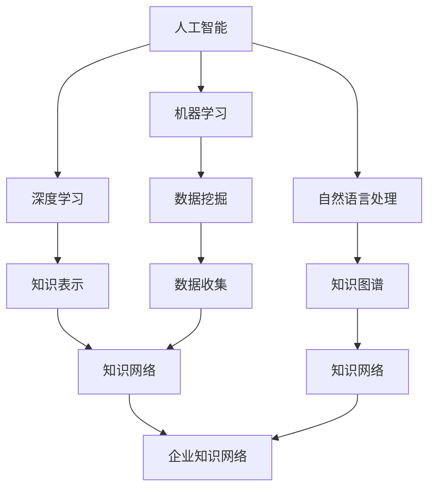

                 


## 引言与核心概念

### 背景介绍

在当今信息爆炸的时代，企业面临着海量数据的挑战。如何从这些数据中提取有价值的信息，并有效地利用这些信息来指导业务决策，成为企业亟需解决的重要问题。传统的方法往往依赖于人工分析和经验，这不仅效率低下，而且容易出现偏差。随着人工智能（AI）技术的快速发展，AI驱动的企业知识网络逐渐成为解决这一问题的有效途径。

企业知识网络是一种基于AI技术构建的智能信息处理系统，它能够帮助企业更好地管理和利用知识资源。通过将数据、信息和知识进行有效的整合，企业知识网络能够提供实时、准确的业务洞察，从而支持企业的决策过程。随着AI技术的不断进步，企业知识网络正逐渐从理论走向实践，成为企业数字化转型的重要支撑。

### 核心概念与联系

#### 1. 人工智能（AI）

人工智能是指通过计算机模拟人类智能行为的理论、技术和应用。AI主要包括机器学习、深度学习、自然语言处理等分支，通过这些技术，计算机能够自动学习、推理和决策。

#### 2. 知识网络

知识网络是一种用于表示和存储知识的分布式系统。它通过图结构来组织知识，使得知识之间能够相互关联，形成一张庞大的知识图谱。知识网络的核心目标是实现知识的共享、复用和优化。

#### 3. 企业知识网络

企业知识网络是基于知识网络构建的一种面向企业的智能信息处理系统。它利用AI技术对企业的数据、信息和知识进行整合，为企业提供实时、准确的业务洞察。

#### 4. AI驱动的企业知识网络

AI驱动的企业知识网络是将AI技术与企业知识网络相结合的产物。它利用AI算法对知识进行挖掘、分析和推理，从而提供更智能、更高效的业务支持。

### Mermaid 流程图



通过上述流程图，我们可以清晰地看到AI与知识网络之间的关系。AI技术为企业知识网络提供了强大的计算能力和智能分析能力，使得企业能够更好地管理和利用知识资源。

### 核心算法原理讲解

#### 1. 神经网络与深度学习

神经网络是一种模拟人脑神经元结构的计算模型，通过多层神经元的组合，可以实现对数据的非线性变换和特征提取。深度学习是神经网络的一种扩展，通过增加网络层数和神经元数量，能够提取更高层次的特征。

#### 2. 数据挖掘与知识发现

数据挖掘是一种从大量数据中提取有价值信息的方法。它包括关联规则挖掘、分类、聚类等多种技术。知识发现是通过数据挖掘技术从数据中提取出新的知识。

#### 3. 知识表示与图谱构建

知识表示是将知识转化为计算机可以处理的形式。知识图谱是一种基于图结构的知识表示方法，它通过节点和边来表示实体和关系，能够有效地组织和管理知识。

### Python 源代码实现

```python
import numpy as np
from sklearn.neural_network import MLPClassifier

# 创建一个简单的神经网络模型
mlp = MLPClassifier(hidden_layer_sizes=(100,), max_iter=1000)

# 准备数据
X_train = np.random.rand(100, 10)
y_train = np.random.randint(2, size=100)

# 训练模型
mlp.fit(X_train, y_train)

# 测试模型
X_test = np.random.rand(20, 10)
y_test = mlp.predict(X_test)

print("Accuracy:", mlp.score(X_test, y_test))
```

在上面的代码中，我们使用 scikit-learn 库创建了一个多层感知机（MLP）分类器，并通过随机生成数据来训练和测试模型。这只是一个简单的例子，实际应用中可能会涉及到更复杂的模型和算法。

### 数学模型与公式

在AI驱动的企业知识网络中，常用的数学模型包括线性回归、逻辑回归、支持向量机等。以下是一个简单的线性回归模型：

$$ y = \beta_0 + \beta_1x $$

其中，$y$ 是因变量，$x$ 是自变量，$\beta_0$ 和 $\beta_1$ 是模型的参数。

### 小结

本文首先介绍了AI驱动的企业知识网络的背景和重要性，然后详细讲解了核心概念和算法原理，并通过Python源代码和数学公式进行了具体说明。接下来，我们将进一步探讨企业知识网络的构建过程和应用场景。

---

作者：AI天才研究院/AI Genius Institute & 禅与计算机程序设计艺术 /Zen And The Art of Computer Programming

文章标题：AI驱动的企业知识网络：构建智能信息生态

关键词：人工智能、企业知识网络、深度学习、数据挖掘、知识图谱

摘要：本文探讨了AI驱动的企业知识网络的背景、核心概念、算法原理以及具体实现方法。通过Python源代码和数学公式的详细讲解，为读者提供了深入了解和实际应用的路径。接下来，我们将继续深入探讨企业知识网络的构建过程和应用场景，以期为企业数字化转型提供有力支持。

