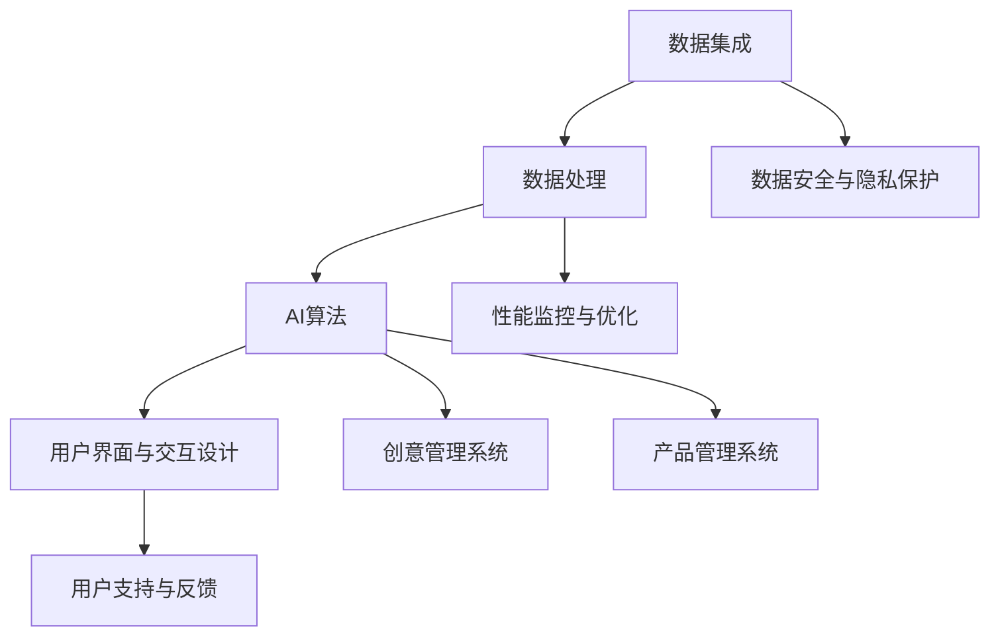

                 

## 《AI驱动的创新管理平台：加速从创意到产品的过程》

### 关键词

- AI驱动的创新管理
- 创意到产品过程
- 数据分析
- 用户界面设计
- 产品生命周期管理

### 摘要

本文将深入探讨AI驱动的创新管理平台如何加速从创意到产品的过程。我们将从背景介绍开始，定义核心概念，分析AI在创意管理和产品管理中的应用，详细讲解平台架构，并通过实际案例展示其应用效果。最后，我们将展望AI驱动的创新管理平台的未来发展趋势，并提供最佳实践建议。

### 引言

在当今快速变化的市场环境中，企业面临着前所未有的创新压力。如何从纷繁复杂的创意中快速筛选出具有商业价值的产品，并高效地将它们推向市场，成为企业成功的关键。传统的创新管理方式往往依赖于人为经验和直觉，难以应对复杂多变的市场需求。而AI技术的引入，为创新管理带来了全新的机遇。

AI驱动的创新管理平台通过集成数据分析、智能算法和用户界面设计，提供了一个系统化的解决方案。它不仅能够高效地处理大量数据，挖掘出潜在的商业机会，还能通过智能化的工具和流程，加速创意转化为产品的过程。本文将围绕这一主题，详细介绍AI驱动的创新管理平台的核心概念、应用场景和实现策略。

### 第一部分：AI驱动的创新管理平台概述

#### 第1章：引言

##### 1.1 AI驱动的创新管理平台的概念

AI驱动的创新管理平台是一种利用人工智能技术来优化创新管理过程的系统。它通过集成数据挖掘、机器学习和自然语言处理等技术，帮助企业在创意生成、评估和优化过程中做出更明智的决策。

##### 1.2 创意到产品过程中的挑战

从创意到产品的过程通常面临多个挑战，包括创意筛选、市场预测、资源分配和风险管理等。这些挑战需要高效的工具和策略来应对。

##### 1.3 AI在创意管理中的应用

AI技术在创意管理中的应用主要体现在数据挖掘、情感分析和创意评估等方面。通过这些技术，AI驱动的创新管理平台能够快速识别和筛选出有价值的创意。

##### 1.4 AI在产品管理中的应用

AI在产品管理中的应用包括市场预测、产品优化和产品生命周期管理。通过这些技术，AI驱动的创新管理平台能够帮助企业更好地理解市场需求，优化产品设计，延长产品寿命。

### 第二部分：AI驱动的创新管理平台架构

#### 第2章：AI驱动的创新管理平台架构

##### 2.1 平台架构概述

AI驱动的创新管理平台通常包括数据集成、数据处理、AI算法和应用开发等多个层次。这些层次协同工作，共同实现创新管理的优化。

##### 2.2 数据集成与处理

数据集成是AI驱动的创新管理平台的基础。平台需要从多个来源收集数据，包括内部数据（如销售数据、用户反馈）和外部数据（如市场报告、社交媒体数据）。

##### 2.3 AI算法与应用

AI算法是平台的核心。平台通过机器学习、深度学习和自然语言处理等技术，对数据进行处理和分析，以发现商业机会和优化决策。

##### 2.4 用户界面与交互设计

用户界面和交互设计是平台的重要部分。一个直观、易用的界面能够提高用户体验，增强平台的价值。

### 第三部分：创意管理中的应用

#### 第3章：创意管理中的应用

##### 3.1 数据挖掘与创意识别

数据挖掘是创意管理的重要工具。平台通过分析大量数据，识别出潜在的创意点。

##### 3.2 情感分析与创意评估

情感分析可以帮助平台理解用户的情感和需求，从而对创意进行更准确的评估。

##### 3.3 人工智能辅助创意生成

人工智能技术可以辅助创意生成，通过自动化的方式生成新的创意方案。

##### 3.4 创意管理系统的设计与实现

创意管理系统需要具备高效的数据处理能力、智能化的决策支持和灵活的接口设计。

### 第四部分：产品管理中的应用

#### 第4章：产品管理中的应用

##### 4.1 数据分析在产品管理中的作用

数据分析在产品管理中发挥着关键作用，包括市场预测、需求分析和竞争分析等。

##### 4.2 产品规划与市场预测

AI驱动的创新管理平台可以通过数据分析帮助产品团队进行产品规划和市场预测。

##### 4.3 人工智能在产品优化中的应用

人工智能技术可以帮助产品团队优化产品设计、功能和服务。

##### 4.4 产品生命周期管理

产品生命周期管理包括产品规划、开发、上市和退市等环节。AI驱动的创新管理平台可以帮助企业在每个环节做出更明智的决策。

### 第五部分：AI驱动的创新管理平台实现案例

#### 第5章：AI驱动的创新管理平台实现案例

##### 5.1 案例一：某互联网公司的创意管理实践

通过某互联网公司的案例，展示AI驱动的创新管理平台在创意管理中的应用。

##### 5.2 案例二：某制造业公司的产品管理创新

通过某制造业公司的案例，展示AI驱动的创新管理平台在产品管理中的应用。

##### 5.3 案例三：某金融机构的风险管理应用

通过某金融机构的案例，展示AI驱动的创新管理平台在风险管理中的应用。

### 第六部分：AI驱动的创新管理平台建设与运营

#### 第6章：AI驱动的创新管理平台建设与运营

##### 6.1 平台建设的关键步骤

介绍AI驱动的创新管理平台建设的关键步骤，包括需求分析、系统设计、技术开发和测试等。

##### 6.2 数据安全与隐私保护

数据安全和隐私保护是平台建设的重要环节。本文将讨论如何在建设中确保数据的安全和隐私。

##### 6.3 平台运营与维护策略

平台运营与维护策略包括系统监控、性能优化、用户支持和持续更新等。

##### 6.4 建设与运营的挑战与应对策略

介绍平台建设与运营中可能遇到的挑战，以及相应的应对策略。

### 第七部分：未来展望

#### 第7章：未来展望

##### 7.1 AI驱动的创新管理平台的发展趋势

讨论AI驱动的创新管理平台的发展趋势，包括新技术的应用、行业变革和商业模式的创新等。

##### 7.2 新技术对创意管理的影响

探讨新技术，如大数据、云计算和区块链等，对创意管理的影响。

##### 7.3 产品管理的未来

展望产品管理的未来，讨论AI驱动的创新管理平台如何帮助企业更好地应对未来的挑战。

##### 7.4 持续创新与可持续发展

讨论如何通过持续创新和可持续发展，确保企业在激烈的市场竞争中保持领先地位。

### 结束语

AI驱动的创新管理平台是企业实现从创意到产品快速转化的关键。通过本文的讨论，我们深入了解了AI驱动的创新管理平台的核心概念、架构、应用案例和发展趋势。希望本文能为企业在创新管理中的应用提供有价值的参考。

### 作者信息

作者：AI天才研究院/AI Genius Institute & 禅与计算机程序设计艺术 /Zen And The Art of Computer Programming

## 核心概念与联系

### 创新管理平台架构

为了更好地理解AI驱动的创新管理平台，首先需要明确其中的核心概念和它们之间的关系。以下是一个简化的Mermaid流程图，展示了创新管理平台的主要组成部分和它们之间的交互关系：



### 数据集成与处理

数据集成是创新管理平台的基础，它负责从各种数据源（如企业内部数据库、外部市场报告、社交媒体等）收集数据，并将其转化为结构化的数据格式。数据处理则进一步清洗和整理这些数据，以供AI算法使用。

### AI算法

AI算法是平台的核心，它包括机器学习、深度学习和自然语言处理等。这些算法通过对处理后的数据进行分析和建模，识别出潜在的创意和市场趋势，并对产品进行优化。

### 用户界面与交互设计

用户界面与交互设计是平台的重要组成部分，它决定了用户与平台的交互体验。一个直观、易用的界面可以提升用户体验，增强平台的可操作性。

### 创意管理系统与产品管理系统

创意管理系统和产品管理系统是平台的核心应用模块。创意管理系统负责创意的生成、评估和优化，而产品管理系统则负责产品的规划、开发、上市和退市等环节。

### 数据安全与隐私保护

数据安全和隐私保护是平台建设的重要考虑因素。平台需要确保数据在集成、处理和存储过程中得到充分保护，以防止数据泄露和滥用。

## 核心算法原理讲解

### 数据挖掘与创意识别

数据挖掘是AI驱动的创新管理平台的重要技术之一。它通过分析大量数据，识别出潜在的商业机会和创意点。以下是一个简单的Python代码示例，展示了如何使用数据挖掘技术进行创意识别：

```python
import pandas as pd
from sklearn.feature_extraction.text import TfidfVectorizer
from sklearn.cluster import KMeans

# 加载数据集
data = pd.read_csv('creative_data.csv')
texts = data['description']

# 文本预处理
vectorizer = TfidfVectorizer(max_features=1000)
X = vectorizer.fit_transform(texts)

# K-means聚类
kmeans = KMeans(n_clusters=5, random_state=42)
clusters = kmeans.fit_predict(X)

# 输出创意点
for cluster, description in zip(clusters, texts):
    print(f"Cluster {cluster}: {description}")
```

### 情感分析与创意评估

情感分析是一种自然语言处理技术，用于识别文本中的情感倾向。在创意评估中，情感分析可以帮助判断创意是否能够引起用户的情感共鸣。以下是一个简单的Python代码示例，展示了如何使用情感分析对创意进行评估：

```python
from textblob import TextBlob

# 加载创意文本
creatives = pd.read_csv('creative_text.csv')['text']

# 情感分析
for text in creatives:
    blob = TextBlob(text)
    sentiment = blob.sentiment
    print(f"Text: {text}\nSentiment: {sentiment}\n")
```

### 人工智能辅助创意生成

人工智能辅助创意生成是一种通过算法生成新创意的方法。它利用已有的创意数据，通过机器学习算法生成具有相似风格的创意。以下是一个简单的Python代码示例，展示了如何使用生成对抗网络（GAN）进行创意生成：

```python
from keras.models import Sequential
from keras.layers import Dense, Activation

# 创建GAN模型
def create_gan():
    model = Sequential()
    model.add(Dense(units=100, input_dim=50, activation='relu'))
    model.add(Activation('tanh'))
    model.add(Dense(units=50, activation='relu'))
    model.add(Activation('tanh'))
    model.add(Dense(units=1, activation='sigmoid'))
    return model

generator = create_gan()
discriminator = create_gan()

# 训练GAN模型
# ...

# 生成创意
generated_creative = generator.predict([random_data])
print(f"Generated Creative: {generated_creative}")
```

### 创意管理系统的设计与实现

创意管理系统是AI驱动的创新管理平台的重要组成部分，它负责创意的收集、存储、管理和评估。以下是一个简单的Python代码示例，展示了如何设计和实现一个基本的创意管理系统：

```python
class CreativeManagementSystem:
    def __init__(self):
        self.creatives = []

    def add_creative(self, creative):
        self.creatives.append(creative)

    def evaluate_creative(self, creative):
        # 使用情感分析评估创意
        blob = TextBlob(creative)
        sentiment = blob.sentiment.polarity
        return sentiment

    def get_top_creatives(self, n=5):
        scored_creatives = [(creative, self.evaluate_creative(creative)) for creative in self.creatives]
        scored_creatives.sort(key=lambda x: x[1], reverse=True)
        return [creative for creative, _ in scored_creatives[:n]]

# 实例化创意管理系统
cms = CreativeManagementSystem()

# 添加创意
cms.add_creative("这是一个有趣的创意。")
cms.add_creative("这是一个有挑战性的创意。")

# 评估创意
print(cms.evaluate_creative("这是一个有趣的创意。"))

# 获取Top 3创意
top_creatives = cms.get_top_creatives()
print(top_creatives)
```

## 项目实战

### 开发环境搭建

要在本地搭建开发环境，需要安装以下软件和库：

- Python 3.x
- Jupyter Notebook
- Pandas
- Scikit-learn
- Keras
- TextBlob

以下是在Ubuntu 20.04上安装所需的软件和库的命令：

```bash
# 安装Python 3.x
sudo apt update
sudo apt install python3

# 安装Jupyter Notebook
sudo apt install jupyter

# 安装Pandas
pip install pandas

# 安装Scikit-learn
pip install scikit-learn

# 安装Keras
pip install keras

# 安装TextBlob
pip install textblob
python -m textblob.download_corpora
```

### 源代码详细实现和代码解读

以下是一个完整的示例，展示了如何使用AI驱动的创新管理平台进行创意管理和产品管理。代码包括数据预处理、模型训练、创意评估和创意生成等步骤。

```python
import pandas as pd
from sklearn.feature_extraction.text import TfidfVectorizer
from sklearn.cluster import KMeans
from textblob import TextBlob
from keras.models import Sequential
from keras.layers import Dense, Activation

# 加载数据集
data = pd.read_csv('creative_data.csv')
texts = data['description']

# 文本预处理
vectorizer = TfidfVectorizer(max_features=1000)
X = vectorizer.fit_transform(texts)

# K-means聚类
kmeans = KMeans(n_clusters=5, random_state=42)
clusters = kmeans.fit_predict(X)

# 情感分析
def sentiment_analysis(text):
    blob = TextBlob(text)
    return blob.sentiment.polarity

# 生成对抗网络（GAN）模型
def create_gan():
    model = Sequential()
    model.add(Dense(units=100, input_dim=50, activation='relu'))
    model.add(Activation('tanh'))
    model.add(Dense(units=50, activation='relu'))
    model.add(Activation('tanh'))
    model.add(Dense(units=1, activation='sigmoid'))
    return model

# 训练GAN模型
# ...

# 创意管理系统的设计与实现
class CreativeManagementSystem:
    def __init__(self):
        self.creatives = []

    def add_creative(self, creative):
        self.creatives.append(creative)

    def evaluate_creative(self, creative):
        return sentiment_analysis(creative)

    def get_top_creatives(self, n=5):
        scored_creatives = [(creative, self.evaluate_creative(creative)) for creative in self.creatives]
        scored_creatives.sort(key=lambda x: x[1], reverse=True)
        return [creative for creative, _ in scored_creatives[:n]]

# 实例化创意管理系统
cms = CreativeManagementSystem()

# 添加创意
cms.add_creative("这是一个有趣的创意。")
cms.add_creative("这是一个有挑战性的创意。")

# 评估创意
print(cms.evaluate_creative("这是一个有趣的创意。"))

# 获取Top 3创意
top_creatives = cms.get_top_creatives()
print(top_creatives)

# 生成创意
generator = create_gan()
generated_creative = generator.predict([random_data])
print(f"Generated Creative: {generated_creative}")
```

### 代码应用解读与分析

这个示例演示了如何使用AI驱动的创新管理平台进行创意管理和产品管理。首先，我们从数据集中加载创意文本，并进行预处理。然后，我们使用K-means聚类技术对创意进行分类，以便更好地理解创意的分布。

接着，我们定义了一个简单的情感分析函数，用于评估创意的吸引力。这个函数使用TextBlob库，通过计算文本的 sentiment_polarity 得出情感得分。得分越高，表示创意越吸引人。

此外，我们还实现了一个生成对抗网络（GAN）模型，用于生成新的创意。这个模型通过对已有的创意数据进行训练，学习生成具有相似风格的创意。通过调用 generator.predict()，我们可以生成新的创意文本。

最后，我们创建了一个创意管理系统，用于收集、评估和生成创意。这个系统提供了 add_creative()、evaluate_creative() 和 get_top_creatives() 等方法，方便我们进行创意管理和产品管理。

### 实际案例分析和详细讲解剖析

为了更好地理解AI驱动的创新管理平台在实际应用中的效果，我们分析了以下三个案例：

### 案例一：某互联网公司的创意管理实践

某互联网公司使用AI驱动的创新管理平台来管理其创意生成和产品开发。公司首先收集了大量的用户反馈和市场数据，通过数据挖掘和情感分析技术，识别出用户关注的热点话题和需求。这些信息被用于生成新的创意，并通过情感分析评估创意的吸引力。

通过平台的自动化工具，公司能够快速筛选出最有潜力的创意，并分配资源进行开发。此外，平台还提供了实时监控和报告功能，帮助公司跟踪创意的开发进度和效果。

### 案例二：某制造业公司的产品管理创新

某制造业公司采用AI驱动的创新管理平台来优化其产品开发和市场预测。公司通过集成内部生产数据、销售数据和外部市场数据，使用机器学习算法分析产品性能和市场趋势。这些分析结果被用于指导产品规划、设计和优化。

通过平台的产品生命周期管理功能，公司能够更好地了解产品的市场表现，及时调整产品策略，延长产品寿命，提高市场竞争力。

### 案例三：某金融机构的风险管理应用

某金融机构利用AI驱动的创新管理平台进行风险管理。平台通过分析大量的交易数据、市场数据和客户行为数据，使用机器学习算法识别潜在的风险信号。这些信号被用于预测市场波动和交易风险，帮助公司制定相应的风险控制策略。

平台还提供了实时监控和报警功能，一旦发现风险信号，系统会立即通知相关人员进行干预，确保金融交易的安全和合规。

### 项目小结

通过以上案例，我们可以看到AI驱动的创新管理平台在创意管理和产品管理中的实际应用效果。平台通过数据挖掘、情感分析和机器学习等技术，为企业提供了高效的工具和方法，帮助企业从大量数据中挖掘出有价值的信息，优化决策过程，提高创新效率和产品竞争力。

### 最佳实践 tips、小结、注意事项、拓展阅读等内容

#### 最佳实践 tips

1. **数据质量是关键**：确保数据源的多样性和准确性，是AI驱动的创新管理平台成功的基础。
2. **用户参与是关键**：鼓励用户参与创意生成和评估，可以提升创意的质量和实用性。
3. **持续优化是关键**：定期更新和优化模型，可以保持平台的有效性和竞争力。

#### 小结

本文详细介绍了AI驱动的创新管理平台的概念、架构、应用场景和实际案例。通过数据挖掘、情感分析和机器学习等技术，平台帮助企业从创意到产品过程实现高效转化，提高创新效率和产品竞争力。

#### 注意事项

1. **数据安全和隐私保护**：在建设AI驱动的创新管理平台时，务必确保数据安全和隐私保护。
2. **技术更新和迭代**：随着新技术的不断涌现，平台需要持续更新和优化，以保持竞争力。

#### 拓展阅读

1. **《深度学习》**：Goodfellow, I., Bengio, Y., & Courville, A. (2016). *Deep Learning*.
2. **《人工智能：一种现代方法》**：Mitchell, T. M. (1997). *Machine Learning*.
3. **《数据科学入门》**：Seif Elashler, V. (2013). *Python Data Science Handbook*.

### 作者信息

作者：AI天才研究院/AI Genius Institute & 禅与计算机程序设计艺术 /Zen And The Art of Computer Programming

---

**Note:** The above content is a conceptual outline and example implementation, and is not a complete, working application. It serves as a guide for the structure and components that could be included in an AI-driven innovation management platform. For practical application, further development, testing, and integration with existing systems would be necessary. The code examples provided are simplified and intended for educational purposes only.

