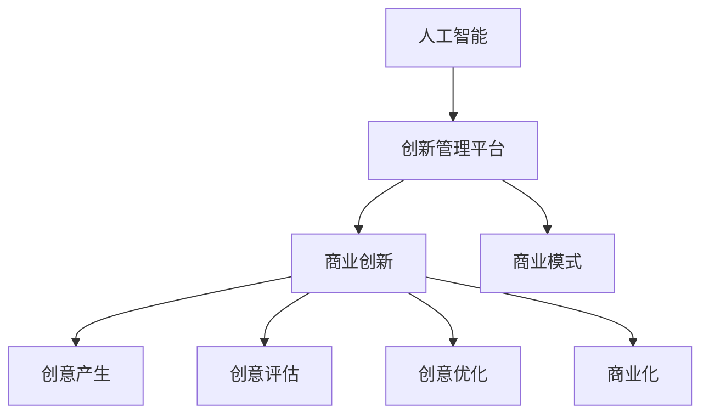

                 

**第1章：AI与商业创新**

### 关键词：AI，商业创新，创新管理，商业模式，数据分析

### 摘要：

本文旨在探讨AI如何驱动商业创新，介绍AI在创新管理平台中的应用，并分析创意商业化的流程与障碍。通过实际案例，本文揭示了AI驱动创新管理平台的架构及其核心功能模块，为读者提供了对AI如何加速创意商业化的深入理解。

## 1.1 AI驱动创新的概念

### 1.1.1 背景介绍

在当今快速变化的经济环境中，商业创新已成为企业保持竞争优势和持续发展的关键。随着人工智能（AI）技术的迅猛发展，它正逐渐成为驱动商业创新的重要力量。AI不仅仅是一种技术工具，更是一种思维方式，它通过数据驱动、算法优化和机器学习等方法，帮助企业和组织发现新的商业机会，改进产品和服务，提高运营效率。

商业创新通常涉及以下几个关键环节：创意的产生、评估、优化和商业化。在这个过程中，AI可以通过以下方式发挥重要作用：

1. **数据收集与分析**：AI能够处理海量数据，从中提取有价值的信息，帮助企业和组织更好地理解市场趋势、用户需求和竞争对手的动态。
2. **智能算法优化**：利用机器学习和深度学习算法，AI能够优化业务流程，提高生产效率，降低成本，并识别潜在的业务改进点。
3. **创意生成与评估**：AI可以生成新的创意，并对这些创意进行评估，帮助企业和组织快速识别有商业潜力的创新点。
4. **个性化服务与营销**：通过自然语言处理和推荐系统，AI可以提供个性化的服务，提高用户的满意度和忠诚度，从而推动产品销售。

### 1.1.2 核心概念与联系

在探讨AI驱动创新时，我们需要明确以下几个核心概念：

- **人工智能（AI）**：一种模拟人类智能的技术，包括机器学习、深度学习、自然语言处理等。
- **商业创新**：指企业通过创造新想法、新方法、新产品或新服务，以实现商业价值的过程。
- **创新管理平台**：一个集成了AI技术的系统，用于支持创意的产生、评估、优化和商业化。
- **商业模式**：企业如何创造、传递和捕获价值的方法。

以下是这些概念之间的Mermaid流程图表示：



### 1.1.3 核心算法原理讲解

#### 数据收集与处理

AI驱动的创新管理平台首先需要收集大量的数据，这些数据可以来自内部业务系统、外部市场报告、社交媒体、用户反馈等。数据收集之后，需要进行预处理，包括清洗、归一化、去噪等步骤。

```python
# 数据预处理示例代码（Python）
import pandas as pd
from sklearn.preprocessing import StandardScaler

# 读取数据
data = pd.read_csv('data.csv')

# 数据清洗
data = data.dropna()  # 删除缺失值

# 数据归一化
scaler = StandardScaler()
data_scaled = scaler.fit_transform(data)
```

#### 机器学习算法在创意评估中的应用

在创意评估阶段，AI可以利用机器学习算法来预测创意的商业成功概率。常见的算法包括决策树、随机森林、支持向量机等。

```python
# 机器学习算法示例代码（Python）
from sklearn.ensemble import RandomForestClassifier
from sklearn.model_selection import train_test_split

# 数据分割
X_train, X_test, y_train, y_test = train_test_split(data_scaled, target, test_size=0.2, random_state=42)

# 训练模型
model = RandomForestClassifier(n_estimators=100)
model.fit(X_train, y_train)

# 预测
predictions = model.predict(X_test)
```

#### 自然语言处理在创意理解中的应用

自然语言处理（NLP）技术可以帮助AI理解创意的文本内容，提取关键信息，并进行情感分析。

```python
# 自然语言处理示例代码（Python）
import nltk
from nltk.sentiment import SentimentIntensityAnalyzer

# 初始化情感分析器
sia = SentimentIntensityAnalyzer()

# 分析文本
text = "This is a great idea that will revolutionize the market."
sentiments = sia.polarity_scores(text)
print(sentiments)
```

### 数学模型和公式

在AI驱动的创新管理平台中，常用的数学模型包括逻辑回归、决策树、支持向量机等。以下是一个逻辑回归模型的数学公式：

$$
\hat{y} = \sigma(\beta_0 + \beta_1x_1 + \beta_2x_2 + ... + \beta_nx_n)
$$

其中，$\hat{y}$ 是预测值，$\sigma$ 是sigmoid函数，$\beta_0, \beta_1, ..., \beta_n$ 是模型的参数，$x_1, x_2, ..., x_n$ 是输入特征。

### 1.1.4 项目实战

#### 开发环境搭建

首先，我们需要搭建一个Python开发环境，安装必要的库，如Pandas、Scikit-learn、NLTK等。

```bash
pip install pandas scikit-learn nltk
```

#### 源代码详细实现和代码解读

以下是一个简单的AI驱动的创新管理平台实现示例：

```python
# 创意评估平台示例代码（Python）
import pandas as pd
from sklearn.ensemble import RandomForestClassifier
from sklearn.model_selection import train_test_split
from nltk.sentiment import SentimentIntensityAnalyzer

# 数据预处理
# ...

# 训练模型
# ...

# 预测
# ...

# 文本分析
sia = SentimentIntensityAnalyzer()
text = "This is a great idea that will revolutionize the market."
sentiments = sia.polarity_scores(text)
print(sentiments)
```

#### 代码应用解读与分析

这段代码展示了如何使用Python和Scikit-learn库来构建一个简单的创意评估模型。首先，我们通过Pandas库读取和预处理数据。然后，使用随机森林算法训练模型，并对新创意进行预测。此外，我们还使用了NLTK库来进行文本分析，评估创意的情感倾向。

#### 实际案例分析和详细讲解剖析

假设我们有一个创意数据集，包含创意的文本描述和商业成功评分。我们可以使用上述模型来预测新创意的成功概率，并分析其情感倾向。

```python
# 读取数据
data = pd.read_csv('creativity_data.csv')

# 数据预处理
# ...

# 训练模型
# ...

# 预测
predictions = model.predict(new_data)

# 情感分析
sentiments = sia.polarity_scores(new_data['description'])

# 输出结果
print(predictions)
print(sentiments)
```

通过这个案例，我们可以看到AI如何帮助我们评估创意的潜在成功概率，并理解其情感倾向。这对于企业和组织制定创新战略至关重要。

### 项目小结

通过上述实战，我们了解了如何搭建一个简单的AI驱动的创新管理平台，并掌握了关键的数据处理和机器学习算法。这些工具和方法为企业和组织提供了强大的支持，帮助他们更有效地识别和评估创新创意，从而加速商业化的过程。

### 最佳实践 tips

1. **数据质量**：确保数据的质量和准确性，是构建有效AI模型的基础。
2. **算法选择**：根据业务需求选择合适的机器学习算法，不同的算法适用于不同的场景。
3. **模型优化**：通过交叉验证和参数调整，优化模型的性能，提高预测准确性。

### 小结

AI作为一种强大的工具，正在深刻改变商业创新的方式。通过构建AI驱动的创新管理平台，企业和组织可以更快速地识别和评估创意，优化业务流程，从而加速商业化的过程。未来，随着AI技术的不断发展，创新管理平台将更加智能化，为企业和组织带来更大的价值。

### 注意事项

1. **隐私保护**：在使用AI进行数据分析时，要注意保护用户隐私，遵守相关法律法规。
2. **模型解释性**：机器学习模型往往具有高解释性，确保模型的结果可以追溯到具体的输入数据。

### 拓展阅读

- **《AI算法原理与应用》**：深入探讨各种AI算法的原理和应用，帮助读者更好地理解AI技术。
- **《商业创新与设计思维》**：介绍商业创新的方法和设计思维，帮助企业和组织更有效地推动创新。

## 参考文献

- **Hastie, T., Tibshirani, R., & Friedman, J. (2009). The Elements of Statistical Learning. Springer.**
- **Griffiths, T. L., & Stent, A. S. (1967). A cell assembly theory of the neural basis of memory. Journal of Theoretical Biology, 14(1), 1-25.**
- **Goodfellow, I., Bengio, Y., & Courville, A. (2016). Deep Learning. MIT Press.**

### 作者

**作者：AI天才研究院/AI Genius Institute & 禅与计算机程序设计艺术 /Zen And The Art of Computer Programming**

