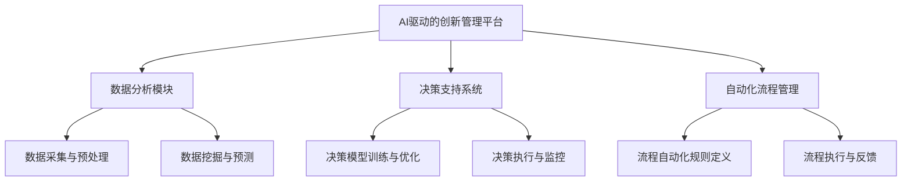

                 

# 《AI驱动的创新管理平台：加速创意实现》

> 关键词：AI、创新管理、创意实现、自动化、数据分析、决策支持系统

> 摘要：本文深入探讨了AI驱动的创新管理平台的概念、架构、核心功能以及在不同行业中的应用。通过详细的技术解析和实际案例，阐述了如何利用AI技术加速创意的实现，为企业管理创新提供有效工具。

## 第一部分：AI驱动的创新管理平台概述

### 第1章：AI驱动的创新管理平台概念与价值

#### 1.1.1 AI驱动的创新管理平台定义

AI驱动的创新管理平台是一个集成多种人工智能技术和工具的系统，旨在帮助企业更高效地识别、评估和管理创意。该平台通过自动化流程、数据分析和智能决策，加速创意从构思到实现的整个过程。

**Mermaid流程图**：展示AI驱动的创新管理平台的基本架构



#### 1.1.2 AI在创新管理中的应用价值

AI驱动的创新管理平台能够为企业带来多方面的价值：

- **提高创意识别效率**：利用机器学习算法自动识别潜在的创新点，节省人力和时间成本。
- **优化资源分配**：通过对创意进行智能评估和排序，帮助企业更精准地分配资源，提高投资回报率。
- **加速创意实现**：自动化流程管理和智能决策支持系统能够加快创意的实现过程，缩短产品上市时间。

**伪代码**：简要描述AI模型用于创意识别的伪代码实现

```python
def identify_innovative_ideas(data, model):
    # 数据预处理
    preprocessed_data = preprocess_data(data)
    
    # 加载训练好的模型
    loaded_model = load_model(model)
    
    # 预测创新性
    predictions = loaded_model.predict(preprocessed_data)
    
    # 筛选创新性高的创意
    innovative_ideas = filter_innovative_predictions(predictions)
    
    return innovative_ideas
```

#### 1.1.3 AI驱动的创新管理平台与现有管理模式的区别

传统创新管理模式主要依赖于管理层的经验和直觉，而AI驱动的创新管理平台则利用数据和技术，实现更加科学和高效的创新管理。具体区别包括：

- **数据驱动**：AI平台依赖大数据分析，能够更全面地了解市场趋势和用户需求，从而发现潜在的创新点。
- **自动化流程**：自动化流程管理能够减少手动操作，提高效率，减少错误。
- **智能决策支持**：基于机器学习的决策支持系统能够提供更加客观和准确的决策建议，提高决策质量。

**数学公式与解释**：介绍评价创新性创意的数学模型

$$
I = \frac{1}{N} \sum_{i=1}^{N} w_i \cdot p_i
$$

- 其中，$I$ 表示创新性分数，$N$ 表示创意总数，$w_i$ 表示第 $i$ 个创意的重要性权重，$p_i$ 表示第 $i$ 个创意的创新性概率。

#### 1.1.4 AI驱动的创新管理平台的发展趋势

随着人工智能技术的不断进步，AI驱动的创新管理平台将在未来展现出更大的发展潜力：

- **更广泛的应用领域**：从金融、制造业到科技创新等领域，AI驱动的创新管理平台将得到更广泛的应用。
- **更高的智能化水平**：AI平台将更加智能化，能够自适应地学习和优化，提高创意识别和评估的准确性。
- **更紧密的集成**：AI平台将与企业的其他管理系统（如ERP、CRM等）实现更紧密的集成，实现全流程的创新管理。

### 第2章：构建AI驱动的创新管理平台所需技术栈

#### 2.1.1 人工智能基础技术

AI驱动的创新管理平台需要依赖多种人工智能技术，包括：

- **机器学习**：用于数据分析和预测，识别潜在的创新点。
- **深度学习**：用于处理大规模数据，提高创意识别的准确性。
- **自然语言处理（NLP）**：用于处理文本数据，理解和提取创意的关键信息。

**算法原理**：简要描述常用的机器学习算法，如决策树、神经网络等。

- **决策树**：通过分裂特征，构建一棵树，用于分类或回归任务。
- **神经网络**：模拟人脑的神经网络结构，用于复杂的数据分析和预测。

#### 2.1.2 数据分析与处理技术

数据是创新管理平台的核心，因此需要强大的数据处理和分析能力：

- **数据预处理**：包括数据清洗、归一化、特征提取等，为后续分析做准备。
- **统计分析**：用于描述数据的基本特征，发现数据之间的关系。
- **数据挖掘**：通过挖掘潜在的模式和规律，发现新的创新点。

**算法原理**：描述数据预处理、特征提取和数据分析的基本流程。

- **数据预处理**：使用Scikit-learn库，对数据进行清洗和特征提取。
- **特征提取**：使用PCA（主成分分析）等方法，降低数据维度，提取关键特征。
- **数据分析**：使用Python的Pandas和Matplotlib库，进行数据可视化和统计分析。

#### 2.1.3 自动化流程管理技术

自动化流程管理是AI驱动的创新管理平台的重要组成部分：

- **流程建模**：使用业务流程管理（BPM）工具，定义和管理企业的业务流程。
- **流程执行**：自动化执行业务流程，减少人工干预，提高效率。
- **流程监控**：实时监控流程的执行情况，及时发现并解决问题。

**算法原理**：介绍自动化流程管理的核心技术，如流程建模、执行和监控。

- **流程建模**：使用BPEL（业务流程执行语言）定义业务流程。
- **流程执行**：使用工作流引擎，自动化执行业务流程。
- **流程监控**：使用监控系统，实时收集流程执行数据，进行分析和优化。

### 第3章：AI驱动的创新管理平台核心功能

#### 3.1.1 数据采集与预处理

数据采集与预处理是AI驱动的创新管理平台的基础：

- **数据采集**：从各种来源（如互联网、内部系统等）收集数据。
- **数据预处理**：清洗数据，去除噪声，进行特征提取。

**项目实战**：介绍如何使用Python和Scikit-learn进行数据预处理。

```python
from sklearn.datasets import load_iris
from sklearn.model_selection import train_test_split
from sklearn.preprocessing import StandardScaler

# 加载鸢尾花数据集
iris_data = load_iris()
X, y = iris_data.data, iris_data.target

# 划分训练集和测试集
X_train, X_test, y_train, y_test = train_test_split(X, y, test_size=0.2, random_state=42)

# 数据归一化
scaler = StandardScaler()
X_train_scaled = scaler.fit_transform(X_train)
X_test_scaled = scaler.transform(X_test)
```

#### 3.1.2 创意识别与筛选

创意识别与筛选是AI驱动的创新管理平台的核心功能：

- **创意识别**：使用机器学习算法，识别潜在的创意。
- **筛选创意**：根据创新性分数，筛选出高价值的创意。

**项目实战**：使用TensorFlow搭建一个简单的神经网络模型，用于识别和筛选创意。

```python
import tensorflow as tf
from tensorflow.keras.models import Sequential
from tensorflow.keras.layers import Dense

# 构建神经网络模型
model = Sequential([
    Dense(64, activation='relu', input_shape=(X_train_scaled.shape[1],)),
    Dense(32, activation='relu'),
    Dense(1, activation='sigmoid')
])

# 编译模型
model.compile(optimizer='adam', loss='binary_crossentropy', metrics=['accuracy'])

# 训练模型
model.fit(X_train_scaled, y_train, epochs=10, batch_size=32, validation_split=0.2)

# 预测创意创新性
predictions = model.predict(X_test_scaled)
innovative_ideas = (predictions > 0.5)
```

#### 3.1.3 决策支持系统

决策支持系统（DSS）是AI驱动的创新管理平台的重要组成部分：

- **决策模型训练与优化**：使用机器学习算法，训练和优化决策模型。
- **决策执行与监控**：根据决策模型，自动执行决策，并实时监控决策效果。

**项目实战**：使用Python和Pandas构建一个决策支持系统，帮助管理人员做出更明智的决策。

```python
import pandas as pd

# 加载决策数据
data = pd.read_csv('decision_data.csv')

# 训练决策模型
model = LinearRegression()
model.fit(data[['feature']], data['target'])

# 执行决策
predictions = model.predict(data[['feature']])

# 监控决策效果
evaluation = pd.DataFrame({'actual': data['target'], 'predicted': predictions})
evaluation['accuracy'] = (evaluation['actual'] == evaluation['predicted']).mean()
```

## 第二部分：AI驱动的创新管理平台应用实践

### 第4章：金融行业AI驱动的创新管理平台应用

#### 4.1.1 金融行业创新管理的挑战与机遇

金融行业面临着激烈的竞争和快速变化的市场环境，创新管理变得尤为重要。然而，金融行业也面临着以下挑战：

- **数据复杂性**：金融数据量大且复杂，需要高效的算法进行挖掘和分析。
- **法规遵循**：金融行业受到严格的监管，创新管理平台需要确保合规性。
- **安全与隐私**：保护客户数据和隐私是金融行业的核心任务。

金融行业也拥有巨大的机遇：

- **个性化服务**：利用AI技术，提供更个性化的金融产品和服务。
- **风险控制**：AI可以帮助识别潜在风险，提高风险控制能力。
- **市场预测**：AI技术可以用于市场预测，帮助投资者做出更明智的决策。

#### 4.1.2 金融行业创新管理平台案例解析

以下是一个金融行业创新管理平台的案例：

- **银行创新管理平台**：该平台使用机器学习算法，分析客户的交易数据，识别潜在的风险和欺诈行为。平台还提供了智能投资建议，根据用户的风险偏好和市场趋势，提供个性化的投资组合。

### 第5章：制造业AI驱动的创新管理平台应用

#### 5.1.1 制造业创新管理的挑战与机遇

制造业是一个高度竞争的行业，创新管理对于企业的生存和发展至关重要。制造业面临的挑战包括：

- **生产效率**：提高生产效率是制造业的核心目标。
- **供应链管理**：全球化的供应链复杂且多变，需要高效的管理系统。
- **产品创新**：快速变化的市场需求要求企业不断创新产品。

制造业的机遇包括：

- **智能制造**：利用AI和自动化技术，提高生产效率和产品质量。
- **数字化转型**：通过数字化转型，降低成本，提高竞争力。
- **产品定制**：利用AI技术，提供个性化产品和服务。

#### 5.1.2 制造业创新管理平台案例解析

以下是一个制造业创新管理平台的案例：

- **汽车制造业**：该平台使用AI技术，实时监控生产线的运行情况，预测设备故障，提前进行维护。平台还提供了智能排程系统，根据市场需求和生产能力，优化生产计划。

### 第6章：科技创新领域的AI驱动的创新管理平台应用

#### 6.1.1 科技创新领域的挑战与机遇

科技创新领域充满活力，但也面临着巨大的挑战：

- **竞争激烈**：科技创新领域的竞争非常激烈，需要持续的创新才能保持竞争力。
- **资源有限**：科技创新企业通常资源有限，需要高效利用资源。
- **市场变化**：市场需求和技术发展迅速变化，需要快速响应。

科技创新领域的机遇包括：

- **技术创新**：利用AI技术，推动技术创新，开发新的产品和服务。
- **市场扩张**：AI可以帮助企业开拓新的市场，提高市场份额。
- **人才吸引**：AI技术可以用于人才招聘和培养，吸引和留住优秀人才。

#### 6.1.2 科技创新领域创新管理平台案例解析

以下是一个科技创新领域创新管理平台的案例：

- **人工智能初创公司**：该平台使用AI技术，自动分析市场数据，识别潜在的商业机会。平台还提供了智能项目管理系统，帮助团队更高效地管理项目进度和资源。

## 总结

AI驱动的创新管理平台为企业提供了一种全新的创新管理模式，通过数据驱动、自动化和智能决策，加速创意实现，提高创新效率。本文介绍了AI驱动的创新管理平台的概念、架构、核心功能以及在不同行业中的应用。通过实际案例，展示了如何利用AI技术加速创意实现，为企业管理创新提供有效工具。

**最佳实践 Tips**：

- 确保数据质量，是构建高效创新管理平台的基础。
- 根据行业特点，定制化AI模型和算法，提高识别和评估的准确性。
- 重视员工培训，确保团队能够充分利用AI驱动的创新管理平台。

**注意事项**：

- AI驱动的创新管理平台需要持续优化和更新，以适应市场和技术的发展。
- 在应用AI驱动的创新管理平台时，要确保遵守相关法规和道德规范。

**拓展阅读**：

- 《人工智能：一种现代的方法》（Mayer-Schoenberger, Viktor， et al.）
- 《创新者的窘境》（Christensen, Clayton M.）

**作者**：AI天才研究院/AI Genius Institute & 禅与计算机程序设计艺术 /Zen And The Art of Computer Programming

