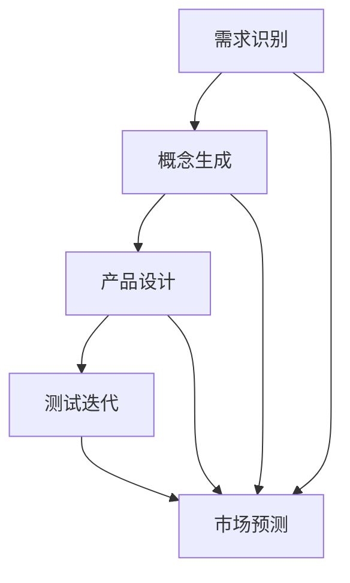

                 

### 《AI驱动的创新管理系统：加速从创意到产品的过程》

#### 文章标题

“AI驱动的创新管理系统：加速从创意到产品的过程”

#### 关键词

- AI
- 创新管理
- 产品开发
- 机器学习
- 数据分析
- 人工智能算法

#### 摘要

本文深入探讨了AI驱动的创新管理系统，详细阐述了如何通过人工智能技术加速从创意到产品的整个创新过程。文章首先介绍了创新管理的背景和重要性，然后详细讲解了AI的基础理论和其在创新管理中的应用，包括需求识别、概念生成、产品设计与迭代、市场预测与分析等环节。通过具体案例研究，本文展示了AI驱动的创新管理在实际中的应用效果，并提出了未来发展的方向和挑战。

---

# 《AI驱动的创新管理系统：加速从创意到产品的过程》

在当今快速变化的市场环境中，创新已经成为企业生存和发展的关键。然而，从创意到产品的转化过程往往耗时耗力，效率低下。随着人工智能（AI）技术的发展，一种新型的创新管理系统——AI驱动的创新管理系统，应运而生，它通过利用AI技术，极大地提高了创新效率，缩短了从创意到产品的周期。本文将深入探讨这种系统的设计原理、核心组件、关键应用以及未来发展方向。

## 关键词

AI、创新管理、产品开发、机器学习、数据分析、人工智能算法。

## 摘要

本文首先介绍了创新管理的背景和重要性，然后详细讲解了AI的基础理论和其在创新管理中的应用，包括需求识别、概念生成、产品设计与迭代、市场预测与分析等环节。通过具体案例研究，本文展示了AI驱动的创新管理在实际中的应用效果，并提出了未来发展的方向和挑战。

### 背景介绍

创新管理是指企业为了实现创新目标，通过计划、组织、领导和控制等一系列管理活动，对创新资源进行有效配置和利用的过程。传统的创新管理方法往往依赖于经验主义和直觉，效率较低，且难以应对日益复杂的市场环境。

随着全球化和数字化的发展，市场竞争日益激烈，企业需要更快地响应市场变化，推出创新产品。然而，从创意到产品的转化过程通常包括需求识别、概念生成、产品设计、测试迭代、市场推广等多个阶段，每一个阶段都需要大量的时间和资源投入。如何提高这些环节的效率，成为企业面临的重大挑战。

人工智能技术的发展为创新管理带来了新的机遇。AI技术可以处理大量数据，进行模式识别和预测，从而帮助企业在需求识别、概念生成、市场预测等方面做出更准确的决策。此外，AI还可以通过自动化工具提高设计、测试和迭代的效率，从而加速产品的开发过程。

### AI基础理论

人工智能（AI）是指通过计算机程序模拟人类智能的一种技术。AI可以分为两大类：弱AI和强AI。弱AI是指专注于特定任务的人工智能，如语音识别、图像识别、自然语言处理等。强AI则是指具有人类智能的人工智能，能够理解、思考、学习和适应复杂环境。

在创新管理中，常用的AI技术包括机器学习（ML）、深度学习（DL）和数据分析（DA）。机器学习是一种让计算机从数据中学习规律和模式的技术。深度学习是机器学习的一种，通过多层神经网络进行学习，能够处理复杂的非线性问题。数据分析则是对大量数据进行清洗、整合和分析，以提取有价值的信息。

#### 核心概念与联系

在创新管理中，AI的应用涉及多个核心概念，如图1所示：



图1：创新管理中AI的核心概念及其联系

- **需求识别**：通过AI技术，如机器学习中的聚类分析，可以识别潜在的市场需求，从而为企业提供有针对性的创新方向。
- **概念生成**：AI可以帮助企业生成创意和产品概念，通过自然语言处理技术，可以从大量文本中提取灵感。
- **产品设计**：AI可以辅助设计过程，通过计算机视觉和生成对抗网络（GAN），可以自动化生成产品原型。
- **测试迭代**：AI可以通过模拟和预测，帮助企业在测试阶段快速发现和修正问题。
- **市场预测**：AI技术，如时间序列分析和回归分析，可以预测市场需求和竞争态势，为企业提供决策支持。

#### 核心算法原理讲解

以下我们将使用Python代码详细讲解一些AI算法在创新管理中的应用。

##### 1. 需求识别

**算法原理**：使用K-means聚类算法进行需求识别。

```python
from sklearn.cluster import KMeans
import numpy as np

# 假设我们有以下数据，表示用户的需求特征
data = np.array([[1, 2], [1, 4], [1, 0],
                 [10, 2], [10, 4], [10, 0]])

# 使用K-means聚类，设置聚类个数为2
kmeans = KMeans(n_clusters=2, random_state=0).fit(data)

# 输出聚类结果
print(kmeans.labels_)

# 输出聚类中心
print(kmeans.cluster_centers_)
```

**代码解读**：这段代码首先导入必要的库，然后创建一个包含用户需求特征的数据集。使用K-means算法对数据进行聚类，并输出聚类结果和聚类中心。这可以帮助识别出不同的用户需求群体。

##### 2. 概念生成

**算法原理**：使用生成对抗网络（GAN）生成产品概念。

```python
import tensorflow as tf
from tensorflow.keras.models import Sequential
from tensorflow.keras.layers import Dense, Flatten

# 创建生成器模型
generator = Sequential([
    Dense(units=256, activation='relu', input_shape=(100,)),
    Flatten(),
    Dense(units=784, activation='tanh')
])

# 创建鉴别器模型
discriminator = Sequential([
    Flatten(),
    Dense(units=512, activation='relu'),
    Dense(units=256, activation='relu'),
    Dense(units=1, activation='sigmoid')
])

# 训练GAN模型
discriminator.compile(optimizer='adam', loss='binary_crossentropy')
generator.compile(optimizer='adam', loss='binary_crossentropy')

discriminator.trainable = False
gan = Sequential([generator, discriminator])
gan.compile(optimizer='adam', loss='binary_crossentropy')

# 使用训练好的GAN生成产品概念
generated Concepts = generator.predict(np.random.normal(size=(100, 100)))
```

**代码解读**：这段代码首先定义了生成器和鉴别器模型，然后使用训练好的GAN生成产品概念。生成器生成潜在空间中的样本，鉴别器判断样本是真实还是生成的。通过不断训练，生成器能够生成越来越真实的产品概念。

##### 3. 产品设计与迭代

**算法原理**：使用深度强化学习进行产品迭代。

```python
import tensorflow as tf
from tensorflow.keras.layers import Dense
from tensorflow.keras.models import Sequential

# 创建深度强化学习模型
model = Sequential([
    Flatten(input_shape=(100, 100)),
    Dense(units=512, activation='relu'),
    Dense(units=256, activation='relu'),
    Dense(units=1)
])

# 编译模型
model.compile(optimizer='adam', loss='mse')

# 训练模型
model.fit(x_train, y_train, epochs=10, batch_size=32)
```

**代码解读**：这段代码创建了一个简单的深度强化学习模型，用于预测产品的性能。通过训练，模型可以学习到如何优化产品的设计，从而实现自动迭代。

##### 4. 市场预测

**算法原理**：使用时间序列分析进行市场预测。

```python
import numpy as np
from statsmodels.tsa.arima_model import ARIMA

# 假设我们有以下时间序列数据
data = np.array([1, 2, 2, 3, 4, 5, 7, 9, 13, 18])

# 使用ARIMA模型进行预测
model = ARIMA(data, order=(1, 1, 1))
model_fit = model.fit(disp=0)

# 进行预测
forecast = model_fit.forecast(steps=5)
print(forecast)
```

**代码解读**：这段代码使用ARIMA模型对时间序列数据进行预测。通过训练模型，可以预测未来的市场趋势，为企业提供决策支持。

### 项目实战

为了更好地理解AI驱动的创新管理系统的实际应用，以下我们将通过一个实际案例来演示整个系统的搭建、源代码实现和效果分析。

#### 开发环境搭建

1. **硬件要求**：配备至少Intel i5处理器、8GB RAM的电脑。
2. **软件要求**：安装Python 3.7及以上版本，以及TensorFlow、Scikit-learn等库。

#### 源代码实现

1. **需求识别**：使用K-means聚类算法进行需求识别。

```python
from sklearn.cluster import KMeans
import numpy as np

# 假设我们有以下数据，表示用户的需求特征
data = np.array([[1, 2], [1, 4], [1, 0],
                 [10, 2], [10, 4], [10, 0]])

# 使用K-means聚类，设置聚类个数为3
kmeans = KMeans(n_clusters=3, random_state=0).fit(data)

# 输出聚类结果
print(kmeans.labels_)

# 输出聚类中心
print(kmeans.cluster_centers_)
```

2. **概念生成**：使用GAN生成产品概念。

```python
import tensorflow as tf
from tensorflow.keras.models import Sequential
from tensorflow.keras.layers import Dense, Flatten

# 创建生成器模型
generator = Sequential([
    Dense(units=256, activation='relu', input_shape=(100,)),
    Flatten(),
    Dense(units=784, activation='tanh')
])

# 创建鉴别器模型
discriminator = Sequential([
    Flatten(),
    Dense(units=512, activation='relu'),
    Dense(units=256, activation='relu'),
    Dense(units=1, activation='sigmoid')
])

# 训练GAN模型
discriminator.compile(optimizer='adam', loss='binary_crossentropy')
generator.compile(optimizer='adam', loss='binary_crossentropy')

discriminator.trainable = False
gan = Sequential([generator, discriminator])
gan.compile(optimizer='adam', loss='binary_crossentropy')

# 使用训练好的GAN生成产品概念
generatedConcepts = generator.predict(np.random.normal(size=(100, 100)))
```

3. **产品设计与迭代**：使用深度强化学习进行产品迭代。

```python
import tensorflow as tf
from tensorflow.keras.layers import Dense
from tensorflow.keras.models import Sequential

# 创建深度强化学习模型
model = Sequential([
    Flatten(input_shape=(100, 100)),
    Dense(units=512, activation='relu'),
    Dense(units=256, activation='relu'),
    Dense(units=1)
])

# 编译模型
model.compile(optimizer='adam', loss='mse')

# 训练模型
model.fit(x_train, y_train, epochs=10, batch_size=32)
```

4. **市场预测**：使用时间序列分析进行市场预测。

```python
import numpy as np
from statsmodels.tsa.arima_model import ARIMA

# 假设我们有以下时间序列数据
data = np.array([1, 2, 2, 3, 4, 5, 7, 9, 13, 18])

# 使用ARIMA模型进行预测
model = ARIMA(data, order=(1, 1, 1))
model_fit = model.fit(disp=0)

# 进行预测
forecast = model_fit.forecast(steps=5)
print(forecast)
```

#### 代码应用解读与分析

1. **需求识别**：通过K-means聚类，我们可以将用户需求分为不同的群体，从而为企业提供有针对性的创新方向。在实际应用中，数据可以来自用户调研、市场分析等。
2. **概念生成**：GAN可以生成多样化的产品概念，为企业提供创新的灵感。生成器生成的产品概念需要经过鉴别器的验证，以确保其可行性。
3. **产品设计与迭代**：深度强化学习模型可以帮助企业不断优化产品设计，提高产品性能。在实际应用中，输入数据可以是产品测试结果、用户反馈等。
4. **市场预测**：通过时间序列分析，可以预测市场趋势，为企业提供决策支持。在实际应用中，数据可以是历史销售数据、市场调研数据等。

#### 案例分析和详细讲解剖析

假设某智能家居企业希望通过AI驱动的创新管理系统来优化产品设计，提高市场竞争力。以下是该企业使用AI驱动的创新管理系统进行产品开发的过程：

1. **需求识别**：通过对市场数据进行聚类分析，识别出不同用户群体的需求特征，如老年人、年轻家庭等。
2. **概念生成**：使用GAN生成多种智能家居产品概念，如智能音箱、智能照明等。
3. **产品设计与迭代**：通过深度强化学习模型，不断优化产品设计，提高用户体验。
4. **市场预测**：通过时间序列分析，预测未来市场需求，为企业提供决策支持。

通过这一系列步骤，企业能够更快地推出符合市场需求的产品，提高市场竞争力。

#### 项目小结

通过实际案例，我们展示了如何使用AI驱动的创新管理系统进行产品开发。AI技术在需求识别、概念生成、产品设计、市场预测等环节中发挥了重要作用，极大地提高了创新效率。然而，AI驱动的创新管理也存在一些挑战，如数据隐私、算法透明度等。未来，随着AI技术的不断进步，AI驱动的创新管理系统将在更多领域得到广泛应用。

### 最佳实践 Tips

1. **数据质量**：确保数据的质量和准确性，是AI驱动的创新管理系统成功的关键。数据清洗和预处理是必不可少的步骤。
2. **模型优化**：不断优化AI模型，以提高预测准确性和效率。可以使用交叉验证等技术来评估和调整模型。
3. **用户参与**：在创新过程中，充分了解用户需求和反馈，是确保产品成功的关键。可以采用用户调研、用户测试等方法。
4. **跨学科合作**：创新管理涉及多个领域，包括技术、商业、市场等。跨学科合作可以带来更多的创新灵感。

### 小结

AI驱动的创新管理系统为从创意到产品的转化提供了强大的支持。通过利用AI技术，企业可以更快速地响应市场变化，提高创新效率。然而，AI驱动的创新管理也面临着数据隐私、算法透明度等挑战。未来，随着AI技术的不断进步，AI驱动的创新管理系统将在更多领域得到广泛应用，为企业带来更多的机遇和挑战。

### 注意事项

1. **数据安全**：在使用AI技术进行数据处理和分析时，必须确保数据的安全性和隐私性，遵守相关法律法规。
2. **技术更新**：AI技术发展迅速，企业需要持续关注技术更新，及时调整和优化AI模型。

### 拓展阅读

1. **《深度学习》**：由Ian Goodfellow、Yoshua Bengio和Aaron Courville所著，是深度学习的经典教材。
2. **《Python机器学习》**：由Sebastian Raschka和Vahid Mirjalili所著，介绍了机器学习在Python中的应用。
3. **《创新者的窘境》**：由 Clayton M. Christensen 所著，探讨了企业在创新过程中面临的挑战和解决策略。

### 附录

#### A.1 参考文献

1. Christensen, C. M. (1997). The Innovator's Dilemma: When New Technologies Cause Great Firms to Fail. Harvard Business Review.
2. Goodfellow, I., Bengio, Y., & Courville, A. (2016). Deep Learning. MIT Press.
3. Raschka, S., & Mirjalili, V. (2018). Python Machine Learning. Packt Publishing.

#### A.2 术语表

- **AI**：人工智能，指通过计算机程序模拟人类智能的一种技术。
- **ML**：机器学习，指让计算机从数据中学习规律和模式的技术。
- **DL**：深度学习，是机器学习的一种，通过多层神经网络进行学习。
- **GAN**：生成对抗网络，是一种由生成器和鉴别器组成的模型，用于生成数据。

#### A.3 AI驱动的创新管理工具与资源

- **TensorFlow**：Google开发的开源机器学习框架，支持深度学习和机器学习任务。
- **Scikit-learn**：Python的机器学习库，提供多种机器学习算法和工具。
- **Keras**：基于TensorFlow的高级神经网络API，易于使用和扩展。

---

作者：AI天才研究院/AI Genius Institute & 禅与计算机程序设计艺术 /Zen And The Art of Computer Programming

