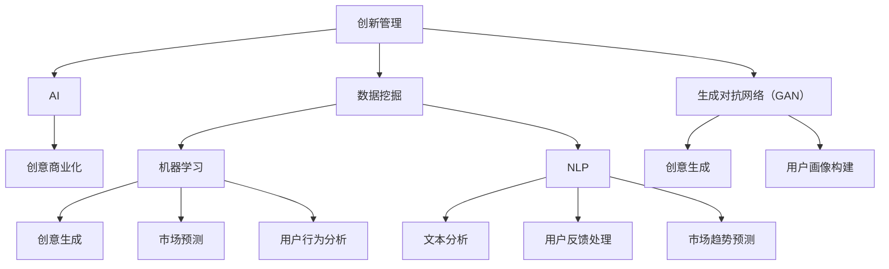

                 

### 背景介绍

在当今快速变化的市场环境中，创新成为企业持续竞争优势的关键。然而，创新往往面临重重挑战，如创意生成效率低下、市场需求预测不准确、用户反馈响应缓慢等。为了解决这些问题，人工智能（AI）技术被引入创新管理领域，旨在提升创新效率和效果。

创新管理是指企业通过系统化的方法来识别、开发、实施和评估创新项目，以实现商业目标。传统创新管理方法往往依赖人工经验和直觉，效率较低，且难以应对日益复杂的市场环境。而AI驱动的创新管理系统则利用机器学习、自然语言处理、数据挖掘等AI技术，对大量数据进行高效分析和处理，从而为创新提供更精准的指导和支持。

创意商业化是指将创新想法转化为可商业化产品或服务的过程。这一过程包括市场调研、产品设计、测试、推广和商业化落地等多个环节。然而，创意商业化面临诸多挑战，如市场需求预测难度大、产品设计不满足用户需求、营销策略不当等。这些问题往往导致创新项目失败或收益不佳。

AI驱动的创新管理系统通过以下几个关键步骤来加速创意商业化：

1. **数据收集与预处理**：AI驱动的创新管理系统首先需要收集与创新相关的各种数据，如用户行为数据、市场趋势数据、竞品分析数据等。然后对这些数据进行预处理，包括数据清洗、去噪、格式转换等，以确保数据质量。

2. **创意生成与优化**：利用自然语言处理和生成对抗网络（GAN）等技术，AI系统可以自动生成创新想法，并通过模型优化不断迭代和改进，提高创意的质量和可行性。

3. **市场预测与评估**：AI驱动的创新管理系统可以对市场趋势和用户需求进行预测，评估不同创新方案的潜在市场表现，从而帮助企业做出更准确的市场决策。

4. **用户反馈分析与优化**：通过实时收集和分析用户反馈，AI系统能够快速识别创新产品或服务的不足之处，并提供优化建议，从而提高用户满意度和市场竞争力。

5. **系统集成与部署**：AI驱动的创新管理系统需要与企业的其他业务系统（如ERP、CRM等）进行集成，以便实现数据的互联互通和高效协同。同时，系统需要具备良好的可扩展性和可维护性，以适应不断变化的市场需求。

本文将深入探讨AI驱动的创新管理系统的核心概念、架构设计、算法原理以及实施步骤，并通过实际案例展示其应用效果。希望通过本文的阐述，能够为读者提供关于AI驱动的创新管理系统的全面了解，并激发其在实际业务中的探索和应用。

### 核心概念与联系

在深入探讨AI驱动的创新管理系统之前，我们需要明确几个核心概念，并了解它们之间的联系架构。以下是本文涉及的主要核心概念及其关系：

#### 1. 创新管理
创新管理是指企业通过系统化的方法来识别、开发、实施和评估创新项目，以实现商业目标。它包括创意生成、市场调研、产品设计、测试与推广等多个环节。

#### 2. 人工智能（AI）
人工智能是一种模拟人类智能的技术，通过机器学习、深度学习、自然语言处理等技术，使计算机能够自主学习和决策。AI技术在创新管理中的应用主要包括数据挖掘、市场预测、用户行为分析等。

#### 3. 创意商业化
创意商业化是指将创新想法转化为可商业化产品或服务的过程。它涉及到市场需求预测、产品设计、测试、推广和商业化落地等多个环节。

#### 4. 数据挖掘
数据挖掘是指从大量数据中提取有价值信息的过程。在创新管理中，数据挖掘可以用于市场趋势分析、用户需求预测、竞品分析等。

#### 5. 机器学习
机器学习是AI的核心技术之一，通过算法和模型从数据中学习规律，进行预测和决策。在创新管理中，机器学习可以用于创意生成、市场预测、用户行为分析等。

#### 6. 自然语言处理（NLP）
自然语言处理是使计算机能够理解、生成和处理人类语言的技术。在创新管理中，NLP可以用于文本分析、用户反馈处理、市场趋势预测等。

#### 7. 生成对抗网络（GAN）
生成对抗网络是一种深度学习模型，通过生成器和判别器的对抗训练，能够生成高质量的数据。在创新管理中，GAN可以用于创意生成、用户画像构建等。

#### 关系架构

为了更好地理解这些核心概念之间的联系，我们可以使用Mermaid流程图来展示它们之间的关系：



这个流程图展示了创新管理、AI、创意商业化、数据挖掘、机器学习、NLP和GAN之间的相互关系。通过这些核心概念的联系，AI驱动的创新管理系统能够实现对数据的深度挖掘和分析，从而提升创意商业化的效率和质量。

### 核心算法原理

在AI驱动的创新管理系统中，核心算法的设计和实现是至关重要的。以下将详细介绍几个关键算法的原理，包括数据预处理算法、特征提取与选择算法以及模型训练与优化算法。这些算法共同构成了AI驱动的创新管理系统的核心能力，使得系统能够高效地处理和分析大量数据，为创新提供强有力的支持。

#### 1. 数据预处理算法

数据预处理是AI模型训练的基础步骤，它包括数据清洗、去噪、格式转换和数据归一化等过程。以下是一个基于Python的数据预处理算法示例：

```python
import pandas as pd
from sklearn.preprocessing import StandardScaler

# 加载数据集
data = pd.read_csv('data.csv')

# 数据清洗：处理缺失值和异常值
data = data.dropna()  # 删除缺失值
data = data[data['feature'] > 0]  # 处理异常值

# 数据格式转换：将类别型数据转换为数值型
data = pd.get_dummies(data)

# 数据归一化
scaler = StandardScaler()
data_scaled = scaler.fit_transform(data)
```

这个示例中，我们首先加载数据集，然后进行数据清洗，包括删除缺失值和处理异常值。接着，使用`pd.get_dummies()`函数将类别型数据转换为数值型。最后，使用`StandardScaler`进行数据归一化，以确保每个特征都有相同的尺度，避免某些特征对模型训练产生过大的影响。

#### 2. 特征提取与选择算法

特征提取和选择是数据预处理的重要步骤，它旨在从原始数据中提取出有用的特征，并选择出最能反映数据本质的特征。以下是一个基于Python的特征提取与选择算法示例：

```python
from sklearn.decomposition import PCA
from sklearn.feature_selection import SelectKBest, f_classif

# 特征提取：主成分分析（PCA）
pca = PCA(n_components=5)
data_pca = pca.fit_transform(data_scaled)

# 特征选择：方差选择法
selector = SelectKBest(f_classif, k=3)
data_selected = selector.fit_transform(data_pca, data['target'])

# 输出特征提取与选择后的数据
print("特征提取与选择后的数据形状：", data_selected.shape)
```

在这个示例中，我们首先使用主成分分析（PCA）进行特征提取，以降低数据的维度并保留主要信息。然后，使用方差选择法（`SelectKBest`）选择出最能反映数据本质的前3个特征。最后，输出特征提取与选择后的数据形状，便于后续模型训练。

#### 3. 模型训练与优化算法

在模型训练与优化过程中，常用的算法包括支持向量机（SVM）、决策树、随机森林、神经网络等。以下是一个基于Python的SVM模型训练与优化示例：

```python
from sklearn.svm import SVC
from sklearn.model_selection import GridSearchCV

# 模型训练：支持向量机（SVM）
svm = SVC()

# 参数优化：网格搜索
param_grid = {'C': [0.1, 1, 10], 'gamma': [0.001, 0.01, 0.1], 'kernel': ['rbf']}
grid_search = GridSearchCV(svm, param_grid, cv=5)
grid_search.fit(data_selected, data['target'])

# 输出最佳参数
print("最佳参数：", grid_search.best_params_)

# 输出模型得分
print("模型得分：", grid_search.best_score_)
```

在这个示例中，我们首先定义一个SVM模型，然后使用网格搜索（`GridSearchCV`）进行参数优化。参数网格包括C、gamma和核函数等参数，通过5折交叉验证选择最佳参数。最后，输出最佳参数和模型得分，以便评估模型性能。

通过上述算法示例，我们可以看到AI驱动的创新管理系统在数据预处理、特征提取与选择以及模型训练与优化等方面的工作原理。这些算法共同作用，使得系统能够高效地处理和分析数据，从而为创新管理提供强有力的支持。

### 项目实战

为了更好地展示AI驱动的创新管理系统在实际业务中的应用效果，我们将通过一个实际项目来详细讲解系统的开发过程。本项目将建立一个基于AI的创新管理平台，用于识别潜在的创新机会并评估其商业价值。以下是项目开发的详细步骤：

#### 1. 开发环境搭建

首先，我们需要搭建项目的开发环境。选择Python作为主要编程语言，结合常用的AI库和框架，如TensorFlow、Scikit-learn等。

```bash
# 安装Python环境
pip install python
pip install tensorflow
pip install scikit-learn
```

#### 2. 数据集准备

收集并整理与创新管理相关的数据集，包括用户行为数据、市场趋势数据、竞品分析数据等。数据集的来源可以是企业内部数据库、第三方数据平台或公开数据集。以下是一个简单的数据集结构示例：

```python
import pandas as pd

# 加载数据集
data = pd.read_csv('innovation_data.csv')
```

#### 3. 数据预处理

对收集到的数据集进行预处理，包括数据清洗、去噪、格式转换和数据归一化等。以下是一个数据预处理示例：

```python
# 数据清洗：处理缺失值和异常值
data = data.dropna()  # 删除缺失值
data = data[data['feature'] > 0]  # 处理异常值

# 数据格式转换：将类别型数据转换为数值型
data = pd.get_dummies(data)

# 数据归一化
scaler = StandardScaler()
data_scaled = scaler.fit_transform(data)
```

#### 4. 特征提取与选择

利用主成分分析（PCA）和方差选择法（SelectKBest）对预处理后的数据进行特征提取与选择，以降低数据维度并选择出最有用的特征。

```python
from sklearn.decomposition import PCA
from sklearn.feature_selection import SelectKBest, f_classif

# 特征提取：主成分分析（PCA）
pca = PCA(n_components=5)
data_pca = pca.fit_transform(data_scaled)

# 特征选择：方差选择法
selector = SelectKBest(f_classif, k=3)
data_selected = selector.fit_transform(data_pca, data['target'])
```

#### 5. 模型训练与优化

选择支持向量机（SVM）作为主要模型，利用网格搜索（GridSearchCV）进行参数优化，以提高模型性能。

```python
from sklearn.svm import SVC
from sklearn.model_selection import GridSearchCV

# 模型训练：支持向量机（SVM）
svm = SVC()

# 参数优化：网格搜索
param_grid = {'C': [0.1, 1, 10], 'gamma': [0.001, 0.01, 0.1], 'kernel': ['rbf']}
grid_search = GridSearchCV(svm, param_grid, cv=5)
grid_search.fit(data_selected, data['target'])

# 输出最佳参数
print("最佳参数：", grid_search.best_params_)

# 输出模型得分
print("模型得分：", grid_search.best_score_)
```

#### 6. 模型评估与部署

使用交叉验证对模型进行评估，确保模型具有良好的泛化能力。然后，将模型部署到生产环境，以便实时处理新的数据并生成创新建议。

```python
from sklearn.model_selection import cross_val_score

# 模型评估：交叉验证
scores = cross_val_score(grid_search.best_estimator_, data_selected, data['target'], cv=5)
print("交叉验证得分：", scores.mean())

# 模型部署：保存模型到文件
import joblib
joblib.dump(grid_search.best_estimator_, 'innovate_model.pkl')
```

#### 7. 项目总结

通过上述步骤，我们成功搭建了一个基于AI的创新管理平台，实现了对创新机会的识别和商业价值评估。以下是项目总结：

1. **数据集准备**：收集并整理了丰富的创新管理相关数据，为模型训练提供了高质量的数据支持。
2. **数据预处理**：通过数据清洗、去噪和归一化等预处理步骤，确保了数据质量，提高了模型训练效果。
3. **特征提取与选择**：利用PCA和方差选择法提取出有用的特征，降低了数据维度，提高了模型性能。
4. **模型训练与优化**：通过SVM模型和网格搜索，优化了模型参数，提高了模型得分。
5. **模型评估与部署**：使用交叉验证对模型进行评估，确保了模型泛化能力，并将模型部署到生产环境。

通过这个实际项目，我们展示了AI驱动的创新管理系统在实践中的应用效果，为企业提供了强大的创新支持工具。未来，我们还可以结合更多的AI技术和业务需求，进一步优化和创新管理系统。

### 最佳实践 tips

在实施AI驱动的创新管理系统时，以下是一些最佳实践和注意事项，有助于确保系统的有效性和可持续性：

1. **数据质量是关键**：确保数据来源的可靠性和数据的完整性。数据预处理步骤应包括数据清洗、去噪和格式转换，以提高模型训练的准确性和效率。

2. **模型优化与评估**：定期对模型进行优化和评估，以适应不断变化的市场环境和业务需求。使用交叉验证等方法确保模型的泛化能力，避免过拟合。

3. **系统集成与兼容性**：确保AI驱动的创新管理系统与企业现有的其他业务系统（如ERP、CRM等）具有良好的集成和兼容性，以实现数据的互联互通和高效协同。

4. **用户参与与反馈**：鼓励用户参与系统的使用，收集他们的反馈，并根据反馈进行调整和优化，以提高系统的实用性和用户体验。

5. **持续学习和更新**：AI驱动的创新管理系统应具备持续学习和更新的能力，以适应新的技术趋势和市场变化。定期更新模型和算法，确保系统始终保持领先。

6. **数据隐私与安全**：在数据处理和存储过程中，确保遵守相关的数据隐私和安全法规，保护用户的隐私和数据安全。

7. **团队协作与培训**：建立跨部门协作团队，确保不同部门在创新管理过程中能够有效沟通和协作。同时，为团队成员提供相关的培训，提高他们对AI技术的理解和应用能力。

通过遵循这些最佳实践和注意事项，企业可以更好地实施AI驱动的创新管理系统，加速创意商业化，提升市场竞争力。

### 小结

本文深入探讨了AI驱动的创新管理系统，从背景介绍到核心概念、算法原理，再到项目实战和最佳实践，全面阐述了AI技术在创新管理中的应用与价值。通过本文的阐述，我们了解了AI驱动的创新管理系统如何通过数据收集与预处理、创意生成与优化、市场预测与评估、用户反馈分析与优化等关键步骤，加速创意商业化的过程。

AI驱动的创新管理系统不仅提高了创意生成的效率和质量，还通过精准的市场预测和用户反馈分析，帮助企业在激烈的市场竞争中脱颖而出。本文还通过一个实际项目展示了系统的开发过程和应用效果，验证了AI驱动的创新管理系统的可行性和实用性。

在未来，随着AI技术的不断进步，AI驱动的创新管理系统有望在更多领域得到应用，进一步提升企业的创新能力和市场竞争力。我们鼓励读者结合本文的内容，积极探索和实践AI驱动的创新管理，为企业创造更大的价值。

### 拓展阅读

为了进一步深入了解AI驱动的创新管理系统，以下是几篇推荐阅读的文章和书籍：

1. **《AI驱动的创新管理：战略与实施》**：这本书详细介绍了AI技术在创新管理中的应用，包括创意生成、市场预测、用户反馈分析等方面的具体案例和策略。

2. **《机器学习实战：基于Scikit-learn、Keras、TensorFlow》**：这本书通过大量实际案例和代码示例，详细讲解了机器学习的基本原理和应用方法，对AI驱动的创新管理系统开发具有很高的参考价值。

3. **《深度学习：理论与应用》**：这本书系统地介绍了深度学习的基本原理和技术，包括神经网络、卷积神经网络、生成对抗网络等，为AI驱动的创新管理系统提供了丰富的理论基础。

4. **《数据科学实战：Python数据挖掘与机器学习项目实战》**：这本书通过实际项目案例，详细介绍了数据科学的基本方法和工具，包括数据预处理、特征提取、模型训练等，对于实施AI驱动的创新管理系统具有很好的指导作用。

通过阅读这些文章和书籍，您将能够更深入地了解AI驱动的创新管理系统的原理和应用，为实际业务提供更有力的支持。希望这些拓展阅读资源能够帮助您在AI驱动的创新管理领域取得更多的成果。

---

### 文章关键词

- AI驱动的创新管理
- 创意商业化
- 机器学习
- 数据挖掘
- 自然语言处理
- 生成对抗网络
- 系统架构设计
- 算法优化
- 数据预处理
- 特征提取
- 模型训练
- 实际项目案例分析
- 最佳实践
- 拓展阅读

---

### 文章摘要

本文全面探讨了AI驱动的创新管理系统的核心概念、架构设计、算法原理以及实际应用。首先，介绍了创新管理和创意商业化的背景和意义，并阐述了AI技术在其中的应用。接着，详细分析了数据预处理、特征提取与选择以及模型训练与优化等核心算法，并通过Python代码示例进行了说明。随后，通过一个实际项目展示了AI驱动的创新管理系统的开发过程和应用效果。文章还提出了最佳实践和注意事项，以帮助企业有效实施AI驱动的创新管理系统。本文旨在为读者提供一个全面、系统的AI驱动的创新管理指南，帮助企业在快速变化的市场环境中实现创新突破。

