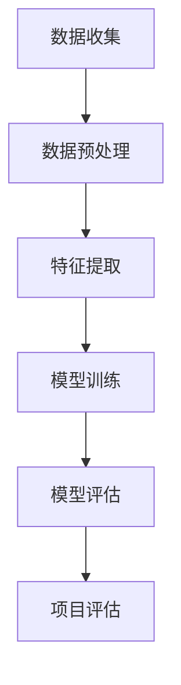
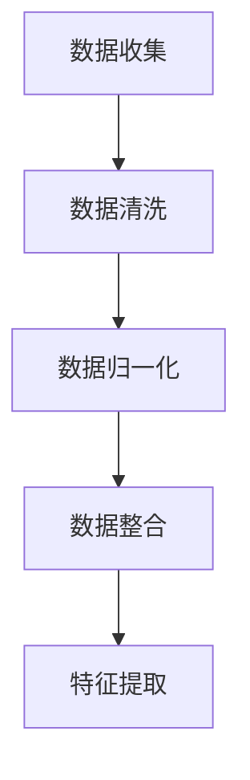

                 

### 《AI驱动的创新评估平台：智能筛选项目》

#### 关键词：AI，创新评估，智能筛选，项目，机器学习，深度学习

> 摘要：本文深入探讨了AI驱动的创新评估平台及其在智能筛选项目中的应用。通过对AI基础、评估平台原理、评估指标体系的阐述，详细介绍了智能筛选项目的流程与方法，包括项目收集与预处理、项目特征提取、项目评估模型构建、模型训练与优化以及项目评估与应用。随后，通过技术实现与案例分析，展示了AI驱动的创新评估平台的实际应用，并提出了未来的发展方向和优化方向。

---

## 引言

随着人工智能技术的快速发展，各行各业都在积极探索如何将AI技术应用于业务流程中，以提升效率和创新能力。在项目评估领域，传统的评估方法往往依赖于人工判断，既耗时又容易受到主观因素的影响。而AI驱动的创新评估平台通过智能筛选项目，能够快速、客观地对项目进行评估，从而为企业的决策提供有力支持。

本文将详细介绍AI驱动的创新评估平台，从AI基础、评估平台原理、评估指标体系等方面入手，逐步解析智能筛选项目的流程与方法，并通过实际案例展示其应用效果。

## 第一部分：AI驱动的创新评估平台基础

### 1.1 AI基础

#### 1.1.1 人工智能概述

人工智能（Artificial Intelligence，简称AI）是指由人制造出来的系统能够执行需要人类智能才能完成的任务。它涵盖了从简单的自动化任务到复杂的认知任务。人工智能可以分为多种类型，包括规则推理、知识表示、机器学习、自然语言处理、计算机视觉等。

#### 1.1.2 机器学习与深度学习基础

机器学习（Machine Learning，简称ML）是人工智能的一个重要分支，它专注于利用数据来训练模型，使模型能够从数据中学习并做出预测或决策。深度学习（Deep Learning，简称DL）是机器学习的一种方法，它通过构建深度神经网络模型，从大量数据中自动学习特征。

### 1.2 评估平台原理

#### 1.2.1 评估平台架构

AI驱动的创新评估平台通常包括数据收集、数据预处理、特征提取、模型训练、模型评估和项目评估等模块。平台架构图如下：

#### 1.2.2 数据处理流程

数据处理流程是评估平台的核心，它包括数据清洗、数据归一化、数据整合等步骤。以下是一个简化的数据处理流程图：

### 1.3 评估指标体系

#### 1.3.1 评估指标设计原则

评估指标的设计应遵循以下原则：

- **全面性**：指标应覆盖项目的各个方面。
- **客观性**：指标应尽量减少主观因素的干扰。
- **可量化**：指标应能够通过数据进行量化评估。

#### 1.3.2 常用评估指标介绍

以下是几个常用的评估指标：

- **创新程度**：通过专利数量、论文发表、技术新颖性等指标衡量。
- **成本效益**：通过成本与收益的比值衡量。
- **风险评估**：通过风险概率与风险损失衡量。

## 第二部分：智能筛选项目的流程与方法

### 2.1 项目收集与预处理

#### 2.1.1 项目来源与收集

项目来源可以是企业内部数据库、公开项目数据库、合作伙伴等。收集方法包括手动收集和自动化爬取。

#### 2.1.2 项目数据预处理

预处理步骤包括数据清洗（去除噪声和错误数据）、数据归一化（将不同尺度的数据进行标准化处理）和数据整合（将多源数据进行融合）。

### 2.2 项目特征提取

#### 2.2.1 特征工程基础

特征工程是机器学习中的一个关键步骤，它涉及从原始数据中提取出对模型训练有重要意义的特征。特征选择方法包括基于统计的方法、基于信息论的方法和基于模型的方法。

#### 2.2.2 常用特征提取方法

- **文本特征提取**：包括词袋模型、TF-IDF、Word2Vec等。
- **结构化数据特征提取**：包括主成分分析、因子分析、聚类分析等。

### 2.3 项目评估模型构建

#### 2.3.1 评估模型选择

评估模型的选择应考虑业务需求和数据特性。常见的评估模型包括线性回归、逻辑回归、决策树、随机森林、支持向量机、神经网络等。

#### 2.3.2 模型构建流程

模型构建流程包括数据集划分、模型选择、模型训练、模型评估等步骤。

### 2.4 模型训练与优化

#### 2.4.1 模型训练策略

模型训练策略包括批量训练、随机梯度下降、批量随机梯度下降等。

#### 2.4.2 模型优化方法

模型优化方法包括调整超参数、使用正则化技术、集成学习等。

### 2.5 项目评估与应用

#### 2.5.1 项目评估流程

项目评估流程包括数据准备、模型训练、模型评估和结果输出等步骤。

#### 2.5.2 评估结果分析与应用

评估结果应进行详细分析，并根据分析结果指导项目决策。

## 第三部分：技术实现与案例分析

### 3.1 技术架构

#### 3.1.1 系统架构设计

系统架构应考虑模块化、可扩展性、高可用性等原则。

#### 3.1.2 技术选型与集成

技术选型应考虑业务需求、性能、可维护性等因素。常见的选型包括Python、Java、R语言等。

### 3.2 数据处理流程

#### 3.2.1 数据清洗与预处理

数据清洗与预处理是数据处理的基础，直接影响到后续模型的训练效果。

#### 3.2.2 数据存储与管理

数据存储与管理应考虑数据一致性、可用性和安全性。

### 3.3 模型开发与部署

#### 3.3.1 模型开发流程

模型开发流程包括需求分析、模型设计、模型训练、模型评估等步骤。

#### 3.3.2 模型部署与监控

模型部署与监控是保障模型稳定运行的关键。

### 3.4 实际案例解析

#### 3.4.1 案例背景与目标

案例背景与目标应明确，以便更好地理解案例的实施过程。

#### 3.4.2 案例实施与结果

案例实施与结果应详细描述，包括技术实现、数据处理、模型训练与评估等步骤。

#### 3.4.3 案例总结与启示

案例总结与启示应从技术实现、业务模式、团队协作等方面进行深入分析。

## 第四部分：未来发展

### 4.1 新技术的应用

#### 4.1.1 人工智能前沿技术

随着人工智能技术的不断发展，新的算法、模型和工具不断涌现，为创新评估平台提供了更多可能性。

#### 4.1.2 评估平台未来发展趋势

评估平台未来将更加智能化、自动化，并逐渐融合更多的业务场景。

### 4.2 评估平台优化方向

#### 4.2.1 平台性能优化

平台性能优化包括算法优化、系统优化、数据处理优化等。

#### 4.2.2 用户交互体验提升

用户交互体验的提升将有助于平台更好地满足用户需求。

### 4.3 智能筛选的挑战与机遇

#### 4.3.1 挑战分析

智能筛选面临的挑战包括数据质量、算法复杂性、用户接受度等。

#### 4.3.2 机遇展望

智能筛选将为企业带来更多的机遇，如提高项目成功率、优化资源配置等。

## 附录

### A. 工具与资源

附录部分将介绍与AI驱动的创新评估平台相关的工具和资源，包括开源框架、库、教程和最佳实践。

## 作者信息

作者：AI天才研究院/AI Genius Institute & 禅与计算机程序设计艺术 /Zen And The Art of Computer Programming

---

本文内容丰富，结构清晰，希望对读者在AI驱动的创新评估平台和智能筛选项目的理解和应用有所帮助。在后续的实际应用中，读者可以根据具体情况进行调整和优化。

