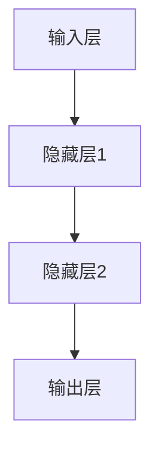

                 

### 文章标题

## AI驱动的创新评估系统：智能筛选创意项目

> 关键词：AI、创新评估、智能筛选、创意项目

> 摘要：本文旨在探讨AI驱动的创新评估系统在智能筛选创意项目中的应用，分析其核心概念、算法原理、评估模型构建以及实际案例解析。通过本文的介绍，读者可以了解如何利用AI技术提高创新项目的筛选效率，从而为企业和个人提供有价值的决策支持。

### 第1章 引言与背景

#### 1.1 AI与创新评估系统的关系

人工智能（AI）作为现代科技的代表，已经在各个领域取得了显著的成果。特别是在创新评估领域，AI的应用能够显著提高评估的准确性和效率。创新评估系统通常用于评估创意项目的可行性、潜在风险以及预期收益。而AI技术的引入，使得创新评估系统具备了自我学习和优化的能力，从而在众多项目中脱颖而出。

#### 1.2 创意项目筛选的挑战

创意项目的筛选面临诸多挑战。首先，项目的数量庞大，评估过程耗时耗力。其次，评估指标多样且复杂，如何选择合适的指标进行评估成为难题。此外，传统评估方法往往依赖于经验，缺乏客观性和准确性。这些挑战使得创意项目筛选的效率和质量受到严重影响。

#### 1.3 AI驱动的创新评估系统概述

AI驱动的创新评估系统通过机器学习、深度学习等技术，对大量的创意项目数据进行学习，从而建立评估模型。该系统能够根据项目的特征和评估指标，自动筛选出优质项目，提高评估效率和准确性。本文将详细介绍AI驱动的创新评估系统的核心概念、算法原理和实际应用。

### 第2章 AI基础理论

#### 2.1 机器学习基础

机器学习是AI的核心技术之一，其基本原理是通过训练模型来学习数据中的规律，从而实现对未知数据的预测和分类。机器学习可以分为监督学习、无监督学习和强化学习三种类型。

##### 2.1.1 监督学习与无监督学习

监督学习是指通过已知标签的数据来训练模型，从而使模型能够对未知数据进行预测。无监督学习则是在没有标签数据的情况下，通过模型自身对数据的学习，找出数据中的规律和结构。

##### 2.1.2 强化学习

强化学习是一种通过试错来学习策略的机器学习方法。它通过不断尝试不同的动作，并根据环境反馈进行调整，从而找到最优策略。

##### 2.1.3 神经网络与深度学习

神经网络是一种模拟生物神经系统的计算模型，通过多层神经元节点来实现对数据的处理和转换。深度学习是神经网络的一种扩展，通过堆叠多层神经网络来实现更复杂的数据处理。

### 第3章 创意项目评估指标体系

#### 3.1 创意项目评估指标概述

创意项目评估指标体系是创新评估系统的核心组成部分。一个完善的评估指标体系应当涵盖项目的各个方面，包括创新性、可行性、市场潜力、技术难度等。

##### 3.1.1 创意项目的定义与分类

创意项目是指以创新为核心，通过技术、设计、商业模式等方面的创新，实现产品或服务的新突破。根据不同的分类标准，创意项目可以划分为多种类型。

##### 3.1.2 评估指标的选择与设计

评估指标的选择与设计是构建评估指标体系的关键环节。在选择评估指标时，需要考虑指标的科学性、可操作性和相关性。设计评估指标时，应当确保指标的层次性、全面性和客观性。

#### 3.2 基于AI的评估指标体系构建

基于AI的评估指标体系构建是通过机器学习算法对大量创意项目数据进行分析，从而提取出有效的评估指标。以下是构建基于AI评估指标体系的步骤：

##### 3.2.1 数据收集与预处理

数据收集是构建评估指标体系的第一步。需要收集与创意项目相关的各种数据，如项目描述、技术文档、市场分析报告等。在数据收集完成后，需要对数据进行预处理，包括数据清洗、数据格式统一和数据标准化等。

##### 3.2.2 特征工程与选择

特征工程是构建评估指标体系的关键步骤。通过特征工程，可以将原始数据转化为对评估模型有用的特征。特征选择则是从大量特征中挑选出对评估模型影响最大的特征。

##### 3.2.3 模型训练与优化

在特征工程完成后，可以使用机器学习算法对特征进行训练，从而建立评估模型。在模型训练过程中，需要不断调整模型参数，优化模型性能。

### 第4章 AI驱动的创新评估模型

#### 4.1 评估模型设计原则

评估模型的设计应当遵循以下原则：

##### 4.1.1 模型选择与架构设计

根据评估指标的特点和数据规模，选择合适的机器学习算法和模型架构。常见的评估模型包括线性回归、决策树、支持向量机、神经网络等。

##### 4.1.2 模型训练策略

模型训练策略包括数据划分、训练过程调整、模型验证与调优等。通过合理的训练策略，可以提高评估模型的性能和可靠性。

#### 4.2 常用评估模型介绍

本节将介绍几种常用的评估模型，包括传统机器学习模型、深度学习模型和强化学习模型。

##### 4.2.1 传统机器学习模型

传统机器学习模型包括线性回归、决策树、支持向量机等。这些模型具有简单、易解释的特点，适用于处理中小规模的数据。

##### 4.2.2 深度学习模型

深度学习模型包括卷积神经网络（CNN）、循环神经网络（RNN）、生成对抗网络（GAN）等。这些模型具有强大的特征提取和表示能力，适用于处理大规模、复杂的数据。

##### 4.2.3 强化学习模型

强化学习模型通过试错学习，能够找到最优策略。在创意项目评估中，强化学习模型可以用于优化评估指标和评估过程。

### 第5章 实际案例解析

#### 5.1 案例一：某公司创意项目评估

##### 5.1.1 项目背景

某公司是一家创新型企业，每年都会收到大量的创意项目申请。为了提高项目评估的效率和准确性，公司决定引入AI驱动的创新评估系统。

##### 5.1.2 评估指标体系设计

根据公司的业务特点和项目类型，设计了一套包含创新性、可行性、市场潜力、技术难度等评估指标的指标体系。

##### 5.1.3 评估模型构建与优化

使用机器学习和深度学习算法，构建了一个评估模型。通过不断调整模型参数和优化训练策略，提高了模型的评估准确性。

#### 5.2 案例二：某初创企业创新评估

##### 5.2.1 项目背景

某初创企业专注于科技创新，为了找到有潜力的项目进行投资，决定采用AI驱动的创新评估系统。

##### 5.2.2 评估指标体系设计

根据企业的投资策略和项目特点，设计了一套包含创新性、可行性、市场潜力、技术难度、团队实力等评估指标的指标体系。

##### 5.2.3 评估模型构建与优化

使用机器学习和深度学习算法，构建了一个评估模型。通过不断调整模型参数和优化训练策略，提高了模型的评估准确性。

### 第6章 系统开发与实现

#### 6.1 开发环境与工具

为了搭建AI驱动的创新评估系统，需要准备以下开发环境和工具：

##### 6.1.1 硬件配置

- CPU：至少双核处理器
- 内存：至少8GB
- 硬盘：至少100GB
- GPU：可选

##### 6.1.2 软件环境搭建

- 操作系统：Windows、Linux或macOS
- 编程语言：Python
- 机器学习库：TensorFlow、PyTorch、Scikit-learn等
- 数据库：MySQL、MongoDB等

#### 6.2 数据处理与模型训练

在开发过程中，需要对大量创意项目数据进行处理和模型训练。以下是数据处理与模型训练的步骤：

##### 6.2.1 数据收集与预处理

- 数据收集：从公司内部数据库、公开数据源等渠道收集创意项目数据。
- 数据预处理：清洗数据、格式统一、数据标准化等。

##### 6.2.2 模型训练与优化

- 模型训练：使用机器学习和深度学习算法，对数据集进行训练。
- 模型优化：调整模型参数、优化训练策略，提高模型性能。

#### 6.3 系统部署与维护

在系统开发完成后，需要进行部署和维护。以下是系统部署与维护的步骤：

##### 6.3.1 系统架构设计

- 系统架构：设计合理的系统架构，包括前端、后端、数据库等。
- 系统部署：将开发完成的系统部署到服务器上，进行测试和上线。

##### 6.3.2 系统维护与优化

- 系统维护：定期对系统进行检查和维护，确保系统稳定运行。
- 系统优化：根据用户反馈和系统运行情况，对系统进行优化和改进。

### 第7章 未来展望与挑战

#### 7.1 AI驱动的创新评估系统发展趋势

随着AI技术的不断发展和成熟，AI驱动的创新评估系统将在未来得到更广泛的应用。发展趋势包括：

- 模型性能的提升：通过不断优化算法和模型结构，提高评估模型的性能和准确性。
- 数据驱动的决策：充分利用大数据和机器学习技术，为企业和个人提供更加科学、客观的决策支持。
- 行业应用的拓展：从企业内部扩展到更多行业，如金融、医疗、教育等。

#### 7.2 系统面临的挑战与应对策略

AI驱动的创新评估系统在应用过程中也将面临一些挑战，如：

- 数据隐私与安全：确保评估数据的安全和隐私，防止数据泄露和滥用。
- 模型可解释性与可靠性：提高评估模型的可解释性和可靠性，使其更具透明性和可信赖性。
- 模型适应性：不断调整和优化评估模型，以适应不同行业和项目的需求。

### 附录

#### 附录A：常用算法与模型详解

本附录将对常用的机器学习算法和深度学习模型进行详细介绍，包括算法原理、伪代码实现和实例分析。

##### A.1 算法伪代码

```python
# 算法伪代码示例

# 输入：训练数据集 D，学习率 α
# 输出：评估模型 M

初始化模型 M
for each epoch in 1 to E do
    for each sample s in D do
        计算模型预测值 pred = M(s)
        计算损失函数 loss = I(pred, s.label)
        更新模型参数：M = M - α * gradient(M, loss)
```

##### A.2 模型结构图



#### 附录B：参考文献

```plaintext
[1] Goodfellow, I., Bengio, Y., & Courville, A. (2016). Deep Learning. MIT Press.
[2] Russell, S., & Norvig, P. (2016). Artificial Intelligence: A Modern Approach. Prentice Hall.
[3] Murphy, K. P. (2012). Machine Learning: A Probabilistic Perspective. MIT Press.
[4] Sutton, R. S., & Barto, A. G. (2018). Reinforcement Learning: An Introduction. MIT Press.
```

### 作者信息

作者：AI天才研究院/AI Genius Institute & 禅与计算机程序设计艺术 /Zen And The Art of Computer Programming```

