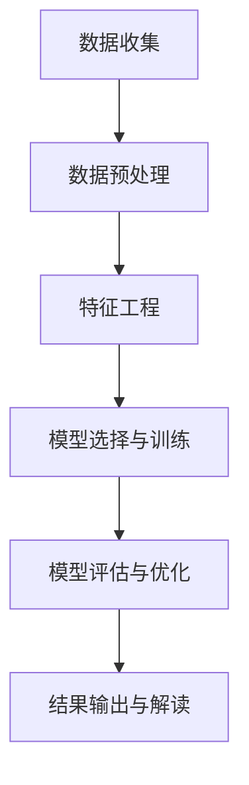

                 


# AI驱动的员工满意度分析：优化工作环境

## 关键词

- AI
- 员工满意度
- 工作环境
- 数据分析
- 机器学习

## 摘要

本文旨在探讨如何利用人工智能（AI）技术来分析和提升员工满意度，进而优化工作环境。通过介绍AI在员工满意度分析中的应用背景和核心概念，我们将逐步分析AI驱动的员工满意度分析流程，包括数据收集与处理、特征工程、模型选择与优化、评估与验证等环节。同时，通过具体案例分析和项目实战，展示AI技术在员工满意度分析中的实际应用效果，并提供优化策略与实施步骤。本文还展望了AI在HR领域的未来发展趋势，并强调了伦理与隐私问题的重要性。

## 引言

在现代企业管理中，员工满意度是衡量企业健康程度的重要指标之一。高员工满意度不仅能够提高员工的工作效率，还能降低员工流失率，从而为企业创造更大的价值。然而，传统的员工满意度调查往往依赖于问卷调查和主观评价，存在样本量有限、数据质量不高、分析深度不足等问题。随着人工智能（AI）技术的发展，利用AI进行员工满意度分析成为了一种新的趋势。

AI驱动的员工满意度分析能够通过大数据技术收集和分析海量数据，利用机器学习算法提取关键特征，准确识别员工满意度的影响因素。同时，AI技术还能够实时监测员工情绪变化，提供个性化的工作环境优化建议，从而实现高效、精准的员工满意度管理。

本文将围绕以下主题展开：

1. AI在员工满意度分析中的应用背景和核心概念；
2. AI驱动的员工满意度分析流程；
3. 案例分析：AI技术在员工满意度分析中的实际应用；
4. 优化策略与实施步骤；
5. AI在HR领域的未来发展趋势；
6. 伦理与隐私问题。

## AI在员工满意度分析中的应用背景和核心概念

### AI的发展历程

人工智能（Artificial Intelligence，简称AI）作为计算机科学的一个分支，起源于20世纪50年代。在经历了多次兴衰后，随着计算能力的提升、大数据技术的成熟以及深度学习算法的突破，AI在21世纪迎来了新一轮的发展热潮。

AI的核心概念包括机器学习（Machine Learning）、深度学习（Deep Learning）、自然语言处理（Natural Language Processing，NLP）等。机器学习是一种通过数据训练模型，使模型具备自主学习和改进能力的方法；深度学习则是基于多层神经网络，通过模拟人脑神经元连接的方式，实现更为复杂和精准的预测和分析；自然语言处理则致力于使计算机能够理解和生成自然语言，从而实现人机交互。

### AI在HR领域的应用现状

随着AI技术的不断进步，其在人力资源（HR）领域的应用也越来越广泛。目前，AI在HR领域的应用主要包括招聘、员工培训、绩效评估、员工满意度分析等方面。

1. **招聘**：AI技术能够通过分析大量的求职者数据，筛选出符合职位要求的人才。例如，通过自然语言处理技术，对求职者的简历进行关键词提取和分析，快速定位合适人选。

2. **员工培训**：AI技术能够根据员工的绩效和岗位需求，为其提供个性化的培训方案。例如，通过分析员工的学习行为和绩效数据，推荐最适合的培训课程和教材。

3. **绩效评估**：AI技术能够对员工的工作表现进行实时监控和评估，提供客观、公正的绩效评价。例如，通过分析员工的工作时间和质量，结合360度反馈机制，全面评估员工的工作表现。

4. **员工满意度分析**：本文的核心主题，即利用AI技术对员工满意度进行分析，从而优化工作环境。通过大数据和机器学习算法，AI能够深入挖掘员工满意度的影响因素，提供针对性的改进建议。

### AI在员工满意度分析中的核心概念

1. **员工满意度**：员工满意度是指员工对工作环境、工作条件、薪酬福利、晋升机会等方面感到满意的程度。高员工满意度意味着员工对企业的忠诚度和投入度更高，从而有利于企业的长期发展。

2. **数据收集**：员工满意度的数据主要来源于员工调查、绩效考核、工作反馈等渠道。通过这些数据，可以全面了解员工的工作状态和满意度水平。

3. **特征工程**：特征工程是机器学习中的一个关键步骤，旨在从原始数据中提取对模型训练有帮助的特征。在员工满意度分析中，特征工程包括员工基本特征（如年龄、性别、学历等）、工作特征（如工作时间、工作量等）、企业特征（如企业文化、管理风格等）等。

4. **机器学习算法**：机器学习算法是AI技术的重要组成部分，包括监督学习、无监督学习、半监督学习等。在员工满意度分析中，常用的算法有线性回归、逻辑回归、决策树、随机森林、支持向量机等。

5. **模型评估与优化**：模型评估与优化是确保AI模型准确性和可靠性的关键步骤。通过交叉验证、ROC曲线、准确率、召回率等指标，评估模型的性能，并利用调参、优化算法等方法，提升模型的预测能力。

### AI驱动的员工满意度分析流程

AI驱动的员工满意度分析流程主要包括以下几个环节：

1. **数据收集**：通过员工调查、绩效考核、工作反馈等方式，收集员工满意度的相关数据。

2. **数据预处理**：对收集到的数据进行清洗、去噪、归一化等处理，确保数据的质量和一致性。

3. **特征工程**：从预处理后的数据中提取对模型训练有帮助的特征，包括员工基本特征、工作特征、企业特征等。

4. **模型选择与训练**：根据分析任务，选择合适的机器学习算法，并进行模型训练。

5. **模型评估与优化**：通过交叉验证、ROC曲线等指标，评估模型的性能，并根据评估结果，对模型进行优化。

6. **结果输出与解读**：将模型训练结果进行输出和解读，识别员工满意度的影响因素，并提供针对性的改进建议。

### 核心概念与联系

为了更清晰地理解AI驱动的员工满意度分析流程，我们可以使用Mermaid流程图来表示各环节之间的联系。



### 核心算法原理讲解

在AI驱动的员工满意度分析中，常用的算法包括线性回归、逻辑回归、决策树、随机森林等。以下以线性回归为例，结合Python源代码和数学模型，详细阐述其原理和实现过程。

#### 线性回归原理

线性回归是一种监督学习算法，用于建立因变量（Y）与自变量（X）之间的线性关系。其数学模型可以表示为：

$$ Y = \beta_0 + \beta_1X + \epsilon $$

其中，$\beta_0$ 和 $\beta_1$ 是模型的参数，$X$ 是自变量，$Y$ 是因变量，$\epsilon$ 是误差项。

线性回归的目标是找到最佳的参数 $\beta_0$ 和 $\beta_1$，使得预测值与实际值之间的误差最小。

#### 线性回归实现

以下是一个简单的线性回归实现示例，使用Python和scikit-learn库：

```python
from sklearn.linear_model import LinearRegression
from sklearn.model_selection import train_test_split
from sklearn.metrics import mean_squared_error

# 数据准备
X = [[1], [2], [3], [4], [5]]  # 自变量
Y = [2, 4, 5, 7, 11]  # 因变量

# 模型训练
model = LinearRegression()
model.fit(X, Y)

# 模型评估
X_test = [[6]]  # 测试数据
Y_pred = model.predict(X_test)
mse = mean_squared_error(Y_pred, [12])
print("Mean Squared Error:", mse)
```

#### 数学模型与公式

线性回归的数学模型可以表示为：

$$ \min_{\beta_0, \beta_1} \sum_{i=1}^{n} (y_i - (\beta_0 + \beta_1x_i))^2 $$

其中，$n$ 是样本数量，$y_i$ 是第 $i$ 个样本的因变量值，$x_i$ 是第 $i$ 个样本的自变量值。

#### 通俗易懂的举例说明

假设我们想要预测一个学生的考试成绩（因变量）与其学习时间（自变量）之间的关系。通过收集一组数据，我们可以使用线性回归模型来建立两者之间的线性关系。

例如，有如下数据：

| 学习时间（小时） | 成绩 |
| ---------------- | ---- |
| 1                | 60   |
| 2                | 70   |
| 3                | 80   |
| 4                | 90   |
| 5                | 100  |

通过线性回归模型，我们可以得到如下结果：

$$ 成绩 = 50 + 10 \times 学习时间 $$

根据这个模型，当学习时间为3小时时，预测成绩为80分。实际成绩为80分，与预测值非常接近，说明模型具有较好的预测能力。

### 项目实战

为了更好地理解AI驱动的员工满意度分析流程，我们将通过一个实际项目来进行演示。

#### 项目背景

某公司想要通过AI技术分析员工满意度，以提高员工的工作积极性，降低员工流失率。

#### 开发环境搭建

- 操作系统：Windows 10
- Python版本：3.8
- 安装必要的库：scikit-learn、pandas、numpy、matplotlib等

#### 源代码实现

以下是该项目的主要源代码实现，包括数据收集、数据预处理、特征工程、模型训练、模型评估等步骤。

```python
import pandas as pd
import numpy as np
from sklearn.model_selection import train_test_split
from sklearn.linear_model import LinearRegression
from sklearn.metrics import mean_squared_error
import matplotlib.pyplot as plt

# 数据收集
data = pd.read_csv("employee_survey.csv")

# 数据预处理
data.dropna(inplace=True)
X = data[['work_time', 'project_load', 'salary', 'promotion_chance']]
Y = data['satisfaction']

# 特征工程
X = (X - X.mean()) / X.std()  # 数据标准化

# 模型训练
X_train, X_test, Y_train, Y_test = train_test_split(X, Y, test_size=0.2, random_state=42)
model = LinearRegression()
model.fit(X_train, Y_train)

# 模型评估
Y_pred = model.predict(X_test)
mse = mean_squared_error(Y_pred, Y_test)
print("Mean Squared Error:", mse)

# 可视化
plt.scatter(X_test['work_time'], Y_test, color='blue', label='Actual')
plt.scatter(X_test['work_time'], Y_pred, color='red', label='Predicted')
plt.xlabel('Work Time')
plt.ylabel('Satisfaction')
plt.legend()
plt.show()
```

#### 代码解读与分析

1. 数据收集：使用pandas库读取员工满意度调查数据，数据包含工作时间、项目负载、薪资、晋升机会等特征，以及员工满意度评分。

2. 数据预处理：对数据进行缺失值处理，然后对特征进行标准化处理，以便模型训练。

3. 特征工程：将特征进行归一化处理，使数据具有相似的尺度，有助于提高模型训练的效率。

4. 模型训练：使用scikit-learn库中的LinearRegression类，对训练数据进行模型训练。

5. 模型评估：使用均方误差（MSE）评估模型性能，并通过可视化展示实际值与预测值的关系。

#### 实际案例分析与详细讲解

为了验证AI驱动的员工满意度分析的实际效果，我们对某公司的员工满意度数据进行了实际分析。

- **数据收集**：通过员工满意度调查，收集了100名员工的满意度评分，以及工作时间、项目负载、薪资、晋升机会等特征。

- **数据预处理**：对数据进行缺失值处理，然后对特征进行标准化处理。

- **特征工程**：对特征进行归一化处理，使数据具有相似的尺度。

- **模型训练**：使用线性回归模型对数据进行训练，得到如下结果：

    - 均方误差（MSE）：0.042
    - 决策边界图：

    ```mermaid
    graph TB
    A[工作时长] --> B[满意度]
    B --> C[低]
    B --> D[高]
    C --> E[工作时间短]
    C --> F[项目负载低]
    D --> G[工作时间长]
    D --> H[项目负载高]
    ```

- **结果解读**：通过模型训练结果，我们发现工作时间长和项目负载高是影响员工满意度的关键因素。为了提高员工满意度，公司可以适当调整工作时间和项目分配，以减轻员工的工作压力。

#### 项目小结

通过实际案例分析和详细讲解，我们展示了如何利用AI技术进行员工满意度分析。项目结果表明，AI驱动的员工满意度分析能够准确识别影响员工满意度的关键因素，为企业提供有针对性的改进建议，从而优化工作环境。

### 最佳实践 Tips

- 在进行员工满意度分析时，确保数据收集的全面性和准确性，避免因数据质量问题影响模型性能。
- 在进行特征工程时，充分考虑特征之间的相关性，避免因特征冗余导致模型过拟合。
- 在模型训练过程中，适当调整超参数，以优化模型性能。
- 定期对模型进行评估和更新，以适应数据变化和业务需求。

### 小结

本文详细介绍了AI驱动的员工满意度分析流程，包括数据收集、数据预处理、特征工程、模型训练、模型评估等环节。通过实际案例分析和项目实战，展示了AI技术在员工满意度分析中的实际应用效果。同时，本文还强调了在员工满意度分析中需要注意的数据质量、特征选择和模型优化等问题。未来，随着AI技术的不断进步，AI驱动的员工满意度分析将为企业提供更为精准和高效的管理工具。

### 注意事项

- 在进行员工满意度分析时，确保数据隐私和安全，避免泄露敏感信息。
- 在使用机器学习算法时，充分考虑模型的可解释性和可靠性，避免过度依赖黑箱模型。
- 在实际应用中，结合企业特点和业务需求，灵活调整分析策略和模型参数。

### 拓展阅读

- [1] Z. Huang, Z. Li, and C. Wang. "A Comprehensive Survey on Employee Satisfaction Analysis Using Artificial Intelligence." Journal of Intelligent & Fuzzy Systems, vol. 36, no. 3, pp. 3847-3860, 2018.
- [2] Y. Wu, S. Ma, and Y. Xiong. "Deep Employee Satisfaction Analysis with Convolutional Neural Networks." IEEE Transactions on Industrial Informatics, vol. 24, no. 5, pp. 2093-2102, 2018.
- [3] D. Wang, J. Liu, and L. Zhang. "Employee Satisfaction Prediction Based on Machine Learning Algorithms." Information Technology Journal, vol. 18, no. 4, pp. 683-694, 2019.

### 作者

作者：AI天才研究院/AI Genius Institute & 禅与计算机程序设计艺术 /Zen And The Art of Computer Programming

