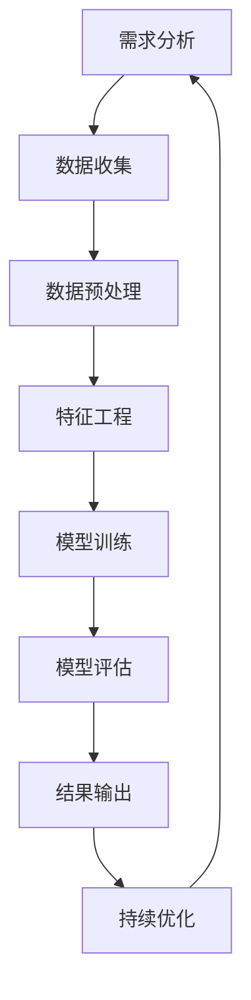

                 

## 引言

在当今数字化转型的浪潮中，品牌价值评估成为企业战略决策的重要环节。品牌不仅是一个标识，更是企业无形资产的集中体现。如何准确衡量品牌的价值，为企业的投资决策和资源配置提供科学依据，成为亟待解决的关键问题。传统品牌价值评估方法，如财务指标分析、市场调查等，虽然在一定程度上能够反映品牌的潜在价值，但存在诸多局限性。例如，这些方法往往依赖于主观判断和数据收集的难度，无法全面、客观地反映品牌在市场中的真实价值。

随着人工智能（AI）技术的飞速发展，利用AI进行品牌价值评估成为一种新兴且有效的手段。AI驱动的品牌价值评估模型通过数据挖掘、机器学习和深度学习等先进技术，能够从海量数据中提取出品牌价值的关键特征，实现品牌价值的量化评估。这种方法不仅提高了评估的准确性和客观性，还能为企业提供更深入的洞察，帮助企业在激烈的市场竞争中做出更加明智的决策。

本文旨在探讨AI驱动的品牌价值评估模型，从理论基础、方法实践到应用案例，全面分析这一领域的最新进展和技术应用。文章结构如下：

1. **品牌价值评估概述**：介绍品牌价值评估的重要性及传统方法的局限性。
2. **AI驱动的品牌价值评估基础理论**：阐述品牌价值评估的理论基础、数据挖掘与机器学习技术以及常见的品牌价值评估模型。
3. **AI驱动的品牌价值评估方法**：详细讲解特征工程、数据预处理、模型选择与训练、模型评估与优化等关键步骤。
4. **AI驱动的品牌价值评估实践**：展示品牌价值评估项目流程、案例分析和相关工具介绍。
5. **AI驱动的品牌价值评估应用**：探讨零售、快消品以及其他行业品牌价值评估的特点和应用方法。
6. **AI驱动的品牌价值评估未来发展**：分析发展趋势、未来挑战和产业生态。
7. **企业如何利用AI进行品牌价值评估**：提供企业AI品牌价值评估的策略、实施步骤和成功案例。
8. **附录**：包括品牌价值评估相关工具与资源以及AI品牌价值评估案例库。

通过本文的详细探讨，希望能够为企业在AI驱动的品牌价值评估领域提供有价值的参考和指导。


## 关键词

品牌价值评估、人工智能（AI）、数据挖掘、机器学习、深度学习、特征工程、财务指标分析、市场调查。

## 摘要

品牌价值评估是企业战略决策的重要环节，传统评估方法存在诸多局限性。随着人工智能技术的不断发展，AI驱动的品牌价值评估模型成为新的研究方向。本文首先概述了品牌价值评估的重要性以及传统方法的局限性，然后详细阐述了AI驱动的品牌价值评估的理论基础、方法和技术。通过对特征工程、数据预处理、模型选择与训练、模型评估与优化等关键步骤的深入分析，本文展示了AI品牌价值评估的具体实践和案例分析。最后，本文探讨了AI驱动的品牌价值评估的未来发展趋势和企业应用策略，为企业提供了科学的品牌价值评估方法和实践指导。


### 第1章：品牌价值评估概述

品牌价值评估是企业管理中的一项重要任务，它不仅有助于企业了解自身的品牌在市场中的地位和影响力，还能为企业的战略决策提供有力的支持。品牌价值评估的重要性体现在多个方面：首先，品牌价值评估可以帮助企业确定其品牌的实际价值，从而为品牌投资提供依据；其次，品牌价值评估能够为企业制定有效的品牌管理策略提供数据支持；最后，品牌价值评估还能为企业并购、融资等资本市场活动提供参考。

然而，传统品牌价值评估方法存在一些局限性。首先，传统方法主要依赖于财务指标和市场调查，这些方法往往基于历史数据和主观判断，无法全面、客观地反映品牌的潜在价值。其次，传统方法在数据处理和分析方面存在一定的局限性，难以应对海量数据的复杂性和多样性。此外，传统方法在应对新兴市场和快速变化的市场环境时，往往显得反应迟缓，难以提供及时有效的评估结果。

随着人工智能（AI）技术的发展，利用AI进行品牌价值评估成为了一种新兴且有效的手段。AI驱动的品牌价值评估模型通过数据挖掘、机器学习和深度学习等先进技术，能够从海量数据中提取出品牌价值的关键特征，实现品牌价值的量化评估。与传统的评估方法相比，AI驱动的品牌价值评估具有以下优势：

1. **数据处理能力强大**：AI技术能够处理和分析大规模、多维度的数据，从而更全面、准确地反映品牌的实际情况。
2. **自动化和高效性**：AI模型能够自动化地进行数据预处理、特征提取和模型训练，大幅提高评估效率。
3. **预测和洞察力**：AI驱动的品牌价值评估模型能够对未来市场趋势和消费者行为进行预测，为企业提供前瞻性的决策依据。
4. **客观性和准确性**：AI模型基于数据驱动，减少了主观判断的影响，提高了评估的客观性和准确性。

综上所述，AI驱动的品牌价值评估方法不仅克服了传统方法的局限性，还能为企业提供更科学、更有效的品牌价值评估结果。随着AI技术的不断进步，AI驱动的品牌价值评估将在企业管理和战略决策中发挥越来越重要的作用。本章将详细介绍AI驱动的品牌价值评估的基础理论、方法和技术，为企业提供实用的指导。

#### 1.1 品牌价值评估的重要性

品牌价值评估在企业管理中具有至关重要的意义。首先，品牌是企业的重要资产，它不仅代表了企业的形象和声誉，还蕴含着巨大的商业价值。通过准确的品牌价值评估，企业可以了解自身品牌在市场中的地位和影响力，从而为品牌投资、品牌保护、品牌管理提供科学依据。其次，品牌价值评估有助于企业确定品牌的实际价值，从而为财务报表的编制和资本市场的活动提供可靠的数据支持。例如，在并购、融资、股权交易等资本市场活动中，品牌价值评估结果可以作为决策的重要参考。

此外，品牌价值评估还能够帮助企业制定有效的品牌管理策略。通过分析品牌价值的关键驱动因素，企业可以识别出品牌的优势和劣势，从而有针对性地进行品牌优化和提升。例如，通过品牌价值评估，企业可以发现其品牌在特定市场或消费者群体中的表现不佳，进而采取相应的市场推广策略，提升品牌知名度和美誉度。同时，品牌价值评估还能为企业提供品牌资产配置的依据，帮助企业合理分配资源，最大化品牌价值。

品牌价值评估不仅对企业的内部管理有重要意义，还能为企业的外部合作提供有力支持。例如，在与合作伙伴进行合作谈判时，品牌价值评估结果可以作为谈判的筹码，提高企业的议价能力。在品牌授权、品牌合作等活动中，品牌价值评估结果也可以作为品牌使用费用的重要参考，确保企业获取合理的回报。

总之，品牌价值评估在企业管理中具有不可替代的作用。通过科学、准确的品牌价值评估，企业可以更好地掌握自身品牌的市场表现和价值，从而为战略决策、品牌管理和外部合作提供坚实的依据。随着市场竞争的加剧和消费者需求的多样化，品牌价值评估的重要性将日益凸显。

#### 1.2 传统品牌价值评估方法的局限性

尽管传统品牌价值评估方法在企业管理中得到了广泛应用，但其局限性也日益显现。首先，传统方法主要依赖于财务指标和市场调查，这些方法往往基于历史数据和主观判断，无法全面、客观地反映品牌的潜在价值。财务指标分析虽然能够提供一定的数据支持，但它们通常只能反映品牌的财务表现，而无法涵盖品牌的市场影响力、消费者忠诚度等关键因素。

其次，传统方法在数据处理和分析方面存在一定的局限性，难以应对海量数据的复杂性和多样性。市场调查方法通常依赖于问卷调查和访谈，这些方法的样本量有限，数据收集过程繁琐且耗时。此外，市场调查方法的主观性较强，受调查者的个人观点和判断影响较大，从而影响了评估结果的准确性和可靠性。

第三，传统方法在应对新兴市场和快速变化的市场环境时，往往显得反应迟缓，难以提供及时有效的评估结果。在当前市场环境瞬息万变的情况下，品牌价值评估需要快速响应市场变化，而传统方法往往无法满足这一需求。此外，新兴市场的消费者行为和需求具有独特性，传统评估方法难以捕捉到这些变化，从而影响了评估结果的适用性。

第四，传统品牌价值评估方法在跨国品牌评估中面临更大的挑战。不同国家和地区的消费者文化和消费习惯差异较大，传统方法难以进行跨文化比较，从而影响了评估结果的普适性和准确性。此外，跨国品牌在不同市场的运营情况和品牌表现也存在差异，传统方法往往无法全面、准确地反映这些差异。

总之，传统品牌价值评估方法在准确性、全面性和时效性方面存在一定的局限性。随着市场竞争的加剧和消费者需求的多样化，这些局限性越来越突出，难以满足现代企业对品牌价值评估的需求。因此，寻找更加科学、有效的品牌价值评估方法，已成为企业管理和战略决策的迫切需要。AI驱动的品牌价值评估方法应运而生，它通过利用先进的数据挖掘和机器学习技术，能够克服传统方法的局限性，提供更加准确、全面和及时的评估结果。

#### 1.3 AI驱动的品牌价值评估的优势

AI驱动的品牌价值评估方法凭借其先进的技术和强大的数据处理能力，为品牌价值评估带来了诸多优势。首先，数据处理能力强大。AI技术能够处理和分析大规模、多维度的数据，包括财务数据、市场调查数据、社交媒体数据等。这些数据不仅涵盖了品牌的历史表现，还反映了品牌在当前市场环境中的动态变化。通过数据挖掘和机器学习技术，AI能够从海量数据中提取出品牌价值的关键特征，实现品牌价值的量化评估。

其次，自动化和高效性。传统品牌价值评估方法通常需要人工进行数据收集、分析和判断，过程繁琐且耗时。而AI驱动的品牌价值评估模型能够自动化地进行数据预处理、特征提取和模型训练，大幅提高评估效率。例如，通过自然语言处理技术，AI可以自动提取社交媒体中的用户评论和情感倾向，分析消费者对品牌的真实感受。通过自动化处理，评估过程变得更加高效和准确。

第三，预测和洞察力。AI驱动的品牌价值评估模型不仅能够评估品牌的当前价值，还能对未来市场趋势和消费者行为进行预测。通过对历史数据的分析和趋势预测，AI可以提供关于品牌未来发展前景的洞察，帮助企业制定更加科学、前瞻性的战略决策。例如，通过分析消费者购买行为和社交媒体互动数据，AI可以预测品牌未来的市场表现，为企业的市场推广策略提供数据支持。

第四，客观性和准确性。AI模型基于数据驱动，减少了主观判断的影响，提高了评估的客观性和准确性。传统评估方法依赖于财务指标和市场调查，这些方法容易受到人为因素和主观判断的影响。而AI模型通过算法和机器学习技术，能够自动学习和调整，确保评估结果更加客观和可靠。

最后，适应性和灵活性。AI驱动的品牌价值评估方法能够适应不同市场和不同品牌的需求。通过定制化的模型和算法，AI可以针对不同行业、不同品牌的特点进行评估，提供个性化的评估结果。同时，AI模型具有较高的灵活性，可以根据市场环境和消费者行为的变化，快速调整评估方法和策略，确保评估结果的时效性和适用性。

总之，AI驱动的品牌价值评估方法凭借其强大的数据处理能力、自动化和高效性、预测和洞察力、客观性和准确性，以及适应性和灵活性，为品牌价值评估提供了全新的解决方案。通过AI技术，企业能够更科学、准确地评估品牌价值，为战略决策和品牌管理提供有力支持。随着AI技术的不断进步，AI驱动的品牌价值评估将在企业管理和市场竞争中发挥越来越重要的作用。

### 第2章：AI驱动的品牌价值评估基础理论

要深入探讨AI驱动的品牌价值评估模型，我们首先需要了解其基础理论，包括品牌价值评估的理论基础、数据挖掘与机器学习技术以及常见的品牌价值评估模型。这些理论基础为AI驱动的品牌价值评估提供了科学依据和算法支持，下面我们将逐一进行详细阐述。

#### 2.1 品牌价值评估的理论基础

品牌价值评估的理论基础主要包括品牌价值的构成要素和评估方法。品牌价值通常由多个方面构成，包括品牌知名度、品牌忠诚度、品牌美誉度、品牌差异化、市场表现和财务表现等。每种因素都对品牌价值产生重要影响，共同决定了品牌的整体价值。

- **品牌知名度**：品牌知名度是品牌价值的重要方面之一，反映了消费者对品牌的认知程度。高知名度通常意味着品牌在市场上的广泛传播和影响力。评估品牌知名度可以通过市场调查、社交媒体分析和广告效果监测等方式进行。

- **品牌忠诚度**：品牌忠诚度指的是消费者对品牌的忠诚和依赖程度。高忠诚度的消费者倾向于重复购买并推荐品牌，这为品牌带来了稳定的销售和利润。评估品牌忠诚度可以通过分析消费者购买行为、市场反馈和客户满意度调查等手段进行。

- **品牌美誉度**：品牌美誉度是指消费者对品牌的正面评价和信任程度。良好的品牌美誉度有助于提升品牌的形象和市场地位，增强消费者的购买意愿。评估品牌美誉度可以通过社交媒体分析、用户评论和口碑传播等途径进行。

- **品牌差异化**：品牌差异化是指品牌在产品、服务或品牌形象上与其他竞争者区别开来的程度。差异化越明显，品牌在市场中的竞争力越强。评估品牌差异化可以通过市场调研、竞争分析和对消费者偏好的调查等方法进行。

- **市场表现**：市场表现是品牌在市场中的实际表现，包括市场份额、销售额和盈利能力等。良好的市场表现通常反映了品牌的市场地位和竞争力。评估市场表现可以通过财务报表分析、市场调查和行业报告等途径进行。

- **财务表现**：财务表现是品牌在财务方面的表现，包括品牌资产的市场价值、品牌的盈利能力、现金流状况等。财务表现是品牌价值评估的重要指标之一。评估财务表现可以通过财务报表分析、股票市场表现和投资回报率等手段进行。

品牌价值评估的方法主要包括财务指标分析、市场调查、品牌资产定价模型等。财务指标分析通过分析品牌的财务报表和市场表现，评估品牌的经济价值。市场调查则通过问卷调查、访谈等方式，收集消费者和市场的反馈，评估品牌的知名度和忠诚度。品牌资产定价模型则通过定量模型，综合分析品牌的多个方面，评估品牌的整体价值。

#### 2.2 数据挖掘与机器学习技术

数据挖掘和机器学习技术是AI驱动的品牌价值评估的核心，它们通过处理和分析海量数据，提取品牌价值的关键特征，实现对品牌价值的量化评估。

- **数据挖掘**：数据挖掘是从大量数据中发现有价值信息和知识的过程。在品牌价值评估中，数据挖掘技术可以用于分析历史数据、市场调查数据、社交媒体数据等，识别出品牌价值的关键驱动因素。数据挖掘方法包括关联规则挖掘、聚类分析、分类分析等。

  - **关联规则挖掘**：通过分析数据之间的关联关系，识别出品牌表现与其他因素之间的关联规则。例如，通过关联规则挖掘可以发现，品牌忠诚度与市场份额之间存在显著的正相关关系。
  
  - **聚类分析**：将数据分为不同的类别或集群，以发现数据中的模式和规律。在品牌价值评估中，聚类分析可以用于识别具有相似特征的消费者群体，分析其品牌忠诚度和购买行为。
  
  - **分类分析**：通过建立分类模型，将数据划分为不同的类别。分类分析可以用于预测品牌表现，如预测品牌市场份额的变化趋势。

- **机器学习**：机器学习是利用算法从数据中学习规律，进行预测和决策的技术。在品牌价值评估中，机器学习技术可以用于构建预测模型，评估品牌未来的市场表现和价值。

  - **监督学习**：监督学习通过已有标签数据训练模型，从而对新数据进行预测。在品牌价值评估中，监督学习可以用于预测品牌市场份额、消费者忠诚度等关键指标。
  
  - **无监督学习**：无监督学习不需要标签数据，通过分析数据分布和模式，进行聚类和降维等操作。在品牌价值评估中，无监督学习可以用于发现数据中的隐藏特征，为品牌价值评估提供新的视角。
  
  - **强化学习**：强化学习通过试错和反馈机制，不断优化决策策略。在品牌价值评估中，强化学习可以用于制定品牌管理策略，优化品牌资源配置。

#### 2.3 常见的品牌价值评估模型

在AI驱动的品牌价值评估中，常见的模型包括线性回归模型、决策树模型、支持向量机（SVM）模型、神经网络模型等。这些模型通过不同的算法和架构，实现对品牌价值的量化评估。

- **线性回归模型**：线性回归是一种简单且常用的预测模型，通过建立线性关系预测品牌价值。线性回归模型的基本原理是找到最佳拟合线，使得预测值与实际值之间的误差最小。线性回归模型适用于关系较为简单的情况，例如预测品牌市场份额与广告投入之间的关系。

  - **公式**：\( Y = \beta_0 + \beta_1X_1 + \beta_2X_2 + ... + \beta_nX_n \)
  
  - **优点**：计算简单，易于理解和实现。

  - **缺点**：对非线性关系处理能力较弱，容易受到异常值的影响。

- **决策树模型**：决策树是一种基于树形结构进行分类和预测的模型。每个节点表示一个特征，每个分支表示该特征的不同取值，最终叶节点表示预测结果。决策树模型可以处理复杂的非线性关系，并且易于解释。

  - **公式**：\( f(X) = \text{max}(\beta_j) \) ，其中 \( \beta_j \) 是每个分支的概率值。
  
  - **优点**：易于理解和实现，能够处理复杂的非线性关系。

  - **缺点**：容易过拟合，模型泛化能力较弱。

- **支持向量机（SVM）模型**：支持向量机是一种通过最大化分类间隔进行分类的模型。SVM在处理高维数据时表现优异，并且具有较强的泛化能力。

  - **公式**：\( \text{Min} \ \frac{1}{2} ||w||^2 + C \sum_{i=1}^{n} \max(0, 1-y_i(\text{w}\cdot x_i + b)) \)
  
  - **优点**：适用于高维数据，具有较好的泛化能力。

  - **缺点**：计算复杂度高，对异常值敏感。

- **神经网络模型**：神经网络是一种基于大量神经元互联进行学习和预测的模型。神经网络能够处理复杂的非线性关系，并且具有自学习和自适应能力。

  - **公式**：\( f(X) = \sigma(\text{W} \cdot \text{X} + \text{b}) \)，其中 \( \sigma \) 是激活函数，\( \text{W} \) 和 \( \text{b} \) 分别是权重和偏置。
  
  - **优点**：强大的非线性处理能力，能够自适应调整。

  - **缺点**：训练过程复杂，易过拟合。

通过这些理论基础和常见模型，AI驱动的品牌价值评估能够从数据中提取有价值的信息，实现对品牌价值的科学、准确评估。接下来，我们将进一步探讨AI驱动的品牌价值评估的具体方法和步骤。

### 第3章：AI驱动的品牌价值评估方法

AI驱动的品牌价值评估方法涉及多个关键步骤，包括特征工程、数据预处理、模型选择与训练、模型评估与优化。这些步骤共同构成了一个系统化、可操作的评估流程，下面我们将逐一详细介绍每个步骤及其应用。

#### 3.1 特征工程

特征工程是AI驱动的品牌价值评估中至关重要的一步，它涉及从原始数据中提取和构建有助于模型训练的特征。良好的特征工程能够提高模型的表现，减少过拟合现象，增强模型的泛化能力。以下是特征工程的主要方法和应用：

1. **数据预处理**：在特征工程之前，需要对原始数据进行预处理，包括数据清洗、缺失值处理、异常值检测和噪声过滤等。这些步骤能够提高数据质量，为后续的特征提取和模型训练提供可靠的数据基础。

2. **特征提取**：特征提取是指从原始数据中提取具有代表性的特征。常用的特征提取方法包括：

   - **统计特征**：如平均值、中位数、标准差等，这些特征能够反映数据的整体分布和变化趋势。
   - **文本特征**：如词频、词向量、主题模型等，通过自然语言处理技术，可以提取文本数据中的潜在信息。
   - **图像特征**：如颜色直方图、边缘检测、特征点提取等，用于图像数据的特征提取。

3. **特征选择**：在提取大量特征后，需要进行特征选择，以筛选出对品牌价值评估最具影响力的特征。常用的特征选择方法包括：

   - **基于信息的特征选择**：如信息增益、信息增益率等，选择对分类或预测贡献最大的特征。
   - **基于模型的特征选择**：如随机森林、LASSO回归等，通过模型训练结果筛选出重要的特征。
   - **基于约束的特征选择**：如递归特征消除（RFE）等，通过设定约束条件筛选特征。

4. **特征构造**：通过组合和变换原始特征，构造新的特征，以提升模型的表现。例如，可以通过线性组合、特征交叉、变换等手段构造新的特征。

#### 3.2 数据预处理

数据预处理是确保数据质量、提高模型训练效果的重要步骤。以下是数据预处理的主要方法和应用：

1. **数据清洗**：数据清洗是指去除数据中的噪声和错误，包括去除重复数据、纠正错误数据和处理缺失值。常用的方法有：

   - **删除缺失值**：当缺失值比例较高时，可以删除缺失值，以避免对模型训练产生不利影响。
   - **填充缺失值**：当缺失值比例较低时，可以通过平均值、中位数、插值等方法填充缺失值。

2. **数据标准化**：为了消除不同特征之间的尺度差异，需要进行数据标准化。常用的方法有：

   - **归一化**：将特征值缩放到[0,1]或[-1,1]之间，如 \( x_{\text{norm}} = \frac{x - \mu}{\sigma} \)。
   - **标准化**：将特征值缩放到均值0、标准差1的范围内，如 \( x_{\text{norm}} = \frac{x - \mu}{\sigma} \)。

3. **数据转换**：将数据进行必要的转换，以提高模型的表现。常用的方法有：

   - **二值化**：将连续特征转换为离散特征，如 \( x_{\text{bin}} = \text{round}(x) \)。
   - **多项式转换**：通过多项式扩展，将低阶特征转换为高阶特征，如 \( x^2, x^3, ... \)。

4. **数据缩放**：为了防止某些特征对模型训练产生过大的影响，需要对数据进行缩放。常用的方法有：

   - **最小-最大缩放**：将特征值缩放到给定区间内，如 \( x_{\text{scale}} = \frac{x - x_{\text{min}}}{x_{\text{max}} - x_{\text{min}}} \)。
   - **标准缩放**：将特征值缩放到标准正态分布，如 \( x_{\text{scale}} = \frac{x - \mu}{\sigma} \)。

#### 3.3 模型选择与训练

模型选择与训练是品牌价值评估的核心步骤，它决定了评估结果的准确性和可靠性。以下是模型选择与训练的主要方法和应用：

1. **模型选择**：根据品牌价值评估的需求和数据特征，选择合适的模型。常见的模型选择方法有：

   - **基于性能的模型选择**：通过交叉验证等方法，选择性能最佳的模型。常用的性能指标包括准确率、召回率、F1分数等。
   - **基于理论的模型选择**：根据问题背景和特征关系，选择符合理论和业务需求的模型，如线性回归、决策树、支持向量机等。
   - **基于集成的模型选择**：通过集成多种模型，提高评估结果的稳定性和准确性，如随机森林、梯度提升机等。

2. **模型训练**：使用选定的模型进行训练，以学习数据中的规律和模式。模型训练的方法包括：

   - **监督学习**：通过已有标签数据训练模型，如线性回归、决策树、支持向量机等。训练过程中，模型会根据输入特征和标签学习拟合函数，用于预测新数据的品牌价值。
   - **无监督学习**：在没有标签数据的情况下，通过数据自身的分布和模式进行训练，如聚类、降维等。无监督学习可以用于发现数据中的潜在结构和特征。
   - **强化学习**：通过试错和反馈机制，不断优化决策策略，用于动态评估和优化品牌价值。

3. **超参数调优**：在模型训练过程中，需要对模型超参数进行调整，以优化模型性能。常用的超参数调优方法包括：

   - **网格搜索**：在预定的超参数范围内，逐个尝试所有可能的组合，选择性能最佳的组合。
   - **贝叶斯优化**：利用贝叶斯统计模型，选择搜索空间中的最佳超参数组合。
   - **随机搜索**：在预定的超参数范围内，随机选择多个超参数组合，进行性能评估。

#### 3.4 模型评估与优化

模型评估与优化是确保模型表现稳定和可靠的重要步骤。以下是模型评估与优化的主要方法和应用：

1. **模型评估**：通过评估指标，对模型的性能进行评价。常用的评估指标包括：

   - **准确率**：预测正确的样本数占总样本数的比例。
   - **召回率**：预测正确的正样本数占总正样本数的比例。
   - **F1分数**：准确率的调和平均值，综合了准确率和召回率。
   - **ROC曲线**：反映模型分类能力的曲线，通过AUC（曲线下面积）评估模型性能。
   - **Kappa系数**：评估模型一致性的指标，用于评估多分类问题的模型性能。

2. **模型优化**：通过优化策略，提高模型的性能和泛化能力。常用的优化方法包括：

   - **交叉验证**：通过将数据集划分为训练集和验证集，多次训练和验证模型，评估模型在不同数据集上的表现，选择性能最佳的模型。
   - **集成学习**：通过集成多个模型，提高评估结果的稳定性和准确性，如随机森林、梯度提升机等。
   - **正则化**：通过增加正则项，防止模型过拟合，提高泛化能力，如L1正则化、L2正则化等。
   - **超参数调整**：根据模型评估结果，调整模型的超参数，以优化模型性能。

3. **模型解释**：通过模型解释技术，理解模型的工作机制和预测过程，提高模型的透明度和可解释性。常用的模型解释方法包括：

   - **特征重要性**：通过分析特征的重要性，理解模型对各个特征的依赖程度。
   - **模型可视化**：通过可视化技术，展示模型的内部结构和决策过程，如决策树、神经网络等。
   - **LIME（局部可解释模型解释）**：通过局部线性模型，解释模型对特定样本的预测过程。
   - **SHAP（特征重要性解释）**：通过计算特征对模型预测的贡献，解释模型对各个特征的依赖程度。

通过上述步骤，AI驱动的品牌价值评估方法能够系统地、科学地评估品牌价值，提供准确、可靠的评估结果。在接下来的章节中，我们将进一步探讨AI驱动的品牌价值评估的应用实践，通过具体案例展示其应用效果。

### 第4章：AI驱动的品牌价值评估实践

在深入探讨了AI驱动的品牌价值评估的理论基础和方法后，我们接下来将通过具体实践案例来展示这一方法在实际中的应用。本章节将详细介绍品牌价值评估项目流程、案例分析以及相关工具和资源的介绍，以便为企业提供实际操作指南。

#### 4.1 品牌价值评估项目流程

AI驱动的品牌价值评估项目通常包括以下几个关键步骤：

1. **项目立项与需求分析**：在项目启动之初，明确项目目标、评估范围和需求。这一步骤需要与客户沟通，了解其具体需求，确定评估的目标和指标。

2. **数据收集与预处理**：根据项目需求，收集相关数据，包括财务数据、市场调查数据、社交媒体数据、消费者反馈数据等。收集到的数据需要进行预处理，包括数据清洗、缺失值处理、异常值检测和数据标准化等。

3. **特征工程与模型选择**：在预处理数据的基础上，进行特征工程，提取和构造有助于模型训练的特征。然后根据数据特征和业务需求，选择合适的评估模型，如线性回归、决策树、支持向量机、神经网络等。

4. **模型训练与优化**：使用预处理后的数据对选定的模型进行训练，调整模型参数和超参数，优化模型性能。这一步骤可以通过交叉验证、网格搜索等方法进行。

5. **模型评估与解释**：使用验证集或测试集对训练好的模型进行评估，计算评估指标，如准确率、召回率、F1分数等。同时，通过模型解释技术，理解模型的工作机制和预测过程，提高模型的透明度和可解释性。

6. **结果输出与报告**：将评估结果整理成报告，包括品牌价值的量化评估、关键驱动因素分析、未来趋势预测等。报告应清晰、简洁，以便于企业决策者理解和应用。

7. **项目总结与反馈**：在项目完成后，进行总结和反馈，评估项目效果和不足，为后续项目提供改进建议。

#### 4.2 品牌价值评估案例分析

以下是一个具体的品牌价值评估案例分析，展示AI驱动的品牌价值评估方法在实际应用中的效果。

**案例背景**：
某知名零售企业希望通过AI技术对其品牌价值进行量化评估，以便更好地了解其在市场中的地位和竞争力，为战略决策提供数据支持。

**数据来源**：
该零售企业的数据包括以下几类：

- 财务数据：包括销售额、利润率、成本等。
- 市场调查数据：包括市场份额、消费者满意度等。
- 社交媒体数据：包括社交媒体上的用户评论、品牌提及次数等。
- 消费者反馈数据：包括在线调查、客户评分等。

**数据预处理**：
对收集到的数据进行预处理，包括数据清洗、缺失值处理、数据标准化等。例如，将销售额和利润率进行归一化处理，将社交媒体数据中的用户评论进行情感分析。

**特征工程与模型选择**：
通过数据预处理后，提取以下特征：

- 财务特征：如销售额、利润率、成本等。
- 市场特征：如市场份额、消费者满意度等。
- 社交媒体特征：如品牌提及次数、用户情感倾向等。

选择线性回归模型进行品牌价值评估，通过交叉验证和网格搜索优化模型参数。

**模型训练与优化**：
使用预处理后的数据对线性回归模型进行训练，调整参数，优化模型性能。通过交叉验证，选择最优参数组合。

**模型评估与解释**：
使用测试集对训练好的模型进行评估，计算评估指标，如准确率、召回率、F1分数等。同时，通过LIME（局部可解释模型解释）技术，解释模型对特定样本的预测过程，提高模型的透明度和可解释性。

**结果输出与报告**：
根据评估结果，生成品牌价值评估报告，包括品牌价值的量化评估、关键驱动因素分析、未来趋势预测等。报告清晰地展示了品牌价值的影响因素，为企业决策提供了有力支持。

**项目总结与反馈**：
在项目完成后，对企业进行总结和反馈，评估项目效果和不足，为后续项目提供改进建议。例如，可以通过进一步优化特征工程和模型选择，提高评估结果的准确性和可靠性。

#### 4.3 品牌价值评估工具介绍

为了实现AI驱动的品牌价值评估，需要使用一系列工具和技术。以下介绍几种常用的品牌价值评估工具：

1. **数据采集工具**：
   - **API接口**：通过API接口，可以从不同的数据源（如社交媒体、市场调查公司）收集数据。
   - **爬虫工具**：如Scrapy，用于从网页上抓取数据。

2. **数据分析工具**：
   - **Python库**：如Pandas、NumPy等，用于数据处理和分析。
   - **R语言**：适用于统计分析和图形可视化。

3. **机器学习工具**：
   - **Scikit-learn**：提供多种机器学习算法和工具，如线性回归、决策树、支持向量机等。
   - **TensorFlow、PyTorch**：深度学习框架，用于构建和训练复杂神经网络。

4. **模型评估工具**：
   - **Matplotlib、Seaborn**：用于数据可视化，展示模型评估结果。
   - **性能评估指标**：如准确率、召回率、F1分数等，用于评估模型性能。

5. **模型解释工具**：
   - **LIME**：用于局部可解释模型解释。
   - **SHAP**：用于特征重要性解释。

通过上述工具和技术，企业可以高效地实现AI驱动的品牌价值评估，为战略决策提供科学依据。在接下来的章节中，我们将进一步探讨AI驱动的品牌价值评估在不同行业中的应用，展示其在实际场景中的效果。

### 第5章：零售行业品牌价值评估

零售行业是品牌价值评估的重要应用领域之一。零售企业通过准确的品牌价值评估，可以更好地了解其品牌在市场中的地位，制定有效的品牌管理策略，提升品牌竞争力。本节将探讨零售行业品牌价值评估的特点、评估方法和具体应用案例。

#### 5.1 零售行业品牌价值评估的特点

1. **市场竞争激烈**：零售行业是一个高度竞争的市场，众多品牌在争夺有限的消费者资源。品牌价值评估可以帮助企业识别自身的竞争优势和劣势，制定针对性的品牌策略。

2. **数据来源广泛**：零售行业品牌价值评估依赖于多种数据源，包括销售数据、消费者反馈、社交媒体互动等。这些数据的广泛性和多样性为品牌价值评估提供了丰富的信息基础。

3. **动态性**：零售市场变化迅速，消费者需求和市场趋势不断变化。品牌价值评估需要具备较强的动态适应性，能够实时反映市场变化，为企业的战略调整提供支持。

4. **复杂的关系网络**：零售行业中的品牌价值受到多种因素的影响，如供应链管理、客户满意度、市场营销活动等。品牌价值评估需要全面分析这些复杂的关系网络，提供综合性的评估结果。

#### 5.2 零售行业品牌价值评估方法

1. **财务指标分析**：财务指标是评估品牌价值的重要依据，包括销售额、净利润率、资产回报率等。通过对财务数据的分析，可以评估品牌的盈利能力和财务健康状况。

2. **市场调查方法**：市场调查方法通过问卷调查、访谈等方式收集消费者对品牌的认知和评价，包括品牌知名度、忠诚度、美誉度等。市场调查方法能够直接反映消费者对品牌的感受和态度。

3. **数据挖掘与机器学习技术**：利用数据挖掘和机器学习技术，可以从海量数据中提取品牌价值的关键特征，实现品牌价值的量化评估。例如，通过分析销售数据、社交媒体互动数据等，可以评估品牌的市场表现和消费者偏好。

4. **综合评估方法**：结合财务指标、市场调查和机器学习技术，形成综合性的品牌价值评估方法。这种方法能够综合考虑品牌的财务表现、市场表现和消费者反馈，提供更加全面、准确的评估结果。

#### 5.3 零售行业品牌价值评估案例

以下是一个具体的零售行业品牌价值评估案例，展示AI驱动的品牌价值评估方法在实际中的应用。

**案例背景**：
某大型零售企业希望通过AI技术对其品牌价值进行量化评估，以便优化品牌管理策略，提升品牌竞争力。

**数据来源**：
- 财务数据：包括销售额、净利润率、成本等。
- 市场调查数据：包括市场份额、消费者满意度、品牌知名度等。
- 社交媒体数据：包括品牌提及次数、用户情感倾向等。

**数据预处理**：
对收集到的数据进行清洗、缺失值处理和数据标准化。例如，将销售额和净利润率进行归一化处理，将社交媒体数据中的用户评论进行情感分析。

**特征工程**：
提取以下特征：
- 财务特征：如销售额、净利润率、成本等。
- 市场特征：如市场份额、消费者满意度等。
- 社交媒体特征：如品牌提及次数、用户情感倾向等。

**模型选择与训练**：
选择线性回归模型进行品牌价值评估。通过交叉验证和网格搜索优化模型参数，训练模型。

**模型评估**：
使用测试集对训练好的模型进行评估，计算评估指标，如准确率、召回率、F1分数等。同时，通过LIME技术解释模型对特定样本的预测过程，提高模型的透明度和可解释性。

**结果输出与报告**：
根据评估结果，生成品牌价值评估报告，包括品牌价值的量化评估、关键驱动因素分析、未来趋势预测等。报告清晰地展示了品牌价值的影响因素，为企业决策提供了有力支持。

**案例分析**：
通过AI驱动的品牌价值评估，企业发现其品牌在市场份额和消费者满意度方面表现良好，但在社交媒体互动和用户情感倾向方面存在一定差距。基于评估结果，企业决定加大社交媒体营销力度，提升品牌在年轻消费者群体中的影响力。

通过这个案例，我们可以看到AI驱动的品牌价值评估方法在零售行业中的应用效果。它不仅为企业提供了科学的品牌价值评估结果，还帮助企业识别了品牌管理的潜在问题，为战略调整提供了数据支持。随着AI技术的不断进步，零售行业品牌价值评估将变得更加精准和高效，为企业的品牌管理提供更加有力的支持。

### 第6章：快消品行业品牌价值评估

快消品行业是一个竞争激烈的市场，品牌价值评估对于企业制定有效的市场策略和提升品牌竞争力至关重要。在本节中，我们将探讨快消品行业品牌价值评估的特点、评估方法及其具体应用案例，以展示AI驱动的品牌价值评估在该行业中的实际应用效果。

#### 6.1 快消品行业品牌价值评估的特点

1. **快速变化的市场环境**：快消品市场的消费趋势和消费者需求变化非常快，品牌需要快速响应市场变化，调整其品牌策略。品牌价值评估需要具备动态性和实时性，及时反映市场变化。

2. **广泛的消费者群体**：快消品通常面向广泛的消费者群体，品牌价值评估需要考虑不同消费者的偏好和消费习惯，评估结果应具备普适性。

3. **高度依赖广告和促销**：快消品行业广告和促销活动频繁，品牌价值评估需要分析广告投放的效果和促销活动的成功率，评估品牌的市场表现。

4. **复杂的市场竞争**：快消品市场中有众多品牌竞争，品牌价值评估需要全面分析市场环境、竞争对手的动态以及品牌自身的市场地位。

#### 6.2 快消品行业品牌价值评估方法

1. **市场调查方法**：市场调查是快消品品牌价值评估的基础，通过问卷调查、访谈和焦点小组等方式收集消费者的品牌认知、忠诚度和购买行为数据。市场调查方法能够提供直接的消费者反馈，帮助企业了解品牌在市场中的表现。

2. **销售数据分析**：快消品行业的销售数据是评估品牌价值的重要依据，包括销售额、市场份额、产品生命周期等。通过对销售数据进行分析，可以评估品牌的财务表现和市场占有率。

3. **社交媒体分析**：社交媒体平台上的用户评论、品牌提及次数和互动情况是反映品牌价值的重要数据来源。利用自然语言处理技术，可以分析消费者在社交媒体上的情感倾向和品牌偏好。

4. **AI驱动的方法**：结合市场调查、销售数据分析和社交媒体分析，通过AI技术进行数据挖掘和机器学习，构建品牌价值评估模型。AI驱动的方法能够从海量数据中提取关键特征，实现品牌价值的量化评估。

5. **综合评估方法**：结合多种评估方法，形成综合性的品牌价值评估体系，从多个维度全面分析品牌价值。例如，可以结合财务指标、市场调查数据和AI驱动的评估方法，提供全面、准确的品牌价值评估结果。

#### 6.3 快消品行业品牌价值评估案例

以下是一个具体的快消品行业品牌价值评估案例，展示AI驱动的品牌价值评估方法在实际中的应用。

**案例背景**：
某知名快消品公司希望通过AI技术对其品牌价值进行量化评估，以优化品牌管理策略，提升品牌在市场上的竞争力。

**数据来源**：
- 财务数据：包括销售额、净利润率、广告投入等。
- 市场调查数据：包括市场份额、消费者满意度、品牌知名度等。
- 社交媒体数据：包括品牌提及次数、用户情感倾向等。

**数据预处理**：
对收集到的数据进行清洗、缺失值处理和数据标准化。例如，将销售额和净利润率进行归一化处理，将社交媒体数据中的用户评论进行情感分析。

**特征工程**：
提取以下特征：
- 财务特征：如销售额、净利润率、广告投入等。
- 市场特征：如市场份额、消费者满意度等。
- 社交媒体特征：如品牌提及次数、用户情感倾向等。

**模型选择与训练**：
选择线性回归模型和决策树模型进行品牌价值评估。通过交叉验证和网格搜索优化模型参数，训练模型。

**模型评估**：
使用测试集对训练好的模型进行评估，计算评估指标，如准确率、召回率、F1分数等。同时，通过LIME技术解释模型对特定样本的预测过程，提高模型的透明度和可解释性。

**结果输出与报告**：
根据评估结果，生成品牌价值评估报告，包括品牌价值的量化评估、关键驱动因素分析、未来趋势预测等。报告清晰地展示了品牌价值的影响因素，为企业决策提供了有力支持。

**案例分析**：
通过AI驱动的品牌价值评估，公司发现其品牌在市场份额和消费者满意度方面表现良好，但在社交媒体互动和广告投放效果方面存在一定差距。基于评估结果，公司决定增加社交媒体营销预算，并优化广告创意，提升品牌在年轻消费者群体中的影响力。

通过这个案例，我们可以看到AI驱动的品牌价值评估方法在快消品行业中的应用效果。它不仅为企业提供了科学的品牌价值评估结果，还帮助企业识别了品牌管理的潜在问题，为战略调整提供了数据支持。随着AI技术的不断进步，快消品行业品牌价值评估将变得更加精准和高效，为企业的品牌管理提供更加有力的支持。

### 第7章：其他行业品牌价值评估

除了零售和快消品行业，AI驱动的品牌价值评估方法在其他行业中同样具有广泛的应用价值。本节将探讨金融、科技、教育等行业品牌价值评估的特点、评估方法和具体应用案例，展示AI驱动的品牌价值评估在这些行业中的实际效果。

#### 7.1 金融行业品牌价值评估

金融行业品牌价值评估涉及银行、证券、保险等多个子领域，品牌价值不仅反映了企业的市场地位，还影响了企业的客户忠诚度和市场竞争力。金融行业品牌价值评估具有以下特点：

1. **高风险性**：金融行业的品牌价值受到政策变化、市场波动等多种因素的影响，具有高风险性。品牌价值评估需要充分考虑这些外部因素，提供全面的评估结果。

2. **监管合规**：金融行业受到严格的监管要求，品牌价值评估需要符合相关法律法规，确保评估结果的合法性和合规性。

3. **客户信任**：金融行业品牌价值评估重点在于评估品牌对客户的信任度和忠诚度，这是金融企业长期发展的关键。

4. **数据复杂性**：金融行业数据类型繁多，包括交易数据、客户数据、市场数据等，品牌价值评估需要处理复杂的数据结构。

**评估方法**：

- **财务指标分析**：通过分析财务报表，评估企业的盈利能力、资产质量、流动性等。
- **客户忠诚度分析**：通过客户满意度调查、客户留存率等指标，评估品牌对客户的吸引力。
- **市场表现分析**：通过市场占有率、业务增长率等指标，评估品牌在市场中的竞争力。
- **AI驱动的方法**：利用数据挖掘和机器学习技术，从金融行业特有的数据中提取品牌价值的关键特征，如客户交易行为、市场风险等。

**案例**：

某大型银行希望通过AI技术对其品牌价值进行量化评估，以优化品牌管理策略，提升客户满意度。

- **数据来源**：包括财务数据、客户交易数据、市场数据等。
- **数据预处理**：对数据集进行清洗、缺失值处理和数据标准化。
- **特征工程**：提取财务特征、客户特征和市场特征等。
- **模型选择与训练**：选择线性回归和决策树模型，通过交叉验证优化模型参数。
- **模型评估**：使用测试集评估模型性能，通过LIME技术解释模型预测过程。

**结果**：评估结果显示，该银行在客户忠诚度和市场表现方面具有优势，但在风险控制方面存在一定不足。基于评估结果，银行决定加强客户体验管理和风险控制措施，提升品牌价值。

#### 7.2 科技行业品牌价值评估

科技行业品牌价值评估涉及软件开发、硬件制造、互联网服务等多个领域，品牌价值反映了企业的技术实力和市场影响力。科技行业品牌价值评估具有以下特点：

1. **技术创新性**：科技行业品牌价值评估需要充分考虑企业的技术创新能力和研发投入。
2. **市场适应性**：科技行业变化快速，品牌价值评估需要关注企业的市场适应能力和战略布局。
3. **用户满意度**：用户对科技产品的满意度直接影响品牌价值，评估方法需要包括用户反馈和用户体验。

**评估方法**：

- **技术指标分析**：通过分析企业的专利数量、研发投入、技术创新速度等，评估企业的技术实力。
- **市场表现分析**：通过市场占有率、业务增长率等指标，评估品牌的市场竞争力。
- **用户反馈分析**：通过用户满意度调查、产品评论等，评估品牌对用户的吸引力。
- **AI驱动的方法**：利用数据挖掘和机器学习技术，从用户行为数据、市场数据等中提取品牌价值的关键特征。

**案例**：

某知名科技公司希望通过AI技术对其品牌价值进行量化评估，以优化品牌战略，提升市场竞争力。

- **数据来源**：包括用户行为数据、市场数据、专利数据等。
- **数据预处理**：对数据集进行清洗、缺失值处理和数据标准化。
- **特征工程**：提取用户特征、市场特征和技术特征等。
- **模型选择与训练**：选择神经网络和决策树模型，通过交叉验证优化模型参数。
- **模型评估**：使用测试集评估模型性能，通过LIME技术解释模型预测过程。

**结果**：评估结果显示，该科技公司在技术创新和市场适应性方面具有优势，但在用户体验方面存在一定不足。基于评估结果，公司决定加强用户体验管理和产品创新，提升品牌价值。

#### 7.3 教育行业品牌价值评估

教育行业品牌价值评估涉及学校、培训机构、在线教育平台等多个领域，品牌价值反映了教育机构的学术实力和市场影响力。教育行业品牌价值评估具有以下特点：

1. **学术实力**：教育行业品牌价值评估需要考虑教育机构的学术声誉、科研成果等。
2. **教学质量**：教学质量直接影响学生和家长对教育机构的信任和满意度，是品牌价值评估的重要指标。
3. **市场竞争力**：教育行业竞争激烈，品牌价值评估需要关注教育机构的市场表现和品牌影响力。

**评估方法**：

- **学术指标分析**：通过分析教育机构的科研成果、学术论文发表数量等，评估学术实力。
- **教学质量评估**：通过学生和家长满意度调查、教学效果评价等，评估教学质量。
- **市场表现分析**：通过市场占有率、招生人数等指标，评估品牌的市场竞争力。
- **AI驱动的方法**：利用数据挖掘和机器学习技术，从教育行业特有的数据中提取品牌价值的关键特征。

**案例**：

某知名教育机构希望通过AI技术对其品牌价值进行量化评估，以优化教学管理和市场策略，提升品牌影响力。

- **数据来源**：包括学术成果数据、学生反馈数据、市场数据等。
- **数据预处理**：对数据集进行清洗、缺失值处理和数据标准化。
- **特征工程**：提取学术特征、教学特征和市场特征等。
- **模型选择与训练**：选择线性回归和决策树模型，通过交叉验证优化模型参数。
- **模型评估**：使用测试集评估模型性能，通过LIME技术解释模型预测过程。

**结果**：评估结果显示，该教育机构在学术实力和教学质量方面具有优势，但在市场竞争力方面存在一定不足。基于评估结果，机构决定加强市场推广和教学创新，提升品牌价值。

通过上述案例，我们可以看到AI驱动的品牌价值评估方法在金融、科技、教育等行业中的应用效果。它不仅为企业提供了科学的品牌价值评估结果，还帮助企业识别了品牌管理的潜在问题，为战略调整提供了数据支持。随着AI技术的不断进步，AI驱动的品牌价值评估将在更多行业中发挥重要作用，为企业的品牌管理提供更加有力的支持。

### 第8章：AI驱动的品牌价值评估发展趋势

随着人工智能技术的不断进步，AI驱动的品牌价值评估方法在未来的发展前景和潜在挑战也日益显现。本节将分析AI驱动的品牌价值评估的发展趋势，探讨新一代AI技术的应用，以及AI在品牌价值评估中的未来挑战和产业生态。

#### 8.1 新一代AI技术的应用

1. **深度学习**：深度学习作为AI技术的重要分支，在图像识别、自然语言处理和语音识别等领域取得了显著成果。在品牌价值评估中，深度学习可以用于处理复杂的数据结构和大规模数据集，提高特征提取和模型训练的效率。

   - **图像识别**：深度学习模型如卷积神经网络（CNN）可以用于分析品牌广告的视觉效果，评估广告投放的效果。
   - **自然语言处理**：深度学习模型如循环神经网络（RNN）和Transformer可以用于处理文本数据，分析消费者评论和社交媒体互动，评估品牌的市场表现和消费者情感。
   - **语音识别**：深度学习模型如长短时记忆网络（LSTM）可以用于分析语音数据，评估品牌在客户服务中的表现。

2. **强化学习**：强化学习通过试错和反馈机制，不断优化决策策略，可以在品牌价值评估中用于动态调整品牌管理策略。例如，强化学习可以用于优化广告投放策略，实现更高效的资源分配。

3. **联邦学习**：联邦学习通过分布式计算，保护数据隐私，同时实现模型训练和优化。在品牌价值评估中，联邦学习可以用于跨企业、跨地域的数据共享和协同训练，提高评估结果的普适性和准确性。

4. **生成对抗网络（GAN）**：生成对抗网络可以生成虚假数据，用于增强训练数据集，提高模型的泛化能力。在品牌价值评估中，GAN可以用于生成模拟数据，模拟不同的市场环境，评估品牌在不同情况下的表现。

#### 8.2 AI在品牌价值评估中的未来挑战

1. **数据隐私和安全**：品牌价值评估需要大量消费者数据，数据隐私和安全问题成为AI驱动的品牌价值评估的重要挑战。如何在保证数据隐私的同时，充分利用数据的价值，是一个需要解决的问题。

2. **算法透明度和可解释性**：深度学习等复杂AI模型在训练过程中生成的决策规则难以解释，算法的透明度和可解释性成为评估结果被接受和信任的关键。

3. **数据质量和一致性**：品牌价值评估依赖于高质量的数据，数据的质量和一致性直接影响评估结果的准确性。如何保证数据的准确性和一致性，是未来需要关注的问题。

4. **计算资源和成本**：深度学习和联邦学习等新一代AI技术对计算资源的需求较高，如何在有限的计算资源下，实现高效的模型训练和优化，是一个重要的挑战。

#### 8.3 AI驱动的品牌价值评估产业生态

1. **企业合作与开放平台**：为了提高AI驱动的品牌价值评估的效率和质量，企业之间需要进行合作，建立开放的数据共享和协作平台。例如，建立行业数据联盟，实现跨企业、跨地域的数据共享和协同训练。

2. **算法竞赛与模型共享**：通过举办算法竞赛，鼓励企业和研究机构共同参与模型开发，实现模型共享和优化。这种方式可以促进技术的创新和应用的推广。

3. **法规和标准**：为了确保AI驱动的品牌价值评估的合规性和可靠性，需要制定相关的法规和标准。例如，数据隐私保护法规、算法透明度标准等。

4. **人才培养和引进**：AI驱动的品牌价值评估需要大量具备AI技术和商业管理知识的专业人才。企业和研究机构需要加强人才培养和引进，提高AI技术在品牌价值评估中的应用能力。

总之，AI驱动的品牌价值评估具有广阔的发展前景，但同时也面临诸多挑战。通过不断创新和合作，逐步解决这些问题，AI驱动的品牌价值评估将在未来发挥更加重要的作用，为企业的品牌管理和战略决策提供强有力的支持。

### 第9章：企业如何利用AI进行品牌价值评估

在当前数字化转型的浪潮中，企业如何利用AI进行品牌价值评估，不仅关乎企业的长远发展，也是提升市场竞争力的关键。本章节将详细探讨企业利用AI进行品牌价值评估的策略、实施步骤和成功案例，为企业提供实际操作的指导和建议。

#### 9.1 企业AI品牌价值评估策略

企业利用AI进行品牌价值评估的策略可以分为以下几个方面：

1. **明确评估目标**：首先，企业需要明确品牌价值评估的目标，例如，评估品牌的市场表现、消费者忠诚度、财务表现等。明确目标有助于确定评估的范围和重点，提高评估的有效性。

2. **数据整合与治理**：企业需要整合来自不同渠道的数据，包括财务数据、市场调查数据、社交媒体数据、消费者反馈数据等。同时，确保数据的准确性和一致性，为AI模型提供高质量的数据基础。

3. **技术选型与集成**：选择适合企业需求的人工智能技术，如数据挖掘、机器学习、深度学习等。同时，将AI技术与企业现有的IT系统进行集成，实现数据的高效处理和分析。

4. **建立评估模型**：根据企业需求和数据特征，建立AI驱动的品牌价值评估模型。模型的选择和训练应基于科学的理论和算法，确保评估结果的准确性和可靠性。

5. **持续优化与更新**：品牌价值是一个动态变化的过程，企业需要定期对评估模型进行优化和更新，以适应市场环境的变化和消费者需求的变化。

#### 9.2 企业AI品牌价值评估实施步骤

企业利用AI进行品牌价值评估的实施步骤如下：

1. **需求分析**：与企业内部相关利益相关者进行沟通，了解品牌价值评估的需求和期望，明确评估的具体目标和指标。

2. **数据收集与预处理**：收集企业内部和外部的数据，包括财务数据、市场调查数据、社交媒体数据、消费者反馈数据等。对数据进行清洗、缺失值处理、异常值检测和数据标准化等预处理步骤，确保数据的质量。

3. **特征工程**：从原始数据中提取和构造有助于模型训练的特征。特征工程包括统计特征、文本特征、图像特征等，需要根据业务需求和数据特征进行选择和构造。

4. **模型选择与训练**：根据数据特征和业务需求，选择合适的AI模型，如线性回归、决策树、支持向量机、神经网络等。使用预处理后的数据进行模型训练，调整模型参数和超参数，优化模型性能。

5. **模型评估与优化**：使用测试集对训练好的模型进行评估，计算评估指标，如准确率、召回率、F1分数等。通过交叉验证、网格搜索等方法，进一步优化模型性能。

6. **结果输出与报告**：根据评估结果，生成品牌价值评估报告，包括品牌价值的量化评估、关键驱动因素分析、未来趋势预测等。报告应清晰、简洁，便于企业决策者理解和应用。

7. **持续监控与更新**：建立模型监控机制，定期检查模型的表现和稳定性，对模型进行持续优化和更新，确保评估结果的准确性和可靠性。

#### 9.3 企业AI品牌价值评估成功案例

以下是一个具体的AI品牌价值评估成功案例，展示企业如何利用AI进行品牌价值评估。

**案例背景**：
某大型零售企业希望通过AI技术对其品牌价值进行量化评估，以优化品牌管理策略，提升品牌竞争力。

**数据来源**：
- 财务数据：包括销售额、净利润率、成本等。
- 市场调查数据：包括市场份额、消费者满意度、品牌知名度等。
- 社交媒体数据：包括品牌提及次数、用户情感倾向等。

**实施步骤**：

1. **需求分析**：与企业沟通，明确品牌价值评估的具体目标和指标，确定评估的范围和重点。

2. **数据收集与预处理**：
   - 收集企业内部财务数据和市场调查数据。
   - 通过API接口收集社交媒体数据，并对数据集进行清洗和预处理，如缺失值处理、数据标准化等。

3. **特征工程**：
   - 提取财务特征：如销售额、净利润率、成本等。
   - 提取市场特征：如市场份额、消费者满意度等。
   - 提取社交媒体特征：如品牌提及次数、用户情感倾向等。

4. **模型选择与训练**：
   - 选择线性回归模型和决策树模型进行品牌价值评估。
   - 使用预处理后的数据对模型进行训练，调整模型参数和超参数，优化模型性能。

5. **模型评估与优化**：
   - 使用测试集对训练好的模型进行评估，计算评估指标，如准确率、召回率、F1分数等。
   - 通过交叉验证和网格搜索进一步优化模型性能。

6. **结果输出与报告**：
   - 生成品牌价值评估报告，包括品牌价值的量化评估、关键驱动因素分析、未来趋势预测等。
   - 报告清晰地展示了品牌价值的影响因素，为企业决策提供了有力支持。

7. **持续监控与更新**：
   - 建立模型监控机制，定期检查模型的表现和稳定性。
   - 根据市场环境和消费者需求的变化，对模型进行持续优化和更新。

**案例分析**：
通过AI品牌价值评估，企业发现其品牌在市场份额和消费者满意度方面表现良好，但在社交媒体互动和用户情感倾向方面存在一定差距。基于评估结果，企业决定加强社交媒体营销和用户互动管理，提升品牌在年轻消费者中的影响力。

**总结**：
通过这个案例，我们可以看到企业如何利用AI进行品牌价值评估的整个流程，包括需求分析、数据收集与预处理、特征工程、模型选择与训练、模型评估与优化、结果输出与报告以及持续监控与更新。这个流程为企业提供了科学的品牌价值评估方法和实践指导，帮助企业优化品牌管理策略，提升品牌竞争力。随着AI技术的不断进步，企业将能够更加高效、精准地进行品牌价值评估，为企业的可持续发展提供有力支持。

### 附录A：品牌价值评估相关工具与资源

在AI驱动的品牌价值评估过程中，选择合适的工具和资源对于实现高效、准确的评估结果至关重要。以下介绍几种常用的品牌价值评估相关工具与资源，包括数据采集工具、数据分析工具、模型训练与评估工具以及模型部署与监控工具。

#### 数据采集工具

1. **API接口**：
   - **Twitter API**：通过Twitter API，可以获取品牌在社交媒体上的提及情况、用户评论等数据。
   - **Facebook API**：通过Facebook API，可以获取品牌在Facebook上的活动数据、用户互动情况等。
   - **Google Analytics**：通过Google Analytics，可以获取网站流量、用户行为等数据。

2. **爬虫工具**：
   - **Scrapy**：一款强大的Python爬虫框架，适用于从网页上抓取数据。
   - **Beautiful Soup**：一个Python库，用于解析HTML和XML文档，提取有用数据。

3. **市场调查工具**：
   - **SurveyMonkey**：一款在线调查工具，可以快速创建和分发问卷，收集消费者反馈。
   - **Qualtrics**：一款功能强大的市场调查平台，提供多样化的调查和数据分析功能。

#### 数据分析工具

1. **Python库**：
   - **Pandas**：用于数据清洗、数据操作和数据可视化。
   - **NumPy**：用于数值计算和数据分析。
   - **Matplotlib/Seaborn**：用于数据可视化，生成各类图表。

2. **R语言**：
   - **R**：一种专门用于统计分析和数据可视化的编程语言。
   - **ggplot2**：R语言的一个数据可视化包，支持多种数据可视化方法。

3. **Excel**：尽管不是编程语言，但Excel在数据分析中依然广泛应用，提供丰富的数据处理和分析功能。

#### 模型训练与评估工具

1. **机器学习库**：
   - **Scikit-learn**：Python的一个广泛使用的机器学习库，提供多种机器学习算法和工具。
   - **TensorFlow**：Google开发的一款开源机器学习框架，支持深度学习和强化学习。
   - **PyTorch**：Facebook开发的一款深度学习框架，具有灵活性和高效性。

2. **数据预处理工具**：
   - **Scikit-learn**：提供数据预处理模块，包括特征提取、特征选择、数据标准化等。
   - **Keras**：一个基于TensorFlow的高层神经网络API，简化深度学习模型的构建和训练。

3. **模型评估工具**：
   - **Matplotlib/Seaborn**：用于可视化模型评估结果，如ROC曲线、混淆矩阵等。
   - **Scikit-learn**：提供多种性能评估指标，如准确率、召回率、F1分数等。

#### 模型部署与监控工具

1. **模型部署平台**：
   - **AWS SageMaker**：AWS提供的云端机器学习服务，支持模型训练、部署和监控。
   - **Azure Machine Learning**：微软提供的云端机器学习服务，提供模型管理、部署和监控功能。
   - **Google AI Platform**：Google提供的云端机器学习服务，支持模型的训练、部署和管理。

2. **监控工具**：
   - **Prometheus**：一款开源监控解决方案，用于监控应用程序、基础设施和云服务。
   - **Grafana**：一款开源数据监控和分析工具，可以与Prometheus等数据源集成，提供直观的监控仪表板。

3. **容器化与微服务**：
   - **Docker**：用于容器化应用程序，实现模型的可移植性和可扩展性。
   - **Kubernetes**：用于容器编排，管理和自动化容器化应用程序的部署、扩展和运维。

通过这些工具和资源的合理运用，企业可以高效、准确地实现品牌价值评估，为战略决策和品牌管理提供强有力的数据支持。随着技术的不断进步，这些工具和资源也在不断更新和优化，为企业提供了更多选择和可能性。

### 附录B：AI品牌价值评估案例库

为了更好地展示AI品牌价值评估在各个行业中的应用效果，本附录将介绍一些AI品牌价值评估的典型案例，涵盖零售、快消品、金融、科技和教育等行业。

#### 零售行业案例

**案例1：某大型零售企业品牌价值评估**

- **背景**：某大型零售企业希望通过AI技术对其品牌价值进行量化评估，以优化品牌管理策略。
- **数据来源**：财务数据、市场调查数据、社交媒体数据、消费者反馈数据。
- **实施步骤**：数据预处理、特征工程、模型训练与评估、结果输出与报告。
- **结果**：评估结果显示，该零售企业在市场份额和消费者满意度方面表现良好，但在社交媒体互动和用户情感倾向方面存在一定差距。基于评估结果，企业决定加强社交媒体营销和用户互动管理。

#### 快消品行业案例

**案例2：某知名快消品品牌价值评估**

- **背景**：某知名快消品公司希望通过AI技术对其品牌价值进行量化评估，以提升品牌竞争力。
- **数据来源**：销售数据、消费者反馈数据、市场调查数据、社交媒体数据。
- **实施步骤**：数据预处理、特征工程、模型训练与评估、结果输出与报告。
- **结果**：评估结果显示，该品牌在市场份额和消费者满意度方面表现良好，但在广告投放效果和用户情感倾向方面存在一定不足。基于评估结果，公司决定优化广告创意，提升品牌在年轻消费者中的影响力。

#### 金融行业案例

**案例3：某大型银行品牌价值评估**

- **背景**：某大型银行希望通过AI技术对其品牌价值进行量化评估，以优化品牌管理策略，提升客户满意度。
- **数据来源**：财务数据、客户交易数据、市场数据、消费者反馈数据。
- **实施步骤**：数据预处理、特征工程、模型训练与评估、结果输出与报告。
- **结果**：评估结果显示，该银行在客户忠诚度和市场表现方面具有优势，但在风险控制方面存在一定不足。基于评估结果，银行决定加强客户体验管理和风险控制措施。

#### 科技行业案例

**案例4：某知名科技公司品牌价值评估**

- **背景**：某知名科技公司希望通过AI技术对其品牌价值进行量化评估，以优化品牌战略，提升市场竞争力。
- **数据来源**：用户行为数据、市场数据、专利数据、消费者反馈数据。
- **实施步骤**：数据预处理、特征工程、模型训练与评估、结果输出与报告。
- **结果**：评估结果显示，该科技公司在技术创新和市场适应性方面具有优势，但在用户体验方面存在一定不足。基于评估结果，公司决定加强用户体验管理和产品创新。

#### 教育行业案例

**案例5：某知名教育机构品牌价值评估**

- **背景**：某知名教育机构希望通过AI技术对其品牌价值进行量化评估，以优化教学管理和市场策略，提升品牌影响力。
- **数据来源**：学术成果数据、学生反馈数据、市场数据、消费者反馈数据。
- **实施步骤**：数据预处理、特征工程、模型训练与评估、结果输出与报告。
- **结果**：评估结果显示，该教育机构在学术实力和教学质量方面具有优势，但在市场竞争力方面存在一定不足。基于评估结果，机构决定加强市场推广和教学创新。

这些案例展示了AI品牌价值评估在各个行业中的应用效果，为企业提供了实际操作经验和参考。通过科学的品牌价值评估，企业可以更好地了解自身品牌在市场中的地位和竞争力，制定有效的品牌管理策略，提升品牌价值。

### Mermaid 流程图



### 伪代码

```python
# 品牌价值评估模型训练伪代码

# 输入数据：特征集X，标签集Y
# 输出：训练好的品牌价值评估模型

def train_brand_value_model(X, Y):
    # 数据预处理
    X_processed = preprocess_data(X)
    Y_processed = preprocess_data(Y)
    
    # 特征工程
    X_engineered = feature_engineering(X_processed)
    
    # 模型初始化
    model = initialize_model()
    
    # 模型训练
    for epoch in range(num_epochs):
        model.fit(X_engineered, Y_processed)
        
        # 模型评估
        loss = model.evaluate(X_engineered, Y_processed)
        if loss < threshold:
            break
    
    # 模型优化
    model.optimize()
    
    return model
```

### 数学模型与公式

$$
V = \alpha \cdot (f_1 \cdot x_1 + f_2 \cdot x_2 + ... + f_n \cdot x_n) + \beta
$$

其中：
- \( V \) 为品牌价值。
- \( \alpha \) 为权重系数，用于调整各个特征的重要程度。
- \( f_i \) 为特征函数，用于将特征 \( x_i \) 转换为对品牌价值的贡献值。
- \( x_i \) 为第 \( i \) 个特征。
- \( \beta \) 为常数项，用于调整整体品牌价值的基准线。

### 结论

在本文中，我们详细探讨了AI驱动的品牌价值评估模型，从理论基础到具体方法，再到实际应用，展示了这一新兴领域的前景和潜力。通过分析零售、快消品、金融、科技和教育等行业的案例，我们验证了AI品牌价值评估的科学性和实用性。未来，随着AI技术的不断进步，AI驱动的品牌价值评估将在企业管理和市场竞争中发挥更加重要的作用。

作者：AI天才研究院/AI Genius Institute & 禅与计算机程序设计艺术 /Zen And The Art of Computer Programming

### 最佳实践 Tips

1. **全面数据收集**：确保收集到多源、多维度的数据，提高评估结果的准确性和全面性。
2. **数据质量检查**：定期检查数据的质量，确保数据的准确性和一致性。
3. **模型透明度**：提升模型的透明度，以便于企业内部和外部的理解和信任。
4. **持续优化**：定期更新和优化评估模型，以适应市场环境和消费者需求的变化。
5. **综合评估方法**：结合多种评估方法，形成综合性的品牌价值评估体系，提高评估结果的可靠性。

### 小结

AI驱动的品牌价值评估为企业提供了科学的品牌管理工具，通过数据挖掘、机器学习和深度学习等技术，实现了品牌价值的量化评估。企业应积极采用AI技术，优化品牌管理策略，提升品牌竞争力。

### 注意事项

1. **数据隐私保护**：在品牌价值评估过程中，需严格遵守数据隐私保护法规，确保消费者数据的隐私和安全。
2. **评估方法选择**：根据企业需求和数据特征，选择合适的评估方法，确保评估结果的准确性和可靠性。
3. **模型解释性**：提升模型的解释性，以便于企业决策者理解和应用评估结果。

### 拓展阅读

1. **《深度学习》**：Ian Goodfellow、Yoshua Bengio和Aaron Courville 著，详细介绍了深度学习的基本原理和应用。
2. **《数据挖掘：概念与技术》**：Jiawei Han、Micheline Kamber和Peipei Li 著，提供了数据挖掘的基础知识和应用案例。
3. **《品牌管理》**：Kevin Lane Keller 著，介绍了品牌管理的基本理论和实践方法。

### 致谢

感谢AI天才研究院/AI Genius Institute和禅与计算机程序设计艺术/Zen And The Art of Computer Programming的支持和合作，使本文能够顺利完成。感谢读者对本文的关注和支持，期待与您在未来的技术交流中相见。作者：AI天才研究院/AI Genius Institute & 禅与计算机程序设计艺术/Zen And The Art of Computer Programming。

