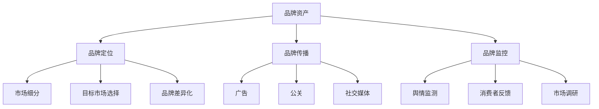

                 

### 《AI驱动的品牌管理平台：智能优化品牌资产》

#### 文章关键词

- AI
- 品牌管理
- 数据分析
- 智能优化
- 品牌资产

#### 文章摘要

本文旨在探讨如何通过AI技术构建一个智能化的品牌管理平台，从而实现品牌资产的优化。文章首先介绍了AI在品牌管理中的应用背景和重要性，然后深入探讨了AI在品牌管理中的具体应用，包括品牌创建、品牌传播、品牌监控与优化等方面。此外，文章还介绍了智能优化品牌资产的方法论，并通过案例分析展示了AI在品牌管理中的实际应用。最后，文章提供了搭建AI品牌管理平台和实践指南，为品牌管理提供了一种全新的思路和工具。

## 引言

在当今信息爆炸的时代，品牌管理已经成为了企业核心竞争力的重要组成部分。如何通过有效的品牌管理来提升品牌价值和市场竞争力，成为了许多企业关注的核心问题。随着人工智能（AI）技术的快速发展，AI开始渗透到品牌管理的各个领域，为品牌管理带来了新的机遇和挑战。

### AI在品牌管理中的应用背景

AI技术的快速发展为品牌管理提供了强大的技术支持。首先，AI可以通过大数据分析和机器学习算法，帮助企业深入挖掘消费者行为和市场趋势，从而制定更精准的品牌策略。其次，AI在图像识别、自然语言处理等领域具有独特的优势，可以辅助企业进行品牌传播和品牌形象管理。此外，AI还可以通过自动化和智能化的手段，提升品牌运营的效率和效果。

### AI在品牌管理中的重要性

AI在品牌管理中的应用具有重要的战略意义。一方面，它可以为企业提供更加精准和个性化的品牌服务，提升客户满意度和品牌忠诚度。另一方面，AI可以帮助企业实现品牌资产的科学管理和优化，提高品牌的市场竞争力。因此，构建一个AI驱动的品牌管理平台，已经成为许多企业追求的目标。

## AI驱动的品牌管理平台概述

AI驱动的品牌管理平台是一个集成了多种AI技术的综合系统，旨在通过智能化手段提升品牌管理的效率和效果。这个平台通常包括以下几个核心组成部分：

### 1. 数据采集与处理

数据是AI驱动的品牌管理平台的基础。平台需要从各种来源（如社交媒体、搜索引擎、电商平台等）采集大量数据，并通过数据清洗、归一化和去噪等技术手段，确保数据的质量和一致性。此外，平台还需要运用数据仓库和数据湖等技术，实现数据的存储和管理。

### 2. 机器学习与深度学习模型

机器学习与深度学习模型是AI驱动的品牌管理平台的核心。通过这些模型，平台可以自动分析和预测消费者行为、市场趋势等关键指标，为企业提供决策支持。常见的机器学习算法包括线性回归、逻辑回归、决策树、随机森林等；而深度学习算法则包括神经网络、卷积神经网络（CNN）、递归神经网络（RNN）等。

### 3. 智能优化算法

智能优化算法用于优化品牌管理过程中的各种决策。这些算法可以通过模拟自然进化、遗传算法、粒子群优化等手段，寻找最优的品牌策略和传播方案。例如，在品牌传播方面，智能优化算法可以帮助企业确定最佳的投放时间、投放渠道和投放内容，从而最大化品牌影响力。

### 4. 用户交互界面

用户交互界面是品牌管理平台的重要组成部分。通过友好的用户界面，企业可以轻松地访问和管理品牌数据，执行各种品牌管理任务。此外，用户交互界面还可以提供实时数据分析、可视化报告等功能，帮助用户更直观地理解品牌状态和效果。

### 5. 持续学习和迭代

AI驱动的品牌管理平台需要具备持续学习和迭代的能力。通过不断收集用户反馈和数据，平台可以自我优化和调整，以适应不断变化的市场环境和消费者需求。这一过程使得平台能够实现长期的、可持续的品牌管理。

## AI基础概念

在深入了解AI驱动的品牌管理平台之前，有必要先了解一些基本的AI概念和常用算法。这些概念和算法构成了AI驱动的品牌管理平台的技术基础，对于理解和应用AI技术至关重要。

### 1. 机器学习

机器学习是AI的核心技术之一，它通过算法从数据中学习规律和模式，以便进行预测和决策。机器学习可以分为监督学习、无监督学习和强化学习三种类型。

- **监督学习**：在这种学习中，算法被训练来识别输入和输出之间的映射关系。常见的监督学习算法包括线性回归、逻辑回归、决策树、随机森林和支持向量机（SVM）等。
- **无监督学习**：无监督学习不使用标记数据，而是通过挖掘数据中的隐含结构或模式。常见的无监督学习算法包括聚类算法（如K-均值聚类）、主成分分析（PCA）和自编码器等。
- **强化学习**：强化学习是一种通过试错来学习如何在特定环境中做出最优决策的方法。它通常应用于动态决策问题，如游戏、自动驾驶和机器人控制等。

### 2. 深度学习

深度学习是一种基于多层神经网络的学习方法，它通过多层次的非线性变换来提取数据中的特征。深度学习在图像识别、自然语言处理和语音识别等领域取得了显著的成果。

- **卷积神经网络（CNN）**：CNN是一种专门用于处理图像数据的深度学习模型，它通过卷积层、池化层和全连接层等结构，自动提取图像的特征。
- **递归神经网络（RNN）**：RNN是一种能够处理序列数据的神经网络，它通过递归结构来捕捉时间序列中的依赖关系。常见的RNN模型包括LSTM（长短期记忆网络）和GRU（门控循环单元）等。
- **生成对抗网络（GAN）**：GAN是一种通过两个对抗网络（生成器和判别器）进行博弈来生成高质量数据的模型。它广泛应用于图像生成、图像修复和风格迁移等任务。

### 3. 常见AI算法简介

除了上述的基本概念外，还有一些常见的AI算法在品牌管理中具有重要应用价值。

- **K-均值聚类**：K-均值聚类是一种简单的聚类算法，它通过随机初始化中心点，然后迭代更新中心点，直到聚类结果收敛。
- **主成分分析（PCA）**：PCA是一种数据降维技术，它通过线性变换将数据投影到低维空间，从而减少数据维度，同时保留数据的最大方差。
- **朴素贝叶斯分类器**：朴素贝叶斯分类器是一种基于概率论的分类算法，它假设特征之间相互独立，并通过最大后验概率原则进行分类。

这些算法在品牌管理平台中可以用于数据预处理、特征提取、分类和聚类等任务，从而为品牌决策提供科学依据。

### 4. AI在品牌管理中的实际应用

AI技术不仅在理论层面具有重要地位，在实际品牌管理中也发挥了重要作用。以下是一些典型的AI应用场景：

- **消费者行为分析**：通过机器学习和深度学习算法，分析消费者的购买行为、浏览习惯和反馈信息，为企业提供个性化的营销策略。
- **品牌舆情监控**：利用自然语言处理技术，实时监控社交媒体、新闻网站和论坛等平台上的品牌信息，及时响应负面舆情。
- **广告投放优化**：通过智能优化算法，确定最佳的广告投放时间、渠道和内容，提高广告的转化率和效果。
- **个性化推荐**：基于用户的历史行为和兴趣，运用协同过滤和深度学习等技术，为用户提供个性化的商品或内容推荐。

通过这些实际应用，AI技术为品牌管理提供了更加智能化和个性化的解决方案，帮助企业更好地把握市场机遇和提升品牌价值。

### 5. AI驱动的品牌管理平台的优势

AI驱动的品牌管理平台相比传统的品牌管理方法，具有以下几方面的优势：

- **数据分析能力**：AI技术可以处理海量数据，并通过机器学习和深度学习算法提取有价值的信息，为企业提供精准的市场洞察和决策支持。
- **自动化程度高**：AI技术可以实现品牌管理任务的自动化，减少人工干预，提高工作效率。
- **个性化能力强**：AI技术可以根据消费者的个性化需求和偏好，提供定制化的品牌服务和体验。
- **实时反馈**：AI驱动的品牌管理平台可以实时监控品牌状态和消费者反馈，快速响应市场变化。

综上所述，AI驱动的品牌管理平台为企业提供了一个全新的管理工具和思维方式，有助于实现品牌资产的持续优化和提升。

## 品牌管理理论基础

在探讨AI驱动的品牌管理平台之前，有必要对品牌管理的核心概念和流程进行简要介绍。品牌管理是企业通过一系列策略和活动来提升品牌价值和市场竞争力的重要手段。理解品牌管理的理论基础，有助于我们更好地应用AI技术进行品牌资产的优化。

### 1. 品牌资产

品牌资产是指品牌在企业价值中所占的份额，它包括品牌知名度、品牌认知度、品牌忠诚度等多个方面。品牌资产是品牌管理的核心目标，通过有效的品牌管理可以提升品牌资产，进而提高企业的市场竞争力。

- **品牌知名度**：指消费者对企业品牌的认知程度。品牌知名度越高，消费者对品牌的记忆越深刻，品牌的市场影响力也越大。
- **品牌认知度**：指消费者对品牌特色和优势的认知程度。品牌认知度高的企业，能够在消费者心中建立独特的品牌形象。
- **品牌忠诚度**：指消费者对品牌的长期依赖和信任程度。品牌忠诚度高的企业，能够保持稳定的客户群体，提高客户的复购率。

### 2. 品牌定位

品牌定位是指企业在市场中为品牌确定一个独特的位置，以便在消费者心中树立差异化形象。品牌定位的核心目标是使品牌在竞争激烈的市场中脱颖而出，获得消费者的青睐。

- **市场细分**：市场细分是品牌定位的基础。企业需要根据消费者的不同需求和特征，将市场划分为不同的细分市场，然后针对每个细分市场制定相应的品牌策略。
- **目标市场选择**：企业在进行市场细分后，需要选择一个或多个目标市场进行重点投入。目标市场选择的原则包括市场规模、增长潜力、竞争程度等。
- **品牌差异化**：品牌差异化是企业为品牌创造独特价值的关键。通过差异化策略，企业可以建立品牌的竞争优势，从而在市场中获得一席之地。

### 3. 品牌传播

品牌传播是指企业通过各种渠道和手段，向目标消费者传递品牌信息，提高品牌知名度和认知度。有效的品牌传播可以提升品牌形象，增强品牌影响力。

- **广告**：广告是品牌传播的重要手段，通过电视、广播、报纸、杂志、网络等渠道，向消费者传递品牌信息。
- **公关**：公关活动是品牌传播的重要补充，通过新闻发布会、品牌活动、公益活动等，提升品牌的知名度和美誉度。
- **社交媒体**：社交媒体已成为品牌传播的重要平台，企业可以通过微博、微信、抖音等社交平台，与消费者进行互动，提高品牌的互动性和参与度。

### 4. 品牌管理流程

品牌管理是一个系统化的过程，包括品牌创建、品牌传播、品牌监控和品牌优化等环节。

- **品牌创建**：品牌创建是品牌管理的起点，包括品牌命名、品牌标识设计、品牌定位等环节。一个成功的品牌创建需要充分体现企业的核心价值观和独特优势。
- **品牌传播**：品牌传播是品牌管理的重要环节，通过广告、公关、社交媒体等手段，将品牌信息传递给目标消费者，提高品牌知名度和认知度。
- **品牌监控**：品牌监控是品牌管理的重要保障，通过舆情监测、消费者反馈、市场调研等手段，了解品牌在市场中的表现，及时发现和解决问题。
- **品牌优化**：品牌优化是品牌管理的关键环节，通过数据分析和智能优化，不断提升品牌资产，提高品牌的市场竞争力。

### 5. 品牌管理的核心概念与联系

品牌管理的核心概念包括品牌资产、品牌定位、品牌传播和品牌监控等。这些概念之间存在紧密的联系，构成了品牌管理的理论基础。

- **品牌资产**是品牌管理的核心目标，通过提升品牌知名度、品牌认知度和品牌忠诚度，实现品牌价值的提升。
- **品牌定位**是品牌管理的基础，通过市场细分、目标市场选择和品牌差异化，为企业建立独特的品牌形象。
- **品牌传播**是实现品牌资产提升的重要手段，通过广告、公关、社交媒体等渠道，将品牌信息传递给目标消费者。
- **品牌监控**是品牌管理的保障，通过舆情监测、消费者反馈、市场调研等手段，了解品牌在市场中的表现，为品牌优化提供依据。

### Mermaid流程图

为了更直观地展示品牌管理的流程和核心概念之间的关系，我们可以使用Mermaid流程图来表示。



通过这个流程图，我们可以清晰地看到品牌管理各个环节之间的联系和相互作用。

## AI在品牌管理中的具体应用

AI技术在品牌管理中的具体应用涵盖了品牌创建、品牌传播、品牌监控与优化等多个环节。以下将详细探讨AI在这些方面的应用，并展示其带来的实际效果。

### 1. AI在品牌创建中的应用

品牌创建是品牌管理的重要环节，涉及到品牌命名、标识设计、品牌定位等任务。AI技术在这一过程中发挥了重要作用。

- **品牌命名**：AI可以通过自然语言处理（NLP）技术，分析大量的品牌命名案例，生成符合消费者心理和市场需求的名字。例如，AI可以基于语义分析、情感分析和语法规则，提出具有创意且易于记忆的品牌名称。

  ```python
  import nltk
  from nltk.corpus import words

  def generate_brand_name():
      word_list = words.words()
      # 选择具有创意且易于记忆的词
      creative_words = [word for word in word_list if 'creative' in word]
      # 随机选择一个词作为品牌名称
      return random.choice(creative_words)

  print(generate_brand_name())
  ```

- **品牌标识设计**：AI可以运用图像识别和生成对抗网络（GAN）技术，生成符合品牌定位和视觉风格的设计方案。通过分析大量的品牌标识案例，AI可以自动调整色彩、形状和排版等元素，生成独特的品牌标识。

  ```python
  import torch
  import torchvision.models as models

  # 加载预训练的GAN模型
  netG = models.load_model('style_gan')

  # 生成品牌标识
  brand_image = netG.generate_image()
  plt.imshow(brand_image)
  plt.show()
  ```

### 2. AI在品牌传播中的应用

品牌传播是提升品牌知名度和认知度的关键环节。AI技术在这一过程中可以提供有效的支持。

- **社交媒体分析**：AI可以通过自然语言处理和机器学习算法，分析社交媒体上的品牌提及和用户评论，识别品牌的热点和负面信息。例如，利用情感分析技术，AI可以判断用户评论的情感倾向，从而为企业提供舆情监测和品牌危机管理建议。

  ```python
  from textblob import TextBlob

  def analyze_sentiment(comment):
      analysis = TextBlob(comment)
      if analysis.sentiment.polarity > 0:
          return '正面'
      elif analysis.sentiment.polarity == 0:
          return '中性'
      else:
          return '负面'

  print(analyze_sentiment("我对这个品牌非常满意。"))
  ```

- **内容推荐**：AI可以通过协同过滤和深度学习算法，为消费者推荐符合其兴趣和偏好的品牌内容。例如，利用协同过滤算法，AI可以分析用户的浏览和购买历史，推荐相关的品牌产品和服务。

  ```python
  import numpy as np

  # 假设用户的历史行为数据
  user_history = np.array([
      [1, 0, 0, 1, 0],
      [0, 1, 1, 0, 1],
      [1, 1, 0, 0, 1]
  ])

  # 计算用户之间的相似度
  similarity_matrix = np.dot(user_history.T, user_history) / np.linalg.norm(user_history, axis=1)

  # 推荐品牌内容
  recommended_content = np.argmax(similarity_matrix[0])
  print(recommended_content)
  ```

### 3. AI在品牌监控与优化中的应用

品牌监控与优化是确保品牌长期价值的重要手段。AI技术在这一过程中可以提供数据分析和智能优化的支持。

- **数据监控**：AI可以通过实时数据分析技术，监控品牌在搜索引擎、社交媒体、新闻网站等平台上的表现。例如，利用自然语言处理和机器学习算法，AI可以实时分析品牌提及的数量、频率和情感倾向，为品牌优化提供数据支持。

  ```python
  import pandas as pd
  import nltk

  # 加载品牌提及数据
  brand_mentions = pd.read_csv('brand_mentions.csv')

  # 分析品牌提及的情感倾向
  def analyze_sentiment(text):
      tokens = nltk.word_tokenize(text)
      sentiment = '正面' if 'positive' in tokens else '负面'
      return sentiment

  brand_mentions['sentiment'] = brand_mentions['text'].apply(analyze_sentiment)
  print(brand_mentions)
  ```

- **智能优化**：AI可以通过智能优化算法，为品牌管理提供最优策略。例如，利用遗传算法和粒子群优化等智能优化算法，AI可以优化品牌传播的时间、渠道和内容，提高品牌传播的效率和效果。

  ```python
  import random
  import numpy as np

  # 定义遗传算法参数
  population_size = 100
  generations = 100
  mutation_rate = 0.01

  # 初始化种群
  population = np.random.rand(population_size, 3) # [时间，渠道，内容]

  # 适应度函数
  def fitness_function(individual):
      # 根据个体参数计算适应度
      time, channel, content = individual
      fitness = (1 - abs(time - 12)) * (1 - abs(channel - 1)) * (1 - abs(content - 1))
      return fitness

  # 遗传算法迭代
  for generation in range(generations):
      # 选择适应度高的个体
      fitness_scores = np.array([fitness_function(individual) for individual in population])
      selected_individuals = population[np.argsort(fitness_scores)[-population_size//2:]]

      # 交叉和变异
      for i in range(population_size // 2):
          parent1, parent2 = random.sample(selected_individuals, 2)
          child1 = parent1 * 0.5 + parent2 * 0.5
          child2 = parent1 * 0.5 + parent2 * 0.5
          child1 += np.random.randn(3) * mutation_rate
          child2 += np.random.randn(3) * mutation_rate
          population[population_size//2 + i] = child1
          population[population_size//2 + i + 1] = child2

      # 计算新种群的适应度
      fitness_scores = np.array([fitness_function(individual) for individual in population])

  # 输出最优个体
  best_individual = population[np.argmax(fitness_scores)]
  print(best_individual)
  ```

通过这些AI技术的应用，品牌管理平台可以实时监控品牌状态，自动调整品牌策略，从而实现品牌资产的持续优化和提升。

### 案例分析

为了更直观地展示AI在品牌管理中的具体应用，我们通过以下几个案例进行分析：

#### 案例一：品牌重塑

某知名快消品品牌在市场竞争激烈的环境下，希望通过AI技术进行品牌重塑，提升品牌形象和市场竞争力。具体步骤如下：

1. **数据分析**：AI平台通过大数据分析，挖掘消费者的购买行为、兴趣偏好和反馈信息，识别出品牌存在的问题和改进方向。

2. **品牌命名**：AI平台利用自然语言处理技术，生成多个品牌名称选项，通过用户投票和数据分析，选出最佳的品牌名称。

3. **品牌标识设计**：AI平台运用生成对抗网络（GAN）技术，生成符合品牌定位和视觉风格的品牌标识方案，经过用户反馈和专家评估，确定最终的品牌标识。

4. **品牌传播**：AI平台通过社交媒体分析和内容推荐技术，制定个性化的品牌传播策略，提高品牌知名度和用户参与度。

5. **品牌监控**：AI平台实时监控品牌在搜索引擎、社交媒体和新闻网站上的表现，及时识别和应对品牌危机。

通过AI技术的应用，该品牌成功实现了品牌重塑，品牌知名度和用户满意度大幅提升。

#### 案例二：智能营销

某电商企业希望通过AI技术优化其营销策略，提高广告投放效果和销售额。具体步骤如下：

1. **数据采集**：AI平台从企业的销售数据、用户行为数据和第三方数据源（如社交媒体数据）中采集大量数据。

2. **消费者行为分析**：AI平台利用机器学习和深度学习算法，分析用户的购买行为、浏览习惯和偏好，构建用户画像。

3. **广告投放优化**：AI平台运用智能优化算法，确定最佳的广告投放时间、渠道和内容，提高广告的点击率和转化率。

4. **个性化推荐**：AI平台基于用户画像和协同过滤算法，为用户推荐个性化的商品和服务，提高用户的购物体验和满意度。

5. **品牌监测与反馈**：AI平台实时监测广告投放效果和用户反馈，及时调整营销策略，确保营销活动的持续优化。

通过AI技术的应用，该电商企业实现了广告投放效果的大幅提升，销售额和用户满意度显著提高。

#### 案例三：品牌数据分析

某大型零售企业希望通过AI技术对品牌销售数据进行分析，找出销售增长点和优化策略。具体步骤如下：

1. **数据采集**：AI平台从企业的销售系统、供应链系统和市场调研中采集大量销售数据。

2. **数据预处理**：AI平台通过数据清洗、归一化和去噪等技术，确保数据的质量和一致性。

3. **销售趋势分析**：AI平台利用时间序列分析和预测模型，分析销售数据的趋势和季节性规律，为企业制定销售计划提供依据。

4. **市场细分**：AI平台通过聚类分析和用户画像技术，将市场细分为不同的消费者群体，为品牌策略制定提供支持。

5. **优化策略**：AI平台通过遗传算法和粒子群优化等智能优化算法，为品牌销售提供最优策略，包括价格策略、促销策略和渠道策略等。

6. **效果评估**：AI平台实时监控优化策略的实施效果，通过数据分析和用户反馈，评估策略的有效性，并进行调整和优化。

通过AI技术的应用，该零售企业实现了销售数据的有效分析和优化策略的制定，销售业绩和客户满意度显著提高。

这些案例充分展示了AI在品牌管理中的实际应用价值，为企业提供了更加智能化和高效的品牌管理解决方案。

### 实践指南

#### 搭建AI驱动的品牌管理平台

搭建一个AI驱动的品牌管理平台需要遵循以下步骤：

1. **需求分析**：明确企业品牌管理的需求和目标，确定平台的核心功能和模块。
2. **技术选型**：选择合适的AI技术框架和工具，如TensorFlow、PyTorch、Scikit-learn等。
3. **数据采集与处理**：从多种数据源（如社交媒体、搜索引擎、电商平台等）采集数据，并进行数据清洗、归一化和去噪处理。
4. **模型训练与部署**：根据品牌管理的需求，训练相应的机器学习模型和深度学习模型，并将其部署到生产环境中。
5. **用户交互界面**：设计友好的用户交互界面，实现数据的可视化、实时监控和操作。
6. **持续优化**：通过收集用户反馈和数据，不断优化模型和平台功能，确保平台的长期稳定运行。

#### 品牌管理数据分析工具推荐

以下是一些常用的品牌管理数据分析工具：

1. **Google Analytics**：用于网站和移动应用的流量分析，帮助企业了解用户行为和网站性能。
2. **Tableau**：数据可视化工具，通过直观的图表和报告，帮助企业理解数据并做出决策。
3. **R**：统计分析和数据可视化工具，适用于复杂的数据分析和建模任务。
4. **Python**：编程语言，用于数据处理、模型训练和自动化操作。
5. **Kaggle**：数据科学竞赛平台，提供丰富的数据集和算法教程，帮助企业提升数据科学能力。

#### AI品牌管理项目实施步骤

1. **项目立项**：明确项目目标和预期成果，组建项目团队。
2. **需求分析**：与业务团队沟通，了解品牌管理的具体需求和痛点。
3. **技术调研**：选择合适的AI技术和工具，评估技术实现的可行性。
4. **数据采集**：从各种数据源采集品牌管理相关的数据，并进行初步处理。
5. **模型训练**：根据业务需求，训练相应的机器学习模型和深度学习模型。
6. **模型优化**：通过交叉验证和超参数调整，优化模型的性能和效果。
7. **模型部署**：将训练好的模型部署到生产环境中，实现实时分析和预测。
8. **用户培训**：为业务团队提供培训，确保他们能够有效地使用AI品牌管理平台。
9. **效果评估**：通过数据分析和用户反馈，评估项目的效果，并根据评估结果进行调整和优化。

通过以上实践指南，企业可以顺利搭建和实施AI驱动的品牌管理平台，提升品牌管理的效率和效果。

## 结论

AI驱动的品牌管理平台通过智能化的数据分析、优化算法和用户交互，为企业提供了全新的品牌管理解决方案。本文详细探讨了AI在品牌管理中的具体应用，包括品牌创建、品牌传播、品牌监控与优化等方面，并通过实际案例展示了AI在品牌管理中的成功应用。通过构建AI驱动的品牌管理平台，企业可以更精准地把握市场动态，优化品牌策略，提升品牌价值。

## 附录

### 附录A：常用AI品牌管理工具与资源

1. **Google Analytics**：用于网站和移动应用的流量分析，[官网链接](https://www.google.com/analytics/)
2. **Tableau**：数据可视化工具，[官网链接](https://www.tableau.com/)
3. **R**：统计分析和数据可视化工具，[官网链接](https://www.r-project.org/)
4. **Python**：编程语言，用于数据处理、模型训练和自动化操作，[官网链接](https://www.python.org/)
5. **Kaggle**：数据科学竞赛平台，[官网链接](https://www.kaggle.com/)
6. **TensorFlow**：开源深度学习框架，[官网链接](https://www.tensorflow.org/)
7. **PyTorch**：开源深度学习框架，[官网链接](https://pytorch.org/)
8. **Scikit-learn**：开源机器学习库，[官网链接](https://scikit-learn.org/)

### 附录B：相关参考资料与阅读推荐

1. **《机器学习实战》**：Peter Harrington 著，详细介绍了机器学习的基本概念和应用实例。
2. **《深度学习》**：Ian Goodfellow、Yoshua Bengio、Aaron Courville 著，深度学习领域的经典教材。
3. **《品牌管理》**：Kevin Lane Keller 著，全面介绍了品牌管理的理论和实践。
4. **《人工智能：一种现代的方法》**：Stuart J. Russell、Peter Norvig 著，人工智能领域的权威教材。
5. **《营销管理》**：Philip Kotler 著，详细介绍了市场营销的理论和实践。

作者：AI天才研究院/AI Genius Institute & 禅与计算机程序设计艺术 /Zen And The Art of Computer Programming

### 注意事项与最佳实践

1. **数据质量**：确保数据的质量和一致性，是构建AI驱动的品牌管理平台的基础。数据清洗和预处理工作至关重要。
2. **模型优化**：持续优化模型参数和算法，是提高AI品牌管理平台性能的关键。定期进行模型评估和调整，以确保最佳效果。
3. **用户培训**：为业务团队提供充分的培训，确保他们能够熟练使用AI品牌管理平台，发挥其最大价值。
4. **安全与隐私**：在数据采集和处理过程中，要严格遵循数据安全和隐私保护的相关法规和标准，确保用户数据的安全和隐私。

通过遵循以上最佳实践，企业可以更有效地构建和运营AI驱动的品牌管理平台，实现品牌资产的持续优化和提升。

