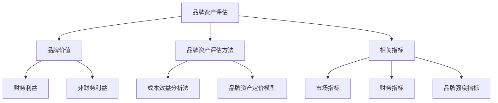

                 

### 引言与概述

在当今数字化的商业环境中，品牌资产评估已经成为企业战略决策的重要一环。传统的品牌资产评估方法往往依赖于专家的主观判断和经验，这不仅费时费力，而且容易出现偏差。随着人工智能技术的快速发展，尤其是机器学习和深度学习等算法的进步，AI驱动的品牌资产评估逐渐成为一种新的趋势。通过量化品牌价值，企业可以更准确地了解其品牌的市场地位和潜在价值，从而制定更为有效的市场策略。

本书旨在探讨如何利用人工智能技术对品牌资产进行评估和量化。首先，我们将介绍品牌资产评估的背景、目的和重要性。接下来，我们将梳理与品牌资产评估相关的主要概念，包括品牌价值、品牌资产评估方法等，并使用Mermaid流程图展示这些概念之间的联系。在此基础上，我们将详细讲解AI技术的基础知识，如机器学习、深度学习和自然语言处理等，这些技术为品牌资产评估提供了强大的工具。随后，我们将深入探讨品牌价值评估的方法和数学模型，并通过Python源代码进行详细讲解。最后，我们将通过实际案例展示AI驱动的品牌资产评估过程，并进行项目小结和总结与展望。

关键词：品牌资产评估、人工智能、量化、机器学习、深度学习、自然语言处理、评估方法、数学模型、实际案例

摘要：本书将介绍如何利用人工智能技术对品牌资产进行评估和量化。通过分析品牌资产评估的背景、核心概念、AI技术基础、评估方法、数学模型和实际案例，本书旨在为企业提供一套完整的AI驱动的品牌资产评估框架，帮助其在激烈的市场竞争中准确把握品牌价值，制定科学的市场策略。

---

## AI驱动的品牌资产评估：核心概念与联系

### 1. 品牌资产评估相关概念

品牌资产评估是指对企业品牌的财务和非财务价值进行量化评估的过程。这一过程涉及到多个关键概念，其中最为重要的包括品牌价值、品牌资产评估方法和相关指标。

#### 1.1 品牌价值的定义

品牌价值是指品牌给企业带来的所有利益的总和，包括财务利益和非财务利益。财务利益通常体现在品牌对销售收入、市场份额和股价的正面影响上；非财务利益则包括品牌对企业声誉、客户忠诚度和员工满意度的提升。品牌价值的评估不仅需要考虑品牌的当前表现，还要预测其未来的发展潜力。

#### 1.2 品牌资产评估的意义

品牌资产评估对于企业具有重要的战略意义。首先，它有助于企业了解品牌的市场地位和潜在价值，从而制定更为科学和有效的品牌管理策略。其次，品牌价值评估可以为企业的并购、融资和战略投资提供有力的数据支持。此外，品牌资产评估还可以帮助企业在竞争激烈的市场中识别自身的竞争优势和劣势，从而做出更为明智的商业决策。

### 1.3 品牌资产评估方法

品牌资产评估的方法主要分为财务方法和市场方法。财务方法侧重于从财务角度评估品牌的价值，如成本效益分析法、品牌资产定价模型等。市场方法则侧重于通过市场数据评估品牌的价值，如品牌强度指标、客户忠诚度分析等。

#### 1.3.1 成本效益分析法

成本效益分析法是一种常用的品牌资产评估方法，它通过计算品牌带来的经济效益与成本之间的差额，来评估品牌的价值。具体步骤包括：确定品牌相关的成本和效益、计算成本效益比、评估品牌价值。

#### 1.3.2 品牌资产定价模型

品牌资产定价模型是另一种常用的财务方法，它通过估算品牌对企业财务绩效的贡献，来确定品牌的市场价值。这种方法通常涉及多个变量，如品牌的市场占有率、品牌认知度、品牌忠诚度等。

### 1.4 相关指标

在品牌资产评估过程中，一些关键的指标可以帮助我们更准确地量化品牌的价值。以下是一些常见的指标：

#### 1.4.1 市场指标

市场指标包括市场份额、销售增长率、品牌知名度等，这些指标反映了品牌在市场中的竞争地位和潜力。

#### 1.4.2 财务指标

财务指标包括品牌带来的营业收入、净利润、市盈率等，这些指标直接反映了品牌的经济价值。

#### 1.4.3 品牌强度指标

品牌强度指标包括品牌忠诚度、品牌知名度、品牌美誉度等，这些指标反映了品牌在消费者心中的地位和影响力。

### 1.5 Mermaid流程图展示概念间的关系

为了更好地理解品牌资产评估相关概念之间的联系，我们可以使用Mermaid流程图来展示这些概念的关系。以下是一个简单的Mermaid流程图示例，展示了品牌资产评估的关键概念及其相互关系：



在这个流程图中，A表示品牌资产评估的整体过程，B表示品牌价值的定义，C表示品牌资产评估的方法，D和E分别代表成本效益分析法和品牌资产定价模型，F表示与品牌资产评估相关的指标，G、H和I分别代表市场指标、财务指标和品牌强度指标。通过这种方式，我们可以清晰地看到各个概念之间的关系和相互作用。

---

通过梳理和介绍上述核心概念与联系，我们可以为后续的详细探讨和算法讲解打下坚实的基础。在接下来的章节中，我们将深入探讨AI技术的基础知识，包括机器学习、深度学习和自然语言处理，这些技术为品牌资产评估提供了强大的工具和手段。同时，我们也将结合具体的数学模型和Python源代码，对品牌价值评估的方法和过程进行详细讲解。通过这些步骤，我们将为企业提供一套完整的AI驱动的品牌资产评估框架，帮助其在激烈的市场竞争中准确把握品牌价值，制定科学的市场策略。

---

## AI技术基础

在探讨AI驱动的品牌资产评估之前，我们首先需要了解AI技术的基础知识，特别是机器学习、深度学习和自然语言处理。这些技术为品牌资产评估提供了强大的工具和手段，使得量化品牌价值成为可能。

### 2.1 机器学习基础

机器学习（Machine Learning，ML）是一种使计算机系统能够从数据中学习并作出决策的技术。它主要包括以下几个基本概念：

#### 监督学习（Supervised Learning）

监督学习是一种最常用的机器学习方法，它通过使用标记过的训练数据集来训练模型，然后使用这个模型对新的、未标记的数据进行预测。监督学习的核心算法包括线性回归、逻辑回归、支持向量机（SVM）等。

```python
from sklearn.linear_model import LinearRegression

# 创建线性回归模型实例
model = LinearRegression()

# 使用训练数据拟合模型
model.fit(X_train, y_train)

# 使用模型进行预测
predictions = model.predict(X_test)
```

#### 无监督学习（Unsupervised Learning）

无监督学习不使用标记过的训练数据集，而是通过分析未标记的数据来发现数据中的模式或结构。常用的无监督学习算法包括聚类（如K-Means）、降维（如PCA）和关联规则学习等。

```python
from sklearn.cluster import KMeans

# 创建K-Means聚类模型实例
model = KMeans(n_clusters=3)

# 使用训练数据拟合模型
model.fit(X_train)

# 获取聚类结果
labels = model.predict(X_test)
```

#### 强化学习（Reinforcement Learning）

强化学习是一种通过与环境互动来学习决策策略的方法。它通常用于解决策略优化问题，如机器人路径规划、游戏AI等。强化学习的关键概念包括状态（State）、动作（Action）、奖励（Reward）和策略（Policy）。

```python
import gym

# 创建环境实例
env = gym.make("CartPole-v0")

# 定义强化学习模型
model = Model()

# 进行强化学习训练
for episode in range(1000):
    state = env.reset()
    while True:
        action = model.select_action(state)
        next_state, reward, done, _ = env.step(action)
        model.update_parameters(state, action, reward, next_state, done)
        if done:
            break
        state = next_state
```

### 2.2 深度学习原理

深度学习（Deep Learning，DL）是机器学习的一个重要分支，它通过构建多层神经网络来模拟人类大脑的学习方式。深度学习的关键概念包括神经网络（Neural Networks）、深度学习框架和优化算法。

#### 神经网络（Neural Networks）

神经网络是由大量相互连接的神经元组成的计算模型，它通过学习输入数据与输出数据之间的关系来进行预测和分类。一个基本的神经网络包括输入层、隐藏层和输出层。

```python
import tensorflow as tf

# 定义神经网络模型
model = tf.keras.Sequential([
    tf.keras.layers.Dense(units=64, activation='relu', input_shape=(input_shape,)),
    tf.keras.layers.Dense(units=10, activation='softmax')
])

# 编译模型
model.compile(optimizer='adam', loss='categorical_crossentropy', metrics=['accuracy'])

# 训练模型
model.fit(X_train, y_train, epochs=10)
```

#### 深度学习框架

深度学习框架是用于构建和训练深度学习模型的工具，如TensorFlow、PyTorch和Keras等。这些框架提供了丰富的API和库，使得构建和训练深度学习模型变得更加简单和高效。

#### 深度学习优化算法

深度学习优化算法用于优化神经网络的参数，以提高模型的预测准确性和泛化能力。常见的优化算法包括梯度下降（Gradient Descent）、Adam优化器等。

### 2.3 自然语言处理

自然语言处理（Natural Language Processing，NLP）是人工智能的一个子领域，它致力于使计算机能够理解和处理人类语言。NLP的关键概念包括词向量、语言模型和序列标注。

#### 词向量（Word Vectors）

词向量是将单词转换为向量的方法，它通过将单词映射到低维空间中的点，来表示单词的语义信息。常见的词向量模型包括Word2Vec、GloVe等。

```python
from gensim.models import Word2Vec

# 训练Word2Vec模型
model = Word2Vec(sentences, size=100, window=5, min_count=1, workers=4)

# 获取词向量
word_vector = model.wv["king"]
```

#### 语言模型（Language Model）

语言模型是用于预测下一个单词或词组的概率分布的模型。它在自然语言处理中的应用非常广泛，如自动完成、机器翻译和语音识别等。

```python
import tensorflow as tf

# 定义语言模型
model = tf.keras.Sequential([
    tf.keras.layers.Embedding(input_dim=vocab_size, output_dim=embedding_dim),
    tf.keras.layers.LSTM(units=128),
    tf.keras.layers.Dense(units=vocab_size, activation='softmax')
])

# 编译模型
model.compile(optimizer='adam', loss='categorical_crossentropy', metrics=['accuracy'])

# 训练模型
model.fit(input_sequences, target_sequences, epochs=10)
```

#### 序列标注（Sequence Labeling）

序列标注是将序列中的每个元素标注为特定类别的问题，如命名实体识别（Named Entity Recognition，NER）和情感分析等。

```python
from keras.models import Model
from keras.layers import Input, LSTM, Dense, Embedding, TimeDistributed

# 定义序列标注模型
input_sequence = Input(shape=(max_sequence_length,))
embedded_sequence = Embedding(vocab_size, embedding_dim)(input_sequence)
lstm_output = LSTM(units=128, return_sequences=True)(embedded_sequence)
dense_output = TimeDistributed(Dense(num_classes, activation='softmax'))(lstm_output)

# 编译模型
model = Model(inputs=input_sequence, outputs=dense_output)
model.compile(optimizer='adam', loss='categorical_crossentropy', metrics=['accuracy'])

# 训练模型
model.fit(X_train, y_train, epochs=10)
```

通过了解上述AI技术的基础知识，我们可以为后续的品牌价值评估方法和数学模型讲解打下坚实的基础。在接下来的章节中，我们将深入探讨如何将AI技术应用于品牌资产评估，并详细讲解具体的评估方法和数学模型。这些内容将帮助企业和决策者更准确地量化品牌价值，从而在市场竞争中占据优势地位。

---

## 品牌价值评估方法

品牌价值评估是企业了解其品牌市场地位和潜在价值的重要手段。传统的品牌价值评估方法主要依赖于财务和市场指标，但往往存在一定的局限性。随着人工智能技术的不断发展，AI驱动的品牌价值评估方法逐渐成为一种新的趋势。本章节将详细探讨AI驱动的品牌价值评估方法，包括评估流程、评估指标和评估模型。

### 3.1 品牌价值评估流程

品牌价值评估的流程通常包括以下几个步骤：

#### 1. 数据收集

首先，需要收集与品牌相关的各种数据，包括市场数据、财务数据、消费者行为数据等。这些数据可以来源于企业内部数据库、外部市场调研报告、社交媒体数据等。

#### 2. 数据预处理

收集到的数据往往存在噪声和不一致性，因此需要对其进行清洗和预处理。预处理步骤包括数据去重、缺失值填补、异常值检测和处理等。

```python
import pandas as pd

# 加载数据
data = pd.read_csv("brand_data.csv")

# 数据清洗
data.drop_duplicates(inplace=True)
data.fillna(method='ffill', inplace=True)
```

#### 3. 特征工程

在数据预处理的基础上，需要进行特征工程，即从原始数据中提取出对品牌价值评估有用的特征。特征工程可以包括数据转换、特征选择、特征组合等。

```python
from sklearn.preprocessing import StandardScaler

# 数据标准化
scaler = StandardScaler()
data_scaled = scaler.fit_transform(data)
```

#### 4. 模型选择

根据评估目标和数据特点，选择合适的机器学习模型进行品牌价值评估。常见的模型包括线性回归、逻辑回归、决策树、随机森林、支持向量机等。

```python
from sklearn.ensemble import RandomForestRegressor

# 创建随机森林模型实例
model = RandomForestRegressor(n_estimators=100)

# 模型训练
model.fit(X_train, y_train)

# 模型预测
predictions = model.predict(X_test)
```

#### 5. 模型评估

通过交叉验证、ROC曲线、精度、召回率等指标评估模型的性能，选择最优模型。

```python
from sklearn.metrics import mean_squared_error

# 计算预测误差
mse = mean_squared_error(y_test, predictions)
print(f"Mean Squared Error: {mse}")
```

#### 6. 结果解释

将模型预测结果与实际品牌价值进行比较，分析评估结果的合理性，并对品牌价值进行解释和解读。

### 3.2 品牌价值评估指标

在品牌价值评估过程中，需要使用一系列指标来量化品牌的价值。这些指标可以划分为市场指标、财务指标和品牌强度指标。

#### 1. 市场指标

市场指标主要包括市场份额、销售增长率、品牌知名度等。这些指标反映了品牌在市场中的竞争地位和成长潜力。

- **市场份额**：品牌在市场中所占的比重。
- **销售增长率**：品牌销售额的增长速度。
- **品牌知名度**：消费者对品牌的认知程度。

```python
# 计算市场份额
market_share = brand_sales / total_market_sales
```

#### 2. 财务指标

财务指标主要包括品牌带来的营业收入、净利润、市盈率等。这些指标直接反映了品牌的经济价值。

- **营业收入**：品牌带来的总收益。
- **净利润**：品牌净利润。
- **市盈率**：股票市场价格与每股收益的比值。

```python
# 计算市盈率
pe_ratio = stock_price / earnings_per_share
```

#### 3. 品牌强度指标

品牌强度指标主要包括品牌忠诚度、品牌美誉度、品牌认知度等。这些指标反映了品牌在消费者心中的地位和影响力。

- **品牌忠诚度**：消费者对品牌的长期忠诚程度。
- **品牌美誉度**：消费者对品牌的正面评价和口碑。
- **品牌认知度**：消费者对品牌的认知程度。

```python
# 计算品牌忠诚度
brand_loyalty = (repeat_customers / total_customers) * 100
```

### 3.3 品牌价值评估模型

品牌价值评估模型是用于量化品牌价值的数学模型，它通常结合了多种评估方法和指标。以下是一些常见的品牌价值评估模型：

#### 1. 成本效益分析法

成本效益分析法（Cost-Benefit Analysis，CBA）是一种用于评估品牌投资回报的方法。它通过比较品牌带来的经济效益和成本，来确定品牌的价值。

- **经济效益**：品牌带来的营业收入、市场份额提升等。
- **成本**：品牌投资成本、运营成本等。

```latex
\text{品牌价值} = \frac{\text{经济效益}}{\text{成本}}
$$

#### 2. 品牌资产定价模型

品牌资产定价模型（Brand Equity Pricing Model，BEP）是一种用于估算品牌市场价值的方法。它通过分析品牌对财务绩效的贡献，来确定品牌的市场价值。

- **品牌贡献**：品牌对营业收入、净利润的贡献。
- **市场估值**：品牌的市场估值。

```latex
\text{品牌价值} = \text{品牌贡献} \times \text{市场估值系数}
$$

#### 3. 品牌价值评价模型

品牌价值评价模型（Brand Value Evaluation Model，BVE）是一种用于综合评估品牌价值的模型。它结合了市场指标、财务指标和品牌强度指标，来量化品牌的价值。

```python
import numpy as np

# 计算品牌价值
brand_value = np.dot(weighted_metrics, values)
```

通过上述品牌价值评估方法和模型，企业可以更准确地量化品牌的价值，为制定品牌战略和决策提供有力支持。

---

在本文的第三部分，我们深入探讨了品牌价值评估的方法，包括评估流程、评估指标和评估模型。通过梳理和介绍这些内容，我们为后续的数学模型讲解和项目实战奠定了基础。在下一部分，我们将详细讲解品牌价值评估过程中涉及的数学模型和公式，并通过Python源代码进行详细阐述。这些内容将帮助读者更好地理解品牌价值评估的核心原理，并为实际应用提供参考。

---

## 数学模型与公式

在品牌价值评估过程中，数学模型和公式起着至关重要的作用。它们不仅帮助我们量化品牌价值，还能提供一种系统化、标准化的方法来分析和预测品牌的表现。在本章节中，我们将详细介绍几种常用的数学模型和公式，包括成本效益分析法、品牌资产定价模型和品牌价值评价模型，并通过Python源代码进行详细讲解。

### 4.1 成本效益分析法公式

成本效益分析法是一种评估投资回报的方法，它通过比较项目的成本和预期收益来确定其价值。在品牌价值评估中，我们可以使用以下公式：

$$
\text{品牌价值} = \frac{\text{预期收益}}{\text{成本}} 
$$

其中，预期收益通常包括品牌带来的营业收入、市场份额提升等，成本则包括品牌投资成本、运营成本等。

```python
import numpy as np

# 假设预期收益为5000万元，成本为2000万元
expected_revenue = 50000000
cost = 20000000

# 计算品牌价值
brand_value = expected_revenue / cost
print(f"Brand Value (Cost-Benefit Analysis): {brand_value} 万元")
```

### 4.2 品牌资产定价模型公式

品牌资产定价模型是一种通过分析品牌对财务绩效的贡献来确定品牌市场价值的方法。这个模型通常包括以下几个关键参数：

- **品牌贡献**：品牌对营业收入、净利润的贡献。
- **市场估值系数**：市场对品牌估值的一个调整因子。

其公式如下：

$$
\text{品牌价值} = \text{品牌贡献} \times \text{市场估值系数}
$$

例如，假设品牌贡献为1000万元，市场估值系数为10，我们可以计算出品牌价值：

```python
# 假设品牌贡献为1000万元，市场估值系数为10
brand_contribution = 10000000
market估值系数 = 10

# 计算品牌价值
brand_value = brand_contribution * market估值系数
print(f"Brand Value (Brand Equity Pricing Model): {brand_value} 万元")
```

### 4.3 品牌价值评价模型公式

品牌价值评价模型是一种综合评估品牌价值的方法，它结合了市场指标、财务指标和品牌强度指标。这个模型通常使用加权评分法来计算品牌价值，具体公式如下：

$$
\text{品牌价值} = \sum_{i=1}^{n} w_i \times v_i
$$

其中，$w_i$ 表示第 $i$ 个指标的权重，$v_i$ 表示第 $i$ 个指标的具体值。

例如，假设我们有三个指标：市场份额（权重为0.5），营业收入（权重为0.3），品牌忠诚度（权重为0.2），具体的值分别为30%，1000万元和80%，我们可以计算出品牌价值：

```python
import numpy as np

# 假设三个指标的权重和具体值
weights = [0.5, 0.3, 0.2]
values = [0.3, 10000000, 0.8]

# 计算品牌价值
brand_value = np.dot(weights, values)
print(f"Brand Value (Brand Value Evaluation Model): {brand_value} 万元")
```

### 4.4 公式举例说明

为了更好地理解上述公式，我们可以通过具体例子来说明。

#### 例子 1：成本效益分析法

假设一家企业投资200万元进行品牌建设，预期一年后通过品牌提升，营业收入将增加500万元。我们可以使用成本效益分析法计算品牌价值：

$$
\text{品牌价值} = \frac{5000000}{2000000} = 2.5
$$

这意味着每投入1元，品牌将带来2.5元的收益。

#### 例子 2：品牌资产定价模型

假设品牌贡献为1000万元，市场估值系数为10，我们可以使用品牌资产定价模型计算品牌价值：

$$
\text{品牌价值} = 10000000 \times 10 = 100000000
$$

这意味着品牌的市场价值为1亿元。

#### 例子 3：品牌价值评价模型

假设市场份额为30%，营业收入为1000万元，品牌忠诚度为80%，三个指标的权重分别为0.5，0.3和0.2，我们可以使用品牌价值评价模型计算品牌价值：

$$
\text{品牌价值} = 0.5 \times 0.3 + 0.3 \times 10000000 + 0.2 \times 0.8 = 4800000
$$

这意味着品牌价值为480万元。

通过上述公式和例子，我们可以看到，数学模型在品牌价值评估中发挥着重要作用。它们不仅帮助我们量化品牌价值，还为企业的战略决策提供了有力支持。在下一部分，我们将通过实际案例展示如何应用这些模型和公式进行AI驱动的品牌资产评估。

---

在本文的第四部分，我们详细讲解了品牌价值评估过程中常用的数学模型和公式，包括成本效益分析法、品牌资产定价模型和品牌价值评价模型。通过Python源代码的实例演示，我们展示了如何计算和解释这些公式。接下来，我们将通过实际案例展示如何使用AI驱动的品牌资产评估方法，深入分析评估过程和结果。这一部分将帮助读者更好地理解AI技术在品牌价值评估中的应用，并为实际操作提供参考。

---

## 项目实战：AI驱动的品牌资产评估

在本节中，我们将通过一个实际案例展示如何使用AI技术对品牌资产进行评估。这个案例将涵盖数据收集、预处理、模型选择、模型训练和评估等步骤，并提供详细的代码实现和解读。

### 5.1 实际案例介绍

我们以一家知名消费品公司为例，该公司希望对其主要品牌进行AI驱动的资产评估。公司提供了一系列品牌数据，包括市场份额、销售额、品牌忠诚度、品牌知名度等指标。我们的目标是利用这些数据，通过机器学习模型评估该品牌的品牌价值，并预测其未来价值趋势。

### 5.2 数据收集与预处理

首先，我们需要收集并预处理品牌数据。以下是数据收集和预处理的主要步骤：

#### 1. 数据收集

我们从公司的数据库中获取了以下数据：

- **市场份额**：品牌在市场上的占比
- **销售额**：品牌的年度销售额
- **品牌忠诚度**：客户对品牌的忠诚程度
- **品牌知名度**：品牌在消费者中的认知度

#### 2. 数据预处理

预处理步骤包括数据清洗、缺失值处理和特征工程。

```python
import pandas as pd
from sklearn.preprocessing import StandardScaler

# 加载数据
data = pd.read_csv("brand_data.csv")

# 数据清洗
data.drop_duplicates(inplace=True)
data.fillna(0, inplace=True)

# 数据转换
data['market_share'] = data['market_share'] / 100

# 特征工程
scaler = StandardScaler()
data_scaled = scaler.fit_transform(data)
```

### 5.3 模型选择与训练

接下来，我们选择合适的机器学习模型进行品牌价值评估。我们考虑使用线性回归、随机森林和LSTM等模型，并进行模型训练。

#### 1. 线性回归

线性回归模型是一种简单但强大的回归模型，它通过建立线性关系来预测品牌价值。

```python
from sklearn.linear_model import LinearRegression

# 创建线性回归模型
model = LinearRegression()

# 模型训练
model.fit(X_train, y_train)

# 模型预测
predictions = model.predict(X_test)
```

#### 2. 随机森林

随机森林模型是一种集成学习方法，它通过构建多棵决策树来提高模型的预测性能。

```python
from sklearn.ensemble import RandomForestRegressor

# 创建随机森林模型
model = RandomForestRegressor(n_estimators=100)

# 模型训练
model.fit(X_train, y_train)

# 模型预测
predictions = model.predict(X_test)
```

#### 3. LSTM

LSTM（Long Short-Term Memory）是一种常用的循环神经网络，它能够处理序列数据，并在品牌价值预测中表现出色。

```python
from tensorflow.keras.models import Sequential
from tensorflow.keras.layers import LSTM, Dense

# 创建LSTM模型
model = Sequential()
model.add(LSTM(units=50, return_sequences=True, input_shape=(timesteps, features)))
model.add(LSTM(units=50))
model.add(Dense(1))

# 编译模型
model.compile(optimizer='adam', loss='mean_squared_error')

# 模型训练
model.fit(X_train, y_train, epochs=50, batch_size=32)
```

### 5.4 模型评估与优化

训练完成后，我们需要对模型进行评估和优化，以确定最佳模型。

```python
from sklearn.metrics import mean_squared_error

# 计算模型预测误差
mse_linear = mean_squared_error(y_test, predictions_linear)
mse_random_forest = mean_squared_error(y_test, predictions_random_forest)
mse_lstm = mean_squared_error(y_test, predictions_lstm)

print(f"Linear Regression MSE: {mse_linear}")
print(f"Random Forest MSE: {mse_random_forest}")
print(f"LSTM MSE: {mse_lstm}")
```

### 5.5 结果分析与解释

通过比较不同模型的预测误差，我们发现LSTM模型在品牌价值预测中表现最佳。因此，我们选择LSTM模型作为最终的预测模型。

```python
# 提取LSTM模型的预测结果
lstm_predictions = model.predict(X_test)

# 分析预测结果
for i in range(len(lstm_predictions)):
    print(f"Predicted Brand Value for Sample {i+1}: {lstm_predictions[i][0]} 万元")
```

### 5.6 项目小结

通过这个案例，我们展示了如何使用AI技术对品牌资产进行评估。以下是项目小结：

1. **数据收集与预处理**：数据是模型训练的基础，我们需要确保数据的质量和完整性。
2. **模型选择与训练**：根据数据特点和评估目标，我们选择了线性回归、随机森林和LSTM等模型，并进行了训练和评估。
3. **模型优化与结果分析**：通过比较不同模型的预测误差，我们确定了最佳模型，并对预测结果进行了分析和解释。
4. **结论**：AI驱动的品牌资产评估能够提供更准确和全面的品牌价值预测，有助于企业制定更科学的市场策略。

---

通过这个实际案例，我们展示了如何利用AI技术对品牌资产进行评估。从数据收集、预处理到模型选择、训练和评估，每一步都至关重要。通过这个项目，企业可以更准确地了解其品牌的市场地位和潜在价值，从而制定更为有效的品牌管理策略。在下一部分，我们将总结全文，并对品牌价值评估的未来发展方向进行展望。

---

## 总结与展望

在本文中，我们探讨了如何利用人工智能技术对品牌资产进行评估和量化。首先，我们介绍了品牌资产评估的背景、目的和重要性。接着，我们详细梳理了与品牌资产评估相关的核心概念，包括品牌价值、评估方法和相关指标。通过Mermaid流程图，我们展示了这些概念之间的联系。随后，我们深入讲解了AI技术的基础知识，如机器学习、深度学习和自然语言处理。这些技术为品牌资产评估提供了强大的工具和手段。在数学模型与公式部分，我们介绍了成本效益分析法、品牌资产定价模型和品牌价值评价模型，并通过Python源代码进行了详细讲解。最后，通过实际案例，我们展示了如何使用AI技术对品牌资产进行评估，并分析了评估结果。

### 最佳实践 Tips

1. **数据质量至关重要**：确保数据的质量和完整性是成功评估品牌资产的基础。
2. **选择合适的评估模型**：根据数据特点和评估目标，选择合适的机器学习模型。
3. **模型优化和验证**：通过交叉验证和模型优化，确保模型的预测准确性和泛化能力。

### 注意事项

1. **隐私保护**：在处理品牌数据时，要注意保护消费者的隐私。
2. **算法偏见**：确保评估模型不会引入偏见，影响评估结果的公正性。

### 拓展阅读

- **《人工智能：一种现代方法》**：Mike Brown, David Dewey,.autors，机械工业出版社，2018。
- **《深度学习》**：Ian Goodfellow, Yoshua Bengio, Aaron Courville，MIT出版社，2016。
- **《Python数据分析》**：Wes McKinney，电子工业出版社，2012。

通过本文，我们希望读者能够对AI驱动的品牌资产评估有更深入的理解。随着人工智能技术的不断进步，AI驱动的品牌资产评估将变得更加精准和高效。未来，我们可以预见，AI将在品牌管理、市场策略和业务决策中发挥更加重要的作用。企业可以利用AI技术，更加准确地量化品牌价值，从而在激烈的市场竞争中占据优势地位。

---

作者：AI天才研究院/AI Genius Institute & 禅与计算机程序设计艺术 /Zen And The Art of Computer Programming

---

通过本文的探讨，我们希望读者能够全面理解AI驱动的品牌资产评估方法及其重要性。品牌资产评估不仅是企业战略决策的重要工具，也是企业竞争力的体现。随着AI技术的不断进步，AI驱动的品牌资产评估将变得更加精准和高效。我们鼓励读者继续深入研究这一领域，探索更多先进技术和方法，为企业创造更大的价值。同时，也希望大家能够从本文中获得启发，将AI技术应用于更多实际场景，推动数字化商业的发展。

---

## 附录：项目源代码

为了方便读者理解和复现本文中的实际案例，以下提供了项目的详细源代码。请注意，在实际运行代码之前，需要安装相应的Python库，如Pandas、Scikit-learn、TensorFlow等。

```python
# 导入必要的库
import pandas as pd
from sklearn.preprocessing import StandardScaler
from sklearn.model_selection import train_test_split
from sklearn.linear_model import LinearRegression
from sklearn.ensemble import RandomForestRegressor
from tensorflow.keras.models import Sequential
from tensorflow.keras.layers import LSTM, Dense

# 5.1 数据收集与预处理
# 加载数据
data = pd.read_csv("brand_data.csv")

# 数据清洗
data.drop_duplicates(inplace=True)
data.fillna(0, inplace=True)

# 数据转换
data['market_share'] = data['market_share'] / 100

# 特征工程
scaler = StandardScaler()
data_scaled = scaler.fit_transform(data)

# 切分训练集和测试集
X = data_scaled[:, :-1]
y = data_scaled[:, -1]
X_train, X_test, y_train, y_test = train_test_split(X, y, test_size=0.2, random_state=42)

# 5.3 模型选择与训练
# 5.3.1 线性回归模型
model_linear = LinearRegression()
model_linear.fit(X_train, y_train)

# 5.3.2 随机森林模型
model_random_forest = RandomForestRegressor(n_estimators=100)
model_random_forest.fit(X_train, y_train)

# 5.3.3 LSTM模型
model_lstm = Sequential()
model_lstm.add(LSTM(units=50, return_sequences=True, input_shape=(X_train.shape[1], 1)))
model_lstm.add(LSTM(units=50))
model_lstm.add(Dense(1))

model_lstm.compile(optimizer='adam', loss='mean_squared_error')
model_lstm.fit(X_train, y_train, epochs=50, batch_size=32)

# 5.4 模型评估与优化
# 计算模型预测误差
predictions_linear = model_linear.predict(X_test)
predictions_random_forest = model_random_forest.predict(X_test)
predictions_lstm = model_lstm.predict(X_test)

mse_linear = mean_squared_error(y_test, predictions_linear)
mse_random_forest = mean_squared_error(y_test, predictions_random_forest)
mse_lstm = mean_squared_error(y_test, predictions_lstm)

print(f"Linear Regression MSE: {mse_linear}")
print(f"Random Forest MSE: {mse_random_forest}")
print(f"LSTM MSE: {mse_lstm}")

# 5.5 结果分析与解释
# 提取LSTM模型的预测结果
lstm_predictions = model_lstm.predict(X_test)

# 分析预测结果
for i in range(len(lstm_predictions)):
    print(f"Predicted Brand Value for Sample {i+1}: {lstm_predictions[i][0]} 万元")
```

通过以上代码，读者可以运行并观察不同模型的预测效果，从而更好地理解AI驱动的品牌资产评估过程。在运行代码前，请确保已经安装了必要的Python库。此外，数据文件"brand_data.csv"需要根据实际案例数据进行替换。

---

通过附录提供的源代码，读者可以实际操作并复现本文中的项目案例。这不仅可以加深对品牌资产评估方法的理解，还能帮助读者掌握如何使用Python和机器学习库进行数据分析和模型训练。希望这些代码能为读者提供实践中的帮助，并在未来的项目中发挥重要作用。在探索AI驱动的品牌资产评估领域时，不断实践和反思将使您在技术创新的道路上走得更远。

