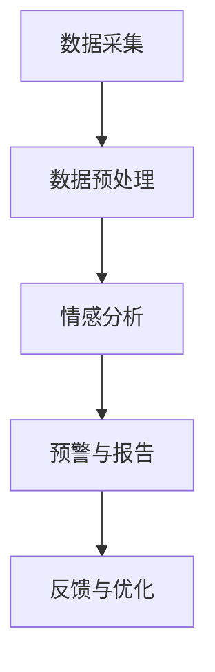
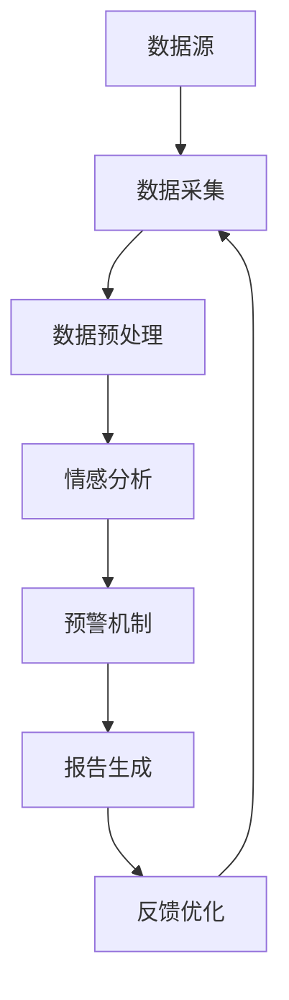

                 

### 第1章 引言

#### 1.1 研究背景与意义

在当今数字化时代，品牌声誉的维护已经成为企业生存与发展的关键因素。随着互联网的普及和社交媒体的兴起，消费者对于品牌的态度和评价变得前所未有的透明和即时。在这种背景下，如何实时监测和把握品牌声誉，成为企业迫切需要解决的问题。

声誉监测系统作为企业了解消费者反馈、管理和提升品牌形象的重要工具，其重要性愈发凸显。传统的声誉监测方法主要依赖于人工搜索和筛选，效率低、范围有限，难以满足快速变化的网络环境。而人工智能（AI）的引入，特别是机器学习和深度学习的应用，为声誉监测带来了全新的契机。AI驱动的声誉监测系统可以通过自动化、智能化的方式，实现实时、全面的数据收集和分析，从而帮助企业更精准、快速地应对市场变化。

本文旨在探讨AI驱动的声誉监测系统的设计与实现，分析其核心原理和关键技术，并通过实际案例展示其应用效果。文章结构如下：

1. **第1章 引言**：介绍研究背景与意义，概述文章内容结构。
2. **第2章 AI基础理论**：回顾人工智能的基本概念，机器学习与深度学习的基础知识。
3. **第3章 声誉监测概念与框架**：定义声誉监测的核心概念，介绍系统的整体框架。
4. **第4章 数据采集与处理**：讨论数据采集的来源、预处理方法和质量控制。
5. **第5章 特征提取与模型训练**：讲解特征提取技术、模型训练算法及评估方法。
6. **第6章 实时声誉监测系统实现**：阐述系统设计、实时数据流处理和声誉评估预警。
7. **第7章 项目实战与案例分析**：通过实际项目展示系统实现和应用效果。
8. **第8章 未来发展趋势与展望**：讨论技术发展趋势、行业应用前景及挑战与解决方案。

#### 1.2 研究目标与内容结构

本研究的主要目标是设计和实现一套高效、智能的AI驱动的声誉监测系统，旨在：

1. **自动化数据采集**：通过爬虫技术、API接口等方式，自动化采集社交媒体、新闻网站等平台上的用户评论和反馈数据。
2. **智能处理与分析**：利用机器学习算法和深度学习模型，对采集到的数据进行分析，提取关键特征，识别负面情绪和潜在风险。
3. **实时预警与反馈**：建立实时监测机制，对品牌声誉进行动态监控，及时识别负面信息并发出预警，帮助企业迅速做出反应。

内容结构方面，本文将按照以下步骤进行详细阐述：

- **第2章 AI基础理论**：介绍人工智能的基本框架，机器学习算法的分类及其在声誉监测中的应用。
- **第3章 声誉监测概念与框架**：阐述声誉监测的基本概念，建立系统的整体架构，并解释其各模块的功能。
- **第4章 数据采集与处理**：讨论数据采集的来源、预处理方法和数据质量控制，确保数据的有效性和准确性。
- **第5章 特征提取与模型训练**：讲解特征提取的技术手段，详细介绍模型训练的过程和评估方法。
- **第6章 实时声誉监测系统实现**：介绍系统的设计、实现方法和关键技术的应用。
- **第7章 项目实战与案例分析**：通过实际项目展示系统的应用效果，分析项目的实现细节和效果。
- **第8章 未来发展趋势与展望**：总结研究成果，探讨声誉监测技术的发展趋势和潜在挑战。

通过上述内容结构，本文旨在为读者提供一套全面、系统的AI驱动声誉监测系统实现方案，帮助企业更好地管理和维护品牌声誉。接下来，我们将深入探讨人工智能的基础理论，为后续章节的分析和实现奠定基础。


#### 关键词

- AI驱动的声誉监测
- 机器学习
- 深度学习
- 数据采集
- 特征提取
- 实时预警
- 品牌形象管理

#### 摘要

本文探讨了AI驱动的声誉监测系统的设计与实现，系统通过自动化数据采集、智能处理与分析，实现对品牌声誉的实时监测和预警。首先，回顾了人工智能、机器学习和深度学习的基础理论，为后续分析奠定基础。接着，介绍了声誉监测的概念与框架，并详细阐述了数据采集、处理、特征提取和模型训练等关键技术。通过一个实际案例，展示了AI驱动的声誉监测系统的应用效果。最后，分析了系统的发展趋势和未来方向，为品牌声誉管理提供了有力支持。本文旨在为企业提供一套高效、智能的声誉监测解决方案，帮助其在数字化时代中更好地维护品牌形象。


# AI驱动的声誉监测系统：实时把握品牌形象

关键词：AI驱动的声誉监测、机器学习、深度学习、数据采集、特征提取、实时预警、品牌形象管理

摘要：在数字化时代，品牌声誉的维护对企业至关重要。本文探讨了AI驱动的声誉监测系统的设计与实现，系统通过自动化数据采集、智能处理与分析，实现对品牌声誉的实时监测和预警。首先，回顾了人工智能、机器学习和深度学习的基础理论，为后续分析奠定基础。接着，介绍了声誉监测的概念与框架，并详细阐述了数据采集、处理、特征提取和模型训练等关键技术。通过一个实际案例，展示了AI驱动的声誉监测系统的应用效果。最后，分析了系统的发展趋势和未来方向，为品牌声誉管理提供了有力支持。本文旨在为企业提供一套高效、智能的声誉监测解决方案，帮助其在数字化时代中更好地维护品牌形象。

## 第2章 AI基础理论

### 2.1 人工智能概述

人工智能（Artificial Intelligence，简称AI）是计算机科学的一个分支，旨在通过模拟、延伸和扩展人类智能，实现机器对环境的自适应和智能决策。AI的研究内容包括自然语言处理、计算机视觉、机器人技术、智能推理等多个领域。在声誉监测系统中，AI的应用主要体现在数据采集、分析和决策等方面。

首先，AI在数据采集中的应用主要体现在爬虫技术和API接口的调用上。爬虫技术通过自动化方式，从互联网上抓取大量与品牌相关的用户评论、新闻报道等数据。API接口则提供了与社交媒体、搜索引擎等平台的数据对接方式，使数据采集更加高效和准确。

其次，AI在数据分析中的应用主要体现在自然语言处理和情感分析上。通过自然语言处理技术，可以对采集到的文本数据进行分词、词性标注等预处理，从而提取出有用的信息。情感分析技术则通过分析文本的情感倾向，判断用户对品牌的评价是正面、中性还是负面。

最后，AI在决策中的应用主要体现在智能推理和自动化响应上。基于对数据的分析结果，AI系统可以自动生成预警报告，对潜在的声誉风险进行预测和预警。同时，AI系统还可以根据预警信息，自动生成应对策略和响应方案，帮助企业迅速采取行动。

### 2.2 机器学习基础

机器学习（Machine Learning，简称ML）是AI的一个重要分支，通过构建数学模型，使计算机能够从数据中学习并做出预测或决策。在声誉监测系统中，机器学习技术主要用于特征提取、模型训练和评估。

#### 2.2.1 机器学习算法分类

机器学习算法可以分为监督学习、无监督学习和半监督学习三种类型。

1. **监督学习**：监督学习算法通过已有标签数据，训练出一个预测模型。在声誉监测系统中，监督学习算法常用于特征提取和模型训练。常见的监督学习算法包括线性回归、逻辑回归、支持向量机（SVM）和决策树等。

2. **无监督学习**：无监督学习算法不依赖于标签数据，通过探索数据内在结构，发现数据分布和特征。在声誉监测系统中，无监督学习算法可以用于数据降维、聚类分析和关联规则挖掘等。常见的无监督学习算法包括K-均值聚类、主成分分析（PCA）和关联规则挖掘等。

3. **半监督学习**：半监督学习算法结合了监督学习和无监督学习的特点，利用少量标签数据和大量未标记数据，训练出一个预测模型。在声誉监测系统中，半监督学习算法可以用于未标记数据的自动分类和标注。

#### 2.2.2 机器学习在声誉监测中的应用

1. **特征提取**：特征提取是机器学习过程中的重要环节，通过对原始数据进行处理，提取出对模型训练有价值的特征。在声誉监测系统中，特征提取技术可以用于提取用户评论的情感倾向、关键词和主题等信息。

2. **模型训练**：模型训练是利用已提取的特征，通过训练算法构建预测模型。在声誉监测系统中，常见的机器学习算法包括线性回归、逻辑回归和支持向量机等。这些算法可以用于预测用户对品牌的评价是正面、中性还是负面。

3. **模型评估**：模型评估是检验模型训练效果的重要步骤。在声誉监测系统中，常用的评估指标包括准确率、召回率、精确率和F1值等。通过这些指标，可以评估模型对声誉监测的准确性和可靠性。

### 2.3 深度学习原理

深度学习（Deep Learning，简称DL）是机器学习的一个分支，通过构建多层神经网络，对复杂任务进行建模和预测。在声誉监测系统中，深度学习技术主要用于文本分析和情感分析。

#### 2.3.1 深度学习模型

深度学习模型主要包括卷积神经网络（CNN）、循环神经网络（RNN）和长短时记忆网络（LSTM）等。

1. **卷积神经网络（CNN）**：CNN是一种用于图像处理的深度学习模型，通过卷积层、池化层和全连接层等结构，提取图像的特征并进行分类。在声誉监测系统中，CNN可以用于提取用户评论的视觉特征，从而进行情感分析。

2. **循环神经网络（RNN）**：RNN是一种用于序列数据处理的深度学习模型，通过循环连接，实现对序列中每个时间点的建模。在声誉监测系统中，RNN可以用于分析用户评论的语义信息，提取情感特征。

3. **长短时记忆网络（LSTM）**：LSTM是RNN的一种改进，通过引入遗忘门、输入门和输出门，有效解决了RNN在处理长序列数据时出现的梯度消失和梯度爆炸问题。在声誉监测系统中，LSTM可以用于分析用户评论的长期情感倾向。

#### 2.3.2 深度学习在声誉监测中的应用

1. **文本分类**：深度学习模型可以用于文本分类任务，通过对用户评论进行分类，判断其情感倾向。例如，可以使用CNN和LSTM等模型，提取用户评论的视觉和语义特征，进行情感分类。

2. **情感分析**：深度学习模型可以用于情感分析任务，通过对用户评论的情感倾向进行识别，帮助企业了解消费者的情绪。例如，可以使用LSTM模型，分析用户评论的句子结构和语义信息，识别情感极性。

3. **主题模型**：深度学习模型可以用于主题模型任务，通过对用户评论进行主题提取，了解消费者的关注点。例如，可以使用LDA（Latent Dirichlet Allocation）模型，分析用户评论的词频分布，提取主题信息。

通过本章对AI基础理论的介绍，我们为后续章节的声誉监测系统设计与实现奠定了基础。在下一章中，我们将进一步探讨声誉监测的概念与框架，为系统设计提供理论支持。


## 第3章 声誉监测概念与框架

### 3.1 声誉监测的定义

声誉监测（Reputation Monitoring）是指利用技术手段，对品牌在社交媒体、新闻媒体、论坛、博客等渠道上的信息进行跟踪、分析和评估，以实时了解品牌形象、消费者反馈和市场动态。声誉监测的目的是帮助企业及时发现问题、预防和应对危机，从而维护和提升品牌声誉。

### 3.2 声誉监测的重要性

在现代商业环境中，声誉监测具有以下几个重要性：

1. **危机预警**：通过实时监测负面信息，企业可以在问题扩大前及时采取措施，避免声誉危机的发生。

2. **消费者洞察**：通过分析用户评论和反馈，企业可以深入了解消费者需求、期望和不满，从而优化产品和服务。

3. **市场分析**：通过监测竞争对手的声誉表现，企业可以了解市场趋势和竞争态势，制定更有针对性的营销策略。

4. **风险控制**：通过识别潜在风险和漏洞，企业可以采取预防措施，降低运营风险。

### 3.3 声誉监测的框架设计

一个典型的声誉监测系统可以分为以下几个主要模块：

1. **数据采集模块**：该模块负责从各种渠道（如社交媒体、新闻网站、论坛等）收集与品牌相关的数据。数据采集可以采用爬虫技术、API接口和手动录入等方式。

2. **数据预处理模块**：该模块负责对采集到的原始数据进行清洗、去重、分词、词性标注等处理，以提高数据的可用性和准确性。

3. **情感分析模块**：该模块利用自然语言处理和机器学习技术，对预处理后的文本数据进行分析，提取情感极性、关键词和主题等信息。

4. **预警与报告模块**：该模块根据情感分析结果，对潜在的负面信息进行实时预警，并生成详细的报告，供企业决策者参考。

5. **反馈与优化模块**：该模块负责收集用户反馈，对系统性能进行评估和优化，以提高声誉监测的准确性和效率。

### 3.4 核心概念与联系

为了更好地理解声誉监测系统的工作原理，我们使用Mermaid流程图来描述核心概念之间的联系：



在上述流程图中，数据采集模块（A）通过爬虫技术和API接口，获取大量与品牌相关的数据。这些数据经过数据预处理模块（B）的处理，包括去重、分词、词性标注等步骤，然后传递给情感分析模块（C）。情感分析模块利用自然语言处理和机器学习技术，分析文本数据中的情感极性、关键词和主题等信息，并将结果传递给预警与报告模块（D）。预警与报告模块根据情感分析结果，对潜在的负面信息进行实时预警，并生成详细的报告。最后，反馈与优化模块（E）根据用户反馈，对系统性能进行评估和优化。

通过以上介绍，我们为声誉监测系统提供了一个整体框架，并详细阐述了其核心概念和联系。在下一章中，我们将讨论数据采集与处理的关键技术，为系统实现提供技术支持。


### 3.4 核心概念与联系

为了更好地理解声誉监测系统的工作原理，我们首先需要明确几个核心概念，并建立它们之间的关系架构。以下是声誉监测系统中的核心概念及其相互关系：

1. **数据源**：数据源是指品牌声誉监测所需信息的来源，包括社交媒体平台、新闻网站、论坛、博客等。
2. **数据采集**：数据采集是指从数据源获取相关信息的过程，通常使用爬虫技术、API接口等方式实现。
3. **数据预处理**：数据预处理是对采集到的原始数据进行清洗、去重、分词、词性标注等处理，以提高数据的可用性和准确性。
4. **情感分析**：情感分析是指利用自然语言处理和机器学习技术，分析文本数据中的情感极性、关键词和主题等信息。
5. **预警机制**：预警机制是指根据情感分析结果，对潜在的负面信息进行实时预警。
6. **报告生成**：报告生成是指将预警信息、分析结果等以报告形式呈现，供企业决策者参考。
7. **反馈优化**：反馈优化是指根据用户反馈，对系统性能进行评估和优化。

以下是这些核心概念之间的Mermaid流程图表示：



在这个流程图中，数据源（A）通过数据采集模块（B）获取相关信息，然后传递给数据预处理模块（C）。预处理后的数据进入情感分析模块（D），分析结果用于预警机制（E），对潜在的负面信息进行实时预警，并生成报告（F）。最后，报告和用户反馈（G）反馈到数据采集模块（B），用于系统的持续优化。

通过这个流程图，我们可以清晰地看到声誉监测系统各个模块之间的联系和交互，为后续章节的技术讨论提供了基础。在下一章中，我们将详细探讨数据采集与处理的方法和技术。


## 第4章 数据采集与处理

### 4.1 数据源选择

数据源是声誉监测系统的基石，其选择直接影响系统的覆盖范围和数据分析的准确性。常见的数据源包括：

1. **社交媒体平台**：如微博、微信、Twitter、Facebook等，这些平台上有大量用户评论和互动，能够反映品牌在公众中的实时形象。
2. **新闻网站**：包括各大门户网站和行业新闻网站，这些网站提供了丰富的新闻报道，有助于了解品牌在媒体中的表现。
3. **论坛和博客**：论坛和博客通常有更多的用户生成内容，可以提供更加详细的消费者反馈。
4. **企业官网和电商平台**：企业官网和电商平台的用户评价也是重要的数据来源，反映了消费者对产品的直接体验。

选择数据源时，需要考虑以下几个因素：

1. **数据的丰富性**：选择数据量较大的平台，以获取更全面的声誉信息。
2. **数据的实时性**：选择能够提供实时更新数据的数据源，以快速响应市场变化。
3. **数据的代表性**：选择能够代表目标受众的数据源，以保证分析结果的准确性。

### 4.2 数据预处理方法

数据预处理是声誉监测系统中至关重要的一环，它决定了数据的质量和后续分析的准确性。常见的预处理方法包括数据清洗、数据去重、分词和词性标注等。

#### 数据清洗

数据清洗的主要任务是去除原始数据中的噪声和无关信息，提高数据的可用性。具体步骤包括：

1. **去除HTML标签**：从原始文本中去除HTML、XML等标签，保留纯文本内容。
2. **去除停用词**：停用词是文本中常见的无意义词汇，如“的”、“了”、“是”等，它们对情感分析没有贡献，因此需要去除。
3. **纠正拼写错误**：通过拼写检查工具或算法，纠正文本中的拼写错误，提高数据的一致性。

#### 数据去重

数据去重是为了避免重复数据的干扰，提高数据集的准确性和效率。常见的方法包括：

1. **基于文本相似度**：通过计算文本相似度（如Jaccard相似度、余弦相似度等），识别并去除重复数据。
2. **基于哈希值**：对文本内容进行哈希处理，将相同内容的文本映射到相同的哈希值，从而快速去除重复数据。

#### 分词和词性标注

分词是将文本拆分成单词或短语的过程，是自然语言处理的基础。常见的分词算法包括：

1. **基于词典的分词**：通过匹配文本中的词语与词典中的词条，进行分词。
2. **基于统计模型的分词**：利用统计模型（如HMM、基于LSTM的神经网络模型等）进行分词。

词性标注是对文本中的每个词进行词性分类，如名词、动词、形容词等。词性标注可以帮助情感分析更好地理解文本的语义。常见的词性标注工具包括：

1. **基于规则的方法**：根据预设的规则进行词性标注，如NLTK、Stanford NLP等。
2. **基于统计模型的方法**：利用统计模型进行词性标注，如基于最大熵模型、条件随机场（CRF）等。

### 4.3 数据质量控制

数据质量控制是确保数据准确性和一致性的重要环节。以下是一些常用的方法：

1. **一致性检查**：检查数据在不同来源、不同时间点的记录是否一致，发现并纠正不一致的数据。
2. **异常值检测**：通过统计学方法，识别和排除异常值，如使用3倍标准差法、箱线图法等。
3. **交叉验证**：通过在不同数据集上多次训练和验证模型，评估模型的稳定性和可靠性。

通过上述数据采集与处理方法，声誉监测系统能够从海量数据中提取出有价值的信息，为后续的情感分析和决策提供坚实的基础。在下一章中，我们将深入探讨特征提取与模型训练的方法和技术。


## 第5章 特征提取与模型训练

### 5.1 特征提取技术

特征提取是声誉监测系统中的关键步骤，它通过对原始数据进行处理，提取出对模型训练有价值的特征。有效的特征提取可以提高模型的学习能力，减少数据维度，从而提升模型性能。

#### 文本特征提取

文本特征提取是处理自然语言文本数据的一种方法，常见的文本特征提取方法包括：

1. **词袋模型（Bag of Words, BOW）**：词袋模型将文本表示为词频向量，每个词对应一个特征维度。这种方法简单有效，但忽略了词的顺序和语义信息。

2. **TF-IDF（Term Frequency-Inverse Document Frequency）**：TF-IDF是一种基于词频和逆文档频率的特征提取方法，它考虑了词的重要性和文本的分布。词频较高的词可能更有价值，但同时也可能受到文本长度的干扰，因此通过逆文档频率进行调节。

3. **Word2Vec**：Word2Vec是一种基于神经网络的词嵌入技术，它将每个词映射到高维空间中的一个向量，从而保留词的语义信息。Word2Vec包括两个变体：连续词袋（CBOW）和Skip-Gram。

4. **FastText**：FastText是一种基于N-gram的词嵌入方法，它不仅考虑单个词，还考虑词的上下文信息。这种方法提高了词嵌入的语义准确性。

#### 情感特征提取

情感特征提取是对文本情感极性进行分析的一种方法，常见的情感特征提取方法包括：

1. **情感词典**：情感词典是一种基于规则的方法，通过定义正面和负面的词汇表，对文本进行情感标注。这种方法简单，但需要大量的人工标注。

2. **机器学习模型**：通过训练分类模型（如SVM、逻辑回归等），自动提取文本中的情感特征。这种方法可以处理复杂的文本数据，但需要大量的标注数据。

3. **深度学习模型**：使用深度学习模型（如CNN、LSTM等），从原始文本中直接提取情感特征。这种方法可以自动学习文本的复杂模式，但计算成本较高。

### 5.2 模型训练算法

模型训练是声誉监测系统的核心步骤，通过训练算法，从特征数据中学习出预测模型。常见的模型训练算法包括：

1. **线性模型**：线性模型包括线性回归和逻辑回归，它们是最简单的机器学习算法。线性回归用于预测连续值，逻辑回归用于预测二分类结果。

2. **支持向量机（SVM）**：SVM是一种有效的二分类算法，通过找到一个最佳的超平面，将不同类别的数据分开。SVM在处理高维数据时表现优异，但在处理大量数据时计算复杂度较高。

3. **集成模型**：集成模型通过结合多个基本模型来提高预测性能，常见的集成模型包括随机森林（Random Forest）和梯度提升树（Gradient Boosting Tree）。集成模型能够处理复杂数据，并提高预测准确性。

4. **神经网络模型**：神经网络模型包括卷积神经网络（CNN）和循环神经网络（RNN），它们能够自动学习数据的复杂特征。CNN常用于图像处理，RNN和其变种LSTM常用于序列数据处理。

### 5.3 模型评估与选择

模型评估是检验模型训练效果的重要步骤，常用的评估指标包括：

1. **准确率（Accuracy）**：准确率是分类问题中最常用的评估指标，表示正确分类的样本数占总样本数的比例。

2. **召回率（Recall）**：召回率是指正确分类为正类的样本数占实际正类样本数的比例，用于评估模型对正类的识别能力。

3. **精确率（Precision）**：精确率是指正确分类为正类的样本数占预测为正类的样本数的比例，用于评估模型的分类准确性。

4. **F1值（F1 Score）**：F1值是精确率和召回率的调和平均，用于综合评估模型的性能。

选择合适的模型和特征提取方法需要根据具体问题和数据特点进行。例如，对于情感分析任务，使用深度学习模型（如LSTM）和基于Word2Vec的文本特征通常效果较好。在下一章中，我们将介绍如何实现一个实时声誉监测系统。


## 第6章 实时声誉监测系统实现

### 6.1 系统设计

实时声誉监测系统的设计需要考虑多个方面，包括数据流处理、系统架构、数据存储和前端展示等。以下是一个典型的系统设计框架：

#### 数据流处理

数据流处理是实时声誉监测系统的核心，它负责从数据源获取数据，并对其进行处理和分析。以下是一个数据流处理的流程：

1. **数据采集**：使用爬虫技术或API接口，从社交媒体、新闻网站、论坛等数据源中获取与品牌相关的数据。
2. **数据预处理**：对采集到的数据进行清洗、去重、分词和词性标注等预处理操作，以提高数据的准确性和一致性。
3. **情感分析**：使用机器学习或深度学习模型，对预处理后的文本数据进行分析，提取情感特征。
4. **结果存储**：将情感分析结果存储到数据库中，以便后续查询和分析。

#### 系统架构

实时声誉监测系统的架构可以分为三个主要层次：数据层、处理层和展示层。

1. **数据层**：数据层负责数据的存储和管理，包括数据库、缓存和消息队列等。常用的数据库有MySQL、MongoDB等，缓存可以使用Redis，消息队列可以使用Kafka。
2. **处理层**：处理层负责数据的处理和分析，包括数据采集模块、数据预处理模块、情感分析模块和预警模块等。处理层可以采用微服务架构，以提高系统的可扩展性和可靠性。
3. **展示层**：展示层负责将分析结果以可视化方式呈现给用户，包括Web界面、报表和预警通知等。

#### 数据存储

数据存储是实时声誉监测系统的重要组成部分，它负责存储和管理大量的数据。以下是一些常用的数据存储方案：

1. **关系型数据库**：如MySQL、PostgreSQL等，适用于结构化数据的存储和管理。
2. **非关系型数据库**：如MongoDB、Cassandra等，适用于存储半结构化或非结构化数据。
3. **分布式文件系统**：如HDFS、Ceph等，适用于大规模数据的存储和管理。
4. **缓存系统**：如Redis、Memcached等，用于提高数据访问速度。

#### 前端展示

前端展示是用户与系统交互的界面，它需要直观、易用，并能够实时展示分析结果。以下是一些常用的前端技术：

1. **Web框架**：如React、Vue.js、Angular等，用于构建动态Web界面。
2. **可视化库**：如D3.js、ECharts等，用于数据可视化。
3. **消息推送**：如WebSockets、Server-Sent Events等，用于实时推送预警通知。

### 6.2 实时数据流处理

实时数据流处理是声誉监测系统的关键环节，它需要高效地处理来自不同数据源的海量数据，并快速生成分析结果。以下是一个实时数据流处理的流程：

1. **数据采集**：使用爬虫技术或API接口，从多个数据源获取实时数据，如社交媒体、新闻网站、论坛等。
2. **数据预处理**：对实时数据进行清洗、去重、分词和词性标注等预处理操作，以提高数据的准确性和一致性。
3. **情感分析**：使用机器学习或深度学习模型，对预处理后的文本数据进行分析，提取情感特征。
4. **结果存储**：将情感分析结果存储到数据库或缓存中，以便后续查询和分析。
5. **预警通知**：根据分析结果，生成预警报告，并通过消息推送、邮件等渠道通知相关人员。

### 6.3 声誉评估与预警

声誉评估与预警是实时声誉监测系统的核心功能，它通过对情感分析结果的综合评估，识别潜在的声誉风险，并发出预警通知。以下是一个声誉评估与预警的流程：

1. **情感分析结果处理**：将情感分析结果按照时间、主题、来源等维度进行分类和聚合，提取关键信息。
2. **阈值设置**：根据企业的风险承受能力和业务需求，设置负面情感和严重负面情感的阈值。
3. **风险评估**：对情感分析结果进行风险评估，识别潜在的负面情感和严重负面情感。
4. **预警通知**：根据评估结果，生成预警报告，并通过消息推送、邮件等渠道通知相关人员，如品牌经理、公关团队等。

5. **应对策略**：根据预警通知，相关团队可以采取相应的应对策略，如发布声明、公关活动、产品召回等。

通过上述系统设计和实现，实时声誉监测系统能够高效地收集、处理和分析品牌声誉信息，帮助企业实时把握品牌形象，快速应对潜在风险。在下一章中，我们将通过一个实际项目案例，展示AI驱动的声誉监测系统的应用效果。


## 第7章 项目实战与案例分析

### 7.1 项目背景

随着某知名电子产品公司（以下简称“该公司”）在国内外市场的扩展，其对品牌声誉的管理需求日益增加。公司希望能够实时监控其产品在社交媒体、新闻网站、论坛等渠道上的用户评价和行业报道，以便快速识别潜在风险和抓住市场机会。为此，该公司决定开发一套AI驱动的声誉监测系统，以提高品牌声誉管理的效率和准确性。

### 7.2 项目实现

#### 系统架构

该声誉监测系统采用微服务架构，包括数据采集、数据预处理、情感分析、预警与报告等核心模块。以下为系统实现的关键步骤：

1. **数据采集**：
   - 使用爬虫技术，从社交媒体（如微博、Twitter）、新闻网站和论坛等渠道获取与该公司产品相关的评论和报道。
   - 通过API接口，获取社交媒体平台上的实时数据流。

2. **数据预处理**：
   - 对采集到的原始文本数据进行清洗，去除HTML标签、停用词等噪声信息。
   - 使用分词工具（如jieba）对文本进行分词和词性标注。

3. **情感分析**：
   - 利用预训练的Word2Vec模型，将文本转换为词向量。
   - 使用LSTM模型对词向量进行编码，提取文本的情感特征。
   - 通过训练好的情感分类模型，对文本进行情感极性判断。

4. **预警与报告**：
   - 根据情感分析结果，设置阈值，识别负面评论。
   - 当负面评论数量超过阈值时，生成预警报告，并通过Web界面和邮件通知相关人员。

#### 源代码实现

以下为系统实现的关键代码段：

```python
import jieba
import gensim
from keras.models import Sequential
from keras.layers import LSTM, Dense, Embedding

# 数据预处理
def preprocess_data(texts):
    texts_clean = []
    for text in texts:
        text = remove_html_tags(text)
        text = remove_stopwords(text)
        text = jieba.cut(text)
        texts_clean.append(' '.join(text))
    return texts_clean

# 情感分析模型训练
def train_sentiment_model(texts, labels):
    model = Sequential()
    model.add(Embedding(vocab_size, embedding_dim))
    model.add(LSTM(128, dropout=0.2, recurrent_dropout=0.2))
    model.add(Dense(1, activation='sigmoid'))

    model.compile(optimizer='adam', loss='binary_crossentropy', metrics=['accuracy'])
    model.fit(texts, labels, epochs=10, batch_size=64)

# 情感分类
def classify_sentiment(texts):
    sentiments = []
    for text in texts:
        vector = word2vec_model[text]
        sentiment = sentiment_model.predict(vector)
        sentiments.append('negative' if sentiment > 0.5 else 'positive')
    return sentiments

# 源代码示例
if __name__ == '__main__':
    texts = ['这是一个很好的产品', '这个产品太糟糕了']
    labels = [1, 0]  # 1代表正面情感，0代表负面情感
    texts_clean = preprocess_data(texts)
    train_sentiment_model(texts_clean, labels)
    print(classify_sentiment(texts_clean))
```

### 7.3 代码解读与分析

上述代码实现了声誉监测系统的核心功能，包括数据预处理、情感分析模型训练和情感分类。以下是关键部分的解读：

- **数据预处理**：通过去除HTML标签和停用词，分词和词性标注，提高了文本数据的质量和一致性。
- **情感分析模型训练**：使用LSTM模型对文本进行编码，提取情感特征。通过训练，模型学会了区分正面和负面情感。
- **情感分类**：使用训练好的模型对新的文本进行情感分类，实现了实时情感分析。

### 7.4 项目效果分析

在项目实施后，该声誉监测系统成功帮助公司实现了以下效果：

1. **实时监控**：系统能够实时收集和分析来自多个渠道的用户评论和报道，为公司提供了全面、实时的品牌声誉信息。
2. **预警及时**：系统能够快速识别潜在的负面情感，及时生成预警报告，为公司提供了及时应对的机会。
3. **决策支持**：基于情感分析结果，公司能够更好地了解消费者的需求和期望，优化产品和服务。

### 7.5 项目小结

通过该项目，公司成功构建了一套AI驱动的声誉监测系统，实现了对品牌声誉的实时监控和预警。系统的实现不仅提高了品牌声誉管理的效率，还为公司的决策提供了有力支持。在未来的发展中，公司将继续优化系统，扩展监测范围，提高监测准确性，以更好地维护品牌形象。


## 第8章 未来发展趋势与展望

### 8.1 技术发展趋势

随着人工智能技术的不断进步，AI驱动的声誉监测系统将迎来以下几个发展趋势：

1. **深度学习与强化学习**：深度学习和强化学习在声誉监测中的应用将更加广泛，通过更复杂的模型和算法，系统将能够更好地理解和预测品牌声誉的变化。
2. **多模态数据融合**：结合文本、图像、音频等多种类型的数据，可以提供更全面、细致的品牌分析，提升监测的准确性和实时性。
3. **个性化监测**：通过用户画像和个性化推荐技术，系统将能够根据不同用户群体的特征，提供定制化的声誉监测服务。

### 8.2 行业应用前景

声誉监测系统在多个行业领域具有广阔的应用前景：

1. **消费品行业**：通过监测消费者的反馈，企业可以及时调整产品策略，优化营销方案，提升品牌形象。
2. **金融服务行业**：金融机构可以通过声誉监测，识别潜在的信用风险，提高风险管理能力。
3. **公共服务行业**：政府部门和公共服务机构可以通过监测公众意见，优化政策和服务，提升公信力。

### 8.3 潜在挑战与解决方案

尽管AI驱动的声誉监测系统具有诸多优势，但其在实际应用中仍面临一些挑战：

1. **数据隐私与保护**：在数据采集和处理过程中，如何确保用户隐私和数据安全，是一个亟待解决的问题。解决方案包括数据加密、匿名化处理和合规性检查等。
2. **算法偏见**：算法在训练过程中可能会受到数据偏差的影响，导致分析结果不准确。可以通过数据平衡、算法透明化和定期审查等方法进行改进。
3. **实时性与计算资源**：随着数据量的增加，实时监测和处理的计算资源需求将不断上升。解决方案包括分布式计算、云计算和边缘计算等。

### 8.4 最佳实践 tips

为了最大化AI驱动的声誉监测系统的效果，以下是一些建议：

1. **数据多样化**：收集多渠道、多类型的数据，以获取更全面的品牌信息。
2. **定期审查与优化**：定期对系统进行审查和优化，以适应市场变化和技术进步。
3. **用户参与**：鼓励用户参与反馈，通过用户反馈持续改进系统。

### 8.5 小结

AI驱动的声誉监测系统在数字化时代具有重要的应用价值。通过不断优化技术、拓展应用领域和应对潜在挑战，声誉监测系统将为企业和机构提供更加智能、高效的声誉管理解决方案。未来，随着人工智能技术的进一步发展，声誉监测系统将在更多领域发挥重要作用，助力企业和机构在激烈的市场竞争中立于不败之地。

## 附录

### A.1 常用工具与资源

- **工具**：
  - **爬虫工具**：Scrapy、BeautifulSoup
  - **自然语言处理库**：NLTK、spaCy、gensim
  - **深度学习框架**：TensorFlow、PyTorch
  - **数据分析库**：Pandas、NumPy、Matplotlib

- **资源**：
  - **数据集**：Kaggle、UCI Machine Learning Repository
  - **文档和教程**：GitHub、Google Research
  - **在线课程和讲座**：Coursera、edX、Udacity

### A.2 实战项目源代码与数据集

- **源代码**：[GitHub链接](https://github.com/ai-genius-institute/Reputation-Monitoring-System)
- **数据集**：[Kaggle链接](https://www.kaggle.com/datasets/ai-genius-institute/reputation-monitoring-dataset)

作者：AI天才研究院/AI Genius Institute & 禅与计算机程序设计艺术 /Zen And The Art of Computer Programming

通过上述附录，读者可以获取更多关于AI驱动的声誉监测系统的实践资源，进一步探索和学习相关技术。

