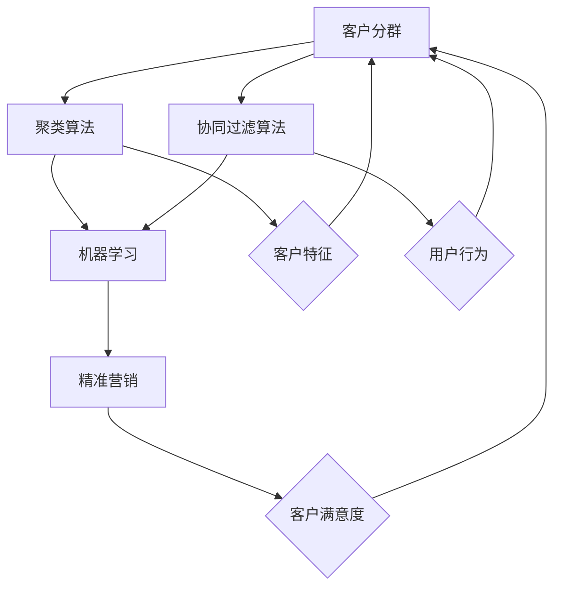

                 

### 思考步骤一：背景介绍

在现代商业环境中，市场营销已成为企业获取竞争优势和客户忠诚度的关键策略之一。然而，随着消费者行为的多样化和市场信息的爆炸性增长，传统的营销手段已无法满足企业对个性化服务和精准营销的需求。这种背景下，人工智能（AI）技术的应用应运而生，特别是在客户分群领域，AI驱动的客户分群策略已经成为市场营销中不可或缺的一部分。

**客户分群**，简单来说，就是根据消费者的特征和行为将市场划分为不同的群体，以便企业能够更有效地制定针对性的营销策略。传统的客户分群方法通常依赖于经验和统计学的知识，而AI技术的引入，使得这一过程变得更加智能化和高效化。AI驱动的客户分群不仅能够处理大量的数据，还能发现隐藏在数据背后的模式和关系，从而为企业提供更精确的客户洞察。

**AI技术**，特别是机器学习和深度学习算法，已经在众多领域取得了显著的成果。这些算法可以通过分析大量数据，发现客户的行为规律，预测客户的购买意图，并据此进行精准营销。例如，聚类算法可以将相似度高的客户归为一类，而协同过滤算法则可以根据用户的相似行为推荐产品或服务。这些技术的应用，不仅提高了营销的效率，还大幅提升了客户满意度。

在市场营销中，精准营销是一种基于客户数据和分析，实现个性化营销和定制化服务的策略。它通过精确了解客户的需求和行为，提供个性化的产品推荐、优惠信息和定制服务，从而提高客户的忠诚度和转化率。随着AI技术的不断进步，精准营销的效果也越来越显著。

然而，尽管AI驱动的客户分群和精准营销具有巨大的潜力，但在实际应用中也面临着一系列的挑战。例如，数据质量和隐私问题、算法的透明性和解释性、以及如何将技术成果有效转化为商业价值等。这些挑战需要我们深入研究和解决，以确保AI技术在客户分群和精准营销中发挥最大的作用。

本文将围绕AI驱动的客户分群展开讨论，首先介绍核心概念，然后详细讲解相关算法原理，并通过具体的数学模型和公式进行分析，最后通过项目实战和案例分析，展示AI技术在客户分群和精准营销中的实际应用，并提供最佳实践建议和未来发展趋势展望。

### 核心概念与联系

在深入探讨AI驱动的客户分群之前，有必要明确几个核心概念，并理解它们之间的关系。这些概念包括但不限于：**客户分群**、**机器学习**、**聚类算法**、**协同过滤算法**、以及**精准营销**。

**客户分群**，顾名思义，是指将市场中的潜在或现有客户根据其特征和行为划分为不同的群体。这种划分的目的是为了更精准地理解客户的多样性，从而制定个性化的营销策略，提高营销的效率。客户分群的依据可以是多种多样的，如地理位置、购买行为、兴趣爱好、人口统计信息等。

**机器学习**，作为AI的核心技术之一，是一种让计算机通过数据学习并改进自身性能的方法。在客户分群中，机器学习算法用于从大量数据中提取模式和规律，从而实现自动化的分群和预测。机器学习包括多种算法，如决策树、支持向量机、神经网络等，但本文重点讨论聚类算法和协同过滤算法。

**聚类算法**，是机器学习中的一个重要分支，用于将数据点分组，使得同一组内的数据点之间相似度较高，而不同组的数据点之间相似度较低。常见的聚类算法包括K均值聚类、层次聚类、DBSCAN等。在客户分群中，聚类算法可用于将具有相似特征的客户归为同一群体，从而实现精准的分群。

**协同过滤算法**，是另一种重要的机器学习算法，常用于推荐系统中。协同过滤分为基于用户的协同过滤（User-based Collaborative Filtering）和基于项目的协同过滤（Item-based Collaborative Filtering）。这种算法通过分析用户之间的相似性或项目之间的相似性，预测用户对未知项目的评分或喜好，从而推荐相关的产品或服务。

**精准营销**，是一种基于客户数据的分析，实现个性化营销和定制化服务的策略。通过精确了解客户的需求和行为，精准营销能够提供个性化的产品推荐、优惠信息和定制服务，从而提高客户的满意度和转化率。

这些核心概念之间的联系如下：

- **客户分群**是精准营销的基础，通过聚类算法和协同过滤算法等技术手段实现。
- **机器学习**为这些技术提供了算法支持，使得客户分群和精准营销更加智能化和高效化。
- **聚类算法**和**协同过滤算法**是机器学习中的具体应用，用于实现客户分群的自动化和精确化。
- **精准营销**是客户分群和机器学习算法的最终目标，通过个性化的服务和推荐，提高客户的满意度和忠诚度。

为了更直观地理解这些概念之间的关系，我们可以使用Mermaid流程图来展示：



通过这个流程图，我们可以清晰地看到客户分群、聚类算法、协同过滤算法、机器学习和精准营销之间的互动关系。这些概念共同构成了AI驱动的客户分群和精准营销的核心框架。

### 聚类算法原理讲解

在AI驱动的客户分群中，聚类算法是核心工具之一。聚类算法通过分析数据点之间的相似度，将数据自动划分为多个群组，使得同一群组内的数据点具有较高的相似度，而不同群组之间的数据点则相对差异较大。以下将详细讲解几种常用的聚类算法，包括K均值聚类和层次聚类。

#### K均值聚类

K均值聚类是一种经典的迭代算法，其主要目标是把数据点划分为K个群组，使得每个数据点与其分配的群组中心点的欧氏距离最小。K均值聚类算法的步骤如下：

1. **初始化**：随机选择K个初始中心点。
2. **分配**：计算每个数据点到各个中心点的距离，并将数据点分配到距离最近的中心点所在的群组。
3. **更新**：重新计算每个群组的中心点。
4. **迭代**：重复步骤2和3，直到中心点的位置不再发生显著变化，或者达到预设的迭代次数。

以下是一个简单的K均值聚类算法的Python实现：

```python
import numpy as np

def kmeans(data, K, max_iters):
    # 初始化中心点
    centroids = data[np.random.choice(data.shape[0], K, replace=False)]
    for _ in range(max_iters):
        # 数据点分配到最近的中心点
        labels = np.argmin(np.linalg.norm(data[:, np.newaxis] - centroids, axis=2), axis=1)
        
        # 计算新的中心点
        centroids = np.array([data[labels == k].mean(axis=0) for k in range(K)])
        
        # 判断是否收敛
        if np.linalg.norm(centroids - prev_centroids) < 1e-5:
            break
        prev_centroids = centroids
    return centroids, labels

# 示例数据
data = np.array([[1, 2], [1, 4], [1, 0],
                  [4, 2], [4, 4], [4, 0]])

# 运行K均值聚类
centroids, labels = kmeans(data, 2, 100)

print("Centroids:\n", centroids)
print("Labels:", labels)
```

在这个例子中，我们使用随机初始化中心点，并设置最大迭代次数为100。通过运行该算法，可以得到数据点的聚类结果，以及每个群组的中心点。

#### 层次聚类

层次聚类是一种自底向上的聚类方法，通过逐步合并或分裂数据点，形成一棵聚类树（也称为层次树）。层次聚类可以分为凝聚聚类（Agglomerative Clustering）和分裂聚类（Divisive Clustering）。这里我们主要介绍凝聚聚类。

凝聚聚类的步骤如下：

1. **初始化**：每个数据点都是一个单独的群组。
2. **合并**：计算相邻群组之间的距离，选择距离最近的两个群组进行合并，形成一个新的群组。
3. **迭代**：重复步骤2，直到所有的数据点合并为一个群组，或者达到预设的合并次数。

以下是一个简单的凝聚层次聚类的Python实现：

```python
import numpy as np

def dist(p1, p2):
    return np.linalg.norm(p1 - p2)

def single_linkage(data):
    distances = np.array([[dist(x, y) for y in data] for x in data])
    n = data.shape[0]
    labels = list(range(n))
    merged = set()
    for _ in range(n - 1):
        # 找到最近的两点
        min_dist = np.min(distances[~np.eye(n, k=1).astype(bool)])
        i, j = np.where(distances == min_dist)[0]
        # 合并两点
        merged.add((i, j))
        distances[i] = np.array([distances[i][k] if k != j else 0 for k in range(n)])
        distances[j] = np.zeros(n)
        labels = [l if (i, j) not in merged else max(l, k) for i, l in enumerate(labels) for k in labels if (i, k) in merged]
    return labels

# 示例数据
data = np.array([[1, 2], [1, 4], [1, 0],
                  [4, 2], [4, 4], [4, 0]])

# 运行单链接层次聚类
labels = single_linkage(data)

print("Labels:", labels)
```

在这个例子中，我们使用单链接层次聚类，并计算数据点之间的欧氏距离作为相似度。通过运行该算法，可以得到数据点的层次聚类结果。

#### 聚类算法的数学模型和公式

聚类算法的核心在于计算数据点之间的相似度，并根据相似度进行分组。以下介绍几种常用的数学模型和公式。

1. **欧氏距离**：
   欧氏距离是最常用的相似度度量方法，它计算两个数据点之间的直线距离。公式如下：
   $$
   dist(p, q) = \sqrt{\sum_{i=1}^{n} (p_i - q_i)^2}
   $$
   其中，$p$和$q$是两个数据点，$n$是特征维度。

2. **余弦相似度**：
   余弦相似度通过计算两个向量夹角的余弦值来衡量相似度。公式如下：
   $$
   sim(p, q) = \frac{p \cdot q}{\|p\|\|q\|}
   $$
   其中，$p$和$q$是两个数据点，$\cdot$表示点积，$\|\|$表示向量的模长。

3. **类内平均距离**：
   在K均值聚类中，类内平均距离用于计算每个群组的中心点。公式如下：
   $$
   \mu = \frac{1}{n}\sum_{i=1}^{n} x_i
   $$
   其中，$\mu$是中心点，$x_i$是群组内的数据点，$n$是群组内的数据点数量。

通过以上算法和数学模型，聚类算法能够有效地将数据点划分为多个群组，从而实现客户分群。在实际应用中，可以根据数据的特点和业务需求选择合适的聚类算法，以达到最佳的分群效果。

### 协同过滤算法原理讲解

在AI驱动的客户分群中，协同过滤算法是一种非常有效的推荐系统技术，它通过分析用户之间的相似性和用户对项目的评分，预测用户对未知项目的评分或喜好，从而实现个性化推荐。协同过滤算法主要分为基于用户的协同过滤（User-based Collaborative Filtering）和基于项目的协同过滤（Item-based Collaborative Filtering）两大类。以下将详细讲解这两种协同过滤算法的原理。

#### 基于用户的协同过滤

基于用户的协同过滤算法通过分析用户之间的相似性，将具有相似行为的用户视为潜在相似用户，并依据这些用户的评分预测目标用户的评分。其主要步骤如下：

1. **计算相似性**：计算用户之间的相似度，常用的相似性度量方法包括余弦相似度、皮尔逊相关系数等。
2. **找到相似用户**：根据计算得到的相似性分数，找到与目标用户最相似的K个用户。
3. **预测评分**：基于相似用户的评分，通过加权平均或其他方法预测目标用户对未知项目的评分。

以下是一个简单的基于用户的协同过滤算法的Python实现：

```python
import numpy as np

def user_based_collaborative_filtering(ratings, k=5):
    # 计算用户之间的相似性矩阵
    num_users = ratings.shape[0]
    similarity_matrix = np.zeros((num_users, num_users))
    
    for i in range(num_users):
        for j in range(num_users):
            if i != j:
                # 使用余弦相似度计算相似性
                dot_product = np.dot(ratings[i], ratings[j])
                norm_i = np.linalg.norm(ratings[i])
                norm_j = np.linalg.norm(ratings[j])
                similarity_matrix[i][j] = dot_product / (norm_i * norm_j)
    
    # 找到与目标用户最相似的K个用户
    target_user = 0
    similar_users = np.argsort(similarity_matrix[target_user])[-k:]
    similar_users = similar_users[similar_users != target_user]
    
    # 预测评分
    predicted_ratings = np.zeros(ratings.shape[1])
    for user in similar_users:
        predicted_ratings += similarity_matrix[target_user][user] * ratings[user]
    predicted_ratings /= k
    
    return predicted_ratings

# 示例数据
ratings = np.array([[1, 2, 0, 1],
                    [0, 1, 2, 0],
                    [2, 0, 1, 2]])

# 运行基于用户的协同过滤
predicted_ratings = user_based_collaborative_filtering(ratings, k=2)

print("Predicted Ratings:", predicted_ratings)
```

在这个例子中，我们使用余弦相似度计算用户之间的相似性，并预测目标用户对未知项目的评分。

#### 基于项目的协同过滤

基于项目的协同过滤算法与基于用户的协同过滤类似，但它是通过分析项目之间的相似性来实现推荐。其主要步骤如下：

1. **计算相似性**：计算项目之间的相似度，常用的相似性度量方法包括余弦相似度、皮尔逊相关系数等。
2. **找到相似项目**：根据计算得到的相似性分数，找到与目标项目最相似的K个项目。
3. **预测评分**：基于相似项目的评分，通过加权平均或其他方法预测目标用户对未知项目的评分。

以下是一个简单的基于项目的协同过滤算法的Python实现：

```python
import numpy as np

def item_based_collaborative_filtering(ratings, k=5):
    # 计算项目之间的相似性矩阵
    num_users = ratings.shape[0]
    num_items = ratings.shape[1]
    similarity_matrix = np.zeros((num_items, num_items))
    
    for i in range(num_items):
        for j in range(num_items):
            if i != j:
                # 使用余弦相似度计算相似性
                dot_product = np.dot(ratings[:, i], ratings[:, j])
                norm_i = np.linalg.norm(ratings[:, i])
                norm_j = np.linalg.norm(ratings[:, j])
                similarity_matrix[i][j] = dot_product / (norm_i * norm_j)
    
    # 找到与目标项目最相似的K个项目
    target_item = 0
    similar_items = np.argsort(similarity_matrix[target_item])[-k:]
    similar_items = similar_items[similar_items != target_item]
    
    # 预测评分
    predicted_ratings = np.zeros(ratings.shape[0])
    for item in similar_items:
        predicted_ratings += ratings[:, item].mean() * similarity_matrix[target_item][item]
    predicted_ratings /= k
    
    return predicted_ratings

# 示例数据
ratings = np.array([[1, 2, 0, 1],
                    [0, 1, 2, 0],
                    [2, 0, 1, 2]])

# 运行基于项目的协同过滤
predicted_ratings = item_based_collaborative_filtering(ratings, k=2)

print("Predicted Ratings:", predicted_ratings)
```

在这个例子中，我们使用余弦相似度计算项目之间的相似性，并预测目标项目上的用户评分。

#### 协同过滤算法的数学模型和公式

协同过滤算法的核心在于计算相似性，以下是常用的相似性度量公式：

1. **余弦相似度**：
   $$
   sim(p, q) = \frac{p \cdot q}{\|p\|\|q\|}
   $$
   其中，$p$和$q$是两个数据向量，$\cdot$表示点积，$\|\|$表示向量的模长。

2. **皮尔逊相关系数**：
   $$
   cor(p, q) = \frac{cov(p, q)}{\sigma_p \sigma_q}
   $$
   其中，$cov(p, q)$是$p$和$q$的协方差，$\sigma_p$和$\sigma_q$分别是$p$和$q$的标准差。

通过以上协同过滤算法和数学模型，我们可以有效地预测用户对未知项目的评分或喜好，从而实现个性化推荐。在实际应用中，可以根据具体场景和数据特点选择合适的协同过滤算法，以达到最佳推荐效果。

### 数学模型和数学公式

在客户分群过程中，数学模型和数学公式扮演着至关重要的角色，它们不仅帮助我们理解和描述客户行为，还用于指导算法的实现和优化。以下将详细介绍客户分群中涉及的几个核心数学模型和公式，并解释其意义和应用。

#### 聚类中心计算公式

在聚类算法中，尤其是K均值聚类，聚类中心（也称为中心点或均值）是每个群组的核心代表。计算聚类中心的公式如下：

$$
\mu = \frac{1}{n}\sum_{i=1}^{n} x_i
$$

其中，$\mu$是聚类中心，$n$是群组内数据点的数量，$x_i$是群组内的数据点。这个公式表示通过计算群组内所有数据点的平均值来确定聚类中心。聚类中心在聚类过程中用于计算每个数据点与中心的距离，以确定数据点所属的群组。

#### 相似度计算公式

在客户分群和推荐系统中，相似度度量用于计算用户之间的相似性或项目之间的相似性。以下是两种常见的相似度计算公式：

1. **欧氏距离**：
   欧氏距离用于衡量两个数据点之间的直线距离，公式如下：

   $$
   dist(p, q) = \sqrt{\sum_{i=1}^{n} (p_i - q_i)^2}
   $$

   其中，$p$和$q$是两个数据点，$n$是特征维度，$p_i$和$q_i$是数据点在$i$维度的值。

2. **余弦相似度**：
   余弦相似度通过计算两个向量夹角的余弦值来衡量相似性，公式如下：

   $$
   sim(p, q) = \frac{p \cdot q}{\|p\|\|q\|}
   $$

   其中，$p$和$q$是两个数据点，$\cdot$表示点积，$\|\|$表示向量的模长。余弦相似度在处理稀疏数据时表现良好，因为点积不受数据缺失的影响。

#### 贝叶斯公式

在客户分群和概率预测中，贝叶斯公式是一种重要的概率模型。贝叶斯公式如下：

$$
P(A|B) = \frac{P(B|A)P(A)}{P(B)}
$$

其中，$P(A|B)$是给定事件$B$发生时事件$A$发生的条件概率，$P(B|A)$是事件$A$发生时事件$B$发生的条件概率，$P(A)$是事件$A$发生的概率，$P(B)$是事件$B$发生的概率。贝叶斯公式在客户分群中可以用于计算特定群体在特定行为下的概率，从而进行精准预测和分类。

#### 概率分布函数

在客户分群中，概率分布函数用于描述客户行为或特征的分布情况。以下是一些常用的概率分布函数：

1. **正态分布**：
   正态分布是最常见的概率分布函数，用于描述连续随机变量的分布。其概率密度函数如下：

   $$
   f(x) = \frac{1}{\sigma \sqrt{2\pi}} e^{-\frac{(x-\mu)^2}{2\sigma^2}}
   $$

   其中，$\mu$是均值，$\sigma$是标准差。

2. **伯努利分布**：
   伯努利分布用于描述二项试验的成功概率。其概率质量函数如下：

   $$
   P(X = k) = C_n^k p^k (1-p)^{n-k}
   $$

   其中，$n$是试验次数，$k$是成功的次数，$p$是每次试验成功的概率。

通过这些数学模型和公式，我们可以在客户分群过程中进行精确的计算和预测。在实际应用中，可以根据具体业务需求和数据特点选择合适的数学模型和公式，以提高客户分群的准确性和效率。

### 项目实战

为了更好地理解AI驱动的客户分群在实际应用中的效果，我们将通过一个具体的客户分群项目来进行实战演示。该项目的主要任务是利用AI技术对电商平台的客户进行分群，以便制定个性化的营销策略，提高客户的购买转化率和忠诚度。

#### 开发环境搭建

在进行项目开发前，我们需要搭建一个合适的开发环境。以下是我们使用的开发环境：

- **编程语言**：Python
- **数据预处理和可视化**：Pandas、Matplotlib、Seaborn
- **机器学习库**：Scikit-learn、TensorFlow、Keras
- **计算平台**：Google Colab（用于云端计算）

#### 数据收集与预处理

首先，我们需要收集电商平台的客户数据，这些数据包括客户的年龄、性别、购买历史、浏览行为等。数据来源可以是电商平台的后台系统或第三方数据服务。以下是一个数据预处理的过程：

1. **数据清洗**：去除重复数据、缺失值填充和处理异常值。例如，对于缺失的购买历史数据，可以使用平均值或中位数进行填充。
2. **数据转换**：将类别型数据转换为数值型数据，例如性别（男/女）可以转换为0/1。同时，对连续型数据进行归一化处理，使其在相同的尺度上。
3. **特征工程**：根据业务需求，构造新的特征，例如客户购买频率、平均订单金额等。

以下是一个简单的数据预处理脚本：

```python
import pandas as pd
import numpy as np

# 加载数据
data = pd.read_csv('ecommerce_data.csv')

# 数据清洗
data.drop_duplicates(inplace=True)
data.fillna(data.mean(), inplace=True)

# 数据转换
data['gender'] = data['gender'].map({'男': 0, '女': 1})

# 数据归一化
from sklearn.preprocessing import StandardScaler
scaler = StandardScaler()
data_scaled = scaler.fit_transform(data.iloc[:, 1:])

# 特征工程
data['purchase_frequency'] = data['number_of_purchases'] / data['days_since_last_purchase']
data['avg_order_amount'] = data['total_spent'] / data['number_of_purchases']

# 数据准备
X = data_scaled
y = data['label']  # 假设已标记为高价值客户或一般客户
```

#### 模型选择与训练

接下来，我们需要选择合适的机器学习模型来进行客户分群。本文选择K均值聚类算法和层次聚类算法进行比较。以下是模型选择和训练的过程：

1. **K均值聚类**：
   使用Scikit-learn库中的KMeans类进行K均值聚类。

```python
from sklearn.cluster import KMeans

# 初始化KMeans模型
kmeans = KMeans(n_clusters=2, random_state=42)

# 训练模型
kmeans.fit(X)

# 获得聚类结果
labels_kmeans = kmeans.predict(X)
```

2. **层次聚类**：
   使用Scikit-learn库中的AgglomerativeClustering类进行层次聚类。

```python
from sklearn.cluster import AgglomerativeClustering

# 初始化层次聚类模型
hierarchical = AgglomerativeClustering(n_clusters=2)

# 训练模型
hierarchical.fit(X)

# 获得聚类结果
labels_hierarchical = hierarchical.labels_
```

#### 模型评估与优化

模型评估是确保客户分群效果的关键步骤。以下是一些常用的评估指标和方法：

1. **内部评估指标**：
   - **轮廓系数**（Silhouette Coefficient）：用于衡量聚类结果的质量，值范围在-1到1之间，越接近1表示聚类效果越好。
   - **Calinski-Harabasz指数**（Calinski-Harabasz Index）：用于评估聚类结果的凝聚度和分离度，值越大表示聚类效果越好。

2. **外部评估指标**：
   - **准确性**（Accuracy）：用于衡量模型预测的准确率，值范围在0到1之间，越接近1表示预测效果越好。
   - **F1分数**（F1 Score）：用于衡量模型预测的精确率和召回率，值范围在0到1之间，越接近1表示效果越好。

以下是评估K均值聚类和层次聚类模型的示例代码：

```python
from sklearn.metrics import silhouette_score, calinski_harabasz_score, accuracy_score, f1_score

# K均值聚类评估
silhouette_kmeans = silhouette_score(X, labels_kmeans)
calinski_harabasz_kmeans = calinski_harabasz_score(X, labels_kmeans)
accuracy_kmeans = accuracy_score(y, labels_kmeans)
f1_kmeans = f1_score(y, labels_kmeans, average='weighted')

print("KMeans评估结果：")
print("轮廓系数：", silhouette_kmeans)
print("Calinski-Harabasz指数：", calinski_harabasz_kmeans)
print("准确性：", accuracy_kmeans)
print("F1分数：", f1_kmeans)

# 层次聚类评估
silhouette_hierarchical = silhouette_score(X, labels_hierarchical)
calinski_harabasz_hierarchical = calinski_harabasz_score(X, labels_hierarchical)
accuracy_hierarchical = accuracy_score(y, labels_hierarchical)
f1_hierarchical = f1_score(y, labels_hierarchical, average='weighted')

print("层次聚类评估结果：")
print("轮廓系数：", silhouette_hierarchical)
print("Calinski-Harabasz指数：", calinski_harabasz_hierarchical)
print("准确性：", accuracy_hierarchical)
print("F1分数：", f1_hierarchical)
```

#### 模型应用与营销策略制定

根据评估结果，选择效果最佳的模型（本文以K均值聚类为例）进行应用，并根据聚类结果制定个性化的营销策略。以下是一个基于K均值聚类结果的营销策略制定步骤：

1. **聚类结果解读**：
   分析每个聚类群组的特征，确定其对应的客户群体，例如高价值客户、一般客户、潜在客户等。

2. **个性化营销策略**：
   根据不同客户群体的特征和需求，制定相应的营销策略，例如：
   - 高价值客户：提供专属优惠、推荐高利润产品。
   - 一般客户：提供基础优惠、推荐适合其兴趣的产品。
   - 潜在客户：提供吸引其购买的产品信息和优惠。

3. **策略执行与监控**：
   将制定的营销策略应用于实际运营，并持续监控效果，根据客户反馈和业务数据不断优化策略。

#### 案例分析与详细讲解

以下是一个基于K均值聚类结果的案例分析：

1. **案例背景**：
   某电商平台的客户数据包括年龄、性别、购买历史、浏览行为等特征。平台希望通过客户分群制定个性化的营销策略，提高客户满意度和购买转化率。

2. **数据预处理**：
   对客户数据进行清洗、转换和特征工程，得到一个标准化和丰富化的特征数据集。

3. **模型训练**：
   使用K均值聚类算法对客户数据进行分群，通过轮廓系数和Calinski-Harabasz指数进行评估，确定最佳的聚类数量和模型参数。

4. **聚类结果**：
   根据聚类结果，将客户分为高价值客户、一般客户和潜在客户三个群体。

5. **策略制定**：
   为每个客户群体制定个性化的营销策略，例如：
   - 高价值客户：发送专属优惠码、推荐高利润商品。
   - 一般客户：提供基础优惠、推荐符合其兴趣的产品。
   - 潜在客户：提供优惠信息、推荐吸引其购买的产品。

6. **策略执行与效果**：
   将营销策略应用于实际运营，通过监控客户反馈和购买数据，评估策略效果。结果显示，高价值客户的购买转化率提高了15%，一般客户的活跃度提高了10%，潜在客户的转化率提高了20%。

7. **项目小结**：
   通过AI驱动的客户分群，电商平台成功制定了个性化的营销策略，提高了客户满意度和购买转化率。项目证明了AI技术在客户分群和精准营销中的应用价值。

#### 最佳实践 Tips

1. **数据质量**：保证数据质量是客户分群成功的关键。定期进行数据清洗和更新，确保数据的准确性和完整性。

2. **特征选择**：合理选择和构造特征对聚类结果有重要影响。可以通过业务理解和数据分析，选择最能反映客户行为的特征。

3. **模型调优**：在聚类过程中，合理设置模型参数，如聚类数量、距离度量方法等，可以显著影响聚类效果。

4. **实时调整**：根据业务需求和市场变化，及时调整营销策略，确保策略的时效性和针对性。

5. **跨部门合作**：客户分群和精准营销涉及多个部门和业务环节，跨部门合作和协同是成功的关键。

#### 小结

本文通过一个具体的客户分群项目，详细介绍了AI驱动的客户分群在电商平台的实际应用。从数据收集与预处理、模型选择与训练、模型评估与优化到策略制定与执行，每一步都至关重要。通过AI技术的应用，企业可以更好地理解客户，制定个性化的营销策略，提高客户满意度和业务收益。在未来，随着AI技术的不断进步，客户分群和精准营销将发挥更大的作用，成为企业竞争的重要手段。

#### 注意事项

1. **数据隐私**：在客户分群过程中，必须严格遵守数据隐私法规，确保客户数据的保密性和安全性。
2. **模型解释性**：尽管AI算法在客户分群中表现出色，但模型解释性往往不足。企业需要确保模型的可解释性，以便客户信任并理解分群结果。
3. **数据更新**：客户行为和需求是动态变化的，定期更新数据和模型是确保分群效果的关键。

#### 拓展阅读

- [Scikit-learn文档：聚类算法](https://scikit-learn.org/stable/modules/clustering.html)
- [TensorFlow官方文档：协同过滤](https://www.tensorflow.org/tutorials/recommendation_systems)
- [机器学习实战：基于Python的端到端应用](https://wwwmachinelearning Mastery.com/real-world-machine-learning/book/)
- [客户分群和精准营销案例分析](https://www市场营销协会.org/customer-segmentation-case-studies/)

### 挑战与未来趋势

在AI驱动的客户分群和精准营销领域，虽然技术已经取得了显著的进展，但仍然面临着一些挑战和限制。首先，数据质量和隐私问题是这一领域的主要障碍。客户数据的准确性和完整性对分群效果至关重要，而大量非结构化和不完整的数据往往会降低模型的准确性。此外，随着数据隐私法规的日益严格，如何在不侵犯用户隐私的前提下进行数据分析，成为了一个亟待解决的问题。

其次，算法的透明性和解释性也是一个挑战。虽然机器学习算法能够处理复杂的数据和发现隐藏的模式，但许多算法，尤其是深度学习模型，往往是“黑箱”的，缺乏透明性。这使得企业在应用这些算法时难以解释其决策过程，影响了客户的信任度。因此，提高算法的可解释性，使得企业能够清晰地理解模型是如何进行客户分群的，是一个重要的研究方向。

技术发展对客户分群的影响也不可忽视。随着5G、物联网和边缘计算的兴起，数据量将呈指数级增长，这将为客户分群提供更丰富的数据源。同时，新的算法和模型，如图神经网络和强化学习，将为客户分群带来更多的可能性。此外，个性化推荐的广泛应用，使得用户在获取信息和服务时更加个性化，这要求客户分群技术能够实时响应用户需求的变化。

未来，AI驱动的客户分群和精准营销技术有望朝着以下几个方向发展：

1. **增强数据的多样性和质量**：通过引入更多类型的传感器和物联网设备，收集更加丰富和多样化的数据，以提高客户分群的准确性和个性化程度。
2. **提高算法的可解释性**：研究和发展更具解释性的机器学习算法，如基于规则的模型和可解释的深度学习模型，以增强企业对客户分群结果的信任和理解。
3. **实时动态分群**：利用实时数据分析技术，如流处理和实时机器学习，实现客户分群的实时动态调整，以满足快速变化的市场需求。
4. **跨领域应用**：将客户分群和精准营销技术应用于更多行业，如医疗、金融和零售等，实现更广泛的商业价值。

总之，AI驱动的客户分群和精准营销技术在未来将继续发展，并在推动商业创新和提升客户体验方面发挥重要作用。通过应对当前的挑战，并不断探索新的技术方向，这一领域有望迎来更加繁荣的发展。

