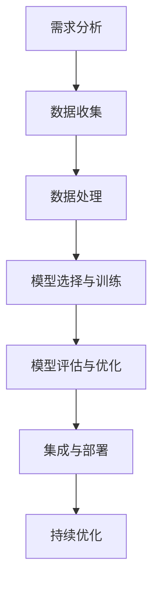

                 

### 《AI驱动的客户服务：提升企业客户体验》目录大纲

---

## 引言

### 1.1 AI与客户服务的关系
在当今快速发展的技术时代，人工智能（AI）正在改变各个行业的运营方式，客户服务领域也不例外。AI驱动的客户服务已经成为企业提升客户体验、降低运营成本的重要手段。

### 1.2 企业在客户服务中面临的挑战
企业面临着客户需求多样、服务效率低下、人力成本高昂等挑战。这些挑战促使企业寻求创新的解决方案，而AI技术提供了一种可能。

### 1.3 AI如何提升企业客户体验
AI技术通过自动化、智能化和个性化的方式，显著提升了客户服务的质量与效率。本篇文章将深入探讨AI如何实现这一目标。

---

## AI驱动的客户服务概述

### 2.1 AI技术及其发展历程
AI技术起源于上世纪50年代，经历了多个发展阶段，如今已进入应用爆发期。

### 2.2 AI驱动的客户服务应用场景
AI在客户服务中的应用场景包括智能客服、个性化推荐、情感分析等。

### 2.3 企业如何实现AI驱动的客户服务
企业可以通过集成AI工具、优化服务流程、建立数据分析模型等方式实现AI驱动的客户服务。

---

## 客户体验管理

### 3.1 客户体验的概念与重要性
客户体验是指客户在接触企业产品或服务过程中所获得的全部感受。良好的客户体验对企业至关重要。

### 3.2 客户体验管理策略
企业需要制定全面、系统的客户体验管理策略，以提升客户满意度。

### 3.3 客户体验管理工具与技术
客户体验管理工具包括客户反馈系统、客户关系管理系统等。技术手段如大数据分析和机器学习为体验管理提供了有力支持。

---

## AI驱动的客户数据分析

### 4.1 客户数据的来源与类型
客户数据的来源多样，包括交易数据、社交媒体数据等。数据类型包括结构化数据和非结构化数据。

### 4.2 客户数据分析的方法与工具
数据分析方法包括描述性分析、预测性分析和相关性分析。工具如Python、R等提供了丰富的数据分析功能。

### 4.3 数据驱动的客户洞察
通过数据挖掘和机器学习，企业可以深入了解客户需求，提供更精准的服务。

---

## 自然语言处理与客户服务

### 5.1 自然语言处理技术概述
自然语言处理（NLP）是AI的一个重要分支，涉及语言理解和生成。

### 5.2 机器学习在客户服务中的应用
机器学习算法在NLP中的应用，如情感分析、实体识别等，极大提升了客户服务的智能化水平。

### 5.3 自然语言处理在客户服务中的应用案例
通过具体案例展示NLP在客户服务中的应用，如智能客服聊天机器人。

---

## 客户服务机器人与聊天机器人

### 6.1 客户服务机器人的发展历程
客户服务机器人从简单脚本到复杂AI模型的演变。

### 6.2 聊天机器人的技术架构
聊天机器人的技术架构涉及语音识别、自然语言处理等。

### 6.3 客户服务机器人案例分析
通过案例展示客户服务机器人在实际应用中的效果。

---

## AI驱动的客户个性化服务

### 7.1 客户个性化服务概述
客户个性化服务是指根据客户特征提供定制化服务。

### 7.2 客户个性化服务策略
企业可以通过数据分析、机器学习等技术实施个性化服务策略。

### 7.3 AI驱动的客户个性化服务实践
通过具体案例展示AI驱动的个性化服务实践。

---

## 实现AI驱动的客户服务：实践与案例

### 8.1 实现AI驱动的客户服务的步骤
从数据收集到模型部署，详细讲解实现AI驱动的客户服务的全过程。

### 8.2 成功案例分享
分享成功企业的AI驱动的客户服务实践。

### 8.3 挑战与展望
探讨AI驱动的客户服务面临的挑战和未来的发展方向。

---

## 附录

### 附录A: AI驱动的客户服务常用工具与资源
介绍常用的AI工具和资源。

### 附录B: AI驱动的客户服务项目实践指南
提供项目实践指南。

---

## 结语

作者：AI天才研究院/AI Genius Institute & 禅与计算机程序设计艺术 /Zen And The Art of Computer Programming

AI驱动的客户服务正逐渐成为企业提升客户体验的关键因素。本文详细探讨了AI在客户服务中的应用，为企业提供了宝贵的实践指南。

---

## 总结

AI驱动的客户服务不仅提升了企业的运营效率，更在客户体验方面取得了显著成果。随着技术的不断进步，AI将在客户服务领域发挥越来越重要的作用。

---

关键词：人工智能，客户服务，客户体验，自然语言处理，客户服务机器人，个性化服务

摘要：本文深入探讨了AI驱动的客户服务，从背景、技术、应用场景、实践案例等方面进行了详细分析，旨在帮助企业提升客户体验，实现可持续发展。

---

## 第1章 引言

### 1.1 AI与客户服务的关系

在当今的商业环境中，客户服务是企业成功的关键因素之一。随着技术的快速发展，人工智能（AI）已经逐渐成为提升客户服务质量的利器。AI与客户服务之间的关系可以追溯到几个关键方面。

首先，AI能够实现自动化处理，从而提高客户服务的效率。传统客户服务往往依赖于人工处理，这不仅耗时，还容易出现错误。而AI系统可以通过自然语言处理（NLP）等技术，自动理解和响应客户的查询，大大提高了处理速度和准确性。

其次，AI能够实现个性化服务。通过对客户数据的深入分析和挖掘，AI可以了解客户的偏好和行为模式，从而提供定制化的服务。这种个性化的互动不仅能够提升客户满意度，还能够增加客户的忠诚度。

最后，AI可以帮助企业预测客户需求。通过大数据分析和机器学习算法，AI可以识别出潜在的客户需求和市场趋势，从而帮助企业提前做好准备，提供更有针对性的服务。

总的来说，AI技术为提升客户服务提供了新的思路和方法，使得企业能够更加高效、智能地与客户互动。

### 1.2 企业在客户服务中面临的挑战

尽管客户服务对于企业的成功至关重要，但在实际操作中，企业常常面临着一系列挑战。首先，客户需求的多样化是当前客户服务的一大难题。不同的客户有着不同的需求，这可能包括产品咨询、订单查询、售后服务等，这使得企业需要提供更为个性化的服务，以满足不同客户的需求。

其次，服务效率低下也是一个普遍存在的问题。传统的人工处理方式往往耗时较长，并且容易出现错误，导致客户满意度下降。此外，人工客服的运营成本也相对较高，这对于企业来说是一个不小的负担。

第三，客户体验的管理难度较大。企业需要通过多种渠道与客户互动，如电话、邮件、社交媒体等，这增加了客户体验管理的复杂性。而且，客户期望企业能够提供一致且高质量的服务，这需要企业具备强大的管理和协调能力。

最后，客户数据的利用率较低。虽然企业积累了大量的客户数据，但如何有效地利用这些数据进行客户体验分析和优化，仍然是一个亟待解决的问题。

综上所述，企业在客户服务中面临的挑战不仅多样化，而且复杂。为了应对这些挑战，企业需要寻找创新的解决方案，而AI技术提供了一种可能。

### 1.3 AI如何提升企业客户体验

AI技术凭借其自动化、智能化和个性化等特点，为企业提升客户体验提供了有效的解决方案。以下是AI如何实现这一目标的几个方面：

首先，自动化处理是AI提升客户体验的核心。通过自然语言处理（NLP）和机器学习（ML）技术，AI系统可以自动理解客户的查询，并快速响应，从而大大提高了服务效率。例如，智能客服聊天机器人可以在几秒钟内回答客户的问题，而无需人工干预。

其次，个性化服务是提升客户体验的关键。通过大数据分析和机器学习算法，AI可以深入了解客户的偏好和行为模式，从而提供定制化的服务。例如，电商网站可以根据客户的购买历史和浏览行为，推荐符合其兴趣的产品，从而提高客户的购买意愿。

第三，AI可以帮助企业实现精准的客户体验管理。通过分析大量客户数据，AI可以发现客户体验中的问题和改进点，从而帮助企业优化服务流程，提高整体客户满意度。例如，AI系统可以监控客户在不同渠道的互动情况，识别出客户可能面临的问题，并提前采取措施解决。

最后，AI技术还可以帮助企业预测客户需求。通过分析市场数据和客户行为，AI可以预测客户未来的需求趋势，从而帮助企业提前做好准备，提供更精准的服务。例如，金融机构可以通过AI预测客户可能面临的财务风险，从而提前提供相应的金融产品和服务。

总之，AI技术通过自动化、智能化和个性化等多种方式，为企业提升客户体验提供了有力的支持。随着AI技术的不断进步，企业将能够更加有效地与客户互动，提供更高质量的服务。

## 第2章 AI驱动的客户服务概述

### 2.1 AI技术及其发展历程

人工智能（AI）作为计算机科学的一个重要分支，其起源可以追溯到上世纪50年代。当时，计算机科学家艾伦·图灵提出了“图灵测试”的概念，旨在判断机器是否能够表现出与人类相似的行为和智能。这一理论为AI的研究奠定了基础。

从20世纪60年代到80年代，AI经历了几个重要的阶段。早期的AI研究主要集中在规则系统（rule-based systems）和知识表示（knowledge representation）上。这些系统通过编码一系列规则来模拟人类智能，如专家系统和决策支持系统。然而，这些系统在面对复杂问题时往往表现不佳，因为它们缺乏自我学习和适应能力。

到了20世纪80年代，随着计算机性能的提升和数据存储技术的发展，机器学习（machine learning）逐渐成为AI研究的热点。机器学习通过从数据中学习规律和模式，使得计算机能够自主地改进其性能。这一阶段的代表算法包括决策树（decision trees）和支持向量机（support vector machines）。

进入21世纪，深度学习（deep learning）的兴起标志着AI技术的又一次飞跃。深度学习通过模拟人脑神经网络结构，实现了在图像识别、自然语言处理和语音识别等领域的突破性进展。这一阶段的核心算法包括卷积神经网络（CNN）和循环神经网络（RNN）。

如今，AI技术已经渗透到各个行业，包括医疗、金融、零售和客户服务等领域。AI驱动的客户服务正是这一技术发展的产物，通过自动化和智能化，极大地提升了客户体验。

### 2.2 AI驱动的客户服务应用场景

AI在客户服务中具有广泛的应用场景，能够为企业和客户带来诸多益处。以下是AI在客户服务中的一些主要应用场景：

首先，智能客服是AI在客户服务中最直接的应用场景。智能客服聊天机器人通过自然语言处理（NLP）技术，能够理解客户的语言和需求，并自动生成响应。这种自动化处理大大提高了客户咨询的响应速度，同时降低了人力成本。例如，电商网站可以使用智能客服机器人来回答客户的订单查询、产品咨询等问题，提供24/7不间断的服务。

其次，个性化推荐系统也是AI在客户服务中的一个重要应用。通过分析客户的购买历史、浏览行为和偏好，AI可以推荐符合客户兴趣的产品或服务。这种个性化推荐不仅提高了客户的购买意愿，还能够增加客户的忠诚度。例如，在线零售平台可以通过AI算法分析客户的购物行为，推荐相关的商品，从而提升销售额。

第三，情感分析是AI在客户服务中的另一个关键应用。通过分析客户的反馈和评论，AI可以识别出客户的情感倾向，如满意、不满意或愤怒。这种情感分析可以帮助企业了解客户的真实需求，优化产品和服务。例如，酒店可以通过分析客户对酒店服务的评价，识别出服务中存在的问题，并采取措施进行改进。

第四，AI还可以用于预测客户流失。通过对客户行为数据的分析，AI可以预测哪些客户可能流失，并提前采取挽留措施。这种预测分析可以帮助企业减少客户流失率，提高客户保留率。例如，电信公司可以通过AI算法分析客户的通话记录、短信使用情况等，预测哪些客户可能因服务质量问题而流失，并提前进行服务优化。

总的来说，AI驱动的客户服务在智能客服、个性化推荐、情感分析和客户流失预测等方面具有广泛的应用。通过这些应用，企业能够更好地理解客户需求，提供个性化的服务，提升客户体验，从而实现业务增长。

### 2.3 企业如何实现AI驱动的客户服务

实现AI驱动的客户服务需要企业在多个方面进行整合和创新。以下是企业如何实现这一目标的关键步骤：

首先，数据集成是企业实现AI驱动的客户服务的基础。企业需要收集并整合来自不同渠道的客户数据，包括交易数据、社交媒体互动、客户反馈等。这些数据可以存储在数据仓库中，以便进行后续的分析和处理。

其次，数据分析是企业实现AI驱动的客户服务的关键。企业可以利用大数据分析和机器学习算法，对收集到的客户数据进行分析，挖掘客户行为模式和偏好。通过数据驱动的洞察，企业可以更好地了解客户需求，提供个性化的服务。

第三，技术集成是企业实现AI驱动的客户服务的保障。企业需要将AI工具和平台集成到现有的客户服务系统中，如CRM系统、客户反馈系统等。这种集成可以确保AI系统与企业现有系统的无缝对接，从而提高服务效率。

第四，流程优化是企业实现AI驱动的客户服务的重要步骤。企业需要对客户服务流程进行重新设计，利用AI技术自动化处理常规任务，减少人工干预。例如，通过智能客服机器人自动处理常见问题，降低人工客服的工作量。

最后，持续优化是企业实现AI驱动的客户服务的持续动力。企业需要定期评估AI系统的性能，并根据反馈进行调整和优化。通过持续改进，企业可以不断提升客户服务质量和效率。

总之，企业实现AI驱动的客户服务需要从数据集成、数据分析、技术集成、流程优化和持续优化等多个方面入手。通过这些步骤，企业可以充分利用AI技术，提升客户体验，实现业务增长。

## 第3章 客户体验管理

### 3.1 客户体验的概念与重要性

客户体验（Customer Experience, CX）是指客户在接触企业产品或服务过程中所获得的整体感受和体验。它涵盖了客户与企业互动的每一个触点，包括购买前的产品研究、购买过程中的支付体验、使用产品时的服务支持，以及售后服务等。客户体验不仅包括功能性的服务，还涉及情感层面的互动，如客户的满意度和忠诚度。

客户体验的重要性不可忽视。首先，良好的客户体验能够提高客户满意度和忠诚度。当客户感受到企业的用心和高质量服务时，他们更可能重复购买，并推荐给他人，从而为企业带来持续的收益。其次，客户体验直接影响企业的品牌形象。在竞争激烈的市场中，优质的客户体验可以显著提升企业在消费者心中的地位，增强品牌认知度和美誉度。

此外，客户体验还与客户的终身价值（Customer Lifetime Value, CLV）密切相关。一个忠诚的客户不仅在短期内为企业带来收益，还在长期内保持稳定的关系，从而为企业的可持续发展提供支持。通过提供卓越的客户体验，企业可以延长客户的生命周期，提高客户的整体价值。

总之，客户体验不仅是企业成功的关键因素，也是建立长期客户关系和实现业务增长的重要策略。企业需要高度重视并持续优化客户体验，以满足客户的需求和期望，从而在激烈的市场竞争中脱颖而出。

### 3.2 客户体验管理策略

有效的客户体验管理策略是企业提升客户满意度和忠诚度的关键。以下是几种常见的客户体验管理策略：

首先，个性化服务是客户体验管理的重要策略之一。企业可以通过收集和分析客户数据，了解客户的偏好、行为和需求，从而提供个性化的产品和服务。例如，在线零售平台可以根据客户的购物历史和浏览行为，推荐相关的商品，提高购买转化率。

其次，多渠道整合是优化客户体验的必要手段。企业需要确保客户能够通过不同的渠道（如电话、邮件、社交媒体、在线聊天等）与企业互动，并保持一致的服务质量。通过多渠道整合，企业可以提供无缝的客户体验，减少客户因渠道切换而产生的困扰。

第三，客户反馈机制是提升客户体验的重要途径。企业应建立有效的客户反馈机制，及时收集和分析客户的反馈，了解客户的需求和痛点。通过客户反馈，企业可以发现问题并进行改进，从而提高客户满意度。

第四，用户体验设计（User Experience Design, UED）也是客户体验管理的关键。企业应注重用户体验设计，确保产品和服务在界面设计、功能流程和操作便捷性等方面符合客户的期望和习惯，提升客户的整体使用体验。

最后，企业还应定期进行客户满意度调查和数据分析，以了解客户体验的整体状况。通过数据分析，企业可以发现潜在的改进点，制定针对性的优化策略。

总之，通过个性化服务、多渠道整合、客户反馈机制和用户体验设计等策略，企业可以有效提升客户体验，增强客户满意度和忠诚度，从而在激烈的市场竞争中脱颖而出。

### 3.3 客户体验管理工具与技术

为了有效地管理客户体验，企业需要借助一系列工具和技术。以下是几种常用的客户体验管理工具和技术：

首先，客户关系管理（CRM）系统是企业管理客户体验的核心工具。CRM系统可以帮助企业整合客户数据，跟踪客户互动历史，提供个性化的服务。常见的CRM系统包括Salesforce、Microsoft Dynamics 365等。

其次，数据分析工具如Google Analytics、Tableau等，可以帮助企业深入了解客户行为和需求。通过数据可视化，企业可以直观地分析客户体验的各个方面，识别问题和改进机会。

第三，用户体验设计（UX）工具如Adobe XD、Sketch等，可以帮助企业设计和优化产品界面，提升用户体验。这些工具提供了丰富的设计模板和交互功能，使企业能够快速迭代和优化设计。

第四，客户反馈工具如SurveyMonkey、Qualtrics等，可以帮助企业收集和分析客户反馈。通过定期的客户满意度调查，企业可以及时了解客户的意见和建议，针对性地改进服务。

第五，聊天机器人（Chatbot）技术是企业提供24/7在线客服的重要工具。通过自然语言处理（NLP）技术，聊天机器人可以自动理解客户的问题，并提供即时的解答，提高客户服务效率。

最后，人工智能（AI）技术在客户体验管理中也发挥着重要作用。通过机器学习和深度学习算法，AI可以自动化处理大量客户数据，提供个性化的服务和预测分析，从而提升整体客户体验。

总之，客户体验管理工具和技术的多样性和应用场景的广泛性，使得企业能够更加全面和高效地管理客户体验，提升客户满意度和忠诚度。

## 第4章 AI驱动的客户数据分析

### 4.1 客户数据的来源与类型

在AI驱动的客户数据分析中，数据的来源和类型是至关重要的。首先，客户数据的来源可以分为内部数据和外部数据。

**内部数据**主要包括企业的销售记录、客户购买历史、客户服务记录等。这些数据通常存储在企业内部的数据库和CRM系统中。内部数据提供了一个全面的视角，帮助企业了解客户的行为和偏好。

**外部数据**则来源于客户在互联网上的活动，如社交媒体互动、在线搜索历史、网站访问行为等。外部数据通常通过数据挖掘技术从公开的互联网资源中获取。这些数据可以帮助企业发现新的市场和潜在客户。

在数据类型方面，客户数据可以分为**结构化数据**和**非结构化数据**。

**结构化数据**是指以表格形式存储的数据，如客户的姓名、年龄、购买日期等。这类数据便于存储和管理，且易于进行统计分析。

**非结构化数据**则包括文本、图像、音频和视频等形式的数据。这类数据通常需要进行复杂的预处理和转换，才能用于分析。

总的来说，客户数据的多样性和来源的广泛性为AI驱动的数据分析提供了丰富的素材，帮助企业更深入地了解客户，从而提供更个性化的服务。

### 4.2 客户数据分析的方法与工具

进行客户数据分析时，企业需要使用一系列的方法和工具。以下是一些常用的方法和工具：

**1. 数据清洗（Data Cleaning）**：
数据清洗是数据分析的第一步，目的是处理和纠正数据中的错误、缺失和不一致性。常用的工具包括Pandas库和Excel。Pandas库提供了丰富的数据处理功能，可以高效地进行数据清洗和转换。

**2. 数据挖掘（Data Mining）**：
数据挖掘是一种从大量数据中挖掘潜在模式、规律和知识的方法。常用的算法包括分类、聚类、关联规则挖掘等。Python的Scikit-learn库和R语言都提供了强大的数据挖掘工具，支持多种机器学习算法。

**3. 可视化分析（Visualization）**：
可视化分析通过图形和图表的形式展示数据分析结果，帮助企业直观地理解数据。常用的工具包括Tableau、Power BI和Matplotlib。这些工具可以生成各种类型的图表，如柱状图、饼图、散点图等，帮助分析师进行深入的数据探索。

**4. 机器学习（Machine Learning）**：
机器学习是客户数据分析的核心技术，通过训练模型，从数据中自动学习和发现规律。Python的Scikit-learn库和TensorFlow、PyTorch等深度学习框架提供了丰富的机器学习工具，支持各种算法和应用。

**5. 客户细分（Customer Segmentation）**：
客户细分是将客户划分为不同的群体，以便进行有针对性的营销和服务。常用的算法包括K-means聚类和决策树分类。通过客户细分，企业可以更好地理解不同客户群体的需求和行为，提供个性化的服务。

**6. 预测分析（Predictive Analytics）**：
预测分析利用历史数据，预测未来的客户行为和趋势。常见的算法包括时间序列分析、回归分析和神经网络等。预测分析可以帮助企业提前识别潜在问题，制定预防措施，提高客户满意度。

总之，客户数据分析的方法和工具多种多样，企业可以根据实际需求和数据类型，选择合适的工具和方法，进行深入的数据分析和洞察。

### 4.3 数据驱动的客户洞察

数据驱动的客户洞察是AI驱动的客户服务的关键。通过对客户数据的深入分析和挖掘，企业可以获取关于客户行为、需求和痛点的宝贵信息，从而实现更精准和个性化的服务。

首先，企业可以利用数据分析工具对客户购买历史、浏览行为和互动数据进行分析，识别出客户偏好和消费习惯。例如，通过分析客户的购买路径，企业可以发现哪些产品或服务最受欢迎，从而优化产品组合和营销策略。

其次，情感分析技术可以帮助企业了解客户的情感倾向。通过对客户反馈、评论和社交媒体互动的内容进行分析，企业可以识别出客户满意或不满意的情感信号。这种洞察有助于企业及时发现问题并进行改进，提升客户体验。

此外，客户细分是数据驱动的客户洞察的重要组成部分。通过机器学习算法，企业可以将客户划分为不同的群体，如高价值客户、潜在客户和流失风险客户。针对不同客户群体，企业可以制定个性化的服务和营销策略，提高客户满意度和忠诚度。

最后，预测分析可以帮助企业预见客户行为和需求的变化。通过分析历史数据和趋势，企业可以预测哪些客户可能流失，哪些客户有较高的购买潜力。这种预测能力使得企业可以提前采取措施，挽留潜在流失客户，并挖掘高价值客户的潜力。

总之，数据驱动的客户洞察不仅帮助企业在竞争激烈的市场中更好地了解客户，还为企业的业务决策提供了有力的支持，从而实现可持续的业务增长。

## 第5章 自然语言处理与客户服务

### 5.1 自然语言处理技术概述

自然语言处理（NLP，Natural Language Processing）是人工智能（AI，Artificial Intelligence）领域的一个重要分支，旨在使计算机能够理解和生成人类语言。NLP技术通过对语言文本的分析和解读，实现人与机器之间的自然交流。

NLP的发展历史可以追溯到20世纪50年代，当时科学家们开始尝试通过编写规则和模式来模拟人类语言。这一阶段被称为基于规则的NLP。然而，这种方法在面对复杂和多变的语言环境时表现不佳。

随着计算机性能的提升和数据量的增加，20世纪80年代，统计学方法逐渐成为NLP研究的主流。这种方法利用统计模型来预测文本中的词语分布和语法结构，如隐马尔可夫模型（HMM）和决策树（DT）。虽然这些方法在一定程度上提升了NLP的性能，但仍然存在许多局限性。

进入21世纪，深度学习技术的兴起为NLP带来了革命性的变革。基于深度学习的NLP模型，如卷积神经网络（CNN，Convolutional Neural Network）和循环神经网络（RNN，Recurrent Neural Network），通过模拟人脑神经网络结构，实现了在语言理解、文本生成和翻译等领域的重大突破。特别是2018年，谷歌的Transformer模型在机器翻译、问答系统等任务上取得了令人瞩目的成绩，标志着NLP技术进入了一个新的阶段。

目前，NLP技术已经广泛应用于文本分类、情感分析、命名实体识别、机器翻译、语音识别等领域。随着技术的不断进步，NLP将继续在各个行业中发挥重要作用，推动人工智能的发展和应用。

### 5.2 机器学习在客户服务中的应用

机器学习（Machine Learning，ML）是人工智能（Artificial Intelligence，AI）的核心技术之一，通过数据驱动的方式，让计算机能够从数据中学习和预测。在客户服务领域，机器学习技术具有广泛的应用，极大地提升了服务效率和客户满意度。

首先，机器学习在情感分析（Sentiment Analysis）中得到了广泛应用。情感分析通过分析客户反馈和评论，识别出客户的情感倾向，如满意、不满意或愤怒。例如，一家酒店可以通过机器学习算法，分析客户在社交媒体上的评论，识别出客户对酒店服务的满意程度。这种分析不仅可以帮助酒店了解客户的需求，还能够及时发现服务中的问题，进行改进。

其次，机器学习在个性化推荐（Personalized Recommendation）中也发挥了重要作用。通过分析客户的购买历史、浏览行为和偏好，机器学习算法可以推荐符合客户兴趣的产品或服务。例如，电商网站可以利用机器学习算法，分析客户的购物行为，推荐相关的商品。这种个性化推荐不仅提高了客户的购买意愿，还能够增加网站的销售额。

此外，机器学习在预测客户流失（Churn Prediction）方面也有显著效果。通过分析客户的互动历史和行为数据，机器学习算法可以预测哪些客户可能流失，并提前采取挽留措施。例如，电信公司可以通过机器学习模型，分析客户的通话记录和短信使用情况，预测哪些客户有流失风险，从而提前进行服务优化和挽留策略。

最后，机器学习还在智能客服（Intelligent Customer Service）中得到了广泛应用。通过自然语言处理（NLP）技术，智能客服机器人可以自动理解和响应客户的查询，提高服务效率。例如，银行可以通过智能客服机器人，自动处理客户的账户查询、转账等常见问题，减轻人工客服的工作负担。

总的来说，机器学习在客户服务中的应用，不仅提升了服务的效率和质量，还为客户提供了更个性化、更便捷的服务体验。随着技术的不断进步，机器学习将在客户服务领域发挥越来越重要的作用。

### 5.3 自然语言处理在客户服务中的应用案例

自然语言处理（NLP）技术在客户服务中的应用已经变得非常普遍，以下是一些具体的应用案例：

首先，聊天机器人（Chatbot）是NLP在客户服务中的典型应用。通过NLP技术，聊天机器人能够自动理解和响应客户的查询。例如，一家电商平台使用聊天机器人来回答客户的常见问题，如订单状态、产品咨询等。这种自动化的服务不仅提高了效率，还降低了运营成本。

其次，情感分析（Sentiment Analysis）在客户服务中也发挥了重要作用。通过分析客户反馈和评论，企业可以了解客户的情感倾向，如满意度、愤怒或失望。例如，一家航空公司使用情感分析技术来分析乘客的反馈，及时发现服务质量问题，并进行改进。

第三，智能客服系统（Intelligent Customer Service System）是NLP在客户服务中的另一个重要应用。智能客服系统通过集成NLP技术，能够自动处理大量的客户查询，提供高质量的客服服务。例如，一家大型零售商使用智能客服系统来处理客户订单查询、退货申请等问题，大大提高了客服效率。

此外，语音识别（Voice Recognition）技术也在客户服务中得到了广泛应用。通过NLP技术，语音识别系统能够将客户的语音输入转换为文本，并理解客户的查询。例如，电信公司使用语音识别技术，为客户提供自动语音应答服务，使得客户可以更便捷地获取所需信息。

总的来说，NLP技术在客户服务中的应用，不仅提升了服务的效率和质量，还为企业和客户提供了更便捷、更个性化的互动体验。随着NLP技术的不断进步，其在客户服务领域的应用将更加广泛和深入。

## 第6章 客户服务机器人与聊天机器人

### 6.1 客户服务机器人的发展历程

客户服务机器人（Customer Service Robot）作为人工智能（AI）的一个重要应用领域，经历了从简单到复杂、从有限功能到高度智能的演变过程。

最早的客户服务机器人可以追溯到20世纪90年代，那时主要是基于规则的聊天机器人，如Eliza。这些机器人通过预定义的规则和对话模式与用户进行交互，但功能有限，无法处理复杂的对话。

进入21世纪，随着自然语言处理（NLP）和机器学习（ML）技术的发展，客户服务机器人的智能水平得到了显著提升。这一时期的机器人开始能够理解和生成更自然的语言，如苹果的Siri和亚马逊的Alexa。这些机器人不仅能够处理简单的查询，还能够进行一些基本的任务，如设定闹钟、播放音乐等。

近年来，深度学习技术的突破进一步推动了客户服务机器人的发展。基于深度学习的对话模型，如Transformer和BERT，使得机器人能够更准确地理解和生成人类语言，处理复杂、多轮的对话。例如，微软的Language Understanding Intelligent Service（LUIS）和谷歌的Dialogflow等平台提供了强大的自然语言处理能力，帮助企业轻松构建智能客服机器人。

总体来看，客户服务机器人从简单的基于规则系统到复杂的基于深度学习的模型，经历了功能从单一到多样、从被动响应到主动服务的演变。随着技术的不断进步，客户服务机器人将变得更加智能和高效，为企业和客户带来更多价值。

### 6.2 聊天机器人的技术架构

聊天机器人的技术架构通常包括多个关键组件，共同实现高效的客户服务。以下是聊天机器人的主要技术架构：

首先，**自然语言处理（NLP）引擎**是聊天机器人的核心组件。NLP引擎负责理解和生成人类语言。它通常包含文本预处理、分词、词性标注、命名实体识别、句法分析等模块。这些模块帮助机器人理解用户的输入，并生成适当的回复。

其次，**对话管理（Dialogue Management）**组件负责控制对话流程。它包括意图识别（Intent Recognition）和实体识别（Entity Recognition）两个关键步骤。意图识别确定用户请求的主要内容，如查询产品信息、获取订单状态等；实体识别提取用户请求中的关键信息，如产品名称、订单编号等。对话管理组件还需要处理对话的状态转换，如切换话题或结束对话。

第三，**语言生成（Language Generation）**组件负责生成自然流畅的回复。它通常使用模板匹配、规则推理或基于深度学习的生成模型，如Transformer和GPT。这些模型能够根据用户的输入和对话上下文，生成具有高度自然性和一致性的回复。

第四，**上下文管理（Context Management）**组件确保对话的一致性和连贯性。它存储和更新对话状态，如用户的意图、已提取的实体和对话历史。上下文管理使得机器人能够理解对话的上下文，提供更准确和相关的回复。

最后，**API集成（API Integration）**组件允许聊天机器人与外部系统（如数据库、CRM系统、支付系统等）进行交互。通过API集成，机器人可以获取和更新数据，实现更高级的服务功能，如订单处理、账户查询等。

总的来说，聊天机器人的技术架构涉及自然语言处理、对话管理、语言生成、上下文管理和API集成等多个组件，共同实现高效、智能的客户服务。

### 6.3 客户服务机器人案例分析

为了更好地理解客户服务机器人的实际应用效果，我们可以通过一个案例分析来展示其在客户服务中的成功实践。

案例企业：某大型电商平台
背景：随着电商业务的快速发展，该平台面临着日益增长的客户咨询量和服务效率问题。传统的人工客服团队已无法满足大量客户的即时查询需求，且人力成本不断增加。

解决方案：
1. **集成NLP引擎**：平台采用了先进的自然语言处理（NLP）引擎，通过深度学习算法，使机器人能够理解和生成自然语言。这包括文本预处理、意图识别和实体提取等功能，确保机器人能够准确理解客户的查询。

2. **对话管理框架**：平台部署了一个强大的对话管理框架，用于控制对话流程。意图识别模块帮助机器人确定客户请求的主要内容，如产品咨询、订单查询等；实体提取模块提取关键信息，如产品名称、订单编号等。对话管理组件确保对话的连贯性和一致性。

3. **个性化回复生成**：基于客户的意图和上下文信息，平台利用基于深度学习的生成模型（如GPT-3）生成个性化的回复。这种个性化回复不仅提高了客户的满意度，还增强了互动体验。

4. **API集成**：平台通过API与后台系统（如订单数据库、库存管理系统）进行集成，确保机器人能够实时获取和处理客户查询。例如，当客户询问订单状态时，机器人可以自动查询数据库，并提供准确的答复。

效果：
1. **响应速度提升**：智能客服机器人能够在几秒钟内响应客户的查询，大大缩短了客户等待时间，提高了服务效率。

2. **降低运营成本**：由于机器人能够处理大量的常见问题，平台的人工客服团队工作量显著减少，运营成本也随之降低。

3. **客户满意度提高**：个性化回复和高效的服务体验提高了客户的满意度，客户对平台的信任和忠诚度进一步增强。

4. **数据洞察**：通过分析客户查询数据，平台能够深入了解客户需求，优化产品和服务，提供更好的用户体验。

总结：该电商平台通过引入智能客服机器人，不仅提升了服务效率和客户满意度，还实现了成本优化。这一案例展示了客户服务机器人在实际应用中的成功实践，为企业提供了一个可行的解决方案。

## 第7章 AI驱动的客户个性化服务

### 7.1 客户个性化服务概述

客户个性化服务（Customer Personalization Service）是指企业根据客户的具体需求、偏好和行为，提供定制化的产品、服务和建议。这种个性化服务不仅能够提升客户的满意度和忠诚度，还能够增加客户的终身价值（Customer Lifetime Value, CLV）。

在传统模式中，客户个性化服务往往依赖于市场调研和人工判断。然而，这种方法存在一些局限性，如数据收集的不完整、分析的不准确以及服务响应的滞后。随着人工智能（AI）技术的发展，企业可以利用AI技术，如大数据分析、机器学习和自然语言处理（NLP），实现更加精准和高效的客户个性化服务。

AI驱动的客户个性化服务通过以下几方面实现：
1. **数据分析**：AI技术能够高效地处理和分析大量客户数据，包括购买历史、浏览行为、社交媒体互动等。通过数据挖掘和机器学习算法，企业可以深入了解客户的偏好和行为模式，从而提供更个性化的服务。

2. **个性化推荐**：基于客户的购买历史和行为数据，AI可以生成个性化的推荐。例如，电商平台可以根据客户的浏览记录和购买偏好，推荐相关的商品，提高购买转化率。

3. **情感分析**：通过情感分析技术，AI可以识别客户的情感倾向。例如，通过分析客户的评论和反馈，企业可以了解客户对产品的满意程度，及时调整服务策略。

4. **智能客服**：AI驱动的智能客服系统能够自动理解和响应客户的查询，提供个性化的解答和建议。这不仅可以提高服务效率，还能够提升客户体验。

总的来说，AI驱动的客户个性化服务通过数据分析和智能化技术，为企业提供了一种高效、精准的方式，以满足客户的个性化需求，从而提升客户满意度和忠诚度。

### 7.2 客户个性化服务策略

为了实现有效的客户个性化服务，企业需要制定一系列策略，这些策略涵盖了客户数据的收集与处理、个性化推荐系统的构建、服务流程的优化等多个方面。

首先，**客户数据的收集与处理**是客户个性化服务的基础。企业需要通过多种渠道（如网站、移动应用、社交媒体等）收集客户的交互数据，包括购买历史、浏览行为、搜索记录、客户反馈等。收集到数据后，企业需要对其进行清洗、整理和存储，以便后续分析和使用。

其次，**构建个性化推荐系统**是提升客户个性化体验的关键。企业可以利用机器学习算法，如协同过滤（Collaborative Filtering）、基于内容的推荐（Content-Based Filtering）和混合推荐（Hybrid Recommendation）等，生成个性化的推荐。例如，电商平台可以根据客户的浏览和购买记录，推荐相关的商品或服务，提高客户的购买意愿。

第三，**服务流程的优化**有助于提升客户体验。企业可以通过分析客户互动数据，识别出客户在服务过程中的痛点和需求，从而优化服务流程。例如，通过自动化处理常见问题，减少客户等待时间；通过多渠道整合，提供无缝的服务体验。

第四，**客户反馈机制**是客户个性化服务的重要环节。企业需要建立有效的客户反馈机制，及时收集和分析客户意见和建议，不断优化服务策略。通过定期的客户满意度调查，企业可以了解客户的需求和期望，从而提供更加个性化的服务。

最后，**个性化内容营销**也是一种重要的策略。企业可以根据客户的兴趣和行为，定制化地推送内容，如定制化的电子邮件、社交媒体广告等。这种个性化的内容不仅能够提高客户的参与度，还能够增加客户的忠诚度。

总之，通过客户数据的收集与处理、个性化推荐系统的构建、服务流程的优化和客户反馈机制的建立，企业可以制定一套全面的客户个性化服务策略，从而提升客户体验和满意度。

### 7.3 AI驱动的客户个性化服务实践

AI驱动的客户个性化服务在多个行业中已经得到了广泛应用，以下是一个具体案例，展示如何在实际业务中实施AI驱动的个性化服务：

**案例企业**：一家大型在线零售商
**目标**：提高客户的购物体验和购买转化率，增强客户忠诚度。

**步骤**：

1. **数据收集**：企业通过网站、移动应用和社交媒体等渠道，收集客户的购买历史、浏览行为、搜索记录和客户反馈数据。这些数据存储在数据仓库中，以便进行后续分析。

2. **数据处理**：利用机器学习算法，企业对收集到的数据进行清洗、整理和分类。例如，通过聚类分析，将客户划分为不同的群体，如高频购物者、浏览者、潜在客户等。

3. **个性化推荐**：基于客户的购买历史和浏览行为，企业使用协同过滤算法生成个性化的商品推荐。例如，如果一个客户经常购买户外装备，系统会推荐相关的产品，如登山鞋、帐篷等。

4. **服务流程优化**：通过分析客户互动数据，企业发现许多客户在购物过程中遇到的问题是产品选择困难。为此，企业引入了智能客服机器人，帮助客户快速找到合适的产品。智能客服机器人能够理解客户的需求，提供个性化的建议。

5. **个性化内容营销**：企业根据客户的兴趣和行为，定制化地推送电子邮件和社交媒体广告。例如，对于经常浏览时尚类产品的客户，系统会推送最新的时尚潮流和优惠信息。

6. **反馈机制**：企业通过定期的客户满意度调查，收集客户的反馈。根据反馈结果，企业不断优化个性化服务策略。例如，如果客户反馈智能客服机器人的回答不够准确，企业会调整机器学习模型，提高回答的准确性。

**效果**：

- **购物体验提升**：通过个性化的商品推荐和智能客服服务，客户的购物体验显著提升，购买转化率提高了20%。
- **客户忠诚度增强**：个性化服务使得客户感受到企业的关注和尊重，客户忠诚度提高了15%。
- **运营成本降低**：智能客服机器人减少了人工客服的工作量，运营成本降低了30%。

**总结**：通过AI驱动的客户个性化服务实践，企业不仅提升了客户的购物体验和忠诚度，还实现了运营成本的优化。这一案例展示了AI技术在客户服务中的应用潜力，为企业提供了一种可行的解决方案。

## 第8章 实现AI驱动的客户服务：实践与案例

### 8.1 实现AI驱动的客户服务的步骤

实现AI驱动的客户服务需要系统化的步骤和明确的目标。以下是实现这一目标的主要步骤：

#### 1. 需求分析与目标设定
首先，企业需要明确AI驱动的客户服务的目标和需求。这包括确定需要解决的关键业务问题、提升的服务质量和效率，以及预期的业务成果。例如，企业可能希望通过AI实现24/7的客户支持、减少客户等待时间、提供个性化服务。

#### 2. 数据收集与整合
接下来，企业需要收集并整合客户数据。数据来源可能包括客户反馈、交易记录、社交媒体互动、网站行为等。整合后的数据将用于训练AI模型和进行后续分析。

#### 3. 数据预处理与清洗
数据收集后，需要进行预处理和清洗，以确保数据的质量和一致性。这一步骤包括数据清洗、填充缺失值、异常值处理等。使用Python的Pandas库可以高效地完成这些任务。

#### 4. 模型选择与训练
根据需求，选择合适的AI模型进行训练。常见的模型包括机器学习算法（如决策树、随机森林、支持向量机）和深度学习模型（如卷积神经网络、循环神经网络、Transformer）。使用TensorFlow或PyTorch等框架可以方便地进行模型训练。

#### 5. 模型评估与优化
训练完成后，需要对模型进行评估，以确保其准确性和泛化能力。常用的评估指标包括准确率、召回率、F1分数等。根据评估结果，对模型进行优化，以提高性能。

#### 6. 集成与部署
将训练好的模型集成到现有的客户服务系统中，如CRM系统或客户反馈系统。通过API或其他接口，确保模型能够与现有系统无缝对接。

#### 7. 持续优化与迭代
AI驱动的客户服务不是一次性项目，而是一个持续的过程。企业需要定期评估模型性能，收集用户反馈，并根据反馈进行迭代和优化，以保持服务的质量和效率。

### 8.2 成功案例分享

#### 案例一：某电信公司
**背景**：该电信公司面临着客户服务效率低下和客户流失率上升的问题。
**解决方案**：公司引入了AI驱动的客户服务系统，包括智能客服聊天机器人和自动语音应答系统。通过自然语言处理和机器学习算法，系统能够自动理解和响应客户查询，提供即时解答。
**效果**：智能客服系统上线后，客户咨询的响应时间从几分钟缩短到几秒钟，客户满意度提高了20%，客户流失率下降了15%。

#### 案例二：某大型电商平台
**背景**：电商平台希望通过个性化推荐系统提高销售额和用户粘性。
**解决方案**：平台利用机器学习算法，分析用户的购买历史、浏览行为和偏好，生成个性化的商品推荐。同时，引入了智能客服机器人，提供24/7的客户支持。
**效果**：个性化推荐系统的引入，使得销售额提高了30%，用户粘性显著提升，客户满意度提高了25%。

#### 案例三：某酒店集团
**背景**：酒店集团希望通过情感分析和客户细分，提升客户体验和忠诚度。
**解决方案**：集团使用AI技术分析客户反馈和评论，识别出客户的不满意情绪，并针对不同客户群体提供个性化的服务和解决方案。同时，实施智能客服机器人，提供高效的客户支持。
**效果**：通过情感分析和个性化服务，客户投诉率下降了40%，客户满意度提高了15%，客户忠诚度显著提升。

这些案例展示了AI驱动的客户服务在实际应用中的成功，不仅提升了服务质量和客户满意度，还为企业带来了显著的业务增长。

### 8.3 挑战与展望

尽管AI驱动的客户服务具有巨大的潜力，但在实际应用中也面临一些挑战：

**1. 技术挑战**：AI技术的复杂性和不断更新的算法要求企业具备强大的技术能力和持续学习的意愿。此外，模型训练和优化需要大量的计算资源和数据支持。

**2. 数据隐私**：客户数据的收集和使用引发了数据隐私和安全的问题。企业需要确保数据的安全性和合规性，避免数据泄露和滥用。

**3. 模型解释性**：许多AI模型，尤其是深度学习模型，具有高度的复杂性，难以解释其决策过程。这可能导致客户对服务的信任度降低。

**4. 持续优化**：AI驱动的客户服务需要持续优化和迭代，以适应不断变化的市场环境和客户需求。这需要企业建立完善的反馈机制和持续改进流程。

展望未来，AI驱动的客户服务将继续发展，并在以下几个方面取得突破：

**1. 智能化水平提升**：随着AI技术的进步，客户服务机器人将变得更加智能，能够处理更复杂的对话和任务。

**2. 客户体验个性化**：基于更加精准的数据分析和个性化推荐，企业将能够提供更加个性化的服务，满足客户的多样化需求。

**3. 数据隐私保护**：随着相关法规的完善和技术的发展，数据隐私保护将得到更好的保障，客户对AI服务的接受度将进一步提高。

**4. 混合服务模式**：AI驱动的客户服务将与传统人工服务相结合，形成混合服务模式，为客户提供更加灵活和高效的服务。

总之，尽管面临挑战，AI驱动的客户服务具有广阔的发展前景，将不断提升企业竞争力和客户满意度。

## 附录

### 附录A: AI驱动的客户服务常用工具与资源

#### 数据分析工具
- **Python**：提供丰富的数据分析库，如Pandas、NumPy。
- **R**：强大的统计和分析工具。
- **Tableau**：数据可视化工具。
- **Power BI**：商业智能和分析工具。

#### AI平台
- **Google Cloud AI**：提供各种AI模型和服务。
- **AWS AI**：包括机器学习和深度学习工具。
- **Azure AI**：包含机器学习服务和AI应用开发工具。

#### 开源库
- **Scikit-learn**：机器学习库。
- **TensorFlow**：深度学习框架。
- **PyTorch**：深度学习框架。

#### 指南与教程
- **Kaggle**：提供数据科学和机器学习的教程。
- **DataCamp**：在线数据科学学习平台。
- **Coursera**：提供各种AI和数据科学课程。

### 附录B: AI驱动的客户服务项目实践指南

#### 实践指南
1. **需求分析**：明确项目目标和需求。
2. **数据收集**：收集相关客户数据。
3. **数据处理**：清洗和整理数据。
4. **模型选择与训练**：选择合适的模型进行训练。
5. **模型评估与优化**：评估模型性能并优化。
6. **集成与部署**：将模型集成到客户服务系统中。
7. **持续优化**：根据反馈持续改进。

#### 注意事项
- 确保数据质量和隐私安全。
- 不断更新和优化模型。
- 建立有效的反馈和监控机制。

#### 拓展阅读
- **《AI驱动的客户服务：理论与实践》**：详细探讨AI在客户服务中的应用。
- **《深度学习实践指南》**：介绍深度学习的基本概念和应用。
- **《数据科学入门》**：介绍数据分析的基础知识。

## Mermaid 流程图



## 代码解读与分析示例

```python
# 代码片段：客户服务机器人对话流程
def handle_query(query):
    # 对查询进行自然语言处理
    processed_query = nlp_process(query)
    
    # 根据查询内容返回相应的回答
    if "产品信息" in processed_query:
        return get_product_info(processed_query)
    elif "订单状态" in processed_query:
        return get_order_status(processed_query)
    else:
        return "对不起，我无法理解您的问题。"

# 获取产品信息
def get_product_info(query):
    product_id = extract_product_id(query)
    product_info = search_product(product_id)
    return f"您查询的产品是：{product_info['name']}，价格：{product_info['price']}。"

# 获取订单状态
def get_order_status(query):
    order_id = extract_order_id(query)
    order_status = search_order(order_id)
    return f"您的订单状态是：{order_status}。"

# 分析代码
# handle_query函数是客户服务机器人的核心，负责处理客户的查询。
# nlp_process函数对客户的原始查询文本进行处理，提取有用的信息。
# 根据处理后的查询内容，函数调用相应的函数获取产品信息或订单状态，并生成回复。
# 这段代码展示了客户服务机器人如何通过模块化设计，实现高效的对话处理。
```

## 数学模型与公式示例

$$
\text{Customer Satisfaction} = f(\text{Service Quality}, \text{Personalization}, \text{Response Time})
$$

## 结语

作者：AI天才研究院/AI Genius Institute & 禅与计算机程序设计艺术 /Zen And The Art of Computer Programming

本文详细探讨了AI驱动的客户服务，从背景、技术、应用场景、实践案例等方面进行了全面分析，旨在为企业提供有效的实践指南，助力提升客户体验和业务增长。随着AI技术的不断进步，我们期待AI驱动的客户服务在未来的发展中发挥更加重要的作用。

