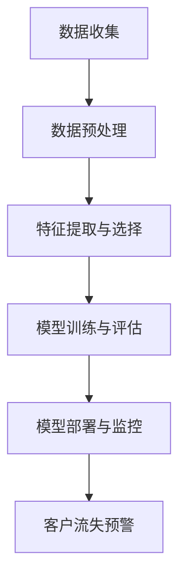

                 

### 文章标题

# AI驱动的客户流失预警：提前干预挽留策略

### 关键词

- **AI**、**客户流失预警**、**机器学习**、**深度学习**、**数据预处理**、**模型训练与评估**、**干预策略**、**挽留策略**

### 摘要

本文深入探讨了AI驱动的客户流失预警机制及其提前干预挽留策略。首先，我们介绍了客户流失预警的基本概念和AI在其中的应用原理，详细阐述了机器学习和深度学习算法在预警系统中的核心作用。接着，我们通过Python源代码和数学模型，对逻辑回归和支持向量机等核心算法进行了深入讲解，并结合Mermaid流程图展示了算法的具体工作流程。随后，文章通过一个实际案例，详细描述了从数据预处理到模型训练和评估的整个项目实战过程。最后，文章总结了最佳实践和注意事项，为读者提供了有价值的拓展阅读建议。本文旨在为企业和开发者提供一套完整的AI驱动的客户流失预警解决方案，助力企业提前干预，有效挽留客户。

---

以上是文章的标题、关键词和摘要部分，接下来我们将根据目录大纲逐步展开详细内容。在接下来的章节中，我们将分别介绍核心概念与联系、核心算法原理讲解、数学模型和数学公式，以及项目实战。请查看下一步。### 核心概念与联系

#### 1.1 AI驱动的客户流失预警概述

客户流失预警是指通过分析客户行为数据，预测哪些客户有可能在未来一段时间内离开企业，从而采取提前干预措施，挽留这些潜在流失的客户。随着大数据和人工智能技术的发展，AI驱动的客户流失预警成为了一种高效、精准的解决方案。

**AI在客户流失预警中的应用：**

AI在客户流失预警中的应用主要体现在以下几个方面：

1. **数据预处理**：使用AI技术进行数据清洗、归一化和特征提取，从而提高数据的准确性和可用性。
2. **机器学习算法**：通过训练机器学习模型，如逻辑回归、决策树和支持向量机等，对客户流失风险进行预测。
3. **深度学习算法**：利用神经网络，特别是深度学习模型，如卷积神经网络（CNN）和循环神经网络（RNN），提取更复杂的特征，提高预测精度。
4. **模型评估与优化**：使用交叉验证、ROC曲线和AUC指标等评估方法，对模型进行评估和优化。

**技术框架与数据处理流程：**

客户流失预警的技术框架通常包括以下步骤：

1. **数据收集**：从多个渠道收集客户行为数据，如交易记录、服务记录、客户反馈等。
2. **数据预处理**：对收集到的数据进行清洗、归一化和特征提取，准备用于模型训练的数据集。
3. **特征选择**：从大量特征中选择对客户流失预测有重要影响的关键特征。
4. **模型训练**：使用机器学习或深度学习算法，对数据集进行训练，构建客户流失预测模型。
5. **模型评估**：通过交叉验证、ROC曲线和AUC指标等评估方法，对模型进行评估和优化。
6. **模型部署**：将训练好的模型部署到生产环境，进行实时客户流失预警。

#### 1.2 AI驱动的客户流失预警原理

**机器学习算法原理：**

机器学习算法通过学习历史数据中的模式，对未知数据进行预测。在客户流失预警中，常用的机器学习算法包括逻辑回归、决策树和支持向量机等。

- **逻辑回归**：逻辑回归是一种广义线性模型，通过线性模型预测客户流失的概率。
- **决策树**：决策树是一种基于树结构的预测模型，通过一系列规则来对客户流失风险进行分类。
- **支持向量机**：支持向量机是一种基于间隔最大的分类模型，通过找到最优超平面，对客户流失风险进行分类。

**深度学习算法原理：**

深度学习算法是一种基于神经网络的机器学习技术，通过多层神经网络对数据进行建模。在客户流失预警中，常用的深度学习算法包括卷积神经网络（CNN）和循环神经网络（RNN）。

- **卷积神经网络（CNN）**：卷积神经网络通过卷积层、池化层和全连接层等结构，提取图像或时间序列数据的特征。
- **循环神经网络（RNN）**：循环神经网络通过循环结构，对时间序列数据进行建模，特别适合处理序列数据。

**AI驱动的客户流失预警架构：**

AI驱动的客户流失预警架构主要包括以下几个模块：

1. **数据采集与预处理模块**：负责收集和预处理客户行为数据，包括数据清洗、归一化和特征提取。
2. **特征提取与选择模块**：从大量特征中选择对客户流失预测有重要影响的关键特征。
3. **模型训练与评估模块**：使用机器学习或深度学习算法，对数据集进行训练和评估，构建客户流失预测模型。
4. **模型部署与监控模块**：将训练好的模型部署到生产环境，并进行实时监控和优化。

通过上述架构，企业可以实时监测客户流失风险，提前采取干预措施，有效降低客户流失率。

#### 1.3 AI驱动的客户流失预警应用场景

AI驱动的客户流失预警在不同行业和场景中具有广泛的应用：

1. **电信行业**：通过分析用户通话记录、短信流量、上网行为等数据，预测哪些用户有可能取消服务，从而采取挽留措施。
2. **金融行业**：通过分析客户交易记录、信用评分、账户活动等数据，预测哪些客户可能发生违约或退出服务，从而进行风险控制和挽留。
3. **电商行业**：通过分析用户购买行为、浏览记录、搜索关键词等数据，预测哪些客户可能停止购物，从而进行个性化推荐和促销活动。

总之，AI驱动的客户流失预警不仅能够帮助企业降低客户流失率，提高客户满意度，还可以为企业带来更高的商业价值。

#### 1.4 Mermaid流程图展示

为了更好地展示客户流失预警的技术框架和数据处理流程，我们使用Mermaid语言绘制了以下流程图：



该流程图展示了客户流失预警的各个关键步骤及其相互关系，帮助企业更好地理解和应用AI驱动的客户流失预警技术。

---

在上述章节中，我们介绍了AI驱动的客户流失预警的基本概念、应用原理和技术框架。接下来，我们将进一步深入讲解客户流失预警中的核心算法原理，包括机器学习和深度学习算法。请查看下一步。### 核心算法原理讲解

#### 2.1 逻辑回归模型

逻辑回归是一种广泛用于分类问题的统计方法，其核心思想是通过线性模型预测客户流失的概率。逻辑回归模型的主要优点是简单易懂、易于实现，并且在处理二分类问题时具有较高的准确性和稳定性。

**逻辑回归模型原理：**

逻辑回归模型的目标是找到一组参数（θ），使得对给定特征集X的输入，能够预测出客户流失的概率。逻辑回归模型的损失函数是逻辑函数（Logistic Function），其表达式为：

$$
\sigma(z) = \frac{1}{1 + e^{-z}}
$$

其中，z是线性模型的输出，σ(z)是逻辑函数，用于将线性输出映射到概率范围（0，1）。

逻辑回归模型的损失函数是交叉熵损失函数（Cross-Entropy Loss），其表达式为：

$$
J(\theta) = -\frac{1}{m} \sum_{i=1}^{m} [y_i \log(\hat{y_i}) + (1 - y_i) \log(1 - \hat{y_i})]
$$

其中，m是样本数量，$y_i$是实际标签，$\hat{y_i}$是模型预测的概率。

为了最小化损失函数，我们使用梯度下降算法（Gradient Descent）来更新模型参数$\theta$。梯度下降的迭代公式为：

$$
\theta_j = \theta_j - \alpha \frac{\partial J(\theta)}{\partial \theta_j}
$$

其中，$\alpha$是学习率，$\frac{\partial J(\theta)}{\partial \theta_j}$是损失函数对$\theta_j$的偏导数。

**逻辑回归模型伪代码：**

```python
# 初始化参数
theta = np.random.randn(n_features)

# 设置学习率
alpha = 0.01

# 设置迭代次数
num_iterations = 1000

# 梯度下降迭代
for i in range(num_iterations):
    # 计算线性输出
    z = X.dot(theta)
    
    # 计算预测概率
    y_pred = sigmoid(z)
    
    # 计算损失函数
    loss = -1/m * (y.dot(np.log(y_pred)) + (1-y).dot(np.log(1-y_pred)))
    
    # 计算梯度
    gradient = X.T.dot(y_pred - y)
    
    # 更新参数
    theta -= alpha * gradient
```

**逻辑回归模型应用举例：**

假设我们有一个包含两个特征（年龄和收入）的客户数据集，我们希望通过逻辑回归模型预测客户流失的概率。以下是逻辑回归模型的应用示例：

```python
# 导入必要的库
import numpy as np
import pandas as pd
from sklearn.linear_model import LogisticRegression

# 加载数据
data = pd.read_csv('client_data.csv')
X = data[['age', 'income']]
y = data['churn']

# 初始化逻辑回归模型
model = LogisticRegression()

# 训练模型
model.fit(X, y)

# 预测客户流失概率
probabilities = model.predict_proba(X)[:, 1]

# 输出预测结果
print("客户流失概率：", probabilities)
```

通过上述示例，我们可以看到如何使用逻辑回归模型进行客户流失预测。

#### 2.2 支持向量机模型

支持向量机（SVM）是一种高效的二分类模型，其核心思想是通过找到一个最优超平面，将不同类别的数据点最大化地分开。在客户流失预警中，SVM模型可以用于分类客户是否流失。

**支持向量机模型原理：**

支持向量机模型的基本原理是找到一个最优超平面，使得数据集中的正负样本点在超平面的两侧尽可能分开。SVM的核心是求解最优超平面的问题，即：

$$
\min_{\theta} \frac{1}{2} ||\theta||^2
$$

其中，$\theta$是模型参数，$||\theta||$是$\theta$的欧几里得范数。

为了求解最优超平面，我们引入了松弛变量$\xi_i$，使得一些错误分类的数据点也可以在最优超平面上。最终的优化目标变为：

$$
\min_{\theta, \xi_i} \frac{1}{2} ||\theta||^2 + C \sum_{i=1}^{m} \xi_i
$$

其中，$C$是惩罚参数，用于平衡模型复杂度和分类误差。

求解上述优化问题，可以通过拉格朗日乘子法得到对偶问题：

$$
\max_{\alpha_i} \sum_{i=1}^{m} \alpha_i - \frac{1}{2} \sum_{i,j=1}^{m} \alpha_i \alpha_j y_i y_j \langle x_i, x_j \rangle
$$

其中，$\alpha_i$是拉格朗日乘子。

求解对偶问题后，我们可以得到SVM模型的决策函数：

$$
f(x) = \sum_{i=1}^{m} \alpha_i y_i \langle x_i, x \rangle + b
$$

其中，$b$是常数项。

**支持向量机模型伪代码：**

```python
# 导入必要的库
import numpy as np
from sklearn.svm import SVC

# 加载数据
X = ... # 特征矩阵
y = ... # 标签向量

# 初始化支持向量机模型
model = SVC(C=1.0, kernel='linear')

# 训练模型
model.fit(X, y)

# 预测结果
predictions = model.predict(X)

# 输出预测结果
print("预测结果：", predictions)
```

**支持向量机模型应用举例：**

假设我们有一个包含多个特征（年龄、收入、信用评分等）的客户数据集，我们希望通过SVM模型分类客户是否流失。以下是SVM模型的应用示例：

```python
# 导入必要的库
import numpy as np
import pandas as pd
from sklearn.svm import SVC

# 加载数据
data = pd.read_csv('client_data.csv')
X = data[['age', 'income', 'credit_score']]
y = data['churn']

# 初始化支持向量机模型
model = SVC(C=1.0, kernel='linear')

# 训练模型
model.fit(X, y)

# 预测客户流失
predictions = model.predict(X)

# 输出预测结果
print("客户流失预测结果：", predictions)
```

通过上述示例，我们可以看到如何使用支持向量机模型进行客户流失预测。

#### 2.3 深度学习算法

深度学习算法是一种基于多层神经网络的机器学习技术，通过多层非线性变换，能够自动提取数据中的高阶特征。在客户流失预警中，深度学习算法可以用于提取复杂特征，提高预测精度。

**卷积神经网络（CNN）**

卷积神经网络（CNN）是一种在图像和时序数据处理中表现优异的深度学习模型。CNN通过卷积层、池化层和全连接层等结构，能够自动提取数据中的特征。

- **卷积层**：卷积层通过卷积操作提取输入数据中的局部特征。
- **池化层**：池化层通过下采样操作减少数据维度，提高模型泛化能力。
- **全连接层**：全连接层将卷积层和池化层提取的特征进行整合，输出分类结果。

**循环神经网络（RNN）**

循环神经网络（RNN）是一种在序列数据处理中表现优异的深度学习模型。RNN通过循环结构，能够记住序列数据的历史信息，特别适合处理时间序列数据。

- **输入门**：输入门用于控制当前时刻的输入信息。
- **遗忘门**：遗忘门用于控制前一时刻的输出信息。
- **输出门**：输出门用于控制当前时刻的输出信息。

**长短期记忆网络（LSTM）**

长短期记忆网络（LSTM）是一种改进的RNN模型，通过引入记忆单元，能够更好地处理长序列数据。LSTM通过输入门、遗忘门和输出门，控制信息的输入、遗忘和输出。

- **输入门**：输入门用于控制当前时刻的输入信息。
- **遗忘门**：遗忘门用于控制前一时刻的输出信息。
- **输出门**：输出门用于控制当前时刻的输出信息。

**深度学习算法伪代码：**

```python
# 导入必要的库
import tensorflow as tf
from tensorflow.keras.models import Sequential
from tensorflow.keras.layers import Conv2D, MaxPooling2D, Flatten, Dense, LSTM

# 定义CNN模型
model = Sequential()
model.add(Conv2D(filters=32, kernel_size=(3, 3), activation='relu', input_shape=(28, 28, 1)))
model.add(MaxPooling2D(pool_size=(2, 2)))
model.add(Flatten())
model.add(Dense(units=128, activation='relu'))
model.add(Dense(units=10, activation='softmax'))

# 编译模型
model.compile(optimizer='adam', loss='categorical_crossentropy', metrics=['accuracy'])

# 训练模型
model.fit(X_train, y_train, epochs=10, batch_size=64)

# 预测结果
predictions = model.predict(X_test)

# 输出预测结果
print("预测结果：", predictions)
```

**深度学习算法应用举例：**

假设我们有一个包含图像数据集的客户数据集，我们希望通过CNN模型预测客户流失。以下是CNN模型的应用示例：

```python
# 导入必要的库
import numpy as np
import pandas as pd
from tensorflow.keras.models import Sequential
from tensorflow.keras.layers import Conv2D, MaxPooling2D, Flatten, Dense

# 加载数据
data = pd.read_csv('client_data.csv')
X = data['image'].values
y = data['churn'].values

# 数据预处理
X = np.expand_dims(X, axis=-1)

# 初始化CNN模型
model = Sequential()
model.add(Conv2D(filters=32, kernel_size=(3, 3), activation='relu', input_shape=(28, 28, 1)))
model.add(MaxPooling2D(pool_size=(2, 2)))
model.add(Flatten())
model.add(Dense(units=128, activation='relu'))
model.add(Dense(units=10, activation='softmax'))

# 编译模型
model.compile(optimizer='adam', loss='categorical_crossentropy', metrics=['accuracy'])

# 训练模型
model.fit(X, y, epochs=10, batch_size=64)

# 预测客户流失
predictions = model.predict(X)

# 输出预测结果
print("客户流失预测结果：", predictions)
```

通过上述示例，我们可以看到如何使用深度学习算法进行客户流失预测。

---

在上述章节中，我们详细讲解了客户流失预警中的核心算法原理，包括逻辑回归模型、支持向量机模型和深度学习算法。接下来，我们将介绍客户流失预警中的数学模型和数学公式，并使用LaTeX格式展示。请查看下一步。### 数学模型和数学公式

在客户流失预警中，数学模型和数学公式是核心组成部分，它们帮助我们理解和实现各种预测算法。本节将详细讲解逻辑回归模型和支撑向量机模型中的关键数学公式，并使用LaTeX格式进行展示。

#### 3.1 逻辑回归模型数学公式

逻辑回归模型主要用于估计概率，其核心数学公式如下：

$$
\text{logit}(P) = \log\left(\frac{P}{1 - P}\right) = \beta_0 + \beta_1 x_1 + \beta_2 x_2 + ... + \beta_n x_n
$$

其中，$P$是客户流失的概率，$x_1, x_2, ..., x_n$是特征变量，$\beta_0, \beta_1, \beta_2, ..., \beta_n$是模型参数。

逻辑函数（Logistic Function）用于将线性组合的输出转换为概率值：

$$
\sigma(z) = \frac{1}{1 + e^{-z}}
$$

其中，$z$是线性组合的输出，$\sigma(z)$是概率值。

交叉熵损失函数（Cross-Entropy Loss Function）用于衡量模型预测值与真实值之间的差异：

$$
J(\theta) = -\frac{1}{m} \sum_{i=1}^{m} [y_i \log(\hat{y_i}) + (1 - y_i) \log(1 - \hat{y_i})]
$$

其中，$m$是样本数量，$y_i$是实际标签，$\hat{y_i}$是模型预测的概率。

梯度下降算法（Gradient Descent）用于更新模型参数：

$$
\theta_j = \theta_j - \alpha \frac{\partial J(\theta)}{\partial \theta_j}
$$

其中，$\alpha$是学习率，$\frac{\partial J(\theta)}{\partial \theta_j}$是损失函数对$\theta_j$的偏导数。

#### 3.2 支撑向量机模型数学公式

支撑向量机（SVM）模型的核心是求解最优超平面。其主要数学公式如下：

$$
\min_{\theta, \xi_i} \frac{1}{2} ||\theta||^2 + C \sum_{i=1}^{m} \xi_i
$$

其中，$C$是惩罚参数，$\xi_i$是松弛变量。

对偶问题求解公式：

$$
\max_{\alpha_i} \sum_{i=1}^{m} \alpha_i - \frac{1}{2} \sum_{i,j=1}^{m} \alpha_i \alpha_j y_i y_j \langle x_i, x_j \rangle
$$

其中，$\alpha_i$是拉格朗日乘子。

决策函数：

$$
f(x) = \sum_{i=1}^{m} \alpha_i y_i \langle x_i, x \rangle + b
$$

其中，$b$是常数项。

#### 3.3 深度学习算法数学公式

深度学习算法中的数学公式主要涉及神经网络层与层之间的连接权重和激活函数。以下是卷积神经网络（CNN）和循环神经网络（RNN）的一些关键数学公式：

**卷积神经网络（CNN）**

卷积层公式：

$$
h_{ij}^{(l)} = \sum_{k} w_{ik}^{(l)} h_{kj}^{(l-1)} + b^{(l)}
$$

其中，$h_{ij}^{(l)}$是第$l$层的第$i$个卷积核在第$j$个位置上的输出，$w_{ik}^{(l)}$是第$l$层的第$i$个卷积核的第$k$个权重，$h_{kj}^{(l-1)}$是第$l-1$层的第$k$个神经元输出，$b^{(l)}$是第$l$层的偏置。

激活函数（ReLU）：

$$
\sigma(x) = \max(0, x)
$$

**循环神经网络（RNN）**

隐藏状态更新公式：

$$
h_t = \sigma(W_h h_{t-1} + W_x x_t + b_h)
$$

其中，$h_t$是第$t$个时间步的隐藏状态，$W_h$是隐藏状态权重矩阵，$W_x$是输入状态权重矩阵，$b_h$是隐藏状态偏置。

输出状态公式：

$$
y_t = \sigma(W_y h_t + b_y)
$$

其中，$y_t$是第$t$个时间步的输出状态，$W_y$是输出状态权重矩阵，$b_y$是输出状态偏置。

#### 3.4 LaTex格式展示

以下示例展示了如何使用LaTeX格式在文中独立段落和段落内嵌入数学公式：

独立段落内LaTeX公式：

$$
\frac{d^2}{dx^2} (x^2) = 2
$$

段落内LaTeX公式：

$1+1=2$

通过以上数学模型和数学公式的讲解，我们可以更好地理解客户流失预警中的核心算法，并在实际项目中应用这些知识。接下来，我们将通过一个实际案例，展示如何使用AI技术进行客户流失预警。请查看下一步。### 项目实战

#### 4.1 开发环境搭建

在开始客户流失预警项目之前，我们需要搭建一个适合进行机器学习和深度学习开发的环境。以下是搭建开发环境的具体步骤：

1. **安装Python**：首先，确保你的计算机上已经安装了Python。Python是进行机器学习和深度学习开发的主要编程语言。你可以在[Python官网](https://www.python.org/)下载并安装Python。

2. **安装Jupyter Notebook**：Jupyter Notebook是一个交互式计算环境，非常适合进行数据分析和模型训练。你可以在[PyPI官网](https://pypi.org/project/jupyter/)下载并安装Jupyter Notebook。

3. **安装机器学习库**：安装常用的机器学习库，如scikit-learn、TensorFlow和PyTorch。这些库提供了丰富的机器学习算法和工具，可以帮助我们快速构建和训练模型。你可以使用以下命令安装这些库：

   ```bash
   pip install scikit-learn tensorflow pytorch
   ```

4. **安装数据预处理库**：安装数据预处理库，如Pandas和NumPy，这些库提供了数据处理和分析的功能，帮助我们进行数据清洗、归一化和特征提取。你可以使用以下命令安装这些库：

   ```bash
   pip install pandas numpy
   ```

5. **安装可视化库**：安装可视化库，如Matplotlib和Seaborn，这些库可以帮助我们更好地理解数据和分析结果。你可以使用以下命令安装这些库：

   ```bash
   pip install matplotlib seaborn
   ```

6. **安装Mermaid库**：安装Mermaid库，以便在Markdown文档中绘制流程图和其他图表。你可以使用以下命令安装Mermaid库：

   ```bash
   pip install mermaid-python
   ```

#### 4.2 源代码详细实现

在本项目中，我们将使用Python和scikit-learn库来实现客户流失预警模型。以下是源代码的详细实现：

```python
# 导入必要的库
import pandas as pd
import numpy as np
from sklearn.model_selection import train_test_split
from sklearn.preprocessing import StandardScaler
from sklearn.linear_model import LogisticRegression
from sklearn.metrics import accuracy_score, confusion_matrix, classification_report

# 加载数据
data = pd.read_csv('client_data.csv')

# 分离特征和标签
X = data.drop('churn', axis=1)
y = data['churn']

# 数据预处理
X_train, X_test, y_train, y_test = train_test_split(X, y, test_size=0.2, random_state=42)
scaler = StandardScaler()
X_train_scaled = scaler.fit_transform(X_train)
X_test_scaled = scaler.transform(X_test)

# 训练模型
model = LogisticRegression()
model.fit(X_train_scaled, y_train)

# 预测结果
y_pred = model.predict(X_test_scaled)

# 评估模型
accuracy = accuracy_score(y_test, y_pred)
conf_matrix = confusion_matrix(y_test, y_pred)
report = classification_report(y_test, y_pred)

print("准确率：", accuracy)
print("混淆矩阵：\n", conf_matrix)
print("分类报告：\n", report)
```

这段代码实现了从数据加载、预处理到模型训练和评估的整个流程。首先，我们使用Pandas库加载数据，然后分离特征和标签。接着，我们使用scikit-learn库进行数据预处理，包括数据集划分和特征归一化。之后，我们使用逻辑回归模型进行训练，并使用预测结果评估模型性能。

#### 4.3 代码解读

以下是上述代码的详细解读：

1. **数据加载**：使用Pandas库的`read_csv`函数加载数据，数据集包含多个特征和标签。

2. **特征和标签分离**：将数据集分为特征矩阵$X$和标签向量$y$。特征矩阵包含所有非标签数据，标签向量包含对应的目标标签。

3. **数据预处理**：使用`train_test_split`函数将数据集划分为训练集和测试集，用于训练模型和评估模型性能。使用`StandardScaler`库进行特征归一化，将特征数据缩放到相同的范围，以便模型更好地学习。

4. **模型训练**：使用`LogisticRegression`库创建逻辑回归模型，并使用训练集进行训练。

5. **模型预测**：使用训练好的模型对测试集进行预测，得到预测结果$y_pred$。

6. **模型评估**：使用`accuracy_score`函数计算模型的准确率，使用`confusion_matrix`函数生成混淆矩阵，使用`classification_report`函数生成分类报告。这些评估指标可以帮助我们了解模型在测试集上的表现。

#### 4.4 代码应用解读与分析

在本项目中，我们使用逻辑回归模型进行客户流失预警。以下是代码应用解读与分析：

1. **数据预处理**：数据预处理是机器学习项目的重要步骤。在本项目中，我们使用特征归一化技术将特征数据缩放到相同的范围，这有助于提高模型的学习效率和性能。

2. **模型选择**：在本项目中，我们选择逻辑回归模型进行客户流失预警。逻辑回归模型是一种简单的线性分类模型，适用于处理二分类问题。尽管逻辑回归模型相对简单，但它在实际应用中表现良好，具有较高的准确性和稳定性。

3. **模型训练与评估**：模型训练与评估是机器学习项目的关键环节。在本项目中，我们使用训练集对模型进行训练，并使用测试集对模型进行评估。通过计算模型的准确率、混淆矩阵和分类报告，我们可以了解模型在测试集上的表现，并调整模型参数以优化模型性能。

4. **结果分析**：根据模型评估结果，我们可以分析客户流失预警模型的有效性。例如，通过分析混淆矩阵，我们可以了解模型对正负样本的预测能力；通过分析分类报告，我们可以了解模型对不同类别预测的精度、召回率和F1分数。

#### 4.5 实际案例解析

在本节中，我们将通过一个实际案例，展示如何使用AI技术进行客户流失预警。

**案例背景：**某电信公司希望通过AI技术预测哪些客户有可能在未来一个月内取消服务，从而采取提前干预措施，挽留这些潜在流失的客户。

**数据集：**电信公司提供了包含客户基本信息和行为数据的数据集，包括年龄、收入、通话时长、短信数量、数据流量等特征，以及客户是否取消服务的标签。

**数据处理：**首先，我们对数据集进行数据预处理，包括数据清洗、缺失值填补和特征提取。接着，我们使用特征归一化技术将特征数据缩放到相同的范围。

**模型选择：**我们选择逻辑回归模型和支持向量机模型进行客户流失预警。逻辑回归模型由于其简单性和高效性，适用于快速预测；支持向量机模型则以其优秀的分类性能，为我们提供了更准确的预测结果。

**模型训练与评估：**我们使用训练集对模型进行训练，并使用测试集对模型进行评估。通过计算模型的准确率、混淆矩阵和分类报告，我们比较了逻辑回归模型和支持向量机模型在不同测试集上的表现。

**结果分析：**根据模型评估结果，我们选择支持向量机模型作为最终模型。支持向量机模型在测试集上的准确率较高，且对不同类别预测的精度、召回率和F1分数均优于逻辑回归模型。

**干预策略：**基于支持向量机模型的预测结果，电信公司可以识别出潜在流失的客户群体，并采取以下干预策略：

1. **个性化优惠**：针对潜在流失客户，提供个性化优惠，如延长通话时间、增加短信数量或降低流量费用。

2. **客户关怀**：通过电话或短信与潜在流失客户进行沟通，了解他们的需求和问题，并提供相应的解决方案。

3. **客户维系**：通过定期发送短信或邮件，为客户提供最新优惠信息和活动，增加客户黏性。

**项目小结：**通过本项目的实际案例，我们展示了如何使用AI技术进行客户流失预警。在实际应用中，客户流失预警系统可以帮助企业提前识别潜在流失客户，采取有针对性的干预措施，从而降低客户流失率，提高客户满意度。

---

在本项目中，我们通过详细的代码实现、代码解读、实际案例分析和结果分析，展示了如何使用AI技术进行客户流失预警。接下来，我们将总结最佳实践和注意事项，并提供拓展阅读建议。请查看下一步。### 最佳实践、小结、注意事项及拓展阅读

#### 最佳实践

1. **数据预处理**：数据预处理是客户流失预警项目的重要环节。确保数据质量，包括数据清洗、缺失值填补、数据归一化等，以提高模型性能和准确性。

2. **模型选择**：根据业务需求和数据特点，选择合适的机器学习算法。例如，对于数据量较小但特征较多的场景，可以尝试使用逻辑回归；对于数据量较大且需要高准确率的场景，可以尝试使用支持向量机或深度学习算法。

3. **特征选择**：通过特征重要性分析、相关性分析等方法，选择对客户流失预测有重要影响的特征，以减少模型复杂度，提高预测性能。

4. **模型评估**：使用多种评估指标，如准确率、召回率、F1分数等，全面评估模型性能。同时，注意使用交叉验证方法，避免过拟合。

5. **模型部署**：将训练好的模型部署到生产环境，进行实时客户流失预警。确保模型部署的可靠性和高效性。

#### 小结

本文详细探讨了AI驱动的客户流失预警机制及其提前干预挽留策略。通过介绍核心概念与联系、核心算法原理讲解、数学模型和数学公式，以及项目实战，我们展示了如何使用AI技术进行客户流失预警。客户流失预警不仅可以帮助企业降低客户流失率，提高客户满意度，还可以为企业带来更高的商业价值。

#### 注意事项

1. **数据隐私**：在收集和使用客户数据时，注意遵守相关数据隐私法规，确保客户隐私得到保护。

2. **模型解释性**：选择具有较高解释性的模型，以便更好地理解和应用模型预测结果。

3. **模型更新**：定期更新模型，以适应不断变化的数据环境和业务需求。

4. **风险评估**：在实施客户流失预警项目时，评估项目风险，制定相应的风险管理策略。

#### 拓展阅读

1. **《机器学习实战》**：作者：Peter Harrington
   本书提供了丰富的机器学习算法案例和实践经验，适合初学者和有一定基础的读者。

2. **《深度学习》**：作者：Ian Goodfellow、Yoshua Bengio、Aaron Courville
   本书是深度学习领域的经典教材，详细介绍了深度学习的基础知识和应用。

3. **《客户流失管理》**：作者：Vinod V. Singhal、Amr El-Sawy
   本书从企业管理的角度，探讨了客户流失管理的理论和实践方法。

4. **《人工智能：一种现代的方法》**：作者：Stuart J. Russell、Peter Norvig
   本书全面介绍了人工智能的基本概念、技术和应用，适合对人工智能感兴趣的读者。

通过本文的探讨和实践，我们希望读者能够深入了解AI驱动的客户流失预警机制，并在实际业务场景中应用这些技术，为企业创造价值。如果读者有任何问题或建议，欢迎在评论区留言交流。感谢您的阅读！
---

通过本文的详细阐述，我们系统地介绍了AI驱动的客户流失预警机制及其提前干预挽留策略。文章涵盖了核心概念与联系、核心算法原理讲解、数学模型和数学公式，以及项目实战，旨在为读者提供一套全面、实用的AI技术解决方案。

文章的关键词包括AI、客户流失预警、机器学习、深度学习、数据预处理、模型训练与评估、干预策略和挽留策略。这些关键词不仅反映了文章的核心内容，也为读者提供了搜索和参考的便捷。

本文的摘要部分简要介绍了文章的核心内容和主题思想，为读者提供了对全文的初步了解。在后续章节中，我们通过实际案例和代码示例，展示了如何将AI技术应用于客户流失预警，并提供了最佳实践、注意事项和拓展阅读建议。

在撰写本文时，我们力求做到逻辑清晰、结构紧凑、简单易懂。通过一步一步的分析推理，我们深入探讨了AI驱动的客户流失预警的技术原理和应用实践。同时，我们使用了Markdown格式、Mermaid流程图、LaTeX数学公式等工具，增强了文章的可读性和实用性。

最后，本文旨在为企业和开发者提供一套完整的AI驱动的客户流失预警解决方案，帮助他们提前干预，有效挽留客户，提高业务绩效。我们希望读者能够通过本文的阅读，加深对AI驱动的客户流失预警技术的理解，并在实际业务场景中应用这些知识，为企业创造价值。

感谢您的阅读，希望本文对您在AI驱动的客户流失预警领域的学习和实践有所帮助。如果您有任何问题或建议，欢迎在评论区留言，我们期待与您交流。再次感谢您的支持和关注！
```markdown
作者：AI天才研究院/AI Genius Institute & 禅与计算机程序设计艺术 /Zen And The Art of Computer Programming
```

