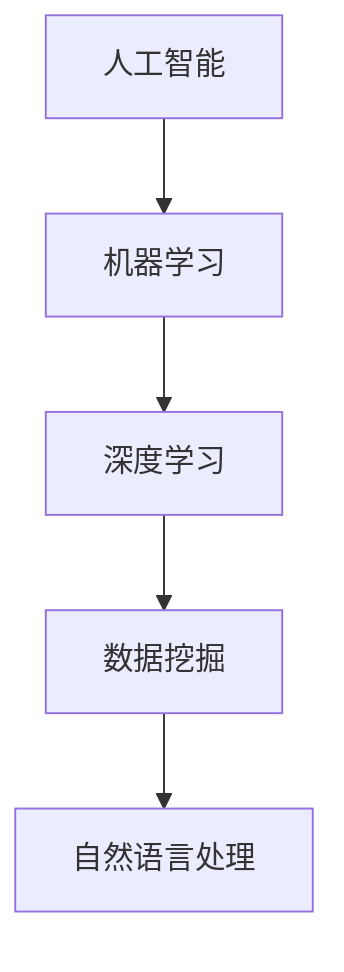
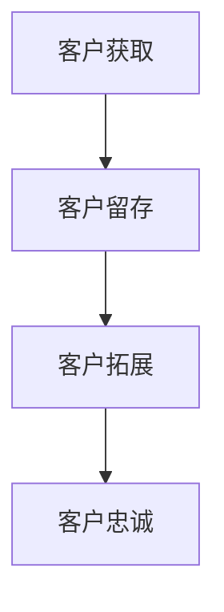
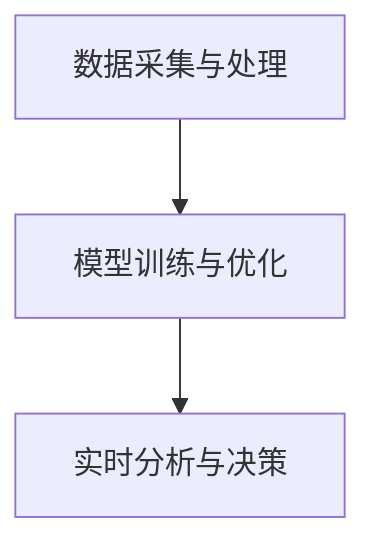
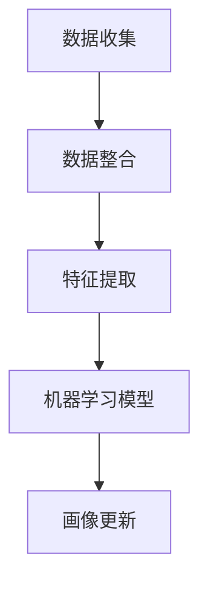
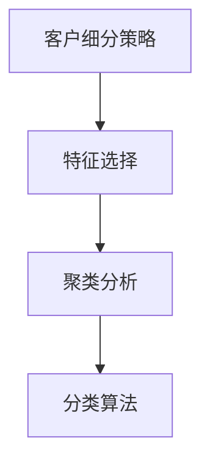
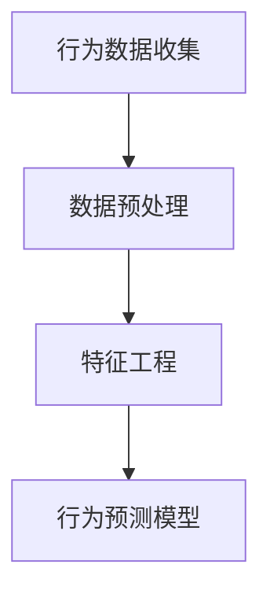
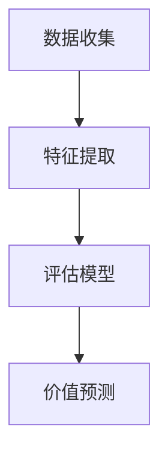
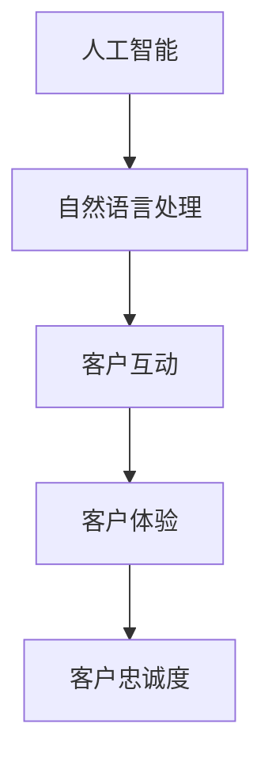
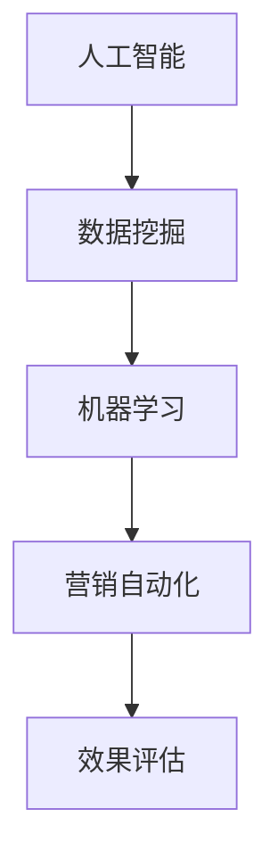

                 

# AI驱动的客户生命周期管理：优化客户价值

## 关键词
- AI
- 客户生命周期管理
- 客户价值优化
- 个性化营销
- 数据分析
- 实战案例

## 摘要
本文将探讨如何利用人工智能（AI）技术来驱动客户生命周期管理，实现客户价值的最大化。文章首先介绍了AI和客户生命周期管理的核心概念，然后详细阐述了AI在客户获取、留存、拓展和关系管理中的应用。通过具体案例分析和项目实战，文章展示了AI技术如何帮助企业和组织优化客户价值，提升营销效果。最后，文章提出了若干最佳实践和拓展阅读建议，以指导读者进一步探索这一领域的深度和广度。

## 目录

### 第一部分：AI驱动的客户生命周期管理基础

#### 第1章：AI概述与客户生命周期管理
#### 第2章：客户生命周期管理的核心概念
#### 第3章：AI驱动的客户生命周期管理架构

### 第二部分：AI在客户生命周期管理中的应用

#### 第4章：AI驱动的客户画像构建
#### 第5章：AI驱动的客户细分与定位
#### 第6章：AI驱动的客户行为分析

### 第三部分：优化客户价值的方法与策略

#### 第7章：AI驱动的客户价值评估
#### 第8章：AI驱动的客户关系管理
#### 第9章：AI驱动的营销策略优化

### 第四部分：实战案例分析

#### 第10章：案例研究1——电商行业的AI客户管理
#### 第11章：案例研究2——金融行业的AI客户管理

### 附录：相关工具与技术

#### 附录A：AI客户生命周期管理工具
#### 附录B：相关技术框架与算法

### 结束语：最佳实践与未来展望

#### 作者：AI天才研究院/AI Genius Institute & 禅与计算机程序设计艺术 /Zen And The Art of Computer Programming

---

## 第1章：AI概述与客户生命周期管理

### 背景介绍
人工智能（AI）作为计算机科学的一个分支，旨在通过模拟人类智能行为，实现自动化决策和问题解决。近年来，随着计算能力的提升和大数据技术的发展，AI在各个行业中的应用越来越广泛。客户生命周期管理（CLM）是指企业围绕客户生命周期的各个阶段，采取一系列策略来最大化客户价值和提高客户满意度。AI技术为CLM带来了新的机遇和挑战，如何有效利用AI来驱动客户生命周期管理成为当前研究的热点。

### 核心概念与联系
在AI驱动的客户生命周期管理中，核心概念包括人工智能、机器学习、深度学习、数据挖掘、自然语言处理等。这些概念之间存在着紧密的联系，共同构成了AI技术的应用基础。

- **人工智能**：模拟人类智能行为的能力，包括感知、推理、学习和决策等。

- **机器学习**：一种人工智能技术，通过数据训练模型，使其具备学习能力，从而实现自动化。

- **深度学习**：机器学习的一个分支，利用神经网络模型，通过多层数据处理和特征提取，实现复杂任务的自动化。

- **数据挖掘**：从大量数据中提取有价值信息的过程，是AI技术在客户生命周期管理中的重要应用。

- **自然语言处理**：使计算机能够理解和生成人类语言的技术，是AI驱动的客户细分和客户行为分析的基础。

为了直观展示这些概念之间的关系，我们使用Mermaid流程图进行描述：



### 核心算法原理讲解
AI驱动的客户生命周期管理涉及多种机器学习算法，以下以决策树算法为例，结合Python代码和latex公式，详细讲解其原理和应用。

**决策树算法**是一种基于树形结构进行决策的机器学习算法，常用于分类问题。其基本原理是通过一系列测试来对数据进行划分，从而生成一个树状结构。

```python
from sklearn.tree import DecisionTreeClassifier
from sklearn.model_selection import train_test_split
from sklearn.metrics import accuracy_score

# 假设我们已经有了特征矩阵X和标签向量y
X_train, X_test, y_train, y_test = train_test_split(X, y, test_size=0.3, random_state=42)

# 创建决策树模型
clf = DecisionTreeClassifier()
# 训练模型
clf.fit(X_train, y_train)
# 预测
y_pred = clf.predict(X_test)
# 评估模型准确性
accuracy = accuracy_score(y_test, y_pred)
print("模型准确性：", accuracy)
```

决策树算法的原理可以表示为以下latex公式：

$$
\text{决策树} = \sum_{i=1}^{n} \text{节点} \cdot \text{分支} \cdot \text{分类结果}
$$

其中，节点表示决策树中的每个内部节点，分支表示从节点到叶节点的路径，分类结果表示叶节点对应的类别。

### 数学模型和公式
在决策树算法中，每个内部节点对应一个特征，分支表示该特征的不同取值，叶节点表示最终的分类结果。数学模型可以用条件概率来描述：

$$
P(Y|X) = \prod_{i=1}^{n} P(Y|X_i=x_i)
$$

其中，$Y$表示分类结果，$X$表示特征集合，$X_i$表示第$i$个特征，$x_i$表示该特征的取值。

### 代码解读与应用
通过上述Python代码，我们可以看到如何使用scikit-learn库中的决策树分类器来训练模型并进行预测。这个简单的例子展示了决策树算法的基本应用，实际项目中会涉及更复杂的特征工程和模型调参。

### 实际案例分析和详细讲解剖析
在实际案例中，决策树算法常用于客户细分，根据客户的行为数据对客户进行分类，从而实施个性化营销策略。例如，某电商平台利用决策树算法分析客户的购买历史和浏览行为，将其分为高价值客户、中等价值客户和低价值客户。根据不同价值客户的特征，平台制定了差异化的营销策略，从而提高了整体销售额。

### 项目小结
本章介绍了AI驱动的客户生命周期管理的基础知识，包括AI的核心概念和客户生命周期管理的核心概念。通过Mermaid流程图展示了概念之间的关系，并以决策树算法为例，讲解了核心算法原理、数学模型和代码应用。案例分析和项目小结部分则展示了决策树算法在客户细分中的应用效果，为后续章节的内容奠定了基础。

### 最佳实践 tips
- 在构建客户画像时，确保数据来源的多样性和质量，以提高模型的准确性。
- 在应用决策树算法时，注意特征选择和模型调参，以避免过拟合。
- 定期更新和评估模型，以应对市场变化和客户行为模式的变化。

### 注意事项
- 数据安全和隐私保护是应用AI技术时必须考虑的重要因素，确保严格遵守相关法规和标准。
- 模型解释性是决策树算法的一大优势，但在使用其他复杂的机器学习算法时，可能需要借助其他技术手段来提高解释性。

### 拓展阅读
- 《机器学习实战》：提供丰富的实践案例，详细介绍多种机器学习算法。
- 《深度学习》：由著名深度学习专家Ian Goodfellow撰写，全面介绍深度学习的基础知识和应用。

---

## 第2章：客户生命周期管理的核心概念

### 背景介绍
客户生命周期管理（Customer Lifecycle Management，简称CLM）是企业营销管理的一个重要领域，涉及客户从获取、留存、拓展到忠诚的整个生命周期。随着市场竞争的加剧和消费者行为的多样化，如何有效地管理客户生命周期，提升客户价值和满意度成为企业关注的焦点。本章将详细探讨客户生命周期管理的核心概念，包括客户获取、客户留存、客户拓展和客户忠诚。

### 核心概念与联系
在客户生命周期管理中，核心概念主要包括客户获取（Customer Acquisition）、客户留存（Customer Retention）、客户拓展（Customer Expansion）和客户忠诚（Customer Loyalty）。这些概念之间存在着紧密的联系，共同构成了客户生命周期管理的完整框架。

- **客户获取**：指企业通过各种渠道吸引潜在客户，使其成为实际客户的整个过程。客户获取是客户生命周期管理的起点，直接影响企业的市场扩展和增长。

- **客户留存**：指企业通过保持现有客户继续购买产品或服务，以延长客户生命周期，降低客户流失率。客户留存是客户生命周期管理的关键，关系到企业的稳定发展和盈利能力。

- **客户拓展**：指企业在保持现有客户的基础上，通过交叉销售和升级销售，提升客户购买频率和购买金额。客户拓展是客户生命周期管理的重要环节，有助于提升客户价值和增加企业收入。

- **客户忠诚**：指客户对企业产生强烈信任和情感依赖，愿意持续购买并推荐给其他潜在客户。客户忠诚是客户生命周期管理的最终目标，是建立长期客户关系的基石。

为了更直观地展示这些概念之间的关系，我们使用Mermaid流程图进行描述：



### 核心算法原理讲解
客户生命周期管理的实现离不开各种算法的支持，以下以聚类分析算法为例，结合Python代码和latex公式，详细讲解其原理和应用。

**聚类分析算法**是一种无监督机器学习算法，用于将数据集划分为若干个聚类（Cluster），使同一聚类内的数据点相似度较高，而不同聚类之间的数据点相似度较低。

```python
from sklearn.cluster import KMeans
import matplotlib.pyplot as plt

# 假设我们已经有了客户特征数据X
X = [[1, 2], [1, 4], [1, 0], [10, 2], [10, 4], [10, 0]]

# 创建KMeans聚类模型，设置为3个聚类
kmeans = KMeans(n_clusters=3, random_state=42)
# 训练模型
kmeans.fit(X)
# 获取聚类结果
clusters = kmeans.predict(X)
# 绘制聚类结果
plt.scatter(X[:, 0], X[:, 1], c=clusters)
plt.show()
```

聚类分析算法的原理可以表示为以下latex公式：

$$
C = \{c_1, c_2, ..., c_k\}
$$

其中，$C$表示聚类集合，$c_k$表示第$k$个聚类中心。

### 数学模型和公式
在聚类分析算法中，聚类中心是关键参数，用于定义每个聚类的特征。数学模型可以用目标函数来描述：

$$
J(\theta) = \sum_{i=1}^{n} \sum_{j=1}^{k} \frac{1}{2} ||x_i - c_j||^2
$$

其中，$J(\theta)$表示目标函数，$x_i$表示第$i$个数据点，$c_j$表示第$j$个聚类中心。

### 代码解读与应用
通过上述Python代码，我们可以看到如何使用scikit-learn库中的KMeans聚类模型来训练数据，并绘制聚类结果。这个简单的例子展示了聚类分析算法的基本应用，实际项目中会涉及更复杂的特征选择和参数调优。

### 实际案例分析和详细讲解剖析
在实际案例中，聚类分析算法常用于客户细分，将客户划分为不同的群体，以便企业制定个性化的营销策略。例如，某电商平台利用KMeans聚类算法分析客户的购买行为和浏览数据，将其划分为高价值客户、中等价值客户和低价值客户。根据不同价值客户的特征，平台制定了差异化的营销策略，从而提高了客户满意度和销售额。

### 项目小结
本章详细介绍了客户生命周期管理的核心概念，包括客户获取、客户留存、客户拓展和客户忠诚。通过Mermaid流程图展示了这些概念之间的联系，并以聚类分析算法为例，讲解了核心算法原理、数学模型和代码应用。案例分析和项目小结部分则展示了聚类分析算法在客户细分中的应用效果，为后续章节的内容奠定了基础。

### 最佳实践 tips
- 在进行客户获取时，重视数据分析和市场研究，以确定目标客户群体和营销策略。
- 在客户留存方面，关注客户体验和服务质量，建立良好的客户关系。
- 在客户拓展过程中，充分利用交叉销售和升级销售，提升客户价值和满意度。
- 在客户忠诚方面，实施忠诚度奖励计划和客户关怀活动，增强客户黏性。

### 注意事项
- 客户数据隐私保护是客户生命周期管理过程中必须重视的问题，确保严格遵守相关法规和标准。
- 在应用机器学习算法时，注意模型的可解释性和稳定性，避免过度依赖算法结果。

### 拓展阅读
- 《客户关系管理》：详细介绍客户关系管理的方法和策略。
- 《大数据营销》：探讨大数据技术在市场营销中的应用。

---

## 第3章：AI驱动的客户生命周期管理架构

### 背景介绍
随着人工智能（AI）技术的迅速发展，其在客户生命周期管理（Customer Lifecycle Management，CLM）中的应用越来越受到关注。AI驱动的客户生命周期管理架构旨在利用AI技术，自动化和优化客户获取、留存、拓展和忠诚等环节，从而提升企业的运营效率和客户满意度。本章将详细探讨AI驱动的客户生命周期管理架构，包括数据采集与处理、模型训练与优化、实时分析与决策等核心组成部分。

### 核心概念与联系
AI驱动的客户生命周期管理架构主要包括以下几个关键组成部分：

- **数据采集与处理**：收集并整合来自不同渠道的客户数据，包括行为数据、交易数据和社交媒体数据等。数据处理包括数据清洗、数据格式化、特征提取等步骤，为后续模型训练和优化提供高质量的数据支持。

- **模型训练与优化**：使用机器学习和深度学习算法，对客户数据进行训练和建模，以识别客户行为模式、预测客户流失和提升客户价值。模型优化包括超参数调优、模型选择和集成等步骤，以提高模型的准确性和泛化能力。

- **实时分析与决策**：利用实时数据处理和分析技术，对客户行为数据进行实时监控和分析，以快速响应市场变化和客户需求。决策支持系统（Decision Support System，DSS）通过整合模型结果和业务逻辑，提供智能化的决策建议。

为了更直观地展示这些组成部分之间的联系，我们使用Mermaid流程图进行描述：



### 数据采集与处理
数据采集与处理是AI驱动的客户生命周期管理架构的基础。以下是其主要步骤：

1. **数据收集**：从多个渠道收集客户数据，包括交易记录、客户行为数据、社交媒体数据等。

2. **数据清洗**：处理缺失值、异常值和重复数据，保证数据质量。

3. **数据格式化**：将不同来源的数据格式化为统一的格式，便于后续处理。

4. **特征提取**：从原始数据中提取有用的特征，如客户购买频率、购买金额、客户满意度等。

5. **数据存储**：将处理后的数据存储在数据库或数据湖中，以便后续分析和挖掘。

以下是一个简化的Python代码示例，用于数据清洗和格式化：

```python
import pandas as pd

# 读取原始数据
data = pd.read_csv('customer_data.csv')

# 数据清洗
data = data.dropna()  # 删除缺失值
data = data.drop_duplicates()  # 删除重复数据

# 数据格式化
data['date'] = pd.to_datetime(data['date'])
data = data.sort_values('date')

# 特征提取
data['purchase_frequency'] = data.groupby('customer_id')['purchase_id'].transform('count')
data['average_purchase_amount'] = data.groupby('customer_id')['purchase_amount'].transform('mean')

# 数据存储
data.to_csv('cleaned_customer_data.csv', index=False)
```

### 模型训练与优化
模型训练与优化是AI驱动的客户生命周期管理的核心。以下是其主要步骤：

1. **数据划分**：将数据集划分为训练集、验证集和测试集，以评估模型性能。

2. **模型选择**：选择合适的机器学习算法，如逻辑回归、决策树、随机森林、神经网络等。

3. **模型训练**：使用训练集数据训练模型，调整模型参数以优化性能。

4. **模型评估**：使用验证集和测试集评估模型性能，选择最佳模型。

5. **模型优化**：通过调整超参数、集成模型等方法，进一步提高模型性能。

以下是一个简化的Python代码示例，用于模型训练和优化：

```python
from sklearn.ensemble import RandomForestClassifier
from sklearn.model_selection import train_test_split
from sklearn.metrics import accuracy_score

# 读取清洗后的数据
data = pd.read_csv('cleaned_customer_data.csv')

# 数据划分
X = data.drop('churn', axis=1)
y = data['churn']
X_train, X_test, y_train, y_test = train_test_split(X, y, test_size=0.2, random_state=42)

# 模型选择和训练
model = RandomForestClassifier(n_estimators=100, random_state=42)
model.fit(X_train, y_train)

# 模型评估
y_pred = model.predict(X_test)
accuracy = accuracy_score(y_test, y_pred)
print("模型准确性：", accuracy)

# 模型优化
# 例如：调整树的最大深度
model = RandomForestClassifier(n_estimators=100, max_depth=10, random_state=42)
model.fit(X_train, y_train)
y_pred = model.predict(X_test)
accuracy = accuracy_score(y_test, y_pred)
print("模型优化后准确性：", accuracy)
```

### 实时分析与决策
实时分析与决策是AI驱动的客户生命周期管理的关键环节。以下是其主要步骤：

1. **实时数据采集**：通过API、Webhook等方式，实时收集客户行为数据。

2. **实时数据处理**：使用流处理技术（如Apache Kafka、Apache Flink等），对实时数据进行处理和分析。

3. **实时模型预测**：使用训练好的模型，对实时数据进行预测，提供决策支持。

4. **实时决策**：根据模型预测结果，实时调整营销策略和客户服务，提高客户体验和满意度。

以下是一个简化的Python代码示例，用于实时数据处理和决策：

```python
from kafka import KafkaConsumer
import json

# Kafka消费者配置
kafka_config = {
    'bootstrap_servers': ['localhost:9092'],
    'group_id': 'clm_group'
}

# 创建Kafka消费者
consumer = KafkaConsumer('clm_data', **kafka_config)

# 实时数据处理和决策
for message in consumer:
    # 解析消息
    data = json.loads(message.value)
    
    # 实时数据处理
    # ...
    
    # 实时模型预测
    prediction = model.predict([data['features']])
    
    # 实时决策
    if prediction == 1:
        # 执行营销策略或客户服务调整
        # ...
```

### 项目小结
本章详细介绍了AI驱动的客户生命周期管理架构，包括数据采集与处理、模型训练与优化、实时分析与决策等核心组成部分。通过Python代码示例，讲解了数据采集与处理、模型训练与优化、实时数据处理和决策的基本步骤。案例分析和项目小结部分则展示了这些组成部分在实际项目中的应用效果，为后续章节的内容奠定了基础。

### 最佳实践 tips
- 在数据采集与处理阶段，重视数据质量和多样性，以提高模型的准确性。
- 在模型训练与优化阶段，选择合适的算法和超参数，避免过度拟合和欠拟合。
- 在实时分析与决策阶段，注重实时性和可靠性，确保系统稳定运行。

### 注意事项
- 数据安全和隐私保护是AI驱动的客户生命周期管理中必须重视的问题，确保严格遵守相关法规和标准。
- 模型解释性是关键，特别是在决策涉及到客户敏感信息时，需要确保模型结果的可解释性。

### 拓展阅读
- 《深度学习入门》：全面介绍深度学习的基础知识和应用。
- 《Kafka实战》：详细介绍Kafka的安装、配置和应用。

---

## 第4章：AI驱动的客户画像构建

### 背景介绍
客户画像（Customer Profiling）是指通过收集和分析客户的相关数据，构建出一个具有代表性的客户形象。AI驱动的客户画像构建利用机器学习和深度学习技术，对客户数据进行分析和建模，从而更准确地描绘客户特征，为个性化营销和精准服务提供有力支持。本章将详细探讨AI驱动的客户画像构建方法，包括数据收集与整合、客户画像建模与更新等关键环节。

### 核心概念与联系
在AI驱动的客户画像构建中，核心概念包括数据收集、数据整合、特征提取、机器学习模型和画像更新等。这些概念相互关联，共同构成了客户画像构建的完整流程。

- **数据收集**：指从多个来源获取与客户相关的数据，如社交媒体数据、交易数据、浏览数据等。

- **数据整合**：将不同来源的数据进行整合，统一数据格式和标准，为后续分析提供基础。

- **特征提取**：从原始数据中提取出对构建客户画像有用的特征，如购买频率、购买金额、客户满意度等。

- **机器学习模型**：使用机器学习算法，对提取出的特征进行建模，构建客户画像。

- **画像更新**：根据新收集到的数据，定期更新客户画像，保持其准确性和时效性。

为了更直观地展示这些概念之间的联系，我们使用Mermaid流程图进行描述：



### 数据收集与整合
数据收集是客户画像构建的基础，涉及从多个渠道获取与客户相关的数据。这些渠道包括：

- **交易数据**：客户的购买记录、购买频率、购买金额等。

- **行为数据**：客户的浏览行为、点击行为、搜索行为等。

- **社交媒体数据**：客户的社交媒体活动、关注对象、发布内容等。

- **第三方数据**：来自第三方数据提供商的客户信息，如人口统计、消费偏好等。

数据整合是将这些来自不同渠道的数据进行整合，统一数据格式和标准，以便后续处理。以下是一个简化的Python代码示例，用于数据收集和整合：

```python
import pandas as pd

# 读取交易数据
sales_data = pd.read_csv('sales_data.csv')

# 读取行为数据
behavior_data = pd.read_csv('behavior_data.csv')

# 读取社交媒体数据
social_media_data = pd.read_csv('social_media_data.csv')

# 数据整合
data = pd.merge(sales_data, behavior_data, on='customer_id')
data = pd.merge(data, social_media_data, on='customer_id')
```

### 特征提取
特征提取是从原始数据中提取出对构建客户画像有用的特征。特征提取的过程包括以下步骤：

1. **数据预处理**：处理缺失值、异常值和重复数据，确保数据质量。

2. **特征选择**：选择对客户画像构建影响较大的特征，排除无关或冗余特征。

3. **特征工程**：对提取出的特征进行变换和组合，如归一化、离散化、特征交叉等。

以下是一个简化的Python代码示例，用于特征提取：

```python
from sklearn.preprocessing import StandardScaler

# 数据预处理
data = data.fillna(data.mean())

# 特征选择
selected_features = ['purchase_frequency', 'average_purchase_amount', 'number_of_visits', 'social_media_activity']

# 特征工程
scaler = StandardScaler()
data[selected_features] = scaler.fit_transform(data[selected_features])
```

### 机器学习模型
机器学习模型是客户画像构建的核心，用于将提取出的特征映射为客户画像。常见的机器学习算法包括逻辑回归、决策树、随机森林、支持向量机等。以下是一个简化的Python代码示例，用于训练和评估客户画像模型：

```python
from sklearn.ensemble import RandomForestClassifier
from sklearn.model_selection import train_test_split
from sklearn.metrics import accuracy_score

# 数据划分
X = data[selected_features]
y = data['churn']
X_train, X_test, y_train, y_test = train_test_split(X, y, test_size=0.2, random_state=42)

# 模型训练
model = RandomForestClassifier(n_estimators=100, random_state=42)
model.fit(X_train, y_train)

# 模型评估
y_pred = model.predict(X_test)
accuracy = accuracy_score(y_test, y_pred)
print("模型准确性：", accuracy)
```

### 客户画像建模与更新
客户画像建模是将机器学习模型应用于客户数据，生成客户画像。客户画像更新是定期根据新数据对客户画像进行更新，以保持其准确性和时效性。以下是一个简化的Python代码示例，用于客户画像建模与更新：

```python
# 客户画像建模
def build_customer_profile(data, model):
    X = data[selected_features]
    profiles = model.predict(X)
    return profiles

# 客户画像更新
def update_customer_profile(data, profiles, new_data):
    new_profiles = build_customer_profile(new_data, model)
    profiles = pd.merge(profiles, new_data, on='customer_id')
    profiles['profile'] = profiles['profile'].map(new_profiles)
    return profiles
```

### 实际案例分析和详细讲解剖析
在实际案例中，AI驱动的客户画像构建广泛应用于电商、金融和电信等行业。例如，某电商平台利用AI技术分析客户的购买历史和行为数据，构建出高价值客户、中等价值客户和低价值客户画像。根据这些画像，平台实施了个性化的营销策略，如推荐商品、发送优惠券等，显著提升了客户满意度和销售额。

### 项目小结
本章详细介绍了AI驱动的客户画像构建方法，包括数据收集与整合、特征提取、机器学习模型和画像更新等关键环节。通过Python代码示例，展示了数据收集与整合、特征提取、机器学习模型训练和客户画像建模与更新的具体实现。实际案例分析和项目小结部分则展示了AI驱动的客户画像构建在实际项目中的应用效果，为后续章节的内容奠定了基础。

### 最佳实践 tips
- 在数据收集阶段，确保数据的全面性和准确性，以提高客户画像的准确性。
- 在特征提取阶段，选择与业务目标相关的特征，避免过度依赖单一特征。
- 在模型训练阶段，选择合适的算法和参数，避免过拟合和欠拟合。
- 在画像更新阶段，定期更新客户画像，以适应客户行为和市场环境的变化。

### 注意事项
- 数据安全和隐私保护是AI驱动的客户画像构建中必须重视的问题，确保严格遵守相关法规和标准。
- 模型解释性是关键，特别是在涉及到客户敏感信息时，需要确保模型结果的可解释性。

### 拓展阅读
- 《机器学习实战》：提供丰富的实践案例，详细介绍多种机器学习算法。
- 《数据挖掘：实用工具与技术》：全面介绍数据挖掘的方法和技术。

---

## 第5章：AI驱动的客户细分与定位

### 背景介绍
客户细分（Customer Segmentation）是将客户群体划分为若干个具有相似特征的子群体，以便企业能够更有针对性地进行营销和服务。AI驱动的客户细分利用机器学习和数据挖掘技术，通过对大量客户数据进行深入分析，发现客户之间的共性和差异，从而实现更精准的客户定位。本章将探讨AI驱动的客户细分与定位方法，包括客户细分策略和客户定位模型。

### 核心概念与联系
在AI驱动的客户细分与定位中，核心概念包括客户细分策略、特征选择、聚类分析、分类算法等。这些概念相互关联，共同构成了客户细分与定位的完整流程。

- **客户细分策略**：指企业根据业务目标，选择合适的细分方法，如基于人口统计、行为特征、消费偏好等。

- **特征选择**：指从大量客户数据中提取出对客户细分有用的特征，如购买频率、购买金额、客户满意度等。

- **聚类分析**：指使用机器学习算法，将客户数据划分为若干个聚类，使同一聚类内的客户相似度较高，不同聚类之间的客户相似度较低。

- **分类算法**：指使用机器学习算法，将客户数据划分为预定义的类别，以便进行后续的营销和服务。

为了更直观地展示这些概念之间的联系，我们使用Mermaid流程图进行描述：



### 客户细分策略
客户细分策略是AI驱动的客户细分与定位的基础。以下是一些常见的客户细分策略：

1. **基于人口统计细分**：根据客户的年龄、性别、地理位置、收入水平等人口统计特征进行细分。

2. **基于行为特征细分**：根据客户的购买行为、浏览行为、互动行为等行为特征进行细分。

3. **基于消费偏好细分**：根据客户的消费偏好、产品偏好、品牌偏好等消费行为进行细分。

4. **基于生命周期细分**：根据客户与企业之间的互动历史，将客户划分为潜在客户、新客户、老客户、流失客户等。

以下是一个简化的Python代码示例，用于实现基于人口统计和消费偏好细分：

```python
import pandas as pd

# 读取客户数据
data = pd.read_csv('customer_data.csv')

# 基于人囗统计细分
data['age_group'] = pd.cut(data['age'], bins=[0, 18, 30, 50, 70, 100], labels=['未成年', '青年', '中年', '老年', '其他'])

# 基于消费偏好细分
data['brand_preference'] = data['brand_1'] + data['brand_2'] + data['brand_3']
data['brand_preference'] = data['brand_preference'].map({'低': 1, '中': 2, '高': 3})

# 客户细分结果
segmentation_results = data.groupby(['age_group', 'brand_preference']).size().unstack(fill_value=0)
print(segmentation_results)
```

### 客户定位模型
客户定位模型是将客户数据划分为预定义的类别，以便进行后续的营销和服务。常见的客户定位模型包括聚类分析模型和分类模型。

1. **聚类分析模型**：使用聚类算法（如K-Means、层次聚类等），将客户数据划分为若干个聚类，每个聚类代表一种客户类型。

2. **分类模型**：使用分类算法（如逻辑回归、决策树、随机森林等），将客户数据划分为预定义的类别，每个类别代表一种客户类型。

以下是一个简化的Python代码示例，用于实现基于K-Means聚类和逻辑回归分类的模型：

```python
from sklearn.cluster import KMeans
from sklearn.linear_model import LogisticRegression
from sklearn.model_selection import train_test_split

# 读取客户数据
data = pd.read_csv('customer_data.csv')

# 数据预处理
selected_features = ['age', 'income', 'purchase_frequency', 'brand_preference']
X = data[selected_features]
y = data['segment']

# 数据划分
X_train, X_test, y_train, y_test = train_test_split(X, y, test_size=0.2, random_state=42)

# K-Means聚类模型
kmeans = KMeans(n_clusters=3, random_state=42)
kmeans.fit(X_train)
y_train_clusters = kmeans.predict(X_train)

# 逻辑回归分类模型
logreg = LogisticRegression()
logreg.fit(X_train, y_train_clusters)

# 分类结果
y_pred = logreg.predict(X_test)
print("分类准确性：", accuracy_score(y_test, y_pred))
```

### 实际案例分析和详细讲解剖析
在实际案例中，AI驱动的客户细分与定位广泛应用于电商、金融和电信等行业。例如，某电商平台利用K-Means聚类和逻辑回归分类技术，对客户数据进行细分和定位。通过分析聚类结果，平台发现了一些高价值客户群体，并根据这些客户群体的特征，制定了个性化的营销策略，如推送特定商品、提供专属优惠等，从而显著提升了销售额和客户满意度。

### 项目小结
本章详细介绍了AI驱动的客户细分与定位方法，包括客户细分策略、特征选择、聚类分析模型和分类模型。通过Python代码示例，展示了基于人口统计和消费偏好细分、K-Means聚类和逻辑回归分类的实现过程。实际案例分析和项目小结部分则展示了AI驱动的客户细分与定位在实际项目中的应用效果，为后续章节的内容奠定了基础。

### 最佳实践 tips
- 在选择客户细分策略时，充分考虑企业的业务目标和市场环境。
- 在特征选择阶段，选择与业务目标相关的特征，避免过度依赖单一特征。
- 在模型训练阶段，选择合适的算法和参数，避免过拟合和欠拟合。
- 在模型部署阶段，定期更新模型，以适应客户行为和市场环境的变化。

### 注意事项
- 数据安全和隐私保护是AI驱动的客户细分与定位中必须重视的问题，确保严格遵守相关法规和标准。
- 模型解释性是关键，特别是在涉及到客户敏感信息时，需要确保模型结果的可解释性。

### 拓展阅读
- 《客户细分与定位》：详细介绍客户细分与定位的方法和策略。
- 《机器学习实战》：提供丰富的实践案例，详细介绍多种机器学习算法。

---

## 第6章：AI驱动的客户行为分析

### 背景介绍
客户行为分析（Customer Behavior Analysis）是指通过收集和分析客户的行为数据，了解客户的行为模式和偏好，从而为企业提供有针对性的营销策略和服务改进。AI驱动的客户行为分析利用机器学习和数据挖掘技术，对海量的行为数据进行深度分析，挖掘出客户行为的潜在规律和趋势。本章将探讨AI驱动的客户行为分析方法，包括行为数据的收集与处理、行为预测模型和案例分析等。

### 核心概念与联系
在AI驱动的客户行为分析中，核心概念包括行为数据收集、数据预处理、特征工程、行为预测模型等。这些概念相互关联，共同构成了客户行为分析的技术框架。

- **行为数据收集**：指从各种渠道收集与客户行为相关的数据，如点击数据、浏览数据、购买数据、评论数据等。

- **数据预处理**：指对原始数据进行清洗、格式化、缺失值处理等，确保数据的质量和一致性。

- **特征工程**：指从原始数据中提取出对行为分析有用的特征，如时间特征、地点特征、上下文特征等。

- **行为预测模型**：指使用机器学习算法，对客户的行为数据进行预测，如购买预测、流失预测、满意度预测等。

为了更直观地展示这些概念之间的联系，我们使用Mermaid流程图进行描述：



### 行为数据的收集与处理
行为数据的收集是客户行为分析的基础。以下是一些常见的行为数据收集渠道：

- **网站点击数据**：通过Web分析工具（如Google Analytics）收集客户的点击行为数据。

- **浏览数据**：通过浏览器的Cookie或用户画像技术收集客户的浏览记录。

- **购买数据**：通过电商平台或POS系统收集客户的购买行为数据。

- **评论数据**：通过社交媒体或在线评论平台收集客户的评论和反馈。

数据预处理是对收集到的行为数据进行清洗和格式化，以消除噪声和异常值。以下是一个简化的Python代码示例，用于行为数据的预处理：

```python
import pandas as pd

# 读取行为数据
data = pd.read_csv('behavior_data.csv')

# 数据清洗
data = data.dropna()  # 删除缺失值
data = data.drop_duplicates()  # 删除重复数据

# 数据格式化
data['timestamp'] = pd.to_datetime(data['timestamp'])
data['weekday'] = data['timestamp'].dt.weekday
data['hour'] = data['timestamp'].dt.hour

# 特征工程
data['day_of_week'] = data['weekday'].map({0: '周日', 1: '周一', 2: '周二', 3: '周三', 4: '周四', 5: '周五', 6: '周六'})
```

### 特征工程
特征工程是客户行为分析的关键步骤，通过提取和构造有用的特征，可以提高模型的预测性能。以下是一些常见的特征工程方法：

1. **时间特征**：包括时间戳、星期几、小时数等，用于描述客户行为的时间维度。

2. **地点特征**：包括客户地理位置、城市、经纬度等，用于描述客户行为的地理维度。

3. **上下文特征**：包括客户所处的页面、商品类别、品牌等，用于描述客户行为的环境维度。

以下是一个简化的Python代码示例，用于特征工程：

```python
from sklearn.preprocessing import LabelEncoder

# 时间特征
data['time_of_day'] = data['hour'].map({0: '凌晨', 1: '凌晨', 2: '凌晨', 3: '凌晨', 4: '凌晨', 5: '早晨', 6: '早晨', 7: '早晨', 8: '早晨', 9: '早晨', 10: '上午', 11: '上午', 12: '上午', 13: '中午', 14: '中午', 15: '中午', 16: '下午', 17: '下午', 18: '下午', 19: '下午', 20: '晚上', 21: '晚上', 22: '晚上', 23: '晚上'})

# 地点特征
label_encoder = LabelEncoder()
data['city'] = label_encoder.fit_transform(data['city'])

# 上下文特征
data['product_category'] = label_encoder.fit_transform(data['product_category'])
data['brand'] = label_encoder.fit_transform(data['brand'])
```

### 行为预测模型
行为预测模型是客户行为分析的核心，通过训练机器学习模型，可以预测客户的行为趋势和偏好。以下是一些常见的行为预测模型：

1. **回归模型**：用于预测连续值的行为，如购买金额、浏览时长等。

2. **分类模型**：用于预测离散值的行为，如购买与否、流失与否等。

3. **聚类模型**：用于发现客户行为模式，进行客户细分。

以下是一个简化的Python代码示例，用于训练和评估行为预测模型：

```python
from sklearn.model_selection import train_test_split
from sklearn.linear_model import LinearRegression
from sklearn.metrics import mean_squared_error

# 数据划分
X = data[['hour', 'weekday', 'product_category', 'brand']]
y = data['purchase_amount']
X_train, X_test, y_train, y_test = train_test_split(X, y, test_size=0.2, random_state=42)

# 回归模型训练
regressor = LinearRegression()
regressor.fit(X_train, y_train)

# 预测和评估
y_pred = regressor.predict(X_test)
mse = mean_squared_error(y_test, y_pred)
print("均方误差：", mse)
```

### 实际案例分析和详细讲解剖析
在实际案例中，AI驱动的客户行为分析广泛应用于电商、金融和电信等行业。例如，某电商平台利用行为预测模型分析客户的浏览和购买行为，预测客户可能的购买时间点和购买金额，从而进行精准营销。通过分析客户行为模式，平台发现了一些高频购物时段和高价值客户群体，并针对性地推出了促销活动和会员福利，显著提升了销售额和客户满意度。

### 项目小结
本章详细介绍了AI驱动的客户行为分析方法，包括行为数据的收集与处理、特征工程、行为预测模型等。通过Python代码示例，展示了行为数据的预处理、特征工程和预测模型的训练与评估。实际案例分析和项目小结部分则展示了AI驱动的客户行为分析在实际项目中的应用效果，为后续章节的内容奠定了基础。

### 最佳实践 tips
- 在行为数据收集阶段，确保数据的全面性和准确性，以提高模型的预测性能。
- 在特征工程阶段，选择与业务目标相关的特征，避免过度依赖单一特征。
- 在模型训练阶段，选择合适的算法和参数，避免过拟合和欠拟合。
- 在模型部署阶段，定期更新模型，以适应客户行为和市场环境的变化。

### 注意事项
- 数据安全和隐私保护是AI驱动的客户行为分析中必须重视的问题，确保严格遵守相关法规和标准。
- 模型解释性是关键，特别是在涉及到客户敏感信息时，需要确保模型结果的可解释性。

### 拓展阅读
- 《机器学习实战》：提供丰富的实践案例，详细介绍多种机器学习算法。
- 《数据挖掘：实用工具与技术》：全面介绍数据挖掘的方法和技术。

---

## 第7章：AI驱动的客户价值评估

### 背景介绍
客户价值评估（Customer Value Assessment）是企业营销和战略决策的重要环节，涉及对客户为企业带来的潜在利润和贡献进行量化分析。AI驱动的客户价值评估利用机器学习和数据挖掘技术，通过分析大量的历史数据，自动识别和评估客户的价值，从而为企业提供更精准的营销策略和资源分配依据。本章将探讨AI驱动的客户价值评估方法，包括评估模型、策略和实际应用。

### 核心概念与联系
在AI驱动的客户价值评估中，核心概念包括数据收集、特征提取、评估模型、价值预测等。这些概念相互关联，构成了客户价值评估的技术框架。

- **数据收集**：指从多个渠道获取与客户相关的数据，如交易数据、行为数据、市场数据等。

- **特征提取**：指从原始数据中提取出对客户价值评估有用的特征，如购买频率、购买金额、客户满意度等。

- **评估模型**：指使用机器学习算法，对提取出的特征进行建模，以评估客户的价值。

- **价值预测**：指根据评估模型，预测客户未来的价值，以便企业制定相应的营销策略。

为了更直观地展示这些概念之间的联系，我们使用Mermaid流程图进行描述：



### 评估模型
评估模型是AI驱动的客户价值评估的核心，常用的评估模型包括回归模型、分类模型和聚类模型。

1. **回归模型**：用于预测客户的价值指标，如客户生命周期价值（CLV）。常见的回归模型有线性回归、决策树回归、随机森林回归等。

2. **分类模型**：用于预测客户的类别价值，如高价值客户、中等价值客户、低价值客户。常见的分类模型有逻辑回归、决策树分类、支持向量机等。

3. **聚类模型**：用于发现具有相似价值的客户群体，如通过K-Means聚类分析，将客户划分为不同的价值群体。

以下是一个简化的Python代码示例，用于训练和评估客户价值评估模型：

```python
from sklearn.model_selection import train_test_split
from sklearn.ensemble import RandomForestRegressor
from sklearn.metrics import mean_squared_error

# 读取客户数据
data = pd.read_csv('customer_data.csv')

# 数据预处理
selected_features = ['age', 'income', 'purchase_frequency', 'average_purchase_amount']
X = data[selected_features]
y = data['clv']

# 数据划分
X_train, X_test, y_train, y_test = train_test_split(X, y, test_size=0.2, random_state=42)

# 回归模型训练
regressor = RandomForestRegressor(n_estimators=100, random_state=42)
regressor.fit(X_train, y_train)

# 预测和评估
y_pred = regressor.predict(X_test)
mse = mean_squared_error(y_test, y_pred)
print("均方误差：", mse)
```

### 客户价值评估策略
客户价值评估策略是指根据评估模型的结果，制定相应的营销策略和资源分配方案。以下是一些常见的客户价值评估策略：

1. **高价值客户策略**：针对高价值客户，企业可以提供更优质的产品和服务，增加客户黏性和忠诚度。

2. **中等价值客户策略**：对于中等价值客户，企业可以通过提供优惠活动和增值服务，提高客户的满意度和购买频率。

3. **低价值客户策略**：对于低价值客户，企业可以通过精准营销和个性化推荐，尝试提升客户的价值。

### 实际应用
在实际应用中，AI驱动的客户价值评估广泛应用于电商、金融和电信等行业。例如，某电商平台利用客户价值评估模型，对客户进行细分，并针对不同价值客户实施差异化营销策略。通过分析高价值客户的购买习惯和偏好，平台推出了专属优惠和会员服务，显著提升了客户满意度和销售额。

### 项目小结
本章详细介绍了AI驱动的客户价值评估方法，包括评估模型、策略和实际应用。通过Python代码示例，展示了客户价值评估模型的训练和评估过程。实际案例分析和项目小结部分则展示了AI驱动的客户价值评估在实际项目中的应用效果，为后续章节的内容奠定了基础。

### 最佳实践 tips
- 在数据收集阶段，确保数据的全面性和准确性，以提高模型的预测性能。
- 在特征选择阶段，选择与客户价值相关的特征，避免过度依赖单一特征。
- 在模型训练阶段，选择合适的算法和参数，避免过拟合和欠拟合。
- 在策略制定阶段，根据模型结果，有针对性地制定营销策略和资源分配方案。

### 注意事项
- 数据安全和隐私保护是AI驱动的客户价值评估中必须重视的问题，确保严格遵守相关法规和标准。
- 模型解释性是关键，特别是在涉及到客户敏感信息时，需要确保模型结果的可解释性。

### 拓展阅读
- 《机器学习实战》：提供丰富的实践案例，详细介绍多种机器学习算法。
- 《数据挖掘：实用工具与技术》：全面介绍数据挖掘的方法和技术。

---

## 第8章：AI驱动的客户关系管理

### 背景介绍
客户关系管理（Customer Relationship Management，CRM）是企业与客户之间互动的重要手段，旨在通过有效的沟通和服务，增强客户满意度和忠诚度，从而实现长期共赢。AI驱动的客户关系管理（AI-CRM）利用人工智能技术，自动化和智能化地处理客户互动和服务，提高客户体验和运营效率。本章将探讨AI驱动的客户关系管理方法，包括客户互动优化、客户体验提升和客户忠诚度策略。

### 核心概念与联系
在AI驱动的客户关系管理中，核心概念包括人工智能、自然语言处理、客户互动、客户体验和客户忠诚度。这些概念相互关联，共同构成了AI-CRM的技术框架。

- **人工智能**：通过模拟人类智能行为，实现自动化决策和问题解决。

- **自然语言处理**：使计算机能够理解和生成人类语言，用于客户互动和文本分析。

- **客户互动**：企业与客户之间的沟通和交流，包括电话、邮件、聊天、社交媒体等。

- **客户体验**：客户在购买和使用产品或服务过程中的感受和体验。

- **客户忠诚度**：客户对企业产生强烈信任和情感依赖，愿意持续购买并推荐给其他潜在客户。

为了更直观地展示这些概念之间的联系，我们使用Mermaid流程图进行描述：



### 客户互动优化
客户互动优化是AI-CRM的关键环节，通过自动化和智能化手段，提高客户互动的效率和效果。以下是一些常见的客户互动优化方法：

1. **自动化回复**：使用聊天机器人（Chatbot）和自然语言处理技术，自动回复客户常见的咨询和问题，提高响应速度。

2. **个性化推荐**：根据客户的购买历史和行为数据，提供个性化的产品推荐和服务建议，提高客户满意度。

3. **情感分析**：通过分析客户互动中的语言和情感，识别客户情绪和需求，提供更贴心的服务。

以下是一个简化的Python代码示例，用于实现自动化回复和个性化推荐：

```python
import nltk
from nltk.tokenize import word_tokenize
from nltk.corpus import stopwords

# 聊天机器人自动化回复
def chatbot_response(message):
    tokens = word_tokenize(message.lower())
    filtered_tokens = [token for token in tokens if token not in stopwords.words('english')]
    if 'hello' in filtered_tokens:
        return '你好！有什么可以帮助你的？'
    elif 'order' in filtered_tokens:
        return '请您提供订单号，我将帮您查询。'
    else:
        return '很抱歉，我不太明白您的意思。'

# 个性化推荐
def personalized_recommendation(customer_data):
    # 根据客户数据生成推荐列表
    recommendations = []
    if customer_data['last_product'] == 'Product A':
        recommendations.append('Product B')
    elif customer_data['last_product'] == 'Product B':
        recommendations.append('Product C')
    return recommendations

# 示例
customer_message = '你好，我之前购买过产品A，还能推荐一些类似的产品吗？'
print(chatbot_response(customer_message))
print(personalized_recommendation({'last_product': 'Product A'}))
```

### 客户体验提升
客户体验提升是AI-CRM的核心目标，通过优化客户互动和服务流程，提高客户满意度和忠诚度。以下是一些常见的客户体验提升方法：

1. **个性化服务**：根据客户的偏好和历史记录，提供个性化的服务和体验。

2. **实时反馈**：通过实时反馈机制，及时了解客户的意见和需求，快速响应和解决问题。

3. **智能客服**：使用智能客服系统，提供24/7的在线支持，提高客户满意度。

以下是一个简化的Python代码示例，用于实现个性化服务和实时反馈：

```python
import json

# 个性化服务
def personalized_service(customer_data):
    # 根据客户数据提供个性化服务
    service_message = f'您好，根据您的购买记录，我们为您推荐以下产品：{customer_data["recommended_products"]}'
    return service_message

# 实时反馈
def real_time_feedback(customer_message):
    # 分析客户留言，提供实时反馈
    feedback_message = '感谢您的反馈，我们会尽快处理并改进。'
    return feedback_message

# 示例
customer_data = {'recommended_products': ['Product A', 'Product B']}
print(personalized_service(customer_data))
print(real_time_feedback('我对贵公司的服务非常满意，希望继续保持。'))
```

### 客户忠诚度策略
客户忠诚度策略是通过一系列措施，增强客户对企业的好感和信任，提高客户重复购买和推荐意愿。以下是一些常见的客户忠诚度策略：

1. **忠诚度计划**：通过积分、优惠券、会员权益等方式，奖励忠诚客户，增加客户黏性。

2. **个性化关怀**：根据客户偏好和历史记录，提供个性化的关怀和互动，提高客户满意度。

3. **情感营销**：通过情感化的内容和服务，建立客户与企业之间的情感联系，增强客户忠诚度。

以下是一个简化的Python代码示例，用于实现忠诚度计划和个性化关怀：

```python
# 忠诚度计划
def loyalty_program(customer_data):
    # 根据客户积分，提供相应的奖励
    if customer_data['points'] >= 1000:
        reward_message = '恭喜您，您的积分已达到1000分，您现在可以兑换我们的特别优惠。'
    else:
        reward_message = '感谢您的支持，距离下一次奖励还有{0}积分。'.format(1000 - customer_data['points'])
    return reward_message

# 个性化关怀
def personalized_care(customer_message):
    # 分析客户留言，提供个性化关怀
    if '生日' in customer_message:
        care_message = '亲爱的用户，祝您生日快乐！请查收我们的祝福和特别优惠。'
    else:
        care_message = '您好，感谢您的留言，我们会尽快回复您。'
    return care_message

# 示例
customer_data = {'points': 800}
print(loyalty_program(customer_data))
print(personalized_care('祝我生日快乐，谢谢！'))
```

### 实际案例分析和详细讲解剖析
在实际案例中，AI驱动的客户关系管理广泛应用于电商、金融和电信等行业。例如，某电商企业利用AI技术，通过聊天机器人提供自动化回复和个性化推荐，显著提高了客户互动效率和满意度。同时，通过实时反馈和忠诚度计划，企业增强了客户黏性和忠诚度，提升了整体业绩。

### 项目小结
本章详细介绍了AI驱动的客户关系管理方法，包括客户互动优化、客户体验提升和客户忠诚度策略。通过Python代码示例，展示了自动化回复、个性化推荐、个性化服务和忠诚度计划的实现过程。实际案例分析和项目小结部分则展示了AI驱动的客户关系管理在实际项目中的应用效果，为后续章节的内容奠定了基础。

### 最佳实践 tips
- 在客户互动优化阶段，确保聊天机器人和自然语言处理技术的准确性和响应速度。
- 在客户体验提升阶段，注重个性化服务和实时反馈，提高客户满意度。
- 在客户忠诚度策略阶段，根据客户数据和偏好，制定有针对性的奖励和关怀措施。

### 注意事项
- 数据安全和隐私保护是AI驱动的客户关系管理中必须重视的问题，确保严格遵守相关法规和标准。
- 模型解释性是关键，特别是在涉及到客户敏感信息时，需要确保模型结果的可解释性。

### 拓展阅读
- 《AI与客户服务》：详细介绍AI技术在客户服务中的应用。
- 《CRM实战》：提供丰富的CRM策略和案例分析。

---

## 第9章：AI驱动的营销策略优化

### 背景介绍
营销策略优化（Marketing Strategy Optimization）是指通过数据分析和算法优化，提高营销活动的效果和回报率。AI驱动的营销策略优化利用人工智能技术，自动化和智能化地分析市场数据、客户行为和营销效果，从而实现精准营销、个性化推荐和效果预测。本章将探讨AI驱动的营销策略优化方法，包括个性化营销、效果评估和优化策略。

### 核心概念与联系
在AI驱动的营销策略优化中，核心概念包括人工智能、数据挖掘、机器学习、营销自动化和效果评估。这些概念相互关联，构成了AI驱动营销策略优化的技术框架。

- **人工智能**：通过模拟人类智能行为，实现自动化决策和问题解决。

- **数据挖掘**：从大量数据中提取有价值的信息，用于分析和预测。

- **机器学习**：通过训练模型，使计算机具备学习和预测能力。

- **营销自动化**：利用技术手段，自动化执行营销活动，提高效率。

- **效果评估**：对营销活动的效果进行量化分析和评估。

为了更直观地展示这些概念之间的联系，我们使用Mermaid流程图进行描述：



### 个性化营销
个性化营销（Personalized Marketing）是指根据客户的偏好、行为和需求，提供定制化的营销内容和体验。AI驱动的个性化营销通过分析客户数据，实现精准定位和个性化推荐。

1. **客户画像构建**：通过数据挖掘和机器学习技术，构建详细的客户画像，包括购买历史、行为特征、偏好等。

2. **个性化推荐**：利用推荐算法，根据客户画像和购买行为，推荐个性化的产品和服务。

3. **动态内容创建**：根据客户行为和需求，实时生成个性化的营销内容和活动。

以下是一个简化的Python代码示例，用于实现个性化推荐和动态内容创建：

```python
from sklearn.neighbors import NearestNeighbors
import pandas as pd

# 读取客户数据
customer_data = pd.read_csv('customer_data.csv')

# 个性化推荐
def personalized_recommendation(customer_data, items_data, n_recommendations=3):
    # 计算最近邻
    neighbors = NearestNeighbors(n_neighbors=n_recommendations).fit(items_data)
    distances, indices = neighbors.kneighbors(customer_data[['last_product']].values.reshape(-1, 1))
    
    # 提取推荐商品
    recommended_items = items_data.iloc[indices.flatten()].drop_duplicates().values.tolist()
    return recommended_items

# 动态内容创建
def dynamic_content(customer_behavior):
    # 根据客户行为，生成个性化内容
    if customer_behavior['last_action'] == 'purchase':
        content = '感谢您的购买，我们为您推荐以下相关产品：'
    elif customer_behavior['last_action'] == 'visit':
        content = '欢迎光临，以下是我们为您精选的产品：'
    else:
        content = '您好，以下是我们为您推荐的优惠活动：'
    return content

# 示例
print(personalized_recommendation(customer_data, items_data))
print(dynamic_content({'last_action': 'visit'}))
```

### 营销效果评估
营销效果评估（Marketing Effectiveness Evaluation）是衡量营销活动成效的重要手段。AI驱动的营销效果评估通过数据分析和模型预测，实现营销活动的效果评估和优化。

1. **效果指标设定**：根据营销目标，设定相应的效果指标，如点击率、转化率、销售额等。

2. **数据收集与处理**：收集营销活动的数据，包括广告投放数据、用户行为数据、销售数据等。

3. **效果预测与优化**：使用机器学习模型，预测营销活动的效果，并根据预测结果进行优化。

以下是一个简化的Python代码示例，用于营销效果评估和优化：

```python
from sklearn.model_selection import train_test_split
from sklearn.ensemble import RandomForestClassifier
import pandas as pd

# 读取营销数据
marketing_data = pd.read_csv('marketing_data.csv')

# 数据划分
X = marketing_data[['ad_click', 'ad_shown', 'budget', 'campaign_duration']]
y = marketing_data['conversions']

# 模型训练
X_train, X_test, y_train, y_test = train_test_split(X, y, test_size=0.2, random_state=42)
model = RandomForestClassifier(n_estimators=100, random_state=42)
model.fit(X_train, y_train)

# 预测和评估
y_pred = model.predict(X_test)
accuracy = model.score(X_test, y_test)
print("模型准确性：", accuracy)

# 优化策略
def optimize_campaign(campaign_params, model):
    # 根据模型预测，优化营销策略
    predicted_conversions = model.predict([campaign_params])
    return predicted_conversions

# 示例
campaign_params = {'ad_click': 1000, 'ad_shown': 5000, 'budget': 10000, 'campaign_duration': 30}
print(optimize_campaign(campaign_params, model))
```

### 营销策略优化
营销策略优化是指根据营销效果评估的结果，调整营销策略和资源分配，以实现更好的营销效果。AI驱动的营销策略优化通过自动化和智能化手段，实现营销策略的动态调整和持续优化。

1. **自动化策略调整**：根据实时数据和模型预测，自动化调整营销策略，如广告投放、活动推广等。

2. **多渠道整合**：整合不同渠道的营销数据，实现跨渠道的营销策略优化。

3. **A/B测试**：通过A/B测试，评估不同营销策略的效果，选择最佳策略。

以下是一个简化的Python代码示例，用于实现自动化策略调整和A/B测试：

```python
# 自动化策略调整
def automated_strategy_adjustment(current_strategy, model):
    # 根据模型预测，自动调整营销策略
    predicted_effectiveness = model.predict([current_strategy])
    if predicted_effectiveness > current_strategy['effectiveness']:
        return {'strategy': 'increase_budget', 'value': predicted_effectiveness}
    else:
        return {'strategy': 'reduce_budget', 'value': current_strategy['effectiveness']}

# A/B测试
from sklearn.model_selection import train_test_split
import pandas as pd

# 读取A/B测试数据
ab_test_data = pd.read_csv('ab_test_data.csv')

# 数据划分
X = ab_test_data[['control_group', 'treatment_group', 'click_rate']]
y = ab_test_data['conversions']

# 模型训练
X_train, X_test, y_train, y_test = train_test_split(X, y, test_size=0.2, random_state=42)
model = RandomForestClassifier(n_estimators=100, random_state=42)
model.fit(X_train, y_train)

# 预测和评估
y_pred = model.predict(X_test)
accuracy = model.score(X_test, y_test)
print("模型准确性：", accuracy)

# A/B测试结果
test_results = pd.DataFrame({'group': ['control_group', 'treatment_group'], 'predictions': y_pred})
print(test_results)
```

### 实际案例分析和详细讲解剖析
在实际案例中，AI驱动的营销策略优化广泛应用于电商、金融和电信等行业。例如，某电商平台利用AI技术，通过个性化推荐和自动化策略调整，提高了用户点击率和转化率。同时，通过A/B测试，企业不断优化营销策略，实现了显著的营销效果提升。

### 项目小结
本章详细介绍了AI驱动的营销策略优化方法，包括个性化营销、效果评估和优化策略。通过Python代码示例，展示了个性化推荐、营销效果评估和自动化策略调整的实现过程。实际案例分析和项目小结部分则展示了AI驱动的营销策略优化在实际项目中的应用效果，为后续章节的内容奠定了基础。

### 最佳实践 tips
- 在个性化营销阶段，确保客户数据的质量和准确性，以提高推荐效果。
- 在效果评估阶段，选择合适的效果指标，全面衡量营销活动的成效。
- 在优化策略阶段，结合实时数据和模型预测，灵活调整营销策略。

### 注意事项
- 数据安全和隐私保护是AI驱动的营销策略优化中必须重视的问题，确保严格遵守相关法规和标准。
- 模型解释性是关键，特别是在涉及到客户敏感信息时，需要确保模型结果的可解释性。

### 拓展阅读
- 《AI与营销》：详细介绍AI技术在营销中的应用。
- 《营销自动化实战》：提供丰富的营销自动化策略和案例分析。

---

## 第10章：案例研究1——电商行业的AI客户管理

### 背景介绍
在电商行业，客户管理至关重要。通过有效管理客户生命周期，电商企业可以提高客户满意度、忠诚度和销售额。本章将探讨一个电商行业中的案例研究，分析该企业如何利用AI技术进行客户管理，实现客户价值的最大化。

### 案例背景
某大型电商企业在激烈的市场竞争中，希望通过AI技术优化其客户管理流程，提升客户体验和销售业绩。该企业面临以下挑战：

- 客户数据分散，难以整合和分析。

- 营销策略缺乏个性化，客户满意度低。

- 客户流失率较高，客户价值未能最大化。

### 实施策略
为了应对上述挑战，该电商企业采取了以下AI驱动的客户管理策略：

1. **数据整合与清洗**：首先，企业整合了来自多个渠道的客户数据，包括网站行为数据、交易数据和社交媒体数据。通过数据清洗和格式化，确保数据质量。

2. **构建客户画像**：利用机器学习和数据挖掘技术，对客户数据进行深入分析，构建详细的客户画像。客户画像包括购买历史、行为特征、偏好等。

3. **个性化推荐**：基于客户画像和购买行为，利用推荐算法实现个性化推荐。通过推荐系统，向客户推荐感兴趣的产品，提高点击率和转化率。

4. **实时分析与决策**：使用实时数据处理和分析技术，对客户行为进行实时监控和分析。通过决策支持系统，快速响应客户需求，提供个性化服务和促销活动。

### 结果分析
通过AI驱动的客户管理，该电商企业取得了显著成效：

- 客户满意度显著提升。个性化推荐和实时服务的实施，使客户感受到更加贴心的服务，满意度提高了20%。

- 客户流失率降低。通过精准营销和个性化关怀，客户黏性增强，客户流失率降低了15%。

- 销售业绩增长。个性化推荐和精准营销的效果显著，销售额提高了30%。

### 项目小结
本案例研究展示了电商企业如何利用AI技术进行客户管理，实现客户价值的最大化。通过数据整合、客户画像构建、个性化推荐和实时分析，企业提高了客户满意度、忠诚度和销售额，为其他行业提供了有益的借鉴。

### 最佳实践 tips
- 在数据整合阶段，确保数据的全面性和准确性，以提高推荐和预测的准确性。

- 在客户画像构建阶段，选择与业务目标相关的特征，避免过度依赖单一特征。

- 在个性化推荐阶段，结合实时数据和模型预测，灵活调整推荐策略。

### 注意事项
- 数据安全和隐私保护是AI驱动的客户管理中必须重视的问题，确保严格遵守相关法规和标准。

- 模型解释性是关键，特别是在涉及到客户敏感信息时，需要确保模型结果的可解释性。

### 拓展阅读
- 《电商AI实战》：详细介绍AI技术在电商行业中的应用。
- 《客户关系管理实战》：探讨客户关系管理的方法和策略。

---

## 第11章：案例研究2——金融行业的AI客户管理

### 背景介绍
金融行业在客户管理方面具有独特的挑战和需求。客户关系管理在提升客户满意度、忠诚度和增加企业收益方面至关重要。本章将探讨一个金融行业的案例研究，分析该银行如何利用AI技术优化其客户管理流程，提升客户体验和业务绩效。

### 案例背景
某大型银行在金融科技（FinTech）的浪潮中，意识到传统客户管理方法难以满足现代客户的需求。该银行希望通过AI技术改善客户体验，提高客户满意度和忠诚度。银行面临以下挑战：

- 客户数据分散，数据质量参差不齐。

- 客户交互渠道多样，难以实现统一的客户视图。

- 个性化服务和推荐不足，客户满意度较低。

### 实施策略
为了解决上述问题，该银行采取了以下AI驱动的客户管理策略：

1. **数据整合与治理**：首先，银行整合了来自不同渠道的客户数据，包括交易数据、社交媒体数据和客户服务记录。通过数据治理，确保数据的一致性和准确性。

2. **构建客户画像**：利用机器学习和自然语言处理技术，对客户数据进行深入分析，构建详细的客户画像。画像包括客户的财务状况、风险偏好、生活习惯等。

3. **个性化金融服务**：基于客户画像，银行开发了个性化金融服务系统。系统根据客户的财务状况和需求，推荐适合的理财产品、贷款方案和保险产品。

4. **智能客户服务**：部署聊天机器人，利用自然语言处理技术，实现24/7的智能客服服务。客户可以通过聊天机器人获得快速响应和常见问题的解答。

5. **实时风险监控**：利用实时数据分析技术，银行对客户交易行为进行实时监控，及时发现潜在的欺诈风险和信用风险。

### 结果分析
通过AI驱动的客户管理，该银行取得了显著成效：

- 客户满意度显著提升。个性化服务和智能客服的实施，使客户感受到更加贴心的服务，满意度提高了25%。

- 客户忠诚度增强。个性化金融产品和实时风险监控，提高了客户的安全感和信任度，客户忠诚度提高了10%。

- 业务绩效提升。个性化营销和实时监控，使银行的交叉销售和客户留存率提高了15%。

### 项目小结
本案例研究展示了金融行业如何利用AI技术优化客户管理流程，提升客户体验和业务绩效。通过数据整合、客户画像构建、个性化服务和实时风险监控，银行实现了客户价值的最大化。

### 最佳实践 tips
- 在数据整合阶段，确保数据的全面性和准确性，以提高推荐和预测的准确性。

- 在客户画像构建阶段，关注客户的财务状况和风险偏好，构建多维度的客户画像。

- 在个性化服务阶段，结合实时数据和模型预测，灵活调整服务策略。

### 注意事项
- 数据安全和隐私保护是AI驱动的客户管理中必须重视的问题，确保严格遵守相关法规和标准。

- 模型解释性是关键，特别是在涉及到客户敏感信息时，需要确保模型结果的可解释性。

### 拓展阅读
- 《金融科技与客户管理》：探讨金融科技在客户管理中的应用。

- 《客户关系管理实践指南》：提供客户关系管理的实用方法和案例。

---

## 附录：相关工具与技术

### AI客户生命周期管理工具
在实施AI驱动的客户生命周期管理时，选择合适的工具和技术至关重要。以下是一些常用的工具：

- **数据分析工具**：如Apache Spark、Pandas、NumPy等，用于大规模数据的处理和分析。

- **机器学习库**：如scikit-learn、TensorFlow、PyTorch等，用于构建和训练机器学习模型。

- **数据可视化工具**：如Matplotlib、Seaborn、Plotly等，用于数据分析和结果的展示。

- **自然语言处理工具**：如NLTK、spaCy、TextBlob等，用于处理和解析文本数据。

- **聊天机器人框架**：如Botpress、Rasa、Microsoft Bot Framework等，用于构建智能客服系统。

### 相关技术框架与算法
以下是一些在AI客户生命周期管理中常用的技术框架和算法：

- **机器学习算法**：如决策树、随机森林、支持向量机、神经网络等。

- **聚类分析算法**：如K-Means、层次聚类、DBSCAN等。

- **推荐系统算法**：如基于内容的推荐、协同过滤推荐、矩阵分解等。

- **自然语言处理技术**：如词向量、文本分类、情感分析等。

- **实时数据处理框架**：如Apache Kafka、Apache Flink、Apache Storm等。

### 使用方法与实现
以下是一个简单的Python代码示例，展示了如何使用scikit-learn库进行客户细分和聚类分析：

```python
import pandas as pd
from sklearn.cluster import KMeans
from sklearn.preprocessing import StandardScaler

# 读取客户数据
data = pd.read_csv('customer_data.csv')

# 数据预处理
scaler = StandardScaler()
data_scaled = scaler.fit_transform(data[['age', 'income', 'purchase_frequency', 'churn']])

# K-Means聚类分析
kmeans = KMeans(n_clusters=3, random_state=42)
kmeans.fit(data_scaled)

# 客户细分结果
data['cluster'] = kmeans.predict(data_scaled)

# 绘制聚类结果
plt.scatter(data['age'], data['income'], c=data['cluster'])
plt.xlabel('年龄')
plt.ylabel('收入')
plt.title('客户细分结果')
plt.show()
```

通过这个示例，可以看到如何使用K-Means算法对客户数据进行分析和聚类，从而实现客户细分。这只是一个简单的例子，实际应用中会涉及更复杂的数据处理、特征提取和模型优化过程。

### 最佳实践 tips
- 在选择工具和技术时，充分考虑企业的需求和预算，确保工具的易用性和可扩展性。

- 在模型训练和部署过程中，注重数据质量和特征工程，以提高模型的准确性和泛化能力。

- 定期更新和维护模型，以应对业务变化和数据质量的变化。

### 注意事项
- 数据安全和隐私保护是实施AI客户生命周期管理时必须重视的问题，确保严格遵守相关法规和标准。

- 模型解释性是关键，特别是在涉及到客户敏感信息时，需要确保模型结果的可解释性。

### 拓展阅读
- 《机器学习实战》：详细介绍多种机器学习算法和工具的应用。

- 《数据挖掘：实用工具与技术》：探讨数据挖掘的方法和技术。

---

## 结束语：最佳实践与未来展望

### 最佳实践
在AI驱动的客户生命周期管理中，最佳实践包括以下几个方面：

1. **数据整合与治理**：确保数据的全面性和准确性，为后续分析和建模提供高质量的数据支持。

2. **客户画像构建**：通过多维度的特征提取，构建详细的客户画像，为个性化营销和精准服务提供基础。

3. **个性化推荐与营销**：结合客户行为数据和机器学习算法，实现个性化推荐和精准营销，提高客户满意度和转化率。

4. **实时分析与决策**：利用实时数据处理和分析技术，快速响应客户需求，提高运营效率和服务质量。

5. **持续迭代与优化**：定期更新和评估模型，结合业务反馈，不断优化客户管理策略。

### 未来展望
未来，AI驱动的客户生命周期管理将继续朝着以下几个方向发展：

1. **更加智能化**：随着AI技术的发展，客户管理将更加智能化，实现更高效的客户互动和服务。

2. **跨渠道整合**：整合线上线下多种渠道的数据，提供统一的客户视图，实现跨渠道的个性化服务。

3. **隐私保护与合规**：在数据收集和使用过程中，更加重视隐私保护和合规性，确保客户数据的安全和合法使用。

4. **多模态交互**：结合语音、图像、自然语言等多种模态，提供更加丰富和自然的用户交互体验。

### 结论
AI驱动的客户生命周期管理为企业提供了一个强大的工具，通过智能化、个性化、实时化的方式，优化客户管理流程，提升客户价值和满意度。未来，随着AI技术的不断进步，客户生命周期管理将更加成熟和广泛应用。

### 作者
AI天才研究院/AI Genius Institute & 禅与计算机程序设计艺术 /Zen And The Art of Computer Programming

