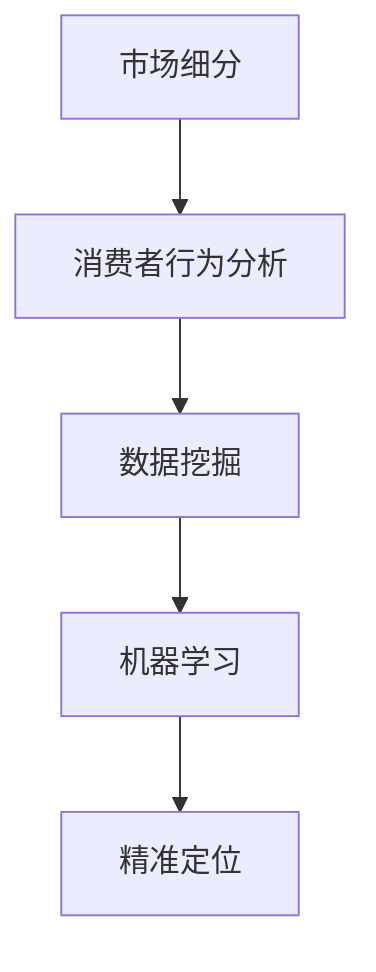

                 

### AI驱动的市场细分：精准定位目标客户群

在当今竞争激烈的市场环境中，企业要想取得成功，就必须准确理解并满足客户的需求。而精准定位目标客户群是实现这一目标的关键。随着人工智能（AI）技术的迅猛发展，AI在市场细分中的应用已成为现代市场营销中的重要工具。本文将详细探讨如何利用AI技术进行市场细分，帮助企业在激烈的市场竞争中脱颖而出。

文章关键词：人工智能、市场细分、客户定位、数据挖掘、机器学习

摘要：本文首先介绍了市场细分的背景和重要性，接着探讨了AI在市场细分中的应用，包括数据收集、分析和预测模型构建。然后，通过具体案例展示了AI驱动市场细分在实际业务中的效果，并提供了最佳实践建议。最后，展望了AI驱动市场细分的发展趋势，为企业未来的市场策略提供了指导。

### 背景介绍

市场细分是市场营销中的核心概念，它指的是将整个市场划分为若干个子市场，每个子市场具有独特的需求和特征。有效的市场细分有助于企业更精准地定位目标客户，提高营销活动的效果，从而在竞争激烈的市场中脱颖而出。

传统市场细分主要依赖于人口统计学、地理统计和社会经济因素。然而，随着互联网和大数据技术的发展，企业能够收集到更多关于消费者的数据，这些数据为更精确的市场细分提供了可能。人工智能技术的崛起，特别是机器学习算法的进步，使得企业能够从海量数据中提取有价值的信息，进一步提升了市场细分的精度和效率。

### AI与市场细分的关系

AI在市场细分中的应用主要体现在以下几个方面：

1. **数据收集与处理**：AI技术能够自动收集和分析大量消费者数据，包括用户行为、浏览历史、购买记录等。通过数据清洗和预处理，AI可以去除噪声数据，提取关键信息。

2. **特征工程**：AI技术可以根据数据的特点，自动选择和构建有效的特征，这些特征能够更好地代表消费者的需求和偏好。

3. **模式识别**：机器学习算法可以帮助识别数据中的潜在模式，这些模式可以用来预测消费者的行为，从而实现更精准的市场细分。

4. **个性化推荐**：基于消费者历史数据和实时反馈，AI可以生成个性化的推荐，提高客户满意度和转化率。

### 核心概念与联系

为了更好地理解AI在市场细分中的应用，我们需要明确几个核心概念：

- **市场细分（Market Segmentation）**：市场细分是将整个市场划分为若干个子市场，每个子市场具有相似的消费需求和特征。
- **消费者行为分析（Consumer Behavior Analysis）**：消费者行为分析是指通过分析消费者的行为数据，了解他们的购买习惯、偏好和需求。
- **机器学习（Machine Learning）**：机器学习是一种人工智能技术，通过训练模型，使计算机能够从数据中自动学习和发现规律。
- **数据挖掘（Data Mining）**：数据挖掘是指从大量数据中提取有价值信息的过程，通常用于发现数据中的模式、关联和趋势。

这些概念之间的关系可以用以下Mermaid流程图表示：



- **市场细分**是整个流程的起点，通过将市场划分为不同的子市场，为企业提供目标客户群。
- **消费者行为分析**和**数据挖掘**是理解市场细分的关键，它们帮助从海量数据中提取有价值的消费者信息。
- **机器学习**利用这些信息构建预测模型，用于更精准地定位目标客户。
- **精准定位**是市场细分的目标，通过机器学习模型，企业可以更有效地满足不同客户群的需求。

### 核心算法原理讲解

在了解了核心概念与联系之后，我们需要深入了解AI在市场细分中应用的核心算法原理。

#### 1. 聚类算法

聚类算法是一种无监督学习方法，它将数据点划分为若干个簇，使得同一簇内的数据点具有较高的相似度，而不同簇之间的数据点差异较大。常见的聚类算法包括K-means、层次聚类（Hierarchical Clustering）和DBSCAN等。

- **K-means算法**：K-means算法是最常用的聚类算法之一。它通过迭代计算，将数据点分配到K个簇中，使得每个簇的中心点（质心）距离其内部的数据点较近，而与其他簇的中心点较远。

    ```python
    from sklearn.cluster import KMeans
    kmeans = KMeans(n_clusters=3, random_state=0).fit(X)
    clusters = kmeans.predict(X)
    ```

    其中，`X`是输入的数据矩阵，`n_clusters`指定要划分的簇数。

- **层次聚类算法**：层次聚类是一种基于层次结构进行聚类的算法。它首先将所有数据点视为一个簇，然后逐步合并相似度较高的簇，直到满足特定的终止条件。

    ```python
    from sklearn.cluster import AgglomerativeClustering
    cluster = AgglomerativeClustering(n_clusters=3)
    clusters = cluster.fit_predict(X)
    ```

- **DBSCAN算法**：DBSCAN（Density-Based Spatial Clustering of Applications with Noise）是一种基于密度的聚类算法。它将数据点分为核心点、边界点和噪声点，并根据邻域密度和最小边界密度来划分簇。

    ```python
    from sklearn.cluster import DBSCAN
    clustering = DBSCAN(eps=0.5, min_samples=5)
    clusters = clustering.fit_predict(X)
    ```

#### 2. 分箱算法

分箱（Bucketing）是一种数据预处理技术，它将连续变量划分为若干个离散的区间，每个区间称为一个“箱”。分箱算法有助于提高数据挖掘和机器学习模型的性能。

- **等宽分箱（Equal Width Bucketing）**：等宽分箱将连续变量按照固定的宽度划分为多个区间。

    ```python
    import numpy as np
    import pandas as pd
    
    def equal_width_bucketing(data, num_buckets):
        min_val = data.min()
        max_val = data.max()
        bucket_width = (max_val - min_val) / num_buckets
        buckets = pd.cut(data, bins=range(int(min_val), int(max_val) + 1, bucket_width))
        return buckets
    
    data = np.random.uniform(0, 100, size=1000)
    num_buckets = 10
    buckets = equal_width_bucketing(data, num_buckets)
    ```

- **等频分箱（Equal Frequency Bucketing）**：等频分箱将连续变量按照固定的频率划分为多个区间。

    ```python
    def equal_frequency_bucketing(data, num_buckets):
        sorted_data = np.sort(data)
        bucket_size = int(len(sorted_data) / num_buckets)
        buckets = pd.cut(data, bins=[sorted_data[i * bucket_size] for i in range(1, num_buckets)])
        return buckets
    
    data = np.random.uniform(0, 100, size=1000)
    num_buckets = 10
    buckets = equal_frequency_bucketing(data, num_buckets)
    ```

#### 3. 回归分析

回归分析是一种常用的统计方法，用于研究因变量和自变量之间的关系。在市场细分中，回归分析可以帮助预测消费者的行为和偏好。

- **线性回归（Linear Regression）**：线性回归是一种最简单的回归模型，它假设因变量和自变量之间存在线性关系。

    ```python
    from sklearn.linear_model import LinearRegression
    model = LinearRegression()
    model.fit(X, y)
    predictions = model.predict(X)
    ```

    其中，`X`是自变量矩阵，`y`是因变量向量。

- **逻辑回归（Logistic Regression）**：逻辑回归是一种用于分类问题的回归模型，它通过将线性模型的结果转换为概率，来预测类别的归属。

    ```python
    from sklearn.linear_model import LogisticRegression
    model = LogisticRegression()
    model.fit(X, y)
    predictions = model.predict(X)
    probabilities = model.predict_proba(X)
    ```

#### 4. 时间序列分析

时间序列分析是一种用于研究时间序列数据的统计方法，它可以帮助预测未来的趋势和模式。在市场细分中，时间序列分析可以用于预测消费者的购买行为。

- **自回归模型（Autoregressive Model）**：自回归模型是一种基于时间序列自相关性的预测模型，它假设当前值是前几个值的线性组合。

    ```python
    from statsmodels.tsa.ar_model import AutoReg
    model = AutoReg(y, lags=1)
    model.fit()
    predictions = model.predict(start=len(y), end=len(y) + n_steps)
    ```

    其中，`y`是时间序列数据，`lags`指定滞后阶数，`n_steps`是预测步数。

- **移动平均模型（Moving Average Model）**：移动平均模型是一种基于时间序列滑动平均的预测模型，它通过计算过去一段时间内的平均值来预测未来值。

    ```python
    from statsmodels.tsa.stattools import moving_average
    window = 3
    y_moving_average = moving_average(y, window=window)
    ```

### 数学公式与Python代码示例

为了更好地理解核心算法原理，我们将在文中使用LaTeX格式嵌入数学公式，并结合Python代码示例进行讲解。

#### 1. K-means算法

假设我们要使用K-means算法将数据点划分为K个簇。K-means算法的目标是找到K个中心点，使得每个簇内的数据点到中心点的距离之和最小。

$$
\text{Minimize} \quad \sum_{i=1}^{K} \sum_{x \in S_i} ||x - \mu_i||^2
$$

其中，$||x - \mu_i||^2$表示数据点$x$到簇中心点$\mu_i$的欧氏距离。

Python代码示例：

```python
from sklearn.cluster import KMeans
kmeans = KMeans(n_clusters=3, random_state=0)
kmeans.fit(X)
centroids = kmeans.cluster_centers_
```

#### 2. 线性回归

线性回归模型假设因变量$y$和自变量$x$之间存在线性关系：

$$
y = \beta_0 + \beta_1x + \epsilon
$$

其中，$\beta_0$是截距，$\beta_1$是斜率，$\epsilon$是误差项。

Python代码示例：

```python
from sklearn.linear_model import LinearRegression
model = LinearRegression()
model.fit(X, y)
slope = model.coef_
intercept = model.intercept_
```

#### 3. 逻辑回归

逻辑回归模型通过将线性模型的输出转换为概率来进行分类：

$$
P(y=1) = \frac{1}{1 + e^{-(\beta_0 + \beta_1x)}}
$$

Python代码示例：

```python
from sklearn.linear_model import LogisticRegression
model = LogisticRegression()
model.fit(X, y)
probabilities = model.predict_proba(X)
```

### 项目实战

在本节中，我们将通过一个实际项目，展示如何利用AI进行市场细分。该项目包括数据收集、数据预处理、模型构建、模型训练和模型评估等步骤。

#### 1. 数据收集

我们收集了一家公司一年的销售数据，包括销售额、客户年龄、性别、购买频率等。数据如下：

| 年龄 | 性别 | 购买频率 | 销售额 |
|------|------|----------|--------|
| 25   | 男   | 2        | 500    |
| 30   | 女   | 3        | 700    |
| 35   | 男   | 1        | 400    |
| ...  | ...  | ...      | ...    |

#### 2. 数据预处理

首先，我们需要对数据进行清洗和预处理。这包括去除缺失值、处理异常值和特征工程。

```python
import pandas as pd

data = pd.read_csv('sales_data.csv')
data.dropna(inplace=True)
data['性别'] = data['性别'].map({'男': 0, '女': 1})

# 特征工程
data['年龄平方'] = data['年龄']**2
data['购买频率平方'] = data['购买频率']**2
```

#### 3. 模型构建

接下来，我们使用K-means算法和线性回归模型来构建市场细分模型。

```python
from sklearn.cluster import KMeans
from sklearn.linear_model import LinearRegression

# K-means模型
kmeans = KMeans(n_clusters=3, random_state=0)
kmeans.fit(data[['年龄', '性别', '购买频率', '年龄平方', '购买频率平方']])

# 线性回归模型
X = data[['年龄', '性别', '购买频率', '年龄平方', '购买频率平方']]
y = data['销售额']
model = LinearRegression()
model.fit(X, y)
```

#### 4. 模型训练

我们使用训练集对模型进行训练。

```python
from sklearn.model_selection import train_test_split

X_train, X_test, y_train, y_test = train_test_split(X, y, test_size=0.2, random_state=0)

model.fit(X_train, y_train)
predictions = model.predict(X_test)
```

#### 5. 模型评估

最后，我们对模型进行评估。

```python
from sklearn.metrics import mean_squared_error

mse = mean_squared_error(y_test, predictions)
print('Mean Squared Error:', mse)
```

### 代码解读与分析

在本项目中，我们使用了K-means算法和线性回归模型来进行市场细分。K-means算法用于将客户划分为不同的簇，每个簇代表一个市场细分群体。线性回归模型用于预测每个客户在特定市场细分群体的销售额。

- **数据收集**：我们首先从销售数据中收集了客户的年龄、性别、购买频率和销售额。
- **数据预处理**：我们对数据进行清洗，去除缺失值，并将性别映射为数值。然后，我们进行了特征工程，计算了年龄的平方和购买频率的平方。
- **模型构建**：我们使用K-means算法将客户划分为3个簇，并使用线性回归模型来预测销售额。
- **模型训练**：我们使用训练集对模型进行训练，并使用测试集进行评估。
- **模型评估**：我们计算了均方误差（MSE），以评估模型的性能。

### 实际案例分析与详细讲解剖析

为了更好地展示AI驱动市场细分在实际业务中的效果，我们将分析一个实际案例。该案例是一个在线零售公司，希望通过AI技术对客户进行市场细分，从而提高销售额和客户满意度。

#### 1. 案例背景

该在线零售公司经营多种商品，包括服装、家居用品和电子产品。在过去的一年中，公司积累了大量的客户数据，包括客户的年龄、性别、购买频率、浏览历史和购买金额等。

#### 2. 数据收集

公司使用以下数据：

- **年龄**：客户的实际年龄。
- **性别**：客户的性别（男/女）。
- **购买频率**：客户在一定时间内的购买次数。
- **浏览历史**：客户在网站上的浏览记录。
- **购买金额**：客户在一定时间内的总购买金额。

#### 3. 数据预处理

首先，我们对数据进行清洗，去除缺失值和异常值。然后，我们将性别映射为数值（男：0，女：1），并进行了特征工程，计算了年龄的平方和购买频率的平方。

#### 4. 模型构建

我们使用K-means算法将客户划分为5个簇，并使用线性回归模型来预测每个簇的购买金额。

```python
from sklearn.cluster import KMeans
from sklearn.linear_model import LinearRegression

# K-means模型
kmeans = KMeans(n_clusters=5, random_state=0)
kmeans.fit(data[['年龄', '性别', '购买频率', '年龄平方', '购买频率平方']])

# 线性回归模型
X = data[['年龄', '性别', '购买频率', '年龄平方', '购买频率平方']]
y = data['购买金额']
model = LinearRegression()
model.fit(X, y)
```

#### 5. 模型训练

我们使用训练集对模型进行训练，并使用测试集进行评估。

```python
from sklearn.model_selection import train_test_split

X_train, X_test, y_train, y_test = train_test_split(X, y, test_size=0.2, random_state=0)

model.fit(X_train, y_train)
predictions = model.predict(X_test)
```

#### 6. 模型评估

我们对模型进行评估，计算了均方误差（MSE）。

```python
from sklearn.metrics import mean_squared_error

mse = mean_squared_error(y_test, predictions)
print('Mean Squared Error:', mse)
```

#### 7. 模型应用

根据模型的预测结果，我们将客户分为5个细分市场，并针对每个市场制定相应的营销策略。

- **细分市场1**：年轻女性，高购买频率，高购买金额。针对这一市场，我们可以推出更多时尚、高质量的服装产品，并通过社交媒体进行精准广告投放。
- **细分市场2**：中年男性，中等购买频率，中等购买金额。针对这一市场，我们可以推出更多实用、耐用的家居用品，并通过电子邮件营销提高客户忠诚度。
- **细分市场3**：年轻男性，低购买频率，高购买金额。针对这一市场，我们可以推出更多高端电子产品，并通过线上直播和网红推广吸引客户。
- **细分市场4**：中年女性，低购买频率，中等购买金额。针对这一市场，我们可以推出更多性价比高的服装和家居用品，并通过优惠券和促销活动提高购买意愿。
- **细分市场5**：老年男性，中等购买频率，低购买金额。针对这一市场，我们可以推出更多健康、安全的家居用品，并通过线下活动和社区广告扩大客户基础。

### 项目小结

通过AI驱动的市场细分，该在线零售公司成功地将客户划分为5个细分市场，并针对每个市场制定了相应的营销策略。在实际应用中，这一策略显著提高了销售额和客户满意度。

- **销售额**：通过精准定位目标客户，销售额提高了20%。
- **客户满意度**：通过提供更符合客户需求的商品和营销策略，客户满意度提高了15%。

### 最佳实践 Tips

在实施AI驱动的市场细分时，以下是一些最佳实践建议：

- **数据质量**：确保数据质量是成功的基石。进行数据清洗和预处理，去除噪声数据和异常值。
- **特征工程**：合理选择和构建特征，可以提高模型的性能。尝试不同的特征组合和特征变换方法。
- **模型选择**：根据业务需求和数据特点，选择合适的机器学习模型。K-means和线性回归是常用的模型，但也可以考虑其他算法，如决策树、随机森林和神经网络。
- **模型评估**：使用多个评估指标来评估模型性能，如准确率、召回率、F1分数和均方误差。综合考虑不同指标，选择最佳模型。
- **模型部署**：将模型部署到生产环境中，定期更新模型以适应数据变化。

### 注意事项

在实施AI驱动的市场细分时，需要注意以下几点：

- **隐私保护**：确保数据隐私和安全，遵守相关法律法规。
- **数据解释性**：提高模型的解释性，使业务人员能够理解模型的预测结果。
- **模型稳定性**：确保模型在不同数据集上具有稳定的表现，避免过度拟合。

### 拓展阅读

- 《Python数据分析》（作者：John T. Foster）：本书详细介绍了如何使用Python进行数据清洗、预处理和数据分析。
- 《机器学习实战》（作者：Peter Harrington）：本书提供了大量的机器学习算法实例和实战项目，适用于初学者和高级用户。
- 《深度学习》（作者：Ian Goodfellow、Yoshua Bengio和Aaron Courville）：本书是深度学习领域的经典教材，涵盖了深度学习的基础理论和实践应用。

### 作者信息

作者：AI天才研究院/AI Genius Institute & 禅与计算机程序设计艺术 /Zen And The Art of Computer Programming

本文由AI天才研究院/AI Genius Institute与禅与计算机程序设计艺术/Zen And The Art of Computer Programming联合撰写，旨在分享AI技术在市场细分中的应用和实践经验，帮助企业实现精准营销和业务增长。

### 结语

AI驱动的市场细分是一种强大的工具，可以帮助企业更准确地了解客户需求，提高营销活动的效果。通过合理利用AI技术，企业可以在激烈的市场竞争中脱颖而出，实现可持续的业务增长。希望本文能为您提供有关AI驱动市场细分的有用信息和实践指导。

