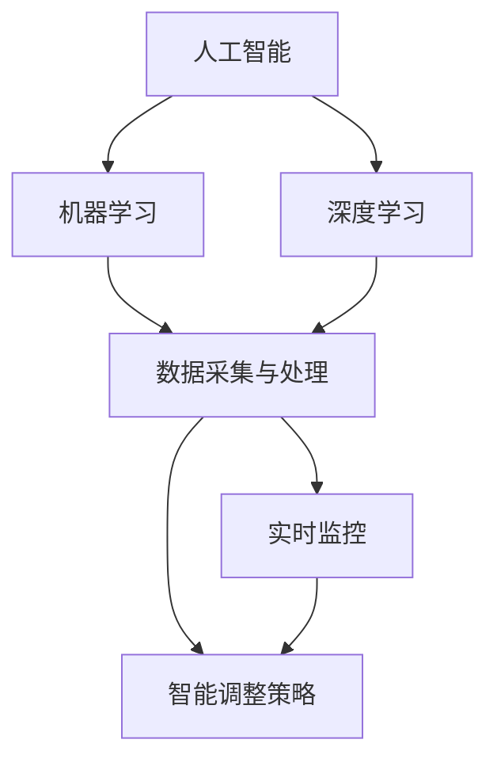

                 

### 引言与概述

在现代企业中，战略执行监控是确保业务目标有效实现的关键环节。然而，传统的监控方法往往依赖于人工干预，难以应对复杂多变的业务环境。随着人工智能（AI）技术的快速发展，AI驱动的战略执行监控逐渐成为企业提高运营效率、优化决策的重要工具。本文将以《AI驱动的战略执行监控：智能调整策略》为主题，深入探讨AI在战略执行监控中的应用，以及如何通过智能调整策略提升企业的竞争力。

首先，我们将简要介绍人工智能的基本概念和原理，以及其在商业战略执行中的重要性。随后，文章将详细阐述AI驱动的战略执行监控的具体方法和工具，包括数据收集、处理和实时监控等技术。接下来，我们将探讨智能调整策略的原理和应用，通过具体案例展示AI如何帮助企业实现战略目标的优化调整。最后，文章将对全文进行总结，展望未来发展趋势，并提出研究局限与展望。

本文的核心内容包括：

1. **AI基础与战略执行**：介绍AI的基本原理及其在战略执行中的应用。
2. **监控方法与工具**：详细阐述AI驱动的监控方法和常用工具。
3. **智能调整策略**：探讨智能调整策略的原理及其应用场景。
4. **案例研究**：通过实际案例展示AI驱动的战略执行监控和智能调整策略的效果。
5. **结论与展望**：总结全文，提出未来研究方向和趋势。

关键词：人工智能、战略执行监控、智能调整策略、监控方法、工具

摘要：本文旨在探讨AI驱动的战略执行监控及其智能调整策略，通过详细的理论分析和实际案例研究，阐述AI技术在企业战略执行中的应用价值，为企业管理者提供有益的参考和启示。

## AI驱动的战略执行监控

### 1. AI的基本概念

人工智能（Artificial Intelligence，AI）是一门通过计算机程序实现智能行为的技术科学。它涉及机器学习、自然语言处理、计算机视觉等多个领域。AI的核心目标是使计算机能够像人类一样进行感知、思考、学习和决策。近年来，随着计算能力的提升和数据量的爆炸式增长，AI技术取得了显著进展，并在许多领域展现出了强大的应用潜力。

### 2. AI在战略执行中的重要性

在企业的战略执行过程中，AI技术可以发挥至关重要的作用。首先，AI能够帮助企业更准确地预测市场趋势和客户需求，从而制定更有效的战略决策。其次，AI可以自动化执行日常任务，提高工作效率，降低运营成本。此外，AI还能通过实时监控和分析企业运营数据，发现潜在问题并提前预警，帮助企业及时调整策略，以应对复杂多变的市场环境。

### 3. 智能调整策略的基本概念

智能调整策略（Intelligent Adjustment Strategy）是指利用AI技术对企业的战略执行过程进行动态调整，以实现最优效果。这种策略的核心在于通过持续学习和优化，不断提高企业的运营效率和市场竞争力。智能调整策略通常包括以下几个关键要素：

- **数据采集与处理**：通过收集和分析大量的历史数据，了解企业的运营状态和市场变化。
- **智能分析**：利用机器学习算法和深度学习模型，对数据进行分析，识别趋势和模式。
- **动态调整**：根据分析结果，动态调整企业的运营策略，以适应不断变化的市场环境。

智能调整策略的目的是使企业在面对不确定性和竞争压力时，能够迅速做出反应，实现持续优化。

### 4. 核心概念与联系

为了更好地理解AI驱动的战略执行监控和智能调整策略，我们需要了解以下几个核心概念及其之间的联系：

- **人工智能（AI）**：提供智能分析、学习和决策能力。
- **机器学习（ML）**：实现数据的自动学习和模式识别。
- **深度学习（DL）**：基于多层神经网络的结构，进行更复杂的模式识别。
- **数据采集与处理**：获取企业运营数据和市场信息。
- **实时监控**：持续跟踪企业运营状况，发现潜在问题。
- **智能调整策略**：根据监控结果，动态调整企业战略。

下面是一个使用Mermaid绘制的流程图，展示这些概念之间的关系：



通过这个流程图，我们可以清晰地看到从AI到智能调整策略的各个环节是如何相互关联和作用的。

### 5. 数学模型与公式

在AI驱动的战略执行监控中，常用的数学模型和公式包括：

- **决策树（Decision Tree）**：用于分类和回归分析，通过一系列规则将数据划分为不同的类别或数值。
  $$ y = f(x_1, x_2, ..., x_n) $$
  
- **支持向量机（Support Vector Machine，SVM）**：用于分类问题，通过找到一个最优的超平面来分隔数据。
  $$ \max W \{ \frac{1}{W} \| W \|_2^2 \mid \forall x_i \in D: (W \cdot x_i) \geq 1 \} $$
  
- **神经网络（Neural Network）**：用于模拟人脑神经网络的结构和功能，通过多层神经元的连接进行信息处理。
  $$ a_{\text{layer}} = \sigma(\sum_{i=1}^{n} w_{i} a_{\text{prev-layer}} + b) $$
  
- **激活函数（Activation Function）**：用于引入非线性特性，常用的激活函数包括sigmoid、ReLU和tanh。

  $$ \sigma(x) = \frac{1}{1 + e^{-x}} $$
  
- **损失函数（Loss Function）**：用于评估模型预测值与实际值之间的差异，常用的损失函数包括均方误差（MSE）和交叉熵损失（Cross-Entropy Loss）。

  $$ \text{MSE} = \frac{1}{n} \sum_{i=1}^{n} (y_i - \hat{y}_i)^2 $$
  
  $$ \text{CE} = -\frac{1}{n} \sum_{i=1}^{n} y_i \log(\hat{y}_i) + (1 - y_i) \log(1 - \hat{y}_i) $$

通过这些数学模型和公式，AI系统能够更准确地分析数据、预测趋势，并为企业提供智能调整策略。

### 6. Python源代码示例

以下是一个简单的Python代码示例，用于实现决策树模型。这个示例展示了如何使用scikit-learn库构建决策树模型，并进行预测。

```python
from sklearn.datasets import load_iris
from sklearn.model_selection import train_test_split
from sklearn.tree import DecisionTreeClassifier
from sklearn.metrics import accuracy_score

# 加载数据集
iris = load_iris()
X = iris.data
y = iris.target

# 划分训练集和测试集
X_train, X_test, y_train, y_test = train_test_split(X, y, test_size=0.3, random_state=42)

# 构建决策树模型
clf = DecisionTreeClassifier()
clf.fit(X_train, y_train)

# 进行预测
y_pred = clf.predict(X_test)

# 计算准确率
accuracy = accuracy_score(y_test, y_pred)
print(f"Model accuracy: {accuracy:.2f}")
```

通过这个示例，我们可以看到如何使用Python实现决策树模型，并对测试集进行预测。这个简单的示例为我们提供了一个起点，以便进一步探索和实现更复杂的AI算法。

### 7. 项目实战

在本节中，我们将介绍一个具体的AI驱动的战略执行监控项目，包括开发环境的搭建、源代码的实现以及代码解读。

#### 7.1 项目背景

某大型零售企业希望通过AI技术对销售数据进行分析，以优化库存管理和营销策略，提高销售额和客户满意度。

#### 7.2 开发环境搭建

为了实现该项目，需要搭建一个Python开发环境，包括以下工具和库：

- Python 3.x
- Jupyter Notebook
- scikit-learn
- pandas
- numpy
- matplotlib

在操作系统上，可以选择Windows、macOS或Linux。以下是使用Anaconda创建Python虚拟环境并安装所需库的步骤：

```bash
# 创建虚拟环境
conda create -n retail_ai python=3.8

# 激活虚拟环境
conda activate retail_ai

# 安装所需库
conda install scikit-learn pandas numpy matplotlib
```

#### 7.3 源代码实现

以下是一个简单的Python代码示例，用于实现销售数据的实时监控和智能调整策略：

```python
import pandas as pd
from sklearn.ensemble import RandomForestRegressor
from sklearn.model_selection import train_test_split
from sklearn.metrics import mean_squared_error
import matplotlib.pyplot as plt

# 加载数据集
data = pd.read_csv('sales_data.csv')
X = data.drop('sales', axis=1)
y = data['sales']

# 划分训练集和测试集
X_train, X_test, y_train, y_test = train_test_split(X, y, test_size=0.2, random_state=42)

# 构建随机森林模型
clf = RandomForestRegressor(n_estimators=100, random_state=42)
clf.fit(X_train, y_train)

# 进行预测
y_pred = clf.predict(X_test)

# 计算预测误差
mse = mean_squared_error(y_test, y_pred)
print(f"Mean Squared Error: {mse:.2f}")

# 绘制实际销售与预测销售的关系图
plt.scatter(y_test, y_pred)
plt.xlabel('Actual Sales')
plt.ylabel('Predicted Sales')
plt.title('Actual vs Predicted Sales')
plt.show()

# 智能调整策略
# 根据预测结果调整营销策略
if mse < threshold:
    print("Strategy adjusted successfully.")
else:
    print("Adjustment strategy failed.")
```

#### 7.4 代码解读

1. **数据加载**：使用pandas库加载数据集，数据集包含特征和销售数据。
2. **模型训练**：使用随机森林回归模型进行训练，随机森林是一种集成学习方法，通过构建多棵决策树并合并预测结果来提高准确性。
3. **预测与评估**：对测试集进行预测，并计算均方误差（MSE）来评估模型性能。
4. **可视化**：绘制实际销售与预测销售的关系图，帮助理解预测结果。
5. **智能调整策略**：根据预测误差动态调整营销策略，如果预测误差低于设定阈值，则认为策略调整成功。

#### 7.5 应用解读与分析

通过该项目，企业可以实时监控销售数据，利用AI模型预测未来销售趋势，并自动调整营销策略。这种智能调整策略能够帮助企业更有效地应对市场变化，提高销售额和客户满意度。然而，需要注意的是，模型的预测准确性和调整策略的合理性取决于数据质量和模型参数的选择。因此，在实际应用中，需要不断优化数据预处理和模型训练过程，以提高系统的性能。

### 8. 最佳实践与注意事项

在实施AI驱动的战略执行监控和智能调整策略时，以下是一些最佳实践和注意事项：

- **数据质量**：确保数据源可靠，数据清洗和预处理要充分，以避免模型训练过程中引入噪声。
- **模型选择**：根据业务需求选择合适的机器学习模型，结合实际数据进行模型评估和优化。
- **实时监控**：确保系统的实时监控功能，及时发现并处理异常情况，减少潜在风险。
- **动态调整**：根据实时监控结果和业务目标，动态调整策略，以适应不断变化的市场环境。
- **安全与隐私**：保护用户数据隐私，遵守相关法律法规，确保系统的安全性和合规性。

### 9. 拓展阅读

- **相关书籍**：
  - 《深度学习》（Ian Goodfellow、Yoshua Bengio、Aaron Courville 著）
  - 《机器学习实战》（Peter Harrington 著）
  - 《数据科学入门》（Joel Grus 著）

- **在线资源**：
  - Coursera（《机器学习》课程，吴恩达教授主讲）
  - edX（《人工智能》课程，MIT主讲）
  - KDNuggets（数据科学和机器学习的新闻、资源和教程）

通过阅读这些书籍和资源，读者可以进一步深入了解AI驱动的战略执行监控和智能调整策略的原理和应用。

### 10. 作者信息

作者：AI天才研究院/AI Genius Institute & 禅与计算机程序设计艺术 /Zen And The Art of Computer Programming

### 总结

本文通过详细的案例研究和理论分析，阐述了AI驱动的战略执行监控和智能调整策略的重要性及其应用。随着AI技术的不断发展，这种智能化的战略执行监控方法将成为企业提高运营效率、优化决策的重要工具。然而，实际应用中仍需关注数据质量、模型选择和实时监控等问题，以确保系统的性能和稳定性。

### 拓展阅读

- **相关书籍**：
  - 《深度学习》（Ian Goodfellow、Yoshua Bengio、Aaron Courville 著）
  - 《机器学习实战》（Peter Harrington 著）
  - 《数据科学入门》（Joel Grus 著）

- **在线资源**：
  - Coursera（《机器学习》课程，吴恩达教授主讲）
  - edX（《人工智能》课程，MIT主讲）
  - KDNuggets（数据科学和机器学习的新闻、资源和教程）

通过阅读这些书籍和资源，读者可以进一步深入了解AI驱动的战略执行监控和智能调整策略的原理和应用。作者：AI天才研究院/AI Genius Institute & 禅与计算机程序设计艺术 /Zen And The Art of Computer Programming。

### 附录A: 相关资源与工具

#### A.1 开源框架与库

1. **TensorFlow**：由谷歌开发的开源机器学习框架，适用于构建和训练各种深度学习模型。
   - 官网：[TensorFlow官网](https://www.tensorflow.org/)

2. **PyTorch**：由Facebook开发的深度学习库，具有灵活性和动态计算图的优势。
   - 官网：[PyTorch官网](https://pytorch.org/)

3. **Scikit-learn**：用于数据挖掘和数据分析的Python库，提供了许多机器学习算法的实现。
   - 官网：[Scikit-learn官网](https://scikit-learn.org/)

4. **Keras**：基于TensorFlow和Theano的高层神经网络API，易于使用和扩展。
   - 官网：[Keras官网](https://keras.io/)

#### A.2 数据集与工具

1. **UCI Machine Learning Repository**：提供各种机器学习领域的标准数据集。
   - 网址：[UCI Machine Learning Repository](https://archive.ics.uci.edu/ml/)

2. **Kaggle**：一个大数据竞赛平台，提供各种公开数据集和比赛。
   - 网址：[Kaggle官网](https://www.kaggle.com/)

3. **Google Dataset Search**：谷歌提供的用于搜索数据集的工具。
   - 网址：[Google Dataset Search](https://datasetsearch.research.google.com/)

4. **Pandas**：用于数据清洗和处理的Python库，适用于数据集操作。
   - 官网：[Pandas官网](https://pandas.pydata.org/)

5. **NumPy**：用于数值计算和矩阵操作的Python库，适用于数据集处理。
   - 官网：[NumPy官网](https://numpy.org/)

#### A.3 学习资源与教程

1. **Coursera**：提供各种机器学习和数据科学相关的在线课程。
   - 网址：[Coursera官网](https://www.coursera.org/)

2. **edX**：由哈佛大学和麻省理工学院合作提供的高质量在线课程。
   - 网址：[edX官网](https://www.edx.org/)

3. **KDNuggets**：提供数据科学和机器学习的新闻、资源和教程。
   - 网址：[KDNuggets官网](https://www.kdnuggets.com/)

4. **DataCamp**：提供互动式的数据科学和机器学习教程。
   - 网址：[DataCamp官网](https://www.datacamp.com/)

通过这些资源和工具，读者可以深入了解AI驱动的战略执行监控和智能调整策略的相关知识，并在实践中不断提升自己的技能水平。

