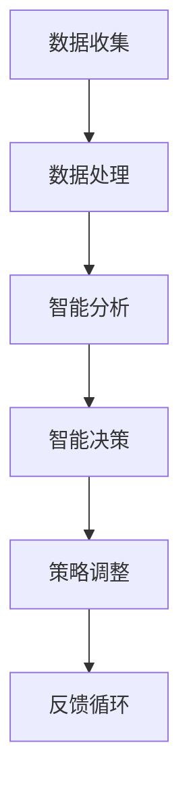

                 

### AI驱动的战略执行监控概述

#### 背景介绍

在当今快速变化和竞争激烈的市场环境中，企业需要具备敏捷和灵活的战略执行能力，以确保在动态环境中保持竞争优势。传统的战略执行监控方法往往依赖于人工和手动操作，这不仅耗时且容易出现人为错误。随着人工智能（AI）技术的不断发展，AI驱动的战略执行监控逐渐成为企业管理的新趋势。通过AI技术，企业可以实现自动化监控、实时分析和智能调整，从而提高战略执行的效率和质量。

AI驱动的战略执行监控是指利用人工智能技术，对企业的战略执行过程进行全方位的监控和调整。这一过程涵盖了从数据收集、处理和分析，到策略调整和优化的各个环节。AI技术在这里扮演着关键角色，通过机器学习、自然语言处理、计算机视觉等技术，AI能够自动识别和预测潜在问题，提供实时反馈，并基于数据进行智能决策，帮助企业迅速调整战略方向。

#### 核心概念与联系

**核心概念：**

1. **人工智能（AI）：** 是指通过计算机程序实现的人类智能行为的模拟，包括学习、推理、规划、感知、自然语言理解和图像识别等功能。
2. **战略执行监控：** 是指对企业的战略执行过程进行监督、分析和调整的活动，旨在确保战略目标的实现。
3. **智能跟踪：** 是指利用AI技术对企业执行过程中的关键指标进行实时监控和追踪。
4. **策略调整：** 是指根据监控结果，对企业的战略进行动态调整，以适应市场变化和内部环境。

**概念实体之间的关系架构：**

**Mermaid流程图：**

#### 智能跟踪与调整策略的基本原理

**智能跟踪：** 智能跟踪是AI驱动的战略执行监控的核心环节。通过视觉跟踪、语音识别、数据分析等技术，AI系统能够实时监控企业的关键指标，如销售数据、库存情况、客户反馈等。智能跟踪的优势在于其高速、准确和连续性，能够为企业提供即时的战略执行状况。

**策略调整：** 在智能跟踪的基础上，AI系统通过数据分析，发现潜在问题和机会，并提出相应的调整建议。策略调整的依据包括历史数据、市场趋势、竞争环境等。通过自动化决策和调整，企业能够快速响应市场变化，优化资源配置，提高运营效率。

**基本原理：**

1. **数据驱动：** AI系统基于大量历史数据和市场信息进行学习和预测，从而实现智能监控和调整。
2. **实时反馈：** 通过实时数据采集和分析，AI系统能够及时捕捉到战略执行过程中的变化，并快速做出响应。
3. **自动化执行：** AI系统可以自动化执行监控任务和调整策略，减少人为干预，提高执行效率。

通过智能跟踪与调整策略，企业能够实现战略执行的自动化和智能化，提高决策的准确性和速度，从而在激烈的市场竞争中保持优势。

### 总结

AI驱动的战略执行监控是企业应对复杂市场环境的重要手段。通过利用人工智能技术，企业可以实现自动化的数据收集、处理和分析，以及智能化的策略调整，从而提高战略执行的效率和质量。本文接下来将深入探讨智能跟踪技术、AI驱动的战略调整方法，并通过实际案例展示其应用效果。请继续阅读，了解更多关于AI驱动的战略执行监控的精彩内容。

