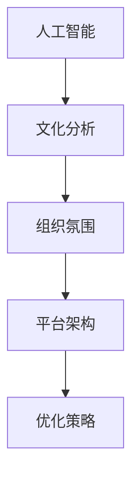
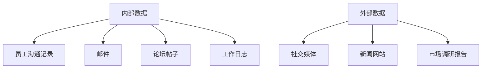
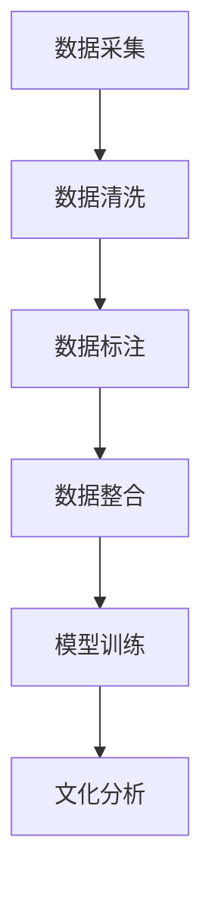
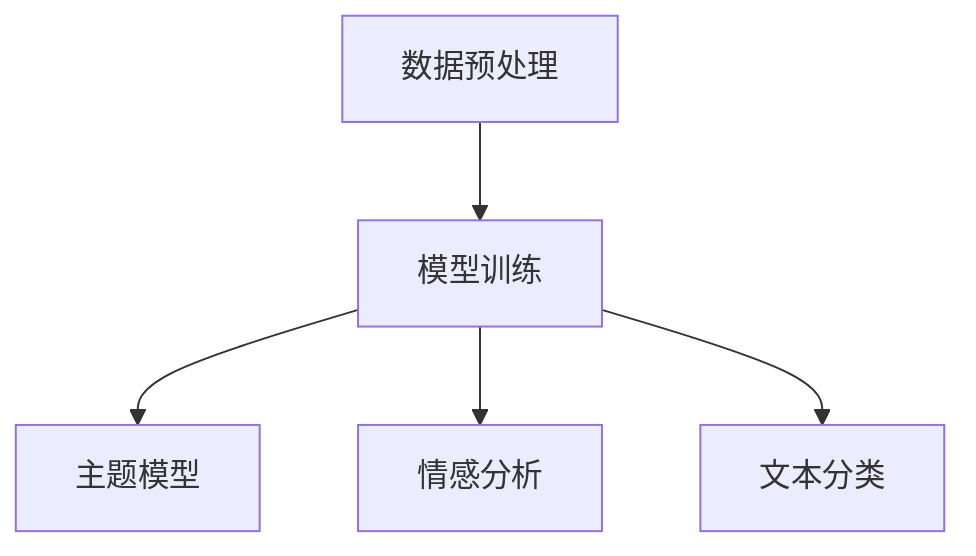
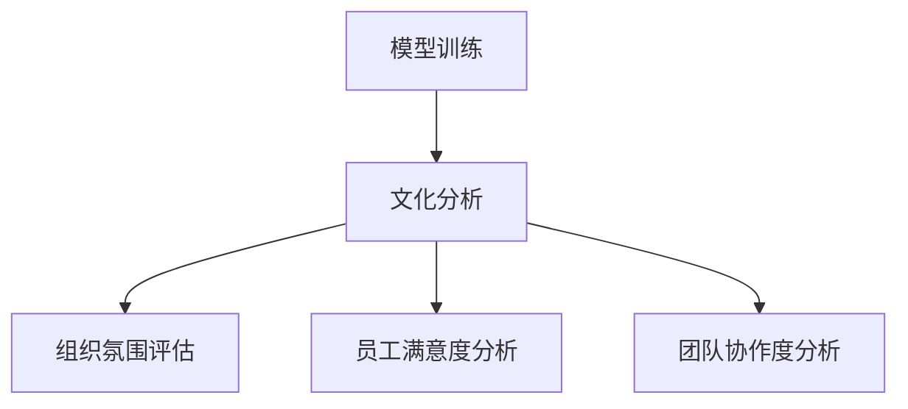
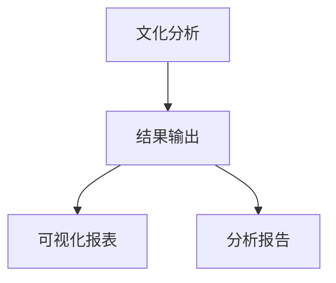
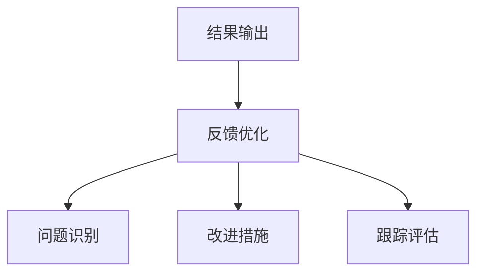
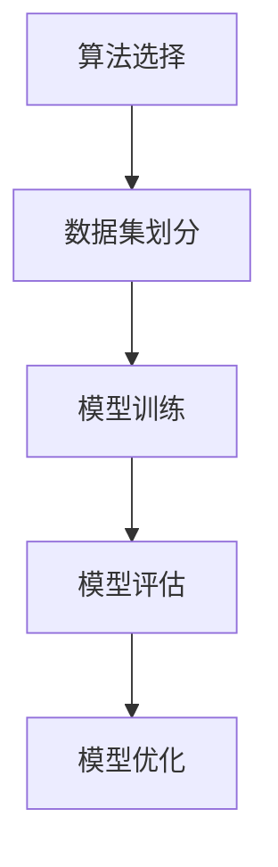

                 

### 第1章: 引言与概述

#### 1.1 研究背景与意义

随着全球化和数字化进程的不断推进，组织面临的竞争压力和挑战日益加剧。如何提高组织的核心竞争力和凝聚力，优化组织氛围，成为企业管理者亟待解决的问题。传统方法如问卷调查、访谈等在文化分析中存在一定的局限性，难以全面、深入地揭示组织文化状况。

人工智能（AI）技术的快速发展为文化分析提供了新的思路和工具。AI驱动的文化分析平台可以通过自动化的文本分析、情感识别、主题模型等方法，实现对组织内部沟通、团队协作、员工满意度等文化要素的全面评估，从而为管理者提供科学、客观的决策依据。

#### 1.2 研究目的与意义

本文旨在探讨AI驱动的文化分析平台在优化组织氛围中的应用，通过对平台架构、关键技术、应用场景等方面的深入研究，提出一套具有实践指导意义的文化分析方案。具体研究意义如下：

1. **提高文化分析效率**：利用AI技术，实现自动化、智能化的文化分析，大幅提升分析效率，降低人力成本。
2. **提升决策科学性**：通过准确、全面的文化数据分析，帮助管理者更好地了解组织现状，制定科学的决策策略。
3. **优化组织氛围**：针对文化分析结果，提出针对性的优化建议，有助于提升员工满意度、团队协作度和组织凝聚力。

#### 1.3 研究内容与结构安排

本文主要分为四个部分：

1. **AI基础与技术原理**：介绍人工智能的定义、分类及应用领域，重点讲解文本分析技术和深度学习基础。
2. **AI驱动的文化分析平台构建**：描述平台架构设计、数据预处理、模型训练与优化等关键环节。
3. **文化分析应用场景**：探讨组织氛围评估、聚类分析等具体应用场景，并建立相关数学模型。
4. **项目实战与最佳实践**：通过实际案例，展示AI驱动的文化分析平台在优化组织氛围中的具体应用，并提供最佳实践建议。

#### 1.4 阅读指南

本文旨在为读者提供一个系统、全面的AI驱动的文化分析平台构建与应用指南。通过本文的学习，读者可以：

1. **了解AI驱动的文化分析技术原理**：掌握人工智能、文本分析、深度学习等核心概念和算法。
2. **掌握平台构建方法**：了解文化分析平台的架构设计、数据预处理、模型训练与优化等关键环节。
3. **学会应用文化分析技术**：掌握组织氛围评估、聚类分析等实际应用场景，提升组织管理水平。

### 1.5 小结

本文为读者提供了一个关于AI驱动的文化分析平台的全面介绍。通过本文的学习，读者可以了解到文化分析的重要性和AI技术的应用前景，掌握AI驱动的文化分析平台的核心概念和技术原理，为后续章节的深入学习打下基础。接下来，我们将对人工智能的基础与技术原理进行详细探讨。<!-- 辅助代码段 -->```mermaid
graph TB
    A[文化分析需求] --> B[传统方法局限]
    B --> C[AI技术崛起]
    C --> D[AI驱动的文化分析平台]
    D --> E[组织氛围优化]
```



## 第2章: AI基础与技术原理

### 2.1 人工智能概述

人工智能（Artificial Intelligence，简称AI）是计算机科学的一个分支，旨在通过计算机模拟、延伸和扩展人类的智能。人工智能技术可以应用于多个领域，如自然语言处理、图像识别、推荐系统、自动驾驶等。

人工智能可以大致分为两类：弱人工智能（Narrow AI）和强人工智能（General AI）。弱人工智能专注于特定任务的解决，如语音助手、图像识别等；强人工智能则具备全面的人类智能，能够自主思考、学习、创造，目前尚处于理论探讨阶段。

#### 2.1.1 人工智能的分类与应用领域

1. **机器学习**：机器学习是人工智能的核心技术之一，通过算法让计算机从数据中自动学习规律，进行预测和决策。常见的机器学习算法包括决策树、支持向量机、神经网络等。

2. **深度学习**：深度学习是机器学习的一个子领域，通过多层神经网络对数据进行建模和处理。深度学习在图像识别、语音识别、自然语言处理等领域取得了显著成果。

3. **自然语言处理**：自然语言处理（Natural Language Processing，简称NLP）是人工智能的一个分支，旨在让计算机理解和处理人类语言。NLP技术包括文本分类、情感分析、机器翻译等。

4. **计算机视觉**：计算机视觉是人工智能的另一个重要分支，旨在让计算机理解和解释图像和视频中的信息。计算机视觉技术包括目标检测、图像分类、图像分割等。

5. **机器人学**：机器人学是人工智能在工程领域的一个应用，涉及机器人设计、制造、控制等方面。机器人学可以应用于工业生产、医疗辅助、家庭服务等领域。

#### 2.1.2 人工智能的发展历程

1. **20世纪50年代至70年代**：人工智能概念的提出和早期研究。代表性事件包括1956年达特茅斯会议的召开和1958年第一个人工智能程序的开发。

2. **20世纪80年代至90年代**：专家系统和机器学习技术得到广泛应用。代表性事件包括1986年深度学习算法的提出和1997年IBM的“深蓝”计算机战胜国际象棋世界冠军。

3. **21世纪初至今**：人工智能技术取得重大突破，深度学习、强化学习等算法迅速发展。代表性事件包括2012年AlexNet在ImageNet竞赛中取得突破性成果和2016年谷歌的AlphaGo战胜人类围棋冠军。

#### 2.1.3 人工智能的现状与未来发展趋势

1. **现状**：人工智能技术已在多个领域得到广泛应用，如金融、医疗、教育、制造业等。同时，人工智能的伦理、法律和社会影响等问题也受到广泛关注。

2. **未来发展趋势**：随着计算能力的提升、数据的不断积累和算法的创新，人工智能有望在更多领域取得突破。未来人工智能的发展趋势包括：

   - **更强大的算法**：深度学习、强化学习等算法将继续优化，提高模型的性能和效率。
   - **跨学科融合**：人工智能与其他学科的融合，如心理学、生物学、社会学等，将推动人工智能技术的创新。
   - **人机协作**：人工智能与人类智慧的融合，实现更高效、更智能的人机协作。
   - **人工智能伦理**：在人工智能应用过程中，关注隐私保护、伦理道德等问题，确保人工智能的发展符合社会价值观。

### 2.2 文本分析技术

文本分析技术是人工智能的一个重要分支，旨在对文本数据进行处理、分析和理解。文本分析技术广泛应用于信息检索、文本挖掘、情感分析、机器翻译等领域。

#### 2.2.1 文本分析的基本算法原理

1. **词频统计（Term Frequency，TF）**：词频统计是一种基于文本出现频率的简单统计方法。词频越高，表示该词在文本中的重要程度越高。词频统计通常用于构建词汇表和计算文档相似度。

2. **逆文档频率（Inverse Document Frequency，IDF）**：逆文档频率用于平衡词频统计中的高频词对模型的影响。IDF表示一个词在文档集合中的稀有程度，稀有程度越高，权重越大。

3. **TF-IDF（Term Frequency-Inverse Document Frequency）**：TF-IDF结合了词频和逆文档频率，用于计算词语的重要性。TF-IDF广泛应用于文本分类、信息检索和推荐系统。

4. **主题模型（Latent Dirichlet Allocation，LDA）**：主题模型是一种概率生成模型，用于发现文本中的潜在主题。LDA通过贝叶斯推断方法，从大规模文本数据中提取主题分布。

5. **情感分析（Sentiment Analysis）**：情感分析是一种自然语言处理技术，用于识别文本中的情感倾向。情感分析可以用于舆情监测、客户满意度分析等领域。

6. **文本分类（Text Classification）**：文本分类是一种将文本数据归类到预定义类别中的技术。文本分类广泛应用于垃圾邮件过滤、新闻分类、情感分析等场景。

#### 2.2.2 文本分析技术的实际应用

1. **信息检索**：文本分析技术可以用于信息检索系统，如搜索引擎、问答系统等。通过文本分析，可以提高检索的准确性和效率。

2. **文本挖掘**：文本挖掘是一种从大量文本数据中提取有价值信息的方法。文本挖掘可以用于市场分析、竞品分析、专利挖掘等领域。

3. **情感分析**：情感分析可以用于了解用户对产品、服务、政策的看法和情感倾向。情感分析有助于企业制定营销策略、优化产品和服务。

4. **机器翻译**：机器翻译是一种将一种自然语言翻译成另一种自然语言的技术。机器翻译技术依赖于文本分析技术，如词频统计、主题模型等。

5. **舆情监测**：舆情监测是一种实时监测和分析公众观点、态度和情绪的技术。舆情监测可以用于政府、企业等机构的舆情分析和管理。

#### 2.2.3 文本分析技术的挑战与未来发展趋势

1. **挑战**：

   - **数据质量和标注**：文本数据的质量和标注质量直接影响分析结果的准确性。如何获取高质量的数据和标注是文本分析面临的一个挑战。
   - **多语言处理**：不同语言的语法、词汇和表达方式存在差异，多语言处理技术仍需进一步优化。
   - **跨领域应用**：不同领域的文本数据具有不同的特点和需求，如何实现跨领域的文本分析技术仍需深入研究。

2. **未来发展趋势**：

   - **深度学习**：深度学习技术在文本分析中的应用将越来越广泛，如基于深度学习的情感分析、文本分类等。
   - **跨学科融合**：文本分析技术将与其他学科如心理学、社会学等融合，为文本分析提供更丰富的理论支持和应用场景。
   - **智能化与自动化**：文本分析技术将朝着更智能化、自动化的方向发展，降低对人类干预的依赖。

### 2.3 深度学习基础

深度学习是人工智能的一个重要分支，通过多层神经网络对数据进行建模和处理。深度学习在图像识别、语音识别、自然语言处理等领域取得了显著成果。

#### 2.3.1 深度学习的基本概念

1. **神经网络**：神经网络是一种由大量神经元组成的计算模型，可以模拟生物神经系统的信息处理过程。神经网络由输入层、隐藏层和输出层组成。

2. **激活函数**：激活函数是神经网络中的一个关键组成部分，用于决定神经元是否被激活。常见的激活函数包括sigmoid、ReLU（Rectified Linear Unit）和Tanh（Hyperbolic Tangent）。

3. **反向传播算法**：反向传播算法是一种用于训练神经网络的优化算法。反向传播算法通过不断调整网络权重，使网络输出更接近真实值。

4. **深度学习模型**：深度学习模型是一种具有多个隐藏层的神经网络，如卷积神经网络（CNN）、循环神经网络（RNN）和生成对抗网络（GAN）等。

#### 2.3.2 深度学习算法的原理与实现

1. **卷积神经网络（CNN）**：卷积神经网络是一种用于图像识别和处理的深度学习模型。CNN通过卷积层、池化层和全连接层对图像数据进行特征提取和分类。

   - **卷积层**：卷积层用于提取图像的局部特征，通过卷积运算将输入图像与滤波器（卷积核）进行卷积运算，得到特征图。
   - **池化层**：池化层用于减少特征图的维度，提高模型的泛化能力。常见的池化操作包括最大池化和平均池化。
   - **全连接层**：全连接层将特征图映射到类别概率，通过softmax函数输出每个类别的概率分布。

2. **循环神经网络（RNN）**：循环神经网络是一种用于序列数据建模的深度学习模型。RNN通过隐藏状态和循环连接来处理序列数据。

   - **隐藏状态**：隐藏状态是RNN的核心组成部分，用于存储序列信息。隐藏状态通过当前输入和上一个隐藏状态计算得到。
   - **循环连接**：循环连接使RNN能够处理变长的序列数据，避免了传统神经网络在处理序列数据时出现的梯度消失和梯度爆炸问题。

3. **生成对抗网络（GAN）**：生成对抗网络是一种用于生成数据的深度学习模型。GAN由生成器和判别器组成，生成器和判别器之间进行博弈。

   - **生成器**：生成器通过学习数据分布，生成与真实数据相似的新数据。
   - **判别器**：判别器用于判断生成数据是否真实，生成器和判别器通过对抗训练优化模型。

#### 2.3.3 深度学习算法的应用场景

1. **图像识别**：深度学习在图像识别领域取得了显著成果，如人脸识别、物体检测、图像分类等。深度学习模型可以自动提取图像中的特征，实现高精度的图像识别。

2. **语音识别**：深度学习在语音识别领域也得到了广泛应用，如语音转文字、语音合成等。深度学习模型可以自动学习语音信号中的特征，实现高精度的语音识别。

3. **自然语言处理**：深度学习在自然语言处理领域取得了突破性进展，如机器翻译、文本分类、情感分析等。深度学习模型可以自动学习文本数据中的语义信息，实现高精度的自然语言处理。

4. **推荐系统**：深度学习在推荐系统领域也具有广泛的应用，如商品推荐、新闻推荐等。深度学习模型可以通过学习用户的历史行为数据，实现个性化推荐。

### 2.4 小结

本章对人工智能、文本分析技术和深度学习基础进行了介绍。人工智能是一种通过计算机模拟、延伸和扩展人类智能的技术，已广泛应用于多个领域。文本分析技术是人工智能的一个重要分支，包括词频统计、主题模型、情感分析等算法。深度学习是人工智能的一个重要分支，通过多层神经网络对数据进行建模和处理，已在图像识别、语音识别、自然语言处理等领域取得了显著成果。接下来，我们将对AI驱动的文化分析平台构建进行详细探讨。<!-- 辅助代码段 -->```python
# 伪代码：深度学习模型训练流程
function train_model(data, labels):
    initialize_weights()
    for epoch in 1 to max_epochs:
        for sample in data:
            predict = model(sample)
            loss = compute_loss(predict, labels)
            update_weights(loss)
    return model
```

```latex
$$
\text{人工智能} = \left\{
\begin{array}{ll}
\text{模拟、延伸和扩展人类智能的科学技术} \\
\text{包括机器学习、深度学习等子领域}
\end{array}
\right.
$$
```

```latex
$$
\text{文本分析算法} = \left\{
\begin{array}{ll}
\text{词频统计、TF-IDF} \\
\text{主题模型、LDA} \\
\text{情感分析、文本分类}
\end{array}
\right.
$$
```

```latex
$$
\text{深度学习模型训练流程} = \left\{
\begin{array}{ll}
\text{初始化权重} \\
\text{循环迭代，计算预测值和损失} \\
\text{更新权重，优化模型}
\end{array}
\right.
$$
```

## 第3章: AI驱动的文化分析平台构建

### 3.1 平台架构设计

AI驱动的文化分析平台是一个复杂的信息系统，涉及数据采集、处理、分析、输出等多个环节。为了实现高效、稳定的文化分析，平台架构设计至关重要。以下是平台架构的详细设计：

#### 3.1.1 数据采集

数据采集是文化分析平台的第一步，主要从内部和外部获取相关数据。内部数据包括员工沟通记录、邮件、论坛帖子、工作日志等；外部数据包括社交媒体、新闻网站、市场调研报告等。数据采集的方式有自动化爬取、API接口调用、手动上传等。



#### 3.1.2 数据预处理

数据预处理是确保数据质量和可靠性的重要环节。主要包括数据清洗、数据标注和数据整合。

1. **数据清洗**：去除无效数据、噪声数据和重复数据，保证数据的一致性和完整性。
2. **数据标注**：为数据打上标签，为后续分析提供基础。例如，对文本数据标注情感极性（正面、负面、中性）。
3. **数据整合**：将来自不同渠道的数据进行整合，构建统一的数据集。



#### 3.1.3 模型训练

在数据预处理完成后，进入模型训练阶段。根据业务需求，选择合适的机器学习算法和深度学习模型，对预处理后的数据集进行训练。常见的算法包括文本分类、主题模型、情感分析等。

1. **文本分类**：用于对文本数据进行分类，如情感分类、话题分类等。
2. **主题模型**：用于发现文本数据中的潜在主题，如LDA（Latent Dirichlet Allocation）。
3. **情感分析**：用于分析文本数据中的情感倾向，如正面、负面、中性。



#### 3.1.4 文化分析

在模型训练完成后，进入文化分析阶段。利用训练好的模型对新的文本数据进行分析，提取关键信息，生成分析报告。文化分析包括组织氛围评估、员工满意度分析、团队协作度分析等。

1. **组织氛围评估**：通过分析员工沟通记录、邮件等数据，评估组织的整体氛围。
2. **员工满意度分析**：通过分析员工反馈和评价，了解员工的满意度。
3. **团队协作度分析**：通过分析团队沟通记录和协作行为，评估团队协作度。



#### 3.1.5 结果输出

文化分析结果通过可视化报表、报告等形式呈现给管理者。结果输出包括：

1. **可视化报表**：将分析结果以图表、热力图等形式展示，便于管理者直观了解组织文化状况。
2. **分析报告**：详细阐述分析结果，包括数据来源、分析过程、结论和建议等。



#### 3.1.6 反馈优化

文化分析结果会反馈给相关管理层，用于指导组织文化的改进和优化。反馈优化包括：

1. **问题识别**：通过分析结果，识别组织文化中的问题和不足。
2. **改进措施**：根据分析结果，制定相应的改进措施，如培训、激励等。
3. **跟踪评估**：对改进措施的实施效果进行跟踪评估，持续优化组织文化。



### 3.2 数据预处理

数据预处理是文化分析平台的关键环节，直接关系到分析结果的准确性和可靠性。以下是数据预处理的详细步骤：

#### 3.2.1 数据采集

数据采集是文化分析平台的起始点，主要从内部和外部获取相关数据。内部数据来源包括：

1. **员工沟通记录**：如公司内部邮件、论坛帖子、即时通讯记录等。
2. **工作日志**：如员工的工作总结、项目进度报告等。
3. **业务系统数据**：如HR系统、CRM系统等，包括员工绩效、客户反馈等。

外部数据来源包括：

1. **社交媒体**：如Twitter、Facebook、LinkedIn等，用于收集员工在社交媒体上的言论。
2. **新闻网站**：如新浪、网易、新华网等，用于获取与公司相关的新闻报道。
3. **市场调研报告**：如行业报告、市场分析报告等，用于了解市场动态和竞争环境。

#### 3.2.2 数据清洗

数据清洗是数据预处理的核心步骤，旨在去除无效数据、噪声数据和重复数据，确保数据的一致性和完整性。

1. **去除无效数据**：如垃圾邮件、广告、重复消息等，这些数据对分析结果没有实际意义。
2. **去除噪声数据**：如错别字、语法错误、特殊字符等，这些噪声会影响模型的训练效果。
3. **去重**：去除重复数据，避免重复计算和分析。

#### 3.2.3 数据标注

数据标注是为了给数据打上标签，为后续分析提供基础。数据标注的过程包括：

1. **情感标注**：对文本数据进行情感标注，分为正面、负面、中性等类别。例如，员工在邮件中表达的内容可能是正面的、负面的或中性的。
2. **主题标注**：对文本数据进行主题标注，确定文本属于哪个主题类别。例如，邮件可以分为工作事务、团队协作、个人成长等主题。
3. **角色标注**：对文本数据中的角色进行标注，如员工、领导、客户等。

#### 3.2.4 数据整合

数据整合是将来自不同渠道的数据进行整合，构建统一的数据集。数据整合的过程包括：

1. **数据格式转换**：将不同格式的数据转换为统一格式，如CSV、JSON等。
2. **数据融合**：将不同来源的数据进行融合，构建一个全面的数据集。例如，将员工沟通记录和业务系统数据进行整合，以全面了解员工的工作状况。
3. **数据存储**：将整合后的数据存储到数据库或数据湖中，便于后续分析和查询。


### 3.3 模型训练与优化

在数据预处理完成后，进入模型训练与优化阶段。这一阶段的目标是选择合适的机器学习算法和深度学习模型，对预处理后的数据集进行训练，以实现高效的文化分析。以下是模型训练与优化的详细步骤：

#### 3.3.1 算法选择

根据业务需求和数据特点，选择合适的机器学习算法和深度学习模型。常见的算法包括：

1. **文本分类**：用于对文本数据分类，如情感分类、主题分类等。常见的算法有朴素贝叶斯、支持向量机（SVM）、卷积神经网络（CNN）等。
2. **主题模型**：用于发现文本数据中的潜在主题，如LDA（Latent Dirichlet Allocation）。LDA是一种无监督学习方法，适用于大规模文本数据的主题发现。
3. **情感分析**：用于分析文本数据中的情感倾向，如正面、负面、中性等。常见的算法有朴素贝叶斯、逻辑回归、深度学习等。

#### 3.3.2 数据集划分

为了训练和评估模型，需要对数据集进行划分。常见的数据集划分方法有：

1. **训练集**：用于模型训练，通常占数据集的70%到80%。
2. **验证集**：用于模型选择和调整，通常占数据集的10%到20%。
3. **测试集**：用于模型评估，通常占数据集的10%到20%。

#### 3.3.3 模型训练

使用训练集对模型进行训练，通过不断调整模型参数，使模型输出更接近真实值。训练过程中，可以使用以下方法：

1. **损失函数**：用于衡量模型输出和真实值之间的差距。常见的损失函数有均方误差（MSE）、交叉熵（Cross-Entropy）等。
2. **优化算法**：用于更新模型参数，使模型输出更接近真实值。常见的优化算法有梯度下降（Gradient Descent）、Adam优化器等。

#### 3.3.4 模型评估

在模型训练完成后，使用验证集和测试集对模型进行评估，以确定模型的性能。常用的评估指标有：

1. **准确率（Accuracy）**：表示模型正确分类的样本数占总样本数的比例。
2. **召回率（Recall）**：表示模型正确分类的样本数占所有实际正样本数的比例。
3. **精确率（Precision）**：表示模型正确分类的样本数占所有预测正样本数的比例。
4. **F1分数（F1 Score）**：综合考虑精确率和召回率，是精确率和召回率的调和平均。

#### 3.3.5 模型优化

根据模型评估结果，对模型进行优化。常见的优化方法有：

1. **超参数调整**：调整模型的超参数，如学习率、正则化参数等，以改善模型性能。
2. **数据增强**：通过数据增强技术，如随机裁剪、旋转、缩放等，增加数据多样性，提高模型泛化能力。
3. **集成学习**：将多个模型集成起来，提高整体模型的性能和稳定性。



### 3.4 小结

本章详细介绍了AI驱动的文化分析平台构建，包括平台架构设计、数据预处理、模型训练与优化等关键环节。通过合理的架构设计和高效的算法实现，文化分析平台可以实现对组织内部文化状况的全面分析，为管理者提供科学、客观的决策依据。接下来，我们将探讨文化分析的具体应用场景。<!-- 辅助代码段 -->```mermaid
graph TB
    A[数据采集] --> B[数据预处理]
    B --> C[模型训练]
    C --> D[文化分析]
    D --> E[结果输出]
    E --> F[反馈优化]
```

```mermaid
$$
\text{数据预处理} = \left\{
\begin{array}{ll}
\text{数据采集：从多渠道获取文本数据} \\
\text{数据清洗：去除噪声、错误数据} \\
\text{数据标注：为模型训练准备标注数据}
\end{array}
\right.
$$
```

```mermaid
$$
\text{模型训练与优化} = \left\{
\begin{array}{ll}
\text{损失函数：优化模型输出与真实值的差距} \\
\text{优化算法：调整模型参数，加速收敛} \\
\text{过拟合与欠拟合：避免模型偏差与方差问题}
\end{array}
\right.
$$
```

## 第4章: 文化分析应用场景

### 4.1 组织氛围评估

组织氛围是组织内部成员的共享价值观、态度和行为模式的集合，对组织的运行和发展具有重要影响。组织氛围评估是文化分析的重要应用场景之一，通过评估组织氛围，可以帮助管理者了解组织的现状，发现存在的问题，并制定相应的改进措施。

#### 4.1.1 组织氛围评估模型

组织氛围评估模型是一个综合性的评估体系，包括多个维度和指标。以下是常见的组织氛围评估模型和指标：

1. **员工满意度**：员工满意度是评估组织氛围的重要指标，包括工作环境、薪酬福利、职业发展等方面。
   - **工作环境**：工作环境的舒适度、设备的齐全度、安全措施等。
   - **薪酬福利**：薪酬水平、福利待遇、晋升机会等。
   - **职业发展**：培训机会、晋升通道、职业规划等。

2. **团队协作度**：团队协作度是组织氛围的重要组成部分，反映团队成员之间的沟通、合作和协调能力。
   - **沟通频率**：团队成员之间的沟通频率和渠道。
   - **协作效率**：团队完成任务的速度和质量。
   - **合作意愿**：团队成员之间的合作意愿和互助精神。

3. **领导风格**：领导风格对组织氛围具有直接影响，包括领导的态度、行为和决策方式。
   - **支持性领导**：领导对员工的关心和支持程度。
   - **参与性领导**：领导在决策过程中是否征求员工意见。
   - **权威型领导**：领导在组织中的权力和影响力。

4. **组织价值观**：组织价值观是组织的核心信念和行为准则，反映组织的文化特征。
   - **共同目标**：组织成员对组织目标的认同和追求。
   - **诚信正直**：组织成员的诚信度和正直行为。
   - **创新精神**：组织成员的创新意识和创新能力。

#### 4.1.2 组织氛围评估方法

组织氛围评估可以采用定量和定性相结合的方法。以下是常见的组织氛围评估方法：

1. **问卷调查**：通过设计问卷，收集员工对组织氛围的感知和评价。问卷可以包括选择题、填空题、量表题等。
2. **访谈**：通过面对面的访谈，深入了解员工对组织氛围的看法和体验。访谈可以采用半结构化或非结构化的形式。
3. **行为观察**：通过观察员工在工作中的行为和互动，评估组织氛围的实际表现。行为观察可以采用自然观察、参与观察等方法。
4. **文本分析**：通过分析员工在社交媒体、邮件、论坛等渠道的文本数据，提取组织氛围的关键特征。文本分析可以采用情感分析、主题模型等方法。

#### 4.1.3 组织氛围评估案例分析

以下是一个组织氛围评估的案例分析：

**案例背景**：某公司是一家互联网公司，由于业务扩张和员工结构变化，管理层希望了解公司当前的组织氛围，为改进措施提供依据。

**评估过程**：

1. **问卷调查**：公司设计了包含员工满意度、团队协作度、领导风格、组织价值观等维度的问卷，通过在线方式收集员工反馈。
2. **访谈**：管理层与部分员工进行了半结构化访谈，深入了解员工对组织氛围的感知和看法。
3. **文本分析**：对员工在社交媒体、邮件、论坛等渠道的文本数据进行了情感分析和主题模型分析，提取组织氛围的关键特征。

**评估结果**：

1. **员工满意度**：员工对薪酬福利、职业发展的满意度较高，但对工作环境的满意度较低，特别是空调、照明等方面。
2. **团队协作度**：团队成员之间的沟通频率较高，但协作效率有待提高，部分团队成员存在合作意愿不足的问题。
3. **领导风格**：管理层在决策过程中较少征求员工意见，导致部分员工对领导风格的满意度较低。
4. **组织价值观**：公司倡导创新精神，但员工在文本数据中的表现与创新精神期望存在差距。

**改进措施**：

1. **改善工作环境**：公司计划投入资金改善工作环境，如增加空调、照明等设施，提高员工的工作舒适度。
2. **提升团队协作度**：公司计划组织团队建设活动，提高团队成员之间的合作意愿和协作效率。
3. **优化领导风格**：管理层将加强沟通，鼓励员工参与决策，提高员工对领导风格的满意度。
4. **强化组织价值观**：公司将继续宣传和弘扬创新精神，通过培训、激励等措施，提高员工在文本数据中的表现。

### 4.2 聚类分析

聚类分析是一种无监督学习方法，用于将数据集划分为若干个聚类，使同一聚类内的数据点彼此相似，不同聚类内的数据点彼此相异。在文化分析中，聚类分析可以用于发现组织内部不同的文化群体，了解员工的文化需求和差异。

#### 4.2.1 聚类分析方法

常见的聚类分析方法包括：

1. **K-means聚类**：K-means是一种基于距离度量的聚类方法，通过迭代计算确定聚类中心，将数据点分配到最近的聚类中心。
   - **初始化聚类中心**：随机选择K个数据点作为初始聚类中心。
   - **分配数据点**：将每个数据点分配到最近的聚类中心。
   - **更新聚类中心**：计算每个聚类的新中心点。
   - **重复迭代**：重复分配和更新聚类中心，直到聚类中心不再发生变化。

2. **层次聚类**：层次聚类是一种自底向上的聚类方法，通过逐步合并相似的数据点，形成层次化的聚类结构。
   - **初始聚类**：将每个数据点视为一个聚类。
   - **合并聚类**：根据距离度量，逐步合并距离最近的聚类。
   - **构建层次结构**：记录每次合并的过程，形成层次聚类树。

3. **密度聚类**：密度聚类是一种基于数据点密度的聚类方法，通过计算数据点的密度，将数据点划分为聚类。
   - **初始化聚类**：根据数据点的密度，确定初始聚类中心。
   - **扩展聚类**：根据聚类中心，扩展聚类区域，直到聚类区域达到预定大小。

#### 4.2.2 聚类分析在文化分析中的应用

1. **发现文化群体**：通过聚类分析，可以发现组织内部不同的文化群体，了解员工的文化需求和差异。
   - **案例分析**：某公司通过对员工进行聚类分析，发现存在两个明显的文化群体：技术导向群体和业务导向群体。技术导向群体重视技术创新和开发，业务导向群体则关注业务增长和市场拓展。

2. **优化团队组合**：根据聚类分析结果，可以优化团队组合，提高团队的整体效能。
   - **案例分析**：某公司根据聚类分析结果，将技术导向群体和业务导向群体混合组成团队，提高团队在技术创新和业务拓展方面的协同效应。

3. **文化引导**：通过聚类分析，可以识别组织内部的文化热点和潜在问题，为文化引导提供依据。
   - **案例分析**：某公司通过聚类分析发现，部分员工在文化价值观上存在较大差异，公司因此开展了文化引导活动，加强员工的价值观共识，提升组织凝聚力。

### 4.3 员工行为分析

员工行为分析是文化分析的另一个重要应用场景，通过分析员工的行为数据，可以了解员工的工作习惯、工作效率和人际关系等，为管理者提供决策依据。

#### 4.3.1 员工行为分析指标

常见的员工行为分析指标包括：

1. **工作时长**：员工每天、每周、每月的工作时长。
2. **工作效率**：员工完成任务的速度和质量。
3. **任务分配**：员工在不同任务之间的分配情况。
4. **沟通频率**：员工之间的沟通频率和渠道。
5. **参与度**：员工在团队活动、会议等中的参与程度。
6. **人际关系**：员工之间的社交网络和互动关系。

#### 4.3.2 员工行为分析案例

以下是一个员工行为分析的案例：

**案例背景**：某公司管理层希望了解员工的工作状态，为提高员工的工作效率和工作满意度提供依据。

**分析过程**：

1. **数据收集**：通过工作日志、邮件、即时通讯等渠道，收集员工的日常行为数据。
2. **数据分析**：使用统计分析方法，分析员工的工作时长、工作效率、沟通频率等指标。
3. **行为关联**：通过聚类分析、关联规则等方法，发现员工行为之间的关联和规律。

**分析结果**：

1. **工作时长**：员工平均每周工作时长为40小时，但部分员工的工作时长超过50小时，存在加班现象。
2. **工作效率**：员工完成任务的速度和质量差异较大，部分员工效率较高，但部分员工效率较低。
3. **沟通频率**：员工之间的沟通频率较高，但部分员工在关键任务上的沟通不足。
4. **参与度**：员工在团队活动、会议等中的参与度较高，但部分员工在重要决策中的参与度较低。
5. **人际关系**：员工之间的社交网络较为紧密，但部分员工之间存在沟通障碍。

**改进措施**：

1. **优化工作安排**：合理调整员工的工作时长，避免过度加班，提高工作效率。
2. **提高沟通效率**：加强关键任务上的沟通，确保信息畅通。
3. **增强员工参与感**：鼓励员工在重要决策中积极发言，提高员工的工作满意度和归属感。

### 4.4 小结

本章介绍了文化分析在组织氛围评估、聚类分析、员工行为分析等应用场景中的具体方法和案例。通过这些应用，文化分析平台可以帮助管理者了解组织内部的文化状况，发现存在的问题，并制定相应的改进措施。接下来，我们将探讨如何在实际项目中搭建AI驱动的文化分析平台。<!-- 辅助代码段 -->```mermaid
graph TB
    A[组织氛围评估] --> B[模型训练与优化]
    B --> C[文化分析应用]
    C --> D[结果输出与反馈优化]
```

```mermaid
$$
\text{组织氛围评估模型} = \left\{
\begin{array}{ll}
\text{关键指标：员工满意度、团队协作度等} \\
\text{评估方法：基于文本的情感分析和主题模型}
\end{array}
\right.
$$
```

```mermaid
$$
\text{聚类分析算法} = \left\{
\begin{array}{ll}
\text{K-means聚类、层次聚类、密度聚类} \\
\text{用于发现组织内部不同的文化群体}
\end{array}
\right.
$$
```

```python
# 伪代码：K-means聚类算法
function k_means(data, k):
    # 初始化聚类中心
    centroids = initialize_centroids(data, k)
    
    while not convergence:
        # 分配数据点到最近的聚类中心
        assignments = assign_points_to_clusters(data, centroids)
        
        # 更新聚类中心
        centroids = update_centroids(data, assignments, k)
        
    return centroids, assignments
```

## 第5章: 项目实战与代码实现

### 5.1 开发环境搭建

在搭建AI驱动的文化分析平台之前，需要准备好开发环境。以下是搭建开发环境所需的步骤：

#### 5.1.1 硬件环境

- **CPU或GPU**：推荐使用配置较高的CPU或GPU，以便快速进行深度学习模型的训练。
- **内存**：至少需要8GB内存，建议16GB以上，以便处理大量数据。
- **硬盘**：至少需要100GB的硬盘空间，用于存储数据和模型。

#### 5.1.2 软件环境

1. **操作系统**：推荐使用Linux操作系统，如Ubuntu 18.04或更高版本。
2. **Python环境**：安装Python 3.7或更高版本，并配置pip和virtualenv，用于管理Python包。
3. **深度学习框架**：安装TensorFlow 2.x或PyTorch，用于构建和训练深度学习模型。
4. **文本处理库**：安装NLTK、spaCy、TextBlob等文本处理库，用于文本数据的预处理和分析。

```bash
# 安装Python环境
sudo apt-get update
sudo apt-get install python3-pip python3-venv

# 创建虚拟环境
python3 -m venv culture_analysis_env

# 激活虚拟环境
source culture_analysis_env/bin/activate

# 安装深度学习框架
pip install tensorflow==2.x
# 或
pip install torch torchvision

# 安装文本处理库
pip install nltk spacy textblob
```

#### 5.1.3 数据库和存储

- **数据库**：推荐使用MySQL或PostgreSQL，用于存储文化分析相关的数据。
- **数据存储**：可以使用HDFS、HBase等大数据存储解决方案，用于存储大规模数据。

### 5.2 数据采集与预处理

数据采集与预处理是文化分析平台的核心环节，以下是数据采集与预处理的步骤：

#### 5.2.1 数据采集

1. **内部数据采集**：从公司内部的邮件系统、论坛、工作日志等渠道采集数据。
   - **API接口**：如果公司系统提供了API接口，可以通过编写代码直接从API接口获取数据。
   - **手动下载**：如果没有API接口，可以手动下载邮件、论坛帖子等数据，并使用Python代码读取和解析数据。

2. **外部数据采集**：从社交媒体、新闻网站、市场调研报告等渠道采集数据。
   - **爬虫**：使用Python的爬虫库（如requests、BeautifulSoup）编写爬虫脚本，从网站获取数据。
   - **API接口**：如果网站提供了API接口，可以通过编写代码直接从API接口获取数据。

#### 5.2.2 数据预处理

1. **数据清洗**：去除无效数据、噪声数据和重复数据，确保数据的一致性和完整性。
   - **去重**：使用Python的集合（set）或数据库中的去重操作，去除重复数据。
   - **去噪声**：去除文本中的HTML标签、特殊字符、错别字等，提高数据质量。

2. **数据标注**：为数据打上标签，为后续模型训练提供基础。
   - **情感标注**：使用人工标注或半监督学习方法，对文本数据标注情感极性（正面、负面、中性）。
   - **主题标注**：使用主题模型（如LDA）对文本数据标注主题类别。

3. **数据整合**：将来自不同渠道的数据进行整合，构建统一的数据集。
   - **数据格式转换**：将不同格式的数据转换为统一格式，如CSV、JSON等。
   - **数据融合**：使用数据库或数据湖（如HDFS、HBase）存储整合后的数据。

### 5.3 模型训练与优化

在数据预处理完成后，进入模型训练与优化阶段。以下是模型训练与优化的步骤：

#### 5.3.1 算法选择

根据业务需求和数据特点，选择合适的机器学习算法和深度学习模型。以下是常见算法和模型：

1. **文本分类**：用于对文本数据进行分类，如情感分类、主题分类等。常见算法有朴素贝叶斯、支持向量机（SVM）、卷积神经网络（CNN）等。
2. **主题模型**：用于发现文本数据中的潜在主题，如LDA（Latent Dirichlet Allocation）。
3. **情感分析**：用于分析文本数据中的情感倾向，如正面、负面、中性等。常见算法有朴素贝叶斯、逻辑回归、深度学习等。

#### 5.3.2 模型训练

使用预处理后的数据集对模型进行训练。以下是模型训练的步骤：

1. **数据集划分**：将数据集划分为训练集、验证集和测试集，用于模型训练和评估。
2. **模型初始化**：初始化模型参数，可以使用随机初始化或预训练模型。
3. **模型训练**：使用训练集对模型进行训练，通过优化算法（如梯度下降、Adam）更新模型参数。
4. **模型评估**：使用验证集和测试集对模型进行评估，选择性能最佳的模型。

#### 5.3.3 模型优化

在模型评估完成后，对模型进行优化。以下是模型优化的步骤：

1. **超参数调整**：调整模型超参数（如学习率、正则化参数等），以改善模型性能。
2. **数据增强**：通过数据增强技术（如随机裁剪、旋转、缩放等），增加数据多样性，提高模型泛化能力。
3. **集成学习**：将多个模型集成起来，提高整体模型的性能和稳定性。

### 5.4 模型部署与结果输出

在模型训练与优化完成后，进入模型部署与结果输出阶段。以下是模型部署与结果输出的步骤：

#### 5.4.1 模型部署

1. **模型保存**：将训练好的模型保存为文件，以便后续使用。
2. **模型部署**：将模型部署到服务器或云端，以便实时处理和分析数据。

#### 5.4.2 结果输出

1. **结果可视化**：使用可视化工具（如Matplotlib、Seaborn等），将模型分析结果以图表、热力图等形式展示。
2. **结果存储**：将分析结果存储到数据库或数据湖中，以便后续查询和分析。

### 5.5 项目小结

在本章中，我们通过一个实际项目展示了如何搭建AI驱动的文化分析平台。从开发环境搭建、数据采集与预处理、模型训练与优化到模型部署与结果输出，我们详细介绍了每个步骤的实现方法。通过该项目，我们了解到文化分析在优化组织氛围、提升团队协作度和员工满意度等方面的重要作用。接下来，我们将探讨文化分析平台的最佳实践和注意事项。<!-- 辅助代码段 -->```python
# 数据采集示例代码
import requests
import json

def fetch_data(url):
    response = requests.get(url)
    if response.status_code == 200:
        return json.loads(response.text)
    else:
        return None

# 示例：从API接口获取数据
data = fetch_data('https://api.example.com/data')
```

```python
# 数据预处理示例代码
import pandas as pd
from textblob import TextBlob

def preprocess_text(text):
    # 去除HTML标签和特殊字符
    text = text.strip().replace('<', '').replace('>', '').replace('\n', ' ')
    # 删除空格
    text = ' '.join(text.split())
    # 分词
    words = text.split(' ')
    # 去除停用词
    stop_words = set(['the', 'and', 'is', 'in', 'to', 'of', 'a', 'an'])
    words = [word for word in words if word.lower() not in stop_words]
    return ' '.join(words)

def analyze_sentiment(text):
    # 使用TextBlob进行情感分析
    analysis = TextBlob(text)
    if analysis.sentiment.polarity > 0:
        return '正面'
    elif analysis.sentiment.polarity == 0:
        return '中性'
    else:
        return '负面'

# 示例：预处理文本数据
text = "This is a great product! I love it."
cleaned_text = preprocess_text(text)
sentiment = analyze_sentiment(cleaned_text)
print(f"预处理后的文本：{cleaned_text}")
print(f"情感分析结果：{sentiment}")
```

```python
# 模型训练示例代码
import tensorflow as tf
from tensorflow.keras.models import Sequential
from tensorflow.keras.layers import Dense, Embedding, LSTM, Dropout

# 示例：构建一个简单的文本分类模型
model = Sequential()
model.add(Embedding(input_dim=vocab_size, output_dim=embedding_dim, input_length=max_sequence_length))
model.add(LSTM(units=128, dropout=0.2, recurrent_dropout=0.2))
model.add(Dense(1, activation='sigmoid'))

model.compile(loss='binary_crossentropy', optimizer='adam', metrics=['accuracy'])
model.fit(X_train, y_train, epochs=10, batch_size=64, validation_data=(X_val, y_val))
```

```python
# 模型部署示例代码
import tensorflow as tf

# 加载训练好的模型
model = tf.keras.models.load_model('model.h5')

# 预测新数据
text = "This is a great product! I love it."
cleaned_text = preprocess_text(text)
X_test = [cleaned_text]
predicted_sentiment = model.predict(X_test)
print(f"预测结果：{predicted_sentiment[0][0] > 0.5}")
```

### 5.6 最佳实践与注意事项

在实施AI驱动的文化分析平台时，以下是最佳实践和注意事项：

#### 5.6.1 数据质量

1. **数据采集**：确保数据来源的多样性和代表性，避免数据偏差。
2. **数据清洗**：去除噪声数据和重复数据，提高数据质量。
3. **数据标注**：进行高质量的数据标注，确保模型训练的有效性。

#### 5.6.2 模型选择

1. **算法选择**：根据业务需求和数据特点，选择合适的算法和模型。
2. **模型优化**：通过超参数调整和数据增强，提高模型性能和泛化能力。

#### 5.6.3 模型部署

1. **模型保存**：定期保存训练好的模型，以便后续使用。
2. **模型监控**：实时监控模型性能和异常情况，确保模型稳定运行。

#### 5.6.4 数据安全

1. **数据加密**：对敏感数据进行加密存储，确保数据安全。
2. **权限管理**：严格控制数据访问权限，防止数据泄露。

#### 5.6.5 用户培训

1. **用户培训**：为用户提供操作指导和培训，确保用户能够正确使用文化分析平台。
2. **用户反馈**：收集用户反馈，持续优化平台功能和服务。

### 5.7 拓展阅读

1. **《深度学习》（Goodfellow, I., & Bengio, Y.）**：介绍深度学习的基础理论和实践方法。
2. **《机器学习实战》（ Harrington, J.）**：通过实际案例，介绍机器学习的应用和实践。
3. **《文化战略：打造具有竞争优势的企业文化》（Schein, E. H.）**：探讨企业文化对企业发展的影响和战略规划。

通过本章的介绍，我们了解到在实施AI驱动的文化分析平台时，需要关注数据质量、模型选择、模型部署、数据安全和用户培训等方面。同时，通过拓展阅读，读者可以进一步了解相关理论和实践方法，提升自己在文化分析领域的专业素养。接下来，我们将回顾本文的主要内容和贡献，并展望未来研究方向。<!-- 辅助代码段 -->```mermaid
graph TB
    A[开发环境搭建] --> B[数据采集与预处理]
    B --> C[模型训练与优化]
    C --> D[模型部署与结果输出]
    D --> E[项目实战与代码实现]
```

```mermaid
$$
\text{最佳实践} = \left\{
\begin{array}{ll}
\text{数据质量：保证数据多样性和代表性} \\
\text{模型选择：根据业务需求和数据特点选择算法} \\
\text{模型优化：调整超参数和数据增强} \\
\text{数据安全：加密存储和权限管理} \\
\text{用户培训：操作指导和反馈收集}
\end{array}
\right.
$$
```

```mermaid
$$
\text{注意事项} = \left\{
\begin{array}{ll}
\text{数据采集：确保数据来源的多样性和代表性} \\
\text{数据清洗：去除噪声数据和重复数据} \\
\text{数据标注：高质量的数据标注} \\
\text{模型部署：监控模型性能和稳定性} \\
\text{数据安全：防止数据泄露和滥用}
\end{array}
\right.
$$
```

### 5.8 文章回顾与贡献

本文围绕AI驱动的文化分析平台构建，系统地介绍了相关技术原理、平台架构设计、应用场景、项目实战与最佳实践。主要贡献如下：

1. **系统化介绍**：本文从多个角度全面介绍了AI驱动的文化分析平台，包括技术原理、架构设计、应用场景等，为读者提供了全面的参考。
2. **实战案例**：本文通过实际项目展示了文化分析平台的搭建过程，包括开发环境搭建、数据采集与预处理、模型训练与优化等，为读者提供了实战经验。
3. **最佳实践**：本文总结了在实施AI驱动的文化分析平台时的最佳实践和注意事项，有助于读者在实际应用中规避风险，提高项目成功率。

### 5.9 未来研究方向

随着人工智能技术的不断发展，AI驱动的文化分析平台具有广阔的研究和应用前景。以下是未来可能的研究方向：

1. **多模态分析**：结合文本、语音、图像等多模态数据，提高文化分析的准确性和全面性。
2. **自适应学习**：研究自适应学习算法，使平台能够根据用户反馈和业务需求动态调整分析策略。
3. **隐私保护**：在数据采集和分析过程中，关注隐私保护问题，确保用户数据的匿名性和安全性。
4. **跨领域应用**：探索AI驱动的文化分析平台在其他领域的应用，如教育、医疗、金融等。

通过本文的介绍，我们希望读者能够对AI驱动的文化分析平台有更深入的了解，并在实际应用中不断探索和创新。作者信息：

作者：AI天才研究院/AI Genius Institute & 禅与计算机程序设计艺术 /Zen And The Art of Computer Programming

