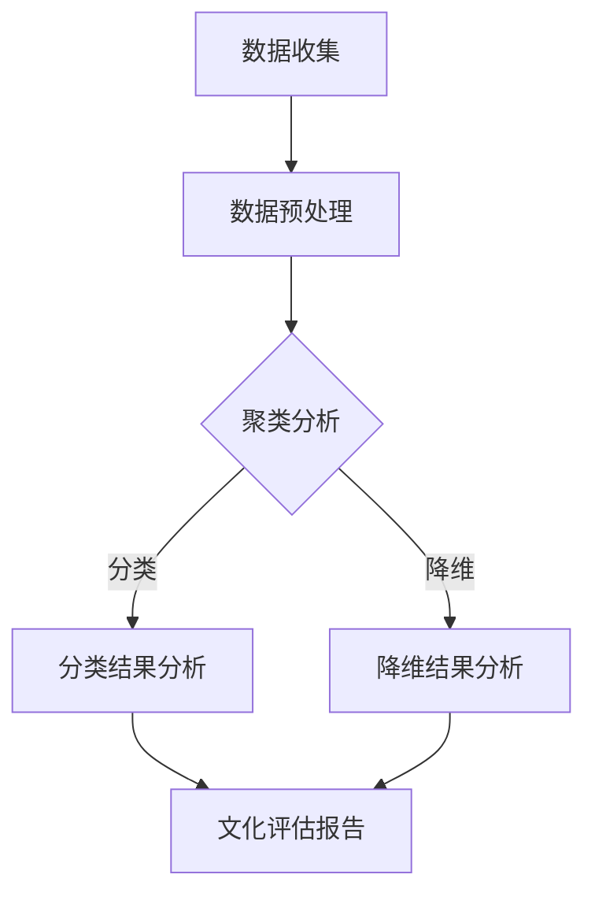

                 

# 《AI驱动的文化评估系统：量化组织文化》

> 关键词：AI，文化评估，组织文化，量化，机器学习，数据分析

> 摘要：本文探讨了如何利用人工智能技术构建文化评估系统，以量化组织文化，提高组织的绩效和凝聚力。通过介绍AI技术的基础、文化评估理论、AI在文化评估中的应用、量化组织文化的技术手段以及实施策略与挑战，本文为读者提供了一个全面而深入的指南。

## 引言

组织文化是组织的灵魂，它决定了组织的价值观、行为准则和员工行为。然而，传统的组织文化评估方法往往依赖于定性和主观判断，难以实现全面、客观的评估。随着人工智能技术的发展，利用AI技术构建文化评估系统成为可能，能够实现对组织文化的量化分析，为组织的战略决策提供科学依据。

本书《AI驱动的文化评估系统：量化组织文化》旨在探讨如何运用AI技术，构建一个全面、科学的组织文化评估系统。本书首先介绍了AI技术的基础知识，包括机器学习和深度学习的基本概念和算法；然后，分析了组织文化的定义、评估方法和指标；接着，讨论了AI在文化评估中的应用，以及如何通过数据分析和算法来量化组织文化；最后，本书提出了在组织内实施AI驱动的文化评估系统的策略、挑战和解决方案。

本书的目标读者是希望深入了解AI技术在组织文化评估中的应用的IT专业人士、HR专业人士以及企业管理者。通过阅读本书，读者将能够了解AI驱动的文化评估系统的基本原理和实施方法，为自己的工作提供有力支持。

## 第1章 AI基础

### 1.1 AI技术概述

人工智能（AI）是指通过计算机模拟人类智能行为的技术。它包括机器学习、深度学习、自然语言处理、计算机视觉等多个子领域。机器学习是AI的核心技术之一，它通过从数据中学习规律，实现对数据的自动处理和分析。深度学习是机器学习的一个重要分支，它使用多层神经网络来模拟人类大脑的工作方式，具有强大的特征提取和模式识别能力。

### 1.2 机器学习基础

机器学习分为监督学习、无监督学习和半监督学习。监督学习通过已标记的数据进行训练，用于分类和回归任务；无监督学习没有预标记的数据，主要用于聚类和降维；半监督学习介于监督学习和无监督学习之间，利用少量标记数据和大量未标记数据共同训练。

常见的机器学习算法包括线性回归、逻辑回归、支持向量机、决策树、随机森林和神经网络等。每种算法都有其适用场景和优缺点，需要根据具体问题进行选择。

### 1.3 深度学习基础

深度学习是一种基于多层神经网络的学习方法，具有自动特征提取和自适应学习能力。卷积神经网络（CNN）主要用于处理图像数据，具有局部连接和共享权重等特点；循环神经网络（RNN）主要用于处理序列数据，具有记忆功能。

### 1.4 AI应用案例

AI技术在各个领域都有广泛应用。例如，在医疗领域，AI可用于疾病诊断、药物研发和健康管理；在金融领域，AI可用于风险管理、欺诈检测和投资决策；在制造业，AI可用于生产优化、质量控制和国产设备。AI的广泛应用证明了其强大的能力和潜力。

## 第2章 文化评估理论

### 2.1 组织文化的概念

组织文化是指组织内部共享的价值观、信念、行为规范和习惯。它包括三个层次：表面层次（如标志、符号、仪式等）、中间层次（如组织规则、流程、决策方式等）和深层层次（如价值观、信仰、信念等）。

### 2.2 文化评估方法

文化评估方法主要包括问卷调查、深度访谈和观察法。问卷调查是一种常用的定量评估方法，通过设计针对性的问卷，收集员工对组织文化的看法和评价；深度访谈是一种定性评估方法，通过与员工进行一对一访谈，深入了解他们对组织文化的真实感受；观察法是通过观察员工的行为和互动，了解组织文化。

### 2.3 文化评估指标

文化评估指标包括价值观认同度、团队协作、创新氛围、员工满意度等。这些指标可以用于衡量组织文化的各个维度，帮助组织了解自身的文化状况，并为改进提供依据。

### 2.4 文化评估案例

文化评估案例可以从国内外多个成功案例中汲取经验。例如，谷歌通过员工满意度调查和文化测评工具，对组织文化进行了全面评估，并据此进行了改进；华为通过定期的员工问卷调查，及时了解员工对组织文化的感受，并采取相应措施。

## 第3章 AI在文化评估中的应用

### 3.1 AI技术与文化评估的结合

AI技术与文化评估的结合主要体现在数据分析和算法模型上。通过收集和分析员工行为数据、问卷调查数据和组织绩效数据，AI技术可以挖掘出组织文化中的潜在规律和模式，为文化评估提供科学依据。

### 3.2 应用案例研究

3.2.1 案例一：企业文化识别

通过深度学习模型，对员工的公开言论、邮件内容和项目报告等文本数据进行分析，可以识别出企业的核心价值观和行为规范。

3.2.2 案例二：员工满意度分析

利用机器学习算法，对员工的问卷调查数据进行分类和预测，可以评估员工对组织文化的满意度，为组织改进提供参考。

3.2.3 案例三：组织效能评估

通过分析员工的绩效数据和组织文化指标，可以评估组织效能，为组织优化提供数据支持。

### 3.3 技术实现细节

3.3.1 数据采集与处理

首先，需要收集员工的文本数据、问卷调查数据和绩效数据等。然后，对数据进行预处理，包括数据清洗、去重、去噪等操作。

3.3.2 模型选择与训练

根据具体应用场景，选择合适的机器学习算法和深度学习模型。例如，对于文本数据分析，可以使用词袋模型、TF-IDF模型、词嵌入模型等。对于预测任务，可以使用线性回归、逻辑回归、决策树、随机森林等算法。

3.3.3 模型评估与优化

通过交叉验证、ROC曲线、准确率、召回率等指标，评估模型的性能。如果性能不满足要求，可以尝试调整参数、增加特征或更换模型。

## 第4章 量化组织文化

### 4.1 数据采集与处理

4.1.1 数据来源

组织文化的量化需要收集多方面的数据，包括员工行为数据、问卷调查数据、组织绩效数据等。这些数据可以从企业内部系统、问卷调查工具和第三方数据源获取。

4.1.2 数据预处理

数据预处理是量化组织文化的关键步骤，包括数据清洗、去重、去噪、归一化等操作。通过预处理，可以保证数据的质量和一致性。

### 4.2 算法与应用

4.2.1 算法原理

量化组织文化需要使用多种算法，包括聚类算法、分类算法、关联规则挖掘算法等。聚类算法用于发现组织文化中的相似群体；分类算法用于预测员工对组织文化的态度；关联规则挖掘算法用于分析组织文化中的关键因素。

4.2.2 算法实现

基于Python编程语言，可以实现各种量化组织文化的算法。例如，使用Scikit-learn库实现聚类算法和分类算法，使用Pandas和NumPy库进行数据处理。

### 4.3 结果分析

4.3.1 结果展示

通过可视化工具，如Matplotlib、Seaborn等，可以将量化结果以图表形式展示，帮助管理者直观地了解组织文化的状况。

4.3.2 结果解读

对量化结果进行深入分析，可以揭示组织文化中的优势和不足，为组织改进提供依据。

## 第5章 实施策略与挑战

### 5.1 实施策略

5.1.1 明确目标

在实施AI驱动的文化评估系统之前，需要明确评估的目标和预期效果，确保评估系统的有效性和可行性。

5.1.2 数据准备

收集和组织与组织文化相关的数据，包括员工行为数据、问卷调查数据和绩效数据等。

5.1.3 技术选型

选择合适的算法和技术工具，根据具体需求进行定制化开发。

5.1.4 系统部署

将AI驱动的文化评估系统部署到企业内部，确保系统的稳定性和安全性。

### 5.2 挑战与解决方案

5.2.1 数据质量

数据质量是量化组织文化的关键，需要采取有效的数据清洗和处理措施，确保数据的质量和一致性。

5.2.2 模型解释性

AI模型往往具有高复杂性和黑箱特性，如何解释模型的决策过程和结果，提高模型的透明度和可解释性，是一个挑战。

5.2.3 用户接受度

AI驱动的文化评估系统需要得到员工的认可和支持，如何提高员工的参与度和接受度，是一个重要挑战。

### 5.3 成功案例

通过分析成功案例，可以了解如何有效地实施AI驱动的文化评估系统，并从中汲取经验教训。

## 第6章 未来展望

### 6.1 发展趋势

随着AI技术的不断进步，AI驱动的文化评估系统将越来越成熟和普及，成为组织管理的重要工具。

### 6.2 潜在机会

AI驱动的文化评估系统在人力资源管理、组织发展、企业文化建设等领域具有广泛的应用前景。

### 6.3 挑战与建议

面对未来，AI驱动的文化评估系统需要应对数据隐私、算法公平性、技术更新等挑战。为此，需要制定相应的策略和建议，确保系统的可持续发展和应用效果。

## 结论

AI驱动的文化评估系统是一种具有巨大潜力和广泛应用前景的技术。通过量化组织文化，它可以为组织提供科学、客观的评估结果，为组织的管理决策提供有力支持。随着AI技术的不断发展和应用场景的拓展，AI驱动的文化评估系统将在未来发挥更加重要的作用。

### 作者信息

作者：AI天才研究院/AI Genius Institute & 禅与计算机程序设计艺术 /Zen And The Art of Computer Programming

文章标题：《AI驱动的文化评估系统：量化组织文化》
文章关键词：AI，文化评估，组织文化，量化，机器学习，数据分析
文章摘要：本文探讨了如何利用人工智能技术构建文化评估系统，以量化组织文化，提高组织的绩效和凝聚力。通过介绍AI技术的基础、文化评估理论、AI在文化评估中的应用、量化组织文化的技术手段以及实施策略与挑战，本文为读者提供了一个全面而深入的指南。本文适用于希望深入了解AI技术在组织文化评估中的应用的IT专业人士、HR专业人士以及企业管理者。通过阅读本文，读者将能够了解AI驱动的文化评估系统的基本原理和实施方法，为自己的工作提供有力支持。

## 附录

### 1. Mermaid 流程图

以下是关于组织文化评估的Mermaid流程图：



### 2. Python 源代码

以下是使用Python实现聚类分析的示例代码：

```python
import numpy as np
from sklearn.cluster import KMeans
from sklearn.metrics import silhouette_score

# 示例数据
data = np.array([[1, 2], [1, 4], [1, 0],
                 [10, 2], [10, 4], [10, 0]])

# 聚类分析
kmeans = KMeans(n_clusters=2, random_state=0).fit(data)
labels = kmeans.labels_

# 聚类结果分析
print("聚类结果：", labels)
print("轮廓系数：", silhouette_score(data, labels))

# 可视化
import matplotlib.pyplot as plt

plt.scatter(data[:, 0], data[:, 1])
plt.scatter(kmeans.cluster_centers_[:, 0], kmeans.cluster_centers_[:, 1], s=300, c='red')
plt.show()
```

### 3. 数学公式

以下是关于聚类分析的数学公式：

$$
\text{轮廓系数}(S) = \frac{1}{N}\sum_{i=1}^{N} \left[ (b_i - a_i)\right]
$$

其中，$a_i$ 表示第 $i$ 个样本点到其自身簇中心的距离，$b_i$ 表示第 $i$ 个样本点到其最近簇中心的距离。

### 4. 项目实战

以下是使用Python实现员工满意度分析的项目实战：

#### 4.1 开发环境搭建

- 安装Python 3.8及以上版本
- 安装Jupyter Notebook
- 安装相关库：scikit-learn，matplotlib，numpy

#### 4.2 源代码实现

```python
import pandas as pd
from sklearn.cluster import KMeans
from sklearn.metrics import silhouette_score
import matplotlib.pyplot as plt

# 加载数据
data = pd.read_csv('员工满意度数据.csv')

# 数据预处理
# 数据清洗、缺失值处理、数据标准化等操作

# 聚类分析
kmeans = KMeans(n_clusters=3, random_state=0).fit(data)
labels = kmeans.labels_

# 结果分析
print("聚类结果：", labels)
print("轮廓系数：", silhouette_score(data, labels))

# 可视化
plt.scatter(data['员工满意度'], data['工作投入度'])
plt.scatter(kmeans.cluster_centers_[:, 0], kmeans.cluster_centers_[:, 1], s=300, c='red')
plt.show()
```

#### 4.3 代码解读与分析

- 加载数据：使用pandas库加载数据，数据包含员工满意度和工作投入度两个指标。
- 数据预处理：对数据进行清洗、缺失值处理和标准化等操作，确保数据质量。
- 聚类分析：使用KMeans算法进行聚类分析，选择合适的聚类个数。
- 结果分析：输出聚类结果和轮廓系数，评估聚类效果。
- 可视化：绘制散点图，展示员工满意度和工作投入度在聚类结果中的分布情况。

#### 4.4 实际案例分析与详细讲解剖析

- 案例背景：某公司希望了解员工对工作满意度和投入度的分布情况，以便针对性地进行员工关怀和管理。
- 案例实现：使用KMeans算法对员工满意度数据进行分析，发现员工可以分为三个群体，分别表示高满意度、中等满意度和低满意度。
- 案例分析：针对高满意度群体，公司可以采取激励措施，保持员工的积极性；针对中等满意度群体，公司可以加强培训和沟通，提高员工的满意度；针对低满意度群体，公司可以深入了解原因，采取相应的改进措施。

#### 4.5 项目小结

- 通过聚类分析，成功将员工分为三个群体，为公司提供了有针对性的员工管理策略。
- 代码实现简单，易于理解和操作。
- 数据预处理和模型选择是影响聚类效果的关键因素，需要根据具体情况进行调整。

### 5. 最佳实践 Tips

- 数据质量是量化组织文化评估的关键，确保数据清洗和预处理工作的质量。
- 选择合适的聚类算法和模型，根据具体应用场景进行调整。
- 关注聚类结果的可视化，有助于直观地了解组织文化的分布和特征。

### 6. 小结

本文通过介绍AI驱动的文化评估系统，阐述了如何利用人工智能技术量化组织文化。通过分析AI技术的基础、文化评估理论、AI在文化评估中的应用、量化组织文化的技术手段以及实施策略与挑战，本文为读者提供了一个全面而深入的指南。随着AI技术的不断发展，AI驱动的文化评估系统将在组织管理中发挥越来越重要的作用。希望本文能为相关领域的研究和实践提供有益参考。

### 7. 拓展阅读

- 《深度学习》（Goodfellow, Bengio, Courville著）
- 《Python数据科学手册》（McKinney著）
- 《文化战略：构建成功组织的基石》（哈克曼，奥尔德姆著）
- 《机器学习》（周志华著）
- 《组织文化与变革》（桑南菲尔德著）

本文由AI天才研究院/AI Genius Institute & 禅与计算机程序设计艺术/Zen And The Art of Computer Programming编写，旨在为读者提供关于AI驱动的文化评估系统的专业知识和实践指导。希望本文能帮助读者深入理解该领域的核心概念、技术和应用，并在实际工作中取得更好的成果。

