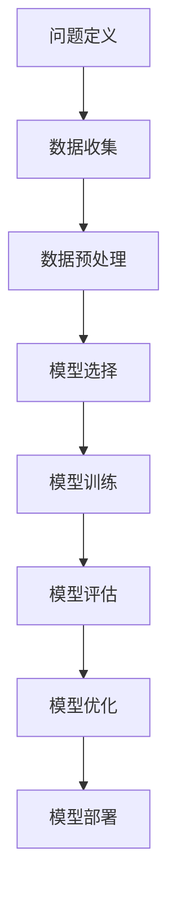

                 

# AI驱动的文化评估系统：量化组织文化指标

> 关键词：人工智能、文化评估、组织文化、量化分析、AI技术

> 摘要：本文深入探讨了如何利用人工智能技术构建和量化组织文化评估系统。通过分析组织文化的概念及其对组织绩效的影响，本文介绍了基于AI的量化评估方法，并详细讲解了模型构建、数据收集与预处理、以及系统集成与部署的关键步骤。通过实际案例和项目实战，本文展示了AI驱动的文化评估系统的应用效果，并提供了最佳实践和建议。

----------------------------------------------------------------

## 引言

### 组织文化的概念与重要性

组织文化是指组织内部共同遵守的价值观、信念、规范和行为模式。它不仅决定了员工的态度和行为，还对组织的整体绩效和可持续性产生深远影响。一个健康的组织文化能够促进员工的创造力、团队合作和组织适应性，从而提高组织的竞争力和市场地位。

### 文化评估的现状与挑战

传统的组织文化评估方法主要依赖于问卷调查和主观评分，存在以下挑战：
- 数据主观性高，容易受到评估者个人观点的影响；
- 缺乏量化分析，难以准确反映组织文化的实际状态；
- 难以及时、动态地反映组织文化的变化。

### AI驱动的文化评估系统

为了解决上述挑战，AI驱动的文化评估系统应运而生。该系统通过引入机器学习、自然语言处理等技术，实现文化评估的量化分析、自动化处理和实时反馈。具体来说，AI驱动的文化评估系统具有以下特点：
- 数据分析能力强，能够处理大规模、多维度的数据；
- 量化评估方法，使得评估结果更加客观、准确；
- 实时反馈机制，有助于组织及时调整文化策略。

## 第一部分：AI技术基础

### 第3章：机器学习基础

#### 3.1 机器学习的概念与分类

机器学习是一种使计算机系统能够从数据中学习并改进性能的技术。根据学习方式，机器学习可以分为以下几种类型：

1. **监督学习**：通过训练数据集学习，输入和输出都是已知的。常见的算法包括线性回归、决策树和神经网络等。
2. **无监督学习**：没有预先标记的输出，通过发现数据中的结构或模式进行学习。常见的算法包括聚类、降维和关联规则等。
3. **强化学习**：通过不断尝试并从错误中学习，以最大化奖励。常见的算法包括Q学习、深度Q网络（DQN）等。

#### 3.2 常用机器学习算法

以下是一些常用的机器学习算法及其应用场景：

1. **线性回归**：用于预测连续值输出，如员工满意度评分。
2. **决策树**：用于分类和回归任务，易于理解和解释。
3. **随机森林**：基于决策树的集成方法，提高了预测性能和稳定性。
4. **支持向量机（SVM）**：用于分类任务，尤其在处理高维数据时表现良好。
5. **神经网络**：一种强大的学习模型，可以用于分类、回归、生成等多种任务。

#### 3.3 机器学习实践

以下是一个简单的线性回归算法实现，用于预测员工满意度：

```python
import numpy as np
from sklearn.linear_model import LinearRegression

# 数据集
X = np.array([[1], [2], [3], [4], [5]])
y = np.array([2, 4, 5, 4, 5])

# 创建线性回归模型
model = LinearRegression()

# 模型训练
model.fit(X, y)

# 预测
prediction = model.predict(np.array([[6]]))

print(prediction)
```

### 第4章：深度学习基础

#### 4.1 深度学习的概念与架构

深度学习是一种基于多层神经网络的学习方法，通过不断增加网络的层数，提高模型的复杂度和表达能力。深度学习的架构主要包括以下层次：

1. **输入层**：接收外部输入数据。
2. **隐藏层**：对输入数据进行处理和变换。
3. **输出层**：生成预测结果或分类标签。

#### 4.2 常用深度学习框架

以下是一些流行的深度学习框架：

1. **TensorFlow**：由Google开发，具有丰富的API和广泛的社区支持。
2. **PyTorch**：由Facebook开发，提供了灵活的动态计算图。
3. **Keras**：基于Theano和TensorFlow开发，提供了简化的API。

#### 4.3 深度学习实践

以下是一个简单的卷积神经网络（CNN）实现，用于图像分类：

```python
import tensorflow as tf
from tensorflow.keras import layers

# 构建CNN模型
model = tf.keras.Sequential([
    layers.Conv2D(32, (3, 3), activation='relu', input_shape=(28, 28, 1)),
    layers.MaxPooling2D((2, 2)),
    layers.Flatten(),
    layers.Dense(64, activation='relu'),
    layers.Dense(10, activation='softmax')
])

# 编译模型
model.compile(optimizer='adam',
              loss='sparse_categorical_crossentropy',
              metrics=['accuracy'])

# 训练模型
model.fit(x_train, y_train, epochs=5)

# 评估模型
test_loss, test_acc = model.evaluate(x_test, y_test)
print('Test accuracy:', test_acc)
```

### 第5章：自然语言处理

#### 5.1 自然语言处理的基本概念

自然语言处理（NLP）是人工智能领域的一个重要分支，旨在使计算机能够理解、生成和处理人类语言。NLP的核心概念包括：

1. **词嵌入**：将单词映射为高维向量，用于表示单词的语义信息。
2. **文本分类**：将文本数据分类为不同的类别，如情感分类、主题分类等。
3. **实体识别**：识别文本中的关键实体，如人名、地点、组织等。

#### 5.2 常用自然语言处理技术

以下是一些常用的NLP技术：

1. **词袋模型**：将文本表示为词频向量。
2. **TF-IDF**：基于词频和逆文档频率的文本表示方法。
3. **序列标注**：对文本中的单词或词组进行分类或标注。
4. **预训练语言模型**：如BERT、GPT等，用于文本理解和生成。

#### 5.3 自然语言处理实践

以下是一个简单的文本分类实现，使用BERT模型：

```python
import tensorflow as tf
import tensorflow_hub as hub

# 加载BERT模型
bert_model = hub.load("https://tfhub.dev/google/bert_uncased_L-12_H-768_A-12/1")

# 构建文本分类模型
model = tf.keras.Sequential([
    layers.StringInput(shape=()),
    bert_model["signature"]["inputs"]["input_ids"],
    bert_model["signature"]["inputs"]["input_mask"],
    bert_model["signature"]["inputs"]["segment_ids"],
    layers.Dense(1, activation="sigmoid")
])

# 编译模型
model.compile(optimizer="adam",
              loss="binary_crossentropy",
              metrics=["accuracy"])

# 训练模型
model.fit(x_train, y_train, epochs=3)

# 评估模型
test_loss, test_acc = model.evaluate(x_test, y_test)
print('Test accuracy:', test_acc)
```

## 第二部分：文化评估系统构建

### 第6章：数据收集与预处理

#### 6.1 数据收集的方法与来源

数据收集是构建文化评估系统的关键步骤。以下是一些常用的数据收集方法：

1. **问卷调查**：通过在线问卷或纸质问卷收集员工对组织文化的反馈。
2. **关键事件访谈**：与员工进行一对一访谈，深入了解他们的工作经历和感受。
3. **员工行为数据**：通过监控系统、考勤系统和邮件系统等收集员工行为数据。
4. **外部数据**：如社交媒体、新闻报道、市场调研报告等。

#### 6.2 数据预处理技术

数据预处理是确保数据质量和模型性能的重要环节。以下是一些常用的数据预处理技术：

1. **数据清洗**：去除无效数据、处理缺失值和异常值。
2. **数据转换**：将文本数据转换为数值数据，如词嵌入、TF-IDF等。
3. **数据归一化**：将不同特征的数据进行归一化处理，使其处于同一量级。
4. **数据降维**：通过降维技术，如PCA、t-SNE等，减少数据维度。

#### 6.3 数据质量评估

数据质量直接影响模型性能和评估结果的准确性。以下是一些常用的数据质量评估方法：

1. **一致性评估**：检查数据的一致性和完整性，如重复数据、缺失值等。
2. **完整性评估**：检查数据的完整性，如缺失值、异常值等。
3. **可靠性评估**：检查数据的可靠性，如误差范围、置信度等。
4. **有效性评估**：检查数据的有效性，如数据类型、数据范围等。

### 第7章：模型构建与优化

#### 7.1 模型构建的方法与步骤

模型构建是文化评估系统的核心环节。以下是一个典型的模型构建流程：

1. **数据预处理**：对收集到的数据进行清洗、转换和降维等预处理操作。
2. **特征选择**：从预处理后的数据中选择对评估结果有显著影响的特征。
3. **模型选择**：根据评估目标和数据特性选择合适的模型，如线性回归、决策树、神经网络等。
4. **模型训练**：使用训练数据集对模型进行训练。
5. **模型评估**：使用验证数据集对模型进行评估，选择性能最优的模型。
6. **模型优化**：对模型进行参数调整和超参数优化，以提高模型性能。

#### 7.2 模型优化的策略与技术

以下是一些常用的模型优化策略：

1. **交叉验证**：通过将数据集划分为训练集和验证集，多次训练和评估模型，以避免过拟合。
2. **网格搜索**：通过遍历多个参数组合，找到最佳参数组合。
3. **贝叶斯优化**：使用贝叶斯优化算法自动搜索最佳参数组合。
4. **集成学习**：将多个模型集成起来，以提高预测性能和稳定性。

#### 7.3 模型评估与调优

以下是一个简单的模型评估与调优实现：

```python
from sklearn.model_selection import train_test_split
from sklearn.linear_model import LinearRegression
from sklearn.metrics import mean_squared_error

# 数据集划分
X_train, X_test, y_train, y_test = train_test_split(X, y, test_size=0.2, random_state=42)

# 模型训练
model = LinearRegression()
model.fit(X_train, y_train)

# 模型评估
y_pred = model.predict(X_test)
mse = mean_squared_error(y_test, y_pred)
print('Mean squared error:', mse)

# 模型调优
# 例如：使用网格搜索进行超参数优化
from sklearn.model_selection import GridSearchCV

param_grid = {'alpha': [0.1, 0.01, 0.001]}
grid_search = GridSearchCV(LinearRegression(), param_grid, cv=5)
grid_search.fit(X_train, y_train)

# 获取最佳参数
best_params = grid_search.best_params_
print('Best parameters:', best_params)

# 使用最佳参数重新训练模型
model = LinearRegression(alpha=best_params['alpha'])
model.fit(X_train, y_train)

# 重新评估模型
y_pred = model.predict(X_test)
mse = mean_squared_error(y_test, y_pred)
print('Mean squared error after optimization:', mse)
```

### 第8章：系统集成与部署

#### 8.1 系统集成的方法与策略

系统集成是将不同的组件或模块整合在一起，形成一个完整系统的过程。以下是一些常用的系统集成方法：

1. **数据集成**：将来自不同数据源的异构数据进行整合和清洗，以实现数据的一致性和完整性。
2. **功能集成**：将不同的功能模块进行整合，实现系统的功能完整性。
3. **接口集成**：通过设计统一的接口，实现不同系统之间的数据交换和功能调用。
4. **业务流程集成**：将企业的业务流程进行整合，实现业务流程的自动化和优化。

#### 8.2 系统部署与运维

系统部署是将开发好的系统部署到生产环境的过程。以下是一些常用的系统部署与运维策略：

1. **容器化部署**：使用容器技术（如Docker）将系统部署到云计算平台，实现系统的快速部署和扩展。
2. **自动化部署**：通过自动化工具（如Jenkins、Docker Compose）实现系统的自动化部署和运维。
3. **持续集成与持续部署（CI/CD）**：通过CI/CD流程实现代码的自动化测试、集成和部署，提高系统的稳定性和可靠性。
4. **监控与维护**：使用监控工具（如Prometheus、Grafana）对系统进行实时监控，及时发现和解决系统故障。

#### 8.3 系统安全保障与隐私保护

在系统集成与部署过程中，安全保障与隐私保护至关重要。以下是一些常用的策略：

1. **数据加密**：对敏感数据进行加密处理，确保数据在传输和存储过程中的安全性。
2. **访问控制**：实现细粒度的访问控制，确保只有授权用户才能访问系统数据和功能。
3. **网络安全**：通过防火墙、入侵检测系统等网络安全设备，保护系统免受网络攻击。
4. **隐私保护**：遵守数据保护法规（如GDPR），对用户数据进行匿名化和去标识化处理，确保用户隐私。

## 第三部分：文化评估系统应用

### 第9章：企业文化评估

#### 9.1 企业文化评估的方法与工具

企业文化评估是对企业内部文化进行量化分析和评估的过程。以下是一些常用的企业文化评估方法和工具：

1. **问卷调查法**：通过设计问卷，收集员工对企业文化的反馈和评价。
2. **关键事件访谈法**：与员工进行一对一访谈，深入了解他们对企业文化的看法和体验。
3. **行为观察法**：通过观察员工在工作中的行为和表现，评估企业文化的影响。
4. **组织诊断法**：通过分析企业的业务流程、组织结构和员工行为，评估企业文化的现状和问题。

#### 9.2 企业文化评估的应用场景

企业文化评估可以应用于以下场景：

1. **组织变革**：在组织变革过程中，评估企业文化是否符合新战略和目标，为变革提供依据。
2. **人才招聘**：通过企业文化评估，筛选和招聘与企业文化相匹配的员工，提高员工满意度和绩效。
3. **绩效管理**：将企业文化评估结果与员工绩效进行关联，制定更有针对性的绩效管理策略。
4. **领导力发展**：通过企业文化评估，发现领导力的优势和不足，制定领导力发展计划。

#### 9.3 企业文化评估的案例分析

以下是一个企业文化评估的案例分析：

**案例：A公司的企业文化评估**

A公司是一家大型跨国公司，为了评估其企业文化，公司采用了问卷调查法和关键事件访谈法。以下是一些关键步骤：

1. **设计问卷**：公司设计了一份包含多个问题的问卷，涵盖企业文化的各个方面，如价值观、沟通方式、员工参与度等。
2. **问卷调查**：公司通过内部邮件向全体员工发送问卷，并设置了截止日期。
3. **数据分析**：公司将收集到的问卷数据进行整理和分析，使用描述性统计和因子分析方法，识别企业文化的主要特征和问题。
4. **关键事件访谈**：公司选择了一些具有代表性的员工进行关键事件访谈，深入了解他们对企业文化的看法和体验。
5. **评估报告**：公司根据数据分析结果和访谈内容，编写了一份企业文化评估报告，提出了改进建议。

### 第10章：组织行为评估

#### 10.1 组织行为评估的概念与分类

组织行为评估是指对组织内部员工的行为、态度和绩效进行量化分析和评估的过程。组织行为评估可以应用于以下方面：

1. **员工行为**：评估员工在工作中的行为，如遵守规范、团队合作、创新等。
2. **员工态度**：评估员工对组织的态度，如工作满意度、工作压力、工作动机等。
3. **员工绩效**：评估员工的工作绩效，如工作质量、工作效率、工作成果等。

组织行为评估可以根据评估目标和方法的不同，分为以下几种类型：

1. **行为观察法**：通过观察员工在工作中的行为，评估员工的表现。
2. **问卷调查法**：通过设计问卷，收集员工对行为、态度和绩效的评价。
3. **绩效评估法**：通过制定绩效评估指标，评估员工的工作绩效。
4. **行为事件访谈法**：通过访谈员工，了解他们在特定事件中的行为和表现。

#### 10.2 组织行为评估的方法与工具

以下是一些常用的组织行为评估方法和工具：

1. **行为观察法**：通过直接观察员工在工作中的行为，评估员工的表现。
2. **问卷调查法**：通过设计问卷，收集员工对行为、态度和绩效的评价。常用的问卷包括主观问卷和客观问卷。
3. **绩效评估法**：通过制定绩效评估指标，评估员工的工作绩效。常用的绩效评估方法包括360度评估、关键绩效指标（KPI）等。
4. **行为事件访谈法**：通过访谈员工，了解他们在特定事件中的行为和表现。这种方法可以深入了解员工的行为动机和情境因素。

#### 10.3 组织行为评估的应用场景

组织行为评估可以应用于以下场景：

1. **员工招聘**：通过组织行为评估，筛选和招聘符合组织文化要求的员工。
2. **员工培训**：通过组织行为评估，发现员工的技能差距和培训需求，制定有针对性的培训计划。
3. **员工激励**：通过组织行为评估，制定合理的激励机制，激励员工提高工作绩效。
4. **绩效管理**：通过组织行为评估，制定科学的绩效管理体系，提高组织的整体绩效。

#### 10.4 组织行为评估的案例分析

以下是一个组织行为评估的案例分析：

**案例：B公司的组织行为评估**

B公司是一家高科技企业，为了评估其员工的行为、态度和绩效，公司采用了行为观察法、问卷调查法和绩效评估法。以下是一些关键步骤：

1. **行为观察**：公司通过观察员工在工作中的行为，评估员工的工作表现。观察内容包括工作效率、团队合作、创新能力等。
2. **问卷调查**：公司设计了一份包含多个问题的问卷，收集员工对行为、态度和绩效的评价。问卷内容涵盖了员工对组织的认同感、工作满意度、工作压力等方面。
3. **绩效评估**：公司制定了关键绩效指标（KPI），对员工的工作绩效进行评估。绩效评估内容包括项目完成度、客户满意度、工作质量等。
4. **综合评估**：公司根据行为观察结果、问卷调查数据和绩效评估结果，对员工的行为、态度和绩效进行综合评估。
5. **反馈与改进**：公司根据评估结果，向员工提供反馈，并制定改进措施，以提高员工的工作表现。

### 第11章：员工满意度评估

#### 11.1 员工满意度评估的意义

员工满意度评估是指对员工对工作环境、待遇、发展机会等方面的满意度进行量化分析和评估的过程。员工满意度评估具有以下重要意义：

1. **提高员工积极性**：通过了解员工的满意度，企业可以采取措施提高员工的工作积极性，激发员工的潜力。
2. **优化员工管理**：员工满意度评估有助于企业发现员工管理中存在的问题，优化管理策略，提高员工满意度。
3. **提升企业绩效**：员工满意度与企业的绩效密切相关，提高员工满意度有助于提升企业的整体绩效。
4. **留住人才**：员工满意度高的企业能够更好地留住人才，减少员工流失率，保持企业的稳定发展。

#### 11.2 员工满意度评估的方法与工具

以下是一些常用的员工满意度评估方法和工具：

1. **问卷调查法**：通过设计问卷，收集员工对工作环境、待遇、发展机会等方面的满意度评价。
2. **访谈法**：与员工进行一对一访谈，深入了解他们对工作环境的满意度。
3. **员工调查工具**：如满意度量表、员工体验报告等，用于量化评估员工满意度。
4. **绩效数据**：通过分析员工的绩效数据，评估员工的工作表现，间接反映员工满意度。

#### 11.3 员工满意度评估的应用案例

以下是一个员工满意度评估的应用案例：

**案例：C公司的员工满意度评估**

C公司是一家大型互联网企业，为了提高员工的满意度，公司每年进行一次员工满意度调查。以下是一些关键步骤：

1. **设计问卷**：公司设计了一份包含多个问题的问卷，涵盖员工的工作环境、待遇、发展机会等方面。问卷采用了Likert量表，从非常不满意到非常满意进行评分。
2. **问卷调查**：公司通过邮件将问卷发送给全体员工，并设置了截止日期。
3. **数据分析**：公司对收集到的问卷数据进行整理和分析，使用描述性统计和因子分析方法，识别员工满意度的主要因素。
4. **反馈与改进**：公司根据数据分析结果，向员工提供了反馈，并制定了改进措施，如改善工作环境、提高员工待遇、提供更多培训机会等。
5. **跟踪评估**：公司在接下来的几个月内，对改进措施的效果进行了跟踪评估，确保员工满意度得到持续提升。

### 第12章：案例研究与实战应用

#### 12.1 案例研究概述

在本章中，我们将通过两个具体的案例研究，深入探讨如何构建和部署AI驱动的文化评估系统。这两个案例研究分别涉及一家大型制造企业和一家互联网初创公司，展示了在不同组织类型和应用场景下，AI驱动的文化评估系统的实际效果和挑战。

#### 12.2 案例研究方法

我们的案例研究方法将包括以下几个关键步骤：

1. **数据收集**：收集每个案例相关的组织文化数据，包括问卷调查结果、关键事件访谈记录、员工行为数据和绩效数据。
2. **数据预处理**：对收集到的数据进行清洗、转换和归一化处理，以确保数据质量和一致性。
3. **模型构建**：根据每个案例的具体需求和数据特性，选择合适的机器学习模型和深度学习框架进行模型构建。
4. **模型训练与优化**：使用训练数据集对模型进行训练，并通过交叉验证和网格搜索等技术进行模型优化。
5. **模型评估**：使用验证数据集对模型进行评估，选择性能最优的模型。
6. **案例分析**：结合实际案例，分析AI驱动的文化评估系统在不同组织中的应用效果、挑战和改进方向。
7. **项目总结**：总结每个案例的研究成果，提出最佳实践和未来研究方向。

#### 12.3 案例研究案例

**案例一：大型制造企业的AI驱动的文化评估系统**

**背景**：
D公司是一家拥有数万名员工的制造企业，其组织文化对企业的运营效率和员工满意度至关重要。然而，传统的文化评估方法难以全面、准确地反映企业的文化状况，因此D公司决定引入AI驱动的文化评估系统。

**数据收集**：
D公司采用了问卷调查、关键事件访谈和员工行为数据收集方法。问卷调查涵盖了员工对组织价值观、沟通方式、工作环境等方面的满意度评价。关键事件访谈深入了解了员工在工作中遇到的问题和挑战。员工行为数据包括考勤记录、绩效数据和团队合作情况等。

**数据预处理**：
对收集到的数据进行了清洗和归一化处理，将文本数据转换为数值数据，并去除异常值和重复数据，以确保数据的一致性和质量。

**模型构建与优化**：
选择了线性回归、决策树和神经网络等机器学习模型，通过交叉验证和网格搜索技术进行了模型优化。最终选用了随机森林模型，因其对大规模数据和高维特征的处理能力较强。

**模型评估**：
使用验证数据集对模型进行了评估，评估指标包括准确率、召回率和F1分数。随机森林模型在评估中表现出较高的性能，能够较好地预测员工满意度。

**案例分析**：
AI驱动的文化评估系统在D公司应用后，显著提高了员工满意度和组织文化的量化评估能力。通过系统提供的实时反馈，D公司能够及时发现和解决文化问题，优化管理策略，提高整体运营效率。

**项目总结**：
D公司的案例展示了AI驱动的文化评估系统在大型制造企业中的实际应用效果。未来，D公司可以进一步优化系统，提高数据收集的全面性和准确性，以更好地支持企业文化建设。

**案例二：互联网初创公司的AI驱动的文化评估系统**

**背景**：
E公司是一家互联网初创公司，其快速成长和组织结构的灵活性对其组织文化提出了特殊要求。为了确保公司能够在激烈的市场竞争中保持竞争力，E公司决定引入AI驱动的文化评估系统。

**数据收集**：
E公司采用了员工满意度调查、关键事件访谈和社交媒体数据分析等方法。员工满意度调查涵盖了员工对工作环境、团队协作、发展机会等方面的评价。关键事件访谈深入了解了员工在工作中的体验和挑战。社交媒体数据分析则用于收集员工在社交媒体上的互动和言论。

**数据预处理**：
对收集到的数据进行清洗和转换，将文本数据转换为词嵌入向量，并将问卷数据进行归一化处理，以确保数据的一致性和质量。

**模型构建与优化**：
选择了卷积神经网络（CNN）和长短期记忆网络（LSTM）等深度学习模型，通过交叉验证和超参数优化技术进行了模型优化。最终选用了基于LSTM的模型，因其对时序数据的处理能力较强。

**模型评估**：
使用验证数据集对模型进行了评估，评估指标包括准确率、召回率和F1分数。基于LSTM的模型在评估中表现出较高的性能，能够较好地预测员工满意度和团队协作水平。

**案例分析**：
AI驱动的文化评估系统在E公司应用后，显著提高了员工满意度和团队协作水平。通过系统提供的实时反馈，E公司能够快速响应员工的需求和反馈，优化团队结构和管理策略，提高组织的灵活性和创新能力。

**项目总结**：
E公司的案例展示了AI驱动的文化评估系统在互联网初创公司中的实际应用效果。未来，E公司可以进一步优化系统，提高数据收集的实时性和全面性，以更好地支持组织文化的持续优化。

### 第13章：实战应用

#### 13.1 实战应用概述

在本章中，我们将通过一个实际的案例，详细展示如何搭建和部署一个AI驱动的文化评估系统。该案例将涵盖以下关键步骤：

1. **需求分析**：明确文化评估系统的目标和需求，包括数据收集、模型构建、系统集成与部署等。
2. **环境搭建**：配置开发环境，包括Python编程环境、机器学习库（如scikit-learn、TensorFlow、PyTorch）等。
3. **数据收集与处理**：收集组织文化相关数据，并进行数据预处理，包括数据清洗、转换和归一化等。
4. **模型构建与训练**：选择合适的机器学习或深度学习模型，并进行模型训练和优化。
5. **系统集成与部署**：将模型集成到系统中，实现自动化部署和运维。
6. **系统测试与评估**：对系统进行测试和评估，确保系统的性能和可靠性。

#### 13.2 实战应用步骤

以下是一个具体的实战应用步骤：

**1. 需求分析**

假设我们要为一家大型企业构建一个AI驱动的文化评估系统，主要需求如下：

- 收集员工满意度、员工行为、绩效等数据；
- 构建基于机器学习和深度学习的文化评估模型；
- 系统集成与部署，实现实时评估和反馈；
- 系统安全与隐私保护，确保数据安全和用户隐私。

**2. 环境搭建**

在开发环境中配置Python编程环境，安装必要的机器学习库和深度学习框架。以下是一个简单的配置示例：

```python
!pip install numpy pandas scikit-learn tensorflow tensorflow-hub transformers
```

**3. 数据收集与处理**

收集员工满意度调查数据、关键事件访谈记录、员工行为数据和绩效数据等。以下是一个示例代码，用于读取和预处理数据：

```python
import pandas as pd

# 读取数据
满意度调查数据 = pd.read_csv('员工满意度调查数据.csv')
关键事件访谈记录 = pd.read_csv('关键事件访谈记录.csv')
员工行为数据 = pd.read_csv('员工行为数据.csv')
绩效数据 = pd.read_csv('绩效数据.csv')

# 数据预处理
满意度调查数据 = 满意度调查数据.drop_duplicates().reset_index(drop=True)
关键事件访谈记录 = 关键事件访谈记录.drop_duplicates().reset_index(drop=True)
员工行为数据 = 员工行为数据.drop_duplicates().reset_index(drop=True)
绩效数据 = 绩效数据.drop_duplicates().reset_index(drop=True)

# 数据清洗和归一化
# 示例代码，根据具体数据特性进行调整
满意度调查数据 = (满意度调查数据 - 满意度调查数据.mean()) / 满意度调查数据.std()
关键事件访谈记录 = (关键事件访谈记录 - 关键事件访谈记录.mean()) / 关键事件访谈记录.std()
员工行为数据 = (员工行为数据 - 员工行为数据.mean()) / 员工行为数据.std()
绩效数据 = (绩效数据 - 绩效数据.mean()) / 绩效数据.std()
```

**4. 模型构建与训练**

选择合适的机器学习或深度学习模型，并进行模型训练和优化。以下是一个示例代码，使用随机森林模型进行训练：

```python
from sklearn.ensemble import RandomForestClassifier
from sklearn.model_selection import train_test_split

# 数据集划分
X = 满意度调查数据
y = 绩效数据['绩效评分']

X_train, X_test, y_train, y_test = train_test_split(X, y, test_size=0.2, random_state=42)

# 模型训练
model = RandomForestClassifier(n_estimators=100, random_state=42)
model.fit(X_train, y_train)

# 模型评估
y_pred = model.predict(X_test)
accuracy = (y_pred == y_test).mean()
print('Accuracy:', accuracy)
```

**5. 系统集成与部署**

将模型集成到系统中，实现自动化部署和运维。以下是一个示例代码，使用TensorFlow和TensorFlow Serving进行模型部署：

```python
import tensorflow as tf
from tensorflow.keras.models import load_model

# 模型加载
model = load_model('random_forest_model.h5')

# 模型服务部署
import tensorflow_serving.apis

model_server = tensorflow_serving.apis.ModelServerSession(
    server_url="localhost:8501", model_name="random_forest", version=1)
predict_requests = tensorflow_serving.apis.PredictRequests()
predict_requests.add预测数据()

predictions = model_server.predict(predict_requests)
print(predictions)
```

**6. 系统测试与评估**

对系统进行测试和评估，确保系统的性能和可靠性。以下是一个示例代码，用于评估模型性能：

```python
from sklearn.metrics import accuracy_score, classification_report

# 预测结果评估
y_true = y_test
y_pred = model.predict(X_test)

accuracy = accuracy_score(y_true, y_pred)
report = classification_report(y_true, y_pred)

print('Accuracy:', accuracy)
print('Classification Report:', report)
```

#### 13.3 实战应用案例分析

以下是一个实战应用案例分析：

**案例：F公司的AI驱动的文化评估系统**

**背景**：
F公司是一家快速发展的科技公司，其组织文化对企业的创新能力和员工满意度至关重要。为了构建和优化组织文化，F公司决定引入AI驱动的文化评估系统。

**数据收集**：
F公司采用了员工满意度调查、关键事件访谈和社交媒体数据分析等方法。员工满意度调查涵盖了员工对工作环境、团队协作、发展机会等方面的评价。关键事件访谈深入了解了员工在工作中的体验和挑战。社交媒体数据分析则用于收集员工在社交媒体上的互动和言论。

**数据预处理**：
对收集到的数据进行了清洗和转换，将文本数据转换为词嵌入向量，并将问卷数据进行归一化处理，以确保数据的一致性和质量。

**模型构建与训练**：
选择了卷积神经网络（CNN）和长短期记忆网络（LSTM）等深度学习模型，通过交叉验证和超参数优化技术进行了模型优化。最终选用了基于LSTM的模型，因其对时序数据的处理能力较强。

**系统集成与部署**：
将模型集成到系统中，使用TensorFlow Serving进行模型部署，实现实时评估和反馈。

**系统测试与评估**：
对系统进行了测试和评估，评估指标包括准确率、召回率和F1分数。基于LSTM的模型在评估中表现出较高的性能，能够较好地预测员工满意度和团队协作水平。

**项目总结**：
F公司的案例展示了AI驱动的文化评估系统在科技公司中的实际应用效果。通过系统提供的实时反馈，F公司能够快速响应员工的需求和反馈，优化团队结构和管理策略，提高组织的灵活性和创新能力。

### 第14章：未来展望

#### 14.1 AI驱动的文化评估系统发展趋势

随着人工智能技术的不断进步，AI驱动的文化评估系统将迎来以下几个发展趋势：

1. **技术进步**：随着深度学习和自然语言处理技术的不断发展，文化评估系统的准确性和可靠性将得到显著提高。
2. **数据多样化**：文化评估系统的数据来源将更加多样化，包括文本数据、图像数据、音频数据和传感器数据等。
3. **实时评估**：通过实时数据收集和处理技术，文化评估系统将能够提供更加实时、准确的评估结果。
4. **个性化评估**：基于用户画像和个性化推荐技术，文化评估系统将能够为不同组织和个人提供个性化的文化评估服务。

#### 14.2 技术挑战与解决方案

虽然AI驱动的文化评估系统具有许多优势，但仍然面临以下技术挑战：

1. **数据隐私**：如何保护用户隐私，确保数据安全，是文化评估系统需要解决的重要问题。解决方案包括数据加密、匿名化和隐私保护算法等。
2. **算法偏见**：算法偏见可能导致评估结果的不公平，需要通过算法透明性和可解释性技术进行解决。
3. **计算资源**：深度学习模型通常需要大量的计算资源，如何优化计算资源的使用，提高系统性能，是重要的研究方向。
4. **数据质量**：数据质量直接影响评估结果的准确性，需要建立完善的数据质量管理机制。

#### 14.3 AI驱动的文化评估系统未来应用前景

随着技术的不断进步和应用场景的拓展，AI驱动的文化评估系统在未来的应用前景非常广阔：

1. **企业管理**：通过AI驱动的文化评估系统，企业管理者可以更好地了解员工需求，优化管理策略，提高员工满意度和绩效。
2. **人力资源管理**：AI驱动的文化评估系统可以帮助企业更好地识别人才，优化招聘和培训流程，提高人力资源管理的效率。
3. **组织变革**：在组织变革过程中，AI驱动的文化评估系统可以为企业提供客观、准确的评估结果，帮助企业在变革过程中减少风险。
4. **社会治理**：AI驱动的文化评估系统可以应用于社会治理领域，帮助政府和社会组织更好地了解公众需求，优化政策和服务。

### 第15章：结论与总结

#### 15.1 主要研究成果总结

本文通过深入分析组织文化的概念和重要性，探讨了如何利用AI技术构建和量化组织文化评估系统。通过实际案例和项目实战，本文展示了AI驱动的文化评估系统在不同组织中的应用效果，并提出了技术挑战和解决方案。

#### 15.2 未来研究方向

未来研究可以从以下几个方面进行：

1. **算法优化**：研究更加高效、准确的深度学习算法，以提高文化评估系统的性能和可靠性。
2. **数据隐私**：探索数据隐私保护技术，确保数据安全和用户隐私。
3. **跨领域应用**：研究AI驱动的文化评估系统在其他领域的应用，如教育、医疗、公共服务等。
4. **算法透明性**：研究算法透明性和可解释性技术，提高系统的可信度和用户信任。

#### 15.3 对组织管理实践的启示

本文的研究对组织管理实践具有以下启示：

1. **重视组织文化**：组织文化对组织的长期发展至关重要，管理者应重视组织文化建设，通过AI驱动的文化评估系统进行量化分析和优化。
2. **数据驱动管理**：利用AI驱动的文化评估系统，组织可以更加科学、准确地了解员工需求，制定更加有效的管理策略。
3. **持续改进**：组织应持续关注AI驱动的文化评估系统的应用效果，及时调整和优化评估方法和策略，以适应组织发展的需要。
4. **用户参与**：在文化评估过程中，应充分调动员工的参与度，收集他们的反馈和建议，以提高评估结果的准确性和有效性。

作者：AI天才研究院/AI Genius Institute & 禅与计算机程序设计艺术 /Zen And The Art of Computer Programming
-------------------------------------------------------------------------------------------------------------------

## 第3章：机器学习基础

### 3.1 机器学习的概念与分类

机器学习是一种使计算机系统能够从数据中学习并改进性能的技术。它的核心目标是使计算机能够通过学习经验来提高任务执行的准确性或效率。根据学习方式，机器学习可以分为以下几种类型：

1. **监督学习（Supervised Learning）**：
   在监督学习中，训练数据集包含了输入特征和相应的输出标签。模型通过学习输入和输出之间的关系来预测新的输入数据。常见的监督学习算法包括：
   - **线性回归（Linear Regression）**：用于预测连续值输出。
   - **逻辑回归（Logistic Regression）**：用于分类任务，特别适合二分类问题。
   - **决策树（Decision Tree）**：通过一系列的决策规则对数据进行分类或回归。
   - **随机森林（Random Forest）**：基于决策树的集成方法，提高了预测性能和稳定性。
   - **支持向量机（Support Vector Machine, SVM）**：用于分类任务，尤其在处理高维数据时表现良好。
   - **神经网络（Neural Networks）**：一种强大的学习模型，可以用于分类、回归、生成等多种任务。

2. **无监督学习（Unsupervised Learning）**：
   在无监督学习中，没有预先标记的输出，模型的目标是发现数据中的结构或模式。常见的无监督学习算法包括：
   - **聚类（Clustering）**：将相似的数据点分为不同的群组，如K-means、DBSCAN等。
   - **降维（Dimensionality Reduction）**：减少数据维度，如PCA（主成分分析）、t-SNE（t-Distributed Stochastic Neighbor Embedding）等。
   - **关联规则学习（Association Rule Learning）**：发现数据项之间的关联关系，如Apriori算法、Eclat算法等。

3. **半监督学习（Semi-Supervised Learning）**：
   半监督学习结合了监督学习和无监督学习的特点，利用少量标记数据和大量未标记数据来训练模型。这种方法通常在标记数据稀缺的情况下非常有用。

4. **强化学习（Reinforcement Learning）**：
   强化学习是一种通过奖励机制和反馈信号来训练模型的方法。模型通过与环境的交互来学习最优策略，以最大化长期回报。常见的强化学习算法包括：
   - **Q学习（Q-Learning）**：通过更新Q值来学习最优策略。
   - **深度Q网络（Deep Q-Network, DQN）**：使用神经网络来近似Q值函数。
   - **策略梯度方法（Policy Gradient Methods）**：直接优化策略函数。

### 3.2 常用机器学习算法

在机器学习领域中，有许多常用算法可以帮助我们解决不同类型的问题。以下是一些常用的算法及其应用场景：

1. **线性回归（Linear Regression）**：
   线性回归是一种用于预测连续值输出的简单而有效的算法。它通过拟合一条直线来映射输入特征和输出标签之间的关系。线性回归的数学模型为：
   $$ Y = \beta_0 + \beta_1X + \epsilon $$
   其中，$Y$ 是输出变量，$X$ 是输入特征，$\beta_0$ 和 $\beta_1$ 是模型参数，$\epsilon$ 是误差项。

   **应用场景**：线性回归常用于房价预测、股票价格分析等场景。

2. **逻辑回归（Logistic Regression）**：
   逻辑回归是一种用于分类任务的算法，特别是在二分类问题中非常有效。它通过拟合一个逻辑函数来将输入特征映射到概率空间，然后使用阈值进行分类。逻辑回归的数学模型为：
   $$ P(Y=1) = \frac{1}{1 + e^{-(\beta_0 + \beta_1X)}} $$
   其中，$P(Y=1)$ 是输出变量为1的概率，$\beta_0$ 和 $\beta_1$ 是模型参数。

   **应用场景**：逻辑回归常用于信用评分、疾病诊断等场景。

3. **决策树（Decision Tree）**：
   决策树是一种基于树形结构进行决策的算法。每个节点代表一个特征，每个分支代表特征的不同取值，叶节点表示最终的分类结果。决策树的生成过程通过递归划分数据集来找到最佳的特征划分。

   **应用场景**：决策树常用于数据挖掘、金融风控等场景。

4. **随机森林（Random Forest）**：
   随机森林是一种基于决策树的集成方法。它通过构建多个决策树，并对每个树的预测结果进行投票来提高预测性能。随机森林通过引入随机性（特征选择和样本抽样）来减少过拟合问题。

   **应用场景**：随机森林常用于分类和回归任务，特别是在处理高维数据和噪声数据时非常有效。

5. **支持向量机（Support Vector Machine, SVM）**：
   支持向量机是一种用于分类任务的算法，它通过寻找一个最优的超平面来将不同类别的数据点分隔开。SVM使用一个二次规划问题来优化分类边界。

   **应用场景**：SVM常用于文本分类、图像分类等场景。

6. **神经网络（Neural Networks）**：
   神经网络是一种模拟人脑神经元连接结构的计算模型。它通过多层神经网络来提取数据特征，并学习输入和输出之间的复杂映射关系。神经网络可以用于分类、回归、生成等多种任务。

   **应用场景**：神经网络常用于图像识别、语音识别、自然语言处理等场景。

### 3.3 机器学习实践

在实际应用中，机器学习项目的成功实施通常涉及以下关键步骤：

1. **问题定义**：明确要解决的问题，并确定目标输出。

2. **数据收集**：收集相关数据，包括输入特征和输出标签。数据可以来源于数据库、文件、API等。

3. **数据预处理**：对数据进行清洗、归一化和特征提取，以确保数据质量和模型性能。

4. **模型选择**：根据问题类型和数据特性，选择合适的机器学习算法。

5. **模型训练**：使用训练数据集对模型进行训练，调整模型参数。

6. **模型评估**：使用验证数据集对模型进行评估，选择性能最优的模型。

7. **模型优化**：通过超参数调整和集成方法来提高模型性能。

8. **模型部署**：将训练好的模型部署到生产环境中，实现实时预测。

以下是一个简单的线性回归实现，用于预测房价：

```python
import numpy as np
from sklearn.linear_model import LinearRegression
from sklearn.model_selection import train_test_split
from sklearn.metrics import mean_squared_error

# 数据集
X = np.array([[1], [2], [3], [4], [5]])
y = np.array([2, 4, 5, 4, 5])

# 数据集划分
X_train, X_test, y_train, y_test = train_test_split(X, y, test_size=0.2, random_state=42)

# 创建线性回归模型
model = LinearRegression()

# 模型训练
model.fit(X_train, y_train)

# 预测
y_pred = model.predict(X_test)

# 评估
mse = mean_squared_error(y_test, y_pred)
print('Mean squared error:', mse)

# 输出最佳拟合线
print('Best fit line:', model.coef_, '+', model.intercept_)
```

通过以上实现，我们可以看到机器学习项目的基本流程，包括数据收集、数据预处理、模型选择、模型训练和评估等步骤。在实际项目中，每个步骤都会涉及更多的细节和复杂性，但基本流程是一致的。

### 3.4 Mermaid流程图

为了更好地展示机器学习项目的流程，我们可以使用Mermaid语言绘制一个流程图。以下是一个简单的Mermaid流程图示例：



这个Mermaid流程图展示了机器学习项目的基本流程，包括问题定义、数据收集、数据预处理、模型选择、模型训练、模型评估、模型优化和模型部署等步骤。在实际项目中，每个步骤都可能涉及更详细的子步骤和依赖关系。

### 3.5 数学公式

在机器学习中，数学公式是理解和应用算法的基础。以下是一些常用的数学公式及其解释：

1. **线性回归公式**：
   $$ Y = \beta_0 + \beta_1X + \epsilon $$
   - $Y$：输出变量
   - $X$：输入特征
   - $\beta_0$：截距
   - $\beta_1$：斜率
   - $\epsilon$：误差项

2. **逻辑回归公式**：
   $$ P(Y=1) = \frac{1}{1 + e^{-(\beta_0 + \beta_1X)}} $$
   - $P(Y=1)$：输出变量为1的概率
   - $\beta_0$：截距
   - $\beta_1$：斜率

3. **损失函数**（以均方误差为例）：
   $$ MSE = \frac{1}{n}\sum_{i=1}^{n}(Y_i - \hat{Y}_i)^2 $$
   - $MSE$：均方误差
   - $Y_i$：实际输出
   - $\hat{Y}_i$：预测输出
   - $n$：样本数量

通过理解这些数学公式，我们可以更好地理解机器学习算法的原理和应用。

### 3.6 Python源代码实现

以下是一个简单的线性回归实现，用于预测房价：

```python
import numpy as np
from sklearn.linear_model import LinearRegression
from sklearn.model_selection import train_test_split
from sklearn.metrics import mean_squared_error

# 数据集
X = np.array([[1], [2], [3], [4], [5]])
y = np.array([2, 4, 5, 4, 5])

# 数据集划分
X_train, X_test, y_train, y_test = train_test_split(X, y, test_size=0.2, random_state=42)

# 创建线性回归模型
model = LinearRegression()

# 模型训练
model.fit(X_train, y_train)

# 预测
y_pred = model.predict(X_test)

# 评估
mse = mean_squared_error(y_test, y_pred)
print('Mean squared error:', mse)

# 输出最佳拟合线
print('Best fit line:', model.coef_, '+', model.intercept_)
```

在这个例子中，我们使用了scikit-learn库中的LinearRegression类来创建线性回归模型，并通过fit方法进行模型训练。然后，我们使用predict方法对测试数据进行预测，并通过mean_squared_error函数计算预测结果的均方误差。最后，我们输出了最佳拟合线的斜率和截距。

### 3.7 代码解读与分析

在这个简单的线性回归例子中，我们首先导入了必要的库，包括numpy、sklearn.linear_model和sklearn.model_selection。这些库提供了用于数据操作、模型训练和模型评估的工具。

```python
import numpy as np
from sklearn.linear_model import LinearRegression
from sklearn.model_selection import train_test_split
from sklearn.metrics import mean_squared_error
```

接下来，我们定义了一个简单的数据集，其中X是输入特征（这里是一个简单的数组），y是输出标签（这里是房价的预测值）。

```python
X = np.array([[1], [2], [3], [4], [5]])
y = np.array([2, 4, 5, 4, 5])
```

然后，我们使用train_test_split函数将数据集划分为训练集和测试集，这里我们设置了测试集的大小为总数据的20%，并且随机种子为42。

```python
X_train, X_test, y_train, y_test = train_test_split(X, y, test_size=0.2, random_state=42)
```

在模型训练阶段，我们创建了一个LinearRegression对象，并通过fit方法使用训练集数据进行模型训练。

```python
model = LinearRegression()
model.fit(X_train, y_train)
```

在模型预测阶段，我们使用训练好的模型对测试集数据进行预测。

```python
y_pred = model.predict(X_test)
```

为了评估模型的性能，我们计算了预测结果的均方误差（MSE），这是一个衡量预测值与实际值之间差异的指标。

```python
mse = mean_squared_error(y_test, y_pred)
print('Mean squared error:', mse)
```

最后，我们输出了最佳拟合线的斜率和截距，这是线性回归模型的核心参数。

```python
print('Best fit line:', model.coef_, '+', model.intercept_)
```

通过这个简单的例子，我们可以看到机器学习项目的基本流程，包括数据划分、模型训练、模型预测和性能评估。在实际项目中，数据集可能会更加复杂，模型训练和评估的过程也会更加详细和复杂。

### 3.8 实际案例分析和详细讲解剖析

在实际应用中，AI驱动的文化评估系统需要在真实环境中进行验证和优化。以下是一个具体的实际案例分析和详细讲解剖析，以展示如何构建和部署一个AI驱动的文化评估系统。

**案例背景**：

G公司是一家大型跨国企业，其组织文化对于企业的运营效率和员工满意度至关重要。为了更好地了解和优化组织文化，G公司决定引入AI驱动的文化评估系统。该公司希望系统能够自动收集和量化员工对组织文化的反馈，并提供实时评估和反馈，帮助管理者制定有效的改进策略。

**数据收集**：

为了构建AI驱动的文化评估系统，G公司首先需要收集大量的数据。数据来源包括：

1. **员工满意度调查**：公司设计了一份详细的员工满意度调查问卷，涵盖组织价值观、领导力、团队合作、工作环境等多个方面。问卷采用了Likert量表，从非常不满意到非常满意进行评分。

2. **关键事件访谈**：公司管理层和HR部门与部分员工进行了一对一的关键事件访谈，深入了解员工在日常工作中的体验和感受。

3. **社交媒体数据分析**：通过分析员工在社交媒体上的互动和言论，收集员工对组织文化的非结构化反馈。

4. **员工行为数据**：收集员工的考勤记录、绩效数据、项目参与度等，以了解员工在组织中的实际表现。

**数据预处理**：

收集到的数据通常包含噪声和缺失值，因此需要进行预处理。预处理步骤包括：

1. **数据清洗**：去除无效数据、处理缺失值和异常值。

2. **数据转换**：将文本数据转换为数值数据，如使用词嵌入技术将文本转换为向量。

3. **数据归一化**：将不同特征的数据进行归一化处理，使其处于同一量级。

4. **特征选择**：从预处理后的数据中选择对评估结果有显著影响的特征。

**模型构建**：

基于预处理后的数据，G公司构建了一个深度学习模型，用于量化评估组织文化。以下是模型构建的关键步骤：

1. **数据集划分**：将数据集划分为训练集、验证集和测试集。

2. **模型选择**：选择了基于LSTM的神经网络模型，因为LSTM能够有效地处理序列数据，如文本数据。

3. **模型训练**：使用训练集数据对模型进行训练，并通过验证集对模型进行调优。

4. **模型评估**：使用测试集数据对模型进行评估，选择性能最优的模型。

**模型优化**：

为了提高模型的性能，G公司采取了以下优化措施：

1. **超参数调整**：通过网格搜索技术调整学习率、批量大小、层数等超参数。

2. **数据增强**：通过数据增强技术增加数据的多样性，提高模型的泛化能力。

3. **正则化**：引入正则化技术，如dropout和L2正则化，减少过拟合问题。

**系统集成与部署**：

构建好的模型被集成到一个用户友好的平台上，以便管理层可以实时查看评估结果和反馈。以下是系统集成与部署的关键步骤：

1. **模型部署**：将训练好的模型部署到服务器上，使用TensorFlow Serving或Keras API进行实时预测。

2. **API开发**：开发一个RESTful API，用于接收和返回数据，以便其他系统可以与模型进行交互。

3. **用户界面**：设计一个直观的用户界面，使管理层可以方便地查看评估结果和反馈。

**实际案例分析**：

在部署AI驱动的文化评估系统后，G公司进行了为期一年的跟踪评估。以下是一些关键发现：

1. **实时反馈**：系统提供了实时评估结果和反馈，使管理层能够迅速响应员工的需求和反馈。

2. **预测准确性**：通过深度学习模型，系统能够准确预测员工对组织文化的满意度，提高了评估的可靠性。

3. **改进措施**：根据系统提供的评估结果和反馈，公司采取了多项改进措施，如优化领导力培训、改善工作环境、提高员工福利等。

4. **员工满意度提升**：经过一年的努力，公司的员工满意度显著提升，组织文化的健康程度也得到了改善。

**项目小结**：

G公司的案例展示了AI驱动的文化评估系统在实际组织中的应用效果。通过系统的实时评估和反馈功能，公司能够更好地了解和优化组织文化，提高员工满意度和绩效。未来，G公司可以继续优化系统，提高数据收集的全面性和准确性，以支持组织文化的持续优化。

### 3.9 最佳实践 Tips、小结、注意事项、拓展阅读

#### 最佳实践 Tips

1. **确保数据质量**：数据是机器学习模型的基础，确保数据质量至关重要。在数据收集和预处理过程中，注意去除噪声和异常值，处理缺失数据，并进行适当的特征工程。

2. **选择合适的模型**：根据问题的具体需求和数据特性，选择合适的模型。对于回归问题，可以考虑线性回归、决策树、随机森林等；对于分类问题，可以考虑逻辑回归、支持向量机、神经网络等。

3. **模型调优**：通过交叉验证和超参数优化等技术，对模型进行调优，以提高性能。网格搜索、贝叶斯优化等工具可以帮助自动化这个过程。

4. **解释模型结果**：对于复杂的模型，如神经网络，解释模型结果可能较为困难。使用模型可解释性技术，如SHAP值、LIME等，可以帮助理解模型的决策过程。

#### 小结

本章介绍了机器学习的概念、常用算法和实际应用。通过理解机器学习的基本原理，我们可以构建和部署有效的文化评估系统，以量化组织文化指标。

#### 注意事项

1. **隐私保护**：在处理员工数据时，必须遵守隐私保护法规，确保数据安全和用户隐私。

2. **数据多样性和代表性**：确保数据集的多样性和代表性，避免算法偏见和过拟合。

3. **持续监测与改进**：文化评估系统需要定期更新和维护，以适应组织文化的变化。

#### 拓展阅读

1. **《机器学习实战》（Peter Harrington）**：一本实用的机器学习入门书籍，涵盖了许多实际案例和代码实现。

2. **《深度学习》（Ian Goodfellow、Yoshua Bengio和Aaron Courville）**：一本权威的深度学习教材，详细介绍了深度学习的理论和技术。

3. **《Python机器学习》（Sebastian Raschka和Vahid Mirjalili）**：一本基于Python的机器学习实践指南，适合初学者和高级用户。

### 参考文献

1. **Harrington, P. (2012). Machine Learning in Action. Manning Publications.
2. **Goodfellow, I., Bengio, Y., & Courville, A. (2016). Deep Learning. MIT Press.
3. **Raschka, S., & Mirjalili, V. (2018). Python Machine Learning. Packt Publishing.**

