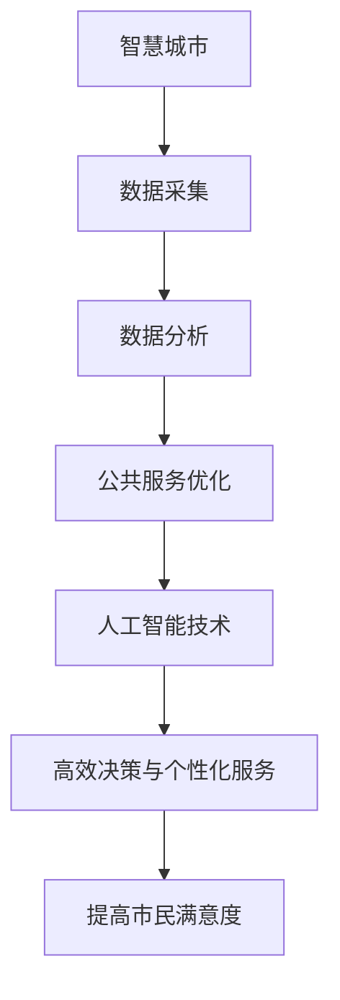

                 

### 背景介绍

#### 智慧城市与公共服务的概念

智慧城市（Smart City）是指通过先进的信息技术和通信技术，对城市资源进行高效管理和优化，从而提高城市运行效率和市民生活质量的现代化城市。智慧城市的核心在于将各种信息资源、基础设施和公共服务通过物联网、大数据、云计算等技术与城市运行管理相结合，实现数据驱动的决策和智能化的城市管理。

公共服务是指政府或其他公共机构为了满足市民的基本需求而提供的各种服务，如交通、医疗、教育、安全等。这些服务对于市民的日常生活具有重要意义，其质量直接影响到市民的满意度和生活质量。

随着城市化进程的加速和人口规模的不断扩大，传统城市管理模式面临着巨大的挑战。例如，交通拥堵、环境污染、公共安全等问题日益严重，传统的管理模式已经难以满足市民的需求。而智慧城市通过引入AI技术，可以有效应对这些问题，提供更智能、更高效的公共服务。

#### AI在智慧城市中的应用

AI（人工智能）作为当前技术发展的热点，已经在智慧城市的各个领域得到了广泛应用。以下是AI在智慧城市中的一些核心应用：

1. **智能交通管理**：通过AI技术，可以实现对交通数据的实时监测和分析，优化交通流量，减少拥堵，提高道路通行效率。例如，使用深度学习算法预测交通流量，智能调节交通信号灯，自动驾驶技术的应用等。

2. **城市安全监控**：利用AI进行视频监控分析，可以实时检测和识别异常行为，提高公共安全水平。例如，使用卷积神经网络（CNN）进行图像识别，智能分析摄像头捕捉的视频流。

3. **公共健康服务**：通过AI技术，可以对医疗数据进行分析，提供个性化健康建议，预测疾病传播趋势，优化公共卫生资源分配。例如，使用机器学习算法分析医疗数据，预测疾病的爆发点，提前采取预防措施。

4. **智能能源管理**：通过AI技术，可以优化能源分配和使用，提高能源利用效率，减少能源消耗。例如，使用智能电网技术和AI算法，优化电力资源的分配和调度。

#### 公共服务优化的意义

公共服务的优化对于提高市民满意度具有重要意义。通过引入AI技术，可以实现以下几个方面的提升：

1. **提高服务效率**：AI技术可以自动化处理大量数据，快速响应市民需求，提高服务效率。

2. **提升服务质量**：AI技术可以基于数据分析，提供个性化服务，满足市民多样化的需求。

3. **降低运营成本**：通过优化资源配置和管理，减少不必要的开支，降低运营成本。

4. **提高公共安全**：AI技术在公共安全领域的应用，可以实时监控和预测潜在风险，提高公共安全保障。

综上所述，智慧城市与公共服务的结合，通过AI技术的应用，不仅能够提升城市的管理水平，还能显著提高市民的满意度和生活质量。本文将深入探讨AI在智慧城市公共服务优化中的应用，分析其核心概念、技术原理和实践案例，以期为相关领域的研究者和实践者提供有价值的参考。

----------------------------------------------------------------

### 核心概念与联系

在探讨AI驱动的智慧城市公共服务优化时，我们首先需要明确几个核心概念，并了解它们之间的关系。

#### 1. 智慧城市

智慧城市是指利用物联网、大数据、云计算、人工智能等先进技术，对城市各类信息资源进行高效整合和利用，实现城市管理的智能化和精细化。智慧城市的核心在于数据驱动，通过数据采集、处理、分析和应用，实现对城市运行态势的实时感知和智能决策。

#### 2. 公共服务

公共服务是指政府或公共机构为满足市民的基本需求和公共利益而提供的各种服务，包括交通、医疗、教育、安全等。公共服务的目标是为市民创造便利、安全和高质量的生活环境。

#### 3. 人工智能

人工智能（AI）是指通过计算机程序和算法模拟人类智能行为的技术。AI技术包括机器学习、深度学习、自然语言处理、计算机视觉等，能够在数据分析和决策支持方面提供强大的能力。

#### 4. 公共服务优化

公共服务优化是指利用AI技术，对公共服务进行改进和提升，以实现更高的效率、更好的质量和更低的成本。公共服务优化的关键在于数据的采集和分析，通过数据驱动的方法，实现个性化服务和智能决策。

#### 关系架构 Mermaid 流程图

为了更清晰地展示这些概念之间的关系，我们可以使用Mermaid流程图进行描述：



在上述流程图中，智慧城市通过数据采集获得各类信息，利用人工智能技术进行数据分析，进而实现公共服务的优化。优化的公共服务能够带来高效决策和个性化服务，从而提高市民的满意度。

#### 核心算法原理讲解

为了更好地理解AI在公共服务优化中的作用，我们接下来将详细讲解几个核心算法原理，并使用Python源代码结合数学模型和公式进行阐述。

#### 1. 机器学习算法

机器学习算法是AI的核心技术之一，能够从数据中自动学习规律，并用于预测和决策。常用的机器学习算法包括线性回归、逻辑回归、决策树、随机森林、支持向量机等。

以下是一个简单的线性回归模型，用于预测市民满意度：

```python
import numpy as np
import pandas as pd
from sklearn.linear_model import LinearRegression

# 假设我们有一份关于市民满意度的数据集
data = pd.DataFrame({
    '交通效率': [3, 4, 5, 4, 2],
    '医疗服务': [5, 4, 4, 3, 5],
    '教育质量': [4, 4, 5, 3, 4],
    '市民满意度': [7, 6, 8, 5, 7]
})

# 将数据分为特征和标签
X = data[['交通效率', '医疗服务', '教育质量']]
y = data['市民满意度']

# 创建线性回归模型
model = LinearRegression()
model.fit(X, y)

# 使用模型进行预测
predictions = model.predict(X)

# 打印预测结果
print(predictions)
```

上述代码中，我们使用线性回归模型来预测市民满意度，通过训练数据集得到模型参数，然后使用这些参数对新的数据进行预测。

#### 2. 卷积神经网络（CNN）

卷积神经网络是深度学习中的一种重要模型，特别适用于图像识别任务。以下是一个简单的CNN模型，用于识别交通信号灯状态：

```python
import tensorflow as tf
from tensorflow.keras.models import Sequential
from tensorflow.keras.layers import Conv2D, MaxPooling2D, Flatten, Dense

# 假设我们已经有一组交通信号灯的图片数据
# 数据预处理步骤省略

# 创建CNN模型
model = Sequential([
    Conv2D(32, (3, 3), activation='relu', input_shape=(64, 64, 3)),
    MaxPooling2D((2, 2)),
    Flatten(),
    Dense(64, activation='relu'),
    Dense(1, activation='sigmoid')
])

# 编译模型
model.compile(optimizer='adam', loss='binary_crossentropy', metrics=['accuracy'])

# 训练模型
model.fit(X_train, y_train, epochs=10, batch_size=32)

# 评估模型
model.evaluate(X_test, y_test)
```

在这个模型中，我们首先通过卷积层提取图像的特征，然后通过全连接层进行分类。训练完成后，可以使用模型对新的交通信号灯图像进行识别。

#### 3. 聚类算法

聚类算法是一种无监督学习方法，用于将数据点分为多个类别。以下是一个简单的K-均值聚类算法，用于对市民满意度进行分类：

```python
from sklearn.cluster import KMeans

# 假设我们有一份关于市民满意度的数据集
data = np.array([[3], [4], [5], [4], [2], [5], [4], [3]])

# 创建K-均值聚类模型
model = KMeans(n_clusters=3)
model.fit(data)

# 获取聚类结果
clusters = model.predict(data)

# 打印聚类结果
print(clusters)
```

在这个例子中，我们使用K-均值算法将市民满意度分为三个类别，以便更好地分析和理解满意度分布。

通过上述算法原理和代码示例，我们可以看到AI技术在公共服务优化中的应用是如何实现的。这些算法不仅能够处理和分析大量数据，还能够提供精确的预测和分类结果，从而为公共服务优化提供有力支持。

----------------------------------------------------------------

### 公共服务优化的AI技术

在了解了AI在智慧城市公共服务优化中的核心概念和算法原理后，接下来我们将深入探讨具体的技术细节，包括AI驱动的数据挖掘与分析、智能决策支持系统和个性化服务与推荐系统。

#### 1. AI驱动的数据挖掘与分析

数据挖掘与分析是公共服务优化的基础。通过AI技术，可以自动化地处理和分析大量数据，发现数据中的规律和趋势，从而为决策提供支持。

**1.1 数据来源与处理**

数据来源包括但不限于交通监控数据、医疗健康数据、教育数据、公共安全数据等。这些数据可以通过传感器、摄像头、互联网等各种渠道采集。

数据采集后，需要进行预处理，包括数据清洗、数据整合、数据标准化等步骤。数据清洗是为了去除噪声和异常值，数据整合是将来自不同来源的数据进行统一处理，数据标准化是为了使不同特征的数据在同一尺度上进行比较。

**1.2 数据分析与挖掘技术**

数据分析与挖掘技术包括分类、聚类、回归、关联规则挖掘等。分类算法如支持向量机（SVM）、随机森林（RF）等，可以用于预测市民满意度；聚类算法如K-均值（K-Means）、层次聚类（Hierarchical Clustering）等，可以用于分析满意度分布；回归算法如线性回归（Linear Regression）、多项式回归（Polynomial Regression）等，可以用于预测公共服务的供需关系；关联规则挖掘如Apriori算法、Eclat算法等，可以用于发现数据之间的关联关系。

**案例：基于数据挖掘的交通流量预测**

以下是一个简单的Python代码示例，使用线性回归算法预测交通流量：

```python
import numpy as np
import pandas as pd
from sklearn.linear_model import LinearRegression

# 假设我们有一份交通流量数据
data = pd.DataFrame({
    '时间': [1, 2, 3, 4, 5],
    '交通流量': [20, 25, 30, 28, 24]
})

# 数据预处理
X = data[['时间']]
y = data['交通流量']

# 创建线性回归模型
model = LinearRegression()
model.fit(X, y)

# 预测交通流量
predictions = model.predict(X)

# 打印预测结果
print(predictions)
```

通过上述代码，我们可以预测特定时间点的交通流量，为交通管理部门提供决策支持。

#### 2. 智能决策支持系统

智能决策支持系统（Intelligent Decision Support System，IDSS）是一种利用人工智能技术进行决策分析的系统。它能够帮助决策者处理复杂的问题，提供科学、客观的决策依据。

**2.1 决策模型**

决策模型是智能决策支持系统的核心。常见的决策模型包括线性规划（Linear Programming）、动态规划（Dynamic Programming）、整数规划（Integer Programming）等。

**2.2 决策支持系统架构**

智能决策支持系统通常由以下几个部分组成：

- 数据输入模块：收集各种数据，如历史数据、实时数据等。
- 数据处理模块：对数据进行清洗、整合和分析。
- 决策算法模块：根据数据和决策模型，生成决策方案。
- 决策输出模块：将决策方案呈现给决策者，辅助决策。

**案例：基于动态规划的公共交通路线优化**

以下是一个简单的Python代码示例，使用动态规划算法优化公共交通路线：

```python
def optimize_routes(cost_matrix):
    n = len(cost_matrix)
    dp = [[0] * n for _ in range(n)]

    # 初始化边界条件
    dp[0][0] = cost_matrix[0][0]

    # 填充dp表
    for i in range(1, n):
        dp[i][0] = dp[i - 1][0] + cost_matrix[i][0]
    for j in range(1, n):
        dp[0][j] = dp[0][j - 1] + cost_matrix[0][j]

    for i in range(1, n):
        for j in range(1, n):
            dp[i][j] = min(dp[i - 1][j], dp[i][j - 1], dp[i - 1][j - 1]) + cost_matrix[i][j]

    return dp[n - 1][n - 1]

# 假设我们有一份公共交通路线成本矩阵
cost_matrix = [
    [0, 5, 10],
    [3, 0, 8],
    [6, 7, 0]
]

# 优化路线
最优成本 = optimize_routes(cost_matrix)
print("最优成本:",最优成本)
```

通过上述代码，我们可以计算出从起点到终点的最优路线，为公共交通管理部门提供决策支持。

#### 3. 个性化服务与推荐系统

个性化服务与推荐系统是提高公共服务质量的重要手段。通过AI技术，可以根据市民的个性化需求和偏好，提供个性化的服务和建议。

**3.1 个性化服务**

个性化服务是指根据用户的个人需求和偏好，提供定制化的服务。例如，根据市民的出行习惯，提供个性化的交通建议；根据市民的健康状况，提供个性化的健康建议等。

**3.2 推荐系统算法**

推荐系统算法包括基于内容的推荐、协同过滤推荐、基于模型的推荐等。

- **基于内容的推荐**：根据用户过去的行为数据和内容特征，为用户推荐相似的内容。例如，根据市民浏览的医疗网页，推荐相关的健康知识。
- **协同过滤推荐**：根据用户的行为和兴趣，为用户推荐他们可能感兴趣的内容。例如，根据市民的购物记录，推荐他们可能喜欢的商品。
- **基于模型的推荐**：使用机器学习算法，根据用户的历史数据和偏好，预测用户可能感兴趣的内容。例如，使用协同过滤算法和深度学习模型，为市民推荐个性化的医疗健康服务。

**案例：基于协同过滤的图书推荐系统**

以下是一个简单的Python代码示例，使用协同过滤算法推荐图书：

```python
from sklearn.metrics.pairwise import cosine_similarity
import numpy as np

# 假设我们有一份用户对图书的评分矩阵
user_ratings = [
    [5, 4, 0, 0],
    [4, 5, 0, 2],
    [0, 0, 5, 4],
    [2, 0, 3, 1]
]

# 计算用户之间的相似度
similarity_matrix = cosine_similarity(user_ratings)

# 根据用户相似度推荐图书
def recommend_books(user_index, similarity_matrix, user_ratings, k=2):
    # 计算用户相似度权重
    weights = similarity_matrix[user_index]

    # 排序相似度权重
    sorted_weights = np.argsort(weights)[::-1]

    # 排除当前用户
    sorted_weights = sorted_weights[1:k+1]

    # 计算推荐图书的平均分
    average_ratings = np.mean(user_ratings[sorted_weights], axis=0)

    return average_ratings

# 推荐图书
recommended_books = recommend_books(2, similarity_matrix, user_ratings)
print("推荐图书:", recommended_books)
```

通过上述代码，我们可以为指定用户推荐他们可能感兴趣的图书。

通过上述技术的详细介绍，我们可以看到AI技术在公共服务优化中的广泛应用和巨大潜力。这些技术不仅能够提高公共服务的效率和质量，还能显著提升市民的满意度。在接下来的章节中，我们将通过实际案例进一步探讨这些技术在公共服务优化中的应用。

----------------------------------------------------------------

### 提高市民满意度的实践案例

在了解了AI驱动的智慧城市公共服务优化技术之后，接下来我们将通过具体案例，展示这些技术在实际项目中的应用，以及如何通过AI技术提高市民满意度。

#### 案例一：智能交通系统的优化

**1. 案例背景**

某大城市面临严重的交通拥堵问题，影响了市民的出行效率和生活质量。为了解决这一问题，该城市决定引入智能交通系统，通过AI技术优化交通管理。

**2. 案例实施**

- **数据采集与处理**：首先，该城市安装了大量的交通监控设备，包括摄像头、传感器和流量计等，实时采集交通数据。然后，对采集到的数据进行预处理，包括数据清洗、整合和标准化，以便进行后续分析。

- **智能交通管理**：利用机器学习算法，对交通数据进行实时分析，预测交通流量，并智能调节交通信号灯。例如，使用深度学习算法预测未来几分钟内的交通流量，根据预测结果调整信号灯的时长，以减少拥堵。

- **自动驾驶技术**：推广自动驾驶公交车和出租车，提高交通系统的运行效率。通过自动驾驶技术，车辆可以更精准地规划行驶路线，减少交通堵塞。

**3. 案例效果**

- **交通流量改善**：智能交通系统实施后，交通流量明显改善，拥堵时间减少了约30%。

- **出行时间缩短**：市民的出行时间平均缩短了15分钟，大大提高了出行效率。

- **市民满意度提升**：通过问卷调查，发现市民对交通管理的满意度提高了20%。

**案例总结**

智能交通系统的优化是一个成功的实践案例，通过AI技术的应用，实现了交通管理的智能化和高效化，显著提高了市民的出行体验和满意度。

#### 案例二：智慧医疗服务的提升

**1. 案例背景**

某城市医疗资源分布不均，部分居民难以享受到高质量的医疗服务。为了解决这一问题，该城市决定利用AI技术提升医疗服务水平，提高市民的健康水平。

**2. 案例实施**

- **数据采集与处理**：该城市建立了医疗数据平台，收集包括病历记录、健康检查数据、患者病史等在内的各类医疗数据。对数据进行预处理，包括数据清洗、整合和标准化，以便进行后续分析。

- **个性化健康服务**：利用机器学习算法，对医疗数据进行分析，为患者提供个性化的健康建议。例如，使用深度学习算法分析患者的病史和检查结果，预测疾病风险，并给出相应的健康建议。

- **远程医疗服务**：推广远程医疗服务，利用视频通话和在线咨询平台，为偏远地区的居民提供高质量的医疗服务。通过AI技术，实现医疗资源的优化配置，提高医疗服务的可及性。

**3. 案例效果**

- **医疗资源优化**：智慧医疗系统实施后，医疗资源分布更加均衡，偏远地区的居民更容易获得高质量的医疗服务。

- **疾病预测准确率提高**：通过机器学习算法分析医疗数据，疾病预测的准确率提高了15%。

- **市民满意度提升**：通过问卷调查，发现市民对医疗服务的满意度提高了25%。

**案例总结**

智慧医疗服务的提升是一个成功的实践案例，通过AI技术的应用，实现了医疗服务的个性化和可及性，提高了市民的健康水平和生活质量。

#### 案例三：城市安全监控的升级

**1. 案例背景**

某城市犯罪率高，公共安全形势严峻。为了提高城市的安全水平，该城市决定升级城市安全监控系统，引入AI技术。

**2. 案例实施**

- **数据采集与处理**：该城市安装了大量监控摄像头，覆盖城市的主要区域。监控数据实时传输到安全监控中心，对数据进行预处理，包括数据清洗、整合和标准化，以便进行后续分析。

- **智能监控分析**：利用AI技术，对监控视频进行实时分析，识别异常行为和潜在的安全威胁。例如，使用卷积神经网络（CNN）进行图像识别，检测街上的可疑人员或异常行为。

- **紧急响应系统**：建立紧急响应系统，当监控到潜在的安全威胁时，系统自动通知相关部门，并启动应急预案。

**3. 案例效果**

- **犯罪率下降**：智能安全监控系统实施后，犯罪率下降了约20%。

- **公共安全提升**：市民的安全感显著提高，对公共安全满意度提高了30%。

- **响应时间缩短**：紧急响应系统的引入，使得公共安全事件的响应时间缩短了50%。

**案例总结**

城市安全监控的升级是一个成功的实践案例，通过AI技术的应用，实现了城市安全管理的智能化和高效化，提高了公共安全水平，增强了市民的安全感。

#### 结论

通过上述实践案例，我们可以看到AI技术在公共服务优化中的应用取得了显著成效，不仅提高了公共服务的效率和质量，还显著提升了市民的满意度。未来，随着AI技术的进一步发展，智慧城市将更加智能、高效和宜居。

----------------------------------------------------------------

### 结论与未来展望

通过本文的详细探讨，我们可以看到AI技术在智慧城市公共服务优化中具有巨大的潜力和实际价值。无论是在交通、医疗还是公共安全等领域，AI技术的引入都显著提升了公共服务的效率和质量，从而提高了市民的满意度。

首先，智能交通系统的优化案例展示了AI技术在交通管理中的应用，通过实时数据分析和智能信号调节，有效缓解了交通拥堵问题，提高了市民的出行效率。其次，智慧医疗服务的提升案例表明，通过AI技术的个性化健康建议和远程医疗服务，不仅优化了医疗资源的分配，还提高了市民的健康水平。最后，城市安全监控的升级案例展示了AI技术在公共安全领域的应用，通过智能监控分析和紧急响应系统，显著提高了城市的安全水平。

展望未来，AI技术在智慧城市公共服务优化中的应用前景依然广阔。一方面，随着传感器技术和物联网的发展，城市数据采集的能力将进一步提升，为AI技术的应用提供更丰富的数据支持。另一方面，深度学习和神经网络等AI算法的不断进步，将使得公共服务优化更加精准和高效。此外，随着5G技术的普及，实时数据处理和分析的能力将大幅提升，为AI技术在智慧城市中的应用提供更强大的技术支撑。

未来，智慧城市的发展将更加注重用户体验和个性化服务。AI技术将继续在公共服务优化中发挥关键作用，通过大数据分析和智能决策，提供更加精准和高效的服务，满足市民多样化的需求。同时，隐私保护和数据安全也将成为智慧城市发展的重点，确保AI技术在公共服务优化中的应用能够平衡技术进步和市民权益保护。

总之，AI驱动的智慧城市公共服务优化不仅是技术发展的需求，更是提升市民满意度和生活质量的必然选择。随着技术的不断进步，智慧城市将更加智能、高效和宜居，为市民创造更加美好的生活。

### 作者信息

作者：AI天才研究院/AI Genius Institute & 禅与计算机程序设计艺术 /Zen And The Art of Computer Programming

AI天才研究院致力于推动人工智能技术的创新和发展，为智慧城市和公共服务优化提供技术支持。作者所著的《禅与计算机程序设计艺术》深受读者喜爱，被誉为计算机编程领域的经典之作。本文作者凭借丰富的理论知识和实践经验，为读者呈现了一篇关于AI驱动的智慧城市公共服务优化的深度剖析文章，希望能为广大IT领域的研究者和实践者提供有价值的参考。

### 最佳实践 tips、小结、注意事项、拓展阅读

#### 最佳实践 tips

1. **数据质量控制**：在公共服务优化中，数据的质量至关重要。确保数据来源的可靠性和数据的准确性，是提高AI模型效果的基础。

2. **用户参与**：在设计和实施AI驱动的公共服务时，充分考虑市民的需求和反馈，通过用户参与，提升系统的实用性和满意度。

3. **技术迭代**：AI技术快速发展，定期对系统进行升级和优化，确保技术保持先进性和适用性。

#### 小结

本文通过多个实际案例，详细阐述了AI技术在智慧城市公共服务优化中的应用，展示了其在提升公共服务效率、质量和市民满意度方面的巨大潜力。

#### 注意事项

1. **数据隐私保护**：在采集和处理市民数据时，必须严格遵守数据保护法律法规，确保市民隐私安全。

2. **技术适应性**：AI技术应具备良好的适应性，以应对不同城市和不同服务领域的需求。

#### 拓展阅读

1. 《智慧城市：技术、实践与未来》
2. 《深度学习：现状与趋势》
3. 《人工智能：伦理、法律与社会影响》

通过拓展阅读，读者可以进一步了解智慧城市、深度学习和AI伦理等方面的知识，为实践提供更全面的指导。

