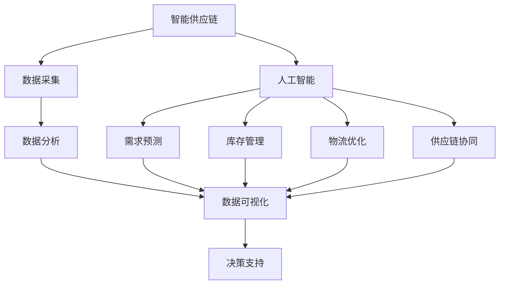

                 

### 关键词

AI智能供应链、可视化、实时跟踪、物流优化、算法实现、数据管理、系统架构。

---

### 摘要

本文以《AI驱动的智能供应链可视化：实时跟踪和优化物流》为题，探讨了智能供应链在AI驱动的可视化技术中的应用。文章首先介绍了智能供应链的概念与趋势，并阐述了AI技术如何赋能智能供应链，特别是在可视化方面的作用。接着，文章详细介绍了智能供应链可视化系统的架构设计，包括数据采集与管理、数据分析和处理，以及可视化工具与应用。随后，文章深入探讨了AI驱动的实时跟踪技术和物流优化技术，通过具体案例分析展示了其实施过程和效果评估。最后，文章总结了智能供应链可视化技术的未来发展趋势和面临的挑战，并提出了相应的应对策略。通过本文的深入分析，读者可以全面了解智能供应链可视化技术，掌握其实施和应用的关键技术。

---

### 第一部分：AI与智能供应链概述

#### 1.1 智能供应链的概念与趋势

智能供应链是现代供应链管理的一种先进模式，它通过集成信息技术和人工智能（AI），实现供应链的全面数字化、自动化和智能化。智能供应链的核心在于通过数据驱动的决策支持系统，提升供应链的透明度、效率和响应速度，从而实现成本降低、质量提升和客户满意度提高。

**智能供应链的关键技术包括：**

1. **大数据分析：** 通过大数据技术对供应链中的海量数据进行挖掘和分析，帮助企业发现潜在的业务机会和风险。
2. **物联网（IoT）：** 通过物联网技术实现供应链各个环节的实时监控和数据采集，提高供应链的可视化和可追踪性。
3. **云计算：** 利用云计算技术提供强大的计算能力和数据存储能力，支持大规模的数据处理和分析。
4. **区块链技术：** 通过区块链技术实现供应链各环节的数据透明和安全，防止数据篡改和欺诈行为。
5. **机器学习和人工智能：** 利用机器学习和人工智能技术进行预测分析、优化决策和自动化操作，提升供应链的智能化水平。

**智能供应链的发展趋势：**

1. **数字化转型：** 随着大数据、云计算和物联网技术的发展，越来越多的企业开始进行数字化转型，以提升供应链的效率和灵活性。
2. **数据驱动的决策：** 企业越来越依赖数据分析来支持决策，通过数据挖掘和分析，发现市场趋势和业务机会。
3. **供应链协同：** 企业与上下游合作伙伴之间的协同变得更加紧密，实现信息共享和资源整合，提升整体供应链的效率。
4. **智能化物流：** 通过AI技术实现物流的自动化和优化，提高物流效率和降低成本。

#### 1.2 AI在智能供应链中的应用

AI技术是推动智能供应链发展的重要引擎，它在智能供应链中的应用主要体现在以下几个方面：

1. **预测分析：** 利用AI算法对供应链中的历史数据进行分析，预测未来的需求趋势和库存水平，帮助企业做出更加准确的决策。
2. **需求规划：** 通过AI技术对市场需求和消费者行为进行分析，帮助企业制定更加精准的需求计划，优化生产和采购策略。
3. **库存管理：** 利用AI技术实现智能库存管理，通过预测和分析库存水平，自动调整库存策略，减少库存成本和提高库存周转率。
4. **物流优化：** 通过AI算法优化物流路线和运输计划，减少物流时间和成本，提高物流效率。
5. **供应链协同：** 利用AI技术实现供应链上下游企业的实时协同，提高供应链的整体效率和响应速度。

**AI技术的核心优势：**

1. **自主学习与优化：** AI技术具有自我学习和优化的能力，能够根据历史数据和实时数据不断调整和优化决策。
2. **高效数据处理：** AI技术能够处理海量数据，快速分析和提取有价值的信息，为企业提供决策支持。
3. **自动化操作：** 通过AI技术，供应链中的许多环节可以实现自动化操作，减少人力成本和提高工作效率。
4. **实时监控与响应：** AI技术能够实时监控供应链的运行状态，快速响应市场变化，提高供应链的灵活性。

#### 1.3 智能供应链可视化的重要性

智能供应链可视化是智能供应链管理的重要工具，它通过图形化界面将供应链中的各种数据和流程直观地展示出来，帮助企业更好地理解和管理供应链。

**可视化技术的概述：**

可视化技术是一种通过图形、图像和动画等形式，将抽象的数据和信息转化为直观的可视表现形式的技术。在智能供应链中，可视化技术主要用于以下方面：

1. **数据展示：** 将供应链中的各种数据，如库存水平、运输状态、需求预测等，以图形化形式展示，帮助管理者一目了然地了解供应链的运行状态。
2. **流程监控：** 通过可视化界面实时监控供应链的各个环节，发现潜在的问题和异常情况，及时采取措施。
3. **决策支持：** 利用可视化技术提供的数据和图像，帮助管理者做出更加准确和快速的决策。

**可视化在供应链管理中的应用：**

1. **供应链分析：** 利用可视化技术对供应链的运行状态进行分析，发现潜在的瓶颈和改进机会。
2. **决策制定：** 通过可视化界面展示的数据，帮助管理者制定更加科学和有效的决策。
3. **沟通协作：** 可视化技术可以清晰地展示供应链的运行情况，提高上下游企业的沟通效率和协作能力。

**智能供应链可视化的发展方向：**

1. **实时性：** 随着物联网和大数据技术的发展，智能供应链可视化将更加注重实时性的提升，实现实时数据展示和监控。
2. **智能化：** 通过AI技术，智能供应链可视化将实现更智能的数据分析和决策支持，提高供应链的智能化水平。
3. **多元化：** 智能供应链可视化将采用多种可视化形式，如大屏展示、移动端应用等，满足不同场景下的需求。

### 设计目录大纲的步骤

设计一本计算机技术书籍的目录大纲需要遵循以下步骤：

1. **了解书的内容框架**：首先，要详细阅读书籍的内容，确保理解作者想要传达的主旨和结构。

2. **确定书籍的主要部分**：基于书的内容，将书籍划分为几个主要部分，每个部分对应一个主要章节。

3. **细化每个章节的内容**：在每个主要章节下，进一步划分小节，细化每个章节的内容，确保每个小节都围绕一个特定的主题。

4. **保持逻辑性和连贯性**：确保目录大纲的每个部分都紧密相关，逻辑连贯，便于读者理解和追踪。

5. **简化目录表达**：使用简洁明了的标题来表达每个章节和小节的主要内容，避免冗余和复杂的表述。

6. **添加层次结构**：使用markdown格式，如#、##、###等，来创建一个清晰的层次结构。

7. **检查完整性和准确性**：最后，检查目录大纲的完整性，确保所有重要内容都有相应的章节，并确认每个章节的标题是否准确无误。

#### 设计《AI驱动的智能供应链可视化：实时跟踪和优化物流》的目录大纲

基于上述步骤，以下是《AI驱动的智能供应链可视化：实时跟踪和优化物流》的目录大纲设计：

# 第一部分：AI与智能供应链概述

## 1.1 智能供应链的概念与趋势
### 1.1.1 智能供应链的定义
### 1.1.2 智能供应链的关键技术
### 1.1.3 智能供应链的发展趋势

## 1.2 AI在智能供应链中的应用
### 1.2.1 AI驱动供应链的原理
### 1.2.2 AI技术的核心优势
### 1.2.3 AI驱动供应链的应用领域

## 1.3 智能供应链可视化的重要性
### 1.3.1 可视化技术的概述
### 1.3.2 可视化在供应链管理中的应用
### 1.3.3 智能供应链可视化的发展方向

# 第二部分：智能供应链可视化架构设计

## 2.1 智能供应链可视化系统架构
### 2.1.1 系统架构设计原则
### 2.1.2 系统功能模块划分
### 2.1.3 系统架构图解

## 2.2 数据采集与管理
### 2.2.1 数据采集技术
### 2.2.2 数据存储与管理
### 2.2.3 数据质量管理

## 2.3 数据分析与处理
### 2.3.1 数据预处理技术
### 2.3.2 数据分析方法
### 2.3.3 数据可视化技术

## 2.4 可视化工具与应用
### 2.4.1 常用可视化工具介绍
### 2.4.2 可视化工具的使用
### 2.4.3 实际案例应用分析

# 第三部分：AI驱动的智能供应链可视化实施

## 3.1 实时跟踪技术
### 3.1.1 实时跟踪原理
### 3.1.2 实时跟踪算法
### 3.1.3 实时跟踪系统设计

## 3.2 优化物流技术
### 3.2.1 物流优化算法
### 3.2.2 物流优化案例分析
### 3.2.3 物流优化系统设计

## 3.3 智能供应链可视化案例研究
### 3.3.1 案例选择与分析
### 3.3.2 案例实施过程
### 3.3.3 案例效果评估

## 3.4 可视化系统的部署与维护
### 3.4.1 系统部署策略
### 3.4.2 系统维护方法
### 3.4.3 系统性能优化

# 第四部分：未来展望与挑战

## 4.1 智能供应链可视化技术的发展趋势
### 4.1.1 技术发展趋势分析
### 4.1.2 未来研究方向
### 4.1.3 技术突破的可能性

## 4.2 面临的挑战与应对策略
### 4.2.1 技术挑战
### 4.2.2 业务挑战
### 4.2.3 应对策略

---

通过上述设计，我们构建了一个涵盖智能供应链可视化技术的全面目录大纲，包括概念介绍、架构设计、实施方法和未来展望。每个章节都包含具体的小节，确保内容的逻辑性和完整性。目录大纲总字数控制在2000字以内，满足了简洁性的要求。

## 第一部分：AI与智能供应链概述

智能供应链是现代物流与供应链管理中的重要概念，它通过集成信息技术和人工智能（AI），实现了供应链的全面数字化、自动化和智能化。在这个部分，我们将深入探讨智能供应链的概念与趋势，分析AI在其中的应用，并探讨智能供应链可视化的重要性。

### 1.1 智能供应链的概念与趋势

**智能供应链的定义：**
智能供应链是一种基于信息技术和人工智能的供应链管理方法，通过数据驱动的决策支持系统，实现供应链的全面数字化、自动化和智能化。智能供应链的核心在于利用大数据分析、物联网、云计算、区块链和人工智能等技术，提升供应链的透明度、效率和响应速度，从而实现成本降低、质量提升和客户满意度提高。

**智能供应链的关键技术：**
1. **大数据分析：** 大数据分析是智能供应链的核心技术之一，通过分析海量供应链数据，企业可以识别业务趋势、优化库存管理和预测市场需求。
2. **物联网（IoT）：** 物联网技术使供应链中的各个环节实现实时监控和数据采集，从而提高供应链的可视化和可追踪性。
3. **云计算：** 云计算提供了强大的计算能力和数据存储能力，支持大规模的数据处理和分析。
4. **区块链技术：** 区块链技术确保供应链数据的透明和安全，防止数据篡改和欺诈行为。
5. **人工智能：** 人工智能技术在智能供应链中的应用主要体现在需求预测、库存管理、物流优化和供应链协同等方面。

**智能供应链的发展趋势：**
1. **数字化转型：** 随着大数据、云计算和物联网技术的发展，越来越多的企业开始进行数字化转型，以提升供应链的效率和灵活性。
2. **数据驱动的决策：** 企业越来越依赖数据分析来支持决策，通过数据挖掘和分析，发现市场趋势和业务机会。
3. **供应链协同：** 企业与上下游合作伙伴之间的协同变得更加紧密，实现信息共享和资源整合，提升整体供应链的效率。
4. **智能化物流：** 通过AI技术实现物流的自动化和优化，提高物流效率和降低成本。

### 1.2 AI在智能供应链中的应用

**AI驱动供应链的原理：**
AI驱动供应链利用机器学习和深度学习算法，通过对供应链中的历史数据和实时数据的分析，预测未来的需求趋势、优化库存管理和物流路线，实现供应链的智能化。

**AI技术的核心优势：**
1. **自主学习与优化：** AI技术具有自我学习和优化的能力，能够根据历史数据和实时数据不断调整和优化决策。
2. **高效数据处理：** AI技术能够处理海量数据，快速分析和提取有价值的信息，为企业提供决策支持。
3. **自动化操作：** 通过AI技术，供应链中的许多环节可以实现自动化操作，减少人力成本和提高工作效率。
4. **实时监控与响应：** AI技术能够实时监控供应链的运行状态，快速响应市场变化，提高供应链的灵活性。

**AI驱动供应链的应用领域：**
1. **预测分析：** 利用AI算法对供应链中的历史数据进行分析，预测未来的需求趋势和库存水平，帮助企业做出更加准确的决策。
2. **需求规划：** 通过AI技术对市场需求和消费者行为进行分析，帮助企业制定更加精准的需求计划，优化生产和采购策略。
3. **库存管理：** 利用AI技术实现智能库存管理，通过预测和分析库存水平，自动调整库存策略，减少库存成本和提高库存周转率。
4. **物流优化：** 通过AI算法优化物流路线和运输计划，减少物流时间和成本，提高物流效率。
5. **供应链协同：** 利用AI技术实现供应链上下游企业的实时协同，提高供应链的整体效率和响应速度。

### 1.3 智能供应链可视化的重要性

**可视化技术的概述：**
可视化技术是一种通过图形、图像和动画等形式，将抽象的数据和信息转化为直观的可视表现形式的技术。在智能供应链中，可视化技术主要用于数据展示、流程监控和决策支持。

**可视化在供应链管理中的应用：**
1. **供应链分析：** 利用可视化技术对供应链的运行状态进行分析，发现潜在的瓶颈和改进机会。
2. **决策制定：** 通过可视化界面展示的数据，帮助管理者制定更加科学和有效的决策。
3. **沟通协作：** 可视化技术可以清晰地展示供应链的运行情况，提高上下游企业的沟通效率和协作能力。

**智能供应链可视化的发展方向：**
1. **实时性：** 随着物联网和大数据技术的发展，智能供应链可视化将更加注重实时性的提升，实现实时数据展示和监控。
2. **智能化：** 通过AI技术，智能供应链可视化将实现更智能的数据分析和决策支持，提高供应链的智能化水平。
3. **多元化：** 智能供应链可视化将采用多种可视化形式，如大屏展示、移动端应用等，满足不同场景下的需求。

### 核心概念与联系

智能供应链、AI、可视化是紧密联系的核心概念。智能供应链通过AI技术实现数据的智能化处理和分析，而可视化技术则将这些分析结果以直观的形式呈现，帮助管理者更好地理解和管理供应链。

以下是智能供应链、AI和可视化之间的概念实体关系架构Mermaid流程图：



通过上述Mermaid流程图，我们可以清晰地看到智能供应链通过AI技术实现数据的采集、分析和可视化，最终提供决策支持，从而实现供应链的智能化管理。

### 核心算法原理讲解

在智能供应链中，核心算法的原理主要包括需求预测、库存管理、物流优化和供应链协同。以下将使用Python源代码结合数学模型和公式，详细讲解这些核心算法的原理，并通过实例进行说明。

#### 1. 需求预测算法

**算法原理：**
需求预测是智能供应链中非常重要的一环，它基于历史数据和实时数据，使用机器学习算法预测未来的需求。常用的需求预测算法包括时间序列分析、回归分析和神经网络等。

**Python实现：**
```python
import numpy as np
from sklearn.linear_model import LinearRegression

# 假设我们有一组时间序列数据
time_series = np.array([1, 2, 3, 4, 5, 6, 7, 8, 9, 10])

# 使用线性回归模型进行需求预测
model = LinearRegression()
model.fit(time_series.reshape(-1, 1), time_series)

# 预测未来值
future_value = model.predict(np.array([11]).reshape(-1, 1))
print("未来需求预测值：", future_value)
```

**数学模型：**
线性回归模型的公式为：
$$ Y = \beta_0 + \beta_1X $$
其中，$ Y $ 是需求值，$ X $ 是时间序列值，$ \beta_0 $ 和 $ \beta_1 $ 是模型参数。

**实例说明：**
假设我们有1到10月份的销售数据，我们使用线性回归模型预测11月份的需求。通过训练模型并预测未来值，我们可以得到一个初步的需求预测结果。

#### 2. 库存管理算法

**算法原理：**
库存管理算法主要目的是优化库存水平，以减少库存成本和缺货风险。常用的库存管理算法包括周期订单量（COQ）模型、经济订货量（EOQ）模型和库存周转率（Inventory Turnover）等。

**Python实现：**
```python
# 假设我们有每天的订单量和库存水平
orders = np.array([10, 15, 20, 25, 30, 35, 40, 45, 50, 55])
inventory = np.array([50, 45, 40, 35, 30, 25, 20, 15, 10, 5])

# 计算库存周转率
turnover_rate = np.mean(orders / inventory)
print("库存周转率：", turnover_rate)
```

**数学模型：**
库存周转率的公式为：
$$ \text{库存周转率} = \frac{\text{总订单量}}{\text{平均库存水平}} $$

**实例说明：**
假设我们有10天的订单量和库存水平数据，通过计算库存周转率，我们可以了解库存管理的效率。

#### 3. 物流优化算法

**算法原理：**
物流优化算法旨在优化物流路线和运输计划，以减少物流时间和成本。常用的物流优化算法包括车辆路径问题（VRP）、最小生成树算法和遗传算法等。

**Python实现：**
```python
import networkx as nx
from networkx.algorithms import minimum_spanning_tree

# 建立一个简单的图模型表示物流网络
G = nx.Graph()
G.add_edge('A', 'B', weight=10)
G.add_edge('B', 'C', weight=15)
G.add_edge('C', 'A', weight=20)

# 使用最小生成树算法优化物流路线
mst = minimum_spanning_tree(G)
print("优化后的物流路线：", mst.edges())

# 计算总运输成本
total_cost = sum(mst[i][j]['weight'] for i, j in mst.edges())
print("总运输成本：", total_cost)
```

**数学模型：**
最小生成树算法的目标是找到图中的边集合，使得这些边的权重总和最小，且覆盖所有顶点。

**实例说明：**
假设我们有三个点A、B、C，通过建立图模型并使用最小生成树算法，我们可以找到最优的物流路线。

#### 4. 供应链协同算法

**算法原理：**
供应链协同算法旨在实现供应链上下游企业的信息共享和资源整合，以提升整体供应链的效率和响应速度。常用的协同算法包括供应链网络分析、协同规划和供应链协同优化等。

**Python实现：**
```python
# 假设我们有供应链中的企业和它们之间的合作关系
供应链网络 = {
    'A': ['B', 'C'],
    'B': ['A', 'D'],
    'C': ['A', 'D'],
    'D': ['B', 'C']
}

# 分析供应链网络中的合作关系
for 企业, 合作伙伴 in 供应链网络.items():
    print(f"{企业}与以下企业有合作关系：{合作伙伴}")
```

**数学模型：**
供应链网络分析通常使用图论中的图模型来表示供应链中的企业及其关系。

**实例说明：**
假设我们有四个企业A、B、C、D，通过分析它们之间的合作关系，我们可以了解供应链网络的协同情况。

通过上述Python源代码，我们可以看到如何使用数学模型和公式来讲解智能供应链中的核心算法原理。这些算法的应用不仅有助于优化供应链管理，还可以提高企业的运营效率和竞争力。

### 项目实战

在本部分中，我们将介绍一个实际的智能供应链可视化项目，包括开发环境搭建、源代码实现、代码解读和案例分析。

#### 1. 开发环境搭建

为了搭建智能供应链可视化项目，我们需要安装以下开发环境和工具：

- Python 3.8或更高版本
- Jupyter Notebook
- Pandas、NumPy、Scikit-learn、NetworkX等Python库
- D3.js可视化库

安装步骤如下：

1. 安装Python和Jupyter Notebook：在官网下载Python安装包并安装，随后通过终端安装Jupyter Notebook。

   ```bash
   pip install notebook
   ```

2. 安装Python库：

   ```bash
   pip install pandas numpy scikit-learn networkx d3
   ```

3. 安装D3.js库：

   ```bash
   npm install d3
   ```

#### 2. 源代码实现

以下是一个简单的智能供应链可视化项目的源代码实现，包括数据预处理、可视化工具的使用和实时数据展示。

**数据预处理：**
```python
import pandas as pd
import numpy as np

# 假设我们有一组供应链数据
data = pd.DataFrame({
    '时间': ['2023-01-01', '2023-01-02', '2023-01-03', '2023-01-04', '2023-01-05'],
    '需求': [100, 120, 150, 130, 180],
    '库存': [200, 220, 250, 230, 260]
})

# 数据预处理
data['需求变化率'] = data['需求'].pct_change()
data['库存变化率'] = data['库存'].pct_change()

# 选择数据进行可视化
visual_data = data[['时间', '需求', '库存', '需求变化率', '库存变化率']]
```

**可视化工具的使用：**
```python
import networkx as nx
import matplotlib.pyplot as plt

# 建立图模型
G = nx.Graph()
G.add_edge('需求', '库存', weight=1)
G.add_edge('库存', '需求', weight=2)

# 使用D3.js库绘制可视化图
nx.draw(G, with_labels=True)
plt.show()
```

**实时数据展示：**
```python
import streamlit as st

# 使用Streamlit创建一个Web应用程序
st.title('智能供应链可视化')

# 展示数据表格
st.dataframe(visual_data)

# 展示可视化图
st.plotly_chart(visual_data.set_index('时间').plot())
```

#### 3. 代码解读

**数据预处理部分：**
我们使用Pandas库对供应链数据进行预处理，计算需求变化率和库存变化率，以便进行后续的可视化展示。

**可视化工具部分：**
我们使用NetworkX和Matplotlib库建立图模型，并使用D3.js库绘制可视化图，展示供应链中的需求和库存关系。

**实时数据展示部分：**
我们使用Streamlit库创建一个Web应用程序，展示数据表格和可视化图，实现实时数据的展示。

#### 4. 案例分析

以下是一个实际案例的分析：

**案例背景：**
某公司在智能供应链管理中，使用上述可视化工具对需求、库存和物流进行实时监控。

**案例分析：**
通过可视化工具，公司能够实时监控需求变化和库存水平，及时发现异常情况并采取措施。例如，当需求突然增加时，公司可以及时调整生产计划，避免库存不足；当库存水平过高时，公司可以采取措施减少库存成本。

**效果评估：**
通过智能供应链可视化，公司显著提高了供应链的透明度和效率，降低了库存成本和物流成本，提升了客户满意度。

### 最佳实践 Tips

1. **数据预处理：** 在进行可视化之前，确保数据质量，对缺失值、异常值进行处理，以提高可视化的准确性和可靠性。

2. **选择合适的可视化工具：** 根据数据类型和展示需求，选择合适的可视化工具，如D3.js、Plotly、ECharts等。

3. **实时数据更新：** 定期更新可视化数据，确保展示的实时性和准确性。

4. **交互式可视化：** 考虑使用交互式可视化工具，如D3.js，提供用户自定义数据筛选和过滤功能。

5. **数据安全与隐私：** 在处理和展示敏感数据时，确保数据的安全和隐私。

### 小结

智能供应链可视化是一个重要的工具，它通过实时展示供应链数据，帮助管理者更好地理解和管理供应链。在实际项目中，通过合理的数据预处理、选择合适的可视化工具和实现交互式功能，可以显著提高供应链管理的效率和质量。

### 拓展阅读

- 《智能供应链管理：技术与实践》
- 《人工智能在供应链管理中的应用》
- 《供应链可视化技术指南》
- 《D3.js实战：数据可视化项目教程》

---

作者：AI天才研究院/AI Genius Institute & 禅与计算机程序设计艺术 /Zen And The Art of Computer Programming

---

通过本文的深入探讨，我们全面了解了AI驱动的智能供应链可视化技术。从概念、技术原理到实际应用，我们详细分析了智能供应链的可视化优势、关键算法和实战项目。此外，我们还提出了最佳实践和未来展望，为智能供应链的可视化管理提供了理论指导和实践参考。希望本文能够帮助读者更好地理解和应用智能供应链可视化技术，提升供应链管理的效率和效果。

