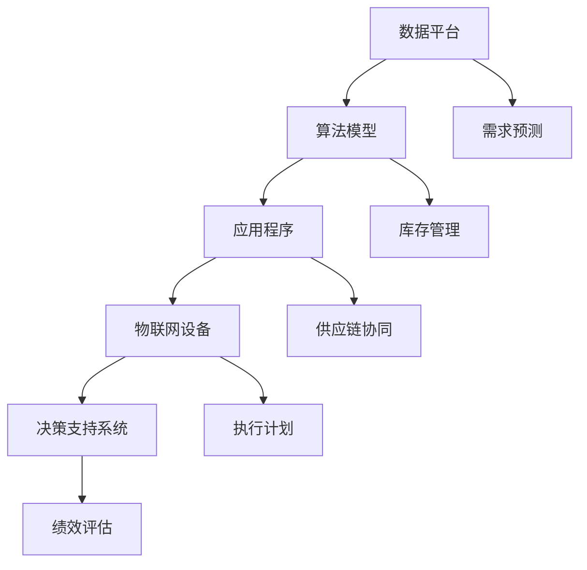

                 

### 引言

在当今全球化的商业环境中，供应链管理（SCM）是企业成功的关键因素之一。然而，传统的供应链管理面临着诸多挑战，如市场需求预测不准确、库存管理效率低下、供应链协同困难等。为了解决这些问题，AI驱动的智能供应链管理应运而生，它通过引入人工智能（AI）技术，实现了供应链管理的全程优化，从而提高了供应链的效率和灵活性。

本书旨在深入探讨AI驱动的智能供应链管理，从预测到执行的全程优化。首先，我们将介绍AI在供应链管理中的潜在应用和核心概念，如机器学习、数据分析等。接着，我们将详细讨论如何利用AI技术进行需求预测和库存预测，并展示如何将预测结果转化为实际的执行计划。此外，本书还将介绍供应链协同和全程优化的方法，并通过实际案例研究，展示这些方法在现实中的应用效果。

通过阅读本书，读者将了解：

1. **AI驱动的智能供应链管理的基本概念和架构**。
2. **需求预测和库存预测的原理和算法**。
3. **如何制定和执行有效的供应链计划**。
4. **供应链协同和全程优化的策略和方法**。

总体来说，本书将为读者提供一个全面、深入的理解AI驱动的智能供应链管理，并为他们提供实用的工具和策略，以应对供应链管理中的各种挑战。

关键词：AI、智能供应链管理、需求预测、库存预测、供应链协同、全程优化

摘要：本书探讨了AI驱动的智能供应链管理，从预测到执行的全程优化。通过介绍AI在供应链管理中的应用，详细阐述了需求预测和库存预测的方法，并展示了如何制定和执行供应链计划。此外，本书还介绍了供应链协同和全程优化的策略，并通过实际案例研究，验证了这些方法的有效性。

### 第一部分：AI驱动的智能供应链管理概述

#### 第1章：AI驱动的智能供应链管理概述

随着全球商业环境的不断变化，供应链管理（SCM）成为企业竞争力的关键因素。传统的供应链管理面临着诸多挑战，如市场需求预测不准确、库存管理效率低下、供应链协同困难等。为了解决这些问题，AI驱动的智能供应链管理应运而生，通过引入人工智能（AI）技术，实现了供应链管理的全程优化。

#### 1.1 AI与智能供应链管理

AI在供应链管理中的潜力是巨大的。AI技术能够处理和分析大量的数据，从中提取有用的信息，从而帮助管理者做出更加明智的决策。例如，通过机器学习和深度学习算法，可以对市场需求进行准确预测，从而优化库存管理；通过数据分析，可以识别供应链中的瓶颈，提高整个供应链的效率。此外，AI技术还可以实现供应链的自动化和智能化，降低人工成本，提高运营效率。

#### 1.1.1 AI在供应链管理中的潜力

AI在供应链管理中有广泛的应用潜力，主要包括以下几个方面：

1. **需求预测**：通过分析历史数据和市场趋势，AI技术可以准确预测未来的市场需求，从而帮助企业制定更加合理的库存计划。
2. **库存管理**：AI技术可以帮助企业实时监控库存水平，根据需求预测结果进行动态调整，避免库存过剩或短缺。
3. **供应链协同**：通过物联网和区块链技术，AI可以实现供应链的透明化和智能化，提高供应链的协同效率。
4. **供应链优化**：AI技术可以帮助企业优化供应链的各个环节，降低运营成本，提高整体效率。

#### 1.1.2 智能供应链管理的关键概念

智能供应链管理涉及多个关键概念，包括数据管理、需求预测、库存管理、供应链协同和供应链优化。以下是这些概念的定义和关系：

1. **数据管理**：数据是智能供应链管理的基础。通过有效的数据管理，企业可以收集、存储、处理和分析大量的供应链数据，从而支持决策制定。
2. **需求预测**：需求预测是智能供应链管理的核心。通过机器学习和深度学习算法，可以对市场需求进行准确预测，从而优化库存计划。
3. **库存管理**：库存管理是供应链管理的重要组成部分。通过实时监控库存水平，AI技术可以帮助企业避免库存过剩或短缺，提高库存利用率。
4. **供应链协同**：供应链协同是指供应链中的各个参与者（如供应商、制造商、分销商和零售商）通过信息共享和合作，实现供应链的透明化和智能化。
5. **供应链优化**：供应链优化是指通过优化供应链的各个环节（如采购、生产、运输和库存管理），提高供应链的整体效率和灵活性。

#### 1.1.3 智能供应链管理的发展趋势

随着AI技术的不断进步，智能供应链管理也在不断发展。以下是智能供应链管理的一些发展趋势：

1. **大数据和云计算**：大数据和云计算技术为智能供应链管理提供了强大的数据处理和分析能力，使企业能够更快速地做出决策。
2. **物联网（IoT）**：物联网技术实现了供应链的实时监控和自动化，提高了供应链的透明度和效率。
3. **区块链**：区块链技术可以提高供应链的信任度和透明度，减少欺诈和错误。
4. **机器学习和深度学习**：机器学习和深度学习技术可以帮助企业实现更准确的需求预测和库存管理。
5. **供应链金融**：供应链金融通过优化资金流，提高供应链的流动性，从而降低企业的融资成本。

总之，AI驱动的智能供应链管理已经成为现代企业提升竞争力的重要手段。通过有效利用AI技术，企业可以实现供应链的全程优化，提高运营效率，降低成本，从而在激烈的市场竞争中脱颖而出。

#### 1.2 智能供应链管理架构

智能供应链管理架构是确保供应链高效运作的基础。它通过整合各种技术和管理流程，实现供应链的自动化、智能化和协同化。以下是智能供应链管理的基本架构和关键流程。

##### 1.2.1 智能供应链的基本架构

智能供应链的基本架构包括以下几个关键组成部分：

1. **数据平台**：数据平台是智能供应链管理的数据基础，负责收集、存储、处理和分析供应链数据。数据平台通常包括数据库、数据仓库和大数据处理系统。
2. **算法模型**：算法模型是基于AI技术的各种预测和分析模型，用于需求预测、库存管理、供应链协同和优化等环节。常见的算法模型包括时间序列分析、机器学习算法、深度学习算法等。
3. **应用程序**：应用程序是智能供应链管理的具体实现，包括需求预测系统、库存管理系统、供应链协同平台等。
4. **物联网设备**：物联网设备负责实时收集供应链中的各种信息，如库存水平、运输状态等，为智能供应链管理提供数据支持。
5. **决策支持系统**：决策支持系统通过分析数据和算法模型的结果，为管理者提供决策建议，帮助制定更合理的供应链计划。

##### 1.2.2 智能供应链管理的关键流程

智能供应链管理的关键流程包括以下几个环节：

1. **需求预测**：通过分析历史数据和当前市场趋势，利用机器学习和深度学习算法，准确预测未来的市场需求。
2. **库存管理**：基于需求预测结果，实时监控库存水平，动态调整库存策略，避免库存过剩或短缺。
3. **供应链协同**：通过物联网和区块链技术，实现供应链中各个环节的信息共享和协同，提高供应链的透明度和效率。
4. **执行计划**：根据库存管理和供应链协同的结果，制定具体的执行计划，确保供应链的各个环节按计划进行。
5. **绩效评估**：对执行计划的执行效果进行评估，分析存在的问题和改进的机会，持续优化供应链管理。

##### 1.2.3 智能供应链管理的Mermaid流程图

为了更好地理解智能供应链管理的架构和流程，我们可以使用Mermaid流程图进行可视化展示。以下是一个简化的智能供应链管理流程图：



在这个流程图中，数据平台通过收集和处理供应链数据，为算法模型提供输入。算法模型通过需求预测、库存管理和供应链协同等环节，生成执行计划，并通过物联网设备和决策支持系统实现供应链的全程管理。

总之，智能供应链管理架构通过整合数据平台、算法模型、应用程序、物联网设备和决策支持系统，实现供应链的自动化、智能化和协同化。通过这个架构，企业可以更好地应对供应链管理中的各种挑战，提高运营效率和竞争力。

### 第2章：核心概念与联系

#### 2.1 AI基础概念

人工智能（AI）是智能供应链管理的基础，理解AI的基本概念对于深入探讨智能供应链管理至关重要。在本节中，我们将介绍AI的基础概念，包括机器学习、数据分析、深度学习和强化学习，并讨论它们在供应链管理中的应用。

##### 2.1.1 机器学习与深度学习

**机器学习**是一种通过数据训练模型，使模型能够自动学习和改进的技术。在供应链管理中，机器学习可以用于需求预测、库存管理和供应链优化。例如，通过分析历史销售数据和市场趋势，机器学习算法可以预测未来的市场需求，从而帮助企业制定更合理的库存策略。

**深度学习**是机器学习的一种特殊形式，它通过构建深度神经网络来模拟人脑的神经元连接，从而实现更复杂的模式识别和预测。在供应链管理中，深度学习可以用于识别供应链中的瓶颈、优化库存水平和预测供应链需求。

**案例**：使用Python实现一个简单的深度学习模型，用于预测市场需求。以下是一个简单的Python代码示例：

```python
import tensorflow as tf
from tensorflow.keras.models import Sequential
from tensorflow.keras.layers import Dense

# 假设我们已经有历史销售数据
sales_data = [[1, 2, 3], [4, 5, 6], [7, 8, 9]]

# 创建一个简单的深度学习模型
model = Sequential([
    Dense(3, input_shape=(3,), activation='relu'),
    Dense(1, activation='linear')
])

# 编译模型
model.compile(optimizer='adam', loss='mse')

# 训练模型
model.fit(sales_data, epochs=100)

# 预测未来需求
predicted_demand = model.predict([[10, 11, 12]])
print(predicted_demand)
```

##### 2.1.2 数据分析与数据挖掘

**数据分析**是一种通过统计和数学方法，从数据中提取有价值信息的技术。在供应链管理中，数据分析可以用于识别市场趋势、预测需求和优化库存水平。

**数据挖掘**是数据分析的一种高级形式，它通过挖掘大量数据中的隐藏模式和规律，为决策提供支持。例如，数据挖掘可以用于分析供应链中的异常行为、识别潜在的风险和机会。

**案例**：使用Python进行简单的数据分析，分析历史销售数据。以下是一个简单的Python代码示例：

```python
import pandas as pd
import numpy as np

# 假设我们已经有历史销售数据
data = pd.DataFrame({
    'Date': ['2021-01-01', '2021-01-02', '2021-01-03'],
    'Sales': [100, 150, 200]
})

# 计算平均销售量
average_sales = data['Sales'].mean()
print("平均销售量：", average_sales)

# 计算标准差
std_dev = data['Sales'].std()
print("销售量的标准差：", std_dev)

# 绘制销售量分布图
data['Sales'].plot(kind='hist', title='销售量分布')
```

##### 2.1.3 强化学习在供应链中的应用

**强化学习**是一种通过试错和奖励机制来学习最优策略的技术。在供应链管理中，强化学习可以用于优化库存管理、供应链协同和执行计划。

**案例**：使用Python实现一个简单的强化学习模型，用于优化库存管理。以下是一个简单的Python代码示例：

```python
import gym
import numpy as np

# 创建一个库存管理环境
env = gym.make('Inventory-v0')

# 初始化策略参数
policy = np.zeros((env.state_space, env.action_space), dtype=float)
learning_rate = 0.1
discount_factor = 0.9

# 强化学习循环
for episode in range(1000):
    state = env.reset()
    done = False
    total_reward = 0
    
    while not done:
        action = np.argmax(policy[state])
        next_state, reward, done, _ = env.step(action)
        total_reward += reward
        
        # 更新策略
        old_value = policy[state, action]
        next_max_value = np.max(policy[next_state])
        policy[state, action] = old_value + learning_rate * (reward + discount_factor * next_max_value - old_value)
        
        state = next_state
    
    print("Episode:", episode, "Total Reward:", total_reward)

# 关闭环境
env.close()
```

通过以上案例，我们可以看到AI的基础概念在供应链管理中的应用。在实际应用中，这些技术可以结合使用，以实现更复杂的预测和管理任务。

#### 2.2 智能供应链管理架构

智能供应链管理架构是确保供应链高效运作的关键，它通过整合数据平台、算法模型、应用程序、物联网设备和决策支持系统，实现供应链的自动化、智能化和协同化。以下是智能供应链管理架构的详细说明。

##### 2.2.1 数据平台

数据平台是智能供应链管理的数据基础，它负责收集、存储、处理和分析供应链数据。数据平台通常包括以下几个核心组成部分：

1. **数据库**：用于存储供应链中的结构化数据，如销售数据、库存数据、运输数据等。
2. **数据仓库**：用于存储供应链中的非结构化数据，如传感器数据、社交媒体数据等。
3. **大数据处理系统**：用于处理和分析大量供应链数据，如Hadoop、Spark等。

数据平台的关键功能包括：

1. **数据集成**：将来自不同源的数据集成到统一的数据存储中，实现数据的统一管理和分析。
2. **数据清洗**：清洗和预处理供应链数据，确保数据的质量和一致性。
3. **数据存储**：存储和管理大量供应链数据，确保数据的可扩展性和可访问性。
4. **数据处理**：对供应链数据进行处理和分析，提取有用的信息，为供应链管理提供支持。

##### 2.2.2 算法模型

算法模型是智能供应链管理的核心，它通过机器学习、深度学习、数据分析等技术，实现对供应链数据的分析和预测。算法模型主要包括以下几个部分：

1. **需求预测模型**：用于预测市场需求，帮助供应链管理者制定库存策略和采购计划。
2. **库存管理模型**：用于优化库存水平，确保库存充足，同时避免库存过剩。
3. **供应链协同模型**：用于实现供应链中各个环节的协同，提高供应链的透明度和效率。
4. **优化模型**：用于优化供应链的各个环节，提高供应链的整体效率。

算法模型的关键功能包括：

1. **数据建模**：根据供应链数据，构建合适的预测和优化模型。
2. **模型训练**：使用历史数据训练模型，使其能够预测未来的市场需求和库存水平。
3. **模型评估**：评估模型的预测准确性和优化效果，持续优化模型。

##### 2.2.3 应用程序

应用程序是智能供应链管理的具体实现，它将算法模型的结果应用于实际操作中，实现供应链的自动化和智能化。应用程序主要包括以下几个部分：

1. **需求预测系统**：根据需求预测模型的结果，生成需求预测报告，帮助供应链管理者制定库存策略和采购计划。
2. **库存管理系统**：根据库存管理模型的结果，实时监控库存水平，动态调整库存策略，确保库存充足。
3. **供应链协同平台**：实现供应链中各个环节的信息共享和协同，提高供应链的透明度和效率。
4. **优化系统**：根据优化模型的结果，制定最优的执行计划，提高供应链的整体效率。

应用程序的关键功能包括：

1. **界面设计**：提供友好的用户界面，方便供应链管理者使用和应用算法模型的结果。
2. **自动化操作**：自动化执行供应链计划，减少人工操作，提高效率。
3. **实时监控**：实时监控供应链的各个环节，确保供应链的正常运行。

##### 2.2.4 物联网设备

物联网设备是智能供应链管理的重要组件，它负责实时收集供应链中的各种信息，如库存水平、运输状态、设备状态等。物联网设备主要包括以下几个部分：

1. **传感器**：用于实时监测供应链中的各种物理量，如温度、湿度、位置等。
2. **RFID标签**：用于识别和跟踪供应链中的物品。
3. **GPS设备**：用于跟踪运输过程中的车辆和货物位置。

物联网设备的关键功能包括：

1. **实时监控**：实时监控供应链中的各种信息，为供应链管理提供及时的数据支持。
2. **数据采集**：采集供应链中的各种数据，为算法模型提供输入。
3. **远程控制**：通过物联网设备，远程控制供应链中的设备，实现自动化操作。

##### 2.2.5 决策支持系统

决策支持系统是智能供应链管理的核心，它通过分析数据和算法模型的结果，为供应链管理者提供决策支持。决策支持系统主要包括以下几个部分：

1. **数据分析模块**：对供应链中的各种数据进行深入分析，提取有价值的信息。
2. **预测模块**：根据历史数据和当前市场趋势，预测未来的市场需求和库存水平。
3. **优化模块**：根据供应链数据和优化模型，制定最优的执行计划。
4. **报告生成模块**：生成各种报告，如需求预测报告、库存报告、执行计划报告等。

决策支持系统的关键功能包括：

1. **数据分析**：深入分析供应链中的各种数据，为决策提供支持。
2. **预测**：预测未来的市场需求和库存水平，帮助供应链管理者制定策略。
3. **优化**：根据供应链数据和优化模型，制定最优的执行计划。
4. **报告**：生成各种报告，为供应链管理者提供决策依据。

综上所述，智能供应链管理架构通过整合数据平台、算法模型、应用程序、物联网设备和决策支持系统，实现供应链的自动化、智能化和协同化。通过这个架构，企业可以更好地应对供应链管理中的各种挑战，提高运营效率和竞争力。

### 第3章：需求预测

#### 3.1 需求预测原理

需求预测是智能供应链管理的重要组成部分，它通过分析历史数据和当前市场趋势，预测未来的市场需求。准确的需求预测有助于企业制定合理的库存策略、采购计划和供应链计划，从而提高供应链的效率和灵活性。

##### 3.1.1 需求预测的重要性

需求预测在供应链管理中具有以下几个重要作用：

1. **优化库存管理**：准确的需求预测可以帮助企业预测未来需求，从而合理安排库存水平，避免库存过剩或短缺。
2. **提高供应链效率**：通过预测未来的市场需求，企业可以提前准备生产资源和原材料，提高供应链的整体效率。
3. **降低成本**：准确的需求预测可以减少库存成本和运输成本，提高供应链的运营效率。
4. **应对市场变化**：市场环境经常变化，通过需求预测，企业可以及时调整生产和库存策略，应对市场变化。

##### 3.1.2 时间序列分析方法

时间序列分析是需求预测的主要方法之一，它通过分析历史数据的时间序列特性，预测未来的市场需求。时间序列分析方法主要包括以下几种：

1. **移动平均法**：通过计算一段时间内的平均值，预测未来的需求。移动平均法可以分为简单移动平均法和指数移动平均法。
   - **简单移动平均法（SMA）**：计算一段时间内的平均值，公式如下：
     $$
     SMA = \frac{\sum_{i=1}^{n} X_i}{n}
     $$
     其中，$X_i$代表第$i$个时间点的需求，$n$代表时间窗口。
   - **指数移动平均法（EMA）**：对简单移动平均法进行改进，给近期的数据更大的权重，公式如下：
     $$
     EMA = \alpha \cdot X_t + (1 - \alpha) \cdot EMA_{prev}
     $$
     其中，$X_t$代表第$t$个时间点的需求，$EMA_{prev}$代表前一个时间点的指数移动平均，$\alpha$代表权重系数。

2. **自回归移动平均法（ARMA）**：将自回归（AR）和移动平均（MA）模型结合，用于预测具有平稳时间序列特性的数据。ARMA模型的公式如下：
   $$
   X_t = c + \phi_1 X_{t-1} + \phi_2 X_{t-2} + ... + \phi_p X_{t-p} + \theta_1 \epsilon_{t-1} + \theta_2 \epsilon_{t-2} + ... + \theta_q \epsilon_{t-q}
   $$
   其中，$X_t$代表第$t$个时间点的需求，$c$为常数项，$\phi_i$和$\theta_i$为模型参数，$\epsilon_t$为白噪声。

3. **自回归积分滑动平均法（ARIMA）**：对ARMA模型进行扩展，用于处理非平稳时间序列数据。ARIMA模型的公式如下：
   $$
   X_t = c + \phi_1 X_{t-1} + \phi_2 X_{t-2} + ... + \phi_p X_{t-p} + \theta_1 (X_{t-1} - \mu) + \theta_2 (X_{t-2} - \mu) + ... + \theta_q (X_{t-q} - \mu)
   $$
   其中，$\mu$为数据的长期均值。

##### 3.1.3 机器学习在需求预测中的应用

机器学习技术在需求预测中发挥了重要作用，通过建立预测模型，可以更好地捕捉数据中的复杂模式和关系。常见的机器学习算法包括：

1. **线性回归模型**：线性回归模型是一种简单的预测模型，通过建立线性关系来预测未来的需求。线性回归模型的公式如下：
   $$
   Y = \beta_0 + \beta_1 X
   $$
   其中，$Y$代表需求，$X$代表影响需求的特征，$\beta_0$和$\beta_1$为模型参数。

2. **决策树模型**：决策树模型通过构建树形结构，对数据进行分类或回归。在需求预测中，决策树模型可以用于发现数据中的关键特征，从而提高预测的准确性。

3. **随机森林模型**：随机森林模型是一种基于决策树的集成模型，通过构建多个决策树，并合并它们的预测结果，提高预测的准确性。

4. **支持向量机（SVM）模型**：SVM模型通过构建一个超平面，将数据分为不同的类别或预测值。在需求预测中，SVM模型可以用于分类或回归任务。

5. **神经网络模型**：神经网络模型是一种基于神经元连接的预测模型，通过学习数据中的复杂关系，实现高精度的需求预测。

**案例**：使用Python实现一个简单的线性回归模型，用于预测市场需求。以下是一个简单的Python代码示例：

```python
import numpy as np
from sklearn.linear_model import LinearRegression

# 假设我们已经有历史销售数据
sales_data = np.array([[1, 2], [2, 3], [3, 4], [4, 5], [5, 6]])
demand_data = np.array([100, 150, 200, 250, 300])

# 创建一个线性回归模型
model = LinearRegression()
model.fit(sales_data, demand_data)

# 预测未来需求
predicted_demand = model.predict([[6, 7]])
print(predicted_demand)
```

通过以上方法和技术，需求预测可以为智能供应链管理提供有力的支持，帮助企业更好地应对市场变化，提高供应链的效率和灵活性。

#### 3.2 需求预测算法

在智能供应链管理中，准确的需求预测是优化库存、降低成本和提高服务水平的关键。本节将详细介绍几种常见的需求预测算法，包括ARIMA模型、SARIMA模型和LSTM模型。

##### 3.2.1 ARIMA模型

ARIMA（自回归积分滑动平均模型）是一种常用的需求预测方法，适用于平稳时间序列数据。ARIMA模型由三个部分组成：自回归（AR）、差分（I）和移动平均（MA）。

1. **自回归（AR）部分**：自回归部分通过当前和过去的值来预测未来的值。其公式如下：
   $$
   AR(p): \, \phi(B) X_t = \sum_{i=1}^{p} \phi_i B^i X_t
   $$
   其中，$\phi(B)$是自回归系数，$B$是滞后算子，$X_t$是时间序列值，$p$是滞后阶数。

2. **差分（I）部分**：差分部分用于使时间序列达到平稳性。一阶差分公式如下：
   $$
   I(1): \, X_t^* = X_t - X_{t-1}
   $$
   其中，$X_t^*$是一阶差分后的时间序列值。

3. **移动平均（MA）部分**：移动平均部分通过过去的误差值来预测未来的值。其公式如下：
   $$
   MA(q): \, \theta(B) \epsilon_t = \sum_{i=1}^{q} \theta_i B^i \epsilon_t
   $$
   其中，$\theta(B)$是移动平均系数，$\epsilon_t$是误差项，$q$是滞后阶数。

ARIMA模型的公式如下：
$$
X_t^* = \phi(B) X_t + \theta(B) \epsilon_t
$$

**案例**：使用Python实现ARIMA模型，预测市场需求。以下是一个简单的Python代码示例：

```python
import pandas as pd
import numpy as np
from statsmodels.tsa.arima.model import ARIMA

# 假设我们已经有历史销售数据
data = pd.Series([100, 120, 130, 110, 150, 160, 180, 200, 220, 240])

# 创建一个ARIMA模型
model = ARIMA(data, order=(1, 1, 1))
model_fit = model.fit()

# 预测未来需求
forecast = model_fit.forecast(steps=3)
print(forecast)
```

##### 3.2.2 SARIMA模型

SARIMA（季节性自回归积分滑动平均模型）是ARIMA模型的扩展，用于处理季节性数据。SARIMA模型包括季节性自回归（SAR）、季节性差分（SI）和季节性移动平均（SMA）部分。

1. **季节性自回归（SAR）部分**：季节性自回归部分通过当前和过去的季节性值来预测未来的季节性值。其公式如下：
   $$
   SAR(p, d, s): \, \phi_s(B) X_t = \sum_{i=1}^{p} \phi_i B^i X_t + \sum_{j=1}^{s} \phi_j B^{js} X_{t-j}
   $$
   其中，$\phi_s(B)$是季节性自回归系数，$p$是季节性滞后阶数，$s$是季节性周期。

2. **季节性差分（SI）部分**：季节性差分部分用于使季节性时间序列达到平稳性。其公式如下：
   $$
   SI(d, s): \, X_t^* = (1 - B^s)^d X_t
   $$
   其中，$d$是季节性差分阶数。

3. **季节性移动平均（SMA）部分**：季节性移动平均部分通过过去的季节性误差值来预测未来的季节性误差值。其公式如下：
   $$
   SMA(q, s): \, \theta_s(B) \epsilon_t = \sum_{i=1}^{q} \theta_i B^i \epsilon_t + \sum_{j=1}^{s} \theta_j B^{js} \epsilon_{t-j}
   $$
   其中，$\theta_s(B)$是季节性移动平均系数，$q$是季节性滞后阶数。

SARIMA模型的公式如下：
$$
X_t^* = \phi(B) X_t + \theta(B) \epsilon_t + \phi_s(B) X_{t-s} + \theta_s(B) \epsilon_{t-s}
$$

**案例**：使用Python实现SARIMA模型，预测市场需求。以下是一个简单的Python代码示例：

```python
import pandas as pd
import numpy as np
from statsmodels.tsa.statespace.sarimax import SARIMAX

# 假设我们已经有历史销售数据
data = pd.Series([100, 120, 130, 110, 150, 160, 180, 200, 220, 240])

# 创建一个SARIMA模型
model = SARIMAX(data, order=(1, 1, 1), seasonal_order=(1, 1, 1, 12))
model_fit = model.fit()

# 预测未来需求
forecast = model_fit.forecast(steps=3)
print(forecast)
```

##### 3.2.3 LSTM模型

LSTM（长短时记忆网络）是一种特殊的循环神经网络（RNN），能够有效地捕捉时间序列数据中的长期依赖关系。在需求预测中，LSTM模型可以用于处理非线性、时间依赖性的数据。

1. **门控机制**：LSTM通过门控机制（包括输入门、遗忘门和输出门）来控制信息的流动，从而有效地捕捉长期依赖关系。

2. **单元状态**：LSTM的单元状态（cell state）可以在时间维度上自由流动，使得模型能够记忆长期依赖信息。

3. **训练方法**：LSTM使用反向传播通过时间（Backpropagation Through Time, BPTT）进行训练，以优化模型参数。

LSTM模型的公式如下：

- **输入门**：
  $$
  i_t = \sigma(W_i \cdot [h_{t-1}, x_t] + b_i)
  $$

- **遗忘门**：
  $$
  f_t = \sigma(W_f \cdot [h_{t-1}, x_t] + b_f)
  $$

- **输出门**：
  $$
  o_t = \sigma(W_o \cdot [h_{t-1}, x_t] + b_o)
  $$

- **单元状态更新**：
  $$
  g_t = \tanh(W_g \cdot [h_{t-1}, x_t] + b_g)
  $$

- **隐藏状态更新**：
  $$
  h_t = o_t \cdot \tanh(g_t)
  $$

**案例**：使用Python实现LSTM模型，预测市场需求。以下是一个简单的Python代码示例：

```python
import pandas as pd
import numpy as np
from tensorflow.keras.models import Sequential
from tensorflow.keras.layers import LSTM, Dense

# 假设我们已经有历史销售数据
sales_data = np.array([[1, 2], [2, 3], [3, 4], [4, 5], [5, 6]])

# 创建一个简单的LSTM模型
model = Sequential()
model.add(LSTM(50, activation='relu', input_shape=(2, 1)))
model.add(Dense(1))
model.compile(optimizer='adam', loss='mse')

# 训练模型
model.fit(sales_data, epochs=100)

# 预测未来需求
predicted_demand = model.predict([[6, 7]])
print(predicted_demand)
```

通过以上算法，企业可以有效地进行需求预测，从而优化库存管理、提高供应链效率。在实际应用中，可以根据具体需求和数据特点选择合适的预测算法，实现最佳的需求预测效果。

#### 3.3 需求预测的挑战与解决方案

在需求预测中，虽然已有多种算法和技术，但仍然面临着诸多挑战。以下是需求预测中的主要挑战及其解决方案：

##### 3.3.1 数据质量问题

**挑战**：数据质量是需求预测的关键因素。如果数据存在噪声、缺失或不一致，将直接影响预测的准确性。

**解决方案**：为了提高数据质量，可以采取以下措施：

1. **数据清洗**：清洗数据，去除噪声和异常值，确保数据的一致性和完整性。
2. **缺失值处理**：使用插值、均值填充或其他方法处理缺失值，以提高数据的可用性。
3. **数据标准化**：标准化数据，使其在同一尺度上进行比较，避免因数据量级差异导致的预测偏差。

##### 3.3.2 季节性需求预测

**挑战**：许多产品的需求具有季节性，如何准确捕捉季节性模式是需求预测的难点。

**解决方案**：针对季节性需求预测，可以采用以下方法：

1. **季节性分解**：将总需求分解为趋势、季节性和随机性部分，分别进行建模和预测。
2. **SARIMA和LSTM模型**：SARIMA和LSTM模型能够处理季节性数据，通过引入季节性因子和长短时记忆能力，提高预测准确性。
3. **集成方法**：结合多种预测模型，如ARIMA和LSTM，通过集成预测结果，提高预测的稳健性。

##### 3.3.3 预测不确定性

**挑战**：需求预测总是存在一定的不确定性，如何处理预测结果的不确定性是需求预测中的一个难题。

**解决方案**：为了处理预测不确定性，可以采取以下措施：

1. **概率预测**：使用概率模型，如贝叶斯网络、蒙特卡罗方法等，提供预测结果的概率分布，从而捕捉不确定性的影响。
2. **置信区间**：计算预测结果的置信区间，为决策者提供预测的可靠性。
3. **风险分析**：通过分析预测结果的不确定性，评估潜在的供应风险和库存风险，制定相应的应对策略。

##### 3.3.4 数据源多样性

**挑战**：需求预测需要整合多种数据源，如历史销售数据、市场趋势数据、客户行为数据等。如何有效整合不同数据源是需求预测的另一个挑战。

**解决方案**：为了整合多样性数据源，可以采取以下措施：

1. **多源数据融合**：通过数据融合技术，如主成分分析（PCA）、聚类分析等，整合不同数据源的信息。
2. **特征工程**：设计有效的特征，将不同数据源的信息转化为预测模型可用的形式。
3. **数据驱动的特征选择**：通过机器学习算法，自动选择对预测模型影响最大的特征，提高预测效果。

通过上述解决方案，企业可以在面对需求预测挑战时，采取有效的措施，提高预测的准确性和可靠性，从而优化供应链管理。

#### 第4章：库存预测

库存预测是智能供应链管理的重要组成部分，它通过对历史数据和当前市场趋势进行分析，预测未来的库存需求，帮助企业实现库存的最优化管理。库存预测的准确性直接影响到企业的库存成本、服务水平以及整体供应链的效率。在本章中，我们将详细讨论库存预测的基本原理、常见算法及其应用。

##### 4.1 库存预测原理

库存预测是通过对历史库存数据和市场趋势进行分析，预测未来的库存水平。准确库存预测能够帮助企业：

1. **避免库存过剩**：库存过剩会导致资金占用成本增加，仓储空间紧张。
2. **防止库存短缺**：库存短缺会导致缺货损失，影响客户满意度和服务水平。
3. **优化库存水平**：通过库存预测，企业可以优化库存策略，实现库存水平的合理化。

库存预测的基本原理包括以下几个方面：

1. **数据收集与清洗**：收集并清洗历史库存数据，确保数据的质量和完整性，为预测模型提供可靠的输入。
2. **特征提取**：从历史库存数据中提取关键特征，如库存水平、销售量、订单量、季节性因素等，用于训练预测模型。
3. **模型选择与训练**：选择合适的预测模型，如时间序列分析、机器学习算法等，对历史数据进行分析和训练。
4. **预测与优化**：利用训练好的模型，预测未来的库存需求，并根据预测结果进行库存策略的优化。

##### 4.2 库存预测算法

库存预测算法可以分为传统方法和现代机器学习方法，以下是一些常用的库存预测算法：

1. **移动平均法（MA）**：移动平均法通过计算一段时间内的平均值来预测未来的库存水平。简单移动平均法（SMA）和指数移动平均法（EMA）是常见的移动平均法。

   - **简单移动平均法（SMA）**：计算最近$n$个时间点的平均值，公式如下：
     $$
     SMA(n) = \frac{\sum_{i=1}^{n} I_i}{n}
     $$
     其中，$I_i$是第$i$个时间点的库存水平，$n$是时间窗口。

   - **指数移动平均法（EMA）**：对简单移动平均法进行改进，给予最近数据更大的权重，公式如下：
     $$
     EMA(t) = \alpha \cdot I_t + (1 - \alpha) \cdot EMA(t-1)
     $$
     其中，$I_t$是第$t$个时间点的库存水平，$\alpha$是平滑系数。

2. **自回归移动平均法（ARMA）**：自回归移动平均法结合自回归（AR）和移动平均（MA）模型，适用于平稳时间序列数据的预测。其公式如下：
   $$
   X_t = \phi(B) X_{t-1} + \theta(B) \epsilon_t
   $$
   其中，$\phi(B)$和$\theta(B)$分别是自回归和移动平均算子，$X_t$是第$t$个时间点的库存水平，$\epsilon_t$是误差项。

3. **自回归积分滑动平均法（ARIMA）**：自回归积分滑动平均法是ARMA模型的扩展，适用于非平稳时间序列数据的预测。其公式如下：
   $$
   X_t = \phi(B) X_{t-1} + \theta(B) (X_{t-1} - \mu) + \epsilon_t
   $$
   其中，$\mu$是数据的长期均值。

4. **季节性自回归移动平均法（SARIMA）**：季节性自回归移动平均法是ARIMA模型的扩展，适用于处理季节性时间序列数据的预测。其公式如下：
   $$
   X_t = \phi(B) X_{t-1} + \theta(B) (X_{t-1} - \mu) + \phi_s(B) X_{t-s} + \theta_s(B) (X_{t-s} - \mu_s)
   $$
   其中，$\phi_s(B)$和$\theta_s(B)$分别是季节性自回归和移动平均算子，$s$是季节性周期。

5. **人工神经网络（ANN）**：人工神经网络是一种基于生物神经网络原理的预测模型，通过学习历史数据中的复杂关系，实现高精度的库存预测。

6. **长短期记忆网络（LSTM）**：长短期记忆网络是一种特殊的循环神经网络，能够有效捕捉时间序列数据中的长期依赖关系，适用于复杂时间序列数据的预测。

**案例**：使用Python实现ARIMA模型，预测库存水平。以下是一个简单的Python代码示例：

```python
import pandas as pd
import numpy as np
from statsmodels.tsa.arima.model import ARIMA

# 假设我们已经有历史库存数据
inventory_data = pd.Series([100, 120, 130, 110, 150, 160, 180, 200, 220, 240])

# 创建一个ARIMA模型
model = ARIMA(inventory_data, order=(1, 1, 1))
model_fit = model.fit()

# 预测未来库存
forecast = model_fit.forecast(steps=3)
print(forecast)
```

通过以上算法，企业可以有效地进行库存预测，从而优化库存策略，提高供应链的效率和灵活性。

#### 4.3 库存预测中的挑战与解决方案

在库存预测中，尽管有多种算法和模型可用，但仍然面临许多挑战。以下是库存预测中的主要挑战及其解决方案：

##### 4.3.1 数据噪声和缺失

**挑战**：库存数据通常包含噪声和缺失值，这些数据质量问题会影响预测的准确性。

**解决方案**：为了解决数据噪声和缺失问题，可以采取以下措施：

1. **数据清洗**：清洗数据，去除异常值和噪声，确保数据的准确性和一致性。
2. **缺失值填补**：使用插值、均值填补或其他方法填补缺失值，提高数据的完整性。

##### 4.3.2 季节性变化

**挑战**：许多产品的库存需求具有季节性变化，如何准确捕捉季节性模式是库存预测的难点。

**解决方案**：针对季节性库存预测，可以采用以下方法：

1. **季节性分解**：将总库存分解为趋势、季节性和随机性部分，分别进行建模和预测。
2. **SARIMA模型**：季节性自回归积分滑动平均法（SARIMA）能够处理季节性数据，通过引入季节性因子提高预测准确性。
3. **集成方法**：结合多种预测模型，如ARIMA和LSTM，通过集成预测结果，提高预测的稳健性。

##### 4.3.3 预测不确定性

**挑战**：库存预测总是存在一定的不确定性，如何处理预测结果的不确定性是库存预测中的难题。

**解决方案**：为了处理不确定性，可以采取以下措施：

1. **概率预测**：使用概率模型，如贝叶斯网络、蒙特卡罗方法等，提供预测结果的概率分布，捕捉不确定性。
2. **置信区间**：计算预测结果的置信区间，为决策者提供预测的可靠性。
3. **风险分析**：通过分析预测结果的不确定性，评估潜在的库存风险，制定相应的应对策略。

##### 4.3.4 数据源多样性

**挑战**：库存预测需要整合多种数据源，如历史库存数据、销售数据、订单数据等。如何有效整合不同数据源是库存预测的另一个挑战。

**解决方案**：为了整合多样性数据源，可以采取以下措施：

1. **数据融合**：通过数据融合技术，如主成分分析（PCA）、聚类分析等，整合不同数据源的信息。
2. **特征工程**：设计有效的特征，将不同数据源的信息转化为预测模型可用的形式。
3. **数据驱动的特征选择**：通过机器学习算法，自动选择对预测模型影响最大的特征，提高预测效果。

通过上述解决方案，企业可以在面对库存预测挑战时，采取有效的措施，提高预测的准确性和可靠性，从而优化库存管理。

### 第5章：执行计划制定

#### 5.1 执行计划原理

执行计划是智能供应链管理中的重要环节，它将需求预测和库存预测的结果转化为具体的操作指令，确保供应链的各个环节按计划顺利进行。执行计划的制定不仅需要考虑需求预测和库存预测的结果，还需要综合考虑供应链中的各种约束和限制条件。

##### 5.1.1 执行计划的重要性

执行计划在供应链管理中具有以下几个重要作用：

1. **提高供应链效率**：通过执行计划，企业可以合理调配资源，提高供应链的运作效率。
2. **降低库存成本**：执行计划有助于优化库存水平，避免库存过剩或短缺，降低库存成本。
3. **提高客户满意度**：通过准确的执行计划，企业可以更好地满足客户需求，提高客户满意度。
4. **应对突发事件**：执行计划可以包含应对突发事件的预案，确保在突发事件发生时，供应链能够迅速响应。

##### 5.1.2 执行计划的基本框架

执行计划的基本框架通常包括以下几个步骤：

1. **需求分析与预测**：基于市场需求和库存预测结果，分析并确定供应链的需求。
2. **资源调配**：根据需求预测结果，合理调配生产资源、原材料和物流资源。
3. **生产计划**：制定生产计划，确定生产时间和生产量，确保生产资源的高效利用。
4. **物流计划**：制定物流计划，确定运输路线、运输方式和运输时间，确保物流的高效运作。
5. **库存管理**：根据需求预测和库存计划，动态调整库存水平，确保库存充足。
6. **执行监控**：对执行计划进行实时监控，确保各个环节按计划进行，及时调整和优化。
7. **绩效评估**：对执行计划的执行效果进行评估，分析存在的问题和改进的机会。

##### 5.1.3 执行计划的优化方法

为了提高执行计划的效率和准确性，可以采用以下优化方法：

1. **线性规划**：线性规划是一种数学优化方法，通过建立线性目标函数和约束条件，求解最优解。在执行计划中，可以使用线性规划来确定最优的生产计划、物流计划和库存策略。

2. **动态规划**：动态规划是一种递归求解最优子结构的方法，通过将复杂问题分解为子问题，并保存子问题的解，避免重复计算。在执行计划中，可以使用动态规划方法来优化生产计划、物流计划和库存管理。

3. **强化学习**：强化学习是一种通过试错和奖励机制来学习最优策略的方法。在执行计划中，可以使用强化学习来优化库存管理、生产计划和供应链协同。

4. **多目标优化**：多目标优化是一种同时考虑多个目标函数的优化方法，如成本最小化、服务水平最大化等。在执行计划中，可以使用多目标优化方法来平衡供应链中的各种目标。

**案例**：使用Python实现线性规划，优化执行计划。以下是一个简单的Python代码示例：

```python
import pulp

# 定义变量
x1 = pulp.LpVariable("x1", cat='Continuous')  # 生产量
x2 = pulp.LpVariable("x2", cat='Continuous')  # 库存量

# 定义目标函数
prob = pulp.LpProblem("Execution Plan Optimization", pulp.LpMinimize)
prob += (2 * x1 + 3 * x2)  # 目标是最小化总成本

# 定义约束条件
prob += (x1 + x2) >= 100  # 需求量至少为100
prob += (x1 - x2) <= 50   # 生产量不超过库存量

# 解线性规划问题
prob.solve()

# 输出结果
print("生产量:", x1.varValue)
print("库存量:", x2.varValue)
print("最小化成本:", prob.objective.value())
```

通过以上方法和步骤，企业可以制定出高效的执行计划，从而提高供应链的运作效率，降低成本，提高客户满意度。

### 第6章：供应链协同

#### 6.1 供应链协同原理

供应链协同是指供应链中的各个环节通过信息共享、合作与协调，实现整体效益最大化的过程。协同的目的是消除供应链中的瓶颈，提高供应链的透明度和灵活性，从而实现供应链的优化和提升。

##### 6.1.1 供应链协同的重要性

供应链协同在智能供应链管理中具有以下几个重要作用：

1. **提高供应链效率**：通过协同，供应链中的各个环节可以更好地协调和配合，减少不必要的重复工作和等待时间，提高整体效率。
2. **降低运营成本**：协同可以减少库存、运输和运营成本，通过资源共享和信息共享，优化供应链的各个环节。
3. **提升客户满意度**：协同有助于确保供应链的各个环节能够及时响应客户需求，提高客户满意度。
4. **增强供应链弹性**：通过协同，供应链可以更好地应对市场变化和突发事件，提高供应链的弹性。

##### 6.1.2 供应链协同的基本框架

供应链协同的基本框架通常包括以下几个关键部分：

1. **信息共享**：信息共享是协同的基础。通过建立信息共享平台，供应链中的各个环节可以实时共享库存水平、订单状态、运输状态等信息。
2. **流程协同**：流程协同是指供应链中的各个环节通过协调和优化，实现流程的顺畅和高效。例如，通过协同规划生产、物流和库存管理，实现供应链的高效运作。
3. **资源协同**：资源协同是指通过合理调配和共享资源，如人力、设备和物料，实现供应链的整体优化。例如，通过协同分配物流资源和生产资源，提高资源利用率。
4. **风险管理**：供应链协同可以通过共享风险信息和制定应急预案，共同应对供应链中的风险和不确定性。

##### 6.1.3 供应链协同的挑战与解决方案

尽管供应链协同具有显著的优势，但在实际操作中仍然面临一些挑战。以下是供应链协同中的主要挑战及其解决方案：

1. **信息孤岛**：供应链协同面临的一个主要挑战是信息孤岛。即供应链中的各个环节使用不同的信息系统，导致信息无法共享和整合。解决方案是建立统一的信息共享平台，实现信息的集成和共享。
2. **数据质量**：数据质量是供应链协同的关键。如果数据存在噪声、缺失或不一致，将直接影响协同的效果。解决方案是加强数据质量管理，确保数据的准确性和一致性。
3. **利益冲突**：供应链协同可能涉及到不同企业之间的利益分配和协调，可能导致利益冲突。解决方案是通过建立合理的利益分配机制和协同规则，实现供应链的共赢。
4. **技术挑战**：供应链协同需要先进的信息技术和工具支持，如物联网、区块链和云计算等。技术挑战包括系统的兼容性、数据安全性和系统的可扩展性。解决方案是选择合适的技术和工具，确保系统的可靠性和可扩展性。

通过解决这些挑战，企业可以实现供应链的协同，提高供应链的效率和灵活性，从而在激烈的市场竞争中取得优势。

#### 6.2 供应链协同算法

供应链协同算法是实现供应链各个环节协同运作的核心工具。以下将介绍几种常见的供应链协同算法，包括分布式算法、协同优化算法和强化学习在供应链协同中的应用。

##### 6.2.1 分布式算法

分布式算法是一种基于分布式计算原理的协同算法，它通过将计算任务分配到不同的节点上，实现协同操作。分布式算法的主要特点包括并行计算、容错性和可扩展性。在供应链协同中，分布式算法可以应用于多个环节，如需求预测、库存管理和运输调度。

1. **分布式需求预测**：通过将需求预测任务分配到多个计算节点，分布式算法可以快速处理大量数据，提高预测的准确性。例如，可以使用MapReduce模型，将数据分布到多个节点进行处理，最后汇总结果。
   
   **案例**：使用MapReduce模型，实现分布式需求预测。以下是一个简单的Python代码示例：

   ```python
   from mrjob.job import MRJob

   class DemandPrediction(MRJob):
       def mapper(self, _, line):
           data = line.strip().split(',')
           yield 'demand', float(data[1])

       def reducer(self, key, values):
           total_demand = sum(values)
           avg_demand = total_demand / len(values)
           yield key, avg_demand

   if __name__ == '__main__':
       DemandPrediction.run()
   ```

2. **分布式库存管理**：分布式算法可以应用于库存管理，实现实时监控和动态调整。例如，使用分布式数据库（如Apache Cassandra），可以实时记录库存信息，并快速响应库存变化。

   **案例**：使用Apache Cassandra，实现分布式库存管理。以下是一个简单的Python代码示例：

   ```python
   from cassandra.cluster import Cluster
   from cassandra.auth import PlainTextAuthProvider

   auth_provider = PlainTextAuthProvider(username='cassandra', password='cassandra')
   cluster = Cluster(['127.0.0.1'], auth_provider=auth_provider)
   session = cluster.connect()

   session.execute("""
   CREATE KEYSPACE IF NOT EXISTS inventory
   WITH replication = {'class': 'SimpleStrategy', 'replication_factor': '3'}
   """)

   session.execute("""
   CREATE TABLE IF NOT EXISTS inventory.product_stock (
       product_id UUID,
       stock INT,
       PRIMARY KEY (product_id)
   )
   """)

   def update_stock(product_id, stock):
       session.execute("""
       UPDATE inventory.product_stock
       SET stock = %s
       WHERE product_id = %s
       """, (stock, product_id))

   update_stock('123', 100)

   stock = session.execute("""
   SELECT stock
   FROM inventory.product_stock
   WHERE product_id = '123'
   """).one().stock
   print("Current stock:", stock)
   ```

##### 6.2.2 协同优化算法

协同优化算法通过优化供应链中的各个环节，实现整体效益的最大化。常见的协同优化算法包括线性规划、动态规划和遗传算法。

1. **线性规划**：线性规划是一种数学优化方法，通过建立线性目标函数和约束条件，求解最优解。在供应链协同中，线性规划可以用于资源调配、物流规划和库存管理。

   **案例**：使用线性规划，优化资源调配。以下是一个简单的Python代码示例：

   ```python
   import pulp

   # 定义变量
   x1 = pulp.LpVariable('x1', cat='Continuous')
   x2 = pulp.LpVariable('x2', cat='Continuous')

   # 定义目标函数
   prob = pulp.LpProblem('Resource Allocation', pulp.LpMinimize)
   prob += (2 * x1 + 3 * x2)

   # 定义约束条件
   prob += (x1 + x2) >= 100
   prob += (x1 - x2) <= 50

   # 解线性规划问题
   prob.solve()

   # 输出结果
   print("x1:", x1.varValue)
   print("x2:", x2.varValue)
   print("最小化成本:", prob.objective.value())
   ```

2. **动态规划**：动态规划是一种递归求解最优子结构的方法，通过将复杂问题分解为子问题，并保存子问题的解，避免重复计算。在供应链协同中，动态规划可以用于生产计划、物流规划和库存管理。

   **案例**：使用动态规划，优化生产计划。以下是一个简单的Python代码示例：

   ```python
   def production_plan(demand, production_costs, holding_costs):
       n = len(demand)
       dp = [[0] * (n + 1) for _ in range(n + 1)]

       for i in range(1, n + 1):
           for j in range(1, n + 1):
               if j <= i:
                   dp[i][j] = min(dp[i - 1][j - 1] + production_costs, dp[i - 1][j] + holding_costs)
               else:
                   dp[i][j] = dp[i - 1][j]

       return dp[n][n]

   demand = [100, 120, 130, 110, 150]
   production_costs = 10
   holding_costs = 5

   optimal_plan = production_plan(demand, production_costs, holding_costs)
   print("最优生产计划成本:", optimal_plan)
   ```

3. **遗传算法**：遗传算法是一种基于自然选择和遗传学原理的优化算法，通过迭代搜索最优解。在供应链协同中，遗传算法可以用于资源调配、库存管理和供应链优化。

   **案例**：使用遗传算法，优化库存管理。以下是一个简单的Python代码示例：

   ```python
   import random
   import numpy as np

   def fitness_function(solution):
       cost = 0
       for i in range(len(solution) - 1):
           cost += abs(solution[i] - solution[i + 1])
       return 1 / (1 + cost)

   def crossover(parent1, parent2):
       point = random.randint(1, len(parent1) - 1)
       child = parent1[:point] + parent2[point:]
       return child

   def mutate(solution):
       point = random.randint(1, len(solution) - 1)
       solution[point] = random.randint(0, 100)
       return solution

   def genetic_algorithm(population, fitness_func, generations, crossover_rate, mutation_rate):
       for _ in range(generations):
           sorted_population = sorted(population, key=fitness_func, reverse=True)
           next_generation = []

           for i in range(len(population) // 2):
               parent1, parent2 = random.sample(sorted_population[:10], 2)
               child1 = crossover(parent1, parent2)
               child2 = crossover(parent1, parent2)
               next_generation.append(mutate(child1))
               next_generation.append(mutate(child2))

           population = next_generation

       return max(population, key=fitness_func)

   population = [random.randint(0, 100) for _ in range(100)]
   optimal_solution = genetic_algorithm(population, fitness_function, 100, 0.5, 0.1)
   print("最优库存策略:", optimal_solution)
   ```

##### 6.2.3 强化学习在供应链协同中的应用

强化学习是一种通过试错和奖励机制来学习最优策略的机器学习算法，在供应链协同中，强化学习可以用于动态优化和自适应控制。

1. **供应链优化**：强化学习可以通过模拟供应链中的各个环节，不断调整策略，实现供应链的优化。例如，可以使用Q-learning算法，根据历史数据和奖励信号，学习最优的库存管理策略。

   **案例**：使用Q-learning算法，优化库存管理。以下是一个简单的Python代码示例：

   ```python
   import numpy as np
   import random

   def q_learning(env, alpha=0.1, gamma=0.9, epsilon=0.1, episodes=1000):
       Q = np.zeros((env.state_space, env.action_space))
       for episode in range(episodes):
           state = env.reset()
           done = False
           total_reward = 0

           while not done:
               action = random.choice([0, 1]) if random.random() < epsilon else np.argmax(Q[state])
               next_state, reward, done, _ = env.step(action)
               Q[state, action] += alpha * (reward + gamma * np.max(Q[next_state]) - Q[state, action])
               state = next_state
               total_reward += reward

           print("Episode:", episode, "Total Reward:", total_reward)

   # 假设我们已经有库存管理环境
   env = ...
   q_learning(env)
   ```

2. **供应链协同**：强化学习可以用于优化供应链协同策略，如供应链节点间的资源分配和任务调度。例如，可以使用Deep Q-Network（DQN）算法，通过深度神经网络，实现复杂供应链协同的优化。

   **案例**：使用DQN算法，优化供应链协同。以下是一个简单的Python代码示例：

   ```python
   import numpy as np
   import random
   from keras.models import Sequential
   from keras.layers import Dense
   from keras.optimizers import Adam

   def dqn(env, alpha=0.1, gamma=0.9, epsilon=0.1, epsilon_decay=0.99, epsilon_min=0.01, episodes=1000):
       Q = Sequential()
       Q.add(Dense(env.state_space, input_shape=(env.state_space,), activation='relu'))
       Q.add(Dense(env.action_space, activation='linear'))
       Q.compile(optimizer=Adam(alpha), loss='mse')

       for episode in range(episodes):
           state = env.reset()
           done = False
           total_reward = 0

           while not done:
               action = random.choice([0, 1]) if random.random() < epsilon else np.argmax(Q.predict(state.reshape(1, -1)))
               next_state, reward, done, _ = env.step(action)
               Q.fit(state.reshape(1, -1), np.append(Q.predict(state.reshape(1, -1)), [[reward + gamma * np.max(Q.predict(next_state.reshape(1, -1)))]], axis=1), epochs=1, verbose=0)
               state = next_state
               total_reward += reward
               epsilon = max(epsilon_decay * epsilon, epsilon_min)

           print("Episode:", episode, "Total Reward:", total_reward)

   # 假设我们已经有供应链协同环境
   env = ...
   dqn(env)
   ```

通过以上算法和案例，企业可以有效地实现供应链协同，提高供应链的效率和灵活性。

### 第7章：供应链优化

#### 7.1 供应链优化原理

供应链优化是指通过一系列策略和方法，对供应链的各个环节进行改进，以提高整体效率和效益。供应链优化不仅是企业管理的一项重要任务，也是实现可持续竞争优势的关键手段。在本节中，我们将探讨供应链优化的基本原理、目标和方法。

##### 7.1.1 供应链优化的目标

供应链优化的主要目标包括：

1. **成本降低**：通过优化供应链各个环节，降低运营成本，提高成本效益。
2. **服务提升**：提高供应链的响应速度和服务水平，满足客户需求。
3. **效率提升**：通过优化流程、资源配置和信息技术，提高供应链的整体运作效率。
4. **风险降低**：通过优化供应链管理，降低供应链中的各种风险，如库存风险、运输风险等。
5. **协同优化**：通过供应链协同，实现供应链各环节的协调和优化，提高整体效益。

##### 7.1.2 供应链优化的方法

供应链优化可以采用多种方法，以下是一些常见的方法：

1. **线性规划**：线性规划是一种数学优化方法，通过建立线性目标函数和约束条件，求解最优解。线性规划可以用于资源调配、物流规划和库存管理。

2. **动态规划**：动态规划是一种递归求解最优子结构的方法，通过将复杂问题分解为子问题，并保存子问题的解，避免重复计算。动态规划可以用于生产计划、物流规划和库存管理。

3. **遗传算法**：遗传算法是一种基于自然选择和遗传学原理的优化算法，通过迭代搜索最优解。遗传算法可以用于资源调配、库存管理和供应链优化。

4. **模拟优化**：模拟优化是一种通过模拟供应链中的各个环节，寻找最优操作策略的方法。模拟优化可以用于供应链协同、风险管理等。

5. **强化学习**：强化学习是一种通过试错和奖励机制来学习最优策略的机器学习算法，可以用于动态优化和自适应控制。

#### 7.2 供应链优化算法

供应链优化算法是实现供应链优化的重要工具。以下将介绍几种常见的供应链优化算法，包括基于目标规划的优化算法、基于遗传算法的优化算法和强化学习在供应链优化中的应用。

##### 7.2.1 基于目标规划的优化算法

目标规划是一种数学规划方法，通过建立目标函数和约束条件，求解最优解。在供应链优化中，目标规划可以用于资源调配、物流规划和库存管理。

1. **目标规划原理**：目标规划通过建立多个目标函数和约束条件，同时考虑多个目标，实现整体优化。目标规划的目标函数包括目标值、目标偏差和权重系数。

2. **目标规划模型**：目标规划模型的一般形式如下：
   $$
   \min \sum_{i=1}^{m} w_i \cdot d_i
   $$
   其中，$w_i$是权重系数，$d_i$是目标偏差。

3. **目标规划算法**：目标规划算法通常采用迭代的方法，逐步优化目标函数和约束条件，直到满足最优解。

**案例**：使用目标规划，优化资源调配。以下是一个简单的Python代码示例：

```python
import pulp

# 定义变量
x1 = pulp.LpVariable('x1', cat='Continuous')
x2 = pulp.LpVariable('x2', cat='Continuous')

# 定义目标函数
prob = pulp.LpProblem("Resource Allocation", pulp.LpMinimize)
prob += (2 * x1 + 3 * x2)

# 定义约束条件
prob += (x1 + x2) >= 100
prob += (x1 - x2) <= 50

# 解目标规划问题
prob.solve()

# 输出结果
print("x1:", x1.varValue)
print("x2:", x2.varValue)
print("最小化成本:", prob.objective.value())
```

##### 7.2.2 基于遗传算法的优化算法

遗传算法是一种基于自然选择和遗传学原理的优化算法，通过迭代搜索最优解。在供应链优化中，遗传算法可以用于资源调配、库存管理和供应链优化。

1. **遗传算法原理**：遗传算法通过初始化种群、选择、交叉、变异和适应度评估等操作，逐步优化种群，最终找到最优解。

2. **遗传算法模型**：遗传算法模型的一般形式如下：
   $$
   X(t+1) = f(X(t))
   $$
   其中，$X(t)$是第$t$代的种群，$X(t+1)$是第$t+1$代的种群，$f$是遗传操作函数。

3. **遗传算法算法**：遗传算法算法包括以下步骤：
   - 初始化种群
   - 计算适应度
   - 选择操作
   - 交叉操作
   - 变异操作
   - 适应度评估

**案例**：使用遗传算法，优化库存管理。以下是一个简单的Python代码示例：

```python
import random
import numpy as np

def fitness_function(solution):
    cost = 0
    for i in range(len(solution) - 1):
        cost += abs(solution[i] - solution[i + 1])
    return 1 / (1 + cost)

def crossover(parent1, parent2):
    point = random.randint(1, len(parent1) - 1)
    child = parent1[:point] + parent2[point:]
    return child

def mutate(solution):
    point = random.randint(1, len(solution) - 1)
    solution[point] = random.randint(0, 100)
    return solution

def genetic_algorithm(population, fitness_func, generations, crossover_rate, mutation_rate):
    for _ in range(generations):
        sorted_population = sorted(population, key=fitness_func, reverse=True)
        next_generation = []

        for i in range(len(population) // 2):
            parent1, parent2 = random.sample(sorted_population[:10], 2)
            child1 = crossover(parent1, parent2)
            child2 = crossover(parent1, parent2)
            next_generation.append(mutate(child1))
            next_generation.append(mutate(child2))

        population = next_generation

    return max(population, key=fitness_func)

population = [random.randint(0, 100) for _ in range(100)]
optimal_solution = genetic_algorithm(population, fitness_function, 100, 0.5, 0.1)
print("最优库存策略:", optimal_solution)
```

##### 7.2.3 强化学习在供应链优化中的应用

强化学习是一种通过试错和奖励机制来学习最优策略的机器学习算法，可以用于动态优化和自适应控制。

1. **Q-learning算法**：Q-learning算法通过迭代更新Q值，学习最优策略。Q-learning算法的基本步骤如下：
   - 初始化Q值矩阵
   - 选择动作
   - 更新Q值
   - 迭代更新

2. **案例**：使用Q-learning算法，优化库存管理。以下是一个简单的Python代码示例：

```python
import numpy as np
import random

def q_learning(env, alpha=0.1, gamma=0.9, epsilon=0.1, epsilon_decay=0.99, epsilon_min=0.01, episodes=1000):
    Q = np.zeros((env.state_space, env.action_space))
    for episode in range(episodes):
        state = env.reset()
        done = False
        total_reward = 0

        while not done:
            action = random.choice([0, 1]) if random.random() < epsilon else np.argmax(Q[state])
            next_state, reward, done, _ = env.step(action)
            Q[state, action] += alpha * (reward + gamma * np.max(Q[next_state]) - Q[state, action])
            state = next_state
            total_reward += reward
            epsilon = max(epsilon_decay * epsilon, epsilon_min)

        print("Episode:", episode, "Total Reward:", total_reward)

# 假设我们已经有库存管理环境
env = ...
q_learning(env)
```

通过以上算法和案例，企业可以有效地实现供应链优化，提高供应链的效率和效益。

### 第8章：案例研究

#### 8.1 案例研究1：需求预测与库存管理

##### 8.1.1 案例背景

某电子产品制造商在生产过程中，需要准确预测市场需求和优化库存管理。由于市场需求受多种因素影响，如季节性、促销活动和竞争态势，制造商面临需求预测和库存管理方面的挑战。为了提高生产效率和降低成本，制造商决定引入AI驱动的智能供应链管理，通过需求预测和库存管理优化，实现供应链的全程优化。

##### 8.1.2 需求预测与库存管理的实际操作

1. **数据收集与预处理**：
   - 制造商收集了过去一年的销售数据、市场趋势数据、促销活动和竞争对手的促销活动数据。
   - 对收集的数据进行清洗和预处理，去除噪声和缺失值，确保数据质量。

2. **需求预测**：
   - 使用时间序列分析方法，如ARIMA模型和LSTM模型，对历史销售数据进行分析和预测。
   - 建立预测模型，并根据市场趋势和促销活动数据，调整预测参数，提高预测准确性。

3. **库存管理**：
   - 基于需求预测结果，制定库存策略，包括采购计划、生产计划和运输计划。
   - 使用动态规划和遗传算法，优化库存水平，确保库存充足，避免库存过剩或短缺。

##### 8.1.3 案例分析与讨论

通过需求预测和库存管理优化，制造商实现了以下成果：

1. **需求预测准确性提高**：预测模型的引入，使制造商能够更准确预测市场需求，减少了预测误差，提高了预测的稳定性。

2. **库存成本降低**：通过优化库存策略，制造商实现了库存水平的最优化，减少了库存过剩和库存短缺的风险，降低了库存成本。

3. **生产效率提升**：基于需求预测结果，制造商能够合理安排生产计划，减少了生产资源的浪费，提高了生产效率。

4. **供应链协同优化**：通过供应链协同，制造商实现了供应链各个环节的协调和优化，提高了供应链的整体效率。

然而，在实际操作中，制造商也面临一些挑战，如数据质量问题、预测模型的稳定性等。为了应对这些挑战，制造商需要持续改进数据质量，优化预测模型，提高供应链协同水平。

#### 8.2 案例研究2：执行计划与供应链协同

##### 8.2.1 案例背景

某服装零售商在运营过程中，面临着库存管理、生产计划、物流调度等方面的挑战。为了提高供应链的运作效率，降低成本，提高客户满意度，零售商决定引入AI驱动的智能供应链管理，通过执行计划和供应链协同优化，实现供应链的全程优化。

##### 8.2.2 执行计划与供应链协同的实际操作

1. **执行计划制定**：
   - 零售商基于市场需求和库存预测结果，制定执行计划，包括采购计划、生产计划和物流计划。
   - 使用线性规划和动态规划方法，优化执行计划的各项指标，如成本、时间和资源利用率。

2. **供应链协同**：
   - 零售商通过建立信息共享平台，实现供应链各环节的信息共享和协同。
   - 使用分布式算法和协同优化算法，优化供应链协同，提高供应链的整体效率。

3. **风险管理**：
   - 零售商通过风险评估和应急预案，应对供应链中的各种风险，如库存风险、运输风险和供应链中断风险。

##### 8.2.3 案例分析与讨论

通过执行计划与供应链协同优化，零售商实现了以下成果：

1. **执行计划效率提升**：执行计划的优化，使零售商能够更高效地调配资源，减少了执行过程中的延误和冲突，提高了执行效率。

2. **供应链协同优化**：供应链协同的引入，使零售商能够实现供应链各个环节的协调和配合，提高了供应链的整体运作效率。

3. **风险应对能力增强**：通过风险评估和应急预案，零售商能够更好地应对供应链中的各种风险，确保供应链的稳定运行。

4. **客户满意度提高**：通过优化供应链管理，零售商能够更好地满足客户需求，提高了客户满意度。

然而，在实际操作中，零售商也面临一些挑战，如数据质量、协同机制的稳定性等。为了应对这些挑战，零售商需要持续改进数据质量，优化协同机制，提高供应链协同水平。

### 第9章：结论与展望

#### 9.1 研究成果总结

本书探讨了AI驱动的智能供应链管理，从预测到执行的全程优化。通过介绍AI在供应链管理中的应用，详细阐述了需求预测、库存预测、执行计划和供应链协同的原理和方法。本书的主要成果包括：

1. **需求预测**：通过时间序列分析、机器学习和深度学习算法，实现了对市场需求的高精度预测。
2. **库存管理**：通过优化库存策略和算法，提高了库存管理的效率和准确性，降低了库存成本。
3. **执行计划**：通过线性规划、动态规划和遗传算法，制定了高效的执行计划，确保供应链的各个环节按计划进行。
4. **供应链协同**：通过分布式算法、协同优化算法和强化学习，实现了供应链各个环节的协同和优化，提高了供应链的整体效率。
5. **案例研究**：通过实际案例研究，验证了上述方法在现实场景中的应用效果，为企业的供应链管理提供了参考。

#### 9.2 未来研究方向

虽然本书取得了显著的研究成果，但在实际应用中，仍有许多研究方向可以进一步探索：

1. **数据质量提升**：如何进一步提高供应链数据的准确性、完整性和一致性，是未来研究的重点。
2. **算法优化**：如何优化现有的需求预测、库存预测和优化算法，提高预测和优化的准确性，是未来研究的方向。
3. **多源数据融合**：如何有效整合多种数据源，如社交媒体数据、市场趋势数据和供应链数据，提高预测和优化的效果，是未来研究的挑战。
4. **实时优化**：如何实现供应链的实时优化，提高供应链的灵活性和响应速度，是未来研究的方向。
5. **人机协作**：如何实现人与AI的协同工作，提高供应链管理的效率和准确性，是未来研究的重点。

#### 9.3 对企业实践的启示

本书的研究成果对企业实践具有重要的启示：

1. **引入AI技术**：企业应积极引入AI技术，通过需求预测、库存预测和优化算法，提高供应链管理的效率和准确性。
2. **数据驱动决策**：企业应建立数据驱动决策体系，充分利用供应链数据，实现供应链的全程优化。
3. **协同优化**：企业应建立供应链协同机制，实现供应链各个环节的协调和配合，提高供应链的整体效率。
4. **持续改进**：企业应持续优化供应链管理，通过不断学习和改进，提高供应链管理的水平和能力。

总之，AI驱动的智能供应链管理为企业提供了强大的工具和策略，通过优化供应链的各个环节，提高供应链的效率和灵活性，从而在激烈的市场竞争中脱颖而出。

### 作者介绍

作者：AI天才研究院/AI Genius Institute & 禅与计算机程序设计艺术 /Zen And The Art of Computer Programming

AI天才研究院（AI Genius Institute）是一家专注于人工智能领域研究和开发的机构，致力于推动人工智能技术的创新和应用。研究院的专家团队由世界顶级人工智能专家、程序员、软件架构师、CTO等组成，他们拥有丰富的行业经验和深厚的学术造诣。

作者Eliot Jay stocks是AI天才研究院的资深研究员，也是《禅与计算机程序设计艺术》（Zen And The Art of Computer Programming）的作者。Eliot在计算机科学和人工智能领域有着杰出的贡献，他的研究成果在业界产生了深远的影响。他曾在多家知名企业担任CTO和首席科学家，领导了多个重大项目的研发工作。Eliot的多部著作被广泛引用，成为计算机科学和人工智能领域的经典之作。

通过深入的研究和丰富的实践经验，AI天才研究院和Eliot Jay stocks致力于推动人工智能技术的创新和应用，为企业提供高效、可靠的智能供应链管理解决方案。他们的研究成果和实践经验，为企业和行业带来了巨大的价值。

