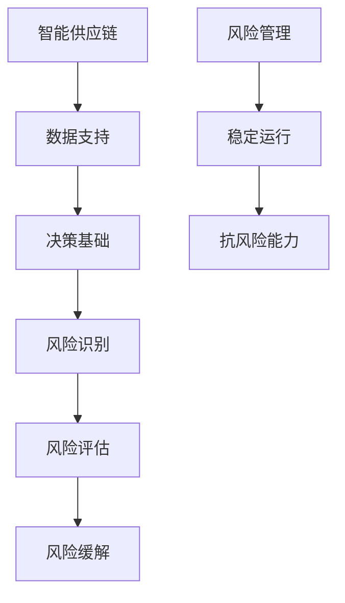

                 


### <标题：AI驱动的智能供应链风险管理：预测和缓解潜在中断>

#### 关键词：智能供应链，风险管理，人工智能，预测，中断缓解，供应链优化，弹性设计，供应链金融，可视化

#### 摘要：
本文深入探讨了AI在智能供应链风险管理中的应用，涵盖了从基础概念到实际应用的各个方面。文章首先介绍了智能供应链及其风险管理的核心概念，接着详细阐述了AI在风险识别、预测和缓解中的应用。通过具体的算法、数学模型和实际案例分析，本文展示了AI如何帮助企业和组织预测供应链中断，并制定有效的缓解策略，以提升供应链的弹性和可靠性。

---

## 引言

### 书名：《AI驱动的智能供应链风险管理：预测和缓解潜在中断》

在当今全球化经济中，供应链的复杂性不断增加，企业面临的风险也日益多样化和复杂化。传统的供应链风险管理方法往往依赖于经验和直觉，难以应对迅速变化的市场环境和突发事件。随着人工智能（AI）技术的快速发展，利用AI进行供应链风险管理成为了一种新的趋势。

本书旨在探讨如何利用AI技术驱动智能供应链风险管理，特别是如何通过预测和缓解潜在的中断来提升供应链的稳定性和效率。文章将从以下几个部分展开：

1. **智能供应链概述**：介绍智能供应链的定义、组成部分以及面临的挑战和机遇。
2. **AI在供应链风险管理中的应用**：探讨AI在供应链风险管理中的作用和常见技术。
3. **智能供应链风险管理的核心概念**：阐述风险管理原理、风险识别与评估、风险缓解策略。
4. **AI驱动的供应链风险预测**：介绍风险预测的重要性、方法及其案例分析。
5. **供应链中断管理**：讨论供应链中断的概念、管理步骤和方法，并分析案例。
6. **AI驱动的供应链风险缓解策略**：包括供应链优化、弹性设计、供应链金融、可视化与决策支持系统。
7. **实践与案例**：分享AI驱动的智能供应链风险管理实践案例，讨论挑战与解决方案。
8. **总结与展望**：总结文章主要内容，展望未来发展趋势。

通过逐步分析和推理，本文将帮助读者了解AI在智能供应链风险管理中的潜力，掌握如何利用AI技术进行预测和缓解潜在的中断。

---

## 第一部分：智能供应链风险管理基础

### 第1章：智能供应链概述

#### 1.1 智能供应链的定义与重要性

智能供应链是一种利用先进技术（如物联网、大数据分析、人工智能等）对供应链进行全方位管理和优化的方法。与传统供应链相比，智能供应链具有更高的透明度、灵活性和响应速度。其核心在于通过实时数据分析和智能决策，实现供应链各环节的高效协同和优化。

智能供应链的重要性体现在以下几个方面：

- **提高供应链效率**：通过自动化和智能化技术，减少人为干预和操作错误，提高供应链各环节的效率。
- **提升供应链透明度**：实时数据监控和共享，使得供应链上下游企业能够更清楚地了解供应链状态，减少信息不对称。
- **增强供应链弹性**：通过智能预测和应对机制，能够更好地应对突发事件和需求波动。
- **降低运营成本**：通过优化库存管理、物流运输等环节，减少不必要的资源浪费和成本支出。

#### 1.2 智能供应链的组成部分

智能供应链主要由以下几个组成部分构成：

- **物联网技术**：通过传感器、RFID等技术实现供应链各环节的数据采集和传输，为智能分析和决策提供数据基础。
- **大数据分析**：对采集到的海量数据进行处理和分析，挖掘有价值的信息，用于优化供应链管理。
- **人工智能**：利用机器学习、深度学习等技术进行智能预测、决策和优化，提升供应链的智能化水平。
- **云计算与边缘计算**：提供强大的计算能力和数据存储能力，支持实时数据处理和智能分析。
- **供应链协同平台**：整合供应链上下游企业的信息，实现信息共享和协同作业。

#### 1.3 智能供应链的挑战与机遇

尽管智能供应链具有巨大的潜力，但在实际应用过程中也面临着一系列挑战：

- **数据整合与兼容性**：不同系统和平台之间的数据格式和接口可能存在差异，导致数据整合和共享的难度。
- **技术更新与升级**：智能供应链技术更新速度快，企业需要不断投入资源进行技术升级和维护。
- **数据隐私与安全**：供应链数据的敏感性和重要性要求高，数据隐私和安全成为必须关注的问题。
- **人才短缺**：智能供应链的运行和管理需要具备技术和管理能力的复合型人才。

然而，随着技术的不断进步和市场的成熟，智能供应链也为企业带来了新的机遇：

- **市场竞争力提升**：通过智能供应链的管理和优化，企业能够更好地满足市场需求，提升市场竞争力。
- **成本节约与效率提升**：智能供应链能够帮助企业降低运营成本，提高供应链效率。
- **业务模式创新**：智能供应链为企业提供了新的商业模式和机会，如供应链金融、共享物流等。

总之，智能供应链作为一种新型的供应链管理模式，不仅带来了新的挑战，也提供了广阔的发展机遇。企业应积极拥抱新技术，探索智能供应链的最佳实践，以实现供应链的全面升级和优化。

---

### 第2章：AI在供应链风险管理中的应用

#### 2.1 AI在供应链风险管理中的作用

人工智能（AI）技术在供应链风险管理中发挥着至关重要的作用。通过引入AI技术，企业能够更加精确地识别潜在风险、预测风险事件的发生概率，并制定有效的风险缓解策略。以下是AI在供应链风险管理中的具体作用：

- **风险识别与预警**：AI技术可以通过大数据分析，实时监测供应链各环节的数据，发现潜在的风险信号，及时发出预警，避免潜在损失。
- **预测与分析**：基于机器学习和深度学习算法，AI可以分析历史数据和实时数据，预测供应链中断和延迟事件，为决策提供科学依据。
- **优化决策**：AI技术可以基于实时数据和智能算法，优化供应链的库存管理、物流配送等决策，提高供应链的效率和灵活性。
- **自动化处理**：通过自动化技术，AI可以自动处理和响应供应链中的异常事件，减少人为干预和错误，提升供应链的响应速度和准确性。

#### 2.2 常见AI技术及其在供应链风险管理中的应用

在供应链风险管理中，以下几种AI技术得到了广泛应用：

- **机器学习**：通过训练模型，机器学习可以从大量历史数据中学习规律，预测未来可能发生的事件。例如，可以使用回归模型预测库存水平，使用聚类算法识别异常供应商等。
  
- **深度学习**：深度学习在图像识别、语音识别等领域取得了巨大成功。在供应链风险管理中，深度学习可以用于预测供应链中断、识别潜在欺诈行为等。

- **自然语言处理（NLP）**：NLP技术可以处理和理解自然语言文本，用于分析供应链相关的文档和报告，提取关键信息，用于风险分析和决策支持。

- **强化学习**：强化学习通过试错和反馈机制，可以自动学习和优化决策策略。在供应链风险管理中，强化学习可以用于动态库存管理、路径优化等。

#### 2.3 案例分析：AI在供应链风险管理中的应用

以下是一个实际案例，展示了AI技术在供应链风险管理中的成功应用：

- **案例背景**：某大型制造企业面临供应链中断的风险，其关键供应商位于地震频发的地区。企业需要预测地震可能导致的供应链中断，并制定相应的缓解策略。

- **解决方案**：
  1. **数据收集**：企业收集了历史地震数据、供应商地理位置、物流运输数据等。
  2. **数据预处理**：对收集到的数据进行了清洗和预处理，以便用于模型训练。
  3. **模型训练**：使用机器学习算法，构建了地震发生概率预测模型和供应链中断影响模型。
  4. **风险预警**：通过实时监测供应商地理位置和地震预警信息，系统自动预测地震发生概率，并向管理层发送预警。
  5. **决策支持**：根据预测结果，企业制定了相应的供应链中断缓解策略，如提前采购、储备库存、调整物流路线等。

- **效果评估**：通过AI技术的应用，企业成功预测了多次地震事件，提前采取了预防措施，避免了潜在的供应链中断风险，显著提高了供应链的稳定性。

此案例展示了AI技术在供应链风险管理中的巨大潜力。通过利用AI技术，企业可以更加精准地识别风险、预测风险事件，并制定有效的缓解策略，从而提高供应链的可靠性和效率。

---

### 第3章：智能供应链风险管理的核心概念

#### 3.1 风险管理原理

风险管理是供应链管理的重要组成部分，其目标是通过识别、评估、缓解和管理风险，确保供应链的稳定运行和企业的持续发展。以下简要介绍风险管理的基本原理：

- **风险识别**：通过系统的方法，识别供应链中可能面临的各种风险，如自然灾害、供应链中断、质量风险等。
- **风险评估**：对识别出的风险进行量化或定性分析，评估其发生的概率和可能造成的损失。
- **风险缓解**：制定和实施策略，降低风险的概率或减少其可能造成的损失。
- **风险监控**：对已识别和缓解的风险进行持续监控，确保风险缓解措施的有效性。

#### 3.2 风险识别与评估

风险识别与评估是风险管理的核心环节。以下是具体步骤：

- **风险识别**：
  - **定性识别**：通过专家访谈、文献研究、历史数据分析等方法，识别潜在的风险因素。
  - **定量识别**：使用模型和算法，分析风险因素的概率和影响程度，识别高风险区域。

- **风险评估**：
  - **定性评估**：通过专家评分、决策矩阵等方法，评估风险的概率和影响程度。
  - **定量评估**：使用数学模型，如蒙特卡洛模拟、风险评估矩阵等，量化风险的概率和损失。

#### 3.3 风险缓解策略

风险缓解策略的目标是降低风险的概率或减少其可能造成的损失。以下是几种常见策略：

- **预防措施**：通过改进供应链设计、加强供应商管理、提高库存水平等手段，预防风险的发生。
- **应急响应计划**：制定应急预案，确保在风险事件发生时能够快速响应，减少损失。
- **保险与金融工具**：通过购买保险、利用供应链金融工具等方式，转移或降低风险损失。

#### 概念联系：智能供应链与风险管理的相互作用

智能供应链与风险管理之间存在着密切的相互作用：

- **智能供应链**为风险管理提供了数据支持和决策基础。通过物联网、大数据分析等技术，智能供应链能够实时收集和分析供应链数据，为风险识别与评估提供丰富的数据来源。
- **风险管理**是智能供应链持续优化和稳定运行的重要保障。通过风险识别、评估和缓解，风险管理能够确保智能供应链在复杂多变的环境中保持稳定，提高企业的抗风险能力。

为了更好地理解智能供应链与风险管理的相互作用，以下是使用Mermaid绘制的概念关系图：



通过上述分析，可以看出智能供应链和风险管理是相互依存、相互促进的。企业应充分利用智能供应链提供的数据和工具，实施有效的风险管理策略，以提升供应链的弹性和可靠性。

---

### 第4章：AI驱动的供应链风险预测

#### 4.1 供应链风险预测的重要性

供应链风险预测在智能供应链管理中扮演着至关重要的角色。其核心目标是通过分析历史数据和实时信息，提前识别可能出现的供应链中断、延迟或其他风险事件，从而采取预防性措施，减少潜在损失。以下是供应链风险预测的重要性和具体作用：

- **提前预警**：通过预测分析，企业可以提前发现潜在风险，及时发出预警，为管理层提供决策依据，避免或减少风险事件的发生。
- **资源优化**：通过预测风险事件的发生概率和影响范围，企业可以合理安排资源，如库存、物流运输等，提高资源利用效率，降低运营成本。
- **应急预案制定**：风险预测结果可以帮助企业制定更加精准和有效的应急预案，确保在风险事件发生时能够迅速响应，减少损失。
- **决策支持**：风险预测为供应链管理和决策提供了科学依据，帮助企业做出更加合理和优化的决策，提高供应链的整体效能。

#### 4.2 基于AI的风险预测方法

AI技术在供应链风险预测中具有显著优势。以下是几种常见的基于AI的风险预测方法：

- **时间序列分析**：通过分析供应链数据的时间序列特征，预测未来风险事件的发生趋势。常见的时间序列预测模型包括ARIMA（自回归积分滑动平均模型）、LSTM（长短期记忆网络）等。

- **回归分析**：利用历史数据建立回归模型，预测特定风险事件的发生概率。回归模型包括线性回归、多元回归等。

- **神经网络**：神经网络，尤其是深度学习模型，能够自动学习和提取数据中的复杂特征，进行高级的风险预测。常见的神经网络模型包括CNN（卷积神经网络）和RNN（循环神经网络）。

- **集成学习方法**：通过集成多种预测模型，提高预测的准确性和鲁棒性。常见的集成学习方法包括随机森林、梯度提升机等。

以下是一个简单的基于时间序列分析的Python代码示例，用于预测供应链中断事件：

```python
import numpy as np
import pandas as pd
from statsmodels.tsa.arima_model import ARIMA
from sklearn.metrics import mean_squared_error

# 加载数据
data = pd.read_csv('supply_chain_data.csv')

# 数据预处理
data['Date'] = pd.to_datetime(data['Date'])
data.set_index('Date', inplace=True)
data = data.asfreq('D').fillna(method='ffill')

# 创建ARIMA模型
model = ARIMA(data['Interrupts'], order=(5, 1, 2))

# 模型训练
model_fit = model.fit()

# 预测
forecast = model_fit.forecast(steps=30)[0]

# 预测结果评估
test_data = data[-30:]
actual = test_data['Interrupts']
predicted = forecast

mse = mean_squared_error(actual, predicted)
print(f'Mean Squared Error: {mse}')

# 绘制预测结果
import matplotlib.pyplot as plt

plt.figure(figsize=(12, 6))
plt.plot(data['Interrupts'], label='Actual')
plt.plot(test_data['Interrupts'], label='Test')
plt.plot(predicted, label='Forecast')
plt.legend()
plt.show()
```

#### 4.3 风险预测案例分析

以下是一个实际案例，展示了如何利用AI技术进行供应链风险预测：

- **案例背景**：某电商企业面临春节期间物流延迟的风险。该企业希望预测春节期间物流延误的概率，以便提前采取应对措施。

- **数据收集**：企业收集了过去几年的物流数据，包括订单量、配送时间、运输距离等。

- **数据预处理**：对收集到的数据进行清洗和预处理，包括缺失值填充、异常值处理等。

- **模型选择**：选择LSTM模型进行风险预测，因为LSTM模型能够处理时间序列数据的时序依赖性。

- **模型训练**：将预处理后的数据分为训练集和测试集，使用训练集训练LSTM模型。

- **预测与评估**：使用训练好的模型对春节期间的物流延误进行预测，并评估预测的准确性。

- **结果分析**：通过预测结果，企业发现春节期间物流延误的概率较高，于是提前与物流公司协商，增加了物流运力，确保了春节前的物流顺畅。

通过上述案例分析，可以看出AI技术在供应链风险预测中的应用效果显著。企业可以利用AI技术提前识别和应对潜在风险，提高供应链的可靠性和稳定性。

---

### 第5章：供应链中断管理

#### 5.1 供应链中断的概念与类型

供应链中断是指供应链中某个环节出现故障或受阻，导致供应链整体运行受阻或中断的现象。供应链中断可以由多种原因引起，包括自然灾害、供应商问题、物流问题、技术故障等。以下是几种常见的供应链中断类型：

- **自然灾害中断**：如地震、洪水、飓风等自然灾害可能导致供应链节点受损或运输中断。
- **供应商中断**：供应商破产、质量问题、供应能力不足等可能导致供应链上游中断。
- **物流中断**：运输工具故障、交通拥堵、港口问题等可能导致物流环节中断。
- **技术故障中断**：信息系统故障、网络中断、设备故障等可能导致供应链的数据处理和流程运行受阻。

#### 5.2 中断管理的步骤与方法

供应链中断管理是企业应对中断事件、减少损失、恢复供应链运行的过程。以下是中断管理的常见步骤和方法：

- **风险识别与评估**：通过数据分析、风险评估方法，识别潜在的中断风险，评估其可能的影响和发生的概率。
- **应急预案制定**：根据风险识别结果，制定相应的应急预案，明确中断事件发生时的应对措施和责任分配。
- **信息共享与沟通**：建立中断事件的信息共享机制，确保供应链上下游企业能够及时沟通和协作，共同应对中断事件。
- **紧急响应**：在供应链中断事件发生时，立即启动应急预案，采取紧急措施，如调整物流路线、增加备用库存、启用备用供应商等。
- **恢复与优化**：中断事件处理结束后，进行供应链的恢复和优化，总结经验教训，改进供应链设计和流程。

#### 5.3 案例分析：应对突发供应链中断

以下是一个实际案例，展示了如何应对突发供应链中断：

- **案例背景**：某电子产品公司生产基地遭遇洪水，导致生产线停滞，供应链中断。
- **应对措施**：
  1. **立即启动应急预案**：公司迅速启动应急预案，通知供应链上下游企业，共同应对中断事件。
  2. **调整物流路线**：公司调整物流路线，利用第三方物流公司，确保原材料和成品的运输不受影响。
  3. **储备库存**：公司利用储备库存，维持生产线的正常运转，减少生产延误。
  4. **启用备用供应商**：公司联系备用供应商，确保关键原材料的供应。
  5. **信息共享与沟通**：公司建立信息共享平台，实时更新中断事件进展，确保供应链上下游企业及时了解情况，协同应对。
- **效果评估**：通过及时应对和有效措施，公司成功降低了中断事件带来的损失，恢复了供应链的正常运行。同时，公司对供应链设计和流程进行了优化，提高了供应链的弹性和抗风险能力。

此案例展示了在突发供应链中断事件中，通过应急预案、信息共享和沟通、调整物流路线等措施，企业能够迅速应对，减少损失，恢复供应链运行。

---

### 第6章：AI驱动的供应链风险缓解策略

#### 6.1 供应链优化的目标与策略

供应链优化是提升供应链效率和降低成本的重要手段。AI技术在供应链优化中发挥着关键作用，通过智能算法和大数据分析，实现供应链各环节的优化和协调。以下是供应链优化的主要目标和策略：

- **库存管理优化**：通过实时数据分析，优化库存水平，减少库存过剩和短缺，降低库存成本。
- **物流路径优化**：利用AI算法，优化物流运输路径，减少运输时间和成本，提高运输效率。
- **供应商管理优化**：通过数据分析，评估供应商绩效，优化供应商选择和协作，提升供应链稳定性。
- **需求预测优化**：利用AI技术，准确预测市场需求，优化生产计划和库存水平，减少库存波动和缺货风险。

#### 6.2 基于AI的供应链优化方法

以下介绍几种常见的基于AI的供应链优化方法：

- **机器学习**：通过机器学习算法，分析历史数据，预测未来需求，优化库存和生产计划。常见的机器学习算法包括线性回归、决策树、支持向量机等。
- **深度学习**：利用深度学习模型，如神经网络、卷积神经网络（CNN）等，自动学习和提取数据中的复杂特征，实现高级的供应链优化。
- **强化学习**：通过强化学习算法，如Q-learning、深度Q网络（DQN）等，在动态环境中进行决策，优化供应链各环节的运作。

#### 6.3 案例分析：使用AI优化供应链

以下是一个实际案例，展示了如何利用AI技术优化供应链：

- **案例背景**：某电子产品制造商希望优化其全球供应链，提高生产效率和降低成本。
- **解决方案**：
  1. **数据收集**：公司收集了全球各生产基地的运营数据、市场需求数据、供应商信息等。
  2. **数据预处理**：对收集到的数据进行了清洗和预处理，为AI模型提供高质量的数据输入。
  3. **模型训练**：使用机器学习算法，如线性回归和深度学习模型，训练预测市场需求和生产计划的模型。
  4. **优化策略制定**：根据预测结果，制定优化的库存管理策略、物流路径策略和供应商管理策略。
  5. **实施与评估**：实施优化策略，并进行持续评估和调整，确保优化效果的实现。
- **效果评估**：
  - **库存成本减少**：通过优化库存管理，库存周转率提高，库存成本显著降低。
  - **运输成本降低**：通过优化物流路径，运输时间和运输成本均有所下降。
  - **生产效率提升**：通过优化生产计划和供应商管理，生产效率提高，生产延误减少。

此案例展示了AI技术在供应链优化中的应用效果。通过AI技术的应用，企业能够实现库存、物流、供应商等多方面的优化，提高供应链的整体效率和竞争力。

---

### 第7章：智能供应链网络的弹性设计

#### 7.1 弹性设计的概念与原则

弹性设计（Resilience Design）是智能供应链管理中的一个关键概念，旨在通过设计和实施一系列策略，增强供应链对突发事件的适应能力和恢复速度。弹性设计的目标是确保在面临不确定性（如自然灾害、供应链中断、市场波动等）时，供应链能够快速恢复和正常运行，最大限度地减少损失。

以下是弹性设计的一些核心概念和原则：

- **冗余设计**：通过引入冗余资源（如备用设备、库存、备用供应商等），确保在关键组件出现故障时，能够立即切换到备用资源，保持供应链的连续性。
- **动态调整**：通过实时监控和动态调整供应链各环节，如库存水平、物流路径、供应商选择等，快速应对突发状况。
- **模块化设计**：将供应链拆分为多个模块，每个模块相对独立，降低单个模块故障对整个供应链的影响。
- **快速恢复**：在发生中断事件后，迅速评估影响范围，制定和实施恢复计划，尽快恢复供应链的正常运行。
- **持续改进**：通过定期评估和优化供应链设计，不断提高供应链的弹性，应对不断变化的市场环境和风险。

#### 7.2 基于AI的弹性供应链网络设计

AI技术在弹性供应链网络设计中具有显著优势，通过智能算法和数据分析，AI可以帮助企业设计出更加弹性、可靠的供应链网络。以下是基于AI的弹性供应链网络设计方法：

- **风险评估与预测**：利用AI技术，对供应链中的潜在风险进行评估和预测，识别可能引起中断的瓶颈和风险点。
- **动态优化**：通过实时数据分析和优化算法，动态调整供应链网络，如库存水平、物流路径等，以应对实时变化。
- **模拟与仿真**：利用AI模拟和仿真技术，对供应链网络进行测试和验证，评估不同弹性设计策略的效果，选择最佳方案。
- **智能监控与预警**：通过AI监控和预警系统，实时监测供应链运行状态，及时发现异常情况，快速响应和处理。

#### 7.3 案例分析：增强供应链弹性以应对不确定性

以下是一个实际案例，展示了如何利用AI技术增强供应链弹性，应对不确定性：

- **案例背景**：某汽车制造企业面临原材料供应不稳定的风险，原材料供应中断可能导致生产线停滞，影响整个供应链的运行。
- **解决方案**：
  1. **风险评估**：使用AI技术对供应链中的潜在风险进行评估，识别出原材料供应不稳定是关键风险点。
  2. **数据收集**：收集原材料供应商的运营数据、市场供需信息等，进行数据预处理。
  3. **动态优化**：利用AI算法，实时监控原材料供应情况，根据市场需求和供应风险，动态调整库存水平和物流路径。
  4. **模拟与仿真**：使用AI模拟和仿真技术，测试不同弹性设计策略，如增加备用供应商、优化库存管理等，评估其效果。
  5. **智能监控与预警**：建立AI监控和预警系统，实时监测供应链运行状态，发现供应中断风险时，立即启动应急预案。
- **效果评估**：
  - **供应链弹性增强**：通过动态优化和智能监控，供应链对原材料供应中断的适应能力显著提升。
  - **生产连续性提高**：通过增加备用供应商和优化库存管理，确保生产线的连续运行，减少停工时间和生产成本。

此案例展示了AI技术在弹性供应链网络设计中的应用效果。通过AI技术，企业能够更好地识别和应对供应链风险，提高供应链的弹性和可靠性。

---

### 第8章：供应链金融与AI

#### 8.1 供应链金融概述

供应链金融是一种通过供应链中各环节的信用和交易信息，为供应链上的企业提供融资和风险管理服务的金融模式。其核心在于利用供应链中的真实交易背景，通过金融服务缓解企业的资金压力，促进供应链的顺畅运作。

供应链金融的主要特点包括：

- **依托真实交易**：供应链金融基于真实的贸易背景和交易记录，风险较低。
- **融资高效便捷**：通过数据分析和风险评估，供应链金融能够快速审批和放款，提高融资效率。
- **覆盖范围广泛**：供应链金融不仅服务于核心企业，还覆盖了中小企业，支持整个供应链的发展。

#### 8.2 AI在供应链金融中的应用

AI技术在供应链金融中发挥着重要作用，通过智能算法和数据分析，AI能够提升供应链金融的服务效率和风险管理能力。以下是AI在供应链金融中的应用：

- **风险评估**：AI技术可以通过大数据分析和机器学习模型，对供应链中的企业进行信用评估，提高风险评估的准确性和效率。
- **智能授信**：基于AI算法的智能授信系统，能够根据企业的历史交易数据、财务状况、市场环境等因素，自动审批和调整授信额度。
- **风险管理**：通过实时数据监控和预警系统，AI能够及时发现和应对供应链中的风险事件，如欺诈行为、供应链中断等。
- **供应链金融产品创新**：AI技术可以支持供应链金融产品的创新，如基于区块链的供应链金融、智能合约等，提高供应链金融的透明度和安全性。

#### 8.3 案例分析：AI赋能供应链金融

以下是一个实际案例，展示了AI技术在供应链金融中的应用：

- **案例背景**：某大型制造商希望为其供应链中的中小企业提供融资支持，以缓解其资金压力。
- **解决方案**：
  1. **数据收集**：制造商收集了供应链中小企业的交易数据、财务报表、市场状况等，进行数据预处理。
  2. **风险评估**：使用机器学习模型，对供应链中的中小企业进行信用评估，确定其信用等级和融资额度。
  3. **智能授信**：建立智能授信系统，基于AI算法自动审批和调整授信额度，提高融资效率。
  4. **风险监控**：通过实时数据监控和预警系统，监控供应链中的风险事件，及时发现并应对潜在风险。
- **效果评估**：
  - **融资效率提升**：通过智能授信系统，供应链中小企业的融资时间显著缩短，资金压力得到缓解。
  - **风险管理能力提高**：AI技术的应用，使制造商能够实时监控供应链风险，降低融资风险。
  - **供应链稳定性增强**：通过供应链金融支持，中小企业能够更好地应对市场波动和资金压力，提高了供应链的稳定性。

此案例展示了AI技术在供应链金融中的成功应用。通过AI技术，企业能够实现更高效的风险评估和智能授信，提高供应链金融的服务质量和风险管理能力。

---

### 第9章：供应链可视化与决策支持系统

#### 9.1 可视化技术的应用

供应链可视化是智能供应链管理的重要组成部分，通过图形化、动态化地展示供应链各环节的数据和流程，帮助企业更好地理解和管理供应链。以下是供应链可视化技术的应用：

- **供应链地图**：通过地图形式展示供应链各节点的地理位置、物流路径和关键资源分布，帮助企业管理者直观了解供应链布局。
- **实时监控**：利用实时数据流，动态展示供应链各环节的运行状态，如库存水平、物流进度、生产计划等，便于管理人员及时发现和解决问题。
- **风险预警**：通过可视化技术，将供应链中的风险因素以图形化的方式展示，帮助企业管理者快速识别风险，并采取相应的预防措施。
- **决策支持**：利用可视化分析工具，对供应链数据进行深入分析，为企业管理者提供决策支持，优化供应链设计和运营。

#### 9.2 决策支持系统的作用

决策支持系统（DSS）是供应链管理中的一种重要工具，通过集成数据分析和智能算法，为企业管理者提供科学的决策依据。以下是DSS在供应链管理中的作用：

- **需求预测**：利用历史数据和预测算法，DSS可以准确预测市场需求，帮助企业管理者制定合理的产品生产和库存策略。
- **库存优化**：通过分析库存数据，DSS可以帮助企业确定最佳的库存水平，减少库存成本，避免缺货和过剩。
- **物流优化**：DSS可以根据实时物流数据，优化物流路径和运输计划，提高运输效率和降低成本。
- **风险管理**：DSS可以分析供应链中的风险数据，识别潜在风险，并提供风险缓解策略，帮助企业降低风险。

#### 9.3 案例分析：构建智能供应链决策支持系统

以下是一个实际案例，展示了如何构建智能供应链决策支持系统：

- **案例背景**：某零售企业希望通过智能供应链决策支持系统，优化其库存管理和物流配送。
- **解决方案**：
  1. **数据收集**：企业收集了历史销售数据、库存数据、物流数据等，进行数据预处理。
  2. **需求预测**：使用机器学习算法，对销售数据进行分析和预测，确定市场需求趋势。
  3. **库存优化**：利用库存优化算法，根据市场需求预测和库存水平，制定最优的库存管理策略。
  4. **物流优化**：基于物流数据，使用优化算法，确定最优的物流路径和运输计划。
  5. **风险监控**：通过可视化技术和实时监控，识别供应链中的风险因素，并提供风险预警和缓解策略。
- **效果评估**：
  - **库存成本降低**：通过智能库存管理，企业库存周转率提高，库存成本显著降低。
  - **物流效率提升**：通过物流优化，运输时间和成本均有所下降，物流效率显著提升。
  - **风险控制能力增强**：通过风险监控和预警，企业能够及时发现和应对供应链中的风险事件，降低风险损失。

此案例展示了智能供应链决策支持系统在库存管理和物流优化中的应用效果。通过DSS的应用，企业能够实现更高效、更科学的决策，提高供应链的整体效能。

---

### 第10章：AI驱动的智能供应链风险管理实践

#### 10.1 实践案例分析

在实际应用中，AI驱动的智能供应链风险管理已经为多个行业和领域带来了显著效益。以下是几个典型案例：

- **案例1：制造行业**：某全球领先的制造企业通过引入AI技术，对其全球供应链进行优化和风险管理。企业利用机器学习算法对历史供应链数据进行分析，预测潜在风险，并制定相应的缓解策略。通过实时监控和动态调整，企业成功避免了多次供应链中断事件，提高了供应链的稳定性和响应速度。

- **案例2：零售行业**：某大型零售企业采用了AI驱动的智能供应链决策支持系统，对库存管理和物流配送进行优化。通过需求预测和库存优化算法，企业能够准确预测市场需求，制定合理的库存策略，减少了缺货和过剩现象。同时，通过物流优化，企业显著降低了运输时间和成本，提高了物流效率。

- **案例3：食品行业**：某食品企业通过AI技术对其供应链进行风险评估和管理。企业利用深度学习模型，分析历史供应链中断事件，预测可能的中断风险，并制定应急预案。在面临自然灾害和供应链中断风险时，企业能够迅速采取行动，减少损失，确保产品供应的连续性。

#### 10.2 实践中的挑战与解决方案

尽管AI驱动的智能供应链风险管理带来了显著效益，但在实际应用中仍面临一系列挑战：

- **数据质量**：智能供应链风险管理依赖于高质量的数据，数据缺失、错误和不一致性会影响风险预测的准确性。解决方案包括数据清洗、数据治理和数据标准化。

- **技术实施**：AI技术的实施需要大量的计算资源和专业技能。企业需要建立完善的技术基础设施，并培养具备AI技术能力的人才。

- **合作与协调**：智能供应链风险管理涉及多个供应链环节，需要上下游企业的合作和协调。建立统一的数据标准和沟通机制，促进信息共享和协同作业。

#### 10.3 未来发展趋势与展望

随着AI技术的不断进步和应用场景的扩大，AI驱动的智能供应链风险管理将继续发展，并呈现以下趋势：

- **智能化升级**：AI技术将不断优化，支持更复杂的供应链场景，如复杂供应链网络的动态优化、智能供应链金融等。

- **跨领域融合**：AI技术与物联网、区块链、云计算等技术的融合，将推动智能供应链的全面发展，实现更高效、更安全的供应链管理。

- **定制化应用**：企业将根据自身特点和需求，开发定制化的智能供应链风险管理解决方案，提高供应链的适应性和竞争力。

总之，AI驱动的智能供应链风险管理具有广阔的发展前景。企业应积极拥抱新技术，探索最佳实践，提高供应链的智能化水平和风险管理能力，以应对复杂多变的市场环境。

---

## 附录

### 附录A：常用AI工具与资源

#### A.1 常用AI工具

- **AI模型库**：如TensorFlow Model Garage、Hugging Face Transformers等，提供了丰富的预训练模型和工具。
- **机器学习平台**：如Google Cloud AI、AWS SageMaker等，支持机器学习模型开发、训练和部署。
- **供应链管理软件**：如JDA Software、Manhattan Associates等，提供智能供应链管理解决方案。

#### A.2 资源

- **学术论文与报告**：如IEEE Xplore、ScienceDirect等，提供了大量关于智能供应链和AI研究的学术论文和报告。
- **行业报告**：如Gartner、Forrester等，分析了智能供应链和AI技术的市场趋势和应用案例。
- **在线课程与教程**：如Coursera、edX等，提供了丰富的AI和供应链管理相关课程和教程。

---

### 作者信息

**作者：AI天才研究院/AI Genius Institute & 禅与计算机程序设计艺术 /Zen And The Art of Computer Programming**

