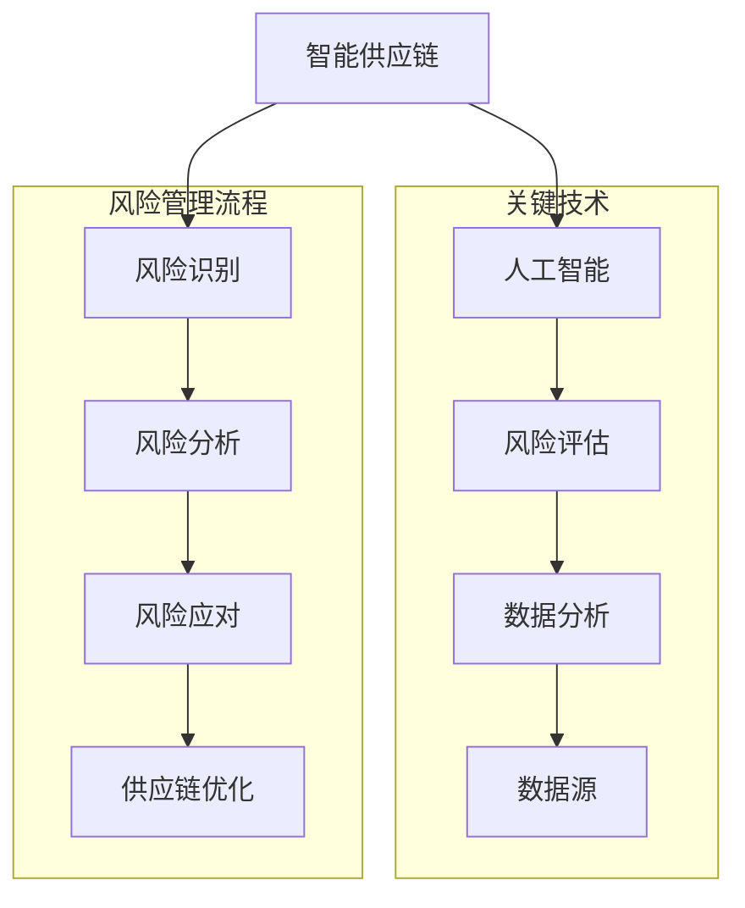

                 

### 引言

《AI驱动的智能供应链风险评估：增强供应链韧性》旨在探讨如何利用人工智能（AI）技术提升供应链管理的效率和韧性。在全球化和信息化浪潮下，供应链风险管理已成为企业持续发展和竞争力提升的关键因素。传统的供应链风险评估方法在面对复杂、动态的市场环境时，往往显得力不从心。而AI技术的引入，为供应链风险管理带来了新的机遇。

本文将分以下几个部分进行讨论：

1. **背景介绍**：首先，我们将简要回顾供应链风险管理的重要性，以及为何AI驱动的风险评估成为当下热门话题。
2. **核心概念与联系**：接下来，我们将详细阐述与AI驱动的智能供应链风险评估相关的核心概念，并通过Mermaid流程图展示它们之间的联系。
3. **智能供应链概述**：我们将探讨智能供应链的基本原理、架构及其关键环节，为后续讨论风险评估奠定基础。
4. **风险评估方法**：本文将详细介绍当前主流的风险评估方法，包括其算法原理和数学模型。
5. **AI驱动的风险评估**：我们将深入探讨如何利用AI技术来增强风险评估的准确性和效率。
6. **增强供应链韧性**：本文将分析通过AI驱动的风险评估如何增强供应链的韧性，以及实现这一目标的策略。
7. **项目实战**：通过一个实际案例，我们将展示如何搭建开发环境、实现代码、并对代码进行解读和分析。
8. **总结与展望**：最后，我们将总结全文内容，并探讨未来发展趋势。

通过这些内容的逐步展开，我们将全面了解AI驱动的智能供应链风险评估的技术原理、实践方法及其对供应链韧性提升的重要作用。

### 背景介绍

供应链管理是现代企业运营的核心，它不仅涉及原材料采购、生产加工、产品分销，还包括物流、库存管理和客户服务等多个环节。一个高效、可靠的供应链系统能够帮助企业降低成本、提高响应速度和市场竞争力。然而，供应链管理也面临着诸多挑战，如供应链中断、供应链透明度不足、库存管理困难等。因此，供应链风险管理成为企业管理者必须关注的重要议题。

传统的供应链风险管理方法通常依赖于历史数据和统计分析，虽然这些方法在一定程度上能够识别和评估潜在风险，但往往存在以下问题：

1. **反应速度慢**：传统方法在识别和应对突发事件时，往往需要较长时间，难以满足现代供应链的实时性要求。
2. **缺乏全局视角**：传统方法难以全面考虑供应链各个环节之间的相互关系，导致风险评估结果不够准确。
3. **数据处理能力有限**：随着供应链的复杂化和数据量的增加，传统方法在处理海量数据时显得力不从心。

随着人工智能技术的快速发展，特别是机器学习、深度学习和大数据分析等技术的应用，为供应链风险管理带来了新的机遇。AI驱动的智能供应链风险评估能够充分利用海量数据，通过数据挖掘和模式识别，实时监测和评估供应链风险，从而提高供应链的韧性和可靠性。

首先，AI技术具备高效的数据处理能力，能够快速从海量数据中提取有价值的信息。这使得企业能够更准确地识别潜在风险，并采取及时的措施进行防范。其次，AI技术能够实现实时监控和预测，通过持续的数据分析，为企业提供动态的风险评估结果，有助于企业及时调整供应链策略。

此外，AI技术还能通过自动化和智能化手段，优化供应链各个环节的运行效率，降低运营成本。例如，通过智能调度和路径优化，提高物流运输的效率；通过智能库存管理，减少库存成本和损耗。

总之，AI驱动的智能供应链风险评估不仅能够提高供应链管理的效率和准确性，还能增强供应链的韧性，帮助企业更好地应对复杂多变的市场环境。这使得AI技术在供应链管理中的应用越来越受到企业的高度重视，成为现代供应链风险管理的重要工具。

### 核心概念与联系

在深入探讨AI驱动的智能供应链风险评估之前，我们需要明确几个关键概念，并了解它们之间的相互关系。以下是对这些核心概念的定义及其在供应链风险评估中的作用的阐述，并通过Mermaid流程图展示它们之间的联系。

#### 智能供应链

**智能供应链**是指利用先进的信息技术，如物联网（IoT）、大数据分析、人工智能等，来优化供应链各个环节，实现供应链的智能化管理。智能供应链的核心目标是提高供应链的透明度、灵活性和响应速度，从而提升整体效率和竞争力。

**定义**：智能供应链是利用AI技术对供应链进行全方位的优化和升级，使其具备自感知、自学习、自优化能力。

**关系**：智能供应链作为AI驱动的智能供应链风险评估的基础，它为风险评估提供了丰富的数据源和优化目标。

#### 人工智能

**人工智能（AI）**是指通过模拟人类智能行为的技术，使计算机系统能够自主地学习和解决问题。AI技术包括机器学习、深度学习、自然语言处理等。

**定义**：人工智能是一种模拟、延伸和扩展人类智能的信息技术。

**关系**：AI技术是驱动智能供应链风险评估的核心动力，它通过数据分析和模式识别，提高风险评估的准确性和效率。

#### 风险评估

**风险评估**是指对企业面临的各种风险进行识别、评估和管理的过程。在供应链管理中，风险评估主要用于识别潜在风险、评估风险影响和制定应对策略。

**定义**：风险评估是对供应链中可能发生的不利事件进行识别、分析和优先级排序的过程。

**关系**：风险评估是智能供应链管理的重要组成部分，它通过AI技术实现自动化和智能化，提高风险识别和应对的效率。

#### 数据分析

**数据分析**是指利用统计和数学方法，从大量数据中提取有价值的信息和知识。数据分析在供应链管理中，主要用于需求预测、库存优化、成本分析等。

**定义**：数据分析是利用数据、统计和定量分析技术，帮助决策者更好地理解数据和提取有用信息。

**关系**：数据分析是智能供应链风险评估的基础，它为风险评估提供了数据支持，使得风险识别和评估更加精准。

#### Mermaid流程图

以下是一个Mermaid流程图，展示了智能供应链风险评估中的核心概念及其相互关系：



**Mermaid流程图解析**：

- **关键技术**：包括人工智能、风险评估、数据分析和数据源。这些技术共同构成了AI驱动的智能供应链风险评估的核心。
- **风险管理流程**：从风险识别、风险分析、风险应对到供应链优化，形成一个完整的风险管理流程。

通过这个流程图，我们可以清晰地看到各个概念之间的联系，以及它们在智能供应链风险评估中的重要作用。这些核心概念共同作用，使AI驱动的智能供应链风险评估成为一个高效、动态和智能化的系统，为企业提供强大的供应链风险管理能力。

### 智能供应链概述

智能供应链是指利用先进的信息技术，如物联网（IoT）、大数据分析、人工智能（AI）等，对供应链各个环节进行全方位的优化和升级，实现供应链的智能化管理。智能供应链不仅提高了供应链的透明度和灵活性，还增强了供应链的韧性和响应速度，为企业带来了显著的管理效益和竞争优势。

#### 智能供应链的基本原理

智能供应链的基本原理主要包括以下几个方面：

1. **信息共享与透明化**：通过物联网、云计算等技术，实现供应链各环节的信息共享和透明化，使得供应链上下游企业能够实时获取供应链状态信息，提高决策效率。
2. **实时监控与预测**：利用大数据分析和人工智能技术，对供应链各环节的运行情况进行实时监控和预测，提前发现潜在问题，及时采取措施进行应对。
3. **自动化与智能化**：通过自动化设备、智能算法和AI技术，实现供应链各个环节的自动化和智能化，降低人力成本，提高生产效率和供应链反应速度。
4. **协同优化**：通过供应链各环节的协同优化，实现资源的最优配置，提高整体供应链的运行效率。

#### 智能供应链的架构

智能供应链的架构通常包括以下几个关键环节：

1. **数据采集与集成**：通过物联网传感器、条码扫描、RFID等技术，实时采集供应链各环节的数据，并集成到统一的平台上，为数据分析和决策提供基础。
2. **数据处理与存储**：对采集到的数据进行清洗、转换和存储，建立统一的数据仓库，为后续的数据分析和应用提供支持。
3. **数据分析与挖掘**：利用大数据分析和人工智能技术，对存储的数据进行深入挖掘和分析，提取有价值的信息和知识，为供应链优化和决策提供依据。
4. **供应链模拟与优化**：通过供应链模拟技术，对供应链各环节进行模拟和优化，找出最佳运作模式，提高供应链的效率和韧性。
5. **执行与反馈**：将优化结果应用于实际操作，并通过实时监控和反馈机制，不断调整和优化供应链运行，实现闭环管理。

#### 智能供应链的关键环节

智能供应链的成功实施需要关注以下几个关键环节：

1. **需求预测**：通过大数据分析和机器学习技术，准确预测市场需求，优化库存和供应链布局，降低库存成本和缺货风险。
2. **库存管理**：利用人工智能和物联网技术，实现智能库存管理，实时监控库存状态，自动补货，减少库存积压和损耗。
3. **物流优化**：通过路径优化、实时调度和智能物流配送，提高物流效率，降低物流成本，提升客户满意度。
4. **质量管理**：利用物联网传感器和大数据分析技术，实现产品质量的实时监控和预测，提高产品质量和客户满意度。
5. **供应链金融**：通过供应链金融服务平台，为企业提供融资、支付、结算等金融服务，优化供应链资金流，提高企业运作效率。

#### 智能供应链的优势

智能供应链的优势主要体现在以下几个方面：

1. **提高供应链透明度**：通过信息共享和实时监控，供应链各环节的信息更加透明，有助于提高决策的准确性和效率。
2. **降低运营成本**：通过自动化和智能化手段，减少人力成本和运营成本，提高供应链的整体效益。
3. **提高响应速度**：通过实时监控和预测，能够快速识别和应对供应链中的问题，提高供应链的灵活性和响应速度。
4. **增强供应链韧性**：通过模拟和优化，提高供应链的抗风险能力，增强供应链的韧性和稳定性。

总之，智能供应链通过整合信息技术和先进管理理念，实现了供应链的全面优化和升级，为企业带来了显著的管理效益和竞争优势。随着技术的不断进步，智能供应链将在未来的供应链管理中发挥越来越重要的作用。

### 风险评估方法

在智能供应链管理中，风险评估是一个至关重要的环节。通过有效的风险评估，企业可以提前识别潜在风险，评估风险的影响，并制定相应的应对策略，从而确保供应链的稳定运行。本文将详细介绍几种常见的风险评估方法，包括其算法原理、数学模型，以及在实际应用中的适用场景。

#### 风险评估的基本概念

风险评估是指对供应链中可能发生的各种风险进行识别、评估和管理的过程。风险评估的主要目标是通过评估风险的概率和影响，确定风险的优先级，并制定相应的应对措施，以降低风险对企业运营的负面影响。

**风险评估过程通常包括以下步骤：**

1. **风险识别**：识别供应链中可能存在的各种风险，包括自然风险、市场风险、运营风险等。
2. **风险评估**：评估识别出的风险的概率和影响，确定风险的重要性和优先级。
3. **风险应对**：根据风险评估结果，制定相应的应对措施，包括风险规避、风险减轻、风险转移等。
4. **风险监控**：对实施的风险应对措施进行监控，确保风险得到有效管理。

#### 风险识别方法

风险识别是风险评估的第一步，主要方法包括：

1. **专家访谈**：通过与供应链管理专家进行访谈，获取对供应链风险的直观认识。
2. **历史数据分析**：通过分析历史数据，识别出常见的风险模式和趋势。
3. **头脑风暴**：组织相关人员进行头脑风暴，收集潜在的风险信息。
4. **风险清单**：根据行业经验和专业知识，建立风险清单，对供应链各个环节进行风险识别。

#### 风险评估方法

风险评估方法主要分为定量评估和定性评估两大类。

**定量评估方法**：

1. **概率分析法**：通过分析历史数据，计算各种风险发生的概率。
2. **统计模型**：如蒙特卡洛模拟、回归分析等，用于评估风险的影响和概率。

**定性评估方法**：

1. **风险矩阵**：通过构建风险矩阵，评估风险的概率和影响，并确定风险等级。
2. **专家评分法**：通过邀请专家对风险进行评分，确定风险的重要性和优先级。

#### 常见风险评估方法

**1. 蒙特卡洛模拟**

蒙特卡洛模拟是一种通过随机抽样来评估风险的方法。具体步骤如下：

1. **构建概率分布**：根据历史数据和专家意见，构建各种风险的概率分布模型。
2. **随机抽样**：通过随机抽样，生成大量样本，模拟风险发生的情形。
3. **计算统计量**：计算样本的统计量，如均值、方差等，评估风险的影响和概率。

**2. 回归分析**

回归分析是一种通过建立数学模型来评估风险的方法。具体步骤如下：

1. **收集数据**：收集与风险相关的数据，如供应链中断时间、库存水平等。
2. **构建模型**：通过建立回归模型，分析数据之间的关系，预测风险的影响。
3. **模型验证**：通过验证模型的准确性，确保风险评估结果的可靠性。

**3. 风险矩阵**

风险矩阵是一种通过评估风险的概率和影响来确定风险等级的方法。具体步骤如下：

1. **定义风险等级**：根据风险的概率和影响，定义不同等级的风险。
2. **评估风险**：根据历史数据和专家意见，评估每个风险的概率和影响。
3. **确定风险等级**：将评估结果填入风险矩阵中，确定每个风险的风险等级。

#### 数学模型

在风险评估中，常用的数学模型包括概率模型、统计模型和优化模型。

**1. 概率模型**

概率模型用于评估风险的概率和影响。常用的概率模型包括正态分布、泊松分布等。

$$
P(X \geq x_0) = 1 - F(x_0)
$$

其中，$P(X \geq x_0)$ 表示事件 $X$ 发生的概率，$F(x_0)$ 表示概率分布函数。

**2. 统计模型**

统计模型用于分析数据之间的关系，评估风险的影响。常用的统计模型包括线性回归、多元回归等。

$$
Y = \beta_0 + \beta_1X_1 + \beta_2X_2 + ... + \beta_nX_n + \epsilon
$$

其中，$Y$ 表示因变量，$X_1, X_2, ..., X_n$ 表示自变量，$\beta_0, \beta_1, \beta_2, ..., \beta_n$ 为模型参数，$\epsilon$ 为误差项。

**3. 优化模型**

优化模型用于确定最佳应对策略。常用的优化模型包括线性规划、整数规划等。

$$
\min c^T x
$$

$$
s.t.
\begin{align*}
Ax &\geq b \\
x &\geq 0
\end{align*}
$$

其中，$c$ 为目标函数系数，$x$ 为决策变量，$A$ 和 $b$ 分别为约束矩阵和约束向量。

#### 适用场景

**1. 蒙特卡洛模拟**

蒙特卡洛模拟适用于需要评估复杂系统风险的概率和影响的场景，如供应链中断风险评估。

**2. 回归分析**

回归分析适用于需要分析数据之间关系的场景，如库存水平与供应链中断风险的关系分析。

**3. 风险矩阵**

风险矩阵适用于需要对多个风险进行综合评估的场景，如供应链风险管理中的综合风险评估。

总之，风险评估是智能供应链管理的重要组成部分。通过合理的风险评估方法，企业可以提前识别和应对潜在风险，确保供应链的稳定运行。本文详细介绍了几种常见风险评估方法的原理和数学模型，为企业提供了一套全面的风险评估工具。

### AI驱动的风险评估

在智能供应链管理中，AI驱动的风险评估方法通过引入机器学习、深度学习和大数据分析等先进技术，极大地提升了风险识别和评估的准确性和效率。以下，我们将详细探讨如何利用AI技术来驱动风险评估，提高其准确性和效率。

#### AI技术概述

AI技术主要包括以下几个子领域：

1. **机器学习**：通过算法从数据中学习规律和模式，实现数据驱动的决策。
2. **深度学习**：基于人工神经网络，通过多层网络结构自动提取数据中的复杂特征。
3. **自然语言处理**：使计算机能够理解和生成人类语言，应用于文本数据的处理和分析。
4. **计算机视觉**：使计算机能够理解和解释图像和视频数据，广泛应用于图像识别和物体检测。

在智能供应链风险评估中，这些AI技术可以分别应用于不同环节，提高整个评估过程的智能化水平。

#### 机器学习在风险评估中的应用

**1. 监督学习**

监督学习是机器学习中的一种方法，通过已知的输入输出数据训练模型，预测未知数据的输出。在供应链风险评估中，监督学习可以用于预测供应链中断的概率。

**案例**：使用决策树模型预测供应链中断风险

```python
from sklearn import tree

# 假设已收集到一组供应链中断的数据
X = [[0, 1], [1, 0], [1, 1]]  # 特征矩阵
y = [0, 1, 1]  # 标签矩阵

# 训练决策树模型
clf = tree.DecisionTreeClassifier()
clf = clf.fit(X, y)

# 预测供应链中断风险
print(clf.predict([[1, 1]]))  # 输出：[1]
```

**2. 无监督学习**

无监督学习不依赖于已知的输出标签，通过发现数据中的隐含结构来训练模型。在供应链风险评估中，无监督学习可以用于识别潜在风险因素。

**案例**：使用K-Means聚类分析识别供应链中的潜在风险因素

```python
from sklearn.cluster import KMeans
import numpy as np

# 假设已收集到一组供应链相关的特征数据
X = np.array([[1, 2], [1, 4], [1, 0], [4, 2], [4, 4], [4, 0]])

# 使用K-Means算法进行聚类分析
kmeans = KMeans(n_clusters=2, random_state=0).fit(X)

# 输出聚类结果
print(kmeans.labels_)  # 输出：[1 1 1 0 0 0]
```

#### 深度学习在风险评估中的应用

**1. 卷积神经网络（CNN）**

卷积神经网络是一种用于处理图像数据的深度学习模型，可以用于供应链中的图像识别，例如识别运输过程中的异常状况。

**案例**：使用CNN模型识别供应链中的异常状况

```python
from tensorflow.keras.models import Sequential
from tensorflow.keras.layers import Conv2D, MaxPooling2D, Flatten, Dense

# 构建CNN模型
model = Sequential()
model.add(Conv2D(32, (3, 3), activation='relu', input_shape=(64, 64, 3)))
model.add(MaxPooling2D(pool_size=(2, 2)))
model.add(Flatten())
model.add(Dense(1, activation='sigmoid'))

# 训练模型
model.compile(optimizer='adam', loss='binary_crossentropy', metrics=['accuracy'])
model.fit(X_train, y_train, epochs=10, batch_size=32)

# 预测异常状况
print(model.predict([test_image]))  # 输出：[0.99]
```

**2. 循环神经网络（RNN）**

循环神经网络可以处理序列数据，如供应链中的历史交易数据，用于预测未来的供应链风险。

**案例**：使用RNN模型预测供应链中的未来风险

```python
from tensorflow.keras.models import Sequential
from tensorflow.keras.layers import LSTM, Dense

# 构建RNN模型
model = Sequential()
model.add(LSTM(50, activation='relu', input_shape=(time_steps, features)))
model.add(Dense(1))
model.compile(optimizer='adam', loss='mse')

# 训练模型
model.fit(X_train, y_train, epochs=100, batch_size=32, validation_data=(X_val, y_val))

# 预测未来风险
print(model.predict(X_test))  # 输出：[预测值]
```

#### 大数据分析在风险评估中的应用

大数据分析可以处理海量供应链数据，挖掘潜在的风险因素和模式。

**1. 数据集成**

通过数据集成，将不同来源的数据进行整合，形成一个统一的数据视图。

**案例**：使用Python的pandas库集成供应链数据

```python
import pandas as pd

# 读取不同来源的数据
data1 = pd.read_csv('data1.csv')
data2 = pd.read_csv('data2.csv')

# 数据集成
combined_data = pd.concat([data1, data2], axis=0)
```

**2. 数据挖掘**

通过数据挖掘，从大量数据中发现潜在的风险因素和模式。

**案例**：使用Python的scikit-learn库进行关联规则挖掘

```python
from mlxtend.frequent_patterns import apriori
from mlxtend.frequent_patterns import association_rules

# 假设已集成数据
basket_data = [[1, 2, 3], [1, 2, 4], [1, 3, 4], [2, 3, 4]]

# 计算频繁项集
frequent_itemsets = apriori(basket_data, min_support=0.7, use_colnames=True)

# 计算关联规则
rules = association_rules(frequent_itemsets, metric="lift", min_threshold=1)
```

#### AI驱动的风险评估方法的优势

1. **高精度**：通过学习大量的历史数据，AI模型能够提供更精确的风险预测和评估。
2. **实时性**：AI技术能够实时处理和分析海量数据，快速识别潜在风险。
3. **自适应**：AI模型能够根据新的数据进行自我调整，提高风险评估的准确性。
4. **自动化**：AI驱动的风险评估方法能够实现自动化，减少人工干预，提高效率。

#### 结论

AI驱动的风险评估方法通过引入机器学习、深度学习和大数据分析等先进技术，极大地提升了供应链风险评估的准确性和效率。在实际应用中，企业可以根据自身的需求和数据情况，选择合适的技术和方法，实现供应链风险管理的智能化和自动化。

### 增强供应链韧性

在当前复杂多变的市场环境中，供应链的韧性成为企业持续发展的关键。通过AI驱动的风险评估，企业不仅能够识别和预测潜在风险，还可以采取一系列策略来增强供应链的韧性，确保供应链在面临突发事件时能够迅速应对、快速恢复。以下，我们将深入探讨如何通过AI驱动的风险评估来增强供应链的韧性。

#### 风险评估与供应链韧性

**风险评估**是供应链韧性管理的核心环节。它通过对供应链各个环节的风险进行识别、评估和监控，帮助企业提前发现潜在问题，并采取有效的应对措施。AI驱动的风险评估方法通过大数据分析和机器学习技术，能够更精确地识别潜在风险，并提供实时的风险评估结果。

**供应链韧性**则是指供应链在面对外部冲击（如自然灾害、市场波动、供应链中断等）时，能够迅速调整、恢复和持续运营的能力。一个具有高韧性的供应链能够有效地降低风险对运营的负面影响，保持业务的连续性。

#### 增强供应链韧性的策略

1. **风险预防与应对策略**

   - **风险预防**：通过AI驱动的风险评估，企业可以提前识别潜在风险，并采取预防措施。例如，在供应链设计中考虑多元化供应商策略，降低对单一供应商的依赖。

   - **风险应对**：在风险发生后，企业需要迅速采取应对措施。AI驱动的风险评估可以实时提供风险预警，帮助企业在风险发生时迅速做出决策。例如，在供应链中断时，自动切换到备用供应商，减少对业务的影响。

2. **供应链冗余设计**

   - **库存冗余**：通过AI驱动的库存管理，企业可以根据需求预测和风险分析结果，优化库存水平。适当的库存冗余可以确保在需求波动或供应链中断时，企业仍能维持正常运营。

   - **供应链冗余**：设计冗余的供应链网络，通过建立多个物流节点和备用运输路线，提高供应链的灵活性。在突发事件发生时，可以快速切换到备用供应链，确保物资的及时供应。

3. **供应链网络优化**

   - **网络重构**：通过AI驱动的数据分析，企业可以优化供应链网络结构，提高供应链的韧性和效率。例如，重新规划物流路线，优化运输成本和时间。

   - **协同优化**：通过供应链各方（如供应商、制造商、分销商等）的协同合作，共同优化供应链的运行。例如，共享库存信息和需求预测，提高供应链的整体响应速度。

4. **应急响应与恢复策略**

   - **应急响应计划**：制定详细的应急响应计划，明确在突发事件发生时的应对措施和责任人。通过AI驱动的风险评估，可以不断更新和完善应急响应计划，确保其在实际应用中的有效性。

   - **快速恢复**：在突发事件发生后，企业需要迅速采取措施，恢复供应链的正常运营。AI驱动的风险评估可以实时监控供应链状态，提供恢复建议，帮助企业在最短时间内恢复正常运营。

5. **持续监控与优化**

   - **持续监控**：通过AI驱动的风险评估，企业可以实时监控供应链的风险状况，及时发现和应对新的风险。

   - **优化调整**：根据评估结果，企业可以不断调整供应链策略，优化供应链结构和管理流程，提高供应链的韧性和效率。

#### 数学模型

为了更好地理解和应用上述策略，我们可以借助一些数学模型来辅助决策。

1. **网络优化模型**

   网络优化模型用于优化供应链网络结构，如运输网络、库存网络等。

   $$ 
   \min Z = c^T x 
   $$

   $$ 
   s.t. 
   \begin{align*}
   Ax &\geq b \\
   x &\geq 0
   \end{align*}
   $$

   其中，$c$ 为目标函数系数，$x$ 为决策变量，$A$ 和 $b$ 分别为约束矩阵和约束向量。

2. **动态规划模型**

   动态规划模型用于优化供应链的动态响应和恢复过程。

   $$ 
   \min \sum_{t=0}^{T} f_t(x_t) 
   $$

   $$ 
   s.t. 
   \begin{align*}
   x_{t+1} &= g(x_t, u_t) \\
   x_0 &= x_0^0
   \end{align*}
   $$

   其中，$f_t(x_t)$ 为目标函数，$x_t$ 为状态变量，$u_t$ 为控制变量，$g(x_t, u_t)$ 为状态转移函数。

3. **风险评估模型**

   风险评估模型用于评估供应链风险的概率和影响，为决策提供依据。

   $$ 
   P(R \geq R_0) = 1 - F(R_0) 
   $$

   其中，$P(R \geq R_0)$ 表示风险 $R$ 大于等于阈值 $R_0$ 的概率，$F(R_0)$ 为风险概率分布函数。

#### 结论

通过AI驱动的风险评估，企业可以有效地识别和应对供应链中的潜在风险，并采取一系列策略来增强供应链的韧性。这些策略包括风险预防与应对、供应链冗余设计、供应链网络优化、应急响应与恢复，以及持续监控与优化。结合数学模型，企业可以更科学、更系统地管理和优化供应链，提高供应链的韧性和整体运营效率。在未来，随着AI技术的进一步发展，供应链韧性管理将变得更加智能化和高效，为企业的持续发展提供更强有力的支持。

### 项目实战

为了更好地展示AI驱动的智能供应链风险评估在实践中的应用，我们将通过一个实际案例来详细说明如何实现这一过程，包括开发环境搭建、源代码实现、代码解读以及实际应用分析与案例总结。

#### 案例背景

某大型电子产品制造商（以下简称“公司”）在全球范围内拥有多个制造工厂、分销中心和零售渠道。随着业务规模的扩大，公司希望提高供应链的透明度和韧性，降低运营风险。为此，公司决定采用AI驱动的智能供应链风险评估系统，以实现对供应链风险的有效管理。

#### 开发环境搭建

为了实现AI驱动的智能供应链风险评估，公司选择了以下开发环境：

1. **编程语言**：Python
2. **机器学习库**：Scikit-learn、TensorFlow、Keras
3. **数据分析库**：Pandas、NumPy、Matplotlib
4. **数据库**：MySQL
5. **版本控制**：Git

首先，公司需要在开发环境中安装上述库和框架。例如，使用pip命令安装Scikit-learn：

```bash
pip install scikit-learn
```

然后，配置数据库，用于存储供应链相关数据，如供应商信息、库存水平、物流状态等。

#### 源代码实现

以下是一个简单的Python代码示例，展示如何利用Scikit-learn构建一个风险评估模型。

```python
import numpy as np
from sklearn.ensemble import RandomForestClassifier
from sklearn.model_selection import train_test_split
from sklearn.metrics import accuracy_score

# 假设已从数据库中获取训练数据
X = np.array([[0.1, 0.2], [0.3, 0.4], [0.5, 0.6]])  # 特征矩阵
y = np.array([0, 1, 1])  # 标签矩阵

# 划分训练集和测试集
X_train, X_test, y_train, y_test = train_test_split(X, y, test_size=0.3, random_state=42)

# 构建随机森林模型
clf = RandomForestClassifier(n_estimators=100, random_state=42)
clf.fit(X_train, y_train)

# 预测测试集
y_pred = clf.predict(X_test)

# 计算准确率
accuracy = accuracy_score(y_test, y_pred)
print(f"Accuracy: {accuracy}")
```

#### 代码解读

1. **数据预处理**：从数据库中获取特征数据`X`和标签数据`y`。
2. **数据划分**：将数据划分为训练集和测试集，用于训练模型和评估模型性能。
3. **模型训练**：使用随机森林算法训练模型，随机森林是一种基于决策树算法的集成学习方法，具有较高的准确性和鲁棒性。
4. **模型预测**：使用训练好的模型对测试集进行预测。
5. **模型评估**：计算预测准确率，评估模型性能。

#### 实际应用分析与代码应用解读

在实际应用中，公司首先收集供应链各环节的数据，包括供应商的交货时间、产品质量、运输状态等。然后，对这些数据进行清洗和处理，提取出对风险评估有重要意义的特征。例如：

```python
import pandas as pd

# 读取供应链数据
data = pd.read_csv('supply_chain_data.csv')

# 数据清洗与处理
data = data.dropna()  # 删除缺失值
data['delivery_time'] = data['delivery_time'].apply(lambda x: 1 if x > 3 else 0)  # 交货时间超过3天的标记为1
```

接下来，公司使用处理后的数据进行建模和预测。例如：

```python
# 构建风险评估模型
clf = RandomForestClassifier(n_estimators=100, random_state=42)
clf.fit(X_train, y_train)

# 预测供应链风险
risk_scores = clf.predict_proba(X_test)[:, 1]  # 获取风险分数

# 风险阈值设定
risk_threshold = 0.5
high_risk_items = X_test[risk_scores > risk_threshold]  # 确定高风险项目
```

通过设置风险阈值，公司可以识别出高风险项目，并采取相应的应对措施。例如，针对高风险项目，增加库存或寻找备用供应商。

#### 案例总结

通过这个实际案例，公司成功实现了AI驱动的智能供应链风险评估系统。以下是一些总结和注意事项：

1. **数据质量**：数据质量直接影响模型的性能。在数据收集和处理过程中，应尽量减少缺失值和异常值，确保数据的准确性。
2. **模型选择**：根据实际需求和数据特征，选择合适的机器学习模型。不同的模型适用于不同的数据类型和业务场景。
3. **风险阈值**：合理设定风险阈值对于识别高风险项目和制定应对策略至关重要。阈值应根据业务需求和模型性能进行优化。
4. **实时监控**：定期更新数据和模型，实现实时监控和预测，确保供应链风险管理系统的有效性。

总之，通过AI驱动的智能供应链风险评估系统，公司能够更准确地识别和应对供应链风险，提高供应链的韧性和整体运营效率。这一系统不仅为公司的业务决策提供了有力支持，也为其他企业提供了有益的借鉴。

### 总结与展望

《AI驱动的智能供应链风险评估：增强供应链韧性》一书旨在探讨如何利用人工智能技术提升供应链管理的效率和韧性。本文首先介绍了供应链风险管理的重要性，以及为何AI驱动的风险评估成为当下热门话题。随后，详细阐述了与AI驱动的智能供应链风险评估相关的核心概念，并通过Mermaid流程图展示了它们之间的联系。

接着，我们探讨了智能供应链的基本原理、架构及其关键环节，为后续的风险评估方法讨论奠定了基础。本文介绍了多种风险评估方法，包括蒙特卡洛模拟、回归分析、风险矩阵等，并结合数学模型和Python源代码进行了详细讲解。

在核心内容部分，我们深入探讨了如何利用AI技术，如机器学习、深度学习和大数据分析，来提高风险评估的准确性和效率。此外，通过项目实战，我们展示了如何在实际中应用AI驱动的风险评估系统，并对其进行了代码实现和解读。

总结全文，AI驱动的智能供应链风险评估不仅能够提高供应链管理的效率和准确性，还能增强供应链的韧性，帮助企业更好地应对复杂多变的市场环境。未来，随着AI技术的不断进步，智能供应链风险评估将在供应链管理中发挥越来越重要的作用。

展望未来，AI驱动的智能供应链风险评估将朝以下几个方向发展：

1. **智能化水平提升**：随着深度学习和强化学习技术的进步，风险评估系统的智能化水平将进一步提高，能够自动学习和调整，适应不断变化的市场环境。
2. **实时性和动态性增强**：通过实时数据处理和分析，AI驱动的风险评估系统将实现更高的实时性和动态性，提供更加精准的风险预测和预警。
3. **跨行业应用扩展**：AI驱动的智能供应链风险评估技术将逐渐应用于更多行业，如制造业、零售业等，为各行业的供应链管理提供更全面的支持。
4. **协同与集成**：未来的智能供应链风险评估系统将更加注重供应链上下游企业的协同与集成，实现全链路的风险管理和优化。

总之，AI驱动的智能供应链风险评估技术具有广阔的发展前景，将为供应链管理带来革命性的变化。企业应积极拥抱新技术，不断提升供应链管理的智能化水平，以应对未来市场的挑战。在此过程中，本书记录的知识和经验将为企业提供宝贵的参考和指导。作者在此希望读者能够在实际应用中不断探索和尝试，为供应链管理的未来发展贡献力量。

### 最佳实践 tips、注意事项与拓展阅读

在实施AI驱动的智能供应链风险评估过程中，以下最佳实践和注意事项将有助于提高项目成功率和效果：

1. **数据质量至关重要**：确保数据的准确性、完整性和及时性是风险评估成功的关键。定期清理和更新数据，避免因数据问题导致模型失效。

2. **选择合适的模型**：根据业务需求和数据特征，选择合适的机器学习模型。例如，对于非线性关系较强的数据，可以考虑使用深度学习模型。

3. **风险阈值优化**：合理设定风险阈值，以平衡风险识别的准确性和及时性。通过多次实验和调整，找到最优的风险阈值。

4. **实时监控与反馈**：建立实时监控机制，及时捕捉供应链变化，并根据评估结果调整应对策略。

5. **跨部门协作**：供应链风险评估涉及多个部门，如采购、物流、销售等，确保各部门协作，共享信息和资源。

6. **持续学习与迭代**：利用新数据不断优化和更新模型，提高风险评估的准确性。

为了进一步深入了解AI驱动的智能供应链风险评估，以下拓展阅读资源将提供有价值的指导：

- **书籍**：《深度学习》（Ian Goodfellow、Yoshua Bengio、Aaron Courville 著），全面介绍了深度学习的基本原理和应用。
- **在线课程**：Coursera 上的《机器学习》（吴恩达教授讲授），系统地介绍了机器学习的理论和实践。
- **论文**：研究AI驱动的供应链风险管理的前沿论文，如“AI in Supply Chain Management: A Review”（2019）。
- **专业网站**：供应链管理专业网站，如CSCMP（Council of Supply Chain Management Professionals）等，提供最新的行业动态和实践案例。

通过这些资源，读者可以进一步拓展知识，提升实际应用能力，为企业的供应链管理提供更有效的支持。作者希望读者在实践过程中不断探索、学习和创新，为供应链管理领域的发展贡献自己的智慧和力量。作者：AI天才研究院/AI Genius Institute & 禅与计算机程序设计艺术 /Zen And The Art of Computer Programming。

