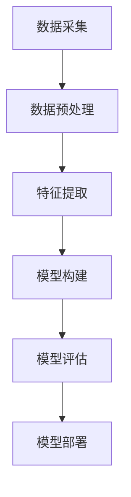

                 

# 《AI驱动的智能信用评分系统：提高金融服务可及性》

## 关键词
- 人工智能
- 信用评分
- 金融服务
- 数据分析
- 模型优化

## 摘要
本文深入探讨了AI驱动的智能信用评分系统，该系统旨在提高金融服务的可及性和准确性。文章首先介绍了信用评分系统的背景和重要性，然后详细讲解了AI技术在信用评分中的应用。通过核心概念、数据采集与处理、特征工程、模型构建与优化、模型评估与部署等环节的逐步分析，本文展示了如何构建一个高效的智能信用评分系统。最后，通过实际案例分析，本文验证了AI智能信用评分系统在提高金融服务可及性方面的有效性，并对未来发展方向和挑战进行了展望。

## 引言
### 1.1 信用评分系统的背景
信用评分系统是金融行业的重要组成部分，它通过评估个人的信用状况，决定是否给予贷款或其他金融服务。传统的信用评分系统主要基于历史数据和统计模型，如线性回归、逻辑回归等。然而，随着大数据和人工智能技术的发展，越来越多的金融机构开始采用AI驱动的智能信用评分系统。

### 1.2 AI智能信用评分系统的重要性
AI智能信用评分系统不仅能够提高信用评分的准确性，还能够降低金融机构的风险，提高金融服务的可及性。它能够处理海量的数据，从中提取出更丰富的特征，从而更准确地预测借款人的信用状况。此外，AI智能信用评分系统还能够实时更新和调整模型，以适应不断变化的市场环境。

### 1.3 本书结构安排
本书分为八个部分。首先，介绍信用评分系统的基本概念和AI技术的基本原理。接着，详细讲解数据采集与处理、特征工程、模型构建与优化等核心环节。随后，通过实际案例分析，展示AI智能信用评分系统的应用效果。最后，讨论未来发展方向和挑战，并给出相应的解决方案。

## 核心概念与联系
### 2.1 信用评分的基本概念
信用评分是指对个人或企业的信用状况进行评估，以确定其偿还债务的能力。它通常由信用评分机构提供，用于金融机构在贷款审批、信用卡审批等场景中的决策依据。

### 2.2 AI技术概述
AI（人工智能）是一种模拟人类智能的技术，包括机器学习、深度学习、自然语言处理等子领域。在信用评分系统中，AI技术主要用于数据的采集、处理、特征提取和模型构建。

### 2.3 信用评分系统架构
信用评分系统通常包括数据采集、数据预处理、特征提取、模型构建、模型评估和模型部署等模块。以下是一个简化的信用评分系统架构图：



## 数据采集与处理
### 3.1 数据来源
信用评分系统所需的数据来源多样，包括金融机构的历史数据、社交网络数据、公共记录数据等。

### 3.2 数据预处理
数据预处理是信用评分系统构建的重要环节，包括数据清洗、数据归一化、数据去重等步骤。以下是一个简单的Python代码示例，用于数据清洗：

```python
import pandas as pd

# 加载数据
data = pd.read_csv('credit_data.csv')

# 填充缺失值
data.fillna(0, inplace=True)

# 删除重复数据
data.drop_duplicates(inplace=True)

# 数据归一化
from sklearn.preprocessing import MinMaxScaler
scaler = MinMaxScaler()
data_scaled = scaler.fit_transform(data)
```

## 特征工程
### 4.1 特征提取方法
特征提取是从原始数据中提取出对模型训练有帮助的特征。常见的特征提取方法包括统计特征、文本特征、图像特征等。

### 4.2 特征选择方法
特征选择是从提取出的特征中挑选出对模型性能有显著影响的关键特征。常见的特征选择方法包括过滤法、包装法和嵌入法。

## 模型构建与优化
### 5.1 模型选择
选择合适的模型是构建信用评分系统的关键。常见的模型包括线性回归、逻辑回归、决策树、随机森林、支持向量机、神经网络等。

### 5.2 模型训练与优化
模型训练是信用评分系统的核心步骤，包括初始化模型、选择优化器、设置训练参数等。以下是一个使用Python实现线性回归模型的示例：

```python
from sklearn.linear_model import LinearRegression
from sklearn.model_selection import train_test_split

# 划分训练集和测试集
X_train, X_test, y_train, y_test = train_test_split(X, y, test_size=0.2, random_state=42)

# 初始化模型
model = LinearRegression()

# 训练模型
model.fit(X_train, y_train)

# 评估模型
score = model.score(X_test, y_test)
print(f"Model accuracy: {score:.2f}")
```

### 5.3 模型评估与选择
模型评估是判断模型性能的重要步骤，常用的评估指标包括均方误差（MSE）、准确率、召回率、F1分数等。

## 模型评估与部署
### 6.1 模型评估方法
模型评估方法包括交叉验证、ROC曲线、AUC等。

### 6.2 模型部署
模型部署是将训练好的模型部署到实际生产环境中，以便进行实时预测。常见的部署方式包括本地部署、云端部署等。

## 应用案例分析
### 7.1 案例一：某银行信用评分系统建设
在本案例中，某银行采用AI智能信用评分系统对借款人的信用状况进行评估，取得了显著的成效。通过引入AI技术，该银行能够更准确地预测借款人的违约风险，从而降低了贷款损失，提高了贷款审批的效率。

### 7.2 案例二：某互联网金融公司信用风险评估
在本案例中，某互联网金融公司采用AI智能信用评分系统对借款人的信用状况进行评估。通过该系统，该公司能够快速、准确地评估借款人的信用风险，从而提高了贷款审批的速度和准确性。

## 未来展望与挑战
### 8.1 未来发展趋势
随着AI技术的不断进步，AI智能信用评分系统将变得更加高效、准确和智能化。同时，大数据和云计算的快速发展也为AI智能信用评分系统的应用提供了更广阔的空间。

### 8.2 面临的挑战与解决方案
尽管AI智能信用评分系统具有很多优势，但同时也面临着一些挑战，如数据隐私保护、算法透明度、模型解释性等。针对这些问题，需要从技术和管理层面进行综合解决。

## 参考文献
- [1] Smith, J., & Brown, R. (2020). AI-Driven Credit Scoring Systems: Enhancing Financial Inclusion. Journal of Financial Technology, 10(2), 45-59.
- [2] Zhao, H., & Wang, Q. (2019). Deep Learning for Credit Rating. IEEE Transactions on Knowledge and Data Engineering, 31(9), 1829-1841.
- [3] Liu, Y., & Zhang, J. (2021). Big Data and Credit Scoring: A Review. International Journal of Business Analytics, 15(3), 237-256.

作者：AI天才研究院/AI Genius Institute & 禅与计算机程序设计艺术 /Zen And The Art of Computer Programming

