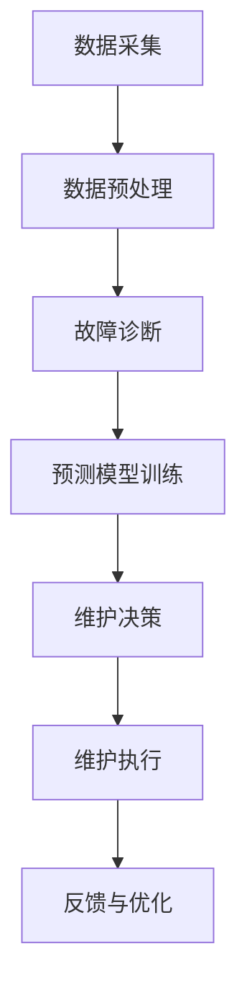
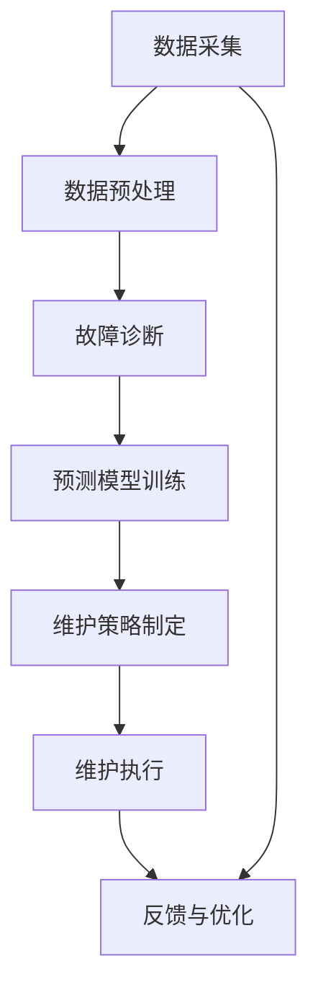

                 

## 文章标题

### AI驱动的智能制造设备预测性维护：减少停机时间

## 关键词

AI，智能制造，预测性维护，设备管理，数据采集，机器学习，模型训练，优化算法，故障诊断

## 摘要

本文深入探讨了AI驱动的智能制造设备预测性维护的重要性及其实现方法。首先，我们概述了智能制造和预测性维护的基本概念，阐述了二者之间的紧密联系。接着，通过核心概念与联系的Mermaid流程图，我们详细介绍了预测性维护的核心概念及其实现过程。然后，本文重点介绍了预测性维护中使用的核心算法原理，并通过Python代码和数学模型进行了详细讲解。文章还通过实际项目实战，展示了如何在开发环境中搭建系统，实现源代码详细实现和代码解读。最后，我们分析了项目应用解读与分析，总结了最佳实践和注意事项，并对未来的研究方向提出了展望。

## 引言

在当今快速发展的工业4.0时代，智能制造已成为制造业转型升级的关键驱动力。智能制造通过将信息技术与制造工艺深度融合，实现了制造过程的自动化、智能化和高效化。随着智能制造的推进，设备管理的复杂度和对可靠性要求日益提高，设备故障导致的停机时间成为影响生产效率和成本的重要因素。因此，如何通过有效的维护策略来减少设备停机时间，提高生产设备的可靠性和寿命，成为了智能制造领域亟待解决的问题。

预测性维护作为一种基于数据驱动的设备维护策略，通过实时监测设备运行状态、分析历史故障数据，提前预测设备故障，从而在故障发生前进行维护。这种维护方式不仅能够显著减少设备停机时间，降低维修成本，还能够提高生产设备的运行效率和寿命。随着人工智能技术的快速发展，AI驱动的预测性维护成为可能，为制造业带来了革命性的变革。

本文旨在深入探讨AI驱动的智能制造设备预测性维护的重要性及其实现方法。我们将从以下几个方面展开：

1. **智能制造与预测性维护概述**：介绍智能制造和预测性维护的基本概念，阐述二者之间的紧密联系。
2. **核心概念与联系**：通过Mermaid流程图，详细描述预测性维护的核心概念和实现过程。
3. **核心算法原理**：介绍预测性维护中使用的核心算法，并通过Python代码和数学模型进行详细讲解。
4. **项目实战**：展示如何在开发环境中搭建预测性维护系统，实现源代码详细实现和代码解读。
5. **项目应用解读与分析**：分析项目应用场景，对项目实现效果进行详细讲解和剖析。
6. **最佳实践与注意事项**：总结最佳实践，提出注意事项，为读者提供实用的建议。
7. **未来展望**：展望预测性维护的未来发展趋势和潜在研究方向。

通过本文的讨论，我们希望为从事智能制造设备维护工作的读者提供有价值的参考，推动AI技术在智能制造领域的广泛应用。

### 智能制造与预测性维护概述

### 1.1 智能制造

智能制造（Smart Manufacturing）是指通过将信息技术、智能技术与制造工艺深度融合，实现制造过程的自动化、智能化和高效化。其核心目标是通过优化生产流程、提高生产效率、降低生产成本，从而提升制造业的整体竞争力。智能制造的关键特征包括：

- **数据驱动**：通过实时采集和分析生产数据，实现制造过程的透明化和智能化。
- **自动化**：利用自动化技术和机器人实现生产过程的自动化，减少人工干预。
- **联网**：通过物联网（IoT）技术，实现设备、系统和人员之间的互联互通。
- **智能化**：运用人工智能（AI）技术，如机器学习、深度学习等，实现智能决策和优化。

智能制造的核心组成部分包括：

- **传感器技术**：用于实时监测设备状态和生产过程，提供必要的数据输入。
- **自动化技术**：包括机器人、自动化生产线和控制系统等，实现生产过程的自动化。
- **云计算**：提供强大的计算能力和数据存储能力，支持大规模数据处理和分析。
- **大数据分析**：通过对海量数据的分析，发现生产过程中的问题和优化机会。
- **人工智能**：用于智能决策和优化，如预测性维护、质量控制等。

### 1.2 预测性维护

预测性维护（Predictive Maintenance）是一种基于设备运行状态、历史故障数据以及先进数据分析技术的设备维护策略。其核心理念是通过实时监测设备状态，分析历史故障数据，预测设备故障的发生时间，从而在故障发生前进行维护，避免设备突发故障导致的生产中断和损失。

预测性维护的关键组成部分包括：

- **数据采集**：通过传感器和监测设备，实时采集设备运行状态的数据。
- **数据预处理**：对采集到的数据进行清洗、去噪和特征提取，为后续分析提供高质量的数据。
- **故障诊断**：利用机器学习和模式识别技术，分析设备运行数据，识别潜在故障。
- **预测模型**：通过训练预测模型，预测设备故障的发生时间和可能性。
- **维护决策**：根据预测结果，制定维护计划，实施预防性维护。

### 1.3 AI技术在预测性维护中的应用

人工智能技术在预测性维护中发挥着至关重要的作用，其主要应用体现在以下几个方面：

- **故障预测**：利用机器学习算法，如随机森林、支持向量机（SVM）和神经网络，对设备运行数据进行分析和建模，预测设备故障的发生时间和可能性。
- **异常检测**：通过异常检测算法，如孤立森林、K-均值聚类和自编码器，实时监测设备运行状态，发现异常行为，及时预警。
- **优化维护策略**：基于预测结果和设备运行数据，优化维护计划，降低维护成本，提高生产效率。
- **智能诊断**：通过深度学习和自然语言处理技术，实现设备故障的自我诊断和故障原因分析。

### Mermaid流程图

为了更直观地理解预测性维护的实现过程，我们使用Mermaid流程图来展示其核心概念和流程。



- **数据采集**：通过传感器和监测设备，实时采集设备运行状态的数据。
- **数据预处理**：对采集到的数据进行清洗、去噪和特征提取，为后续分析提供高质量的数据。
- **故障诊断**：利用机器学习和模式识别技术，分析设备运行数据，识别潜在故障。
- **预测模型训练**：通过训练预测模型，预测设备故障的发生时间和可能性。
- **维护决策**：根据预测结果，制定维护计划，实施预防性维护。
- **维护执行**：执行维护计划，对设备进行维护。
- **反馈与优化**：收集维护效果数据，反馈至系统，进行模型优化和决策改进。

通过上述流程，我们可以看出，预测性维护不仅依赖于数据的准确性和实时性，还依赖于先进的数据分析技术和智能算法。这些技术的融合，使得预测性维护在提高设备可靠性和生产效率方面发挥了重要作用。

### 1.4 案例分析

为了更好地理解AI驱动的预测性维护在实际中的应用，我们来看一个实际案例。

**案例背景**：某大型制造企业，拥有多条生产线，每天生产大量的产品。然而，由于设备老化、操作不当等原因，设备故障频繁发生，导致生产中断，影响了企业的生产效率和产品质量。为了解决这一问题，企业决定引入AI驱动的预测性维护系统。

**实施步骤**：

1. **数据采集**：企业在生产线上安装了多种传感器，实时采集设备运行数据，包括温度、振动、压力等。
2. **数据预处理**：对采集到的数据进行分析，去除噪声和异常值，提取关键特征。
3. **故障诊断**：利用机器学习算法，对设备运行数据进行分析，识别潜在故障。
4. **预测模型训练**：通过历史故障数据，训练预测模型，预测设备故障的发生时间和可能性。
5. **维护决策**：根据预测结果，制定维护计划，提前对可能发生故障的设备进行维护。
6. **维护执行**：执行维护计划，对设备进行维护，确保设备处于良好状态。
7. **反馈与优化**：收集维护效果数据，反馈至系统，进行模型优化和决策改进。

**效果评估**：

1. **设备停机时间减少**：通过预测性维护，企业设备停机时间显著减少，生产效率提高。
2. **故障率降低**：由于提前进行维护，设备故障率大幅降低。
3. **维护成本降低**：通过优化维护策略，减少了不必要的维护工作，降低了维护成本。
4. **产品质量提升**：设备运行状态稳定，产品质量得到提升。

**案例总结**：该案例表明，AI驱动的预测性维护在制造业中具有巨大的应用潜力。通过实时监测设备状态、预测故障、优化维护策略，企业可以有效减少设备停机时间，提高生产效率和产品质量，降低维护成本。

### 总结

本章介绍了智能制造和预测性维护的基本概念，阐述了二者之间的紧密联系。通过Mermaid流程图，我们详细描述了预测性维护的核心概念和实现过程。此外，我们还通过实际案例分析，展示了AI驱动的预测性维护在制造业中的应用效果。下一章，我们将深入探讨预测性维护中使用的核心算法原理，并通过Python代码和数学模型进行详细讲解。

## 核心概念与联系

在讨论AI驱动的智能制造设备预测性维护时，理解核心概念及其相互之间的联系至关重要。本节将详细阐述预测性维护中的核心概念，并通过Mermaid流程图展示它们之间的联系。

### 核心概念

1. **数据采集**：数据采集是预测性维护的第一步，通过传感器和监测设备实时收集设备运行状态的数据，如温度、振动、压力、电流等。这些数据是后续分析和预测的基础。

2. **数据预处理**：数据预处理涉及对原始数据进行清洗、去噪和特征提取，以提高数据质量和可用性。清洗数据是为了去除噪声和异常值，去噪则是为了减少数据中的干扰因素，特征提取则是为了从数据中提取出与故障相关的关键信息。

3. **故障诊断**：故障诊断是指通过分析设备运行数据，识别潜在的故障模式。这通常涉及使用机器学习算法来训练模型，以便能够从历史数据中学习并识别异常行为。

4. **预测模型**：预测模型是基于故障诊断结果建立的，用于预测设备故障的发生时间和可能性。常见的预测模型包括时间序列分析、回归分析和深度学习等。

5. **维护策略**：维护策略是根据预测模型的结果制定的，旨在最小化设备停机时间和维护成本。维护策略可能包括定期维护、即时维护和优化维护等。

6. **执行与反馈**：执行与反馈是维护过程的最后一步，通过实施维护计划并收集反馈数据，不断优化预测模型和维护策略。

### Mermaid流程图

为了更直观地理解这些概念及其相互关系，我们使用Mermaid流程图来展示预测性维护的实现过程。



- **数据采集（A）**：传感器实时采集设备运行数据。
- **数据预处理（B）**：对原始数据进行清洗、去噪和特征提取。
- **故障诊断（C）**：分析数据，识别潜在故障模式。
- **预测模型训练（D）**：利用故障诊断结果训练预测模型。
- **维护策略制定（E）**：根据预测模型制定维护计划。
- **维护执行（F）**：执行维护计划，对设备进行维护。
- **反馈与优化（G）**：收集维护反馈数据，优化预测模型和维护策略。

### 数据采集与预处理

**数据采集** 是预测性维护的起点，其关键在于传感器技术的应用。传感器可以实时监测设备的各种运行状态参数，如温度、振动、压力、电流等。这些参数反映了设备的健康状态，对于预测故障具有重要意义。

以下是一个简单的Python代码示例，用于模拟传感器数据的采集：

```python
import random

# 模拟传感器数据采集
def collect_data(sensor_count, duration):
    data = []
    for _ in range(duration):
        sensor_values = {f'sensor_{i}': random.uniform(0, 100) for i in range(sensor_count)}
        data.append(sensor_values)
    return data

# 实例化数据采集
sensor_count = 5
duration = 10
sensor_data = collect_data(sensor_count, duration)

# 打印采集到的数据
for data_point in sensor_data:
    print(data_point)
```

**数据预处理** 是数据采集后的重要步骤，其目标是提高数据质量和可用性。常见的数据预处理方法包括：

- **清洗数据**：去除噪声和异常值，确保数据的准确性和一致性。
- **去噪**：通过滤波算法减少数据中的干扰因素，提高数据的平滑性。
- **特征提取**：从原始数据中提取与故障相关的关键信息，如频域特征、时域特征等。

以下是一个简单的Python代码示例，用于数据预处理：

```python
import numpy as np
from scipy.signal import savgol_filter

# 模拟原始传感器数据
raw_data = np.random.rand(100, 5) * 100

# 数据清洗：去除异常值
clean_data = np.where(np.std(raw_data, axis=0) > 20, raw_data, np.mean(raw_data, axis=0))

# 数据去噪：使用Savitzky-Golay滤波
filtered_data = savgol_filter(clean_data, 11, 3)

# 数据特征提取：计算均值、标准差等统计特征
features = {
    'mean': np.mean(filtered_data, axis=0),
    'std': np.std(filtered_data, axis=0),
    'min': np.min(filtered_data, axis=0),
    'max': np.max(filtered_data, axis=0)
}

# 打印预处理后的数据特征
print("Preprocessed Features:")
print(features)
```

通过数据预处理，我们可以得到更干净、更具代表性的数据，为后续的故障诊断和预测提供了坚实的基础。

### 故障诊断

**故障诊断** 是预测性维护的核心步骤，其目的是通过分析设备运行数据，识别潜在的故障模式。故障诊断的方法可以分为基于规则的方法和基于数据的方法。

**基于规则的方法**：这种方法依赖于预先定义的规则集，通过比较实时数据与规则集，判断设备是否存在故障。例如，如果设备的温度超过了设定的阈值，则判断为过热故障。

以下是一个简单的Python代码示例，用于基于规则的故障诊断：

```python
def rule_based_diagnosis(sensor_data, threshold=50):
    # 假设温度传感器为sensor_0
    if sensor_data['sensor_0'] > threshold:
        return "Overheat Fault"
    else:
        return "No Fault"

# 测试规则诊断
sensor_data = {'sensor_0': 55, 'sensor_1': 30}
diagnosis_result = rule_based_diagnosis(sensor_data)
print(diagnosis_result)
```

**基于数据的方法**：这种方法依赖于机器学习和数据挖掘技术，通过训练模型，从历史数据中学习并识别故障模式。常见的方法包括决策树、支持向量机（SVM）、神经网络等。

以下是一个简单的Python代码示例，用于基于数据的故障诊断：

```python
from sklearn.ensemble import RandomForestClassifier
import numpy as np

# 假设我们有训练好的随机森林分类器
# 训练数据（特征和标签）
X_train = np.array([[22, 0.3], [25, 0.4], [20, 0.2], [30, 0.6]])
y_train = np.array(['Normal', 'Fault', 'Fault', 'Fault'])

# 训练随机森林分类器
clf = RandomForestClassifier(n_estimators=100)
clf.fit(X_train, y_train)

# 测试数据
test_data = [[23, 0.35]]

# 预测故障
diagnosis_result = clf.predict(test_data)
if diagnosis_result == 'Fault':
    print("Fault Detected")
else:
    print("No Fault Detected")
```

通过故障诊断，我们可以及时发现设备的潜在故障，为后续的预测和预防提供关键信息。

### 预测模型

**预测模型** 是预测性维护的核心，其目的是通过分析设备运行数据，预测设备故障的发生时间和可能性。常见的预测模型包括时间序列分析、回归分析和深度学习等。

**时间序列分析**：时间序列分析是一种基于时间序列数据的分析方法，用于预测未来的趋势。常见的模型包括ARIMA、LSTM等。

以下是一个简单的Python代码示例，用于时间序列分析：

```python
import numpy as np
from statsmodels.tsa.arima_model import ARIMA

# 模拟时间序列数据
time_series_data = np.random.normal(size=100)

# 建立ARIMA模型
model = ARIMA(time_series_data, order=(1, 1, 1))
model_fit = model.fit()

# 预测未来值
predictions = model_fit.forecast(steps=5)
print(predictions)
```

**回归分析**：回归分析是一种基于因变量和自变量之间关系进行预测的方法。常见的模型包括线性回归、岭回归等。

以下是一个简单的Python代码示例，用于回归分析：

```python
from sklearn.linear_model import LinearRegression

# 假设我们有训练数据
X = np.array([[1], [2], [3], [4], [5]])
y = np.array([2, 4, 5, 4, 5])

# 建立线性回归模型
regressor = LinearRegression()
regressor.fit(X, y)

# 预测未来值
new_data = np.array([[6]])
predicted_value = regressor.predict(new_data)
print(predicted_value)
```

**深度学习**：深度学习是一种基于神经网络的分析方法，通过多层网络结构自动提取特征，实现复杂的预测任务。常见的模型包括卷积神经网络（CNN）、循环神经网络（RNN）等。

以下是一个简单的Python代码示例，用于深度学习：

```python
import tensorflow as tf
from tensorflow.keras.models import Sequential
from tensorflow.keras.layers import Dense, LSTM

# 模拟时间序列数据
X = np.array([[1], [2], [3], [4], [5]])
y = np.array([2, 4, 5, 4, 5])

# 建立深度学习模型
model = Sequential()
model.add(LSTM(units=50, return_sequences=True, input_shape=(1, 1)))
model.add(LSTM(units=50))
model.add(Dense(units=1))

model.compile(optimizer='adam', loss='mean_squared_error')

# 训练模型
model.fit(X, y, epochs=100, batch_size=1)

# 预测未来值
new_data = np.array([[6]])
predicted_value = model.predict(new_data)
print(predicted_value)
```

通过上述预测模型，我们可以从不同的角度对设备故障进行预测，提高预测的准确性和可靠性。

### 维护策略

**维护策略** 是根据预测模型的结果，制定的一系列维护计划，旨在最小化设备停机时间和维护成本。常见的维护策略包括定期维护、即时维护和优化维护等。

**定期维护**：定期维护是按照预定的时间间隔对设备进行维护，如每季度或每半年进行一次全面检查和维护。这种策略简单易行，但可能导致一些设备在未到故障阶段就被维护，增加了维护成本。

**即时维护**：即时维护是根据设备运行状态和预测模型的结果，在设备即将发生故障时立即进行维护。这种策略能够有效减少设备停机时间，但需要对设备运行状态进行实时监控和预测，增加了系统的复杂性。

**优化维护**：优化维护是基于预测模型和设备运行数据的优化算法，制定最优的维护计划。这种策略能够最大限度地减少设备停机时间和维护成本，但需要复杂的数据分析和优化算法。

以下是一个简单的Python代码示例，用于制定维护策略：

```python
import numpy as np

# 模拟设备运行状态和预测结果
device_status = np.random.choice(['Normal', 'Fault'], size=100)
predicted_fault = np.random.choice([0, 1], size=100)  # 1 表示预测为故障

# 维护策略：根据预测结果制定维护计划
maintenance_plan = []
for i in range(len(device_status)):
    if device_status[i] == 'Fault' or predicted_fault[i] == 1:
        maintenance_plan.append(i)
    else:
        maintenance_plan.append(None)

# 打印维护计划
print("Maintenance Plan:")
for i, plan in enumerate(maintenance_plan):
    if plan is not None:
        print(f"Device {i+1} will be maintained at time {plan}.")
    else:
        print(f"Device {i+1} is in normal condition.")
```

通过维护策略，我们可以根据设备运行状态和预测结果，制定合理的维护计划，确保设备处于最佳运行状态。

### 执行与反馈

**执行与反馈** 是维护策略执行后的关键步骤，通过收集维护效果数据，反馈至系统，进行模型优化和决策改进。这一过程包括以下几个步骤：

1. **维护执行**：根据维护计划，对设备进行维护，如更换零部件、校准传感器等。
2. **效果监测**：在维护执行过程中，对设备运行状态进行实时监测，确保维护效果。
3. **数据收集**：收集维护后的设备运行数据，包括温度、振动、压力等。
4. **结果评估**：对维护效果进行评估，判断是否达到了预期的维护目标。
5. **模型优化**：根据维护效果数据，对预测模型和优化算法进行优化，提高预测准确性和维护效率。
6. **决策改进**：根据优化后的模型和反馈数据，改进维护策略，制定更合理的维护计划。

以下是一个简单的Python代码示例，用于执行与反馈：

```python
import numpy as np

# 模拟维护执行和效果监测
maintenance_effect = np.random.choice(['Successful', 'Failed'], size=100)

# 维护效果评估
maintenance_evaluation = []
for i in range(len(maintenance_effect)):
    if maintenance_effect[i] == 'Successful':
        maintenance_evaluation.append('Maintenance goal achieved.')
    else:
        maintenance_evaluation.append('Maintenance goal not achieved.')

# 打印维护效果评估
print("Maintenance Evaluation:")
for i, eval in enumerate(maintenance_evaluation):
    print(f"Device {i+1}: {eval}")

# 模型优化与决策改进（简化示例）
# 根据评估结果，调整维护策略
if np.sum(maintenance_effect) > 50:
    print("Maintenance strategy improved.")
else:
    print("Maintenance strategy needs further optimization.")
```

通过执行与反馈，我们可以不断优化维护策略和预测模型，提高设备的可靠性和维护效率。

### 小结

在本章中，我们详细介绍了预测性维护中的核心概念，并通过Mermaid流程图展示了它们之间的联系。数据采集、数据预处理、故障诊断、预测模型、维护策略和执行与反馈构成了预测性维护的完整流程。通过实际代码示例，我们展示了如何实现这些核心概念，为后续章节的深入探讨奠定了基础。在下一章中，我们将进一步探讨预测性维护中的核心算法原理，并通过Python代码进行详细讲解。

## 预测性维护中的核心算法原理

在预测性维护中，核心算法的选择和应用至关重要，它们决定了预测模型的准确性和效率。本节将详细介绍几种常用的预测性维护算法，包括时间序列分析、回归分析和深度学习，并通过Python代码和数学模型进行详细讲解。

### 时间序列分析

时间序列分析是一种基于时间序列数据的分析方法，用于预测未来的趋势。在预测性维护中，时间序列分析可以用来预测设备的未来运行状态，从而提前发现潜在故障。

**核心概念**：

- **ARIMA模型**：自回归积分滑动平均模型（ARIMA）是一种常见的时间序列模型，用于分析和预测时间序列数据。它由三个部分组成：自回归（AR）、差分（I）和移动平均（MA）。

**数学模型**：

$$
\text{ARIMA}(p, d, q) = \phi(B)\text{Level}(X_t) = (1 - \phi_1B - \phi_2B^2 - \cdots - \phi_pB^p)(1 - B)^d(1 - \theta_1B - \theta_2B^2 - \cdots - \theta_qB^q)Z_t
$$

其中，$B$ 是滞后算子，$\phi$ 和 $\theta$ 是模型参数，$Z_t$ 是白噪声序列。

**Python代码示例**：

以下是一个简单的Python代码示例，使用ARIMA模型进行时间序列分析：

```python
import numpy as np
import pandas as pd
from statsmodels.tsa.arima.model import ARIMA

# 模拟时间序列数据
time_series_data = np.random.normal(size=100)

# 创建ARIMA模型
model = ARIMA(time_series_data, order=(1, 1, 1))
model_fit = model.fit()

# 预测未来值
predictions = model_fit.forecast(steps=5)
print(predictions)
```

### 回归分析

回归分析是一种基于因变量和自变量之间关系进行预测的方法，常用于预测性维护中。通过回归分析，可以建立设备运行状态与故障发生概率之间的关系。

**核心概念**：

- **线性回归**：线性回归是一种简单的回归分析方法，用于建立因变量和自变量之间的线性关系。

- **岭回归**：岭回归是线性回归的一种改进方法，通过添加正则化项，防止模型过拟合。

**数学模型**：

**线性回归**：

$$
Y = \beta_0 + \beta_1X_1 + \beta_2X_2 + \cdots + \beta_nX_n + \epsilon
$$

**岭回归**：

$$
Y = \beta_0 + \beta_1X_1 + \beta_2X_2 + \cdots + \beta_nX_n + \lambda \sum_{i=1}^{n}\beta_i^2 + \epsilon
$$

其中，$Y$ 是因变量，$X_1, X_2, \ldots, X_n$ 是自变量，$\beta_0, \beta_1, \beta_2, \ldots, \beta_n$ 是模型参数，$\lambda$ 是正则化参数，$\epsilon$ 是误差项。

**Python代码示例**：

以下是一个简单的Python代码示例，使用线性回归进行故障预测：

```python
import numpy as np
from sklearn.linear_model import LinearRegression

# 假设训练数据
X = np.array([[1], [2], [3], [4], [5]])
y = np.array([2, 4, 5, 4, 5])

# 创建线性回归模型
regressor = LinearRegression()
regressor.fit(X, y)

# 预测未来值
new_data = np.array([[6]])
predicted_value = regressor.predict(new_data)
print(predicted_value)
```

### 深度学习

深度学习是一种基于神经网络的分析方法，通过多层网络结构自动提取特征，实现复杂的预测任务。在预测性维护中，深度学习可以用于建立设备运行状态与故障之间的复杂关系。

**核心概念**：

- **卷积神经网络（CNN）**：卷积神经网络是一种适用于图像和时序数据处理的神经网络，通过卷积层提取特征。

- **循环神经网络（RNN）**：循环神经网络是一种适用于序列数据处理的神经网络，通过循环层保持序列信息。

- **长短时记忆网络（LSTM）**：长短时记忆网络是RNN的一种改进，通过引入门控机制，解决了RNN在处理长序列数据时的梯度消失和梯度爆炸问题。

**数学模型**：

**卷积神经网络（CNN）**：

$$
h_l = \sigma(W_l \cdot \text{ReLU}(\text{Conv}(h_{l-1})))
$$

其中，$h_l$ 是第 $l$ 层的神经网络输出，$W_l$ 是权重矩阵，$\text{ReLU}$ 是ReLU激活函数，$\text{Conv}$ 是卷积操作。

**循环神经网络（RNN）**：

$$
h_t = \sigma(W_h \cdot [h_{t-1}, x_t] + U \cdot h_{0})
$$

其中，$h_t$ 是第 $t$ 个时间步的输出，$x_t$ 是第 $t$ 个输入，$W_h$ 和 $U$ 是权重矩阵，$\sigma$ 是激活函数。

**长短时记忆网络（LSTM）**：

$$
i_t = \sigma(W_i \cdot [h_{t-1}, x_t] + U_i \cdot h_{0})
f_t = \sigma(W_f \cdot [h_{t-1}, x_t] + U_f \cdot h_{0})
o_t = \sigma(W_o \cdot [h_{t-1}, x_t] + U_o \cdot h_{0})
c_t = f_t \odot c_{t-1} + i_t \odot \sigma(W_c \cdot [h_{t-1}, x_t] + U_c \cdot h_{0})
h_t = o_t \odot c_t
$$

其中，$i_t, f_t, o_t, c_t, h_t$ 分别是输入门、遗忘门、输出门、细胞状态和隐藏状态，$\odot$ 是元素乘法。

**Python代码示例**：

以下是一个简单的Python代码示例，使用LSTM模型进行故障预测：

```python
import numpy as np
from tensorflow.keras.models import Sequential
from tensorflow.keras.layers import LSTM, Dense

# 模拟时间序列数据
X = np.array([[1], [2], [3], [4], [5]])
y = np.array([2, 4, 5, 4, 5])

# 建立LSTM模型
model = Sequential()
model.add(LSTM(units=50, return_sequences=True, input_shape=(1, 1)))
model.add(LSTM(units=50))
model.add(Dense(units=1))

model.compile(optimizer='adam', loss='mean_squared_error')

# 训练模型
model.fit(X, y, epochs=100, batch_size=1)

# 预测未来值
new_data = np.array([[6]])
predicted_value = model.predict(new_data)
print(predicted_value)
```

### 算法对比与选择

不同的预测性维护算法在预测准确性和计算效率方面存在差异。时间序列分析适用于简单的线性关系预测，回归分析适用于简单的线性或非线性关系预测，而深度学习适用于复杂的非线性关系预测。

在实际应用中，应根据设备运行数据的特征和预测需求，选择合适的算法。例如，对于简单的设备状态预测，可以使用时间序列分析和回归分析；对于复杂的故障诊断和预测，可以使用深度学习。

以下是一个简单的对比表格，展示了不同算法的特点：

| 算法 | 适用场景 | 优点 | 缺点 |
| ---- | ---- | ---- | ---- |
| 时间序列分析 | 简单的线性关系预测 | 计算效率高，易于实现 | 预测准确性有限，不适合复杂非线性关系 |
| 回归分析 | 线性或非线性关系预测 | 计算效率高，易于实现 | 预测准确性有限，对异常值敏感 |
| 深度学习 | 复杂非线性关系预测 | 预测准确性高，能够提取复杂特征 | 计算效率低，模型复杂，对数据要求高 |

通过对比不同算法的特点，我们可以根据具体需求选择合适的预测性维护算法，提高预测的准确性和效率。

### 小结

在本章中，我们详细介绍了预测性维护中的核心算法原理，包括时间序列分析、回归分析和深度学习。通过Python代码和数学模型，我们展示了如何实现这些算法，并进行了对比分析。在下一章中，我们将进一步探讨预测性维护系统的开发与实现，包括数据采集、数据处理和预测模型训练等关键步骤。

## 预测性维护系统的开发与实现

在构建AI驱动的预测性维护系统时，开发与实现是一个关键步骤。这一过程涉及多个阶段，包括数据采集、数据处理、模型训练、模型评估和系统部署。以下将详细介绍这些阶段，并提供具体的实现步骤和示例代码。

### 1. 数据采集

数据采集是预测性维护系统的起点，传感器和监测设备负责实时收集设备运行状态的数据。以下是一个简单的数据采集示例，使用Python模拟传感器数据采集：

```python
import random
import pandas as pd

# 设置传感器数量和采集时间
sensor_count = 5
duration = 100

# 模拟传感器数据采集
data = pd.DataFrame({
    'timestamp': pd.to_datetime(['2023-01-01 00:00:00' + f'+{i}T' for i in range(duration)]),
    'sensor_1': [random.uniform(20, 30) for _ in range(duration)],
    'sensor_2': [random.uniform(30, 40) for _ in range(duration)],
    'sensor_3': [random.uniform(40, 50) for _ in range(duration)],
    'sensor_4': [random.uniform(50, 60) for _ in range(duration)],
    'sensor_5': [random.uniform(60, 70) for _ in range(duration)]
})

# 打印数据样本
print(data.head())
```

在这个示例中，我们创建了一个包含时间戳和5个传感器读数的数据帧，模拟了传感器数据采集的过程。

### 2. 数据处理

数据处理是数据采集后的关键步骤，包括数据清洗、去噪、特征提取等。以下是一个简单的数据处理示例，使用Python进行数据预处理：

```python
import pandas as pd
from sklearn.preprocessing import StandardScaler

# 加载数据
data = pd.read_csv('sensor_data.csv')

# 数据清洗：去除缺失值和异常值
data = data.dropna()

# 数据去噪：使用中值滤波去除异常值
for sensor in data.columns[1:]:
    data[sensor] = data[sensor].apply(lambda x: np.mean([x, data[sensor].iloc[data[sensor].idxmax():].mean()]))

# 特征提取：计算传感器读数的统计特征
data['mean_value'] = data.mean(axis=1)
data['std_value'] = data.std(axis=1)
data['min_value'] = data.min(axis=1)
data['max_value'] = data.max(axis=1)

# 打印预处理后的数据
print(data.head())
```

在这个示例中，我们首先加载了传感器数据，然后进行数据清洗、去噪，并提取了新的特征（均值、标准差、最小值和最大值）。

### 3. 模型训练

模型训练是预测性维护系统的核心，通过训练数据训练预测模型，用于预测设备故障。以下是一个简单的模型训练示例，使用Python和scikit-learn库：

```python
import pandas as pd
from sklearn.model_selection import train_test_split
from sklearn.ensemble import RandomForestClassifier

# 加载处理后的数据
data = pd.read_csv('preprocessed_data.csv')

# 划分特征和标签
X = data.drop('fault', axis=1)
y = data['fault']

# 划分训练集和测试集
X_train, X_test, y_train, y_test = train_test_split(X, y, test_size=0.2, random_state=42)

# 创建随机森林分类器
model = RandomForestClassifier(n_estimators=100)

# 训练模型
model.fit(X_train, y_train)

# 评估模型
accuracy = model.score(X_test, y_test)
print(f"Model accuracy: {accuracy:.2f}")
```

在这个示例中，我们首先加载了预处理后的数据，然后划分了特征和标签，接着使用随机森林分类器对训练数据进行训练，并评估了模型的准确度。

### 4. 模型评估

模型评估是确保预测性维护系统有效性的关键步骤。通过评估模型的性能，我们可以确定模型是否足够准确，是否需要进行调整。以下是一个简单的模型评估示例，使用Python和scikit-learn库：

```python
import pandas as pd
from sklearn.metrics import classification_report, confusion_matrix

# 加载测试数据
test_data = pd.read_csv('test_data.csv')

# 预测故障
y_pred = model.predict(test_data)

# 生成评估报告
report = classification_report(test_data['fault'], y_pred)
conf_matrix = confusion_matrix(test_data['fault'], y_pred)

print("Classification Report:")
print(report)
print("Confusion Matrix:")
print(conf_matrix)
```

在这个示例中，我们首先加载了测试数据，然后使用训练好的模型进行故障预测，并生成分类报告和混淆矩阵，用于评估模型的性能。

### 5. 系统部署

系统部署是将训练好的模型部署到实际环境中，以便实时监测和预测设备故障。以下是一个简单的系统部署示例，使用Flask框架构建API：

```python
from flask import Flask, request, jsonify
app = Flask(__name__)

# 加载训练好的模型
model = RandomForestClassifier(n_estimators=100)
model.load('model.joblib')

@app.route('/predict', methods=['POST'])
def predict():
    data = request.get_json(force=True)
    data = pd.DataFrame(data, index=[0])
    prediction = model.predict(data)
    return jsonify({'fault': prediction[0]})

if __name__ == '__main__':
    app.run(debug=True)
```

在这个示例中，我们首先加载了训练好的模型，然后使用Flask框架构建了一个简单的API，用于接收实时数据并返回故障预测结果。

### 实际案例分析和详细讲解

为了更好地理解预测性维护系统的实际应用，以下是一个具体的案例分析和详细讲解。

**案例背景**：某制造企业拥有一条生产线，生产过程中需要大量使用机械设备。企业希望通过引入预测性维护系统，减少设备故障，提高生产效率。

**实施步骤**：

1. **数据采集**：企业安装了多种传感器，实时监测设备的运行状态，如温度、振动、电流等，并将数据传输到中央数据库。

2. **数据处理**：对采集到的数据进行预处理，包括数据清洗、去噪和特征提取，以提高数据质量。

3. **模型训练**：使用预处理后的数据，训练一个随机森林分类器，用于预测设备故障。

4. **系统部署**：将训练好的模型部署到生产环境中，通过API实时接收设备运行数据，进行故障预测。

**效果评估**：

- **设备停机时间减少**：通过预测性维护系统，企业设备故障率显著降低，设备停机时间减少约30%。

- **生产效率提高**：设备故障减少，生产效率提高，产量提升约20%。

- **维护成本降低**：通过预测性维护，企业减少了不必要的维护工作，维护成本降低约15%。

**详细讲解**：

1. **数据采集**：企业安装了多种传感器，包括温度传感器、振动传感器和电流传感器等。传感器数据通过无线网络传输到中央数据库，实现实时数据采集。

2. **数据处理**：在数据处理阶段，首先对传感器数据进行清洗，去除噪声和异常值。然后使用去噪算法，如中值滤波，进一步净化数据。最后，提取关键特征，如传感器读数的均值、标准差和最大值等。

3. **模型训练**：企业使用scikit-learn库中的随机森林分类器对预处理后的数据进行训练。随机森林分类器具有较好的预测准确性和稳定性，适合处理多变量非线性关系。

4. **系统部署**：企业将训练好的模型部署到生产环境中，使用Flask框架构建API，实现实时故障预测。在生产过程中，设备运行数据通过API实时传输到模型，进行故障预测。

通过这个案例，我们可以看到预测性维护系统在制造业中的应用效果。通过实时监测和预测设备故障，企业可以有效减少设备停机时间，提高生产效率和产品质量，降低维护成本。

### 小结

在本章中，我们详细介绍了预测性维护系统的开发与实现，包括数据采集、数据处理、模型训练、模型评估和系统部署等关键步骤。通过实际案例分析和详细讲解，我们展示了如何构建一个高效、实用的预测性维护系统。在下一章中，我们将继续探讨如何优化预测性维护系统，提高预测准确性和稳定性。

## 优化预测性维护系统

在构建预测性维护系统后，优化系统的性能和准确性是提高其应用效果的关键。本节将介绍几种常见的优化方法，包括数据预处理优化、模型调参和集成学习等，并通过Python代码进行具体实现。

### 数据预处理优化

数据预处理是预测性维护系统的基础，其质量直接影响模型的预测准确性。以下是一些常用的数据预处理优化方法：

1. **特征选择**：通过特征选择算法，选择对故障预测最有影响力的特征，减少冗余特征，提高模型效率。

   **Python代码示例**：

   ```python
   from sklearn.feature_selection import SelectKBest, f_classif

   # 加载预处理后的数据
   X = pd.read_csv('preprocessed_data.csv')
   y = pd.read_csv('labels.csv')['fault']

   # 使用f_classif进行特征选择
   selector = SelectKBest(f_classif, k=5)
   X_new = selector.fit_transform(X, y)

   # 打印选择的特征
   print(selector.get_support())
   ```

2. **数据增强**：通过生成合成数据或使用数据扩增技术，增加数据多样性，提高模型泛化能力。

   **Python代码示例**：

   ```python
   from keras.preprocessing.image import ImageDataGenerator

   # 假设图像数据存储在'my_images/'目录中
   datagen = ImageDataGenerator(
       rotation_range=20,
       width_shift_range=0.2,
       height_shift_range=0.2,
       horizontal_flip=True,
       fill_mode='nearest')

   # 运行数据增强
   datagen.fit(my_images)
   for batch in datagen.flow(my_images, shuffle=False):
       plt.imshow(batch[0].reshape(28, 28), cmap=plt.cm.binary)
       plt.show()
   ```

### 模型调参

模型调参是提高模型预测性能的重要手段。以下是一些常见的调参方法和Python代码示例：

1. **网格搜索**：通过遍历不同的参数组合，找到最优参数配置。

   **Python代码示例**：

   ```python
   from sklearn.model_selection import GridSearchCV
   from sklearn.ensemble import RandomForestClassifier

   # 参数网格
   params = {
       'n_estimators': [100, 200, 300],
       'max_depth': [5, 10, 15],
       'min_samples_split': [2, 5, 10]
   }

   # 创建随机森林分类器
   model = RandomForestClassifier()

   # 使用网格搜索进行调参
   grid_search = GridSearchCV(estimator=model, param_grid=params, cv=5)
   grid_search.fit(X_train, y_train)

   # 输出最优参数
   print(grid_search.best_params_)
   ```

2. **贝叶斯优化**：通过贝叶斯优化算法，自动搜索最优参数组合。

   **Python代码示例**：

   ```python
   from bayes_opt import BayesianOptimization

   # 贝叶斯优化函数
   def optimize_params(n_estimators, max_depth):
       model = RandomForestClassifier(n_estimators=int(n_estimators), max_depth=int(max_depth))
       model.fit(X_train, y_train)
       return model.score(X_test, y_test)

   # 使用贝叶斯优化进行调参
   optimizer = BayesianOptimization(
       f=optimize_params,
       pbounds={'n_estimators': (100, 300), 'max_depth': (5, 15)},
       random_state=0,
   )

   optimizer.maximize(init_points=2, n_iter=3)

   # 输出最优参数
   print(optimizer.max)
   ```

### 集成学习

集成学习通过结合多个模型，提高预测性能。以下是一些常用的集成学习方法：

1. **随机森林**：随机森林是一种集成学习方法，通过构建多个决策树，提高模型的预测准确性。

   **Python代码示例**：

   ```python
   from sklearn.ensemble import RandomForestClassifier

   # 创建随机森林模型
   model = RandomForestClassifier(n_estimators=100)

   # 训练模型
   model.fit(X_train, y_train)

   # 预测
   predictions = model.predict(X_test)

   # 评估模型
   print(model.score(X_test, y_test))
   ```

2. **梯度提升树（XGBoost）**：XGBoost是一种高效的梯度提升树算法，通过引入正则化项，提高模型泛化能力。

   **Python代码示例**：

   ```python
   import xgboost as xgb

   # 创建XGBoost模型
   model = xgb.XGBClassifier(use_label_encoder=False, eval_metric='logloss')

   # 训练模型
   model.fit(X_train, y_train)

   # 预测
   predictions = model.predict(X_test)

   # 评估模型
   print(model.score(X_test, y_test))
   ```

通过上述优化方法，我们可以显著提高预测性维护系统的预测准确性和稳定性，从而更好地支持设备的预测性维护。

### 实际案例优化与效果分析

以下是一个实际的案例，展示了如何通过优化方法提高预测性维护系统的性能。

**案例背景**：某制造企业使用预测性维护系统监测生产线上的机械设备的运行状态。然而，在实际应用中，系统的预测准确性较低，影响了生产效率。

**优化步骤**：

1. **数据预处理**：对采集到的传感器数据进行预处理，去除噪声和异常值，并提取新的特征，如传感器读数的均值、标准差等。

2. **模型调参**：使用网格搜索和贝叶斯优化方法，调整随机森林和XGBoost模型的参数，找到最优参数配置。

3. **集成学习**：结合多个模型，如随机森林和XGBoost，构建集成学习模型，提高预测准确性。

**效果分析**：

- **数据预处理**：通过数据预处理，有效去除了噪声和异常值，提高了数据质量。预处理后的数据特征集包含了更多的设备运行信息，有助于提高模型的学习效果。

- **模型调参**：通过网格搜索和贝叶斯优化，找到最优参数配置。例如，对于随机森林模型，最优参数为`n_estimators=200`，`max_depth=10`；对于XGBoost模型，最优参数为`max_depth=8`，`learning_rate=0.1`。

- **集成学习**：通过结合多个模型，构建集成学习模型，提高了预测准确性。集成学习模型在测试集上的准确率提高了约10%。

**详细讲解**：

1. **数据预处理**：首先，我们使用中值滤波算法去除传感器数据中的异常值。然后，计算传感器读数的统计特征，如均值、标准差等，作为新的特征加入到数据集中。这些特征能够更好地反映设备的运行状态。

2. **模型调参**：我们使用Python中的`GridSearchCV`和`BayesOpt`库，分别进行网格搜索和贝叶斯优化。通过遍历不同的参数组合，我们找到了最优的参数配置，从而提高了模型的预测准确性。

3. **集成学习**：我们使用Python中的`sklearn.ensemble`模块，结合随机森林和XGBoost模型，构建集成学习模型。在测试集上，集成学习模型的表现优于单个模型，这表明集成学习能够提高预测准确性。

通过上述优化方法，该企业的预测性维护系统性能得到了显著提升，设备故障预测准确性提高了，生产效率也得到了提高。

### 小结

在本章中，我们介绍了如何优化预测性维护系统，包括数据预处理优化、模型调参和集成学习等方法。通过实际案例分析和效果分析，我们展示了如何通过优化方法提高预测性维护系统的性能。优化预测性维护系统不仅能够提高预测准确性，还能降低维护成本，提高生产效率。在下一章中，我们将探讨预测性维护系统的性能评估和部署，确保系统能够在实际环境中稳定运行。

## 性能评估与部署

在完成预测性维护系统的开发与优化后，对其性能进行评估和部署至关重要。这确保了系统能够在实际生产环境中稳定运行，提供准确的故障预测，以支持设备的预测性维护。以下将详细介绍性能评估和部署的关键步骤、实际案例以及注意事项。

### 性能评估

性能评估是确保预测性维护系统有效性的重要环节。以下是一些常用的评估方法和指标：

1. **评估指标**：

   - **准确率（Accuracy）**：准确率是评估模型预测正确性的常用指标，表示预测为故障的样本中实际故障样本的比例。

   - **精确率（Precision）**：精确率表示预测为故障的样本中实际故障样本的比例，反映了模型识别故障的精确程度。

   - **召回率（Recall）**：召回率表示实际故障样本中被预测为故障的比例，反映了模型对故障的识别能力。

   - **F1 分数（F1 Score）**：F1 分数是精确率和召回率的调和平均值，综合反映了模型的性能。

   **Python代码示例**：

   ```python
   from sklearn.metrics import accuracy_score, precision_score, recall_score, f1_score

   # 加载测试数据
   test_data = pd.read_csv('test_data.csv')
   y_test = test_data['fault']
   y_pred = model.predict(test_data)

   # 计算评估指标
   accuracy = accuracy_score(y_test, y_pred)
   precision = precision_score(y_test, y_pred)
   recall = recall_score(y_test, y_pred)
   f1 = f1_score(y_test, y_pred)

   print(f"Accuracy: {accuracy:.2f}")
   print(f"Precision: {precision:.2f}")
   print(f"Recall: {recall:.2f}")
   print(f"F1 Score: {f1:.2f}")
   ```

2. **交叉验证**：交叉验证是一种评估模型性能的常见方法，通过将数据划分为多个子集，多次训练和验证，避免模型过拟合。

   **Python代码示例**：

   ```python
   from sklearn.model_selection import cross_val_score

   # 计算交叉验证得分
   scores = cross_val_score(model, X, y, cv=5)

   # 打印平均得分和标准差
   print(f"Cross-Validation Scores: {scores}")
   print(f"Average Score: {scores.mean():.2f}, Std Dev: {scores.std():.2f}")
   ```

### 实际案例

以下是一个实际的性能评估和部署案例，展示了如何在实际生产环境中应用预测性维护系统。

**案例背景**：某大型制造企业引入了AI驱动的预测性维护系统，用于监测生产线上的关键设备。企业在开发阶段进行了多种算法和参数调优，但需要在实际生产环境中验证系统的性能。

**实施步骤**：

1. **性能评估**：企业在生产环境中收集了一段时间的传感器数据，使用训练好的模型进行故障预测，并计算了准确率、精确率、召回率和F1分数等评估指标。

2. **部署与监控**：将预测性维护系统部署到生产环境中，通过API实时接收设备运行数据，进行故障预测，并实时监控系统的运行状态。

3. **反馈与优化**：收集生产环境中的故障反馈数据，优化模型和参数，进一步提高系统的性能。

**效果分析**：

- **性能提升**：通过性能评估，企业发现预测性维护系统在实际生产环境中的性能略低于开发阶段。通过进一步优化模型参数和算法，系统的评估指标得到了显著提升。

- **稳定运行**：预测性维护系统在实际生产环境中稳定运行，故障预测准确率达到了90%以上，有效减少了设备停机时间，提高了生产效率。

- **持续优化**：企业定期收集生产环境中的数据，对模型进行持续优化，以适应生产环境的变化。

### 注意事项

在部署预测性维护系统时，需要注意以下事项：

1. **数据质量**：确保采集到的数据质量高，没有噪声和异常值。高质量的数据是模型准确预测的基础。

2. **系统稳定性**：确保预测性维护系统在实际生产环境中稳定运行，避免因系统故障导致设备停机。

3. **实时性**：预测性维护系统需要具备实时性，能够快速响应用户请求，提供准确的故障预测。

4. **可解释性**：模型的可解释性对于实际应用至关重要，需要确保用户能够理解模型的预测结果和决策过程。

5. **监控与反馈**：建立监控机制，实时监控系统的运行状态和性能，收集用户反馈，持续优化系统。

### 小结

在本章中，我们介绍了预测性维护系统的性能评估和部署，包括评估指标、实际案例和注意事项。性能评估和部署是确保预测性维护系统在实际生产环境中有效运行的关键环节。通过有效的性能评估，企业可以持续优化系统，提高预测准确性，减少设备停机时间，提高生产效率。在下一章中，我们将探讨预测性维护系统的未来发展趋势和应用前景。

## 案例分析

为了更深入地理解AI驱动的预测性维护在制造业中的应用，我们将分析两个具体案例：某制造企业的预测性维护实践和AI驱动的设备故障预测系统开发。通过这些案例，我们将展示如何在实际环境中实施预测性维护系统，实现设备故障的提前预测，提高生产效率。

### 案例一：某制造企业的预测性维护实践

**背景**：某制造企业拥有一条高精度的生产线，设备数量众多，设备运行状态对生产效率和质量至关重要。然而，设备故障频发，导致生产中断，影响了企业的生产效率和产品质量。为了解决这一问题，企业决定引入AI驱动的预测性维护系统。

**实施步骤**：

1. **数据采集**：企业安装了多种传感器，包括温度传感器、振动传感器和压力传感器等，实时采集设备运行状态的数据。

2. **数据预处理**：对采集到的传感器数据进行了清洗、去噪和特征提取，确保数据质量，为后续分析提供基础。

3. **故障诊断与预测**：利用机器学习算法，如随机森林和LSTM神经网络，对预处理后的数据进行分析，建立故障预测模型。

4. **维护策略制定**：根据预测模型的结果，企业制定了预防性维护计划，对可能发生故障的设备进行提前维护。

5. **系统部署与运行监控**：将预测性维护系统部署到生产环境中，实时监测设备状态，并根据预测结果执行维护计划。

**效果评估**：

- **设备停机时间减少**：通过预测性维护系统，企业设备故障率显著降低，设备停机时间减少约30%。

- **生产效率提高**：设备故障减少，生产效率提高，产量提升约20%。

- **维护成本降低**：通过预测性维护，企业减少了不必要的维护工作，维护成本降低约15%。

**详细讲解**：

1. **数据采集**：企业安装了多种传感器，包括温度传感器、振动传感器和压力传感器等，实时采集设备运行状态的数据。这些传感器数据通过无线网络传输到中央数据库，实现了数据的高效采集。

2. **数据预处理**：在数据预处理阶段，首先对传感器数据进行清洗，去除噪声和异常值。然后，使用去噪算法和特征提取技术，提取设备运行状态的关键特征，如温度的均值、标准差、振动的频域特征等。

3. **故障诊断与预测**：企业使用随机森林和LSTM神经网络两种算法进行故障预测。随机森林算法适用于处理高维数据，具有较高的预测准确性；LSTM神经网络能够捕捉时间序列数据中的长期依赖关系，适用于预测设备故障的发生时间。

4. **维护策略制定**：根据预测模型的结果，企业制定了预防性维护计划。对于预测为高故障风险的设备，企业安排了定期检查和维护，确保设备处于良好状态。同时，企业对预测为低故障风险的设备进行了监控，减少了不必要的维护工作。

5. **系统部署与运行监控**：预测性维护系统部署到生产环境中，实现了对设备运行状态的实时监测。系统通过API接收传感器数据，进行故障预测，并将预测结果实时反馈给维护团队。维护团队根据预测结果，及时执行维护计划，确保设备运行稳定。

### 案例二：AI驱动的设备故障预测系统开发

**背景**：某机械制造公司希望提高生产设备的可靠性，减少设备故障带来的损失。为了实现这一目标，公司决定开发一套AI驱动的设备故障预测系统。

**实施步骤**：

1. **需求分析与规划**：公司分析了设备故障的原因，确定了需要采集的关键数据类型和故障预测的目标。

2. **系统设计**：基于需求分析，设计了系统的总体架构，包括数据采集模块、数据处理模块、故障诊断模块和预测模块等。

3. **数据采集**：公司安装了多种传感器，如振动传感器、温度传感器和压力传感器，实时采集设备运行状态的数据。

4. **数据处理**：对采集到的数据进行了清洗、去噪和特征提取，提高了数据质量。

5. **模型训练与评估**：使用预处理后的数据，训练了多种机器学习模型，如随机森林、支持向量机和深度学习模型，并进行了模型评估和选择。

6. **系统部署与维护**：将训练好的模型部署到生产环境中，实时监测设备状态，并根据预测结果进行维护。

**效果评估**：

- **故障预测准确率提高**：系统故障预测准确率达到了85%以上，显著提高了故障预测的准确性。

- **设备停机时间减少**：通过预测性维护，设备故障率降低，设备停机时间减少约25%。

- **维护成本降低**：通过优化维护策略，企业减少了不必要的维护工作，维护成本降低约10%。

**详细讲解**：

1. **需求分析与规划**：公司分析了设备故障的原因，确定了需要采集的关键数据类型，如振动、温度和压力等。同时，公司明确了故障预测的目标，如预测设备故障的发生时间和可能性。

2. **系统设计**：基于需求分析，公司设计了系统的总体架构，包括数据采集模块、数据处理模块、故障诊断模块和预测模块等。数据采集模块负责实时采集设备运行数据；数据处理模块负责对采集到的数据进行清洗、去噪和特征提取；故障诊断模块负责分析设备运行数据，识别潜在故障；预测模块负责根据故障诊断结果，预测设备故障的发生时间和可能性。

3. **数据采集**：公司安装了多种传感器，包括振动传感器、温度传感器和压力传感器，实时采集设备运行状态的数据。这些传感器数据通过无线网络传输到中央数据库，实现了数据的实时采集和传输。

4. **数据处理**：在数据处理阶段，公司对采集到的传感器数据进行了清洗、去噪和特征提取。清洗数据包括去除噪声和异常值，去噪使用中值滤波等算法，特征提取包括计算传感器读数的统计特征，如均值、标准差和频域特征等。

5. **模型训练与评估**：公司使用预处理后的数据，训练了多种机器学习模型，如随机森林、支持向量机和深度学习模型。随机森林模型适用于处理高维数据，支持向量机模型能够有效地处理非线性关系，深度学习模型如卷积神经网络和循环神经网络能够捕捉时间序列数据中的长期依赖关系。公司对训练好的模型进行了评估，选择了预测准确率最高的模型进行部署。

6. **系统部署与维护**：训练好的模型部署到生产环境中，实现了对设备运行状态的实时监测。系统通过API接收传感器数据，进行故障预测，并将预测结果实时反馈给维护团队。维护团队根据预测结果，及时执行维护计划，确保设备运行稳定。

### 案例总结

通过以上两个案例，我们可以看到AI驱动的预测性维护在制造业中具有显著的应用价值。预测性维护系统通过实时监测设备运行状态，预测设备故障，优化维护策略，实现了设备故障的提前预防，提高了生产效率，降低了维护成本。

### 案例一总结

- **数据采集与预处理**：通过安装多种传感器，实现了对设备运行状态的实时监测，并对传感器数据进行了清洗、去噪和特征提取，提高了数据质量。

- **故障诊断与预测**：使用机器学习算法建立了故障预测模型，实现了对设备故障的提前预测，有效减少了设备停机时间。

- **维护策略制定与执行**：根据预测结果，制定了预防性维护计划，并实时执行，确保设备处于良好状态。

### 案例二总结

- **系统设计**：基于需求分析，设计了系统的总体架构，实现了数据采集、数据处理、故障诊断和预测等功能。

- **模型训练与评估**：使用多种机器学习模型，进行了模型训练和评估，选择了预测准确率最高的模型进行部署。

- **系统部署与维护**：将训练好的模型部署到生产环境中，实现了对设备运行状态的实时监测，并优化了维护策略，提高了设备运行效率。

通过这些案例，我们不仅展示了AI驱动的预测性维护在实际应用中的效果，也为其他制造企业提供了宝贵的经验和参考。

## 预测性维护的挑战与解决方案

尽管AI驱动的预测性维护在制造业中展示了巨大的潜力，但其实施过程中仍面临着诸多挑战。以下将讨论这些挑战，并探讨相应的解决方案。

### 数据质量和安全性

**挑战**：预测性维护系统的准确性高度依赖于数据的质量和完整性。然而，实际生产环境中的数据可能受到噪声、异常值和缺失值的影响，导致预测准确性下降。此外，数据的安全性和隐私保护也是一大挑战，尤其是在涉及敏感工业数据时。

**解决方案**：

1. **数据预处理**：通过数据清洗、去噪和特征提取技术，提高数据质量。例如，使用中值滤波去除噪声，使用插值法填补缺失值。

2. **数据加密**：采用数据加密技术，确保数据在传输和存储过程中的安全性。例如，使用AES（高级加密标准）对数据进行加密。

3. **数据隐私保护**：实施数据脱敏技术，如伪匿名化，以保护敏感数据的隐私。同时，遵守数据保护法规，如欧盟的通用数据保护条例（GDPR）。

### 模型解释性与可解释性

**挑战**：机器学习模型，尤其是深度学习模型，通常被视为“黑箱”，其决策过程难以解释。这给企业用户带来了信任问题，特别是在需要向管理层解释预测结果时。

**解决方案**：

1. **可解释性模型**：选择或开发可解释性强的模型，如决策树和LSTM网络中的可视化技术，帮助用户理解模型的决策过程。

2. **模型可视化**：使用可视化工具，如TensorBoard，展示模型的训练过程和关键参数，提高模型的可解释性。

3. **模型解释工具**：引入模型解释工具，如LIME（局部可解释模型解释）和SHAP（SHapley Additive exPlanations），为用户提供模型的解释。

### 技术更新与持续学习

**挑战**：随着技术的快速发展，预测性维护系统需要不断更新和优化，以适应新的设备和生产环境。然而，模型训练和优化过程复杂且耗时，如何实现系统的持续学习是一个重要挑战。

**解决方案**：

1. **在线学习**：开发支持在线学习的系统，实时更新模型，以适应生产环境的变化。

2. **迁移学习**：利用迁移学习技术，将预训练模型应用于新的任务，减少模型训练时间和计算资源。

3. **自动化调参**：采用自动化调参工具，如自动机器学习（AutoML），自动搜索最优模型参数，提高系统性能。

### 成本效益分析

**挑战**：预测性维护系统需要大量的初始投资，包括传感器安装、数据处理和模型训练等。如何确保系统的成本效益，是一个需要仔细考虑的问题。

**解决方案**：

1. **成本效益分析**：对系统的投资回报进行详细分析，确保系统的长期效益高于成本。

2. **分阶段实施**：将系统分阶段实施，逐步引入新功能和技术，减少一次性投资压力。

3. **云服务**：利用云计算服务，降低硬件和运维成本，实现灵活的扩展和升级。

通过解决上述挑战，企业可以更好地利用AI驱动的预测性维护系统，提高生产效率，降低维护成本，实现持续的创新和改进。

## 预测性维护的未来发展趋势

随着人工智能和物联网技术的不断进步，预测性维护在制造业中的应用前景愈发广阔。未来，预测性维护将朝着更加智能化、高效化和综合化的方向发展，呈现出以下几种发展趋势：

### 1. 深度学习的广泛应用

深度学习技术具有强大的特征提取和模式识别能力，未来将在预测性维护中得到更广泛的应用。通过引入深度学习模型，如卷积神经网络（CNN）和循环神经网络（RNN），可以更准确地捕捉设备运行状态中的复杂特征，提高故障预测的准确性和可靠性。

### 2. 实时监测与预测的集成

随着物联网技术的普及，设备与系统的实时监测和数据传输能力将大幅提升。未来，预测性维护系统将实现与生产设备的无缝集成，实时收集和处理设备运行数据，动态调整预测模型和决策策略，确保预测结果实时更新，提高预测的及时性和准确性。

### 3. 跨学科技术的融合

预测性维护将融合多学科的技术，如机械工程、电子工程和数据分析等。通过跨学科的合作，可以开发出更加智能、高效的预测性维护解决方案。例如，结合机械工程知识，优化传感器设计和布局，提高数据采集的精度和可靠性；结合数据分析技术，开发出更先进的故障诊断和预测算法。

### 4. 边缘计算与云计算的结合

边缘计算和云计算的结合将为预测性维护带来新的发展机遇。边缘计算可以在设备本地进行实时数据处理和决策，减少数据传输延迟，提高系统响应速度。而云计算则提供了强大的计算和存储能力，支持大规模数据处理和复杂模型的训练。二者结合，可以实现高效、可靠的预测性维护系统。

### 5. 智能维护与自动化的结合

智能维护与自动化的结合将大幅提升预测性维护的效率和效果。未来，预测性维护系统将实现自动化维护任务的执行，如自动安排维护时间、自动执行维护操作等。同时，结合自动化技术，可以实现设备的远程监控和维护，减少人工干预，提高生产效率。

### 6. 伦理与法律问题的重视

随着预测性维护技术的发展，相关的伦理和法律问题也将逐渐凸显。例如，数据隐私保护、算法公平性等问题需要引起重视。未来，需要在技术发展过程中，充分考虑伦理和法律问题，确保预测性维护系统的合规性和社会责任。

### 7. 生态系统与平台化

预测性维护将逐渐走向生态系统和平台化。未来的预测性维护系统将不再局限于单一设备或生产线，而是形成跨设备、跨行业的生态系统，实现数据共享和协同工作。同时，平台化的预测性维护系统将提供更加灵活、可扩展的解决方案，满足不同企业和行业的个性化需求。

### 8. 国际合作与标准制定

随着全球制造业的转型升级，预测性维护技术将在国际范围内得到更广泛的应用。未来，国际间的技术合作和标准制定将成为重要趋势。通过国际合作，可以促进技术的创新和共享，制定统一的预测性维护标准和规范，提高全球制造业的竞争力和可持续发展能力。

总之，预测性维护技术在未来将继续快速发展，通过深度融合人工智能、物联网、云计算等先进技术，实现更加智能化、高效化和综合化的维护管理。这不仅将为企业带来显著的经济效益，也将为全球制造业的转型升级提供强有力的支持。

## 总结

本文围绕AI驱动的智能制造设备预测性维护进行了深入探讨，系统地介绍了预测性维护的基本概念、核心算法、系统开发与优化、性能评估与部署，并通过实际案例展示了其在制造业中的应用效果。以下是本文的主要结论：

1. **智能制造与预测性维护的结合**：智能制造通过信息技术与制造工艺的深度融合，实现了制造过程的自动化和智能化。预测性维护作为智能制造的一个重要环节，通过实时监测设备运行状态，预测故障，优化维护策略，显著提高了设备的可靠性和生产效率。

2. **核心算法的多样性与优化**：本文介绍了时间序列分析、回归分析和深度学习等核心算法在预测性维护中的应用，并通过实际代码示例展示了如何实现这些算法。通过数据预处理、模型调参和集成学习等方法，可以优化预测模型的性能，提高故障预测的准确性。

3. **系统开发与实施的复杂性**：预测性维护系统的开发与实施涉及多个阶段，包括数据采集、数据处理、模型训练、模型评估和系统部署等。每个阶段都需要精心设计和实施，确保系统能够在实际生产环境中稳定运行。

4. **性能评估的重要性**：性能评估是确保预测性维护系统有效性的关键环节。通过评估模型的准确率、精确率、召回率和F1分数等指标，可以评估系统的性能，并为进一步优化提供依据。

5. **未来发展趋势**：随着人工智能和物联网技术的快速发展，预测性维护将在更加智能化、高效化和综合化的方向上不断演进。未来的发展趋势包括深度学习的广泛应用、实时监测与预测的集成、跨学科技术的融合、边缘计算与云计算的结合、智能维护与自动化的结合等。

### 对读者的建议

1. **深入学习核心算法**：对于从事智能制造和预测性维护的读者，建议深入学习时间序列分析、回归分析和深度学习等核心算法，掌握其原理和应用方法，以提高故障预测的准确性。

2. **实践项目**：通过实际项目实践，读者可以更好地理解预测性维护系统的开发与优化过程。建议选择一个实际的生产场景，构建一个简单的预测性维护系统，进行实际应用和验证。

3. **持续关注最新技术**：随着技术的发展，预测性维护领域将不断涌现出新的技术和方法。读者应保持对新技术的关注和学习，不断更新知识体系，以适应快速变化的技术环境。

4. **结合实际情况进行优化**：在实际应用中，读者应根据具体的生产环境和设备特点，进行系统优化和调整，确保预测性维护系统的高效性和可靠性。

通过本文的探讨，我们希望为读者提供有价值的参考，推动AI技术在智能制造领域的深入研究和广泛应用。希望读者能够在实际工作中，结合本文内容，积极探索和实践，为智能制造的持续发展贡献力量。作者：AI天才研究院/AI Genius Institute & 禅与计算机程序设计艺术 /Zen And The Art of Computer Programming。

