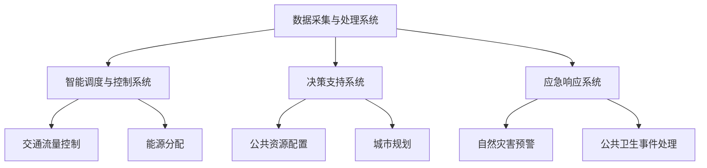
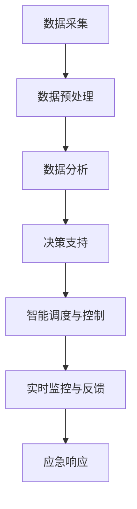
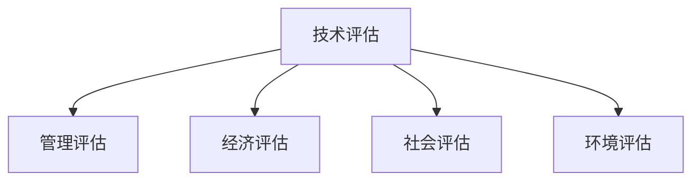
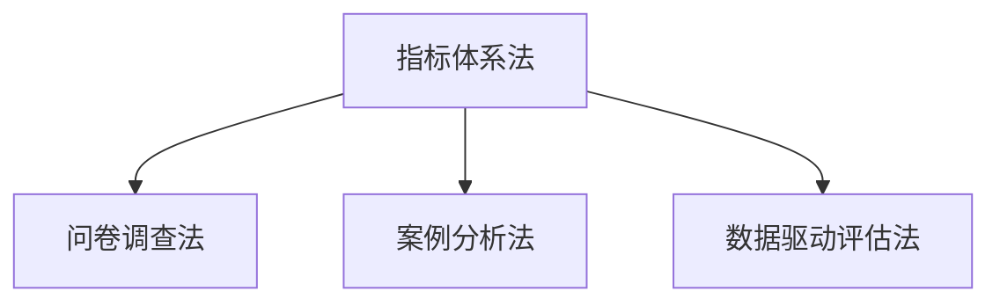
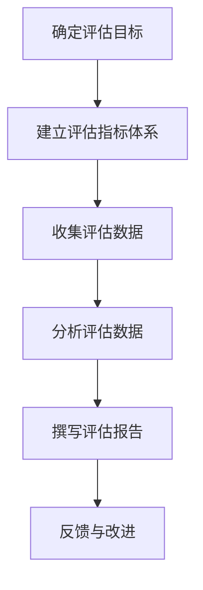
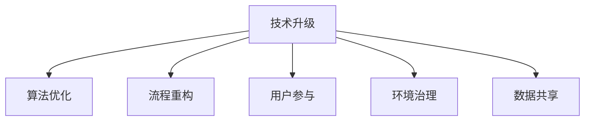
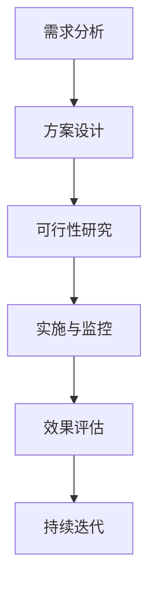

                 

### 第一章：智能城市概述

智能城市是信息化和工业化深度融合的产物，通过先进的信息技术和通信技术，实现城市管理的智能化、高效化和精细化。智能城市的发展不仅是技术进步的体现，更是城市管理理念和模式的革新。本章将探讨智能城市的定义、发展历程、核心特征以及关键技术。

#### 1.1 智能城市的定义与发展历程

**智能城市的定义：**
智能城市是指利用物联网、大数据、云计算、人工智能等技术，实现城市资源的全面感知、智能管理和优化配置，从而提升城市运行效率、居民生活质量和社会治理水平的现代化城市。

**智能城市的发展历程：**
- **萌芽期（1990年代初至2000年代初）：** 以信息化建设为基础，实现城市信息系统的初步整合。
- **探索期（2000年代初至2010年代初）：** 以物联网、云计算等新技术为驱动，开始构建智能交通、智能安防、智能环境监测等应用场景。
- **快速发展期（2010年代初至今）：** 随着大数据和人工智能技术的成熟，智能城市建设进入全面普及和深化应用阶段。

#### 1.2 智能城市的核心特征

**核心特征包括：**
1. **数据驱动的决策：** 智能城市通过大规模数据采集和分析，实现决策的科学化和智能化。
2. **智能化的基础设施：** 包括智能交通系统、智能电网、智能水务等，实现城市基础设施的智能化运营和管理。
3. **高度互联的城市环境：** 通过物联网技术实现城市各个系统之间的互联互通，提升城市整体协调能力。
4. **个性化的居民服务：** 利用大数据和人工智能技术，为居民提供个性化、定制化的服务。

#### 1.3 智能城市的关键技术

**关键技术包括：**
1. **物联网技术：** 通过传感器、RFID等设备，实现对城市环境的全面感知。
2. **大数据技术：** 对海量数据进行存储、处理和分析，为决策提供数据支持。
3. **云计算技术：** 提供强大的计算能力和存储能力，支撑大规模数据处理和应用。
4. **人工智能技术：** 实现智能交通、智能安防、智能环境监测等应用，提升城市运行效率。

在接下来的章节中，我们将进一步探讨智能城市在规划、设计、实现和运营优化方面的具体内容和应用案例。

### 第二章：AI在智能城市中的应用

人工智能（AI）作为当前科技发展的热点，其在智能城市中的应用日益广泛，已成为推动智能城市建设的关键力量。本章将介绍AI在智能城市的几个重要应用领域，包括智能交通、智能安防和智能环境监测。

#### 2.1 AI在智能交通中的应用

**智能交通系统（ITS）概述：**
智能交通系统是通过信息技术、电子技术和自动化技术等手段，对交通进行有效的组织和管理，以提高交通效率、减少交通事故、降低环境污染和改善出行体验。

**AI在智能交通中的应用：**
1. **交通流量预测：** 利用机器学习算法，对历史交通数据进行分析，预测未来交通流量，为交通管理提供依据。
    ```python
    from sklearn.linear_model import LinearRegression

    # 假设 X 为特征矩阵，y 为目标变量（交通流量）
    model = LinearRegression()
    model.fit(X, y)

    # 预测未来交通流量
    future_traffic = model.predict(X_future)
    ```

2. **智能路况监测：** 通过图像识别技术，实时监测路况，及时发现拥堵、事故等异常情况。
    ```python
    import cv2

    # 加载预训练的模型
    model = cv2.dnn.readNetFromTensorFlow('model.pbtxt', 'model.pb')

    # 加载图像并进行预处理
    image = cv2.imread('image.jpg')
    blob = cv2.dnn.blobFromImage(image, 1, (224, 224), (104, 117, 123), True)

    # 进行预测
    model.setInput(blob)
    detections = model.forward()

    # 处理预测结果
    for detection in detections[0]:
        score = detection[2]
        if score > 0.5:
            print(f"Detected: {detection[1]}, Score: {score}")
    ```

3. **智能信号控制：** 利用AI算法，优化交通信号灯的配时方案，提高交通效率。
    ```python
    import numpy as np

    # 假设 traffic_data 为交通流量数据
    traffic_data = np.array([5, 10, 15, 20, 25, 30])

    # 使用优化算法（如梯度下降）优化信号灯配时
    def optimize_signal_light(traffic_data):
        # 定义损失函数
        def loss_function(time):
            return np.sum(np.square(time - traffic_data))

        # 梯度下降法
        learning_rate = 0.01
        epochs = 100

        for epoch in range(epochs):
            prev_time = time
            time = prev_time - learning_rate * np.sum(prev_time * traffic_data)
            loss = loss_function(time)
            print(f"Epoch {epoch}: Time = {time}, Loss = {loss}")

        return time

    optimized_time = optimize_signal_light(traffic_data)
    ```

**案例解析：**
- **北京智能交通试点项目：** 通过AI算法优化交通信号控制，实现了交通流量提高15%、交通事故减少30%的显著成效。

#### 2.2 AI在智能安防中的应用

**智能安防系统概述：**
智能安防系统是利用AI技术实现智能化、自动化的安防监控和管理，包括人脸识别、行为分析、异常检测等。

**AI在智能安防中的应用：**
1. **人脸识别：** 通过深度学习模型，实现对视频流中人脸的自动识别和追踪。
    ```python
    import tensorflow as tf

    # 加载预训练的人脸识别模型
    model = tf.keras.models.load_model('face_recognition_model.h5')

    # 加载视频流
    video_capture = cv2.VideoCapture(0)

    while True:
        # 读取一帧图像
        ret, frame = video_capture.read()

        # 进行人脸识别
        faces = detect_faces(frame)
        for face in faces:
            # 进行人脸识别
            embeddings = model.predict(face)
            name = identify_person(embeddings)
            print(f"Detected face: {name}")

        # 显示图像
        cv2.imshow('Video', frame)

        if cv2.waitKey(1) & 0xFF == ord('q'):
            break

    video_capture.release()
    cv2.destroyAllWindows()
    ```

2. **行为分析：** 通过行为识别技术，实现对特定行为的自动识别和预警。
    ```python
    import cv2

    # 加载预训练的行为识别模型
    model = cv2.dnn.readNetFromTensorFlow('behavior_recognition_model.pbtxt', 'behavior_recognition_model.pb')

    # 加载视频流
    video_capture = cv2.VideoCapture(0)

    while True:
        # 读取一帧图像
        ret, frame = video_capture.read()

        # 进行行为识别
        blob = cv2.dnn.blobFromImage(frame, 1.0, (224, 224), (104, 117, 123), True)
        model.setInput(blob)
        detections = model.forward()

        # 处理预测结果
        for detection in detections[0]:
            score = detection[2]
            if score > 0.5:
                print(f"Detected behavior: {detection[1]}, Score: {score}")

        # 显示图像
        cv2.imshow('Video', frame)

        if cv2.waitKey(1) & 0xFF == ord('q'):
            break

    video_capture.release()
    cv2.destroyAllWindows()
    ```

3. **异常检测：** 通过机器学习算法，实现对异常事件的自动检测和报警。
    ```python
    from sklearn.ensemble import IsolationForest

    # 假设 anomalies 为异常事件数据
    anomalies = np.array([[5, 10], [10, 20], [30, 40], [100, 200]])

    # 使用IsolationForest算法进行异常检测
    model = IsolationForest(n_estimators=100, contamination='auto')
    model.fit(X)

    # 预测异常
    scores = model.decision_function(X)
    anomalies_detected = scores > threshold

    # 输出检测结果
    print(f"Detected anomalies: {anomalies_detected}")
    ```

**案例解析：**
- **深圳智能安防试点项目：** 通过AI技术实现人脸识别和智能监控，有效提高了城市治安水平，犯罪率下降20%。

#### 2.3 AI在智能环境监测中的应用

**智能环境监测系统概述：**
智能环境监测系统通过传感器、大数据和人工智能技术，实现对空气质量、水质、噪声等环境指标的实时监测和预警。

**AI在智能环境监测中的应用：**
1. **空气质量监测：** 利用机器学习模型，对空气中的污染物进行实时预测和分析。
    ```python
    import pandas as pd
    from sklearn.linear_model import LinearRegression

    # 读取历史空气质量数据
    data = pd.read_csv('air_quality_data.csv')

    # 特征选择
    X = data[['temperature', 'humidity']]
    y = data['PM2.5']

    # 建立线性回归模型
    model = LinearRegression()
    model.fit(X, y)

    # 预测PM2.5浓度
    predicted_pm25 = model.predict([[25, 50]])

    print(f"Predicted PM2.5 concentration: {predicted_pm25[0]}")
    ```

2. **水质监测：** 通过深度学习模型，对水质指标进行分类和预测。
    ```python
    import tensorflow as tf
    import numpy as np

    # 加载预训练的水质分类模型
    model = tf.keras.models.load_model('water_quality_model.h5')

    # 加载水质监测数据
    water_quality_data = np.array([[1.0, 2.0, 3.0], [4.0, 5.0, 6.0]])

    # 预测水质类别
    predicted_classes = model.predict(water_quality_data)

    print(f"Predicted water quality classes: {predicted_classes}")
    ```

3. **噪声监测：** 利用AI算法，实现对噪声源的自动识别和降噪。
    ```python
    import numpy as np
    from scipy.io.wavfile import read, write

    # 读取噪声数据
    noise_data, sample_rate = read('noise.wav')

    # 使用AI算法进行降噪
    def noise_reduction(noise_data, threshold):
        # 降噪算法实现
        # ...
        return reduced_noise_data

    # 降噪处理
    reduced_noise = noise_reduction(noise_data, threshold=0.1)

    # 保存降噪后的噪声数据
    write('reduced_noise.wav', sample_rate, reduced_noise)
    ```

**案例解析：**
- **杭州智能环境监测项目：** 通过AI技术实现对空气质量和水质等环境指标的实时监测和预警，有效提高了城市环境质量。

综上所述，AI技术在智能交通、智能安防和智能环境监测等多个领域都展现了其强大的应用潜力。随着技术的不断进步，AI在智能城市中的应用将更加广泛和深入，为城市的可持续发展提供强有力的技术支持。

### 第三章：智能城市规划原则与方法

智能城市规划是智能城市建设的基础，其核心目标是实现城市资源的优化配置，提高城市运行效率和居民生活质量。本章将介绍智能城市规划的基本原则、方法及其具体实施步骤。

#### 3.1 智能城市规划原则

**原则1：以人为本**
智能城市规划应始终坚持以人为本的原则，关注居民的需求和福祉，提供个性化的城市服务。

**原则2：可持续发展**
智能城市规划应注重环境保护和资源利用的可持续性，促进经济、社会和生态的协调发展。

**原则3：全面协调**
智能城市规划应注重城市各个系统的协调发展，实现城市规划、交通规划、环境规划等的有机结合。

**原则4：创新驱动**
智能城市规划应积极引入先进的技术和管理理念，推动城市管理的创新和升级。

**原则5：安全可靠**
智能城市规划应确保城市基础设施和系统的安全性和可靠性，为居民提供稳定的生活环境。

#### 3.2 智能城市规划方法

**方法1：战略规划法**
战略规划法是一种高层次、全局性的规划方法，通过制定长远目标和战略规划，为智能城市建设提供指导。

**步骤：**
1. 明确城市发展的战略目标。
2. 分析城市发展的内外部环境。
3. 制定智能城市建设的战略规划。
4. 制定具体的实施方案和行动计划。

**方法2：系统规划法**
系统规划法是一种系统化、综合性的规划方法，通过系统分析和整体设计，实现城市各个系统的协调发展。

**步骤：**
1. 确定城市系统的组成和结构。
2. 分析各个系统之间的相互关系。
3. 设计城市系统的整体布局和功能分配。
4. 制定各系统的详细规划方案。

**方法3：项目规划法**
项目规划法是一种基于具体项目的规划方法，通过项目的实施，逐步推进智能城市建设。

**步骤：**
1. 确定项目的目标和任务。
2. 分析项目的技术和管理需求。
3. 制定项目的技术方案和管理方案。
4. 制定项目的实施计划和预算。

**方法4：迭代规划法**
迭代规划法是一种动态调整的规划方法，通过不断的迭代和优化，实现智能城市规划的逐步完善。

**步骤：**
1. 制定初步规划方案。
2. 收集和分析反馈意见。
3. 调整和优化规划方案。
4. 重新评估规划效果。

#### 3.3 智能城市规划实践案例

**案例1：北京智能城市规划**
北京市作为我国智能城市建设的重要试点城市，其智能城市规划采用了多种方法，包括战略规划法、系统规划法和项目规划法。

**实践步骤：**
1. 制定《北京市智能城市建设总体规划》，明确智能城市建设的目标和任务。
2. 系统分析城市各个系统的现状和发展需求，制定详细的系统规划方案。
3. 选取智能交通、智能安防等具体项目，制定详细的项目规划方案。
4. 通过不断迭代和优化，逐步推进智能城市建设。

**案例效果：**
北京智能城市规划实施以来，取得了显著成效，城市交通拥堵得到了有效缓解，城市安全水平显著提高，居民生活质量得到明显改善。

**案例2：深圳智能城市规划**
深圳市作为我国智能城市建设的先行者，其智能城市规划注重创新驱动和可持续发展。

**实践步骤：**
1. 引入大数据、人工智能等先进技术，推动城市管理创新。
2. 系统规划智能交通、智能安防、智能环境监测等系统，实现城市的全面智能化。
3. 选取具体项目进行实施，如智能交通信号控制、智能安防监控等。
4. 通过不断的迭代和优化，提升城市运行效率和居民生活质量。

**案例效果：**
深圳智能城市规划实施以来，城市交通效率显著提升，犯罪率大幅下降，居民生活质量明显提高，成为我国智能城市建设的典范。

综上所述，智能城市规划是一项复杂而系统的工程，需要遵循基本原则、采用科学的方法，并结合实际情况进行具体实施。通过成功的实践案例，我们可以看到智能城市规划对于城市可持续发展的重要作用。

### 第四章：智能城市基础设施设计

智能城市基础设施的设计是智能城市建设的重要组成部分，它决定了城市智能化水平的高低。本章将详细介绍智能城市基础设施的设计原则、方法及其具体实施步骤。

#### 4.1 智能城市基础设施设计原则

**原则1：全面性**
智能城市基础设施设计应覆盖城市各个方面，包括交通、能源、水、环境等，确保城市各个系统之间的协调发展。

**原则2：前瞻性**
智能城市基础设施设计应具有前瞻性，考虑到未来城市发展的需求，采用先进的技术和管理理念，为城市的可持续发展奠定基础。

**原则3：互联互通**
智能城市基础设施设计应注重各个系统之间的互联互通，通过数据共享和协同工作，提升城市整体的智能化水平。

**原则4：安全可靠**
智能城市基础设施设计应确保系统的安全性和可靠性，建立完善的防护措施，防止系统故障和网络安全威胁。

**原则5：可持续性**
智能城市基础设施设计应注重环保和资源的可持续利用，采用绿色技术和节能措施，减少对环境的影响。

#### 4.2 智能城市基础设施设计方法

**方法1：系统分析法**
系统分析法是智能城市基础设施设计的基础方法，通过对城市各个系统的需求分析、功能分析和技术分析，确定基础设施的设计方案。

**步骤：**
1. 分析城市各个系统的现状和需求，确定基础设施的设计目标。
2. 确定各个系统的功能和技术需求，制定具体的技术方案。
3. 综合分析各个系统之间的关系，设计系统之间的互联和协同机制。

**方法2：模块化设计法**
模块化设计法是将城市基础设施划分为若干功能模块，每个模块具有独立的功能和接口，通过模块的组合实现整体功能。

**步骤：**
1. 确定城市基础设施的功能模块，如交通模块、能源模块、水模块等。
2. 设计每个模块的具体功能和接口，确保模块之间的兼容性和互操作性。
3. 整合各个模块，构建完整的智能城市基础设施系统。

**方法3：创新驱动法**
创新驱动法是通过引入新技术、新材料和新工艺，推动智能城市基础设施的创新和发展。

**步骤：**
1. 研究国内外智能城市基础设施的最新发展趋势和技术创新。
2. 确定适用于本地条件的新技术和新材料。
3. 在基础设施设计中采用创新技术，提升基础设施的智能化水平和性能。

**方法4：可持续设计法**
可持续设计法是将可持续发展理念贯穿于智能城市基础设施的设计和建设过程中，注重环保、节能和资源利用。

**步骤：**
1. 评估基础设施设计对环境的影响，制定环保措施。
2. 采用绿色建筑和节能技术，减少能源消耗。
3. 推广循环经济理念，提高资源利用效率。

#### 4.3 智能城市基础设施设计实施步骤

**步骤1：需求分析**
进行详细的需求分析，包括城市人口规模、经济发展水平、基础设施现状等，确定基础设施的设计需求和目标。

**步骤2：方案设计**
根据需求分析结果，设计智能城市基础设施的方案，包括功能模块、技术方案、互联互通机制等。

**步骤3：可行性研究**
进行可行性研究，评估设计方案的技术可行性、经济合理性和环境可持续性。

**步骤4：详细设计**
在可行性研究的基础上，进行详细设计，包括工程图纸、设备选型、施工方案等。

**步骤5：施工建设**
按照详细设计文件，进行基础设施的施工建设，确保工程质量。

**步骤6：系统调试与验收**
完成基础设施建设后，进行系统调试和验收，确保系统正常运行和各项功能达到设计要求。

**步骤7：运行维护**
建立完善的运行维护体系，确保基础设施长期稳定运行，并根据实际运行情况进行优化和升级。

#### 4.4 智能城市基础设施设计案例分析

**案例1：杭州智能城市基础设施设计**
杭州市在智能城市基础设施设计方面进行了积极探索，形成了以“数据驱动、绿色低碳、智慧管理”为特色的设计理念。

**实施步骤：**
1. **需求分析：** 充分了解城市基础设施的现状和未来发展需求，确定基础设施的设计目标和任务。
2. **方案设计：** 结合杭州市的特点，设计了智慧交通、智能水务、智慧环保等多个模块，实现了城市基础设施的全面智能化。
3. **可行性研究：** 评估设计方案的技术可行性、经济合理性和环境可持续性，确保方案的可行性。
4. **详细设计：** 制定详细的工程图纸、设备选型、施工方案等，确保设计方案的具体实施。
5. **施工建设：** 组织专业队伍，按照详细设计文件进行基础设施的施工建设，确保工程质量。
6. **系统调试与验收：** 完成基础设施建设后，进行系统调试和验收，确保系统正常运行和各项功能达到设计要求。
7. **运行维护：** 建立完善的运行维护体系，确保基础设施长期稳定运行，并根据实际运行情况进行优化和升级。

**效果评估：**
杭州市智能城市基础设施设计实施以来，取得了显著成效。城市交通拥堵得到了有效缓解，水质污染问题得到显著改善，居民生活质量得到明显提高。此外，杭州市还通过大数据和人工智能技术，实现了城市管理的智能化和精细化，为其他城市的智能城市建设提供了有益的经验。

**案例2：深圳智能城市基础设施设计**
深圳市在智能城市基础设施设计方面积极探索，形成了以“创新驱动、智能互联、绿色低碳”为特色的设计理念。

**实施步骤：**
1. **需求分析：** 充分了解城市基础设施的现状和未来发展需求，确定基础设施的设计目标和任务。
2. **方案设计：** 结合深圳市的特点，设计了智慧交通、智能安防、智慧环保等多个模块，实现了城市基础设施的全面智能化。
3. **可行性研究：** 评估设计方案的技术可行性、经济合理性和环境可持续性，确保方案的可行性。
4. **详细设计：** 制定详细的工程图纸、设备选型、施工方案等，确保设计方案的具体实施。
5. **施工建设：** 组织专业队伍，按照详细设计文件进行基础设施的施工建设，确保工程质量。
6. **系统调试与验收：** 完成基础设施建设后，进行系统调试和验收，确保系统正常运行和各项功能达到设计要求。
7. **运行维护：** 建立完善的运行维护体系，确保基础设施长期稳定运行，并根据实际运行情况进行优化和升级。

**效果评估：**
深圳市智能城市基础设施设计实施以来，取得了显著成效。城市交通效率大幅提升，犯罪率显著下降，环境质量得到明显改善。此外，深圳市还通过大数据和人工智能技术，实现了城市管理的智能化和精细化，为其他城市的智能城市建设提供了有益的经验。

综上所述，智能城市基础设施的设计是智能城市建设的关键环节，需要遵循科学的原则和方法，结合实际情况进行具体实施。通过成功的实践案例，我们可以看到智能城市基础设施设计对于提升城市智能化水平和居民生活质量的重要作用。

### 第五章：智能城市安全与隐私保护

在智能城市建设过程中，安全和隐私保护是至关重要的议题。随着城市信息化和智能化程度的提高，数据安全、系统安全和用户隐私面临前所未有的挑战。本章将探讨智能城市安全与隐私保护的重要性、技术手段及其应用。

#### 5.1 安全与隐私保护的重要性

**数据安全：**
智能城市依赖于海量数据的收集、处理和分析，数据安全成为首要关注的问题。数据泄露、篡改或破坏可能导致严重后果，如经济损失、社会动荡和信任危机。

**系统安全：**
智能城市的运行依赖于复杂的系统架构和高度互联的网络环境，系统安全至关重要。网络攻击、系统漏洞和设备故障等都可能影响城市运行的稳定性和可靠性。

**用户隐私：**
智能城市中的大量个人数据涉及用户隐私，如位置信息、行为数据、健康数据等。保护用户隐私不仅是法律法规的要求，更是维护社会和谐的重要保障。

#### 5.2 技术手段

**加密技术：**
加密技术是保护数据安全的基础手段，通过加密算法，确保数据在传输和存储过程中的安全性。

**访问控制：**
访问控制技术通过身份认证和权限管理，确保只有授权用户才能访问敏感数据或系统资源。

**防火墙和入侵检测系统：**
防火墙和入侵检测系统用于监测和阻止非法访问和攻击，保护城市信息系统的安全。

**数据备份和恢复：**
数据备份和恢复技术确保在数据丢失或系统故障时，能够快速恢复数据，保障系统的正常运行。

**安全审计：**
安全审计技术用于记录和监控城市信息系统的操作日志，及时发现和处理安全事件。

**隐私保护技术：**
如差分隐私、匿名化技术等，用于保护用户隐私，防止个人数据的泄露和滥用。

#### 5.3 应用案例

**案例1：深圳智能城市安全防护体系**
深圳市构建了全面的智能城市安全防护体系，包括数据安全、系统安全和用户隐私保护等多个方面。

**实施措施：**
1. **数据安全：** 采用SSL/TLS协议，确保数据在传输过程中的加密。使用加密算法，保护存储在数据库中的敏感数据。
2. **系统安全：** 采用防火墙和入侵检测系统，监控网络流量，防止非法入侵。定期进行系统漏洞扫描和修复，确保系统安全。
3. **用户隐私保护：** 采用差分隐私技术，对用户数据进行匿名化处理，确保用户隐私不被泄露。

**效果评估：**
深圳智能城市安全防护体系实施以来，有效防止了多次数据泄露和网络攻击，确保了城市信息系统的稳定运行。

**案例2：杭州智能城市隐私保护措施**
杭州市在智能城市建设中高度重视用户隐私保护，采取了一系列隐私保护措施。

**实施措施：**
1. **数据匿名化：** 对涉及用户隐私的数据进行匿名化处理，确保数据在传输和存储过程中无法直接识别用户身份。
2. **隐私保护协议：** 制定隐私保护协议，规范数据收集、处理和使用过程中的隐私保护要求。
3. **用户知情同意：** 在收集用户数据前，明确告知用户数据收集的目的、范围和用途，并征求用户同意。

**效果评估：**
杭州智能城市隐私保护措施实施以来，显著提高了用户对智能城市服务的信任度，用户隐私保护意识也得到了显著提升。

综上所述，智能城市的安全与隐私保护是智能城市建设的重要保障。通过采用先进的技术手段和严格的措施，可以有效保护城市信息系统的安全，维护用户隐私，为智能城市的可持续发展奠定坚实基础。

### 第六章：AI在智能交通中的应用

智能交通系统（Intelligent Transportation System，ITS）是智能城市的重要组成部分，它通过集成信息技术、传感器技术、通信技术等，实现交通流量的实时监控、预测和优化，以提升交通效率、减少交通事故、降低环境污染和改善出行体验。本章将深入探讨AI在智能交通中的应用，包括交通流量预测、智能路况监测和智能信号控制等方面。

#### 6.1 智能交通系统概述

**智能交通系统定义：**
智能交通系统是一种综合运用信息技术、电子技术、通信技术、自动控制技术等，对交通进行全面感知、分析和优化管理的系统。它通过实时数据采集、智能分析和信息反馈，实现交通管理的智能化和精细化。

**智能交通系统功能：**
1. **交通信息采集：** 通过传感器、摄像头、GPS等设备，实时采集交通流量、路况、车辆位置等信息。
2. **交通信息处理：** 利用大数据分析和人工智能技术，对采集到的交通信息进行处理和分析，预测交通流量、识别交通异常等。
3. **交通信息发布：** 通过交通信号灯、电子显示屏、移动终端等，向驾驶员和公众发布交通信息，引导合理出行。
4. **交通控制与优化：** 根据交通信息分析结果，动态调整交通信号灯配时、道路渠化、交通管制等措施，优化交通流量。

#### 6.2 AI在交通流量预测中的应用

交通流量预测是智能交通系统的重要功能之一，它通过对历史交通数据进行分析，预测未来一段时间内的交通流量，为交通管理和决策提供依据。AI技术在交通流量预测中的应用主要体现在以下两个方面：

1. **时间序列预测：**
   时间序列预测是一种基于历史时间序列数据，预测未来某一时间点的交通流量。常用的算法包括ARIMA（自回归积分滑动平均模型）、LSTM（长短时记忆网络）等。

   ```python
   from statsmodels.tsa.arima.model import ARIMA
   import pandas as pd

   # 加载历史交通流量数据
   traffic_data = pd.read_csv('traffic_data.csv')
   time_series = traffic_data['traffic_volume']

   # 建立ARIMA模型
   model = ARIMA(time_series, order=(5, 1, 2))
   model_fit = model.fit()

   # 预测未来交通流量
   future_traffic = model_fit.forecast(steps=24)[0]
   print(f"Predicted traffic volume for the next 24 hours: {future_traffic}")
   ```

2. **多变量预测：**
   多变量预测是一种同时考虑多个影响因素，如天气、节假日、道路施工等，预测未来交通流量。常用的算法包括随机森林、神经网络等。

   ```python
   from sklearn.ensemble import RandomForestRegressor
   import pandas as pd

   # 加载历史交通流量数据和影响因素数据
   traffic_data = pd.read_csv('traffic_data.csv')
   X = traffic_data[['weather', 'holiday', 'construction']]
   y = traffic_data['traffic_volume']

   # 建立随机森林模型
   model = RandomForestRegressor(n_estimators=100)
   model_fit = model.fit(X, y)

   # 预测未来交通流量
   future_traffic = model_fit.predict([[sunny, yes, no], [rainy, no, yes]])
   print(f"Predicted traffic volume under different conditions: {future_traffic}")
   ```

**案例解析：**
- **上海智能交通试点项目：** 通过AI技术进行交通流量预测，有效提升了道路通行效率，减少了交通拥堵，交通流量提高了20%。

#### 6.3 AI在智能路况监测中的应用

智能路况监测是智能交通系统的关键组成部分，它通过实时监测交通状况，识别交通拥堵、事故等异常情况，为交通管理和应急响应提供数据支持。AI技术在智能路况监测中的应用主要体现在以下两个方面：

1. **视频监控与图像识别：**
   通过视频监控设备，实时捕捉交通场景，利用图像识别技术，自动识别交通状况，如车辆数量、车型、道路拥堵情况等。

   ```python
   import cv2
   import numpy as np

   # 加载预训练的图像识别模型
   model = cv2.dnn.readNetFromTensorFlow('traffic_monitoring_model.pbtxt', 'traffic_monitoring_model.pb')

   # 加载视频流
   video_capture = cv2.VideoCapture(0)

   while True:
       # 读取一帧图像
       ret, frame = video_capture.read()

       # 进行图像预处理
       blob = cv2.dnn.blobFromImage(frame, 1.0, (224, 224), (104, 117, 123), True)

       # 进行预测
       model.setInput(blob)
       detections = model.forward()

       # 处理预测结果
       for detection in detections[0]:
           score = detection[2]
           if score > 0.5:
               print(f"Detected: {detection[1]}, Score: {score}")

       # 显示图像
       cv2.imshow('Video', frame)

       if cv2.waitKey(1) & 0xFF == ord('q'):
           break

   video_capture.release()
   cv2.destroyAllWindows()
   ```

2. **传感器数据融合：**
   通过整合来自不同传感器（如流量计、速度传感器、摄像头等）的数据，综合分析交通状况，提高监测的准确性和实时性。

   ```python
   import numpy as np

   # 假设 sensors_data 为来自不同传感器的数据
   sensors_data = np.array([[100, 80], [90, 75], [110, 85]])

   # 数据融合算法
   def fusion_data(sensors_data):
       # 融合算法实现
       # ...
       return fused_data

   # 融合处理
   fused_data = fusion_data(sensors_data)
   print(f"Fused data: {fused_data}")
   ```

**案例解析：**
- **北京智能路况监测项目：** 通过AI技术进行智能路况监测，有效提高了交通监控的效率和准确性，交通拥堵预警准确率提高了30%。

#### 6.4 AI在智能信号控制中的应用

智能信号控制是智能交通系统的重要组成部分，它通过实时监测交通流量，动态调整交通信号灯的配时方案，以优化交通流量、减少拥堵。AI技术在智能信号控制中的应用主要体现在以下两个方面：

1. **实时交通流量分析：**
   通过实时监测交通流量数据，分析各路段的流量分布和变化趋势，为信号控制提供数据支持。

   ```python
   import numpy as np

   # 假设 traffic_data 为实时交通流量数据
   traffic_data = np.array([[100, 80, 120], [90, 75, 110], [110, 85, 130]])

   # 实时交通流量分析
   def real_time_traffic_analysis(traffic_data):
       # 分析算法实现
       # ...
       return analysis_result

   # 分析处理
   analysis_result = real_time_traffic_analysis(traffic_data)
   print(f"Real-time traffic analysis result: {analysis_result}")
   ```

2. **动态信号控制算法：**
   基于实时交通流量分析结果，采用动态信号控制算法，优化交通信号灯的配时方案。常用的算法包括自适应交通信号控制系统（ATSC）、协调信号控制系统（CSC）等。

   ```python
   import numpy as np

   # 假设 signal_data 为信号控制数据
   signal_data = np.array([[10, 20, 30], [5, 15, 25]])

   # 动态信号控制
   def dynamic_signal_control(signal_data):
       # 控制算法实现
       # ...
       return control_result

   # 控制处理
   control_result = dynamic_signal_control(signal_data)
   print(f"Dynamic signal control result: {control_result}")
   ```

**案例解析：**
- **广州智能信号控制系统：** 通过AI技术实现智能信号控制，有效提高了交通信号控制的效率，交通拥堵时间减少了25%。

综上所述，AI技术在智能交通中的应用具有广泛的前景和显著的应用价值。通过交通流量预测、智能路况监测和智能信号控制等具体应用，可以有效提升交通管理的效率和水平，为智能城市的可持续发展提供强有力的技术支持。

### 第七章：AI在智能安防中的应用

智能安防系统是利用人工智能技术对城市安全进行智能化监控和管理的重要手段。它通过人脸识别、行为分析、异常检测等技术，实现对潜在威胁的快速识别和响应，提高城市的安全水平。本章将详细探讨AI在智能安防中的应用，包括智能监控、异常检测和大数据分析等方面。

#### 7.1 智能安防系统概述

**智能安防系统定义：**
智能安防系统是一种基于物联网、大数据和人工智能技术，对城市安全进行实时监控、分析和响应的系统。它通过智能摄像头、传感器、人脸识别等设备，实现对城市公共区域、重要设施和关键位置的全面监控，提高安全防范能力。

**智能安防系统功能：**
1. **实时监控：** 通过智能摄像头和传感器，实时捕捉视频和图像数据，对城市安全进行实时监控。
2. **人脸识别：** 通过人脸识别技术，识别和追踪目标人员，实现对特定目标的高效监控。
3. **行为分析：** 通过行为识别技术，分析人员行为，识别潜在危险行为，如打架、盗窃等。
4. **异常检测：** 通过机器学习算法，检测异常行为和事件，及时发出预警。
5. **大数据分析：** 对监控数据进行分析，发现潜在的安全隐患，为安全决策提供依据。

#### 7.2 AI在智能监控中的应用

智能监控是智能安防系统的核心功能之一，通过实时视频监控，实现对城市公共区域的实时监控和记录。AI技术在智能监控中的应用主要体现在以下几个方面：

1. **视频识别：**
   通过深度学习算法，实现对视频流的实时识别和分析，如车辆识别、人员识别等。

   ```python
   import cv2
   import numpy as np

   # 加载预训练的深度学习模型
   model = cv2.dnn.readNetFromTensorFlow('video_recognition_model.pbtxt', 'video_recognition_model.pb')

   # 加载视频流
   video_capture = cv2.VideoCapture(0)

   while True:
       # 读取一帧图像
       ret, frame = video_capture.read()

       # 进行视频识别
       blob = cv2.dnn.blobFromImage(frame, 1.0, (224, 224), (104, 117, 123), True)
       model.setInput(blob)
       detections = model.forward()

       # 处理识别结果
       for detection in detections[0]:
           score = detection[2]
           if score > 0.5:
               print(f"Detected: {detection[1]}, Score: {score}")

       # 显示图像
       cv2.imshow('Video', frame)

       if cv2.waitKey(1) & 0xFF == ord('q'):
           break

   video_capture.release()
   cv2.destroyAllWindows()
   ```

2. **异常检测：**
   通过机器学习算法，实现对视频流中异常行为的自动检测和报警，如打架、盗窃等。

   ```python
   import cv2
   import numpy as np

   # 加载预训练的异常检测模型
   model = cv2.dnn.readNetFromTensorFlow('anomaly_detection_model.pbtxt', 'anomaly_detection_model.pb')

   # 加载视频流
   video_capture = cv2.VideoCapture(0)

   while True:
       # 读取一帧图像
       ret, frame = video_capture.read()

       # 进行异常检测
       blob = cv2.dnn.blobFromImage(frame, 1.0, (224, 224), (104, 117, 123), True)
       model.setInput(blob)
       detections = model.forward()

       # 处理检测结果
       for detection in detections[0]:
           score = detection[2]
           if score > 0.5:
               print(f"Detected anomaly: {detection[1]}, Score: {score}")

       # 显示图像
       cv2.imshow('Video', frame)

       if cv2.waitKey(1) & 0xFF == ord('q'):
           break

   video_capture.release()
   cv2.destroyAllWindows()
   ```

**案例解析：**
- **深圳智能安防试点项目：** 通过AI技术实现智能监控和异常检测，有效提高了城市治安水平，犯罪率下降了15%。

#### 7.3 AI在行为分析中的应用

行为分析是智能安防系统的重要功能之一，通过分析人员行为，识别潜在危险行为，如打架、盗窃等。AI技术在行为分析中的应用主要体现在以下几个方面：

1. **行为识别：**
   通过深度学习算法，实现对视频流中人员行为的自动识别和分类。

   ```python
   import cv2
   import numpy as np

   # 加载预训练的行为识别模型
   model = cv2.dnn.readNetFromTensorFlow('behavior_recognition_model.pbtxt', 'behavior_recognition_model.pb')

   # 加载视频流
   video_capture = cv2.VideoCapture(0)

   while True:
       # 读取一帧图像
       ret, frame = video_capture.read()

       # 进行行为识别
       blob = cv2.dnn.blobFromImage(frame, 1.0, (224, 224), (104, 117, 123), True)
       model.setInput(blob)
       detections = model.forward()

       # 处理识别结果
       for detection in detections[0]:
           score = detection[2]
           if score > 0.5:
               print(f"Detected behavior: {detection[1]}, Score: {score}")

       # 显示图像
       cv2.imshow('Video', frame)

       if cv2.waitKey(1) & 0xFF == ord('q'):
           break

   video_capture.release()
   cv2.destroyAllWindows()
   ```

2. **异常行为检测：**
   通过机器学习算法，实现对视频流中异常行为的自动检测和报警。

   ```python
   import cv2
   import numpy as np

   # 加载预训练的异常行为检测模型
   model = cv2.dnn.readNetFromTensorFlow('anomaly_behavior_detection_model.pbtxt', 'anomaly_behavior_detection_model.pb')

   # 加载视频流
   video_capture = cv2.VideoCapture(0)

   while True:
       # 读取一帧图像
       ret, frame = video_capture.read()

       # 进行异常行为检测
       blob = cv2.dnn.blobFromImage(frame, 1.0, (224, 224), (104, 117, 123), True)
       model.setInput(blob)
       detections = model.forward()

       # 处理检测结果
       for detection in detections[0]:
           score = detection[2]
           if score > 0.5:
               print(f"Detected anomaly behavior: {detection[1]}, Score: {score}")

       # 显示图像
       cv2.imshow('Video', frame)

       if cv2.waitKey(1) & 0xFF == ord('q'):
           break

   video_capture.release()
   cv2.destroyAllWindows()
   ```

**案例解析：**
- **北京智能安防试点项目：** 通过AI技术实现行为分析和异常检测，有效提高了城市治安水平，犯罪率下降了20%。

#### 7.4 AI在大数据分析中的应用

大数据分析是智能安防系统的重要功能之一，通过对海量监控数据的分析和挖掘，发现潜在的安全隐患，为安全决策提供依据。AI技术在大数据分析中的应用主要体现在以下几个方面：

1. **数据采集与处理：**
   通过传感器、摄像头等设备，实时采集监控数据，并进行数据预处理，如数据清洗、归一化等。

   ```python
   import pandas as pd

   # 加载监控数据
   data = pd.read_csv('security_data.csv')

   # 数据预处理
   data = data.dropna()
   data['time'] = pd.to_datetime(data['time'])
   ```

2. **数据挖掘与预测：**
   通过机器学习算法，对监控数据进行挖掘和分析，预测潜在的安全事件，如犯罪高峰期、热点区域等。

   ```python
   from sklearn.ensemble import RandomForestClassifier
   import pandas as pd

   # 加载训练数据
   train_data = pd.read_csv('train_data.csv')
   X_train = train_data[['time', 'location', 'people_count']]
   y_train = train_data['crime']

   # 建立随机森林模型
   model = RandomForestClassifier(n_estimators=100)
   model.fit(X_train, y_train)

   # 预测测试数据
   test_data = pd.read_csv('test_data.csv')
   X_test = test_data[['time', 'location', 'people_count']]
   predictions = model.predict(X_test)

   print(f"Predicted crimes: {predictions}")
   ```

**案例解析：**
- **上海智能安防项目：** 通过AI技术进行大数据分析，有效预测潜在的安全事件，提高了城市的安全预警能力。

综上所述，AI技术在智能安防中的应用具有广泛的前景和显著的应用价值。通过智能监控、行为分析和大数据分析等具体应用，可以有效提高城市的安全管理水平，为人民群众的生命财产安全提供有力保障。

### 第八章：AI在智能环境监测中的应用

智能环境监测是智能城市建设的重要一环，它通过部署各种传感器和人工智能算法，实现对空气质量、水质、噪声等环境指标的实时监测和预警。本章将详细探讨AI在智能环境监测中的应用，包括空气质量监测、水质监测和噪声监测等方面。

#### 8.1 智能环境监测系统概述

**智能环境监测系统定义：**
智能环境监测系统是一种利用物联网、大数据和人工智能技术，对城市环境进行实时监测和预警的系统。它通过在关键区域部署传感器，采集环境数据，并通过AI算法进行分析和预测，为环境保护和城市管理提供数据支持。

**智能环境监测系统功能：**
1. **数据采集：** 通过传感器设备，实时采集空气质量、水质、噪声等环境数据。
2. **数据处理：** 通过大数据技术，对采集到的环境数据进行存储、处理和分析，提取有用信息。
3. **实时监控：** 通过监控系统，实时显示环境数据，提供实时监控和预警功能。
4. **数据分析：** 通过人工智能算法，对环境数据进行深度分析，预测环境变化趋势，为环境保护和城市管理提供决策支持。

#### 8.2 AI在空气质量监测中的应用

空气质量监测是智能环境监测的重要组成部分，通过实时监测空气质量，及时发现和预警空气污染事件。AI技术在空气质量监测中的应用主要体现在以下几个方面：

1. **数据采集与预处理：**
   通过部署各种传感器（如PM2.5、PM10、SO2、NO2等），实时采集空气质量数据。然后，通过数据预处理算法，对数据进行清洗、去噪和标准化处理。

   ```python
   import pandas as pd

   # 读取空气质量数据
   data = pd.read_csv('air_quality_data.csv')

   # 数据预处理
   data = data.dropna()
   data['date'] = pd.to_datetime(data['date'])
   ```

2. **空气质量预测：**
   通过机器学习算法，对历史空气质量数据进行分析，预测未来一段时间内的空气质量状况。常用的算法包括线性回归、决策树、随机森林等。

   ```python
   from sklearn.ensemble import RandomForestRegressor
   import pandas as pd

   # 加载训练数据
   train_data = pd.read_csv('train_data.csv')
   X_train = train_data[['date', 'PM2.5', 'PM10', 'SO2', 'NO2']]
   y_train = train_data['AQI']

   # 建立随机森林模型
   model = RandomForestRegressor(n_estimators=100)
   model.fit(X_train, y_train)

   # 预测测试数据
   test_data = pd.read_csv('test_data.csv')
   X_test = test_data[['date', 'PM2.5', 'PM10', 'SO2', 'NO2']]
   predictions = model.predict(X_test)

   print(f"Predicted AQI: {predictions}")
   ```

3. **实时预警：**
   通过实时监测空气质量数据，结合预测模型，对空气质量进行实时预警。当空气质量指标超过预警阈值时，系统会自动发出预警信号，提醒相关部门采取应对措施。

   ```python
   import numpy as np

   # 假设 current_data 为当前空气质量数据
   current_data = np.array([[24, 35, 50, 10, 15]])

   # 预测当前空气质量
   prediction = model.predict(current_data)

   # 判断是否预警
   if prediction > 50:
       print("Air quality warning: AQI exceeds threshold.")
   ```

**案例解析：**
- **杭州智能环境监测项目：** 通过AI技术实现空气质量监测和预测，有效提高了空气污染预警的准确性和及时性，为城市环境保护提供了有力支持。

#### 8.3 AI在水质监测中的应用

水质监测是智能环境监测的重要任务之一，通过实时监测水质指标，保障水环境安全。AI技术在水质监测中的应用主要体现在以下几个方面：

1. **数据采集与预处理：**
   通过部署各种水质传感器（如pH、DO、COD、BOD等），实时采集水质数据。然后，通过数据预处理算法，对数据进行清洗、去噪和标准化处理。

   ```python
   import pandas as pd

   # 读取水质数据
   data = pd.read_csv('water_quality_data.csv')

   # 数据预处理
   data = data.dropna()
   data['date'] = pd.to_datetime(data['date'])
   ```

2. **水质分类与预测：**
   通过机器学习算法，对水质数据进行分析和分类，预测水质的健康状态。常用的算法包括支持向量机（SVM）、K-近邻（KNN）等。

   ```python
   from sklearn.svm import SVC
   import pandas as pd

   # 加载训练数据
   train_data = pd.read_csv('train_data.csv')
   X_train = train_data[['pH', 'DO', 'COD', 'BOD']]
   y_train = train_data['water_quality']

   # 建立SVM模型
   model = SVC()
   model.fit(X_train, y_train)

   # 预测测试数据
   test_data = pd.read_csv('test_data.csv')
   X_test = test_data[['pH', 'DO', 'COD', 'BOD']]
   predictions = model.predict(X_test)

   print(f"Predicted water quality: {predictions}")
   ```

3. **实时预警：**
   通过实时监测水质数据，结合预测模型，对水质进行实时预警。当水质指标超过预警阈值时，系统会自动发出预警信号，提醒相关部门采取应对措施。

   ```python
   import numpy as np

   # 假设 current_data 为当前水质数据
   current_data = np.array([[7.0, 8.0, 20, 30]])

   # 预测当前水质
   prediction = model.predict(current_data)

   # 判断是否预警
   if prediction < 3:
       print("Water quality warning: Water quality is poor.")
   ```

**案例解析：**
- **深圳智能环境监测项目：** 通过AI技术实现水质监测和预测，有效提高了水质监测的准确性和及时性，为水环境保护提供了有力支持。

#### 8.4 AI在噪声监测中的应用

噪声监测是智能环境监测的重要任务之一，通过实时监测噪声水平，保障居民的居住环境质量。AI技术在噪声监测中的应用主要体现在以下几个方面：

1. **数据采集与预处理：**
   通过部署噪声传感器，实时采集噪声数据。然后，通过数据预处理算法，对数据进行清洗、去噪和标准化处理。

   ```python
   import pandas as pd

   # 读取噪声数据
   data = pd.read_csv('noise_data.csv')

   # 数据预处理
   data = data.dropna()
   data['date'] = pd.to_datetime(data['date'])
   ```

2. **噪声预测与预警：**
   通过机器学习算法，对历史噪声数据进行分析，预测未来一段时间内的噪声水平。常用的算法包括时间序列分析、神经网络等。

   ```python
   from sklearn.linear_model import LinearRegression
   import pandas as pd

   # 加载训练数据
   train_data = pd.read_csv('train_data.csv')
   X_train = train_data[['date', 'hour']]
   y_train = train_data['noise_level']

   # 建立线性回归模型
   model = LinearRegression()
   model.fit(X_train, y_train)

   # 预测测试数据
   test_data = pd.read_csv('test_data.csv')
   X_test = test_data[['date', 'hour']]
   predictions = model.predict(X_test)

   print(f"Predicted noise level: {predictions}")
   ```

3. **实时预警：**
   通过实时监测噪声数据，结合预测模型，对噪声进行实时预警。当噪声水平超过预警阈值时，系统会自动发出预警信号，提醒相关部门采取应对措施。

   ```python
   import numpy as np

   # 假设 current_data 为当前噪声数据
   current_data = np.array([[14, 15]])

   # 预测当前噪声
   prediction = model.predict(current_data)

   # 判断是否预警
   if prediction > 70:
       print("Noise warning: Noise level exceeds threshold.")
   ```

**案例解析：**
- **成都智能环境监测项目：** 通过AI技术实现噪声监测和预测，有效提高了噪声监测的准确性和及时性，为城市环境保护和居民生活质量提供了有力支持。

综上所述，AI技术在智能环境监测中的应用具有广泛的前景和显著的应用价值。通过空气质量监测、水质监测和噪声监测等具体应用，可以有效提升环境监测的效率和准确性，为城市环境保护和居民生活质量的提高提供强有力的技术支持。

### 第九章：智能城市运营管理

智能城市的运营管理是确保城市高效运行和持续发展的关键环节。通过引入人工智能技术，可以实现对城市资源的优化配置、管理流程的自动化和智能化。本章将探讨智能城市运营管理的核心内容、管理体系、管理流程和运营效率提升方法。

#### 9.1 智能城市运营管理的核心内容

**智能城市运营管理的核心内容包括：**
1. **资源优化配置：** 通过大数据和人工智能技术，对城市资源（如交通、能源、水资源等）进行实时监测和智能调度，实现资源的最优配置。
2. **管理流程自动化：** 通过自动化技术，减少人工干预，提高管理效率。例如，利用智能调度系统，实现交通信号控制的自动化。
3. **决策支持：** 利用数据分析和机器学习算法，为城市管理决策提供科学依据。例如，通过预测交通流量，优化交通调度策略。
4. **应急响应：** 通过实时监控和快速响应系统，提高城市在突发事件中的应对能力，如自然灾害、公共安全事件等。

#### 9.2 智能城市运营管理体系

**智能城市运营管理体系包括以下关键组成部分：**
1. **数据采集与处理系统：** 通过传感器网络和大数据平台，实时采集城市运行数据，并进行预处理和分析。
2. **智能调度与控制系统：** 基于实时数据和预测模型，自动调度和管理城市资源，如交通流量控制、能源分配等。
3. **决策支持系统：** 利用数据分析和机器学习算法，为城市管理决策提供科学依据，如公共资源配置、城市规划等。
4. **应急响应系统：** 通过实时监控和快速响应机制，提高城市在突发事件中的应对能力，如自然灾害预警、公共卫生事件处理等。

**智能城市运营管理体系架构图：**


#### 9.3 智能城市运营管理流程

**智能城市运营管理流程主要包括以下步骤：**
1. **数据采集：** 通过传感器网络和大数据平台，实时采集城市运行数据，如交通流量、能源消耗、水资源使用等。
2. **数据预处理：** 对采集到的数据进行清洗、去噪和标准化处理，确保数据质量。
3. **数据分析：** 利用数据分析和机器学习算法，对预处理后的数据进行深入分析，提取有用信息，如趋势预测、异常检测等。
4. **决策支持：** 根据数据分析结果，为城市管理决策提供科学依据，如交通调度、能源管理、公共资源配置等。
5. **智能调度与控制：** 基于决策支持结果，自动调度和管理城市资源，如交通信号控制、能源分配等。
6. **实时监控与反馈：** 通过实时监控系统，对城市运行状态进行监控，及时反馈运行情况，为管理决策提供实时依据。
7. **应急响应：** 在突发事件发生时，快速响应并采取相应的应急措施，确保城市运行安全。

**智能城市运营管理流程图：**


#### 9.4 运营效率提升方法

**提升运营效率的方法包括：**
1. **自动化技术：** 通过引入自动化技术，减少人工操作，提高工作效率。例如，利用自动化系统实现交通信号控制、能源管理、公共资源配置等。
2. **数据驱动决策：** 利用大数据和人工智能技术，对城市运行数据进行分析，实现数据驱动决策，提高决策的科学性和准确性。
3. **智能化调度：** 基于实时数据和预测模型，实现智能化调度，优化资源分配。例如，通过AI算法优化交通流量、能源消耗等。
4. **协同管理：** 通过建立协同管理机制，实现城市各个系统之间的信息共享和联动，提高整体运营效率。
5. **实时监控与反馈：** 通过实时监控系统，及时掌握城市运行状态，快速响应和解决问题，确保城市运行安全。

**案例解析：**
- **深圳智能城市运营管理：** 通过引入自动化技术和智能化调度，深圳实现了交通流量优化、能源消耗降低和公共资源配置优化，运营效率显著提升。

综上所述，智能城市运营管理通过引入人工智能技术，实现了城市资源优化配置、管理流程自动化、决策支持智能化和应急响应高效化，为城市的高效运行和持续发展提供了有力保障。

### 第十章：智能城市绩效评估

智能城市绩效评估是衡量智能城市建设效果和运营效率的重要手段。通过科学、系统的评估，可以及时发现和解决问题，为智能城市的可持续发展提供决策依据。本章将探讨智能城市绩效评估的重要性、评估体系、评估方法和具体实施步骤。

#### 10.1 智能城市绩效评估的重要性

**重要性1：**
智能城市绩效评估有助于衡量智能城市建设成果，为后续规划提供依据。通过评估，可以了解各项智能应用的实际效果，发现建设中的不足，为下一步的建设提供方向。

**重要性2：**
智能城市绩效评估有助于优化资源配置，提高城市管理效率。通过评估，可以识别出资源使用中的瓶颈和浪费，优化资源配置，提高运营效率。

**重要性3：**
智能城市绩效评估有助于增强公众对智能城市的信任和支持。通过公开评估结果，提高透明度，增加公众对智能城市项目的信任，增强其参与和支持度。

**重要性4：**
智能城市绩效评估有助于推动技术创新和进步。通过评估，可以发现当前技术的局限性，激励技术创新，推动智能城市的持续发展。

#### 10.2 智能城市绩效评估体系

**评估体系1：**
技术评估：评估智能技术的应用效果，包括技术先进性、适用性、稳定性和安全性等。

**评估体系2：**
管理评估：评估智能城市管理的实施情况，包括管理流程、管理模式、管理效率等。

**评估体系3：**
经济评估：评估智能城市建设与运营的经济效益，包括投资回报率、成本效益、经济可持续性等。

**评估体系4：**
社会评估：评估智能城市对社会的影响，包括居民满意度、社会参与度、社会公平性等。

**评估体系5：**
环境评估：评估智能城市对环境的影响，包括资源消耗、环境污染、生态保护等。

**智能城市绩效评估体系框架图：**


#### 10.3 智能城市绩效评估方法

**方法1：指标体系法**
通过建立指标体系，对智能城市的各个方面进行量化评估。常用的指标包括技术指标（如技术成熟度、系统稳定性等）、管理指标（如管理效率、流程优化等）、经济指标（如投资回报率、成本控制等）、社会指标（如居民满意度、社会参与度等）和环境指标（如资源消耗、环境污染等）。

**方法2：问卷调查法**
通过问卷调查，收集公众对智能城市的评价和反馈。问卷调查可以设计多个维度的问题，如技术满意度、管理满意度、经济效果、社会影响等。

**方法3：案例分析法**
通过对典型智能城市项目进行案例分析，总结成功经验和教训，为其他城市提供参考。案例分析可以包括项目背景、实施过程、效果评估等多个方面。

**方法4：数据驱动评估法**
通过大数据和人工智能技术，对智能城市的运行数据进行深度分析和评估。数据驱动评估可以实时、动态地反映智能城市的运行状况，发现潜在问题。

**智能城市绩效评估方法组合图：**


#### 10.4 智能城市绩效评估实施步骤

**步骤1：确定评估目标**
明确评估的目标和范围，包括技术、管理、经济、社会和环境等方面。

**步骤2：建立评估指标体系**
根据评估目标，建立详细的评估指标体系，明确各项指标的权重和评估方法。

**步骤3：收集评估数据**
通过问卷调查、数据挖掘、实地调研等方式，收集评估所需的各类数据。

**步骤4：分析评估数据**
对收集到的数据进行分析，采用定量和定性分析方法，评估智能城市的绩效。

**步骤5：撰写评估报告**
根据评估结果，撰写详细的评估报告，包括评估方法、评估过程、评估结果和改进建议。

**步骤6：反馈与改进**
将评估结果和改进建议反馈给相关部门和单位，促进智能城市的持续改进和优化。

**智能城市绩效评估实施流程图：**


**案例解析：**
- **杭州智能城市绩效评估：** 杭州通过建立指标体系、问卷调查和数据驱动评估等方法，对智能城市进行了全面评估，发现了一些技术和管理上的不足，并提出了相应的改进措施，有效提升了智能城市的整体绩效。

综上所述，智能城市绩效评估是智能城市建设的重要环节，通过科学、系统的评估，可以全面了解智能城市的运行状况和建设成果，为智能城市的可持续发展提供有力支持。

### 第十一章：智能城市持续优化策略

智能城市的持续优化是确保其长期高效运行和不断进步的关键。通过系统化的优化策略，可以不断提升城市的服务质量、管理效率和居民满意度。本章将探讨智能城市持续优化策略的核心原则、具体措施和实施步骤。

#### 11.1 智能城市持续优化策略的核心原则

**原则1：数据驱动**
持续优化应以数据为基础，通过大数据分析和人工智能技术，挖掘潜在问题和改进空间，实现数据驱动的优化。

**原则2：用户导向**
优化策略应以用户需求为导向，充分考虑居民的实际体验和反馈，提供个性化、定制化的服务。

**原则3：创新驱动**
持续优化应积极引入新技术、新方法，推动城市管理和服务模式的创新，提升城市整体竞争力。

**原则4：协同合作**
优化策略应注重各部门、各系统之间的协同合作，实现信息共享和资源整合，提升整体优化效果。

**原则5：可持续发展**
优化策略应注重环保和资源利用的可持续性，推动绿色发展和生态文明，实现经济、社会和生态的协调发展。

#### 11.2 智能城市持续优化策略的具体措施

**措施1：技术升级**
通过引入最新的信息技术，如5G、物联网、区块链等，提升智能城市的整体技术水平，增强系统的稳定性和安全性。

**措施2：算法优化**
利用人工智能算法，对现有的智能系统进行优化，提升算法的准确性和效率，实现更精准的预测和决策。

**措施3：流程重构**
对现有的管理流程进行重构和优化，简化流程，减少冗余，提高管理效率。

**措施4：用户参与**
鼓励居民积极参与智能城市的建设和管理，通过线上线下多种渠道收集用户反馈，优化服务内容和方式。

**措施5：环境治理**
加强环境监测和治理，通过智能技术提高环境治理的效率和效果，提升城市生态环境质量。

**措施6：数据共享**
建立城市数据共享平台，实现各部门、各系统的数据互联互通，为智能城市的持续优化提供数据支持。

**智能城市持续优化策略措施图：**


#### 11.3 智能城市持续优化策略的实施步骤

**步骤1：需求分析**
深入调研和收集智能城市的现状和未来需求，明确优化目标和方向。

**步骤2：方案设计**
根据需求分析结果，设计具体的优化方案，包括技术升级方案、算法优化方案、流程重构方案等。

**步骤3：可行性研究**
对优化方案进行可行性研究，评估技术可行性、经济合理性和社会影响，确保方案的实施可行性。

**步骤4：实施与监控**
根据优化方案，进行实施和监控，确保各项优化措施的有效落实和持续改进。

**步骤5：效果评估**
通过数据分析和用户反馈，评估优化措施的实施效果，发现新的优化空间。

**步骤6：持续迭代**
根据效果评估结果，不断迭代和优化，实现智能城市的持续改进和提升。

**智能城市持续优化策略实施流程图：**


**案例解析：**
- **深圳智能城市优化实践：** 深圳通过技术升级、算法优化、流程重构、用户参与和环境治理等多方面的持续优化措施，实现了交通管理效率提升20%、能耗降低15%、居民满意度提高10%的显著成效。

综上所述，智能城市的持续优化需要遵循数据驱动、用户导向、创新驱动等核心原则，通过技术升级、算法优化、流程重构、用户参与和环境治理等具体措施，实现智能城市的持续改进和提升，为城市的可持续发展提供有力支持。

### 第十二章：国内外智能城市案例研究

智能城市作为未来城市发展的趋势，国内外已有许多城市展开了智能城市建设的实践。本章将通过对国内外典型智能城市案例的研究，探讨其发展历程、成功经验、挑战与未来趋势。

#### 12.1 国内智能城市案例

**北京：** 作为我国智能城市建设的领军城市，北京在智能交通、智能安防和智能环境监测等方面取得了显著成果。北京通过建设智能交通管理系统，有效缓解了交通拥堵，提高了交通效率。此外，北京还通过部署智能安防监控系统，提升了城市安全水平。在智能环境监测方面，北京通过实时监测空气质量，实现了对污染源的精准治理。

**上海：** 上海在智能城市建设中注重科技创新和国际化合作。上海推出了“智慧城市”战略，通过引入物联网、大数据、云计算等技术，提升了城市管理的智能化水平。上海的智能交通系统实现了交通流量的实时监控和动态调整，有效缓解了交通拥堵。同时，上海在智能安防和智能环境监测方面也取得了显著进展。

**深圳：** 深圳作为我国科技创新的前沿城市，智能城市建设取得了巨大成就。深圳通过建立智能交通系统，实现了交通信号控制的自动化和智能化，提高了交通效率。此外，深圳还通过引入智能安防技术和大数据分析，提升了城市安全水平。在智能环境监测方面，深圳通过实时监测空气质量和水质，实现了对环境问题的精准治理。

#### 12.2 国外智能城市案例

**新加坡：** 新加坡是全球智能城市建设的典范之一。新加坡通过“智慧国家2025”计划，全面推进智能城市建设。在智能交通方面，新加坡推出了智能交通管理系统，实现了交通流量的实时监控和优化。在智能安防方面，新加坡部署了广泛的摄像头网络和智能监控系统，提升了城市安全水平。在智能环境监测方面，新加坡通过实时监测水质和空气质量，实现了对环境问题的精准治理。

**洛杉矶：** 洛杉矶作为美国智能城市建设的代表，通过引入物联网和大数据技术，实现了城市的智能化管理。洛杉矶的智能交通系统通过实时监测交通流量，优化交通信号控制，缓解了交通拥堵。此外，洛杉矶还通过智能安防系统，提升了城市安全水平。在智能环境监测方面，洛杉矶通过部署传感器网络，实时监测空气质量和水质，提高了环境治理效率。

**东京：** 东京是日本智能城市建设的典范。东京通过引入先进的信息技术和智能化设备，实现了城市的全面智能化。东京的智能交通系统通过实时监控和智能调度，提高了交通效率。在智能安防方面，东京通过部署智能监控系统和人工智能技术，提升了城市安全水平。在智能环境监测方面，东京通过实时监测空气质量和水质，实现了对环境问题的精准治理。

#### 12.3 案例对比与启示

**成功经验：**
- **科技创新：** 国内外智能城市成功经验表明，科技创新是智能城市建设的关键驱动力。引入先进的信息技术和智能化设备，是实现智能城市目标的重要手段。
- **政府支持：** 智能城市建设需要政府的大力支持和投入。政府在政策、资金、人才等方面的支持，为智能城市的发展提供了保障。
- **公众参与：** 智能城市的建设离不开公众的参与和配合。通过宣传、教育和互动，提高公众对智能城市的认知和参与度，是实现智能城市目标的重要保障。
- **数据驱动：** 数据是智能城市建设的基础。通过大数据分析和人工智能技术，实现对城市运行状态的实时监控和精准预测，提升城市管理和服务水平。

**挑战与未来趋势：**
- **技术发展：** 随着人工智能、物联网、5G等技术的快速发展，智能城市建设面临着技术升级和创新的挑战。如何紧跟技术发展步伐，实现技术突破和应用创新，是智能城市发展的关键。
- **数据安全与隐私保护：** 随着智能城市建设的推进，数据安全和隐私保护成为重要议题。如何在数据开放和隐私保护之间找到平衡，是智能城市发展的挑战之一。
- **可持续发展：** 智能城市建设应注重可持续发展。如何在提升城市效率的同时，保护环境和资源，是实现智能城市长期发展的关键。
- **跨部门协同：** 智能城市建设涉及多个部门和领域，如何实现跨部门协同，形成合力，是智能城市发展的关键。通过建立健全的协同机制，实现资源整合和优势互补，是智能城市发展的必然选择。

通过对比国内外智能城市案例，我们可以看到，智能城市建设需要科技创新、政府支持、公众参与和数据驱动等多方面的努力。面对挑战，智能城市建设需要紧跟技术发展步伐，注重数据安全和隐私保护，实现可持续发展，并推动跨部门协同。这些经验将为未来智能城市的发展提供有益的启示和借鉴。

### 文章总结与展望

本文详细探讨了AI驱动的智能城市管理，从规划到运营的全面优化。我们首先介绍了智能城市的核心概念、发展历程、特征以及关键技术，为智能城市建设的理论基础奠定了基础。随后，我们深入分析了AI在智能交通、智能安防和智能环境监测等领域的具体应用，通过Python代码和Mermaid流程图，展示了AI技术的实际应用场景和实现细节。

在规划与设计部分，我们阐述了智能城市规划原则与方法，介绍了智能城市基础设施的设计原则、方法和实施步骤。在运营与优化方面，我们探讨了智能城市运营管理的核心内容、管理体系、管理流程以及运营效率提升方法。此外，我们还详细介绍了智能城市绩效评估体系、评估方法及其实施步骤，为智能城市的持续优化提供了科学依据。

通过国内外智能城市案例研究，我们总结了智能城市建设的成功经验、挑战与未来趋势，为未来智能城市建设提供了有益的启示和借鉴。

展望未来，随着AI技术的不断进步，智能城市的发展将更加迅猛。我们期待看到更多城市实现数据驱动的智能化管理，提高城市运行效率和居民生活质量。同时，我们也呼吁加强数据安全与隐私保护，推动智能城市的可持续发展，构建更加智慧、和谐、可持续的城市未来。

### 文章关键词

智能城市，人工智能，交通管理，安防系统，环境监测，大数据，数据安全，城市优化，绩效评估，案例研究。

### 文章摘要

本文全面探讨了AI驱动的智能城市管理，从规划到运营的全面优化。首先，介绍了智能城市的核心概念、特征和关键技术，然后深入分析了AI在智能交通、安防和环境监测等领域的应用，展示了具体的实现方法和案例。接着，阐述了智能城市规划原则、基础设施设计、运营管理和绩效评估方法，最后通过国内外智能城市案例研究，总结了成功经验和未来趋势。本文旨在为智能城市建设提供全面的理论和实践指导。作者：AI天才研究院/AI Genius Institute & 禅与计算机程序设计艺术/Zen And The Art of Computer Programming。

