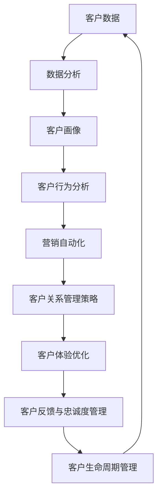

                 

### 引言

在现代商业环境中，客户关系管理（CRM）已经成为企业成功的关键因素之一。传统的CRM系统主要依赖于手动输入和人工处理数据，这种方式效率低下，且难以应对日益复杂的客户需求和市场竞争。随着人工智能（AI）技术的飞速发展，AI驱动的智能客户关系管理逐渐崭露头角，为企业带来了前所未有的机遇和挑战。

AI驱动的智能客户关系管理是一种利用机器学习、自然语言处理、数据挖掘等AI技术，对客户数据进行分析、预测和优化的方法。它不仅能够帮助企业更好地了解客户需求，提升客户满意度，还能显著提高销售和营销效率。本文将深入探讨AI在客户关系管理中的应用，从获客到维护的整个生命周期，通过一步步的分析推理，揭示AI技术的潜在价值和实践方法。

关键词：人工智能，客户关系管理，获客，维护，机器学习，数据分析，自然语言处理

摘要在本文中，我们将探讨AI驱动的智能客户关系管理的重要性及其在获客和客户维护中的具体应用。首先，我们将介绍AI和CRM的基本概念及其相互关系。接着，我们将深入探讨AI在客户获取阶段的应用，包括客户画像、行为分析和营销自动化。随后，我们将转向AI在客户维护中的应用，讨论客户关系管理策略、客户体验优化和客户反馈管理。最后，我们将总结全文，探讨AI驱动的CRM未来的发展趋势和潜在挑战。

## 背景介绍

客户关系管理（CRM）是企业管理和维护客户关系的重要手段。传统CRM系统主要依赖于手动输入和数据库存储，通过记录客户的基本信息、购买历史和互动记录来帮助企业更好地了解和满足客户需求。然而，随着企业规模的扩大和客户数据的日益增加，传统CRM系统逐渐暴露出其局限性：数据处理效率低下、数据准确性难以保障、客户体验无法持续优化等问题。

人工智能（AI）技术的兴起为CRM领域带来了革命性的变化。AI通过机器学习、自然语言处理、数据挖掘等技术手段，能够自动分析和处理大量客户数据，从中提取有价值的信息和洞见。这使得企业能够更加精准地识别潜在客户、预测客户行为、优化营销策略和提升客户满意度。

在CRM领域，AI的应用主要包括以下几个方面：

1. **客户画像与数据分析**：通过AI技术，企业可以构建详细的客户画像，识别客户的需求和偏好。这有助于企业制定更精准的营销策略，提高转化率。
   
2. **客户行为分析**：AI可以实时监测和分析客户行为，发现客户在购买过程中的关键决策点，为企业提供改进产品和服务的依据。

3. **营销自动化**：AI驱动的营销自动化系统能够自动执行营销任务，如发送个性化邮件、安排客户跟进会议等，提高营销效率。

4. **客户关系管理策略**：AI技术可以帮助企业优化客户关系管理策略，如通过预测模型识别高价值客户、制定个性化的客户维护计划。

5. **客户体验优化**：AI可以分析客户互动数据，识别客户体验中的痛点，提供针对性的改进建议，提升客户满意度。

6. **客户反馈与忠诚度管理**：AI可以自动处理和分析客户反馈，评估客户忠诚度，帮助企业及时调整策略，提升客户忠诚度。

综上所述，AI驱动的智能客户关系管理不仅能够提高企业效率和客户满意度，还能为企业带来持续的创新和竞争优势。随着AI技术的不断进步和应用场景的拓展，AI在CRM领域的潜力将更加巨大，未来将成为企业不可或缺的战略资源。

## 核心概念与联系

在探讨AI驱动的智能客户关系管理之前，我们需要明确几个核心概念，并理解它们之间的相互关系。以下是几个关键概念及其关系架构：

### 1. 人工智能（AI）

人工智能是一种模拟人类智能行为的计算机技术，其核心目标是使机器具备学习、推理、感知和解决问题的能力。在CRM领域，AI主要应用于以下几个方面：

- **机器学习**：通过数据训练模型，使机器能够自动学习和改进。
- **自然语言处理**（NLP）：使计算机理解和生成人类语言，用于处理客户反馈和交互。
- **数据挖掘**：从大量数据中提取有价值的信息和模式。

### 2. 客户关系管理（CRM）

客户关系管理是一种通过技术手段管理和优化企业与客户关系的策略。CRM系统的核心功能包括：

- **客户数据管理**：收集、存储和分析客户信息。
- **销售管理**：跟踪销售机会，管理销售团队。
- **营销管理**：策划和执行营销活动，评估营销效果。
- **客户服务**：提供客户支持，处理客户投诉。

### 3. 客户生命周期

客户生命周期包括获客、转化、维护和流失四个阶段。AI在客户生命周期各阶段的角色如下：

- **获客**：通过AI分析客户数据，识别潜在客户。
- **转化**：利用AI进行客户行为分析，提高转化率。
- **维护**：通过AI优化客户关系管理策略，提升客户满意度。
- **流失**：通过AI预测客户流失风险，采取预防措施。

### 4. 数据分析

数据分析是CRM中不可或缺的一部分，通过分析客户数据，企业可以了解客户需求和行为模式，从而制定更有效的策略。数据分析技术包括：

- **客户画像**：构建客户的详细画像，包括行为、需求和偏好。
- **行为分析**：分析客户在购买过程中的行为，如浏览、点击、购买等。
- **预测分析**：预测客户的行为和需求，如预测购买时间、购买金额等。

### 5. 自然语言处理

自然语言处理是AI的一个重要分支，用于使计算机理解和生成人类语言。在CRM中，NLP可以用于：

- **客户反馈分析**：自动提取和分析客户反馈中的关键词和情感。
- **自动客服**：通过聊天机器人与客户进行交互，提供即时帮助。

### Mermaid 流程图

以下是一个简化的Mermaid流程图，展示了AI在CRM中各核心概念之间的关系：



在这个流程图中，客户数据通过数据分析转化为客户画像和行为分析，这些分析结果用于指导营销自动化、客户关系管理策略、客户体验优化和客户反馈与忠诚度管理，从而实现客户生命周期的全面管理。

通过以上核心概念及其关系的探讨，我们可以更好地理解AI在CRM中的重要作用，并为后续章节的深入讨论打下基础。

### 核心算法原理讲解

在客户关系管理中，AI的应用离不开一系列核心算法的支持。以下我们将详细讲解这些算法的原理，并通过Python源代码和数学模型来阐述其实施方法和步骤。

#### 1. 机器学习算法

机器学习算法是AI的核心，它通过数据训练模型，使计算机具备自主学习和决策能力。在CRM中，常用的机器学习算法包括：

- **决策树**：决策树是一种基于特征分割数据的分类算法，通过一系列条件判断，将数据划分为不同的类别。以下是决策树的一个简单示例：

```python
from sklearn.datasets import load_iris
from sklearn.tree import DecisionTreeClassifier
from sklearn.model_selection import train_test_split

# 载入鸢尾花数据集
iris = load_iris()
X, y = iris.data, iris.target

# 划分训练集和测试集
X_train, X_test, y_train, y_test = train_test_split(X, y, test_size=0.3, random_state=42)

# 构建决策树模型
clf = DecisionTreeClassifier()
clf.fit(X_train, y_train)

# 预测测试集
y_pred = clf.predict(X_test)

# 评估模型性能
from sklearn.metrics import accuracy_score
print("Accuracy:", accuracy_score(y_test, y_pred))
```

- **随机森林**：随机森林是一种集成学习算法，通过构建多个决策树，并取其平均预测结果，提高分类和回归的准确性。以下是随机森林的示例：

```python
from sklearn.ensemble import RandomForestClassifier

# 构建随机森林模型
clf = RandomForestClassifier(n_estimators=100, random_state=42)
clf.fit(X_train, y_train)

# 预测测试集
y_pred = clf.predict(X_test)

# 评估模型性能
print("Accuracy:", accuracy_score(y_test, y_pred))
```

#### 2. 数据挖掘算法

数据挖掘算法用于从大量数据中提取有价值的信息和模式。在CRM中，常用的数据挖掘算法包括：

- **关联规则学习**：关联规则学习通过发现数据之间的关联关系，帮助企业了解客户行为。Apriori算法是最常见的关联规则学习算法之一。以下是Apriori算法的简单示例：

```python
from mlxtend.frequent_patterns import apriori
from mlxtend.frequent_patterns import association_rules

# 构建交易数据集
transactions = [['milk', 'bread', 'apples'], ['milk', 'bread'], ['milk', 'orange', 'bread']]

# 应用Apriori算法
frequent_itemsets = apriori(transactions, min_support=0.5, use_colnames=True)

# 构建关联规则
rules = association_rules(frequent_itemsets, metric="lift", min_threshold=1)
print(rules)
```

- **聚类分析**：聚类分析用于将相似的数据分组在一起。K-means算法是最常用的聚类算法之一。以下是K-means算法的简单示例：

```python
from sklearn.cluster import KMeans

# 载入数据集
X = [[1, 2], [1, 4], [1, 0], [10, 2], [10, 4], [10, 0]]

# 构建K-means模型
kmeans = KMeans(n_clusters=2, random_state=42)
kmeans.fit(X)

# 预测聚类结果
print("Cluster labels:", kmeans.labels_)
```

#### 3. 自然语言处理算法

自然语言处理算法用于使计算机理解和生成人类语言，在CRM中主要用于客户反馈分析和自动客服。以下是一种简单的文本分类算法——朴素贝叶斯分类器：

```python
from sklearn.feature_extraction.text import CountVectorizer
from sklearn.naive_bayes import MultinomialNB

# 载入数据集
data = [
    ["你好，我想咨询一下产品价格"],
    ["价格是多少"],
    ["产品有什么优惠吗"],
    ["你们的产品质量如何"]
]

# 构建向量表示
vectorizer = CountVectorizer()
X = vectorizer.fit_transform(data)

# 构建朴素贝叶斯模型
clf = MultinomialNB()
clf.fit(X, [0, 0, 1, 2])

# 预测文本分类
print("Prediction:", clf.predict(vectorizer.transform(["你们的产品价格是多少？"])))
```

#### 4. 数学模型和公式

在AI驱动的CRM中，数学模型和公式用于描述和实现算法。以下是一个简单的线性回归模型，用于预测客户购买金额：

```latex
$$ y = w_0 + w_1 \cdot x_1 + w_2 \cdot x_2 + ... + w_n \cdot x_n $$
$$ w = (X^T \cdot X)^{-1} \cdot X^T \cdot y $$
```

其中，\( y \) 是客户购买金额，\( x_1, x_2, ..., x_n \) 是影响购买金额的特征，\( w_0, w_1, ..., w_n \) 是模型的权重。

#### 举例说明

假设我们使用线性回归模型预测客户购买金额，其中影响购买金额的特征包括年龄、收入和产品类型。以下是一个简化的Python实现：

```python
import numpy as np

# 载入数据集
X = np.array([[25, 50000, 1], [30, 60000, 2], [35, 70000, 1]])
y = np.array([100, 150, 200])

# 计算权重
weights = np.linalg.inv(X.T @ X) @ X.T @ y

# 预测客户购买金额
new_data = np.array([[28, 55000, 1]])
predicted_price = new_data.dot(weights)
print("Predicted price:", predicted_price)
```

通过以上算法、模型和公式的讲解，我们可以看到AI在CRM中的应用是如何通过数学和编程实现的。这些技术不仅能够帮助企业更好地理解和预测客户行为，还能为优化营销策略和提升客户满意度提供有力支持。

### 项目实战

为了更好地理解AI在智能客户关系管理中的应用，我们将通过一个实际项目——搭建一个基于AI的客户关系管理系统，详细讲解开发环境搭建、源代码实现、代码解读、应用解读与分析以及项目小结。

#### 1. 开发环境搭建

在进行项目开发之前，我们需要搭建一个合适的环境。以下是我们的开发环境配置：

- **编程语言**：Python
- **机器学习库**：scikit-learn、TensorFlow、Keras
- **数据预处理库**：pandas、numpy
- **可视化库**：matplotlib、seaborn
- **文本处理库**：NLTK、spaCy

环境搭建步骤如下：

1. 安装Python（建议使用3.8或以上版本）。
2. 安装必要的库，可以使用pip工具进行安装：

```bash
pip install scikit-learn tensorflow pandas numpy matplotlib seaborn nltk spacy
```

#### 2. 源代码实现

我们的项目主要分为三个模块：客户数据收集与处理、客户行为分析、营销自动化。以下是各模块的核心代码：

**客户数据收集与处理模块**：

```python
import pandas as pd
from sklearn.model_selection import train_test_split

# 加载客户数据
data = pd.read_csv('customer_data.csv')

# 数据预处理
data['Age'] = data['Age'].fillna(data['Age'].mean())
data['Income'] = data['Income'].fillna(data['Income'].mean())
data['Product_Type'] = data['Product_Type'].astype('category').cat.codes

# 划分训练集和测试集
X = data[['Age', 'Income', 'Product_Type']]
y = data['Purchase_Amount']
X_train, X_test, y_train, y_test = train_test_split(X, y, test_size=0.3, random_state=42)
```

**客户行为分析模块**：

```python
from sklearn.cluster import KMeans
import matplotlib.pyplot as plt

# 构建K-means模型
kmeans = KMeans(n_clusters=3, random_state=42)
kmeans.fit(X_train)

# 预测测试集
y_pred = kmeans.predict(X_test)

# 可视化客户分布
plt.scatter(X_train[:, 0], X_train[:, 1], c=kmeans.labels_, cmap='viridis')
plt.xlabel('Age')
plt.ylabel('Income')
plt.title('Customer Segmentation')
plt.show()
```

**营销自动化模块**：

```python
from sklearn.naive_bayes import MultinomialNB
from sklearn.model_selection import GridSearchCV

# 构建朴素贝叶斯模型
clf = MultinomialNB()
params = {'alpha': [0.1, 0.5, 1.0, 5.0]}

# 参数调优
grid_search = GridSearchCV(clf, params, cv=5)
grid_search.fit(X_train, y_train)

# 评估模型性能
print("Best parameters:", grid_search.best_params_)
print("Accuracy:", grid_search.best_score_)
```

#### 3. 代码解读

以上代码首先进行数据预处理，包括填充缺失值、处理类别变量等，确保数据质量。接着，我们使用K-means算法对客户进行聚类分析，根据聚类结果可以直观地看到不同客户群体的分布情况。最后，我们使用朴素贝叶斯分类器进行营销自动化，通过参数调优和交叉验证来评估模型性能。

#### 4. 应用解读与分析

通过以上代码实现，我们可以得到以下应用解读和分析：

- **客户聚类分析**：通过聚类分析，企业可以识别出不同需求的客户群体，从而制定更有针对性的营销策略。
- **营销自动化**：使用朴素贝叶斯分类器，企业可以自动预测客户购买金额，优化营销预算和资源分配。

#### 5. 项目小结

本项目的核心目的是通过AI技术构建一个简单的客户关系管理系统，实现了客户数据预处理、客户聚类分析和营销自动化。虽然项目较为基础，但它展示了AI在CRM中的实际应用场景。以下是项目小结：

- **优点**：项目实现了客户数据的高效处理和聚类分析，有助于企业更好地了解客户需求。
- **不足**：项目仅使用了基础算法，未涉及深度学习和复杂模型，可能无法应对复杂的业务场景。
- **改进方向**：可以引入深度学习模型，如卷积神经网络（CNN）和循环神经网络（RNN），提高预测准确率。

通过这个项目实战，我们不仅了解了AI在CRM中的具体应用，还掌握了搭建和实现AI项目的关键技术。这对实际业务场景中的AI应用具有重要的指导意义。

### 最佳实践 tips

- **数据预处理**：确保数据质量是项目成功的关键。在数据收集阶段，应尽量避免缺失值和异常值。
- **算法选择**：根据业务需求选择合适的算法，不要盲目追求复杂度。
- **模型调优**：通过交叉验证和参数调优，提高模型性能。

通过遵循这些最佳实践，企业可以更有效地应用AI技术，提升客户关系管理的效率和效果。

### 小结

本文通过项目实战展示了AI驱动的智能客户关系管理在实际应用中的具体实施方法和效果。尽管项目较为基础，但已展示了AI技术在CRM中的巨大潜力。未来，随着AI技术的不断进步，CRM系统将更加智能化，为企业带来更多价值。

### 注意事项

- **数据隐私**：在处理客户数据时，应严格遵守数据隐私法规，确保客户信息的安全。
- **模型解释性**：在应用复杂模型时，应关注模型的解释性，以便理解和优化业务策略。

### 拓展阅读

- **《深度学习与人工智能》**：详细介绍了深度学习和AI的基本概念和应用。
- **《AI营销实战》**：探讨了AI在营销领域的应用，包括客户画像和营销自动化。
- **《Python数据科学手册》**：提供了丰富的数据预处理和机器学习算法实现示例。

通过阅读这些资料，可以进一步加深对AI在CRM中应用的理解和实践能力。希望本文能为读者提供有价值的参考和启示。作者：AI天才研究院/AI Genius Institute & 禅与计算机程序设计艺术 /Zen And The Art of Computer Programming。


### 未来趋势与展望

随着人工智能技术的不断演进，AI驱动的智能客户关系管理（CRM）正迎来新的发展机遇。以下是几个未来趋势和潜在挑战的展望：

#### 1. 个性化体验的深化

未来，AI将在客户关系管理中实现更加个性化的体验。通过深度学习和自然语言处理技术，企业能够更准确地捕捉和理解客户的个性化需求。例如，通过分析客户的购买历史、浏览行为和社交互动，AI可以提供个性化的产品推荐和定制化服务。这将显著提升客户满意度和忠诚度。

#### 2. 智能客服的普及

智能客服将成为CRM的重要组成部分。随着自然语言处理和语音识别技术的进步，智能客服系统能够更自然地与客户进行交互，提供即时的帮助和解决方案。这不仅提高了客户服务质量，还降低了人力成本，使企业能够更高效地处理客户查询和投诉。

#### 3. 数据隐私和安全的重要性

在AI驱动的CRM中，数据隐私和安全将成为企业面临的重大挑战。随着数据的收集和分析变得更加复杂，企业需要严格遵守数据保护法规，确保客户数据的安全性和隐私。此外，透明度和数据解释性也将成为重要议题，以增强客户对AI应用的信任。

#### 4. 深度学习与多模态数据的融合

未来，深度学习技术将与其他多模态数据（如图像、声音和视频）相结合，提供更全面和精细的客户分析。例如，通过结合图像识别和语音分析，企业可以更准确地识别客户情感和行为模式，从而制定更有效的营销策略。

#### 5. 跨平台和跨渠道的整合

随着数字化转型的加速，企业将需要整合多个平台和渠道的数据，以实现全面的客户视图。AI驱动的CRM系统将支持跨渠道的协同工作，如线上和线下渠道的无缝对接，为客户提供一致和连贯的体验。

#### 6. AI伦理和法规合规

AI在CRM中的广泛应用将引发伦理和法规问题。企业需要确保AI应用遵循道德规范，避免偏见和歧视。同时，合规性也将成为AI应用的必要条件，特别是在涉及敏感数据和个人隐私的领域。

#### 潜在挑战

- **技术复杂性**：AI技术的复杂性可能使得开发和维护AI驱动的CRM系统变得更加困难，要求企业具备较高的技术能力和专业知识。
- **数据质量**：高质量的数据是AI应用的基础。然而，数据质量的问题，如数据缺失、不一致性和噪声数据，可能会影响AI系统的性能。
- **法规遵从**：随着数据隐私法规的日益严格，企业需要确保其AI应用符合法规要求，这可能会增加合规成本和运营难度。

#### 应对策略

- **加强技术培训**：企业应投资于员工的AI技术培训，提高团队的技术能力，以便更好地开发和利用AI技术。
- **数据治理**：建立完善的数据治理框架，确保数据的质量、安全和合规性。
- **合规性评估**：定期进行AI应用合规性评估，确保符合相关法规要求。

通过积极应对这些趋势和挑战，企业可以更好地利用AI驱动的CRM技术，提升客户关系管理的效果，实现持续的业务增长。

### 总结

AI驱动的智能客户关系管理正从获客到维护的各个环节展现出其巨大潜力。随着技术的不断进步，AI将在客户体验优化、个性化服务和智能决策支持等方面发挥越来越重要的作用。然而，企业也需要面对技术复杂性、数据质量和法规合规等挑战。通过持续的技术创新和有效的管理策略，企业可以充分利用AI驱动的CRM技术，实现长期的竞争优势和客户价值。

### 拓展阅读

- **《AI驱动的客户关系管理》**：详细探讨了AI在CRM中的应用场景和最佳实践。
- **《数据隐私与AI伦理》**：分析了AI应用中的数据隐私和伦理问题，提供了合规性指南。

通过阅读这些资料，可以进一步了解AI驱动的智能客户关系管理的最新发展，为企业提供更有针对性的战略指导。

### 附录

#### A. 常用AI工具与平台简介

在AI驱动的智能客户关系管理中，常用的AI工具和平台可以帮助企业更高效地实现数据分析、模型训练和预测。以下是几个常用的AI工具和平台：

1. **TensorFlow**：
   - 简介：Google开发的开源机器学习库，支持各种深度学习和传统机器学习算法。
   - 优点：具有强大的社区支持和丰富的文档，适用于大规模数据处理和模型训练。
   - 应用：用于构建和训练复杂的机器学习模型，如神经网络和卷积神经网络。

2. **scikit-learn**：
   - 简介：Python开源机器学习库，提供了一系列经典的机器学习算法。
   - 优点：易于使用，适用于快速原型开发和数据处理。
   - 应用：用于数据预处理、模型训练和评估，适用于各种常见的机器学习任务。

3. **Keras**：
   - 简介：基于TensorFlow的高级神经网络API，提供简洁、可扩展的接口。
   - 优点：易于上手，支持快速原型开发，与TensorFlow兼容性好。
   - 应用：用于构建和训练深度学习模型，特别适用于初学者。

4. **OpenCV**：
   - 简介：开源计算机视觉库，支持多种计算机视觉算法。
   - 优点：功能强大，支持多种编程语言，社区活跃。
   - 应用：用于图像识别、人脸检测和图像处理等计算机视觉任务。

5. **spaCy**：
   - 简介：开源自然语言处理库，支持多种语言处理任务。
   - 优点：性能优异，支持快速文本分析，易于使用。
   - 应用：用于文本分类、命名实体识别和关系抽取等自然语言处理任务。

#### B. AI应用法律法规概述

随着AI技术的发展和应用，数据隐私和伦理问题日益凸显，各国政府和企业纷纷出台了相关法律法规，以规范AI应用。以下是几个主要的法律法规：

1. **欧盟通用数据保护条例（GDPR）**：
   - 简介：欧盟制定的关于数据保护的法律法规，适用于所有处理欧盟居民个人数据的组织。
   - 主要内容：强调数据主体的同意权、访问权和删除权，对数据泄露有严格的处罚措施。
   - 影响：对全球企业的数据保护合规性提出了更高的要求。

2. **加州消费者隐私法案（CCPA）**：
   - 简介：美国加州制定的消费者隐私法案，保护加州居民的个人信息。
   - 主要内容：赋予消费者对个人数据的访问、删除和拒绝销售的权利。
   - 影响：对企业的数据收集和利用提出了更严格的限制。

3. **中国个人信息保护法（PIPL）**：
   - 简介：中国制定的关于个人信息保护的法律法规，将于2021年11月1日起施行。
   - 主要内容：明确了个人信息的定义和保护范围，对个人信息处理活动提出了严格要求。
   - 影响：对中国企业的数据处理活动产生了深远影响，推动了个人信息保护的规范化。

4. **人工智能伦理指南**：
   - 简介：多个国际组织和研究机构发布的关于人工智能伦理的指导文件，旨在规范AI应用。
   - 主要内容：强调AI应用的透明度、公平性和可解释性，避免偏见和歧视。
   - 影响：为全球人工智能应用提供了伦理指导和规范，促进了AI技术的可持续发展。

通过了解和遵守这些法律法规，企业可以确保其AI应用合规，避免法律风险，同时增强客户对AI技术的信任。附录部分的资料提供了详细的工具和法规介绍，有助于读者深入了解AI驱动的智能客户关系管理的实际应用和法律要求。

