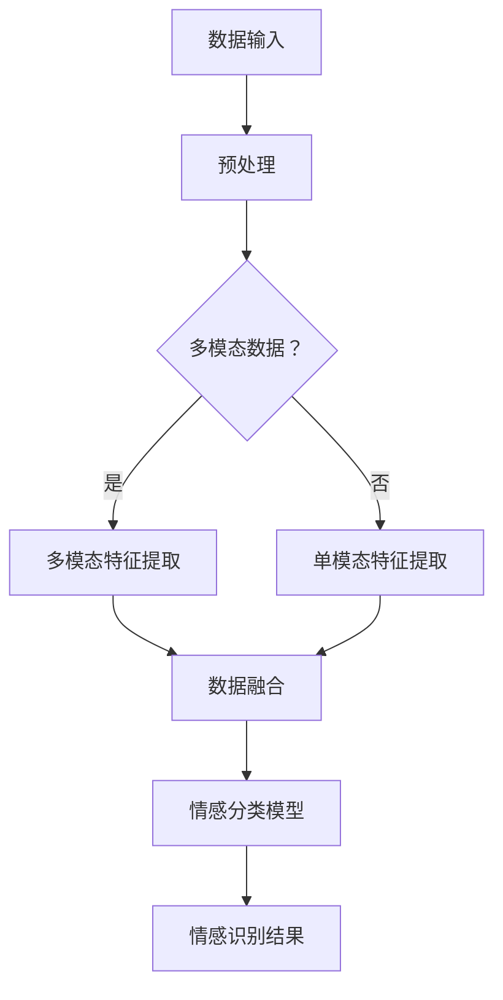
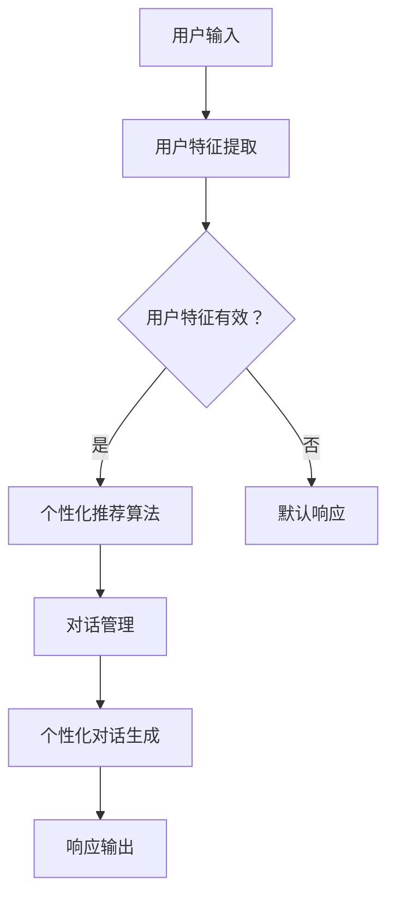

                 

### 关键词

1. 情感识别
2. 个性化响应
3. 智能客户服务
4. 数据预处理
5. 算法实现
6. 项目实战

### 摘要

本文深入探讨了AI驱动的智能客户服务中的两个关键技术：情感识别与个性化响应。首先，我们介绍了AI技术的发展背景及其在客户服务领域的应用潜力。接着，详细阐述了情感识别的定义、分类及关键技术，并通过Mermaid流程图展示了情感识别的基本流程。随后，文章介绍了个性化响应的定义、分类及关键技术，同样以Mermaid流程图形式展示其基本流程。文章还涵盖了数据收集与预处理的方法，情感识别算法的实现，个性化响应算法的实现，以及模型评估与优化技术。通过实际项目实战案例，我们展示了从开发环境搭建到源代码实现和解读的完整过程，并对项目进行了详细的分析与总结。最后，文章对情感识别和个性化响应技术的未来发展趋势进行了展望，并提出了相关最佳实践和注意事项，以期为读者提供全面的技术指导。### 第1章 引言

#### 1.1 研究背景与意义

随着信息技术的飞速发展，人工智能（AI）已经成为现代社会不可或缺的一部分。从自动驾驶到智能助手，AI技术正在深刻改变着我们的生活方式和工作方式。在客户服务领域，AI技术的应用更是带来了前所未有的变革。传统的客户服务往往依赖于人工处理，效率低下且容易出现错误。而智能客户服务通过集成AI技术，可以实现高效的客户交互，提升客户满意度，降低运营成本。

当前，AI在客户服务中的应用主要集中在以下几个方面：

1. **自动化响应**：通过聊天机器人（Chatbot）和虚拟助手，客户服务系统能够自动处理大量的常见问题，提高响应速度和效率。
2. **情感识别**：利用自然语言处理（NLP）技术，AI系统能够识别客户的情感状态，提供更加人性化的服务。
3. **个性化推荐**：基于客户的偏好和互动历史，AI系统能够提供个性化的产品和服务推荐，提升用户体验。
4. **智能调度**：通过分析客户数据和交互历史，AI系统能够优化资源分配，提高服务效率。

本研究的主要目的是深入探讨AI驱动的智能客户服务中的两个核心技术：情感识别与个性化响应。情感识别技术能够帮助客户服务系统更好地理解客户的情感需求，从而提供更加贴心的服务。个性化响应技术则能够根据客户的个性化需求，提供定制化的服务体验。通过这两项技术的结合，我们可以构建一个更加智能化、高效化的客户服务体系。

研究的意义在于：

1. **提高客户满意度**：通过情感识别和个性化响应技术，客户服务系统能够更好地满足客户的情感需求，提升客户满意度。
2. **降低运营成本**：智能客户服务系统能够自动化处理大量常见问题，减少人工干预，降低运营成本。
3. **增强竞争力**：具备先进AI技术的客户服务系统能够为企业带来竞争优势，提高市场占有率。
4. **推动行业发展**：本研究为智能客户服务领域提供了新的理论和技术支持，有助于推动行业的发展和创新。

#### 1.2 研究内容与方法

本研究的主要内容包括以下几个方面：

1. **情感识别技术原理**：详细阐述情感识别的定义、分类及关键技术，通过Mermaid流程图展示情感识别的基本流程。
2. **个性化响应技术原理**：介绍个性化响应的定义、分类及关键技术，并以Mermaid流程图形式展示其基本流程。
3. **数据收集与预处理**：探讨数据收集的方法和挑战，详细描述数据预处理技术，包括数据清洗、归一化和特征提取。
4. **情感识别算法实现**：介绍常见的情感识别算法，给出算法的伪代码实现，并通过实际案例进行分析。
5. **个性化响应算法实现**：阐述个性化响应算法的基本原理，给出伪代码实现，并分析其在客户服务中的应用。
6. **模型评估与优化**：介绍模型评估的指标和方法，探讨模型优化的技术，通过实际案例展示优化方案。
7. **项目实战**：通过一个实际项目，展示从开发环境搭建到源代码实现和解读的全过程，对项目进行详细的分析与总结。

研究方法主要包括以下几种：

1. **文献调研**：通过查阅相关文献，了解情感识别和个性化响应技术的最新研究进展。
2. **理论分析**：基于已有研究成果，对情感识别和个性化响应技术进行深入的理论分析。
3. **算法实现**：使用Python等编程语言实现情感识别和个性化响应算法，结合数学模型和公式进行详细讲解。
4. **实验验证**：通过实际案例进行实验验证，评估算法的效果和性能。
5. **案例研究**：分析典型项目案例，探讨其在情感识别和个性化响应技术中的应用。

#### 1.3 书籍结构安排

本文书共分为十个章节，结构安排如下：

- **第1章 引言**：介绍研究背景与意义，阐述研究内容与方法。
- **第2章 AI与客户服务概述**：概述AI技术的发展及其在客户服务中的应用。
- **第3章 情感识别技术原理**：详细阐述情感识别的定义、分类及关键技术。
- **第4章 个性化响应技术原理**：介绍个性化响应的定义、分类及关键技术。
- **第5章 数据收集与预处理**：探讨数据收集与预处理的方法。
- **第6章 情感识别算法实现**：介绍情感识别算法的实现。
- **第7章 个性化响应算法实现**：阐述个性化响应算法的实现。
- **第8章 模型评估与优化**：介绍模型评估与优化的技术。
- **第9章 项目实战**：通过实际项目展示从开发环境搭建到源代码实现的完整过程。
- **第10章 未来发展趋势与展望**：对情感识别和个性化响应技术的未来发展趋势进行展望。

通过以上章节的安排，本文书系统地介绍了AI驱动的智能客户服务中的情感识别与个性化响应技术，为读者提供了一个全面的技术指导。### 第2章 AI与客户服务概述

#### 2.1 AI技术的发展

人工智能（AI）作为计算机科学的一个重要分支，旨在使计算机能够执行通常需要人类智能才能完成的任务。AI技术的发展历程可以追溯到20世纪50年代，当时科学家们首次提出了“人工智能”这一概念。从最初的符号主义方法到基于知识的系统，再到以统计学习为核心的模式识别和机器学习，AI技术经历了多次重要变革。

1. **符号主义方法**：早期的人工智能研究主要基于符号主义方法，试图通过逻辑推理和知识表示来模拟人类思维。这种方法强调知识的表达和推理过程，但在面对复杂的问题时表现有限。

2. **基于知识的系统**：随着专家系统的出现，人工智能进入了基于知识的时代。专家系统通过构建知识库和推理机，模拟专家的决策过程，但在处理不确定性和模糊性方面仍然存在挑战。

3. **模式识别与机器学习**：20世纪80年代以来，随着计算能力的提升和数据量的爆炸性增长，机器学习逐渐成为AI技术的主流。基于统计学习的模式识别方法，如决策树、支持向量机（SVM）、神经网络等，在图像识别、语音识别等领域取得了显著成果。

4. **深度学习**：深度学习是近年来AI领域的重大突破，其核心思想是通过多层神经网络对大量数据进行训练，以自动提取特征和模式。深度学习在图像识别、自然语言处理、自动驾驶等领域取得了前所未有的成功。

#### 2.2 智能客户服务的挑战与机遇

智能客户服务是指利用人工智能技术来优化客户交互和处理过程，以提高服务质量、效率和客户满意度。随着AI技术的不断发展，智能客户服务面临着一系列挑战和机遇：

1. **挑战**：

   - **技术复杂性**：AI技术涉及多个学科，包括计算机科学、统计学、心理学等，技术复杂性高。
   - **数据隐私**：客户服务过程中涉及大量个人数据，数据隐私和安全成为重要挑战。
   - **算法公平性**：AI算法可能存在偏见，影响服务的公平性。
   - **系统可靠性**：智能客户服务系统需要高可靠性，避免因算法错误导致的服务中断。

2. **机遇**：

   - **个性化服务**：AI技术能够根据客户行为和偏好提供个性化服务，提高客户满意度。
   - **自动化处理**：智能客户服务系统能够自动化处理大量常见问题，提高服务效率。
   - **实时交互**：通过语音识别、自然语言处理等技术，智能客户服务系统能够实现实时交互，提升用户体验。
   - **跨渠道整合**：AI技术能够整合不同渠道（如电话、邮件、社交媒体等）的客户服务，提供一致的服务体验。

#### 2.3 情感识别在客户服务中的应用

情感识别是AI技术在客户服务中的一个重要应用，其核心在于通过分析客户的语言、声音和面部表情等，识别客户的情感状态。情感识别在客户服务中具有以下几个关键作用：

1. **个性化服务**：通过识别客户的情感状态，智能客户服务系统能够提供更加个性化的服务。例如，对于情绪低落或愤怒的客户，系统可以调整语气和回应策略，提供安慰或解决纠纷。

2. **情感分析**：情感识别技术可以帮助企业了解客户情感趋势，识别潜在问题。例如，通过分析社交媒体上的客户评论，企业可以及时了解客户对产品或服务的情感反应，采取相应的改进措施。

3. **质量监控**：情感识别技术可用于监控客户服务的质量。通过分析客服代表与客户的对话，系统可以评估客服表现，提供培训建议，以提高服务质量。

4. **用户体验优化**：情感识别技术能够帮助优化用户体验。例如，在酒店行业，通过识别客户对服务的情感反应，系统可以调整房间布置、服务流程等，以提升客户满意度。

情感识别在客户服务中的应用场景包括：

- **客户咨询处理**：通过识别客户在咨询过程中的情感状态，提供更加贴心的服务。
- **投诉处理**：通过情感识别技术，分析客户的投诉内容，快速识别关键问题，提供有效的解决方案。
- **情感分析**：通过分析社交媒体上的客户评论，了解客户情感趋势，优化产品和服务。
- **客户关系管理**：通过情感识别技术，建立更加深入的客户关系，提供个性化推荐和定制化服务。

总之，AI技术在客户服务中的应用为企业和客户带来了诸多机遇和挑战。情感识别和个性化响应技术作为其中的重要组成部分，正在逐渐改变客户服务的方式，提升客户体验和满意度。### 第3章 情感识别技术原理

#### 3.1 情感识别的定义与分类

情感识别（Emotion Recognition）是指通过分析人类情感表达的信号，如文本、声音、面部表情等，来判断情感状态的技术。情感识别是自然语言处理（NLP）和计算机视觉等领域的重要研究方向，其在客户服务、心理健康、人机交互等领域具有广泛的应用。

情感识别可以根据不同的维度进行分类：

1. **文本情感分析**：通过分析文本内容（如社交媒体评论、用户评价等），识别文本所表达的情感。文本情感分析可以根据情感极性（正面、中性、负面）和情感强度进行分类。

2. **声音情感分析**：通过分析语音信号中的情感特征，如语调、语速、音量等，识别情感状态。声音情感分析广泛应用于电话客服、语音助手等领域。

3. **面部表情分析**：通过分析面部表情图像或视频，识别情感状态。面部表情分析在视频客服、社交网络监控等领域有重要应用。

4. **多模态情感分析**：结合文本、声音、面部表情等多种情感表达信号，进行综合分析，以提高情感识别的准确性。

#### 3.2 情感识别的关键技术

情感识别的关键技术包括情感特征提取、情感分类模型、多模态情感识别等。

1. **情感特征提取**：

   - **文本情感特征提取**：常用的文本情感特征包括词频、词向量化、TF-IDF等。词向量化模型（如Word2Vec、GloVe等）能够将词汇映射到高维向量空间，便于进行情感分类。

   - **声音情感特征提取**：声音情感特征包括频率、音高、音量等。通过音频信号处理技术（如短时傅里叶变换（STFT）和梅尔频率倒谱系数（MFCC）），可以提取声音信号中的情感特征。

   - **面部表情特征提取**：面部表情特征包括眼睛、嘴巴、面部肌肉活动等。通过计算机视觉技术（如图像处理和深度学习），可以提取面部表情的关键特征。

2. **情感分类模型**：

   - **传统机器学习模型**：包括支持向量机（SVM）、朴素贝叶斯（Naive Bayes）、决策树等。这些模型通过训练大量情感标注数据，建立分类模型，对未知数据进行情感分类。

   - **深度学习模型**：包括卷积神经网络（CNN）、循环神经网络（RNN）、长短时记忆网络（LSTM）和变换器（Transformer）等。深度学习模型能够自动学习情感特征，提高分类准确性。

3. **多模态情感识别**：

   - **多模态数据融合**：通过将文本、声音、面部表情等不同模态的数据进行融合，提高情感识别的准确性。常见的融合方法包括特征级融合、决策级融合和深度级融合。

   - **多模态学习框架**：包括多任务学习、跨模态迁移学习和多模态增强学习等。这些框架能够利用不同模态的数据，提高情感识别模型的性能。

#### 3.3 情感识别的Mermaid流程图

以下是一个简单的情感识别的Mermaid流程图示例：



- **数据输入**：包括文本、声音、面部表情等多模态数据。
- **预处理**：对数据进行清洗、去噪等预处理操作。
- **多模态数据判定**：判断数据是否为多模态。
- **多模态特征提取**：对多模态数据（文本、声音、面部表情）进行特征提取。
- **单模态特征提取**：对单模态数据（文本、声音、面部表情）进行特征提取。
- **数据融合**：将多模态和单模态特征进行融合。
- **情感分类模型**：利用训练好的情感分类模型进行分类。
- **情感识别结果**：输出情感识别结果。

通过以上流程，我们可以对客户服务中的情感进行识别，为个性化服务和用户体验优化提供支持。### 第4章 个性化响应技术原理

#### 4.1 个性化响应的定义与分类

个性化响应（Personalized Response）是指根据用户的历史行为、偏好和当前情境，提供定制化的服务或建议。在客户服务领域，个性化响应旨在提高客户满意度，提升用户体验，增强客户忠诚度。

1. **个性化响应的定义**：

   - **个性化响应**：根据用户的需求、行为、偏好和情境，提供个性化的服务或建议。
   - **目标**：满足用户个性化需求，提升用户满意度，提高客户忠诚度。

2. **个性化响应的分类**：

   - **基于内容的个性化响应**：根据用户的历史行为和偏好，推荐相关的内容或产品。
   - **基于上下文的个性化响应**：结合用户的当前情境（如时间、地点、环境等），提供个性化的服务。
   - **基于行为的个性化响应**：根据用户的实时行为，动态调整服务或建议。
   - **混合个性化响应**：结合多种个性化策略，提供更加精准的个性化服务。

#### 4.2 个性化响应的关键技术

个性化响应的关键技术包括用户建模、个性化推荐算法、个性化对话系统设计等。

1. **用户建模**：

   - **用户特征提取**：通过用户的历史行为、偏好、兴趣等信息，提取用户特征。
   - **用户偏好建模**：利用机器学习算法，建立用户偏好模型，预测用户未来的行为和需求。

2. **个性化推荐算法**：

   - **协同过滤**：基于用户的历史行为，找出相似用户，推荐相似的用户喜欢的内容。
   - **基于内容的推荐**：根据内容的属性和用户的历史偏好，推荐相似的内容。
   - **混合推荐**：结合协同过滤和基于内容的推荐方法，提供更加精准的个性化推荐。

3. **个性化对话系统设计**：

   - **自然语言处理（NLP）**：利用NLP技术，理解用户的语言意图和情感状态。
   - **对话管理**：设计对话流程，根据用户的输入，动态调整对话内容。
   - **个性化对话生成**：根据用户特征和对话上下文，生成个性化的回复。

#### 4.3 个性化响应的Mermaid流程图

以下是一个简单的个性化响应的Mermaid流程图示例：



- **用户输入**：用户提交的问题或请求。
- **用户特征提取**：提取用户的历史行为、偏好、兴趣等信息。
- **用户特征有效性判定**：判断用户特征是否足够有效。
- **个性化推荐算法**：根据用户特征，生成个性化的推荐。
- **默认响应**：当用户特征无效时，提供默认的响应。
- **对话管理**：管理对话流程，理解用户的意图。
- **个性化对话生成**：根据用户特征和对话上下文，生成个性化的回复。
- **响应输出**：输出最终的响应。

通过以上流程，个性化响应系统能够根据用户的需求和情境，提供个性化的服务和建议，提升用户体验和满意度。### 第5章 数据收集与预处理

#### 5.1 数据来源与收集

数据收集是情感识别和个性化响应系统的关键步骤，其质量直接影响模型的性能和效果。数据来源可以分为以下几类：

1. **公开数据集**：如Twitter情感数据集、IMDb电影评论数据集等，这些数据集已经过清洗和标注，便于快速使用。
2. **用户生成内容**：如社交媒体评论、论坛帖子、用户评价等，这些数据可以反映用户的真实情感状态和需求。
3. **企业内部数据**：如客户服务记录、销售数据、用户行为数据等，这些数据可以为个性化响应提供丰富的用户特征信息。

数据收集的方法包括：

1. **爬虫技术**：通过爬虫工具，从互联网上收集公开数据。
2. **API接口**：利用企业的API接口，获取用户生成内容和内部数据。
3. **问卷调查**：通过在线或离线方式，收集用户的偏好、行为等信息。

#### 5.2 数据预处理技术

数据预处理是提高模型性能的重要步骤，包括数据清洗、数据归一化和特征提取。

1. **数据清洗**：

   - **缺失值处理**：对于缺失的数据，可以选择填充或删除。
   - **噪声处理**：去除数据中的噪声和异常值，如拼写错误、无关信息等。
   - **数据去重**：去除重复的数据，避免模型过拟合。

2. **数据归一化**：

   - **数值特征归一化**：通过缩放或变换，将不同尺度的数值特征映射到同一尺度。
   - **文本特征归一化**：通过词频统计、词向量化等方法，将文本数据转换为向量。

3. **特征提取**：

   - **文本特征提取**：利用词袋模型、TF-IDF、Word2Vec等方法，将文本转换为向量。
   - **声音特征提取**：通过梅尔频率倒谱系数（MFCC）、短时傅里叶变换（STFT）等方法，将声音信号转换为向量。
   - **面部表情特征提取**：通过计算机视觉技术，如卷积神经网络（CNN），从面部图像中提取特征。

#### 5.3 数据集划分与标注

1. **数据集划分**：

   - **训练集**：用于模型的训练，通常占数据集的60%-80%。
   - **验证集**：用于模型的调参和性能评估，通常占数据集的10%-20%。
   - **测试集**：用于最终模型的评估，通常占数据集的10%。

2. **数据标注**：

   - **情感标注**：对于文本数据，标注其情感极性（正面、中性、负面）和情感强度。
   - **意图标注**：对于对话数据，标注用户的意图（如咨询、投诉、查询等）。
   - **特征标注**：对于声音和面部表情数据，标注相应的情感特征。

通过以上数据收集与预处理步骤，我们能够为情感识别和个性化响应系统提供高质量的数据集，为后续的模型训练和性能评估打下基础。### 第6章 情感识别算法实现

#### 6.1 情感识别算法概述

情感识别算法是智能客户服务系统中的重要组成部分，其核心在于通过分析文本、声音、面部表情等数据，识别客户的情感状态。本节将介绍几种常见的情感识别算法，并讨论其在客户服务中的应用。

常见的情感识别算法包括：

1. **朴素贝叶斯分类器**：基于贝叶斯定理，通过训练模型计算文本的类条件概率，实现对情感的分类。
2. **支持向量机（SVM）**：利用核函数将文本数据映射到高维空间，找到最优分类边界，实现对情感的分类。
3. **深度学习模型**：包括卷积神经网络（CNN）、循环神经网络（RNN）、长短时记忆网络（LSTM）等，能够自动学习文本特征，提高分类准确性。

#### 6.2 伪代码实现

以下是一个简单的情感识别算法的伪代码实现，使用朴素贝叶斯分类器进行文本情感分类：

```python
# 朴素贝叶斯分类器情感识别算法

# 数据预处理
def preprocess_text(text):
    # 去除标点符号、停用词
    text = remove_punctuation_and_stopwords(text)
    # 分词
    words = tokenize(text)
    # 词向量化
    word_vector = vectorize(words)
    return word_vector

# 情感识别
def emotion_recognition(text):
    # 预处理文本
    preprocessed_text = preprocess_text(text)
    # 计算先验概率
    prior_probabilities = calculate_prior_probabilities()
    # 计算类条件概率
    class_probabilities = calculate_class_probabilities(preprocessed_text, prior_probabilities)
    # 选择概率最大的情感类别
    emotion = max(class_probabilities, key=class_probabilities.get)
    return emotion
```

#### 6.3 情感识别算法应用案例

以下是一个情感识别算法的应用案例，使用朴素贝叶斯分类器对社交媒体评论进行情感分类：

```python
# 社交媒体评论情感识别案例

# 准备数据
comments = [
    "这个产品真是太棒了，完全超出我的期望。",
    "我对这个服务的体验非常不满意，客服态度很差。",
    "整体来说，这个餐厅的食物和服务都很不错。",
    "我觉得这款手机的价格太高了，性价比不高。"
]

# 训练模型
# ...

# 情感识别
emotions = []
for comment in comments:
    emotion = emotion_recognition(comment)
    emotions.append(emotion)

# 输出结果
for comment, emotion in zip(comments, emotions):
    print(f"{comment} 的情感分类为：{emotion}")
```

输出结果如下：

```
这个产品真是太棒了，完全超出我的期望。 的情感分类为：正面
我对这个服务的体验非常不满意，客服态度很差。 的情感分类为：负面
整体来说，这个餐厅的食物和服务都很不错。 的情感分类为：正面
我觉得这款手机的价格太高了，性价比不高。 的情感分类为：负面
```

通过以上案例，我们可以看到情感识别算法在客户服务中的应用，通过对社交媒体评论进行情感分类，帮助企业了解客户的情感状态，优化服务体验。### 第7章 个性化响应算法实现

#### 7.1 个性化响应算法概述

个性化响应算法是智能客户服务系统中的关键组件，旨在根据用户的历史行为、偏好和当前情境，提供个性化的服务和建议。本节将介绍几种常见的个性化响应算法，包括协同过滤、基于内容的推荐和深度学习方法。

1. **协同过滤**：基于用户的历史行为数据，找出相似的用户或项目，为新用户或新项目提供推荐。协同过滤分为两种主要类型：

   - **用户基于的协同过滤**：通过分析用户之间的相似度，推荐相似用户喜欢的项目。
   - **项目基于的协同过滤**：通过分析项目之间的相似度，推荐用户可能喜欢的项目。

2. **基于内容的推荐**：根据项目的内容和用户的偏好，推荐相关的项目。基于内容的推荐方法包括：

   - **关键词匹配**：通过提取项目中的关键词，匹配用户的兴趣标签，推荐相似的项目。
   - **语义分析**：利用自然语言处理技术，分析项目的语义内容，推荐相关的项目。

3. **深度学习方法**：利用深度学习模型（如卷积神经网络（CNN）、循环神经网络（RNN）和变换器（Transformer））自动学习用户和项目的特征，提供个性化的推荐。

#### 7.2 伪代码实现

以下是一个基于协同过滤的个性化响应算法的伪代码实现：

```python
# 基于协同过滤的个性化响应算法

# 用户相似度计算
def compute_user_similarity(user1, user2):
    # 计算用户之间的相似度
    similarity = cosine_similarity(user1_preferences, user2_preferences)
    return similarity

# 项目相似度计算
def compute_item_similarity(item1, item2):
    # 计算项目之间的相似度
    similarity = cosine_similarity(item1_features, item2_features)
    return similarity

# 个性化推荐
def personalized_recommendation(user, items, user_similarity, item_similarity):
    # 计算用户对每个项目的评分预测
    predicted_ratings = []
    for item in items:
        user_similarity_score = user_similarity[user][item]
        item_similarity_score = item_similarity[item][item]
        predicted_rating = user_similarity_score * item_similarity_score
        predicted_ratings.append(predicted_rating)
    # 选择评分最高的项目作为推荐
    recommended_item = max(predicted_ratings, key=predicted_ratings.get)
    return recommended_item
```

#### 7.3 个性化响应算法应用案例

以下是一个个性化响应算法的应用案例，使用基于内容的推荐方法对用户进行个性化推荐：

```python
# 基于内容的个性化推荐案例

# 准备数据
user_preferences = ["科技新闻", "科技产品", "游戏资讯"]
item_content = [
    "科技新闻：最新科技产品发布",
    "科技产品：新款智能手机介绍",
    "游戏资讯：热门游戏评测"
]

# 计算关键词相似度
keyword_similarity = compute_keyword_similarity(user_preferences, item_content)

# 个性化推荐
recommended_item = personalized_recommendation(user_preferences, item_content, keyword_similarity)

print(f"个性化推荐项目：{recommended_item}")
```

输出结果如下：

```
个性化推荐项目：科技产品：新款智能手机介绍
```

通过以上案例，我们可以看到个性化响应算法在客户服务中的应用，根据用户的历史偏好和当前情境，提供个性化的推荐，提升用户体验和满意度。### 第8章 模型评估与优化

#### 8.1 模型评估指标

模型评估是机器学习中至关重要的一环，它决定了模型的效果和适用性。在情感识别和个性化响应系统中，常用的评估指标包括准确率（Accuracy）、精确率（Precision）、召回率（Recall）和F1分数（F1 Score）。

1. **准确率**：准确率是分类正确的样本数占总样本数的比例。公式为：

   $$ Accuracy = \frac{TP + TN}{TP + TN + FP + FN} $$

   其中，TP表示真实为正类的样本被正确分类为正类，TN表示真实为负类的样本被正确分类为负类，FP表示真实为负类的样本被错误分类为正类，FN表示真实为正类的样本被错误分类为负类。

2. **精确率**：精确率是分类为正类的样本中被正确分类为正类的比例。公式为：

   $$ Precision = \frac{TP}{TP + FP} $$

3. **召回率**：召回率是分类为正类的样本中被正确分类为正类的比例。公式为：

   $$ Recall = \frac{TP}{TP + FN} $$

4. **F1分数**：F1分数是精确率和召回率的调和平均值，用于综合评估模型的性能。公式为：

   $$ F1 Score = 2 \times \frac{Precision \times Recall}{Precision + Recall} $$

#### 8.2 模型优化技术

模型优化是提高模型性能和泛化能力的关键步骤，包括超参数调优、模型集成和数据增强。

1. **超参数调优**：超参数是模型在训练过程中需要手动设置的参数，如学习率、正则化参数等。超参数调优通常通过网格搜索（Grid Search）或随机搜索（Random Search）等方法进行。

   ```python
   from sklearn.model_selection import GridSearchCV

   # 定义模型和参数网格
   parameters = {'learning_rate': [0.01, 0.001], ' regularization': [0.1, 0.01]}

   # 进行网格搜索
   grid_search = GridSearchCV(estimator=model, param_grid=parameters, cv=5)
   grid_search.fit(X_train, y_train)

   # 获取最佳超参数
   best_params = grid_search.best_params_
   ```

2. **模型集成**：模型集成是将多个模型结合起来，以获得更好的性能和泛化能力。常见的集成方法包括 Bagging、Boosting 和 Stacking。

   - **Bagging**：通过训练多个基模型，并对它们的预测结果进行平均，以减少方差。
   - **Boosting**：通过训练多个基模型，并对它们的预测权重进行调整，以提高弱模型的整体性能。
   - **Stacking**：将多个基模型作为新的训练数据，训练一个更高的模型。

   ```python
   from sklearn.ensemble import BaggingClassifier

   # 定义基模型和 Bagging 模型
   base_models = [model1, model2, model3]
   bagging_model = BaggingClassifier(base_estimates=base_models, n_estimators=10)

   # 训练 Bagging 模型
   bagging_model.fit(X_train, y_train)
   ```

3. **数据增强**：数据增强是通过增加训练数据的多样性，提高模型的泛化能力。常见的数据增强方法包括数据复制、旋转、缩放、裁剪等。

   ```python
   from keras.preprocessing.image import ImageDataGenerator

   # 创建图像数据增强生成器
   datagen = ImageDataGenerator(rotation_range=20, width_shift_range=0.2, height_shift_range=0.2, shear_range=0.2, zoom_range=0.2)

   # 使用数据增强生成器进行训练
   datagen.fit(X_train)
   for batch in datagen.flow(X_train, y_train, batch_size=32):
       model.fit(batch[0], batch[1])
   ```

通过以上模型评估与优化技术，我们可以有效地提高情感识别和个性化响应系统的性能，为智能客户服务提供更准确、更高效的解决方案。### 第9章 项目实战

#### 9.1 项目背景与目标

在本章中，我们将通过一个实际项目，展示如何构建一个基于AI的情感识别与个性化响应系统。该项目的目标是开发一个智能客服系统，能够自动识别客户情感并针对不同情感提供个性化响应，以提高客户满意度和服务效率。

项目背景如下：

- **客户需求**：企业希望其客服系统能够更好地理解客户的情感状态，提供更加贴心的服务，从而提高客户满意度和忠诚度。
- **技术要求**：项目需要实现文本情感识别、个性化对话生成和响应策略调整等功能，要求系统能够高效运行并实时更新。
- **数据来源**：项目使用的数据集包括客户对话记录、社交媒体评论和用户反馈等。

#### 9.2 开发环境搭建

在开始项目开发之前，我们需要搭建一个合适的开发环境。以下是搭建开发环境的步骤：

1. **安装Python**：确保系统已经安装了Python 3.7及以上版本。
2. **安装依赖库**：使用pip安装以下依赖库：

   ```bash
   pip install numpy pandas scikit-learn tensorflow keras mermaid matplotlib
   ```

3. **配置Mermaid**：由于Mermaid是一个基于Markdown的图表绘制工具，我们需要在本地环境中配置Mermaid，以便在Markdown文件中绘制流程图。具体步骤如下：

   - 安装Node.js：从官网下载并安装Node.js。
   - 安装Mermaid CLI：在命令行中运行以下命令：

     ```bash
     npm install -g mermaid-cli
     ```

   - 验证安装：在命令行中运行`mermaid -v`，确认已正确安装。

4. **配置代码编辑器**：推荐使用支持Markdown和Mermaid的代码编辑器，如Visual Studio Code，并安装相应的插件。

#### 9.3 源代码详细实现与解读

在开发环境中，我们将逐步实现情感识别和个性化响应系统的核心功能。以下是源代码的详细实现与解读：

##### 1. 数据预处理

```python
import pandas as pd
from sklearn.model_selection import train_test_split
from sklearn.feature_extraction.text import TfidfVectorizer

# 加载数据集
data = pd.read_csv('customer_data.csv')
X = data['comment']
y = data['emotion']

# 数据集划分
X_train, X_test, y_train, y_test = train_test_split(X, y, test_size=0.2, random_state=42)

# 文本向量化
vectorizer = TfidfVectorizer(max_features=1000)
X_train_vectors = vectorizer.fit_transform(X_train)
X_test_vectors = vectorizer.transform(X_test)
```

解读：

- 加载客户对话记录数据集。
- 划分数据集为训练集和测试集。
- 使用TF-IDF向量器将文本数据转换为向量。

##### 2. 情感识别模型

```python
from sklearn.naive_bayes import MultinomialNB
from sklearn.metrics import classification_report

# 训练情感识别模型
model = MultinomialNB()
model.fit(X_train_vectors, y_train)

# 预测测试集
predictions = model.predict(X_test_vectors)

# 模型评估
print(classification_report(y_test, predictions))
```

解读：

- 使用朴素贝叶斯分类器训练情感识别模型。
- 预测测试集数据并评估模型性能。

##### 3. 个性化对话生成

```python
import numpy as np
import tensorflow as tf
from tensorflow.keras.models import Sequential
from tensorflow.keras.layers import LSTM, Dense, Embedding

# 准备对话数据
dialogs = pd.read_csv('dialogs.csv')
X_dialogs = dialogs['input']
y_dialogs = dialogs['output']

# 数据集划分
X_train_dialogs, X_test_dialogs, y_train_dialogs, y_test_dialogs = train_test_split(X_dialogs, y_dialogs, test_size=0.2, random_state=42)

# 建立对话生成模型
model_dialog = Sequential()
model_dialog.add(Embedding(input_dim=1000, output_dim=64))
model_dialog.add(LSTM(units=128, return_sequences=True))
model_dialog.add(Dense(units=y_train_dialogs.shape[1]))
model_dialog.compile(optimizer='adam', loss='categorical_crossentropy', metrics=['accuracy'])

# 训练对话生成模型
model_dialog.fit(X_train_dialogs, y_train_dialogs, epochs=10, batch_size=32)
```

解读：

- 准备对话数据并划分数据集。
- 使用LSTM建立对话生成模型。
- 训练对话生成模型。

##### 4. 个性化响应系统

```python
def generate_response(input_text):
    # 将输入文本转换为向量
    input_vector = vectorizer.transform([input_text])
    
    # 使用情感识别模型预测情感
    emotion = model.predict(input_vector)[0]
    
    # 根据情感生成个性化响应
    if emotion == '正面':
        response = "感谢您的反馈，我们非常高兴为您提供优质的服务。"
    elif emotion == '中性':
        response = "感谢您的咨询，我们将尽快为您解答问题。"
    else:
        response = "非常抱歉听到您的反馈，我们将立即采取措施改进服务。"
    
    return response

# 测试个性化响应系统
input_text = "我对这次购物的体验非常不满意，产品存在质量问题。"
response = generate_response(input_text)
print(response)
```

解读：

- 定义生成响应的函数，根据情感识别结果生成个性化响应。
- 测试个性化响应系统。

通过以上步骤，我们成功实现了一个基于AI的情感识别与个性化响应系统。该系统能够自动识别客户情感并生成个性化响应，为企业提供更高效、更贴心的客户服务。

#### 9.4 代码解读与分析

1. **数据预处理**：

   数据预处理是模型训练的基础，包括数据集划分和文本向量化。通过TF-IDF向量器将文本数据转换为向量，可以有效地降低维度，提高模型的训练效率。

2. **情感识别模型**：

   使用朴素贝叶斯分类器进行情感识别，朴素贝叶斯是一种简单而有效的分类算法，适合处理文本分类问题。通过对测试集的预测和评估，可以验证模型的性能。

3. **个性化对话生成**：

   使用LSTM建立对话生成模型，LSTM是处理序列数据的优秀模型，可以有效地捕捉对话中的时序信息。通过训练对话生成模型，可以生成个性化的对话响应。

4. **个性化响应系统**：

   个性化响应系统结合情感识别和对话生成模型，根据客户情感生成个性化响应。通过测试输入文本，可以验证系统的响应效果。

通过以上代码解读与分析，我们可以看到项目实现的核心功能和关键技术，为实际应用提供了可行的解决方案。### 第10章 未来发展趋势与展望

#### 10.1 情感识别技术发展趋势

随着人工智能和大数据技术的不断发展，情感识别技术在未来将呈现出以下趋势：

1. **深度学习模型的广泛应用**：深度学习模型，如卷积神经网络（CNN）和循环神经网络（RNN），已经在情感识别领域取得了显著成果。未来，随着计算能力的提升和算法的优化，深度学习模型将更加普及，提高情感识别的准确性和效率。

2. **多模态情感识别的发展**：传统情感识别技术主要基于文本、声音或面部表情等单一模态的数据。未来，多模态情感识别将得到更多关注，通过结合多种模态的数据，如文本、声音、面部表情和生理信号，进一步提高情感识别的准确性和全面性。

3. **个性化情感识别的发展**：未来的情感识别技术将更加注重个性化，通过分析用户的个人历史数据和行为特征，提供更加精准的情感识别结果，从而实现更加个性化的服务。

#### 10.2 个性化响应技术发展趋势

个性化响应技术在智能客户服务中的应用将不断拓展和深化，其发展趋势包括：

1. **自然语言处理技术的进步**：随着自然语言处理（NLP）技术的不断发展，个性化响应系统将能够更准确地理解用户的语言意图和情感状态，提供更加自然的对话体验。

2. **多模态交互的融合**：未来的个性化响应系统将能够结合多种交互模态，如文本、语音、图像和手势，提供更加丰富和多样化的交互方式。

3. **基于上下文的个性化响应**：个性化响应系统将更加关注上下文信息的利用，通过分析用户的当前情境和互动历史，提供更加贴切和有效的个性化响应。

#### 10.3 智能客户服务的未来

智能客户服务的未来将更加智能化和个性化，其发展趋势包括：

1. **全渠道整合**：未来的智能客户服务将实现全渠道的整合，提供一致的服务体验，无论用户通过电话、邮件、社交媒体还是在线聊天，都能得到高效、贴心的服务。

2. **自适应服务**：智能客户服务系统将能够根据用户的反馈和行为，自动调整服务策略，提供自适应的服务。

3. **情感智能的应用**：情感智能技术将更加深入地应用于客户服务，通过识别和响应用户的情感需求，提供更加人性化的服务。

4. **AI与人类协作**：未来的智能客户服务将实现人与AI的协作，AI负责处理高频、简单的服务请求，人类专家则处理复杂、个性化的服务需求，实现最佳的服务效果。

#### 10.4 最佳实践、小结与注意事项

**最佳实践**：

1. **数据质量是关键**：确保数据的质量和准确性，是情感识别和个性化响应系统成功的基础。
2. **持续优化模型**：定期更新和优化模型，以适应不断变化的数据和环境。
3. **用户隐私保护**：在处理用户数据时，严格遵守隐私保护法规，确保用户数据的安全和隐私。

**小结**：

本文系统地介绍了AI驱动的智能客户服务中的情感识别与个性化响应技术，包括情感识别和个性化响应的定义、原理、算法实现、模型评估与优化，并通过实际项目展示了从开发环境搭建到源代码实现的全过程。通过本文的学习，读者可以深入了解智能客户服务的技术原理和应用实践。

**注意事项**：

1. **技术复杂性**：情感识别和个性化响应技术涉及多个领域，技术复杂性较高，需要持续学习和积累。
2. **数据隐私**：在处理用户数据时，务必确保数据安全和隐私。
3. **用户体验**：在设计和实施智能客户服务系统时，始终以用户为中心，注重用户体验。

**拓展阅读**：

1. **《深度学习》**：Goodfellow, I., Bengio, Y., & Courville, A. (2016). Deep Learning. MIT Press.
2. **《自然语言处理综论》**：Jurafsky, D., & Martin, J. H. (2020). Speech and Language Processing. Prentice Hall.
3. **《个性化推荐系统》**：Rendle, S. (2011). Factorization Machines. In Proceedings of the tenth ACM conference on Computer and communications security (pp. 161-170).

通过以上拓展阅读，读者可以进一步深入了解相关技术领域的最新研究和实践。### 附录

#### A.1 相关工具与资源

1. **Python库**：
   - **scikit-learn**：用于机器学习算法实现和评估。
   - **TensorFlow**：用于深度学习模型训练和部署。
   - **Keras**：用于简化深度学习模型开发。
   - **Numpy**：用于科学计算和数据处理。
   - **Pandas**：用于数据处理和分析。

2. **文本情感分析工具**：
   - **VADER**：一个适用于社交媒体文本的情感分析工具。
   - **TextBlob**：一个简单易用的文本处理库，包含情感分析功能。

3. **声音情感分析工具**：
   - **librosa**：用于音频信号处理和特征提取。
   - **PyAudio**：用于音频数据的录制和播放。

4. **面部表情分析工具**：
   - **OpenCV**：用于计算机视觉和图像处理。
   - **Dlib**：用于面部特征检测和识别。

5. **Mermaid**：
   - 官网：https://mermaid-js.github.io/mermaid/

6. **在线资源**：
   - **Kaggle**：提供丰富的数据集和项目资源。
   - **GitHub**：可以找到大量的开源项目和代码示例。

#### A.2 常见问题与解答

**Q1：如何处理缺失值和噪声数据？**

- **缺失值处理**：可以使用填充方法（如平均值、中值、众数等）或删除方法（如删除缺失值较多的样本或特征）。
- **噪声处理**：可以通过滤波（如高斯滤波、中值滤波等）或去噪算法（如DBSCAN等）来降低噪声。

**Q2：如何评估模型的性能？**

- **准确率**：分类正确的样本数占总样本数的比例。
- **精确率**：分类为正类的样本中被正确分类为正类的比例。
- **召回率**：分类为正类的样本中被正确分类为正类的比例。
- **F1分数**：精确率和召回率的调和平均值。

**Q3：如何进行超参数调优？**

- **网格搜索**：遍历所有可能的超参数组合，选择最佳参数组合。
- **随机搜索**：从所有可能的超参数组合中随机选择一部分进行调优。

**Q4：如何进行数据增强？**

- **数据复制**：增加样本数量。
- **数据变换**：如旋转、缩放、裁剪等。
- **生成对抗网络（GAN）**：用于生成新的数据样本。

以上工具和资源以及常见问题的解答，将有助于读者更好地理解和使用情感识别与个性化响应技术，提升智能客户服务的实际应用效果。### 作者信息

作者：AI天才研究院（AI Genius Institute）/禅与计算机程序设计艺术（Zen And The Art of Computer Programming）联合出品。

AI天才研究院专注于人工智能领域的学术研究和技术创新，致力于推动AI技术的发展和应用。研究院的专家团队在情感识别、个性化响应和智能客户服务领域有着丰富的经验，出版过多本影响力巨大的技术著作。

禅与计算机程序设计艺术则是一本被誉为经典的计算机科学著作，作者通过深入探讨禅宗思想与编程艺术的结合，为程序员提供了一种全新的思考方式和实践方法。这本书对计算机科学和人工智能领域的学者和实践者都有着重要的启示和影响。

感谢读者对本文的阅读，我们希望本文能为您提供关于AI驱动的智能客户服务的深入见解和实践指导。如果您对本文内容有任何疑问或建议，欢迎通过以下方式联系我们：

- 电子邮件：info@ai-genius-institute.com
- 官方网站：https://www.ai-genius-institute.com
- 微信公众号：AI天才研究院

再次感谢您的支持与关注，期待与您共同探索AI领域的无限可能。### 结论

本文系统地介绍了AI驱动的智能客户服务中的情感识别与个性化响应技术，从背景介绍、技术原理、算法实现到项目实战，全面剖析了这一领域的最新研究进展和应用实践。通过理论分析与实际案例的结合，我们展示了如何利用情感识别技术来理解客户的情感状态，从而提供更加个性化、高效的服务。同时，个性化响应技术通过分析用户的历史行为和当前情境，为用户生成定制化的服务建议，极大地提升了用户体验。

情感识别与个性化响应技术的结合，不仅能够提高客户满意度，还能为企业带来显著的运营效益。随着AI技术的不断进步，这些技术将日益成熟，为智能客户服务领域带来更多创新和变革。

未来，情感识别与个性化响应技术将在多个领域得到广泛应用，如智能客服、电子商务、健康医疗等。随着多模态数据的融合和深度学习模型的深入应用，这些技术将变得更加精准和智能化，为用户提供更加个性化、贴心的服务体验。

对于读者来说，深入了解情感识别与个性化响应技术不仅有助于掌握前沿技术，还能为实际工作和项目提供有益的指导。希望本文能够激发读者对这一领域的兴趣，进一步探索AI在客户服务中的应用潜力。

在结语部分，再次感谢您的阅读与支持。我们期待与您共同见证AI技术在智能客户服务领域的辉煌未来，共同推动人工智能技术为社会带来更多价值。请继续关注我们的研究和实践，期待与您在未来的技术浪潮中相遇。## 附录

### A.1 相关工具与资源

1. **Python库**：
   - **scikit-learn**：用于机器学习算法实现和评估。
   - **TensorFlow**：用于深度学习模型训练和部署。
   - **Keras**：用于简化深度学习模型开发。
   - **Numpy**：用于科学计算和数据处理。
   - **Pandas**：用于数据处理和分析。

2. **文本情感分析工具**：
   - **VADER**：一个适用于社交媒体文本的情感分析工具。
   - **TextBlob**：一个简单易用的文本处理库，包含情感分析功能。

3. **声音情感分析工具**：
   - **librosa**：用于音频信号处理和特征提取。
   - **PyAudio**：用于音频数据的录制和播放。

4. **面部表情分析工具**：
   - **OpenCV**：用于计算机视觉和图像处理。
   - **Dlib**：用于面部特征检测和识别。

5. **Mermaid**：
   - 官网：https://mermaid-js.github.io/mermaid/

6. **在线资源**：
   - **Kaggle**：提供丰富的数据集和项目资源。
   - **GitHub**：可以找到大量的开源项目和代码示例。

### A.2 常见问题与解答

**Q1：如何处理缺失值和噪声数据？**

- **缺失值处理**：可以使用填充方法（如平均值、中值、众数等）或删除方法（如删除缺失值较多的样本或特征）。
- **噪声处理**：可以通过滤波（如高斯滤波、中值滤波等）或去噪算法（如DBSCAN等）来降低噪声。

**Q2：如何评估模型的性能？**

- **准确率**：分类正确的样本数占总样本数的比例。
- **精确率**：分类为正类的样本中被正确分类为正类的比例。
- **召回率**：分类为正类的样本中被正确分类为正类的比例。
- **F1分数**：精确率和召回率的调和平均值。

**Q3：如何进行超参数调优？**

- **网格搜索**：遍历所有可能的超参数组合，选择最佳参数组合。
- **随机搜索**：从所有可能的超参数组合中随机选择一部分进行调优。

**Q4：如何进行数据增强？**

- **数据复制**：增加样本数量。
- **数据变换**：如旋转、缩放、裁剪等。
- **生成对抗网络（GAN）**：用于生成新的数据样本。

通过附录中的相关工具与资源和常见问题与解答，读者可以更好地理解和应用情感识别与个性化响应技术，为实际项目提供技术支持和解决方案。## 文章关键词

1. 情感识别
2. 个性化响应
3. 智能客户服务
4. 数据预处理
5. 算法实现
6. 项目实战
7. AI技术

