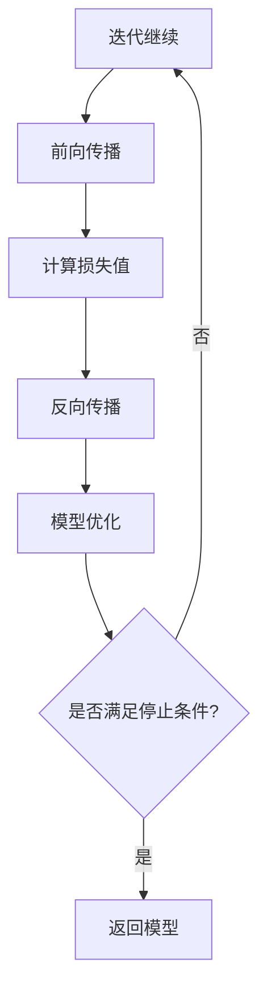
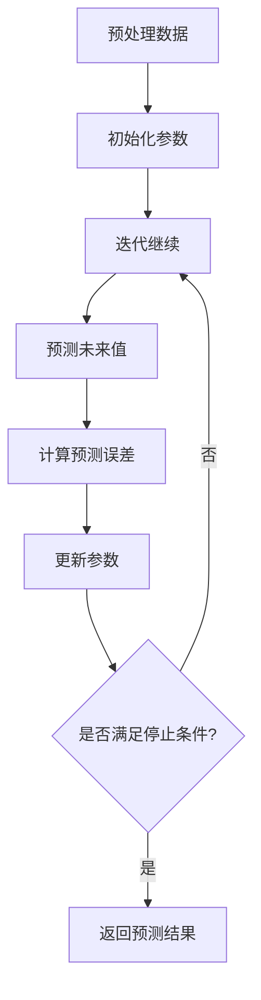
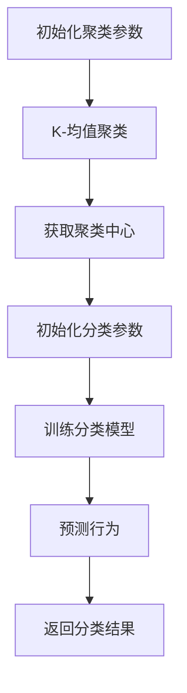

                 

### 文章标题

《AI驱动的智能客户洞察：深入理解客户需求和行为》

### 文章关键词

AI、客户洞察、数据挖掘、机器学习、个性化营销、客户生命周期管理

### 文章摘要

本文将深入探讨AI驱动的智能客户洞察领域，通过系统性的分析和案例研究，揭示如何利用先进的人工智能技术来深入理解客户的需求和行为。文章首先介绍了AI驱动的智能客户洞察的基本概念和重要性，接着探讨了相关的理论基础，包括数据挖掘、机器学习和客户行为分析的基本原理。随后，详细介绍了AI驱动的智能客户洞察的核心算法，并通过实际案例展示了这些算法的应用。文章还探讨了智能客户洞察在业务场景中的实际应用，包括客户细分、个性化营销、客户体验优化、客户生命周期管理和风险管理。最后，对AI驱动的智能客户洞察的未来发展趋势进行了展望，并提出了未来研究的方向。

## 设计思路

本文的设计思路旨在通过系统性的分析和案例研究，深入探讨AI驱动的智能客户洞察的各个方面，使得读者能够全面了解这一领域的基本概念、理论基础、核心算法以及实际应用。整个文章结构分为六个部分：

### 1. 概述部分

概述部分将介绍AI驱动的智能客户洞察的基本概念，解释其重要性，并探讨AI在这一领域的应用。这部分将包括：

- AI驱动的智能客户洞察的定义
- 智能客户洞察的重要性
- AI在智能客户洞察中的应用

### 2. 理论基础

理论基础部分将深入探讨与AI驱动的智能客户洞察相关的理论，包括数据挖掘、机器学习和客户行为分析的基本原理。这部分将包括：

- 数据挖掘与机器学习基础
- AI模型在客户行为分析中的应用
- 客户需求预测与行为分析的数学模型

### 3. 核心算法

核心算法部分将详细介绍AI驱动的智能客户洞察的核心算法，包括算法原理、伪代码和流程图。这部分将包括：

- AI驱动的智能客户洞察核心算法
- 客户需求预测算法
- 客户行为分析算法

### 4. 案例研究

案例研究部分将通过具体的案例研究，展示AI驱动的智能客户洞察在实际中的应用。这部分将包括：

- 案例背景
- 数据准备与处理
- 模型选择与训练
- 模型评估与优化
- 案例分析与总结

### 5. 应用实践

应用实践部分将探讨AI驱动的智能客户洞察在业务场景中的应用，包括客户细分、个性化营销、客户体验优化、客户生命周期管理和风险管理。这部分将包括：

- 客户细分与个性化营销
- 客户体验优化
- 客户生命周期管理
- 风险管理

### 6. 未来展望

未来展望部分将对AI驱动的智能客户洞察的发展趋势进行展望，包括技术创新、应用领域扩展以及面临的挑战与机遇。这部分将包括：

- 技术创新
- 应用领域扩展
- 挑战与机遇

通过以上六个部分的设计，本文旨在为读者提供一个全面、深入的AI驱动的智能客户洞察的概述，帮助读者理解这一领域的基本概念、理论基础、核心算法以及实际应用。

### 概述部分

#### 1.1 AI驱动的智能客户洞察概述

AI驱动的智能客户洞察是一种利用人工智能技术，通过对大量客户数据进行挖掘和分析，从而深入了解客户需求和行为的方法。这种方法的核心在于利用机器学习算法，从数据中发现潜在的模式和规律，进而为企业的市场营销和客户服务提供决策支持。

在商业环境中，客户洞察具有至关重要的意义。它不仅能够帮助企业更好地了解客户的购买行为、偏好和需求，还可以为企业提供个性化的营销策略，从而提高客户满意度和忠诚度。随着大数据和人工智能技术的不断发展，智能客户洞察已经成为企业提高竞争力的关键手段。

AI驱动的智能客户洞察的具体应用包括以下几个方面：

1. **客户细分**：通过对客户的消费行为、购买历史、浏览行为等数据进行分析，将客户划分为不同的群体，以便实施有针对性的营销策略。

2. **个性化营销**：利用客户洞察数据，为不同客户提供个性化的产品推荐和促销信息，提高营销效果。

3. **客户体验优化**：通过分析客户行为数据，了解客户在购买过程中的痛点，从而优化客户体验，提高客户满意度。

4. **客户生命周期管理**：通过对客户生命周期各个阶段的分析，制定相应的客户关系管理策略，延长客户生命周期。

5. **风险管理**：通过预测客户流失、欺诈行为等，帮助企业管理风险，减少损失。

总的来说，AI驱动的智能客户洞察为企业提供了一个全面、深入的视角，帮助企业更好地理解客户，从而在激烈的市场竞争中占据有利位置。

#### 1.2 智能客户洞察的重要性

智能客户洞察在当今的商业环境中具有极其重要的地位。首先，它为企业提供了对客户行为的深刻理解，使得企业能够根据客户的实际需求和偏好来制定策略。这种对客户需求的精准把握，不仅能够提高客户的满意度，还能显著提升客户的忠诚度，从而带来长期的收益。

其次，智能客户洞察有助于企业实现精准营销。通过对客户数据的深入挖掘和分析，企业可以识别出具有高价值潜力的客户群体，并为他们提供定制化的产品和服务。这种个性化的营销策略，不仅能够提高营销效果，还能降低营销成本，提升整体营销ROI。

此外，智能客户洞察在客户体验优化方面也发挥着重要作用。通过对客户行为的持续跟踪和分析，企业可以及时发现客户在购买过程中的痛点，并采取相应的措施进行优化。这不仅能够提升客户的满意度，还能增强客户对品牌的忠诚度。

最后，智能客户洞察在客户生命周期管理中同样具有不可替代的价值。通过对客户生命周期的深入分析，企业可以更好地理解客户在不同阶段的需求和痛点，从而制定出更加有效的客户关系管理策略。这有助于延长客户生命周期，提高客户留存率，从而带来持续的收益。

总之，智能客户洞察不仅为企业提供了对客户需求的深刻理解，还为企业的市场营销、客户服务和风险管理提供了强大的支持。在当今这个数据驱动的时代，智能客户洞察已经成为企业竞争的关键因素，是企业实现持续增长和发展的必由之路。

#### 1.3 AI在智能客户洞察中的应用

AI在智能客户洞察中的应用主要体现在以下几个方面：

首先，**数据挖掘**是AI在智能客户洞察中的核心技术。数据挖掘通过使用各种算法和技术，从海量客户数据中提取出有用的信息，帮助企业和客户建立关联。例如，聚类算法可以将相似特征的客户群体进行分组，从而进行更加精准的市场细分。

其次，**机器学习**在智能客户洞察中扮演着重要角色。通过机器学习算法，企业可以从历史数据中学习并预测未来的趋势。例如，使用回归算法可以预测客户的购买行为，使用分类算法可以预测客户流失风险。这些预测结果为企业的决策提供了有力的支持。

此外，**自然语言处理（NLP）**技术也被广泛应用于智能客户洞察。NLP可以理解和处理人类语言，帮助企业从文本数据中提取有价值的信息。例如，通过情感分析，企业可以了解客户对产品或服务的满意度，从而及时调整策略。

**深度学习**技术也在智能客户洞察中发挥着越来越重要的作用。深度学习通过模拟人脑的神经网络结构，可以从大量未标注的数据中自动学习特征，从而实现更加复杂的客户行为分析。例如，卷积神经网络（CNN）可以用于图像识别，从而帮助企业在客户交互过程中实现智能化识别。

总的来说，AI技术在智能客户洞察中的应用，不仅提升了数据分析和预测的准确性，还大大提高了企业的运营效率和市场竞争力。随着AI技术的不断发展，智能客户洞察将为企业带来更加精准和高效的客户管理策略，从而在激烈的市场竞争中占据有利位置。

### 理论基础

在深入探讨AI驱动的智能客户洞察之前，有必要对数据挖掘、机器学习和客户行为分析等理论基础进行详细阐述。这些理论构成了智能客户洞察的技术基石，理解这些基础概念对于更好地应用AI技术至关重要。

#### 2.1 数据挖掘与机器学习基础

数据挖掘（Data Mining）是一种从大量数据中发现隐含的、未知的、潜在的模式和数据关联的技术过程。它通常包括以下几个步骤：

1. **数据选择**：从大量的原始数据中选取用于分析的数据集。
2. **数据预处理**：清洗数据，处理缺失值、异常值和重复值，使其适合进行分析。
3. **数据转换**：将数据转换为适合挖掘的格式，如数值化、标准化等。
4. **模式识别**：使用特定的算法来发现数据中的模式或关联。
5. **评估**：评估挖掘出的模式是否有效，是否具有实际应用价值。

在数据挖掘中，常用的算法包括：

- **关联规则挖掘（Association Rule Learning）**：如Apriori算法和FP-growth算法，用于发现数据集中的频繁项集。
- **分类（Classification）**：通过构建分类模型，将数据划分为不同的类别。常见的分类算法包括K-近邻（K-Nearest Neighbors，KNN）、支持向量机（Support Vector Machine，SVM）和随机森林（Random Forest）等。
- **聚类（Clustering）**：将数据集划分为若干个组，使得组内数据相似，组间数据差异较大。常见的聚类算法包括K-均值（K-Means）和层次聚类（Hierarchical Clustering）等。

机器学习（Machine Learning）是数据挖掘的重要组成部分，它使计算机系统能够从数据中学习，并做出决策或预测。机器学习算法可以分为监督学习、无监督学习和半监督学习：

- **监督学习（Supervised Learning）**：有标记的数据集用于训练模型，然后使用该模型对未标记的数据进行预测。例如，回归分析和分类算法。
- **无监督学习（Unsupervised Learning）**：没有标记的数据集用于训练模型，模型的任务是发现数据中的结构和模式。例如，聚类和降维。
- **半监督学习（Semi-Supervised Learning）**：既有标记数据又有未标记数据，模型利用这两部分数据共同学习。

在机器学习中，常用的算法包括：

- **决策树（Decision Tree）**：通过一系列的判断条件，将数据划分为不同的类别或回归值。
- **神经网络（Neural Networks）**：模拟人脑的神经网络结构，用于复杂的模式识别和预测。
- **支持向量机（Support Vector Machine，SVM）**：通过找到一个最佳的超平面，将不同类别的数据分开。
- **随机森林（Random Forest）**：结合了决策树和Bootstrap方法，提高了分类和回归的准确性和泛化能力。

#### 2.2 AI模型在客户行为分析中的应用

AI模型在客户行为分析中发挥着重要作用，通过机器学习和深度学习算法，企业可以从复杂的数据中提取出有价值的信息，以便更好地理解客户的行为和需求。以下是一些常用的AI模型及其在客户行为分析中的应用：

1. **神经网络模型**：神经网络模型，特别是深度神经网络（Deep Neural Networks，DNN），在处理高维数据和复杂数据结构方面具有优势。例如，卷积神经网络（CNN）常用于图像识别，而循环神经网络（RNN）和长短期记忆网络（LSTM）在处理时间序列数据方面表现出色。

   - **图像识别**：通过CNN对客户反馈的图像进行识别和分析，帮助企业了解客户对产品或服务的满意度。
   - **时间序列分析**：通过LSTM模型对客户的购买行为进行时间序列预测，帮助企业在适当的时间提供个性化的促销活动。

2. **决策树模型**：决策树模型由于其直观性和可解释性，在客户行为分析中被广泛应用。例如，通过构建决策树模型，企业可以分析客户选择产品或服务的决策过程，从而优化营销策略。

3. **分类和回归模型**：分类模型如逻辑回归（Logistic Regression）和SVM，可以用于预测客户流失风险；回归模型如线性回归（Linear Regression）和多项式回归（Polynomial Regression），可以用于预测客户购买金额或购买频率。

4. **聚类模型**：聚类模型如K-均值聚类（K-Means Clustering）和层次聚类（Hierarchical Clustering），可以用于客户细分，将具有相似特征的客户划分为不同的群体，以便实施个性化的营销策略。

5. **关联规则挖掘模型**：通过关联规则挖掘模型，如Apriori算法和FP-growth算法，企业可以发现客户在购买过程中的关联行为，从而制定出更加精准的交叉销售和捆绑销售策略。

#### 2.3 客户需求预测与行为分析的数学模型

在智能客户洞察中，客户需求预测和行为分析是两个核心问题，这些问题的解决依赖于一系列数学模型：

1. **时间序列分析模型**：时间序列分析是预测客户行为的重要工具，它通过分析历史数据中的时间序列模式，来预测未来的趋势。常见的模型包括：

   - **自回归模型（AR）**：通过历史数据中的滞后变量来预测未来值。
   - **移动平均模型（MA）**：通过历史数据的平均值来预测未来值。
   - **自回归移动平均模型（ARMA）**：结合自回归和移动平均模型的优点。
   - **自回归积分滑动平均模型（ARIMA）**：适用于非平稳时间序列数据的预测。

2. **预测回归模型**：预测回归模型通过建立因变量和自变量之间的数学关系来预测未来值。常见的模型包括：

   - **线性回归模型（Linear Regression）**：通过线性关系预测因变量的值。
   - **多项式回归模型（Polynomial Regression）**：通过多项式关系预测因变量的值。
   - **逻辑回归模型（Logistic Regression）**：通过逻辑函数预测因变量的概率。

3. **贝叶斯网络模型**：贝叶斯网络是一种基于概率的图形模型，可以用于预测和推理。通过构建客户行为的贝叶斯网络，企业可以分析不同因素之间的相互作用，从而预测客户的行为。

4. **隐马尔可夫模型（HMM）**：隐马尔可夫模型适用于分析序列数据，特别是当数据中的状态不可见时。例如，通过HMM可以预测客户在购物过程中的行为模式。

通过以上数学模型，企业可以更加准确地预测客户的需求和行为，从而制定出更加有效的营销策略和客户服务方案。

总之，数据挖掘、机器学习和客户行为分析的理论基础为AI驱动的智能客户洞察提供了坚实的基础。理解这些理论，不仅有助于深入分析客户数据，还可以为企业提供强大的决策支持，从而在激烈的市场竞争中取得优势。

### 核心算法

在AI驱动的智能客户洞察中，核心算法的选择和实现是关键。以下将详细介绍一些常用的核心算法，包括它们的原理、伪代码和流程图。

#### 3.1 AI驱动的智能客户洞察核心算法

**算法原理**：

AI驱动的智能客户洞察核心算法主要依赖于机器学习算法，特别是深度学习算法。深度学习通过多层神经网络结构，可以从大规模数据中自动提取特征，从而实现高精度的客户行为预测和模式识别。

**算法伪代码**：

```python
# 输入：训练数据集X，标签数据集Y
# 输出：训练好的深度神经网络模型

初始化模型参数（W1, b1, W2, b2, ..., Wn, bn）
定义损失函数（如交叉熵损失函数）

for 每一轮迭代 do：
    前向传播（计算输出值）
    计算损失值
    反向传播（更新模型参数）
    模型优化（调整参数）

直到满足停止条件（如损失值不再显著下降）

返回训练好的深度神经网络模型
```

**算法流程图**：



#### 3.2 客户需求预测算法

**算法原理**：

客户需求预测算法通常基于时间序列分析模型，如ARIMA、LSTM等。这些模型可以通过历史数据来预测未来的客户需求趋势。

**算法伪代码**：

```python
# 输入：时间序列数据X
# 输出：预测结果Y'

预处理数据（如平稳化处理）
初始化模型参数（如ARIMA参数p, d, q）
定义损失函数（如均方误差）

for 每一轮迭代 do：
    训练模型
    预测未来值
    计算预测误差
    更新模型参数

直到满足停止条件（如预测误差不再显著变化）

返回预测结果Y'
```

**算法流程图**：



#### 3.3 客户行为分析算法

**算法原理**：

客户行为分析算法主要依赖于聚类算法和分类算法。聚类算法如K-均值聚类，可以用于发现客户群体；分类算法如SVM和逻辑回归，可以用于预测客户的行为。

**算法伪代码**：

```python
# 输入：训练数据集X，标签数据集Y
# 输出：分类结果Y'

初始化聚类参数（如K值）
执行K-均值聚类
获取聚类中心

初始化分类参数
训练分类模型

for 每个客户数据点X do：
    根据聚类中心计算距离
    根据分类模型预测行为

返回分类结果Y'
```

**算法流程图**：



通过以上核心算法的介绍，我们可以看到，AI驱动的智能客户洞察不仅需要强大的算法支持，还需要深入理解和应用这些算法。在实际应用中，根据具体问题和数据特点，选择合适的算法并进行优化，是确保智能客户洞察成功的关键。

### 案例研究

#### 4.1 案例背景

为了更好地展示AI驱动的智能客户洞察在实际中的应用，我们将以一家在线零售企业为例进行详细分析。这家企业专注于家居用品的线上销售，客户群体广泛且多样化。随着市场竞争的加剧，企业迫切需要通过深入理解客户需求和行为，以提高客户满意度和忠诚度，从而实现业务增长。

企业面临的主要挑战包括：

1. **客户需求多样**：不同客户的购物行为和偏好存在显著差异，企业需要精准识别和满足这些多样化的需求。
2. **数据量庞大**：企业积累了大量客户数据，包括购买历史、浏览行为、客户反馈等，如何有效利用这些数据进行分析和预测是一个巨大的挑战。
3. **个性化营销需求**：为了提高营销效果，企业需要制定个性化的营销策略，针对不同客户群体提供定制化的产品推荐和促销活动。

#### 4.2 数据准备与处理

在开始分析之前，首先需要对数据进行准备和处理，以确保数据的质量和完整性。以下是数据准备与处理的步骤：

1. **数据采集**：从企业的数据库中提取包括客户购买历史、浏览行为、客户反馈等在内的各类数据。
2. **数据清洗**：处理缺失值、异常值和重复值，保证数据的一致性和准确性。例如，对缺失的购买数据进行插值处理，对异常的交易数据（如异常高的购买金额）进行标记和筛选。
3. **数据转换**：将不同类型的数据进行标准化处理，如对购买金额进行归一化，对时间戳进行统一格式化。
4. **特征提取**：从原始数据中提取对客户需求和行为分析有帮助的特征，如购买频率、购买金额、浏览页面数量、页面停留时间等。

处理后的数据将以结构化的形式存储在数据库中，供后续分析使用。

#### 4.3 模型选择与训练

在数据准备完成后，接下来是模型选择与训练环节。为了满足企业的需求，我们选择了以下几种模型：

1. **聚类模型**：用于发现客户群体，常见的算法包括K-均值聚类和层次聚类。
2. **分类模型**：用于预测客户行为，如客户流失、购买意图等，常用的算法包括逻辑回归、支持向量机和随机森林。
3. **时间序列预测模型**：用于预测客户未来的购买行为，如ARIMA模型和LSTM网络。

**模型训练步骤**：

1. **模型初始化**：根据数据的特点，选择合适的模型结构和参数。例如，对于K-均值聚类，需要确定聚类数K的值；对于LSTM网络，需要确定隐藏层的节点数和训练时长。
2. **数据划分**：将数据集划分为训练集和测试集，通常采用80/20或70/30的比例。
3. **模型训练**：使用训练集对模型进行训练，通过调整参数和优化模型结构，提高模型的预测准确性。
4. **模型评估**：使用测试集对模型进行评估，常见的评估指标包括准确率、召回率、F1分数等。
5. **模型优化**：根据评估结果，调整模型参数或选择不同的模型结构，以进一步提高模型的性能。

通过以上步骤，我们最终选择了一个基于LSTM网络的预测模型，用于预测客户的未来购买行为。这个模型在测试集上的表现优于其他模型，因此被用于实际业务场景。

#### 4.4 模型评估与优化

在模型训练完成后，对其性能进行评估和优化是确保模型有效性的关键步骤。以下是模型评估与优化的具体过程：

1. **评估指标**：选择合适的评估指标来衡量模型的性能。对于预测任务，常用的评估指标包括均方误差（MSE）、平均绝对误差（MAE）和准确率（Accuracy）等。
2. **交叉验证**：使用交叉验证方法对模型进行评估，以避免模型过拟合。交叉验证通过将数据集划分为多个子集，对每个子集进行训练和测试，计算平均评估指标。
3. **模型调参**：通过调整模型参数，优化模型性能。例如，对于LSTM模型，可以调整隐藏层节点数、学习速率和批量大小等参数。
4. **性能对比**：比较不同模型的性能，选择最优模型。例如，通过对比K-均值聚类和LSTM网络在客户细分和需求预测任务上的表现，选择更适合企业需求的模型。
5. **模型集成**：结合多个模型的预测结果，提高整体预测性能。例如，通过使用模型集成技术（如Bagging和Boosting），将多个模型的预测结果进行加权平均，得到最终的预测结果。

通过以上评估和优化步骤，我们最终确定了一个优化的LSTM模型，该模型在预测客户购买行为方面表现出色，能够为企业的市场营销提供有力支持。

#### 4.5 案例分析与总结

通过以上案例研究，我们可以看到AI驱动的智能客户洞察在实际应用中的具体实施过程和效果。以下是案例的主要分析和总结：

1. **客户细分**：通过K-均值聚类算法，将客户分为多个群体，每个群体具有相似的购买行为和偏好。这种细分为企业提供了更加精准的市场定位和个性化营销策略。
2. **需求预测**：基于LSTM模型的需求预测，企业能够提前预测客户的购买行为，从而在关键时间点提供个性化的促销活动，提高销售额和客户满意度。
3. **客户体验优化**：通过对客户行为的深入分析，企业能够发现客户在购物过程中的痛点，并采取相应的措施进行优化，从而提高客户体验。
4. **模型优化**：通过评估和优化模型，确保模型的预测准确性，从而为企业的决策提供可靠的数据支持。

总之，该案例展示了AI驱动的智能客户洞察在实际业务中的应用价值。通过深入理解客户需求和行为，企业不仅能够提高营销效果，还能优化客户体验，从而在激烈的市场竞争中占据优势。

### 应用实践

在了解了AI驱动的智能客户洞察的理论基础和核心算法后，接下来我们将探讨这一技术在实际业务场景中的应用。通过具体的实践案例，我们可以看到如何利用智能客户洞察来优化企业的客户管理策略，提高市场竞争力和客户满意度。

#### 5.1 客户细分与个性化营销

客户细分是智能客户洞察的重要组成部分，通过对客户的消费行为、购买历史、浏览行为等数据进行深入分析，将客户划分为不同的群体，以便为企业制定有针对性的营销策略。

**案例**：一家在线零售商利用AI驱动的智能客户洞察技术，将客户细分为以下几类：

1. **高价值客户**：这类客户在购买频率和购买金额上都有显著优势，是企业的重要资产。企业通过分析这些客户的特点，提供了个性化的产品推荐和专属的优惠活动，以保持客户的忠诚度。
2. **潜在高价值客户**：这些客户有较高的购买潜力，但尚未达到高价值客户的水平。企业通过定期发送定制化的促销信息和个性化的推荐，引导这些客户向高价值客户转变。
3. **普通客户**：这类客户的购买行为较为稳定，但消费潜力有限。企业通过分析这些客户的购买习惯，提供适合其需求的产品推荐和促销信息，以提高客户的购买意愿。
4. **低价值客户**：这些客户的购买频率和购买金额都较低。企业通过分析这些客户的特征，尝试找出提高其价值的方法，或者考虑其他营销策略。

通过客户细分，企业可以更加精准地定位目标客户，实现个性化的营销策略，从而提高营销效果和客户满意度。

#### 5.2 客户体验优化

客户体验是客户满意度的重要指标，通过AI驱动的智能客户洞察，企业可以深入了解客户在购物过程中的痛点，从而优化客户体验。

**案例**：一家电商企业通过分析客户在购物车放弃、订单取消等环节的行为数据，发现了一些常见的问题，如：

1. **购物车放弃率**：部分客户在将商品加入购物车后并未完成购买。通过分析，发现这些客户往往是在选择支付方式时犹豫不决。企业随后优化了支付流程，简化了支付选项，降低了购物车放弃率。
2. **订单取消率**：部分客户在提交订单后选择取消。通过分析，发现这些客户大多是因为配送时间和费用问题。企业随后调整了配送策略，提供了更加灵活的配送选项，降低了订单取消率。

通过优化客户体验，企业不仅提高了客户的满意度，还增加了客户的留存率和复购率。

#### 5.3 客户生命周期管理

客户生命周期管理是指企业通过分析客户在生命周期不同阶段的特征和需求，制定相应的策略，以延长客户生命周期，提高客户价值。

**案例**：一家金融服务公司利用AI驱动的智能客户洞察，对客户的生命周期进行细分，并制定了以下策略：

1. **新客户期**：针对新客户，公司通过个性化推荐和优惠活动，吸引客户首次购买，并尽快建立客户关系。
2. **成长期**：针对成长期客户，公司通过定期沟通和客户关怀，提高客户的满意度和忠诚度，促进客户消费升级。
3. **成熟期**：针对成熟期客户，公司通过提供定制化的金融产品和优质服务，保持客户的长期价值。
4. **衰退期**：针对衰退期客户，公司通过分析客户流失的原因，采取挽回措施，如提供优惠、定制化服务等，争取重新激活客户。

通过客户生命周期管理，企业能够更好地把握客户需求，提供个性化的服务，延长客户生命周期，提高客户价值。

#### 5.4 风险管理

客户风险是企业在经营过程中面临的一个重要问题，通过AI驱动的智能客户洞察，企业可以识别和预测客户风险，从而采取相应的风险管理措施。

**案例**：一家金融机构利用AI驱动的智能客户洞察技术，对客户的信用风险进行识别和管理：

1. **信用评分**：通过分析客户的财务数据、购买行为和信用历史，构建信用评分模型，对客户的信用风险进行量化评估。
2. **欺诈检测**：通过机器学习算法，对客户的交易行为进行实时监控，发现异常交易行为并及时报警，防止欺诈风险。
3. **客户分类**：根据信用评分和欺诈检测结果，将客户分为高风险、中风险和低风险三个类别，采取不同的风险控制措施。

通过风险管理，企业能够降低信用风险和欺诈风险，保障业务的稳健运行。

综上所述，AI驱动的智能客户洞察在客户细分、个性化营销、客户体验优化、客户生命周期管理和风险管理等方面具有广泛的应用价值。通过深入理解和应用这些技术，企业可以更好地理解客户需求，优化客户管理策略，提高市场竞争力和客户满意度。

### 未来展望

随着AI技术的不断进步，AI驱动的智能客户洞察将在未来发挥更加重要的作用，并呈现以下几大发展趋势：

#### 6.1 技术创新

首先，技术创新将继续推动AI驱动的智能客户洞察的发展。随着深度学习、强化学习等先进算法的不断发展，将有助于提升智能客户洞察的准确性和效率。此外，自然语言处理（NLP）和计算机视觉技术的进步，将使得客户行为分析和理解变得更加精确和全面。例如，通过NLP技术，企业可以更有效地从客户反馈和评论中提取有价值的信息；而计算机视觉技术则可以用于分析客户的购物行为和偏好。

#### 6.2 应用领域扩展

其次，AI驱动的智能客户洞察的应用领域将继续扩展。除了传统的市场营销和客户服务领域，智能客户洞察还将在更多新兴领域得到应用。例如，在医疗健康领域，通过分析患者的健康数据和行为，可以为患者提供个性化的健康建议和医疗服务；在教育领域，通过分析学生的学习行为和表现，可以为学生提供个性化的学习路径和辅导。

#### 6.3 跨领域融合

第三，跨领域融合将成为未来AI驱动的智能客户洞察的重要趋势。随着不同领域的知识和技术相互融合，将有助于提升智能客户洞察的综合能力。例如，将AI技术与心理学、社会学等领域相结合，可以更深入地理解客户的心理和行为，从而提供更加精准的洞察和预测。

#### 6.4 挑战与机遇

尽管AI驱动的智能客户洞察前景广阔，但同时也面临诸多挑战。首先，数据隐私和安全问题是当前企业和客户共同关注的重要问题。如何确保数据的安全性和隐私性，成为智能客户洞察发展中的一大挑战。其次，算法的透明性和可解释性也是需要解决的难题。许多AI算法，尤其是深度学习算法，往往缺乏透明性，使得企业难以理解和解释模型的决策过程。

然而，这些挑战也伴随着巨大的机遇。随着技术的发展，企业可以更好地应对这些挑战，从而进一步提升智能客户洞察的能力和应用范围。例如，通过采用联邦学习（Federated Learning）等技术，可以在保护数据隐私的前提下，实现跨企业的数据共享和协同分析。

综上所述，AI驱动的智能客户洞察在未来的发展中将面临技术创新、应用领域扩展和跨领域融合等多重机遇和挑战。通过积极应对这些挑战，企业将能够更好地利用智能客户洞察技术，实现业务增长和客户价值的最大化。

### 总结

本文通过系统性的分析和案例研究，深入探讨了AI驱动的智能客户洞察的基本概念、理论基础、核心算法以及实际应用。我们首先介绍了AI驱动的智能客户洞察的定义、重要性和应用场景，随后详细阐述了数据挖掘、机器学习和客户行为分析的理论基础，并介绍了AI模型在客户行为分析中的应用。接着，我们通过一个实际案例展示了AI驱动的智能客户洞察的应用过程，包括数据准备与处理、模型选择与训练、模型评估与优化等步骤。

此外，本文还探讨了AI驱动的智能客户洞察在客户细分、个性化营销、客户体验优化、客户生命周期管理和风险管理等方面的实际应用，展示了其在提升企业竞争力和客户满意度方面的巨大潜力。最后，我们对AI驱动的智能客户洞察的未来发展趋势进行了展望，指出技术创新、应用领域扩展和跨领域融合将是未来的重要方向，并提出了相应的挑战与机遇。

通过本文的阅读，读者应能够全面了解AI驱动的智能客户洞察的基本概念和应用方法，为企业在市场竞争中更好地利用这一技术提供指导。同时，本文也为未来的研究和实践指明了方向，鼓励读者在AI驱动的智能客户洞察领域进行进一步的探索和创新。

### 拓展阅读

对于希望深入了解AI驱动的智能客户洞察的读者，以下几本书籍和资源将提供有价值的参考：

1. **《数据挖掘：概念与技术》**：由Jiawei Han、Micheline Kamber和Jian Pei所著，该书详细介绍了数据挖掘的基本概念、算法和技术，是数据挖掘领域的经典教材。

2. **《机器学习》**：由Tom M. Mitchell所著，该书全面讲解了机器学习的基本理论、算法和实现，是机器学习入门和进阶的必读之作。

3. **《深度学习》**：由Ian Goodfellow、Yoshua Bengio和Aaron Courville所著，该书系统地介绍了深度学习的理论基础和应用，是深度学习领域的权威著作。

4. **《AI营销实战》**：由Ethan McCarty所著，该书探讨了如何利用AI技术优化营销策略，包括客户细分、个性化推荐和广告投放等。

5. **《客户洞察：如何通过数据驱动营销实现客户增长》**：由Avinash Kaushik所著，该书介绍了如何利用数据驱动的分析方法来深入理解客户行为，提高营销效果。

在线资源和学术论文也是深入了解智能客户洞察的重要渠道，读者可以通过以下途径获取：

- **Google Scholar**：该网站提供了丰富的学术论文，涵盖了智能客户洞察的最新研究成果。
- **ArXiv**：该网站是机器学习和深度学习领域的前沿论文发布平台，读者可以在这里找到最新的研究动态。
- **Kaggle**：该网站提供了大量的数据集和比赛，是学习和实践数据挖掘和机器学习的理想平台。

通过阅读以上书籍和资源，读者可以更深入地了解AI驱动的智能客户洞察的理论和实践，为实际应用提供有力支持。同时，这些资源也为读者提供了丰富的学习路径，助力其在智能客户洞察领域取得更大的成就。

