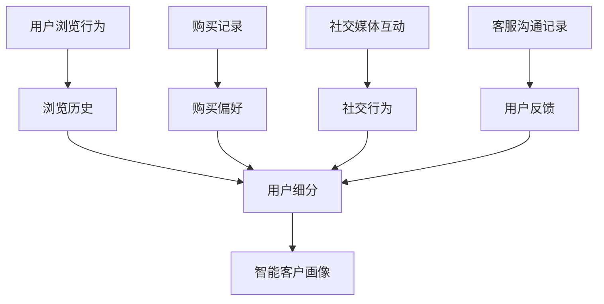
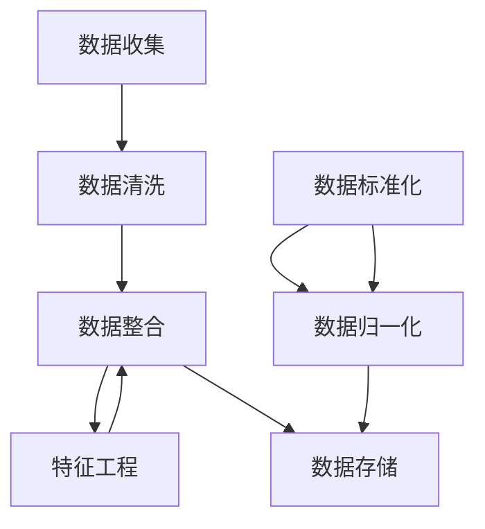
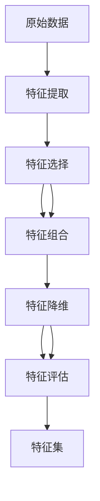
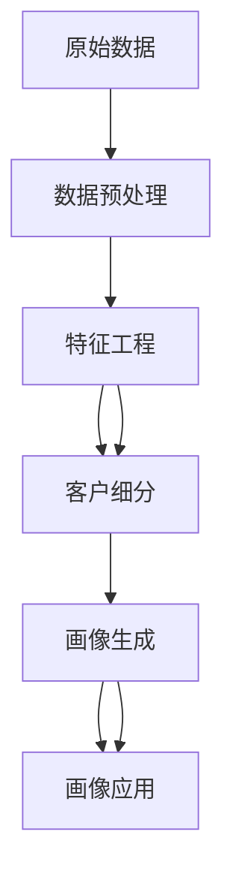
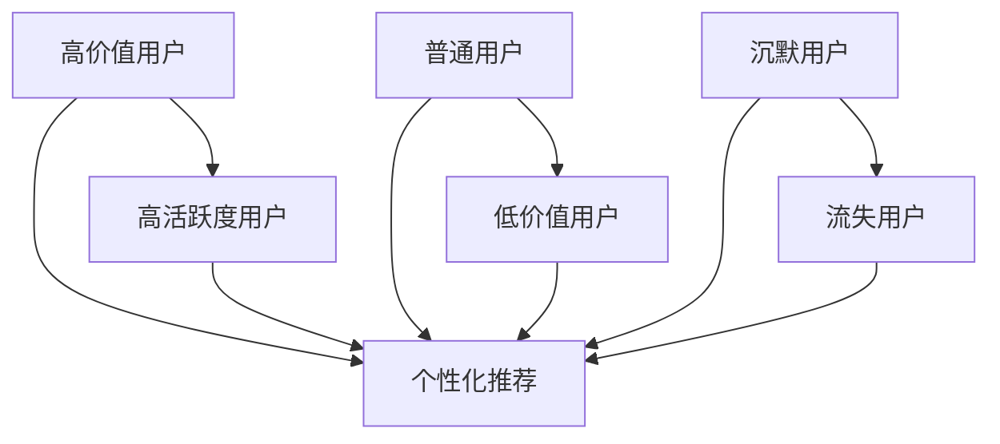

                 

### 《AI驱动的智能客户画像：深化用户洞察》

> 关键词：AI、智能客户画像、用户洞察、数据分析、个性化推荐

> 摘要：随着大数据和人工智能技术的飞速发展，智能客户画像在商业应用中变得越来越重要。本文将深入探讨AI驱动的智能客户画像技术，从基础概念、技术实现到实际应用，全面解析如何通过AI技术深化用户洞察，为企业提供更为精准、高效的营销策略。

## 引言

在当今这个信息化和数字化时代，企业对用户数据的依赖程度日益增加。用户数据不仅是企业了解市场需求、优化产品服务的重要依据，更是制定个性化营销策略的核心资源。然而，海量的用户数据如何转化为有价值的洞察，成为了企业面临的重大挑战。

AI技术的发展为解决这一难题提供了强有力的工具。智能客户画像，即通过人工智能技术对用户数据进行分析、建模，构建出详细的用户画像，从而实现对企业客户需求的深度理解和精准把握。本文将围绕AI驱动的智能客户画像技术，逐步分析其核心概念、技术实现及应用价值，帮助读者全面了解这一前沿技术。

## 智能客户画像的核心概念与联系

### 1. 数据源与数据类型

智能客户画像的基础是数据。数据源可以是多种多样的，包括用户浏览行为、购买记录、社交媒体互动、客服沟通记录等。不同类型的数据在构建客户画像时扮演着不同的角色，如图1所示。



### 2. 数据预处理

在构建智能客户画像之前，需要对收集到的用户数据进行预处理，如图2所示。



### 3. 特征工程

特征工程是智能客户画像构建的关键步骤，通过提取和选择有代表性的特征，可以更好地反映用户的行为和偏好，如图3所示。



### 4. 客户细分与画像生成

通过以上步骤，最终生成详细的智能客户画像，如图4所示。



## 核心算法原理讲解

### 1. 决策树模型

决策树模型是一种常见的机器学习算法，用于分类和回归任务。在智能客户画像中，决策树可用于用户细分和预测用户行为，如图5所示。

```python
from sklearn.tree import DecisionTreeClassifier
from sklearn.model_selection import train_test_split

# 加载数据
X, y = load_data()

# 数据划分
X_train, X_test, y_train, y_test = train_test_split(X, y, test_size=0.3, random_state=42)

# 构建决策树模型
clf = DecisionTreeClassifier()
clf.fit(X_train, y_train)

# 预测
y_pred = clf.predict(X_test)

# 评估
accuracy = clf.score(X_test, y_test)
print(f"Accuracy: {accuracy}")
```

### 2. 贝叶斯网络模型

贝叶斯网络模型是基于概率论的图形模型，可以表示变量之间的依赖关系。在智能客户画像中，贝叶斯网络可用于预测用户行为和评估用户价值，如图6所示。

```python
import numpy as np
from pgmpy.models import BayesianModel
from pgmpy.inference import VariableElimination

# 加载数据
X, y = load_data()

# 构建贝叶斯网络模型
model = BayesianModel([('A', 'B'), ('B', 'C')])
inference = VariableElimination(model)

# 预测
y_pred = inference.map_query(variables=['C'], evidence={'A': 1})
print(f"Predicted value of C: {y_pred['C']}")
```

## 项目实战

### 1. 开发环境搭建

在搭建开发环境时，需要安装Python、NumPy、Pandas、Scikit-learn等基本依赖。

```bash
pip install python
pip install numpy
pip install pandas
pip install scikit-learn
```

### 2. 源代码详细实现

以下是一个简单的智能客户画像构建的示例代码。

```python
import pandas as pd
from sklearn.preprocessing import StandardScaler
from sklearn.cluster import KMeans
from sklearn.model_selection import train_test_split

# 加载数据
data = pd.read_csv('data.csv')

# 数据预处理
data = data.dropna()
X = data.drop(['user_id'], axis=1)
y = data['user_id']

# 数据标准化
scaler = StandardScaler()
X_scaled = scaler.fit_transform(X)

# 数据划分
X_train, X_test, y_train, y_test = train_test_split(X_scaled, y, test_size=0.3, random_state=42)

# K-means聚类
kmeans = KMeans(n_clusters=5, random_state=42)
clusters = kmeans.fit_predict(X_train)

# 生成客户画像
client_profiles = pd.DataFrame(clusters, columns=['cluster'])
client_profiles['user_id'] = y_train
client_profiles.head()
```

### 3. 代码解读与分析

在上述代码中，首先加载数据并预处理，包括去除缺失值和标准化处理。然后，使用K-means算法进行聚类，生成客户细分。最后，将聚类结果与用户标签结合，生成详细的客户画像。

### 4. 实际案例分析与详细讲解

假设某电商企业使用智能客户画像技术，对用户进行细分，以实现精准营销。通过聚类分析，将用户分为五类，如图7所示。



在实际应用中，企业可以根据不同用户群体的特征，制定相应的营销策略，如针对高价值用户推出VIP会员服务，针对沉默用户进行唤醒活动，从而提升用户黏性和满意度。

## 最佳实践 Tips

1. **数据质量优先**：确保数据源真实可靠，数据清洗与预处理是成功的关键。
2. **持续迭代优化**：智能客户画像需要持续更新，以适应用户行为的变化。
3. **法律法规遵守**：确保数据处理符合相关法律法规，尤其是数据隐私保护。

## 小结

AI驱动的智能客户画像是企业深化用户洞察、提升营销效果的重要工具。通过本文的详细解析，我们了解了智能客户画像的核心概念、技术实现和应用案例。在实际应用中，企业应结合自身业务特点，灵活运用AI技术，实现精准营销和用户价值的最大化。

## 拓展阅读

- 《Python数据分析》
- 《机器学习实战》
- 《深度学习》

### 作者信息

作者：AI天才研究院/AI Genius Institute & 禅与计算机程序设计艺术 /Zen And The Art of Computer Programming

