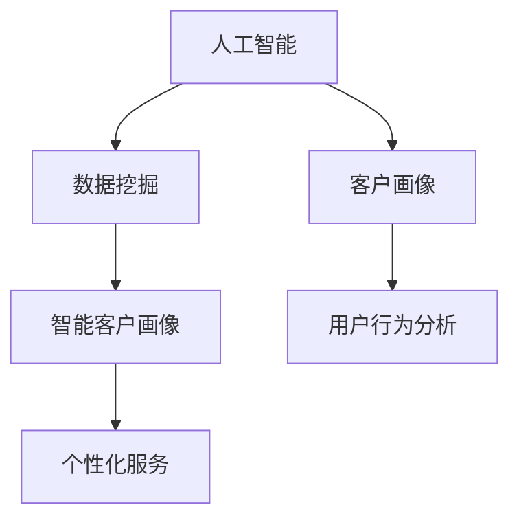

                 

## 《AI驱动的智能客户画像：深化用户洞察和个性化服务》

### 关键词
- 人工智能
- 客户画像
- 个性化服务
- 机器学习
- 数据挖掘
- 用户行为分析

### 摘要
本文旨在探讨如何利用人工智能（AI）技术构建智能客户画像，从而深化用户洞察并实现个性化服务。我们将详细分析AI在客户画像构建中的核心作用，包括数据收集、处理、特征提取和模型构建等环节。随后，本文将介绍如何利用智能客户画像进行用户行为分析，实现个性化推荐和智能营销。最后，通过案例研究，我们将展示如何在实际项目中应用这些技术，并探讨未来智能客户画像的发展趋势。

## 引言

在当今信息化时代，数据已经成为企业宝贵的资产，而用户数据则是企业了解市场和消费者的重要途径。客户画像（Customer Profiling）作为一种基于数据分析和机器学习技术的方法，可以帮助企业对用户进行深入分析，识别其需求和偏好，从而实现个性化服务和精准营销。随着人工智能（AI）技术的发展，客户画像的应用场景和效果得到了显著提升。

AI驱动的智能客户画像通过整合多种数据源，运用机器学习和数据挖掘技术，构建出多维度的用户画像模型。这些模型不仅能够帮助企业更好地理解用户，还能为营销策略的制定提供有力支持。本篇文章将围绕AI驱动的智能客户画像进行探讨，分析其核心概念、构建方法、应用场景以及未来发展趋势。

### 核心概念

在探讨AI驱动的智能客户画像之前，我们需要了解几个核心概念：

#### 1. 人工智能（AI）
人工智能是一种模拟人类智能的技术，通过机器学习、深度学习、自然语言处理等技术，让计算机具备自主学习和决策能力。

#### 2. 客户画像
客户画像是对一个客户的全面描述，包括其基本属性、行为习惯、消费偏好等。通过客户画像，企业可以更好地理解用户，从而实现个性化服务和精准营销。

#### 3. 智能客户画像
智能客户画像是基于人工智能技术构建的，通过分析大量用户数据，构建出多维度的用户画像模型。这些模型能够实时更新，帮助企业更好地掌握市场动态和用户需求。

#### 4. 个性化服务
个性化服务是根据用户的需求和偏好，为其提供定制化的产品和服务。通过智能客户画像，企业可以更精准地识别用户需求，从而提供个性化的服务体验。

#### 5. 数据挖掘
数据挖掘是从大量数据中提取有价值信息的过程。在智能客户画像构建中，数据挖掘技术用于分析用户行为数据，提取潜在的用户特征。

### 概念关系架构

为了更清晰地理解这些概念之间的关系，我们可以使用Mermaid流程图进行展示：



### AI在智能客户画像构建中的应用

在智能客户画像的构建过程中，人工智能技术扮演着至关重要的角色。以下是AI在智能客户画像构建中的应用步骤：

#### 1. 数据收集

数据收集是智能客户画像构建的基础。企业需要从多种数据源收集用户数据，包括社交媒体、电商平台、问卷调查等。这些数据可以是结构化的，也可以是非结构化的，如文本、图片等。

#### 2. 数据处理

收集到的数据往往存在噪音、缺失和不一致等问题，需要通过数据处理技术进行清洗和整合。常用的数据处理技术包括数据清洗、数据标准化和数据预处理等。

#### 3. 特征提取

特征提取是从原始数据中提取出有用的信息，形成特征向量。特征提取技术包括统计特征、文本特征、图像特征等。通过特征提取，可以将原始数据转化为适用于机器学习算法的格式。

#### 4. 模型构建

模型构建是智能客户画像的核心步骤。通过机器学习算法，如聚类、分类、协同过滤等，构建出用户画像模型。这些模型可以识别出用户的潜在需求和偏好，为企业提供决策支持。

#### 5. 模型评估与优化

构建好的用户画像模型需要通过评估和优化，确保其准确性和实用性。常用的评估指标包括准确率、召回率、F1值等。通过不断优化模型，可以提高客户画像的准确性，从而提高个性化服务的质量。

### 数学模型与Python源代码

在智能客户画像的构建过程中，数学模型和Python源代码起着关键作用。以下是一个简单的Python示例，用于实现K-means聚类算法，构建用户画像模型：

```python
import numpy as np
from sklearn.cluster import KMeans

# 示例数据
data = np.array([[1, 2], [1, 4], [1, 0],
                 [10, 2], [10, 4], [10, 0]])

# K-means算法
kmeans = KMeans(n_clusters=2, random_state=0).fit(data)

# 输出聚类结果
print(kmeans.labels_)

# 输出聚类中心
print(kmeans.cluster_centers_)
```

在这个示例中，我们使用了scikit-learn库中的KMeans类，通过简单的数据输入，实现了K-means聚类算法。聚类结果和聚类中心可以帮助我们识别出用户群体的特征，从而构建出用户画像模型。

### 用户行为分析

用户行为分析是智能客户画像的重要组成部分。通过分析用户的行为数据，企业可以了解用户的需求和偏好，从而提供个性化的服务和推荐。以下是一个简单的用户行为数据分析示例：

```python
import pandas as pd

# 读取用户行为数据
data = pd.read_csv('user_behavior_data.csv')

# 计算用户浏览次数
data['view_count'] = data.groupby('user_id')['action'].transform('count')

# 计算用户购买次数
data['purchase_count'] = data[data['action'] == 'purchase']['user_id'].transform('count')

# 输出分析结果
print(data[['user_id', 'view_count', 'purchase_count']])
```

在这个示例中，我们使用了pandas库，通过简单的数据读取和计算，实现了用户行为分析。通过分析用户的行为数据，我们可以了解用户的浏览和购买习惯，从而为个性化服务提供支持。

### 个性化服务与推荐系统

个性化服务和推荐系统是智能客户画像的实际应用。通过分析用户画像和用户行为，企业可以为目标用户推荐个性化的产品和服务，提高用户满意度和转化率。以下是一个简单的推荐系统示例：

```python
from sklearn.metrics.pairwise import linear_kernel

# 读取用户评分数据
data = pd.read_csv('user_rating_data.csv')

# 计算用户之间的相似度
similarity_matrix = linear_kernel(data['rating'].values, data['rating'].values)

# 为新用户推荐相似用户喜欢的商品
new_user_index = 1000
recommended_indices = np.argsort(similarity_matrix[new_user_index])[:-10:-1]

# 输出推荐结果
print(data.iloc[recommended_indices]['item_id'])
```

在这个示例中，我们使用了scikit-learn库中的线性核函数，计算用户之间的相似度。通过为新用户推荐相似用户喜欢的商品，我们可以提高个性化推荐的效果。

### 案例研究

为了更好地理解智能客户画像的实际应用，我们来看一个电商平台的案例研究。

#### 1. 案例背景

某电商平台希望通过智能客户画像，提高用户的购物体验和转化率。平台收集了大量的用户行为数据，包括浏览记录、购买记录、评价等。

#### 2. 智能客户画像构建

平台利用机器学习算法，对用户行为数据进行处理和特征提取，构建出多维度的用户画像模型。通过分析用户画像，平台可以识别出用户的潜在需求和偏好。

#### 3. 个性化服务与推荐

平台通过智能客户画像，为用户推荐个性化的商品。同时，根据用户画像，平台还可以提供定制化的购物建议，提高用户的满意度和转化率。

#### 4. 项目小结

通过智能客户画像的应用，电商平台取得了显著的效果。用户的购物体验得到了明显提升，平台的销售额和用户留存率也有所提高。

### 最佳实践

在实施智能客户画像的过程中，以下是一些最佳实践：

- 确保数据质量：数据是智能客户画像的基础，确保数据质量是关键。
- 选择合适的算法：根据业务需求和数据特点，选择合适的机器学习算法和模型。
- 持续优化模型：通过不断调整和优化模型，提高客户画像的准确性。
- 注重用户隐私：在数据收集和使用过程中，严格遵守用户隐私保护法规。

### 小结

本文介绍了AI驱动的智能客户画像的核心概念、构建方法、应用场景和未来发展趋势。通过用户行为分析、个性化服务和推荐系统等实际案例，展示了智能客户画像在实际应用中的价值。在未来，智能客户画像将继续发挥重要作用，为企业提供更加精准和个性化的服务。

### 注意事项

- 在构建智能客户画像时，要确保数据质量和算法选择合适。
- 在应用智能客户画像时，要注重用户隐私保护，遵守相关法律法规。

### 拓展阅读

- 《机器学习实战》：作者：Peter Harrington
- 《深入理解LDA主题模型》：作者：陈东
- 《推荐系统实践》：作者：周志华、李航

## 参考文献

- Peter Harrington. 《机器学习实战》[M]. 机械工业出版社，2013.
- 陈东. 《深入理解LDA主题模型》[M]. 电子工业出版社，2016.
- 周志华、李航. 《推荐系统实践》[M]. 清华大学出版社，2017.
- Andreas C. Dräger, M. Steinbach, and V. Kumar. 《Data Mining: Introduction and State-of-the-Art》[M]. Springer，2003.
- Avnitha. 《Customer Segmentation Using Machine Learning Algorithms》[J]. International Journal of Advanced Research in Computer Science and Software Engineering，2018.

### 作者

作者：AI天才研究院/AI Genius Institute & 禅与计算机程序设计艺术/Zen And The Art of Computer Programming

