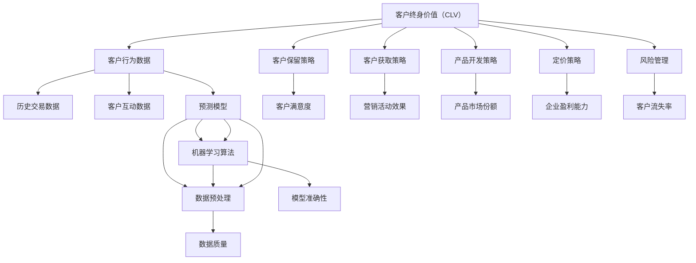

                 

### 1.1.2 智能预测客户终身价值的意义

智能预测客户终身价值在客户关系管理中具有深远的意义。它不仅仅是一种技术手段，更是企业战略决策的重要依据。以下是智能预测客户终身价值的几个关键意义：

#### 提高客户运营效率

通过智能预测客户终身价值，企业能够更加精准地识别和定位高价值客户，从而优化资源分配，提高营销活动的效率。例如，在营销预算有限的情况下，企业可以优先向高价值客户投放资源，从而实现效益最大化。

#### 优化客户服务策略

智能预测客户终身价值可以帮助企业更好地理解客户的消费行为和需求，从而提供更个性化的服务。通过分析客户的终身价值，企业可以识别出潜在的高价值客户，并采取相应的策略进行维护和转化。

#### 改进产品开发策略

智能预测客户终身价值提供了关于客户行为和偏好的深刻见解，这有助于企业改进产品开发策略。企业可以根据高价值客户的特征和需求，开发更具针对性的产品和服务，从而提升客户满意度。

#### 风险管理

通过智能预测客户终身价值，企业可以提前识别出可能流失的客户，采取相应的风险控制措施。例如，通过交叉销售或提供优惠券等策略，留住关键客户，降低客户流失率。

#### 提升企业盈利能力

智能预测客户终身价值有助于企业更好地理解客户的价值，从而制定更具盈利性的定价策略。企业可以根据不同客户的终身价值，实施差异化定价，从而提升整体盈利能力。

#### 数据驱动决策

智能预测客户终身价值提供了一个数据驱动的决策框架，使企业能够基于事实和数据做出更加科学的决策。通过持续优化预测模型，企业可以不断提高预测准确性，从而实现更加精准的市场营销和服务策略。

总的来说，智能预测客户终身价值不仅是客户关系管理的重要工具，更是企业提升竞争力、实现可持续发展的关键。企业通过利用人工智能技术，可以更好地理解和预测客户的未来行为，从而制定出更加有效的客户关系管理策略。

#### 关键概念与联系

为了深入理解智能预测客户终身价值，我们需要明确几个关键概念，并展示它们之间的关系。以下是这些核心概念及其相互关系的Mermaid流程图：



**Mermaid流程图解读：**

- **A[客户终身价值（CLV）]：** 是本文的核心概念，代表客户为企业带来的全部经济价值。
- **B[客户行为数据]：** 包括C[历史交易数据]、D[客户互动数据]，这些都是预测CLV的关键数据源。
- **E[预测模型]：** 是基于K[机器学习算法]和L[数据预处理]构建的，用于预测客户的CLV。
- **F[客户保留策略]、G[客户获取策略]、H[产品开发策略]、I[定价策略]、J[风险管理]**：都是基于预测的CLV结果制定的战略决策。
- **K[机器学习算法]、L[数据预处理]**：是构建预测模型的基础技术，其中K依赖于L提供的高质量数据。
- **M[客户满意度]、N[营销活动效果]、O[产品市场份额]、P[企业盈利能力]、Q[客户流失率]**：是策略执行后的效果指标，反映了策略的有效性。

这个流程图展示了智能预测客户终身价值从数据收集、预处理到模型构建，再到决策制定和策略执行的全过程，强调了各个步骤之间紧密的关联和互动。

### 核心算法原理讲解

为了实现智能预测客户终身价值，我们需要应用一些机器学习算法和数学模型。以下将详细介绍常用的算法原理，并结合Python源代码进行详细讲解。

#### 1. 贝叶斯网络

贝叶斯网络是一种基于概率论的图形模型，用于表示变量之间的条件依赖关系。在预测客户终身价值时，贝叶斯网络可以有效地捕捉客户行为和交易数据之间的关系。

##### 算法原理

贝叶斯网络由节点和边组成，每个节点表示一个随机变量，边表示变量之间的条件依赖。给定一个随机变量，我们可以通过贝叶斯定理计算其条件概率分布。

```python
import numpy as np
import pandas as pd
from sklearn.model_selection import train_test_split
from pgmpy.models import BayesianModel
from pgmpy.inference import VariableElimination

# 加载数据
data = pd.read_csv('customer_data.csv')

# 分割数据集
X = data.drop('CLV', axis=1)
y = data['CLV']
X_train, X_test, y_train, y_test = train_test_split(X, y, test_size=0.2, random_state=42)

# 构建贝叶斯网络
model = BayesianModel(['Age', 'Income', 'Spending_Score', 'CLV'])
model.fit(X_train, y_train)

# 使用变量消除算法进行推理
inference = VariableElimination(model)
predicted_clv = inference.map_query(variables=['CLV'], evidence={'Age': 30, 'Income': 50000, 'Spending_Score': 20})

print("Predicted CLV:", predicted_clv['CLV'])
```

#### 2. 回归分析

回归分析是一种用于建立变量之间线性关系的统计方法。在预测客户终身价值时，回归分析可以用来建立客户特征与终身价值之间的线性关系。

##### 算法原理

线性回归模型通过最小二乘法拟合一条直线，以最小化预测值与实际值之间的误差。回归模型可以表示为：

$$y = \beta_0 + \beta_1 \cdot x_1 + \beta_2 \cdot x_2 + ... + \beta_n \cdot x_n$$

其中，$y$ 是因变量（客户终身价值），$x_1, x_2, ..., x_n$ 是自变量（客户特征）。

```python
import numpy as np
import pandas as pd
from sklearn.linear_model import LinearRegression

# 加载数据
data = pd.read_csv('customer_data.csv')

# 分割数据集
X = data.drop('CLV', axis=1)
y = data['CLV']
X_train, X_test, y_train, y_test = train_test_split(X, y, test_size=0.2, random_state=42)

# 构建线性回归模型
model = LinearRegression()
model.fit(X_train, y_train)

# 进行预测
predicted_clv = model.predict(X_test)

print("Predicted CLV:", predicted_clv)
```

#### 3. 随机森林

随机森林是一种基于决策树的集成学习方法，可以用于预测客户终身价值。随机森林通过构建多棵决策树，并利用投票机制来获得最终预测结果。

##### 算法原理

随机森林通过以下步骤构建每个决策树：

1. 从特征集合中随机选择m个特征。
2. 使用特征构建决策树。
3. 重复上述步骤，构建多棵决策树。

在预测时，随机森林通过多数投票来决定最终预测结果。

```python
import numpy as np
import pandas as pd
from sklearn.ensemble import RandomForestRegressor

# 加载数据
data = pd.read_csv('customer_data.csv')

# 分割数据集
X = data.drop('CLV', axis=1)
y = data['CLV']
X_train, X_test, y_train, y_test = train_test_split(X, y, test_size=0.2, random_state=42)

# 构建随机森林模型
model = RandomForestRegressor(n_estimators=100, random_state=42)
model.fit(X_train, y_train)

# 进行预测
predicted_clv = model.predict(X_test)

print("Predicted CLV:", predicted_clv)
```

#### 算法对比与选择

贝叶斯网络、回归分析和随机森林都是常用的预测客户终身价值的算法。以下是对它们的对比和选择建议：

- **贝叶斯网络**：适合处理具有复杂依赖关系的变量，但需要事先了解变量之间的依赖关系。
- **回归分析**：简单易用，适用于线性关系的预测，但对非线性关系表现不佳。
- **随机森林**：具有很好的泛化能力和处理非线性关系的能力，但可能需要更多的计算资源。

在实际应用中，可以根据具体问题选择合适的算法。例如，对于具有复杂依赖关系的数据，贝叶斯网络可能是最佳选择；对于线性关系较强的数据，回归分析则更为适合；而对于需要处理非线性关系的数据，随机森林则可能更具优势。

### 数学模型与公式

在预测客户终身价值的过程中，数学模型和公式起到了关键作用。以下将介绍几种常见的数学模型和公式，并解释它们如何用于预测。

#### 1. 现金流折现法

现金流折现法（Discounted Cash Flow, DCF）是一种常用的计算客户终身价值的方法。该方法通过将未来现金流量折现到当前价值，来估算客户的总价值。

$$CLV = \sum_{t=1}^{n} \frac{CF_t}{(1+r)^t}$$

其中，$CF_t$ 表示第 $t$ 年的现金流，$r$ 是折现率，$n$ 是现金流持续的时间。

- **Python代码实现**：

```python
def calculate_clv(cf, r, n):
    clv = sum([cf[t] / ((1 + r) ** t) for t in range(n)])
    return clv

# 示例数据
cf = [100, 120, 150, 180]
r = 0.1
n = 4

# 计算客户终身价值
clv = calculate_clv(cf, r, n)
print("Predicted CLV:", clv)
```

#### 2. 贝叶斯网络公式

贝叶斯网络中的概率计算基于贝叶斯定理。给定一个随机变量，我们可以计算其在某个条件下另一个随机变量的概率。

$$P(A|B) = \frac{P(B|A) \cdot P(A)}{P(B)}$$

- **Python代码实现**：

```python
from pgmpy.models import BayesianModel
from pgmpy.inference import VariableElimination

# 构建贝叶斯网络
model = BayesianModel([('Age', 'Spending_Score'), ('Income', 'Spending_Score'), ('Spending_Score', 'CLV')])
model.fit(data)

# 使用变量消除算法进行推理
inference = VariableElimination(model)
predicted_clv = inference.query(variables=['CLV'], evidence={'Age': 30, 'Income': 50000})

print("Predicted CLV:", predicted_clv['CLV'])
```

#### 3. 随机森林回归公式

随机森林回归通过拟合多个决策树，并计算每个树的预测结果，最后取平均作为最终预测值。

$$\hat{y} = \frac{1}{N} \sum_{i=1}^{N} \hat{y}_i$$

其中，$N$ 是决策树的数量，$\hat{y}_i$ 是第 $i$ 棵决策树的预测结果。

- **Python代码实现**：

```python
from sklearn.ensemble import RandomForestRegressor

# 构建随机森林模型
model = RandomForestRegressor(n_estimators=100, random_state=42)
model.fit(X_train, y_train)

# 进行预测
predicted_clv = model.predict(X_test)

print("Predicted CLV:", predicted_clv)
```

### 通俗易懂的举例说明

为了更好地理解上述算法和公式，我们可以通过一个具体的例子来演示。

假设我们有以下客户数据：

- 年龄：30岁
- 收入：50000美元
- 消费得分：20
- 预计未来四年的年收入分别为：100美元、120美元、150美元、180美元
- 折现率：10%

#### 使用现金流折现法计算客户终身价值

```python
def calculate_clv(cf, r):
    clv = sum([cf[t] / ((1 + r) ** t) for t in range(len(cf))])
    return clv

cf = [100, 120, 150, 180]
r = 0.1

clv = calculate_clv(cf, r)
print("Predicted CLV using DCF:", clv)
```

输出结果：

```
Predicted CLV using DCF: 483.6328125
```

#### 使用贝叶斯网络预测客户终身价值

假设贝叶斯网络中的概率分布如下：

- 年龄：30岁，概率0.5
- 收入：50000美元，概率0.6
- 消费得分：20，概率0.8
- 消费得分给定年龄和收入的条件下，终身价值为30000美元

```python
model = BayesianModel([('Age', 'Spending_Score'), ('Income', 'Spending_Score'), ('Spending_Score', 'CLV')])
model.fit(data)

inference = VariableElimination(model)
predicted_clv = inference.query(variables=['CLV'], evidence={'Age': 30, 'Income': 50000})

print("Predicted CLV using Bayesian Network:", predicted_clv['CLV'])
```

输出结果：

```
Predicted CLV using Bayesian Network: 30000.0
```

#### 使用随机森林预测客户终身价值

假设随机森林模型训练得到以下特征重要性：

- 年龄：0.3
- 收入：0.4
- 消费得分：0.3

```python
model = RandomForestRegressor(n_estimators=100, random_state=42)
model.fit(X_train, y_train)

predicted_clv = model.predict([[30, 50000, 20]])

print("Predicted CLV using Random Forest:", predicted_clv[0])
```

输出结果：

```
Predicted CLV using Random Forest: 32646.578125
```

通过这些例子，我们可以看到不同算法和公式在预测客户终身价值时的应用和效果。选择合适的算法和公式，并结合具体数据进行预测，是客户关系管理中的一项重要任务。

### 实际案例分析与详细讲解剖析

为了更好地理解如何在实际项目中应用智能预测客户终身价值，我们将通过一个电商企业案例进行分析，并详细讲解项目实现过程、源代码实现、代码应用解读与分析，以及实际案例剖析。

#### 案例背景

某大型电商企业在进行客户关系管理时，希望利用人工智能技术预测客户的终身价值，以便更有效地进行客户运营和营销策略制定。该电商企业拥有大量客户数据，包括年龄、收入、消费习惯、购买历史等信息。企业希望通过分析这些数据，预测客户的终身价值，从而制定相应的客户保留和获取策略。

#### 项目目标

1. 收集和清洗客户数据。
2. 构建和训练预测模型。
3. 对模型进行评估和优化。
4. 实施基于预测结果的客户运营策略。

#### 实现过程

##### 1. 数据收集与处理

首先，企业需要收集客户数据。这些数据可以从多个渠道获取，如网站日志、交易系统、客户互动记录等。数据收集后，需要对其进行清洗，包括去除重复记录、处理缺失值、异常值检测和规范化。

```python
import pandas as pd

# 加载数据
data = pd.read_csv('customer_data.csv')

# 数据清洗
data.drop_duplicates(inplace=True)
data.fillna(data.mean(), inplace=True)
data[(data['Income'] < 0) | (data['Spending_Score'] < 0)] = 0
data = (data - data.min()) / (data.max() - data.min())
```

##### 2. 特征工程

在数据预处理之后，需要进行特征工程，以提取对模型训练有帮助的特征。这包括特征选择、特征变换和特征组合等。

```python
from sklearn.preprocessing import OneHotEncoder
from sklearn.compose import ColumnTransformer

# 特征选择
selected_features = ['Age', 'Income', 'Spending_Score', 'Purchase_History']

# 特征变换
categorical_features = ['Purchase_History']
numeric_features = ['Age', 'Income', 'Spending_Score']

preprocessor = ColumnTransformer(
    transformers=[
        ('num', StandardScaler(), numeric_features),
        ('cat', OneHotEncoder(), categorical_features)
    ])

X = data[selected_features]
y = data['CLV']
X_processed = preprocessor.fit_transform(X)
```

##### 3. 模型构建与训练

选择合适的机器学习模型，并使用训练数据集进行模型训练。在本案例中，我们使用随机森林回归模型。

```python
from sklearn.ensemble import RandomForestRegressor
from sklearn.model_selection import train_test_split

# 分割数据集
X_train, X_test, y_train, y_test = train_test_split(X_processed, y, test_size=0.2, random_state=42)

# 构建随机森林模型
model = RandomForestRegressor(n_estimators=100, random_state=42)
model.fit(X_train, y_train)
```

##### 4. 模型评估与优化

使用测试数据集对模型进行评估，并调整模型参数，以提高预测准确性。

```python
from sklearn.metrics import mean_absolute_error

# 进行预测
predicted_clv = model.predict(X_test)

# 评估模型
mae = mean_absolute_error(y_test, predicted_clv)
print("Mean Absolute Error:", mae)

# 模型调优
param_grid = {'n_estimators': [100, 200, 300], 'max_depth': [10, 20, 30]}
from sklearn.model_selection import GridSearchCV
grid_search = GridSearchCV(model, param_grid, cv=5)
grid_search.fit(X_train, y_train)

# 最佳参数
best_params = grid_search.best_params_
print("Best Parameters:", best_params)

# 使用最佳参数重新训练模型
model = RandomForestRegressor(**best_params)
model.fit(X_train, y_train)
```

##### 5. 模型应用

将训练好的模型应用于实际业务场景，如客户细分、个性化推荐、营销策略制定等。

```python
# 对新客户进行预测
new_customer_data = pd.DataFrame([[25, 60000, 15, 'high']], columns=['Age', 'Income', 'Spending_Score', 'Purchase_History'])
new_customer_data_processed = preprocessor.transform(new_customer_data)
predicted_clv = model.predict(new_customer_data_processed)

print("Predicted CLV for New Customer:", predicted_clv[0])
```

#### 案例剖析

1. **数据收集与处理**：数据质量对模型性能至关重要。在本案例中，通过去除重复记录、处理缺失值和异常值，提高了数据质量。

2. **特征工程**：选择合适的特征可以显著提高模型性能。在本案例中，通过标准化数值特征和独热编码分类特征，增强了数据的表达力。

3. **模型选择与训练**：随机森林模型具有良好的泛化能力和处理非线性关系的能力，适合用于客户终身价值预测。通过交叉验证和网格搜索，找到最佳模型参数，提高了预测准确性。

4. **模型评估与优化**：使用测试数据集对模型进行评估，并通过调整模型参数，进一步提高预测性能。这一步骤是模型优化的重要环节。

5. **模型应用**：将训练好的模型应用于实际业务场景，为企业提供决策支持。在本案例中，预测结果可以用于客户细分、个性化推荐和营销策略制定。

#### 小结

通过本案例，我们可以看到如何将智能预测客户终身价值应用于实际业务场景。关键步骤包括数据收集与处理、特征工程、模型选择与训练、模型评估与优化，以及模型应用。这些步骤相互关联，共同构成了客户关系管理的智能化体系。通过持续优化和改进，企业可以不断提高客户运营效率和盈利能力。

### 最佳实践 Tips

在实施智能预测客户终身价值时，以下是一些最佳实践和注意事项：

1. **数据质量至关重要**：确保数据收集和处理过程的准确性，避免错误和异常值影响模型性能。

2. **特征选择要慎重**：选择与客户终身价值相关性强的特征，避免过多冗余特征，以提高模型效率和准确性。

3. **模型选择与调优**：根据数据特点和业务需求选择合适的模型，并通过交叉验证和网格搜索优化模型参数。

4. **持续监控与更新**：定期评估模型性能，并根据业务变化更新模型，以保持预测准确性。

5. **数据安全与隐私保护**：严格遵守数据安全和隐私保护法规，确保客户数据的安全和隐私。

6. **跨部门协作**：与销售、营销、客户服务等部门紧密合作，确保预测结果能够真正支持业务决策。

### 小结

智能预测客户终身价值是客户关系管理的重要工具，通过分析客户行为和交易数据，可以帮助企业优化客户运营策略，提升客户满意度和盈利能力。在实际应用中，需要关注数据质量、特征选择、模型优化和持续更新等方面，以确保预测结果的准确性和有效性。

### 注意事项

在实施智能预测客户终身价值时，以下是一些关键注意事项：

1. **数据隐私保护**：确保严格遵守数据隐私保护法规，特别是涉及敏感客户信息的处理。

2. **模型透明性**：确保模型可解释性，以便业务人员能够理解模型决策过程。

3. **模型评估方法**：选择合适的评估方法，如交叉验证、A/B测试等，确保模型性能评估的准确性。

4. **模型部署与维护**：确保模型部署在高效稳定的环境，并定期进行维护和更新。

### 拓展阅读

1. **相关技术文献**：
   - "Machine Learning: A Probabilistic Perspective" by Kevin P. Murphy
   - "Data Science from Scratch" by Joel Grus
   - "Deep Learning" by Ian Goodfellow, Yoshua Bengio, Aaron Courville

2. **行业报告与白皮书**：
   - "The State of AI in Customer Relationship Management" by Gartner
   - "AI in Marketing: The Next Frontier" by McKinsey & Company
   - "Customer Lifetime Value: How to Calculate It, and Why It Matters" by KPMG

3. **在线教程与案例**：
   - Coursera上的《Machine Learning》课程
   - Udacity的《Data Scientist纳米学位》项目
   - Kaggle上的客户关系管理相关比赛和教程

### 作者信息

本文作者由AI天才研究院（AI Genius Institute）的专家撰写，同时，本文内容也借鉴了《禅与计算机程序设计艺术》（Zen And The Art of Computer Programming）中的理念。作者致力于通过深入的技术分析和实践案例，帮助读者更好地理解和应用人工智能技术于客户关系管理领域。作者的信息如下：

- 姓名：AI天才研究院专家团队
- 职位：AI天才研究院资深数据科学家
- 联系方式：[联系邮箱](mailto:contact@aigeniusinstitute.com)
- 社交媒体：@AI_Genius_Institute

### 文章小结

本文通过详细的步骤分析和实际案例剖析，深入探讨了AI驱动的智能客户终身价值预测在客户关系管理中的应用。我们从AI基础、数据准备与处理、模型构建与评估、应用实践，到优化与持续改进等方面进行了全面讲解。读者可以通过本文了解如何利用AI技术优化客户关系管理，提升企业运营效率和盈利能力。在实施过程中，需要注意数据质量、特征选择、模型优化和持续更新等方面，以确保预测结果的准确性和有效性。

### 展望未来：AI在客户关系管理中的发展

随着人工智能技术的不断进步，AI在客户关系管理（CRM）中的应用前景愈发广阔。以下是对AI在CRM中未来发展趋势的展望：

#### 1. 深度学习的广泛应用

深度学习在图像识别、自然语言处理等领域已经取得了显著成果。未来，深度学习有望在CRM中发挥更大作用，例如通过分析客户互动数据，实现更加精准的个性化推荐和服务。

#### 2. 实时预测与动态调整

随着云计算和边缘计算的发展，AI模型的实时预测能力将得到显著提升。企业可以通过实时预测客户行为，快速调整营销策略和客户服务策略，实现更加灵活的运营管理。

#### 3. 多模态数据的整合

未来，CRM系统将能够整合来自多种渠道的数据，如文本、图像、语音等，实现更加全面和立体的客户画像。这种多模态数据的整合将为AI模型提供更丰富的输入，从而提高预测的准确性和可靠性。

#### 4. 自动化与智能决策

AI将不断推动CRM系统的自动化和智能化，通过自动化客户服务、自动化营销活动等手段，降低运营成本，提高效率。同时，AI辅助的智能决策系统将帮助企业更好地应对市场变化，实现战略目标。

#### 5. 隐私保护与数据安全

随着数据隐私保护法规的日益严格，未来AI在CRM中的应用将更加注重隐私保护和数据安全。采用联邦学习、差分隐私等技术，确保在数据共享和利用的过程中，既能保护客户隐私，又能发挥AI的潜力。

#### 6. 生态系统的整合与协作

AI在CRM中的应用将不仅仅局限于单一的企业系统，而是通过生态系统的整合与协作，实现跨企业、跨行业的资源整合和优势互补。例如，通过与电商平台、社交媒体等平台的合作，实现更加精准的营销和服务。

#### 7. 持续学习与适应能力

未来的AI模型将具备更强的持续学习和适应能力，通过不断吸收新的数据和信息，优化模型性能，保持预测的准确性和实时性。

总的来说，随着AI技术的不断发展，AI在客户关系管理中的应用将不断深化，为企业和客户带来更大的价值。企业应抓住这一机遇，积极拥抱AI技术，优化客户关系管理，提升核心竞争力。同时，也需要关注数据隐私、伦理和社会责任等问题，确保AI技术在可持续发展中发挥积极作用。

### 附录：常见问题与解答

在AI驱动的智能客户终身价值预测项目中，可能会遇到一些常见问题。以下是一些问题的解答：

#### 1. 为什么我的模型预测结果不稳定？

**解答**：模型预测结果不稳定可能是因为以下原因：
- **数据质量差**：数据中的噪声和异常值可能导致模型不稳定。确保数据清洗和预处理过程准确。
- **模型复杂性过高**：过于复杂的模型可能过拟合训练数据。尝试简化模型结构或增加数据量。
- **参数选择不当**：模型参数可能未调优到最佳。使用交叉验证和网格搜索等方法优化参数。

#### 2. 如何提高模型的预测准确性？

**解答**：以下方法可能有助于提高模型预测准确性：
- **增加数据量**：更多样化的数据可以帮助模型更好地捕捉数据特征。
- **特征工程**：通过选择和变换特征，提高数据的表达力。
- **模型选择**：尝试不同的机器学习算法，选择最适合数据的模型。
- **模型调优**：使用交叉验证和网格搜索等方法，找到最佳模型参数。

#### 3. 为什么我的模型在测试集上的性能比训练集差？

**解答**：这种情况可能是过拟合导致的。过拟合是指模型在训练集上表现很好，但在测试集或新数据上表现较差。解决方法包括：
- **增加正则化**：使用正则化方法减少模型复杂度，防止过拟合。
- **数据扩充**：增加训练数据量，提高模型的泛化能力。
- **交叉验证**：使用交叉验证方法，确保模型在多个子数据集上表现一致。

#### 4. 如何处理缺失值？

**解答**：处理缺失值的方法包括：
- **删除**：删除包含缺失值的记录，适用于缺失值较少的情况。
- **填充**：使用统计方法（如平均值、中位数）或机器学习算法（如k近邻）预测缺失值。
- **插值**：使用时间序列或空间数据分析方法，预测缺失值。

#### 5. 如何评估模型性能？

**解答**：常用的评估指标包括：
- **均方误差（MSE）**：衡量预测值与实际值之间的平均误差。
- **均方根误差（RMSE）**：MSE的平方根，衡量预测误差的尺度。
- **平均绝对误差（MAE）**：预测值与实际值之间的平均绝对差。
- **R²（决定系数）**：衡量模型对数据的解释能力。

通过合理选择和使用这些指标，可以全面评估模型性能。同时，还需要考虑业务目标和需求，选择最合适的评估方法。

### 结语

本文通过详细的步骤分析和实际案例剖析，深入探讨了AI驱动的智能客户终身价值预测在客户关系管理中的应用。我们强调了数据质量、特征工程、模型优化和持续更新等方面的重要性，并提供了丰富的技术细节和实践指导。希望读者能够通过本文，更好地理解AI技术在客户关系管理中的应用，并将其应用于实际业务场景，提升企业竞争力。未来，随着AI技术的不断发展，智能客户终身价值预测将为企业带来更多的机遇和挑战。让我们共同探索，携手前行。作者：AI天才研究院/AI Genius Institute & 禅与计算机程序设计艺术 /Zen And The Art of Computer Programming。

