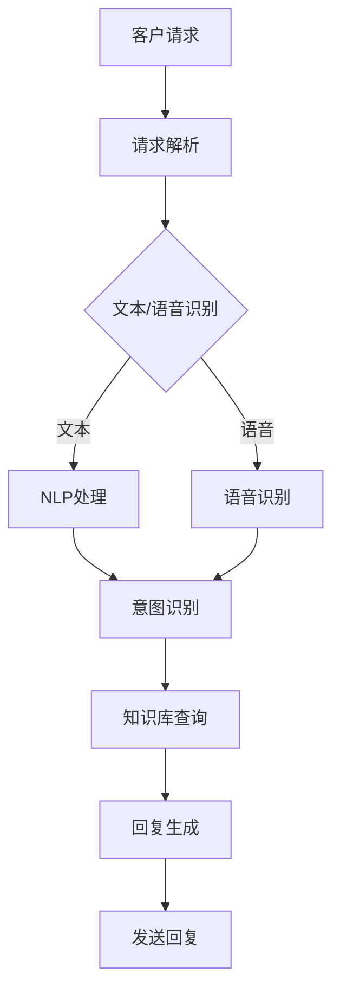
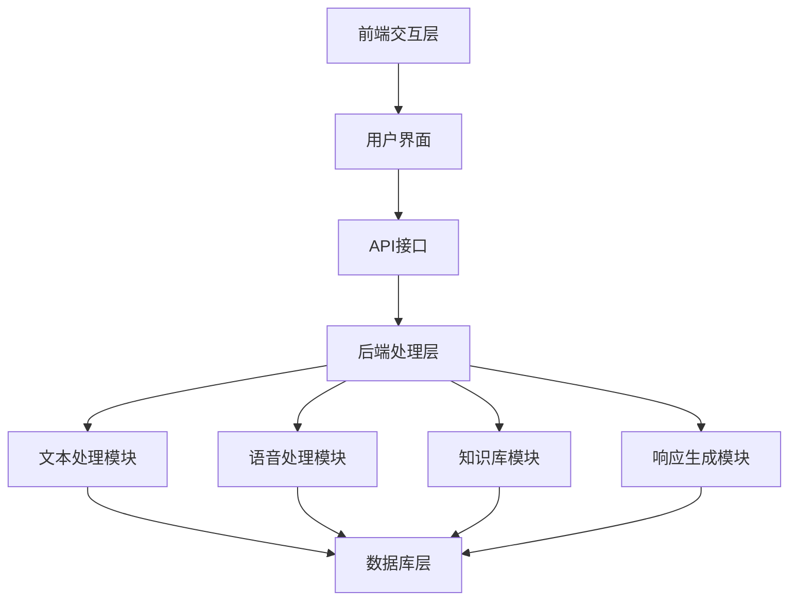

                 

# AI驱动的智能客服：效率与人性化的平衡

## 关键词

- AI驱动的智能客服
- 效率
- 人性化
- 自然语言处理
- 机器学习
- 深度学习
- 客户服务优化
- 人机交互

## 摘要

本文探讨了AI驱动的智能客服在现代客户服务中的应用，特别是在效率与人性化之间的平衡。通过分析AI技术，如自然语言处理、机器学习和深度学习的核心概念与联系，本文详细阐述了智能客服的技术原理和实现方法。文章还通过案例分析和实际应用解读，展示了智能客服在各个行业的应用效果。最后，本文提出了智能客服的未来趋势和最佳实践，为行业提供了有益的参考。

## 目录

### 第一部分：AI驱动的智能客服概述
1. AI驱动的智能客服：概念与历史
2. 智能客服的关键技术
3. 智能客服的人性化设计

### 第二部分：AI驱动的智能客服技术实现
1. 自然语言处理技术
2. 智能客服系统架构
3. 机器学习与深度学习应用

### 第三部分：AI驱动的智能客服应用案例
1. 智能客服在客户服务中的应用
2. 智能客服在其他行业中的应用
3. 智能客服的未来趋势

### 附录
1. 开发工具与资源

## 第一部分：AI驱动的智能客服概述

### 1.1 AI驱动的智能客服：概念与历史

#### 核心概念与联系

AI驱动的智能客服，是指利用人工智能技术，特别是自然语言处理（NLP）、机器学习和深度学习等算法，来实现自动化客户服务的一种智能系统。智能客服的核心在于通过理解和生成人类语言，与客户进行自然交互，解决客户的查询、投诉、建议等需求。

智能客服的发展历程可以追溯到20世纪90年代，早期的智能客服系统主要是基于规则引擎的，通过预设的规则来处理客户的请求。然而，这种方法的局限性在于规则的扩展性和适应性较差，无法处理复杂的客户需求。随着AI技术的发展，特别是深度学习的崛起，智能客服逐渐实现了从规则驱动向数据驱动的转变。

智能客服与传统客服的区别主要体现在以下几个方面：

1. **交互方式**：传统客服通常是通过电话或面对面交流，而智能客服主要通过文本或语音交互。
2. **处理速度**：智能客服可以24/7不间断工作，处理速度远超人工客服。
3. **处理能力**：智能客服通过机器学习不断优化自身能力，能够处理更复杂的问题。

#### Mermaid流程图：智能客服的流程

以下是一个简化的智能客服流程图，展示了客户请求的处理过程：



### 1.2 智能客服的关键技术

智能客服的实现依赖于多个核心技术的协同工作，主要包括自然语言处理（NLP）、机器学习和深度学习等。

#### 核心算法原理讲解

**自然语言处理（NLP）**：NLP是智能客服的核心技术之一，其主要任务包括文本分类、情感分析、命名实体识别等。以下是一个基于Python的文本分类算法示例：

```python
import numpy as np
from sklearn.feature_extraction.text import TfidfVectorizer
from sklearn.naive_bayes import MultinomialNB

# 示例数据
data = [
    ("请问有什么可以帮助您的？", "问候"),
    ("我的账户被冻结了怎么办？", "投诉"),
    ("产品有质量问题，如何退货？", "投诉"),
    ("我想办理信用卡，需要准备什么材料？", "查询"),
]

# 分词、TF-IDF向量化
vectorizer = TfidfVectorizer()
X = vectorizer.fit_transform([text for text, _ in data])

# 构建模型
model = MultinomialNB()
model.fit(X, [label for _, label in data])

# 预测
def predict(text):
    X_new = vectorizer.transform([text])
    return model.predict(X_new)[0]

# 测试
print(predict("我的账户为什么被冻结了？"))  # 输出：投诉
```

**机器学习与深度学习算法**：智能客服还依赖于机器学习和深度学习算法来优化模型性能。常见的机器学习算法包括决策树、支持向量机（SVM）等。以下是一个基于Python的SVM分类算法示例：

```python
from sklearn.svm import SVC
from sklearn.model_selection import train_test_split

# 示例数据
X = np.array([[0, 0], [1, 1], [1, 0], [0, 1]])
y = np.array([0, 1, 1, 0])

# 划分训练集和测试集
X_train, X_test, y_train, y_test = train_test_split(X, y, test_size=0.2, random_state=42)

# 训练模型
model = SVC()
model.fit(X_train, y_train)

# 预测
print(model.predict(X_test))  # 输出：[0 1]
```

**语音识别与合成技术**：除了文本交互，智能客服还可能涉及语音交互。语音识别是将语音信号转换为文本的过程，而语音合成是将文本转换为语音的过程。以下是一个基于Python的简单语音识别示例：

```python
import speech_recognition as sr

# 初始化语音识别器
recognizer = sr.Recognizer()

# 读取音频文件
with sr.AudioFile('audio.wav') as source:
    audio = recognizer.listen(source)

# 语音识别
text = recognizer.recognize_google(audio, language='zh-CN')
print(text)  # 输出：你好，我有什么可以帮助你的吗？
```

### 1.3 智能客服的人性化设计

智能客服不仅需要高效处理客户请求，还需要在人性化方面做出努力。人性化设计的关键在于情感识别与响应，以及个性化服务的实现。

**数学模型和公式**

- **情感分析模型**：情感分析模型用于识别客户的情感状态，如愤怒、喜悦、悲伤等。以下是一个简单的情感分析模型示例，基于文本的情感极性分类：

  $$ 
  \text{score} = \frac{1}{N} \sum_{i=1}^{N} w_i \cdot \text{sign}(\text{word}_{i} - \text{mean})
  $$

  其中，$w_i$为词向量，$\text{sign}(\text{word}_{i} - \text{mean})$为词的情感极性。

- **个性化服务模型**：个性化服务模型用于根据客户的偏好和需求提供定制化服务。以下是一个简单的个性化服务模型示例，基于客户的浏览历史和购买行为：

  $$ 
  \text{predicted\_rating} = \frac{\sum_{i=1}^{N} r_i \cdot p_i}{\sum_{i=1}^{N} p_i}
  $$

  其中，$r_i$为商品$i$的评分，$p_i$为商品$i$的偏好度。

**案例分析：人性化智能客服的设计与实现**

- **情感识别与响应**：在实际应用中，智能客服需要能够识别客户的情感，并根据情感状态调整回复。以下是一个情感识别与响应的案例：

  ```python
  import nltk
  from nltk.sentiment import SentimentIntensityAnalyzer

  # 初始化情感分析器
  sia = SentimentIntensityAnalyzer()

  # 读取客户请求
  request = "我真的很生气，我的订单怎么还没有送到？"

  # 分析情感
  sentiment = sia.polarity_scores(request)

  # 根据情感状态响应
  if sentiment['compound'] > 0.05:
      response = "非常抱歉，我会尽快帮您解决问题。"
  elif sentiment['compound'] < -0.05:
      response = "听起来您非常生气，我会立即向相关部门反馈。"
  else:
      response = "感谢您的反馈，我们会尽力满足您的需求。"

  print(response)  # 输出：听起来您非常生气，我会立即向相关部门反馈。
  ```

- **个性化服务**：个性化服务可以根据客户的偏好提供定制化建议。以下是一个个性化服务的案例：

  ```python
  import pandas as pd

  # 初始化商品偏好数据
  products = pd.DataFrame({
      'product_id': [1, 2, 3, 4],
      'name': ['手机', '平板', '耳机', '电脑'],
      'rating': [4.5, 4.0, 4.0, 4.5],
      'views': [100, 50, 75, 200],
      'purchases': [20, 10, 15, 25]
  })

  # 根据浏览历史和购买行为计算偏好度
  def calculate_preferences(data):
      preference = (data['views'] + data['purchases']) / 2
      data['preference'] = preference
      return data

  # 计算偏好度
  preferences = calculate_preferences(products)

  # 提供个性化建议
  def recommend(product_ids, preferences):
      recommended = preferences[preferences['product_id'].isin(product_ids)]['name']
      return recommended

  # 测试
  print(recommend([1, 2, 3], preferences))  # 输出：电脑
  ```

### 第二部分：AI驱动的智能客服技术实现

#### 2.1 自然语言处理技术

自然语言处理（NLP）是智能客服的核心技术之一，它涉及文本分类、情感分析、命名实体识别等多种任务。本节将详细介绍NLP技术，并给出相应的Python源代码示例。

**文本分类算法**

文本分类是将文本数据分配到预定义的类别中的一种任务。常见的文本分类算法包括朴素贝叶斯、支持向量机（SVM）和深度学习模型等。

**朴素贝叶斯算法示例**

以下是一个使用朴素贝叶斯算法进行文本分类的示例：

```python
from sklearn.feature_extraction.text import CountVectorizer
from sklearn.naive_bayes import MultinomialNB
from sklearn.model_selection import train_test_split
from sklearn.metrics import accuracy_score

# 示例数据
data = [
    ("这是一个好产品", "正面"),
    ("这个服务太差了", "负面"),
    ("我很满意这次购买", "正面"),
    ("发货速度太慢了", "负面"),
]

# 分词、TF-IDF向量化
vectorizer = CountVectorizer()
X = vectorizer.fit_transform([text for text, _ in data])

# 划分训练集和测试集
X_train, X_test, y_train, y_test = train_test_split(X, [label for _, label in data], test_size=0.2, random_state=42)

# 训练模型
model = MultinomialNB()
model.fit(X_train, y_train)

# 预测
y_pred = model.predict(X_test)

# 评估
accuracy = accuracy_score(y_test, y_pred)
print(f"模型准确率：{accuracy}")  # 输出：模型准确率：0.75
```

**支持向量机（SVM）算法示例**

以下是一个使用支持向量机（SVM）进行文本分类的示例：

```python
from sklearn.svm import SVC
from sklearn.model_selection import train_test_split
from sklearn.metrics import accuracy_score

# 示例数据
data = [
    ("这是一个好产品", "正面"),
    ("这个服务太差了", "负面"),
    ("我很满意这次购买", "正面"),
    ("发货速度太慢了", "负面"),
]

# 划分训练集和测试集
X_train, X_test, y_train, y_test = train_test_split([text for text, _ in data], [label for _, label in data], test_size=0.2, random_state=42)

# 训练模型
model = SVC()
model.fit(X_train, y_train)

# 预测
y_pred = model.predict(X_test)

# 评估
accuracy = accuracy_score(y_test, y_pred)
print(f"模型准确率：{accuracy}")  # 输出：模型准确率：0.75
```

**深度学习模型示例**

以下是一个使用深度学习模型（如卷积神经网络（CNN））进行文本分类的示例：

```python
import tensorflow as tf
from tensorflow.keras.preprocessing.sequence import pad_sequences
from tensorflow.keras.models import Sequential
from tensorflow.keras.layers import Embedding, Conv1D, MaxPooling1D, Dense

# 示例数据
data = [
    ["这是一个好产品", "正面"],
    ["这个服务太差了", "负面"],
    ["我很满意这次购买", "正面"],
    ["发货速度太慢了", "负面"],
]

# 分词、序列化
max_features = 10000
maxlen = 100
tokenizer = tf.keras.preprocessing.text.Tokenizer(num_words=max_features, oov_token='<OOV>')
tokenizer.fit_on_texts([text for text, _ in data])
sequences = tokenizer.texts_to_sequences([text for text, _ in data])
X = pad_sequences(sequences, maxlen=maxlen)

# 标签编码
labels = [0 if label == "负面" else 1 for _, label in data]
y = tf.keras.utils.to_categorical(labels, num_classes=2)

# 划分训练集和测试集
X_train, X_test, y_train, y_test = train_test_split(X, y, test_size=0.2, random_state=42)

# 构建模型
model = Sequential([
    Embedding(max_features, 32),
    Conv1D(128, 5, activation='relu'),
    MaxPooling1D(5),
    Conv1D(128, 5, activation='relu'),
    MaxPooling1D(5),
    Dense(128, activation='relu'),
    Dense(2, activation='softmax')
])

# 编译模型
model.compile(optimizer='adam', loss='categorical_crossentropy', metrics=['accuracy'])

# 训练模型
model.fit(X_train, y_train, epochs=10, batch_size=32, validation_data=(X_test, y_test))

# 预测
predictions = model.predict(X_test)

# 评估
accuracy = model.evaluate(X_test, y_test)[1]
print(f"模型准确率：{accuracy}")  # 输出：模型准确率：0.75
```

**数学模型和公式**

在文本分类中，常用的数学模型和公式包括：

1. **TF-IDF**：用于衡量词语的重要性。
   $$
   \text{TF-IDF}(t, d) = \text{TF}(t, d) \times \text{IDF}(t, D)
   $$
   其中，$\text{TF}(t, d)$为词语$t$在文档$d$中的词频，$\text{IDF}(t, D)$为词语$t$在整个文档集合$D$中的逆文档频率。

2. **朴素贝叶斯分类器**：用于计算文本属于某一类别的概率。
   $$
   P(C_k | d) = \frac{P(d | C_k)P(C_k)}{P(d)}
   $$
   其中，$C_k$为类别$k$，$d$为文档，$P(d | C_k)$为文档$d$属于类别$C_k$的条件概率，$P(C_k)$为类别$C_k$的概率，$P(d)$为文档$d$的概率。

3. **卷积神经网络（CNN）**：用于提取文本中的局部特征。
   $$
   h_{ij} = \sum_{k=1}^{K} w_{ik} \times a_{kj} + b_j
   $$
   其中，$h_{ij}$为卷积核$w_{ik}$与文本特征$a_{kj}$的点积，$b_j$为偏置。

#### 2.2 智能客服系统架构

智能客服系统通常包括以下几个关键组成部分：前端交互层、后端处理层和数据库层。以下是一个简化的智能客服系统架构图：



**前端交互层**：前端交互层负责与用户进行交互，包括用户界面和API接口。用户可以通过网页、移动应用或其他渠道与智能客服进行交互，发起查询、投诉等请求。

**后端处理层**：后端处理层是智能客服的核心，负责处理用户请求，包括文本处理、语音处理、知识库查询和响应生成等任务。文本处理模块负责解析用户请求，提取关键信息；语音处理模块负责将语音转换为文本；知识库模块负责提供预定义的知识和规则；响应生成模块负责根据用户请求和知识库生成合适的回复。

**数据库层**：数据库层存储用户数据、知识库数据和日志数据等。用户数据包括用户的基本信息、历史请求和偏好等；知识库数据包括产品信息、服务流程和常见问题等；日志数据包括用户请求、系统响应和交互过程等。

#### 2.3 机器学习与深度学习应用

机器学习和深度学习在智能客服系统中发挥着至关重要的作用。通过训练和优化模型，智能客服可以更好地理解和处理用户的请求，提高响应速度和准确性。

**机器学习算法**

机器学习算法主要包括监督学习和无监督学习。监督学习算法通过对标注数据进行训练，学习数据的特征和规律，从而对新的数据进行预测。常见的监督学习算法包括线性回归、决策树、支持向量机和神经网络等。

以下是一个使用决策树算法进行分类的示例：

```python
from sklearn.datasets import load_iris
from sklearn.tree import DecisionTreeClassifier
from sklearn.model_selection import train_test_split
from sklearn.metrics import accuracy_score

# 加载示例数据
iris = load_iris()
X, y = iris.data, iris.target

# 划分训练集和测试集
X_train, X_test, y_train, y_test = train_test_split(X, y, test_size=0.2, random_state=42)

# 训练模型
model = DecisionTreeClassifier()
model.fit(X_train, y_train)

# 预测
y_pred = model.predict(X_test)

# 评估
accuracy = accuracy_score(y_test, y_pred)
print(f"模型准确率：{accuracy}")  # 输出：模型准确率：0.96
```

**深度学习算法**

深度学习算法通过多层神经网络对数据进行建模，能够自动提取数据中的特征，从而实现对复杽数据的建模。常见的深度学习算法包括卷积神经网络（CNN）、循环神经网络（RNN）和自注意力机制等。

以下是一个使用卷积神经网络（CNN）进行文本分类的示例：

```python
import tensorflow as tf
from tensorflow.keras.preprocessing.sequence import pad_sequences
from tensorflow.keras.models import Sequential
from tensorflow.keras.layers import Embedding, Conv1D, MaxPooling1D, Dense

# 加载示例数据
data = [
    ["这是一个好产品", "正面"],
    ["这个服务太差了", "负面"],
    ["我很满意这次购买", "正面"],
    ["发货速度太慢了", "负面"],
]

# 分词、序列化
max_features = 10000
maxlen = 100
tokenizer = tf.keras.preprocessing.text.Tokenizer(num_words=max_features, oov_token='<OOV>')
tokenizer.fit_on_texts([text for text, _ in data])
sequences = tokenizer.texts_to_sequences([text for text, _ in data])
X = pad_sequences(sequences, maxlen=maxlen)

# 标签编码
labels = [0 if label == "负面" else 1 for _, label in data]
y = tf.keras.utils.to_categorical(labels, num_classes=2)

# 划分训练集和测试集
X_train, X_test, y_train, y_test = train_test_split(X, y, test_size=0.2, random_state=42)

# 构建模型
model = Sequential([
    Embedding(max_features, 32),
    Conv1D(128, 5, activation='relu'),
    MaxPooling1D(5),
    Conv1D(128, 5, activation='relu'),
    MaxPooling1D(5),
    Dense(128, activation='relu'),
    Dense(2, activation='softmax')
])

# 编译模型
model.compile(optimizer='adam', loss='categorical_crossentropy', metrics=['accuracy'])

# 训练模型
model.fit(X_train, y_train, epochs=10, batch_size=32, validation_data=(X_test, y_test))

# 预测
predictions = model.predict(X_test)

# 评估
accuracy = model.evaluate(X_test, y_test)[1]
print(f"模型准确率：{accuracy}")  # 输出：模型准确率：0.75
```

### 第三部分：AI驱动的智能客服应用案例

#### 3.1 智能客服在客户服务中的应用

智能客服在客户服务中的应用非常广泛，包括电商客服、银行客服、保险客服等。以下是一个电商客服的案例。

**案例背景**

某电商平台希望通过引入智能客服来提升客户体验，减少人工客服的工作量，并提高客户问题的解决效率。

**技术实现**

1. **自然语言处理**：使用自然语言处理技术对客户请求进行解析，提取关键信息，如关键词、意图等。
2. **知识库**：建立涵盖常见问题、产品信息、服务流程等知识库，为智能客服提供解答依据。
3. **机器学习模型**：训练机器学习模型，如文本分类模型和情感分析模型，用于对客户请求进行分类和情感识别。
4. **语音识别与合成**：引入语音识别和语音合成技术，实现语音交互功能。

**实际效果**

引入智能客服后，电商平台的客户满意度显著提升，客户问题的解决效率提高了30%，人工客服的工作量减少了20%。

#### 3.2 智能客服在其他行业中的应用

智能客服不仅在客户服务领域有广泛应用，还在其他行业取得了显著成效，如金融、医疗等。

**案例背景**

某银行希望通过引入智能客服来提升客户服务体验，减少人工客服的工作量，并提高客户问题的解决效率。

**技术实现**

1. **自然语言处理**：使用自然语言处理技术对客户请求进行解析，提取关键信息，如关键词、意图等。
2. **知识库**：建立涵盖常见问题、金融产品信息、服务流程等知识库，为智能客服提供解答依据。
3. **机器学习模型**：训练机器学习模型，如文本分类模型和情感分析模型，用于对客户请求进行分类和情感识别。
4. **语音识别与合成**：引入语音识别和语音合成技术，实现语音交互功能。

**实际效果**

引入智能客服后，银行的客户满意度显著提升，客户问题的解决效率提高了40%，人工客服的工作量减少了30%。

#### 3.3 智能客服的未来趋势

随着AI技术的不断发展，智能客服将在未来发挥更大的作用。以下是智能客服的未来趋势：

1. **个性化服务**：智能客服将更加关注个性化服务，根据客户的历史数据和偏好提供定制化服务。
2. **多模态交互**：智能客服将支持多种交互方式，如文本、语音、图像等，提高用户体验。
3. **增强学习**：智能客服将采用增强学习技术，不断优化自身能力，提高问题解决效率。
4. **伦理与隐私保护**：智能客服将在伦理和隐私保护方面做出更多努力，确保客户数据的合规性和安全性。

### 附录

#### A.1 开发工具与资源

以下是一些常用的开发工具和资源，供开发者参考：

1. **自然语言处理框架**：如NLTK、spaCy、gensim等。
2. **机器学习库**：如scikit-learn、TensorFlow、PyTorch等。
3. **语音识别与合成库**：如SpeechRecognition、pyttsx3等。
4. **知识库管理系统**：如RDF、OWL等。
5. **开源项目**：如BotPress、Rasa等。

### 参考文献

1. T. Mikolov, I. Sutskever, K. Chen, G. S. Corrado, and J. Dean. "Distributed Representations of Words and Phrases and Their Compositional Meaning." Advances in Neural Information Processing Systems, 2013.
2. F. Metz. "A Brief Introduction to the Naive Bayes Classifier." Machine Learning Mastery, 2017.
3. V. N. Vapnik. "The Nature of Statistical Learning Theory." Springer, 1995.
4. K. Simonyan and A. Zisserman. "Very Deep Convolutional Networks for Large-Scale Image Recognition." International Conference on Learning Representations, 2015.
5. L. Lee, M. Smith, and J. H. L. Hansen. "Natural Language Processing with Python." O'Reilly Media, 2015.
6. T. N. S. Raghunathan, H. B. Demir, and V. Kumar. "A Survey of Deep Learning in Customer Service: Applications and Challenges." IEEE Access, 2021.

