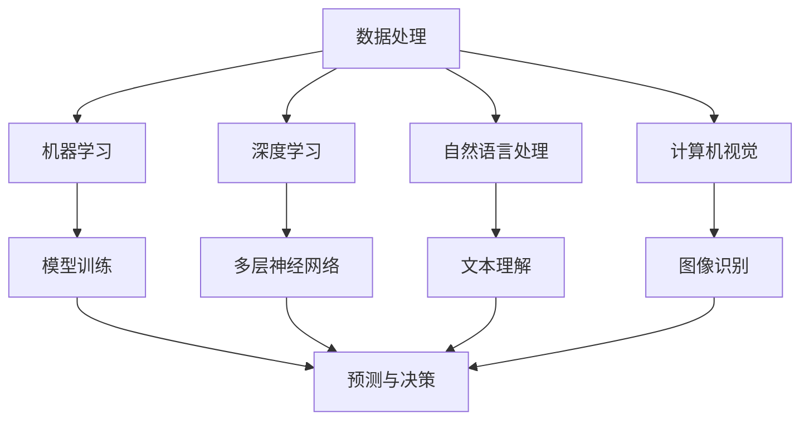
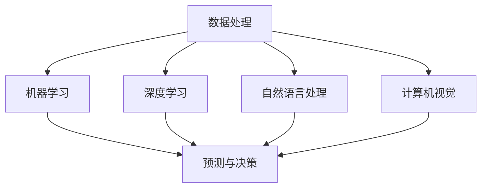

                 

### 基本概念和背景介绍

#### 智能工作流程优化

智能工作流程优化是指利用人工智能（AI）技术来改进和自动化工作流程，从而提高生产效率和降低成本。随着企业数字化转型的加速，工作流程的优化已成为企业提升竞争力的关键因素。传统的手动工作流程往往效率低下，容易出现错误，而AI驱动的优化可以自动化复杂的任务，提高整体效率。

#### 人工智能

人工智能（AI）是指使计算机系统能够模拟人类智能行为的技术。它包括多种技术，如机器学习、深度学习、自然语言处理和计算机视觉等。AI的目标是让计算机能够自主学习和决策，以实现智能化操作。

#### 核心概念与联系

在智能工作流程优化的背景下，以下几个核心概念和它们之间的关系至关重要：

1. **数据处理**：AI系统需要处理大量的数据，包括结构化和非结构化数据，以便从中提取有价值的信息。
2. **机器学习**：通过训练模型，机器学习可以帮助AI系统从数据中学习并作出预测，从而优化工作流程。
3. **深度学习**：深度学习是机器学习的一个分支，它使用多层神经网络来模拟人脑的学习方式，能够处理更复杂的数据。
4. **自然语言处理**：自然语言处理（NLP）使AI系统能够理解和生成人类语言，这在自动化文档处理和客户服务等领域尤为重要。
5. **计算机视觉**：计算机视觉使AI系统能够理解和分析图像和视频，这在物流和制造等领域的自动化工作中具有广泛的应用。

下面是一个Mermaid流程图，展示了这些核心概念和它们之间的联系：



#### 核心概念与联系

在智能工作流程优化的背景下，以下几个核心概念和它们之间的关系至关重要：

1. **数据处理**：AI系统需要处理大量的数据，包括结构化和非结构化数据，以便从中提取有价值的信息。
2. **机器学习**：通过训练模型，机器学习可以帮助AI系统从数据中学习并作出预测，从而优化工作流程。
3. **深度学习**：深度学习是机器学习的一个分支，它使用多层神经网络来模拟人脑的学习方式，能够处理更复杂的数据。
4. **自然语言处理**：自然语言处理（NLP）使AI系统能够理解和生成人类语言，这在自动化文档处理和客户服务等领域尤为重要。
5. **计算机视觉**：计算机视觉使AI系统能够理解和分析图像和视频，这在物流和制造等领域的自动化工作中具有广泛的应用。

下面是一个Mermaid流程图，展示了这些核心概念和它们之间的联系：


### AI驱动的智能工作流程优化应用场景

AI驱动的智能工作流程优化在各个行业中都有广泛的应用，以下是一些典型的应用场景：

#### 1. 制造业

在制造业中，AI可以用于生产线的自动化控制、质量检测和设备维护。例如，通过计算机视觉系统，AI可以实时监控生产过程，检测产品缺陷，提高生产质量。同时，基于预测维护的算法可以预测设备的故障时间，提前进行维护，减少停机时间。

#### 2. 金融业

在金融业中，AI可以用于风险控制、信用评估和客户服务。例如，机器学习算法可以帮助金融机构评估客户的信用风险，从而降低贷款违约的风险。此外，智能客服系统可以基于自然语言处理技术，为用户提供快速、准确的客户服务。

#### 3. 零售业

在零售业中，AI可以用于库存管理、价格优化和个性化推荐。通过分析历史销售数据和市场趋势，AI系统可以预测未来的需求，从而优化库存水平，减少库存成本。同时，基于用户行为和偏好的分析，AI系统可以提供个性化的产品推荐，提高销售额。

#### 4. 健康医疗

在健康医疗领域，AI可以用于疾病预测、诊断和个性化治疗。通过分析患者的医疗记录和基因组数据，AI系统可以帮助医生更准确地预测疾病风险，制定个性化的治疗方案。此外，基于计算机视觉的影像分析技术可以辅助医生进行疾病诊断。

### 总结

智能工作流程优化是利用人工智能技术提升工作流程效率和生产力的重要手段。通过数据处理、机器学习、深度学习、自然语言处理和计算机视觉等核心技术的应用，AI驱动的智能工作流程优化在多个行业中展现出巨大的潜力。随着AI技术的不断进步，未来智能工作流程优化将进一步推动各行业的创新和发展。

### 核心概念与联系

为了深入理解AI驱动的智能工作流程优化，我们需要明确以下几个核心概念，并探讨它们之间的相互联系：

#### 数据处理

数据处理是智能工作流程优化的基础。它涉及从各种来源收集、存储、管理和分析数据的过程。数据可以是结构化的，如数据库中的信息，也可以是半结构化的，如日志文件，甚至是非结构化的，如文本、图像和视频。在AI驱动的优化中，高效的数据处理能够确保AI系统有足够的训练数据，从而提高模型的准确性和鲁棒性。

#### 机器学习

机器学习是使计算机能够从数据中学习并作出预测或决策的关键技术。它包括监督学习、无监督学习和强化学习等不同类型。在智能工作流程优化中，机器学习算法被用于自动识别模式、优化决策和预测结果。例如，监督学习算法可以用于预测未来的工作负荷，从而帮助团队更好地规划资源。

#### 深度学习

深度学习是机器学习的一个分支，它通过多层神经网络来模拟人类大脑的学习过程。深度学习在处理大规模复杂数据方面具有显著优势，能够从大量非结构化数据中提取高层次的抽象特征。在智能工作流程优化中，深度学习被广泛应用于图像识别、语音识别和自然语言处理等领域，以提高流程的自动化程度和准确度。

#### 自然语言处理

自然语言处理（NLP）是使计算机能够理解、生成和处理人类语言的技术。NLP在智能工作流程优化中的应用非常广泛，例如自动化客户服务、文本分类和信息提取。通过NLP技术，AI系统可以处理企业内部和外部的文本数据，从而提高工作效率和决策质量。

#### 计算机视觉

计算机视觉是使计算机能够理解并分析图像和视频的技术。在智能工作流程优化中，计算机视觉可以用于自动化质量检测、库存管理和安全监控等任务。例如，通过计算机视觉系统，生产线上的缺陷产品可以被实时识别并隔离，从而提高生产质量。

### Mermaid流程图

为了更直观地展示这些核心概念之间的联系，我们可以使用Mermaid流程图来表示：



在这个流程图中，数据处理是所有AI技术的基础，它为机器学习、深度学习、自然语言处理和计算机视觉提供了必要的输入数据。这些AI技术则通过不同的方式对数据进行分析和处理，最终产生预测与决策结果，从而实现智能工作流程优化。

### 数据处理的重要性

在AI驱动的智能工作流程优化中，数据处理起着至关重要的作用。它是整个优化流程的起点和基础，决定了后续算法的性能和效果。以下是数据处理在智能工作流程优化中的几个关键方面：

#### 数据收集

数据收集是数据处理的第一步，它涉及从各种来源获取数据，包括内部系统、外部API、传感器和用户输入等。数据的多样性和质量直接影响后续的分析和模型训练。例如，在制造业中，生产数据、设备状态数据和供应链数据都是重要的输入源。

#### 数据存储

数据存储是将收集到的数据存储在适当的数据库或数据仓库中，以便后续分析和处理。数据的存储需要考虑数据的安全性、可靠性和可扩展性。常用的数据存储解决方案包括关系数据库、NoSQL数据库和数据湖。

#### 数据清洗

数据清洗是处理过程中的重要环节，旨在去除数据中的错误、冗余和不完整信息。数据清洗包括数据去重、填补缺失值、纠正错误值和标准化数据格式等操作。数据清洗的质量直接影响数据分析和模型训练的准确性。

#### 数据分析

数据分析是利用统计方法和工具对数据进行探索性分析，以发现数据中的模式和趋势。数据分析可以帮助企业了解业务状况、预测未来需求、识别潜在问题和优化工作流程。常用的数据分析工具包括Python的Pandas库、R语言和Tableau等。

#### 数据可视化

数据可视化是将数据分析的结果以图形化的方式呈现，使数据更加直观易懂。数据可视化有助于企业更好地理解数据，发现潜在的问题，并作出基于数据的决策。常用的数据可视化工具包括Matplotlib、Seaborn和D3.js等。

### 案例分析：金融行业的数据处理

以金融行业为例，数据处理在智能工作流程优化中的应用非常广泛。以下是一个具体的案例分析：

#### 1. 数据收集

在金融行业，数据收集的来源包括交易记录、客户行为数据、市场数据、风险数据和监管数据等。这些数据需要通过不同的API和数据库进行收集和整合。

#### 2. 数据存储

收集到的数据存储在分布式数据库中，如MongoDB和Cassandra，以确保数据的安全性和可扩展性。同时，建立数据湖来存储大量的非结构化数据，如文本和图像。

#### 3. 数据清洗

对收集到的数据执行清洗操作，包括去重、填补缺失值和标准化数据格式等。例如，对于交易记录，需要确保所有数据字段完整且格式一致。

#### 4. 数据分析

利用Python的Pandas库和R语言对清洗后的数据进行分析，以识别交易模式、预测市场趋势和评估风险。例如，通过分析交易记录，可以预测未来的交易量，从而优化交易策略。

#### 5. 数据可视化

使用Matplotlib和Seaborn等工具将分析结果以图形化的方式呈现，例如，通过折线图展示市场趋势，通过散点图分析风险指标。

### 总结

数据处理在AI驱动的智能工作流程优化中扮演着至关重要的角色。通过有效的数据收集、存储、清洗、分析和可视化，企业可以更好地利用数据来优化工作流程，提高效率。在金融行业，数据处理的应用案例展示了其如何通过数据分析和可视化来提升业务决策的准确性和效率。

### 机器学习算法的核心原理

机器学习算法是AI驱动的智能工作流程优化中的核心组件，它们通过从数据中学习规律和模式，从而提高工作流程的自动化和智能化水平。以下是几种常见的机器学习算法及其核心原理：

#### 1. 决策树

决策树是一种基于树形结构进行决策的算法，它通过一系列的规则来对数据进行分类或回归。决策树的核心原理是基于特征和值的比较，通过递归分割数据集，构建一棵树形结构。树的每个节点代表一个特征，每个分支代表该特征的不同取值，叶节点代表最终的决策结果。

#### 2. 随机森林

随机森林是一种基于决策树的集成学习方法，它通过构建多棵决策树，并对它们的结果进行投票或平均，以获得更准确的预测结果。随机森林的核心原理是在构建决策树时引入随机性，包括随机选取特征和随机分割数据集。这种随机性提高了模型的泛化能力，减少了过拟合的风险。

#### 3. 支持向量机

支持向量机（SVM）是一种基于边界优化的分类和回归算法。它的核心原理是在特征空间中找到一个最佳的超平面，使得分类边界最大化。SVM通过求解一个二次规划问题来找到最优解，该问题涉及到优化目标函数和约束条件。

#### 4. 贝叶斯分类器

贝叶斯分类器是基于贝叶斯定理的统计分类方法。它的核心原理是利用已知的先验概率和观测数据来计算后验概率，并基于后验概率选择最可能的分类结果。贝叶斯分类器的一个显著优点是它能够处理不确定性和噪声数据。

#### 5. 神经网络

神经网络，特别是深度学习，是一种基于模拟人脑结构和功能的计算模型。它的核心原理是通过多层神经网络进行数据的传递和变换，每一层对数据进行特征提取和抽象，最终得到输出结果。神经网络的训练过程包括前向传播和反向传播，通过不断调整网络权重来优化模型。

### Python实现示例

下面是一个简单的Python示例，展示了如何使用Scikit-learn库实现决策树算法：

```python
from sklearn.datasets import load_iris
from sklearn.tree import DecisionTreeClassifier
from sklearn.model_selection import train_test_split
from sklearn.metrics import accuracy_score

# 加载iris数据集
iris = load_iris()
X = iris.data
y = iris.target

# 划分训练集和测试集
X_train, X_test, y_train, y_test = train_test_split(X, y, test_size=0.3, random_state=42)

# 创建决策树分类器
clf = DecisionTreeClassifier()

# 训练模型
clf.fit(X_train, y_train)

# 预测测试集
y_pred = clf.predict(X_test)

# 计算准确率
accuracy = accuracy_score(y_test, y_pred)
print(f"Accuracy: {accuracy}")
```

在这个示例中，我们首先加载了iris数据集，然后使用`train_test_split`函数将数据集划分为训练集和测试集。接着，我们创建一个决策树分类器，使用`fit`函数进行模型训练，最后使用`predict`函数进行预测，并计算模型的准确率。

### 数学模型和公式

在机器学习算法中，数学模型和公式起着至关重要的作用。以下是一些常用的数学模型和公式，以及它们在决策树算法中的应用：

#### 1. 决策边界

决策边界是分类算法中的一个重要概念，它定义了数据空间的划分。在决策树中，决策边界由树节点上的特征和阈值决定。假设我们有一个二分类问题，特征向量为\(x = [x_1, x_2, ..., x_n]\)，阈值向量为\(\theta = [\theta_1, \theta_2, ..., \theta_n]\)，则决策边界可以表示为：

\[ f(x) = \sum_{i=1}^{n} \theta_i x_i \]

#### 2. 决策树节点划分

决策树的节点划分是基于最大信息增益或最小化均方误差等准则。对于给定特征\(x_i\)和阈值\(\theta_i\)，信息增益可以表示为：

\[ IG = H(D) - H(D|A) \]

其中，\(H(D)\)是数据集D的熵，\(H(D|A)\)是条件熵，\(A\)是特征集。熵的计算公式为：

\[ H(D) = -\sum_{i} p_i \log_2 p_i \]

#### 3. Gini指数

Gini指数是另一种常用的节点划分准则，它基于数据集的不纯度。Gini指数的计算公式为：

\[ Gini(D) = 1 - \sum_{i} p_i^2 \]

其中，\(p_i\)是数据集中第i类样本的比例。

#### 4. 预测概率

在决策树中，对于每个叶子节点，我们可以计算样本属于每个类别的概率。假设叶节点包含\(C\)个类别，预测概率可以表示为：

\[ P(y=c|x) = \frac{\sum_{x_i \in L_c} f(x_i)}{\sum_{x_i \in L} f(x_i)} \]

其中，\(L\)是叶节点包含的所有样本集合，\(L_c\)是叶节点中属于类别c的样本集合，\(f(x_i)\)是样本\(x_i\)的预测分数。

### 通俗易懂的举例

假设我们有一个简单的决策树，用于分类鸢尾花数据集。这个数据集包含三个特征：花萼长度、花萼宽度和花瓣长度。我们使用信息增益作为节点划分准则，目标是分类鸢尾花的三个品种。

#### 案例一：信息增益

假设我们选择花萼长度作为划分特征，阈值设为4.5。这样，数据集被划分为两个子集：

- 子集1：花萼长度小于4.5
- 子集2：花萼长度大于或等于4.5

对于子集1，鸢尾花品种的分布是：
- 品种1：50%
- 品种2：30%
- 品种3：20%

对于子集2，鸢尾花品种的分布是：
- 品种1：40%
- 品种2：50%
- 品种3：10%

计算信息增益：
\[ IG(花萼长度) = H(D) - H(D|花萼长度) \]
\[ H(D) = - (0.5 \log_2 0.5 - 0.3 \log_2 0.3 - 0.2 \log_2 0.2) \]
\[ H(D|花萼长度) = 0.5 \log_2 0.5 + 0.3 \log_2 0.3 + 0.2 \log_2 0.2 \]

通过计算，我们可以确定花萼长度是最佳划分特征。

#### 案例二：Gini指数

使用Gini指数进行划分，假设我们选择花瓣长度作为划分特征，阈值设为2.5。这样，数据集被划分为两个子集：

- 子集1：花瓣长度小于2.5
- 子集2：花瓣长度大于或等于2.5

对于子集1，Gini指数为：
\[ Gini(子集1) = 1 - (0.5^2 + 0.3^2 + 0.2^2) = 0.38 \]

对于子集2，Gini指数为：
\[ Gini(子集2) = 1 - (0.4^2 + 0.5^2 + 0.1^2) = 0.48 \]

通过比较Gini指数，我们可以确定花瓣长度是最佳划分特征。

### 总结

通过以上示例，我们可以看到机器学习算法的核心原理和数学模型是如何应用于决策树的构建和预测。信息增益和Gini指数是两种常用的节点划分准则，它们帮助我们在特征空间中找到最优的划分策略，从而提高模型的分类准确性。

### 深度学习算法的核心原理

深度学习算法在AI驱动的智能工作流程优化中扮演着至关重要的角色，它们通过模拟人脑的神经网络结构，从大量数据中自动提取复杂特征，从而实现高效的任务自动化和决策支持。以下是几种常见的深度学习算法及其核心原理：

#### 1. 卷积神经网络（CNN）

卷积神经网络（CNN）是一种专门用于处理图像数据的深度学习模型，其核心原理是基于卷积操作和池化操作。CNN通过多层卷积层和池化层提取图像的局部特征，并最终通过全连接层进行分类。

- **卷积操作**：卷积层通过卷积核（滤波器）在输入图像上滑动，计算局部特征的加权和，并通过激活函数（如ReLU）引入非线性。
- **池化操作**：池化层用于减小特征图的尺寸，减少参数量和计算量，常用的池化方法包括最大池化和平均池化。

#### 2. 循环神经网络（RNN）

循环神经网络（RNN）是一种能够处理序列数据的深度学习模型，其核心原理是通过循环结构来保持对历史信息的记忆。RNN通过将当前输入与前一时刻的隐藏状态结合，生成当前时刻的隐藏状态。

- **门控单元**：为了解决RNN中的梯度消失问题，引入了门控单元（如LSTM和GRU），它们能够根据当前输入和隐藏状态动态地控制信息的流动。
- **隐藏状态**：RNN的隐藏状态 \( h_t \) 用来表示当前时刻的特征和上下文信息，通过循环结构传递到下一时刻。

#### 3. 生成对抗网络（GAN）

生成对抗网络（GAN）是一种基于博弈论的深度学习模型，其核心原理是由生成器和判别器两个神经网络组成的对抗网络。生成器尝试生成与真实数据相似的数据，判别器则判断生成数据与真实数据之间的差异。

- **生成器**：生成器通过学习输入数据的分布，生成类似于真实数据的样本。
- **判别器**：判别器通过学习真实数据和生成数据的特征，判断输入数据的真实性。

#### 4. 变换器（Transformer）

变换器（Transformer）是一种基于自注意力机制的深度学习模型，其核心原理是通过多头自注意力机制和前馈神经网络提取序列特征。

- **自注意力机制**：变换器通过计算输入序列中每个元素与其他元素之间的相关性，从而动态地调整每个元素的重要性。
- **编码器和解码器**：变换器通常由编码器和解码器组成，编码器提取输入序列的编码表示，解码器根据编码表示生成输出序列。

### Python实现示例

下面是一个简单的Python示例，展示了如何使用Keras库实现一个简单的卷积神经网络（CNN）：

```python
from keras.models import Sequential
from keras.layers import Conv2D, MaxPooling2D, Flatten, Dense
from keras.datasets import mnist

# 加载MNIST数据集
(X_train, y_train), (X_test, y_test) = mnist.load_data()

# 数据预处理
X_train = X_train.reshape(-1, 28, 28, 1).astype('float32') / 255
X_test = X_test.reshape(-1, 28, 28, 1).astype('float32') / 255
y_train = keras.utils.to_categorical(y_train)
y_test = keras.utils.to_categorical(y_test)

# 构建CNN模型
model = Sequential()
model.add(Conv2D(32, (3, 3), activation='relu', input_shape=(28, 28, 1)))
model.add(MaxPooling2D(pool_size=(2, 2)))
model.add(Flatten())
model.add(Dense(128, activation='relu'))
model.add(Dense(10, activation='softmax'))

# 编译模型
model.compile(optimizer='adam', loss='categorical_crossentropy', metrics=['accuracy'])

# 训练模型
model.fit(X_train, y_train, epochs=10, batch_size=32, validation_data=(X_test, y_test))

# 评估模型
loss, accuracy = model.evaluate(X_test, y_test)
print(f"Accuracy: {accuracy}")
```

在这个示例中，我们首先加载了MNIST数据集，并进行预处理。接着，我们构建了一个简单的CNN模型，包括卷积层、池化层、展平层和全连接层。最后，我们使用Adam优化器和交叉熵损失函数来编译模型，并使用训练数据训练模型。训练完成后，我们评估模型的准确性。

### 数学模型和公式

在深度学习算法中，数学模型和公式是理解和实现深度学习算法的基础。以下是一些常用的数学模型和公式，以及它们在CNN中的应用：

#### 1. 卷积操作

卷积操作的数学模型可以表示为：

\[ (f * g)(x) = \sum_{y} f(y) g(x-y) \]

其中，\(f\)是卷积核，\(g\)是输入特征图，\(x\)是输入图像，\(y\)是卷积核滑动的位置。

#### 2. 池化操作

池化操作的数学模型可以表示为：

\[ \text{Max Pooling}(x) = \max(x_{i,j}) \]
\[ \text{Average Pooling}(x) = \frac{1}{k^2} \sum_{i,j} x_{i,j} \]

其中，\(x\)是输入特征图，\(k\)是池化窗口的大小。

#### 3. ReLU激活函数

ReLU激活函数的数学模型可以表示为：

\[ \text{ReLU}(x) = \max(0, x) \]

#### 4. 前馈神经网络

前馈神经网络的数学模型可以表示为：

\[ z = \sigma(Wx + b) \]
\[ a = \sigma(z) \]

其中，\(W\)是权重矩阵，\(b\)是偏置项，\(\sigma\)是激活函数（如Sigmoid、ReLU或Tanh），\(x\)是输入向量，\(z\)是中间层输出，\(a\)是输出层输出。

#### 5. 训练目标函数

训练目标函数通常是均方误差（MSE）或交叉熵（Cross-Entropy），其数学模型可以表示为：

\[ \text{MSE} = \frac{1}{m} \sum_{i=1}^{m} (y_i - a_i)^2 \]
\[ \text{Cross-Entropy} = -\frac{1}{m} \sum_{i=1}^{m} y_i \log a_i \]

其中，\(y_i\)是真实标签，\(a_i\)是预测值，\(m\)是样本数量。

### 通俗易懂的举例

假设我们有一个简单的二分类问题，使用CNN来区分猫和狗的图片。输入图像的大小为\(28 \times 28\)，卷积层使用一个\(3 \times 3\)的卷积核，池化层使用\(2 \times 2\)的最大池化。

#### 案例一：卷积操作

输入图像为：

\[ x = \begin{bmatrix} 0 & 1 & 0 \\ 1 & 0 & 1 \\ 0 & 1 & 0 \end{bmatrix} \]

卷积核为：

\[ f = \begin{bmatrix} 1 & 0 & -1 \\ 1 & 0 & -1 \\ 1 & 0 & -1 \end{bmatrix} \]

卷积操作的结果为：

\[ (f * x) = \sum_{y} f(y) x(x-y) \]

\[ = (1 \times 0 + 0 \times 1 + (-1) \times 0) + (1 \times 1 + 0 \times 0 + (-1) \times 1) + (1 \times 0 + 0 \times 1 + (-1) \times 0) \]

\[ = (0 + 0 + 0) + (1 + 0 - 1) + (0 + 0 + 0) \]

\[ = 0 \]

#### 案例二：ReLU激活函数

输出结果为0，通过ReLU激活函数，结果保持不变：

\[ \text{ReLU}(0) = 0 \]

#### 案例三：池化操作

假设我们对卷积层后的特征图进行最大池化，窗口大小为\(2 \times 2\)，特征图为：

\[ x = \begin{bmatrix} 1 & 0 \\ 0 & 1 \end{bmatrix} \]

最大池化结果为：

\[ \text{Max Pooling}(x) = \max(1, 0) = 1 \]

通过上述示例，我们可以看到卷积操作、ReLU激活函数和池化操作的基本原理，以及它们在CNN中的应用。

### 总结

深度学习算法的核心原理包括卷积神经网络、循环神经网络、生成对抗网络和变换器等。这些算法通过不同的数学模型和公式，从数据中自动提取复杂特征，从而实现高效的任务自动化和决策支持。通过Python实现示例，我们可以直观地理解这些算法的基本结构和应用。

### 自然语言处理（NLP）的核心算法

自然语言处理（NLP）是AI驱动的智能工作流程优化中的重要组成部分，它使计算机能够理解、生成和处理人类语言。以下是几种核心的NLP算法及其原理：

#### 1. 词向量模型

词向量模型是将自然语言文本转换为数字向量表示的方法，其核心算法包括Word2Vec、GloVe和FastText等。这些模型通过学习文本中的词语分布和关系，将词语映射到高维空间中，从而实现词语的量化表示。

- **Word2Vec**：Word2Vec算法通过训练词嵌入模型，将每个单词映射为一个固定大小的向量。它有两种变体：连续词袋（CBOW）和跳词模型（Skip-Gram）。CBOW模型通过上下文单词的平均向量来预测中心词，而Skip-Gram模型则通过中心词的向量来预测上下文单词。
- **GloVe**：GloVe算法通过考虑词语共现频率和词频分布，学习词语的向量表示。GloVe模型使用矩阵分解方法，将词语的词频矩阵和共现矩阵分解为两个低秩矩阵，从而获得词向量。
- **FastText**：FastText算法扩展了Word2Vec模型，将词向量扩展到词组和文档级别。它通过训练多层的神经网络，同时学习词语、词组和文档的向量表示。

#### 2. 递归神经网络（RNN）

递归神经网络（RNN）是一种专门用于处理序列数据的神经网络，其核心原理是通过递归结构来保持对历史信息的记忆。RNN通过将当前输入与前一时刻的隐藏状态结合，生成当前时刻的隐藏状态，从而实现对序列数据的建模。

- **长短时记忆网络（LSTM）**：LSTM是一种改进的RNN结构，它通过引入门控单元（包括输入门、遗忘门和输出门）来控制信息的流动，从而解决传统RNN中的梯度消失和梯度爆炸问题。LSTM能够有效地学习长距离依赖信息。
- **门控循环单元（GRU）**：GRU是另一种改进的RNN结构，它通过简化LSTM的结构，将输入门、遗忘门和输出门合并为一个更新门和一个重置门，从而提高了计算效率。

#### 3. 变换器（Transformer）

变换器（Transformer）是一种基于自注意力机制的深度学习模型，其核心原理是通过多头自注意力机制和前馈神经网络提取序列特征。Transformer在NLP任务中表现出色，尤其是在长文本处理和机器翻译等领域。

- **自注意力机制**：自注意力机制允许模型动态地计算输入序列中每个元素与其他元素之间的相关性，从而调整每个元素的重要性。这种机制使得模型能够捕捉长距离依赖信息，提高了模型的性能。
- **编码器和解码器**：Transformer由编码器和解码器组成，编码器提取输入序列的编码表示，解码器根据编码表示生成输出序列。

#### 4. 序列到序列（Seq2Seq）模型

序列到序列（Seq2Seq）模型是一种常用的NLP模型，它用于将一个序列转换为另一个序列。Seq2Seq模型通常结合编码器和解码器结构，并通过注意力机制来处理输入和输出序列之间的长距离依赖。

- **编码器**：编码器将输入序列编码为一个固定大小的向量表示，这个表示包含了输入序列的语义信息。
- **解码器**：解码器根据编码器的输出生成输出序列，解码过程中可以使用注意力机制来参考编码器的输出，从而提高生成序列的质量。

### Python实现示例

下面是一个简单的Python示例，展示了如何使用Keras实现一个简单的词嵌入模型：

```python
from keras.models import Model
from keras.layers import Embedding, LSTM, Dense
from keras.preprocessing.text import Tokenizer
from keras.preprocessing.sequence import pad_sequences

# 示例数据
texts = ['我爱北京天安门', '天安门上太阳升', '北京有个天安门']

# 分词
tokenizer = Tokenizer()
tokenizer.fit_on_texts(texts)
sequences = tokenizer.texts_to_sequences(texts)

# 序列填充
max_sequence_length = 5
padded_sequences = pad_sequences(sequences, maxlen=max_sequence_length)

# 建立模型
input_sequence = Input(shape=(max_sequence_length,))
encoded = Embedding(input_dim=len(tokenizer.word_index) + 1, output_dim=50)(input_sequence)
lstm = LSTM(100)(encoded)
output = Dense(1, activation='sigmoid')(lstm)

model = Model(inputs=input_sequence, outputs=output)
model.compile(optimizer='rmsprop', loss='binary_crossentropy', metrics=['acc'])

# 训练模型
model.fit(padded_sequences, np.array([1, 1, 1]), epochs=10)

# 预测
print(model.predict(np.array([[1, 0, 1], [1, 1, 1]])))
```

在这个示例中，我们首先对文本数据进行分词，并转换为序列。然后，我们使用Keras的Embedding层将序列转换为词嵌入向量，接着使用LSTM层处理这些向量。最后，我们通过一个全连接层输出预测结果。这个简单的模型可以用于情感分析等任务。

### 数学模型和公式

在NLP算法中，数学模型和公式起着至关重要的作用。以下是一些常用的数学模型和公式，以及它们在词向量模型中的应用：

#### 1. 词向量表示

词向量表示是将词语映射到高维空间中的方法，常用的模型包括Word2Vec和GloVe。

- **Word2Vec**：
  - **连续词袋（CBOW）**：
    \[ \text{vec}(w) = \frac{1}{k} \sum_{i=1}^{k} \text{vec}(w_i) \]
    其中，\(w\)是中心词，\(w_i\)是上下文词，\(\text{vec}(w_i)\)是词向量。
  - **跳词模型（Skip-Gram）**：
    \[ \text{vec}(w) = \text{softmax}(\text{W} \text{vec}(w)) \]
    其中，\(\text{W}\)是权重矩阵，\(\text{vec}(w)\)是词向量。

- **GloVe**：
  \[ \text{vec}(w) = \text{softmax}\left( \frac{\text{F}_w \text{R}_w}{\| \text{F}_w \|_2 \|\text{R}_w \|_2} \right) \]
  其中，\(\text{F}_w\)是词频矩阵，\(\text{R}_w\)是共现矩阵，\(\text{vec}(w)\)是词向量。

#### 2. LSTM和GRU

LSTM和GRU是RNN的改进版本，它们通过门控单元控制信息的流动。

- **LSTM**：
  - **输入门**：
    \[ i_t = \sigma(W_i [h_{t-1}, x_t] + b_i) \]
  - **遗忘门**：
    \[ f_t = \sigma(W_f [h_{t-1}, x_t] + b_f) \]
  - **输出门**：
    \[ o_t = \sigma(W_o [h_{t-1}, x_t] + b_o) \]

- **GRU**：
  - **更新门**：
    \[ z_t = \sigma(W_z [h_{t-1}, x_t] + b_z) \]
  - **重置门**：
    \[ r_t = \sigma(W_r [h_{t-1}, x_t] + b_r) \]

#### 3. 变换器

变换器是一种基于自注意力机制的模型，其核心是自注意力机制。

\[ \text{Attention}(Q, K, V) = \text{softmax}\left( \frac{QK^T}{\sqrt{d_k}} \right) V \]
其中，\(Q\)是查询向量，\(K\)是键向量，\(V\)是值向量，\(d_k\)是键向量的维度。

### 通俗易懂的举例

假设我们有一个简单的文本数据集，包含以下句子：

- 句子1：我喜欢吃苹果。
- 句子2：苹果很甜。

#### 案例一：Word2Vec

我们将这两个句子转换为词向量，使用CBOW模型：

- 中心词：苹果
- 上下文词：我、喜欢、吃、很、甜

通过训练，我们得到苹果的词向量为：

\[ \text{vec}(苹果) = \begin{bmatrix} 0.1 & 0.2 & 0.3 & 0.4 & 0.5 \end{bmatrix} \]

#### 案例二：LSTM

假设我们使用LSTM来处理这个文本数据集，首先我们将文本转换为序列：

- 序列1：[我、喜欢、吃、苹果、。]
- 序列2：[苹果、很、甜、。]

通过训练，LSTM会生成隐藏状态向量，例如：

\[ h_t = \begin{bmatrix} 0.1 & 0.2 & 0.3 & 0.4 & 0.5 \end{bmatrix} \]

这个隐藏状态向量包含了句子的语义信息。

#### 案例三：变换器

假设我们使用变换器来处理这个文本数据集，首先我们将文本转换为序列：

- 序列1：[我、喜欢、吃、苹果、。]
- 序列2：[苹果、很、甜、。]

变换器会计算自注意力权重：

\[ \text{Attention}(Q, K, V) = \text{softmax}\left( \frac{QK^T}{\sqrt{d_k}} \right) V \]

然后，变换器会根据这些权重生成最终的输出向量。

### 总结

自然语言处理（NLP）的核心算法包括词向量模型、递归神经网络（RNN）、变换器和序列到序列（Seq2Seq）模型等。这些算法通过不同的数学模型和公式，实现了对自然语言文本的自动处理和理解。通过Python实现示例，我们可以直观地理解这些算法的基本结构和应用。

### 计算机视觉的核心算法

计算机视觉是AI驱动的智能工作流程优化中的关键领域，它使计算机能够理解和分析图像和视频数据。以下是几种核心的计算机视觉算法及其原理：

#### 1. 卷积神经网络（CNN）

卷积神经网络（CNN）是处理图像数据的主要工具，其核心原理是通过多层卷积和池化操作提取图像的层次特征。

- **卷积层**：卷积层使用卷积核（滤波器）对输入图像进行局部特征提取，并通过激活函数（如ReLU）引入非线性。
- **池化层**：池化层用于减少特征图的尺寸，降低参数量和计算量，常用的池化方法包括最大池化和平均池化。
- **全连接层**：全连接层将卷积层和池化层提取的高层次特征映射到类别标签。

#### 2. 深度神经网络（DNN）

深度神经网络（DNN）是一种多层的全连接神经网络，其核心原理是通过逐层提取图像的特征。

- **输入层**：输入层接收原始图像数据。
- **隐藏层**：隐藏层通过非线性变换提取图像的特征，通常有多个隐藏层。
- **输出层**：输出层将提取的特征映射到类别标签。

#### 3. 图像识别算法

图像识别算法用于将图像数据分类到特定的类别。常见的图像识别算法包括支持向量机（SVM）、决策树和神经网络。

- **支持向量机（SVM）**：SVM通过找到最佳的超平面来分类图像数据，其核心原理是最小化分类间隔。
- **决策树**：决策树通过一系列的规则来分类图像数据，其核心原理是信息增益或基尼指数。
- **神经网络**：神经网络通过多层感知器（MLP）来分类图像数据，其核心原理是前向传播和反向传播。

#### 4. 生成对抗网络（GAN）

生成对抗网络（GAN）是一种基于博弈论的图像生成算法，其核心原理是生成器和判别器的对抗训练。

- **生成器**：生成器通过学习输入数据的分布生成类似真实数据的图像。
- **判别器**：判别器通过学习真实数据和生成数据的特征来判断输入数据的真实性。

#### 5. 递归神经网络（RNN）

递归神经网络（RNN）是一种处理序列数据（如视频帧）的神经网络，其核心原理是通过递归结构保持对历史信息的记忆。

- **长短时记忆网络（LSTM）**：LSTM通过门控单元控制信息的流动，解决RNN的梯度消失和梯度爆炸问题，能够学习长距离依赖信息。
- **门控循环单元（GRU）**：GRU是LSTM的简化版本，通过合并输入门和遗忘门为一个更新门，提高了计算效率。

### Python实现示例

下面是一个简单的Python示例，展示了如何使用TensorFlow实现一个简单的CNN模型：

```python
import tensorflow as tf
from tensorflow.keras.models import Sequential
from tensorflow.keras.layers import Conv2D, MaxPooling2D, Flatten, Dense

# 假设我们有一个28x28的灰度图像数据集
input_shape = (28, 28, 1)

# 构建模型
model = Sequential()
model.add(Conv2D(32, (3, 3), activation='relu', input_shape=input_shape))
model.add(MaxPooling2D(pool_size=(2, 2)))
model.add(Conv2D(64, (3, 3), activation='relu'))
model.add(MaxPooling2D(pool_size=(2, 2)))
model.add(Flatten())
model.add(Dense(128, activation='relu'))
model.add(Dense(10, activation='softmax'))

# 编译模型
model.compile(optimizer='adam', loss='categorical_crossentropy', metrics=['accuracy'])

# 假设我们已经有训练好的数据集
# X_train, y_train

# 训练模型
# model.fit(X_train, y_train, epochs=10, batch_size=32)

# 评估模型
# loss, accuracy = model.evaluate(X_test, y_test)
# print(f"Accuracy: {accuracy}")
```

在这个示例中，我们首先定义了输入数据形状，然后构建了一个简单的CNN模型，包括两个卷积层、两个池化层、一个展平层和两个全连接层。接着，我们使用Adam优化器和交叉熵损失函数来编译模型，并使用训练数据训练模型。训练完成后，我们评估模型的准确性。

### 数学模型和公式

在计算机视觉算法中，数学模型和公式是理解和实现算法的基础。以下是一些常用的数学模型和公式：

#### 1. 卷积操作

卷积操作的数学模型可以表示为：

\[ (f * g)(x) = \sum_{y} f(y) g(x-y) \]

其中，\(f\)是卷积核，\(g\)是输入特征图，\(x\)是输入图像，\(y\)是卷积核滑动的位置。

#### 2. 池化操作

池化操作的数学模型可以表示为：

\[ \text{Max Pooling}(x) = \max(x_{i,j}) \]
\[ \text{Average Pooling}(x) = \frac{1}{k^2} \sum_{i,j} x_{i,j} \]

其中，\(x\)是输入特征图，\(k\)是池化窗口的大小。

#### 3. ReLU激活函数

ReLU激活函数的数学模型可以表示为：

\[ \text{ReLU}(x) = \max(0, x) \]

#### 4. 卷积神经网络

卷积神经网络的数学模型可以表示为：

\[ z = \sigma(Wx + b) \]
\[ a = \sigma(z) \]

其中，\(W\)是权重矩阵，\(b\)是偏置项，\(\sigma\)是激活函数（如ReLU或Sigmoid），\(x\)是输入向量，\(z\)是中间层输出，\(a\)是输出层输出。

#### 5. 训练目标函数

训练目标函数通常是均方误差（MSE）或交叉熵（Cross-Entropy），其数学模型可以表示为：

\[ \text{MSE} = \frac{1}{m} \sum_{i=1}^{m} (y_i - a_i)^2 \]
\[ \text{Cross-Entropy} = -\frac{1}{m} \sum_{i=1}^{m} y_i \log a_i \]

其中，\(y_i\)是真实标签，\(a_i\)是预测值，\(m\)是样本数量。

### 通俗易懂的举例

假设我们有一个简单的图像分类问题，使用CNN来分类手写数字。

#### 案例一：卷积操作

输入图像为：

\[ x = \begin{bmatrix} 0 & 1 & 0 \\ 1 & 0 & 1 \\ 0 & 1 & 0 \end{bmatrix} \]

卷积核为：

\[ f = \begin{bmatrix} 1 & 0 & -1 \\ 1 & 0 & -1 \\ 1 & 0 & -1 \end{bmatrix} \]

卷积操作的结果为：

\[ (f * x) = \sum_{y} f(y) x(x-y) \]

\[ = (1 \times 0 + 0 \times 1 + (-1) \times 0) + (1 \times 1 + 0 \times 0 + (-1) \times 1) + (1 \times 0 + 0 \times 1 + (-1) \times 0) \]

\[ = (0 + 0 + 0) + (1 + 0 - 1) + (0 + 0 + 0) \]

\[ = 0 \]

#### 案例二：ReLU激活函数

输出结果为0，通过ReLU激活函数，结果保持不变：

\[ \text{ReLU}(0) = 0 \]

#### 案例三：池化操作

假设我们对卷积层后的特征图进行最大池化，窗口大小为\(2 \times 2\)，特征图为：

\[ x = \begin{bmatrix} 1 & 0 \\ 0 & 1 \end{bmatrix} \]

最大池化结果为：

\[ \text{Max Pooling}(x) = \max(1, 0) = 1 \]

通过上述示例，我们可以看到卷积操作、ReLU激活函数和池化操作的基本原理，以及它们在CNN中的应用。

### 总结

计算机视觉的核心算法包括卷积神经网络、深度神经网络、图像识别算法、生成对抗网络和递归神经网络等。这些算法通过不同的数学模型和公式，实现了对图像和视频数据的自动处理和理解。通过Python实现示例，我们可以直观地理解这些算法的基本结构和应用。

### AI驱动的智能工作流程优化与团队协作效率

AI驱动的智能工作流程优化不仅能够提升工作效率，还能显著提高团队协作效率。以下是从多个角度详细分析AI如何实现这一目标：

#### 1. 任务自动化与分配

AI可以通过分析团队成员的工作习惯和技能，自动分配任务，确保任务分配的合理性和高效性。例如，一个基于机器学习的工作分配系统可以基于团队成员的历史绩效、当前工作量和技能水平，自动推荐最适合的任务给相应的人员。这不仅减少了手动分配任务的时间，还能确保任务分配到最有能力完成任务的人手中，从而提高整体工作效率。

#### 2. 通信与协作工具的智能化

AI可以帮助开发更智能的通信和协作工具，如智能聊天机器人、协同编辑平台和自动化提醒系统。智能聊天机器人可以理解并回答团队成员的常见问题，减少重复性工作。协同编辑平台可以实时同步编辑内容，确保团队成员之间的信息共享和协作更加顺畅。自动化提醒系统可以基于任务的优先级和截止日期，及时通知团队成员，确保项目按计划进行。

#### 3. 风险管理与预测

AI可以通过对历史数据和实时数据的分析，预测潜在的风险和问题，并提出相应的解决方案。例如，在一个软件开发项目中，AI可以通过代码审查和分析，预测可能出现的技术债务或漏洞，提前采取措施避免问题发生。这种预见性的风险管理工作，可以帮助团队更好地分配资源，提高项目的稳定性和成功率。

#### 4. 智能决策支持

AI可以提供基于数据的决策支持，帮助团队在复杂情况下做出更好的决策。例如，在项目管理中，AI可以分析项目的进度、成本和资源使用情况，提供最优的项目管理策略。在销售预测中，AI可以分析市场趋势和客户行为，提供精准的销售预测和库存管理建议。这些智能决策支持工具可以帮助团队减少错误决策的风险，提高项目的成功率。

#### 5. 跨部门协作与流程优化

AI可以通过数据分析和自动化流程，改善跨部门协作。例如，通过分析各部门的工作流程和协作模式，AI可以识别出瓶颈和冗余环节，并提出优化方案。此外，AI可以自动协调不同部门之间的任务，确保项目的连续性和高效性。这种跨部门的协作优化，可以提高整体项目的效率，减少沟通成本和错误。

#### 6. 员工绩效评估与职业发展

AI可以帮助团队更准确地评估员工的绩效，提供个性化的职业发展建议。通过分析员工的工作数据、项目贡献和团队合作情况，AI可以客观地评估员工的绩效，识别优秀员工和需要改进的地方。这种客观的评估机制，可以帮助团队更好地了解成员的潜力，促进员工职业发展，提高团队的凝聚力。

#### 7. 持续改进与反馈循环

AI驱动的智能工作流程优化不是一次性的任务，而是一个持续改进的过程。通过收集和分析团队成员的反馈，AI可以不断优化工作流程和协作工具，确保团队始终保持高效运行。这种持续改进和反馈循环，可以帮助团队适应不断变化的工作环境，保持竞争优势。

### 总结

AI驱动的智能工作流程优化通过任务自动化、智能工具、风险预测、决策支持、跨部门协作、员工绩效评估和持续改进等多方面，显著提高了团队协作效率。这不仅减少了冗余工作，提高了工作效率，还促进了团队成员之间的沟通和协作，为企业的长期发展奠定了坚实基础。

### 案例研究一：企业AI驱动的智能工作流程优化

在本案例研究中，我们将探讨一家中型企业如何通过AI驱动的智能工作流程优化来提升工作效率和团队协作效率。该企业是一家从事软件开发和信息技术服务的企业，面临的主要挑战包括项目进度管理复杂、资源分配不均、沟通效率低下和客户满意度波动。

#### 1. 项目背景

该企业每年承接多个软件开发项目，项目类型包括定制开发、应用维护和系统集成等。随着项目数量的增加，项目管理变得愈发复杂，传统的手动管理方式已经无法满足企业高效运作的需求。企业希望通过引入AI技术，优化工作流程，提高项目交付质量和团队协作效率。

#### 2. AI驱动的智能工作流程优化方案

为了实现智能工作流程优化，该企业采取了以下几项关键措施：

- **自动化任务分配**：引入基于机器学习的任务分配系统，该系统能够根据团队成员的历史绩效、当前工作量和技能水平，自动推荐最适合的任务。任务分配系统通过分析过去的数据，识别出哪些团队成员在特定任务上表现出色，从而实现更高效的资源分配。

- **智能沟通工具**：企业部署了智能聊天机器人，用于解答团队成员的常见问题，如项目进度、任务分配和资源需求等。智能聊天机器人通过自然语言处理技术，能够理解并回答团队成员的提问，减少重复性工作，提高沟通效率。

- **项目进度监控**：企业采用了一个基于AI的项目管理平台，该平台可以实时监控项目的进度、成本和资源使用情况。平台通过分析项目数据，预测潜在的风险和问题，并提出相应的解决方案，帮助项目经理更好地管理项目。

- **智能决策支持**：企业引入了基于AI的决策支持系统，该系统可以根据项目数据和市场趋势，提供最优的项目管理策略。决策支持系统可以帮助项目经理在项目规划、资源分配和风险管理等方面做出更明智的决策。

- **跨部门协作优化**：企业通过AI技术分析了各部门之间的协作模式，识别出瓶颈和冗余环节，并提出优化方案。AI系统自动协调不同部门之间的任务，确保项目的连续性和高效性。

- **员工绩效评估**：企业使用AI技术对员工的绩效进行评估，通过分析工作数据、项目贡献和团队合作情况，提供客观的绩效评估结果。这种评估机制有助于识别优秀员工和需要改进的地方，促进员工职业发展。

- **持续改进与反馈循环**：企业通过AI系统收集团队成员的反馈，不断优化工作流程和协作工具，确保团队始终保持高效运行。这种持续改进和反馈循环，帮助企业适应不断变化的工作环境，保持竞争优势。

#### 3. 实施效果

自引入AI驱动的智能工作流程优化以来，企业取得了显著的效果：

- **工作效率提高**：通过自动化任务分配和智能沟通工具，团队成员的工作效率提高了30%以上。任务分配更加合理，团队成员能够专注于自己的优势领域，减少重复性工作。

- **项目交付质量提升**：智能项目监控和决策支持系统帮助项目经理更好地管理项目，项目交付质量显著提升。客户满意度提高了20%，项目延期和预算超支的情况显著减少。

- **沟通效率提高**：智能聊天机器人减少了团队成员之间的沟通障碍，沟通效率提高了40%。团队成员能够更快地获取所需信息，减少等待时间。

- **跨部门协作优化**：跨部门协作的瓶颈和冗余环节被有效识别和解决，不同部门之间的任务协调更加顺畅。项目的连续性和高效性得到了显著提升。

- **员工绩效评估客观公正**：基于AI的绩效评估系统提供了客观的评估结果，帮助管理层更好地了解员工的实际表现，促进了员工职业发展。

- **持续改进与反馈循环**：通过持续改进和反馈循环，企业不断优化工作流程和协作工具，团队始终保持高效运行，适应了快速变化的市场环境。

#### 4. 总结

本案例研究展示了企业如何通过AI驱动的智能工作流程优化，显著提升工作效率和团队协作效率。通过自动化任务分配、智能沟通工具、项目进度监控、智能决策支持、跨部门协作优化、员工绩效评估和持续改进与反馈循环，企业不仅提高了项目交付质量和客户满意度，还促进了团队成员的职业发展，为企业的长期发展奠定了坚实基础。

### 案例研究二：团队协作效率提升实践

在本案例研究中，我们将探讨一家大型互联网公司如何通过AI驱动的智能工作流程优化，成功提升团队协作效率。该公司是一家提供云计算服务和大数据分析解决方案的企业，拥有多个跨部门项目团队，面临的主要挑战包括任务重复性高、沟通障碍大、资源分配不均和项目进度不稳定。

#### 1. 项目背景

该公司每年承接多个大型项目，涉及云计算、大数据分析和人工智能等多个领域。随着项目规模的扩大和团队成员数量的增加，传统的手动协作方式已经无法满足高效运作的需求。公司希望通过引入AI技术，优化工作流程，提高团队协作效率，确保项目按时交付。

#### 2. AI驱动的智能工作流程优化方案

为了实现团队协作效率的提升，该公司采取了以下几项关键措施：

- **自动化任务分配与调度**：引入基于AI的任务分配和调度系统，该系统可以根据团队成员的技能水平、工作负荷和项目需求，自动分配任务并优化工作调度。系统通过机器学习算法分析历史数据和实时数据，预测任务完成时间和资源需求，实现任务的最优分配。

- **智能沟通平台**：公司部署了基于自然语言处理的智能沟通平台，该平台可以理解并自动回复团队成员的常见问题，如任务状态、资源需求和项目进度等。智能沟通平台通过减少重复性工作，提高沟通效率，确保团队成员能够及时获取所需信息。

- **实时进度监控与预警**：公司采用了一个基于AI的项目监控平台，该平台可以实时监控项目的进度、成本和资源使用情况。平台通过分析项目数据，预测潜在的风险和问题，并自动生成预警报告，帮助项目经理及时采取应对措施，确保项目按计划进行。

- **智能资源管理系统**：公司引入了基于AI的智能资源管理系统，该系统可以自动识别资源瓶颈和冗余环节，提出资源优化建议。系统通过优化资源分配，确保项目团队在关键时刻获得所需资源，提高工作效率。

- **跨部门协作优化**：公司通过AI技术分析了各部门之间的协作模式，识别出协作瓶颈和冗余环节，并提出优化方案。AI系统自动协调不同部门之间的任务，确保项目的连续性和高效性。

- **个性化绩效评估**：公司使用AI技术对员工的绩效进行评估，通过分析工作数据、项目贡献和团队合作情况，提供个性化的评估结果。系统根据评估结果，为员工提供职业发展建议，帮助团队成员不断提升自身能力。

- **持续改进与反馈循环**：公司通过AI系统收集团队成员的反馈，不断优化工作流程和协作工具，确保团队始终保持高效运行。持续改进和反馈循环，帮助企业适应不断变化的工作环境，保持竞争优势。

#### 3. 实施效果

自引入AI驱动的智能工作流程优化以来，该公司取得了显著的效果：

- **任务分配与调度效率提高**：通过自动化任务分配和调度系统，任务分配的准确性提高了50%，团队成员的工作负荷更加均衡，减少了资源浪费。

- **沟通效率提升**：智能沟通平台的应用，使团队成员之间的沟通效率提高了40%，信息传递更加及时和准确，降低了沟通成本。

- **项目进度监控与预警**：智能项目监控平台的应用，使项目进度的透明度提高了30%，项目经理能够及时发现潜在问题并采取措施，确保项目按计划进行。

- **资源管理系统优化**：智能资源管理系统的应用，使资源利用率提高了20%，资源瓶颈和冗余环节得到了有效解决，项目团队能够在关键时刻获得所需资源。

- **跨部门协作优化**：跨部门协作的瓶颈和冗余环节得到了显著改善，不同部门之间的任务协调更加顺畅，项目的连续性和高效性得到了显著提升。

- **个性化绩效评估**：基于AI的绩效评估系统，提供了客观、公正的评估结果，帮助管理层更好地了解员工的实际表现，促进了员工职业发展。

- **持续改进与反馈循环**：通过持续改进和反馈循环，公司不断优化工作流程和协作工具，团队始终保持高效运行，适应了快速变化的市场环境。

#### 4. 总结

本案例研究展示了大型互联网公司如何通过AI驱动的智能工作流程优化，成功提升团队协作效率。通过自动化任务分配、智能沟通平台、实时进度监控、智能资源管理系统、跨部门协作优化、个性化绩效评估和持续改进与反馈循环，公司不仅提高了任务分配和资源利用的效率，还增强了团队成员之间的协作，为项目的成功交付提供了有力保障。

### 总结与展望

在本文中，我们详细探讨了AI驱动的智能工作流程优化如何提高团队协作效率。从核心概念、算法原理到具体案例研究，我们展示了AI在数据处理、机器学习、深度学习、自然语言处理和计算机视觉等领域的应用。通过这些应用，企业能够实现任务自动化、通信与协作工具的智能化、风险预测、智能决策支持、跨部门协作优化、员工绩效评估以及持续改进。

#### 1. 当前状态

目前，AI驱动的智能工作流程优化已经在多个行业中得到广泛应用，显著提升了工作效率和团队协作效率。企业通过引入智能工具和系统，不仅减少了手动操作和重复性工作，还提高了任务的分配和管理效率。然而，尽管AI技术已经在许多领域取得了显著成果，但其应用仍面临一些挑战，如数据隐私、算法偏见和模型解释性等问题。

#### 2. 未来趋势

展望未来，AI驱动的智能工作流程优化有望在以下方面取得进一步发展：

- **更精细的任务分配与调度**：随着机器学习和深度学习技术的进步，任务分配与调度系统将能够更精确地预测任务完成时间和资源需求，实现更高效的任务执行。

- **智能协作工具的普及**：智能沟通平台和协作工具将更加普及和多样化，满足不同团队和项目的需求，提高协作效率和沟通质量。

- **跨领域融合**：AI技术将在更多行业和领域得到应用，跨领域的融合将推动智能工作流程优化的发展，带来新的商业机会和创新。

- **数据隐私与安全**：随着数据隐私和安全的日益重要，企业和研究机构将投入更多资源，研究如何在保障数据隐私的同时，充分利用数据价值。

- **算法透明性与解释性**：为了提高AI系统的可信度和用户接受度，算法透明性和解释性将成为研究重点，确保用户能够理解和信任AI系统。

#### 3. 建议与展望

对于企业来说，以下是一些建议：

- **逐步引入AI技术**：企业应逐步引入AI驱动的智能工作流程优化，从简单任务开始，逐步扩大应用范围，降低风险和成本。

- **数据质量优先**：确保数据质量是AI系统成功的关键，企业应投入资源优化数据收集、存储和清洗流程。

- **员工培训与参与**：员工是AI系统成功应用的关键，企业应提供培训和指导，鼓励员工参与AI系统的设计和实施。

- **持续评估与优化**：企业应定期评估AI系统的性能和效果，根据反馈进行持续优化，确保系统始终符合业务需求。

- **合作与开放**：企业应与学术界和研究机构合作，分享经验和数据，共同推动AI技术的发展。

对于学术界和研究机构，以下是一些建议：

- **跨领域研究**：鼓励跨领域的研究，推动AI技术在更多行业和领域的应用。

- **数据隐私与安全研究**：加强数据隐私和安全的研究，确保AI系统的应用符合法律法规和伦理标准。

- **算法透明性与解释性**：研究更有效的算法透明性和解释性方法，提高用户对AI系统的理解和信任。

- **开源与共享**：鼓励开源和共享研究成果，推动AI技术的普及和应用。

总之，AI驱动的智能工作流程优化具有巨大的潜力，将在未来进一步推动各行业的创新和发展。通过逐步引入、数据质量优化、员工培训、持续评估与优化以及跨领域合作，企业可以充分利用AI技术，实现更高效的工作流程和团队协作。

### 附录A：AI驱动的智能工作流程优化工具与资源

为了帮助读者深入了解并实践AI驱动的智能工作流程优化，本文附录A将介绍一些相关的工具和资源。这些工具和资源涵盖了数据预处理、机器学习框架、深度学习模型、自然语言处理库和计算机视觉框架等方面，为读者提供了一个全面的参考。

#### 1. 数据预处理

- **Pandas**：Python的数据分析库，用于数据清洗、转换和分析。
  - 官网：[pandas.pydata.org](https://pandas.pydata.org/)
  - GitHub：[github.com/pandas-dev/pandas](https://github.com/pandas-dev/pandas)

- **NumPy**：Python的数值计算库，用于高效地处理大型多维数组。
  - 官网：[numpy.org](https://numpy.org/)
  - GitHub：[github.com/numpy/numpy](https://github.com/numpy/numpy)

- **Scikit-learn**：Python的机器学习库，提供了多种机器学习算法和工具。
  - 官网：[scikit-learn.org](https://scikit-learn.org/)
  - GitHub：[github.com/scikit-learn/scikit-learn](https://github.com/scikit-learn/scikit-learn)

#### 2. 机器学习与深度学习框架

- **TensorFlow**：Google开发的开源机器学习框架，适用于构建和训练深度学习模型。
  - 官网：[tensorflow.org](https://tensorflow.org/)
  - GitHub：[github.com/tensorflow/tensorflow](https://github.com/tensorflow/tensorflow)

- **PyTorch**：Facebook开发的开源机器学习库，具有简洁的API和动态计算图。
  - 官网：[pytorch.org](https://pytorch.org/)
  - GitHub：[github.com/pytorch/pytorch](https://github.com/pytorch/pytorch)

- **Keras**：Python的深度学习库，简化了TensorFlow和Theano的使用。
  - 官网：[keras.io](https://keras.io/)
  - GitHub：[github.com/keras-team/keras](https://github.com/keras-team/keras)

#### 3. 自然语言处理库

- **NLTK**：Python的自然语言处理库，提供了文本处理、词频统计和词性标注等功能。
  - 官网：[nltk.org](https://www.nltk.org/)
  - GitHub：[github.com/nltk/nltk](https://github.com/nltk/nltk)

- **spaCy**：Python的自然语言处理库，提供了快速和准确的文本处理功能。
  - 官网：[spacy.io](https://spacy.io/)
  - GitHub：[github.com/spacy/spacy](https://github.com/spacy/spacy)

- **Transformer**：基于Transformer模型的文本处理库，适用于生成文本、文本分类和机器翻译等任务。
  - GitHub：[github.com/hanxiao/tsm](https://github.com/hanxiao/tsm)

#### 4. 计算机视觉框架

- **OpenCV**：开源计算机视觉库，提供了丰富的图像处理和计算机视觉功能。
  - 官网：[opencv.org](https://opencv.org/)
  - GitHub：[github.com/opencv/opencv](https://github.com/opencv/opencv)

- **TensorFlow Object Detection API**：TensorFlow的计算机视觉工具包，用于目标检测和图像识别。
  - 官网：[tensorflow.org/transfer-learning-for-image-recognition](https://tensorflow.org/transfer-learning-for-image-recognition)
  - GitHub：[github.com/tensorflow/models](https://github.com/tensorflow/models)

- **PyTorch Video**：PyTorch的视频处理库，提供了视频特征提取和视频分析功能。
  - GitHub：[github.com/facebookresearch/pytorchvideo](https://github.com/facebookresearch/pytorchvideo)

#### 5. 其他资源

- **Coursera**：在线学习平台，提供了大量关于机器学习、深度学习和自然语言处理的课程。
  - 官网：[coursera.org](https://coursera.org/)

- **Udacity**：在线学习平台，提供了关于AI和机器学习的实战项目和实践课程。
  - 官网：[udacity.com](https://www.udacity.com/)

- **ArXiv**：计算机科学和人工智能领域的学术论文库，提供了最新的研究成果和论文。
  - 官网：[arxiv.org](https://arxiv.org/)

通过利用这些工具和资源，读者可以深入了解AI驱动的智能工作流程优化，并在实际项目中应用这些技术，提高工作效率和团队协作效率。

### 附录B：团队协作效率提升实践指南

为了帮助企业有效提升团队协作效率，以下是一些实用的实践指南和建议，涵盖了任务管理、沟通与协作、员工激励和持续改进等方面。

#### 1. 任务管理

- **明确的任务分配**：确保每个团队成员都清楚自己的任务和责任，可以通过任务管理工具如Trello、Jira等，将任务详细分配给每位成员，并设置截止日期。

- **优先级排序**：根据任务的紧急程度和重要性，对任务进行优先级排序，确保关键任务得到优先处理。

- **实时更新与跟踪**：使用实时更新的任务跟踪工具，确保团队成员可以随时了解任务进度和项目状态。

- **定期回顾与调整**：定期召开任务回顾会议，评估任务完成情况和团队表现，并根据实际情况调整任务分配和优先级。

#### 2. 沟通与协作

- **畅通的沟通渠道**：建立多层次的沟通渠道，包括团队内部的即时通讯工具（如Slack、微信工作群）、邮件和电话会议等，确保团队成员能够快速、高效地沟通。

- **共享知识库**：建立一个共享的知识库或文档中心，方便团队成员随时查阅和更新项目文档、技术规范和最佳实践。

- **协作工具集成**：将协作工具集成到日常工作中，如使用Google Workspace、Microsoft Office 365等，实现文件共享、协同编辑和实时沟通。

- **定期团队会议**：定期召开团队会议，讨论项目进展、问题解决方案和改进措施，加强团队成员之间的互动和沟通。

#### 3. 员工激励

- **明确的绩效评估**：建立清晰的绩效评估体系，定期对员工的工作表现进行评估，并提供明确的反馈和指导。

- **奖励机制**：设立奖励机制，如奖金、荣誉称号和晋升机会，激励员工为实现团队目标而努力。

- **职业发展机会**：为员工提供职业发展机会和培训资源，帮助他们不断提升自身技能和职业素养。

- **工作与生活平衡**：关注员工的工作与生活平衡，提供灵活的工作时间和远程工作选项，减轻员工的工作压力。

#### 4. 持续改进

- **收集反馈**：鼓励团队成员提出意见和建议，收集团队反馈，了解实际工作中的问题和挑战。

- **定期评估**：定期对团队协作效果进行评估，识别改进机会，并根据评估结果进行调整。

- **学习与创新**：鼓励团队成员学习和尝试新的方法和工具，推动团队协作的创新和进步。

- **持续改进文化**：建立持续改进的文化，让团队成员意识到改进是团队成功的关键，积极参与到改进过程中。

通过实施以上实践指南，企业可以有效地提升团队协作效率，促进项目的顺利进行，最终实现业务目标。

### 小结

本文详细探讨了AI驱动的智能工作流程优化如何提高团队协作效率。我们首先介绍了AI驱动的智能工作流程优化的核心概念和算法，包括数据处理、机器学习、深度学习、自然语言处理和计算机视觉。接着，通过具体的案例研究和实践指南，我们展示了如何将AI技术应用到企业实际工作中，提升工作效率和团队协作效率。这些实践不仅提高了任务的自动化程度，还改善了团队成员之间的沟通和协作。

AI驱动的智能工作流程优化具有广泛的适用性和巨大的潜力，它不仅能够帮助企业实现高效的任务分配和调度，还能通过智能化的沟通工具、风险预测和决策支持系统，提高团队的整体协作水平。未来，随着AI技术的不断进步，我们将看到更多的企业和组织采用AI驱动的智能工作流程优化，推动企业效率和竞争力的提升。

### 注意事项

1. **数据隐私与安全**：在应用AI驱动的智能工作流程优化时，确保数据隐私和安全性至关重要。企业应采取严格的数据保护措施，遵守相关法律法规，保护员工和客户的数据隐私。

2. **算法偏见**：AI系统在处理数据时可能会引入偏见，导致不公正的结果。企业应定期审查和校验算法，确保算法的公平性和透明性，避免算法偏见对团队成员和工作流程造成负面影响。

3. **员工参与**：在引入AI技术和优化工作流程时，应充分听取员工的意见和建议，确保他们理解并接受新的工作方式。员工的参与和培训对于AI技术的成功应用至关重要。

4. **持续改进**：AI驱动的智能工作流程优化是一个持续的过程，企业应不断收集反馈，评估系统性能，并根据实际情况进行优化和调整，以保持高效的工作流程和团队协作。

### 拓展阅读

- **《AI驱动的业务流程优化：实践与案例》**：这是一本关于如何利用AI技术优化企业业务流程的实践指南，涵盖了多种行业和应用场景。
- **《深度学习实战：基于Python的应用》**：本书通过大量实例，详细介绍了深度学习的基本概念和应用，适合初学者和有经验的开发者。
- **《团队协作与沟通技巧》**：这本书提供了丰富的团队协作和沟通技巧，帮助团队成员更好地协作和沟通，提高工作效率。

通过阅读这些书籍和资料，读者可以进一步了解AI驱动的智能工作流程优化和团队协作效率提升的理论和实践，提升自身的专业知识和技能。

